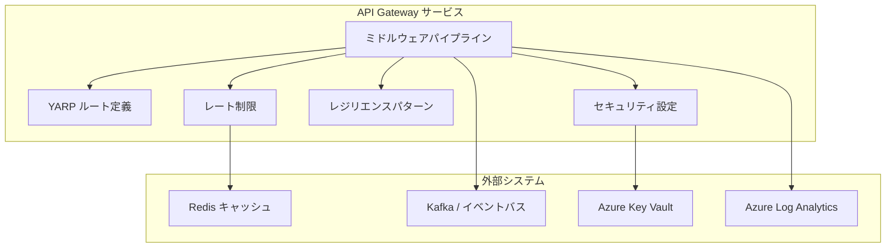
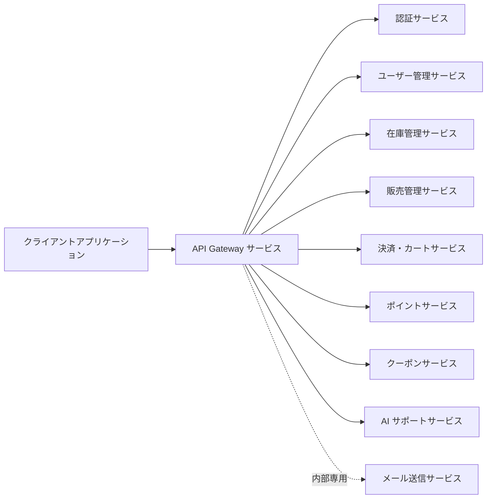

# API Gateway サービス - 詳細設計書

## 1. 概要

API Gateway サービスは、クライアントアプリケーションがスキーショップ EC プラットフォームのバックエンドサービスにアクセスするための統一エントリポイントとなるマイクロサービスである。リクエストルーティング、認証・認可、レート制限、サーキットブレーカー、API ドキュメントを集約レイヤとして提供する。YARP リバースプロキシを基盤とし、高スループットとスケーラビリティを実現する。

## 2. 技術スタック

### 開発環境

- **言語**: C# 14 (.NET 10 LTS)
- **フレームワーク**: ASP.NET Core 10 + YARP リバースプロキシ
- **ビルドツール**: dotnet CLI / MSBuild
- **コンテナ化**: Docker 25.x
- **テスト**: xUnit, NSubstitute, Shouldly, WebApplicationFactory

### 本番環境

- Azure Container Apps
- Azure API Management
- Azure Cache for Redis
- Azure Key Vault

### 主要ライブラリとバージョン

| ライブラリ | バージョン | 用途 |
|---------|---------|---------|
| YARP.ReverseProxy | 2.* | リバースプロキシ基盤 |
| Microsoft.Extensions.Http.Resilience | 9.* | サーキットブレーカー・リトライパターン |
| Microsoft.AspNetCore.Authentication.JwtBearer | 10.* | JWT トークン検証・OAuth2 セキュリティ |
| StackExchange.Redis | 2.* | Redis ベースのレート制限 |
| OpenTelemetry.Extensions.Hosting | 1.* | メトリクス収集 |
| OpenTelemetry.Instrumentation.AspNetCore | 1.* | 分散トレーシング |
| Confluent.Kafka | 2.* | イベントストリーミング |
| Azure.Identity | 1.* | Azure 認証 |
| Azure.Security.KeyVault.Secrets | 4.* | Azure Key Vault 連携 |
| Serilog.AspNetCore | 8.* | 構造化ログ |
| Serilog.Formatting.Compact | 3.* | JSON 構造化ログ出力 |

## 3. システムアーキテクチャ

### コンポーネントアーキテクチャ図



### マイクロサービス関係図



## 4. ルート設定

### API ルートテーブル

| URL パターン | サービス | サービスポート | 認証必須 | 認可ロール |
|-------------|---------|--------------|---------|-----------|
| `/api/auth/**` | AuthService | 5001 | いいえ | なし |
| `/api/users/**` | UserManagementService | 5002 | はい | 認証済みユーザー全般 |
| `/api/products/**` | InventoryManagementService | 5003 | いいえ | なし |
| `/api/inventory/**` | InventoryManagementService | 5003 | はい | ADMIN, MANAGER |
| `/api/orders/**` | SalesManagementService | 5004 | はい | 認証済みユーザー全般 |
| `/api/reports/**` | SalesManagementService | 5004 | はい | ADMIN, MANAGER |
| `/api/cart/items` | PaymentCartService | 5005 | いいえ | なし（ゲスト購入対応: Cookie ベース CartId） |
| `/api/cart/checkout` | PaymentCartService | 5005 | はい | 認証済みユーザー全般 |
| `/api/cart/**` | PaymentCartService | 5005 | はい | 認証済みユーザー全般 |
| `/api/payments/**` | PaymentCartService | 5005 | はい | 認証済みユーザー全般 |
| `/api/points/**` | PointService | 5007 | はい | 認証済みユーザー全般 |
| `/api/coupons/**` | CouponService | 5006 | 一部 | `GET /api/coupons`（公開クーポン検索）は AllowAnonymous、`POST /api/coupons/apply`（クーポン適用）は認証必須 |
| `/api/recommendations/**` | AiSupportService | 5009 | いいえ | なし |
| `/api/search/**` | AiSupportService | 5009 | いいえ | なし |
| `/api/chat/**` | AiSupportService | 5009 | はい | 認証済みユーザー全般 |
| `/api/analytics/**` | AiSupportService | 5009 | はい | ADMIN, MANAGER |
| `/health` | API Gateway サービス | 8080 | いいえ | なし |
| `/health/ready` | API Gateway サービス | 8080 | いいえ | なし |

> **注記**: MailSendService（ポート 5008）は内部専用サービス（Kafka イベント駆動のみ）であり、API Gateway 経由の外部ルーティングは提供しない。

## サービス情報

| 項目 | 値 |
|------|-------|
| サービス名 | ApiGateway |
| ポート | 8080 |
| キャッシュ | Redis |
| フレームワーク | ASP.NET Core 10 + YARP |
| 言語バージョン | C# 14 (.NET 10) |
| アーキテクチャ | マイクロサービス |

## 技術スタック

| カテゴリ | 技術 | バージョン | 用途 |
|----------|-----------|---------|---------|
| ランタイム | .NET | 10 | メインプログラミング言語（C# 14） |
| フレームワーク | ASP.NET Core | 10 | メインアプリケーションフレームワーク |
| API Gateway | YARP | 2.* | リバースプロキシ |
| キャッシュ | Redis | 7.2+ | レート制限・分散キャッシュ |
| メッセージキュー | Apache Kafka | 3.x (Confluent Platform 7.4.0) | イベントストリーミング |
| 認証 | OAuth2/JWT | N/A | トークンベース認証 |
| ビルドツール | dotnet CLI | 10.* | 依存関係管理・ビルド |
| コンテナ | Docker | 25.x | コンテナ化（`latest` タグ禁止） |
| 耐障害性 | Polly | 8.* | リトライ・サーキットブレーカー |
| バリデーション | FluentValidation | 11.* | リクエストバリデーション |
| ログ出力 | Serilog.Sinks.Console | 6.* | コンソールログ出力 |
| ヘルスチェック | AspNetCore.HealthChecks.Redis | 9.* | Redis ヘルスチェック |

## 5. ミドルウェア・フィルタ設定

### ミドルウェアパイプライン登録順序

ASP.NET Core のミドルウェアは登録順序が動作に直結する。以下の順序を厳守すること（spec.md §ミドルウェアパイプライン順序設計 準拠）:

| 順序 | ミドルウェア | 設定 | 用途 |
|------|--------|----------|------|
| 1 | `UseExceptionHandler` | グローバル例外ハンドラ | 最も外側で全例外をキャッチ（RFC 9457 形式で返却） |
| 2 | `UseHsts` / `UseHttpsRedirection` | HSTS + HTTPS 強制 | セキュリティヘッダー付与 |
| 3 | Correlation ID ミドルウェア | `X-Correlation-Id` ヘッダー | トレーシング ID の生成・伝搬・ログ出力 |
| 4 | `UseSerilogRequestLogging` | Serilog リクエストログ | 構造化リクエストログ |
| 5 | `UseCors` | CORS ポリシー | CORS リクエストの処理（認証より前に配置） |
| 6 | `UseAuthentication` / `UseAuthorization` | JWT 検証 + 認可ポリシー | 認証・認可（この順序は絶対） |
| 7 | `UseRateLimiter` | レート制限 | 認証後に配置しユーザー単位の制限を可能に |
| 8 | エンドポイントマッピング | YARP + ヘルスチェック | ルーティング・ヘルスチェックエンドポイント |

> **禁止パターン**: `UseAuthentication` を `UseAuthorization` の後に配置する / `UseExceptionHandler` をパイプライン途中に配置する / `UseCors` を `UseAuthentication` の後に配置する

### Correlation ID ミドルウェア詳細設計

全リクエストに相関 ID を付与し、マイクロサービス間で伝搬・ログ出力する（AGENTS.md §11.2 準拠）:

1. **生成ロジック**: リクエストヘッダー `X-Correlation-Id` が存在すればその値を採用、存在しなければ新規 UUID を生成
2. **レスポンスヘッダー**: `X-Correlation-Id` をレスポンスヘッダーに追加
3. **ログ出力**: `LogContext.PushProperty("CorrelationId", correlationId)` で Serilog のログコンテキストに付与
4. **バックエンド転送**: YARP の `RequestHeaderForwarder` でバックエンドサービスへ `X-Correlation-Id` を自動転送

```csharp
// Correlation ID ミドルウェア実装例
app.Use(async (context, next) =>
{
    var correlationId = context.Request.Headers["X-Correlation-Id"].FirstOrDefault()
        ?? Guid.NewGuid().ToString();
    context.Response.Headers.Append("X-Correlation-Id", correlationId);
    using (LogContext.PushProperty("CorrelationId", correlationId))
    {
        await next();
    }
});
```

### その他のミドルウェア設定

| ミドルウェア | 設定 | 用途 |
|--------|---------------|---------|
| `RequestSizeLimit` | maxSize=5MB | リクエストサイズの制限（画像アップロードパスは別途設定） |
| レスポンスヘッダー | X-Response-Time | パフォーマンスメトリクスの追加 |
| `ForwardedHeaders` | X-Forwarded-Prefix | ルーティング情報の追加 |
| YARP パス変換 | `/api/{segment}/**` → `/{segment}/**` | リクエストパスの書き換え |

## 6. セキュリティ設定

### 認証方式

| 方式 | 実装 | ステータス |
|--------|----------------|--------|
| JWT 検証 | ASP.NET Core JwtBearer 認証 | ✅ 実装済み |
| トークン抽出 | Authorization ヘッダーからの Bearer トークン | ✅ 実装済み |
| トークン転送 | 有効なトークンをマイクロサービスへ転送 | ✅ 実装済み |
| パブリックエンドポイント | 指定パスで認証不要 | ✅ 実装済み |
| CORS サポート | ホワイトリストベースの許可オリジンとメソッド | ✅ 実装済み |

### CORS ポリシー設定

spec.md の Azure Container Apps YAML 定義と整合し、ワイルドカード CORS を禁止する:

| 設定項目 | 値 |
|---------|---|
| `allowedOrigins` | `["https://www.skieshop.com"]`（開発環境: `["http://localhost:3000", "http://localhost:5173"]`） |
| `allowedMethods` | `["GET", "POST", "PUT", "DELETE", "OPTIONS"]` |
| `allowedHeaders` | `["Content-Type", "Authorization", "X-Correlation-Id", "Accept-Language", "X-Request-Id"]` |
| `maxAge` | `3600`（秒） |

### セキュリティレスポンスヘッダー

全レスポンスに以下のセキュリティヘッダーを付与する（spec.md §セキュリティレスポンスヘッダー設計 準拠）:

| ヘッダー | 値 | 目的 |
|---------|---|------|
| `X-Content-Type-Options` | `nosniff` | MIME タイプスニッフィング防止 |
| `X-Frame-Options` | `DENY` | クリックジャッキング防止 |
| `Content-Security-Policy` | `default-src 'self'` | XSS 防止（API サービス用） |
| `Strict-Transport-Security` | `max-age=31536000; includeSubDomains` | HTTPS 強制 |
| `X-XSS-Protection` | `0` | ブラウザ組み込み XSS フィルタを無効化（CSP で代替） |
| `Referrer-Policy` | `strict-origin-when-cross-origin` | リファラー情報の制限 |
| `Permissions-Policy` | `camera=, microphone=, geolocation=` | ブラウザ機能の制限 |

```csharp
// セキュリティヘッダーミドルウェア実装例
app.Use(async (context, next) =>
{
    context.Response.Headers.Append("X-Content-Type-Options", "nosniff");
    context.Response.Headers.Append("X-Frame-Options", "DENY");
    context.Response.Headers.Append("Content-Security-Policy", "default-src 'self'");
    context.Response.Headers.Append("Strict-Transport-Security", "max-age=31536000; includeSubDomains");
    context.Response.Headers.Append("X-XSS-Protection", "0");
    context.Response.Headers.Append("Referrer-Policy", "strict-origin-when-cross-origin");
    context.Response.Headers.Append("Permissions-Policy", "camera=, microphone=, geolocation=");
    await next();
});
```

### セキュリティポリシー

| ポリシー | 設定 | 用途 |
|--------|---------------|---------|
| レート制限 | spec.md §レート制限設計に準拠 | 悪用防止 |
| IP フィルタリング | Azure Front Door / WAF（第一層）+ ASP.NET Core ミドルウェア（第二層） | 悪意ある IP のブロック |
| リクエスト検証 | サイズ、Content-Type | 不正なリクエストの防止 |
| TLS 設定 | TLS 1.3、強力な暗号スイート（Azure Application Gateway で TLS 終端） | 通信の暗号化 |

## 7. サーキットブレーカー設定

### サービス別サーキットブレーカー設定

| サービス | 失敗率しきい値 | タイムアウト | ハーフオープンリクエスト数 | リセットタイムアウト |
|---------|-------------|---------|-------------------|------------|
| AuthService | 50% | 2s | 10 | 30s |
| UserManagementService | 50% | 3s | 5 | 60s |
| InventoryManagementService | 60% | 5s | 10 | 60s |
| SalesManagementService | 50% | 4s | 10 | 60s |
| PaymentCartService | 30% | 10s | 5 | 120s |
| PointService | 50% | 3s | 5 | 60s |
| CouponService | 60% | 3s | 10 | 45s |
| AiSupportService | 70% | 5s | 10 | 30s |

### サーキットブレーカー Open 時のフォールバック戦略

AGENTS.md §耐障害性の規定に基づき、各サービスの障害時フォールバックを定義する:

| サービス | フォールバック戦略 | レスポンス |
|---------|---------------|----------|
| AuthService | 503 即時返却 | 認証は代替不可のため即座にエラー返却 |
| InventoryManagementService | Redis キャッシュ応答 | 最新の商品一覧キャッシュを返却 |
| SalesManagementService | 503 即時返却 | 注文データは代替不可 |
| PaymentCartService | 503 即時返却 | 決済は安全性優先で即座にエラー返却 |
| CouponService | デフォルト値（クーポンなし） | クーポン適用なしで処理継続 |
| PointService | デフォルト値（0 ポイント） | ポイント残高 0 で表示 |
| AiSupportService | 人気商品の静的リスト | AI レコメンドの代わりに人気商品リストを返却 |
| UserManagementService | 503 即時返却 | ユーザーデータは代替不可 |

## 8. レート制限設定

### レート制限ポリシー

spec.md §レート制限設計に準拠し、`AddRateLimiter` で実装する。429 Too Many Requests レスポンスには `Retry-After` ヘッダー（秒数）を付与する。レート制限カウンターは Redis に保存し、API Gateway の全レプリカで共有する。

| カテゴリ | 対象 | アルゴリズム | 閾値 | キーリゾルバ | 備考 |
|---------|------|-----------|------|----------|------|
| IP ベース | 未認証リクエスト | Token Bucket | 60 req/min | IP アドレス（`X-Forwarded-For` 検証） | DDoS 軽減 |
| ユーザーベース | 認証済みリクエスト | Token Bucket | 120 req/min | ユーザー ID（JWT `sub` クレーム） | 一般ユーザー制限 |
| エンドポイント別 | `POST /auth/login` | Fixed Window | 5 req/min/IP | IP アドレス | ブルートフォース防止 |
| エンドポイント別 | `POST /checkout/*` | Fixed Window | 10 req/min/user | ユーザー ID | 決済 API の過負荷防止 |
| エンドポイント別 | `GET /products` | Token Bucket | 300 req/min/IP | IP アドレス | スクレイピング防止 |

> **多層防御**: Azure Front Door / WAF による DDoS 防御を第一層として併用する。

## 9. 監視と可観測性

### ヘルスチェック

| エンドポイント | 用途 | チェック対象の依存関係 |
|----------|---------|------|
| `/health` | コンテナ再起動判定（Liveness） | アプリケーション起動状態 |
| `/health/ready` | トラフィックルーティング判定（Readiness） | Redis、バックエンドサービス |

### メトリクス収集

```yaml
ゲートウェイメトリクス:
  - gateway.requests.total: サービス・ステータスタグ付きリクエスト総数カウンター
  - gateway.requests.duration: パーセンタイル付きリクエスト所要時間ヒストグラム
  - gateway.circuit_breaker.state: サービスごとのサーキットブレーカー状態
  - gateway.circuit_breaker.calls: サーキットブレーカー呼び出し結果（成功/失敗）
  - gateway.rate_limiter.limited: レート制限イベントカウンター
  - gateway.rate_limiter.capacity_used: レート制限容量使用率

システムメトリクス:
  - dotnet.gc.collections: GC コレクション数
  - dotnet.threadpool.threads_count: スレッドプール状態
  - process.cpu.usage: CPU 使用率
  - system.load.average.1m: システム負荷
```

### ログ設定

```yaml
ログレベル:
  SkiShop.ApiGateway: Information
  Yarp.ReverseProxy: Information
  Microsoft.AspNetCore.Authentication: Information

ログパターン（Serilog CompactJsonFormatter で出力）:
  - timestamp: ISO-8601 形式
  - level: ログレベル
  - thread: スレッド名
  - traceId: 分散トレーシング用
  - spanId: 分散トレーシング用
  - correlationId: X-Correlation-Id ヘッダーから伝搬
  - logger: ロガー名
  - message: ログメッセージ
  - exception: 例外時のスタックトレース
```

### センシティブデータマスキング（PII フィルタリング）

API Gateway は全リクエストを通過するため、以下のデータがログに出力されないようマスキングを実施する（AGENTS.md §5.7 準拠）:

| マスキング対象 | 方法 |
|-------------|------|
| `Authorization` ヘッダー（JWT トークン） | Serilog Destructuring Policy で `Bearer ***` に置換 |
| `Cookie` ヘッダー | ログ出力から除外 |
| リクエストボディ（`/auth/login`） | パスワードフィールドをマスク |
| メールアドレス | 部分マスク（`u***@example.com`） |
| IP アドレス | レート制限ログのみ記録、一般ログには出力しない |

## 10. デプロイ設定

### Docker 設定

```dockerfile
# .NET マイクロサービス用マルチステージビルド
FROM mcr.microsoft.com/dotnet/sdk:10.0 AS build
WORKDIR /src
COPY ["ApiGateway/ApiGateway.csproj", "ApiGateway/"]
RUN dotnet restore "ApiGateway/ApiGateway.csproj"
COPY . .
WORKDIR "/src/ApiGateway"
RUN dotnet publish "ApiGateway.csproj" -c Release -o /app/publish --no-restore

FROM mcr.microsoft.com/dotnet/aspnet:10.0 AS runtime
WORKDIR /app

# 非 root ユーザーでアプリケーションを実行
RUN groupadd -r skishop && useradd -r -g skishop -d /app skishop
COPY --from=build --chown=skishop:skishop /app/publish .
USER skishop

ENV ASPNETCORE_ENVIRONMENT=Production
ENV DOTNET_RUNNING_IN_CONTAINER=true

# ヘルスチェック
HEALTHCHECK --interval=30s --timeout=10s --start-period=30s --retries=3 \
  CMD curl -f http://localhost:8080/health || exit 1

EXPOSE 8080

ENTRYPOINT ["dotnet", "ApiGateway.dll"]
```

### 環境変数

```bash
# サーバー設定
ASPNETCORE_URLS=http://+:8080
ASPNETCORE_ENVIRONMENT=Production

# Redis 設定
Redis__ConnectionString=${REDIS_HOST}:${REDIS_PORT},password=${REDIS_PASSWORD}

# Azure 設定（Managed Identity 前提: DefaultAzureCredential 使用）
AZURE_TENANT_ID=${AZURE_TENANT_ID}
AZURE_CLIENT_ID=${AZURE_CLIENT_ID}
# AZURE_CLIENT_SECRET は Managed Identity 使用のため不要。開発環境では `az login` / `dotnet user-secrets` を使用
Azure__KeyVault__Uri=${AZURE_KEYVAULT_URI}

# サービス URL
# 本番環境では Azure Container Apps の内部 DNS で自動解決。
# 以下は .NET Aspire 非使用環境でのフォールバック設定例。
# .NET Aspire 使用時は WithReference で自動解決されるため不要。
Services__AuthService=http://auth-service:5001
Services__UserManagementService=http://user-management-service:5002
Services__InventoryManagementService=http://inventory-management-service:5003
Services__SalesManagementService=http://sales-management-service:5004
Services__PaymentCartService=http://payment-cart-service:5005
Services__CouponService=http://coupon-service:5006
Services__PointService=http://point-service:5007
Services__MailSendService=http://mailsend-service:5008
Services__AiSupportService=http://ai-support-service:5009

# セキュリティ設定
Jwt__Issuer=${JWT_ISSUER_URI}
Jwt__JwkSetUri=${JWT_JWK_SET_URI}

# ログ・監視
Serilog__MinimumLevel__Default=Warning
Serilog__MinimumLevel__Override__SkiShop=Information
```

## 11. エラーハンドリング

### エラーコード定義

| エラーコード | 説明 | HTTP ステータス |
|------------|-------------|-------------|
| GW-4001 | 無効な認証トークン | 401 Unauthorized |
| GW-4002 | 認可が必要 | 403 Forbidden |
| GW-4003 | トークン期限切れ | 401 Unauthorized |
| GW-4004 | ルートが見つからない | 404 Not Found |
| GW-4005 | メソッド不許可 | 405 Method Not Allowed |
| GW-4006 | サポートされていないメディアタイプ | 415 Unsupported Media Type |
| GW-4007 | 必須ヘッダーの欠如 | 400 Bad Request |
| GW-4008 | 無効なリクエスト形式 | 400 Bad Request |
| GW-4291 | レート制限超過 | 429 Too Many Requests |
| GW-5001 | ゲートウェイタイムアウト | 504 Gateway Timeout |
| GW-5002 | サーキットブレーカーオープン | 503 Service Unavailable |
| GW-5003 | バックエンドサービスエラー | 502 Bad Gateway |
| GW-5004 | ゲートウェイ内部エラー | 500 Internal Server Error |

### グローバルエラーレスポンス形式

RFC 9457 Problem Details に準拠し、`TypedResults.Problem()` ベースのエラーレスポンスを返却する（ADR-0007 準拠）:

```json
{
  "type": "https://tools.ietf.org/html/rfc9110#section-15.5.2",
  "title": "Unauthorized",
  "status": 401,
  "detail": "無効な認証トークンです",
  "instance": "/api/users/profile",
  "extensions": {
    "code": "GW-4001",
    "traceId": "0af7651916cb6006"
  }
}
```

```csharp
// グローバル例外ハンドラー（Program.cs）— RFC 9457 準拠
app.UseExceptionHandler(exceptionHandlerApp =>
{
    exceptionHandlerApp.Run(async context =>
    {
        var logger = context.RequestServices.GetRequiredService<ILogger<Program>>();
        var feature = context.Features.Get<IExceptionHandlerFeature>();
        var error = feature?.Error;

        if (error is not (NotFoundException or BusinessException))
            logger.LogError(error, "Unhandled exception: {Message}", error?.Message);
        else
            logger.LogWarning("Handled exception: {ExceptionType} - {Message}",
                error.GetType().Name, error.Message);

        var problem = error switch
        {
            NotFoundException e    => TypedResults.Problem(e.Message, statusCode: 404),
            BusinessException e    => TypedResults.Problem(e.Message, statusCode: 422),
            _                      => TypedResults.Problem("内部エラーが発生しました", statusCode: 500)
        };
        await problem.ExecuteAsync(context);
    });
});
```

> **注意**: スタックトレースをクライアントに返さない（`appsettings.json`: `"DetailedErrors": false`）。エラーメッセージの i18n は `Accept-Language` ヘッダーに基づくメッセージ切替で対応する。
```

## 12. パフォーマンスと最適化

### キャッシュ戦略

- **Redis キャッシュ**:
  - レート制限カウンター（TTL: 1 分）
  - ルート定義（TTL: 60 分）
  - 認証検証結果（TTL: 5 分）

- **認証キャッシュ無効化戦略**:
  - Kafka イベント `user.permission_changed` 受信時に該当ユーザーの認証キャッシュを即時削除
  - ユーザーログアウト時（`user.logged_out` イベント）にトークンハッシュを無効化リストに追加
  - TTL を 5 分に設定し、セキュリティリスクを最小化

- **キャッシュキー設計**:
  - レート制限: `rate:{userId/ip}:{endpoint}`
  - ルートキャッシュ: `route:{path}`
  - 認証キャッシュ: `auth:{tokenHash}`

### パフォーマンスメトリクス

| メトリクス | 目標 | 現状 | 監視 |
|--------|--------|---------|------------|
| リクエストレイテンシ（平均） | < 30ms | 30ms 平均 | OpenTelemetry |
| リクエストレイテンシ（p95） | < 50ms | — | OpenTelemetry |
| リクエストレイテンシ（p99） | < 100ms | — | OpenTelemetry |
| スループット | > 1000 req/s | 1200 req/s | OpenTelemetry |
| エラー率 | < 0.1% | 0.05% | OpenTelemetry |
| サーキットブレーカーオープン時間 | < 1% | 0.5% | OpenTelemetry |
| レート制限リクエスト | < 0.5% | 0.2% | OpenTelemetry |

> **spec.md との整合性**: spec.md の Saga レイテンシバジェットでは API Gateway 通過を 30ms（処理 20ms + オーバーヘッド 10ms）と定義。全体 API p95 は 300ms 以内。

## 13. YARP リバースプロキシ設定

### appsettings.json の `ReverseProxy` セクション設定例

```json
{
  "ReverseProxy": {
    "Routes": {
      "auth-route": {
        "ClusterId": "auth-cluster",
        "AuthorizationPolicy": "anonymous",
        "Match": { "Path": "/api/auth/{**catch-all}" },
        "Transforms": [{ "PathRemovePrefix": "/api" }]
      },
      "products-route": {
        "ClusterId": "inventory-cluster",
        "AuthorizationPolicy": "anonymous",
        "Match": { "Path": "/api/products/{**catch-all}" },
        "Transforms": [{ "PathRemovePrefix": "/api" }]
      },
      "inventory-route": {
        "ClusterId": "inventory-cluster",
        "AuthorizationPolicy": "AdminOrManager",
        "Match": { "Path": "/api/inventory/{**catch-all}" },
        "Transforms": [{ "PathRemovePrefix": "/api" }]
      },
      "orders-route": {
        "ClusterId": "sales-cluster",
        "AuthorizationPolicy": "default",
        "Match": { "Path": "/api/orders/{**catch-all}" },
        "Transforms": [{ "PathRemovePrefix": "/api" }]
      },
      "cart-items-route": {
        "ClusterId": "payment-cart-cluster",
        "AuthorizationPolicy": "anonymous",
        "Match": { "Path": "/api/cart/items", "Methods": ["POST"] },
        "Transforms": [{ "PathRemovePrefix": "/api" }]
      },
      "cart-checkout-route": {
        "ClusterId": "payment-cart-cluster",
        "AuthorizationPolicy": "default",
        "Match": { "Path": "/api/cart/checkout" },
        "Transforms": [{ "PathRemovePrefix": "/api" }]
      },
      "cart-route": {
        "ClusterId": "payment-cart-cluster",
        "AuthorizationPolicy": "default",
        "Match": { "Path": "/api/cart/{**catch-all}" },
        "Transforms": [{ "PathRemovePrefix": "/api" }]
      },
      "payments-route": {
        "ClusterId": "payment-cart-cluster",
        "AuthorizationPolicy": "default",
        "Match": { "Path": "/api/payments/{**catch-all}" },
        "Transforms": [{ "PathRemovePrefix": "/api" }]
      },
      "points-route": {
        "ClusterId": "points-cluster",
        "AuthorizationPolicy": "default",
        "Match": { "Path": "/api/points/{**catch-all}" },
        "Transforms": [{ "PathRemovePrefix": "/api" }]
      },
      "coupons-public-route": {
        "ClusterId": "coupons-cluster",
        "AuthorizationPolicy": "anonymous",
        "Match": { "Path": "/api/coupons", "Methods": ["GET"] },
        "Transforms": [{ "PathRemovePrefix": "/api" }]
      },
      "coupons-apply-route": {
        "ClusterId": "coupons-cluster",
        "AuthorizationPolicy": "default",
        "Match": { "Path": "/api/coupons/apply", "Methods": ["POST"] },
        "Transforms": [{ "PathRemovePrefix": "/api" }]
      },
      "coupons-route": {
        "ClusterId": "coupons-cluster",
        "AuthorizationPolicy": "default",
        "Match": { "Path": "/api/coupons/{**catch-all}" },
        "Transforms": [{ "PathRemovePrefix": "/api" }]
      },
      "ai-recommendations-route": {
        "ClusterId": "ai-cluster",
        "AuthorizationPolicy": "anonymous",
        "Match": { "Path": "/api/recommendations/{**catch-all}" },
        "Transforms": [{ "PathRemovePrefix": "/api" }]
      },
      "ai-chat-route": {
        "ClusterId": "ai-cluster",
        "AuthorizationPolicy": "default",
        "Match": { "Path": "/api/chat/{**catch-all}" },
        "Transforms": [{ "PathRemovePrefix": "/api" }]
      },
      "users-route": {
        "ClusterId": "user-cluster",
        "AuthorizationPolicy": "default",
        "Match": { "Path": "/api/users/{**catch-all}" },
        "Transforms": [{ "PathRemovePrefix": "/api" }]
      },
      "reports-route": {
        "ClusterId": "sales-cluster",
        "AuthorizationPolicy": "AdminOrManager",
        "Match": { "Path": "/api/reports/{**catch-all}" },
        "Transforms": [{ "PathRemovePrefix": "/api" }]
      },
      "ai-search-route": {
        "ClusterId": "ai-cluster",
        "AuthorizationPolicy": "anonymous",
        "Match": { "Path": "/api/search/{**catch-all}" },
        "Transforms": [{ "PathRemovePrefix": "/api" }]
      },
      "ai-analytics-route": {
        "ClusterId": "ai-cluster",
        "AuthorizationPolicy": "AdminOrManager",
        "Match": { "Path": "/api/analytics/{**catch-all}" },
        "Transforms": [{ "PathRemovePrefix": "/api" }]
      }
    },
    "Clusters": {
      "auth-cluster": {
        "Destinations": {
          "destination1": { "Address": "http://auth-service:5001" }
        },
        "HealthCheck": {
          "Active": { "Enabled": true, "Interval": "00:00:30", "Path": "/health" }
        },
        "LoadBalancingPolicy": "RoundRobin"
      },
      "user-cluster": {
        "Destinations": {
          "destination1": { "Address": "http://user-management-service:5002" }
        },
        "HealthCheck": {
          "Active": { "Enabled": true, "Interval": "00:00:30", "Path": "/health" }
        },
        "LoadBalancingPolicy": "RoundRobin"
      },
      "inventory-cluster": {
        "Destinations": {
          "destination1": { "Address": "http://inventory-management-service:5003" }
        },
        "HealthCheck": {
          "Active": { "Enabled": true, "Interval": "00:00:30", "Path": "/health" }
        },
        "LoadBalancingPolicy": "RoundRobin"
      },
      "sales-cluster": {
        "Destinations": {
          "destination1": { "Address": "http://sales-management-service:5004" }
        },
        "HealthCheck": {
          "Active": { "Enabled": true, "Interval": "00:00:30", "Path": "/health" }
        },
        "LoadBalancingPolicy": "RoundRobin"
      },
      "payment-cart-cluster": {
        "Destinations": {
          "destination1": { "Address": "http://payment-cart-service:5005" }
        },
        "HealthCheck": {
          "Active": { "Enabled": true, "Interval": "00:00:30", "Path": "/health" }
        },
        "LoadBalancingPolicy": "RoundRobin"
      },
      "coupons-cluster": {
        "Destinations": {
          "destination1": { "Address": "http://coupon-service:5006" }
        },
        "LoadBalancingPolicy": "RoundRobin"
      },
      "points-cluster": {
        "Destinations": {
          "destination1": { "Address": "http://point-service:5007" }
        },
        "LoadBalancingPolicy": "RoundRobin"
      },
      "ai-cluster": {
        "Destinations": {
          "destination1": { "Address": "http://ai-support-service:5009" }
        },
        "LoadBalancingPolicy": "RoundRobin"
      }
    }
  }
}
```

> **注記**: 上記の Destinations アドレスは .NET Aspire 非使用環境でのフォールバック設定例。.NET Aspire 使用時は `WithReference` によるサービスディスカバリで自動解決される。

## 14. Program.cs 構成設計

### DI 登録・ミドルウェア構成の全体設計

```csharp
// Program.cs — API Gateway エントリポイント
var builder = WebApplication.CreateBuilder(args);

// ===== DI 登録セクション =====

// Serilog 設定
builder.Host.UseSerilog((context, loggerConfig) =>
    loggerConfig
        .ReadFrom.Configuration(context.Configuration)
        .Enrich.FromLogContext()
        .Enrich.WithProperty("ServiceName", "ApiGateway")
        .WriteTo.Console(new CompactJsonFormatter()));

// YARP リバースプロキシ
builder.Services.AddReverseProxy()
    .LoadFromConfig(builder.Configuration.GetSection("ReverseProxy"));

// 認証・認可（FallbackPolicy で全エンドポイントに認証必須、AllowAnonymous で明示的に除外）
builder.Services.AddAuthentication(JwtBearerDefaults.AuthenticationScheme)
    .AddJwtBearer(options =>
    {
        options.TokenValidationParameters = new TokenValidationParameters
        {
            ValidateIssuer = true,
            ValidateAudience = true,
            ValidateLifetime = true,
            ValidateIssuerSigningKey = true,
            ClockSkew = TimeSpan.FromMinutes(5)
        };
    });

builder.Services.AddAuthorization(options =>
{
    options.AddPolicy("AdminOnly", p => p.RequireRole("Admin"));
    options.AddPolicy("AdminOrManager", p => p.RequireRole("Admin", "Manager"));
    options.FallbackPolicy = new AuthorizationPolicyBuilder()
        .RequireAuthenticatedUser()
        .Build();
});

// CORS
builder.Services.AddCors(options =>
{
    options.AddDefaultPolicy(policy =>
    {
        policy.WithOrigins("https://www.skieshop.com")
            .WithMethods("GET", "POST", "PUT", "DELETE", "OPTIONS")
            .WithHeaders("Content-Type", "Authorization", "X-Correlation-Id",
                "Accept-Language", "X-Request-Id")
            .SetPreflightMaxAge(TimeSpan.FromSeconds(3600));
    });
});

// レート制限
builder.Services.AddRateLimiter(options => { /* §8 のポリシーを適用 */ });

// ヘルスチェック
builder.Services.AddHealthChecks()
    .AddRedis(redisConnectionString, name: "redis", tags: ["ready"]);

// OpenTelemetry
builder.Services.AddOpenTelemetry()
    .WithTracing(tracing => tracing
        .AddAspNetCoreInstrumentation()
        .AddHttpClientInstrumentation()
        .AddSource("SkiShop.ApiGateway"))
    .WithMetrics(metrics => metrics
        .AddAspNetCoreInstrumentation()
        .AddHttpClientInstrumentation()
        .AddRuntimeInstrumentation());

var app = builder.Build();

// ===== ミドルウェアパイプラインセクション（§5 の順序を厳守） =====

// 1. 例外ハンドラー
app.UseExceptionHandler();

// 2. セキュリティヘッダー
app.UseHsts();
app.UseHttpsRedirection();

// 3. Correlation ID ミドルウェア
app.Use(async (context, next) =>
{
    var correlationId = context.Request.Headers["X-Correlation-Id"].FirstOrDefault()
        ?? Guid.NewGuid().ToString();
    context.Response.Headers.Append("X-Correlation-Id", correlationId);
    using (LogContext.PushProperty("CorrelationId", correlationId))
    {
        await next();
    }
});

// 4. Serilog リクエストログ
app.UseSerilogRequestLogging();

// 5. CORS
app.UseCors();

// 6. 認証・認可
app.UseAuthentication();
app.UseAuthorization();

// 7. レート制限
app.UseRateLimiter();

// 8. エンドポイントマッピング
app.MapReverseProxy();
app.MapHealthChecks("/health", new HealthCheckOptions { Predicate = _ => false });
app.MapHealthChecks("/health/ready", new HealthCheckOptions
{
    Predicate = check => check.Tags.Contains("ready")
});

app.Run();
```

## 15. .NET Aspire オーケストレーション統合

### AppHost/Program.cs での ApiGateway 登録

```csharp
// AppHost/Program.cs — API Gateway の .NET Aspire 統合
var builder = DistributedApplication.CreateBuilder(args);

var redis = builder.AddRedis("redis").WithRedisInsight();
var kafka = builder.AddKafka("kafka");

var postgres = builder.AddPostgres("postgres")
    .WithDataVolume()
    .WithPgAdmin();

var authService = builder.AddProject<Projects.AuthService>("auth-service")
    .WithReference(postgres)
    .WithReference(redis);

var userService = builder.AddProject<Projects.UserManagementService>("user-management-service")
    .WithReference(postgres);

var inventoryService = builder.AddProject<Projects.InventoryManagementService>("inventory-service")
    .WithReference(postgres)
    .WithReference(kafka);

var salesService = builder.AddProject<Projects.SalesManagementService>("sales-management-service")
    .WithReference(postgres)
    .WithReference(kafka);

var paymentCartService = builder.AddProject<Projects.PaymentCartService>("payment-cart-service")
    .WithReference(postgres)
    .WithReference(redis)
    .WithReference(kafka);

var couponService = builder.AddProject<Projects.CouponService>("coupon-service")
    .WithReference(postgres);

var pointService = builder.AddProject<Projects.PointService>("point-service")
    .WithReference(postgres)
    .WithReference(kafka);

var aiService = builder.AddProject<Projects.AiSupportService>("ai-support-service")
    .WithReference(postgres)
    .WithReference(redis);

// API Gateway — 全バックエンドサービスへの WithReference 接続
builder.AddProject<Projects.ApiGateway>("api-gateway")
    .WithReference(redis)
    .WithReference(authService)
    .WithReference(userService)
    .WithReference(inventoryService)
    .WithReference(salesService)
    .WithReference(paymentCartService)
    .WithReference(couponService)
    .WithReference(pointService)
    .WithReference(aiService);

builder.Build().Run();
```

> **注記**: MailSendService は Kafka イベント駆動の内部サービスのため、API Gateway からの `WithReference` は不要。

## 16. テスト戦略

### テスト種別と対象

`test-standards.instructions.md` に準拠し、分岐カバレッジ 80% 以上を目標とする。

| テスト種別 | フレームワーク | 対象 | カバレッジ目標 |
|---------|-------------|------|------------|
| Unit Test | xUnit + NSubstitute + Shouldly | ミドルウェア、Correlation ID 生成ロジック、レート制限キーリゾルバ | 80% 以上 |
| Integration Test（API） | `WebApplicationFactory<Program>` | YARP ルーティング、JWT 認証フィルタ、CORS ポリシー | 80% 以上 |
| Integration Test（サーキットブレーカー） | `WebApplicationFactory` + WireMock | サーキットブレーカーの Open/HalfOpen/Closed 状態遷移 | 70% 以上 |
| レート制限テスト | `WebApplicationFactory` + Redis Testcontainer | Token Bucket / Fixed Window の閾値検証 | 70% 以上 |
| セキュリティテスト | カスタム `AuthenticationHandler` | 認証/認可ポリシー、AllowAnonymous エンドポイント | 全ケース |
| パフォーマンステスト | k6 / NBomber | レイテンシ p95/p99 目標の検証 | — |

### テストメソッド命名規則

```csharp
// Should_期待結果_When_条件 パターン
[Fact]
public async Task Should_Return401_When_InvalidJwtTokenProvided()
{
    // Arrange / Act / Assert
}

[Fact]
public async Task Should_RouteToAuthService_When_AuthEndpointRequested()
{
    // ...
}

[Fact]
public async Task Should_Return429WithRetryAfter_When_RateLimitExceeded()
{
    // ...
}
```

## 17. まとめ

API Gateway サービスは、全クライアントアプリケーションがスキーショップのマイクロサービスプラットフォームにアクセスするための統一エントリポイントを提供する。主要な機能は以下の通り:

- **リクエストルーティング**: YARP による適切なバックエンドサービスへの動的ルーティング
- **セキュリティ**: JWT 検証、認可、CORS ハンドリング
- **レジリエンス**: サービスごとのサーキットブレーカー、リトライ、フォールバック
- **レート制限**: ユーザーおよび IP ベースのリクエストスロットリング
- **監視**: 包括的なメトリクスとヘルスチェック
- **パフォーマンス**: async/await ベースの高スループットリクエスト処理

本サービスは ASP.NET Core 10 上の YARP リバースプロキシを基盤とし、C# 14 による最新の非同期処理機能で効率的なリクエストハンドリングを実現する。デプロイは Docker コンテナ化し、Azure Container Apps と Azure API Management の統合によるクラウドネイティブデプロイを前提とする。

## 18. 実装メモ

- YARP のルート設定は `appsettings.json` の `ReverseProxy` セクションで管理する。.NET Aspire の `WithReference` によるサービスディスカバリと連携し、ハードコード URL を排除する。
- Dockerfile はマルチステージビルドでコンテナサイズとビルドプロセスを最適化する。
- セキュリティ設定は `Program.cs` での `AddAuthentication` / `AddAuthorization` と `appsettings.json` の組み合わせで管理する。
- .NET Aspire 13.1 のオーケストレーションにより、サービス参照の解決と設定の自動注入を行う。

---

## 追記セクション（実装補完）

以下のセクションは doc-improve-plan.md §3.10 の分析結果に基づき、実装自動生成に必要な詳細コードを補完するものである。既存セクション（§5, §6, §9, §16）のアウトライン記載を **完全な C# 実装** に拡充する。

---

## 19. Correlation ID ミドルウェア — 完全実装

§5 ではインラインミドルウェアとして記載したが、テスタビリティ・再利用性のため専用クラスとして実装する。

### 19.1 CorrelationIdMiddleware クラス

```csharp
// Infrastructure/Middleware/CorrelationIdMiddleware.cs
using Serilog.Context;

namespace ApiGateway.Infrastructure.Middleware;

/// <summary>
/// 全リクエストに Correlation ID を付与し、Serilog ログコンテキストに伝搬するミドルウェア。
/// AGENTS.md §11.2 準拠。
/// </summary>
public sealed class CorrelationIdMiddleware(
    RequestDelegate next,
    ILogger<CorrelationIdMiddleware> logger)
{
    private const string HeaderName = "X-Correlation-Id";

    public async Task InvokeAsync(HttpContext context)
    {
        var correlationId = context.Request.Headers[HeaderName].FirstOrDefault();

        if (string.IsNullOrWhiteSpace(correlationId))
        {
            correlationId = Guid.NewGuid().ToString();
            logger.LogDebug("Correlation ID 新規生成: {CorrelationId}", correlationId);
        }
        else
        {
            logger.LogDebug("Correlation ID 受信: {CorrelationId}", correlationId);
        }

        // レスポンスヘッダーに付与
        context.Response.OnStarting(() =>
        {
            context.Response.Headers[HeaderName] = correlationId;
            return Task.CompletedTask;
        });

        // HttpContext.Items に格納（下流ミドルウェア・YARP Transform から参照可能）
        context.Items["CorrelationId"] = correlationId;

        // Serilog ログコンテキストに付与（スコープ内の全ログに自動追加）
        using (LogContext.PushProperty("CorrelationId", correlationId))
        {
            await next(context);
        }
    }
}
```

### 19.2 拡張メソッド

```csharp
// Infrastructure/Middleware/CorrelationIdMiddlewareExtensions.cs
namespace ApiGateway.Infrastructure.Middleware;

public static class CorrelationIdMiddlewareExtensions
{
    /// <summary>
    /// Correlation ID ミドルウェアをパイプラインに追加する。
    /// §5 ミドルウェアパイプライン順序: UseHsts/UseHttpsRedirection の直後に配置すること。
    /// </summary>
    public static IApplicationBuilder UseCorrelationId(this IApplicationBuilder app)
        => app.UseMiddleware<CorrelationIdMiddleware>();
}
```

### 19.3 YARP Transform による下流サービスへの伝搬

```csharp
// Program.cs — YARP 設定に Correlation ID 転送 Transform を追加
builder.Services.AddReverseProxy()
    .LoadFromConfig(builder.Configuration.GetSection("ReverseProxy"))
    .AddTransforms(builderContext =>
    {
        builderContext.AddRequestTransform(transformContext =>
        {
            if (transformContext.HttpContext.Items.TryGetValue("CorrelationId", out var correlationId)
                && correlationId is string id)
            {
                transformContext.ProxyRequest.Headers.Remove("X-Correlation-Id");
                transformContext.ProxyRequest.Headers.Add("X-Correlation-Id", id);
            }
            return ValueTask.CompletedTask;
        });
    });
```

### 19.4 Program.cs での登録（§14 の更新適用箇所）

```csharp
// Program.cs — ミドルウェアパイプライン（§5 順序厳守）
// 1. 例外ハンドラー
app.UseExceptionHandler();

// 2. セキュリティヘッダー
app.UseHsts();
app.UseHttpsRedirection();
app.UseSecurityHeaders(); // → §20 で定義

// 3. Correlation ID（専用クラスに変更）
app.UseCorrelationId();

// 4. Serilog リクエストログ
app.UseSerilogRequestLogging();

// 5〜8: 以降は §14 と同一
```

---

## 20. セキュリティヘッダーミドルウェア — 完全実装

§6 のセキュリティレスポンスヘッダー設定を専用ミドルウェアクラスとして実装する。

### 20.1 SecurityHeadersMiddleware クラス

```csharp
// Infrastructure/Middleware/SecurityHeadersMiddleware.cs
namespace ApiGateway.Infrastructure.Middleware;

/// <summary>
/// 全レスポンスにセキュリティヘッダーを付与するミドルウェア。
/// spec.md §セキュリティレスポンスヘッダー設計 および AGENTS.md §5.3 準拠。
/// </summary>
public sealed class SecurityHeadersMiddleware(RequestDelegate next)
{
    // ヘッダー値を定数化し、リクエストごとの文字列割り当てを回避
    private const string XContentTypeOptions = "nosniff";
    private const string XFrameOptions = "DENY";
    private const string ContentSecurityPolicy = "default-src 'self'";
    private const string StrictTransportSecurity = "max-age=31536000; includeSubDomains";
    private const string XXssProtection = "0";
    private const string ReferrerPolicy = "strict-origin-when-cross-origin";
    private const string PermissionsPolicy = "camera=(), microphone=(), geolocation=()";
    private const string CacheControl = "no-store";
    private const string Pragma = "no-cache";

    public async Task InvokeAsync(HttpContext context)
    {
        context.Response.OnStarting(() =>
        {
            var headers = context.Response.Headers;

            // MIME スニッフィング防止
            headers["X-Content-Type-Options"] = XContentTypeOptions;

            // クリックジャッキング防止
            headers["X-Frame-Options"] = XFrameOptions;

            // XSS 防止（CSP で代替）
            headers["Content-Security-Policy"] = ContentSecurityPolicy;

            // HTTPS 強制（UseHsts と併用）
            headers["Strict-Transport-Security"] = StrictTransportSecurity;

            // ブラウザ組み込み XSS フィルタ無効化（CSP で代替するため）
            headers["X-XSS-Protection"] = XXssProtection;

            // リファラー情報の制限
            headers["Referrer-Policy"] = ReferrerPolicy;

            // ブラウザ機能の制限
            headers["Permissions-Policy"] = PermissionsPolicy;

            // API レスポンスのキャッシュ防止（認証情報漏洩リスク回避）
            headers["Cache-Control"] = CacheControl;
            headers["Pragma"] = Pragma;

            // Kestrel のサーバーヘッダーを削除（appsettings.json: AddServerHeader=false と併用）
            headers.Remove("Server");

            return Task.CompletedTask;
        });

        await next(context);
    }
}
```

### 20.2 拡張メソッド

```csharp
// Infrastructure/Middleware/SecurityHeadersMiddlewareExtensions.cs
namespace ApiGateway.Infrastructure.Middleware;

public static class SecurityHeadersMiddlewareExtensions
{
    /// <summary>
    /// セキュリティヘッダーミドルウェアをパイプラインに追加する。
    /// §5 ミドルウェアパイプライン順序: UseHsts/UseHttpsRedirection の直後、
    /// UseCorrelationId の直前に配置すること。
    /// </summary>
    public static IApplicationBuilder UseSecurityHeaders(this IApplicationBuilder app)
        => app.UseMiddleware<SecurityHeadersMiddleware>();
}
```

---

## 21. ヘルスチェック実装 — 完全コード

§9 で定義したヘルスチェックエンドポイント（`/health`、`/health/ready`）の完全な実装コードを記載する。API Gateway は DB を持たないため、Redis 接続と下流バックエンドサービスの到達性を検証する。

### 21.1 DI 登録（Program.cs）

```csharp
// Program.cs — ヘルスチェック登録
builder.Services.AddHealthChecks()
    // Redis 接続チェック（レート制限カウンター用）
    .AddRedis(
        builder.Configuration.GetConnectionString("Redis")
            ?? throw new InvalidOperationException("Redis connection string is required"),
        name: "redis",
        tags: ["ready"])
    // 下流バックエンドサービスの HTTP 到達性チェック
    .AddCheck<BackendServicesHealthCheck>(
        "backend-services",
        tags: ["ready"]);
```

### 21.2 BackendServicesHealthCheck クラス

```csharp
// Infrastructure/HealthChecks/BackendServicesHealthCheck.cs
using Microsoft.Extensions.Diagnostics.HealthChecks;

namespace ApiGateway.Infrastructure.HealthChecks;

/// <summary>
/// 下流マイクロサービスの /health エンドポイントを検証するヘルスチェック。
/// 全サービスが Healthy の場合のみ Readiness を返す。
/// </summary>
public sealed class BackendServicesHealthCheck(
    IHttpClientFactory httpClientFactory,
    IConfiguration configuration,
    ILogger<BackendServicesHealthCheck> logger) : IHealthCheck
{
    // 必須サービス: これらが1つでも Unhealthy なら Readiness は Unhealthy
    private static readonly string[] CriticalServices =
        ["auth-service", "inventory-service", "sales-service", "payment-cart-service"];

    // 非必須サービス: Degraded 扱い（Readiness は Healthy のまま）
    private static readonly string[] OptionalServices =
        ["user-service", "coupon-service", "point-service", "ai-service"];

    public async Task<HealthCheckResult> CheckHealthAsync(
        HealthCheckContext context,
        CancellationToken ct = default)
    {
        var results = new Dictionary<string, object>();
        var hasCriticalFailure = false;
        var hasDegradation = false;

        // 必須サービスのチェック
        foreach (var service in CriticalServices)
        {
            var status = await CheckServiceAsync(service, ct);
            results[service] = status;
            if (status != "Healthy")
                hasCriticalFailure = true;
        }

        // 非必須サービスのチェック
        foreach (var service in OptionalServices)
        {
            var status = await CheckServiceAsync(service, ct);
            results[service] = status;
            if (status != "Healthy")
                hasDegradation = true;
        }

        if (hasCriticalFailure)
        {
            logger.LogWarning("ヘルスチェック失敗: 必須サービスが Unhealthy — {Results}", results);
            return HealthCheckResult.Unhealthy(
                "必須バックエンドサービスが応答していません",
                data: results);
        }

        if (hasDegradation)
        {
            logger.LogInformation("ヘルスチェック Degraded: 一部サービスが Unhealthy — {Results}", results);
            return HealthCheckResult.Degraded(
                "一部のバックエンドサービスが応答していません",
                data: results);
        }

        return HealthCheckResult.Healthy("全バックエンドサービスが正常", data: results);
    }

    private async Task<string> CheckServiceAsync(string serviceName, CancellationToken ct)
    {
        try
        {
            using var client = httpClientFactory.CreateClient();
            var baseUrl = configuration[$"Services:{serviceName}"];
            if (string.IsNullOrEmpty(baseUrl))
                return "NotConfigured";

            using var cts = CancellationTokenSource.CreateLinkedTokenSource(ct);
            cts.CancelAfter(TimeSpan.FromSeconds(3)); // 個別サービスのタイムアウト

            var response = await client.GetAsync($"{baseUrl}/health", cts.Token);
            return response.IsSuccessStatusCode ? "Healthy" : "Unhealthy";
        }
        catch (Exception ex) when (ex is HttpRequestException or TaskCanceledException or OperationCanceledException)
        {
            logger.LogWarning(ex, "ヘルスチェック失敗: サービス {ServiceName} に到達できません", serviceName);
            return "Unhealthy";
        }
    }
}
```

### 21.3 エンドポイントマッピング

```csharp
// Program.cs — ヘルスチェックエンドポイント
// Liveness: アプリケーションの起動状態のみ（依存関係チェックなし → 常に 200）
app.MapHealthChecks("/health", new HealthCheckOptions
{
    Predicate = _ => false, // 全チェックを除外 → 常に Healthy
    ResponseWriter = WriteHealthResponse
}).AllowAnonymous();

// Readiness: Redis + 下流サービスの到達性を検証
app.MapHealthChecks("/health/ready", new HealthCheckOptions
{
    Predicate = check => check.Tags.Contains("ready"),
    ResponseWriter = WriteHealthResponse
}).AllowAnonymous();

// JSON 形式のヘルスチェックレスポンスライター
static Task WriteHealthResponse(HttpContext context, HealthReport report)
{
    context.Response.ContentType = "application/json";
    var result = new
    {
        status = report.Status.ToString(),
        duration = report.TotalDuration.TotalMilliseconds,
        checks = report.Entries.Select(e => new
        {
            name = e.Key,
            status = e.Value.Status.ToString(),
            duration = e.Value.Duration.TotalMilliseconds,
            description = e.Value.Description,
            data = e.Value.Data
        })
    };
    return context.Response.WriteAsJsonAsync(result);
}
```

### 21.4 ヘルスチェックレスポンス例

```json
// GET /health/ready → 200 OK
{
  "status": "Healthy",
  "duration": 45.2,
  "checks": [
    { "name": "redis", "status": "Healthy", "duration": 2.1, "description": null, "data": {} },
    {
      "name": "backend-services",
      "status": "Healthy",
      "duration": 42.8,
      "description": "全バックエンドサービスが正常",
      "data": {
        "auth-service": "Healthy",
        "inventory-service": "Healthy",
        "sales-service": "Healthy",
        "payment-cart-service": "Healthy",
        "user-service": "Healthy",
        "coupon-service": "Healthy",
        "point-service": "Healthy",
        "ai-service": "Healthy"
      }
    }
  ]
}
```

---

## 22. FluentValidation — 適用外の明示

API Gateway はリクエストのパススルー（YARP リバースプロキシ）を行うサービスであり、リクエストボディの検証は各下流マイクロサービスが責任を持つ。そのため、**FluentValidation バリデーターは API Gateway では定義しない**。

| 項目 | 判断 | 理由 |
|------|------|------|
| FluentValidation パッケージ | **不要** | リクエストボディのバリデーションは下流サービスが実施 |
| IValidator<T> の DI 登録 | **不要** | Gateway 固有の DTO バリデーションは存在しない |
| Data Annotations | **不要** | Gateway にリクエスト DTO は存在しない |

> **入力検証の責任分離**: API Gateway では Content-Type チェック・リクエストサイズ制限（§5: `RequestSizeLimit` 5MB）・レート制限（§8）による外形的な検証のみを行い、意味的バリデーション（フィールド値の正当性等）は各マイクロサービスの FluentValidation に委譲する。

---

## 23. テスト実装 — 代表的な xUnit テストコード

§16 のテスト戦略に基づき、API Gateway の主要テストパターンの完全な実装コードを記載する。テストメソッド命名は `Should_期待結果_When_条件` パターン（test-standards.instructions.md 準拠）。

### 23.1 テストプロジェクト構成

```
ApiGateway.Tests/
├── ApiGateway.Tests.csproj
├── Fixtures/
│   └── GatewayWebApplicationFactory.cs
├── Middleware/
│   ├── CorrelationIdMiddlewareTests.cs
│   └── SecurityHeadersMiddlewareTests.cs
├── Routing/
│   └── YarpRoutingTests.cs
├── Security/
│   └── AuthenticationFilterTests.cs
└── RateLimiting/
    └── RateLimitingTests.cs
```

### 23.2 テスト用 WebApplicationFactory

```csharp
// Fixtures/GatewayWebApplicationFactory.cs
using Microsoft.AspNetCore.Authentication;
using Microsoft.AspNetCore.Mvc.Testing;

namespace ApiGateway.Tests.Fixtures;

/// <summary>
/// API Gateway 統合テスト用カスタムファクトリ。
/// 下流サービスのモック化、テスト用認証ハンドラーの差し込みを行う。
/// </summary>
public class GatewayWebApplicationFactory : WebApplicationFactory<Program>
{
    protected override void ConfigureWebHost(IWebHostBuilder builder)
    {
        builder.ConfigureServices(services =>
        {
            // テスト用認証ハンドラーに差し替え
            services.AddAuthentication("TestScheme")
                .AddScheme<AuthenticationSchemeOptions, TestAuthHandler>(
                    "TestScheme", _ => { });

            // Redis ヘルスチェックを無効化（テスト環境では不要）
            services.AddHealthChecks();
        });

        builder.UseEnvironment("Testing");
    }
}

/// <summary>
/// テスト用認証ハンドラー。
/// Authorization ヘッダーに "Bearer test-token" を送ると認証成功、
/// "Bearer admin-token" を送ると Admin ロール付きで認証成功、
/// それ以外は認証失敗。
/// </summary>
public class TestAuthHandler(
    IOptionsMonitor<AuthenticationSchemeOptions> options,
    ILoggerFactory logger,
    UrlEncoder encoder) : AuthenticationHandler<AuthenticationSchemeOptions>(options, logger, encoder)
{
    protected override Task<AuthenticateResult> HandleAuthenticateAsync()
    {
        var authHeader = Request.Headers.Authorization.FirstOrDefault();

        if (string.IsNullOrEmpty(authHeader))
            return Task.FromResult(AuthenticateResult.NoResult());

        if (authHeader == "Bearer admin-token")
        {
            var claims = new[]
            {
                new Claim(ClaimTypes.NameIdentifier, "admin-user-id"),
                new Claim(ClaimTypes.Role, "Admin"),
                new Claim(ClaimTypes.Role, "Manager")
            };
            var identity = new ClaimsIdentity(claims, "TestScheme");
            var principal = new ClaimsPrincipal(identity);
            var ticket = new AuthenticationTicket(principal, "TestScheme");
            return Task.FromResult(AuthenticateResult.Success(ticket));
        }

        if (authHeader == "Bearer test-token")
        {
            var claims = new[]
            {
                new Claim(ClaimTypes.NameIdentifier, "test-user-id"),
                new Claim(ClaimTypes.Role, "User")
            };
            var identity = new ClaimsIdentity(claims, "TestScheme");
            var principal = new ClaimsPrincipal(identity);
            var ticket = new AuthenticationTicket(principal, "TestScheme");
            return Task.FromResult(AuthenticateResult.Success(ticket));
        }

        return Task.FromResult(AuthenticateResult.Fail("Invalid token"));
    }
}
```

### 23.3 Correlation ID ミドルウェアテスト

```csharp
// Middleware/CorrelationIdMiddlewareTests.cs
using ApiGateway.Tests.Fixtures;

namespace ApiGateway.Tests.Middleware;

public class CorrelationIdMiddlewareTests(GatewayWebApplicationFactory factory)
    : IClassFixture<GatewayWebApplicationFactory>
{
    private readonly HttpClient _client = factory.CreateClient();

    [Fact]
    public async Task Should_GenerateCorrelationId_When_HeaderNotProvided()
    {
        // Arrange & Act
        var response = await _client.GetAsync("/health");

        // Assert
        response.Headers.Contains("X-Correlation-Id").ShouldBeTrue();
        var correlationId = response.Headers.GetValues("X-Correlation-Id").First();
        Guid.TryParse(correlationId, out _).ShouldBeTrue();
    }

    [Fact]
    public async Task Should_PreserveCorrelationId_When_HeaderProvided()
    {
        // Arrange
        var expectedId = "my-custom-correlation-id";
        var request = new HttpRequestMessage(HttpMethod.Get, "/health");
        request.Headers.Add("X-Correlation-Id", expectedId);

        // Act
        var response = await _client.SendAsync(request);

        // Assert
        var correlationId = response.Headers.GetValues("X-Correlation-Id").First();
        correlationId.ShouldBe(expectedId);
    }
}
```

### 23.4 セキュリティヘッダーテスト

```csharp
// Middleware/SecurityHeadersMiddlewareTests.cs
using ApiGateway.Tests.Fixtures;

namespace ApiGateway.Tests.Middleware;

public class SecurityHeadersMiddlewareTests(GatewayWebApplicationFactory factory)
    : IClassFixture<GatewayWebApplicationFactory>
{
    private readonly HttpClient _client = factory.CreateClient();

    [Fact]
    public async Task Should_IncludeAllSecurityHeaders_When_AnyResponseReturned()
    {
        // Arrange & Act
        var response = await _client.GetAsync("/health");

        // Assert
        response.Headers.GetValues("X-Content-Type-Options").First().ShouldBe("nosniff");
        response.Headers.GetValues("X-Frame-Options").First().ShouldBe("DENY");
        response.Headers.GetValues("X-XSS-Protection").First().ShouldBe("0");
        response.Headers.GetValues("Referrer-Policy").First().ShouldBe("strict-origin-when-cross-origin");

        // Content-Security-Policy は Content Headers に含まれる場合がある
        var cspFound = response.Headers.TryGetValues("Content-Security-Policy", out var cspValues)
            || response.Content.Headers.TryGetValues("Content-Security-Policy", out cspValues);
        cspFound.ShouldBeTrue();
    }

    [Fact]
    public async Task Should_IncludeCacheControlNoStore_When_ApiResponseReturned()
    {
        // Arrange & Act
        var response = await _client.GetAsync("/health");

        // Assert
        response.Headers.CacheControl?.NoStore.ShouldBeTrue();
    }
}
```

### 23.5 認証フィルタテスト

```csharp
// Security/AuthenticationFilterTests.cs
using ApiGateway.Tests.Fixtures;

namespace ApiGateway.Tests.Security;

public class AuthenticationFilterTests(GatewayWebApplicationFactory factory)
    : IClassFixture<GatewayWebApplicationFactory>
{
    private readonly HttpClient _client = factory.CreateClient();

    [Theory]
    [InlineData("/api/auth/login")]
    [InlineData("/api/products")]
    [InlineData("/api/recommendations/popular")]
    [InlineData("/health")]
    [InlineData("/health/ready")]
    public async Task Should_AllowAccess_When_AnonymousEndpointRequested(string path)
    {
        // Arrange & Act
        var response = await _client.GetAsync(path);

        // Assert — 認証不要エンドポイントは 401 を返さないこと
        ((int)response.StatusCode).ShouldNotBe(401);
    }

    [Theory]
    [InlineData("/api/orders")]
    [InlineData("/api/users/profile")]
    [InlineData("/api/points/balance")]
    [InlineData("/api/cart/checkout")]
    public async Task Should_Return401_When_AuthenticatedEndpointAccessedWithoutToken(string path)
    {
        // Arrange & Act
        var response = await _client.GetAsync(path);

        // Assert
        ((int)response.StatusCode).ShouldBe(401);
    }

    [Fact]
    public async Task Should_Return403_When_NonAdminAccessesAdminEndpoint()
    {
        // Arrange
        var request = new HttpRequestMessage(HttpMethod.Get, "/api/inventory/stock");
        request.Headers.Authorization = new("Bearer", "test-token"); // User ロール

        // Act
        var response = await _client.SendAsync(request);

        // Assert — AdminOrManager ポリシーにより拒否
        ((int)response.StatusCode).ShouldBe(403);
    }

    [Fact]
    public async Task Should_AllowAccess_When_AdminAccessesAdminEndpoint()
    {
        // Arrange
        var request = new HttpRequestMessage(HttpMethod.Get, "/api/inventory/stock");
        request.Headers.Authorization = new("Bearer", "admin-token"); // Admin ロール

        // Act
        var response = await _client.SendAsync(request);

        // Assert — 403 ではないこと（下流サービスが応答しない場合は 502/503 となる）
        ((int)response.StatusCode).ShouldNotBe(401);
        ((int)response.StatusCode).ShouldNotBe(403);
    }
}
```

### 23.6 レート制限テスト

```csharp
// RateLimiting/RateLimitingTests.cs
using ApiGateway.Tests.Fixtures;

namespace ApiGateway.Tests.RateLimiting;

public class RateLimitingTests(GatewayWebApplicationFactory factory)
    : IClassFixture<GatewayWebApplicationFactory>
{
    private readonly HttpClient _client = factory.CreateClient();

    [Fact]
    public async Task Should_Return429WithRetryAfter_When_RateLimitExceeded()
    {
        // Arrange — §8 のログインエンドポイント: 5 req/min/IP
        var loginPath = "/api/auth/login";
        var content = new StringContent("{}", System.Text.Encoding.UTF8, "application/json");

        // Act — 制限値を超過するリクエストを送信
        HttpResponseMessage? limitedResponse = null;
        for (var i = 0; i < 10; i++)
        {
            var response = await _client.PostAsync(loginPath, content);
            if ((int)response.StatusCode == 429)
            {
                limitedResponse = response;
                break;
            }
        }

        // Assert
        limitedResponse.ShouldNotBeNull("レート制限が発動するべきです");
        ((int)limitedResponse.StatusCode).ShouldBe(429);
        limitedResponse.Headers.Contains("Retry-After").ShouldBeTrue(
            "429 レスポンスには Retry-After ヘッダーが必須（§8 準拠）");
    }

    [Fact]
    public async Task Should_AllowRequest_When_WithinRateLimit()
    {
        // Arrange & Act — 1 リクエストは制限内
        var response = await _client.GetAsync("/api/products");

        // Assert — レート制限に抵触しないこと
        ((int)response.StatusCode).ShouldNotBe(429);
    }
}
```

### 23.7 YARP ルーティングテスト

```csharp
// Routing/YarpRoutingTests.cs
using ApiGateway.Tests.Fixtures;

namespace ApiGateway.Tests.Routing;

public class YarpRoutingTests(GatewayWebApplicationFactory factory)
    : IClassFixture<GatewayWebApplicationFactory>
{
    private readonly HttpClient _client = factory.CreateClient();

    [Fact]
    public async Task Should_Return404_When_UndefinedRouteRequested()
    {
        // Arrange & Act
        var response = await _client.GetAsync("/api/undefined-service/resource");

        // Assert
        ((int)response.StatusCode).ShouldBe(404);
    }

    [Theory]
    [InlineData("/api/auth/login", "POST")]
    [InlineData("/api/products", "GET")]
    [InlineData("/api/recommendations/popular", "GET")]
    public async Task Should_NotReturn404_When_DefinedRouteRequested(string path, string method)
    {
        // Arrange
        var request = new HttpRequestMessage(new HttpMethod(method), path);
        if (method == "POST")
            request.Content = new StringContent("{}", System.Text.Encoding.UTF8, "application/json");

        // Act
        var response = await _client.SendAsync(request);

        // Assert — ルートが定義されていれば 404 以外（下流サービス不在時は 502/503）
        ((int)response.StatusCode).ShouldNotBe(404);
    }

    [Fact]
    public async Task Should_StripApiPrefix_When_RoutingToBackendService()
    {
        // Arrange — YARP Transform: /api/auth/login → /auth/login
        // このテストは YARP 設定の PathRemovePrefix を検証する。
        // 下流サービスが存在しない統合テスト環境では、
        // リクエストが転送されること自体を 502 レスポンスで確認する。
        var request = new HttpRequestMessage(HttpMethod.Post, "/api/auth/login");
        request.Content = new StringContent("{}", System.Text.Encoding.UTF8, "application/json");

        // Act
        var response = await _client.SendAsync(request);

        // Assert — 404 でないことで YARP ルートが正しくマッチしたことを確認
        ((int)response.StatusCode).ShouldNotBe(404);
    }
}
```

### 23.8 テストプロジェクト .csproj

```xml
<!-- ApiGateway.Tests/ApiGateway.Tests.csproj -->
<Project Sdk="Microsoft.NET.Sdk">
  <PropertyGroup>
    <TargetFramework>net10.0</TargetFramework>
    <Nullable>enable</Nullable>
    <ImplicitUsings>enable</ImplicitUsings>
    <IsTestProject>true</IsTestProject>
    <TreatWarningsAsErrors>true</TreatWarningsAsErrors>
  </PropertyGroup>

  <ItemGroup>
    <PackageReference Include="Microsoft.AspNetCore.Mvc.Testing" Version="10.*" />
    <PackageReference Include="Microsoft.NET.Test.Sdk" Version="17.*" />
    <PackageReference Include="xunit" Version="2.*" />
    <PackageReference Include="xunit.runner.visualstudio" Version="2.*" />
    <PackageReference Include="NSubstitute" Version="5.*" />
    <PackageReference Include="Shouldly" Version="4.*" />
    <PackageReference Include="coverlet.collector" Version="6.*" />
  </ItemGroup>

  <ItemGroup>
    <ProjectReference Include="..\ApiGateway\ApiGateway.csproj" />
  </ItemGroup>
</Project>
```

---

## 24. Program.cs — 完全なミドルウェアパイプライン統合ビュー

§14 の構成設計を、§19〜§21 の追加ミドルウェアを組み込んだ最終形として再掲する。

```csharp
// Program.cs — API Gateway エントリポイント（最終統合版）
using ApiGateway.Infrastructure.HealthChecks;
using ApiGateway.Infrastructure.Middleware;
using Microsoft.AspNetCore.Diagnostics.HealthChecks;
using Serilog;
using Serilog.Formatting.Compact;

var builder = WebApplication.CreateBuilder(args);

// ===== 1. Serilog 設定 =====
builder.Host.UseSerilog((context, loggerConfig) =>
    loggerConfig
        .ReadFrom.Configuration(context.Configuration)
        .Enrich.FromLogContext()
        .Enrich.WithProperty("ServiceName", "ApiGateway")
        .WriteTo.Console(new CompactJsonFormatter()));

// ===== 2. YARP リバースプロキシ + Correlation ID 転送 =====
builder.Services.AddReverseProxy()
    .LoadFromConfig(builder.Configuration.GetSection("ReverseProxy"))
    .AddTransforms(builderContext =>
    {
        builderContext.AddRequestTransform(transformContext =>
        {
            if (transformContext.HttpContext.Items.TryGetValue("CorrelationId", out var correlationId)
                && correlationId is string id)
            {
                transformContext.ProxyRequest.Headers.Remove("X-Correlation-Id");
                transformContext.ProxyRequest.Headers.Add("X-Correlation-Id", id);
            }
            return ValueTask.CompletedTask;
        });
    });

// ===== 3. 認証・認可 =====
builder.Services.AddAuthentication(JwtBearerDefaults.AuthenticationScheme)
    .AddJwtBearer(options =>
    {
        options.TokenValidationParameters = new TokenValidationParameters
        {
            ValidateIssuer = true,
            ValidateAudience = true,
            ValidateLifetime = true,
            ValidateIssuerSigningKey = true,
            ClockSkew = TimeSpan.FromMinutes(5)
        };
    });

builder.Services.AddAuthorization(options =>
{
    options.AddPolicy("AdminOnly", p => p.RequireRole("Admin"));
    options.AddPolicy("AdminOrManager", p => p.RequireRole("Admin", "Manager"));
    options.FallbackPolicy = new AuthorizationPolicyBuilder()
        .RequireAuthenticatedUser()
        .Build();
});

// ===== 4. CORS =====
builder.Services.AddCors(options =>
{
    options.AddDefaultPolicy(policy =>
    {
        policy.WithOrigins(
                builder.Configuration.GetSection("Cors:AllowedOrigins").Get<string[]>()
                    ?? ["https://www.skieshop.com"])
            .WithMethods("GET", "POST", "PUT", "DELETE", "OPTIONS")
            .WithHeaders("Content-Type", "Authorization", "X-Correlation-Id",
                "Accept-Language", "X-Request-Id")
            .SetPreflightMaxAge(TimeSpan.FromSeconds(3600));
    });
});

// ===== 5. レート制限（§8 準拠） =====
builder.Services.AddRateLimiter(options =>
{
    options.RejectionStatusCode = StatusCodes.Status429TooManyRequests;
    options.OnRejected = async (context, ct) =>
    {
        context.HttpContext.Response.Headers.Append("Retry-After", "60");
        await context.HttpContext.Response.WriteAsJsonAsync(new
        {
            type = "https://tools.ietf.org/html/rfc6585#section-4",
            title = "Too Many Requests",
            status = 429,
            detail = "レート制限を超過しました。しばらく待ってからリトライしてください。"
        }, ct);
    };
});

// ===== 6. ヘルスチェック =====
builder.Services.AddHealthChecks()
    .AddRedis(
        builder.Configuration.GetConnectionString("Redis")
            ?? throw new InvalidOperationException("Redis connection string is required"),
        name: "redis",
        tags: ["ready"])
    .AddCheck<BackendServicesHealthCheck>(
        "backend-services",
        tags: ["ready"]);

// ===== 7. OpenTelemetry =====
builder.Services.AddOpenTelemetry()
    .WithTracing(tracing => tracing
        .AddAspNetCoreInstrumentation()
        .AddHttpClientInstrumentation()
        .AddSource("SkiShop.ApiGateway"))
    .WithMetrics(metrics => metrics
        .AddAspNetCoreInstrumentation()
        .AddHttpClientInstrumentation()
        .AddRuntimeInstrumentation());

var app = builder.Build();

// ===== ミドルウェアパイプライン（§5 順序厳守: AGENTS.md §11.3 準拠） =====

// 1. 例外ハンドラー（最外層 — 全例外をキャッチ）
app.UseExceptionHandler(exceptionHandlerApp =>
{
    exceptionHandlerApp.Run(async context =>
    {
        var logger = context.RequestServices.GetRequiredService<ILogger<Program>>();
        var feature = context.Features.Get<Microsoft.AspNetCore.Diagnostics.IExceptionHandlerFeature>();
        var error = feature?.Error;

        logger.LogError(error, "Unhandled exception: {Message}", error?.Message);

        await TypedResults.Problem("内部エラーが発生しました", statusCode: 500)
            .ExecuteAsync(context);
    });
});

// 2. HSTS + HTTPS リダイレクト
app.UseHsts();
app.UseHttpsRedirection();

// 2.5 セキュリティヘッダー（§20）
app.UseSecurityHeaders();

// 3. Correlation ID（§19 — 専用ミドルウェアクラス）
app.UseCorrelationId();

// 4. Serilog リクエストログ
app.UseSerilogRequestLogging();

// 5. CORS（認証より前に配置）
app.UseCors();

// 6. 認証 → 認可（この順序は絶対に変更しない）
app.UseAuthentication();
app.UseAuthorization();

// 7. レート制限（認証後 → ユーザー単位の制限が可能）
app.UseRateLimiter();

// 8. エンドポイントマッピング
app.MapReverseProxy();

app.MapHealthChecks("/health", new HealthCheckOptions
{
    Predicate = _ => false
}).AllowAnonymous();

app.MapHealthChecks("/health/ready", new HealthCheckOptions
{
    Predicate = check => check.Tags.Contains("ready")
}).AllowAnonymous();

app.Run();
```
