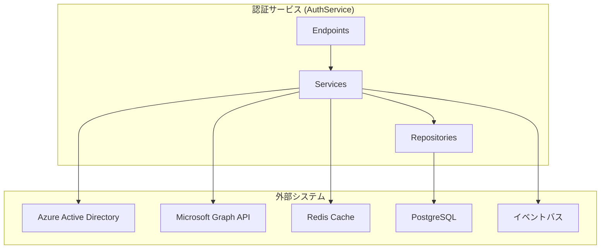
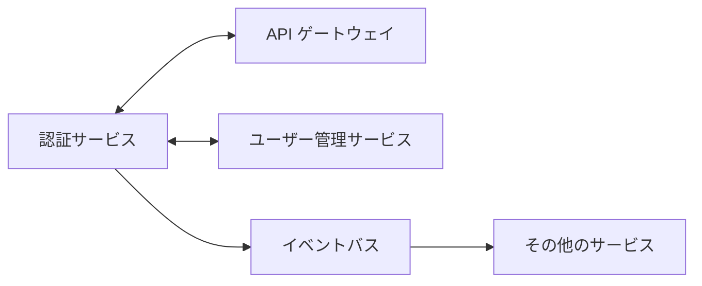
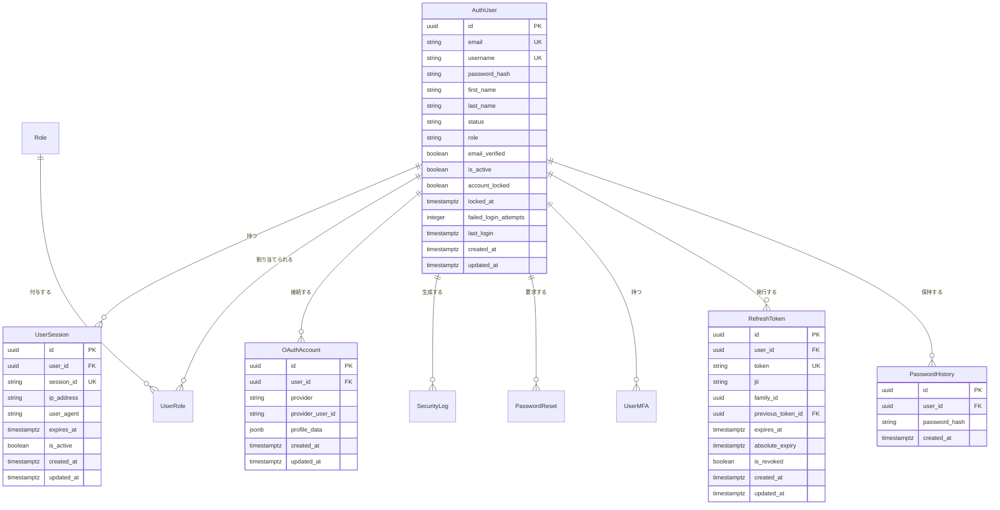

# 認証サービス (AuthService) — 詳細設計書

## 1. 概要

認証サービスは、SkiShop EC サイトプラットフォームのユーザー認証と認可を管理するマイクロサービスである。Microsoft Entra ID 統合によるセキュアな認証、JWT トークン管理、ユーザーセッション管理、ロールベースアクセス制御を提供する。OAuth2/OpenID Connect フロー、ユーザー登録、MFA 機能、包括的なセキュリティ監視を処理する。

## 2. 技術スタック

### 開発環境

- **言語**: C# 14 (.NET 10 LTS)
- **フレームワーク**: ASP.NET Core 10 (Minimal API)
- **ビルドツール**: dotnet CLI / MSBuild
- **コンテナ化**: Docker 25.x
- **オーケストレーション**: .NET Aspire 13.1
- **テスト**: xUnit, NSubstitute, Shouldly, Testcontainers.PostgreSql, WebApplicationFactory\<Program\>

### 本番環境

- Azure Container Apps
- Azure Database for PostgreSQL
- Apache Kafka (Confluent.Kafka)
- Azure Active Directory (Entra ID)

### 主要 NuGet パッケージ

| パッケージ | バージョン | 用途 |
|-----------|----------|------|
| ASP.NET Core 10 | 組み込み | REST API エンドポイント |
| Microsoft.EntityFrameworkCore | 10.* | ORM データアクセス |
| Npgsql.EntityFrameworkCore.PostgreSQL | 10.* | PostgreSQL プロバイダー |
| Microsoft.AspNetCore.Authentication.JwtBearer | 10.* | JWT 認証 |
| Microsoft.Identity.Web | 3.* | Azure AD / Entra ID 統合・OAuth2 クライアント |
| StackExchange.Redis | 2.* | Redis セッションストレージ |
| FluentValidation | 11.* | 入力バリデーション |
| AspNetCore.HealthChecks.NpgSql | 9.* | ヘルスチェック |
| Confluent.Kafka | 2.* | イベント発行・購読 |
| System.IdentityModel.Tokens.Jwt | 最新 | JWT トークン処理 |
| Serilog.AspNetCore | 8.* | 構造化ロギング |
| Serilog.Formatting.Compact | 3.* | JSON 形式ログ出力 |
| Serilog.Sinks.Console | 6.* | コンソールログ出力 |
| FluentValidation.DependencyInjectionExtensions | 11.* | DI 統合バリデーション |
| Polly | 8.* | 耐障害性（リトライ・サーキットブレーカー） |
| Microsoft.Extensions.Http.Resilience | 9.* | HttpClient 耐障害性統合 |
| OpenTelemetry.Extensions.Hosting | 1.* | メトリクス収集 |
| OpenTelemetry.Instrumentation.AspNetCore | 1.* | HTTP メトリクス |
| Azure.Identity | 最新 | Azure 認証 |

## 3. システムアーキテクチャ

### コンポーネントアーキテクチャ図



### マイクロサービス関連図



## 4. データモデル

### ER 図



### spec.md エンティティ名との対応表

> **SSOT 方針**: spec.md と本設計書のエンティティ名は `AuthUser` で統一済み（テーブル名: `auth_users`）。以下の対応表で spec.md のドメインモデルと実装エンティティの関係を明確にする。

| spec.md エンティティ | 設計書エンティティ | 対応関係 | 備考 |
|--------------------|--------------------|---------|------|
| `AuthUser` (Aggregate Root) | `AuthUser` | 完全一致 | `AuthUser.Id` は `UserManagementService.User.Id` と同一 UUID。`UserRegistered` Kafka イベントで同期 |
| `UserCredential` | `AuthUser.PasswordHash` + `UserMfa` | 統合 | spec.md では認証情報を別エンティティとして分離しているが、実装では `AuthUser` エンティティのプロパティと `UserMfa` に統合 |
| `OAuthClient` | （§29 で追加定義） | 新規追加 | M2M 認証用の Client Credentials 管理。spec.md の OAuthClient に対応 |
| `OAuthToken` | `RefreshToken` + Redis JWT ブラックリスト | 分割管理 | リフレッシュトークンは DB、アクセストークンは Redis で管理 |
| `OAuthScope` | （§29 で追加定義） | 新規追加 | Client Credentials のスコープ定義 |
| `OAuthConsent` | （Phase 2 で実装予定） | 未実装 | ユーザー同意管理は Phase 2 で OAuth2 同意画面と共に実装 |
| `MfaMethod` | `UserMfa` | 1:1 対応 | Phase 1 は TOTP のみ。`mfa_type` カラムで将来の SMS/Email/Push に拡張可能 |
| `LoginAttempt` | `SecurityLog` (event_type=`LOGIN_SUCCESS`/`LOGIN_FAILED`) | 統合 | spec.md では独立エンティティだが、実装では `SecurityLog` のイベント種別として統合 |
| — | `UserSession` | 設計書固有 | Redis セッションストレージの永続化バックアップ |
| — | `PasswordReset` | 設計書固有 | パスワードリセットトークン管理 |
| — | `OutboxEvent` | 設計書固有 | ADR-0005 準拠の Outbox パターン実装 |
| — | `PasswordHistory` | 設計書固有（§29 で追加） | パスワード履歴チェック用 |

### ロールモデル対応表（spec.md との整合）

> **SSOT 方針**: spec.md のロール定義はビジネスドメインの論理ロールであり、設計書のロールは DB/JWT に格納されるシステムロールである。以下の対応表でマッピングを定義する。

| spec.md ロール | 設計書ロール | 対応関係 | 備考 |
|---------------|------------|---------|------|
| `Customer` | `CUSTOMER` | 1:1 | 一般顧客。商品閲覧・注文作成・自身のプロファイル管理 |
| `PremiumCustomer` | `CUSTOMER` + `is_premium` フラグ | 拡張 | Phase 2 でプレミアム会員制度実装時に `user_roles` にフラグを追加 |
| `StoreAdmin` | `MANAGER` | 対応 | 店舗管理者。注文管理・カスタマーサポート |
| `InventoryManager` | `STAFF` | 対応 | 在庫管理者。商品・在庫管理・価格設定 |
| `SalesManager` | `STAFF` | 対応 | 販売管理者。販売レポート・キャンペーン管理 |
| `SystemAdmin` | `ADMIN` | 1:1 | システム管理者。全機能へのアクセス |
| — | `EMPLOYEE` | 設計書固有 | 従業員アクセス。基本的なシステムアクセス |
| — | `USER` | 設計書固有 | 一般ユーザー。プロファイル管理のみ |

> **実装方針**: `STAFF` ロールは `InventoryManager` と `SalesManager` を包含する汎用ロールとして機能する。各サービス固有の認可制御は、ロールに加えてスコープベースの認可ポリシー（`RequireClaim("scope", "inventory.read")` 等）で細分化する。Phase 2 で `InventoryManager` / `SalesManager` を独立ロールに分割する場合は、`roles` テーブルへのマイグレーションで対応する。

## サービス情報

| 項目 | 値 |
|------|------|
| サービス名 | AuthService |
| ポート | 5001 |
| データベース | PostgreSQL (authdb) |
| フレームワーク | ASP.NET Core 10 (Minimal API) |
| 言語バージョン | C# 14 (.NET 10) |
| アーキテクチャ | マイクロサービス + イベント駆動アーキテクチャ |

## 技術スタック詳細

| カテゴリ | 技術 | バージョン | 用途 |
|---------|------|----------|------|
| ランタイム | .NET | 10 (LTS) | モダンな機能を備えた主要プログラミングプラットフォーム |
| フレームワーク | ASP.NET Core | 10 | メインアプリケーションフレームワーク |
| データベース | PostgreSQL | 16+ | プライマリデータストレージ |
| キャッシュ | Redis | 7.2+ | セッションストレージおよびレート制限 |
| メッセージキュー | Apache Kafka | Confluent.Kafka 2.* | イベントストリーミング |
| ID プロバイダー | Microsoft Entra ID | 最新 | OAuth2/OpenID Connect 認証 |
| API | Microsoft Graph API | v1.0 | ユーザープロファイルおよび組織データ |
| ビルドツール | dotnet CLI / MSBuild | 最新 | 依存関係管理とビルド |
| コンテナ | Docker | 25.x | コンテナ化 |
| オーケストレーション | .NET Aspire | 13.1 | マイクロサービスオーケストレーション |

## データベーススキーマ

### auth_users テーブル

| カラム | データ型 | 制約 | 説明 |
|--------|---------|------|------|
| id | UUID | PK | ユーザー ID |
| email | VARCHAR(255) | NOT NULL, UNIQUE | ユーザーメールアドレス |
| username | VARCHAR(100) | UNIQUE | ユーザー名 |
| password_hash | VARCHAR(255) | NULL | パスワードハッシュ (Argon2id) |
| first_name | VARCHAR(100) | NULL | 名 |
| last_name | VARCHAR(100) | NULL | 姓 |
| status | VARCHAR(50) | NOT NULL, DEFAULT 'PENDING_VERIFICATION', CONSTRAINT ck_auth_users_status CHECK (status IN ('PENDING_VERIFICATION', 'ACTIVE', 'SUSPENDED')) | ユーザーステータス |
| role | VARCHAR(50) | NOT NULL, DEFAULT 'USER', CONSTRAINT ck_auth_users_role CHECK (role IN ('ADMIN', 'MANAGER', 'STAFF', 'EMPLOYEE', 'USER', 'CUSTOMER')) | ユーザーロール列挙型 |
| email_verified | BOOLEAN | NOT NULL, DEFAULT false | メール検証ステータス |
| is_active | BOOLEAN | NOT NULL, DEFAULT true | アカウント有効ステータス |
| account_locked | BOOLEAN | NOT NULL, DEFAULT false | アカウントロックステータス |
| locked_at | TIMESTAMP WITH TIME ZONE | NULL | ロック日時 |
| failed_login_attempts | INTEGER | NOT NULL, DEFAULT 0 | ログイン失敗回数カウンタ |
| last_login | TIMESTAMP WITH TIME ZONE | NULL | 最終ログイン日時 |
| created_at | TIMESTAMP WITH TIME ZONE | NOT NULL | 作成日時 |
| updated_at | TIMESTAMP WITH TIME ZONE | NOT NULL | 更新日時 |

### user_sessions テーブル

| カラム | データ型 | 制約 | 説明 |
|--------|---------|------|------|
| id | UUID | PK | セッション ID |
| user_id | UUID | FK, NOT NULL | ユーザー ID 参照 |
| session_id | VARCHAR(255) | NOT NULL, UNIQUE | セッション識別子 |
| ip_address | VARCHAR(45) | NULL | クライアント IP アドレス |
| user_agent | TEXT | NULL | クライアントユーザーエージェント |
| expires_at | TIMESTAMP WITH TIME ZONE | NOT NULL | セッション有効期限 |
| is_active | BOOLEAN | NOT NULL, DEFAULT true | セッション有効ステータス |
| created_at | TIMESTAMP WITH TIME ZONE | NOT NULL | 作成日時 |
| updated_at | TIMESTAMP WITH TIME ZONE | NOT NULL | 更新日時 |

### oauth_accounts テーブル

| カラム | データ型 | 制約 | 説明 |
|--------|---------|------|------|
| id | UUID | PK | OAuth アカウント ID |
| user_id | UUID | FK, NOT NULL | ユーザー ID 参照 |
| provider | VARCHAR(50) | NOT NULL | OAuth プロバイダー (azure, google 等) |
| provider_user_id | VARCHAR(255) | NOT NULL | プロバイダーユーザー ID |
| access_token | VARCHAR(2000) | NULL | OAuth アクセストークン（暗号化保存） |
| refresh_token | VARCHAR(2000) | NULL | OAuth リフレッシュトークン（暗号化保存） |
| token_expires_at | TIMESTAMP WITH TIME ZONE | NULL | OAuth トークン有効期限 |
| profile_data | JSONB | NULL | プロバイダープロファイルデータ |
| created_at | TIMESTAMP WITH TIME ZONE | NOT NULL | 作成日時 |
| updated_at | TIMESTAMP WITH TIME ZONE | NOT NULL | 更新日時 |

### security_logs テーブル

| カラム | データ型 | 制約 | 説明 |
|--------|---------|------|------|
| id | UUID | PK | ログエントリ ID |
| user_id | UUID | FK, NULL | ユーザー ID 参照 |
| event_type | VARCHAR(50) | NOT NULL | イベント種別 |
| ip_address | VARCHAR(45) | NULL | クライアント IP アドレス |
| user_agent | TEXT | NULL | クライアントユーザーエージェント |
| details | JSONB | NULL | イベント詳細 |
| created_at | TIMESTAMP WITH TIME ZONE | NOT NULL | 作成日時 |

### user_roles テーブル

| カラム | データ型 | 制約 | 説明 |
|--------|---------|------|------|
| id | UUID | PK | ユーザーロール ID |
| user_id | UUID | FK, NOT NULL | ユーザー ID 参照 |
| role_id | UUID | FK, NOT NULL | ロール ID 参照 |
| assigned_at | TIMESTAMP WITH TIME ZONE | NOT NULL | ロール割り当て日時 |
| assigned_by | UUID | NULL | 割り当て実行者のユーザー ID |
| expires_at | TIMESTAMP WITH TIME ZONE | NULL | ロール有効期限 |
| created_at | TIMESTAMP WITH TIME ZONE | NOT NULL | 作成日時 |
| updated_at | TIMESTAMP WITH TIME ZONE | NOT NULL | 更新日時 |

### password_resets テーブル

| カラム | データ型 | 制約 | 説明 |
|--------|---------|------|------|
| id | UUID | PK | パスワードリセット ID |
| user_id | UUID | FK, NOT NULL | ユーザー ID 参照 |
| token | VARCHAR(255) | NOT NULL, UNIQUE | リセットトークン（`RandomNumberGenerator.GetBytes(64)` で生成） |
| expires_at | TIMESTAMP WITH TIME ZONE | NOT NULL | トークン有効期限 |
| used | BOOLEAN | NOT NULL, DEFAULT false | トークン使用済みステータス |
| created_at | TIMESTAMP WITH TIME ZONE | NOT NULL | 作成日時 |

### user_mfa テーブル

| カラム | データ型 | 制約 | 説明 |
|--------|---------|------|------|
| id | UUID | PK | MFA ID |
| user_id | UUID | FK, NOT NULL, UNIQUE | ユーザー ID 参照 |
| secret_key | VARCHAR(500) | NOT NULL, DEFAULT '' | TOTP シークレットキー（AES-256-GCM で暗号化保存。暗号鍵は Azure Key Vault で管理） |
| backup_codes | TEXT | NULL | バックアップコード (JSON 配列、AES-256-GCM で暗号化保存) |
| is_enabled | BOOLEAN | NOT NULL, DEFAULT false | MFA 有効ステータス |
| verified_at | TIMESTAMP WITH TIME ZONE | NULL | 検証日時 |
| created_at | TIMESTAMP WITH TIME ZONE | NOT NULL | 作成日時 |
| updated_at | TIMESTAMP WITH TIME ZONE | NOT NULL | 更新日時 |

### roles テーブル

| カラム | データ型 | 制約 | 説明 |
|--------|---------|------|------|
| id | UUID | PK | ロール ID |
| name | VARCHAR(50) | NOT NULL, UNIQUE, CONSTRAINT ck_roles_name CHECK (name IN ('ADMIN', 'MANAGER', 'STAFF', 'EMPLOYEE', 'USER', 'CUSTOMER')) | ロール名 |
| description | TEXT | NULL | ロール説明 |
| created_at | TIMESTAMP WITH TIME ZONE | NOT NULL | 作成日時 |
| updated_at | TIMESTAMP WITH TIME ZONE | NOT NULL | 更新日時 |

### outbox_events テーブル（ADR-0005 準拠）

| カラム | データ型 | 制約 | 説明 |
|--------|---------|------|------|
| id | UUID | PK | イベント ID |
| event_type | VARCHAR(255) | NOT NULL | イベント種別 |
| aggregate_id | VARCHAR(36) | NOT NULL | 集約 ID |
| payload | TEXT | NOT NULL | イベントペイロード (JSON) |
| created_at | TIMESTAMP WITH TIME ZONE | NOT NULL | 作成日時 |
| published_at | TIMESTAMP WITH TIME ZONE | NULL | 発行日時 |
| retry_count | INTEGER | NOT NULL, DEFAULT 0, CHECK (retry_count >= 0) | リトライ回数 |
| max_retries | INTEGER | NOT NULL, DEFAULT 5 | 最大リトライ回数 |
| last_error | VARCHAR(2000) | NULL | 最終エラー内容 |
| status | VARCHAR(20) | NOT NULL, DEFAULT 'PENDING', CONSTRAINT ck_outbox_status CHECK (status IN ('PENDING', 'PROCESSING', 'PUBLISHED', 'FAILED', 'DEAD_LETTER')) | Outbox ステータス |

#### outbox_events インデックス

```sql
-- 未発行イベントのポーリング用部分インデックス
CREATE INDEX idx_outbox_events_pending
    ON outbox_events (created_at ASC)
    WHERE status = 'PENDING';

CREATE INDEX idx_outbox_events_failed
    ON outbox_events (created_at DESC)
    WHERE status = 'FAILED';
```

### oauth_accounts 追加制約

```sql
-- 同一 OAuth アカウントの重複登録防止
CONSTRAINT uq_oauth_provider_user UNIQUE (provider, provider_user_id)
```

### security_logs 設計補足

`security_logs` テーブルは append-only（追記専用）設計のため、`updated_at` カラムは不要とする。

`details` JSONB フィールドに格納可能な項目（ホワイトリスト）:
- `authMethod`（認証方式: `password`, `oauth2`, `mfa`）
- `mfaUsed`（MFA 使用有無: `true`/`false`）
- `failureReason`（失敗理由: `invalid_credentials`, `account_locked`, `mfa_failed` 等）
- `provider`（OAuth プロバイダー名: `azure`, `google` 等）
- `riskScore`（リスクスコア: 0-100）
- `actionTaken`（実行されたアクション: `account_lock`, `token_revoked` 等）

> **PII 格納禁止**: `details` フィールドにメールアドレス、氏名、住所等の個人情報を格納してはならない（AGENTS.md §5.7）。IP アドレスは `ip_address` 専用カラムに記録する。

### 外部キー制約の ON DELETE 動作

| テーブル | FK カラム | 参照先 | ON DELETE |
|---------|---------|--------|----------|
| user_sessions | user_id | auth_users.id | CASCADE |
| oauth_accounts | user_id | auth_users.id | CASCADE |
| security_logs | user_id | auth_users.id | SET NULL |
| user_roles | user_id | auth_users.id | CASCADE |
| user_roles | role_id | roles.id | RESTRICT |
| password_resets | user_id | auth_users.id | CASCADE |
| user_mfa | user_id | auth_users.id | CASCADE |

## API 設計

### REST API エンドポイント

#### 認証 API

| メソッド | パス | 説明 | パラメータ | レスポンス |
|---------|-----|------|-----------|----------|
| POST | /api/v1/auth/login | ユーザーログイン（資格情報） | LoginRequest | LoginResponse |
| POST | /api/v1/auth/refresh | アクセストークンのリフレッシュ | TokenRefreshRequest | TokenRefreshResponse |
| POST | /api/v1/auth/logout | ユーザーログアウト | Authorization ヘッダー | LogoutResponse |
| POST | /api/v1/auth/validate | トークン検証 | Authorization ヘッダー | TokenValidationResponse |
| GET | /api/v1/auth/me | 現在のユーザー情報取得 | Authorization ヘッダー | UserInfoResponse |

#### MFA API

| メソッド | パス | 説明 | パラメータ | レスポンス |
|---------|-----|------|-----------|----------|
| POST | /api/v1/auth/mfa/verify | MFA コード検証 | MfaVerificationRequest | LoginResponse |
| POST | /api/v1/auth/mfa/setup | ユーザーの MFA セットアップ | Authorization ヘッダー | MfaSetupResponse |
| DELETE | /api/v1/auth/mfa/disable | MFA 無効化 | Authorization ヘッダー | MessageResponse |

#### パスワード管理 API

| メソッド | パス | 説明 | パラメータ | レスポンス |
|---------|-----|------|-----------|----------|
| POST | /api/v1/auth/password/reset | パスワードリセット要求 | PasswordResetRequest | MessageResponse |
| POST | /api/v1/auth/password/confirm | パスワードリセット確認 | PasswordResetConfirmRequest | MessageResponse |
| PUT | /api/v1/auth/password/change | パスワード変更 | PasswordChangeRequest | MessageResponse |

#### ユーザー登録 API

| メソッド | パス | 説明 | パラメータ | レスポンス |
|---------|-----|------|-----------|----------|
| POST | /api/v1/auth/users | 新規ユーザー登録 | UserCreateRequest | UserResponse |
| DELETE | /api/v1/auth/users/{userId} | ユーザー論理削除 | userId, reason | MessageResponse |
| DELETE | /api/v1/auth/users/{userId}/hard | ユーザー物理削除（管理者のみ） | userId, reason | MessageResponse |

#### OAuth2 Web エンドポイント

| メソッド | パス | 説明 | パラメータ | レスポンス |
|---------|-----|------|-----------|----------|
| GET | /api/v1/auth/oauth2/authorization/azure | Azure AD OAuth2 フロー開始 | なし | 302 リダイレクト |
| GET | /signin-oidc | OAuth2 コールバック（ASP.NET Core フレームワーク制約） | code, state | 302 リダイレクト |
| GET | / | ホームページ | なし | HTML |
| GET | /home | 認証済みホーム | ClaimsPrincipal | HTML |
| GET | /profile | ユーザープロファイルページ | ClaimsPrincipal | HTML |
| GET | /call_graph | Microsoft Graph API 呼び出し | Authorization | HTML |

#### Microsoft Graph API エンドポイント

| メソッド | パス | 説明 | パラメータ | レスポンス |
|---------|-----|------|-----------|----------|
| GET | /api/v1/auth/user/me | セッションからユーザー情報取得 | ClaimsPrincipal | UserInfoResponse |
| GET | /api/v1/auth/graph/user | Microsoft Graph からユーザー取得 | Authorization | GraphUserResponse |

#### 監視エンドポイント

| メソッド | パス | 説明 | パラメータ | レスポンス |
|---------|-----|------|-----------|----------|
| GET | /health | サービスヘルスチェック（Liveness） | なし | HealthResponse |
| GET | /health/ready | サービス準備状態チェック（Readiness） | なし | HealthResponse |

### リクエスト・レスポンス例

#### ログインリクエスト

```json
{
  "email": "user@example.com",
  "password": "SecurePassword123!"
}
```

#### ログインレスポンス

```json
{
  "accessToken": "eyJhbGciOiJSUzI1NiIsInR5cCI6IkpXVCIsImtpZCI6ImtleS1pZC0xIn0...",
  "refreshToken": "eyJhbGciOiJSUzI1NiJ9...",
  "tokenType": "Bearer",
  "expiresIn": 3600,
  "user": {
    "id": "550e8400-e29b-41d4-a716-446655440000",
    "firstName": "John",
    "lastName": "Doe",
    "role": "USER"
  }
}
```

#### ユーザー登録リクエスト

```json
{
  "username": "johndoe",
  "email": "john.doe@example.com",
  "password": "SecurePassword123!",
  "firstName": "John",
  "lastName": "Doe"
}
```

## イベント設計

### 発行イベント

| イベント名 | 説明 | ペイロード | トピック |
|-----------|------|-----------|---------|
| UserRegistered | ユーザー登録時に発行 | ユーザー ID、ロール、登録日時 | user.registered |
| UserAuthenticated | ユーザーログイン時に発行 | ユーザー ID、ログイン日時、IP、デバイス情報 | auth.login.success |
| UserLoggedOut | ユーザーログアウト時に発行 | ユーザー ID、セッション ID、ログアウト日時 | auth.session.ended |
| LoginFailed | ログイン失敗時に発行 | ユーザー ID（存在時）、IP アドレス、失敗理由、日時 | auth.login.failed |
| AccountLocked | アカウントロック時に発行 | ユーザー ID、ロック理由、ロック期間 | auth.security.incident |
| PasswordChanged | パスワード変更時に発行 | ユーザー ID、変更日時 | auth.security.incident |
| MfaEnabled | MFA 有効化時に発行 | ユーザー ID、セットアップ日時 | auth.security.incident |
| SecurityIncident | 不審なアクティビティ検出時に発行 | ユーザー ID、インシデント種別、リスクスコア、詳細 | auth.security.incident |

### 購読イベント

| イベント名 | 説明 | 発行元サービス | アクション |
|-----------|------|--------------|----------|
| UserDeleted | ユーザー削除時に購読 | ユーザー管理サービス | ユーザーアカウント無効化、セッションクリーンアップ |
| PermissionsUpdated | ユーザー権限変更時に購読 | ユーザー管理サービス | ロール割り当て更新、トークン無効化 |

> **PII 最小化原則**: イベントペイロードには PII（メールアドレス、氏名等）を含めない。`userId` のみで識別し、必要な場合はイベント消費者が UserManagementService API 経由で取得する（AGENTS.md §5.7 / GDPR 第 17 条対応）。

### イベントスキーマ例

#### UserAuthenticated イベント

```json
{
  "eventId": "f47ac10b-58cc-4372-a567-0e02b2c3d479",
  "eventType": "UserAuthenticated",
  "timestamp": "2024-07-03T10:15:30.123Z",
  "source": "AuthService",
  "data": {
    "userId": "550e8400-e29b-41d4-a716-446655440000",
    "sessionId": "sess_abc123def456",
    "ipAddress": "192.168.1.100",
    "userAgent": "Mozilla/5.0...",
    "authMethod": "password",
    "mfaUsed": false
  }
}
```

## 7. セキュリティ機能

### アカウントセキュリティ

| 機能 | 実装 | 設定 |
|------|------|------|
| パスワードハッシュ | Argon2id（ASP.NET Core Identity カスタム `IPasswordHasher<T>` 実装） | appsettings.json で設定可能 |
| アカウントロックアウト | 5 回失敗 → アカウントロック | Auth:MaxFailedAttempts=5 |
| セッションタイムアウト | 30 分のアイドルタイムアウト | Session:Timeout=1800 |
| JWT トークンセキュリティ | RS256 アルゴリズム（非対称鍵）。AuthService のみが秘密鍵を保持し、他サービスは公開鍵で検証 | Azure Key Vault に RSA 2048-bit 以上の鍵ペアを格納。`kid` による鍵ローテーション対応 |
| レート制限 | Redis ベースのスライディングウィンドウ | IP あたり 100 リクエスト/分 |
| CSRF 保護 | ASP.NET Core Antiforgery | Web エンドポイントで有効 |

### 認証方式

| 方式 | 実装 | ステータス |
|------|------|----------|
| ユーザー名/パスワード | ASP.NET Core Identity + Argon2id（`IPasswordHasher<ApplicationUser>` カスタム実装） | ✅ 完了 |
| Microsoft Entra ID | OAuth2/OpenID Connect (Microsoft.Identity.Web) | ✅ 完了 |
| JWT トークン | カスタム実装 (System.IdentityModel.Tokens.Jwt) | ✅ 完了 |
| MFA (TOTP) | Google Authenticator 互換 | 🔄 進行中 |
| セッションベース | Redis セッションストア (StackExchange.Redis) | ✅ 完了 |

### ロールベースアクセス制御

| ロール | 説明 | 権限 |
|--------|------|------|
| ADMIN | システム管理者 | 全システムアクセス |
| MANAGER | 店舗マネージャー | ユーザー管理、レポート |
| STAFF | 店舗スタッフ | 限定的な注文管理 |
| EMPLOYEE | 従業員アクセス | 基本的なシステムアクセス |
| USER | 一般ユーザー | プロファイル管理 |
| CUSTOMER | 顧客アクセス | ショッピング、注文履歴 |

## 8. エラーハンドリング

### エラーコード定義

| エラーコード | 説明 | HTTP ステータス |
|------------|------|----------------|
| AUTH-4001 | 無効な資格情報 | 401 Unauthorized |
| AUTH-4002 | アカウントロック中 | 423 Locked |
| AUTH-4003 | アカウント未検証 | 403 Forbidden |
| AUTH-4004 | トークン期限切れ | 401 Unauthorized |
| AUTH-4005 | 無効なトークン | 401 Unauthorized |
| AUTH-4006 | MFA 必須 | 202 Accepted |
| AUTH-4007 | 無効な MFA コード | 400 Bad Request |
| AUTH-4008 | パスワードリセット必須 | 403 Forbidden |
| AUTH-4041 | ユーザーが見つからない | 404 Not Found |
| AUTH-4091 | メールアドレス既存 | 409 Conflict |
| AUTH-4092 | ユーザー名既存 | 409 Conflict |
| AUTH-4221 | 脆弱なパスワード | 422 Unprocessable Entity |
| AUTH-4222 | パスワードポリシー違反 | 422 Unprocessable Entity |
| AUTH-4291 | レート制限超過 | 429 Too Many Requests |
| AUTH-5001 | 内部認証エラー | 500 Internal Server Error |
| AUTH-5002 | 外部サービス利用不可 | 503 Service Unavailable |

### グローバルエラーレスポンス形式

RFC 9457 (Problem Details for HTTP APIs) に準拚し、`TypedResults.Problem()` を使用する：

```json
{
  "type": "https://tools.ietf.org/html/rfc9110#section-15.5.2",
  "title": "Unauthorized",
  "status": 401,
  "detail": "無効な資格情報が提供されました",
  "instance": "/api/v1/auth/login",
  "extensions": {
    "errorCode": "AUTH-4001",
    "timestamp": "2024-07-03T10:15:30.123Z"
  }
}
```

## 9. パフォーマンスと最適化

### キャッシュ戦略

- **Redis キャッシュ**:
  - ユーザーセッション (TTL: 30 分)
  - レート制限カウンタ (TTL: 1 分)
  - OAuth2 トークン (TTL: トークンの有効期間)
  - ログイン失敗回数 (TTL: 15 分)

- **キャッシュキー設計**:
  - ユーザーセッション: `session:{sessionId}`
  - レート制限: `rate:{ipAddress}:{endpoint}`
  - ログイン試行: `attempts:{email}`
  - JWT ブラックリスト: `blacklist:{tokenId}`

### インデックス設計

| テーブル | インデックス | カラム | 説明 |
|---------|------------|--------|------|
| auth_users | idx_auth_users_email | email | メールアドレスによるプライマリ検索 |
| auth_users | idx_auth_users_username | username | ユーザー名による検索 |
| auth_users | idx_auth_users_status | status | ユーザーステータスによるフィルタ |
| user_sessions | idx_sessions_user_id | user_id | ユーザーのセッション検索 |
| user_sessions | idx_sessions_session_id | session_id | セッション ID 検索 |
| user_sessions | idx_sessions_expires_at | expires_at | 期限切れセッションのクリーンアップ |
| security_logs | idx_security_user_id | user_id | ユーザーのセキュリティイベント |
| security_logs | idx_security_event_type | event_type | イベント種別によるフィルタ |
| security_logs | idx_security_created_at | created_at | 時間ベースのクエリ |
| oauth_accounts | idx_oauth_provider_user | provider, provider_user_id | OAuth アカウント検索 |

### パフォーマンスメトリクス

| メトリクス | 目標値 | 監視 |
|-----------|--------|------|
| ログインレスポンスタイム | < 200ms | OpenTelemetry |
| トークン検証 | < 50ms | OpenTelemetry |
| データベースクエリ時間 | < 100ms | OpenTelemetry |
| Redis 操作 | < 10ms | OpenTelemetry |
| OAuth2 フロー | < 2s | OpenTelemetry |

## 10. 監視と可観測性

### ヘルスチェック

| エンドポイント | 目的 | 依存関係 |
|--------------|------|---------|
| /health | コンテナ再起動インジケーター (Liveness) | アプリケーション起動 |
| /health/ready | トラフィックルーティング判断 (Readiness) | データベース、Redis、Azure AD |

### メトリクス収集

```yaml
認証メトリクス:
  - auth_login_attempts_total: ログイン試行総数カウンタ
  - auth_login_success_total: ログイン成功数カウンタ
  - auth_login_failures_total: ログイン失敗数カウンタ
  - auth_active_sessions: アクティブセッション数ゲージ
  - auth_token_generation_duration: トークン生成時間ヒストグラム
  - auth_password_reset_requests_total: パスワードリセット要求数カウンタ
  - auth_mfa_verifications_total: MFA 検証試行数カウンタ
  - auth_account_lockouts_total: アカウントロックアウトイベント数カウンタ

システムメトリクス:
  - http_server_requests_duration_seconds: HTTP リクエスト処理時間
  - dotnet_gc_collections_total: GC コレクション回数
  - dotnet_process_memory_bytes: プロセスメモリ使用量
  - dotnet_threadpool_threads_count: スレッドプール使用状況
  - db_connections_active: データベースコネクションプール使用量
  - redis_commands_processed_total: Redis コマンド実行回数
```

### ロギング設定

```yaml
ロギングレベル:
  SkiShop.AuthService: Information
  Microsoft.AspNetCore: Warning
  Microsoft.Identity: Debug

セキュリティイベントロギング:
  - 全ての認証試行（成功/失敗）
  - 認可判断
  - トークン操作（生成/検証/失効）
  - アカウント状態変更（ロック/アンロック/有効化）
  - 管理者操作
  - 不審なアクティビティ検出
  - レート制限違反
```

## 11. デプロイメント設定

### Docker 設定

```dockerfile
FROM mcr.microsoft.com/dotnet/sdk:10.0 AS build
WORKDIR /src
COPY ["AuthService/AuthService.csproj", "AuthService/"]
RUN dotnet restore "AuthService/AuthService.csproj"
COPY . .
WORKDIR "/src/AuthService"
RUN dotnet publish "AuthService.csproj" -c Release -o /app/publish --no-restore

FROM mcr.microsoft.com/dotnet/aspnet:10.0 AS runtime
WORKDIR /app
RUN groupadd -r skishop && useradd -r -g skishop -d /app skishop
COPY --from=build --chown=skishop:skishop /app/publish .
USER skishop

ENV ASPNETCORE_ENVIRONMENT=Production
ENV DOTNET_RUNNING_IN_CONTAINER=true
HEALTHCHECK --interval=30s --timeout=10s --retries=3 \
    CMD wget --spider -q http://localhost:8080/health || exit 1

EXPOSE 8080
ENTRYPOINT ["dotnet", "AuthService.dll"]
```

### 環境変数

```bash
# アプリケーション設定
ASPNETCORE_ENVIRONMENT=Production
ASPNETCORE_URLS=http://+:8080

# データベース設定
ConnectionStrings__DefaultConnection=Host=localhost;Port=5432;Database=authdb;Username=auth_user;Password=${DB_PASSWORD_SECRET}

# Redis 設定
Redis__ConnectionString=localhost:6379,password=${REDIS_PASSWORD_SECRET}

# Azure 設定
AzureAd__TenantId=${AZURE_TENANT_ID}
AzureAd__ClientId=${AZURE_CLIENT_ID}
AzureAd__ClientSecret=${AZURE_CLIENT_SECRET}

# JWT 設定（RS256 非対称鍵）
Jwt__PrivateKeyPath=${JWT_PRIVATE_KEY_PATH}
Jwt__PublicKeyPath=${JWT_PUBLIC_KEY_PATH}
Jwt__KeyVaultKeyId=${JWT_KEY_VAULT_KEY_ID}
Jwt__AccessExpirationSeconds=3600
Jwt__RefreshExpirationSeconds=1209600

# イベント設定
SkiShop__Event__BrokerType=kafka
Kafka__BootstrapServers=localhost:9092
```

## 12. EF Core エンティティ定義

AGENTS.md §10.3 に準拠した主要エンティティの C# クラス定義。

```csharp
[Table("auth_users")]
public class AuthUser
{
    [Key]
    [Column("id")]
    [MaxLength(36)]
    public string Id { get; set; } = Guid.NewGuid().ToString();

    [Column("email")]
    [Required]
    [MaxLength(255)]
    public string Email { get; set; } = string.Empty;

    [Column("username")]
    [MaxLength(100)]
    public string? Username { get; set; }

    [Column("password_hash")]
    [MaxLength(255)]
    public string? PasswordHash { get; set; }

    [Column("first_name")]
    [MaxLength(100)]
    public string? FirstName { get; set; }

    [Column("last_name")]
    [MaxLength(100)]
    public string? LastName { get; set; }

    [Column("status")]
    [Required]
    [MaxLength(50)]
    public string Status { get; set; } = "PENDING_VERIFICATION";

    [Column("role")]
    [Required]
    [MaxLength(50)]
    public string Role { get; set; } = "USER";

    [Column("email_verified")]
    public bool EmailVerified { get; set; }

    [Column("is_active")]
    public bool IsActive { get; set; } = true;

    [Column("account_locked")]
    public bool AccountLocked { get; set; }

    [Column("locked_at")]
    public DateTime? LockedAt { get; set; }

    [Column("failed_login_attempts")]
    public int FailedLoginAttempts { get; set; }

    [Column("last_login")]
    public DateTime? LastLogin { get; set; }

    [Column("created_at")]
    public DateTime CreatedAt { get; set; } = DateTime.UtcNow;

    [Column("updated_at")]
    public DateTime UpdatedAt { get; set; } = DateTime.UtcNow;

    [Timestamp]
    [Column("row_version")]
    public byte[] RowVersion { get; set; } = [];

    // ナビゲーションプロパティ
    public ICollection<UserSession> Sessions { get; set; } = [];
    public ICollection<OAuthAccount> OAuthAccounts { get; set; } = [];
    public ICollection<SecurityLog> SecurityLogs { get; set; } = [];
    public ICollection<UserRole> UserRoles { get; set; } = [];
    public UserMfa? Mfa { get; set; }
}

[Table("user_sessions")]
public class UserSession
{
    [Key]
    [Column("id")]
    [MaxLength(36)]
    public string Id { get; set; } = Guid.NewGuid().ToString();

    [Column("user_id")]
    [Required]
    [MaxLength(36)]
    public string UserId { get; set; } = string.Empty;

    [Column("session_id")]
    [Required]
    [MaxLength(255)]
    public string SessionId { get; set; } = string.Empty;

    [Column("ip_address")]
    [MaxLength(45)]
    public string? IpAddress { get; set; }

    [Column("user_agent")]
    public string? UserAgent { get; set; }

    [Column("expires_at")]
    public DateTime ExpiresAt { get; set; }

    [Column("is_active")]
    public bool IsActive { get; set; } = true;

    [Column("created_at")]
    public DateTime CreatedAt { get; set; } = DateTime.UtcNow;

    [Column("updated_at")]
    public DateTime UpdatedAt { get; set; } = DateTime.UtcNow;

    // ナビゲーションプロパティ
    public AuthUser AuthUser { get; set; } = null!;
}

[Table("security_logs")]
public class SecurityLog
{
    [Key]
    [Column("id")]
    [MaxLength(36)]
    public string Id { get; set; } = Guid.NewGuid().ToString();

    [Column("user_id")]
    [MaxLength(36)]
    public string? UserId { get; set; }

    [Column("event_type")]
    [Required]
    [MaxLength(50)]
    public string EventType { get; set; } = string.Empty;

    [Column("ip_address")]
    [MaxLength(45)]
    public string? IpAddress { get; set; }

    [Column("user_agent")]
    public string? UserAgent { get; set; }

    [Column("details")]
    public string? Details { get; set; }  // JSONB

    [Column("created_at")]
    public DateTime CreatedAt { get; set; } = DateTime.UtcNow;

    // ナビゲーションプロパティ
    public AuthUser? AuthUser { get; set; }
}

[Table("outbox_events")]
public class OutboxEvent
{
    [Key]
    [Column("id")]
    [MaxLength(36)]
    public string Id { get; set; } = Guid.NewGuid().ToString();

    [Column("event_type")]
    [Required]
    [MaxLength(255)]
    public string EventType { get; set; } = string.Empty;

    [Column("aggregate_id")]
    [Required]
    [MaxLength(36)]
    public string AggregateId { get; set; } = string.Empty;

    [Column("payload")]
    [Required]
    public string Payload { get; set; } = string.Empty;

    [Column("created_at")]
    public DateTime CreatedAt { get; set; } = DateTime.UtcNow;

    [Column("published_at")]
    public DateTime? PublishedAt { get; set; }

    [Column("retry_count")]
    public int RetryCount { get; set; }

    [Column("max_retries")]
    public int MaxRetries { get; set; } = 5;

    [Column("last_error")]
    [MaxLength(2000)]
    public string? LastError { get; set; }

    [Column("status")]
    [Required]
    [MaxLength(20)]
    public string Status { get; set; } = "PENDING";
}

[Table("oauth_accounts")]
public class OAuthAccount
{
    [Key]
    [Column("id")]
    [MaxLength(36)]
    public string Id { get; set; } = Guid.NewGuid().ToString();

    [Column("user_id")]
    [Required]
    [MaxLength(36)]
    public string UserId { get; set; } = string.Empty;

    [Column("provider")]
    [Required]
    [MaxLength(50)]
    public string Provider { get; set; } = string.Empty;

    [Column("provider_user_id")]
    [Required]
    [MaxLength(255)]
    public string ProviderUserId { get; set; } = string.Empty;

    [Column("access_token")]
    [MaxLength(2000)]
    public string? AccessToken { get; set; }

    [Column("refresh_token")]
    [MaxLength(2000)]
    public string? RefreshToken { get; set; }

    [Column("token_expires_at")]
    public DateTime? TokenExpiresAt { get; set; }

    [Column("profile_data")]
    public string? ProfileData { get; set; }  // JSONB

    [Column("created_at")]
    public DateTime CreatedAt { get; set; } = DateTime.UtcNow;

    [Column("updated_at")]
    public DateTime UpdatedAt { get; set; } = DateTime.UtcNow;

    // ナビゲーションプロパティ
    public AuthUser AuthUser { get; set; } = null!;
}

[Table("roles")]
public class Role
{
    [Key]
    [Column("id")]
    [MaxLength(36)]
    public string Id { get; set; } = Guid.NewGuid().ToString();

    [Column("name")]
    [Required]
    [MaxLength(50)]
    public string Name { get; set; } = string.Empty;

    [Column("description")]
    [MaxLength(255)]
    public string? Description { get; set; }

    [Column("created_at")]
    public DateTime CreatedAt { get; set; } = DateTime.UtcNow;

    [Column("updated_at")]
    public DateTime UpdatedAt { get; set; } = DateTime.UtcNow;

    // ナビゲーションプロパティ
    public ICollection<UserRole> UserRoles { get; set; } = [];
}

[Table("user_roles")]
public class UserRole
{
    [Key]
    [Column("id")]
    [MaxLength(36)]
    public string Id { get; set; } = Guid.NewGuid().ToString();

    [Column("user_id")]
    [Required]
    [MaxLength(36)]
    public string UserId { get; set; } = string.Empty;

    [Column("role_id")]
    [Required]
    [MaxLength(36)]
    public string RoleId { get; set; } = string.Empty;

    [Column("assigned_at")]
    public DateTime AssignedAt { get; set; } = DateTime.UtcNow;

    [Column("assigned_by")]
    [MaxLength(36)]
    public string? AssignedBy { get; set; }

    [Column("expires_at")]
    public DateTime? ExpiresAt { get; set; }

    // ナビゲーションプロパティ
    public AuthUser AuthUser { get; set; } = null!;
    public Role Role { get; set; } = null!;
}

[Table("password_resets")]
public class PasswordReset
{
    [Key]
    [Column("id")]
    [MaxLength(36)]
    public string Id { get; set; } = Guid.NewGuid().ToString();

    [Column("user_id")]
    [Required]
    [MaxLength(36)]
    public string UserId { get; set; } = string.Empty;

    [Column("token")]
    [Required]
    [MaxLength(255)]
    public string Token { get; set; } = string.Empty;

    [Column("expires_at")]
    public DateTime ExpiresAt { get; set; }

    [Column("is_used")]
    public bool IsUsed { get; set; }

    [Column("used_at")]
    public DateTime? UsedAt { get; set; }

    [Column("created_at")]
    public DateTime CreatedAt { get; set; } = DateTime.UtcNow;

    // ナビゲーションプロパティ
    public AuthUser AuthUser { get; set; } = null!;
}

[Table("user_mfa")]
public class UserMfa
{
    [Key]
    [Column("id")]
    [MaxLength(36)]
    public string Id { get; set; } = Guid.NewGuid().ToString();

    [Column("user_id")]
    [Required]
    [MaxLength(36)]
    public string UserId { get; set; } = string.Empty;

    [Column("mfa_type")]
    [Required]
    [MaxLength(20)]
    public string MfaType { get; set; } = "TOTP";

    [Column("secret_key")]
    [Required]
    [MaxLength(500)]
    public string SecretKey { get; set; } = string.Empty;  // AES-256-GCM で暗号化保存

    [Column("backup_codes")]
    public string? BackupCodes { get; set; }  // AES-256-GCM で暗号化保存（JSONB）

    [Column("is_enabled")]
    public bool IsEnabled { get; set; }

    [Column("verified_at")]
    public DateTime? VerifiedAt { get; set; }

    [Column("created_at")]
    public DateTime CreatedAt { get; set; } = DateTime.UtcNow;

    [Column("updated_at")]
    public DateTime UpdatedAt { get; set; } = DateTime.UtcNow;

    // ナビゲーションプロパティ
    public AuthUser AuthUser { get; set; } = null!;
}
```

## 13. Service / Repository インターフェース定義

AGENTS.md §10.1 準拠。全 async メソッドに `CancellationToken ct = default` を含む。

```csharp
// === Service インターフェース ===

public interface IAuthService
{
    Task<LoginResponse> LoginAsync(LoginRequest request, CancellationToken ct = default);
    Task<TokenRefreshResponse> RefreshTokenAsync(TokenRefreshRequest request, CancellationToken ct = default);
    Task LogoutAsync(string sessionId, CancellationToken ct = default);
    Task<UserInfoResponse> GetCurrentUserAsync(string userId, CancellationToken ct = default);
}

public interface IJwtTokenService
{
    string GenerateAccessToken(AuthUser user);
    string GenerateRefreshToken();
    Task<bool> ValidateTokenAsync(string token, CancellationToken ct = default);
    Task RevokeTokenAsync(string tokenId, CancellationToken ct = default);
}

public interface IMfaService
{
    Task<MfaSetupResponse> SetupMfaAsync(string userId, CancellationToken ct = default);
    Task<LoginResponse> VerifyMfaAsync(MfaVerificationRequest request, CancellationToken ct = default);
    Task DisableMfaAsync(string userId, CancellationToken ct = default);
}

public interface IPasswordService
{
    Task RequestResetAsync(PasswordResetRequest request, CancellationToken ct = default);
    Task ConfirmResetAsync(PasswordResetConfirmRequest request, CancellationToken ct = default);
    Task ChangePasswordAsync(string userId, PasswordChangeRequest request, CancellationToken ct = default);
}

// === Repository インターフェース ===

public interface IAuthUserRepository
{
    Task<AuthUser?> FindByEmailAsync(string email, CancellationToken ct = default);
    Task<AuthUser?> FindByIdAsync(string id, CancellationToken ct = default);
    Task AddAsync(AuthUser user, CancellationToken ct = default);
    Task SaveChangesAsync(CancellationToken ct = default);
}

public interface IUserSessionRepository
{
    Task<UserSession?> FindBySessionIdAsync(string sessionId, CancellationToken ct = default);
    Task<IReadOnlyList<UserSession>> FindActiveByUserIdAsync(string userId, CancellationToken ct = default);
    Task AddAsync(UserSession session, CancellationToken ct = default);
    Task SaveChangesAsync(CancellationToken ct = default);
}

public interface ISecurityLogRepository
{
    Task AddAsync(SecurityLog log, CancellationToken ct = default);
    Task<IReadOnlyList<SecurityLog>> FindByUserIdAsync(string userId, int limit = 50, CancellationToken ct = default);
    Task SaveChangesAsync(CancellationToken ct = default);
}
```

### DTO 定義（record 型）

```csharp
public record LoginRequest(
    [Required, EmailAddress, StringLength(255)]
    string Email,
    [Required, StringLength(100, MinimumLength = 8)]
    string Password);

public record TokenRefreshRequest(
    [Required]
    string RefreshToken);

public record PasswordResetRequest(
    [Required, EmailAddress, StringLength(255)]
    string Email);

public record PasswordResetConfirmRequest(
    [Required]
    string Token,
    [Required, StringLength(100, MinimumLength = 8)]
    string NewPassword);

public record PasswordChangeRequest(
    [Required]
    string CurrentPassword,
    [Required, StringLength(100, MinimumLength = 8)]
    string NewPassword);

public record MfaVerificationRequest(
    [Required, StringLength(6, MinimumLength = 6)]
    string Code,
    [Required]
    string SessionToken);

public record LoginResponse(string AccessToken, string RefreshToken, string TokenType, int ExpiresIn, UserDto User);
public record TokenRefreshResponse(string AccessToken, string RefreshToken, int ExpiresIn);
public record UserDto(string Id, string FirstName, string LastName, string Role);
public record UserInfoResponse(string Id, string Email, string FirstName, string LastName, string Role, DateTime CreatedAt);
public record MfaSetupResponse(string SecretKey, string QrCodeUri, IReadOnlyList<string> BackupCodes);
```

### Minimal API エンドポイント実装パターン

AGENTS.md §6.2 準拠の `AuthEndpoints` パターン:

```csharp
public static class AuthEndpoints
{
    public static void MapAuthEndpoints(this IEndpointRouteBuilder app)
    {
        var group = app.MapGroup("/api/v1/auth")
            .WithTags("Authentication")
            .WithOpenApi();

        group.MapPost("/login", LoginAsync)
            .AllowAnonymous()
            .WithName("Login");

        group.MapPost("/refresh", RefreshTokenAsync)
            .AllowAnonymous()
            .WithName("RefreshToken");

        group.MapPost("/logout", LogoutAsync)
            .RequireAuthorization()
            .WithName("Logout");

        group.MapGet("/me", GetCurrentUserAsync)
            .RequireAuthorization()
            .WithName("GetCurrentUser");
    }

    private static async Task<IResult> LoginAsync(
        [FromBody] LoginRequest request,
        IValidator<LoginRequest> validator,
        IAuthService authService,
        CancellationToken ct)
    {
        var validationResult = await validator.ValidateAsync(request, ct);
        if (!validationResult.IsValid)
            return Results.ValidationProblem(validationResult.ToDictionary());
        return Results.Ok(await authService.LoginAsync(request, ct));
    }

    private static async Task<IResult> RefreshTokenAsync(
        [FromBody] TokenRefreshRequest request,
        IAuthService authService,
        CancellationToken ct)
        => Results.Ok(await authService.RefreshTokenAsync(request, ct));

    private static async Task<IResult> LogoutAsync(
        ClaimsPrincipal user,
        IAuthService authService,
        CancellationToken ct)
    {
        var sessionId = user.FindFirstValue("session_id")
            ?? throw new UnauthorizedException();
        await authService.LogoutAsync(sessionId, ct);
        return Results.NoContent();
    }

    private static async Task<IResult> GetCurrentUserAsync(
        ClaimsPrincipal user,
        IAuthService authService,
        CancellationToken ct)
    {
        var userId = user.FindFirstValue(ClaimTypes.NameIdentifier)
            ?? throw new UnauthorizedException();
        return Results.Ok(await authService.GetCurrentUserAsync(userId, ct));
    }
}
```

## 14. Outbox パターン実装設計（ADR-0005 準拠）

全 Kafka イベント発行は Outbox パターンで DB トランザクションとの原子性を保証する。

### OutboxPublisher（BackgroundService）

```csharp
public class OutboxPublisher(
    IServiceScopeFactory scopeFactory,
    IProducer<string, string> producer,
    TimeProvider timeProvider,
    ILogger<OutboxPublisher> logger) : BackgroundService
{
    private static readonly TimeSpan MinPollingInterval = TimeSpan.FromMilliseconds(100);
    private static readonly TimeSpan MaxPollingInterval = TimeSpan.FromSeconds(5);
    private TimeSpan _currentInterval = TimeSpan.FromMilliseconds(500);

    protected override async Task ExecuteAsync(CancellationToken stoppingToken)
    {
        while (!stoppingToken.IsCancellationRequested)
        {
            using var scope = scopeFactory.CreateScope();
            var context = scope.ServiceProvider.GetRequiredService<AuthDbContext>();
            var pendingEvents = await context.OutboxEvents
                .Where(e => e.Status == "PENDING")
                .OrderBy(e => e.CreatedAt)
                .Take(100)
                .ToListAsync(stoppingToken);

            foreach (var evt in pendingEvents)
            {
                try
                {
                    await producer.ProduceAsync(evt.EventType, new Message<string, string>
                    {
                        Key = evt.AggregateId,
                        Value = evt.Payload
                    }, stoppingToken);
                    evt.Status = "PUBLISHED";
                    evt.PublishedAt = timeProvider.GetUtcNow().UtcDateTime;
                }
                catch (Exception ex)
                {
                    evt.RetryCount++;
                    evt.LastError = ex.Message[..Math.Min(ex.Message.Length, 2000)];
                    if (evt.RetryCount >= evt.MaxRetries)
                        evt.Status = "FAILED";
                    logger.LogError(ex, "Outbox publish failed: {EventId}, retry: {RetryCount}",
                        evt.Id, evt.RetryCount);
                }
            }
            await context.SaveChangesAsync(stoppingToken);

            _currentInterval = pendingEvents.Count > 0
                ? MinPollingInterval
                : TimeSpan.FromTicks(Math.Min(
                    _currentInterval.Ticks * 2,
                    MaxPollingInterval.Ticks));

            await Task.Delay(_currentInterval, stoppingToken);
        }
    }
}
```

## 15. 耐障害性（Resilience）設計

AGENTS.md §11.1 準拠。外部サービス（Azure AD, Microsoft Graph API）呼び出しに `IHttpClientFactory` + `AddStandardResilienceHandler` を適用する。

### HttpClient 登録

```csharp
// Program.cs
builder.Services.AddHttpClient<IAzureAdClient, AzureAdClient>(client =>
{
    client.BaseAddress = new Uri("https://login.microsoftonline.com");
})
.AddStandardResilienceHandler(options =>
{
    options.Retry.MaxRetryAttempts = 3;
    options.Retry.BackoffType = DelayBackoffType.Exponential;
    options.Retry.Delay = TimeSpan.FromMilliseconds(500);
    options.CircuitBreaker.BreakDuration = TimeSpan.FromSeconds(10);
    options.CircuitBreaker.SamplingDuration = TimeSpan.FromSeconds(30);
    options.CircuitBreaker.FailureRatio = 0.5;
    options.CircuitBreaker.MinimumThroughput = 10;
    options.AttemptTimeout.Timeout = TimeSpan.FromSeconds(10);
    options.TotalRequestTimeout.Timeout = TimeSpan.FromSeconds(30);
});

builder.Services.AddHttpClient<IGraphApiClient, GraphApiClient>(client =>
{
    client.BaseAddress = new Uri("https://graph.microsoft.com/v1.0/");
})
.AddStandardResilienceHandler();
```

### ログインエンドポイント専用レート制限

```csharp
builder.Services.AddRateLimiter(options =>
{
    // 全体: IP あたり 100 リクエスト/分
    options.AddSlidingWindowLimiter("general", opt =>
    {
        opt.PermitLimit = 100;
        opt.Window = TimeSpan.FromMinutes(1);
        opt.SegmentsPerWindow = 6;
    });

    // ログインエンドポイント専用: IP あたり 5 リクエスト/分
    options.AddFixedWindowLimiter("login", opt =>
    {
        opt.PermitLimit = 5;
        opt.Window = TimeSpan.FromMinutes(1);
    });
});
```

## 16. テスト戦略

AGENTS.md §9 準拠。分岐カバレッジ 80% 以上を目標とする。

### テスト種別

| テスト種別 | フレームワーク | 対象 |
|---------|-------------|------|
| Unit Test | xUnit + NSubstitute + Shouldly | AuthService, JwtTokenService, PasswordService, MfaService |
| Integration Test（API） | `WebApplicationFactory<Program>` | Minimal API エンドポイント |
| DB スライステスト | Testcontainers.PostgreSql | AuthUserRepository, SecurityLogRepository |
| セキュリティテスト | `WebApplicationFactory` + カスタム `AuthenticationHandler` | 認証/認可ポリシー |

### テストメソッド命名規約

`Should_期待結果_When_条件` パターン（AGENTS.md §9.2）:

```csharp
[Fact]
public async Task Should_ReturnLoginResponse_When_ValidCredentialsProvided()
{
    // Arrange
    var request = new LoginRequest("user@example.com", "SecurePassword123!");
    _authUserRepository.FindByEmailAsync("user@example.com", default)
        .Returns(new AuthUser { Email = "user@example.com", PasswordHash = "hashed", Status = "ACTIVE" });

    // Act
    var result = await _authService.LoginAsync(request);

    // Assert
    result.ShouldNotBeNull();
    result.AccessToken.ShouldNotBeNullOrEmpty();
}

[Fact]
public async Task Should_ThrowUnauthorizedException_When_InvalidPasswordProvided()
{
    // Arrange / Act / Assert
}

[Fact]
public async Task Should_LockAccount_When_FiveConsecutiveLoginFailures()
{
    // Arrange / Act / Assert
}
```

### 主要テストケース一覧

| カテゴリ | テストケース | 重要度 |
|---------|-------------|--------|
| ログイン | 正常ログイン（パスワード認証） | 必須 |
| ログイン | 無効な資格情報でログイン失敗 | 必須 |
| ログイン | アカウントロック時のログイン拒否 | 必須 |
| ログイン | 5 回失敗後のアカウント自動ロック | 必須 |
| トークン | アクセストークン生成（RS256 署名検証） | 必須 |
| トークン | リフレッシュトークンローテーション | 必須 |
| トークン | 期限切れトークンの拒否 | 必須 |
| トークン | ブラックリスト登録済みトークンの拒否 | 必須 |
| MFA | TOTP コード検証（正常） | 必須 |
| MFA | 無効な TOTP コード拒否 | 必須 |
| パスワード | パスワードリセットフロー | 必須 |
| パスワード | 期限切れリセットトークンの拒否 | 必須 |
| 認可 | 一般ユーザーの管理者エンドポイントアクセス拒否 | 必須 |
| 認可 | IDOR 防止（他ユーザーリソースのアクセス拒否） | 必須 |
| Outbox | イベント発行の DB トランザクション原子性 | 必須 |
| 耐障害性 | Azure AD 障害時のサーキットブレーカー動作 | 推奨 |

### カバレッジ目標

| レイヤー | 目標 |
|---------|------|
| Service | 80% 以上 |
| Endpoints | 80% 以上 |
| Repository | 70% 以上 |
| 全体 | 80% 以上 |

## 17. まとめ

認証サービスは、SkiShop プラットフォームに対して以下の主要機能を備えた包括的な ID・アクセス管理を提供する:

- **セキュアな認証**: Microsoft Entra ID 統合による OAuth2/OpenID Connect
- **セッション管理**: Redis ベースのセッションストレージ（設定可能なタイムアウト付き）
- **JWT トークンサポート**: API アクセス用のセキュアなトークン生成・検証
- **ロールベースアクセス制御**: ロール階層を備えた柔軟な RBAC システム
- **多要素認証**: TOTP ベースの MFA サポート（開発中）
- **セキュリティ監視**: 包括的な監査ログと不審なアクティビティ検出
- **イベント駆動アーキテクチャ**: 下流サービス向けの認証イベント発行
- **高パフォーマンス**: キャッシュと効率的なデータベースクエリによる最適化
- **本番環境対応**: ヘルスチェックと監視を備えた Docker コンテナ化

本サービスは C# 14 (.NET 10) の最新機能と ASP.NET Core 10 (Minimal API) を使用して構築されており、EC サイトプラットフォームに必要なエンタープライズグレードのセキュリティ機能を提供しつつ、保守性とパフォーマンスを確保する。

---

# 追記セクション（実装補完）

以下は `doc-improve-plan.md` §3.1 に基づき、自動実装に必要な不足定義を補完するセクションである。既存セクションの内容は変更せず、追加定義のみを記載する。

---

## 18. AppDbContext 完全定義（Tier 1 — Critical）

AGENTS.md §2.1 / §10.3 準拠。`TimeProvider` DI による `CreatedAt` / `UpdatedAt` 自動管理を含む。

```csharp
public class AuthDbContext(
    DbContextOptions<AuthDbContext> options,
    TimeProvider timeProvider) : DbContext(options)
{
    // --- DbSet プロパティ ---
    public DbSet<AuthUser> AuthUsers => Set<AuthUser>();
    public DbSet<UserSession> UserSessions => Set<UserSession>();
    public DbSet<Role> Roles => Set<Role>();
    public DbSet<UserRole> UserRoles => Set<UserRole>();
    public DbSet<OAuthAccount> OAuthAccounts => Set<OAuthAccount>();
    public DbSet<PasswordReset> PasswordResets => Set<PasswordReset>();
    public DbSet<UserMfa> UserMfa => Set<UserMfa>();
    public DbSet<SecurityLog> SecurityLogs => Set<SecurityLog>();
    public DbSet<RefreshToken> RefreshTokens => Set<RefreshToken>();
    public DbSet<OutboxEvent> OutboxEvents => Set<OutboxEvent>();
    public DbSet<PasswordHistory> PasswordHistories => Set<PasswordHistory>();
    public DbSet<OAuthClient> OAuthClients => Set<OAuthClient>();
    public DbSet<AuditLog> AuditLogs => Set<AuditLog>();

    protected override void OnModelCreating(ModelBuilder modelBuilder)
    {
        base.OnModelCreating(modelBuilder);

        // === AuthUser ===
        modelBuilder.Entity<AuthUser>(entity =>
        {
            entity.HasIndex(u => u.Email).IsUnique();
            entity.HasIndex(u => u.Username).IsUnique().HasFilter("username IS NOT NULL");
            entity.HasIndex(u => u.Status).HasDatabaseName("idx_auth_users_status");

            // CHECK 制約
            entity.ToTable(t =>
            {
                t.HasCheckConstraint("ck_auth_users_status",
                    "status IN ('PENDING_VERIFICATION', 'ACTIVE', 'SUSPENDED')");
                t.HasCheckConstraint("ck_auth_users_role",
                    "role IN ('ADMIN', 'MANAGER', 'STAFF', 'EMPLOYEE', 'USER', 'CUSTOMER')");
            });

            entity.Property(u => u.RowVersion).IsRowVersion();
        });

        // === UserSession ===
        modelBuilder.Entity<UserSession>(entity =>
        {
            entity.HasIndex(s => s.SessionId).IsUnique();
            entity.HasIndex(s => s.UserId).HasDatabaseName("idx_sessions_user_id");
            entity.HasIndex(s => s.ExpiresAt).HasDatabaseName("idx_sessions_expires_at");

            entity.HasOne(s => s.AuthUser)
                .WithMany(u => u.Sessions)
                .HasForeignKey(s => s.UserId)
                .OnDelete(DeleteBehavior.Cascade);
        });

        // === Role ===
        modelBuilder.Entity<Role>(entity =>
        {
            entity.HasIndex(r => r.Name).IsUnique();
            entity.ToTable(t =>
            {
                t.HasCheckConstraint("ck_roles_name",
                    "name IN ('ADMIN', 'MANAGER', 'STAFF', 'EMPLOYEE', 'USER', 'CUSTOMER')");
            });

            // シードデータ
            entity.HasData(
                new Role { Id = "role-admin", Name = "ADMIN", Description = "システム管理者" },
                new Role { Id = "role-manager", Name = "MANAGER", Description = "店舗マネージャー" },
                new Role { Id = "role-staff", Name = "STAFF", Description = "店舗スタッフ" },
                new Role { Id = "role-employee", Name = "EMPLOYEE", Description = "従業員" },
                new Role { Id = "role-user", Name = "USER", Description = "一般ユーザー" },
                new Role { Id = "role-customer", Name = "CUSTOMER", Description = "顧客" }
            );
        });

        // === UserRole ===
        modelBuilder.Entity<UserRole>(entity =>
        {
            entity.HasIndex(ur => new { ur.UserId, ur.RoleId }).IsUnique();

            entity.HasOne(ur => ur.AuthUser)
                .WithMany(u => u.UserRoles)
                .HasForeignKey(ur => ur.UserId)
                .OnDelete(DeleteBehavior.Cascade);

            entity.HasOne(ur => ur.Role)
                .WithMany(r => r.UserRoles)
                .HasForeignKey(ur => ur.RoleId)
                .OnDelete(DeleteBehavior.Restrict);
        });

        // === OAuthAccount ===
        modelBuilder.Entity<OAuthAccount>(entity =>
        {
            entity.HasIndex(o => new { o.Provider, o.ProviderUserId })
                .IsUnique()
                .HasDatabaseName("uq_oauth_provider_user");

            entity.HasOne(o => o.AuthUser)
                .WithMany(u => u.OAuthAccounts)
                .HasForeignKey(o => o.UserId)
                .OnDelete(DeleteBehavior.Cascade);

            entity.Property(o => o.ProfileData)
                .HasColumnType("jsonb");
        });

        // === PasswordReset ===
        modelBuilder.Entity<PasswordReset>(entity =>
        {
            entity.HasIndex(p => p.Token).IsUnique();

            entity.HasOne(p => p.AuthUser)
                .WithMany()
                .HasForeignKey(p => p.UserId)
                .OnDelete(DeleteBehavior.Cascade);
        });

        // === UserMfa ===
        modelBuilder.Entity<UserMfa>(entity =>
        {
            entity.HasIndex(m => m.UserId).IsUnique();

            entity.HasOne(m => m.AuthUser)
                .WithOne(u => u.Mfa)
                .HasForeignKey<UserMfa>(m => m.UserId)
                .OnDelete(DeleteBehavior.Cascade);

            entity.Property(m => m.BackupCodes)
                .HasColumnType("jsonb");
        });

        // === SecurityLog ===
        modelBuilder.Entity<SecurityLog>(entity =>
        {
            entity.HasIndex(s => s.UserId).HasDatabaseName("idx_security_user_id");
            entity.HasIndex(s => s.EventType).HasDatabaseName("idx_security_event_type");
            entity.HasIndex(s => s.CreatedAt).HasDatabaseName("idx_security_created_at");

            entity.HasOne(s => s.AuthUser)
                .WithMany(u => u.SecurityLogs)
                .HasForeignKey(s => s.UserId)
                .OnDelete(DeleteBehavior.SetNull);

            entity.Property(s => s.Details)
                .HasColumnType("jsonb");
        });

        // === RefreshToken ===
        modelBuilder.Entity<RefreshToken>(entity =>
        {
            entity.HasIndex(r => r.Token).IsUnique();
            entity.HasIndex(r => r.UserId).HasDatabaseName("idx_refresh_tokens_user_id");
            entity.HasIndex(r => r.ExpiresAt).HasDatabaseName("idx_refresh_tokens_expires_at");
            entity.HasIndex(r => r.FamilyId).HasDatabaseName("idx_refresh_tokens_family_id");

            entity.HasOne(r => r.AuthUser)
                .WithMany()
                .HasForeignKey(r => r.UserId)
                .OnDelete(DeleteBehavior.Cascade);

            entity.HasOne(r => r.PreviousToken)
                .WithMany()
                .HasForeignKey(r => r.PreviousTokenId)
                .OnDelete(DeleteBehavior.SetNull);
        });

        // === OutboxEvent ===
        modelBuilder.Entity<OutboxEvent>(entity =>
        {
            entity.HasIndex(e => e.CreatedAt)
                .HasFilter("status = 'PENDING'")
                .HasDatabaseName("idx_outbox_events_pending");

            entity.HasIndex(e => e.CreatedAt)
                .IsDescending()
                .HasFilter("status = 'FAILED'")
                .HasDatabaseName("idx_outbox_events_failed");

            entity.ToTable(t =>
            {
                t.HasCheckConstraint("ck_outbox_status",
                    "status IN ('PENDING', 'PROCESSING', 'PUBLISHED', 'FAILED', 'DEAD_LETTER')");
                t.HasCheckConstraint("ck_outbox_retry_count",
                    "retry_count >= 0");
            });
        });

        // === PasswordHistory（§29.1） ===
        modelBuilder.Entity<PasswordHistory>(entity =>
        {
            entity.HasIndex(p => new { p.UserId, p.CreatedAt })
                .IsDescending(false, true)
                .HasDatabaseName("idx_password_histories_user_id");

            entity.HasOne(p => p.AuthUser)
                .WithMany()
                .HasForeignKey(p => p.UserId)
                .OnDelete(DeleteBehavior.Cascade);
        });

        // === OAuthClient（§29.5） ===
        modelBuilder.Entity<OAuthClient>(entity =>
        {
            entity.HasIndex(c => c.ClientId).IsUnique();
        });

        // === AuditLog（§29.9） ===
        modelBuilder.Entity<AuditLog>(entity =>
        {
            entity.HasIndex(a => a.EntityType).HasDatabaseName("idx_audit_logs_entity_type");
            entity.HasIndex(a => a.CreatedAt).HasDatabaseName("idx_audit_logs_created_at");
            entity.HasIndex(a => a.ActorId).HasDatabaseName("idx_audit_logs_actor_id");
            entity.HasIndex(a => a.CorrelationId).HasDatabaseName("idx_audit_logs_correlation_id");
        });
    }

    public override async Task<int> SaveChangesAsync(CancellationToken cancellationToken = default)
    {
        var now = timeProvider.GetUtcNow().UtcDateTime;

        foreach (var entry in ChangeTracker.Entries()
            .Where(e => e.State is EntityState.Added or EntityState.Modified))
        {
            if (entry.Entity is IHasTimestamps entity)
            {
                if (entry.State == EntityState.Added)
                    entity.CreatedAt = now;
                entity.UpdatedAt = now;
            }

            // SecurityLog は append-only（UpdatedAt なし）
            if (entry.State == EntityState.Added && entry.Entity is SecurityLog log)
                log.CreatedAt = now;
        }

        return await base.SaveChangesAsync(cancellationToken);
    }
}

/// <summary>タイムスタンプ自動管理用マーカーインターフェース</summary>
public interface IHasTimestamps
{
    DateTime CreatedAt { get; set; }
    DateTime UpdatedAt { get; set; }
}
```

> **補足**: `AuthUser`, `UserSession`, `Role`, `UserRole`, `OAuthAccount`, `PasswordReset`, `UserMfa`, `OutboxEvent` は `IHasTimestamps` を実装する。`SecurityLog` は append-only のため実装しない。

---

## 19. RefreshToken エンティティ定義（Tier 1 — Critical）

DB スキーマには refresh_tokens テーブルの定義が暗黙的に必要だが、エンティティクラスが未定義であった。JWT リフレッシュトークンローテーションに必要。

```csharp
[Table("refresh_tokens")]
public class RefreshToken : IHasTimestamps
{
    [Key]
    [Column("id")]
    [MaxLength(36)]
    public string Id { get; set; } = Guid.NewGuid().ToString();

    [Column("user_id")]
    [Required]
    [MaxLength(36)]
    public string UserId { get; set; } = string.Empty;

    [Column("token")]
    [Required]
    [MaxLength(500)]
    public string Token { get; set; } = string.Empty;

    [Column("jti")]
    [Required]
    [MaxLength(36)]
    public string Jti { get; set; } = string.Empty;

    /// <summary>Replay Detection 用ファミリー ID。初回ログイン時に生成し、ローテーションで継承する（spec.md §認証・認可準拠）</summary>
    [Column("family_id")]
    [Required]
    [MaxLength(36)]
    public string FamilyId { get; set; } = Guid.NewGuid().ToString();

    /// <summary>ローテーション元のトークン ID。トークンチェーンの追跡に使用（spec.md §認証・認可準拠）</summary>
    [Column("previous_token_id")]
    [MaxLength(36)]
    public string? PreviousTokenId { get; set; }

    /// <summary>ファミリー作成時から最大 90 日。絶対有効期限超過後は再ログインを要求（spec.md §認証・認可準拠）</summary>
    [Column("absolute_expiry")]
    public DateTime AbsoluteExpiry { get; set; }

    [Column("expires_at")]
    public DateTime ExpiresAt { get; set; }

    [Column("is_revoked")]
    public bool IsRevoked { get; set; }

    [Column("revoked_at")]
    public DateTime? RevokedAt { get; set; }

    [Column("replaced_by_token")]
    [MaxLength(500)]
    public string? ReplacedByToken { get; set; }

    [Column("created_at")]
    public DateTime CreatedAt { get; set; } = DateTime.UtcNow;

    [Column("updated_at")]
    public DateTime UpdatedAt { get; set; } = DateTime.UtcNow;

    // ナビゲーションプロパティ
    public AuthUser AuthUser { get; set; } = null!;
    public RefreshToken? PreviousToken { get; set; }
}
```

### refresh_tokens テーブルスキーマ

| カラム | データ型 | 制約 | 説明 |
|--------|---------|------|------|
| id | UUID | PK | リフレッシュトークン ID |
| user_id | UUID | FK, NOT NULL | ユーザー ID 参照 |
| token | VARCHAR(500) | NOT NULL, UNIQUE | トークン値（ハッシュ化保存推奨） |
| jti | VARCHAR(36) | NOT NULL | JWT ID（`kid` によるトークン識別） |
| family_id | UUID | NOT NULL | Replay Detection 用ファミリー ID。初回ログイン時に生成、ローテーションで継承 |
| previous_token_id | UUID | FK (self), NULL | ローテーション元トークン ID。トークンチェーンの追跡に使用 |
| absolute_expiry | TIMESTAMP WITH TIME ZONE | NOT NULL | ファミリー作成時から最大 90 日の絶対有効期限 |
| expires_at | TIMESTAMP WITH TIME ZONE | NOT NULL | トークン有効期限 |
| is_revoked | BOOLEAN | NOT NULL, DEFAULT false | 失効ステータス |
| revoked_at | TIMESTAMP WITH TIME ZONE | NULL | 失効日時 |
| replaced_by_token | VARCHAR(500) | NULL | ローテーション後の後継トークン |
| created_at | TIMESTAMP WITH TIME ZONE | NOT NULL | 作成日時 |
| updated_at | TIMESTAMP WITH TIME ZONE | NOT NULL | 更新日時 |

---

## 20. FluentValidation バリデーター定義（Tier 1 — Critical）

AGENTS.md §5.1 準拠。全リクエスト DTO に対する FluentValidation ルールを定義する。

```csharp
public class LoginRequestValidator : AbstractValidator<LoginRequest>
{
    public LoginRequestValidator()
    {
        RuleFor(x => x.Email)
            .NotEmpty().WithMessage("メールアドレスは必須です")
            .EmailAddress().WithMessage("有効なメールアドレスを入力してください")
            .MaximumLength(255);

        RuleFor(x => x.Password)
            .NotEmpty().WithMessage("パスワードは必須です")
            .MinimumLength(8).WithMessage("パスワードは8文字以上必要です")
            .MaximumLength(100)
            .Matches(@"[A-Z]").WithMessage("パスワードには大文字を1文字以上含めてください")
            .Matches(@"[a-z]").WithMessage("パスワードには小文字を1文字以上含めてください")
            .Matches(@"\d").WithMessage("パスワードには数字を1文字以上含めてください")
            .Matches(@"[!@#$%^&*(),.?""{}|<>]").WithMessage("パスワードには特殊文字を1文字以上含めてください");
    }
}

public class RegisterRequestValidator : AbstractValidator<UserCreateRequest>
{
    public RegisterRequestValidator()
    {
        RuleFor(x => x.Email)
            .NotEmpty().WithMessage("メールアドレスは必須です")
            .EmailAddress().WithMessage("有効なメールアドレスを入力してください")
            .MaximumLength(255);

        RuleFor(x => x.Username)
            .NotEmpty().WithMessage("ユーザー名は必須です")
            .MinimumLength(3).WithMessage("ユーザー名は3文字以上必要です")
            .MaximumLength(100)
            .Matches(@"^[a-zA-Z0-9_-]+$").WithMessage("ユーザー名には英数字、ハイフン、アンダースコアのみ使用できます");

        RuleFor(x => x.Password)
            .NotEmpty().WithMessage("パスワードは必須です")
            .MinimumLength(8).WithMessage("パスワードは8文字以上必要です")
            .MaximumLength(100)
            .Matches(@"[A-Z]").WithMessage("パスワードには大文字を1文字以上含めてください")
            .Matches(@"[a-z]").WithMessage("パスワードには小文字を1文字以上含めてください")
            .Matches(@"\d").WithMessage("パスワードには数字を1文字以上含めてください")
            .Matches(@"[!@#$%^&*(),.?""{}|<>]").WithMessage("パスワードには特殊文字を1文字以上含めてください");

        RuleFor(x => x.FirstName)
            .MaximumLength(100)
            .When(x => x.FirstName is not null);

        RuleFor(x => x.LastName)
            .MaximumLength(100)
            .When(x => x.LastName is not null);
    }
}

public class MfaCodeValidator : AbstractValidator<MfaVerificationRequest>
{
    public MfaCodeValidator()
    {
        RuleFor(x => x.Code)
            .NotEmpty().WithMessage("MFA コードは必須です")
            .Length(6).WithMessage("MFA コードは6桁である必要があります")
            .Matches(@"^\d{6}$").WithMessage("MFA コードは6桁の数字である必要があります");

        RuleFor(x => x.SessionToken)
            .NotEmpty().WithMessage("セッショントークンは必須です");
    }
}

public class PasswordResetRequestValidator : AbstractValidator<PasswordResetRequest>
{
    public PasswordResetRequestValidator()
    {
        RuleFor(x => x.Email)
            .NotEmpty().WithMessage("メールアドレスは必須です")
            .EmailAddress().WithMessage("有効なメールアドレスを入力してください")
            .MaximumLength(255);
    }
}

public class PasswordResetConfirmRequestValidator : AbstractValidator<PasswordResetConfirmRequest>
{
    public PasswordResetConfirmRequestValidator()
    {
        RuleFor(x => x.Token)
            .NotEmpty().WithMessage("リセットトークンは必須です");

        RuleFor(x => x.NewPassword)
            .NotEmpty().WithMessage("新しいパスワードは必須です")
            .MinimumLength(8).WithMessage("パスワードは8文字以上必要です")
            .MaximumLength(100)
            .Matches(@"[A-Z]").WithMessage("パスワードには大文字を1文字以上含めてください")
            .Matches(@"[a-z]").WithMessage("パスワードには小文字を1文字以上含めてください")
            .Matches(@"\d").WithMessage("パスワードには数字を1文字以上含めてください")
            .Matches(@"[!@#$%^&*(),.?""{}|<>]").WithMessage("パスワードには特殊文字を1文字以上含めてください");
    }
}

public class PasswordChangeRequestValidator : AbstractValidator<PasswordChangeRequest>
{
    public PasswordChangeRequestValidator()
    {
        RuleFor(x => x.CurrentPassword)
            .NotEmpty().WithMessage("現在のパスワードは必須です");

        RuleFor(x => x.NewPassword)
            .NotEmpty().WithMessage("新しいパスワードは必須です")
            .MinimumLength(8).WithMessage("パスワードは8文字以上必要です")
            .MaximumLength(100)
            .Matches(@"[A-Z]").WithMessage("パスワードには大文字を1文字以上含めてください")
            .Matches(@"[a-z]").WithMessage("パスワードには小文字を1文字以上含めてください")
            .Matches(@"\d").WithMessage("パスワードには数字を1文字以上含めてください")
            .Matches(@"[!@#$%^&*(),.?""{}|<>]").WithMessage("パスワードには特殊文字を1文字以上含めてください")
            .NotEqual(x => x.CurrentPassword).WithMessage("新しいパスワードは現在のパスワードと異なる必要があります");
    }
}

public class TokenRefreshRequestValidator : AbstractValidator<TokenRefreshRequest>
{
    public TokenRefreshRequestValidator()
    {
        RuleFor(x => x.RefreshToken)
            .NotEmpty().WithMessage("リフレッシュトークンは必須です");
    }
}
```

### 追加 DTO（未定義分）

```csharp
public record UserCreateRequest(
    [Required, EmailAddress, StringLength(255)]
    string Email,
    [Required, StringLength(100, MinimumLength = 3)]
    string Username,
    [Required, StringLength(100, MinimumLength = 8)]
    string Password,
    [StringLength(100)]
    string? FirstName,
    [StringLength(100)]
    string? LastName);

public record UserResponse(
    string Id,
    string Email,
    string Username,
    string? FirstName,
    string? LastName,
    string Status,
    string Role,
    DateTime CreatedAt);

public record MessageResponse(string Message);

public record LogoutResponse(string Message, DateTime LoggedOutAt);

public record TokenValidationResponse(bool IsValid, string? UserId, string? Role, DateTime? ExpiresAt);

public record GraphUserResponse(
    string Id,
    string DisplayName,
    string? Mail,
    string? JobTitle,
    string? Department);
```

---

## 21. Repository インターフェース完全定義（Tier 2 — High）

既存の `IAuthUserRepository`, `IUserSessionRepository`, `ISecurityLogRepository` に加え、不足していた Repository を定義する。

```csharp
public interface IOAuthAccountRepository
{
    Task<OAuthAccount?> FindByProviderAndProviderUserIdAsync(
        string provider, string providerUserId, CancellationToken ct = default);
    Task<IReadOnlyList<OAuthAccount>> FindByUserIdAsync(string userId, CancellationToken ct = default);
    Task AddAsync(OAuthAccount account, CancellationToken ct = default);
    Task RemoveAsync(OAuthAccount account, CancellationToken ct = default);
    Task SaveChangesAsync(CancellationToken ct = default);
}

public interface IPasswordResetRepository
{
    Task<PasswordReset?> FindByTokenAsync(string token, CancellationToken ct = default);
    Task<PasswordReset?> FindLatestByUserIdAsync(string userId, CancellationToken ct = default);
    Task AddAsync(PasswordReset reset, CancellationToken ct = default);
    Task InvalidateAllByUserIdAsync(string userId, CancellationToken ct = default);
    Task DeleteExpiredAsync(DateTime cutoff, CancellationToken ct = default);
    Task SaveChangesAsync(CancellationToken ct = default);
}

public interface IMfaRepository
{
    Task<UserMfa?> FindByUserIdAsync(string userId, CancellationToken ct = default);
    Task AddAsync(UserMfa mfa, CancellationToken ct = default);
    Task RemoveAsync(UserMfa mfa, CancellationToken ct = default);
    Task SaveChangesAsync(CancellationToken ct = default);
}

public interface IRefreshTokenRepository
{
    Task<RefreshToken?> FindByTokenAsync(string token, CancellationToken ct = default);
    Task<IReadOnlyList<RefreshToken>> FindActiveByUserIdAsync(string userId, CancellationToken ct = default);
    Task AddAsync(RefreshToken refreshToken, CancellationToken ct = default);
    Task RevokeAllByUserIdAsync(string userId, DateTime revokedAt, CancellationToken ct = default);
    Task DeleteExpiredAsync(DateTime cutoff, CancellationToken ct = default);
    Task SaveChangesAsync(CancellationToken ct = default);
}

public interface IOutboxEventRepository
{
    Task<IReadOnlyList<OutboxEvent>> FindPendingAsync(int batchSize = 100, CancellationToken ct = default);
    Task AddAsync(OutboxEvent outboxEvent, CancellationToken ct = default);
    Task SaveChangesAsync(CancellationToken ct = default);
}

public interface IRoleRepository
{
    Task<Role?> FindByNameAsync(string name, CancellationToken ct = default);
    Task<IReadOnlyList<Role>> GetAllAsync(CancellationToken ct = default);
    Task SaveChangesAsync(CancellationToken ct = default);
}
```

---

## 22. Service インターフェース完全定義（Tier 2 — High）

既存の `IAuthService`, `IJwtTokenService`, `IMfaService`, `IPasswordService` に加え、不足していた Service を定義する。

```csharp
public interface ISecurityService
{
    /// <summary>セキュリティイベントを記録する（PII はログに含めない）</summary>
    Task LogSecurityEventAsync(
        string? userId,
        string eventType,
        string? ipAddress,
        string? userAgent,
        Dictionary<string, object>? details = null,
        CancellationToken ct = default);

    /// <summary>ユーザーのセキュリティログを取得する</summary>
    Task<IReadOnlyList<SecurityLog>> GetSecurityLogsAsync(
        string userId, int limit = 50, CancellationToken ct = default);

    /// <summary>ログイン失敗回数をインクリメントし、閾値超過時にアカウントをロックする</summary>
    Task<bool> IncrementFailedAttemptsAsync(string userId, CancellationToken ct = default);

    /// <summary>ログイン失敗回数をリセットする（ログイン成功時）</summary>
    Task ResetFailedAttemptsAsync(string userId, CancellationToken ct = default);

    /// <summary>アカウントロック状態を確認する</summary>
    Task<bool> IsAccountLockedAsync(string userId, CancellationToken ct = default);

    /// <summary>アカウントロックを解除する（管理者操作 or 自動解除）</summary>
    Task UnlockAccountAsync(string userId, CancellationToken ct = default);
}

public interface IOAuthService
{
    /// <summary>OAuth2 認証 URL を生成する</summary>
    Task<string> GetAuthorizationUrlAsync(string provider, string state, CancellationToken ct = default);

    /// <summary>OAuth2 コールバックを処理し、ユーザーを認証/登録する</summary>
    Task<LoginResponse> HandleCallbackAsync(
        string provider, string code, string state, CancellationToken ct = default);

    /// <summary>OAuth アカウントをユーザーにリンクする</summary>
    Task LinkAccountAsync(
        string userId, string provider, string providerUserId,
        string? profileData = null, CancellationToken ct = default);

    /// <summary>OAuth アカウントのリンクを解除する</summary>
    Task UnlinkAccountAsync(string userId, string provider, CancellationToken ct = default);

    /// <summary>ユーザーの OAuth アカウント一覧を取得する</summary>
    Task<IReadOnlyList<OAuthAccountDto>> GetLinkedAccountsAsync(
        string userId, CancellationToken ct = default);
}

public interface ITotpService
{
    /// <summary>TOTP シークレットキーを生成する</summary>
    string GenerateSecretKey();

    /// <summary>TOTP QR コード URI を生成する（otpauth:// 形式）</summary>
    string GenerateQrCodeUri(string secretKey, string userEmail, string issuer = "SkiShop");

    /// <summary>TOTP コードを検証する（時間ウィンドウ ±1 ステップ許容）</summary>
    bool ValidateCode(string secretKey, string code);

    /// <summary>バックアップコードを生成する（8桁 × 10個）</summary>
    IReadOnlyList<string> GenerateBackupCodes(int count = 10);
}

public interface IUserRegistrationService
{
    Task<UserResponse> RegisterAsync(UserCreateRequest request, CancellationToken ct = default);
    Task SoftDeleteAsync(string userId, string reason, CancellationToken ct = default);
    Task HardDeleteAsync(string userId, string reason, CancellationToken ct = default);
}

// --- 補助 DTO ---
public record OAuthAccountDto(string Provider, string ProviderUserId, DateTime CreatedAt);
```

---

## 23. Endpoint 拡充（Tier 2 — High）

既存の `AuthEndpoints` に加え、MFA / OAuth2 / パスワード管理 / ユーザー登録の各 Endpoint クラスを定義する。

### MFA Endpoints

```csharp
public static class MfaEndpoints
{
    public static void MapMfaEndpoints(this IEndpointRouteBuilder app)
    {
        var group = app.MapGroup("/api/v1/auth/mfa")
            .WithTags("MFA")
            .WithOpenApi();

        group.MapPost("/verify", VerifyMfaAsync)
            .AllowAnonymous()
            .WithName("VerifyMfa");

        group.MapPost("/setup", SetupMfaAsync)
            .RequireAuthorization()
            .WithName("SetupMfa");

        group.MapDelete("/disable", DisableMfaAsync)
            .RequireAuthorization()
            .WithName("DisableMfa");
    }

    private static async Task<IResult> VerifyMfaAsync(
        [FromBody] MfaVerificationRequest request,
        IValidator<MfaVerificationRequest> validator,
        IMfaService mfaService,
        CancellationToken ct)
    {
        var validationResult = await validator.ValidateAsync(request, ct);
        if (!validationResult.IsValid)
            return Results.ValidationProblem(validationResult.ToDictionary());

        return Results.Ok(await mfaService.VerifyMfaAsync(request, ct));
    }

    private static async Task<IResult> SetupMfaAsync(
        ClaimsPrincipal user,
        IMfaService mfaService,
        CancellationToken ct)
    {
        var userId = user.FindFirstValue(ClaimTypes.NameIdentifier)
            ?? throw new UnauthorizedException();
        return Results.Ok(await mfaService.SetupMfaAsync(userId, ct));
    }

    private static async Task<IResult> DisableMfaAsync(
        ClaimsPrincipal user,
        IMfaService mfaService,
        CancellationToken ct)
    {
        var userId = user.FindFirstValue(ClaimTypes.NameIdentifier)
            ?? throw new UnauthorizedException();
        await mfaService.DisableMfaAsync(userId, ct);
        return Results.Ok(new MessageResponse("MFA が無効化されました"));
    }
}
```

### Password Endpoints

```csharp
public static class PasswordEndpoints
{
    public static void MapPasswordEndpoints(this IEndpointRouteBuilder app)
    {
        var group = app.MapGroup("/api/v1/auth/password")
            .WithTags("Password")
            .WithOpenApi();

        group.MapPost("/reset", RequestResetAsync)
            .AllowAnonymous()
            .WithName("RequestPasswordReset");

        group.MapPost("/confirm", ConfirmResetAsync)
            .AllowAnonymous()
            .WithName("ConfirmPasswordReset");

        group.MapPut("/change", ChangePasswordAsync)
            .RequireAuthorization()
            .WithName("ChangePassword");
    }

    private static async Task<IResult> RequestResetAsync(
        [FromBody] PasswordResetRequest request,
        IValidator<PasswordResetRequest> validator,
        IPasswordService passwordService,
        CancellationToken ct)
    {
        var validationResult = await validator.ValidateAsync(request, ct);
        if (!validationResult.IsValid)
            return Results.ValidationProblem(validationResult.ToDictionary());

        await passwordService.RequestResetAsync(request, ct);
        // タイミング攻撃防止: ユーザー存在有無に関わらず同一レスポンス
        return Results.Ok(new MessageResponse("パスワードリセットメールを送信しました"));
    }

    private static async Task<IResult> ConfirmResetAsync(
        [FromBody] PasswordResetConfirmRequest request,
        IValidator<PasswordResetConfirmRequest> validator,
        IPasswordService passwordService,
        CancellationToken ct)
    {
        var validationResult = await validator.ValidateAsync(request, ct);
        if (!validationResult.IsValid)
            return Results.ValidationProblem(validationResult.ToDictionary());

        await passwordService.ConfirmResetAsync(request, ct);
        return Results.Ok(new MessageResponse("パスワードが正常にリセットされました"));
    }

    private static async Task<IResult> ChangePasswordAsync(
        ClaimsPrincipal user,
        [FromBody] PasswordChangeRequest request,
        IValidator<PasswordChangeRequest> validator,
        IPasswordService passwordService,
        CancellationToken ct)
    {
        var validationResult = await validator.ValidateAsync(request, ct);
        if (!validationResult.IsValid)
            return Results.ValidationProblem(validationResult.ToDictionary());

        var userId = user.FindFirstValue(ClaimTypes.NameIdentifier)
            ?? throw new UnauthorizedException();
        await passwordService.ChangePasswordAsync(userId, request, ct);
        return Results.Ok(new MessageResponse("パスワードが正常に変更されました"));
    }
}
```

### User Registration Endpoints

```csharp
public static class UserRegistrationEndpoints
{
    public static void MapUserRegistrationEndpoints(this IEndpointRouteBuilder app)
    {
        var group = app.MapGroup("/api/v1/auth/users")
            .WithTags("UserRegistration")
            .WithOpenApi();

        group.MapPost("/", RegisterAsync)
            .AllowAnonymous()
            .WithName("RegisterUser");

        group.MapDelete("/{userId}", SoftDeleteAsync)
            .RequireAuthorization()
            .WithName("SoftDeleteUser");

        group.MapDelete("/{userId}/hard", HardDeleteAsync)
            .RequireAuthorization("AdminOnly")
            .WithName("HardDeleteUser");
    }

    private static async Task<IResult> RegisterAsync(
        [FromBody] UserCreateRequest request,
        IValidator<UserCreateRequest> validator,
        IUserRegistrationService registrationService,
        CancellationToken ct)
    {
        var validationResult = await validator.ValidateAsync(request, ct);
        if (!validationResult.IsValid)
            return Results.ValidationProblem(validationResult.ToDictionary());

        var user = await registrationService.RegisterAsync(request, ct);
        return Results.Created($"/api/v1/auth/users/{user.Id}", user);
    }

    private static async Task<IResult> SoftDeleteAsync(
        string userId,
        ClaimsPrincipal user,
        IUserRegistrationService registrationService,
        CancellationToken ct)
    {
        var currentUserId = user.FindFirstValue(ClaimTypes.NameIdentifier)
            ?? throw new UnauthorizedException();

        // IDOR 防止: 自分自身のアカウントまたは管理者のみ削除可能
        if (currentUserId != userId && !user.IsInRole("ADMIN"))
            throw new ForbiddenException();

        await registrationService.SoftDeleteAsync(userId, "ユーザーによる退会", ct);
        return Results.Ok(new MessageResponse("アカウントが無効化されました"));
    }

    private static async Task<IResult> HardDeleteAsync(
        string userId,
        IUserRegistrationService registrationService,
        CancellationToken ct)
    {
        await registrationService.HardDeleteAsync(userId, "管理者による物理削除", ct);
        return Results.Ok(new MessageResponse("アカウントが完全に削除されました"));
    }
}
```

### OAuth2 Endpoints

```csharp
public static class OAuthEndpoints
{
    public static void MapOAuthEndpoints(this IEndpointRouteBuilder app)
    {
        var group = app.MapGroup("/api/v1/auth/oauth2")
            .WithTags("OAuth2")
            .WithOpenApi();

        group.MapGet("/authorization/{provider}", StartOAuthFlowAsync)
            .AllowAnonymous()
            .WithName("StartOAuthFlow");

        group.MapGet("/callback/{provider}", HandleCallbackAsync)
            .AllowAnonymous()
            .WithName("OAuthCallback");

        group.MapPost("/link/{provider}", LinkAccountAsync)
            .RequireAuthorization()
            .WithName("LinkOAuthAccount");

        group.MapDelete("/link/{provider}", UnlinkAccountAsync)
            .RequireAuthorization()
            .WithName("UnlinkOAuthAccount");

        group.MapGet("/accounts", GetLinkedAccountsAsync)
            .RequireAuthorization()
            .WithName("GetLinkedOAuthAccounts");
    }

    private static async Task<IResult> StartOAuthFlowAsync(
        string provider,
        IOAuthService oauthService,
        CancellationToken ct)
    {
        var state = Guid.NewGuid().ToString();
        var authUrl = await oauthService.GetAuthorizationUrlAsync(provider, state, ct);
        return Results.Redirect(authUrl);
    }

    private static async Task<IResult> HandleCallbackAsync(
        string provider,
        [FromQuery] string code,
        [FromQuery] string state,
        IOAuthService oauthService,
        CancellationToken ct)
    {
        var loginResponse = await oauthService.HandleCallbackAsync(provider, code, state, ct);
        return Results.Ok(loginResponse);
    }

    private static async Task<IResult> LinkAccountAsync(
        string provider,
        ClaimsPrincipal user,
        [FromQuery] string providerUserId,
        IOAuthService oauthService,
        CancellationToken ct)
    {
        var userId = user.FindFirstValue(ClaimTypes.NameIdentifier)
            ?? throw new UnauthorizedException();
        await oauthService.LinkAccountAsync(userId, provider, providerUserId, ct: ct);
        return Results.Ok(new MessageResponse($"{provider} アカウントがリンクされました"));
    }

    private static async Task<IResult> UnlinkAccountAsync(
        string provider,
        ClaimsPrincipal user,
        IOAuthService oauthService,
        CancellationToken ct)
    {
        var userId = user.FindFirstValue(ClaimTypes.NameIdentifier)
            ?? throw new UnauthorizedException();
        await oauthService.UnlinkAccountAsync(userId, provider, ct);
        return Results.Ok(new MessageResponse($"{provider} アカウントのリンクが解除されました"));
    }

    private static async Task<IResult> GetLinkedAccountsAsync(
        ClaimsPrincipal user,
        IOAuthService oauthService,
        CancellationToken ct)
    {
        var userId = user.FindFirstValue(ClaimTypes.NameIdentifier)
            ?? throw new UnauthorizedException();
        var accounts = await oauthService.GetLinkedAccountsAsync(userId, ct);
        return Results.Ok(accounts);
    }
}
```

---

## 24. Program.cs 統合ビュー（Tier 2 — High）

AGENTS.md §11.3 のミドルウェアパイプライン順序を厳守した、AuthService の完全な `Program.cs` 構造ガイド。

```csharp
using FluentValidation;
using Serilog;
using Serilog.Formatting.Compact;

var builder = WebApplication.CreateBuilder(args);

// ===== 1. Serilog 設定 =====
builder.Host.UseSerilog((context, loggerConfig) =>
    loggerConfig
        .ReadFrom.Configuration(context.Configuration)
        .Enrich.FromLogContext()
        .Enrich.WithProperty("ServiceName", "AuthService")
        .WriteTo.Console(new CompactJsonFormatter()));

// ===== 2. DbContext 登録（AuditLogInterceptor 統合 — §29.9） =====
builder.Services.AddSingleton(TimeProvider.System);
builder.Services.AddScoped<AuditLogInterceptor>();
builder.Services.AddDbContext<AuthDbContext>((sp, options) =>
{
    options.UseNpgsql(builder.Configuration.GetConnectionString("DefaultConnection"));
    options.AddInterceptors(sp.GetRequiredService<AuditLogInterceptor>());
});

// ===== 3. 認証・認可設定（JWT Bearer） =====
builder.Services.AddAuthentication(JwtBearerDefaults.AuthenticationScheme)
    .AddJwtBearer(options =>
    {
        options.TokenValidationParameters = new TokenValidationParameters
        {
            ValidateIssuer = true,
            ValidIssuer = builder.Configuration["Jwt:Issuer"],
            ValidateAudience = true,
            ValidAudience = builder.Configuration["Jwt:Audience"],
            ValidateLifetime = true,
            ValidateIssuerSigningKey = true,
            ClockSkew = TimeSpan.FromMinutes(5)
            // IssuerSigningKey は Azure Key Vault から動的取得（IJwtTokenService 内で設定）
        };
    });

builder.Services.AddAuthorization(options =>
{
    options.AddPolicy("AdminOnly", p => p.RequireRole("ADMIN"));
    options.AddPolicy("ManagerOrAdmin", p => p.RequireRole("ADMIN", "MANAGER"));
    options.AddPolicy("StaffOrAbove", p => p.RequireRole("ADMIN", "MANAGER", "STAFF"));
    options.FallbackPolicy = new AuthorizationPolicyBuilder()
        .RequireAuthenticatedUser()
        .Build();
});

// ===== 4. DI 登録（Repository — Scoped） =====
builder.Services.AddScoped<IAuthUserRepository, AuthUserRepository>();
builder.Services.AddScoped<IUserSessionRepository, UserSessionRepository>();
builder.Services.AddScoped<ISecurityLogRepository, SecurityLogRepository>();
builder.Services.AddScoped<IOAuthAccountRepository, OAuthAccountRepository>();
builder.Services.AddScoped<IPasswordResetRepository, PasswordResetRepository>();
builder.Services.AddScoped<IMfaRepository, MfaRepository>();
builder.Services.AddScoped<IRefreshTokenRepository, RefreshTokenRepository>();
builder.Services.AddScoped<IOutboxEventRepository, OutboxEventRepository>();
builder.Services.AddScoped<IRoleRepository, RoleRepository>();
builder.Services.AddScoped<IPasswordHistoryRepository, PasswordHistoryRepository>();

// ===== 5. DI 登録（Service — Scoped） =====
builder.Services.AddScoped<IAuthService, AuthService>();
builder.Services.AddScoped<IJwtTokenService, JwtTokenService>();
builder.Services.AddScoped<IMfaService, MfaService>();
builder.Services.AddScoped<IPasswordService, PasswordService>();
builder.Services.AddScoped<ISecurityService, SecurityService>();
builder.Services.AddScoped<IOAuthService, OAuthService>();
builder.Services.AddScoped<ITotpService, TotpService>();
builder.Services.AddScoped<IUserRegistrationService, UserRegistrationService>();
builder.Services.AddScoped<IClientCredentialsService, ClientCredentialsService>();
builder.Services.AddScoped<IAuditLogService, AuditLogService>();

// ===== 6. FluentValidation 登録 =====
builder.Services.AddValidatorsFromAssemblyContaining<LoginRequestValidator>();

// ===== 7. HttpClient + Resilience 設定（§15 参照） =====
builder.Services.AddHttpClient<IAzureAdClient, AzureAdClient>(client =>
{
    client.BaseAddress = new Uri("https://login.microsoftonline.com");
}).AddStandardResilienceHandler();

builder.Services.AddHttpClient<IGraphApiClient, GraphApiClient>(client =>
{
    client.BaseAddress = new Uri("https://graph.microsoft.com/v1.0/");
}).AddStandardResilienceHandler();

// ===== 8. Kafka Producer 登録 =====
builder.Services.AddSingleton<IProducer<string, string>>(sp =>
{
    var config = new ProducerConfig
    {
        BootstrapServers = builder.Configuration["Kafka:BootstrapServers"],
        Acks = Acks.All,
        EnableIdempotence = true
    };
    return new ProducerBuilder<string, string>(config).Build();
});

// ===== 9. BackgroundService 登録 =====
builder.Services.AddHostedService<OutboxPublisher>();
builder.Services.AddHostedService<TokenCleanupService>();
builder.Services.AddHostedService<FailedAttemptResetService>();
builder.Services.AddHostedService<SessionTimeoutService>();
builder.Services.AddHostedService<SecurityLogAnonymizationService>();

// ===== 10. レート制限（§15 参照） =====
builder.Services.AddRateLimiter(options =>
{
    options.AddSlidingWindowLimiter("general", opt =>
    {
        opt.PermitLimit = 100;
        opt.Window = TimeSpan.FromMinutes(1);
        opt.SegmentsPerWindow = 6;
    });
    options.AddFixedWindowLimiter("login", opt =>
    {
        opt.PermitLimit = 5;
        opt.Window = TimeSpan.FromMinutes(1);
    });
});

// ===== 11. ヘルスチェック =====
builder.Services.AddHealthChecks()
    .AddNpgSql(builder.Configuration.GetConnectionString("DefaultConnection")!, name: "postgresql", tags: ["ready"])
    .AddRedis(builder.Configuration["Redis:ConnectionString"]!, name: "redis", tags: ["ready"]);

// ===== 12. OpenTelemetry =====
builder.Services.AddOpenTelemetry()
    .WithTracing(tracing => tracing
        .AddAspNetCoreInstrumentation()
        .AddHttpClientInstrumentation()
        .AddEntityFrameworkCoreInstrumentation()
        .AddSource("SkiShop.AuthService"))
    .WithMetrics(metrics => metrics
        .AddAspNetCoreInstrumentation()
        .AddHttpClientInstrumentation()
        .AddRuntimeInstrumentation());

// ===== 13. CORS =====
builder.Services.AddCors(options =>
{
    options.AddDefaultPolicy(policy =>
    {
        policy.WithOrigins(builder.Configuration.GetSection("Cors:AllowedOrigins").Get<string[]>() ?? [])
            .AllowAnyHeader()
            .AllowAnyMethod()
            .AllowCredentials();
    });
});

var app = builder.Build();

// ===== ミドルウェアパイプライン（AGENTS.md §11.3 厳守） =====

// 1. 例外ハンドラー（最も外側）
app.UseExceptionHandler(exceptionHandlerApp =>
{
    exceptionHandlerApp.Run(async context =>
    {
        var logger = context.RequestServices.GetRequiredService<ILogger<Program>>();
        var feature = context.Features.Get<IExceptionHandlerFeature>();
        var error = feature?.Error;

        if (error is not (NotFoundException or BusinessException
            or UnauthorizedException or ForbiddenException))
            logger.LogError(error, "Unhandled exception: {Message}", error?.Message);
        else
            logger.LogWarning("Handled exception: {ExceptionType} - {Message}",
                error.GetType().Name, error.Message);

        var problem = error switch
        {
            NotFoundException e    => TypedResults.Problem(e.Message, statusCode: 404),
            BusinessException e    => TypedResults.Problem(e.Message, statusCode: 422),
            UnauthorizedException  => TypedResults.Problem(statusCode: 401),
            ForbiddenException     => TypedResults.Problem(statusCode: 403),
            ConcurrencyException e => TypedResults.Problem(e.Message, statusCode: 409),
            _                      => TypedResults.Problem("内部エラーが発生しました", statusCode: 500)
        };
        await problem.ExecuteAsync(context);
    });
});

// 2. セキュリティヘッダー
app.UseHsts();
app.UseHttpsRedirection();
app.Use(async (context, next) =>
{
    context.Response.Headers.Append("X-Content-Type-Options", "nosniff");
    context.Response.Headers.Append("X-Frame-Options", "DENY");
    context.Response.Headers.Append("Content-Security-Policy", "default-src 'self'");
    await next();
});

// 3. Correlation ID
app.Use(async (context, next) =>
{
    var correlationId = context.Request.Headers["X-Correlation-Id"].FirstOrDefault()
        ?? Guid.NewGuid().ToString();
    context.Response.Headers.Append("X-Correlation-Id", correlationId);
    using (Serilog.Context.LogContext.PushProperty("CorrelationId", correlationId))
    {
        await next();
    }
});

// 4. Serilog リクエストログ
app.UseSerilogRequestLogging();

// 5. CORS
app.UseCors();

// 6. 認証・認可
app.UseAuthentication();
app.UseAuthorization();

// 7. レート制限
app.UseRateLimiter();

// 8. エンドポイントマッピング
app.MapAuthEndpoints();
app.MapMfaEndpoints();
app.MapPasswordEndpoints();
app.MapUserRegistrationEndpoints();
app.MapOAuthEndpoints();
app.MapTokenEndpoints();
app.MapEmailVerificationEndpoints();
app.MapHealthChecks("/health", new HealthCheckOptions { Predicate = _ => false });
app.MapHealthChecks("/health/ready", new HealthCheckOptions
{
    Predicate = check => check.Tags.Contains("ready")
});

app.Run();
```

---

## 25. Kafka イベント C# record 定義（Tier 3 — Medium）

§イベント設計テーブルに対応する C# record 型。PII 最小化原則に従い、メールアドレス・氏名はペイロードに含めない。

```csharp
// === 発行イベント ===

public record UserRegisteredEvent(
    string EventId,
    string UserId,
    string Role,
    DateTime RegisteredAt,
    DateTime OccurredAt) : IAuthEvent;

public record UserAuthenticatedEvent(
    string EventId,
    string UserId,
    string SessionId,
    string? IpAddress,
    string? UserAgent,
    string AuthMethod,
    bool MfaUsed,
    DateTime OccurredAt) : IAuthEvent;

public record UserLoggedOutEvent(
    string EventId,
    string UserId,
    string SessionId,
    DateTime LoggedOutAt,
    DateTime OccurredAt) : IAuthEvent;

public record LoginFailedEvent(
    string EventId,
    string? UserId,
    string? IpAddress,
    string FailureReason,
    int FailedAttemptCount,
    DateTime OccurredAt) : IAuthEvent;

public record AccountLockedEvent(
    string EventId,
    string UserId,
    string LockReason,
    int FailedAttemptCount,
    DateTime LockedAt,
    DateTime OccurredAt) : IAuthEvent;

public record AccountUnlockedEvent(
    string EventId,
    string UserId,
    string UnlockMethod,
    DateTime UnlockedAt,
    DateTime OccurredAt) : IAuthEvent;

public record PasswordChangedEvent(
    string EventId,
    string UserId,
    string ChangeMethod,
    DateTime ChangedAt,
    DateTime OccurredAt) : IAuthEvent;

public record MfaEnabledEvent(
    string EventId,
    string UserId,
    string MfaType,
    DateTime SetupAt,
    DateTime OccurredAt) : IAuthEvent;

public record MfaDisabledEvent(
    string EventId,
    string UserId,
    DateTime DisabledAt,
    DateTime OccurredAt) : IAuthEvent;

public record SecurityIncidentEvent(
    string EventId,
    string? UserId,
    string IncidentType,
    int RiskScore,
    string? IpAddress,
    Dictionary<string, object>? Details,
    DateTime OccurredAt) : IAuthEvent;

public record PasswordResetRequestedEvent(
    string EventId,
    string UserId,
    DateTime RequestedAt,
    DateTime OccurredAt) : IAuthEvent;

public record TokenRevokedEvent(
    string EventId,
    string UserId,
    string Reason,
    DateTime RevokedAt,
    DateTime OccurredAt) : IAuthEvent;

/// <summary>認証イベント共通マーカーインターフェース</summary>
public interface IAuthEvent
{
    string EventId { get; }
    DateTime OccurredAt { get; }
}
```

---

## 26. BackgroundService 定義（Tier 3 — Medium）

`OutboxPublisher`（§14 で定義済み）に加え、トークンクリーンアップ・失敗試行リセット・セッションタイムアウトの BackgroundService を定義する。

### TokenCleanupService

期限切れのリフレッシュトークンとパスワードリセットトークンを定期的に削除する。

```csharp
public class TokenCleanupService(
    IServiceScopeFactory scopeFactory,
    TimeProvider timeProvider,
    ILogger<TokenCleanupService> logger) : BackgroundService
{
    private static readonly TimeSpan CleanupInterval = TimeSpan.FromHours(1);

    protected override async Task ExecuteAsync(CancellationToken stoppingToken)
    {
        while (!stoppingToken.IsCancellationRequested)
        {
            try
            {
                using var scope = scopeFactory.CreateScope();
                var context = scope.ServiceProvider.GetRequiredService<AuthDbContext>();
                var now = timeProvider.GetUtcNow().UtcDateTime;

                // 期限切れリフレッシュトークンの削除（7日以上前に失効）
                var expiredRefreshTokens = await context.RefreshTokens
                    .Where(r => r.ExpiresAt < now.AddDays(-7) || (r.IsRevoked && r.RevokedAt < now.AddDays(-7)))
                    .ToListAsync(stoppingToken);
                context.RefreshTokens.RemoveRange(expiredRefreshTokens);

                // 使用済み/期限切れパスワードリセットトークンの削除
                var expiredResetTokens = await context.PasswordResets
                    .Where(p => p.ExpiresAt < now || p.IsUsed)
                    .Where(p => p.CreatedAt < now.AddDays(-1))
                    .ToListAsync(stoppingToken);
                context.PasswordResets.RemoveRange(expiredResetTokens);

                var deletedCount = expiredRefreshTokens.Count + expiredResetTokens.Count;
                if (deletedCount > 0)
                {
                    await context.SaveChangesAsync(stoppingToken);
                    logger.LogInformation(
                        "Token cleanup completed: {RefreshTokenCount} refresh tokens, {ResetTokenCount} reset tokens deleted",
                        expiredRefreshTokens.Count, expiredResetTokens.Count);
                }
            }
            catch (Exception ex) when (ex is not OperationCanceledException)
            {
                logger.LogError(ex, "Token cleanup failed: {Message}", ex.Message);
            }

            await Task.Delay(CleanupInterval, stoppingToken);
        }
    }
}
```

### FailedAttemptResetService

ロック解除条件を満たしたアカウントの失敗回数を自動リセットする。

```csharp
public class FailedAttemptResetService(
    IServiceScopeFactory scopeFactory,
    TimeProvider timeProvider,
    ILogger<FailedAttemptResetService> logger) : BackgroundService
{
    private static readonly TimeSpan CheckInterval = TimeSpan.FromMinutes(5);
    private static readonly TimeSpan AutoUnlockAfter = TimeSpan.FromMinutes(30);

    protected override async Task ExecuteAsync(CancellationToken stoppingToken)
    {
        while (!stoppingToken.IsCancellationRequested)
        {
            try
            {
                using var scope = scopeFactory.CreateScope();
                var context = scope.ServiceProvider.GetRequiredService<AuthDbContext>();
                var now = timeProvider.GetUtcNow().UtcDateTime;
                var unlockCutoff = now - AutoUnlockAfter;

                // ロック後 30 分経過したアカウントを自動解除
                var lockedAccounts = await context.AuthUsers
                    .Where(u => u.AccountLocked && u.LockedAt != null && u.LockedAt < unlockCutoff)
                    .ToListAsync(stoppingToken);

                foreach (var user in lockedAccounts)
                {
                    user.AccountLocked = false;
                    user.LockedAt = null;
                    user.FailedLoginAttempts = 0;
                    logger.LogInformation("Account auto-unlocked: {UserId}", user.Id);
                }

                // ロックされていないが失敗回数 > 0 のアカウント（最終ログイン失敗から 15 分経過）をリセット
                var resetCutoff = now - TimeSpan.FromMinutes(15);
                var accountsToReset = await context.AuthUsers
                    .Where(u => !u.AccountLocked && u.FailedLoginAttempts > 0 && u.UpdatedAt < resetCutoff)
                    .ToListAsync(stoppingToken);

                foreach (var user in accountsToReset)
                    user.FailedLoginAttempts = 0;

                if (lockedAccounts.Count > 0 || accountsToReset.Count > 0)
                {
                    await context.SaveChangesAsync(stoppingToken);
                    logger.LogInformation(
                        "Failed attempt reset: {UnlockedCount} unlocked, {ResetCount} reset",
                        lockedAccounts.Count, accountsToReset.Count);
                }
            }
            catch (Exception ex) when (ex is not OperationCanceledException)
            {
                logger.LogError(ex, "Failed attempt reset service error: {Message}", ex.Message);
            }

            await Task.Delay(CheckInterval, stoppingToken);
        }
    }
}
```

### SessionTimeoutService

アイドルタイムアウトを超過したセッションを無効化する。

```csharp
public class SessionTimeoutService(
    IServiceScopeFactory scopeFactory,
    TimeProvider timeProvider,
    ILogger<SessionTimeoutService> logger) : BackgroundService
{
    private static readonly TimeSpan CheckInterval = TimeSpan.FromMinutes(5);

    protected override async Task ExecuteAsync(CancellationToken stoppingToken)
    {
        while (!stoppingToken.IsCancellationRequested)
        {
            try
            {
                using var scope = scopeFactory.CreateScope();
                var context = scope.ServiceProvider.GetRequiredService<AuthDbContext>();
                var now = timeProvider.GetUtcNow().UtcDateTime;

                // 有効期限切れのアクティブセッションを無効化
                var expiredSessions = await context.UserSessions
                    .Where(s => s.IsActive && s.ExpiresAt < now)
                    .ToListAsync(stoppingToken);

                foreach (var session in expiredSessions)
                    session.IsActive = false;

                if (expiredSessions.Count > 0)
                {
                    await context.SaveChangesAsync(stoppingToken);
                    logger.LogInformation("Session timeout cleanup: {Count} sessions deactivated",
                        expiredSessions.Count);
                }
            }
            catch (Exception ex) when (ex is not OperationCanceledException)
            {
                logger.LogError(ex, "Session timeout service error: {Message}", ex.Message);
            }

            await Task.Delay(CheckInterval, stoppingToken);
        }
    }
}
```

---

## 27. ビジネスルール明確化（Tier 3 — Medium）

### アカウントロックアウト・解除ルール

| ルール | 値 | 設定キー |
|--------|-----|---------|
| 最大ログイン失敗回数 | 5 回 | `Auth:MaxFailedAttempts` |
| 自動ロック解除までの待機時間 | 30 分 | `Auth:AutoUnlockMinutes` |
| 失敗回数の自動リセット（非ロック時） | 最終更新から 15 分後 | `Auth:FailedAttemptResetMinutes` |
| 管理者による手動ロック解除 | 即時 | 管理者 API 経由 |
| ロック中のログイン試行 | 拒否（HTTP 423 Locked, AUTH-4002） | — |

### セッション管理ルール

| ルール | 値 | 設定キー |
|--------|-----|---------|
| セッションアイドルタイムアウト | 30 分 | `Session:Timeout` |
| ユーザーあたりの同時アクティブセッション上限 | 5 セッション | `Session:MaxConcurrentSessions` |
| 上限超過時の動作 | 最も古いセッションを無効化 | — |
| セッション ID の生成 | `RandomNumberGenerator.GetBytes(32)` → Base64Url | — |

### パスワードポリシー

| ルール | 値 |
|--------|-----|
| 最小文字数 | 8 文字 |
| 最大文字数 | 100 文字 |
| 大文字必須 | 1 文字以上 |
| 小文字必須 | 1 文字以上 |
| 数字必須 | 1 文字以上 |
| 特殊文字必須 | 1 文字以上 |
| パスワード履歴チェック | 直近 5 回分のパスワードと重複不可 |
| パスワードリセットトークン有効期限 | 24 時間 |
| ハッシュアルゴリズム | Argon2id（`IPasswordHasher<T>` カスタム実装） |

### リフレッシュトークンポリシー

| ルール | 値 | 設定キー |
|--------|-----|---------|
| アクセストークン有効期限 | 1 時間（3600 秒） | `Jwt:AccessExpirationSeconds` |
| リフレッシュトークン有効期限 | 14 日間（1209600 秒） | `Jwt:RefreshExpirationSeconds` |
| トークンローテーション | リフレッシュごとに新トークン発行、旧トークンは失効 | — |
| 並行利用検出 | 失効済みトークンでのリフレッシュ試行時、全トークンを無効化 | — |
| ユーザーあたりの有効トークン上限 | 10 トークン | `Jwt:MaxActiveRefreshTokens` |

---

## 28. 例外クラス階層（補足）

§8 のエラーコードに対応する例外クラス定義。グローバル例外ハンドラー（§24 Program.cs 参照）で HTTP レスポンスに変換される。

```csharp
/// <summary>404 Not Found</summary>
public class NotFoundException(string message) : Exception(message);

/// <summary>422 Unprocessable Entity（ビジネスルール違反）</summary>
public class BusinessException(string message) : Exception(message);

/// <summary>401 Unauthorized</summary>
public class UnauthorizedException(string? message = null) : Exception(message ?? "認証が必要です");

/// <summary>403 Forbidden</summary>
public class ForbiddenException(string? message = null) : Exception(message ?? "アクセスが拒否されました");

/// <summary>409 Conflict（楽観的ロック競合）</summary>
public class ConcurrencyException(string message) : Exception(message);

/// <summary>423 Locked（アカウントロック中）</summary>
public class AccountLockedException(string message) : Exception(message);

/// <summary>202 Accepted（MFA 必須レスポンス）</summary>
public class MfaRequiredException(string sessionToken) : Exception("MFA 認証が必要です")
{
    public string SessionToken { get; } = sessionToken;
}
```

---

## 29. High 指摘対応（check-report-3 補完セクション）

以下は check-report-3 で検出された High 指摘のうち、既存セクションへの追記では対応困難な項目を補完するセクションである。

### 29.1 パスワード履歴テーブル定義（H-05）

§27 のパスワードポリシー「直近 5 回分のパスワードと重複不可」を実装するためのデータストア定義。

#### password_histories テーブルスキーマ

| カラム | データ型 | 制約 | 説明 |
|--------|---------|------|------|
| id | UUID | PK | パスワード履歴 ID |
| user_id | UUID | FK, NOT NULL | ユーザー ID 参照 |
| password_hash | VARCHAR(255) | NOT NULL | パスワードハッシュ（Argon2id） |
| created_at | TIMESTAMP WITH TIME ZONE | NOT NULL | 作成日時 |

#### 外部キー制約

| テーブル | FK カラム | 参照先 | ON DELETE |
|---------|---------|--------|----------|
| password_histories | user_id | auth_users.id | CASCADE |

#### インデックス

```sql
CREATE INDEX idx_password_histories_user_id ON password_histories (user_id, created_at DESC);
```

#### エンティティ定義

```csharp
[Table("password_histories")]
public class PasswordHistory
{
    [Key]
    [Column("id")]
    [MaxLength(36)]
    public string Id { get; set; } = Guid.NewGuid().ToString();

    [Column("user_id")]
    [Required]
    [MaxLength(36)]
    public string UserId { get; set; } = string.Empty;

    [Column("password_hash")]
    [Required]
    [MaxLength(255)]
    public string PasswordHash { get; set; } = string.Empty;

    [Column("created_at")]
    public DateTime CreatedAt { get; set; } = DateTime.UtcNow;

    // ナビゲーションプロパティ
    public AuthUser AuthUser { get; set; } = null!;
}
```

#### IPasswordService への履歴チェックロジック追記

`IPasswordService.ChangePasswordAsync` および `ConfirmResetAsync` 実行時に、以下のロジックを適用する:

1. `password_histories` テーブルから当該ユーザーの直近 5 件のハッシュを取得
2. 新パスワードを各ハッシュと照合（`IPasswordHasher<T>.VerifyHashedPassword`）
3. いずれかと一致した場合、`BusinessException("直近5回分のパスワードは使用できません")` をスロー
4. パスワード変更成功時に、旧パスワードハッシュを `password_histories` に記録

```csharp
public interface IPasswordHistoryRepository
{
    Task<IReadOnlyList<PasswordHistory>> FindRecentByUserIdAsync(
        string userId, int count = 5, CancellationToken ct = default);
    Task AddAsync(PasswordHistory history, CancellationToken ct = default);
    Task SaveChangesAsync(CancellationToken ct = default);
}
```

### 29.2 メール検証フロー定義（H-06）

ユーザー登録後の `PENDING_VERIFICATION` → `ACTIVE` ステータス遷移を実現するメール検証フロー。

#### エンドポイント定義

| メソッド | パス | 説明 | パラメータ | レスポンス |
|---------|-----|------|-----------|----------|
| POST | /api/v1/auth/email/verify | メール検証トークンの検証 | `{ "token": "..." }` | MessageResponse |
| POST | /api/v1/auth/email/resend | 検証メールの再送信 | Authorization ヘッダー | MessageResponse |

#### メール検証フロー

```
1. POST /api/v1/auth/users（ユーザー登録）
   → AuthUser レコード作成（status = 'PENDING_VERIFICATION'）
   → password_resets テーブルに検証トークンを生成（token_type = 'EMAIL_VERIFICATION'）
   → Kafka イベント `EmailVerificationRequested` を発行
   → MailSendService がメール送信

2. POST /api/v1/auth/email/verify（ユーザーがメール内リンクをクリック）
   → トークンの有効期限・使用済みフラグを検証
   → AuthUser.Status を 'ACTIVE' に更新
   → AuthUser.EmailVerified を true に設定
   → Kafka イベント `UserActivated` を発行
```

#### password_resets テーブル拡張

`password_resets` テーブルを検証トークンの汎用ストアとして流用するため、`token_type` カラムを追加:

| カラム | データ型 | 制約 | 説明 |
|--------|---------|------|------|
| token_type | VARCHAR(30) | NOT NULL, DEFAULT 'PASSWORD_RESET', CHECK (token_type IN ('PASSWORD_RESET', 'EMAIL_VERIFICATION')) | トークン種別 |

#### C# エンティティ更新

```csharp
// PasswordReset エンティティに追加
[Column("token_type")]
[Required]
[MaxLength(30)]
public string TokenType { get; set; } = "PASSWORD_RESET";
```

#### Endpoint 実装

```csharp
public static class EmailVerificationEndpoints
{
    public static void MapEmailVerificationEndpoints(this IEndpointRouteBuilder app)
    {
        var group = app.MapGroup("/api/v1/auth/email")
            .WithTags("EmailVerification")
            .WithOpenApi();

        group.MapPost("/verify", VerifyEmailAsync)
            .AllowAnonymous()
            .WithName("VerifyEmail");

        group.MapPost("/resend", ResendVerificationAsync)
            .RequireAuthorization()
            .WithName("ResendVerification");
    }

    private static async Task<IResult> VerifyEmailAsync(
        [FromBody] EmailVerificationRequest request,
        IUserRegistrationService registrationService,
        CancellationToken ct)
    {
        await registrationService.VerifyEmailAsync(request.Token, ct);
        return Results.Ok(new MessageResponse("メールアドレスが検証されました"));
    }

    private static async Task<IResult> ResendVerificationAsync(
        ClaimsPrincipal user,
        IUserRegistrationService registrationService,
        CancellationToken ct)
    {
        var userId = user.FindFirstValue(ClaimTypes.NameIdentifier)
            ?? throw new UnauthorizedException();
        await registrationService.ResendVerificationEmailAsync(userId, ct);
        // タイミング攻撃防止: 常に同一レスポンス
        return Results.Ok(new MessageResponse("検証メールを送信しました"));
    }
}

public record EmailVerificationRequest([Required] string Token);
```

### 29.3 DSR（データ主体リクエスト）対応設計（H-09）

spec.md §DSR ワークフローに基づく AuthService の責務定義。

#### DSR 処理対象データ

| テーブル | 削除方法 | 保持例外 |
|---------|---------|---------|
| `oauth_accounts` | 物理削除（即時） | なし |
| `refresh_tokens` | 物理削除（即時） | なし |
| `user_sessions` | 物理削除（即時） | なし |
| `user_roles` | 物理削除（即時） | なし |
| `user_mfa` | 物理削除（即時） | なし |
| `password_resets` | 物理削除（即時） | なし |
| `password_histories` | 物理削除（即時） | なし |
| `security_logs` | 仮名化（`user_id` → NULL, `ip_address` → SHA-256 ハッシュ化） | 仮名化状態で **1 年保持**（不正アクセス調査用） |

#### DSR イベントハンドラー

`UserDeleted` イベント（`user.deleted` トピック）を購読し、以下の処理を実行:

```csharp
public class UserDeletedEventHandler(
    IServiceScopeFactory scopeFactory,
    ILogger<UserDeletedEventHandler> logger)
{
    public async Task HandleAsync(UserDeletedEvent @event, CancellationToken ct = default)
    {
        using var scope = scopeFactory.CreateScope();
        var context = scope.ServiceProvider.GetRequiredService<AuthDbContext>();

        await using var transaction = await context.Database.BeginTransactionAsync(ct);
        try
        {
            var userId = @event.UserId;

            // 1. oauth_accounts, refresh_tokens, user_sessions, user_roles,
            //    user_mfa, password_resets, password_histories を物理削除
            //    （FK ON DELETE CASCADE で自動削除されるが、明示的に実行）
            await context.OAuthAccounts.Where(o => o.UserId == userId).ExecuteDeleteAsync(ct);
            await context.RefreshTokens.Where(r => r.UserId == userId).ExecuteDeleteAsync(ct);
            await context.UserSessions.Where(s => s.UserId == userId).ExecuteDeleteAsync(ct);
            await context.UserRoles.Where(ur => ur.UserId == userId).ExecuteDeleteAsync(ct);
            await context.PasswordResets.Where(p => p.UserId == userId).ExecuteDeleteAsync(ct);

            // 2. security_logs の仮名化（物理削除ではなく仮名化保持）
            var securityLogs = await context.SecurityLogs
                .Where(s => s.UserId == userId)
                .ToListAsync(ct);
            foreach (var log in securityLogs)
            {
                log.UserId = null;  // user_id を NULL 化
                if (log.IpAddress is not null)
                    log.IpAddress = Convert.ToHexString(
                        System.Security.Cryptography.SHA256.HashData(
                            System.Text.Encoding.UTF8.GetBytes(log.IpAddress)))[..12];
            }

            // 3. auth_users レコードの物理削除
            await context.AuthUsers.Where(u => u.Id == userId).ExecuteDeleteAsync(ct);

            await context.SaveChangesAsync(ct);
            await transaction.CommitAsync(ct);

            logger.LogInformation("DSR processing completed for user: {UserId}", userId);
        }
        catch (Exception ex)
        {
            await transaction.RollbackAsync(ct);
            logger.LogError(ex, "DSR processing failed for user: {UserId}", @event.UserId);
            throw;
        }
    }
}
```

### 29.4 security_logs PII 保持期間・匿名化ポリシー（H-10）

spec.md §データ保持期間およびRoPA準拠。

#### 保持ポリシー

| フェーズ | 期間 | 処理内容 |
|---------|------|---------|
| 通常保持 | 0〜90 日 | `ip_address`, `user_agent` を平文で保持 |
| 仮名化保持 | 90 日〜1 年 | `ip_address` を SHA-256 ハッシュ化（仮名化）。`user_agent` はそのまま保持 |
| 物理削除 | 1 年超過 | レコードを物理削除 |

#### SecurityLogAnonymizationService（BackgroundService）

```csharp
public class SecurityLogAnonymizationService(
    IServiceScopeFactory scopeFactory,
    TimeProvider timeProvider,
    ILogger<SecurityLogAnonymizationService> logger) : BackgroundService
{
    private static readonly TimeSpan CheckInterval = TimeSpan.FromHours(6);

    protected override async Task ExecuteAsync(CancellationToken stoppingToken)
    {
        while (!stoppingToken.IsCancellationRequested)
        {
            try
            {
                using var scope = scopeFactory.CreateScope();
                var context = scope.ServiceProvider.GetRequiredService<AuthDbContext>();
                var now = timeProvider.GetUtcNow().UtcDateTime;

                // 90日経過した ip_address を SHA-256 ハッシュ化（仮名化）
                var anonymizeCutoff = now.AddDays(-90);
                var logsToAnonymize = await context.SecurityLogs
                    .Where(s => s.CreatedAt < anonymizeCutoff && s.IpAddress != null
                        && s.IpAddress.Length <= 45)  // 未ハッシュ化のもののみ
                    .Take(1000)
                    .ToListAsync(stoppingToken);

                foreach (var log in logsToAnonymize)
                {
                    if (log.IpAddress is not null)
                        log.IpAddress = Convert.ToHexString(
                            System.Security.Cryptography.SHA256.HashData(
                                System.Text.Encoding.UTF8.GetBytes(log.IpAddress)))[..12];
                }

                // 1年超過したレコードを物理削除
                var deleteCutoff = now.AddYears(-1);
                await context.SecurityLogs
                    .Where(s => s.CreatedAt < deleteCutoff)
                    .ExecuteDeleteAsync(stoppingToken);

                if (logsToAnonymize.Count > 0)
                    await context.SaveChangesAsync(stoppingToken);

                logger.LogInformation(
                    "SecurityLog maintenance: {AnonymizedCount} anonymized",
                    logsToAnonymize.Count);
            }
            catch (Exception ex) when (ex is not OperationCanceledException)
            {
                logger.LogError(ex, "SecurityLog anonymization failed: {Message}", ex.Message);
            }

            await Task.Delay(CheckInterval, stoppingToken);
        }
    }
}
```

> **Program.cs 追記**: `builder.Services.AddHostedService<SecurityLogAnonymizationService>();` を §24 の BackgroundService 登録に追加すること。

### 29.5 Client Credentials エンドポイント定義（H-11）

spec.md §サービス間認証で定義された OAuth 2.0 Client Credentials Grant（RFC 6749 §4.4）のエンドポイント。

#### エンドポイント

| メソッド | パス | 説明 | パラメータ | レスポンス |
|---------|-----|------|-----------|----------|
| POST | /api/v1/auth/token | M2M トークン発行（Client Credentials Grant） | ClientCredentialsRequest | ClientCredentialsResponse |

#### OAuthClient エンティティ定義

```csharp
[Table("oauth_clients")]
public class OAuthClient
{
    [Key]
    [Column("id")]
    [MaxLength(36)]
    public string Id { get; set; } = Guid.NewGuid().ToString();

    [Column("client_id")]
    [Required]
    [MaxLength(100)]
    public string ClientId { get; set; } = string.Empty;

    /// <summary>クライアントシークレット（Argon2id ハッシュ化保存）</summary>
    [Column("client_secret_hash")]
    [Required]
    [MaxLength(255)]
    public string ClientSecretHash { get; set; } = string.Empty;

    [Column("name")]
    [Required]
    [MaxLength(100)]
    public string Name { get; set; } = string.Empty;

    [Column("description")]
    [MaxLength(500)]
    public string? Description { get; set; }

    /// <summary>許可されたスコープ（カンマ区切り。例: "inventory.read,order.write"）</summary>
    [Column("allowed_scopes")]
    [Required]
    [MaxLength(1000)]
    public string AllowedScopes { get; set; } = string.Empty;

    [Column("is_active")]
    public bool IsActive { get; set; } = true;

    [Column("created_at")]
    public DateTime CreatedAt { get; set; } = DateTime.UtcNow;

    [Column("updated_at")]
    public DateTime UpdatedAt { get; set; } = DateTime.UtcNow;
}
```

#### oauth_clients テーブルスキーマ

| カラム | データ型 | 制約 | 説明 |
|--------|---------|------|------|
| id | UUID | PK | クライアント ID |
| client_id | VARCHAR(100) | NOT NULL, UNIQUE | OAuth クライアント識別子 |
| client_secret_hash | VARCHAR(255) | NOT NULL | クライアントシークレット（Argon2id ハッシュ） |
| name | VARCHAR(100) | NOT NULL | クライアント名称 |
| description | VARCHAR(500) | NULL | クライアント説明 |
| allowed_scopes | VARCHAR(1000) | NOT NULL | 許可スコープ（カンマ区切り） |
| is_active | BOOLEAN | NOT NULL, DEFAULT true | 有効ステータス |
| created_at | TIMESTAMP WITH TIME ZONE | NOT NULL | 作成日時 |
| updated_at | TIMESTAMP WITH TIME ZONE | NOT NULL | 更新日時 |

#### スコープ定義テーブル（spec.md 準拠）

| スコープ | 説明 | 対象サービス |
|---------|------|------------|
| `inventory.read` | 商品・在庫情報の読み取り | InventoryManagementService |
| `inventory.stock:reserve` | 在庫予約 | InventoryManagementService |
| `order.read` | 注文情報の読み取り | SalesManagementService |
| `order.write` | 注文の作成・更新 | SalesManagementService |
| `payment.process` | 決済処理 | PaymentCartService |
| `user.read` | ユーザー情報の読み取り | UserManagementService |
| `coupon.validate` | クーポン検証 | CouponService |
| `point.balance` | ポイント残高照会 | PointService |
| `mail.send` | メール送信 | MailSendService |

#### DTO 定義

```csharp
public record ClientCredentialsRequest(
    [Required, MaxLength(100)] string ClientId,
    [Required, MaxLength(255)] string ClientSecret,
    [Required] string Scope,
    [Required] string GrantType);  // "client_credentials" のみ許可

public record ClientCredentialsResponse(
    string AccessToken,
    string TokenType,
    int ExpiresIn,
    string Scope);
```

#### Endpoint 実装

```csharp
public static class TokenEndpoints
{
    public static void MapTokenEndpoints(this IEndpointRouteBuilder app)
    {
        app.MapPost("/api/v1/auth/token", IssueClientCredentialsTokenAsync)
            .AllowAnonymous()
            .WithTags("OAuth2")
            .WithName("IssueToken")
            .WithOpenApi();
    }

    private static async Task<IResult> IssueClientCredentialsTokenAsync(
        [FromBody] ClientCredentialsRequest request,
        IClientCredentialsService clientCredentialsService,
        CancellationToken ct)
    {
        if (request.GrantType != "client_credentials")
            return TypedResults.Problem("Unsupported grant_type", statusCode: 400);

        var response = await clientCredentialsService.IssueTokenAsync(request, ct);
        return Results.Ok(response);
    }
}
```

#### Service インターフェース

```csharp
public interface IClientCredentialsService
{
    Task<ClientCredentialsResponse> IssueTokenAsync(
        ClientCredentialsRequest request, CancellationToken ct = default);
}
```

> **Program.cs 追記**: `builder.Services.AddScoped<IClientCredentialsService, ClientCredentialsService>();` を §24 の Service 登録に追加し、`app.MapTokenEndpoints();` をエンドポイントマッピングに追加すること。

### 29.6 DateTime vs DateTimeOffset 統一方針（H-12）

#### 方針

AGENTS.md §10.3 では `DateTime.UtcNow` の使用を許可しているため、本設計書のエンティティは `DateTime` 型を使用する。PostgreSQL の `TIMESTAMP WITH TIME ZONE` との互換性を確保するため、以下の Npgsql 設定を `Program.cs` に追加する:

```csharp
// Program.cs — Npgsql タイムスタンプ動作設定
// DateTime.Kind == DateTimeKind.Utc を保証し、PostgreSQL の timestamptz との整合性を確保
AppContext.SetSwitch("Npgsql.EnableLegacyTimestampBehavior", false);
```

> **注意**: `Npgsql.EnableLegacyTimestampBehavior = false`（デフォルト）の場合、`DateTime.Kind` が `DateTimeKind.Local` または `DateTimeKind.Unspecified` のインスタンスを `timestamptz` カラムに書き込むと例外が発生する。本設計書の全エンティティは `DateTime.UtcNow` で初期化しており、`TimeProvider.GetUtcNow().UtcDateTime` で更新するため、この制約を満たす。

### 29.7 Value Object（EmailAddress）採用方針（H-13）

#### 方針

spec.md で定義された `EmailAddress` Value Object は、Phase 2 で以下のように段階的に導入する:

**Phase 1（現在）**: DTO の `[EmailAddress]` Data Annotation と FluentValidation による形式検証を実施。エンティティは `string Email` のまま。

**Phase 2（計画）**: `EmailAddress` Value Object を導入し、エンティティ・DTO に適用。

```csharp
// Phase 2 の EmailAddress Value Object 定義（実装時に適用）
public record EmailAddress
{
    public string Value { get; }
    public EmailAddress(string value)
    {
        if (string.IsNullOrWhiteSpace(value) || !value.Contains('@'))
            throw new BusinessException("無効なメールアドレスです");
        Value = value.ToLowerInvariant();  // 正規化
    }

    public static implicit operator string(EmailAddress email) => email.Value;
}
```

> **根拠**: Phase 1 では全エンドポイントで FluentValidation による `[EmailAddress]` 検証が適用されており、入力バリデーションは十分に確保されている。Value Object の導入は、ドメインモデルの表現力向上として Phase 2 で実施する。

### 29.8 ユーザー登録フローの責務境界明確化（H-14）

#### 方針

> **SSOT**: ユーザー登録の主体は **AuthService** とする。spec.md のシーケンス図は理想的な分離を示しているが、実装では認証情報の即時整合性を優先し、AuthService がユーザー登録と初期認証情報の作成を一体的に処理する。

#### 責務分担

| 処理 | 担当サービス | 備考 |
|------|------------|------|
| ユーザーアカウント作成（認証情報含む） | **AuthService** | `POST /api/v1/auth/users` で `auth_users` テーブルにレコード作成 |
| `UserRegistered` イベント発行 | **AuthService** | Outbox パターンで Kafka に発行 |
| ユーザープロファイル拡張情報の管理 | **UserManagementService** | `UserRegistered` イベントを購読し、プロファイル用拡張テーブルを作成 |
| メール検証メール送信 | **MailSendService** | `EmailVerificationRequested` イベントを購読 |
| ゲスト→会員変換 | **AuthService** | `POST /api/v1/auth/users` 呼び出し時、同一メールアドレスのゲスト注文は `UserRegistered` イベント内の `userId` を使って SalesManagementService 側で紐付け |

#### ゲスト購入→会員登録フロー

```
1. ゲスト購入完了（SalesManagementService で guest_email 付き注文を作成）
2. ユーザーが会員登録（POST /api/v1/auth/users）
3. AuthService が UserRegistered イベントを発行（userId, email 含む）
4. SalesManagementService が UserRegistered を購読し、
   guest_email == email の注文に userId を紐付け
```

### 29.9 AuditLog 統合設計（H-15）

spec.md §監査ログ設計に基づく AuthService の AuditLog 統合。

#### 監査対象操作

| 操作 | action タイプ | entity_type | トリガー |
|------|-------------|-------------|---------|
| ログイン成功 | `LOGIN` | `AuthUser` | `IAuthService.LoginAsync` 成功時 |
| ログイン失敗 | `LOGIN` | `AuthUser` | `IAuthService.LoginAsync` 失敗時 |
| ロール変更 | `UPDATE` | `UserRole` | `UserRole` の追加・削除時 |
| パスワード変更 | `UPDATE` | `AuthUser` | `IPasswordService.ChangePasswordAsync` 成功時 |
| MFA 有効化/無効化 | `UPDATE` | `UserMfa` | `IMfaService.SetupMfaAsync` / `DisableMfaAsync` 成功時 |
| アカウント削除（論理/物理） | `DELETE` | `AuthUser` | `IUserRegistrationService.SoftDeleteAsync` / `HardDeleteAsync` |
| M2M トークン発行 | `ACCESS` | `OAuthClient` | `IClientCredentialsService.IssueTokenAsync` 成功時 |

#### AuditLogInterceptor 登録

§24 の Program.cs に以下を追加:

```csharp
// ===== 2. DbContext 登録（AuditLogInterceptor 統合） =====
builder.Services.AddSingleton(TimeProvider.System);
builder.Services.AddScoped<AuditLogInterceptor>();
builder.Services.AddDbContext<AuthDbContext>((sp, options) =>
{
    options.UseNpgsql(builder.Configuration.GetConnectionString("DefaultConnection"));
    options.AddInterceptors(sp.GetRequiredService<AuditLogInterceptor>());
});
```

#### AuditLogInterceptor 概要

spec.md §監査ログ設計に基づき、`SaveChangesInterceptor` を実装:

```csharp
public class AuditLogInterceptor(
    IHttpContextAccessor httpContextAccessor,
    TimeProvider timeProvider,
    ILogger<AuditLogInterceptor> logger) : SaveChangesInterceptor
{
    public override async ValueTask<InterceptionResult<int>> SavingChangesAsync(
        DbContextEventData eventData,
        InterceptionResult<int> result,
        CancellationToken cancellationToken = default)
    {
        if (eventData.Context is null) return result;

        var auditEntries = new List<AuditLog>();
        var httpContext = httpContextAccessor.HttpContext;
        var actorId = httpContext?.User?.FindFirstValue(ClaimTypes.NameIdentifier);
        var actorRole = httpContext?.User?.FindFirstValue(ClaimTypes.Role);
        var ipAddress = httpContext?.Connection.RemoteIpAddress?.ToString();
        var correlationId = httpContext?.Request.Headers["X-Correlation-Id"].FirstOrDefault();

        foreach (var entry in eventData.Context.ChangeTracker.Entries()
            .Where(e => e.State is EntityState.Added or EntityState.Modified or EntityState.Deleted))
        {
            // AuditLog, OutboxEvent 自体は監査対象外
            if (entry.Entity is AuditLog or OutboxEvent) continue;

            var auditLog = new AuditLog
            {
                ServiceName = "AuthService",
                EntityType = entry.Entity.GetType().Name,
                EntityId = entry.Property("Id").CurrentValue?.ToString() ?? "",
                Action = entry.State switch
                {
                    EntityState.Added => "CREATE",
                    EntityState.Modified => "UPDATE",
                    EntityState.Deleted => "DELETE",
                    _ => "ACCESS"
                },
                ActorId = actorId,
                ActorRole = actorRole,
                IpAddress = ipAddress,
                CorrelationId = correlationId,
                CreatedAt = timeProvider.GetUtcNow().UtcDateTime
                // old_value / new_value は PII マスキング後に設定（spec.md §PII マスキング設計参照）
            };

            auditEntries.Add(auditLog);
        }

        // ハッシュチェーンの構築は SaveChangesAsync 完了後に実行
        // （実装詳細は spec.md §改ざん防止策を参照）

        return result;
    }
}
```

> **注意**: `AuditLog` エンティティの完全な定義（ハッシュチェーン用 `previous_hash`, `record_hash` 含む）は spec.md §AuditLog エンティティ設計を正とする。AuthService の `AuthDbContext` に `DbSet<AuditLog>` を追加し、マイグレーションで `audit_logs` テーブルを生成すること。

### 29.10 リフレッシュトークン Replay Detection ロジック（H-02 補完）

spec.md §リフレッシュトークンローテーション詳細設計に基づく Replay Detection ロジック。

#### ローテーション + Replay Detection フロー

```
1. リフレッシュトークン使用時（POST /api/v1/auth/refresh）
   a. トークンの有効性を検証（有効期限、失効フラグ、絶対有効期限）
   b. トークンが既に失効済み（is_revoked = true）の場合:
      → Replay Attack と判定
      → 当該 family_id の全トークンを一括無効化
      → SecurityLog に SecurityIncident を記録（riskScore: 90）
      → SecurityIncident Kafka イベントを発行
      → UnauthorizedException をスロー
   c. トークンが有効な場合:
      → 旧トークンを失効（is_revoked = true, revoked_at = now）
      → 新トークンを生成（family_id を継承、previous_token_id = 旧トークン ID）
      → 新アクセストークンと新リフレッシュトークンを返却
   d. 絶対有効期限（absolute_expiry）を超過している場合:
      → 当該ファミリーの全トークンを無効化
      → 再ログインを要求（HTTP 401, errorCode: AUTH-4004）
```

#### IRefreshTokenRepository 更新

```csharp
// §21 の IRefreshTokenRepository に以下を追加
public interface IRefreshTokenRepository
{
    // ... 既存メソッド ...

    /// <summary>family_id に属する全トークンを一括無効化（Replay Detection 用）</summary>
    Task RevokeAllByFamilyIdAsync(string familyId, DateTime revokedAt, CancellationToken ct = default);

    /// <summary>family_id に属する有効なトークン数を取得</summary>
    Task<int> CountActiveByFamilyIdAsync(string familyId, CancellationToken ct = default);

    /// <summary>ユーザーのアクティブファミリー数を取得（同時セッション制限用）</summary>
    Task<int> CountActiveFamiliesByUserIdAsync(string userId, CancellationToken ct = default);
}
```
```
