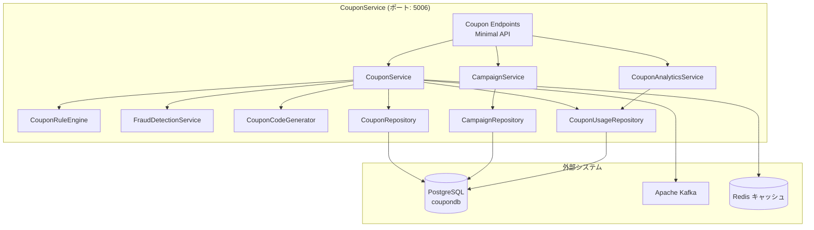
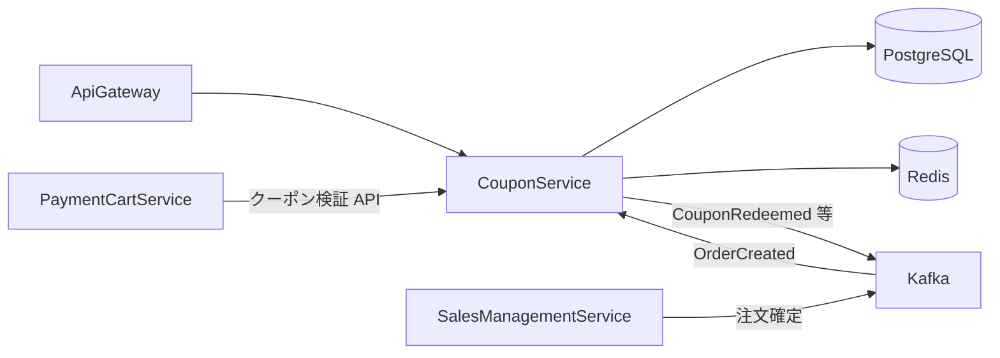
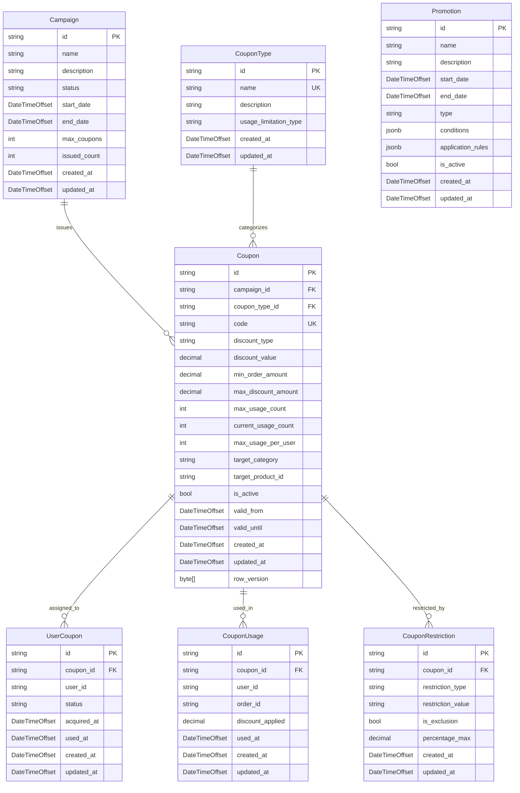
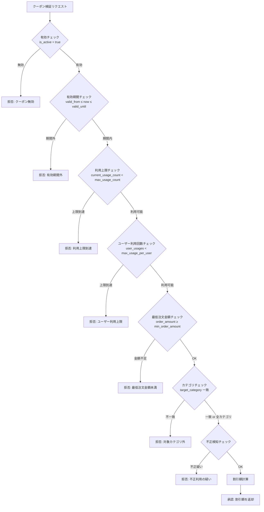

# クーポンサービス - 詳細設計書

## 1. 概要

CouponService は SkiShop EC プラットフォームにおけるクーポン・キャンペーン管理を担うマイクロサービスである。クーポンの発行・検証・利用のライフサイクル管理、ルールベースの適用条件エンジン、不正利用検知機能を提供する。

### 1.1 目的

- クーポンの作成・配布・利用・有効期限管理をドメインロジックとして一元管理する
- ルールエンジンによる柔軟なクーポン適用条件の定義・評価を提供する
- 不正利用検知による利用制限とリスク軽減を実現する
- キャンペーン単位でのクーポン配布管理とパフォーマンス分析をサポートする

### 1.2 スコープ

| 区分 | 内容 |
|------|------|
| **In Scope** | クーポンの CRUD、キャンペーン管理、クーポン適用ルールエンジン、不正利用検知、クーポン利用履歴管理、分析レポート |
| **Out of Scope** | 決済処理（PaymentCartService の管轄）、ポイント管理（PointService の管轄）、マーケティングメール配信（MailSendService の管轄） |

## 2. 技術スタック

### 開発環境

- **言語**: C# 14 (.NET 10 LTS)
- **フレームワーク**: ASP.NET Core 10 (Minimal API)
- **ビルドツール**: dotnet CLI / MSBuild
- **コンテナ化**: Docker 25.x
- **テスト**: xUnit, NSubstitute, Shouldly, WebApplicationFactory, Testcontainers

### 本番環境

- Azure Container Apps
- Azure Database for PostgreSQL
- Apache Kafka (Azure Event Hubs for Kafka)
- Azure Cache for Redis

### 主要ライブラリ

| ライブラリ | バージョン | 用途 |
|---------|---------|---------|
| ASP.NET Core 10 | 10.* | REST API |
| Microsoft.EntityFrameworkCore | 10.* | EF Core データアクセス |
| Npgsql.EntityFrameworkCore.PostgreSQL | 10.* | PostgreSQL プロバイダ |
| Confluent.Kafka | 2.* | Kafka イベント発行・購読 |
| StackExchange.Redis | 2.* | キャッシュ |
| FluentValidation | 11.* | 入力バリデーション |
| Serilog.AspNetCore | 8.* | 構造化ログ |
| OpenTelemetry.Extensions.Hosting | 1.* | 分散トレーシング・メトリクス |
| Polly | 8.* | 耐障害性（リトライ・サーキットブレーカー） |

## 3. サービス情報

| 項目 | 値 |
|------|-------|
| サービス名 | CouponService |
| ポート | 5006 |
| データベース | PostgreSQL (coupondb) |
| フレームワーク | ASP.NET Core 10 (Minimal API) |
| 言語バージョン | C# 14 (.NET 10) |
| イベントブローカー | Apache Kafka |
| キャッシュ | Redis |

## 4. システムアーキテクチャ

### 4.1 コンポーネントアーキテクチャ



### 4.2 マイクロサービス関係図



## 5. データモデル

### 5.1 Entity Relationship Diagram



### 5.2 テーブル定義

#### campaigns テーブル

| カラム | データ型 | 制約 | 説明 |
|--------|-----------|------------|-------------|
| id | VARCHAR(36) | PK | キャンペーン ID |
| name | VARCHAR(200) | NOT NULL | キャンペーン名 |
| description | TEXT | | キャンペーン説明 |
| status | VARCHAR(20) | NOT NULL | ステータス（DRAFT, ACTIVE, PAUSED, ENDED） |
| start_date | TIMESTAMP WITH TIME ZONE | NOT NULL | 開始日時 |
| end_date | TIMESTAMP WITH TIME ZONE | NOT NULL | 終了日時 |
| max_coupons | INTEGER | NOT NULL | 最大発行数 |
| issued_count | INTEGER | NOT NULL, DEFAULT 0 | 現在発行数 |
| created_at | TIMESTAMP WITH TIME ZONE | NOT NULL | 作成日時 |
| updated_at | TIMESTAMP WITH TIME ZONE | NOT NULL | 更新日時 |

**CHECK 制約**:
- `ck_campaigns_status`: `CHECK (status IN ('DRAFT', 'ACTIVE', 'PAUSED', 'ENDED'))`

#### coupons テーブル

| カラム | データ型 | 制約 | 説明 |
|--------|-----------|------------|-------------|
| id | VARCHAR(36) | PK | クーポン ID |
| campaign_id | VARCHAR(36) | FK(campaigns.id) | キャンペーン ID |
| code | VARCHAR(30) | UNIQUE, NOT NULL | クーポンコード |
| discount_type | VARCHAR(20) | NOT NULL | 割引タイプ（PERCENTAGE, FIXED_AMOUNT, FREE_SHIPPING） |
| discount_value | DECIMAL(10,2) | NOT NULL | 割引値 |
| min_order_amount | DECIMAL(10,2) | NOT NULL, DEFAULT 0 | 最低注文金額 |
| max_discount_amount | DECIMAL(10,2) | | 最大割引額（率割引時の上限） |
| max_usage_count | INTEGER | NOT NULL | 全体最大利用回数 |
| current_usage_count | INTEGER | NOT NULL, DEFAULT 0 | 現在利用回数 |
| max_usage_per_user | INTEGER | NOT NULL, DEFAULT 1 | ユーザー当たり最大利用回数 |
| target_category | VARCHAR(100) | | 対象カテゴリ（null = 全カテゴリ） |
| target_product_id | VARCHAR(36) | | 対象商品 ID（null = 全商品） |
| is_active | BOOLEAN | NOT NULL, DEFAULT TRUE | 有効フラグ |
| valid_from | TIMESTAMP WITH TIME ZONE | NOT NULL | 有効開始日時 |
| valid_until | TIMESTAMP WITH TIME ZONE | NOT NULL | 有効終了日時 |
| created_at | TIMESTAMP WITH TIME ZONE | NOT NULL | 作成日時 |
| updated_at | TIMESTAMP WITH TIME ZONE | NOT NULL | 更新日時 |
| row_version | BYTEA | | 楽観的ロックバージョン |

**CHECK 制約**:
- `ck_coupons_discount_value`: `CHECK (discount_value > 0)`
- `ck_coupons_min_order_amount`: `CHECK (min_order_amount >= 0)`
- `ck_coupons_max_usage_count`: `CHECK (max_usage_count > 0)`
- `ck_coupons_discount_type`: `CHECK (discount_type IN ('PERCENTAGE', 'FIXED_AMOUNT', 'FREE_SHIPPING'))`

#### user_coupons テーブル

| カラム | データ型 | 制約 | 説明 |
|--------|-----------|------------|-------------|
| id | VARCHAR(36) | PK | ユーザークーポン ID |
| coupon_id | VARCHAR(36) | FK(coupons.id), NOT NULL | クーポン ID |
| user_id | VARCHAR(36) | NOT NULL | ユーザー ID |
| status | VARCHAR(20) | NOT NULL | ステータス（AVAILABLE, USED, EXPIRED） |
| acquired_at | TIMESTAMP WITH TIME ZONE | NOT NULL | 取得日時 |
| used_at | TIMESTAMP WITH TIME ZONE | | 利用日時 |
| created_at | TIMESTAMP WITH TIME ZONE | NOT NULL | 作成日時 |
| updated_at | TIMESTAMP WITH TIME ZONE | NOT NULL | 更新日時 |

**CHECK 制約**:
- `ck_user_coupons_status`: `CHECK (status IN ('AVAILABLE', 'USED', 'EXPIRED'))`

**複合ユニーク制約**: (coupon_id, user_id)（クーポンごとに 1 ユーザー 1 取得）

#### coupon_usages テーブル

| カラム | データ型 | 制約 | 説明 |
|--------|-----------|------------|-------------|
| id | VARCHAR(36) | PK | 利用履歴 ID |
| coupon_id | VARCHAR(36) | FK(coupons.id), NOT NULL | クーポン ID |
| user_id | VARCHAR(36) | NOT NULL | ユーザー ID |
| order_id | VARCHAR(36) | NOT NULL | 注文 ID |
| discount_applied | DECIMAL(10,2) | NOT NULL | 適用された割引額 |
| used_at | TIMESTAMP WITH TIME ZONE | NOT NULL | 利用日時 |
| created_at | TIMESTAMP WITH TIME ZONE | NOT NULL | 作成日時 |
| updated_at | TIMESTAMP WITH TIME ZONE | NOT NULL | 更新日時 |

**インデックス**:
- `idx_coupon_usages_coupon_user` ON (coupon_id, user_id)
- `idx_coupon_usages_order` ON order_id

#### coupon_types テーブル

| カラム | データ型 | 制約 | 説明 |
|--------|-----------|------------|-------------|
| id | VARCHAR(36) | PK | クーポン種別 ID |
| name | VARCHAR(100) | NOT NULL, UNIQUE | クーポン種別名 |
| description | TEXT | | 種別の説明 |
| usage_limitation_type | VARCHAR(50) | NOT NULL | 利用制限タイプ（SINGLE_USE, MULTI_USE, TIME_LIMITED） |
| created_at | TIMESTAMP WITH TIME ZONE | NOT NULL | 作成日時 |
| updated_at | TIMESTAMP WITH TIME ZONE | NOT NULL | 更新日時 |

**CHECK 制約**:
- `ck_coupon_types_usage_limitation`: `CHECK (usage_limitation_type IN ('SINGLE_USE', 'MULTI_USE', 'TIME_LIMITED'))`

#### coupon_restrictions テーブル

| カラム | データ型 | 制約 | 説明 |
|--------|-----------|------------|-------------|
| id | VARCHAR(36) | PK | 制限 ID |
| coupon_id | VARCHAR(36) | FK(coupons.id), NOT NULL | クーポン ID |
| restriction_type | VARCHAR(20) | NOT NULL | 制限タイプ（PRODUCT, CATEGORY, USER） |
| restriction_value | VARCHAR(255) | NOT NULL | 制限対象値（商品 ID / カテゴリ名 / ユーザー ID） |
| is_exclusion | BOOLEAN | NOT NULL, DEFAULT FALSE | 除外条件フラグ（true = 対象外とする） |
| percentage_max | DECIMAL(10,2) | | パーセンテージ上限 |
| created_at | TIMESTAMP WITH TIME ZONE | NOT NULL | 作成日時 |
| updated_at | TIMESTAMP WITH TIME ZONE | NOT NULL | 更新日時 |

**CHECK 制約**:
- `ck_coupon_restrictions_type`: `CHECK (restriction_type IN ('PRODUCT', 'CATEGORY', 'USER'))`
- `ck_coupon_restrictions_percentage_max`: `CHECK (percentage_max IS NULL OR percentage_max > 0)`

**FK 制約**: `coupon_id` → `coupons(id)` ON DELETE CASCADE, ON UPDATE CASCADE

**インデックス**:
- `idx_coupon_restrictions_coupon_id` ON coupon_id

#### promotions テーブル

| カラム | データ型 | 制約 | 説明 |
|--------|-----------|------------|-------------|
| id | VARCHAR(36) | PK | プロモーション ID |
| name | VARCHAR(200) | NOT NULL | プロモーション名 |
| description | TEXT | | プロモーション説明 |
| start_date | TIMESTAMP WITH TIME ZONE | NOT NULL | 開始日時 |
| end_date | TIMESTAMP WITH TIME ZONE | NOT NULL | 終了日時 |
| type | VARCHAR(50) | NOT NULL | プロモーション種別 |
| conditions | JSONB | | 適用条件（JSON 形式） |
| application_rules | JSONB | | 適用ルール（JSON 形式） |
| is_active | BOOLEAN | NOT NULL, DEFAULT TRUE | 有効フラグ |
| created_at | TIMESTAMP WITH TIME ZONE | NOT NULL | 作成日時 |
| updated_at | TIMESTAMP WITH TIME ZONE | NOT NULL | 更新日時 |

#### outbox_events テーブル（ADR-0005 準拠）

| カラム | データ型 | 制約 | 説明 |
|--------|-----------|------------|-------------|
| id | VARCHAR(36) | PK | イベント ID |
| event_type | VARCHAR(255) | NOT NULL | イベントタイプ |
| aggregate_id | VARCHAR(36) | NOT NULL | 集約 ID |
| payload | TEXT | NOT NULL | イベントペイロード（JSON） |
| created_at | TIMESTAMP WITH TIME ZONE | NOT NULL | 作成日時 |
| published_at | TIMESTAMP WITH TIME ZONE | | 発行日時 |
| retry_count | INTEGER | NOT NULL, DEFAULT 0 | リトライ回数 |
| max_retries | INTEGER | NOT NULL, DEFAULT 5 | 最大リトライ回数 |
| last_error | VARCHAR(2000) | | 最終エラーメッセージ |
| status | VARCHAR(20) | NOT NULL, DEFAULT 'PENDING' | ステータス |

**CHECK 制約**:
- `ck_outbox_events_status`: `CHECK (status IN ('PENDING', 'PROCESSING', 'PUBLISHED', 'FAILED', 'DEAD_LETTER'))`
- `ck_outbox_events_retry_count`: `CHECK (retry_count >= 0)`

**部分インデックス**:
```sql
CREATE INDEX idx_outbox_events_pending
    ON outbox_events (created_at ASC)
    WHERE status = 'PENDING';
```

## 6. API 設計

### 6.1 一般ユーザー向け API

| メソッド | パス | ロール | 説明 |
|--------|------|------|-------------|
| GET | /api/v1/coupons/available | USER | 利用可能なクーポン一覧 |
| POST | /api/v1/coupons/{code}/acquire | USER | クーポン取得 |
| GET | /api/v1/coupons/mine | USER | 自分のクーポン一覧 |
| POST | /api/v1/coupons/validate | USER | クーポン適用可否チェック |

### 6.2 管理者向け API

| メソッド | パス | ロール | 説明 |
|--------|------|------|-------------|
| GET | /api/v1/admin/campaigns | ADMIN | キャンペーン一覧 |
| POST | /api/v1/admin/campaigns | ADMIN | キャンペーン作成 |
| GET | /api/v1/admin/campaigns/{id} | ADMIN | キャンペーン詳細 |
| PUT | /api/v1/admin/campaigns/{id} | ADMIN | キャンペーン更新 |
| POST | /api/v1/admin/campaigns/{id}/activate | ADMIN | キャンペーン有効化 |
| POST | /api/v1/admin/campaigns/{id}/pause | ADMIN | キャンペーン一時停止 |
| GET | /api/v1/admin/coupons | ADMIN | クーポン一覧 |
| POST | /api/v1/admin/coupons | ADMIN | クーポン作成 |
| GET | /api/v1/admin/coupons/{id} | ADMIN | クーポン詳細 |
| PUT | /api/v1/admin/coupons/{id} | ADMIN | クーポン更新 |
| DELETE | /api/v1/admin/coupons/{id} | ADMIN | クーポン無効化（論理削除） |
| GET | /api/v1/admin/coupons/{id}/usages | ADMIN | クーポン利用履歴 |
| GET | /api/v1/admin/coupons/analytics | ADMIN | クーポン分析レポート |

### 6.3 内部 API（PaymentCartService 向け）

| メソッド | パス | 説明 |
|--------|------|-------------|
| POST | /api/v1/internal/coupons/calculate | 注文に対する割引額計算 |
| POST | /api/v1/internal/coupons/redeem | クーポン利用確定 |
| POST | /api/v1/internal/coupons/release | クーポン利用取消（注文キャンセル時） |

### 6.4 リクエスト/レスポンス DTO

```csharp
// === リクエスト DTO ===
public record CreateCampaignRequest(
    [Required, StringLength(200)] string Name,
    string? Description,
    [Required] DateTimeOffset StartDate,
    [Required] DateTimeOffset EndDate,
    [Range(1, int.MaxValue)] int MaxCoupons);

public record CreateCouponRequest(
    string? CampaignId,
    [Required, StringLength(30)] string Code,
    [Required] string DiscountType,
    [Required, Range(0.01, double.MaxValue)] decimal DiscountValue,
    decimal MinOrderAmount = 0,
    decimal? MaxDiscountAmount = null,
    [Range(1, int.MaxValue)] int MaxUsageCount = 1,
    [Range(1, int.MaxValue)] int MaxUsagePerUser = 1,
    string? TargetCategory = null,
    string? TargetProductId = null,
    [Required] DateTimeOffset ValidFrom = default,
    [Required] DateTimeOffset ValidUntil = default);

public record ValidateCouponRequest(
    [Required] string CouponCode,
    [Required] string UserId,
    [Required, Range(0.01, double.MaxValue)] decimal OrderAmount,
    List<OrderItemDto>? Items = null);

public record CalculateDiscountRequest(
    [Required] string CouponCode,
    [Required] string UserId,
    [Required, Range(0.01, double.MaxValue)] decimal OrderAmount,
    List<OrderItemDto>? Items = null);

public record RedeemCouponRequest(
    [Required] string CouponCode,
    [Required] string UserId,
    [Required] string OrderId,
    [Required, Range(0.01, double.MaxValue)] decimal DiscountApplied);

public record OrderItemDto(string ProductId, string Category, decimal Price, int Quantity);

// === レスポンス DTO ===
public record CouponResponse(
    string Id, string Code, string DiscountType, decimal DiscountValue,
    decimal MinOrderAmount, decimal? MaxDiscountAmount,
    int MaxUsageCount, int CurrentUsageCount,
    string? TargetCategory, string? TargetProductId,
    bool IsActive, DateTimeOffset ValidFrom, DateTimeOffset ValidUntil);

public record CampaignResponse(
    string Id, string Name, string? Description, string Status,
    DateTimeOffset StartDate, DateTimeOffset EndDate,
    int MaxCoupons, int IssuedCount);

public record ValidationResponse(
    bool IsValid, string? Message, decimal? DiscountAmount);

public record DiscountCalculationResponse(
    decimal OriginalAmount, decimal DiscountAmount, decimal FinalAmount);

public record UserCouponResponse(
    string Id, string CouponCode, string DiscountType, decimal DiscountValue,
    string Status, DateTimeOffset AcquiredAt, DateTimeOffset? UsedAt, DateTimeOffset ValidUntil);

public record CouponAnalyticsResponse(
    long TotalCouponsIssued, long TotalCouponsUsed, decimal TotalDiscountAmount,
    double RedemptionRate, Dictionary<string, long> UsageByCategory);
```

## 7. クーポンルールエンジン

### 7.1 アーキテクチャ



### 7.2 ルールエンジン実装

```csharp
public class CouponRuleEngine(
    TimeProvider timeProvider,
    ILogger<CouponRuleEngine> logger) : ICouponRuleEngine
{
    public ValidationResponse Validate(Coupon coupon, ValidateCouponRequest request,
        int userUsageCount)
    {
        // 有効チェック
        if (!coupon.IsActive)
            return new ValidationResponse(false, "クーポンが無効です", null);

        // 有効期間チェック
        var now = timeProvider.GetUtcNow();
        if (now < coupon.ValidFrom || now > coupon.ValidUntil)
            return new ValidationResponse(false, "クーポンの有効期間外です", null);

        // 全体利用上限チェック
        if (coupon.CurrentUsageCount >= coupon.MaxUsageCount)
            return new ValidationResponse(false, "クーポンの利用上限に達しました", null);

        // ユーザー利用回数チェック
        if (userUsageCount >= coupon.MaxUsagePerUser)
            return new ValidationResponse(false,
                "このクーポンは既に利用済みです", null);

        // 最低注文金額チェック
        if (request.OrderAmount < coupon.MinOrderAmount)
            return new ValidationResponse(false,
                $"最低注文金額 {coupon.MinOrderAmount:N0} 円以上から適用可能です", null);

        // カテゴリチェック
        if (coupon.TargetCategory is not null && request.Items is { Count: > 0 })
        {
            var hasMatchingItem = request.Items.Any(
                i => i.Category == coupon.TargetCategory);
            if (!hasMatchingItem)
                return new ValidationResponse(false,
                    $"対象カテゴリ '{coupon.TargetCategory}' の商品が含まれていません",
                    null);
        }

        // 割引額計算
        var discount = CalculateDiscount(coupon, request.OrderAmount);

        logger.LogInformation(
            "クーポン検証成功: {CouponCode}, 割引額: {Discount}",
            coupon.Code, discount);

        return new ValidationResponse(true, null, discount);
    }

    private static decimal CalculateDiscount(Coupon coupon, decimal orderAmount)
    {
        var discount = coupon.DiscountType switch
        {
            "PERCENTAGE" => orderAmount * coupon.DiscountValue / 100m,
            "FIXED_AMOUNT" => coupon.DiscountValue,
            "FREE_SHIPPING" => 0m, // 送料無料: 割引額は 0（配送料免除は別途処理）
            _ => 0m
        };

        // 最大割引額の適用
        if (coupon.MaxDiscountAmount.HasValue &&
            discount > coupon.MaxDiscountAmount.Value)
            discount = coupon.MaxDiscountAmount.Value;

        // 割引額は注文金額を超えない
        return Math.Min(discount, orderAmount);
    }
}
```

## 8. 不正利用検知

### 8.1 検知ルール

| ルール | 閾値 | 対応 |
|--------|------|------|
| 短時間の大量クーポン利用 | 同一ユーザーが 10 分以内に 3 回以上利用 | ブロック + アラート |
| 同一 IP からの大量取得 | 10 分以内に同一 IP から 10 件以上取得 | レート制限 |
| 異常な割引パターン | 全注文でクーポン利用（10 件連続） | 要調査フラグ |

### 8.2 実装

```csharp
public class FraudDetectionService(
    ICouponUsageRepository usageRepository,
    TimeProvider timeProvider,
    ILogger<FraudDetectionService> logger) : IFraudDetectionService
{
    public async Task<bool> IsSuspiciousAsync(string userId,
        CancellationToken ct = default)
    {
        var recentUsages = await usageRepository
            .CountRecentUsagesAsync(userId,
                timeProvider.GetUtcNow().AddMinutes(-10).UtcDateTime, ct);

        if (recentUsages >= 3)
        {
            logger.LogWarning(
                "不正利用の疑い: UserId={UserId}, 直近10分の利用回数={Count}",
                userId, recentUsages);
            return true;
        }
        return false;
    }
}
```

## 9. イベント設計

### 9.1 発行するイベント

| イベントタイプ | Kafka トピック | トリガー | ペイロード |
|-------------|--------------|---------|----------|
| CouponApplied | `coupon.applied` | クーポン利用確定 | { couponId, couponCode, userId, orderId, discountAmount } |
| CouponReleased | `coupon.released` | クーポン利用取消（Saga 補償トランザクション完了時） | { couponId, couponCode, userId, orderId, releasedAmount, OccurredAt } |
| CouponExpired | `coupon.expired` | クーポン期限切れ | { couponId, code } |

> **備考**: イベント発行は Outbox パターン（ADR-0005）で `outbox_events` テーブルに書き込み後、`OutboxPublisher`（BackgroundService）が Kafka に発行する。直接 Kafka に Produce することは禁止。

### 9.2 購読するイベント

| Kafka トピック | 発行元 | 処理内容 |
|--------------|-------|---------|
| `order.cancelled` | SalesManagementService | クーポン利用取消・返却 |
| `user.deleted` | UserManagementService | ユーザー関連クーポンデータの仮名化 |

### 9.3 イベントペイロード定義

```csharp
public record CouponAppliedEvent(
    string CouponId, string CouponCode, string UserId, string OrderId,
    decimal DiscountApplied, DateTimeOffset OccurredAt);

public record CouponReleasedEvent(
    string CouponId, string CouponCode, string UserId, string OrderId,
    decimal ReleasedAmount, DateTimeOffset OccurredAt);

public record CouponExpiredEvent(
    string CouponId, string Code, DateTimeOffset OccurredAt);
```

## 10. gRPC サービス定義（Saga ステップ 3）

CouponService は Saga ステップ 3 として SalesManagementService から gRPC で呼び出される。REST API（`/api/v1/`）と gRPC を同一ポートで多重化する（`MapGrpcService<T>` + `MapEndpoints`）。

### 10.1 Proto 定義

```protobuf
// SkiShop.Contracts/Protos/coupon.proto
syntax = "proto3";

package skishop.coupon.v1;

option csharp_namespace = "SkiShop.Contracts.Coupon.V1";

service CouponService {
  // Saga ステップ 3: クーポン検証・適用（Deadline: 300ms）
  rpc ValidateCoupon (ValidateCouponRequest) returns (ValidateCouponResponse);
  // 補償トランザクション: クーポン利用取消
  rpc ReleaseCoupon (ReleaseCouponRequest) returns (ReleaseCouponResponse);
}

message ValidateCouponRequest {
  string coupon_code = 1;
  string user_id = 2;
  string order_id = 3;
  string order_amount = 4; // decimal を文字列で送信
  repeated OrderItem items = 5;
}

message OrderItem {
  string product_id = 1;
  string category = 2;
  string price = 3;
  int32 quantity = 4;
}

message ValidateCouponResponse {
  bool is_valid = 1;
  string message = 2;
  string discount_amount = 3; // decimal を文字列で送信
  string coupon_id = 4;
}

message ReleaseCouponRequest {
  string coupon_code = 1;
  string user_id = 2;
  string order_id = 3;
}

message ReleaseCouponResponse {
  bool success = 1;
  string message = 2;
}
```

### 10.2 gRPC サーバー実装

```csharp
[Authorize(Policy = "InternalServiceOnly")]
public class CouponGrpcService(
    ICouponService couponService,
    ILogger<CouponGrpcService> logger) : SkiShop.Contracts.Coupon.CouponService.CouponServiceBase
{
    public override async Task<ValidateCouponResponse> ValidateCoupon(
        ValidateCouponRequest request, ServerCallContext context)
    {
        var result = await couponService.ValidateAndApplyAsync(
            request.CouponCode, request.UserId, request.OrderId,
            decimal.Parse(request.OrderAmount),
            context.CancellationToken);

        return new ValidateCouponResponse
        {
            IsValid = result.IsValid,
            Message = result.Message ?? string.Empty,
            DiscountAmount = result.DiscountAmount?.ToString("F2") ?? "0",
            CouponId = result.CouponId ?? string.Empty
        };
    }

    [Authorize(Policy = "InternalServiceOnly")]
    public override async Task<ReleaseCouponResponse> ReleaseCoupon(
        ReleaseCouponRequest request, ServerCallContext context)
    {
        await couponService.ReleaseCouponAsync(
            request.CouponCode, request.UserId, request.OrderId,
            context.CancellationToken);

        return new ReleaseCouponResponse { Success = true };
    }
}

// Program.cs での登録
app.MapGrpcService<CouponGrpcService>();
```

### 10.3 gRPC Deadline 設計

| 項目 | 値 |
|------|------|
| Saga ステップ 3 Deadline | 300ms（クーポン検証処理 65ms + gRPC オーバーヘッド 15ms + マージン） |
| 補償トランザクション Deadline | 500ms |
| クライアント側 Retry | 最大 1 回（Deadline 内で完了する場合のみ） |

## 11. Outbox パターン（ADR-0005 準拠）

### 11.1 OutboxPublisher（BackgroundService）

イベント発行は `outbox_events` テーブルへの書き込み → `OutboxPublisher` による Kafka 発行のパターンで実装する。直接 Kafka に Produce することは禁止。

**排他制御**: `minReplicas: 2` 以上の環境で同一イベントの二重発行を防止するため、PostgreSQL Advisory Lock（`pg_try_advisory_lock`）によるリーダー選出パターンを適用する（spec.md BackgroundService リーダー選出パターン準拚）。

**ステータス遷移**: `PENDING → PROCESSING → PUBLISHED`。イベント取得時に `SELECT ... FOR UPDATE` + `PROCESSING` 更新を行い、複数インスタンスの競合を防止する。

```csharp
public class OutboxPublisher(
    IServiceScopeFactory scopeFactory,
    IProducer<string, string> producer,
    TimeProvider timeProvider,
    ILogger<OutboxPublisher> logger) : BackgroundService
{
    private static readonly TimeSpan MinPollingInterval = TimeSpan.FromMilliseconds(100);
    private static readonly TimeSpan MaxPollingInterval = TimeSpan.FromSeconds(5);
    private TimeSpan _currentInterval = TimeSpan.FromMilliseconds(500);

    protected override async Task ExecuteAsync(CancellationToken stoppingToken)
    {
        while (!stoppingToken.IsCancellationRequested)
        {
            using var scope = scopeFactory.CreateScope();
            var context = scope.ServiceProvider.GetRequiredService<AppDbContext>();

            // ── Advisory Lock によるリーダー選出（spec.md 準拚） ──
            var acquired = await context.Database
                .SqlQueryRaw<bool>(
                    "SELECT pg_try_advisory_lock(hashtext('outbox_publisher'))")
                .FirstAsync(stoppingToken);

            if (!acquired)
            {
                // ロック取得失敗 = 他インスタンスがリーダー。スキップして待機
                await Task.Delay(MaxPollingInterval, stoppingToken);
                continue;
            }

            try
            {
                // ── PENDING イベントを FOR UPDATE で取得し PROCESSING に遷移 ──
                var pendingEvents = await context.OutboxEvents
                    .FromSqlInterpolated($"""
                        SELECT * FROM outbox_events
                        WHERE status = 'PENDING'
                        ORDER BY created_at ASC
                        LIMIT 100
                        FOR UPDATE SKIP LOCKED
                        """)
                    .ToListAsync(stoppingToken);

                // PROCESSING にステータス更新（競合防止）
                foreach (var evt in pendingEvents)
                    evt.Status = "PROCESSING";
                await context.SaveChangesAsync(stoppingToken);

                // ── Kafka へ Publish ──
                foreach (var evt in pendingEvents)
                {
                    try
                    {
                        await producer.ProduceAsync(evt.EventType, new Message<string, string>
                        {
                            Key = evt.AggregateId,
                            Value = evt.Payload
                        }, stoppingToken);
                        evt.Status = "PUBLISHED";
                        evt.PublishedAt = timeProvider.GetUtcNow().UtcDateTime;
                    }
                    catch (Exception ex)
                    {
                        evt.RetryCount++;
                        evt.LastError = ex.Message[..Math.Min(ex.Message.Length, 2000)];
                        evt.Status = evt.RetryCount >= evt.MaxRetries
                            ? "FAILED"
                            : "PENDING"; // リトライ対象に戻す
                        logger.LogError(ex, "Outbox publish failed: {EventId}, retry: {RetryCount}",
                            evt.Id, evt.RetryCount);
                    }
                }
                await context.SaveChangesAsync(stoppingToken);

                // 動的バックオフ: イベントあり→高速、なし→指数バックオフ（100ms〜5s）
                _currentInterval = pendingEvents.Count > 0
                    ? MinPollingInterval
                    : TimeSpan.FromTicks(Math.Min(
                        _currentInterval.Ticks * 2,
                        MaxPollingInterval.Ticks));
            }
            finally
            {
                // ── Advisory Lock 解放 ──
                await context.Database
                    .SqlQueryRaw<bool>(
                        "SELECT pg_advisory_unlock(hashtext('outbox_publisher'))")
                    .FirstAsync(stoppingToken);
            }

            await Task.Delay(_currentInterval, stoppingToken);
        }
    }
}
```

### 11.2 Outbox イベント書き込みパターン

```csharp
// Service 層: DB トランザクション内で Outbox に書き込み
public async Task RedeemCouponAsync(RedeemCouponRequest request, CancellationToken ct)
{
    await using var transaction = await _context.Database.BeginTransactionAsync(ct);
    try
    {
        // クーポン利用記録
        var usage = new CouponUsage { /* ... */ };
        await _context.CouponUsages.AddAsync(usage, ct);

        // Outbox にイベント書き込み（Kafka 直接 Produce 禁止）
        await _context.OutboxEvents.AddAsync(new OutboxEvent
        {
            EventType = "coupon.applied",
            AggregateId = request.CouponCode,
            Payload = JsonSerializer.Serialize(new CouponAppliedEvent(
                usage.CouponId, request.CouponCode, request.UserId,
                request.OrderId, request.DiscountApplied, DateTimeOffset.UtcNow))
        }, ct);

        await _context.SaveChangesAsync(ct);
        await transaction.CommitAsync(ct);
    }
    catch
    {
        await transaction.RollbackAsync(ct);
        throw;
    }
}
```

## 12. キャッシュ戦略

### 12.1 Redis キャッシュ設計

| キー | 値 | TTL | 用途 |
|-----|-----|-----|------|
| `coupon:{code}` | Coupon エンティティ JSON | 10 分 | クーポンコード → 詳細の高速ルックアップ |
| `coupon:usage:{couponId}:{userId}` | 利用回数 (int) | 5 分 | ユーザー利用回数の高速チェック |

### 12.2 キャッシュ無効化

- クーポン利用確定時: `coupon:{code}` と `coupon:usage:{couponId}:{userId}` を削除
- クーポン更新時: `coupon:{code}` を削除

```csharp
public class CouponCacheService(
    IConnectionMultiplexer redis,
    ILogger<CouponCacheService> logger) : ICouponCacheService
{
    private readonly IDatabase _db = redis.GetDatabase();

    public async Task<Coupon?> GetCouponAsync(string code, CancellationToken ct = default)
    {
        var cached = await _db.StringGetAsync($"coupon:{code}");
        return cached.HasValue
            ? JsonSerializer.Deserialize<Coupon>(cached!)
            : null;
    }

    public async Task SetCouponAsync(string code, Coupon coupon,
        CancellationToken ct = default)
    {
        await _db.StringSetAsync($"coupon:{code}",
            JsonSerializer.Serialize(coupon),
            TimeSpan.FromMinutes(10));
    }

    public async Task InvalidateAsync(string code, CancellationToken ct = default)
    {
        await _db.KeyDeleteAsync($"coupon:{code}");
        logger.LogInformation("キャッシュ無効化: coupon:{Code}", code);
    }
}
```

## 13. セキュリティ設計

### 13.1 認証・認可

- 一般ユーザー API: `RequireAuthorization("UserOrAdmin")` — 認証済みユーザー（User ロールまたは Admin ロール）
- 管理者 API: `RequireAuthorization("AdminOnly")` — Admin ロールのみ
- 内部 API: `RequireAuthorization("InternalServiceOnly")` — サービス間 Client Credentials フロー（OAuth2）による認証
- gRPC API: `[Authorize(Policy = "InternalServiceOnly")]` — Saga コーディネーター専用

#### 13.1.1 内部サービス間認証の実装パターン

サービス間 API（REST 内部 API / gRPC）は、OAuth2 Client Credentials フローで取得した JWT トークンで認証する。
`X-Internal-Service-Key` ヘッダー方式は廃止し、Managed Identity ベースの Client Credentials フローに統一する。

```csharp
// Program.cs: InternalServiceOnly ポリシー定義
builder.Services.AddAuthorization(options =>
{
    options.AddPolicy("AdminOnly", p => p.RequireRole("Admin"));
    options.AddPolicy("UserOrAdmin", p => p.RequireRole("User", "Admin"));
    options.AddPolicy("InternalServiceOnly", p =>
        p.RequireClaim("client_id")
         .AddRequirements(new InternalServiceRequirement()));
    options.FallbackPolicy = new AuthorizationPolicyBuilder()
        .RequireAuthenticatedUser()
        .Build();
});

// InternalServiceRequirement: client_id クレームの存在 + 許可リストチェック
public class InternalServiceRequirement : IAuthorizationRequirement;

public class InternalServiceHandler(
    IConfiguration configuration,
    ILogger<InternalServiceHandler> logger)
    : AuthorizationHandler<InternalServiceRequirement>
{
    protected override Task HandleRequirementAsync(
        AuthorizationHandlerContext context,
        InternalServiceRequirement requirement)
    {
        var clientId = context.User.FindFirstValue("client_id");
        var allowedClients = configuration
            .GetSection("Auth:AllowedInternalClients")
            .Get<string[]>() ?? [];

        if (clientId is not null && allowedClients.Contains(clientId))
        {
            context.Succeed(requirement);
        }
        else
        {
            logger.LogWarning(
                "内部 API へのアクセス拒否: ClientId={ClientId}", clientId);
        }
        return Task.CompletedTask;
    }
}
```

```csharp
// gRPC クライアント側（SalesManagementService 等）: Client Credentials でトークン取得
builder.Services.AddGrpcClient<CouponGrpcService.CouponGrpcServiceClient>(o =>
{
    o.Address = new Uri("https://coupon-service:5006");
})
.AddCallCredentials(async (context, metadata, serviceProvider) =>
{
    var tokenService = serviceProvider.GetRequiredService<IInternalTokenService>();
    var token = await tokenService.GetClientCredentialsTokenAsync(
        scope: "coupon:apply coupon:release",
        context.CancellationToken);
    metadata.Add("Authorization", $"Bearer {token}");
});
```

### 13.2 IDOR 防止

クーポン取得・利用時に `ClaimsPrincipal` からユーザー ID を取得し、リクエストの `userId` と照合する:

```csharp
group.MapPost("/{code}/acquire", async (
    string code,
    ClaimsPrincipal user,
    ICouponService couponService,
    CancellationToken ct) =>
{
    var userId = user.FindFirstValue(ClaimTypes.NameIdentifier)
        ?? throw new UnauthorizedException();
    return Results.Ok(await couponService.AcquireCouponAsync(code, userId, ct));
}).RequireAuthorization();
```

### 13.3 入力バリデーション

全リクエスト DTO に Data Annotations を適用。FluentValidation でのカスタムバリデーションも併用:

```csharp
public class CreateCouponRequestValidator : AbstractValidator<CreateCouponRequest>
{
    public CreateCouponRequestValidator()
    {
        RuleFor(x => x.Code)
            .NotEmpty().MaximumLength(30)
            .Matches("^[A-Z0-9-]+$")
            .WithMessage("クーポンコードは大文字英数字とハイフンのみ使用可能です");

        RuleFor(x => x.DiscountType)
            .Must(dt => dt is "PERCENTAGE" or "FIXED_AMOUNT" or "FREE_SHIPPING")
            .WithMessage("割引タイプは PERCENTAGE, FIXED_AMOUNT, FREE_SHIPPING のいずれかのみ有効です");

        RuleFor(x => x.DiscountValue)
            .GreaterThan(0)
            .WithMessage("割引値は 0 より大きい値を指定してください");

        When(x => x.DiscountType == "PERCENTAGE", () =>
        {
            RuleFor(x => x.DiscountValue)
                .LessThanOrEqualTo(100)
                .WithMessage("割引率は 100% 以下を指定してください");
        });

        RuleFor(x => x.ValidUntil)
            .GreaterThan(x => x.ValidFrom)
            .WithMessage("有効終了日は有効開始日より後の日時を指定してください");
    }
}
```

## 14. エラーコード

| コード | HTTP ステータス | 説明 |
|--------|-------------|-------------|
| CPN-4001 | 404 | クーポンが見つからない |
| CPN-4002 | 422 | クーポンの有効期間外 |
| CPN-4003 | 422 | クーポンの利用上限到達 |
| CPN-4004 | 422 | ユーザーの利用上限到達 |
| CPN-4005 | 422 | 最低注文金額未満 |
| CPN-4006 | 422 | 対象カテゴリ外 |
| CPN-4007 | 422 | 不正利用の疑い |
| CPN-4008 | 409 | クーポン取得済み（重複） |
| CPN-4009 | 422 | キャンペーン発行上限到達 |
| CPN-4010 | 422 | クーポンが無効 |
| CPN-5001 | 500 | データベースエラー |
| CPN-5002 | 503 | 外部サービス通信エラー |

## 15. プロジェクト構成

```
CouponService/
├── CouponService.csproj
├── Program.cs
├── Endpoints/
│   ├── CouponEndpoints.cs
│   ├── CampaignEndpoints.cs
│   └── InternalCouponEndpoints.cs
├── GrpcServices/
│   └── CouponGrpcService.cs
├── Services/
│   ├── Interfaces/
│   │   ├── ICouponService.cs
│   │   ├── ICampaignService.cs
│   │   ├── ICouponRuleEngine.cs
│   │   ├── IFraudDetectionService.cs
│   │   ├── ICouponAnalyticsService.cs
│   │   ├── ICouponCacheService.cs
│   │   └── ICouponCodeGenerator.cs
│   ├── CouponService.cs
│   ├── CampaignService.cs
│   ├── CouponRuleEngine.cs
│   ├── FraudDetectionService.cs
│   ├── CouponAnalyticsService.cs
│   ├── CouponCacheService.cs
│   └── CouponCodeGenerator.cs
├── Consumers/
│   └── OrderEventConsumer.cs
├── BackgroundServices/
│   ├── OutboxPublisher.cs
│   └── CouponExpirationChecker.cs
├── Models/
│   ├── Campaign.cs
│   ├── Coupon.cs
│   ├── CouponType.cs
│   ├── CouponRestriction.cs
│   ├── Promotion.cs
│   ├── UserCoupon.cs
│   ├── CouponUsage.cs
│   └── OutboxEvent.cs
├── DTOs/
│   ├── Requests/
│   │   ├── CreateCampaignRequest.cs
│   │   ├── CreateCouponRequest.cs
│   │   ├── ValidateCouponRequest.cs
│   │   ├── CalculateDiscountRequest.cs
│   │   └── RedeemCouponRequest.cs
│   └── Responses/
│       ├── CouponResponse.cs
│       ├── CampaignResponse.cs
│       ├── ValidationResponse.cs
│       ├── DiscountCalculationResponse.cs
│       ├── UserCouponResponse.cs
│       └── CouponAnalyticsResponse.cs
├── Validators/
│   ├── CreateCouponRequestValidator.cs
│   └── CreateCampaignRequestValidator.cs
├── Repositories/
│   ├── Interfaces/
│   │   ├── ICouponRepository.cs
│   │   ├── ICampaignRepository.cs
│   │   ├── ICouponRestrictionRepository.cs
│   │   └── ICouponUsageRepository.cs
│   ├── CouponRepository.cs
│   ├── CampaignRepository.cs
│   ├── CouponRestrictionRepository.cs
│   └── CouponUsageRepository.cs
├── Infrastructure/
│   └── Persistence/
│       └── AppDbContext.cs
├── Configurations/
│   └── CouponSettings.cs
├── Migrations/
├── appsettings.json
├── appsettings.Development.json
└── appsettings.Production.json
```

## 16. 監視・メトリクス

### 16.1 メトリクス

| メトリクス名 | タイプ | 説明 |
|------------|------|-------------|
| `coupon.validated.total` | Counter | クーポン検証回数（result タグ: success/failure） |
| `coupon.redeemed.total` | Counter | クーポン利用確定回数 |
| `coupon.discount.amount` | Histogram | 適用された割引額の分布 |
| `coupon.fraud.detected.total` | Counter | 不正利用検知回数 |
| `campaign.active.count` | Gauge | アクティブキャンペーン数 |

### 16.2 ヘルスチェック

```csharp
builder.Services.AddHealthChecks()
    .AddNpgSql(connectionString, name: "postgresql", tags: ["ready"])
    .AddRedis(redisConnectionString, name: "redis", tags: ["ready"]);

app.MapHealthChecks("/health", new HealthCheckOptions
{
    Predicate = _ => false
});
app.MapHealthChecks("/health/ready", new HealthCheckOptions
{
    Predicate = check => check.Tags.Contains("ready")
});
```

## 17. テスト戦略

### 17.1 単体テスト

```csharp
public class CouponRuleEngineTest
{
    private readonly CouponRuleEngine _engine;
    private readonly ILogger<CouponRuleEngine> _logger;
    private readonly TimeProvider _timeProvider;

    public CouponRuleEngineTest()
    {
        _logger = Substitute.For<ILogger<CouponRuleEngine>>();
        _timeProvider = TimeProvider.System;
        _engine = new CouponRuleEngine(_timeProvider, _logger);
    }

    [Fact]
    public void Should_RejectCoupon_When_NotActive()
    {
        // Arrange
        var coupon = CreateCoupon(isActive: false);
        var request = CreateRequest(orderAmount: 10000);

        // Act
        var result = _engine.Validate(coupon, request, userUsageCount: 0);

        // Assert
        result.IsValid.ShouldBeFalse();
        result.Message.ShouldContain("無効");
    }

    [Fact]
    public void Should_CalculatePercentageDiscount_When_ValidCoupon()
    {
        // Arrange
        var coupon = CreateCoupon(
            discountType: "PERCENTAGE",
            discountValue: 10,
            maxDiscountAmount: 5000);
        var request = CreateRequest(orderAmount: 30000);

        // Act
        var result = _engine.Validate(coupon, request, userUsageCount: 0);

        // Assert
        result.IsValid.ShouldBeTrue();
        result.DiscountAmount.ShouldBe(3000); // 30000 * 10% = 3000
    }

    [Fact]
    public void Should_ApplyMaxDiscountCap_When_DiscountExceedsCap()
    {
        // Arrange
        var coupon = CreateCoupon(
            discountType: "PERCENTAGE",
            discountValue: 50,
            maxDiscountAmount: 5000);
        var request = CreateRequest(orderAmount: 30000);

        // Act
        var result = _engine.Validate(coupon, request, userUsageCount: 0);

        // Assert
        result.IsValid.ShouldBeTrue();
        result.DiscountAmount.ShouldBe(5000); // 15000 だが上限 5000
    }

    // ヘルパーメソッド
    private static Coupon CreateCoupon(
        bool isActive = true,
        string discountType = "PERCENTAGE",
        decimal discountValue = 10,
        decimal? maxDiscountAmount = null,
        decimal minOrderAmount = 0,
        int maxUsageCount = 100,
        int currentUsageCount = 0,
        int maxUsagePerUser = 1,
        string? targetCategory = null) => new()
    {
        Id = Guid.NewGuid().ToString(),
        Code = "TEST-COUPON",
        IsActive = isActive,
        DiscountType = discountType,
        DiscountValue = discountValue,
        MaxDiscountAmount = maxDiscountAmount,
        MinOrderAmount = minOrderAmount,
        MaxUsageCount = maxUsageCount,
        CurrentUsageCount = currentUsageCount,
        MaxUsagePerUser = maxUsagePerUser,
        TargetCategory = targetCategory,
        ValidFrom = DateTime.UtcNow.AddDays(-1),
        ValidUntil = DateTime.UtcNow.AddDays(30)
    };

    private static ValidateCouponRequest CreateRequest(decimal orderAmount = 10000)
        => new("TEST-COUPON", "user-1", orderAmount);
}
```

### 17.2 統合テスト

```csharp
public class CouponEndpointsIntegrationTest
    : IClassFixture<WebApplicationFactory<Program>>
{
    private readonly HttpClient _client;

    public CouponEndpointsIntegrationTest(
        WebApplicationFactory<Program> factory)
    {
        _client = factory.WithWebHostBuilder(builder =>
        {
            builder.UseEnvironment("Testing");
        }).CreateClient();
    }

    [Fact]
    public async Task Should_ReturnAvailableCoupons_When_Authenticated()
    {
        // Arrange
        _client.DefaultRequestHeaders.Authorization =
            new AuthenticationHeaderValue("Bearer", TestJwtHelper.GenerateUserToken());

        // Act
        var response = await _client.GetAsync("/api/v1/coupons/available");

        // Assert
        response.StatusCode.ShouldBe(HttpStatusCode.OK);
    }

    [Fact]
    public async Task Should_Return401_When_Unauthenticated()
    {
        // Act
        var response = await _client.GetAsync("/api/v1/coupons/available");

        // Assert
        response.StatusCode.ShouldBe(HttpStatusCode.Unauthorized);
    }
}
```

## 18. 設定ファイル

### appsettings.json

```json
{
  "AllowedHosts": "*",
  "Kestrel": {
    "AddServerHeader": false
  },
  "Logging": {
    "LogLevel": {
      "Default": "Warning",
      "Microsoft.AspNetCore": "Warning",
      "SkiShop": "Information"
    }
  },
  "DetailedErrors": false,
  "Kafka": {
    "BootstrapServers": "localhost:9092",
    "GroupId": "coupon-service"
  },
  "Coupon": {
    "FraudDetection": {
      "WindowMinutes": 10,
      "MaxUsagesInWindow": 3
    },
    "Cache": {
      "CouponTtlMinutes": 10,
      "UsageTtlMinutes": 5
    }
  }
}
```

## 19. Dockerfile

```dockerfile
FROM mcr.microsoft.com/dotnet/sdk:10.0 AS build
WORKDIR /src
COPY ["CouponService/CouponService.csproj", "CouponService/"]
RUN dotnet restore "CouponService/CouponService.csproj"
COPY . .
WORKDIR "/src/CouponService"
RUN dotnet publish "CouponService.csproj" -c Release -o /app/publish --no-restore

FROM mcr.microsoft.com/dotnet/aspnet:10.0 AS runtime
WORKDIR /app
RUN groupadd -r skishop && useradd -r -g skishop -d /app skishop
COPY --from=build --chown=skishop:skishop /app/publish .
USER skishop

ENV ASPNETCORE_ENVIRONMENT=Production
ENV DOTNET_RUNNING_IN_CONTAINER=true
EXPOSE 5006
HEALTHCHECK --interval=30s --timeout=10s --retries=3 \
    CMD curl -f http://localhost:5006/health || exit 1
ENTRYPOINT ["dotnet", "CouponService.dll"]
```

## 20. バッチ処理

### 20.1 クーポン有効期限チェック

`BackgroundService` で定期的に有効期限切れクーポンをチェックし、ステータスを更新する:

```csharp
public class CouponExpirationChecker(
    IServiceScopeFactory scopeFactory,
    ILogger<CouponExpirationChecker> logger) : BackgroundService
{
    protected override async Task ExecuteAsync(CancellationToken stoppingToken)
    {
        while (!stoppingToken.IsCancellationRequested)
        {
            using var scope = scopeFactory.CreateScope();
            var repository = scope.ServiceProvider
                .GetRequiredService<ICouponRepository>();

            var expiredCount = await repository
                .DeactivateExpiredCouponsAsync(stoppingToken);

            if (expiredCount > 0)
                logger.LogInformation(
                    "有効期限切れクーポンを {Count} 件無効化しました", expiredCount);

            await Task.Delay(TimeSpan.FromHours(1), stoppingToken);
        }
    }
}
```

### 20.2 キャンペーンステータス自動更新

開始日・終了日に基づいてキャンペーンステータスを自動更新する `BackgroundService` を実装する。

## 21. 制約・前提条件

1. 1 注文に適用可能なクーポンは 1 枚のみ（複数クーポン併用は Phase 2 以降で検討）
2. クーポンコードは大文字英数字とハイフンのみ（`^[A-Z0-9-]+$`）
3. 割引額は注文金額を超えない（マイナス金額の注文は発生しない）
4. 楽観的ロック（`RowVersion`）によりクーポン利用の競合を制御
5. Redis 障害時は DB フォールバック（キャッシュミス扱い）で動作継続

### 21.1 クーポン・ポイント適用順序（spec.md H8-23 準拠）

注文確定時のクーポンとポイントは以下の順序で適用する（Saga ステップ 3→4 の実行順序と整合）:

| 順序 | 処理 | 説明 |
|------|------|------|
| 1 | 商品合計金額の算出 | カート内商品の小計（税抜） |
| 2 | クーポン割引の適用（Saga ステップ 3） | 商品合計からクーポン割引を減算 |
| 3 | ポイント充当の適用（Saga ステップ 4） | クーポン適用後の金額からポイントを減算 |
| 4 | 配送料の加算 | ポイント充当後の金額に配送料を加算 |
| 5 | 消費税の算出 | 各商品の `tax_rate` に基づき商品単位で税額を計算（端数切り捨て） |
| 6 | 最終決済金額の確定 | 消費税込みの最終金額 |

**制約ルール**:
- 送料無料判定はステップ 1 の商品合計金額（クーポン・ポイント適用前）に対して行う
- ポイントは**商品代金（クーポン適用後）** にのみ充当され、配送料・消費税には充当できない
- クーポン割引額が商品合計を超過する場合、割引額を商品合計に制限し残額は失効する
- ポイント充当後の決済金額が **0 円以下** になる場合、決済ステップをスキップ（ポイント全額充当）
- **ゲスト購入**（`is_guest = true`）の場合、ステップ 2（クーポン）およびステップ 3（ポイント）はスキップする

---

## 追記セクション（実装補完）

> 本セクション以降は `doc-improve-plan.md` §3.2 の分析結果に基づき、実装に必要な不足定義を補完する。
> 既存セクションの内容は変更せず、末尾に追記する形式とする。

---

## A. EF Core エンティティ C# クラス定義【Tier 1: Critical】

### A.1 Campaign エンティティ

```csharp
[Table("campaigns")]
public class Campaign
{
    [Key]
    [Column("id")]
    [MaxLength(36)]
    public string Id { get; set; } = Guid.NewGuid().ToString();

    [Column("name")]
    [Required]
    [MaxLength(200)]
    public string Name { get; set; } = string.Empty;

    [Column("description")]
    public string? Description { get; set; }

    [Column("status")]
    [Required]
    [MaxLength(20)]
    public string Status { get; set; } = "DRAFT";

    [Column("start_date")]
    [Required]
    public DateTimeOffset StartDate { get; set; }

    [Column("end_date")]
    [Required]
    public DateTimeOffset EndDate { get; set; }

    [Column("max_coupons")]
    [Required]
    public int MaxCoupons { get; set; }

    [Column("issued_count")]
    [Required]
    public int IssuedCount { get; set; }

    [Column("created_at")]
    [Required]
    public DateTimeOffset CreatedAt { get; set; } = DateTimeOffset.UtcNow;

    [Column("updated_at")]
    [Required]
    public DateTimeOffset UpdatedAt { get; set; } = DateTimeOffset.UtcNow;

    // ── ナビゲーション ──
    public ICollection<Coupon> Coupons { get; set; } = [];
}
```

### A.2 CouponType エンティティ

```csharp
[Table("coupon_types")]
public class CouponType
{
    [Key]
    [Column("id")]
    [MaxLength(36)]
    public string Id { get; set; } = Guid.NewGuid().ToString();

    [Column("name")]
    [Required]
    [MaxLength(100)]
    public string Name { get; set; } = string.Empty;

    [Column("description")]
    public string? Description { get; set; }

    [Column("usage_limitation_type")]
    [Required]
    [MaxLength(50)]
    public string UsageLimitationType { get; set; } = "SINGLE_USE";

    [Column("created_at")]
    [Required]
    public DateTimeOffset CreatedAt { get; set; } = DateTimeOffset.UtcNow;

    [Column("updated_at")]
    [Required]
    public DateTimeOffset UpdatedAt { get; set; } = DateTimeOffset.UtcNow;

    // ── ナビゲーション ──
    public ICollection<Coupon> Coupons { get; set; } = [];
}
```

### A.3 Coupon エンティティ

```csharp
[Table("coupons")]
public class Coupon
{
    [Key]
    [Column("id")]
    [MaxLength(36)]
    public string Id { get; set; } = Guid.NewGuid().ToString();

    [Column("campaign_id")]
    [MaxLength(36)]
    public string? CampaignId { get; set; }

    [Column("coupon_type_id")]
    [MaxLength(36)]
    public string? CouponTypeId { get; set; }

    [Column("code")]
    [Required]
    [MaxLength(30)]
    public string Code { get; set; } = string.Empty;

    [Column("discount_type")]
    [Required]
    [MaxLength(20)]
    public string DiscountType { get; set; } = "PERCENTAGE";

    [Column("discount_value")]
    [Required]
    [Precision(10, 2)]
    public decimal DiscountValue { get; set; }

    [Column("min_order_amount")]
    [Required]
    [Precision(10, 2)]
    public decimal MinOrderAmount { get; set; }

    [Column("max_discount_amount")]
    [Precision(10, 2)]
    public decimal? MaxDiscountAmount { get; set; }

    [Column("max_usage_count")]
    [Required]
    public int MaxUsageCount { get; set; } = 1;

    [Column("current_usage_count")]
    [Required]
    public int CurrentUsageCount { get; set; }

    [Column("max_usage_per_user")]
    [Required]
    public int MaxUsagePerUser { get; set; } = 1;

    [Column("target_category")]
    [MaxLength(100)]
    public string? TargetCategory { get; set; }

    [Column("target_product_id")]
    [MaxLength(36)]
    public string? TargetProductId { get; set; }

    [Column("is_active")]
    [Required]
    public bool IsActive { get; set; } = true;

    [Column("valid_from")]
    [Required]
    public DateTimeOffset ValidFrom { get; set; }

    [Column("valid_until")]
    [Required]
    public DateTimeOffset ValidUntil { get; set; }

    [Column("created_at")]
    [Required]
    public DateTimeOffset CreatedAt { get; set; } = DateTimeOffset.UtcNow;

    [Column("updated_at")]
    [Required]
    public DateTimeOffset UpdatedAt { get; set; } = DateTimeOffset.UtcNow;

    [Timestamp]
    [Column("row_version")]
    public byte[] RowVersion { get; set; } = [];

    // ── ナビゲーション ──
    public Campaign? Campaign { get; set; }
    public CouponType? CouponType { get; set; }
    public ICollection<CouponRestriction> Restrictions { get; set; } = [];
    public ICollection<UserCoupon> UserCoupons { get; set; } = [];
    public ICollection<CouponUsage> Usages { get; set; } = [];
}
```

### A.4 CouponRestriction エンティティ

```csharp
[Table("coupon_restrictions")]
public class CouponRestriction
{
    [Key]
    [Column("id")]
    [MaxLength(36)]
    public string Id { get; set; } = Guid.NewGuid().ToString();

    [Column("coupon_id")]
    [Required]
    [MaxLength(36)]
    public string CouponId { get; set; } = string.Empty;

    [Column("restriction_type")]
    [Required]
    [MaxLength(20)]
    public string RestrictionType { get; set; } = string.Empty;

    [Column("restriction_value")]
    [Required]
    [MaxLength(255)]
    public string RestrictionValue { get; set; } = string.Empty;

    [Column("is_exclusion")]
    [Required]
    public bool IsExclusion { get; set; }

    [Column("percentage_max")]
    [Precision(10, 2)]
    public decimal? PercentageMax { get; set; }

    [Column("created_at")]
    [Required]
    public DateTimeOffset CreatedAt { get; set; } = DateTimeOffset.UtcNow;

    [Column("updated_at")]
    [Required]
    public DateTimeOffset UpdatedAt { get; set; } = DateTimeOffset.UtcNow;

    // ── ナビゲーション ──
    public Coupon Coupon { get; set; } = null!;
}
```

### A.5 UserCoupon エンティティ

```csharp
[Table("user_coupons")]
public class UserCoupon
{
    [Key]
    [Column("id")]
    [MaxLength(36)]
    public string Id { get; set; } = Guid.NewGuid().ToString();

    [Column("coupon_id")]
    [Required]
    [MaxLength(36)]
    public string CouponId { get; set; } = string.Empty;

    [Column("user_id")]
    [Required]
    [MaxLength(36)]
    public string UserId { get; set; } = string.Empty;

    [Column("status")]
    [Required]
    [MaxLength(20)]
    public string Status { get; set; } = "AVAILABLE";

    [Column("acquired_at")]
    [Required]
    public DateTimeOffset AcquiredAt { get; set; } = DateTimeOffset.UtcNow;

    [Column("used_at")]
    public DateTimeOffset? UsedAt { get; set; }

    [Column("created_at")]
    [Required]
    public DateTimeOffset CreatedAt { get; set; } = DateTimeOffset.UtcNow;

    [Column("updated_at")]
    [Required]
    public DateTimeOffset UpdatedAt { get; set; } = DateTimeOffset.UtcNow;

    // ── ナビゲーション ──
    public Coupon Coupon { get; set; } = null!;
}
```

### A.6 CouponUsage エンティティ

```csharp
[Table("coupon_usages")]
public class CouponUsage
{
    [Key]
    [Column("id")]
    [MaxLength(36)]
    public string Id { get; set; } = Guid.NewGuid().ToString();

    [Column("coupon_id")]
    [Required]
    [MaxLength(36)]
    public string CouponId { get; set; } = string.Empty;

    [Column("user_id")]
    [Required]
    [MaxLength(36)]
    public string UserId { get; set; } = string.Empty;

    [Column("order_id")]
    [Required]
    [MaxLength(36)]
    public string OrderId { get; set; } = string.Empty;

    [Column("discount_applied")]
    [Required]
    [Precision(10, 2)]
    public decimal DiscountApplied { get; set; }

    [Column("used_at")]
    [Required]
    public DateTimeOffset UsedAt { get; set; } = DateTimeOffset.UtcNow;

    [Column("created_at")]
    [Required]
    public DateTimeOffset CreatedAt { get; set; } = DateTimeOffset.UtcNow;

    [Column("updated_at")]
    [Required]
    public DateTimeOffset UpdatedAt { get; set; } = DateTimeOffset.UtcNow;

    // ── ナビゲーション ──
    public Coupon Coupon { get; set; } = null!;
}
```

### A.7 Promotion エンティティ

```csharp
[Table("promotions")]
public class Promotion
{
    [Key]
    [Column("id")]
    [MaxLength(36)]
    public string Id { get; set; } = Guid.NewGuid().ToString();

    [Column("name")]
    [Required]
    [MaxLength(200)]
    public string Name { get; set; } = string.Empty;

    [Column("description")]
    public string? Description { get; set; }

    [Column("start_date")]
    [Required]
    public DateTimeOffset StartDate { get; set; }

    [Column("end_date")]
    [Required]
    public DateTimeOffset EndDate { get; set; }

    [Column("type")]
    [Required]
    [MaxLength(50)]
    public string Type { get; set; } = string.Empty;

    [Column("conditions", TypeName = "jsonb")]
    public string? Conditions { get; set; }

    [Column("application_rules", TypeName = "jsonb")]
    public string? ApplicationRules { get; set; }

    [Column("is_active")]
    [Required]
    public bool IsActive { get; set; } = true;

    [Column("created_at")]
    [Required]
    public DateTimeOffset CreatedAt { get; set; } = DateTimeOffset.UtcNow;

    [Column("updated_at")]
    [Required]
    public DateTimeOffset UpdatedAt { get; set; } = DateTimeOffset.UtcNow;
}
```

### A.8 OutboxEvent エンティティ

```csharp
[Table("outbox_events")]
public class OutboxEvent
{
    [Key]
    [Column("id")]
    [MaxLength(36)]
    public string Id { get; set; } = Guid.NewGuid().ToString();

    [Column("event_type")]
    [Required]
    [MaxLength(255)]
    public string EventType { get; set; } = string.Empty;

    [Column("aggregate_id")]
    [Required]
    [MaxLength(36)]
    public string AggregateId { get; set; } = string.Empty;

    [Column("payload")]
    [Required]
    public string Payload { get; set; } = string.Empty;

    [Column("created_at")]
    [Required]
    public DateTimeOffset CreatedAt { get; set; } = DateTimeOffset.UtcNow;

    [Column("published_at")]
    public DateTimeOffset? PublishedAt { get; set; }

    [Column("retry_count")]
    [Required]
    public int RetryCount { get; set; }

    [Column("max_retries")]
    [Required]
    public int MaxRetries { get; set; } = 5;

    [Column("last_error")]
    [MaxLength(2000)]
    public string? LastError { get; set; }

    [Column("status")]
    [Required]
    [MaxLength(20)]
    public string Status { get; set; } = "PENDING";
}
```

---

## B. AppDbContext 完全定義【Tier 1: Critical】

```csharp
public class AppDbContext(
    DbContextOptions<AppDbContext> options,
    TimeProvider timeProvider) : DbContext(options)
{
    // ── DbSet プロパティ ──
    public DbSet<Campaign> Campaigns => Set<Campaign>();
    public DbSet<Coupon> Coupons => Set<Coupon>();
    public DbSet<CouponType> CouponTypes => Set<CouponType>();
    public DbSet<CouponRestriction> CouponRestrictions => Set<CouponRestriction>();
    public DbSet<UserCoupon> UserCoupons => Set<UserCoupon>();
    public DbSet<CouponUsage> CouponUsages => Set<CouponUsage>();
    public DbSet<Promotion> Promotions => Set<Promotion>();
    public DbSet<OutboxEvent> OutboxEvents => Set<OutboxEvent>();

    protected override void OnModelCreating(ModelBuilder modelBuilder)
    {
        base.OnModelCreating(modelBuilder);

        // ── Campaign ──
        modelBuilder.Entity<Campaign>(entity =>
        {
            entity.HasIndex(c => c.Status);
            entity.HasIndex(c => c.StartDate);
            entity.HasIndex(c => c.EndDate);

            entity.HasMany(c => c.Coupons)
                .WithOne(cp => cp.Campaign)
                .HasForeignKey(cp => cp.CampaignId)
                .OnDelete(DeleteBehavior.SetNull);

            entity.ToTable(t => t.HasCheckConstraint(
                "ck_campaigns_status",
                "status IN ('DRAFT','ACTIVE','PAUSED','ENDED')"));
        });

        // ── CouponType ──
        modelBuilder.Entity<CouponType>(entity =>
        {
            entity.HasIndex(ct => ct.Name).IsUnique();

            entity.HasMany(ct => ct.Coupons)
                .WithOne(c => c.CouponType)
                .HasForeignKey(c => c.CouponTypeId)
                .OnDelete(DeleteBehavior.SetNull);

            entity.ToTable(t => t.HasCheckConstraint(
                "ck_coupon_types_usage_limitation",
                "usage_limitation_type IN ('SINGLE_USE','MULTI_USE','TIME_LIMITED')"));
        });

        // ── Coupon ──
        modelBuilder.Entity<Coupon>(entity =>
        {
            entity.HasIndex(c => c.Code).IsUnique();
            entity.HasIndex(c => c.IsActive);
            entity.HasIndex(c => c.ValidFrom);
            entity.HasIndex(c => c.ValidUntil);
            entity.HasIndex(c => c.CampaignId);

            entity.Property(c => c.RowVersion)
                .IsRowVersion();

            entity.HasMany(c => c.Restrictions)
                .WithOne(r => r.Coupon)
                .HasForeignKey(r => r.CouponId)
                .OnDelete(DeleteBehavior.Cascade);

            entity.HasMany(c => c.UserCoupons)
                .WithOne(uc => uc.Coupon)
                .HasForeignKey(uc => uc.CouponId)
                .OnDelete(DeleteBehavior.Cascade);

            entity.HasMany(c => c.Usages)
                .WithOne(u => u.Coupon)
                .HasForeignKey(u => u.CouponId)
                .OnDelete(DeleteBehavior.Cascade);

            entity.ToTable(t =>
            {
                t.HasCheckConstraint(
                    "ck_coupons_discount_type",
                    "discount_type IN ('PERCENTAGE','FIXED_AMOUNT','FREE_SHIPPING')");
                t.HasCheckConstraint(
                    "ck_coupons_discount_value",
                    "discount_value > 0");
                t.HasCheckConstraint(
                    "ck_coupons_min_order_amount",
                    "min_order_amount >= 0");
                t.HasCheckConstraint(
                    "ck_coupons_max_usage_count",
                    "max_usage_count > 0");
            });
        });

        // ── CouponRestriction ──
        modelBuilder.Entity<CouponRestriction>(entity =>
        {
            entity.HasIndex(cr => cr.CouponId);

            entity.ToTable(t =>
            {
                t.HasCheckConstraint(
                    "ck_coupon_restrictions_type",
                    "restriction_type IN ('PRODUCT','CATEGORY','USER')");
                t.HasCheckConstraint(
                    "ck_coupon_restrictions_percentage_max",
                    "percentage_max IS NULL OR percentage_max > 0");
            });
        });

        // ── UserCoupon ──
        modelBuilder.Entity<UserCoupon>(entity =>
        {
            entity.HasIndex(uc => new { uc.CouponId, uc.UserId }).IsUnique();
            entity.HasIndex(uc => uc.UserId);

            entity.ToTable(t => t.HasCheckConstraint(
                "ck_user_coupons_status",
                "status IN ('AVAILABLE','USED','EXPIRED')"));
        });

        // ── CouponUsage ──
        modelBuilder.Entity<CouponUsage>(entity =>
        {
            entity.HasIndex(cu => new { cu.CouponId, cu.UserId })
                .HasDatabaseName("idx_coupon_usages_coupon_user");
            entity.HasIndex(cu => cu.OrderId)
                .HasDatabaseName("idx_coupon_usages_order");
            entity.HasIndex(cu => cu.UsedAt);
        });

        // ── Promotion ──
        modelBuilder.Entity<Promotion>(entity =>
        {
            entity.HasIndex(p => p.IsActive);
            entity.HasIndex(p => p.StartDate);
            entity.HasIndex(p => p.EndDate);
        });

        // ── OutboxEvent ──
        modelBuilder.Entity<OutboxEvent>(entity =>
        {
            // 部分インデックス（PENDING のみ）
            entity.HasIndex(e => e.CreatedAt)
                .HasDatabaseName("idx_outbox_events_pending")
                .HasFilter("status = 'PENDING'");

            entity.ToTable(t =>
            {
                t.HasCheckConstraint(
                    "ck_outbox_events_status",
                    "status IN ('PENDING','PROCESSING','PUBLISHED','FAILED','DEAD_LETTER')");
                t.HasCheckConstraint(
                    "ck_outbox_events_retry_count",
                    "retry_count >= 0");
            });
        });
    }

    // ── SaveChangesAsync オーバーライド ──
    public override async Task<int> SaveChangesAsync(CancellationToken cancellationToken = default)
    {
        var now = timeProvider.GetUtcNow();
        foreach (var entry in ChangeTracker.Entries()
            .Where(e => e.State is EntityState.Added or EntityState.Modified))
        {
            if (entry.Entity is { } entity)
            {
                var updatedAtProp = entry.Properties
                    .FirstOrDefault(p => p.Metadata.Name == "UpdatedAt");
                if (updatedAtProp is not null)
                    updatedAtProp.CurrentValue = now;

                if (entry.State == EntityState.Added)
                {
                    var createdAtProp = entry.Properties
                        .FirstOrDefault(p => p.Metadata.Name == "CreatedAt");
                    if (createdAtProp is not null)
                        createdAtProp.CurrentValue = now;
                }
            }
        }
        return await base.SaveChangesAsync(cancellationToken);
    }
}
```

---

## C. Repository インターフェース完全定義【Tier 2: High】

### C.1 ICouponRepository

```csharp
public interface ICouponRepository
{
    Task<Coupon?> FindByIdAsync(string id, CancellationToken ct = default);
    Task<Coupon?> FindByCodeAsync(string code, CancellationToken ct = default);
    Task<List<Coupon>> GetActiveCouponsAsync(CancellationToken ct = default);
    Task<List<Coupon>> GetByCampaignIdAsync(string campaignId, CancellationToken ct = default);
    Task AddAsync(Coupon coupon, CancellationToken ct = default);
    Task<int> DeactivateExpiredCouponsAsync(CancellationToken ct = default);
    Task SaveChangesAsync(CancellationToken ct = default);
}
```

### C.2 ICampaignRepository

```csharp
public interface ICampaignRepository
{
    Task<Campaign?> FindByIdAsync(string id, CancellationToken ct = default);
    Task<List<Campaign>> GetActiveCampaignsAsync(CancellationToken ct = default);
    Task<List<Campaign>> GetByStatusAsync(string status, CancellationToken ct = default);
    Task AddAsync(Campaign campaign, CancellationToken ct = default);
    Task<int> CompleteExpiredCampaignsAsync(CancellationToken ct = default);
    Task SaveChangesAsync(CancellationToken ct = default);
}
```

### C.3 ICouponUsageRepository

```csharp
public interface ICouponUsageRepository
{
    Task<CouponUsage?> FindByUserAndCouponAsync(string userId, string couponId,
        CancellationToken ct = default);
    Task<int> CountByUserAndCouponAsync(string userId, string couponId,
        CancellationToken ct = default);
    Task<int> CountRecentUsagesAsync(string userId, DateTime since,
        CancellationToken ct = default);
    Task<List<CouponUsage>> GetByOrderIdAsync(string orderId,
        CancellationToken ct = default);
    Task AddAsync(CouponUsage usage, CancellationToken ct = default);
    Task SaveChangesAsync(CancellationToken ct = default);
}
```

### C.4 ICouponRestrictionRepository

```csharp
public interface ICouponRestrictionRepository
{
    Task<List<CouponRestriction>> FindByCouponIdAsync(string couponId,
        CancellationToken ct = default);
    Task AddRangeAsync(IEnumerable<CouponRestriction> restrictions,
        CancellationToken ct = default);
    Task RemoveByCouponIdAsync(string couponId, CancellationToken ct = default);
    Task SaveChangesAsync(CancellationToken ct = default);
}
```

### C.5 IUserCouponRepository

```csharp
public interface IUserCouponRepository
{
    Task<UserCoupon?> FindByUserAndCouponAsync(string userId, string couponId,
        CancellationToken ct = default);
    Task<List<UserCoupon>> FindByUserIdAsync(string userId,
        CancellationToken ct = default);
    Task<List<UserCoupon>> FindAvailableByUserIdAsync(string userId,
        CancellationToken ct = default);
    Task AssignAsync(UserCoupon userCoupon, CancellationToken ct = default);
    Task<int> ExpireByDateAsync(DateTimeOffset expiresBefore,
        CancellationToken ct = default);
    Task SaveChangesAsync(CancellationToken ct = default);
}
```

### C.6 IOutboxEventRepository

```csharp
public interface IOutboxEventRepository
{
    Task<List<OutboxEvent>> GetPendingEventsAsync(int batchSize,
        CancellationToken ct = default);
    Task AddAsync(OutboxEvent outboxEvent, CancellationToken ct = default);
    Task SaveChangesAsync(CancellationToken ct = default);
}
```

---

## D. Service インターフェース完全定義【Tier 2: High】

### D.1 ICouponService

```csharp
public interface ICouponService
{
    Task<CouponResponse> CreateCouponAsync(CreateCouponRequest request,
        CancellationToken ct = default);
    Task<ValidationResponse> ValidateCouponAsync(ValidateCouponRequest request,
        CancellationToken ct = default);
    Task<DiscountCalculationResponse> RedeemCouponAsync(RedeemCouponRequest request,
        CancellationToken ct = default);
    Task RevokeCouponAsync(string id, CancellationToken ct = default);
    Task<CouponResponse?> GetCouponByCodeAsync(string code,
        CancellationToken ct = default);
    Task<CouponResponse?> GetCouponByIdAsync(string id,
        CancellationToken ct = default);
    Task<List<CouponResponse>> GetActiveCouponsAsync(
        CancellationToken ct = default);
    Task<UserCouponResponse> AcquireCouponAsync(string code, string userId,
        CancellationToken ct = default);
    Task<List<UserCouponResponse>> GetUserCouponsAsync(string userId,
        CancellationToken ct = default);

    // Saga 用メソッド
    Task<ValidationResponse> ValidateAndApplyAsync(string couponCode,
        string userId, string orderId, decimal orderAmount,
        CancellationToken ct = default);
    Task ReleaseCouponAsync(string couponCode, string userId, string orderId,
        CancellationToken ct = default);
}
```

### D.2 ICampaignService

```csharp
public interface ICampaignService
{
    Task<CampaignResponse> CreateCampaignAsync(CreateCampaignRequest request,
        CancellationToken ct = default);
    Task<CampaignResponse?> GetCampaignByIdAsync(string id,
        CancellationToken ct = default);
    Task<List<CampaignResponse>> GetActiveCampaignsAsync(
        CancellationToken ct = default);
    Task<CampaignResponse> UpdateCampaignStatusAsync(string id, string status,
        CancellationToken ct = default);
    Task<int> IssueCouponsAsync(string campaignId, int count,
        CancellationToken ct = default);
}
```

### D.3 ICouponRuleEngine

```csharp
public interface ICouponRuleEngine
{
    ValidationResponse Validate(Coupon coupon, ValidateCouponRequest request,
        int userUsageCount);
    Task<ValidationResponse> EvaluateRulesAsync(Coupon coupon,
        ValidateCouponRequest request, List<CouponRestriction> restrictions,
        CancellationToken ct = default);
}
```

### D.4 IFraudDetectionService

```csharp
public interface IFraudDetectionService
{
    Task<bool> IsSuspiciousAsync(string userId,
        CancellationToken ct = default);
    Task<bool> CheckFraudAsync(string userId, string couponCode,
        decimal orderAmount, CancellationToken ct = default);
}
```

### D.5 ICouponAnalyticsService

```csharp
public interface ICouponAnalyticsService
{
    Task<CouponAnalyticsResponse> GetOverallAnalyticsAsync(
        CancellationToken ct = default);
    Task<double> GetRedemptionRateAsync(string? campaignId = null,
        CancellationToken ct = default);
    Task<List<CouponResponse>> GetTopCouponsAsync(int topN = 10,
        CancellationToken ct = default);
    Task<List<CouponUsage>> GetUsagesByDateRangeAsync(
        DateTimeOffset from, DateTimeOffset to,
        CancellationToken ct = default);
}
```

### D.6 ICouponCacheService（既存§12 補完）

```csharp
public interface ICouponCacheService
{
    Task<Coupon?> GetCouponAsync(string code, CancellationToken ct = default);
    Task SetCouponAsync(string code, Coupon coupon,
        CancellationToken ct = default);
    Task InvalidateAsync(string code, CancellationToken ct = default);
    Task<int?> GetUserUsageCountAsync(string couponId, string userId,
        CancellationToken ct = default);
    Task SetUserUsageCountAsync(string couponId, string userId, int count,
        CancellationToken ct = default);
}
```

### D.7 ICouponCodeGenerator（spec.md §9 コンポーネント準拠）【H-04 対応】

クーポンコードの一意性保証メカニズムを提供する。管理者がクーポンを大量生成する際のコード衝突を回避する。

```csharp
/// <summary>
/// クーポンコード生成インターフェース。
/// 一意性保証: UNIQUE 制約 + リトライによる衝突回避。
/// </summary>
public interface ICouponCodeGenerator
{
    /// <summary>単一のクーポンコードを生成する</summary>
    Task<string> GenerateAsync(CancellationToken ct = default);

    /// <summary>指定件数のクーポンコードを一括生成する（バッチ発行用）</summary>
    Task<List<string>> GenerateBatchAsync(int count, CancellationToken ct = default);
}
```

**実装クラス**: `CouponCodeGenerator`

```csharp
public class CouponCodeGenerator(
    ICouponRepository couponRepository,
    ILogger<CouponCodeGenerator> logger) : ICouponCodeGenerator
{
    private const int CodeLength = 12;
    private const int MaxRetries = 10;
    private const string Alphabet = "ABCDEFGHJKLMNPQRSTUVWXYZ23456789"; // 紛らわしい文字を除外

    public async Task<string> GenerateAsync(CancellationToken ct = default)
    {
        for (var attempt = 0; attempt < MaxRetries; attempt++)
        {
            var code = GenerateRandomCode();
            var existing = await couponRepository.FindByCodeAsync(code, ct);
            if (existing is null)
                return code;

            logger.LogWarning(
                "クーポンコード衝突: {Code}, リトライ: {Attempt}/{MaxRetries}",
                code, attempt + 1, MaxRetries);
        }
        throw new InvalidOperationException(
            $"クーポンコードの一意生成に {MaxRetries} 回失敗しました");
    }

    public async Task<List<string>> GenerateBatchAsync(int count,
        CancellationToken ct = default)
    {
        ArgumentOutOfRangeException.ThrowIfNegativeOrZero(count);
        var codes = new List<string>(count);
        for (var i = 0; i < count; i++)
            codes.Add(await GenerateAsync(ct));
        return codes;
    }

    private static string GenerateRandomCode()
    {
        Span<char> code = stackalloc char[CodeLength];
        for (var i = 0; i < CodeLength; i++)
            code[i] = Alphabet[Random.Shared.Next(Alphabet.Length)];
        // フォーマット: XXXX-XXXX-XXXX
        return $"{code[..4]}-{code[4..8]}-{code[8..12]}";
    }
}
```

**DI 登録**（Program.cs に追加）:
```csharp
builder.Services.AddScoped<ICouponCodeGenerator, CouponCodeGenerator>();
```

### D.8 DateRange Value Object（spec.md DDD 戦術パターン準拠）【H-05 対応】

spec.md で定義された `DateRange` Value Object を導入し、Coupon エンティティの `ValidFrom`/`ValidUntil` を置き換える。

```csharp
/// <summary>
/// 開始日〜終了日の不変範囲を表す Value Object（spec.md DDD 戦術パターン準拠）。
/// Contains(DateTimeOffset) メソッドで有効期間判定を提供する。
/// </summary>
public readonly record struct DateRange
{
    public DateTimeOffset Start { get; }
    public DateTimeOffset End { get; }

    public DateRange(DateTimeOffset start, DateTimeOffset end)
    {
        if (end <= start)
            throw new ArgumentException("終了日は開始日より後でなければなりません");
        Start = start;
        End = end;
    }

    /// <summary>指定日時が範囲内に含まれるかを判定</summary>
    public bool Contains(DateTimeOffset dateTime) => dateTime >= Start && dateTime <= End;

    /// <summary>範囲が有効期限切れかを判定</summary>
    public bool IsExpired(DateTimeOffset now) => now > End;

    /// <summary>範囲がまだ開始前かを判定</summary>
    public bool IsNotStarted(DateTimeOffset now) => now < Start;
}
```

**Coupon エンティティでの使用パターン**:
```csharp
// Coupon エンティティ内での DateRange 使用
// EF Core の Owned Entity（OwnsOne）で DB マッピング
[Table("coupons")]
public class Coupon
{
    // ... 他のプロパティ ...

    // DateRange Value Object（EF Core Owned Entity としてマッピング）
    public DateRange ValidPeriod { get; set; }

    // ... 他のプロパティ ...
}
```

**AppDbContext での Owned Entity 設定**:
```csharp
// OnModelCreating 内
modelBuilder.Entity<Coupon>(entity =>
{
    // DateRange を Owned Entity としてマッピング
    entity.OwnsOne(c => c.ValidPeriod, vp =>
    {
        vp.Property(d => d.Start).HasColumnName("valid_from").IsRequired();
        vp.Property(d => d.End).HasColumnName("valid_until").IsRequired();
    });
    // ... 既存の設定 ...
});
```

**CouponRuleEngine での使用**:
```csharp
// 有効期間チェック（DateRange.Contains を使用）
var now = timeProvider.GetUtcNow();
if (!coupon.ValidPeriod.Contains(now))
    return new ValidationResponse(false, "クーポンの有効期間外です", null);
```

> **移行方針**: Phase 1 では既存の `ValidFrom`/`ValidUntil` プロパティを維持しつつ `DateRange` を並行導入する。EF Core Migration で既存カラム（`valid_from`/`valid_until`）をそのまま使用するため、DB スキーマ変更は不要。

---

## E. Endpoint 実装パターン【Tier 2: High】

### E.1 CouponEndpoints（一般ユーザー向け）

```csharp
public static class CouponEndpoints
{
    public static void MapCouponEndpoints(this IEndpointRouteBuilder app)
    {
        var group = app.MapGroup("/api/v1/coupons")
            .WithTags("Coupons")
            .WithOpenApi();

        group.MapGet("/available", GetAvailableCoupons)
            .WithName("GetAvailableCoupons")
            .RequireAuthorization("UserOrAdmin");

        group.MapGet("/mine", GetMyCoupons)
            .WithName("GetMyCoupons")
            .RequireAuthorization();

        group.MapPost("/{code}/acquire", AcquireCoupon)
            .WithName("AcquireCoupon")
            .RequireAuthorization();

        group.MapPost("/validate", ValidateCoupon)
            .WithName("ValidateCoupon")
            .RequireAuthorization();
    }

    private static async Task<IResult> GetAvailableCoupons(
        ICouponService couponService,
        CancellationToken ct)
        => Results.Ok(await couponService.GetActiveCouponsAsync(ct));

    private static async Task<IResult> GetMyCoupons(
        ClaimsPrincipal user,
        ICouponService couponService,
        CancellationToken ct)
    {
        var userId = user.FindFirstValue(ClaimTypes.NameIdentifier)
            ?? throw new UnauthorizedException();
        return Results.Ok(await couponService.GetUserCouponsAsync(userId, ct));
    }

    private static async Task<IResult> AcquireCoupon(
        string code,
        ClaimsPrincipal user,
        ICouponService couponService,
        CancellationToken ct)
    {
        var userId = user.FindFirstValue(ClaimTypes.NameIdentifier)
            ?? throw new UnauthorizedException();
        return Results.Ok(await couponService.AcquireCouponAsync(code, userId, ct));
    }

    private static async Task<IResult> ValidateCoupon(
        [FromBody] ValidateCouponRequest request,
        IValidator<ValidateCouponRequest> validator,
        ClaimsPrincipal user,
        ICouponService couponService,
        CancellationToken ct)
    {
        var validationResult = await validator.ValidateAsync(request, ct);
        if (!validationResult.IsValid)
            return Results.ValidationProblem(validationResult.ToDictionary());

        var userId = user.FindFirstValue(ClaimTypes.NameIdentifier)
            ?? throw new UnauthorizedException();

        // IDOR 防止: リクエスト内 userId をログインユーザーに強制
        var safeRequest = request with { UserId = userId };
        return Results.Ok(await couponService.ValidateCouponAsync(safeRequest, ct));
    }
}
```

### E.2 AdminCouponEndpoints（管理者向け）

```csharp
public static class AdminCouponEndpoints
{
    public static void MapAdminCouponEndpoints(this IEndpointRouteBuilder app)
    {
        var group = app.MapGroup("/api/v1/admin/coupons")
            .WithTags("Admin Coupons")
            .RequireAuthorization("AdminOnly")
            .WithOpenApi();

        group.MapGet("/", GetAllCoupons).WithName("AdminGetCoupons");
        group.MapGet("/{id}", GetCouponById).WithName("AdminGetCouponById");
        group.MapPost("/", CreateCoupon).WithName("AdminCreateCoupon");
        group.MapDelete("/{id}", RevokeCoupon).WithName("AdminRevokeCoupon");
        group.MapGet("/{id}/usages", GetCouponUsages).WithName("AdminGetCouponUsages");
        group.MapGet("/analytics", GetAnalytics).WithName("AdminGetCouponAnalytics");
    }

    private static async Task<IResult> GetAllCoupons(
        ICouponService couponService,
        CancellationToken ct)
        => Results.Ok(await couponService.GetActiveCouponsAsync(ct));

    private static async Task<IResult> GetCouponById(
        string id,
        ICouponService couponService,
        CancellationToken ct)
        => await couponService.GetCouponByIdAsync(id, ct) is { } coupon
            ? Results.Ok(coupon)
            : Results.NotFound();

    private static async Task<IResult> CreateCoupon(
        [FromBody] CreateCouponRequest request,
        IValidator<CreateCouponRequest> validator,
        ICouponService couponService,
        CancellationToken ct)
    {
        var validationResult = await validator.ValidateAsync(request, ct);
        if (!validationResult.IsValid)
            return Results.ValidationProblem(validationResult.ToDictionary());
        return Results.Created($"/api/v1/admin/coupons/{request.Code}",
            await couponService.CreateCouponAsync(request, ct));
    }

    private static async Task<IResult> RevokeCoupon(
        string id,
        ICouponService couponService,
        CancellationToken ct)
    {
        await couponService.RevokeCouponAsync(id, ct);
        return Results.NoContent();
    }

    private static async Task<IResult> GetCouponUsages(
        string id,
        ICouponAnalyticsService analyticsService,
        CancellationToken ct)
        => Results.Ok(await analyticsService.GetUsagesByDateRangeAsync(
            DateTimeOffset.MinValue, DateTimeOffset.UtcNow, ct));

    private static async Task<IResult> GetAnalytics(
        ICouponAnalyticsService analyticsService,
        CancellationToken ct)
        => Results.Ok(await analyticsService.GetOverallAnalyticsAsync(ct));
}
```

### E.3 CampaignEndpoints（管理者向け）

```csharp
public static class CampaignEndpoints
{
    public static void MapCampaignEndpoints(this IEndpointRouteBuilder app)
    {
        var group = app.MapGroup("/api/v1/admin/campaigns")
            .WithTags("Campaigns")
            .RequireAuthorization("AdminOnly")
            .WithOpenApi();

        group.MapGet("/", GetCampaigns).WithName("GetCampaigns");
        group.MapGet("/{id}", GetCampaignById).WithName("GetCampaignById");
        group.MapPost("/", CreateCampaign).WithName("CreateCampaign");
        group.MapPost("/{id}/activate", ActivateCampaign).WithName("ActivateCampaign");
        group.MapPost("/{id}/pause", PauseCampaign).WithName("PauseCampaign");
    }

    private static async Task<IResult> GetCampaigns(
        ICampaignService campaignService,
        CancellationToken ct)
        => Results.Ok(await campaignService.GetActiveCampaignsAsync(ct));

    private static async Task<IResult> GetCampaignById(
        string id,
        ICampaignService campaignService,
        CancellationToken ct)
        => await campaignService.GetCampaignByIdAsync(id, ct) is { } campaign
            ? Results.Ok(campaign)
            : Results.NotFound();

    private static async Task<IResult> CreateCampaign(
        [FromBody] CreateCampaignRequest request,
        IValidator<CreateCampaignRequest> validator,
        ICampaignService campaignService,
        CancellationToken ct)
    {
        var validationResult = await validator.ValidateAsync(request, ct);
        if (!validationResult.IsValid)
            return Results.ValidationProblem(validationResult.ToDictionary());
        return Results.Created($"/api/v1/admin/campaigns/",
            await campaignService.CreateCampaignAsync(request, ct));
    }

    private static async Task<IResult> ActivateCampaign(
        string id,
        ICampaignService campaignService,
        CancellationToken ct)
        => Results.Ok(await campaignService.UpdateCampaignStatusAsync(id, "ACTIVE", ct));

    private static async Task<IResult> PauseCampaign(
        string id,
        ICampaignService campaignService,
        CancellationToken ct)
        => Results.Ok(await campaignService.UpdateCampaignStatusAsync(id, "PAUSED", ct));
}
```

### E.4 InternalCouponEndpoints（サービス間内部 API）

```csharp
public static class InternalCouponEndpoints
{
    public static void MapInternalCouponEndpoints(this IEndpointRouteBuilder app)
    {
        var group = app.MapGroup("/api/v1/internal/coupons")
            .WithTags("Internal Coupons")
            .RequireAuthorization("InternalServiceOnly")
            .WithOpenApi();

        group.MapPost("/calculate", CalculateDiscount).WithName("CalculateDiscount");
        group.MapPost("/redeem", RedeemCoupon).WithName("RedeemCoupon");
        group.MapPost("/release", ReleaseCoupon).WithName("ReleaseCoupon");
    }

    private static async Task<IResult> CalculateDiscount(
        [FromBody] CalculateDiscountRequest request,
        ICouponService couponService,
        CancellationToken ct)
    {
        var result = await couponService.ValidateCouponAsync(
            new ValidateCouponRequest(request.CouponCode, request.UserId,
                request.OrderAmount, request.Items), ct);
        return result.IsValid
            ? Results.Ok(new DiscountCalculationResponse(
                request.OrderAmount,
                result.DiscountAmount ?? 0,
                request.OrderAmount - (result.DiscountAmount ?? 0)))
            : Results.UnprocessableEntity(
                TypedResults.Problem(result.Message, statusCode: 422));
    }

    private static async Task<IResult> RedeemCoupon(
        [FromBody] RedeemCouponRequest request,
        ICouponService couponService,
        CancellationToken ct)
    {
        var result = await couponService.RedeemCouponAsync(request, ct);
        return Results.Ok(result);
    }

    private static async Task<IResult> ReleaseCoupon(
        [FromBody] RedeemCouponRequest request,
        ICouponService couponService,
        CancellationToken ct)
    {
        await couponService.ReleaseCouponAsync(
            request.CouponCode, request.UserId, request.OrderId, ct);
        return Results.Ok();
    }
}
```

---

## F. Program.cs 統合ビュー【Tier 2: High】

```csharp
using System.Text.Json;
using Confluent.Kafka;
using FluentValidation;
using Microsoft.AspNetCore.Authentication.JwtBearer;
using Microsoft.AspNetCore.Authorization;
using Microsoft.AspNetCore.Diagnostics;
using Microsoft.EntityFrameworkCore;
using Serilog;
using Serilog.Formatting.Compact;
using StackExchange.Redis;

var builder = WebApplication.CreateBuilder(args);

// ── Serilog ──
builder.Host.UseSerilog((context, loggerConfig) =>
    loggerConfig
        .ReadFrom.Configuration(context.Configuration)
        .Enrich.FromLogContext()
        .Enrich.WithProperty("ServiceName", "CouponService")
        .WriteTo.Console(new CompactJsonFormatter()));

// ── EF Core (PostgreSQL) ──
builder.Services.AddDbContext<AppDbContext>(options =>
    options.UseNpgsql(builder.Configuration.GetConnectionString("DefaultConnection")));
builder.Services.AddSingleton(TimeProvider.System);

// ── 認証・認可 ──
builder.Services.AddAuthentication(JwtBearerDefaults.AuthenticationScheme)
    .AddJwtBearer(options =>
    {
        options.TokenValidationParameters = new()
        {
            ValidateIssuer = true,
            ValidateAudience = true,
            ValidateLifetime = true,
            ValidateIssuerSigningKey = true,
            ClockSkew = TimeSpan.FromMinutes(5)
        };
    });
builder.Services.AddAuthorization(options =>
{
    options.AddPolicy("AdminOnly", p => p.RequireRole("Admin"));
    options.AddPolicy("UserOrAdmin", p => p.RequireRole("User", "Admin"));
    options.FallbackPolicy = new AuthorizationPolicyBuilder()
        .RequireAuthenticatedUser()
        .Build();
});

// ── FluentValidation ──
builder.Services.AddValidatorsFromAssemblyContaining<CreateCouponRequestValidator>();

// ── Redis ──
builder.Services.AddSingleton<IConnectionMultiplexer>(
    ConnectionMultiplexer.Connect(
        builder.Configuration.GetConnectionString("Redis")!));

// ── Kafka Producer ──
builder.Services.AddSingleton<IProducer<string, string>>(sp =>
{
    var config = new ProducerConfig
    {
        BootstrapServers = builder.Configuration["Kafka:BootstrapServers"]
    };
    return new ProducerBuilder<string, string>(config).Build();
});

// ── DI 登録（Scoped） ──
builder.Services.AddScoped<ICouponRepository, CouponRepository>();
builder.Services.AddScoped<ICampaignRepository, CampaignRepository>();
builder.Services.AddScoped<ICouponUsageRepository, CouponUsageRepository>();
builder.Services.AddScoped<ICouponRestrictionRepository, CouponRestrictionRepository>();
builder.Services.AddScoped<IUserCouponRepository, UserCouponRepository>();
builder.Services.AddScoped<IOutboxEventRepository, OutboxEventRepository>();

builder.Services.AddScoped<ICouponService, CouponService>();
builder.Services.AddScoped<ICampaignService, CampaignService>();
builder.Services.AddScoped<ICouponRuleEngine, CouponRuleEngine>();
builder.Services.AddScoped<IFraudDetectionService, FraudDetectionService>();
builder.Services.AddScoped<ICouponAnalyticsService, CouponAnalyticsService>();
builder.Services.AddScoped<ICouponCacheService, CouponCacheService>();
builder.Services.AddScoped<ICouponCodeGenerator, CouponCodeGenerator>();

// ── 内部サービス認証ハンドラー ──
builder.Services.AddSingleton<IAuthorizationHandler, InternalServiceHandler>();

// ── BackgroundService ──
builder.Services.AddHostedService<OutboxPublisher>();
builder.Services.AddHostedService<CouponExpirationService>();
builder.Services.AddHostedService<CampaignStatusService>();

// ── gRPC ──
builder.Services.AddGrpc();

// ── ヘルスチェック ──
builder.Services.AddHealthChecks()
    .AddNpgSql(builder.Configuration.GetConnectionString("DefaultConnection")!,
        name: "postgresql", tags: ["ready"])
    .AddRedis(builder.Configuration.GetConnectionString("Redis")!,
        name: "redis", tags: ["ready"]);

// ── OpenTelemetry ──
builder.Services.AddOpenTelemetry()
    .WithTracing(tracing => tracing
        .AddAspNetCoreInstrumentation()
        .AddHttpClientInstrumentation()
        .AddEntityFrameworkCoreInstrumentation()
        .AddSource("SkiShop.CouponService"))
    .WithMetrics(metrics => metrics
        .AddAspNetCoreInstrumentation()
        .AddHttpClientInstrumentation()
        .AddRuntimeInstrumentation());

var app = builder.Build();

// ── ミドルウェアパイプライン（順序厳守） ──

// 1. 例外ハンドラー
app.UseExceptionHandler(exceptionHandlerApp =>
{
    exceptionHandlerApp.Run(async context =>
    {
        var logger = context.RequestServices.GetRequiredService<ILogger<Program>>();
        var feature = context.Features.Get<IExceptionHandlerFeature>();
        var error = feature?.Error;

        if (error is not (CouponNotFoundException or CouponExpiredException
            or CouponUsageLimitExceededException or InvalidCouponException
            or CouponFraudDetectedException or UnauthorizedException
            or ForbiddenException))
            logger.LogError(error, "Unhandled exception: {Message}", error?.Message);
        else
            logger.LogWarning("Handled exception: {ExceptionType} - {Message}",
                error.GetType().Name, error.Message);

        var problem = error switch
        {
            CouponNotFoundException e      => TypedResults.Problem(e.Message, statusCode: 404),
            CouponExpiredException e        => TypedResults.Problem(e.Message, statusCode: 422),
            CouponUsageLimitExceededException e => TypedResults.Problem(e.Message, statusCode: 422),
            InvalidCouponException e        => TypedResults.Problem(e.Message, statusCode: 422),
            CouponFraudDetectedException e  => TypedResults.Problem(e.Message, statusCode: 403),
            UnauthorizedException           => TypedResults.Problem(statusCode: 401),
            ForbiddenException              => TypedResults.Problem(statusCode: 403),
            ConcurrencyException e          => TypedResults.Problem(e.Message, statusCode: 409),
            _                               => TypedResults.Problem("内部エラーが発生しました", statusCode: 500)
        };
        await problem.ExecuteAsync(context);
    });
});

// 2. セキュリティヘッダー
app.UseHsts();
app.UseHttpsRedirection();
app.Use(async (context, next) =>
{
    context.Response.Headers.Append("X-Content-Type-Options", "nosniff");
    context.Response.Headers.Append("X-Frame-Options", "DENY");
    context.Response.Headers.Append("Content-Security-Policy", "default-src 'self'");
    await next();
});

// 3. Correlation ID
app.Use(async (context, next) =>
{
    var correlationId = context.Request.Headers["X-Correlation-Id"].FirstOrDefault()
        ?? Guid.NewGuid().ToString();
    context.Response.Headers.Append("X-Correlation-Id", correlationId);
    using (Serilog.Context.LogContext.PushProperty("CorrelationId", correlationId))
    {
        await next();
    }
});

// 4. Serilog リクエストログ
app.UseSerilogRequestLogging();

// 5. 認証・認可
app.UseAuthentication();
app.UseAuthorization();

// 6. エンドポイントマッピング
app.MapCouponEndpoints();
app.MapAdminCouponEndpoints();
app.MapCampaignEndpoints();
app.MapInternalCouponEndpoints();
app.MapGrpcService<CouponGrpcService>();

// 7. ヘルスチェック
app.MapHealthChecks("/health", new Microsoft.AspNetCore.Diagnostics.HealthChecks.HealthCheckOptions
{
    Predicate = _ => false
});
app.MapHealthChecks("/health/ready", new Microsoft.AspNetCore.Diagnostics.HealthChecks.HealthCheckOptions
{
    Predicate = check => check.Tags.Contains("ready")
});

app.Run();
```

---

## G. エラーハンドリング — 例外クラス階層【Tier 3: Medium】

```csharp
// ── 基底例外 ──
public class CouponException(string message, Exception? innerException = null)
    : Exception(message, innerException);

// ── HTTP 404 ──
public class CouponNotFoundException(string message)
    : CouponException(message);

// ── HTTP 422（ビジネスルール違反） ──
public class CouponExpiredException(string message)
    : CouponException(message);

public class CouponUsageLimitExceededException(string message)
    : CouponException(message);

public class InvalidCouponException(string message)
    : CouponException(message);

// ── HTTP 403（不正利用検知） ──
public class CouponFraudDetectedException(string message)
    : CouponException(message);

// ── HTTP 409（楽観的ロック競合） ──
public class ConcurrencyException(string message)
    : CouponException(message);

// ── 汎用（他サービスからも参照可能） ──
public class UnauthorizedException() : Exception("認証が必要です");
public class ForbiddenException() : Exception("アクセスが拒否されました");
```

---

## H. gRPC Proto 完全定義（Saga Step 3 補完）【Tier 3: Medium】

> §10.1 の Proto 定義を正とする（SSOT 原則）。§10.1 は `package skishop.coupon.v1;` に統一済み。
> 以下は `ApplyCoupon` / `ReleaseCoupon` を正式 RPC 名として §10.1 を補完する追加定義のみ記載する。

```protobuf
// SkiShop.Contracts/Protos/coupon_v1.proto
syntax = "proto3";

package skishop.coupon.v1;

option csharp_namespace = "SkiShop.Contracts.Coupon.V1";

// Saga Step 3: クーポン適用・解放サービス
service CouponGrpcService {
  // クーポン検証 + 適用（Saga 正常パス）
  // Deadline: 300ms
  rpc ApplyCoupon (ApplyCouponRequest) returns (ApplyCouponResponse);

  // クーポン解放（Saga 補償トランザクション）
  // Deadline: 500ms / べき等
  rpc ReleaseCoupon (ReleaseCouponRequest) returns (ReleaseCouponResponse);
}

message ApplyCouponRequest {
  string coupon_code = 1;
  string user_id = 2;
  string order_id = 3;
  string order_amount = 4;       // decimal → 文字列
  repeated OrderItemProto items = 5;
}

message OrderItemProto {
  string product_id = 1;
  string category = 2;
  string price = 3;              // decimal → 文字列
  int32 quantity = 4;
}

message ApplyCouponResponse {
  bool success = 1;
  string message = 2;
  string discount_amount = 3;    // decimal → 文字列
  string coupon_id = 4;
}

message ReleaseCouponRequest {
  string coupon_code = 1;
  string user_id = 2;
  string order_id = 3;
}

message ReleaseCouponResponse {
  bool success = 1;
  string message = 2;
}
```

---

## I. BackgroundService 定義【Tier 3: Medium】

### I.1 CouponExpirationService（日次：有効期限切れクーポン自動無効化）

```csharp
public class CouponExpirationService(
    IServiceScopeFactory scopeFactory,
    TimeProvider timeProvider,
    ILogger<CouponExpirationService> logger) : BackgroundService
{
    private static readonly TimeSpan CheckInterval = TimeSpan.FromHours(1);

    protected override async Task ExecuteAsync(CancellationToken stoppingToken)
    {
        logger.LogInformation("CouponExpirationService 開始");

        while (!stoppingToken.IsCancellationRequested)
        {
            try
            {
                using var scope = scopeFactory.CreateScope();
                var couponRepository = scope.ServiceProvider
                    .GetRequiredService<ICouponRepository>();
                var userCouponRepository = scope.ServiceProvider
                    .GetRequiredService<IUserCouponRepository>();

                // 有効期限切れクーポンを無効化
                var deactivatedCount = await couponRepository
                    .DeactivateExpiredCouponsAsync(stoppingToken);
                if (deactivatedCount > 0)
                    logger.LogInformation(
                        "有効期限切れクーポンを {Count} 件無効化しました",
                        deactivatedCount);

                // ユーザー所持クーポンのステータスも EXPIRED に更新
                var now = timeProvider.GetUtcNow();
                var expiredUserCouponCount = await userCouponRepository
                    .ExpireByDateAsync(now, stoppingToken);
                if (expiredUserCouponCount > 0)
                    logger.LogInformation(
                        "ユーザークーポンを {Count} 件期限切れに更新しました",
                        expiredUserCouponCount);
            }
            catch (Exception ex) when (ex is not OperationCanceledException)
            {
                logger.LogError(ex,
                    "CouponExpirationService でエラーが発生しました: {Message}",
                    ex.Message);
            }

            await Task.Delay(CheckInterval, stoppingToken);
        }
    }
}
```

### I.2 CampaignStatusService（キャンペーン終了日チェック）

```csharp
public class CampaignStatusService(
    IServiceScopeFactory scopeFactory,
    TimeProvider timeProvider,
    ILogger<CampaignStatusService> logger) : BackgroundService
{
    private static readonly TimeSpan CheckInterval = TimeSpan.FromMinutes(30);

    protected override async Task ExecuteAsync(CancellationToken stoppingToken)
    {
        logger.LogInformation("CampaignStatusService 開始");

        while (!stoppingToken.IsCancellationRequested)
        {
            try
            {
                using var scope = scopeFactory.CreateScope();
                var campaignRepository = scope.ServiceProvider
                    .GetRequiredService<ICampaignRepository>();

                // 終了日を過ぎた ACTIVE キャンペーンを ENDED に更新
                var completedCount = await campaignRepository
                    .CompleteExpiredCampaignsAsync(stoppingToken);
                if (completedCount > 0)
                    logger.LogInformation(
                        "終了日を過ぎたキャンペーンを {Count} 件完了に更新しました",
                        completedCount);
            }
            catch (Exception ex) when (ex is not OperationCanceledException)
            {
                logger.LogError(ex,
                    "CampaignStatusService でエラーが発生しました: {Message}",
                    ex.Message);
            }

            await Task.Delay(CheckInterval, stoppingToken);
        }
    }
}
```

---

## J. テストケース拡充【Tier 3: Medium】

### J.1 CouponService ユニットテスト

```csharp
public class CouponServiceTest
{
    private readonly ICouponRepository _couponRepository;
    private readonly ICouponUsageRepository _usageRepository;
    private readonly ICouponRestrictionRepository _restrictionRepository;
    private readonly IUserCouponRepository _userCouponRepository;
    private readonly IOutboxEventRepository _outboxRepository;
    private readonly ICouponRuleEngine _ruleEngine;
    private readonly IFraudDetectionService _fraudDetectionService;
    private readonly ICouponCacheService _cacheService;
    private readonly ILogger<CouponService> _logger;
    private readonly AppDbContext _context;
    private readonly CouponService _sut;

    public CouponServiceTest()
    {
        _couponRepository = Substitute.For<ICouponRepository>();
        _usageRepository = Substitute.For<ICouponUsageRepository>();
        _restrictionRepository = Substitute.For<ICouponRestrictionRepository>();
        _userCouponRepository = Substitute.For<IUserCouponRepository>();
        _outboxRepository = Substitute.For<IOutboxEventRepository>();
        _ruleEngine = Substitute.For<ICouponRuleEngine>();
        _fraudDetectionService = Substitute.For<IFraudDetectionService>();
        _cacheService = Substitute.For<ICouponCacheService>();
        _logger = Substitute.For<ILogger<CouponService>>();
        _context = Substitute.For<AppDbContext>();

        _sut = new CouponService(
            _couponRepository, _usageRepository, _restrictionRepository,
            _userCouponRepository, _outboxRepository,
            _ruleEngine, _fraudDetectionService, _cacheService,
            _context, _logger);
    }

    [Fact]
    public async Task Should_ReturnValidResponse_When_CouponIsValid()
    {
        // Arrange
        var coupon = CreateTestCoupon();
        var request = new ValidateCouponRequest("WINTER-2026", "user-1", 15000);
        _couponRepository.FindByCodeAsync("WINTER-2026", default)
            .Returns(coupon);
        _usageRepository.CountByUserAndCouponAsync("user-1", coupon.Id, default)
            .Returns(0);
        _restrictionRepository.FindByCouponIdAsync(coupon.Id, default)
            .Returns([]);
        _fraudDetectionService.IsSuspiciousAsync("user-1", default)
            .Returns(false);
        _ruleEngine.Validate(coupon, request, 0)
            .Returns(new ValidationResponse(true, null, 1500));

        // Act
        var result = await _sut.ValidateCouponAsync(request);

        // Assert
        result.IsValid.ShouldBeTrue();
        result.DiscountAmount.ShouldBe(1500);
    }

    [Fact]
    public async Task Should_ThrowCouponNotFoundException_When_CodeNotFound()
    {
        // Arrange
        _couponRepository.FindByCodeAsync("INVALID", default)
            .Returns((Coupon?)null);

        // Act & Assert
        await Should.ThrowAsync<CouponNotFoundException>(
            () => _sut.ValidateCouponAsync(
                new ValidateCouponRequest("INVALID", "user-1", 10000)));
    }

    [Fact]
    public async Task Should_ThrowCouponFraudDetectedException_When_FraudDetected()
    {
        // Arrange
        var coupon = CreateTestCoupon();
        _couponRepository.FindByCodeAsync("WINTER-2026", default)
            .Returns(coupon);
        _fraudDetectionService.IsSuspiciousAsync("user-1", default)
            .Returns(true);

        // Act & Assert
        await Should.ThrowAsync<CouponFraudDetectedException>(
            () => _sut.ValidateCouponAsync(
                new ValidateCouponRequest("WINTER-2026", "user-1", 15000)));
    }

    [Fact]
    public async Task Should_CreateCoupon_When_ValidRequest()
    {
        // Arrange
        var request = new CreateCouponRequest(
            CampaignId: null,
            Code: "NEW-COUPON",
            DiscountType: "PERCENTAGE",
            DiscountValue: 15,
            MinOrderAmount: 5000,
            MaxDiscountAmount: 3000,
            MaxUsageCount: 100,
            MaxUsagePerUser: 1,
            ValidFrom: DateTime.UtcNow,
            ValidUntil: DateTime.UtcNow.AddDays(30));

        // Act
        var result = await _sut.CreateCouponAsync(request);

        // Assert
        result.ShouldNotBeNull();
        result.Code.ShouldBe("NEW-COUPON");
        await _couponRepository.Received(1).AddAsync(
            Arg.Any<Coupon>(), Arg.Any<CancellationToken>());
        await _couponRepository.Received(1).SaveChangesAsync(
            Arg.Any<CancellationToken>());
    }

    [Fact]
    public async Task Should_RevokeCoupon_When_CouponExists()
    {
        // Arrange
        var coupon = CreateTestCoupon();
        _couponRepository.FindByIdAsync(coupon.Id, default)
            .Returns(coupon);

        // Act
        await _sut.RevokeCouponAsync(coupon.Id);

        // Assert
        coupon.IsActive.ShouldBeFalse();
        await _couponRepository.Received(1).SaveChangesAsync(
            Arg.Any<CancellationToken>());
    }

    [Fact]
    public async Task Should_ThrowCouponNotFoundException_When_RevokeNonExistentCoupon()
    {
        // Arrange
        _couponRepository.FindByIdAsync("non-existent", default)
            .Returns((Coupon?)null);

        // Act & Assert
        await Should.ThrowAsync<CouponNotFoundException>(
            () => _sut.RevokeCouponAsync("non-existent"));
    }

    // ── ヘルパーメソッド ──
    private static Coupon CreateTestCoupon() => new()
    {
        Id = Guid.NewGuid().ToString(),
        Code = "WINTER-2026",
        DiscountType = "PERCENTAGE",
        DiscountValue = 10,
        MinOrderAmount = 5000,
        MaxDiscountAmount = 5000,
        MaxUsageCount = 100,
        CurrentUsageCount = 0,
        MaxUsagePerUser = 1,
        IsActive = true,
        ValidFrom = DateTimeOffset.UtcNow.AddDays(-1),
        ValidUntil = DateTimeOffset.UtcNow.AddDays(30)
    };
}
```

### J.2 CouponRuleEngine 追加テスト

```csharp
public class CouponRuleEngineAdditionalTest
{
    private readonly CouponRuleEngine _engine;

    public CouponRuleEngineAdditionalTest()
    {
        var logger = Substitute.For<ILogger<CouponRuleEngine>>();
        _engine = new CouponRuleEngine(TimeProvider.System, logger);
    }

    [Fact]
    public void Should_RejectCoupon_When_ExpiredPeriod()
    {
        // Arrange
        var coupon = CreateCoupon(
            validFrom: DateTimeOffset.UtcNow.AddDays(-30),
            validUntil: DateTimeOffset.UtcNow.AddDays(-1));
        var request = new ValidateCouponRequest("EXPIRED", "user-1", 10000);

        // Act
        var result = _engine.Validate(coupon, request, userUsageCount: 0);

        // Assert
        result.IsValid.ShouldBeFalse();
        result.Message.ShouldContain("有効期間外");
    }

    [Fact]
    public void Should_RejectCoupon_When_GlobalUsageLimitReached()
    {
        // Arrange
        var coupon = CreateCoupon(maxUsageCount: 10, currentUsageCount: 10);
        var request = new ValidateCouponRequest("LIMIT", "user-1", 10000);

        // Act
        var result = _engine.Validate(coupon, request, userUsageCount: 0);

        // Assert
        result.IsValid.ShouldBeFalse();
        result.Message.ShouldContain("利用上限");
    }

    [Fact]
    public void Should_RejectCoupon_When_UserUsageLimitReached()
    {
        // Arrange
        var coupon = CreateCoupon(maxUsagePerUser: 1);
        var request = new ValidateCouponRequest("USER-LIMIT", "user-1", 10000);

        // Act
        var result = _engine.Validate(coupon, request, userUsageCount: 1);

        // Assert
        result.IsValid.ShouldBeFalse();
        result.Message.ShouldContain("利用済み");
    }

    [Fact]
    public void Should_RejectCoupon_When_OrderAmountBelowMinimum()
    {
        // Arrange
        var coupon = CreateCoupon(minOrderAmount: 10000);
        var request = new ValidateCouponRequest("MIN-ORDER", "user-1", 5000);

        // Act
        var result = _engine.Validate(coupon, request, userUsageCount: 0);

        // Assert
        result.IsValid.ShouldBeFalse();
        result.Message.ShouldContain("最低注文金額");
    }

    [Fact]
    public void Should_CalculateFixedAmountDiscount_When_ValidCoupon()
    {
        // Arrange
        var coupon = CreateCoupon(discountType: "FIXED_AMOUNT", discountValue: 2000);
        var request = new ValidateCouponRequest("FIXED", "user-1", 10000);

        // Act
        var result = _engine.Validate(coupon, request, userUsageCount: 0);

        // Assert
        result.IsValid.ShouldBeTrue();
        result.DiscountAmount.ShouldBe(2000);
    }

    [Fact]
    public void Should_CapDiscountAtOrderAmount_When_DiscountExceedsOrder()
    {
        // Arrange
        var coupon = CreateCoupon(discountType: "FIXED_AMOUNT", discountValue: 15000);
        var request = new ValidateCouponRequest("OVER-ORDER", "user-1", 10000);

        // Act
        var result = _engine.Validate(coupon, request, userUsageCount: 0);

        // Assert
        result.IsValid.ShouldBeTrue();
        result.DiscountAmount.ShouldBe(10000); // 注文額を超えない
    }

    // ── ヘルパー ──
    private static Coupon CreateCoupon(
        bool isActive = true,
        string discountType = "PERCENTAGE",
        decimal discountValue = 10,
        decimal? maxDiscountAmount = null,
        decimal minOrderAmount = 0,
        int maxUsageCount = 100,
        int currentUsageCount = 0,
        int maxUsagePerUser = 1,
        DateTimeOffset? validFrom = null,
        DateTimeOffset? validUntil = null) => new()
    {
        Id = Guid.NewGuid().ToString(),
        Code = "TEST-COUPON",
        IsActive = isActive,
        DiscountType = discountType,
        DiscountValue = discountValue,
        MaxDiscountAmount = maxDiscountAmount,
        MinOrderAmount = minOrderAmount,
        MaxUsageCount = maxUsageCount,
        CurrentUsageCount = currentUsageCount,
        MaxUsagePerUser = maxUsagePerUser,
        ValidFrom = validFrom ?? DateTimeOffset.UtcNow.AddDays(-1),
        ValidUntil = validUntil ?? DateTimeOffset.UtcNow.AddDays(30)
    };
}
```

### J.3 gRPC 統合テスト・Saga ステップテスト【H-08 対応】

gRPC サービス（Saga ステップ 3: ApplyCoupon/ReleaseCoupon）の統合テストおよび補償トランザクションのべき等性テストを定義する。

```csharp
public class CouponGrpcServiceIntegrationTest
    : IClassFixture<WebApplicationFactory<Program>>
{
    private readonly CouponGrpcService.CouponGrpcServiceClient _grpcClient;

    public CouponGrpcServiceIntegrationTest(
        WebApplicationFactory<Program> factory)
    {
        var channel = GrpcChannel.ForAddress(
            factory.WithWebHostBuilder(builder =>
            {
                builder.UseEnvironment("Testing");
            }).CreateClient().BaseAddress!,
            new GrpcChannelOptions
            {
                HttpHandler = factory.WithWebHostBuilder(builder =>
                {
                    builder.UseEnvironment("Testing");
                }).Server.CreateHandler()
            });
        _grpcClient = new CouponGrpcService.CouponGrpcServiceClient(channel);
    }

    [Fact]
    public async Task Should_ApplyCoupon_When_ValidCouponProvided()
    {
        // Arrange
        var request = new ApplyCouponRequest
        {
            CouponCode = "WINTER-2026",
            UserId = "user-1",
            OrderId = "order-1",
            OrderAmount = "15000"
        };

        // Act
        var response = await _grpcClient.ApplyCouponAsync(request,
            deadline: DateTime.UtcNow.AddMilliseconds(300));

        // Assert
        response.Success.ShouldBeTrue();
        decimal.Parse(response.DiscountAmount).ShouldBeGreaterThan(0);
    }

    [Fact]
    public async Task Should_ReleaseCoupon_When_ValidOrderProvided()
    {
        // Arrange: 事前にクーポンを適用
        await _grpcClient.ApplyCouponAsync(new ApplyCouponRequest
        {
            CouponCode = "WINTER-2026",
            UserId = "user-1",
            OrderId = "order-2",
            OrderAmount = "15000"
        });

        // Act: 補償トランザクション
        var response = await _grpcClient.ReleaseCouponAsync(
            new ReleaseCouponRequest
            {
                CouponCode = "WINTER-2026",
                UserId = "user-1",
                OrderId = "order-2"
            },
            deadline: DateTime.UtcNow.AddMilliseconds(500));

        // Assert
        response.Success.ShouldBeTrue();
    }

    [Fact]
    public async Task Should_BeIdempotent_When_ReleaseCouponCalledTwice()
    {
        // Arrange: 事前にクーポンを適用
        await _grpcClient.ApplyCouponAsync(new ApplyCouponRequest
        {
            CouponCode = "WINTER-2026",
            UserId = "user-1",
            OrderId = "order-3",
            OrderAmount = "15000"
        });

        var releaseRequest = new ReleaseCouponRequest
        {
            CouponCode = "WINTER-2026",
            UserId = "user-1",
            OrderId = "order-3"
        };

        // Act: 同一 order_id で ReleaseCoupon を 2 回呼出し
        var response1 = await _grpcClient.ReleaseCouponAsync(releaseRequest);
        var response2 = await _grpcClient.ReleaseCouponAsync(releaseRequest);

        // Assert: 2 回目も安全に No-op で成功する（べき等性保証）
        response1.Success.ShouldBeTrue();
        response2.Success.ShouldBeTrue();
    }

    [Fact]
    public async Task Should_FailApplyCoupon_When_InvalidCouponCode()
    {
        // Arrange
        var request = new ApplyCouponRequest
        {
            CouponCode = "INVALID-CODE",
            UserId = "user-1",
            OrderId = "order-4",
            OrderAmount = "15000"
        };

        // Act & Assert: gRPC ステータスコード NOT_FOUND を期待
        var ex = await Should.ThrowAsync<RpcException>(
            () => _grpcClient.ApplyCouponAsync(request).ResponseAsync);
        ex.StatusCode.ShouldBe(StatusCode.NotFound);
    }
}
```

**テスト方針**:
- gRPC 統合テストは `Grpc.Net.Client` + `WebApplicationFactory` による In-Process テストで実施
- Saga ステップ 3 の Deadline（300ms / 500ms）を `deadline` パラメータで指定し、タイムアウト動作も検証
- 補償トランザクション（`ReleaseCoupon`）のべき等性テストは必須（同一 `order_id` で 2 回呼出し → 2 回目が安全に No-op）
- `order.cancelled` Kafka イベント消費時のべき等性テストも別途 `OrderEventConsumerTest` で実施
