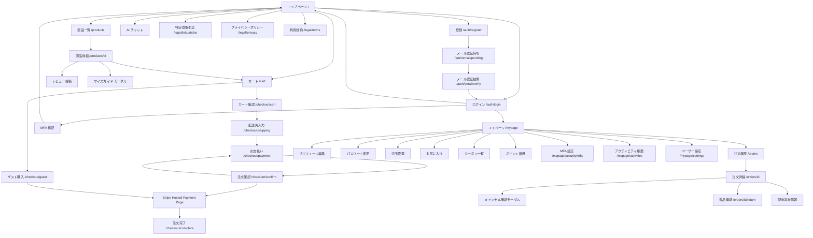

# SkiShop フロントエンド要件定義書

## 1. プロジェクト概要

### 1.1 目的

SkiShop EC プラットフォームのフロントエンド要件を定義する。バックエンド（ASP.NET Core 10 マイクロサービス）との連携仕様、画面設計、ユーザー体験要件を包括的に記述する。

### 1.2 技術スタック（確定）

| レイヤー | 技術 | バージョン | 補足 |
|---------|------|-----------|------|
| フレームワーク | **Blazor Web App** | .NET 10 (LTS) | Static SSR + Interactive Server / WASM / Auto レンダリングモード |
| 言語 | C# 14 | — | バックエンドと同一言語。DTO（record 型）をプロジェクト参照で共有 |
| ランタイム | ASP.NET Core 10 | — | サーバーサイドレンダリング基盤。Kestrel ホスト |
| UI コンポーネント | MudBlazor | 8.x | Material Design ベースの Blazor コンポーネントライブラリ |
| CSS フレームワーク | MudBlazor テーマシステム | — | カスタムテーマ + CSS 分離（`.razor.css`）|
| 状態管理 | Cascading Parameters + Fluxor | 6.x | コンポーネントツリー伝搬 + Redux パターン（グローバル状態） |
| API 通信 | HttpClient + IHttpClientFactory | — | BFF パターン。サーバーサイドで API Gateway に通信 |
| フォーム管理 | EditForm + DataAnnotations / FluentValidation | — | ASP.NET Core バリデーションと統一。`EditContext` でフォーム状態管理 |
| リアルタイム通信 | SignalR | — | 在庫変動通知、注文ステータス更新、AI チャットストリーミング |
| 認証 | ASP.NET Core Identity + Cookie 認証（BFF） | — | サーバーサイドで JWT → Cookie 変換。クライアントにトークン非露出 |
| テスト | bUnit + xUnit + NSubstitute + Playwright | bUnit 2.x | コンポーネント単体 / 統合 / E2E テスト |
| オーケストレーション | .NET Aspire | 13.1 | `AppHost` から `AddProject<Projects.Frontend>()` で統合管理 |

> **決定事項**: フロントエンド技術は **Blazor Web App（.NET 10）** に確定した。C# フルスタック開発による型安全性、バックエンド DTO の直接共有、.NET Aspire との自然な統合、BFF パターンによるセキュアな認証を実現する。

#### レンダリングモード戦略

各画面の特性に応じて最適なレンダリングモードを選択する:

| レンダリングモード | 適用画面 | 理由 |
|------------------|---------|------|
| **Static SSR** | トップページ、商品一覧、商品詳細、法的ページ、カテゴリー一覧 | SEO 重要。サーバーで完全にレンダリングした HTML を返す |
| **Interactive Server** | カート操作、AI チャット、在庫リアルタイム更新、管理画面 | SignalR 接続でリアルタイム性を確保 |
| **Interactive WebAssembly** | チェックアウトフロー（5ステップ）、フォーム入力画面 | クライアントサイドでの高速なフォーム操作・バリデーション |
| **Interactive Auto** | マイページ、注文履歴、プロフィール編集 | 初回は Server モードで即時表示、WASM ダウンロード完了後に切替 |

### 1.3 バックエンドサービス一覧

| サービス名 | ポート | 役割 | API Gateway 経由パス |
|-----------|--------|------|---------------------|
| ApiGateway (YARP) | 8080 | ゲートウェイ、認証フィルタ、レート制限 | — |
| AuthService | 5001 | ユーザー認証・認可、JWT 発行 | `/api/v1/auth/*` |
| UserManagementService | 5002 | ユーザープロファイル管理 | `/api/v1/users/*`, `/api/v1/admin/users/*` |
| InventoryManagementService | 5003 | 商品・在庫管理 | `/api/products/*`, `/api/categories/*`, `/api/reviews/*`, `/api/inventory/*`, `/api/prices/*` |
| SalesManagementService | 5004 | 注文・販売管理 | `/api/v1/orders/*`, `/api/v1/shipments/*`, `/api/v1/returns/*`, `/api/v1/reports/*` |
| PaymentCartService | 5005 | カート・決済処理 | `/api/v1/cart/*`, `/api/v1/payments/*`, `/api/v1/checkout/*` |
| CouponService | 5006 | クーポン管理 | `/api/v1/coupons/*`, `/api/v1/admin/coupons/*`, `/api/v1/admin/campaigns/*` |
| PointService | 5007 | ポイント管理 | `/api/v1/points/*`, `/api/v1/tiers/*` |
| MailSendService | 5008 | メール送信 | `/admin/mail/*`（管理者専用） |
| AiSupportService | 5009 | AI チャットボット（Semantic Kernel） | `/api/v1/ai/*`, `/api/v1/admin/ai/*` |

**API ベース URL**: `http://localhost:8080`（開発環境、API Gateway 経由）

---

## 2. EC サイト画面一覧

### 2.1 画面一覧マトリクス

| # | 画面名 | パス | 認証 | 主要 API | 優先度 |
|---|--------|------|------|---------|--------|
| 1 | トップページ | `/` | 不要 | GET `/api/products` (新着・おすすめ) | Must |
| 2 | 商品一覧 | `/products` | 不要 | GET `/api/products?category=&sort=&page=&size=` | Must |
| 3 | 商品詳細 | `/products/{id}` | 不要 | GET `/api/products/{id}`, GET `/api/reviews?productId={id}` | Must |
| 4 | カート | `/cart` | 不要* | GET `/api/v1/cart`, POST/PUT/DELETE `/api/v1/cart/items` | Must |
| 5a | チェックアウト: カート確認 | `/checkout/cart` | **必要**† | GET `/api/v1/cart` | Must |
| 5b | チェックアウト: 配送先入力 | `/checkout/shipping` | **必要**† | GET `/api/v1/users/{userId}/addresses` | Must |
| 5c | チェックアウト: お支払い | `/checkout/payment` | **必要**† | POST `/api/v1/orders` → Stripe リダイレクト | Must |
| 5d | チェックアウト: 注文確認 | `/checkout/confirm` | **必要**† | GET `/api/v1/orders/{id}` | Must |
| 5e | チェックアウト: 注文完了 | `/checkout/complete` | **必要**† | GET `/api/v1/orders/{id}`（ポーリング） | Must |
| 5g | ゲストチェックアウト | `/checkout/guest` | 不要 | POST `/api/v1/checkout/guest` → Stripe リダイレクト | Must |
| 6 | 注文確認 | `/orders/{id}/confirm` | **必要** | GET `/api/v1/orders/{id}` | Must |
| 7 | 注文履歴一覧 | `/orders` | **必要** | GET `/api/v1/orders/customer/{customerId}?page=&size=` | Must |
| 8 | 注文詳細 | `/orders/{id}` | **必要** | GET `/api/v1/orders/{id}` | Must |
| 9 | ログイン | `/auth/login` | 不要 | POST `/api/v1/auth/login` | Must |
| 10 | ユーザー登録 | `/auth/register` | 不要 | POST `/api/v1/auth/users` | Must |
| 11 | マイページ | `/mypage` | **必要** | GET `/api/v1/users/me`, GET `/api/v1/points/balance` | Must |
| 12 | プロフィール編集 | `/mypage/profile` | **必要** | PUT `/api/v1/users/me` | Should |
| 13 | パスワード変更 | `/mypage/password` | **必要** | PUT `/api/v1/auth/password/change` | Should |
| 14 | 住所管理 | `/mypage/addresses` | **必要** | GET/POST/PUT/DELETE `/api/v1/users/{userId}/addresses` | Should |
| 15 | ウィッシュリスト | `/wishlists` | **必要** | GET/POST `/api/v1/users/{userId}/wishlists`, `/api/v1/users/{userId}/wishlists/{id}/items` | Could |
| 16 | レビュー投稿 | `/products/{id}/review` | **必要** | POST `/api/reviews` | Could |
| 17 | クーポン一覧 | `/coupons` | **必要** | GET `/api/v1/coupons/available` | Should |
| 18 | ポイント履歴 | `/points` | **必要** | GET `/api/v1/points/history` | Should |
| 19 | AI チャット | フローティング | 不要* | POST `/api/v1/ai/chat/sessions`, POST `/api/v1/ai/chat/sessions/{id}/messages` | Could |
| 20 | 特定商取引法に基づく表記 | `/legal/tokushoho` | 不要 | — (静的ページ) | Must |
| 21 | プライバシーポリシー | `/legal/privacy` | 不要 | — (静的ページ) | Must |
| 22 | 利用規約 | `/legal/terms` | 不要 | — (静的ページ) | Must |
| 23 | パスワードリセット要求 | `/auth/password/reset-request` | 不要 | POST `/api/v1/auth/password/reset` | Should |
| 24 | パスワードリセット | `/auth/password/reset` | 不要* | POST `/api/v1/auth/password/reset`（トークン付き） | Should |
| 29 | 返品申請 | `/orders/{id}/return` | **必要** | POST `/api/v1/returns` | Must |
| 30 | MFA セットアップ | `/mypage/security/mfa` | **必要** | POST `/api/v1/auth/mfa/setup`, `verify` | Should |
| 10a | メール認証待ち | `/auth/email/pending` | 不要 | POST `/api/v1/auth/email/resend` | Must |
| 10b | メール認証結果 | `/auth/email/verify` | 不要 | POST `/api/v1/auth/email/verify` | Must |
| 31 | アクティビティ履歴 | `/mypage/activities` | **必要** | GET `/api/v1/users/me/activities` | Should |
| 32 | ユーザー設定 | `/mypage/settings` | **必要** | GET/PUT `/api/v1/users/{userId}/preferences` | Should |

> `*` 未ログイン時はゲストカート（Cookie ベース）を使用。ログイン後にマージする。
>
> `†` ゲスト購入時は `/checkout/guest` を使用。ログインユーザーは `/checkout/cart` から開始。

### 2.2 各画面詳細

#### 画面 1: トップページ（`/`）

**構成要素**:
- ヒーローバナー（季節・セール情報）
- 新着商品カルーセル（最新 8 件）
- おすすめ商品グリッド（AI レコメンドまたは人気順）
- 「今注目の商品」セクション（AI レコメンデーション — トレンド）
- 「今シーズンのおすすめ」セクション（AI レコメンデーション — 季節）
- 「あなたへのおすすめ」セクション（ログイン時、AI パーソナライズ推薦）
- カテゴリーナビゲーション
- セール情報バナー

**API 呼び出し**:
```
GET /api/products?sort=createdAt,desc&page=0&size=8   ← 新着商品
GET /api/products?sort=salesCount,desc&page=0&size=8  ← 人気商品
GET /api/categories                                    ← カテゴリー一覧
GET /api/v1/ai/recommendations/trending                ← 「今注目の商品」セクション
GET /api/v1/ai/recommendations/seasonal                ← 「今シーズンのおすすめ」セクション
GET /api/v1/ai/recommendations/personalized            ← ログイン時「あなたへのおすすめ」（認証必要）
```

> **注意**: パーソナライズ推薦は認証が必要。未ログイン時は `trending` と `seasonal` のみ表示する。

**パフォーマンス要件**:
- LCP（Largest Contentful Paint）: 2.5 秒以内
- ヒーロー画像は `` + `loading="eager"` + サーバーサイドでの WebP/AVIF 変換で最適化
- 商品カルーセルは `loading="lazy"` による遅延読み込み
- Static SSR モードによりサーバーで完全にレンダリングされた HTML を返す（JavaScript 不要）

#### 画面 2: 商品一覧（`/products`）

**機能**:
- カテゴリーフィルター（サイドバー）
- 価格帯フィルター（スライダー）
- ソート（価格順、新着順、人気順、レビュー評価順）
- ページネーション（無限スクロール or ページ番号）
- 検索キーワードフィルター（§4.6 検索サジェストコンポーネントと連動）

**API 呼び出し**:
```
GET /api/products?category={categoryId}&minPrice={min}&maxPrice={max}&sort={field},{direction}&page={page}&size={size}&keyword={keyword}
```

**ページネーション仕様**（ASP.NET Core 準拠）:

```json
// レスポンス例
{
  "items": [ ... ],
  "page": 0,
  "size": 20,
  "totalElements": 150,
  "totalPages": 8,
  "hasNext": true,
  "hasPrevious": false
}
```

> **フロントエンド注意**: ASP.NET Core のページネーションパラメータは `page`（0 始まり）と `size`。

#### 画面 3: 商品詳細（`/products/{id}`）

**構成要素**:
- 商品画像ギャラリー（メイン + サムネイル）
- 商品名、価格、説明
- サイズ・カラー選択（バリエーション）
- 「サイズ表を見る」リンク（サイズ・カラー選択 UI の近くに配置）
  - クリック時にモーダル（`MudDialog`）またはドロワーでサイズガイドテーブルを表示
  - カテゴリ別のサイズ対応表（身長・体重・足のサイズ → 推奨サイズ）
  - テーブル形式で閲覧可能（`role="table"` + `aria-label="サイズガイド"`）
- 在庫状況表示（リアルタイム）
- カートに追加ボタン
- レビュー一覧（平均評価 + 個別レビュー）
- 関連商品（同カテゴリーの商品）
- 「似た商品」セクション（AI レコメンデーション — 類似商品）
- 「よく一緒に購入されている商品」セクション（AI レコメンデーション — 頻繁に一緒に購入）
- レコメンデーションフィードバック「参考になった」ボタン（各レコメンデーションセクションの下部）

> スキー用品はサイズ選びが購買決定の重要要素。サイズガイド提供により、サイズ不一致による返品を削減する。

**API 呼び出し**:
```
GET /api/products/{id}                                             ← 商品詳細
GET /api/reviews?productId={id}&page=0&size=10                     ← レビュー一覧
GET /api/products?category={categoryId}&size=4                     ← 関連商品
GET /api/size-guides/{categoryId}                                  ← カテゴリ別サイズガイド取得
GET /api/v1/ai/recommendations/similar/{productId}                 ← 「似た商品」
GET /api/v1/ai/recommendations/frequently-bought/{productId}       ← 「よく一緒に購入されている商品」
POST /api/v1/ai/recommendations/feedback                           ← 「参考になった」フィードバック（認証必要）
```

**既存の「関連商品」との共存ルール**:
- AI レコメンデーション API が利用可能な場合: AI レコメンデーション結果を優先表示
- AI レコメンデーション API が障害時: 既存の同カテゴリ商品取得（`GET /api/products?category={categoryId}&size=4`）にフォールバック（§4.3 グレースフルデグラデーション準拠）

**在庫表示ルール**:
| 在庫数 | 表示 |
|--------|------|
| 10 以上 | 「在庫あり」（緑） |
| 1〜9 | 「残り {n} 点」（オレンジ） |
| 0 | 「在庫切れ」（赤）+ カートボタン無効化 |

#### 画面 4: カート（`/cart`）

**構成要素**:
- カートアイテム一覧（商品画像、名前、サイズ、カラー、数量、小計）
- 数量変更（± ボタン）
- アイテム削除
- クーポンコード入力
- 小計・送料・クーポン割引・合計金額表示
- チェックアウトへ進むボタン
- 保有ポイント表示（ログイン時）

**API 呼び出し**:
```
GET    /api/v1/cart                               ← カート内容取得
POST   /api/v1/cart/items                          ← アイテム追加
PUT    /api/v1/cart/items/{itemId}                  ← 数量変更
DELETE /api/v1/cart/items/{itemId}                  ← アイテム削除
POST   /api/v1/coupons/validate                    ← クーポン検証
GET    /api/v1/points/balance                      ← ポイント残高（ログイン時）
```

**ゲストカート仕様**:
- 未ログイン時: Cookie に `CartId` を保存し、サーバー側で Cart エンティティを管理
- ログイン時: Cookie の `CartId` をユーザーアカウントにマージ
- Cookie 設定: `HttpOnly=true`, `Secure=true`, `SameSite=Strict`

#### 画面 5: チェックアウト（5ステップフロー — spec.md §チェックアウト・ステップインジケーター設計 準拠）

チェックアウトフローは以下の5ステップで構成する。全画面にプログレスバー（ステップインジケーター）を表示し、ユーザーが現在のステップを常に把握できるようにする。

| ステップ | ラベル（日本語） | ラベル（英語） | URL パス | 備考 |
|---------|---------------|-------------|---------|------|
| 1 | カート確認 | Cart Review | `/checkout/cart` | カート内商品の最終確認 |
| 2 | 配送先入力 | Shipping | `/checkout/shipping` | 配送先住所の入力・選択 |
| 3 | お支払い | Payment | `/checkout/payment` | 決済方法の選択 |
| 4 | 注文確認 | Confirmation | `/checkout/confirm` | 注文内容の最終確認（WCAG SC 3.3.4 準拠） |
| 5 | 注文完了 | Complete | `/checkout/complete` | 注文完了メッセージ・注文番号表示 |

**ステップインジケーターのアクセシビリティ要件**:
- 現在のステップに `aria-current="step"` を付与
- 完了済みステップには `aria-label="完了"` を付与
- スクリーンリーダーで「ステップ 2/5: 配送先入力」と読み上げられるよう `aria-label` を設定
- 各ステップ間のコネクタ線は CSS `::after` 擬似要素で実装し、完了済みは色変更

##### ステップ 1: カート確認（`/checkout/cart`）

**構成要素**:
- カート内商品一覧（商品画像、名前、サイズ、カラー、数量、小計）
- 数量変更（± ボタン）
- アイテム削除
- クーポンコード入力
- 小計・送料・クーポン割引・合計金額表示
- 保有ポイント表示（ログイン時）
- 「配送先入力へ進む」ボタン

##### ステップ 2: 配送先入力（`/checkout/shipping`）

**構成要素**:
- 保存済み住所の選択（ラジオボタン）
- 新規住所入力フォーム
- 配送方法選択（標準/速達）
- 「お支払いへ進む」ボタン

##### ステップ 3: お支払い（`/checkout/payment`）

**構成要素**:
- 支払い方法選択（クレジットカード — Stripe Hosted Payment Page 経由）
- ポイント使用入力（ログイン時 — front-design-issue.md M-05 対応）:
  - ポイント換算レート: 1 pt = 1 円（※ビジネスポリシーによる — §14 エスカレーション E-03 参照）
  - 使用上限: 合計金額の 50% まで（※上限率はビジネスポリシーによる — §14 エスカレーション E-03 参照）
  - ポイント入力 UI: 数値入力フィールド + スライダー + 「全額使う」ボタン
  - 保有ポイント残高の表示（`GET /api/v1/points/balance` の結果）
  - バリデーション:
    - 入力値 ≤ 保有ポイント残高
    - 入力値 ≤ 合計金額 × 上限率
    - 入力値 ≥ 0（負数不可）
  - バリデーションエラー時: インラインエラーメッセージ表示
- 注文サマリー（商品一覧、小計、送料、クーポン割引、ポイント使用、合計）

> **PCI DSS 対応（ADR-0008）**: 決済はカード情報非保持化方針に基づき、**Stripe Hosted Payment Page** にリダイレクトして行う。フロントエンドでカード情報を直接取り扱わない。

##### ステップ 4: 注文確認（`/checkout/confirm`）

**構成要素**: spec.md §注文確認画面 UI 要件 に準拠（WCAG SC 3.3.4）
- 注文内容一覧（全商品名・数量・単価・小計を表形式で表示）
- 配送先住所（「変更」リンク付き）
- 支払い方法（「変更」リンク付き）
- クーポン/ポイント適用状況（「変更」リンク付き）
- 金額サマリー（小計・送料・割引額・税額・合計金額）
- 確定ボタン: 「**¥XX,XXX で注文を確定する**」（金額を含む明示的ラベル）
- キャンセルリンク: 「カートに戻る」

##### ステップ 5: 注文完了（`/checkout/complete`）

**構成要素**:
- 注文完了メッセージ（`role="alert" aria-live="assertive"`）
- 注文番号表示
- 注文詳細ページへのリンク
- 注文確認メール送信先の表示
- ショッピング継続リンク

**API 呼び出しフロー（Stripe Hosted Payment Page + Saga パターン対応）**:
```
ステップ 1-2:
  GET  /api/v1/users/{userId}/addresses           ← 保存済み住所一覧
  GET  /api/v1/cart                                ← カート内容確認
  POST /api/v1/coupons/validate                    ← クーポン再検証
  GET  /api/v1/points/balance                      ← ポイント残高確認

ステップ 3: UI 操作のみ（支払い方法選択 — API 呼び出しなし）

ステップ 4（注文確定 → Stripe リダイレクト）:
  POST /api/v1/orders                              ← 注文作成（ステータス: PENDING）
   → リクエストボディ:
   {
     "addressId": "addr-123",
     "shippingMethod": "standard",
     "couponCode": "SPRING10",
     "pointsToUse": 500,
     "items": [
       { "productId": "prod-001", "quantity": 2, "size": "M", "color": "black" }
     ]
   }
   → レスポンス: { "orderId": "ord-xxx", "checkoutSessionUrl": "https://checkout.stripe.com/..." }

  ブラウザ: Stripe Hosted Payment Page にリダイレクト
   → 成功 URL: /checkout/complete?session_id={CHECKOUT_SESSION_ID}
   → キャンセル URL: /checkout/payment?canceled=true

ステップ 5（Stripe コールバック後）:
  GET /api/v1/orders/{orderId}                      ← 注文ステータス確認（ポーリング）
```

> **Saga パターン（ADR-0009）対応**: 注文確定後、バックエンドでは Saga オーケストレーションパターンにより非同期で処理が進行する（在庫引当→決済確認→注文確定→ポイント付与）。フロントエンドでは以下の UX を提供する:
> - 注文完了画面で注文ステータスが `PENDING` の場合、ローディングインジケーターを表示（`role="progressbar" aria-valuenow`）
> - 3秒間隔で `GET /api/v1/orders/{orderId}` をポーリングし、ステータスが `CONFIRMED` に変わったら完了表示に切り替え
> - 30秒以内に `CONFIRMED` にならない場合、「注文処理中です。完了次第メールでお知らせします」メッセージを表示
> - ステータスが `FAILED` / `CANCELLED` の場合、エラーメッセージと再注文リンクを表示

#### 画面 9: ログイン（`/auth/login`）

**構成要素**:
- メールアドレス入力
- パスワード入力
- ログインボタン
- 「パスワードを忘れた場合」リンク
- 「アカウント作成」リンク
- ソーシャルログインボタン（将来拡張）

**API 呼び出し**:
```
POST /api/v1/auth/login
{
  "email": "user@example.com",
  "password": "securePassword123"
}

// 成功レスポンス
{
  "accessToken": "eyJhbGciOiJIUzI1NiIs...",  ← JWT アクセストークン
  "refreshToken": "K2LI+SWrqLN08c8g...",     ← リフレッシュトークン
  "tokenType": "Bearer",
  "expiresIn": 3600,                          ← 秒単位
  "user": {
    "id": "3b8d4cfc-...",
    "firstName": "太郎",
    "lastName": "山田",
    "role": "USER"
  }
}
```

**認証フロー**:
1. ユーザーがメール/パスワードを入力
2. `POST /api/v1/auth/login` に送信
3. 成功: JWT トークンを受け取り、サーバーが `httpOnly Cookie`（`SameSite=Strict`, `Secure`）として設定（H9 是正(C9-02): `localStorage` は XSS 攻撃時のトークン漏洩リスクがあるため使用禁止）
4. 失敗: エラーメッセージ表示（「メールアドレスまたはパスワードが正しくありません」）
5. ログイン後: ゲストカートをユーザーカートにマージ

**MFA 検証ステップ（MFA 有効アカウントの場合 — front-design-issue.md C-02 対応）**:

ログイン成功後、MFA が有効なアカウントの場合は以下のフローを追加:

1. MFA 検証画面を表示（メール/パスワード認証成功時のレスポンスに `mfaRequired: true` が含まれる場合）
2. 6 桁 TOTP コード入力フィールド
3. 「バックアップコードを使う」リンク（クリックでバックアップコード入力フォームに切替）
4. 検証成功 → JWT トークン発行 → ダッシュボード（マイページ）へ遷移
5. 検証失敗 → エラー表示「認証コードが正しくありません」
6. 最大試行回数: 5 回（超過後は 15 分間ロック）

**MFA 検証 API 呼び出し**:
```
POST /api/v1/auth/mfa/verify
{
  "sessionToken": "temp-session-xxx",  ← ログイン成功時に返却される一時トークン
  "code": "123456"
}
```

**セキュリティ要件**:
- アカウントロック: 5 回連続失敗で 15 分間ロック
- レート制限: ログイン API に 10req/分 の制限（API Gateway レベル）
- CSRF 対策: SameSite Cookie + CSRF トークン
- パスワード入力: マスク表示（表示切替ボタン付き）

#### 画面 10: ユーザー登録（`/auth/register`）

**構成要素**:
- メールアドレス入力 + リアルタイム重複チェック
- パスワード入力 + 強度メーター
- パスワード確認入力
- 氏名入力
- 利用規約同意チェックボックス
- 登録ボタン

**バリデーション**:
| フィールド | ルール |
|-----------|--------|
| メール | 必須、メール形式、255 文字以内 |
| パスワード | 必須、8 文字以上、大文字/小文字/数字/記号を含む |
| パスワード確認 | パスワードと一致 |
| 氏名 | 必須、100 文字以内 |
| 利用規約 | 必須チェック |

**API 呼び出し**:
```
POST /api/v1/auth/users
{
  "email": "user@example.com",
  "password": "SecureP@ss123",
  "firstName": "太郎",
  "lastName": "山田",
  "username": "yamada_taro"
}
```

> **注意**: バックエンド実装では `username` フィールドが必須。登録直後のステータスは `PENDINGVERIFICATION`（メール認証待ち）。

**登録完了後の遷移**（front-design-issue.md C-03 対応）:
- 登録成功時: メール認証待ち画面（画面 10a: `/auth/email/pending`）に自動遷移
- 登録直後のステータスは `PENDINGVERIFICATION`（既存記載の通り）
- メール認証完了までログイン不可

#### 画面 10a: メール認証待ち（`/auth/email/pending` — front-design-issue.md C-03 対応）

ユーザー登録完了後に表示される認証メール待ち画面。

**構成要素**:
- 「認証メールを送信しました」メッセージ
- 送信先メールアドレスの表示（マスク済み: `t***@example.com` — PII 保護のためフルアドレスを表示しない）
- 「メールが届かない場合」セクション:
  - 迷惑メールフォルダの確認案内テキスト
  - 「認証メールを再送信する」ボタン
  - 再送信のレート制限表示（60 秒に 1 回。ボタン押下後はカウントダウンタイマー表示し、カウントダウン中はボタンを `disabled` にする）

**API 呼び出し**:
```
POST /api/v1/auth/email/resend   ← 認証メール再送信
```

**遷移**:
- ユーザー登録画面（画面 10）→ 本画面（自動遷移）
- 認証メール内リンク → メール認証結果画面（画面 10b）

#### 画面 10b: メール認証結果（`/auth/email/verify?token={token}` — front-design-issue.md C-03 対応）

認証メール内のリンクをクリックした際のランディングページ。

**構成要素（認証成功時）**:
- 「メールアドレスが認証されました ✓」メッセージ（`role="status"`）
- ログイン画面へのリンクボタン

**構成要素（トークン期限切れ時）**:
- 「認証リンクの有効期限が切れています」メッセージ（`role="alert"`）
- 「認証メールを再送信する」ボタン（画面 10a の再送信 API を呼び出し）

**構成要素（トークン無効時）**:
- 「無効なリンクです」メッセージ（`role="alert"`）
- カスタマーサポート問い合わせリンク

**API 呼び出し**:
```
POST /api/v1/auth/email/verify   ← トークン検証
{
  "token": "{URLパラメータから取得}"
}
```

#### ゲスト購入フロー（`/checkout/guest` — spec.md §ゲスト購入フロー 準拠）

会員登録を行わずに購入を完了できるフローを提供し、カート離脱率の低減と CVR 向上を実現する。

**構成要素**:
- ゲスト用配送先入力フォーム（氏名、郵便番号、住所、電話番号）
- メールアドレス入力（2 回入力一致検証 — 必須）
- 越境データ移転同意チェックボックス（オプトイン方式、デフォルト未選択）:
  - 表示文言: 「注文確認メールの送信のため、入力されたメールアドレスおよび注文情報を米国に所在するメール配信サービス（SendGrid）に提供します。[詳細はプライバシーポリシーをご確認ください]」
  - 同意しない場合: メール送信をスキップし、注文完了画面で注文番号のみ表示
- プライバシーポリシー同意チェックボックス（必須）:
  - 表示文言: 「[プライバシーポリシー]（リンク）に同意する」
  - 入力フォーム上部に利用目的要約テキスト: 「ご入力いただいた個人情報は、ご注文の処理・配送・注文確認メールの送信に使用します」
- 配送方法選択（標準/速達）
- 「決済に進む」ボタン

**API 呼び出しフロー**:
```
POST /checkout/guest
{
  "email": "guest@example.com",
  "emailConfirmation": "guest@example.com",
  "shippingAddress": { ... },
  "shippingMethod": "standard",
  "cartId": "cart-xxx",
  "consentOverseasTransfer": true,
  "consentPrivacyPolicy": true
}
→ レスポンス: { "orderId": "ord-xxx", "checkoutSessionUrl": "https://checkout.stripe.com/..." }
→ Stripe Hosted Payment Page にリダイレクト
→ 成功 URL: /checkout/complete?session_id={CHECKOUT_SESSION_ID}
→ キャンセル URL: /checkout/guest?canceled=true
```

**ゲスト購入の制約**:
- ポイント付与・クーポン適用は行わない（会員特典は会員登録後に有効化）
- 購入完了画面で会員登録を促すバナーを表示（「会員登録で次回 500 ポイント付与」等のインセンティブ）
- 注文追跡は注文番号 + メールアドレスで認証

#### 法的ページ

**特定商取引法に基づく表記（`/legal/tokushoho`）** — spec.md §特定商取引法対応 準拠:
- 事業者名、所在地、電話番号、メールアドレス、商品代金以外の必要料金、支払方法、支払時期、商品の引渡時期、返品・交換条件等の法定表示事項を記載する静的ページ
- フッターコンポーネントから常時リンク

**プライバシーポリシー（`/legal/privacy`）**:
- 個人情報の利用目的、第三者提供、越境データ移転（SendGrid: 米国）、データ保持期間、DSR（データ主体の権利行使）手続きを記載
- フッターコンポーネントから常時リンク

**利用規約（`/legal/terms`）**:
- サービス利用条件、禁止事項、免責事項、準拠法・管轄を記載
- フッターコンポーネントから常時リンク
- ユーザー登録画面（画面 10）で同意チェックボックスにリンク

#### 画面 11: マイページ（`/mypage`）

**構成要素**:
- ユーザー情報サマリー（名前、メール、会員ランク）
- ポイント残高
- 「まもなく失効するポイント」アラートバナー（30 日以内に失効するポイントがある場合に表示）
  - 表示: 「XXX ポイントが YYYY/MM/DD に失効します」（`role="alert"`）
  - CTA: 「ポイントを使って買い物する →」（商品一覧 `/products` へのリンク）
- 最近の注文（直近 3 件）
- クイックリンク（プロフィール編集、注文履歴、住所管理、パスワード変更、MFA 設定、アクティビティ履歴、ユーザー設定）

**API 呼び出し**:
```
GET /api/v1/users/me                        ← ユーザープロフィール
GET /api/v1/points/balance                  ← ポイント残高
GET /api/v1/points/expiring                 ← 有効期限間近ポイント取得
GET /api/v1/orders/customer/{customerId}?page=0&size=3&sort=createdAt,desc  ← 最近の注文
```

---

## 3. 管理画面一覧

> **重要**: spec.md §技術スタック では管理画面の技術スタックとして **ASP.NET Core + Razor Pages + Bootstrap 5 + htmx + Alpine.js** が規定されている。EC サイト（消費者向け）は **Blazor Web App** で実装するが、管理画面は引き続き **Razor Pages** で実装する。以下の画面一覧は管理画面が提供すべき機能要件を定義するものであり、実装は Blazor Web App (SPA) ではなく **Razor Pages** で行う。Razor Pages 管理画面の詳細設計は `spec.md` の管理画面セクションを参照すること。

### 3.1 画面一覧マトリクス

| # | 画面名 | パス | 権限 | 主要 API | 優先度 |
|---|--------|------|------|---------|--------|
| 1 | ダッシュボード | `/admin` | Admin | 集計 API | Must |
| 2 | 商品管理 | `/admin/products` | Admin | GET/POST/PATCH/DELETE `/api/products` | Must |
| 3 | 商品登録/編集 | `/admin/products/new`, `/admin/products/{id}/edit` | Admin | POST/PATCH `/api/products` | Must |
| 4 | カテゴリー管理 | `/admin/categories` | Admin | GET/POST/PUT/DELETE `/api/categories` | Must |
| 5 | 在庫管理 | `/admin/inventory` | Admin | GET/PUT `/api/inventory` | Must |
| 6 | 注文管理 | `/admin/orders` | Admin | GET `/api/v1/orders/search`, PUT `/api/v1/orders/{id}/status` | Must |
| 7 | 注文詳細 | `/admin/orders/{id}` | Admin | GET `/api/v1/orders/{id}`, PUT `/api/v1/orders/{id}/status` | Must |
| 8 | ユーザー管理 | `/admin/users` | Admin | GET `/api/v1/admin/users`, POST `/api/v1/admin/users/{id}/status` | Should |
| 9 | クーポン管理 | `/admin/coupons` | Admin | GET/POST/PUT/DELETE `/api/v1/admin/coupons` | Should |
| 10 | キャンペーン管理 | `/admin/campaigns` | Admin | GET/POST/PUT `/api/v1/admin/campaigns` | Should |
| 11 | ポイント管理 | `/admin/points` | Admin | GET/POST `/api/v1/admin/points` | Should |
| 12 | 売上レポート | `/admin/reports/sales` | Admin | GET `/api/v1/reports/sales` | Should |
| 13 | 在庫レポート | `/admin/reports/inventory` | Admin | GET `/api/inventory/low-stock` | Could |
| 14 | セキュリティログ | `/admin/security-logs` | Admin | GET `/admin/security-logs` | Should |
| 15 | メール管理 | `/admin/mail-logs` | Admin | GET `/admin/mail-logs` | Should |
| 16 | AI 需要予測 | `/admin/ai/forecast` | Admin | GET/POST `/api/v1/admin/ai/forecast` | Should |
| 17 | AI 分析ダッシュボード | `/admin/ai/analytics` | Admin | GET `/api/v1/admin/ai/analytics/*` | Should |
| 18 | AI モデル管理 | `/admin/ai/models` | Admin | GET/POST `/api/v1/admin/ai/models` | Could |
| 19 | 出荷管理 | `/admin/shipments` | Admin | GET/POST/PUT `/api/v1/shipments` | Must |
| 20 | 返品管理 | `/admin/returns` | Admin | GET/PUT `/api/v1/returns` | Must |

### 3.2 管理画面共通仕様

**認証・認可**:
- 全管理画面は `Admin` ロールが必要
- JWT トークンに `role: "Admin"` クレームが含まれること
- API Gateway で `/admin/*` パスに対してロールベース認可を適用
- 管理画面アクセス時に追加の認証確認（セッション有効期限: 30 分）

**共通 UI パターン**:
- データテーブル: ソート、フィルター、ページネーション、一括操作
- CRUD フォーム: バリデーション、確認ダイアログ、成功/エラー通知
- 検索: リアルタイム検索（デバウンス 300ms）

### 3.3 管理画面詳細仕様（追記分）

#### A16: AI 需要予測（`/admin/ai/forecast` — front-design-issue.md H-03 対応）

**構成要素**:
- 需要予測一覧テーブル（商品名、予測期間、予測数量、信頼度、ソート・フィルター・ページネーション付き）
- 商品別予測詳細表示（時系列グラフ、季節要因、トレンド分析）
- 「予測を生成」ボタン（`POST /api/v1/admin/ai/forecast/generate`）
- 商品・カテゴリ・期間フィルター

**API 呼び出し**:
```
GET  /api/v1/admin/ai/forecast               ← 需要予測一覧
GET  /api/v1/admin/ai/forecast/{productId}   ← 商品別需要予測詳細
POST /api/v1/admin/ai/forecast/generate      ← 需要予測生成リクエスト
```

#### A17: AI 分析ダッシュボード（`/admin/ai/analytics` — front-design-issue.md H-03 対応）

**構成要素**（タブ切替 UI）:
- **検索分析タブ**: クエリ頻度ランキング、検索結果 0 件ワード、クリック率
- **推薦分析タブ**: レコメンデーション種類別クリック率、CVR 寄与度
- **チャット分析タブ**: セッション数推移、平均会話ターン数、エスカレーション率
- 期間フィルター（日/週/月/カスタム）

**API 呼び出し**:
```
GET /api/v1/admin/ai/analytics/search          ← 検索分析
GET /api/v1/admin/ai/analytics/recommendations ← 推薦分析
GET /api/v1/admin/ai/analytics/chat            ← チャット分析
```

#### A18: AI モデル管理（`/admin/ai/models` — front-design-issue.md H-03 対応）

**構成要素**:
- モデル一覧テーブル（モデル名、バージョン、ステータス、最終更新日時）
- モデルトレーニングボタン（`POST /api/v1/admin/ai/models/{modelName}/train`）
- トレーニング進捗表示

**API 呼び出し**:
```
GET  /api/v1/admin/ai/models                      ← モデル一覧
POST /api/v1/admin/ai/models/{modelName}/train     ← モデルトレーニング
```

#### A19: 出荷管理（`/admin/shipments` — front-design-issue.md H-05 対応）

**構成要素**:
- 出荷一覧テーブル（注文番号、出荷ステータス、追跡番号、配送業者、作成日 — ソート・フィルター・ページネーション付き）
- ステータスフィルター（`PENDING` / `SHIPPED` / `IN_TRANSIT` / `DELIVERED`）
- 出荷作成フォーム（対象注文検索・選択、配送業者選択、追跡番号入力）
- 出荷ステータス更新ドロップダウン + 更新ボタン
- 追跡番号更新フォーム

**API 呼び出し**:
```
GET  /api/v1/shipments                       ← 出荷一覧
POST /api/v1/shipments                       ← 出荷作成
PUT  /api/v1/shipments/{id}/status           ← 出荷ステータス更新
PUT  /api/v1/shipments/{id}/tracking         ← 追跡情報更新
```

#### A20: 返品管理（`/admin/returns` — front-design-issue.md H-06 対応）

**構成要素**:
- 返品一覧テーブル（注文番号、申請者名、返品理由、ステータス、申請日 — ソート・フィルター・ページネーション付き）
- ステータスフィルター（`REQUESTED` / `APPROVED` / `REJECTED` / `RETURNED` / `REFUNDED`）
- 返品詳細表示（返品対象商品一覧、理由、顧客情報）
- 承認/却下ボタン（`PUT /api/v1/returns/{id}/status`）
- 返金処理連携導線（承認後に `POST /api/v1/payments/{id}/refund` を呼び出すボタン）

**API 呼び出し**:
```
GET /api/v1/returns                ← 返品一覧
GET /api/v1/returns/{id}           ← 返品詳細
PUT /api/v1/returns/{id}/status    ← 返品ステータス更新（承認/却下）
POST /api/v1/payments/{id}/refund  ← 返金処理（承認後の連携）
```

#### #2/#3 商品管理画面 — 価格管理タブ（front-design-issue.md M-07 対応）

商品管理画面（#2 商品管理 / #3 商品登録・編集）に「価格管理」タブを追加する。

**構成要素**:
- 価格設定フォーム:
  - 通常価格入力
  - セール価格入力（任意）
  - セール開始日/終了日（DatePicker）
- 価格履歴テーブル（変更日時、旧価格、新価格、変更者 — ページネーション付き）
- 現在有効な価格の表示

**API 呼び出し**:
```
GET   /api/prices/{productId}           ← 現在の価格取得
GET   /api/prices/{productId}/history   ← 価格履歴取得
POST  /api/prices                       ← 価格設定
PATCH /api/prices/{productId}           ← 価格更新
```

#### #9 クーポン管理画面 — 分析タブ（front-design-issue.md H-04 対応）

既存のクーポン管理画面に「分析」タブを追加する。

**構成要素**:
- 全体 KPI カード: 利用率、割引総額、新規獲得数、リピート率
- クーポン別分析テーブル: 利用回数、割引額、CVR 寄与度（ソート・ページネーション付き）
- 使用履歴一覧（ページネーション付き）
- 期間フィルター（日/週/月/カスタム）
- グラフ: 利用回数推移折れ線、割引額推移棒グラフ

**API 呼び出し**:
```
GET /api/v1/admin/coupons/analytics            ← クーポン分析（全体）
GET /api/v1/admin/coupons/{id}/analytics       ← クーポン分析（個別）
GET /api/v1/admin/coupons/{id}/usage-history   ← 使用履歴
```

#### #11 ポイント管理画面 — 分析タブ（front-design-issue.md M-02 対応）

**構成要素**:
- 月別 KPI: ポイント発行数、消費数、失効数
- 月別発行/消費/失効推移グラフ（折れ線）
- ティア別ユーザー分布（円グラフ / 棒グラフ）
- ポイント残高分布ヒストグラム
- 期間フィルター（月単位）

**API 呼び出し**:
```
GET /api/v1/admin/points/analytics  ← ポイント分析
```

#### #15 メール管理画面（拡張 — front-design-issue.md M-04 対応）

管理画面 #15 を「メール送信履歴」から「メール管理」に拡張し、以下のタブを持つ:

**タブ 1: テンプレート管理**:
- テンプレート一覧テーブル（テンプレート名、種別、最終更新日 — ページネーション付き）
- テンプレート作成/編集フォーム（テンプレート名、件名、本文 HTML エディタ）
- テンプレートプレビュー表示
- テンプレート削除（確認モーダル付き）

**タブ 2: テストメール送信**:
- テンプレート選択ドロップダウン
- 送信先メールアドレス入力
- テスト送信ボタン

**タブ 3: 送信履歴**（既存の #15 相当）:
- メールログ一覧テーブル（送信先、件名、送信日時、ステータス — ページネーション付き）
- 詳細表示
- 再送信ボタン

**タブ 4: 統計ダッシュボード**:
- 送信成功率
- 配信率
- 期間別送信数推移グラフ

**API 呼び出し**:
```
POST   /admin/mail/templates           ← テンプレート作成
GET    /admin/mail/templates           ← テンプレート一覧
GET    /admin/mail/templates/{id}      ← テンプレート詳細
PUT    /admin/mail/templates/{id}      ← テンプレート更新
DELETE /admin/mail/templates/{id}      ← テンプレート削除
POST   /admin/mail/test                ← テストメール送信
GET    /admin/mail/logs                ← メールログ一覧
GET    /admin/mail/logs/{id}           ← メールログ詳細
POST   /admin/mail/logs/{id}/retry     ← メール再送信
GET    /admin/mail/stats               ← 統計情報取得
```

---

## 4. 共通コンポーネント仕様

### 4.1 エラーハンドリング（RFC 9457 — Problem Details）

バックエンド API は RFC 9457 (Problem Details for HTTP APIs) 形式でエラーを返す。フロントエンドはこの形式をパースしてユーザーフレンドリーなエラーメッセージを表示する。

**エラーレスポンス形式**:
```json
{
  "type": "https://skishop.example.com/errors/not-found",
  "title": "Not Found",
  "status": 404,
  "detail": "指定された商品が存在しません",
  "instance": "/products/prod-999",
  "traceId": "00-1234567890abcdef-fedcba0987654321-01"
}
```

**バリデーションエラー形式**:
```json
{
  "type": "https://tools.ietf.org/html/rfc9110#section-15.5.1",
  "title": "One or more validation errors occurred.",
  "status": 400,
  "errors": {
    "Email": ["メールアドレス形式が不正です"],
    "Password": ["パスワードは8文字以上で入力してください"]
  }
}
```

**フロントエンドでのハンドリングパターン**:

```csharp
// RFC 9457 準拠の ProblemDetails モデル（Blazor サーバーサイド）
public record ProblemDetailsResponse(
    string? Type,
    string Title,
    int Status,
    string? Detail = null,
    string? Instance = null,
    Dictionary<string, string[]>? Errors = null,
    string? TraceId = null);

// API エラーハンドリングサービス
public class ApiErrorHandler(NavigationManager navigation, ISnackbar snackbar, ILogger<ApiErrorHandler> logger)
{
    public async Task HandleApiErrorAsync(HttpResponseMessage response)
    {
        var problem = await response.Content.ReadFromJsonAsync<ProblemDetailsResponse>();
        if (problem is null) return;

        switch (problem.Status)
        {
            case 400:
                // バリデーションエラー → EditContext にエラーを追加
                throw new ValidationException(problem.Errors ?? new());
            case 401:
                // 認証エラー → ログイン画面にリダイレクト
                navigation.NavigateTo("/auth/login?reason=session_expired", forceLoad: true);
                break;
            case 403:
                throw new ForbiddenException(problem.Detail ?? "アクセス権限がありません");
            case 404:
                throw new NotFoundException(problem.Detail ?? "リソースが見つかりません");
            case 409:
                // 競合（楽観的ロック等）→ 再読込プロンプト
                snackbar.Add("データが他のユーザーにより更新されました。ページを再読込してください", Severity.Warning);
                break;
            case 422:
                // ビジネスルール違反
                snackbar.Add(problem.Detail ?? "処理できませんでした", Severity.Warning);
                break;
            case 429:
                snackbar.Add("リクエスト数の上限に達しました。しばらくお待ちください", Severity.Warning);
                break;
            default:
                logger.LogError("API エラー [TraceId: {TraceId}]", problem.TraceId);
                snackbar.Add("サーバーエラーが発生しました。しばらく経ってからお試しください", Severity.Error);
                break;
        }
    }
}
```

### 4.2 ページネーション

**クエリパラメータ仕様**:
| パラメータ | 型 | デフォルト | 説明 |
|-----------|------|-----------|------|
| `page` | int | 0 | ページ番号（0 始まり） |
| `size` | int | 20 | 1 ページあたりの件数（最大 100） |
| `sort` | string | — | ソートフィールドと方向（例: `createdAt,desc`） |

**レスポンス仕様**:
```json
{
  "items": [...],
  "page": 0,
  "size": 20,
  "totalElements": 150,
  "totalPages": 8,
  "hasNext": true,
  "hasPrevious": false
}
```

**フロントエンド実装パターン**:
```csharp
// Blazor コンポーネントでのページネーション付きデータ取得
@inject IProductApiClient ProductApi

@code {
    private PaginatedResult<ProductDto>? _products;
    private int _currentPage;
    private string? _selectedCategory;

    protected override async Task OnInitializedAsync()
    {
        await LoadProductsAsync();
    }

    private async Task LoadProductsAsync()
    {
        _products = await ProductApi.GetProductsAsync(
            page: _currentPage, size: 20, sort: "createdAt,desc", category: _selectedCategory);
    }

    private async Task OnPageChanged(int page)
    {
        _currentPage = page;
        await LoadProductsAsync();
    }
}
```

### 4.3 グレースフルデグラデーション

外部サービス障害時のフォールバック戦略:

| サービス障害 | フロントエンド対応 | ユーザーへの表示 |
|------------|------------------|----------------|
| AuthService 障害 | ログイン/登録を無効化、既存セッションは継続 | 「現在ログインサービスが利用できません」 |
| InventoryManagementService 障害 | キャッシュ済み商品データを表示 | 「在庫情報は古い可能性があります」 |
| PaymentCartService 障害 | カート操作を無効化 | 「カートサービスが一時的に利用できません」 |
| AiSupportService 障害 | AI チャットボタンを非表示 | — (UI から存在を消す) |
| CouponService 障害 | クーポン入力を無効化 | 「クーポンサービスが一時的に利用できません」 |
| PointService 障害 | ポイント表示を「—」に | 「ポイント情報を取得できません」 |
| 全サービス障害 | メンテナンスページ表示 | 「メンテナンス中です」 |
| AI 検索サジェスト障害 | サジェストドロップダウンを非表示にし、通常のキーワード検索のみで動作。エラー表示はしない | —（H-01） |
| AI レコメンデーション障害（トップページ） | 「今注目の商品」等のセクションを非表示にし、代替として「人気商品」を静的表示、またはセクション自体を非表示にする | —（H-02） |
| PointService ティア情報障害 | アラートバナーを非表示にする。ポイント残高表示のみ継続 | —（H-09） |
| PointService ティア API 障害 | ティアセクションを非表示にする。ポイント履歴表示のみ継続 | —（H-09） |

### 4.4 API 通信共通設定（BFF パターン）

Blazor Web App では **BFF（Backend for Frontend）パターン** を採用する。ブラウザからのリクエストは Blazor サーバー（ASP.NET Core）が受け取り、サーバーサイドから API Gateway（`localhost:8080`）に通信する。JWT トークンはサーバーサイドで管理され、クライアント（ブラウザ）には非露出。

```csharp
// Program.cs — API クライアントの DI 登録（BFF パターン）
builder.Services.AddHttpClient<IApiGatewayClient, ApiGatewayClient>(client =>
{
    client.BaseAddress = new Uri("http://localhost:8080");
    client.Timeout = TimeSpan.FromSeconds(10);
    client.DefaultRequestHeaders.Add("Accept", "application/json");
})
.AddStandardResilienceHandler(options =>
{
    options.Retry.MaxRetryAttempts = 3;
    options.Retry.BackoffType = DelayBackoffType.Exponential;
    options.Retry.Delay = TimeSpan.FromMilliseconds(500);
    options.CircuitBreaker.BreakDuration = TimeSpan.FromSeconds(10);
    options.AttemptTimeout.Timeout = TimeSpan.FromSeconds(10);
    options.TotalRequestTimeout.Timeout = TimeSpan.FromSeconds(30);
});

// API クライアント実装例
public class ApiGatewayClient(HttpClient httpClient, ILogger<ApiGatewayClient> logger) : IApiGatewayClient
{
    public async Task<PaginatedResult<ProductDto>> GetProductsAsync(
        int page = 0, int size = 20, string? sort = null, string? category = null,
        CancellationToken ct = default)
    {
        var query = $"/products?page={page}&size={size}";
        if (!string.IsNullOrEmpty(sort)) query += $"&sort={sort}";
        if (!string.IsNullOrEmpty(category)) query += $"&category={category}";

        var response = await httpClient.GetAsync(query, ct);
        response.EnsureSuccessStatusCode();
        return await response.Content.ReadFromJsonAsync<PaginatedResult<ProductDto>>(ct)
            ?? throw new InvalidOperationException("デシリアライズに失敗しました");
    }
}
```

**BFF パターンのメリット**:
- JWT トークンがブラウザに露出しない（XSS 対策）
- Cookie 認証で `SameSite=Strict` を使用（CSRF 対策）
- `IHttpClientFactory` + Polly によるリトライ・サーキットブレーカーをサーバーサイドで適用
- Correlation ID は API Gateway が自動生成。レスポンスの `X-Correlation-Id` ヘッダーをエラーログ用に記録
```

### 4.5 レスポンシブデザインブレークポイント

| ブレークポイント | 幅 | 対象デバイス |
|---------------|------|------------|
| xs | < 640px | スマートフォン（縦） |
| sm | ≥ 640px | スマートフォン（横） |
| md | ≥ 768px | タブレット |
| lg | ≥ 1024px | デスクトップ |
| xl | ≥ 1280px | ワイドデスクトップ |

### 4.6 検索サジェストコンポーネント（front-design-issue.md H-01 対応）

ヘッダーの検索ボックスで入力中にリアルタイムでサジェスト候補を表示するコンポーネント。

**動作仕様**:
- ユーザーが検索ボックスに **2 文字以上**入力したタイミングで AI サジェスト API を呼び出し
- デバウンス: **300ms**（入力停止後に API を呼び出す）
- 表示: ドロップダウンリスト（最大 10 件）
- カテゴリ別グルーピング（商品名、カテゴリ名、ブランド名）
- キーボード操作対応（`↑` `↓` で移動、`Enter` で選択、`Escape` で閉じる）
- `aria-combobox` パターン準拠（WCAG SC 4.1.2）

**API 呼び出し**:
```
GET /api/v1/ai/search/suggest?query={input}   ← AI 検索サジェスト
```

**レスポンス表示**:
- 候補なし: 「該当する商品が見つかりません」テキスト表示
- 候補あり: カテゴリ別にグルーピングしたドロップダウン表示
- 選択時: 商品一覧画面（`/products?keyword={selectedQuery}`）に遷移

**アクセシビリティ**:
- 検索ボックスに `role="combobox"` + `aria-autocomplete="list"` + `aria-expanded` を設定
- ドロップダウンリストに `role="listbox"` を設定
- 各候補に `role="option"` + `aria-selected` を設定
- スクリーンリーダーで候補件数を通知（`aria-live="polite"`: 「{n} 件の候補があります」）

---

## 5. 認証・認可フロー

### 5.1 JWT 認証フロー

```
ユーザー          フロントエンド        API Gateway (8080)    AuthService (5001)      DB
  │                   │                     │                    │                   │
  │ ログイン入力      │                     │                    │                   │
  │──────────────────>│                     │                    │                   │
  │                   │ POST /auth/login    │                    │                   │
  │                   │────────────────────>│                    │                   │
  │                   │                     │ 転送               │                   │
  │                   │                     │───────────────────>│                   │
  │                   │                     │                    │ 認証情報照合       │
  │                   │                     │                    │──────────────────>│
  │                   │                     │                    │ ユーザー情報       │
  │                   │                     │                    │<──────────────────│
  │                   │                     │                    │ JWT 生成          │
  │                   │                     │ JWT トークン        │                   │
  │                   │                     │<───────────────────│                   │
  │                   │ JWT トークン        │                    │                   │
  │                   │<────────────────────│                    │                   │
  │                   │ トークン保存         │                    │                   │
  │ ログイン成功      │                     │                    │                   │
  │<──────────────────│                     │                    │                   │
  │                   │                     │                    │                   │
  │ 認証済みリクエスト │                     │                    │                   │
  │──────────────────>│                     │                    │                   │
  │                   │ GET /orders         │                    │                   │
  │                   │ Cookie:             │                    │                   │
  │                   │   access_token={JWT}│                    │                   │
  │                   │   （自動送信）       │                    │                   │
  │                   │────────────────────>│                    │                   │
  │                   │                     │ Cookie JWT 検証    │                   │
  │                   │                     │ → 有効             │                   │
  │                   │                     │ 対象サービスに転送  │                   │
  │                   │                     │───────────────────>│                   │
```

### 5.2 トークンリフレッシュフロー

```
  │                   │                     │                    │
  │ API 呼び出し      │                     │                    │
  │──────────────────>│                     │                    │
  │                   │ GET /orders         │                    │
  │                   │ Cookie:             │                    │
  │                   │   access_token=     │                    │
  │                   │   {期限切れJWT}      │                    │
  │                   │────────────────────>│                    │
  │                   │ 401 Unauthorized    │                    │
  │                   │<────────────────────│                    │
  │                   │                     │                    │
  │                   │ POST /auth/refresh  │                    │
  │                   │ Cookie: refresh_token={RT}（自動送信）    │
  │                   │────────────────────>│                    │
  │                   │                     │───────────────────>│
  │                   │                     │ 新 JWT + Refresh   │
  │                   │                     │<───────────────────│
  │                   │ 新トークン          │                    │
  │                   │<────────────────────│                    │
  │                   │ トークン更新 + リトライ│                  │
  │                   │────────────────────>│                    │
  │                   │ 200 OK             │                    │
  │                   │<────────────────────│                    │
  │ レスポンス表示    │                     │                    │
  │<──────────────────│                     │                    │
```

### 5.3 JWT トークン仕様

| 項目 | 値 |
|------|------|
| アルゴリズム | HS256 (HMAC + SHA-256) |
| アクセストークン有効期限 | 1 時間 |
| リフレッシュトークン有効期限 | 7 日 |
| ペイロードクレーム | `sub` (ユーザー ID), `email`, `role`, `iat`, `exp`, `jti` |
| 保存場所 | `httpOnly Cookie`（`SameSite=Strict`, `Secure`）（H9 是正(C9-02): `localStorage` 使用禁止） |

---

## 6. 状態管理設計

### 6.1 グローバル状態

| 状態 | スコープ | 永続化 | 管理ライブラリ |
|------|---------|--------|--------------|
| 認証状態 (JWT, ユーザー情報) | アプリ全体 | httpOnly Cookie（JWT）+ メモリ（ユーザー情報） | `CascadingAuthenticationState` |
| カート状態 | アプリ全体 | サーバー + Cookie | Fluxor Store |
| 通知/トースト | アプリ全体 | なし | `ISnackbar` (MudBlazor) |
| テーマ (ダーク/ライト) | アプリ全体 | localStorage (`IJSRuntime`) | `CascadingValue<ThemeState>` |

### 6.2 サーバー状態（キャッシュ戦略）

Blazor Web App ではサーバーサイドでデータを取得・キャッシュする。`IMemoryCache` または分散キャッシュ（Redis）を使用:

| データ | キャッシュ戦略 | キャッシュ有効期間 | 無効化トリガー |
|--------|-------------|-----------|----------|
| 商品一覧 | `IMemoryCache` | 5 分 | 商品更新時 |
| 商品詳細 | `IMemoryCache` | 5 分 | 商品更新時 |
| カート内容 | キャッシュなし（常に最新） | 0 | ミューテーション後 |
| 注文一覧 | `IMemoryCache` | 1 分 | 注文操作後 |
| ポイント残高 | `IMemoryCache` | 30 秒 | 注文完了後 |
| ユーザープロフィール | `IMemoryCache` | 10 分 | プロフィール更新後 |

### 6.3 楽観的更新パターン

```csharp
// Blazor コンポーネントでのカートアイテム数量変更（楽観的更新）
@inject ICartApiClient CartApi
@inject ISnackbar Snackbar

@code {
    private List<CartItemDto> _cartItems = [];
    private bool _isUpdating;

    private async Task UpdateQuantityAsync(string itemId, int newQuantity)
    {
        // 楽観的更新: UI を即座に反映
        var originalItems = _cartItems.ToList();
        var item = _cartItems.FirstOrDefault(i => i.Id == itemId);
        if (item is not null)
        {
            item.Quantity = newQuantity;
            StateHasChanged();
        }

        try
        {
            _isUpdating = true;
            await CartApi.UpdateCartItemAsync(itemId, newQuantity);
            // 完了時: サーバーから最新データを再取得して同期
            _cartItems = await CartApi.GetCartItemsAsync();
        }
        catch
        {
            // エラー時: ロールバック
            _cartItems = originalItems;
            Snackbar.Add("数量の更新に失敗しました", Severity.Error);
        }
        finally
        {
            _isUpdating = false;
            StateHasChanged();
        }
    }
}
```

---

## 7. 国際化（i18n）対応

### 7.0 i18n ライブラリ（.NET ローカリゼーション）

| 項目 | 値 |
|------|------|
| ライブラリ | **ASP.NET Core ローカリゼーション**（`IStringLocalizer<T>` + `.resx` リソースファイル） |
| フォールバック言語 | `ja`（デフォルト）→ `en` |
| URL 方式 | パス方式（`/ja/products`, `/en/products`）— `RequestLocalizationMiddleware` で制御 |
| `<html lang>` | ロケールに応じて動的切替（`ja` / `en`）— `<HeadContent>` で設定 |

**翻訳キー命名規則**: `.resx` ファイルで `{Domain}_{Context}_{Key}` 形式
- 例: `Cart_Error_OutOfStock`, `Auth_Error_InvalidCredentials`, `Checkout_Label_ShippingAddress`
- バックエンド（`.resx`）とフロントエンド（同じく `.resx`）で統一

**エラーメッセージ i18n マッピング**: バックエンドの Problem Details レスポンスの `type` フィールド URI パスから翻訳キーを導出する:
- バックエンド `type`: `https://skishop.example.com/errors/cart/out-of-stock`
- 翻訳キー変換: `/errors/` 以降をドット区切り → `cart.error.outOfStock`
- 対応する翻訳キーが存在しない場合は HTTP ステータスコードに基づくデフォルトメッセージを表示

### 7.1 対応言語

| 言語 | コード | 優先度 |
|------|--------|--------|
| 日本語 | `ja` | Must (デフォルト) |
| 英語 | `en` | Should |

### 7.2 タイムゾーン

- 表示: `Asia/Tokyo` (JST, UTC+9)
- API 通信: ISO 8601 形式 (UTC)
- 変換: フロントエンドで UTC → JST に変換して表示

### 7.3 通貨

- 表示: `¥ 12,800`（日本円、カンマ区切り）
- API: 整数値（円単位、小数点なし）

---

## 8. 非機能要件

### 8.1 パフォーマンス

| 指標 | 目標値 |
|------|--------|
| LCP (Largest Contentful Paint) | ≤ 2.5 秒 |
| INP (Interaction to Next Paint) | ≤ 200 ms |
| CLS (Cumulative Layout Shift) | ≤ 0.1 |
| TTFB (Time to First Byte) | < 600 ms（spec.md 未定義、本ドキュメント独自目標） |
| バンドルサイズ (gzip) | 該当なし（SSR 主体。WASM モード時は初回 .NET ランタイム DL 約 2–4 MB） |

### 8.2 アクセシビリティ（WCAG 2.1 Level AA — spec.md §アクセシビリティ 準拠）

- WCAG 2.1 Level AA 準拠（詳細要件は spec.md §アクセシビリティ（WCAG 2.1 AA 準拠）を参照）
- キーボード操作対応: 全機能を Tab / Enter / Space / 矢印キーで操作可能。`:focus-visible` スタイルを全インタラクティブ要素に適用
- スクリーンリーダー対応: 適切な ARIA 属性（`aria-label`, `aria-expanded`, `aria-selected`, `aria-current`, `aria-live`）
- カラーコントラスト比: 通常テキスト 4.5:1 以上、大きなテキスト 3:1 以上
- ステータスメッセージ: 成功通知は `role="status"` + `aria-live="polite"`、エラーは `role="alert"` + `aria-live="assertive"`（WCAG SC 4.1.3）
- スキップリンク: 全ページの `<body>` 直下に `<a href="#main-content" class="skip-link">メインコンテンツへスキップ</a>` を配置（WCAG SC 2.4.1）
- アニメーション制御: `prefers-reduced-motion: reduce` メディアクエリ対応（WCAG SC 2.3.1）
- ホバー/フォーカスコンテンツ: ツールチップ等は (1) 非表示にできる (2) ポインタで移動可能 (3) 永続的に表示される の3条件を満たす（WCAG SC 1.4.13）
- 色非依存の情報伝達: エラー表示・在庫状態等はテキストラベル・アイコンを併用（色覚多様性対応）
- フォーカストラップ: モーダル表示時にフォーカスをモーダル内に閉じ込め、Escape キーで閉じる

### 8.3 ブラウザ対応

| ブラウザ | バージョン |
|---------|-----------|
| Chrome | 最新 2 バージョン |
| Firefox | 最新 2 バージョン |
| Safari | 最新 2 バージョン |
| Edge | 最新 2 バージョン |
| モバイル (iOS Safari, Chrome) | 最新 2 バージョン |

### 8.4 SEO

- 商品一覧・詳細ページは **Static SSR** モードでレンダリング（完全な HTML をサーバーから返す）
- `<HeadContent>` コンポーネントでメタタグ（title, description, OGP）を動的設定
- `sitemap.xml` 自動生成（ASP.NET Core ミドルウェアまたはエンドポイントで動的生成）
- 構造化データ（JSON-LD）: Product, BreadcrumbList, Organization

```razor
@* 商品詳細ページのメタタグ例 *@
<HeadContent>
    <title>@_product?.Name - SkiShop</title>
    <meta name="description" content="@_product?.Description" />
    <meta property="og:title" content="@_product?.Name" />
    <meta property="og:description" content="@_product?.Description" />
    <meta property="og:image" content="@_product?.ImageUrl" />
    <meta property="og:type" content="product" />
</HeadContent>
```

### 8.5 フロントエンドテスト戦略

| テスト種別 | フレームワーク | 対象 | カバレッジ目標 |
|---------|-------------|------|-------------|
| 単体テスト（Unit） | **bUnit** + xUnit + NSubstitute | Blazor コンポーネント、サービス、ユーティリティ | 分岐カバレッジ 80% 以上 |
| 統合テスト（Integration） | **bUnit** + `WebApplicationFactory<Program>` | ページコンポーネント、API 連携 | 主要フロー 100% |
| E2E テスト | **Playwright**（`Microsoft.Playwright`） | ユーザーフロー（購入、ログイン等） | Must Have 画面の全主要パス |
| アクセシビリティ自動テスト | **axe-core**（Playwright 統合） | 全ページ | WCAG 2.1 AA 違反 0 件 |
| パフォーマンステスト | **Lighthouse CI** | Core Web Vitals | LCP ≤ 2.5s, INP ≤ 200ms, CLS ≤ 0.1 |

> **決定事項**: フロントエンドテストフレームワークは **bUnit + xUnit + NSubstitute + Playwright** を正式採用する。
> - **bUnit**: Blazor コンポーネント専用のテストフレームワーク。コンポーネントのレンダリング、イベントハンドリング、パラメータバインディングを検証
> - **Playwright**: Chromium / Firefox / WebKit **マルチブラウザ対応**。`Microsoft.Playwright` NuGet パッケージでバックエンド E2E テストと技術スタックを統一
> - **xUnit + NSubstitute**: バックエンドと同一のテストインフラ。学習コストを最小化

**CI 統合ルール**:
- 全 PR に対して単体テスト + アクセシビリティ自動テスト（axe-core）を実行
- main ブランチへのマージ前に E2E テスト + Lighthouse CI を実行
- テスト失敗時はマージをブロック

---

## 9. API エンドポイント一覧

### 9.1 認証 API (AuthService — `/api/v1/auth`)

| メソッド | パス | 認証 | 説明 |
|---------|------|------|------|
| POST | `/api/v1/auth/login` | 不要 | ログイン（JWT 取得） |
| POST | `/api/v1/auth/users` | 不要 | ユーザー登録 |
| POST | `/api/v1/auth/refresh` | 不要* | トークンリフレッシュ |
| POST | `/api/v1/auth/logout` | 必要 | ログアウト |
| POST | `/api/v1/auth/password/reset` | 不要 | パスワードリセット要求 |
| PUT | `/api/v1/auth/password/change` | 必要 | パスワード変更 |
| GET | `/api/v1/auth/me` | 必要 | 現在のユーザー情報取得 |
| POST | `/api/v1/auth/validate` | 必要 | トークン検証 |
| POST | `/api/v1/auth/mfa/setup` | 必要 | MFA セットアップ |
| POST | `/api/v1/auth/mfa/verify` | 不要* | MFA 検証（セッショントークン必要） |
| POST | `/api/v1/auth/email/resend` | 必要 | 確認メール再送信 |
| POST | `/api/v1/auth/email/verify` | 不要 | メールアドレス認証 |
| POST | `/api/v1/auth/oauth2/link/google` | 必要 | Google アカウント連携 |
| DELETE | `/api/v1/auth/users/{userId}` | Admin | ユーザーソフト削除 |
| DELETE | `/api/v1/auth/users/{userId}/hard` | Admin | ユーザー完全削除（ハード削除） |

### 9.2 ユーザー API (UserManagementService — `/api/v1/users`)

| メソッド | パス | 認証 | 説明 |
|---------|------|------|------|
| GET | `/api/v1/users/me` | 必要 | 自分のプロフィール取得 |
| PUT | `/api/v1/users/me` | 必要 | プロフィール更新 |
| GET | `/api/v1/users/{userId}/addresses` | 必要 | 住所一覧取得 |
| POST | `/api/v1/users/{userId}/addresses` | 必要 | 住所追加 |
| PUT | `/api/v1/users/{userId}/addresses/{id}` | 必要 | 住所更新 |
| DELETE | `/api/v1/users/{userId}/addresses/{id}` | 必要 | 住所削除 |
| GET | `/api/v1/users/me/activities` | 必要 | アクティビティ一覧 |
| GET | `/api/v1/users/{userId}/preferences` | 必要 | ユーザー設定取得 |
| PUT | `/api/v1/users/{userId}/preferences` | 必要 | ユーザー設定更新 |
| GET | `/api/v1/users/{userId}/member-rank` | 必要 | 会員ランク取得 |
| GET | `/api/v1/users/{id}` | Admin | 他ユーザープロファイル取得 |
| GET | `/api/v1/users/{userId}/activities` | Admin | 指定ユーザーのアクティビティ一覧 |
| GET | `/api/v1/admin/users` | Admin | 管理用ユーザー一覧 |
| POST | `/api/v1/admin/users/{id}/status` | Admin | ユーザーステータス変更 |
| POST | `/api/v1/admin/users/{id}/processing-restriction` | Admin | 処理制限設定 |

> **注意**: パスワード変更は AuthService の `PUT /api/v1/auth/password/change` を使用する（UserManagementService ではない）。

### 9.2a ウィッシュリスト API (UserManagementService — `/api/v1/users/{userId}/wishlists` — spec.md §ウィッシュリスト機能 準拠)

| メソッド | パス | 認証 | 説明 |
|---------|------|------|------|
| GET | `/api/v1/users/{userId}/wishlists` | 必要 | ウィッシュリスト一覧取得 |
| POST | `/api/v1/users/{userId}/wishlists` | 必要 | ウィッシュリスト作成 |
| PUT | `/api/v1/users/{userId}/wishlists/{id}` | 必要 | ウィッシュリスト更新 |
| POST | `/api/v1/users/{userId}/wishlists/{id}/items` | 必要 | ウィッシュリストに商品追加 |
| DELETE | `/api/v1/users/{userId}/wishlists/{id}` | 必要 | ウィッシュリスト削除 |

### 9.3 商品 API (InventoryManagementService — `/api/products`, `/api/categories`, `/api/reviews`, `/api/inventory`, `/api/prices`)

| メソッド | パス | 認証 | 説明 |
|---------|------|------|------|
| GET | `/api/products` | 不要 | 商品一覧（フィルター・ソート・ページネーション） |
| GET | `/api/products/{id}` | 不要 | 商品詳細 |
| GET | `/api/products/sku/{sku}` | 不要 | SKU で商品取得 |
| GET | `/api/products/search` | 不要 | 商品検索（`query`, `brand` パラメータ） |
| POST | `/api/products` | Admin | 商品登録 |
| PATCH | `/api/products/{id}` | Admin | 商品更新 |
| GET | `/api/categories` | 不要 | カテゴリー一覧 |
| GET | `/api/categories/{id}` | 不要 | カテゴリー詳細 |
| GET | `/api/categories/{id}/products` | 不要 | カテゴリー別商品一覧 |
| POST | `/api/categories` | Admin | カテゴリー登録 |
| PATCH | `/api/categories/{id}` | Admin | カテゴリー更新 |
| GET | `/api/reviews/{reviewId}` | 不要 | レビュー詳細取得 |
| POST | `/api/reviews` | 必要 | レビュー投稿 |
| PATCH | `/api/reviews/{id}/status` | Admin | レビューステータス更新 |
| GET | `/api/inventory/{productId}` | 不要 | 在庫情報取得 |
| GET | `/api/inventory/low-stock` | Admin | 低在庫一覧 |
| POST | `/api/inventory/stock-in` | Admin | 入庫 |
| POST | `/api/inventory/stock-out` | Admin | 出庫 |
| POST | `/api/inventory/batch` | Admin | 複数在庫一括取得 |
| GET | `/api/prices/{productId}` | 不要 | 価格取得 |
| GET | `/api/prices/{productId}/history` | Admin | 価格履歴取得 |
| POST | `/api/prices` | Admin | 価格設定 |
| PATCH | `/api/prices/{productId}` | Admin | 価格更新 |
| GET | `/api/size-guides/{categoryId}` | 不要 | サイズガイド取得 |
| POST | `/api/size-guides` | Admin | サイズガイド作成 |

> **注意**: InventoryManagementService は `/api/v1/` プレフィクスではなく `/api/` プレフィクスを使用する。ページネーションは `page=0`（0始まり）、`size` パラメータ。

### 9.4 カート API (PaymentCartService — `/api/v1/cart`)

| メソッド | パス | 認証 | 説明 |
|---------|------|------|------|
| GET | `/api/v1/cart` | 不要* | カート内容取得（新規作成） |
| GET | `/api/v1/cart/{cartId}` | 不要* | カートID指定取得 |
| POST | `/api/v1/cart/items` | 不要* | アイテム追加 |
| PUT | `/api/v1/cart/items/{itemId}` | 不要* | 数量変更 |
| DELETE | `/api/v1/cart/items/{itemId}` | 不要* | アイテム削除 |
| DELETE | `/api/v1/cart` | 不要* | カート全クリア |
| POST | `/api/v1/cart/merge` | 必要 | ログイン時カートマージ |

### 9.5 注文 API (SalesManagementService — `/api/v1/orders`, `/api/v1/shipments`, `/api/v1/returns`, `/api/v1/reports`)

| メソッド | パス | 認証 | 説明 |
|---------|------|------|------|
| POST | `/api/v1/orders` | 必要 | 注文作成（Saga オーケストレーション） |
| GET | `/api/v1/orders/{id}` | 必要 | 注文詳細 |
| GET | `/api/v1/orders/number/{orderNumber}` | 必要 | 注文番号で検索 |
| GET | `/api/v1/orders/customer/{customerId}` | 必要 | ユーザーの注文一覧 |
| POST | `/api/v1/orders/{id}/cancel` | 必要 | 注文キャンセル |
| GET | `/api/v1/orders/search` | Admin | 注文検索（管理用） |
| PUT | `/api/v1/orders/{id}/status` | Admin | 注文ステータス更新 |
| POST | `/api/v1/shipments` | Admin | 出荷作成 |
| GET | `/api/v1/shipments` | Admin | 出荷一覧 |
| GET | `/api/v1/shipments/{id}` | 必要 | 出荷詳細 |
| GET | `/api/v1/shipments/order/{orderId}` | 必要 | 注文別出荷取得 |
| PUT | `/api/v1/shipments/{id}/status` | Admin | 出荷ステータス更新 |
| PUT | `/api/v1/shipments/{id}/tracking` | Admin | 追跡情報更新 |
| POST | `/api/v1/returns` | 必要 | 返品リクエスト作成 |
| GET | `/api/v1/returns` | Admin | 返品一覧 |
| GET | `/api/v1/returns/{id}` | 必要 | 返品詳細 |
| GET | `/api/v1/returns/order/{orderId}` | 必要 | 注文別返品取得 |
| PUT | `/api/v1/returns/{id}/status` | Admin | 返品ステータス更新 |
| GET | `/api/v1/reports/sales` | Admin | 売上レポート |

### 9.6 クーポン API (CouponService — `/api/v1/coupons`, `/api/v1/admin/coupons`, `/api/v1/admin/campaigns`)

| メソッド | パス | 認証 | 説明 |
|---------|------|------|------|
| GET | `/api/v1/coupons/available` | 必要 | 利用可能クーポン一覧 |
| GET | `/api/v1/coupons/my` | 必要 | 自分のクーポン一覧 |
| POST | `/api/v1/coupons/acquire` | 必要 | クーポン取得 |
| POST | `/api/v1/coupons/validate` | 必要 | クーポンコード検証 |
| POST | `/api/v1/admin/campaigns` | Admin | キャンペーン作成 |
| GET | `/api/v1/admin/campaigns` | Admin | キャンペーン一覧 |
| GET | `/api/v1/admin/campaigns/{id}` | Admin | キャンペーン詳細 |
| PUT | `/api/v1/admin/campaigns/{id}` | Admin | キャンペーン更新 |
| POST | `/api/v1/admin/campaigns/{id}/activate` | Admin | キャンペーン有効化 |
| POST | `/api/v1/admin/campaigns/{id}/pause` | Admin | キャンペーン一時停止 |
| POST | `/api/v1/admin/coupons` | Admin | クーポン作成 |
| GET | `/api/v1/admin/coupons` | Admin | クーポン管理一覧 |
| GET | `/api/v1/admin/coupons/{id}` | Admin | クーポン詳細 |
| PUT | `/api/v1/admin/coupons/{id}` | Admin | クーポン更新 |
| DELETE | `/api/v1/admin/coupons/{id}` | Admin | クーポン削除 |
| GET | `/api/v1/admin/coupons/{id}/usage-history` | Admin | 使用履歴 |
| GET | `/api/v1/admin/coupons/analytics` | Admin | クーポン分析（全体） |
| GET | `/api/v1/admin/coupons/{id}/analytics` | Admin | クーポン分析（個別） |

### 9.7 ポイント API (PointService — `/api/v1/points`, `/api/v1/tiers`)

| メソッド | パス | 認証 | 説明 |
|---------|------|------|------|
| GET | `/api/v1/points/balance` | 必要 | ポイント残高 |
| GET | `/api/v1/points/history` | 必要 | ポイント履歴 |
| GET | `/api/v1/points/tier` | 必要 | 現在のティア情報 |
| GET | `/api/v1/points/expiring` | 必要 | 有効期限間近ポイント |
| GET | `/api/v1/tiers` | 不要 | ティア一覧 |
| GET | `/api/v1/tiers/{name}` | 不要 | ティア詳細 |
| GET | `/api/v1/admin/points/users/{userId}/balance` | Admin | ユーザーポイント確認 |
| POST | `/api/v1/admin/points/users/{userId}/adjust` | Admin | ポイント調整 |
| GET | `/api/v1/admin/points/analytics` | Admin | ポイント分析 |
| PUT | `/api/v1/admin/tiers/{id}` | Admin | ティア更新 |

### 9.8 AI チャット API (AiSupportService — `/api/v1/ai`)

| メソッド | パス | 認証 | 説明 |
|---------|------|------|------|
| POST | `/api/v1/ai/chat/sessions` | 必要 | チャットセッション作成 |
| GET | `/api/v1/ai/chat/sessions` | 必要 | セッション一覧 |
| GET | `/api/v1/ai/chat/sessions/{id}` | 必要 | セッション詳細 |
| POST | `/api/v1/ai/chat/sessions/{id}/messages` | 必要 | AI チャットメッセージ送信 |
| GET | `/api/v1/ai/chat/sessions/{id}/messages` | 必要 | チャット履歴取得 |
| POST | `/api/v1/ai/chat/sessions/{id}/close` | 必要 | セッションクローズ |
| POST | `/api/v1/ai/chat/sessions/{id}/escalate` | 必要 | エスカレーション |
| GET | `/api/v1/ai/search` | 不要 | AI 検索 |
| GET | `/api/v1/ai/search/suggest` | 不要 | 検索サジェスト |
| POST | `/api/v1/ai/search/feedback` | 必要 | 検索フィードバック |
| GET | `/api/v1/ai/recommendations/trending` | 不要 | トレンド商品 |
| GET | `/api/v1/ai/recommendations/seasonal` | 不要 | 季節おすすめ |
| GET | `/api/v1/ai/recommendations/similar/{productId}` | 不要 | 類似商品 |
| GET | `/api/v1/ai/recommendations/frequently-bought/{productId}` | 不要 | よく一緒に購入される商品 |
| GET | `/api/v1/ai/recommendations/personalized` | 必要 | パーソナライズ推薦 |
| POST | `/api/v1/ai/recommendations/feedback` | 必要 | 推薦フィードバック |
| GET | `/api/v1/admin/ai/forecast` | Admin | 需要予測一覧 |
| GET | `/api/v1/admin/ai/forecast/{productId}` | Admin | 商品別需要予測 |
| POST | `/api/v1/admin/ai/forecast/generate` | Admin | 需要予測生成 |
| GET | `/api/v1/admin/ai/analytics/search` | Admin | 検索分析 |
| GET | `/api/v1/admin/ai/analytics/recommendations` | Admin | 推薦分析 |
| GET | `/api/v1/admin/ai/analytics/chat` | Admin | チャット分析 |
| GET | `/api/v1/admin/ai/models` | Admin | モデル一覧 |
| POST | `/api/v1/admin/ai/models/{modelName}/train` | Admin | モデルトレーニング |

### 9.9 決済 API (PaymentCartService — `/api/v1/payments`, `/api/v1/checkout`)

| メソッド | パス | 認証 | 説明 |
|---------|------|------|------|
| POST | `/api/v1/payments/checkout` | 必要 | 決済処理（ログインユーザー） |
| POST | `/api/v1/checkout/guest` | 不要 | ゲストチェックアウト |
| GET | `/api/v1/payments/{id}` | 必要 | 決済状況確認 |
| GET | `/api/v1/payments/order/{orderId}` | 必要 | 注文別決済取得 |
| POST | `/api/v1/payments/{id}/refund` | Admin | 返金処理 |

---

## 10. 画面遷移図

```mermaid
graph TD
    ADMIN_DASH[管理ダッシュボード /admin] --> ADMIN_PRODUCTS[商品管理]
    ADMIN_DASH --> ADMIN_CATEGORIES[カテゴリー管理]
    ADMIN_DASH --> ADMIN_INVENTORY[在庫管理]
    ADMIN_DASH --> ADMIN_ORDERS[注文管理]
    ADMIN_DASH --> ADMIN_USERS[ユーザー管理]
    ADMIN_DASH --> ADMIN_COUPONS[クーポン管理]
    ADMIN_DASH --> ADMIN_CAMPAIGNS[キャンペーン管理]
    ADMIN_DASH --> ADMIN_POINTS[ポイント管理]
    ADMIN_DASH --> ADMIN_REPORTS[レポート]
    ADMIN_DASH --> ADMIN_SECURITY[セキュリティログ]
    ADMIN_DASH --> ADMIN_MAILS[メール管理]

    %% 既存
    ADMIN_PRODUCTS --> ADMIN_PRODUCT_NEW[商品登録]
    ADMIN_PRODUCTS --> ADMIN_PRODUCT_EDIT[商品編集]
    ADMIN_ORDERS --> ADMIN_ORDER_DETAIL[注文詳細]

    %% H-03: AI 管理画面追加
    ADMIN_DASH --> ADMIN_AI_FORECAST[AI 需要予測]
    ADMIN_DASH --> ADMIN_AI_ANALYTICS[AI 分析]
    ADMIN_DASH --> ADMIN_AI_MODELS[AI モデル管理]

    %% H-05, H-06: 出荷・返品管理追加
    ADMIN_DASH --> ADMIN_SHIPMENTS[出荷管理]
    ADMIN_DASH --> ADMIN_RETURNS[返品管理]
    ADMIN_ORDERS --> ADMIN_SHIPMENTS
    ADMIN_ORDERS --> ADMIN_RETURNS

    %% H-04, M-02, M-07, M-04: 既存画面へのタブ追加
    ADMIN_COUPONS --> ADMIN_COUPON_ANALYTICS[クーポン分析タブ]
    ADMIN_POINTS --> ADMIN_POINT_ANALYTICS[ポイント分析タブ]
    ADMIN_PRODUCTS --> ADMIN_PRICE_MGMT[価格管理タブ]
    ADMIN_MAILS --> ADMIN_MAIL_TEMPLATES[テンプレート管理]
    ADMIN_MAILS --> ADMIN_MAIL_STATS[メール統計]
```





---

## 11. ビジネス価値の優先順位（MoSCoW）

### Must Have（1.0 リリースに必須）

- トップページ、商品一覧、商品詳細
- カート機能（追加・変更・削除）
- チェックアウト・注文確定
- ユーザー登録・ログイン・ログアウト
- 注文履歴・注文詳細
- 管理画面: 商品管理、カテゴリー管理、在庫管理、注文管理
- エラーハンドリング（RFC 9457 準拠）
- レスポンシブデザイン（モバイル対応）
- 返品申請画面（C-01）
- メール認証フロー画面（C-03: 10a + 10b）
- 出荷管理画面（H-05: A19 — 管理画面）
- 返品管理画面（H-06: A20 — 管理画面）

### Should Have（1.0 リリース後の早期実装）

- マイページ（プロフィール編集、パスワード変更、住所管理）
- クーポン機能
- ポイント機能
- 管理画面: ユーザー管理、クーポン管理、キャンペーン管理、売上レポート
- SEO 最適化
- 国際化（i18n）— 英語対応
- AI チャットボット（バックエンド 33 エンドポイント全実装済み。CVR 向上に直結）
- ウィッシュリスト（バックエンド CRUD 全実装済み。リピート率向上の基盤）
- レビュー投稿（バックエンド実装済み。商品信頼性向上 → CVR 直結）
- AI レコメンデーション強化（5 種類全実装済み。客単価向上効果）
- MFA セットアップ画面（C-02）
- AI 検索サジェスト（H-01）
- 配送追跡セクション（H-07）
- サイズガイド表示（H-08）
- ポイント失効通知・ティア表示（H-09）
- AI 管理画面: 需要予測（H-03: A16）、分析ダッシュボード（H-03: A17）
- クーポン分析タブ（H-04）
- アクティビティ履歴（M-03）
- ユーザー設定画面（M-06）

### Could Have（将来実装）

- 管理画面: 在庫レポート
- ソーシャルログイン（Google, GitHub）
- SNS シェア機能
- プッシュ通知
- AI モデル管理（管理画面 A18）

### Won't Have（スコープ外）

- モバイルアプリ（ネイティブ）
- ライブチャット（人間オペレーター）
- サブスクリプション機能
- マーケットプレイス機能（複数出品者）

---

## 12. OpenAPI (Swagger) ドキュメント参照先

各サービスの API 仕様は `.NET 10` の `AddOpenApi()` + `MapOpenApi()` により自動生成される（個別エンドポイントへの `.WithOpenApi()` は不要）。以下の URL でアクセス可能:

| サービス | Swagger UI URL | 補足 |
|---------|---------------|------|
| AuthService | `http://localhost:5001/swagger` | 認証関連 API |
| UserManagementService | `http://localhost:5002/swagger` | ユーザー管理 API |
| InventoryManagementService | `http://localhost:5003/swagger` | 商品・在庫 API |
| SalesManagementService | `http://localhost:5004/swagger` | 注文・販売 API |
| PaymentCartService | `http://localhost:5005/swagger` | カート・決済 API |
| CouponService | `http://localhost:5006/swagger` | クーポン API |
| PointService | `http://localhost:5007/swagger` | ポイント API |
| AiSupportService | `http://localhost:5009/swagger` | AI チャット API |
| ApiGateway | `http://localhost:8080/swagger` | 統合 Swagger (YARP 経由) |

> **フロントエンド開発者向け**: 開発中は各サービスの Swagger UI で API の詳細仕様（リクエスト/レスポンス例、バリデーションルール）を確認すること。

---

## 13. リスクと対策

| # | リスク | 影響 | 対策 |
|---|--------|------|------|
| 1 | バックエンド API の仕様変更 | フロントエンド実装の手戻り | C# 共有 DTO（record 型）による型安全な API 連携。バックエンド DTO 変更時にコンパイルエラーで検出 |
| 2 | JWT のセキュアな保存 | XSS によるトークン漏洩 | BFF パターンで JWT はサーバーサイド管理。ブラウザに非露出（解決済み） |
| 3 | カート整合性 | ゲスト→ログイン時のカートマージ失敗 | バックエンドのマージ API に依存。フロントは Cookie の CartId を送信するのみ |
| 4 | 在庫競合 | チェックアウト時の在庫不足 | 楽観的ロック + リアルタイム在庫チェック（SignalR 通知）。エラー時はカートに戻す |
| 5 | パフォーマンス劣化 | 商品数増加時のページ読み込み遅延 | Static SSR による高速初回表示、サーバーサイドキャッシュ、画像最適化（WebP/AVIF）|
| 6 | アクセシビリティ違反 | 法的リスク | WCAG 2.1 Level AA 準拠チェックを CI に組み込み（axe-core + Playwright） |
| 7 | SEO 低下 | 検索順位低下 | Static SSR で全商品ページをサーバーレンダリング。`<HeadContent>` でメタタグ動的設定、Core Web Vitals の継続的監視 |
| 8 | Interactive Server 時の SignalR 接続管理 | 同時接続数増加によるサーバーリソース圧迫 | Static SSR + Auto モードの活用で SignalR 接続を最小化。Azure SignalR Service によるスケールアウトも検討 |
| 9 | WASM 初回ロード遅延 | LCP 目標未達 | Auto モードで初回は Server レンダリング（即時表示）、WASM ダウンロード完了後にシームレスに切替 |

---

## 14. エスカレーション項目（バックエンドチームとの調整が必要）

| # | 項目 | 担当 | ステータス |
|---|------|------|-----------|
| 1 | JWT のリフレッシュトークン仕様の確定 | 認証チーム | **解決済み**（AuthService 実装完了・検証済み。§5.3 / §16.2 に仕様記載済み） |
| 2 | ゲストカート → ユーザーカートのマージ API 仕様 | カートチーム | **解決済み**（PaymentCartService `POST /api/v1/cart/merge` 実装済み） |
| 3 | WebSocket / SSE によるリアルタイム在庫通知の対応可否 | 在庫チーム | **解決済み**（§16.3 で SignalR 方式を設計済み） |
| 4 | 管理画面の RBAC (Role-Based Access Control) 階層の詳細 | 認証チーム | **解決済み**（§16.5 で ADMIN/MANAGER/STAFF の 3 段階ロール定義済み） |
| 5 | AI チャットの WebSocket / Streaming 対応 | AI チーム | **解決済み**（§16.3 で SignalR ストリーミング方式を設計済み） |
| 6 | ファイルアップロード（商品画像）の仕様 | 在庫チーム | 要確認 |
| 7 | ページネーションの統一仕様（全サービス間） | アーキテクトチーム | **解決済み**（§4.2 / §16.4 で統一仕様定義済み） |
| 8 | エラーコードの統一仕様（全サービス間） | アーキテクトチーム | **解決済み**（§4.1 / §16.1 で RFC 9457 準拠の統一仕様定義済み） |
| 9 | 返品ポリシーの詳細 | ビジネスチーム | 要確認（返品可能期限、返品送料負担者、返金方法 — E-02） |
| 10 | MFA の必須化ポリシー | セキュリティチーム | 要確認（管理者ユーザーに MFA を必須化するか — E-01） |
| 11 | ポイント利用ルール | ビジネスチーム | 要確認（ポイント換算レート、使用上限率、最低残ポイント — E-03） |
| 12 | AI レコメンデーション表示優先順位 | AI チーム | 要確認（5 種類のレコメンデーションの表示優先度 — E-04） |
| 13 | チャットエスカレーション後のフロー | カスタマーサポートチーム | 要確認（エスカレーション後のメール/電話対応、レスポンス SLA — E-05） |

---

## 15. 追記セクション（実装補完）

> 本セクションは spec.md に記載されているがフロントエンド要件定義書で未カバーだった項目を補完するものである。

### 15.1 Cookie 同意管理バナー（spec.md §同意管理設計 準拠）

初回訪問時にフロントエンドで表示する同意バナーのコンポーネント仕様。GDPR 第 7 条および ePrivacy 指令に準拠する。

**表示タイミング**:
- 初回訪問時に自動表示（ページ下部固定帯）
- プライバシーポリシーのバージョン更新後の初回アクセス時に再表示
- 同意が得られるまで `MARKETING`, `ANALYTICS`, `PERSONALIZATION`, `THIRD_PARTY` カテゴリの Cookie / トラッキングスクリプトを読み込まない

**構成要素**:
- 同意バナー本体（ページ下部固定帯、`role="dialog"` + `aria-label="Cookie設定"`）
- 説明テキスト: 「当サイトでは Cookie を使用しています。[詳細を確認する]」
- 個別カテゴリ切替トグル（4 カテゴリ: `MARKETING`, `ANALYTICS`, `PERSONALIZATION`, `THIRD_PARTY`）
- 各カテゴリに「詳細を見る」展開パネル（具体的な利用目的と第三者提供先の表示）
- 一括操作ボタン:
  - 「すべて同意する」（プライマリ CTA）: 全カテゴリを一括許可
  - 「必要最低限のみ」（セカンダリ）: 全カテゴリを拒否（基本データ処理のみ有効）
  - 「設定を保存する」: 個別カテゴリのトグル状態を保存

**アクセシビリティ要件**:
- フォーカストラップ: バナー表示中はバナー内にフォーカスを閉じ込める
- `Escape` キーでバナーを閉じられる（「必要最低限のみ」と同等の動作）
- スクリーンリーダーでカテゴリ説明が読み上げ可能（`aria-expanded` でトグル状態を通知）

**API 連携（未認証ユーザー / 認証済みユーザー）**:
```
未認証ユーザー:
  POST   /api/v1/anonymous-consents     ← 初回同意記録（Cookie ID: ConsentId で識別）
  ※ GET/PUT は未実装。現在 DB 制約問題あり（anonymous_consents テーブル新設が必要）。

認証済みユーザー:
  GET    /api/v1/users/{userId}/consents ← 全同意状態取得
  PUT    /api/v1/users/{userId}/consents ← 同意更新（consentType + isGranted）
```

**フロントエンドでの同意状態管理**:
- `ANALYTICS` 同意がない場合: Google Analytics 等のトラッキングスクリプトを読み込まない
- `PERSONALIZATION` 同意がない場合: AI レコメンデーションをデフォルト（人気商品ランキング）にフォールバック
- 未認証ユーザーの `ConsentId` は `HttpOnly; Secure; SameSite=Strict` Cookie に保存（TTL: 1 年）
- ユーザー登録時に匿名同意をユーザーアカウントにマージ（より制限的な設定を適用）

### 15.2 マイページ追加画面: 同意管理・データエクスポート・アカウント削除（spec.md §DSR・同意管理設計 準拠）

#### 画面 25: 同意管理（`/mypage/privacy`）

| 項目 | 値 |
|------|------|
| パス | `/mypage/privacy` |
| 認証 | **必要** |
| 優先度 | Should |

**構成要素**:
- 同意カテゴリ一覧（`MARKETING`, `ANALYTICS`, `PERSONALIZATION`, `THIRD_PARTY`）
- 各カテゴリのオン/オフトグル（現在の同意状態を反映）
- 各カテゴリの利用目的説明
- 「変更を保存する」ボタン
- プライバシーポリシーへのリンク

**API 呼び出し**:
```
GET    /api/v1/users/{userId}/consents   ← 現在の同意状態取得
PUT    /api/v1/users/{userId}/consents   ← 同意変更の保存（consentType + isGranted）
```

#### 画面 26: データエクスポート（`/mypage/data-export`）

| 項目 | 値 |
|------|------|
| パス | `/mypage/data-export` |
| 認証 | **必要** |
| 優先度 | Should |

**構成要素**:
- データエクスポートの説明テキスト（「個人データを JSON 形式でダウンロードできます」）
- 「エクスポートをリクエスト」ボタン
- エクスポート処理状況表示（`PENDING` → `PROCESSING` → `COMPLETED`）
- ダウンロードリンク（処理完了後に表示）

**API 呼び出し**:
```
POST /api/v1/users/{userId}/data-export               ← エクスポートリクエスト作成
GET  /api/v1/users/{userId}/data-export/{requestId}    ← 処理状況確認（ポーリング: 10 秒間隔）
GET  /api/v1/users/{userId}/data-export/{requestId}/download ← ダウンロード
```

#### 画面 27: アカウント削除（`/mypage/delete-account`）

| 項目 | 値 |
|------|------|
| パス | `/mypage/delete-account` |
| 認証 | **必要** |
| 優先度 | Should |

**構成要素**:
- 削除の影響説明（注文履歴、ポイント、ウィッシュリスト等の削除対象データ一覧）
- 注意喚起メッセージ（`role="alert"`）: 「この操作は取り消せません」
- パスワード再入力による本人確認
- 削除理由選択（任意、ドロップダウン）
- 確認チェックボックス: 「上記を理解した上でアカウントを削除します」
- 「アカウントを削除する」ボタン（破壊的操作として赤色、確認モーダル付き）

**API 呼び出し**:
```
POST /api/v1/users/{userId}/deletion-request         ← 削除リクエスト作成
GET  /api/v1/users/{userId}/deletion-request          ← 処理状況確認
```

> **GDPR 準拠**: 削除リクエスト受付から 30 日以内に処理完了。処理中はアカウントステータスを `DELETION_PENDING` に変更し、ログイン不可とする。削除リクエストの取消は `POST /api/v1/users/{userId}/deletion-request/cancel` で可能。

### 15.3 再注文機能（spec.md §ペルソナ 1 ユーザーストーリー 準拠）

注文詳細画面（画面 8: `/orders/{id}`）および注文履歴一覧画面（画面 7: `/orders`）に「再注文」ボタンを追加する。

**注文詳細画面への追加要素**:
- 「再注文」ボタン: 当該注文の全商品をカートに追加
- 在庫切れ商品がある場合は除外してカートに追加し、除外された商品名をトースト通知で表示

**注文履歴一覧画面への追加要素**:
- 各注文行に「再注文」ボタン

**受入基準（spec.md 準拠）**:
- Given ユーザーが注文履歴ページにアクセスした場合、When 過去の注文の「再注文」ボタンをクリックする、Then 当該注文の全商品がカートに追加される（在庫確認済みの商品のみ）
- Given 再注文対象商品が在庫切れの場合、When 「再注文」ボタンをクリックする、Then 在庫切れ商品を除外してカートに追加し、除外された商品名を通知する

**API 呼び出し**:
```
GET  /api/v1/orders/{id}             ← 注文詳細取得（商品一覧）
POST /api/v1/cart/items              ← 在庫あり商品をカートに一括追加（商品ごとにリクエスト）
GET  /api/products/{productId}       ← 在庫状況確認（各商品）
```

### 15.4 注文キャンセル確認画面（spec.md §注文キャンセル・返品フロー 準拠）

注文詳細画面（画面 8: `/orders/{id}`）にキャンセル操作 UI を追加する。

**キャンセル可能条件**:
- 注文ステータスが `PENDING`, `CONFIRMED`, `PROCESSING`（出荷前）の場合のみ「キャンセル」ボタンを表示
- `SHIPPED`, `DELIVERED`, `RETURNED`, `REFUNDED`, `CANCELLED` ではキャンセルボタンを非表示

**構成要素**:
- 「注文をキャンセルする」ボタン（注文詳細画面内）
- キャンセル確認モーダルダイアログ（`role="alertdialog"` + フォーカストラップ）:
  - キャンセル対象の注文番号・金額表示
  - キャンセル理由選択（ドロップダウン: 「間違えて注文した」「商品が不要になった」「配送が遅い」「その他」）
  - 注意事項: 「ポイント・クーポンは返還されます」
  - 「キャンセルを確定する」ボタン（破壊的操作として赤色）
  - 「戻る」ボタン

**API 呼び出し**:
```
POST /api/v1/orders/{id}/cancel    ← 注文キャンセルリクエスト
{
  "reason": "間違えて注文した"
}
```

**キャンセル後の UX**:
- 成功時: トースト通知「注文がキャンセルされました」+ 注文ステータスを `CANCELLED` に更新表示
- Saga 補償トランザクション中: ローディングインジケーター表示（在庫解放 → 返金 → ポイント返還）

#### 注文詳細画面への追加要素（front-design-issue.md C-01, H-07 対応）

注文詳細画面（画面 8: `/orders/{id}`）に以下の要素を追加する。

**返品申請ボタン**:
- 「返品を申請する」ボタン（注文ステータスが `DELIVERED` かつ配達完了後 14 日以内の場合のみ表示）
  → `/orders/{id}/return` に遷移
- 返品ステータス表示（返品申請済みの場合）: §15.4a の返品ステータス表示マッピングに準拠

**配送追跡セクション**（注文ステータスが `CONFIRMED` 以降の場合に表示）:
- 配送ステータスタイムライン表示（縦型ステッパー / MudTimeline コンポーネント）:
  ✓ 注文確定 → ✓ 発送準備 → ● 発送済み → ○ 輸送中 → ○ 配達完了
- 追跡番号表示 + 配送業者の追跡ページへの外部リンク（`target="_blank"` `rel="noopener noreferrer"`）
- 配送業者名
- 配達予定日（推定）

**配送追跡セクション表示条件**:

| 注文ステータス | 配送追跡セクション表示 |
|--------------|-------------------|
| PENDING      | 非表示 |
| CONFIRMED    | 表示（「発送準備中」） |
| PROCESSING   | 表示（「発送準備中」） |
| SHIPPED      | 表示（追跡番号あり） |
| DELIVERED    | 表示（配達完了マーク） |
| CANCELLED    | 非表示 |

**追加 API 呼び出し**:
```
GET /api/v1/returns/order/{orderId}      ← 注文に紐づく返品情報取得（返品申請済みの場合に表示）
GET /api/v1/shipments/order/{orderId}    ← 注文に紐づく出荷情報
```

### 15.4a 返品申請画面（`/orders/{id}/return` — front-design-issue.md C-01 対応）

| 項目 | 値 |
|------|------|
| パス | `/orders/{id}/return` |
| 認証 | **必要** |
| 優先度 | Must |

返品対象の注文詳細画面からリンクし、ユーザーが返品を申請するための画面。

**表示条件**:
- 注文ステータスが `DELIVERED` の場合のみアクセス可能
- 配達完了後 14 日以内のみ申請可能（※返品可能期間はビジネスポリシーによる — §14 エスカレーション事項 E-02 参照）

**構成要素**:
- 返品対象商品選択（チェックボックス、注文内の商品一覧から選択）
- 返品数量入力（各商品ごと、元の注文数量以下）
- 返品理由選択（ドロップダウン: 「サイズが合わない」「イメージと違う」「商品に欠陥がある」「注文間違い」「その他」）
- 返品理由詳細（テキストエリア、任意、500 文字以内）
- 返品方法表示（返送先住所、手順説明 — 静的テキスト）
- 返品ポリシー表示（返品可能期間、返金方法、送料負担の説明 — 静的テキスト）
- 確認モーダルダイアログ（`role="alertdialog"` + フォーカストラップ）
- 「返品を申請する」ボタン

**API 呼び出し**:
```
GET  /api/v1/orders/{id}        ← 注文詳細（返品対象商品一覧）
POST /api/v1/returns            ← 返品リクエスト作成
{
  "orderId": "ord-xxx",
  "items": [
    { "orderItemId": "item-001", "quantity": 1, "reason": "サイズが合わない" }
  ],
  "description": "詳細説明..."
}
```

**返品申請後の UX**:
- 成功時: トースト通知「返品申請を受け付けました」（`role="status"` + `aria-live="polite"`）+ 注文詳細画面に遷移し、返品ステータスを表示
- 失敗時: エラートースト通知（`role="alert"` + `aria-live="assertive"`）

**返品ステータス表示マッピング**（注文詳細画面 §2.2 画面 8 に表示）:
| ステータス | ラベル | バッジカラー |
|-----------|--------|-----------|
| REQUESTED | 申請中 | 黄色 (`warning`) |
| APPROVED  | 承認済み | 青色 (`info`) |
| REJECTED  | 却下 | 赤色 (`error`) |
| RETURNED  | 返品完了 | 緑色 (`success`) |
| REFUNDED  | 返金完了 | 緑色 (`success`) |

### 15.4b MFA セットアップ画面（`/mypage/security/mfa` — front-design-issue.md C-02 対応）

| 項目 | 値 |
|------|------|
| パス | `/mypage/security/mfa` |
| 認証 | **必要** |
| 優先度 | Should（一般ユーザー）/ Must（管理者ユーザー — §14 エスカレーション E-01 参照） |

TOTP（Time-based One-Time Password）による多要素認証のセットアップ・管理画面。

**構成要素**:
- MFA ステータス表示（有効/無効）
- **有効化フロー**:
  1. パスワード再確認入力
  2. QR コード表示（TOTP シークレット — `POST /api/v1/auth/mfa/setup` のレスポンスから取得）
  3. 認証アプリ案内テキスト（Google Authenticator / Microsoft Authenticator 等）
  4. 検証コード入力フィールド（6 桁数値）
  5. バックアップコード表示（一度だけ表示、コピーボタン + テキストファイルダウンロードボタン付き）
- **無効化フロー**:
  1. パスワード再確認入力
  2. 現在の TOTP コード入力（6 桁）
  3. 確認モーダル（`role="alertdialog"`）:「MFA を無効にすると、アカウントのセキュリティが低下します。本当に無効にしますか？」

**API 呼び出し**:
```
POST /api/v1/auth/mfa/setup   ← QR コード URL・シークレットキー取得
POST /api/v1/auth/mfa/verify  ← 検証コードの確認（セットアップ完了）
```

**アクセシビリティ要件**:
- QR コードの代替として、手動入力用のシークレットキーをテキストで表示する（視覚障害者対応）
- バックアップコード表示時に `role="alert"` で「バックアップコードを安全な場所に保存してください」を通知

### 15.4c アクティビティ履歴画面（`/mypage/activities` — front-design-issue.md M-03 対応）

| 項目 | 値 |
|------|------|
| パス | `/mypage/activities` |
| 認証 | **必要** |
| 優先度 | Should |

ユーザーの各種操作履歴を一覧表示する画面。GDPR 対応の観点からも、ユーザーが自身のアクティビティを確認できることが望ましい。

**構成要素**:
- アクティビティ一覧テーブル（ページネーション付き）
  - 日時（JST 表示 — §7.2 タイムゾーン準拠）
  - アクション種別（ログイン、パスワード変更、プロフィール更新、注文作成、住所追加/変更 等）
  - IP アドレス（マスク済み: `192.168.xxx.xxx` — PII 保護）
- 期間フィルター
- アクション種別フィルター

**API 呼び出し**:
```
GET /api/v1/users/me/activities?page={page}&size={size}  ← アクティビティ一覧
```

### 15.4d ユーザー設定画面（`/mypage/settings` — front-design-issue.md M-06 対応）

| 項目 | 値 |
|------|------|
| パス | `/mypage/settings` |
| 認証 | **必要** |
| 優先度 | Should |

ユーザーの通知・表示に関する設定を管理する画面。

**構成要素**:
- **メール通知設定セクション**: 各種通知のオン/オフトグル
  - 注文確認メール（デフォルト: ON — 変更不可）
  - 発送通知メール（デフォルト: ON）
  - プロモーション・セール情報メール（デフォルト: OFF）
  - ポイント失効予告メール（デフォルト: ON）
- **表示設定セクション**:
  - 表示言語選択（`ja` / `en` — §7.1 対応言語準拠）
  - テーマ選択（ライト / ダーク / システム設定に従う）
- 「設定を保存する」ボタン

**API 呼び出し**:
```
GET /api/v1/users/{userId}/preferences   ← 現在の設定取得
PUT /api/v1/users/{userId}/preferences   ← 設定更新
```

### 15.5 ゲスト注文追跡画面（spec.md §ゲスト購入フロー 準拠）

| 項目 | 値 |
|------|------|
| パス | `/orders/track` |
| 認証 | 不要 |
| 優先度 | Must |

ゲスト購入ユーザーが注文番号 + メールアドレスで注文状況を確認できる画面。

**構成要素**:
- 注文番号入力フィールド
- メールアドレス入力フィールド
- 「注文を検索」ボタン
- 検索結果: 注文詳細（商品一覧、注文ステータス、配送状況）

**API 呼び出し**:
```
GET /api/v1/orders/number/{orderNumber}?email={email}  ← ゲスト注文検索
```

**セキュリティ要件**:
- レート制限: 5 req/分/IP（ブルートフォース防止）
- メールアドレスと注文番号の組み合わせが一致しない場合、「注文が見つかりません」とのみ表示（情報漏洩防止）

### 15.6 注文ステータス表示マッピング（spec.md §注文ステータス状態遷移 準拠）

フロントエンドでの注文ステータス表示を統一するためのマッピング定義:

| ステータスコード | 日本語ラベル | 英語ラベル | バッジカラー | アイコン | 説明文（ユーザー向け） |
|--------------|-----------|----------|-----------|--------|-------------------|
| `PENDING` | 注文受付中 | Order Pending | 黄色 (`warning`) | ⏳ | ご注文を受け付けました。処理中です。 |
| `CONFIRMED` | 注文確定 | Confirmed | 青色 (`info`) | ✓ | ご注文が確定しました。 |
| `PROCESSING` | 発送準備中 | Processing | 青色 (`info`) | 📦 | 発送の準備をしています。 |
| `SHIPPED` | 発送済み | Shipped | 紫色 (`primary`) | 🚚 | 商品を発送しました。追跡番号: {trackingNumber} |
| `DELIVERED` | 配達完了 | Delivered | 緑色 (`success`) | ✅ | 商品が配達されました。 |
| `CANCELLED` | キャンセル済み | Cancelled | 灰色 (`muted`) | ✕ | ご注文はキャンセルされました。 |
| `RETURNED` | 返品処理中 | Return Processing | オレンジ (`warning`) | ↩ | 返品手続きを進めています。 |
| `REFUNDED` | 返金完了 | Refunded | 緑色 (`success`) | 💰 | 返金処理が完了しました。 |

**i18n 翻訳キー**: `order.status.{statusCode}`（例: `order.status.pending` → 「注文受付中」）

### 15.7 タッチターゲットサイズ要件（spec.md §タッチターゲットサイズ 準拠）

§4.5 レスポンシブデザインブレークポイントを補完するモバイル操作性要件:

| 要件 | 値 | 根拠 |
|------|------|------|
| 最小タッチターゲットサイズ | **44 × 44 px** | WCAG 2.5.5 Level AAA 推奨値を AA 基準として採用 |
| ボタン間のスペース | **8px 以上** | 誤タップ防止 |
| モバイル CTA ボタン | 幅 100%（フルワイド） | モバイルでの操作性向上 |

**対象コンポーネント**:
- カート追加ボタン、チェックアウトボタン等の主要 CTA
- ナビゲーションメニュー項目
- カートアイテムの数量変更（± ボタン）
- ページネーションリンク
- フィルター・ソートのトグル

### 15.8 配送料・消費税のフロントエンド表示仕様（spec.md §配送料・消費税計算ルール 準拠）

チェックアウトフローおよびカート画面で表示する配送料・消費税の表示ルール:

**配送料表示**:
| 条件 | 表示 |
|------|------|
| 合計 ≥ 10,000 円 | 「送料無料 🎉」（緑色テキスト） |
| 合計 < 10,000 円 | 「送料: ¥550」（本州・四国・九州）/ 「送料: ¥1,100」（北海道・沖縄） |
| 送料無料まであと X 円 | 「あと ¥{差額} で送料無料！」（カート画面にプロモーションバナー表示） |
| お急ぎ便選択時 | 「+¥330（お急ぎ便）」を追加表示 |
| 大型商品含む場合 | 「+¥1,650（大型商品配送料）」を追加表示 |

**金額サマリー表示順（チェックアウト注文確認画面）**:
```
小計（税抜）:           ¥XX,XXX
消費税（10%）:          ¥X,XXX
送料:                   ¥XXX （または「無料」）
クーポン割引:           -¥X,XXX
ポイント使用:           -XXX pt
───────────────────────
合計（税込）:           ¥XX,XXX
───────────────────────
獲得予定ポイント:        XXX pt
```

> **注意**: 税額計算は外税方式、1 円未満切り捨て。フロントエンドでの概算表示はバックエンド API のレスポンス値をそのまま表示し、フロントエンド側で再計算しない。

### 15.9 画面一覧マトリクス（追記分）

§2.1 の画面一覧に以下を追加:

| # | 画面名 | パス | 認証 | 主要 API | 優先度 |
|---|--------|------|------|---------|--------|
| 25 | 同意管理 | `/mypage/privacy` | **必要** | GET/PUT `/api/v1/users/{userId}/consents` | Should |
| 26 | データエクスポート | `/mypage/data-export` | **必要** | POST/GET `/api/v1/users/{userId}/data-export` | Should |
| 27 | アカウント削除 | `/mypage/delete-account` | **必要** | POST `/api/v1/users/{userId}/deletion-request` | Should |
| 28 | ゲスト注文追跡 | `/orders/track` | 不要 | GET `/api/v1/orders/number/{orderNumber}?email={email}` | Must |
| 29 | 返品申請 | `/orders/{id}/return` | **必要** | POST `/api/v1/returns` | Must |
| 30 | MFA セットアップ | `/mypage/security/mfa` | **必要** | POST `/api/v1/auth/mfa/setup`, `verify` | Should |
| 10a | メール認証待ち | `/auth/email/pending` | 不要 | POST `/api/v1/auth/email/resend` | Must |
| 10b | メール認証結果 | `/auth/email/verify` | 不要 | POST `/api/v1/auth/email/verify` | Must |
| 31 | アクティビティ履歴 | `/mypage/activities` | **必要** | GET `/api/v1/users/me/activities` | Should |
| 32 | ユーザー設定 | `/mypage/settings` | **必要** | GET/PUT `/api/v1/users/{userId}/preferences` | Should |

### 15.10 API エンドポイント一覧（追記分）

§9 の API エンドポイント一覧に以下を追加:

#### 9.10 同意管理 API（UserManagementService — `/api/v1/users/{userId}/consents`, `/api/v1/anonymous-consents`）

| メソッド | パス | 認証 | 説明 |
|---------|------|------|------|
| GET | `/api/v1/users/{userId}/consents` | 必要 | 全同意状態取得 |
| PUT | `/api/v1/users/{userId}/consents` | 必要 | 同意更新（consentType + isGranted を送信） |
| POST | `/api/v1/anonymous-consents` | 不要 | 匿名同意記録（※現在 DB 制約問題あり、別テーブル設計が必要） |

> **注意**: 匿名同意（`POST /api/v1/anonymous-consents`）は `consents` テーブルの `user_id` NOT NULL 制約により現在エラーとなる。`anonymous_consents` テーブルの新設が必要。
> 旧仕様にあった `/users/{userId}/consents/bulk`（一括更新）や `/users/{userId}/consents/{consentType}`（個別付与/撤回）は未実装。単一の `PUT /api/v1/users/{userId}/consents` で 1 件ずつ更新する方式。

#### 9.11 DSR API（UserManagementService — `/api/v1/users/{userId}/deletion-request`, `/api/v1/users/{userId}/data-export`）

| メソッド | パス | 認証 | 説明 |
|---------|------|------|------|
| POST | `/api/v1/users/{userId}/data-export` | 必要 | データエクスポートリクエスト作成 |
| POST | `/api/v1/users/{userId}/deletion-request` | 必要 | アカウント削除リクエスト作成 |
| GET | `/api/v1/users/{userId}/deletion-request` | 必要 | 削除リクエスト状態取得 |
| POST | `/api/v1/users/{userId}/deletion-request/cancel` | 必要 | 削除リクエスト取消 |

> **変更点**: `/dsr/deletion` → `/deletion-request` に変更。取消エンドポイント `/cancel` を追加。データエクスポートの状況確認・ダウンロードエンドポイントは未実装（非同期処理のため 202 Accepted で返却）。

#### 9.12 ゲスト注文追跡 API（SalesManagementService — `/api/v1/orders`）

| メソッド | パス | 認証 | 説明 |
|---------|------|------|------|
| GET | `/api/v1/orders/number/{orderNumber}` | 不要 | ゲスト注文検索（`orderNumber` + `email` パラメータ必須） |

#### 9.13 メール管理 API（MailSendService — `/admin/mail`）

> **注意**: MailSendService は `/api/v1/` プレフィクスではなく `/admin/mail/` プレフィクスを使用する。全エンドポイントは管理者専用（AdminOrManager / AdminOnly）。

| メソッド | パス | 認証 | 説明 |
|---------|------|------|------|
| POST | `/admin/mail/templates` | Admin | テンプレート作成 |
| GET | `/admin/mail/templates` | Admin | テンプレート一覧 |
| GET | `/admin/mail/templates/{id}` | Admin | テンプレート詳細 |
| PUT | `/admin/mail/templates/{id}` | Admin | テンプレート更新 |
| DELETE | `/admin/mail/templates/{id}` | Admin | テンプレート削除 |
| POST | `/admin/mail/test` | Admin | テストメール送信 |
| GET | `/admin/mail/logs` | Admin | メールログ一覧 |
| GET | `/admin/mail/logs/{id}` | Admin | メールログ詳細 |
| POST | `/admin/mail/logs/{id}/retry` | Admin | メール再送信 |
| GET | `/admin/mail/stats` | Admin | 統計情報取得 |

### 15.11 ポイント履歴画面 ティア情報表示（画面 18 補完 — front-design-issue.md H-09 対応）

§2.1 画面 18「ポイント履歴」（`/points`）に以下のティア情報表示セクションを追加する。

**追加 構成要素**:
- 現在のティア情報表示セクション:
  - ティア名（例: SILVER, GOLD, PLATINUM）
  - ティア特典内容一覧
  - 次ティアまでのプログレスバー（「あと XXX pt で GOLD ランク達成！」）

**API 呼び出し（追加）**:
```
GET /api/v1/points/tier  ← 現在のティア情報取得
```

### 15.12 AI チャット エスカレーション機能（画面 19 補完 — front-design-issue.md M-01 対応）

§2.1 画面 19「AI チャット」（フローティング）に以下のエスカレーション機能を追加する。

**エスカレーション機能**:
- 「オペレーターに問い合わせ」ボタン（チャットウィンドウ下部に配置）
- エスカレーション確認モーダル:
  - 「チャット内容を担当者に引き継ぎます。よろしいですか？」
  - 「はい、問い合わせる」ボタン + 「キャンセル」ボタン
- エスカレーション送信後のステータス表示:
  - 「担当者に引き継ぎました。メールにてご連絡いたします」メッセージ
  - チャット入力欄を無効化

**API 呼び出し（追加）**:
```
POST /api/v1/ai/chat/sessions/{id}/escalate  ← エスカレーション
```

---

## 16. 追記セクション: API・認証・リアルタイム・セキュリティ補完

> 本セクションは §4.1, §5, §7, §8 等の既存セクションを補完し、実装上必要な追加仕様を定義する。

### 16.1 API エラーハンドリング詳細仕様（§4.1 補完）

§4.1 で定義した `ProblemDetails` 型と `handleApiError` 関数を基に、HTTP ステータスコード別の UI 表示ルールを一覧化する。

#### C# 型定義（バックエンド C# DTO 対応）

```csharp
/// <summary>
/// RFC 9457 (Problem Details for HTTP APIs) 準拠のエラーレスポンス型定義。
/// バックエンド ASP.NET Core の TypedResults.Problem() が返すレスポンスに対応。
/// Blazor サーバーサイド（BFF）で使用。
/// </summary>
public record ProblemDetailsResponse(
    string? Type,         // エラー種別 URI（例: https://skishop.example.com/errors/not-found）
    string Title,         // エラータイトル（HTTP ステータスのテキスト表現）
    int Status,           // HTTP ステータスコード
    string? Detail = null,        // 人間可読なエラー詳細メッセージ
    string? Instance = null,      // エラー発生元の URI パス
    Dictionary<string, string[]>? Errors = null,  // バリデーションエラー
    string? TraceId = null);      // 分散トレーシング ID

/// <summary>
/// バリデーションエラー例外（EditForm 連携用）
/// </summary>
public class ApiValidationException : Exception
{
    public Dictionary<string, string[]> FieldErrors { get; }

    public ApiValidationException(Dictionary<string, string[]> fieldErrors)
        : base("Validation failed")
    {
        FieldErrors = fieldErrors;
    }

    /// <summary>
    /// EditContext の ValidationMessageStore にエラーを追加
    /// </summary>
    public void ApplyToEditContext(EditContext editContext, ValidationMessageStore messageStore)
    {
        foreach (var (field, messages) in FieldErrors)
        {
            // PascalCase → camelCase 変換（ASP.NET Core DTO のプロパティ名対応）
            var fieldName = char.ToLowerInvariant(field[0]) + field[1..];
            var fieldIdentifier = editContext.Field(fieldName);
            foreach (var message in messages)
            {
                messageStore.Add(fieldIdentifier, message);
            }
        }
        editContext.NotifyValidationStateChanged();
    }
}
```

#### HTTP ステータスコード別 UI 表示ルール

| ステータス | エラー種別 | UI 表示方法 | ユーザー向けメッセージ例 | 備考 |
|-----------|----------|-----------|---------------------|------|
| 400 | バリデーションエラー | フォームフィールドにインラインエラー表示（`aria-errormessage` で関連付け） | 「メールアドレス形式が不正です」 | `errors` フィールドのフィールド名を camelCase 変換して `EditContext` の `ValidationMessageStore` に追加 |
| 401 | 認証エラー | ログイン画面にリダイレクト（トークンリフレッシュ試行後） | — (自動リダイレクト) | §5.2 のトークンリフレッシュフローを先に試行。失敗時のみリダイレクト |
| 403 | 権限不足 | 権限不足ページ表示（`/error/forbidden`）またはトースト通知 | 「この操作を行う権限がありません」 | 管理画面ではインラインメッセージ、EC 画面ではトースト |
| 404 | リソース未発見 | 404 Not Found ページ表示（`/error/not-found`） | 「お探しのページが見つかりません」 | 商品詳細の場合は「この商品は販売を終了しました」 |
| 409 | 楽観的ロック競合 | 再読込プロンプトダイアログ表示 | 「データが他のユーザーにより更新されました。ページを再読込してください」 | 管理画面の商品・在庫編集時に発生 |
| 422 | ビジネスルール違反 | トースト通知（`role="alert"` + `aria-live="assertive"`） | 「在庫が不足しています」「クーポンの有効期限が切れています」 | `detail` フィールドのメッセージをそのまま表示。i18n 変換は `type` URI パスから翻訳キーを導出（§7.0 参照） |
| 429 | レート制限超過 | トースト通知 + リトライカウントダウン表示 | 「リクエスト数の上限に達しました。{n}秒後に再試行してください」 | `Retry-After` レスポンスヘッダーからカウントダウン秒数を取得 |
| 500 | サーバーエラー | 汎用エラーページ表示（`/error/server`）またはトースト通知 | 「サーバーエラーが発生しました。しばらく経ってからお試しください」 | `traceId` をエラーログに記録（レスポンスの `X-Correlation-Id` ヘッダーも併記） |
| 503 | サービス一時停止 | メンテナンスバナー表示 | 「現在メンテナンス中です」 | §4.3 グレースフルデグラデーション戦略に準拠 |

#### エラー通知コンポーネント仕様

```csharp
/// <summary>
/// エラー表示方法の分類（Blazor コンポーネント向け）
/// </summary>
public enum ErrorDisplayType
{
    Inline,     // フォームフィールドにインライン表示
    Snackbar,   // MudBlazor Snackbar 通知
    Page,       // エラーページにリダイレクト
    Dialog      // ダイアログ表示（再読込 / リトライ）
}

/// <summary>
/// ステータスコードから表示戦略を決定
/// </summary>
public static ErrorDisplayType GetErrorDisplayStrategy(int status) => status switch
{
    400 => ErrorDisplayType.Inline,
    401 => ErrorDisplayType.Page,
    403 => ErrorDisplayType.Snackbar,
    404 => ErrorDisplayType.Page,
    409 => ErrorDisplayType.Dialog,
    422 => ErrorDisplayType.Snackbar,
    429 => ErrorDisplayType.Snackbar,
    _   => ErrorDisplayType.Snackbar
};
```

### 16.2 認証・トークン管理詳細仕様（§5 補完）

§5 で定義した JWT 認証フロー・トークンリフレッシュフローを補完し、OAuth フロー・ログアウト・トークンライフサイクルの詳細を定義する。

#### JWT アクセストークン / リフレッシュトークンの保存・管理方法

| トークン種別 | 保存場所 | Cookie 属性 | 有効期限 | 備考 |
|------------|---------|------------|---------|------|
| アクセストークン | `httpOnly Cookie`（`access_token`） | `HttpOnly; Secure; SameSite=Strict; Path=/` | 1 時間 | §5.3 準拠。`localStorage` 使用禁止（XSS リスク） |
| リフレッシュトークン | `httpOnly Cookie`（`refresh_token`） | `HttpOnly; Secure; SameSite=Strict; Path=/auth/refresh` | 7 日 | `Path=/auth/refresh` で送信先を制限 |
| CSRF トークン | `httpOnly Cookie`（`csrf_token`） + レスポンスヘッダー | `HttpOnly; Secure; SameSite=Strict` | セッション | 状態変更リクエスト（POST/PUT/DELETE）時に `X-CSRF-Token` ヘッダーとして送信 |

> **重要**: トークンは全てバックエンド（AuthService）が `Set-Cookie` レスポンスヘッダーで設定する。フロントエンドからは `document.cookie` でアクセス不可（`HttpOnly`）。`withCredentials: true` で自動送信される。

#### トークンリフレッシュフロー（401 受信時の自動リフレッシュ — §5.2 補完）

Blazor Web App の BFF パターンでは、トークンリフレッシュはサーバーサイドで透過的に処理される。ブラウザクライアントはトークンを意識しない。

```csharp
/// <summary>
/// BFF パターン: サーバーサイドでの自動トークンリフレッシュ
/// HttpClient の DelegatingHandler として実装
/// </summary>
public class TokenRefreshHandler(
    ITokenStorageService tokenStorage,
    IAuthApiClient authApi,
    ILogger<TokenRefreshHandler> logger) : DelegatingHandler
{
    private readonly SemaphoreSlim _refreshLock = new(1, 1);

    protected override async Task<HttpResponseMessage> SendAsync(
        HttpRequestMessage request, CancellationToken cancellationToken)
    {
        // 現在のアクセストークンをリクエストに付与
        var accessToken = await tokenStorage.GetAccessTokenAsync(cancellationToken);
        if (!string.IsNullOrEmpty(accessToken))
        {
            request.Headers.Authorization = new AuthenticationHeaderValue("Bearer", accessToken);
        }

        var response = await base.SendAsync(request, cancellationToken);

        // 401 受信時: リフレッシュを 1 回のみ試行
        if (response.StatusCode == HttpStatusCode.Unauthorized)
        {
            await _refreshLock.WaitAsync(cancellationToken);
            try
            {
                var refreshToken = await tokenStorage.GetRefreshTokenAsync(cancellationToken);
                if (!string.IsNullOrEmpty(refreshToken))
                {
                    var newTokens = await authApi.RefreshTokenAsync(refreshToken, cancellationToken);
                    await tokenStorage.StoreTokensAsync(newTokens, cancellationToken);

                    // 新トークンでリトライ
                    request.Headers.Authorization =
                        new AuthenticationHeaderValue("Bearer", newTokens.AccessToken);
                    response = await base.SendAsync(request, cancellationToken);
                }
            }
            catch (Exception ex)
            {
                logger.LogWarning(ex, "トークンリフレッシュ失敗");
                await tokenStorage.ClearTokensAsync(cancellationToken);
            }
            finally
            {
                _refreshLock.Release();
            }
        }

        return response;
    }
}
```

**リフレッシュフロー要件**:
- 401 受信時にリフレッシュを 1 回のみ試行（`SemaphoreSlim` で並行制御）
- リフレッシュ中の並行リクエストはセマフォで待機し、リフレッシュ成功後に再送
- リフレッシュ失敗時は認証状態をクリアし、ログイン画面にリダイレクト

#### ログアウト時のトークン無効化

```csharp
/// <summary>
/// ログアウトフロー（Blazor サーバーサイド）
/// 1. バックエンドにログアウトリクエストを送信（リフレッシュトークン無効化）
/// 2. サーバーサイドの認証状態をクリア
/// 3. Cookie を削除
/// 4. トップページにリダイレクト
/// </summary>
public class AuthService(
    IAuthApiClient authApi,
    ITokenStorageService tokenStorage,
    NavigationManager navigation,
    ILogger<AuthService> logger) : IAuthService
{
    public async Task LogoutAsync(CancellationToken ct = default)
    {
        try
        {
            // バックエンドでリフレッシュトークンをブラックリストに追加
            await authApi.LogoutAsync(ct);
        }
        catch (Exception ex)
        {
            // ネットワークエラー時もフロントエンド側はクリア
            logger.LogWarning(ex, "ログアウト API 呼び出し失敗");
        }
        finally
        {
            // サーバーサイドのトークンをクリア
            await tokenStorage.ClearTokensAsync(ct);
            // トップページにリダイレクト（forceLoad で全状態リセット）
            navigation.NavigateTo("/", forceLoad: true);
        }
    }
}
```

**ログアウト時の処理一覧**:
| 処理 | 実行主体 | 詳細 |
|------|---------|------|
| リフレッシュトークン無効化 | バックエンド | DB のリフレッシュトークンレコードを削除またはブラックリストに追加 |
| Cookie 削除 | バックエンド | `Set-Cookie: access_token=; Max-Age=0`, `Set-Cookie: refresh_token=; Max-Age=0` |
| 認証状態クリア | Blazor サーバー | `ITokenStorageService.ClearTokensAsync()` でサーバーサイドのトークンを削除 |
| API キャッシュクリア | Blazor サーバー | `IMemoryCache` の認証ユーザー関連エントリを無効化 |
| カートマージ解除 | バックエンド | ログアウト後のカート操作はゲストカート（Cookie `CartId`）に戻る |

#### OAuth フロー: Microsoft Entra ID（authentication-service-design.md 準拠）

Microsoft Entra ID（Azure AD）を使用した OAuth2 / OpenID Connect フローのフロントエンド実装仕様。

**フロー概要（Authorization Code Flow with PKCE）**:

```
ユーザー          フロントエンド        API Gateway    AuthService           Microsoft Entra ID
  │                   │                   │              │                        │
  │ 「Microsoft で    │                   │              │                        │
  │  ログイン」クリック│                   │              │                        │
  │──────────────────>│                   │              │                        │
  │                   │ GET /auth/oauth2/  │              │                        │
  │                   │ authorization/azure│              │                        │
  │                   │──────────────────>│──────────────>│                        │
  │                   │                   │              │ 302 → Entra ID 認証     │
  │                   │                   │              │ authorization endpoint  │
  │                   │<─────────────────────────────────│                        │
  │                   │ ブラウザリダイレクト │              │                        │
  │<──────────────────│                   │              │                        │
  │                   │                   │              │                        │
  │ Entra ID 認証画面 │                   │              │                        │
  │ （Microsoft ログイン）                 │              │                        │
  │──────────────────────────────────────────────────────────────────────────────>│
  │                   │                   │              │  認可コード発行          │
  │<─────────────────────────────────────────────────────────────────────────────│
  │                   │                   │              │                        │
  │ コールバック       │                   │              │                        │
  │ /signin-oidc?code=│                   │              │                        │
  │──────────────────>│──────────────────>│──────────────>│                        │
  │                   │                   │              │ code → token exchange   │
  │                   │                   │              │───────────────────────>│
  │                   │                   │              │ アクセストークン + ID    │
  │                   │                   │              │<───────────────────────│
  │                   │                   │              │ JWT 発行 + Cookie 設定  │
  │                   │ Set-Cookie:       │              │                        │
  │                   │ access_token={JWT}│              │                        │
  │                   │<─────────────────│<──────────────│                        │
  │ ログイン完了      │                   │              │                        │
  │<──────────────────│                   │              │                        │
```

**フロントエンド実装要件**:

```csharp
/// <summary>
/// OAuth ログインボタン Blazor コンポーネント
/// </summary>
@inject NavigationManager Navigation

<MudButton Variant="Variant.Outlined"
           StartIcon="@Icons.Custom.Brands.Microsoft"
           OnClick="HandleOAuthLogin"
           aria-label="Microsoft アカウントでログイン">
    Microsoft でログイン
</MudButton>

@code {
    private void HandleOAuthLogin()
    {
        // CSRF 対策: state パラメータはバックエンドが生成・検証するため
        // Blazor サーバーはリダイレクトするだけ
        var returnUrl = Uri.EscapeDataString(Navigation.Uri);
        Navigation.NavigateTo(
            $"/auth/oauth2/authorization/azure?returnUrl={returnUrl}", forceLoad: true);
    }
}
```

**OAuth コールバック処理**:
- コールバック URL（`/signin-oidc`）はバックエンド（AuthService）が処理する
- バックエンドがトークン交換・JWT 発行・Cookie 設定を行った後、フロントエンドの `returnUrl` にリダイレクト
- フロントエンドはリダイレクト後に `GET /users/me` でユーザー情報を取得し、認証状態を更新

**エラーハンドリング**:
| エラーケース | 対応 |
|------------|------|
| Entra ID 認証拒否 | `/auth/login?error=oauth_denied` にリダイレクト + エラーメッセージ表示 |
| Entra ID アカウント未連携 | 新規ユーザー登録フロー（既存メールとの紐付け確認） |
| ネットワークエラー | `/auth/login?error=oauth_failed` にリダイレクト + リトライ案内 |

### 16.3 リアルタイム通知仕様

バックエンドの状態変化をフロントエンドにリアルタイムで反映するための通知仕様を定義する。

> **エスカレーション項目 E-03, E-05 関連**: Blazor Web App では **SignalR** を標準のリアルタイム通信基盤として使用する。Interactive Server モードでは SignalR 接続が既に確立されており、追加コストなしでリアルタイム通知を実現できる。

#### 通知チャネル一覧

| チャネル | プロトコル | エンドポイント | 認証 | 用途 |
|---------|----------|-------------|------|------|
| 在庫変動通知 | **SignalR** | `/hubs/stock` | 不要 | 商品詳細画面での在庫状況リアルタイム更新 |
| 注文ステータス通知 | **SignalR** | `/hubs/orders` | 必要 | 注文完了画面での Saga 進行状況表示 |
| AI チャットストリーミング | **SignalR** | `/hubs/ai-chat` | 不要* | AI チャットボットの逐次応答表示 |

#### 在庫変動通知

商品詳細画面（画面 3）で在庫状況をリアルタイムに反映する:

```csharp
/// <summary>
/// 在庫変動 SignalR イベント型定義
/// バックエンド InventoryManagementService が Kafka イベントを SignalR に変換して配信
/// </summary>
public record StockChangeEvent(
    string ProductId,
    int CurrentStock,
    int PreviousStock,
    DateTime Timestamp);

/// <summary>
/// 在庫リアルタイム監視 Blazor コンポーネント
/// </summary>
@inject NavigationManager Navigation
@implements IAsyncDisposable

@code {
    [Parameter] public string ProductId { get; set; } = string.Empty;

    private HubConnection? _hubConnection;
    private int _currentStock;

    protected override async Task OnInitializedAsync()
    {
        _hubConnection = new HubConnectionBuilder()
            .WithUrl(Navigation.ToAbsoluteUri("/hubs/stock"))
            .WithAutomaticReconnect()
            .Build();

        _hubConnection.On<StockChangeEvent>("StockChanged", (stockEvent) =>
        {
            if (stockEvent.ProductId == ProductId)
            {
                _currentStock = stockEvent.CurrentStock;
                InvokeAsync(StateHasChanged);
            }
        });

        await _hubConnection.StartAsync();
        // 対象商品の在庫監視グループに参加
        await _hubConnection.InvokeAsync("JoinProductGroup", ProductId);
    }

    public async ValueTask DisposeAsync()
    {
        if (_hubConnection is not null)
        {
            await _hubConnection.DisposeAsync();
        }
    }
}
```

#### 注文ステータス変更通知

注文完了画面（ステップ 5）で Saga 進行状況をリアルタイムに表示する:

```csharp
/// <summary>
/// 注文ステータス変更 SignalR イベント型定義
/// バックエンド SalesManagementService が Saga イベントを SignalR に変換して配信
/// </summary>
public record OrderStatusEvent(
    string OrderId,
    string Status,  // PENDING, CONFIRMED, PROCESSING, SHIPPED, etc.
    string? Message,
    DateTime Timestamp);

/// <summary>
/// 注文ステータスリアルタイム監視 Blazor コンポーネント
/// SignalR 利用不可時は §2.2（ステップ 5）定義のポーリングにフォールバック
/// </summary>
@inject NavigationManager Navigation
@inject IOrderApiClient OrderApi
@implements IAsyncDisposable

@code {
    [Parameter] public string OrderId { get; set; } = string.Empty;

    private HubConnection? _hubConnection;
    private OrderStatusEvent? _latestStatus;
    private bool _useFallbackPolling;
    private PeriodicTimer? _pollingTimer;

    protected override async Task OnInitializedAsync()
    {
        try
        {
            _hubConnection = new HubConnectionBuilder()
                .WithUrl(Navigation.ToAbsoluteUri("/hubs/orders"))
                .WithAutomaticReconnect()
                .Build();

            _hubConnection.On<OrderStatusEvent>("OrderStatusChanged", (statusEvent) =>
            {
                _latestStatus = statusEvent;
                if (statusEvent.Status is "CONFIRMED" or "FAILED" or "CANCELLED")
                {
                    // 最終ステータスに到達したら接続を閉じる
                    _ = _hubConnection.DisposeAsync();
                }
                InvokeAsync(StateHasChanged);
            });

            await _hubConnection.StartAsync();
            await _hubConnection.InvokeAsync("JoinOrderGroup", OrderId);
        }
        catch
        {
            // SignalR 接続失敗時: ポーリングにフォールバック
            _useFallbackPolling = true;
            _ = StartPollingAsync();
        }
    }

    // フォールバック: 3 秒間隔ポーリング（§2.2 ステップ 5 準拠）
    private async Task StartPollingAsync()
    {
        _pollingTimer = new PeriodicTimer(TimeSpan.FromSeconds(3));
        while (await _pollingTimer.WaitForNextTickAsync())
        {
            var order = await OrderApi.GetOrderByIdAsync(OrderId);
            if (order is not null)
            {
                _latestStatus = new OrderStatusEvent(OrderId, order.Status, null, DateTime.UtcNow);
                await InvokeAsync(StateHasChanged);
                if (order.Status is "CONFIRMED" or "FAILED" or "CANCELLED")
                {
                    _pollingTimer.Dispose();
                    break;
                }
            }
        }
    }

    public async ValueTask DisposeAsync()
    {
        _pollingTimer?.Dispose();
        if (_hubConnection is not null)
            await _hubConnection.DisposeAsync();
    }
}
```

#### Correlation ID のハンドリング

API Gateway が `X-Correlation-Id` を自動生成・付与するため（api-gateway-design.md §5 準拠）、Blazor サーバーサイドからの明示的な送信は**不要**。ただし、以下のケースで活用する:

```csharp
/// <summary>
/// レスポンスから Correlation ID を取得し、エラーログに記録する DelegatingHandler
/// </summary>
public class CorrelationIdHandler(ILogger<CorrelationIdHandler> logger) : DelegatingHandler
{
    protected override async Task<HttpResponseMessage> SendAsync(
        HttpRequestMessage request, CancellationToken cancellationToken)
    {
        var response = await base.SendAsync(request, cancellationToken);

        if (response.Headers.TryGetValues("X-Correlation-Id", out var values))
        {
            var correlationId = values.FirstOrDefault();
            if (!response.IsSuccessStatusCode)
            {
                logger.LogWarning("API エラー [Correlation-Id: {CorrelationId}] Status: {StatusCode}",
                    correlationId, (int)response.StatusCode);
            }
        }

        return response;
    }
}
```

**Correlation ID の用途**:
- エラー画面の「サポートに連絡」リンクに Correlation ID を含める（ユーザーがサポートに問い合わせ時に追跡可能）
- 開発環境のデバッグコンソールに表示（`ILogger` 経由）

### 16.4 ページネーション共通コンポーネント仕様（§4.2 補完）

§4.2 で定義したページネーションレスポンス仕様を基に、再利用可能なコンポーネント仕様を定義する。

#### C# 型定義（バックエンド PaginatedResult<T> 対応）

```csharp
/// <summary>
/// バックエンド ASP.NET Core のページネーションレスポンスに対応する汎用型。
/// 全サービス（Products, Orders, Points, Coupons, Reviews 等）で統一使用。
/// バックエンドの DTO をプロジェクト参照で直接共有。
/// </summary>
public record PaginatedResult<T>(
    List<T> Items,
    long TotalElements,
    int Page,
    int Size)
{
    public int TotalPages => (int)Math.Ceiling((double)TotalElements / Size);
    public bool HasNext => Page < TotalPages - 1;
    public bool HasPrevious => Page > 0;
}

/// <summary>
/// ページネーションクエリパラメータ型
/// </summary>
public record PaginationParams(
    int Page = 0,
    int Size = 20,
    string? Sort = null);
```

#### 共通ページネーションコンポーネント Parameters

```csharp
/// <summary>
/// MudBlazor の MudTable を使用したページネーション付きテーブルコンポーネントのパラメータ
/// </summary>
[Parameter] public PaginatedResult<T>? Data { get; set; }
[Parameter] public EventCallback<int> OnPageChanged { get; set; }
[Parameter] public EventCallback<int> OnPageSizeChanged { get; set; }
[Parameter] public int[] PageSizeOptions { get; set; } = [10, 20, 50, 100];
[Parameter] public int MaxVisiblePages { get; set; } = 5;
```

#### API クライアント統合パターン

```csharp
/// <summary>
/// ページネーション付き API 呼び出しの共通パターン
/// IHttpClientFactory 経由で BFF サーバーから API Gateway に通信
/// </summary>
public async Task<PaginatedResult<ProductDto>> GetProductsAsync(
    int page = 0, int size = 20, string? sort = null, string? category = null,
    CancellationToken ct = default)
{
    var queryParams = new Dictionary<string, string?>
    {
        ["page"] = page.ToString(),
        ["size"] = size.ToString(),
        ["sort"] = sort,
        ["category"] = category
    };
    var queryString = string.Join("&",
        queryParams.Where(kv => kv.Value is not null).Select(kv => $"{kv.Key}={kv.Value}"));

    return await _httpClient.GetFromJsonAsync<PaginatedResult<ProductDto>>(
        $"/products?{queryString}", ct)
        ?? throw new InvalidOperationException("デシリアライズに失敗しました");
}
```

#### アクセシビリティ要件

- ページネーションナビゲーションは `<nav aria-label="ページネーション">` で囲む
- 現在のページには `aria-current="page"` を付与
- 「前へ」「次へ」ボタンは `aria-label="前のページ"` `aria-label="次のページ"` を付与
- 無効なボタン（最初/最後のページ）は `aria-disabled="true"` を設定
- 「全 {totalElements} 件中 {start}〜{end} 件」のステータステキストを `aria-live="polite"` で通知

### 16.5 管理画面（Admin）ロール別権限仕様（§3 補完）

§3.1 の管理画面一覧を補完し、spec.md のペルソナ 3（ストア管理者）に基づくロール別権限を定義する。

> **注意**: §3 の既存仕様では管理画面は「Admin ロール」のみとなっているが、本セクションではバックエンドの RBAC（ロールベースアクセス制御）に合わせて `ADMIN`, `MANAGER`, `STAFF` の 3 段階ロール階層を定義する。

#### ロール定義

| ロール | 権限レベル | 説明 |
|--------|----------|------|
| `ADMIN` | 最高 | システム全体の管理。ユーザー管理、セキュリティログ、全設定へのアクセス |
| `MANAGER` | 中 | 商品・在庫・クーポン・レポートの管理。ユーザー管理・セキュリティ設定は不可 |
| `STAFF` | 低 | 注文管理（閲覧・ステータス更新）のみ。商品登録・削除は不可 |

#### 管理画面別権限マトリクス

| # | 画面名 | パス | ADMIN | MANAGER | STAFF | 主要 API |
|---|--------|------|-------|---------|-------|---------|
| A1 | ダッシュボード | `/admin` | ✅ | ✅ | ✅ (閲覧のみ) | `GET /reports/daily-sales` |
| A2 | 商品管理 | `/admin/products` | ✅ CRUD | ✅ CRUD | ❌ | `GET/POST/PUT/DELETE /admin/products` |
| A3 | 在庫管理 | `/admin/inventory` | ✅ | ✅ | ❌ | `GET/PUT /admin/inventory` |
| A4 | 注文管理 | `/admin/orders` | ✅ | ✅ | ✅ (閲覧+ステータス更新) | `GET /admin/orders`, `PUT /admin/orders/{id}/status` |
| A5 | ユーザー管理 | `/admin/users` | ✅ | ❌ | ❌ | `GET /admin/users`, `PUT /admin/users/{id}` |
| A6 | クーポン管理 | `/admin/coupons` | ✅ CRUD | ✅ CRUD | ❌ | `GET/POST/PUT/DELETE /admin/coupons` |
| A7 | ポイント管理 | `/admin/points` | ✅ | ❌ | ❌ | `GET /admin/points`, `POST /admin/points/adjust` |
| A8 | メール送信履歴 | `/admin/mails` | ✅ | ❌ | ❌ | `GET /admin/mail-logs` |
| A9 | レポート | `/admin/reports` | ✅ | ✅ | ❌ | `GET /reports/sales`, `GET /reports/inventory` |
| A10 | セキュリティログ | `/admin/security-logs` | ✅ | ❌ | ❌ | `GET /admin/security-logs` |
| A16 | AI 需要予測 | `/admin/ai/forecast` | 閲覧・生成 | 閲覧・生成 | 閲覧のみ | `GET/POST /api/v1/admin/ai/forecast` |
| A17 | AI 分析ダッシュボード | `/admin/ai/analytics` | 閲覧 | 閲覧 | 閲覧のみ | `GET /api/v1/admin/ai/analytics/*` |
| A18 | AI モデル管理 | `/admin/ai/models` | 全操作 | 閲覧のみ | アクセス不可 | `GET/POST /api/v1/admin/ai/models` |
| A19 | 出荷管理 | `/admin/shipments` | 全操作 | 全操作 | 閲覧・ステータス更新 | `GET/POST/PUT /api/v1/shipments` |
| A20 | 返品管理 | `/admin/returns` | 全操作 | 承認・却下 | 閲覧のみ | `GET/PUT /api/v1/returns` |
| #15 | メール管理（拡張） | `/admin/mail-logs` | 全操作 | テンプレート閲覧・テスト送信 | 閲覧のみ | `GET/POST/PUT/DELETE /admin/mail/*` |
| #2/3 | 価格管理タブ | `/admin/products` | 全操作 | 価格設定・更新 | 閲覧のみ | `GET/POST/PATCH /api/prices` |

#### 管理画面の認可制御（Razor Pages — spec.md §技術スタック準拠）

> **重要**: spec.md §技術スタック では管理画面は **ASP.NET Core + Razor Pages + Bootstrap 5 + htmx + Alpine.js** で実装すると規定されている。以下は Razor Pages における認可ポリシーのマッピング表であり、バックエンド側の `[Authorize]` 属性・ポリシーで制御する。

**Razor Pages 認可ポリシーマッピング**:

| # | 管理画面 | Razor Page パス | 認可ポリシー / ロール | 操作 |
|---|---------|----------------|---------------------|------|
| A1 | ダッシュボード | `/Admin/Index` | `[Authorize(Roles = "Admin,Manager,Staff")]` | 閲覧 |
| A2 | 商品管理 | `/Admin/Products/*` | `[Authorize(Roles = "Admin,Manager")]` | CRUD |
| A3 | 在庫管理 | `/Admin/Inventory/*` | `[Authorize(Roles = "Admin,Manager")]` | 閲覧・更新 |
| A4 | 注文管理 | `/Admin/Orders/*` | `[Authorize(Roles = "Admin,Manager,Staff")]` | 閲覧・ステータス更新 |
| A5 | ユーザー管理 | `/Admin/Users/*` | `[Authorize(Policy = "AdminOnly")]` | 閲覧・更新 |
| A6 | クーポン管理 | `/Admin/Coupons/*` | `[Authorize(Roles = "Admin,Manager")]` | CRUD |
| A7 | ポイント管理 | `/Admin/Points/*` | `[Authorize(Policy = "AdminOnly")]` | 閲覧・調整 |
| A8 | メール送信履歴 | `/Admin/Mails/*` | `[Authorize(Policy = "AdminOnly")]` | 閲覧 |
| A9 | レポート | `/Admin/Reports/*` | `[Authorize(Roles = "Admin,Manager")]` | 閲覧 |
| A10 | セキュリティログ | `/Admin/SecurityLogs/*` | `[Authorize(Policy = "AdminOnly")]` | 閲覧 |

```csharp
// ✅ Razor Pages での認可設定例（Program.cs）
builder.Services.AddAuthorization(options =>
{
    options.AddPolicy("AdminOnly", policy => policy.RequireRole("Admin"));
    options.AddPolicy("ManagerOrAbove", policy => policy.RequireRole("Admin", "Manager"));
});

// ✅ 個別 Razor Page での認可（例: 商品管理）
// Pages/Admin/Products/Index.cshtml.cs
[Authorize(Roles = "Admin,Manager")]
public class IndexModel : PageModel { /* ... */ }
```
```

### 16.6 アクセシビリティ要件詳細（§8.2 補完 — WCAG 2.1 AA 準拠）

§8.2 で定義したアクセシビリティ要件を補完し、実装上の具体的な要件を追加する。

#### フォームエラーメッセージの関連付け

```html
<!-- ✅ aria-errormessage + aria-invalid でエラーとフォームフィールドを関連付け -->
<div>
  <label for="email">メールアドレス</label>
  <input
    id="email"
    type="email"
    aria-invalid="true"
    aria-errormessage="email-error"
    aria-describedby="email-hint"
  />
  <p id="email-hint">例: user@example.com</p>
  <p id="email-error" role="alert">メールアドレス形式が不正です</p>
</div>

<!-- ✅ バリデーションエラー集約（フォーム上部） -->
<div role="alert" aria-live="assertive">
  <h2>入力内容に {errorCount} 件のエラーがあります</h2>
  <ul>
    <li><a href="#email">メールアドレス: メールアドレス形式が不正です</a></li>
    <li><a href="#password">パスワード: 8文字以上で入力してください</a></li>
  </ul>
</div>
```

#### キーボードナビゲーション要件

| コンポーネント | キーボード操作 | 期待動作 |
|-------------|-------------|---------|
| ドロップダウンメニュー | `Enter` / `Space` | メニュー開閉 |
| ドロップダウンメニュー | `↑` / `↓` | 項目間移動 |
| ドロップダウンメニュー | `Escape` | メニュー閉じる |
| モーダルダイアログ | `Tab` | モーダル内でフォーカスループ |
| モーダルダイアログ | `Escape` | モーダル閉じる |
| タブコンポーネント | `←` / `→` | タブ切替 |
| カルーセル | `←` / `→` | スライド切替 |
| カート数量変更 | `+` / `-` | 数量増減 |
| ページネーション | `Enter` | ページ移動 |
| トースト通知 | `Escape` | 通知を閉じる |

#### ランドマーク構造

```html
<body>
  <a href="#main-content" class="skip-link">メインコンテンツへスキップ</a>
  <header role="banner"><!-- ヘッダー・ナビゲーション --></header>
  <nav aria-label="メインナビゲーション"><!-- グローバルナビ --></nav>
  <nav aria-label="パンくずリスト"><!-- パンくずリスト --></nav>
  <main id="main-content" role="main"><!-- メインコンテンツ --></main>
  <aside role="complementary"><!-- サイドバー（フィルター等） --></aside>
  <footer role="contentinfo"><!-- フッター --></footer>
</body>
```

#### コントラスト比要件

| テキスト種別 | 最小コントラスト比 | 根拠 |
|------------|-----------------|------|
| 通常テキスト（< 18px） | **4.5:1** | WCAG SC 1.4.3 Level AA |
| 大きなテキスト（≥ 18px or ≥ 14px bold） | **3:1** | WCAG SC 1.4.3 Level AA |
| UI コンポーネント境界線 | **3:1** | WCAG SC 1.4.11 Level AA |
| プレースホルダーテキスト | **4.5:1** | プレースホルダーも情報伝達に使用する場合 |

### 16.7 国際化（i18n）詳細仕様（§7 補完）

§7 で定義した i18n 対応仕様を補完し、通貨・日付の具体的なフォーマットルールを定義する。

#### 通貨表示

| ロケール | 通貨コード | 表示形式 | 実装例 |
|---------|----------|---------|--------|
| `ja-JP` | JPY | `¥12,800` | `new Intl.NumberFormat('ja-JP', { style: 'currency', currency: 'JPY' })` |
| `en-US` | JPY | `¥12,800` | `new Intl.NumberFormat('en-US', { style: 'currency', currency: 'JPY' })` |

> **注意**: SkiShop は日本円（JPY）のみをサポートする。多通貨対応は Phase 2 以降のスコープ。

#### 日付フォーマット

| ロケール | フォーマット | 表示例 | 実装例 |
|---------|-----------|--------|--------|
| `ja-JP` | `YYYY年MM月DD日` | `2026年04月03日` | `new Intl.DateTimeFormat('ja-JP', { year: 'numeric', month: '2-digit', day: '2-digit' })` |
| `en-US` | `MMM DD, YYYY` | `Apr 03, 2026` | `new Intl.DateTimeFormat('en-US', { year: 'numeric', month: 'short', day: '2-digit' })` |

#### 日時フォーマット（注文履歴等）

| ロケール | フォーマット | 表示例 |
|---------|-----------|--------|
| `ja-JP` | `YYYY年MM月DD日 HH:mm` | `2026年04月03日 14:30` |
| `en-US` | `MMM DD, YYYY h:mm A` | `Apr 03, 2026 2:30 PM` |

#### 翻訳キー構造

```
Resources/
├── SharedResources.ja.resx    # 日本語（デフォルト）
└── SharedResources.en.resx    # 英語

// .resx キー構造例（SharedResources.ja.resx）
// Common_Button_Save          = "保存"
// Common_Button_Cancel        = "キャンセル"
// Common_Button_Delete        = "削除"
// Common_Label_Loading        = "読み込み中..."
// Common_Label_NoData         = "データがありません"
// Auth_Login_Title            = "ログイン"
// Auth_Login_Email            = "メールアドレス"
// Auth_Login_Password         = "パスワード"
// Auth_Error_InvalidCredentials = "メールアドレスまたはパスワードが正しくありません"
// Product_Stock_InStock       = "在庫あり"
// Product_Stock_LowStock      = "残り{0}点"
// Product_Stock_OutOfStock    = "在庫切れ"
// Order_Status_Pending        = "注文受付中"
// Order_Status_Confirmed      = "注文確定"
// Order_Status_Processing     = "発送準備中"
// Order_Status_Shipped        = "発送済み"
// Order_Status_Delivered      = "配達完了"
// Order_Status_Cancelled      = "キャンセル済み"
// Cart_Error_OutOfStock       = "在庫が不足しています"

// Blazor コンポーネントでの使用例:
// @inject IStringLocalizer<SharedResources> L
// <MudText>@L["Product_Stock_LowStock", stockCount]</MudText>
```

### 16.8 パフォーマンス詳細要件（§8.1 補完）

§8.1 で定義した Core Web Vitals 目標値を補完し、具体的な最適化戦略を定義する。

#### Core Web Vitals 目標値（更新）

| 指標 | 目標値 | 測定ツール | 備考 |
|------|-------|----------|------|
| LCP (Largest Contentful Paint) | ≤ 2.5 秒 | Lighthouse CI | §8.1 準拠 |
| FID (First Input Delay) / INP | ≤ 100ms (FID) / ≤ 200ms (INP) | Web Vitals ライブラリ | Google は FID から INP に移行済み。両方を計測 |
| CLS (Cumulative Layout Shift) | ≤ 0.1 | Lighthouse CI | §8.1 準拠 |

#### 画像最適化

| 要件 | 実装方法 | 詳細 |
|------|---------|------|
| 画像フォーマット | WebP / AVIF | サーバーサイドの画像処理ミドルウェアで自動変換（AVIF 優先、非対応ブラウザは WebP フォールバック） |
| レスポンシブ画像 | `srcset` + `sizes` | `<picture>` / `` でブレークポイント別サイズを指定 |
| 遅延読み込み | `loading="lazy"` | ファーストビュー外の画像に適用（ヒーロー画像は `priority` で即時読み込み） |
| プレースホルダー | BlurHash | 画像読み込み中のぼかしプレースホルダー表示（CLS 防止） |
| 商品画像サイズ | 最大 1200×1200px | サムネイル: 300×300, 一覧: 600×600, 詳細: 1200×1200 |

#### コード分割（レンダリングモードによる最適化）

Blazor Web App では、ページ/コンポーネント単位でレンダリングモードを切り替えることで、AI チャットや決済関連の重い WASM コンポーネントを必要時のみロードする:

```razor
@* AI チャットウィジェット（Interactive Server モード — SignalR 接続が必要なコンポーネントのみ） *@
<AiChatWidget @rendermode="InteractiveServer" />

@* チェックアウトフォーム（Interactive WebAssembly モード — クライアントで高速フォーム操作） *@
<CheckoutForm @rendermode="InteractiveWebAssembly" />

@* マイページ（Auto モード — 初回 Server、WASM DL 後に切替） *@
<MyPageDashboard @rendermode="InteractiveAuto" />

@* 商品一覧・詳細（Static SSR — JavaScript 不要） *@
@* デフォルトで @rendermode 指定なし = Static SSR *@
```

**レンダリングモード切替戦略**:
| 分割対象 | レンダリングモード | 理由 |
|---------|------|------|
| 商品一覧・詳細ページ | Static SSR（デフォルト） | SEO 重要。サーバーで完全にレンダリング |
| 管理画面全体 | Razor Pages（別プロジェクト） | EC 画面と管理画面のバンドルを完全分離 |
| AI チャットウィジェット | `InteractiveServer` | SignalR 接続でストリーミング応答 |
| 決済関連（Stripe） | `InteractiveWebAssembly` | Stripe.js との JS Interop が必要 |
| マイページ・プロフィール | `InteractiveAuto` | 初回即時表示 + WASM で高速操作 |

#### API レスポンスキャッシュ戦略（`IMemoryCache`）

Blazor Web App の BFF サーバーサイドで `IMemoryCache` を使用して API レスポンスをキャッシュする:

| データ種別 | キャッシュ有効期間 | 無効化トリガー | 備考 |
|-----------|------------|-------------|------|
| 商品一覧 | 5 分 | 商品更新時にキー削除 | §6.2 準拠 |
| 商品詳細 | 5 分 | 商品更新時にキー削除 | §6.2 準拠 |
| カテゴリー一覧 | 1 時間 | — | ほぼ静的データ |
| カート内容 | 0（常に最新） | ミューテーション後 | §6.2 準拠。楽観的更新適用 |
| 注文一覧 | 1 分 | 注文操作後 | §6.2 準拠 |
| ポイント残高 | 30 秒 | 注文完了後 | §6.2 準拠 |
| ユーザープロフィール | 10 分 | プロフィール更新後 | §6.2 準拠 |
| クーポン一覧 | 5 分 | — | — |

```csharp
// IMemoryCache を使用したキャッシュ付き API クライアントの実装例
public class CachedProductApiClient(
    IApiGatewayClient apiClient,
    IMemoryCache cache,
    ILogger<CachedProductApiClient> logger) : IProductApiClient
{
    private static readonly TimeSpan ProductCacheDuration = TimeSpan.FromMinutes(5);

    public async Task<PaginatedResult<ProductDto>> GetProductsAsync(
        int page, int size, string? sort, string? category, CancellationToken ct = default)
    {
        var cacheKey = $"products:{page}:{size}:{sort}:{category}";
        return await cache.GetOrCreateAsync(cacheKey, async entry =>
        {
            entry.AbsoluteExpirationRelativeToNow = ProductCacheDuration;
            return await apiClient.GetProductsAsync(page, size, sort, category, ct);
        }) ?? throw new InvalidOperationException("キャッシュ取得に失敗しました");
    }
}
```

### 16.9 フロントエンドセキュリティ対策（セキュリティ規約準拠）

バックエンドの OWASP Top 10 対応と連携したフロントエンドセキュリティ施策を定義する。

#### XSS 対策

| 対策 | 実装方法 | 詳細 |
|------|---------|------|
| Blazor デフォルトエスケープ | Razor 構文 `@expression` | Blazor は Razor テンプレート内の `@` 式を自動的に HTML エスケープする。`MarkupString` の無検証使用は禁止 |
| `MarkupString` 使用禁止 | コードレビュー必須 | AI チャットレスポンス等のリッチテキスト表示時に必ずサニタイズ。許可タグをホワイトリスト方式で定義 |
| URL スキーム検証 | `javascript:` スキーム拒否 | ユーザー入力を `href` 属性に使用する場合、`http://`, `https://`, `/` のみを許可 |
| JS Interop 制限 | `IJSRuntime` の使用を最小化 | JS Interop 経由の DOM 操作は必要最小限に留める（Stripe.js 等の外部ライブラリのみ） |

```csharp
// ✅ AI チャットレスポンスの安全な表示（サーバーサイドでサニタイズ）
public class HtmlSanitizer
{
    private static readonly string[] AllowedTags = ["p", "br", "strong", "em", "ul", "ol", "li", "a", "code", "pre"];
    private static readonly string[] AllowedAttributes = ["href", "target", "rel"];

    public static MarkupString Sanitize(string dirtyHtml)
    {
        // Ganss.Xss.HtmlSanitizer NuGet パッケージを使用
        var sanitizer = new Ganss.XSS.HtmlSanitizer();
        sanitizer.AllowedTags.Clear();
        foreach (var tag in AllowedTags) sanitizer.AllowedTags.Add(tag);
        sanitizer.AllowedAttributes.Clear();
        foreach (var attr in AllowedAttributes) sanitizer.AllowedAttributes.Add(attr);

        var cleanHtml = sanitizer.Sanitize(dirtyHtml);
        return new MarkupString(cleanHtml);
    }
}
```

#### CSRF 対策

| 対策 | 実装方法 | 備考 |
|------|---------|------|
| SameSite Cookie | `SameSite=Strict` | バックエンドが設定する `httpOnly Cookie` は `SameSite=Strict` で CSRF を防止 |
| CSRF トークン | `AntiForgery` | Blazor サーバーサイドで ASP.NET Core の `AntiForgery` トークンを自動付与。Razor Pages 管理画面でも同様 |
| BFF Cookie 認証 | `SameSite=Strict` | Blazor サーバーが Cookie 認証を管理。JWT はブラウザに非露出 |
| `withCredentials` 設定 | 該当なし（BFF） | BFF パターンのためブラウザからの直接 API 呼び出しなし。Cookie は同一オリジンで自動送信 |

#### Content Security Policy（CSP）ヘッダー

バックエンド API Gateway が設定する CSP ヘッダーに準拠したフロントエンド実装:

```
Content-Security-Policy:
  default-src 'self';
  script-src 'self' https://js.stripe.com;
  style-src 'self' 'unsafe-inline';
  img-src 'self' data: https://images.skishop.example.com;
  font-src 'self';
  connect-src 'self' https://api.stripe.com;
  frame-src https://js.stripe.com;
  object-src 'none';
  base-uri 'self';
  form-action 'self';
```

**CSP 対応でのフロントエンド注意事項**:
- Blazor の `_framework/blazor.web.js` スクリプトは `'self'` で許可される
- MudBlazor の CSS は `'self'` から配信されるため、`'unsafe-inline'` は Phase 1 では MudBlazor のテーマシステムが生成するインラインスタイルとの互換性のため許可（**リスク受容判断**: CSS インジェクションリスクは残存）
- **nonce 方式移行計画**: Phase 2 で `style-src 'nonce-{random}'` に移行する。移行ステップ: (1) Blazor の `<HeadContent>` で nonce 付与、(2) MudBlazor テーマ CSS への nonce 付与検証、(3) Stripe ウィジェットの nonce 互換性テスト、(4) CSP violation レポート収集（`report-to` ディレクティブ）による影響評価後に `'unsafe-inline'` を削除
- **CSP レポーティング**: Phase 1 から CSP 違反レポートを収集するため、以下のディレクティブを追加する:
  - `report-to csp-endpoint`（Report-To ヘッダーと併用）
  - レポート収集エンドポイント: `/api/v1/csp-reports`（API Gateway で受信し、Application Insights に転送）
- Stripe 決済ウィジェット用に `https://js.stripe.com` を明示的に許可
- 外部 CDN からのスクリプト読み込みは原則禁止

#### Subresource Integrity（SRI）

外部リソース（CDN）を使用する場合は SRI ハッシュを付与する:

```html
<!-- ✅ SRI 付きの外部スクリプト読み込み（例: Stripe.js） -->
<script
  src="https://js.stripe.com/v3/"
  integrity="sha384-{hash}"
  crossorigin="anonymous"
></script>
```

**SRI 適用ルール**:
- 外部 CDN からのスクリプト・スタイルシートには必ず `integrity` 属性を付与
- `crossorigin="anonymous"` を併記
- Blazor のビルド出力（`_framework/`）は同一オリジンのため SRI 不要
- CI パイプラインで SRI ハッシュの自動検証を実施

#### その他のセキュリティ対策

| 対策 | 詳細 |
|------|------|
| HTTP Strict Transport Security (HSTS) | バックエンドが設定。フロントエンドは HTTPS URL のみを使用 |
| X-Content-Type-Options: nosniff | バックエンドが設定。MIME タイプスニッフィング防止 |
| X-Frame-Options: DENY | バックエンドが設定。クリックジャッキング防止 |
| Referrer-Policy: strict-origin-when-cross-origin | 外部遷移時のリファラー情報制限 |
| `rel="noopener noreferrer"` | 外部リンク（`target="_blank"`）に必ず付与 |
| フォーム自動入力制御 | パスワードフィールドに `autocomplete="current-password"` / `autocomplete="new-password"` を適切に設定 |
