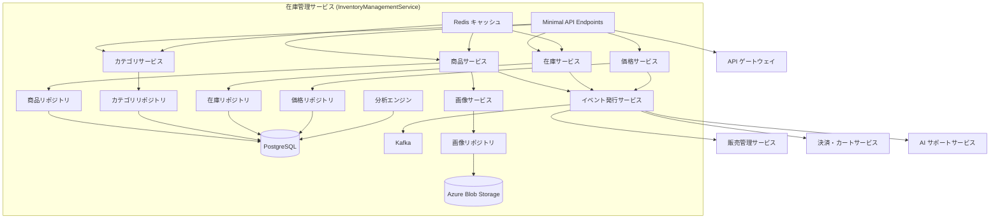
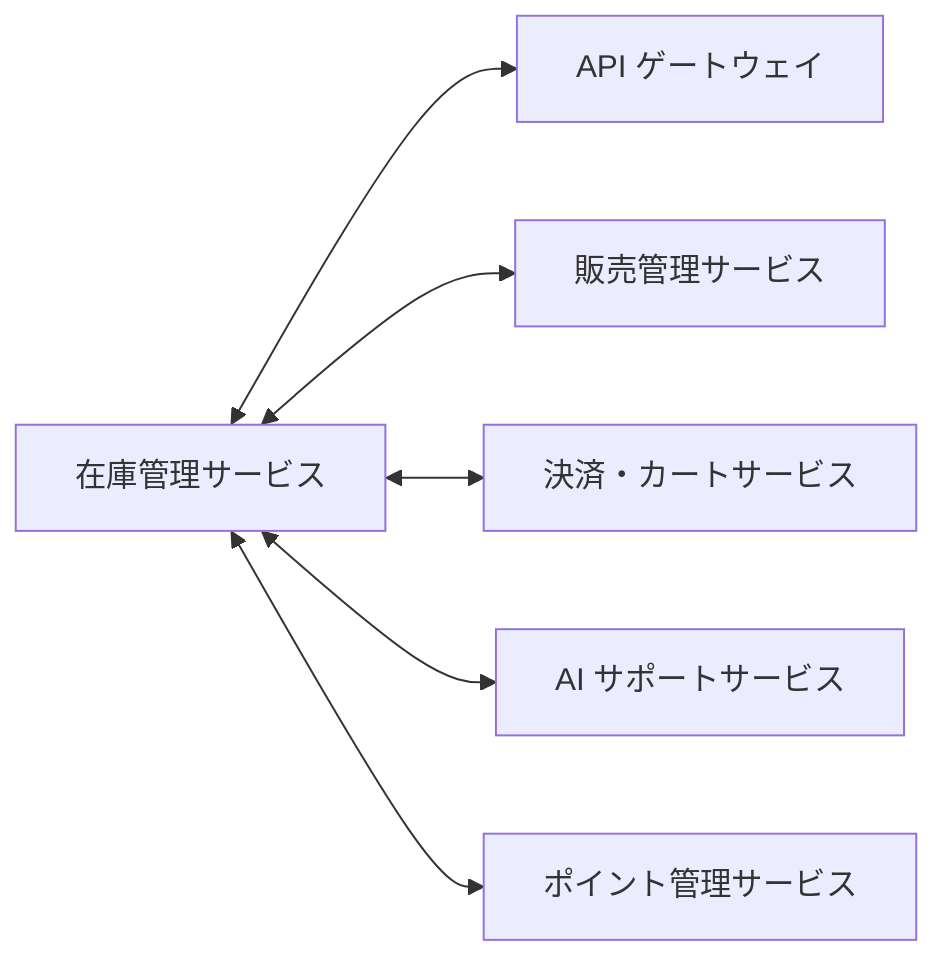
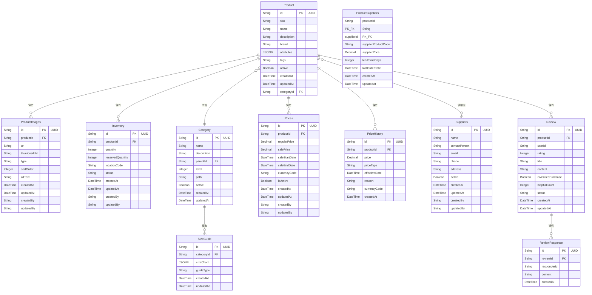
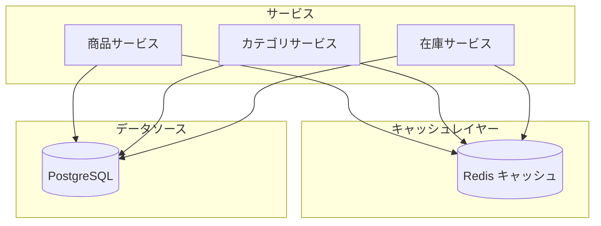
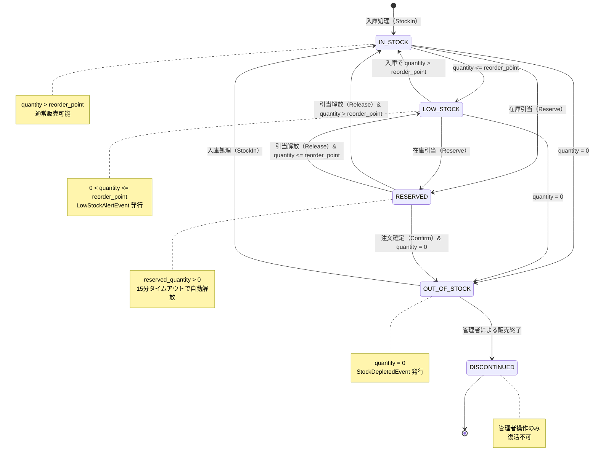

# 在庫管理サービス - 詳細設計書

## 1. 概要

在庫管理サービスは、スキーショップアプリケーションにおける商品ライフサイクル全体と在庫オペレーションを管理する包括的なマイクロサービスである。商品カタログ管理、在庫追跡、在庫レベル監視、価格管理を担い、在庫操作、商品検索、カテゴリ管理のための包括的な API を提供する。戦略的なキャッシュとイベント駆動アーキテクチャにより高性能を維持しながら、全販売チャネルにわたるリアルタイムの在庫精度を保証する。

## 2. 技術スタック

### 開発環境

- **言語**: C# 14 (.NET 10 LTS)
- **フレームワーク**: ASP.NET Core 10 (Minimal API)
- **ビルドツール**: dotnet CLI / MSBuild
- **オーケストレーション**: .NET Aspire 13.1
- **コンテナ化**: Docker 25.x
- **テスト**: xUnit, NSubstitute, Shouldly, Testcontainers.PostgreSql

### 本番環境

- Azure Container Apps
- Azure Database for PostgreSQL
- Azure Blob Storage

### 主要ライブラリとバージョン

| ライブラリ | バージョン | 用途 |
|---------|---------|---------|
| Microsoft.EntityFrameworkCore | 10.* | ORM データアクセス |
| Npgsql.EntityFrameworkCore.PostgreSQL | 10.* | PostgreSQL プロバイダー |
| Microsoft.EntityFrameworkCore.Design | 10.* | マイグレーションツール |
| Microsoft.AspNetCore.Authentication.JwtBearer | 10.* | JWT 認証 |
| FluentValidation | 11.* | 入力バリデーション |
| FluentValidation.DependencyInjectionExtensions | 11.* | DI 統合 |
| Confluent.Kafka | 2.* | イベント発行・購読 |
| StackExchange.Redis | 2.* | Redis キャッシュ |
| Polly | 8.* | 耐障害性（リトライ・サーキットブレーカー） |
| Microsoft.Extensions.Http.Resilience | 9.* | HTTP レジリエンス |
| Serilog.AspNetCore | 8.* | 構造化ロギング |
| OpenTelemetry.Extensions.Hosting | 1.* | メトリクス収集 |
| OpenTelemetry.Instrumentation.AspNetCore | 1.* | ASP.NET Core 計装 |
| Azure.Storage.Blobs | 12.* | Azure Blob Storage 統合 |
| Azure.Identity | 1.* | Azure 認証 |
| AspNetCore.HealthChecks.NpgSql | 9.* | PostgreSQL ヘルスチェック |
| AspNetCore.HealthChecks.Redis | 9.* | Redis ヘルスチェック |

## 3. システムアーキテクチャ

### コンポーネントアーキテクチャ図



### マイクロサービス関連図



### クラス構造

#### 主要クラス

#### Endpoints レイヤー

- `ProductEndpoints`: 商品関連操作の Minimal API エンドポイント定義
- `CategoryEndpoints`: カテゴリ関連操作の Minimal API エンドポイント定義
- `InventoryEndpoints`: 在庫関連操作の Minimal API エンドポイント定義
- `PriceEndpoints`: 価格関連操作の Minimal API エンドポイント定義
- `ReviewEndpoints`: 商品レビュー関連操作の Minimal API エンドポイント定義
- `SizeGuideEndpoints`: サイズガイド関連操作の Minimal API エンドポイント定義

#### gRPC サービスレイヤー

- `InventoryGrpcService`: Saga ステップ 2 の gRPC サービス（在庫予約/解放）

#### Service レイヤー

- `IProductService` / `ProductService`: 商品関連操作のビジネスロジック
- `ICategoryService` / `CategoryService`: カテゴリ関連操作のビジネスロジック
- `IInventoryService` / `InventoryService`: 在庫関連操作のビジネスロジック
- `IPriceService` / `PriceService`: 価格関連操作のビジネスロジック
- `IReviewService` / `ReviewService`: 商品レビュー関連操作のビジネスロジック
- `ISizeGuideService` / `SizeGuideService`: サイズガイド関連操作のビジネスロジック
- `IEventPublisherService` / `EventPublisherService`: Kafka へのイベント発行（Outbox パターン経由）

#### BackgroundService レイヤー

- `OutboxPublisher`: Outbox テーブルから Kafka へのイベント発行（動的バックオフ: 100ms〜5s）
- `InventoryReservationCleanupService`: 15 分以上経過した在庫引当の自動解放
- `OrderCreatedConsumer`: 注文作成イベント購読による在庫予約
- `OrderCompletedConsumer`: 注文完了イベント購読による在庫減少確定
- `OrderCancelledConsumer`: 注文キャンセルイベント購読による在庫予約解放
- `CacheWarmupService`: 起動時のキャッシュウォームアップ

#### Repository レイヤー

**EF Core リポジトリ**（名前空間: `InventoryManagementService.Repositories`）

- `IProductRepository` / `ProductRepository`: 商品データアクセス（PostgreSQL）
- `ICategoryRepository` / `CategoryRepository`: カテゴリデータアクセス（PostgreSQL）
- `IInventoryRepository` / `InventoryRepository`: 在庫データアクセス（PostgreSQL）
- `IPriceRepository` / `PriceRepository`: 価格データアクセス（PostgreSQL）
- `IReviewRepository` / `ReviewRepository`: レビューデータアクセス（PostgreSQL）
- `ISizeGuideRepository` / `SizeGuideRepository`: サイズガイドデータアクセス（PostgreSQL）
- `IImageRepository` / `ImageRepository`: 画像データアクセス（Azure Blob Storage）

#### Models

##### EF Core エンティティ（名前空間: `InventoryManagementService.Models`）

- `Product`: 商品エンティティ
- `Category`: カテゴリエンティティ
- `Inventory`: 在庫エンティティ
- `Price`: 価格エンティティ
- `ProductImage`: 商品画像エンティティ
- `Review`: 商品レビューエンティティ（Aggregate Root）
- `ReviewResponse`: レビュー返信エンティティ
- `SizeGuide`: サイズガイドエンティティ
- `PriceHistory`: 価格履歴エンティティ
- `OutboxEvent`: Outbox イベントエンティティ

#### DTOs（C# record）

- `ProductDto`: 商品データ転送オブジェクト
- `CategoryDto`: カテゴリデータ転送オブジェクト
- `ProductImageDto`: 商品画像データ転送オブジェクト

#### リクエスト DTO（名前空間: `InventoryManagementService.DTOs.Requests`）

- `ProductCreateRequest`: 商品作成リクエスト DTO
- `CategoryCreateRequest`: カテゴリ作成リクエスト DTO
- `CategoryUpdateRequest`: カテゴリ更新リクエスト DTO

#### 設定

- `CacheConfig`: Redis キャッシュ設定
- `KafkaConfig`: Kafka 設定

#### 例外処理

- `InventoryException`: 在庫関連エラーの基底例外クラス
- `ResourceNotFoundException`: リソース未検出の例外（HTTP 404）
- `InsufficientStockException`: 在庫不足の例外（HTTP 422）
- `DuplicateResourceException`: リソース重複の例外（HTTP 409）

## 4. データモデル

### エンティティ関連図



## データベーススキーマ

### PostgreSQL テーブル

#### products テーブル

| カラム | データ型 | 制約 | 説明 |
|--------|-----------|-------------|-------------|
| id | VARCHAR(36) | PK | 商品 ID（UUID） |
| sku | VARCHAR(100) | NOT NULL, UNIQUE | SKU コード |
| name | VARCHAR(255) | NOT NULL | 商品名 |
| description | TEXT | NULL | 商品説明 |
| brand | VARCHAR(100) | NULL | ブランド名 |
| attributes | JSONB | NULL | 商品属性（柔軟なキーバリュー） |
| tags | TEXT[] | NULL | タグ配列 |
| category_id | VARCHAR(36) | FK | カテゴリ ID |
| weight | DECIMAL(8,2) | NULL, CHECK (weight > 0) | 商品重量（kg）— 配送料計算に使用 |
| active | BOOLEAN | NOT NULL, DEFAULT true | 有効状態 |
| row_version | BYTEA | NOT NULL | 楽観的ロック用バージョン（EF Core `[Timestamp]`） |
| created_at | TIMESTAMP WITH TIME ZONE | NOT NULL, DEFAULT CURRENT_TIMESTAMP | 作成日時 |
| updated_at | TIMESTAMP WITH TIME ZONE | NOT NULL, DEFAULT CURRENT_TIMESTAMP | 更新日時 |

**CHECK 制約**:
- `ck_products_weight`: `CHECK (weight > 0)` — 重量は正の値（NULL 許容、設定時は正の値を強制）

> **補足**: 価格（`price`）・税率（`tax_rate`）の CHECK 制約は `prices` テーブルで管理する。products テーブルには価格関連カラムを持たない設計（価格は `prices` テーブルに分離済み）。

**FK 制約**:
- `fk_products_category`: `FOREIGN KEY (category_id) REFERENCES categories(id) ON DELETE RESTRICT ON UPDATE CASCADE`

> **補足**: `attributes` カラムは JSONB 型で商品属性を柔軟に管理する。spec.md では `ProductAttribute` を独立テーブルとして定義しているが、本サービスでは以下の理由で JSONB 方式を採用する:
> - スキー用品の属性（サイズ、カラー、フレックス等）がカテゴリごとに大きく異なるため、固定スキーマより JSONB の柔軟性が優位
> - GIN インデックス (`CREATE INDEX idx_products_attributes ON products USING GIN (attributes)`) でフィルタリング性能を確保
> - `isFilterable`/`isSortable` の判定は JSONB 内のメタデータで管理: `{"length": {"value": "180cm", "filterable": true, "sortable": true}}`

> **SKU/バリエーション管理方針（Phase 1 / Phase 2 分割）**:
>
> spec.md のビジネス要件にはスキー板のサイズ（170cm/180cm/190cm）、ブーツのサイズ、ウェアのカラー等のバリエーション管理が含まれるが、Phase 1 では以下の方針で実装する:
>
> **Phase 1（現行設計）**: `Product` エンティティの `attributes` JSONB カラムでバリエーション情報を表現する。在庫はバリエーション単位ではなく、商品単位で管理する。API レスポンスの `availableSizes` は `attributes` JSONB 内の `sizes` 配列（例: `{"sizes": ["170cm", "180cm", "190cm"]}`）から導出する。SKU コード（例: `SKI-ATOMIC-001`）は商品単位で一意であり、バリエーション別 SKU（例: `SKI-ATOMIC-001-180-RED`）は Phase 1 スコープ外とする。
>
> **Phase 2 移行計画**: SKU 別在庫引当が必要になった段階で `ProductVariant` テーブルを導入する:
> ```sql
> -- Phase 2 で追加予定
> CREATE TABLE product_variants (
>     id            VARCHAR(36) PRIMARY KEY,
>     product_id    VARCHAR(36) NOT NULL REFERENCES products(id) ON DELETE CASCADE,
>     sku           VARCHAR(100) NOT NULL UNIQUE,  -- バリエーション別 SKU
>     size          VARCHAR(50)  NULL,              -- サイズ（170cm, 26.5cm 等）
>     color         VARCHAR(50)  NULL,              -- カラー
>     additional_price DECIMAL(12,2) NOT NULL DEFAULT 0,  -- サイズ/カラーによる追加料金
>     active        BOOLEAN NOT NULL DEFAULT true,
>     created_at    TIMESTAMP WITH TIME ZONE NOT NULL DEFAULT CURRENT_TIMESTAMP,
>     updated_at    TIMESTAMP WITH TIME ZONE NOT NULL DEFAULT CURRENT_TIMESTAMP
> );
> -- inventory テーブルの product_id を variant_id に拡張（後方互換維持）
> ALTER TABLE inventory ADD COLUMN variant_id VARCHAR(36) NULL REFERENCES product_variants(id);
> ```
> Phase 2 移行時の `Inventory` テーブル変更は後方互換を維持し、`variant_id IS NULL` の場合は商品単位在庫として動作させる。移行判断基準: SKU 別在庫引当の要件が PO から正式承認された時点で着手する。

#### categories テーブル

| カラム | データ型 | 制約 | 説明 |
|--------|-----------|-------------|-------------|
| id | VARCHAR(36) | PK | カテゴリ ID（UUID） |
| name | VARCHAR(255) | NOT NULL | カテゴリ名 |
| description | TEXT | NULL | カテゴリ説明 |
| parent_id | VARCHAR(36) | FK, NULL | 親カテゴリ ID |
| level | INTEGER | NOT NULL, DEFAULT 0 | 階層レベル |
| path | VARCHAR(500) | NULL | カテゴリパス |
| active | BOOLEAN | NOT NULL, DEFAULT true | 有効状態 |
| created_at | TIMESTAMP WITH TIME ZONE | NOT NULL, DEFAULT CURRENT_TIMESTAMP | 作成日時 |
| updated_at | TIMESTAMP WITH TIME ZONE | NOT NULL, DEFAULT CURRENT_TIMESTAMP | 更新日時 |

**FK 制約**:
- `fk_categories_parent`: `FOREIGN KEY (parent_id) REFERENCES categories(id) ON DELETE RESTRICT ON UPDATE CASCADE` — 子カテゴリ存在時は親削除禁止

#### inventory テーブル

| カラム | データ型 | 制約 | 説明 |
|--------|-----------|-------------|-------------|
| id | VARCHAR(36) | PK | 在庫 ID（UUID） |
| product_id | VARCHAR(36) | FK, NOT NULL | 商品 ID |
| quantity | INTEGER | NOT NULL, DEFAULT 0 | 利用可能数量 |
| reserved_quantity | INTEGER | NOT NULL, DEFAULT 0 | 予約済み数量 |
| location_code | VARCHAR(20) | NOT NULL | 保管場所コード |
| status | VARCHAR(50) | NOT NULL, DEFAULT 'IN_STOCK', CHECK (status IN ('IN_STOCK', 'LOW_STOCK', 'OUT_OF_STOCK', 'RESERVED', 'DISCONTINUED')) | 在庫ステータス |
| reorder_point | INTEGER | NOT NULL, DEFAULT 0, CHECK (reorder_point >= 0) | 発注点（この数量以下で自動発注アラート） |
| reserved_at | TIMESTAMP WITH TIME ZONE | NULL | 在庫引当日時（15 分タイムアウト解放用） |
| created_at | TIMESTAMP WITH TIME ZONE | NOT NULL, DEFAULT CURRENT_TIMESTAMP | 作成日時 |
| updated_at | TIMESTAMP WITH TIME ZONE | NOT NULL, DEFAULT CURRENT_TIMESTAMP | 更新日時 |
| created_by | VARCHAR(255) | NULL | 作成者 |
| updated_by | VARCHAR(255) | NULL | 更新者 |

**CHECK 制約**:
- `ck_inventory_quantity`: `CHECK (quantity >= 0)` — 在庫数は 0 以上
- `ck_inventory_reserved_quantity`: `CHECK (reserved_quantity >= 0)` — 予約数は 0 以上
- `ck_inventory_quantity_reserved`: `CHECK (quantity >= reserved_quantity)` — 予約数は在庫数を超えない
- `ck_inventory_reorder_point`: `CHECK (reorder_point >= 0)` — 発注点は 0 以上
- `ck_inventory_status`: `CHECK (status IN ('IN_STOCK', 'LOW_STOCK', 'OUT_OF_STOCK', 'RESERVED', 'DISCONTINUED'))` — 有効なステータス値に限定

**FK 制約**:
- `fk_inventory_product`: `FOREIGN KEY (product_id) REFERENCES products(id) ON DELETE CASCADE ON UPDATE CASCADE`

**補足**: `availableQuantity`（利用可能数量）は `quantity - reserved_quantity` としてアプリケーション層で算出する。generated column の使用も可だが、EF Core との互換性を考慮してアプリ算出を推奨。

#### prices テーブル

| カラム | データ型 | 制約 | 説明 |
|--------|-----------|-------------|-------------|
| id | VARCHAR(36) | PK | 価格 ID（UUID） |
| product_id | VARCHAR(36) | FK, NOT NULL | 商品 ID |
| regular_price | DECIMAL(12,2) | NOT NULL, CHECK (regular_price >= 0) | 通常価格 |
| sale_price | DECIMAL(12,2) | NULL, CHECK (sale_price >= 0) | セール価格 |
| sale_start_date | TIMESTAMP WITH TIME ZONE | NULL | セール開始日時 |
| sale_end_date | TIMESTAMP WITH TIME ZONE | NULL | セール終了日時 |
| currency_code | VARCHAR(3) | NOT NULL, DEFAULT 'JPY' | 通貨コード |
| is_active | BOOLEAN | NOT NULL, DEFAULT true | 有効状態 |
| created_at | TIMESTAMP WITH TIME ZONE | NOT NULL, DEFAULT CURRENT_TIMESTAMP | 作成日時 |
| updated_at | TIMESTAMP WITH TIME ZONE | NOT NULL, DEFAULT CURRENT_TIMESTAMP | 更新日時 |
| created_by | VARCHAR(255) | NULL | 作成者 |
| updated_by | VARCHAR(255) | NULL | 更新者 |

**FK 制約**:
- `fk_prices_product`: `FOREIGN KEY (product_id) REFERENCES products(id) ON DELETE CASCADE ON UPDATE CASCADE`

#### product_images テーブル

| カラム | データ型 | 制約 | 説明 |
|--------|-----------|-------------|-------------|
| id | VARCHAR(36) | PK | 画像 ID（UUID） |
| product_id | VARCHAR(36) | FK, NOT NULL | 商品 ID |
| url | VARCHAR(500) | NOT NULL | 画像 URL |
| thumbnail_url | VARCHAR(500) | NULL | サムネイル URL |
| type | VARCHAR(50) | NOT NULL, DEFAULT 'MAIN', CHECK (type IN ('MAIN', 'THUMBNAIL', 'GALLERY', 'DETAIL')) | 画像タイプ |
| sort_order | INTEGER | NOT NULL, DEFAULT 0 | 表示順序 |
| alt_text | VARCHAR(200) | NULL | 代替テキスト |
| created_at | TIMESTAMP WITH TIME ZONE | NOT NULL, DEFAULT CURRENT_TIMESTAMP | 作成日時 |
| updated_at | TIMESTAMP WITH TIME ZONE | NOT NULL, DEFAULT CURRENT_TIMESTAMP | 更新日時 |
| created_by | VARCHAR(255) | NULL | 作成者 |
| updated_by | VARCHAR(255) | NULL | 更新者 |

**FK 制約**:
- `fk_product_images_product`: `FOREIGN KEY (product_id) REFERENCES products(id) ON DELETE CASCADE ON UPDATE CASCADE`

**CHECK 制約**:
- `ck_product_images_type`: `CHECK (type IN ('MAIN', 'THUMBNAIL', 'GALLERY', 'DETAIL'))` — 有効な画像タイプに限定

#### suppliers テーブル

| カラム | データ型 | 制約 | 説明 |
|--------|-----------|-------------|-------------|
| id | VARCHAR(36) | PK | サプライヤー ID（UUID） |
| name | VARCHAR(255) | NOT NULL | サプライヤー名 |
| contact_person | VARCHAR(255) | NULL | 担当者名 |
| email | VARCHAR(255) | NULL | メールアドレス |
| phone | VARCHAR(50) | NULL | 電話番号 |
| address | TEXT | NULL | 住所 |
| active | BOOLEAN | NOT NULL, DEFAULT true | 有効状態 |
| created_at | TIMESTAMP WITH TIME ZONE | NOT NULL, DEFAULT CURRENT_TIMESTAMP | 作成日時 |
| updated_at | TIMESTAMP WITH TIME ZONE | NOT NULL, DEFAULT CURRENT_TIMESTAMP | 更新日時 |
| created_by | VARCHAR(255) | NULL | 作成者 |
| updated_by | VARCHAR(255) | NULL | 更新者 |

#### product_suppliers テーブル

| カラム | データ型 | 制約 | 説明 |
|--------|-----------|-------------|-------------|
| product_id | VARCHAR(36) | PK, FK | 商品 ID |
| supplier_id | VARCHAR(36) | PK, FK | サプライヤー ID |
| supplier_product_code | VARCHAR(255) | NULL | サプライヤー商品コード |
| supplier_price | DECIMAL(12,2) | NULL | サプライヤー価格 |
| lead_time_days | INTEGER | NULL | リードタイム（日数） |
| last_order_date | TIMESTAMP WITH TIME ZONE | NULL | 最終発注日 |
| created_at | TIMESTAMP WITH TIME ZONE | NOT NULL, DEFAULT CURRENT_TIMESTAMP | 作成日時 |
| updated_at | TIMESTAMP WITH TIME ZONE | NOT NULL, DEFAULT CURRENT_TIMESTAMP | 更新日時 |

**FK 制約**:
- `fk_product_suppliers_product`: `FOREIGN KEY (product_id) REFERENCES products(id) ON DELETE CASCADE ON UPDATE CASCADE`
- `fk_product_suppliers_supplier`: `FOREIGN KEY (supplier_id) REFERENCES suppliers(id) ON DELETE CASCADE ON UPDATE CASCADE`

#### price_histories テーブル

| カラム | データ型 | 制約 | 説明 |
|--------|-----------|-------------|-------------|
| id | VARCHAR(36) | PK | 価格履歴 ID（UUID） |
| product_id | VARCHAR(36) | FK, NOT NULL | 商品 ID |
| price | DECIMAL(12,2) | NOT NULL, CHECK (price >= 0) | 価格 |
| price_type | VARCHAR(50) | NOT NULL | 価格タイプ（REGULAR/SALE/PROMOTION） |
| effective_date | TIMESTAMP WITH TIME ZONE | NOT NULL | 適用開始日時 |
| reason | VARCHAR(500) | NULL | 変更理由 |
| currency_code | VARCHAR(3) | NOT NULL, DEFAULT 'JPY' | 通貨コード |
| changed_by | VARCHAR(255) | NULL | 変更者（監査証跡） |
| created_at | TIMESTAMP WITH TIME ZONE | NOT NULL, DEFAULT CURRENT_TIMESTAMP | 作成日時 |

**FK 制約**:
- `fk_price_histories_product`: `FOREIGN KEY (product_id) REFERENCES products(id) ON DELETE CASCADE ON UPDATE CASCADE`

**CHECK 制約**:
- `ck_price_histories_price`: `CHECK (price >= 0)` — 価格履歴も 0 以上
- `ck_price_histories_price_type`: `CHECK (price_type IN ('REGULAR', 'SALE', 'PROMOTION'))` — 価格タイプを列挙値に限定

#### reviews テーブル

| カラム | データ型 | 制約 | 説明 |
|--------|-----------|-------------|-------------|
| id | VARCHAR(36) | PK | レビュー ID（UUID） |
| product_id | VARCHAR(36) | FK, NOT NULL | 商品 ID |
| user_id | VARCHAR(36) | NOT NULL | ユーザー ID（マイクロサービス間参照、FK 制約なし） |
| rating | INTEGER | NOT NULL, CHECK (rating >= 1 AND rating <= 5) | 評価（1〜5） |
| title | VARCHAR(255) | NOT NULL | レビュータイトル |
| content | TEXT | NULL | レビュー本文 |
| is_verified_purchase | BOOLEAN | NOT NULL, DEFAULT false | 購入確認済みフラグ |
| helpful_count | INTEGER | NOT NULL, DEFAULT 0 | 「参考になった」数 |
| status | VARCHAR(20) | NOT NULL, DEFAULT 'PENDING', CHECK (status IN ('PENDING', 'APPROVED', 'REJECTED')) | レビューステータス |
| created_at | TIMESTAMP WITH TIME ZONE | NOT NULL, DEFAULT CURRENT_TIMESTAMP | 作成日時 |
| updated_at | TIMESTAMP WITH TIME ZONE | NOT NULL, DEFAULT CURRENT_TIMESTAMP | 更新日時 |

**FK 制約**:
- `fk_reviews_product`: `FOREIGN KEY (product_id) REFERENCES products(id) ON DELETE CASCADE ON UPDATE CASCADE`

**CHECK 制約**:
- `ck_reviews_rating`: `CHECK (rating >= 1 AND rating <= 5)` — 評価は 1〜5 の整数
- `ck_reviews_status`: `CHECK (status IN ('PENDING', 'APPROVED', 'REJECTED'))` — レビューステータスに限定

**GDPR/個人情報保護法対応（DSR 削除・匿名化）**:

`reviews.user_id` はマイクロサービス間参照（FK 制約なし）であるが、ユーザー削除要求（DSR）時に匿名化が必要となる:

- **匿名化ポリシー**: ユーザー削除時に `reviews.user_id` を `'DELETED_USER'` に更新する。レビュー本文（`title`, `content`）は EC サイトの商品品質情報として残存させる（正当な利益に基づく保持）
- **実装**: `user.deleted` Kafka イベントを購読する `UserDeletedConsumer` BackgroundService で匿名化を実行

```csharp
// ✅ UserDeletedConsumer — GDPR DSR 匿名化
public class UserDeletedConsumer(
    IConsumer<string, string> consumer,
    IServiceScopeFactory scopeFactory,
    ILogger<UserDeletedConsumer> logger) : BackgroundService
{
    protected override async Task ExecuteAsync(CancellationToken stoppingToken)
    {
        consumer.Subscribe("user.deleted");
        while (!stoppingToken.IsCancellationRequested)
        {
            try
            {
                var result = consumer.Consume(stoppingToken);
                var @event = JsonSerializer.Deserialize<UserDeletedEvent>(result.Message.Value);
                if (@event is not null)
                {
                    using var scope = scopeFactory.CreateScope();
                    var context = scope.ServiceProvider.GetRequiredService<AppDbContext>();

                    // reviews.user_id の匿名化
                    var affectedReviews = await context.Reviews
                        .Where(r => r.UserId == @event.UserId)
                        .ToListAsync(stoppingToken);

                    foreach (var review in affectedReviews)
                    {
                        review.UserId = "DELETED_USER";
                    }

                    // review_responses.responder_id の匿名化（ユーザーが管理者だった場合）
                    var affectedResponses = await context.ReviewResponses
                        .Where(r => r.ResponderId == @event.UserId)
                        .ToListAsync(stoppingToken);

                    foreach (var response in affectedResponses)
                    {
                        response.ResponderId = "DELETED_USER";
                    }

                    if (affectedReviews.Count > 0 || affectedResponses.Count > 0)
                    {
                        await context.SaveChangesAsync(stoppingToken);
                        logger.LogInformation(
                            "GDPR 匿名化完了: UserId={UserId}, Reviews={ReviewCount}, Responses={ResponseCount}",
                            @event.UserId, affectedReviews.Count, affectedResponses.Count);
                    }
                }
                consumer.Commit(result);
            }
            catch (ConsumeException ex)
            {
                logger.LogError(ex, "Kafka consume エラー: {Topic}", ex.ConsumerRecord?.Topic);
            }
            catch (Exception ex) when (ex is not OperationCanceledException)
            {
                logger.LogError(ex, "GDPR 匿名化エラー: {Message}", ex.Message);
                await Task.Delay(TimeSpan.FromSeconds(5), stoppingToken);
            }
        }
    }
}

// 購読イベント定義
public record UserDeletedEvent(string UserId, DateTimeOffset DeletedAt);
```

> **注意**: `UserDeletedConsumer` は Program.cs の BackgroundService 登録に `builder.Services.AddHostedService<UserDeletedConsumer>()` として追加すること。`user.deleted` トピックは AuthService から発行される。

**インデックス**:
- `idx_reviews_product_id`: `CREATE INDEX idx_reviews_product_id ON reviews(product_id)`
- `idx_reviews_user_id`: `CREATE INDEX idx_reviews_user_id ON reviews(user_id)`
- `idx_reviews_status`: `CREATE INDEX idx_reviews_status ON reviews(status)`

#### review_responses テーブル

| カラム | データ型 | 制約 | 説明 |
|--------|-----------|-------------|-------------|
| id | VARCHAR(36) | PK | 返信 ID（UUID） |
| review_id | VARCHAR(36) | FK, NOT NULL | レビュー ID |
| responder_id | VARCHAR(36) | NOT NULL | 返信者 ID（管理者ユーザー ID） |
| content | TEXT | NOT NULL | 返信内容 |
| created_at | TIMESTAMP WITH TIME ZONE | NOT NULL, DEFAULT CURRENT_TIMESTAMP | 作成日時 |

**FK 制約**:
- `fk_review_responses_review`: `FOREIGN KEY (review_id) REFERENCES reviews(id) ON DELETE CASCADE ON UPDATE CASCADE`

#### size_guides テーブル

| カラム | データ型 | 制約 | 説明 |
|--------|-----------|-------------|-------------|
| id | VARCHAR(36) | PK | サイズガイド ID（UUID） |
| category_id | VARCHAR(36) | FK, NOT NULL | カテゴリ ID |
| size_chart | JSONB | NOT NULL | サイズ表（JSON 構造） |
| guide_type | VARCHAR(50) | NOT NULL | ガイドタイプ（SKI/BOOT/BINDING/POLE 等） |
| created_at | TIMESTAMP WITH TIME ZONE | NOT NULL, DEFAULT CURRENT_TIMESTAMP | 作成日時 |
| updated_at | TIMESTAMP WITH TIME ZONE | NOT NULL, DEFAULT CURRENT_TIMESTAMP | 更新日時 |

**FK 制約**:
- `fk_size_guides_category`: `FOREIGN KEY (category_id) REFERENCES categories(id) ON DELETE RESTRICT ON UPDATE CASCADE`

> サイズガイドはスキー用品 EC サイトにおけるサイズ不適合による返品率低減（目標: 返品率 5% 以下、サイズ不適合 3% 以下）に直結する重要機能。

#### outbox_events テーブル

| カラム | データ型 | 制約 | 説明 |
|--------|-----------|-------------|-------------|
| id | VARCHAR(36) | PK | イベント ID（UUID） |
| event_type | VARCHAR(255) | NOT NULL | イベントタイプ |
| aggregate_id | VARCHAR(36) | NOT NULL | 集約ルート ID |
| aggregate_type | VARCHAR(100) | NOT NULL | 集約ルート型名（例: Product, Inventory） |
| topic | VARCHAR(255) | NOT NULL | 発行先 Kafka トピック名 |
| payload | TEXT | NOT NULL | イベントペイロード（JSON） |
| created_at | TIMESTAMP WITH TIME ZONE | NOT NULL, DEFAULT CURRENT_TIMESTAMP | 作成日時 |
| published_at | TIMESTAMP WITH TIME ZONE | NULL | 発行日時 |
| retry_count | INTEGER | NOT NULL, DEFAULT 0, CHECK (retry_count >= 0) | リトライ回数 |
| max_retries | INTEGER | NOT NULL, DEFAULT 5 | 最大リトライ回数 |
| last_error | VARCHAR(2000) | NULL | 最終エラーメッセージ |
| status | VARCHAR(20) | NOT NULL, DEFAULT 'PENDING', CHECK (status IN ('PENDING', 'PROCESSING', 'PUBLISHED', 'FAILED', 'DEAD_LETTER')) | ステータス |

**CHECK 制約**:
- `ck_outbox_events_retry_count`: `CHECK (retry_count >= 0)` — リトライ回数は 0 以上
- `ck_outbox_events_status`: `CHECK (status IN ('PENDING', 'PROCESSING', 'PUBLISHED', 'FAILED', 'DEAD_LETTER'))` — Outbox ステータスに限定

**インデックス**:
```sql
-- 未発行イベントの高速取得（フルスキャン防止）
CREATE INDEX idx_outbox_events_pending
    ON outbox_events (created_at ASC)
    WHERE status = 'PENDING';

-- 失敗イベントの管理者ダッシュボード表示用
CREATE INDEX idx_outbox_events_failed
    ON outbox_events (created_at DESC)
    WHERE status = 'FAILED';
```

> **Outbox パターン（ADR-0005 準拠）**: 全ての Kafka イベント発行は Outbox パターンを通じて行われる。DB トランザクション内で `outbox_events` テーブルにイベントを書き込み、`OutboxPublisher` BackgroundService が非同期で Kafka に発行する。これにより DB コミットとイベント発行の原子性を保証する。詳細は「BackgroundService 設計」セクション参照。

## サービス情報

| 項目 | 値 |
|------|-------|
| サービス名 | InventoryManagementService |
| ポート | 5003 |
| データベース | PostgreSQL (inventorydb) |
| フレームワーク | ASP.NET Core 10 (Minimal API) |
| 言語 | C# 14 (.NET 10) |
| アーキテクチャ | イベント駆動型マイクロサービス、PostgreSQL 統一データストア |

## 5. API 設計

### REST API エンドポイント

#### 商品管理 API

| メソッド | パス | 説明 | 認可 | パラメータ | レスポンス |
|---------|-----|------------|------|------------|----------|
| GET | /api/products | ページネーション付き商品一覧取得 | `AllowAnonymous` | page, size, sortBy, sortDir | ページネーション付き `ProductDto` |
| GET | /api/products/{id} | ID による商品詳細取得 | `AllowAnonymous` | id | ProductDto |
| GET | /api/products/sku/{sku} | SKU による商品取得 | `AllowAnonymous` | sku | ProductDto |
| GET | /api/products/search | キーワードによる商品検索 | `AllowAnonymous` | keyword, category, brand, page, size | ページネーション付き `ProductDto` |
| GET | /api/products/category/{categoryId} | カテゴリ別商品取得 | `AllowAnonymous` | categoryId, page, size | ページネーション付き `ProductDto` |
| POST | /api/products | 新規商品作成 | `RequireAuthorization("AdminOnly")` | ProductCreateRequest | ProductDto |
| PUT | /api/products/{id} | 商品情報更新 | `RequireAuthorization("AdminOnly")` | id, ProductUpdateRequest | ProductDto |
| DELETE | /api/products/{id} | 商品削除（論理削除） | `RequireAuthorization("AdminOnly")` | id | 204 No Content |
| POST | /api/products/{id}/images | 商品画像アップロード | `RequireAuthorization("AdminOnly")` | id, IFormFile（multipart/form-data） | ProductImageDto |
| POST | /api/products/batch | 複数 ID による商品一括取得 | `AllowAnonymous` | productIds リスト | `List<ProductDto>` |

> **商品削除の設計判断**: 商品削除は**論理削除**（`active = false`）を採用する。物理削除は在庫・注文履歴・レビュー等の参照整合性を破壊するリスクがあるため禁止する。論理削除された商品はフロントエンドの検索結果から除外されるが、管理者ダッシュボードからは参照可能とする。

#### カテゴリ管理 API

| メソッド | パス | 説明 | 認可 | パラメータ | レスポンス |
|---------|-----|------------|------|------------|----------|
| GET | /api/categories | ページネーション付きカテゴリ一覧取得 | `AllowAnonymous` | page, size, name | ページネーション付き `CategoryDto` |
| GET | /api/categories/{id} | ID によるカテゴリ詳細取得 | `AllowAnonymous` | id | CategoryDto |
| GET | /api/categories/{id}/products | カテゴリ内商品取得 | `AllowAnonymous` | id, page, size | ページネーション付き `ProductDto` |
| POST | /api/categories | 新規カテゴリ作成 | `RequireAuthorization("AdminOnly")` | CategoryCreateRequest | CategoryDto |
| PUT | /api/categories/{id} | カテゴリ情報更新 | `RequireAuthorization("AdminOnly")` | id, CategoryUpdateRequest | CategoryDto |
| DELETE | /api/categories/{id} | カテゴリ削除 | `RequireAuthorization("AdminOnly")` | id | 成功レスポンス |

#### 在庫管理 API

| メソッド | パス | 説明 | 認可 | パラメータ | レスポンス |
|---------|-----|------------|------|------------|----------|
| GET | /api/inventory/{productId} | 商品在庫情報取得 | `AllowAnonymous` | productId | InventoryDto |
| GET | /api/inventory/status/{productId} | 詳細在庫ステータス取得 | `RequireAuthorization` | productId | InventoryStatusDto |
| POST | /api/inventory/batch | 複数商品 ID による在庫一括取得 | `AllowAnonymous` | productIds リスト | `List<InventoryDto>` |
| POST | /api/inventory/stock-in | 入庫処理 | `RequireAuthorization("AdminOnly")` | StockInRequest | InventoryDto |
| POST | /api/inventory/stock-out | 出庫処理（調整） | `RequireAuthorization("AdminOnly")` | StockOutRequest | InventoryDto |
| GET | /api/inventory/low-stock | 低在庫商品取得 | `RequireAuthorization("AdminOnly")` | threshold, page, size | ページネーション付き `InventoryDto` |

> **在庫予約/解放 API（内部専用）**: 在庫予約（reserve）と予約解放（release）は gRPC サービス（`InventoryGrpcService`）経由のサービス間内部通信専用とし、REST API としては外部公開しない。これにより Saga オーケストレーター以外からの不正な在庫操作を防止する（H-10: IDOR 防止）。Saga コーディネーターからの Client Credentials トークンのスコープ（`inventory.stock:reserve`）を検証する。

#### 価格管理 API

| メソッド | パス | 説明 | 認可 | パラメータ | レスポンス |
|---------|-----|------------|------|------------|----------|
| GET | /api/prices/{productId} | 商品価格情報取得 | `AllowAnonymous` | productId | PriceDto |
| POST | /api/prices | 商品価格作成・更新 | `RequireAuthorization("AdminOnly")` | PriceCreateRequest | PriceDto |
| PUT | /api/prices/{productId} | 商品価格更新 | `RequireAuthorization("AdminOnly")` | productId, PriceUpdateRequest | PriceDto |
| GET | /api/prices/history/{productId} | 価格履歴取得 | `RequireAuthorization("AdminOnly")` | productId, page, size | ページネーション付き `PriceHistoryDto` |

#### レビュー管理 API

| メソッド | パス | 説明 | 認可 | パラメータ | レスポンス |
|---------|-----|------------|------|------------|----------|
| GET | /api/reviews/product/{productId} | 商品レビュー一覧取得 | `AllowAnonymous` | productId, page, size | ページネーション付き `ReviewDto` |
| GET | /api/reviews/{id} | レビュー詳細取得 | `AllowAnonymous` | id | ReviewDto |
| POST | /api/reviews | レビュー投稿 | `RequireAuthorization` | ReviewCreateRequest | ReviewDto |
| PUT | /api/reviews/{id}/status | レビューステータス更新 | `RequireAuthorization("AdminOnly")` | id, ReviewStatusUpdateRequest | ReviewDto |
| POST | /api/reviews/{id}/response | レビュー返信（管理者） | `RequireAuthorization("AdminOnly")` | id, ReviewResponseCreateRequest | ReviewResponseDto |
| POST | /api/reviews/{id}/helpful | 「参考になった」カウント | `RequireAuthorization` | id | ReviewDto |

#### サイズガイド API

| メソッド | パス | 説明 | 認可 | パラメータ | レスポンス |
|---------|-----|------------|------|------------|----------|
| GET | /api/size-guides/{categoryId} | カテゴリ別サイズガイド取得 | `AllowAnonymous` | categoryId | SizeGuideDto |
| POST | /api/size-guides | サイズガイド作成 | `RequireAuthorization("AdminOnly")` | SizeGuideCreateRequest | SizeGuideDto |
| PUT | /api/size-guides/{id} | サイズガイド更新 | `RequireAuthorization("AdminOnly")` | id, SizeGuideUpdateRequest | SizeGuideDto |

### 実装上の注意事項

- **認証**: 全ての書き込み操作には適切なロールベース認証が必要
- **C# 14 機能**: record 型、switch 式、パターンマッチング等のモダン機能を活用
- **統一データベース**: 商品・カテゴリ・在庫・価格の全データを PostgreSQL に統一（JSONB で柔軟性確保）
- **キャッシュ**: 頻繁にアクセスされるデータに対する戦略的キャッシュ
- **イベント駆動**: 在庫変更、価格更新、商品変更のイベントを発行

### API リクエスト & レスポンス例

#### 商品一覧リクエスト

```http
GET /api/products?category=ski&page=0&size=10 HTTP/1.1
```

#### 商品一覧レスポンス

```http
HTTP/1.1 200 OK
Content-Type: application/json

{
  "items": [
    {
      "id": "550e8400-e29b-41d4-a716-446655440001",
      "sku": "SKI-ATOMIC-001",
      "name": "Atomic Bent 100 スキー",
      "description": "Atomic Bent 100 は多用途なオールマウンテンスキーで...",
      "brand": "Atomic",
      "attributes": {
        "length": "180cm",
        "width": "100mm",
        "color": "レッド/ブラック",
        "material": "カーボンインサート入りウッドコア",
        "yearModel": "2025"
      },
      "price": {
        "regularPrice": 65000,
        "salePrice": 58500,
        "currencyCode": "JPY",
        "onSale": true
      },
      "inventory": {
        "status": "IN_STOCK",
        "quantity": 15
      },
      "category": {
        "id": "550e8400-e29b-41d4-a716-446655440010",
        "name": "スキー"
      },
      "imageUrl": "https://storage.skieshop.com/products/atomic-bent-100-main.jpg",
      "active": true
    }
  ],
  "page": 0,
  "size": 10,
  "totalElements": 42,
  "totalPages": 5,
  "hasNext": true,
  "hasPrevious": false
}
```

#### 商品詳細レスポンス

```json
{
  "id": "550e8400-e29b-41d4-a716-446655440001",
  "sku": "SKI-ATOMIC-001",
  "name": "Atomic Bent 100 スキー",
  "description": "Atomic Bent 100 はさまざまな雪質で卓越した性能を発揮する多用途なオールマウンテンスキーです。ウエスト幅 100mm とロッカー形状のトップ・テールにより、パウダーでの浮力とグルーミングバーンでの安定性を両立。軽量ウッドコアにカーボンインサートを組み合わせ、強度と柔軟性の完璧なバランスを実現しています。",
  "brand": "Atomic",
  "attributes": {
    "length": "180cm",
    "width": "100mm",
    "color": "レッド/ブラック",
    "material": "カーボンインサート入りウッドコア",
    "yearModel": "2025",
    "skill": "中級〜上級",
    "terrain": "オールマウンテン",
    "flex": "ミディアム",
    "radius": "19m"
  },
  "price": {
    "regularPrice": 65000,
    "salePrice": 58500,
    "currencyCode": "JPY",
    "onSale": true,
    "saleStartDate": "2025-06-01T00:00:00Z",
    "saleEndDate": "2025-07-31T23:59:59Z"
  },
  "inventory": {
    "status": "IN_STOCK",
    "quantity": 15,
    "availableSizes": ["170cm", "180cm", "190cm"]
  },
  "category": {
    "id": "550e8400-e29b-41d4-a716-446655440010",
    "name": "スキー",
    "path": "スキー用品/スキー"
  },
  "images": [
    {
      "id": "550e8400-e29b-41d4-a716-446655440020",
      "url": "https://storage.skieshop.com/products/atomic-bent-100-main.jpg",
      "thumbnailUrl": "https://storage.skieshop.com/products/thumbnails/atomic-bent-100-main.jpg",
      "altText": "Atomic Bent 100 サイドビュー",
      "sortOrder": 1
    }
  ],
  "tags": ["オールマウンテン", "パウダー", "フリーライド", "2025年モデル"],
  "active": true,
  "createdAt": "2025-01-15T09:30:00Z",
  "updatedAt": "2025-06-01T10:15:00Z"
}
```

## 5.1. gRPC サービス設計（Saga ステップ 2）

在庫管理サービスは、注文確定フロー（ADR-0009: Saga オーケストレーションパターン）のステップ 2 として gRPC サービスを提供する。

> **Saga ステップ番号の SSOT（Single Source of Truth）**: Saga ステップ番号の正規定義は **spec.md §4 の 9 ステップ定義**（ステップ 1: カート取得、ステップ 2: 在庫確認・引当、...、ステップ 9: Outbox 書込み）を SSOT とする。ADR-0009 の内容も spec.md の 9 ステップ定義と整合済みである。本設計書内の「ステップ 2」は spec.md §4 のステップ 2（在庫確認・引当）に対応する。ステップ番号に矛盾が見つかった場合は、spec.md §4 の定義を優先すること。

### inventory.proto 定義

```protobuf
// SkiShop.Contracts/Protos/inventory.proto
syntax = "proto3";

package skishop.inventory;

service InventoryService {
  rpc ReserveInventory (ReserveInventoryRequest) returns (ReserveInventoryResponse);
  rpc ReleaseReservation (ReleaseReservationRequest) returns (ReleaseReservationResponse);
}

message ReserveInventoryRequest {
  string order_id = 1;
  repeated ReserveItem items = 2;
}

message ReserveItem {
  string product_id = 1;
  int32 quantity = 2;
}

message ReserveInventoryResponse {
  bool success = 1;
  string reservation_id = 2;
  string error_message = 3;
}

message ReleaseReservationRequest {
  string order_id = 1;
  string reservation_id = 2;
}

message ReleaseReservationResponse {
  bool success = 1;
  string error_message = 2;
}
```

### gRPC サービス実装

```csharp
// ✅ InventoryGrpcService — Saga ステップ 2 の gRPC 実装
public class InventoryGrpcService(
    IInventoryService inventoryService,
    ILogger<InventoryGrpcService> logger) : InventoryService.InventoryServiceBase
{
    public override async Task<ReserveInventoryResponse> ReserveInventory(
        ReserveInventoryRequest request, ServerCallContext context)
    {
        try
        {
            var reservationId = await inventoryService.ReserveAsync(
                request.OrderId,
                request.Items.Select(i => new ReserveItemDto(i.ProductId, i.Quantity)).ToList(),
                context.CancellationToken);

            return new ReserveInventoryResponse { Success = true, ReservationId = reservationId };
        }
        catch (InsufficientStockException ex)
        {
            logger.LogWarning("在庫不足: OrderId={OrderId}, {Message}", request.OrderId, ex.Message);
            return new ReserveInventoryResponse { Success = false, ErrorMessage = ex.Message };
        }
    }

    public override async Task<ReleaseReservationResponse> ReleaseReservation(
        ReleaseReservationRequest request, ServerCallContext context)
    {
        await inventoryService.ReleaseAsync(request.OrderId, request.ReservationId, context.CancellationToken);
        return new ReleaseReservationResponse { Success = true };
    }
}

// ✅ Program.cs での gRPC 登録
builder.Services.AddGrpc();
app.MapGrpcService<InventoryGrpcService>();
```

### gRPC 設定

| 項目 | 値 | 備考 |
|------|--------|------|
| Deadline | 500ms | Saga ステップの最大待機時間 |
| リトライ | 最大 2 回 | 指数バックオフ（100ms） |
| 認証 | Client Credentials（スコープ: `inventory.stock:reserve`） | Saga コーディネーターのみアクセス可能 |
| ロードバランシング | DNS ラウンドロビン | Azure Container Apps 内部 DNS 使用 |

### gRPC 認証・認可の具体的実装

gRPC サービスへの不正アクセスを防止するため、以下の多層防御を実装する:

**1. InternalServiceOnly ポリシー**: gRPC エンドポイントに内部サービス専用認可ポリシーを適用する:

```csharp
// ✅ Program.cs での InternalServiceOnly ポリシー定義
builder.Services.AddAuthorization(options =>
{
    options.AddPolicy("InternalServiceOnly", policy =>
        policy.RequireClaim("scope", "inventory.stock:reserve")
              .RequireClaim("client_id"));  // Client Credentials 必須
});

// ✅ gRPC Interceptor によるスコープ検証
public class AuthorizationInterceptor(
    IAuthorizationService authService,
    ILogger<AuthorizationInterceptor> logger) : Interceptor
{
    public override async Task<TResponse> UnaryServerHandler<TRequest, TResponse>(
        TRequest request,
        ServerCallContext context,
        UnaryServerMethod<TRequest, TResponse> continuation)
    {
        var httpContext = context.GetHttpContext();
        var result = await authService.AuthorizeAsync(
            httpContext.User, "InternalServiceOnly");
        if (!result.Succeeded)
        {
            logger.LogWarning("未認可の gRPC アクセス: {Method}, Peer={Peer}",
                context.Method, context.Peer);
            throw new RpcException(new Grpc.Core.Status(
                StatusCode.PermissionDenied, "アクセスが拒否されました"));
        }
        return await continuation(request, context);
    }
}

// ✅ Program.cs での Interceptor 登録
builder.Services.AddGrpc(options =>
{
    options.Interceptors.Add<AuthorizationInterceptor>();
});
```

**2. Client Credentials トークンキャッシュ**: Saga コーディネーター側で取得した Client Credentials トークンは、トークン有効期限の 80% の TTL でキャッシュする（例: 有効期限 3600 秒 → キャッシュ TTL 2880 秒）。

**3. mTLS 適用方針**: Azure Container Apps のサービス間通信では、Azure マネージド証明書による mTLS が自動適用される。ローカル開発環境では .NET Aspire のサービス参照（`WithReference`）による内部 DNS 解決を使用し、mTLS は任意とする。

## 5.2. Service / Repository インターフェース定義

### Service インターフェース

```csharp
// ✅ IProductService — 商品サービスインターフェース
public interface IProductService
{
    Task<ProductDto> CreateProductAsync(ProductCreateRequest request, CancellationToken ct = default);
    Task<ProductDto?> GetByIdAsync(string id, CancellationToken ct = default);
    Task<ProductDto?> GetBySkuAsync(string sku, CancellationToken ct = default);
    Task<PaginatedResult<ProductDto>> SearchAsync(ProductSearchCriteria criteria, int page, int size, CancellationToken ct = default);
    Task<PaginatedResult<ProductDto>> GetByCategoryAsync(string categoryId, int page, int size, CancellationToken ct = default);
    Task<List<ProductDto>> GetByIdsAsync(List<string> ids, CancellationToken ct = default);
    Task<ProductDto> UpdateAsync(string id, ProductUpdateRequest request, CancellationToken ct = default);
    Task DeleteAsync(string id, CancellationToken ct = default);
}

// ✅ IInventoryService — 在庫サービスインターフェース
public interface IInventoryService
{
    Task<string> ReserveAsync(string orderId, List<ReserveItemDto> items, CancellationToken ct = default);
    Task ReleaseAsync(string orderId, string reservationId, CancellationToken ct = default);
    Task<InventoryDto> StockInAsync(StockInRequest request, CancellationToken ct = default);
    Task<InventoryDto> StockOutAsync(StockOutRequest request, CancellationToken ct = default);
    Task<InventoryDto?> GetByProductIdAsync(string productId, CancellationToken ct = default);
    Task<PaginatedResult<InventoryDto>> GetLowStockAsync(int threshold, int page, int size, CancellationToken ct = default);
}

// ✅ ICategoryService — カテゴリサービスインターフェース
public interface ICategoryService
{
    Task<CategoryDto> CreateAsync(CategoryCreateRequest request, CancellationToken ct = default);
    Task<CategoryDto> UpdateAsync(string id, CategoryUpdateRequest request, CancellationToken ct = default);
    Task DeleteAsync(string id, CancellationToken ct = default);
    Task<CategoryDto?> GetByIdAsync(string id, CancellationToken ct = default);
    Task<PaginatedResult<CategoryDto>> GetAllAsync(int page, int size, string? name, CancellationToken ct = default);
}

// ✅ IPriceService — 価格サービスインターフェース
public interface IPriceService
{
    Task<PriceDto?> GetByProductIdAsync(string productId, CancellationToken ct = default);
    Task<PriceDto> CreateOrUpdateAsync(PriceCreateRequest request, CancellationToken ct = default);
    Task<PriceDto> UpdateAsync(string productId, PriceUpdateRequest request, CancellationToken ct = default);
    Task<PaginatedResult<PriceHistoryDto>> GetHistoryAsync(string productId, int page, int size, CancellationToken ct = default);
}

// ✅ IReviewService — レビューサービスインターフェース
public interface IReviewService
{
    Task<ReviewDto> CreateAsync(string userId, ReviewCreateRequest request, CancellationToken ct = default);
    Task<ReviewDto?> GetByIdAsync(string id, CancellationToken ct = default);
    Task<PaginatedResult<ReviewDto>> GetByProductIdAsync(string productId, int page, int size, CancellationToken ct = default);
    Task<ReviewDto> UpdateStatusAsync(string id, string status, CancellationToken ct = default);
    Task<ReviewResponseDto> AddResponseAsync(string reviewId, string responderId, ReviewResponseCreateRequest request, CancellationToken ct = default);
}
```

### Repository インターフェース

```csharp
// ✅ 1 Aggregate Root = 1 Repository の原則
public interface IProductRepository
{
    Task<Product?> FindByIdAsync(string id, CancellationToken ct = default);
    Task<Product?> FindBySkuAsync(string sku, CancellationToken ct = default);
    Task AddAsync(Product product, CancellationToken ct = default);
    Task RemoveAsync(Product product, CancellationToken ct = default);
    Task SaveChangesAsync(CancellationToken ct = default);
}

public interface IInventoryRepository
{
    Task<Inventory?> FindByProductIdAsync(string productId, CancellationToken ct = default);
    Task<Inventory?> FindByProductIdForUpdateAsync(string productId, CancellationToken ct = default);
    Task<List<Inventory>> FindLowStockAsync(int threshold, int page, int size, CancellationToken ct = default);
    Task<List<Inventory>> FindExpiredReservationsAsync(TimeSpan timeout, CancellationToken ct = default);
    Task SaveChangesAsync(CancellationToken ct = default);
}

public interface IReviewRepository
{
    Task<Review?> FindByIdAsync(string id, CancellationToken ct = default);
    Task<List<Review>> FindByProductIdAsync(string productId, int page, int size, CancellationToken ct = default);
    Task AddAsync(Review review, CancellationToken ct = default);
    Task SaveChangesAsync(CancellationToken ct = default);
}
```

## 5.3. EF Core エンティティ定義

```csharp
// ✅ Product エンティティ（Aggregate Root）
[Table("products")]
public class Product
{
    [Key]
    [Column("id")]
    [MaxLength(36)]
    public string Id { get; set; } = Guid.NewGuid().ToString();

    [Column("sku")]
    [Required]
    [MaxLength(100)]
    public string Sku { get; set; } = string.Empty;

    [Column("name")]
    [Required]
    [MaxLength(255)]
    public string Name { get; set; } = string.Empty;

    [Column("description")]
    public string? Description { get; set; }

    [Column("brand")]
    [MaxLength(100)]
    public string? Brand { get; set; }

    [Column("attributes", TypeName = "jsonb")]
    public string? Attributes { get; set; }

    [Column("tags")]
    public string[]? Tags { get; set; }

    [Column("category_id")]
    [MaxLength(36)]
    public string? CategoryId { get; set; }

    [Column("weight")]
    public decimal? Weight { get; set; }

    [Column("active")]
    public bool Active { get; set; } = true;

    [Column("created_at")]
    public DateTimeOffset CreatedAt { get; set; } = DateTimeOffset.UtcNow;

    [Column("updated_at")]
    public DateTimeOffset UpdatedAt { get; set; } = DateTimeOffset.UtcNow;

    [Timestamp]
    [Column("row_version")]
    public byte[] RowVersion { get; set; } = [];

    // ナビゲーションプロパティ（= [] で初期化）
    public Category? Category { get; set; }
    public ICollection<Inventory> Inventories { get; set; } = [];
    public ICollection<Price> Prices { get; set; } = [];
    public ICollection<ProductImage> Images { get; set; } = [];
    public ICollection<Review> Reviews { get; set; } = [];
}

// ✅ Inventory エンティティ
[Table("inventory")]
public class Inventory
{
    [Key]
    [Column("id")]
    [MaxLength(36)]
    public string Id { get; set; } = Guid.NewGuid().ToString();

    [Column("product_id")]
    [Required]
    [MaxLength(36)]
    public string ProductId { get; set; } = string.Empty;

    [Column("quantity")]
    public int Quantity { get; set; }

    [Column("reserved_quantity")]
    public int ReservedQuantity { get; set; }

    [Column("location_code")]
    [Required]
    [MaxLength(20)]
    public string LocationCode { get; set; } = string.Empty;

    [Column("status")]
    [Required]
    [MaxLength(50)]
    public string Status { get; set; } = "IN_STOCK";

    [Column("reorder_point")]
    public int ReorderPoint { get; set; }

    [Column("reserved_at")]
    public DateTimeOffset? ReservedAt { get; set; }

    [Column("created_at")]
    public DateTimeOffset CreatedAt { get; set; } = DateTimeOffset.UtcNow;

    [Column("updated_at")]
    public DateTimeOffset UpdatedAt { get; set; } = DateTimeOffset.UtcNow;

    [Column("created_by")]
    [MaxLength(255)]
    public string? CreatedBy { get; set; }

    [Column("updated_by")]
    [MaxLength(255)]
    public string? UpdatedBy { get; set; }

    // ナビゲーション
    public Product Product { get; set; } = null!;
}

// ✅ Review エンティティ（Aggregate Root）
[Table("reviews")]
public class Review
{
    [Key]
    [Column("id")]
    [MaxLength(36)]
    public string Id { get; set; } = Guid.NewGuid().ToString();

    [Column("product_id")]
    [Required]
    [MaxLength(36)]
    public string ProductId { get; set; } = string.Empty;

    [Column("user_id")]
    [Required]
    [MaxLength(36)]
    public string UserId { get; set; } = string.Empty;

    [Column("rating")]
    public int Rating { get; set; }

    [Column("title")]
    [Required]
    [MaxLength(255)]
    public string Title { get; set; } = string.Empty;

    [Column("content")]
    public string? Content { get; set; }

    [Column("is_verified_purchase")]
    public bool IsVerifiedPurchase { get; set; }

    [Column("helpful_count")]
    public int HelpfulCount { get; set; }

    [Column("status")]
    [Required]
    [MaxLength(20)]
    public string Status { get; set; } = "PENDING";

    [Column("created_at")]
    public DateTimeOffset CreatedAt { get; set; } = DateTimeOffset.UtcNow;

    [Column("updated_at")]
    public DateTimeOffset UpdatedAt { get; set; } = DateTimeOffset.UtcNow;

    // ナビゲーション
    public Product Product { get; set; } = null!;
    public ICollection<ReviewResponse> Responses { get; set; } = [];
}

// ✅ OutboxEvent エンティティ（ADR-0005 準拠）
[Table("outbox_events")]
public class OutboxEvent
{
    [Key]
    [Column("id")]
    [MaxLength(36)]
    public string Id { get; set; } = Guid.NewGuid().ToString();

    [Column("event_type")]
    [Required]
    [MaxLength(255)]
    public string EventType { get; set; } = string.Empty;

    [Column("aggregate_id")]
    [Required]
    [MaxLength(36)]
    public string AggregateId { get; set; } = string.Empty;

    [Column("aggregate_type")]
    [Required]
    [MaxLength(100)]
    public string AggregateType { get; set; } = string.Empty;

    [Column("topic")]
    [Required]
    [MaxLength(255)]
    public string Topic { get; set; } = string.Empty;

    [Column("payload")]
    [Required]
    public string Payload { get; set; } = string.Empty;

    [Column("created_at")]
    public DateTimeOffset CreatedAt { get; set; } = DateTimeOffset.UtcNow;

    [Column("published_at")]
    public DateTimeOffset? PublishedAt { get; set; }

    [Column("retry_count")]
    public int RetryCount { get; set; }

    [Column("max_retries")]
    public int MaxRetries { get; set; } = 5;

    [Column("last_error")]
    [MaxLength(2000)]
    public string? LastError { get; set; }

    [Column("status")]
    [Required]
    [MaxLength(20)]
    public string Status { get; set; } = "PENDING";
}
```

## 5.4. 在庫予約トランザクション実装（SELECT FOR UPDATE）

```csharp
// ✅ 在庫引当: 悲観的ロック（SELECT FOR UPDATE）による排他制御
// 理由: 在庫は複数の Saga が同時にアクセスする可能性があり、
//        楽観的ロック（Timestamp）では ConcurrencyException が頻発するため悲観的ロックを採用
public async Task<string> ReserveAsync(
    string orderId, List<ReserveItemDto> items, CancellationToken ct = default)
{
    await using var transaction = await _context.Database.BeginTransactionAsync(ct);
    try
    {
        foreach (var item in items)
        {
            // SELECT FOR UPDATE で行ロック取得
            var inventory = await _context.Inventory
                .FromSqlInterpolated(
                    $"SELECT * FROM inventory WHERE product_id = {item.ProductId} FOR UPDATE")
                .FirstOrDefaultAsync(ct)
                ?? throw new ResourceNotFoundException("Inventory", item.ProductId);

            var available = inventory.Quantity - inventory.ReservedQuantity;
            if (available < item.Quantity)
                throw new InsufficientStockException(item.ProductId, item.Quantity, available);

            inventory.ReservedQuantity += item.Quantity;
            inventory.ReservedAt = DateTimeOffset.UtcNow;
            inventory.UpdatedAt = DateTimeOffset.UtcNow;

            // Outbox パターンでイベント書き込み（ADR-0005）
            await _context.OutboxEvents.AddAsync(new OutboxEvent
            {
                EventType = "InventoryReserved",
                AggregateType = "Inventory",
                Topic = "inventory.reservations",
                AggregateId = item.ProductId,
                Payload = JsonSerializer.Serialize(new
                {
                    OrderId = orderId, ProductId = item.ProductId,
                    Quantity = item.Quantity, ReservedAt = DateTimeOffset.UtcNow
                })
            }, ct);
        }

        await _context.SaveChangesAsync(ct);
        await transaction.CommitAsync(ct);

        _logger.LogInformation("在庫引当完了: OrderId={OrderId}, Items={ItemCount}", orderId, items.Count);
        return Guid.NewGuid().ToString(); // reservation_id
    }
    catch
    {
        await transaction.RollbackAsync(ct);
        throw;
    }
}
```

## 5.5. BackgroundService 設計

### OutboxPublisher（ADR-0005 準拠）

```csharp
// ✅ Outbox パターンによる Kafka イベント発行（動的バックオフ: 100ms〜5s）
public class OutboxPublisher(
    IServiceScopeFactory scopeFactory,
    IProducer<string, string> producer,
    TimeProvider timeProvider,
    ILogger<OutboxPublisher> logger) : BackgroundService
{
    private static readonly TimeSpan MinPollingInterval = TimeSpan.FromMilliseconds(100);
    private static readonly TimeSpan MaxPollingInterval = TimeSpan.FromSeconds(5);
    private TimeSpan _currentInterval = TimeSpan.FromMilliseconds(500);

    protected override async Task ExecuteAsync(CancellationToken stoppingToken)
    {
        while (!stoppingToken.IsCancellationRequested)
        {
            using var scope = scopeFactory.CreateScope();
            var context = scope.ServiceProvider.GetRequiredService<AppDbContext>();

            // Advisory Lock で多重起動防止
            await context.Database.ExecuteSqlRawAsync(
                "SELECT pg_advisory_lock(hashtext('outbox_publisher'))", stoppingToken);
            try
            {
                var pendingEvents = await context.OutboxEvents
                    .Where(e => e.Status == "PENDING")
                    .OrderBy(e => e.CreatedAt)
                    .Take(100)
                    .ToListAsync(stoppingToken);

                foreach (var evt in pendingEvents)
                {
                    try
                    {
                        await producer.ProduceAsync(evt.Topic, new Message<string, string>
                        {
                            Key = evt.AggregateId, Value = evt.Payload
                        }, stoppingToken);
                        evt.Status = "PUBLISHED";
                        evt.PublishedAt = timeProvider.GetUtcNow().UtcDateTime;
                    }
                    catch (Exception ex)
                    {
                        evt.RetryCount++;
                        evt.LastError = ex.Message[..Math.Min(ex.Message.Length, 2000)];
                        if (evt.RetryCount >= evt.MaxRetries)
                            evt.Status = "FAILED";
                        logger.LogError(ex, "Outbox publish failed: {EventId}, retry: {RetryCount}",
                            evt.Id, evt.RetryCount);
                    }
                }
                await context.SaveChangesAsync(stoppingToken);

                _currentInterval = pendingEvents.Count > 0
                    ? MinPollingInterval
                    : TimeSpan.FromTicks(Math.Min(_currentInterval.Ticks * 2, MaxPollingInterval.Ticks));
            }
            finally
            {
                await context.Database.ExecuteSqlRawAsync(
                    "SELECT pg_advisory_unlock(hashtext('outbox_publisher'))", stoppingToken);
            }

            await Task.Delay(_currentInterval, stoppingToken);
        }
    }
}
```

### InventoryReservationCleanupService（spec.md 三層防御 第 3 層）

```csharp
// ✅ 15 分以上経過した在庫引当の自動解放（多層防御の最終防御）
public class InventoryReservationCleanupService(
    IServiceScopeFactory scopeFactory,
    TimeProvider timeProvider,
    ILogger<InventoryReservationCleanupService> logger) : BackgroundService
{
    private static readonly TimeSpan PollingInterval = TimeSpan.FromMinutes(1);
    private static readonly TimeSpan ReservationTimeout = TimeSpan.FromMinutes(15);

    protected override async Task ExecuteAsync(CancellationToken stoppingToken)
    {
        while (!stoppingToken.IsCancellationRequested)
        {
            using var scope = scopeFactory.CreateScope();
            var context = scope.ServiceProvider.GetRequiredService<AppDbContext>();

            // Advisory Lock で多重起動防止
            await context.Database.ExecuteSqlRawAsync(
                "SELECT pg_advisory_lock(hashtext('reservation_cleanup'))", stoppingToken);
            try
            {
                var cutoff = timeProvider.GetUtcNow().Add(-ReservationTimeout);
                var expiredReservations = await context.Inventory
                    .Where(i => i.ReservedAt != null && i.ReservedAt < cutoff && i.ReservedQuantity > 0)
                    .ToListAsync(stoppingToken);

                foreach (var inv in expiredReservations)
                {
                    logger.LogWarning("期限切れ引当を解放: ProductId={ProductId}, ReservedQuantity={Qty}, ReservedAt={At}",
                        inv.ProductId, inv.ReservedQuantity, inv.ReservedAt);

                    inv.ReservedQuantity = 0;
                    inv.ReservedAt = null;
                    inv.UpdatedAt = timeProvider.GetUtcNow();
                    inv.Status = inv.Quantity > 0 ? "IN_STOCK" : "OUT_OF_STOCK";

                    // Outbox パターンでイベント書き込み
                    await context.OutboxEvents.AddAsync(new OutboxEvent
                    {
                        EventType = "inventory.stock_updated",
                        AggregateId = inv.ProductId,
                        Payload = JsonSerializer.Serialize(new
                        {
                            ProductId = inv.ProductId, Quantity = inv.Quantity,
                            ReservedQuantity = 0, Reason = "RESERVATION_EXPIRED"
                        })
                    }, stoppingToken);
                }

                if (expiredReservations.Count > 0)
                {
                    await context.SaveChangesAsync(stoppingToken);
                    logger.LogInformation("期限切れ引当解放完了: {Count} 件", expiredReservations.Count);
                }
            }
            finally
            {
                await context.Database.ExecuteSqlRawAsync(
                    "SELECT pg_advisory_unlock(hashtext('reservation_cleanup'))", stoppingToken);
            }

            await Task.Delay(PollingInterval, stoppingToken);
        }
    }
}
```

### Kafka Consumer（イベント購読 BackgroundService）

```csharp
// ✅ OrderCreated イベント Consumer — 注文作成時の在庫予約
public class OrderCreatedConsumer(
    IConsumer<string, string> consumer,
    IServiceScopeFactory scopeFactory,
    ILogger<OrderCreatedConsumer> logger) : BackgroundService
{
    protected override async Task ExecuteAsync(CancellationToken stoppingToken)
    {
        consumer.Subscribe("order.created");
        while (!stoppingToken.IsCancellationRequested)
        {
            try
            {
                var result = consumer.Consume(stoppingToken);
                var @event = JsonSerializer.Deserialize<OrderCreatedEvent>(result.Message.Value);
                if (@event is not null)
                {
                    using var scope = scopeFactory.CreateScope();
                    var inventoryService = scope.ServiceProvider.GetRequiredService<IInventoryService>();
                    await inventoryService.ReserveAsync(@event.OrderId, @event.Items, stoppingToken);
                }
                consumer.Commit(result);
            }
            catch (ConsumeException ex)
            {
                logger.LogError(ex, "Kafka consume エラー: {Topic}", ex.ConsumerRecord?.Topic);
                // Dead Letter Topic への転送を検討
            }
            catch (Exception ex) when (ex is not OperationCanceledException)
            {
                logger.LogError(ex, "イベント処理エラー: {Message}", ex.Message);
                await Task.Delay(TimeSpan.FromSeconds(5), stoppingToken);
            }
        }
    }
}
```

### CacheWarmupService

```csharp
// ✅ 起動時キャッシュウォームアップ
public class CacheWarmupService(
    IServiceScopeFactory scopeFactory,
    ILogger<CacheWarmupService> logger) : BackgroundService
{
    protected override async Task ExecuteAsync(CancellationToken stoppingToken)
    {
        logger.LogInformation("キャッシュウォームアップ開始");
        using var scope = scopeFactory.CreateScope();
        var productService = scope.ServiceProvider.GetRequiredService<IProductService>();
        var categoryService = scope.ServiceProvider.GetRequiredService<ICategoryService>();

        // 上位 100 商品のキャッシュ事前投入
        await productService.SearchAsync(new ProductSearchCriteria(), 0, 100, stoppingToken);

        // 全カテゴリのキャッシュ事前投入
        await categoryService.GetAllAsync(0, 1000, null, stoppingToken);

        logger.LogInformation("キャッシュウォームアップ完了");
    }
}
```

## 6. イベント設計

### 発行イベント

| イベント名 | 説明 | ペイロード | トピック |
|-----------|-------------|---------|-------|
| ProductCreated | 商品作成時に発行 | 商品 ID、SKU、名前、カテゴリ、作成日時 | inventory.products |
| ProductUpdated | 商品情報更新時に発行 | 商品 ID、更新フィールド、更新日時 | inventory.products |
| ProductDeleted | 商品削除時に発行 | 商品 ID、削除日時 | inventory.products |
| InventoryUpdated | 在庫数量更新時に発行 | 商品 ID、新数量、更新理由、更新日時 | inventory.levels |
| InventoryLow | 在庫低下時に発行 | 商品 ID、残数量、閾値、日時 | inventory.alerts |
| InventoryOutOfStock | 在庫切れ時に発行 | 商品 ID、日時 | inventory.alerts |

> **低在庫アラートのエンドツーエンドフロー**:
>
> 低在庫アラートは以下のフローで管理者に通知される:
>
> 1. **トリガータイミング**: `StockInAsync`、`StockOutAsync`、`OrderCompletedConsumer`（注文確定後の在庫減算時）の各メソッド内で、在庫数量変更後に `quantity - reservedQuantity <= reorderPoint` を判定する
> 2. **Outbox イベント発行**: 条件成立時に `LowStockAlertEvent` を Outbox テーブルに書き込み（DB トランザクション内）
> 3. **Kafka 発行**: `OutboxPublisher` BackgroundService が `inventory.alerts` トピックにイベントを発行
> 4. **MailSendService 購読**: MailSendService が `inventory.alerts` トピックを購読し、`LowStockAlertEvent` を受信
> 5. **管理者メール送信**: MailSendService が管理者メールテンプレート（商品名、SKU、現在在庫数、発注点）でアラートメールを送信
> 6. **管理ダッシュボード**: `GET /api/inventory/low-stock` API で管理画面からも低在庫商品を一覧確認可能
>
> ```mermaid
> sequenceDiagram
>     participant IS as InventoryService
>     participant DB as PostgreSQL (Outbox)
>     participant OP as OutboxPublisher
>     participant KF as Kafka (inventory.alerts)
>     participant MS as MailSendService
>     participant Admin as 管理者
>
>     IS->>IS: 在庫数量変更 (StockIn/StockOut/OrderCompleted)
>     IS->>IS: quantity - reservedQuantity <= reorderPoint 判定
>     IS->>DB: LowStockAlertEvent を outbox_events に INSERT
>     IS->>DB: COMMIT (在庫更新 + Outbox の原子性保証)
>     OP->>DB: PENDING イベント取得
>     OP->>KF: LowStockAlertEvent 発行
>     OP->>DB: ステータスを PUBLISHED に更新
>     KF->>MS: LowStockAlertEvent 配信
>     MS->>Admin: 低在庫アラートメール送信
> ```
| InventoryReserved | 在庫予約時に発行 | 商品 ID、予約数量、予約 ID、日時 | inventory.reservations |
| InventoryStockUpdated | 在庫数変更時に発行（ウィッシュリスト在庫復活通知用） | 商品 ID、旧数量、新数量、変更理由、日時 | inventory.stock_updated |
| PriceUpdated | 価格更新時に発行 | 商品 ID、旧価格、新価格、更新日時 | inventory.pricing |
| PriceSaleStarted | セール開始時に発行 | 商品 ID、通常価格、セール価格、開始日時、終了日時 | inventory.pricing |
| PriceSaleEnded | セール終了時に発行 | 商品 ID、通常価格、セール価格、終了日時 | inventory.pricing |

### 購読イベント

| イベント名 | 説明 | 発行元サービス | アクション |
|-----------|-------------|----------------|--------|
| OrderCreated | 注文作成時に購読 | 販売管理サービス | 在庫予約 |
| OrderCompleted | 注文完了時に購読 | 販売管理サービス | 在庫減少確定 |
| OrderCancelled | 注文キャンセル時に購読 | 販売管理サービス | 在庫予約解放 |
| ShipmentCompleted | 配送完了時に購読 | 販売管理サービス | 実在庫数更新 |
| ReturnProcessed | 返品処理時に購読 | 販売管理サービス | 在庫復元 |
| UserDeleted | ユーザー削除時に購読 | 認証サービス | レビューの user_id 匿名化（GDPR DSR 対応） |

### イベントスキーマ例

#### InventoryUpdated イベント

```json
{
  "eventId": "3e7f8c9a-2d56-4e78-9b12-f67abc890de1",
  "eventType": "InventoryUpdated",
  "timestamp": "2025-07-03T14:30:00Z",
  "version": "1.0",
  "payload": {
    "productId": "550e8400-e29b-41d4-a716-446655440001",
    "sku": "SKI-ATOMIC-001",
    "previousQuantity": 10,
    "newQuantity": 15,
    "reason": "STOCK_IN",
    "locationCode": "TOKYO_WH",
    "updatedAt": "2025-07-03T14:30:00Z",
    "referenceId": "PO-2025-0703-001"
  }
}
```

## 7. セキュリティ設計

### 認証・認可

- JWT トークンベースの認証（ASP.NET Core JwtBearer）
- ロールベースアクセス制御（RBAC）
- ASP.NET Core の認可ミドルウェアによるフィルタ
- パブリック / プライベート API の分離

### データ保護

- TLS 1.3 による転送中データの暗号化
- Azure Key Vault 管理の鍵による機密データ暗号化
- 最小権限の原則に基づくデータベースアクセス
- 機密性の高い価格・在庫情報のアクセス制限

### API セキュリティ

- レート制限の実装
- 適切な CORS 設定
- 入力バリデーションとサニタイゼーション（FluentValidation）
- SQL インジェクション防止（EF Core LINQ 使用）
- XSS 防止

### 画像セキュリティ

- セキュアなファイルアップロードバリデーション
- ファイルタイプとサイズの制限
- 画像メタデータの除去
- Azure Blob Storage SAS トークンによるアクセス制御

#### 画像アップロード API 詳細設計

エンドポイント: `POST /api/products/{id}/images`（AdminOnly）

**リクエスト形式**: `multipart/form-data`

**FluentValidation ルール**:

```csharp
// ✅ ImageUploadRequestValidator — ファイルバリデーション
public class ImageUploadRequestValidator : AbstractValidator<IFormFile>
{
    private static readonly string[] AllowedMimeTypes = ["image/jpeg", "image/png", "image/webp"];
    private static readonly Dictionary<string, byte[]> MagicBytes = new()
    {
        ["image/jpeg"] = [0xFF, 0xD8, 0xFF],
        ["image/png"]  = [0x89, 0x50, 0x4E, 0x47],
        ["image/webp"] = [0x52, 0x49, 0x46, 0x46]  // "RIFF"
    };
    private const long MaxFileSizeBytes = 10 * 1024 * 1024; // 10MB

    public ImageUploadRequestValidator()
    {
        RuleFor(x => x.Length)
            .GreaterThan(0).WithMessage("ファイルが空です")
            .LessThanOrEqualTo(MaxFileSizeBytes)
            .WithMessage($"ファイルサイズは {MaxFileSizeBytes / (1024 * 1024)}MB 以下です");

        RuleFor(x => x.ContentType)
            .Must(ct => AllowedMimeTypes.Contains(ct))
            .WithMessage("許可されたファイル形式: JPEG, PNG, WebP");

        RuleFor(x => x)
            .Must(ValidateMagicBytes)
            .WithMessage("ファイル内容が MIME タイプと一致しません（マジックバイト検証失敗）");
    }

    private static bool ValidateMagicBytes(IFormFile file)
    {
        if (!MagicBytes.TryGetValue(file.ContentType, out var expected))
            return false;
        using var stream = file.OpenReadStream();
        var header = new byte[expected.Length];
        if (stream.Read(header, 0, header.Length) < header.Length)
            return false;
        return header.AsSpan().StartsWith(expected);
    }
}
```

**セキュリティ要件**:
- **ファイルサイズ上限**: 10MB
- **MIME type ホワイトリスト**: `image/jpeg`, `image/png`, `image/webp` のみ
- **マジックバイト検証**: 拡張子だけでなくファイルヘッダを検証（拡張子偽装防止）
- **ファイル名のサニタイズ**: UUID でリネームし、元のファイル名は破棄（パストラバーサル防止）
- **メタデータ除去**: EXIF / GPS 情報の完全除去（プライバシー保護）
- **同時アップロード数制限**: 1 リクエストあたり最大 5 ファイル
- **SAS トークン**: 読み取り専用、有効期限 1 時間、HTTPS のみ

## 8. 設定

### アプリケーション設定

`appsettings.json`:

```json
{
  "AllowedHosts": "*",
  "Logging": {
    "LogLevel": {
      "Default": "Warning",
      "Microsoft.AspNetCore": "Warning",
      "SkiShop": "Information"
    }
  },
  "DetailedErrors": false,
  "Kestrel": {
    "AddServerHeader": false
  }
}
```

`appsettings.Development.json`:

```json
{
  "Logging": {
    "LogLevel": {
      "Default": "Information",
      "Microsoft.AspNetCore": "Debug",
      "Microsoft.EntityFrameworkCore": "Debug",
      "SkiShop": "Debug"
    }
  },
  "Inventory": {
    "Cache": {
      "Enabled": true,
      "DefaultTtlSeconds": 600,
      "ProductTtlSeconds": 1800,
      "CategoryTtlSeconds": 3600
    },
    "Events": {
      "Enabled": true,
      "Retry": {
        "MaxAttempts": 3,
        "DelayMs": 1000
      }
    },
    "Image": {
      "Upload": {
        "MaxSizeMb": 10,
        "AllowedTypes": "jpg,jpeg,png,webp"
      }
    },
    "LowStockThreshold": 10,
    "ReservationTimeoutSeconds": 900
  }
}
```

### 環境別設定

本番デプロイ時は環境変数で設定をオーバーライド:

```bash
ConnectionStrings__DefaultConnection=Host=prod-db;Port=5432;Database=inventorydb;Username=${DB_USERNAME};Password=${DB_PASSWORD}
Redis__Configuration=${REDIS_HOST}:6379,password=${REDIS_PASSWORD}
Kafka__BootstrapServers=${KAFKA_BROKERS}
Authentication__JwtBearer__Authority=${JWT_ISSUER_URI}
Azure__Storage__AccountName=${STORAGE_ACCOUNT_NAME}
```

## 9. キャッシュ戦略

### キャッシュアーキテクチャ



### キャッシュ実装例

```csharp
// ✅ IDistributedCache による商品キャッシュ
public async Task<ProductDto?> GetProductByIdAsync(string id, CancellationToken ct = default)
{
    var cacheKey = $"products:{id}";
    var cached = await _cache.GetStringAsync(cacheKey, ct);
    if (cached is not null)
        return JsonSerializer.Deserialize<ProductDto>(cached);

    var product = await _repository.FindByIdAsync(id, ct);
    if (product is null) return null;

    var dto = MapToDto(product);
    await _cache.SetStringAsync(cacheKey, JsonSerializer.Serialize(dto),
        new DistributedCacheEntryOptions { AbsoluteExpirationRelativeToNow = TimeSpan.FromMinutes(30) }, ct);
    return dto;
}
```

### キャッシュ TTL 設定

| キャッシュ名 | TTL | 理由 |
|------------|-----|---------|
| products | 30 分 | 商品データの変更頻度は低い |
| categories | 1 時間 | カテゴリ構造は比較的安定 |
| inventory | 5 分 | 在庫は頻繁に変動する |
| price | 15 分 | 価格は中程度の頻度で変動 |
| product-search | 10 分 | 検索結果は比較的最新であるべき |

### キャッシュ無効化戦略

1. **時間ベースの有効期限**: TTL ベースの自動キャッシュ削除
2. **イベント駆動無効化**: ドメインイベントによるキャッシュ無効化トリガー
3. **手動無効化**: 管理者向けキャッシュクリアエンドポイント
4. **ウォームアップ戦略**: 頻繁にアクセスされるデータの事前キャッシュ投入

## 10. エラーハンドリング

### エラーコード設計

| エラーコード | HTTP ステータス | 説明 |
|------------|-------------|-------------|
| PROD_001 | 400 | 不正なリクエスト形式 |
| PROD_002 | 400 | バリデーションエラー |
| PROD_003 | 409 | SKU 重複 |
| PROD_004 | 404 | 商品が見つからない |
| PROD_005 | 404 | カテゴリが見つからない |
| INV_001 | 400 | 在庫不足 |
| INV_002 | 400 | 不正な在庫操作 |
| INV_003 | 409 | 在庫が既に予約済み |
| PRICE_001 | 400 | 不正な価格設定 |
| PRICE_002 | 404 | 価格情報が見つからない |
| MEDIA_001 | 400 | 不正なファイル形式 |
| MEDIA_002 | 400 | ファイルサイズ超過 |
| MEDIA_003 | 500 | ファイルアップロード失敗 |

### エラーレスポンス形式（RFC 9457 準拠）

```json
{
  "type": "https://tools.ietf.org/html/rfc9457",
  "title": "Bad Request",
  "status": 400,
  "detail": "在庫不足",
  "instance": "/api/inventory/reserve",
  "extensions": {
    "code": "INV_001",
    "productId": "550e8400-e29b-41d4-a716-446655440001",
    "requestedQuantity": 10,
    "availableQuantity": 5,
    "traceId": "3e7f8c9a-2d56-4e78-9b12-f67abc890de1"
  }
}
```

### 例外階層

```csharp
// ✅ 基底例外クラス
public class InventoryException(string errorCode, string message, Dictionary<string, object>? details = null)
    : Exception(message)
{
    public string ErrorCode { get; } = errorCode;
    public Dictionary<string, object> Details { get; } = details ?? [];
}

// ✅ 個別例外クラス（primary constructor）
public class ResourceNotFoundException(string resourceType, string resourceId)
    : InventoryException("RESOURCE_NOT_FOUND",
        $"{resourceType} が見つかりません (ID: {resourceId})",
        new Dictionary<string, object> { ["resourceType"] = resourceType, ["resourceId"] = resourceId });

public class InsufficientStockException(string productId, int requested, int available)
    : InventoryException("INV_001", "在庫不足",
        new Dictionary<string, object> { ["productId"] = productId, ["requestedQuantity"] = requested, ["availableQuantity"] = available });
```

### グローバル例外ハンドラー

```csharp
// ✅ Program.cs — グローバル例外ハンドラー
app.UseExceptionHandler(exceptionHandlerApp =>
{
    exceptionHandlerApp.Run(async context =>
    {
        var logger = context.RequestServices.GetRequiredService<ILogger<Program>>();
        var feature = context.Features.Get<IExceptionHandlerFeature>();
        var error = feature?.Error;

        if (error is not InventoryException)
            logger.LogError(error, "未処理の例外: {Message}", error?.Message);
        else
            logger.LogWarning("処理済み例外: {ExceptionType} - {Message}", error.GetType().Name, error.Message);

        var problem = error switch
        {
            ResourceNotFoundException e => TypedResults.Problem(e.Message, statusCode: 404),
            InsufficientStockException e => TypedResults.Problem(e.Message, statusCode: 422),
            DuplicateResourceException e => TypedResults.Problem(e.Message, statusCode: 409),
            _ => TypedResults.Problem("内部エラーが発生しました", statusCode: 500)
        };
        await problem.ExecuteAsync(context);
    });
});
```

### サーキットブレーカー設定

```csharp
// ✅ Program.cs — HttpClient + Polly レジリエンスハンドラー
builder.Services.AddHttpClient<IInventoryClient, InventoryClient>(client =>
{
    client.BaseAddress = new Uri("https://inventory-service");
})
.AddStandardResilienceHandler(options =>
{
    options.Retry.MaxRetryAttempts = 3;
    options.Retry.BackoffType = DelayBackoffType.Exponential;
    options.Retry.Delay = TimeSpan.FromMilliseconds(500);
    options.CircuitBreaker.BreakDuration = TimeSpan.FromSeconds(10);
    options.AttemptTimeout.Timeout = TimeSpan.FromSeconds(10);
    options.TotalRequestTimeout.Timeout = TimeSpan.FromSeconds(30);
});
```

## 11. パフォーマンス最適化

### データベース最適化

#### PostgreSQL インデックス戦略

```sql
-- products テーブル
CREATE UNIQUE INDEX idx_products_sku ON products(sku);
CREATE INDEX idx_products_category_id ON products(category_id);
CREATE INDEX idx_products_brand ON products(brand);
CREATE INDEX idx_products_active ON products(active);
CREATE INDEX idx_products_created_at ON products(created_at DESC);
CREATE INDEX idx_products_search ON products
    USING GIN (to_tsvector('simple', name || ' ' || COALESCE(description, '') || ' ' || COALESCE(brand, '')));

-- inventory テーブル
CREATE INDEX idx_inventory_product_id ON inventory(product_id);
CREATE INDEX idx_inventory_location ON inventory(location_code);
CREATE INDEX idx_inventory_status ON inventory(status);
CREATE INDEX idx_inventory_product_location ON inventory(product_id, location_code);
CREATE INDEX idx_inventory_reserved_at ON inventory(reserved_at) WHERE reserved_at IS NOT NULL;

-- prices テーブル
CREATE INDEX idx_price_product_id ON prices(product_id);
CREATE INDEX idx_price_active ON prices(is_active);
CREATE INDEX idx_price_sale_dates ON prices(sale_start_date, sale_end_date);
```

### クエリ最適化

```csharp
// ✅ EF Core LINQ による効率的な商品検索
public async Task<PaginatedResult<ProductDto>> SearchProductsAsync(
    ProductSearchCriteria criteria, int page, int size, CancellationToken ct = default)
{
    var query = _context.Products.AsNoTracking().Include(p => p.Category).Where(p => p.Active);

    if (!string.IsNullOrWhiteSpace(criteria.Keyword))
        query = query.Where(p => p.Name.Contains(criteria.Keyword) || p.Description!.Contains(criteria.Keyword));
    if (!string.IsNullOrWhiteSpace(criteria.CategoryId))
        query = query.Where(p => p.CategoryId == criteria.CategoryId);
    if (!string.IsNullOrWhiteSpace(criteria.Brand))
        query = query.Where(p => p.Brand == criteria.Brand);

    var totalCount = await query.CountAsync(ct);
    var items = await query.OrderByDescending(p => p.CreatedAt)
        .Skip(page * size).Take(size)
        .Select(p => new ProductDto(p.Id, p.Sku, p.Name, p.Brand, p.Category!.Name))
        .ToListAsync(ct);

    return new PaginatedResult<ProductDto>(items, totalCount, page, size);
}
```

## 12. 監視と可観測性

### メトリクス・ヘルスチェック

```csharp
// ✅ Program.cs — OpenTelemetry + ヘルスチェック
builder.Services.AddOpenTelemetry()
    .WithTracing(t => t.AddAspNetCoreInstrumentation().AddHttpClientInstrumentation().AddEntityFrameworkCoreInstrumentation())
    .WithMetrics(m => m.AddAspNetCoreInstrumentation().AddHttpClientInstrumentation().AddRuntimeInstrumentation());

builder.Services.AddHealthChecks()
    .AddNpgSql(connectionString, name: "postgresql", tags: ["ready"])
    .AddRedis(redisConnectionString, name: "redis", tags: ["ready"])
    .AddKafka(kafkaConfig, name: "kafka", tags: ["ready"]);

// Serilog 構造化ログ
builder.Host.UseSerilog((context, loggerConfig) =>
    loggerConfig.ReadFrom.Configuration(context.Configuration)
        .Enrich.FromLogContext()
        .Enrich.WithProperty("ServiceName", "InventoryManagementService")
        .WriteTo.Console(new CompactJsonFormatter()));

// ✅ Correlation ID ミドルウェア（AGENTS.md §11.3 準拠）
app.Use(async (context, next) =>
{
    var correlationId = context.Request.Headers["X-Correlation-Id"].FirstOrDefault()
        ?? Guid.NewGuid().ToString();
    context.Response.Headers.Append("X-Correlation-Id", correlationId);
    using (LogContext.PushProperty("CorrelationId", correlationId))
    {
        await next();
    }
});

// ✅ ミドルウェアパイプライン順序（AGENTS.md §11.3 厳守）
app.UseExceptionHandler();
app.UseHsts();
app.UseHttpsRedirection();
// app.UseCorrelationId(); — 上記インラインミドルウェアで実装
app.UseSerilogRequestLogging();
app.UseCors();
app.UseAuthentication();
app.UseAuthorization();
app.UseRateLimiter();

// gRPC サービス登録
app.MapGrpcService<InventoryGrpcService>();

// Minimal API エンドポイント登録
app.MapProductEndpoints();
app.MapCategoryEndpoints();
app.MapInventoryEndpoints();
app.MapPriceEndpoints();
app.MapReviewEndpoints();
app.MapSizeGuideEndpoints();

// ヘルスチェック
app.MapHealthChecks("/health", new HealthCheckOptions { Predicate = _ => false });
app.MapHealthChecks("/health/ready", new HealthCheckOptions
{
    Predicate = check => check.Tags.Contains("ready")
});

app.Run();
```

## 13. テスト戦略

### 単体テスト

```csharp
public class ProductServiceTests
{
    private readonly IProductRepository _productRepo = Substitute.For<IProductRepository>();
    private readonly ICategoryRepository _categoryRepo = Substitute.For<ICategoryRepository>();
    private readonly ILogger<ProductService> _logger = Substitute.For<ILogger<ProductService>>();

    [Fact]
    public async Task Should_CreateProduct_When_ValidRequest()
    {
        // Arrange
        var request = new ProductCreateRequest("SKI-TEST-001", "テストスキー", "説明", "TestBrand", "cat-123");
        _categoryRepo.ExistsByIdAsync("cat-123", default).Returns(true);
        var svc = new ProductService(_productRepo, _categoryRepo, _logger);

        // Act
        var result = await svc.CreateProductAsync(request, CancellationToken.None);

        // Assert
        result.ShouldNotBeNull();
        result.Sku.ShouldBe("SKI-TEST-001");
    }

    [Fact]
    public async Task Should_ThrowNotFoundException_When_CategoryDoesNotExist()
    {
        // Arrange
        var request = new ProductCreateRequest("SKI-TEST-001", "テスト", "説明", "Brand", "non-existent");
        _categoryRepo.ExistsByIdAsync("non-existent", default).Returns(false);
        var svc = new ProductService(_productRepo, _categoryRepo, _logger);

        // Act & Assert
        await Should.ThrowAsync<ResourceNotFoundException>(
            () => svc.CreateProductAsync(request, CancellationToken.None));
    }
}
```

### 統合テスト

```csharp
public class ProductEndpointsIntegrationTest : IClassFixture<WebApplicationFactory<Program>>
{
    private readonly HttpClient _client;

    public ProductEndpointsIntegrationTest(WebApplicationFactory<Program> factory)
    {
        _client = factory.WithWebHostBuilder(builder =>
        {
            builder.ConfigureServices(services =>
            {
                // Testcontainers.PostgreSql でテスト用 DB を使用
            });
        }).CreateClient();
    }

    [Fact]
    public async Task Should_CreateAndRetrieveProduct()
    {
        var request = new ProductCreateRequest("SKI-INT-001", "統合テストスキー", "説明", "TestBrand", "test-cat");
        var createResponse = await _client.PostAsJsonAsync("/api/products", request);
        createResponse.StatusCode.ShouldBe(HttpStatusCode.Created);
    }
}
```

### テストカバレッジ要件

| テスト種別 | カバレッジ目標 | ツール |
|-----------|----------------|--------|
| 単体テスト | 80% | xUnit, NSubstitute, Shouldly |
| 統合テスト | 70% | WebApplicationFactory, Testcontainers.PostgreSql |
| API テスト | 90% | WebApplicationFactory |

### 在庫予約コンカレンシーテスト設計

複数の Saga が同時に同一商品の在庫を引当するケースの統合テストを `Testcontainers.PostgreSql` で実施する:

```csharp
// ✅ 並行在庫引当テスト — SELECT FOR UPDATE の排他制御検証
public class InventoryReserveConcurrencyTest : IAsyncLifetime
{
    private readonly PostgreSqlContainer _postgres = new PostgreSqlBuilder()
        .WithImage("postgres:16-alpine")
        .Build();

    public Task InitializeAsync() => _postgres.StartAsync();
    public Task DisposeAsync() => _postgres.DisposeAsync().AsTask();

    [Fact]
    public async Task Should_MaintainStockConsistency_When_10ConcurrentReservations()
    {
        // Arrange
        var options = new DbContextOptionsBuilder<AppDbContext>()
            .UseNpgsql(_postgres.GetConnectionString())
            .Options;

        // 初期在庫: quantity=20, reservedQuantity=0
        using (var setupContext = new AppDbContext(options, TimeProvider.System))
        {
            await setupContext.Database.EnsureCreatedAsync();
            await setupContext.Inventories.AddAsync(new Inventory
            {
                ProductId = "prod-001", Quantity = 20, ReservedQuantity = 0,
                LocationCode = "TOKYO_WH", Status = "IN_STOCK"
            });
            await setupContext.SaveChangesAsync();
        }

        const int concurrentRequests = 10;
        const int quantityPerRequest = 2;
        var successCount = 0;
        var failCount = 0;

        // Act: 10 並行リクエスト（各 2 個引当 = 合計 20 個要求）
        await Parallel.ForEachAsync(
            Enumerable.Range(0, concurrentRequests),
            new ParallelOptions { MaxDegreeOfParallelism = concurrentRequests },
            async (i, ct) =>
            {
                using var scope = new AppDbContext(options, TimeProvider.System);
                var service = new InventoryService(scope, /* ..dependencies.. */);
                try
                {
                    await service.ReserveAsync(
                        $"order-{i}",
                        [new ReserveItemDto("prod-001", quantityPerRequest)],
                        ct);
                    Interlocked.Increment(ref successCount);
                }
                catch (InsufficientStockException)
                {
                    Interlocked.Increment(ref failCount);
                }
            });

        // Assert: 在庫合計の整合性検証
        using var verifyContext = new AppDbContext(options, TimeProvider.System);
        var inventory = await verifyContext.Inventories
            .FirstAsync(i => i.ProductId == "prod-001");

        // 全 20 個が引当されるべき（10 リクエスト × 2 = 20）
        successCount.ShouldBe(10);
        failCount.ShouldBe(0);
        inventory.ReservedQuantity.ShouldBe(20);

        // 不変条件: quantity >= reserved_quantity
        inventory.Quantity.ShouldBeGreaterThanOrEqualTo(inventory.ReservedQuantity);
    }

    [Fact]
    public async Task Should_RejectExcessReservations_When_StockInsufficient()
    {
        // Arrange: 初期在庫 5 個に対して 10 並行×2 = 20 要求
        // Assert: 成功数 + 失敗数 = 10、2 * 成功数 <= 5（初期在庫）
        // reserved_quantity <= quantity の CHECK 制約が保持されることを検証
    }
}
```

**アサーション基準**:
- `reserved_quantity <= quantity` が常に成立すること（CHECK 制約違反なし）
- 全リクエストの `reserved_quantity` 合計が初期在庫を超えないこと
- `InsufficientStockException` が発生したリクエストの在庫変更がロールバックされていること
- デッドロックが発生しないこと（`SELECT FOR UPDATE` の順序保証）

## 14. デプロイ

### Dockerfile

```dockerfile
FROM mcr.microsoft.com/dotnet/sdk:10.0 AS build
WORKDIR /src
COPY ["InventoryManagementService/InventoryManagementService.csproj", "InventoryManagementService/"]
RUN dotnet restore "InventoryManagementService/InventoryManagementService.csproj"
COPY . .
WORKDIR "/src/InventoryManagementService"
RUN dotnet publish "InventoryManagementService.csproj" -c Release -o /app/publish --no-restore

FROM mcr.microsoft.com/dotnet/aspnet:10.0 AS runtime
WORKDIR /app
RUN groupadd -r skishop && useradd -r -g skishop -d /app skishop
COPY --from=build --chown=skishop:skishop /app/publish .
USER skishop

ENV ASPNETCORE_ENVIRONMENT=Production
ENV DOTNET_RUNNING_IN_CONTAINER=true
EXPOSE 5003
HEALTHCHECK --interval=30s --timeout=10s --retries=3 \
    CMD curl -f http://localhost:5003/health || exit 1
ENTRYPOINT ["dotnet", "InventoryManagementService.dll"]
```

### CI/CD パイプライン（GitHub Actions）

```yaml
name: CI/CD パイプライン

on:
  push:
    branches: [ main ]
    paths: [ 'InventoryManagementService/**' ]

jobs:
  build:
    runs-on: ubuntu-latest
    steps:
    - uses: actions/checkout@v4
    - uses: actions/setup-dotnet@v4
      with:
        dotnet-version: '10.0.x'
    - run: dotnet restore
    - run: dotnet build --no-restore
    - run: dotnet test --no-build --collect:"XPlat Code Coverage"
    - name: Docker イメージビルド・プッシュ
      if: github.ref == 'refs/heads/main'
      run: |
        docker build -t skishop.azurecr.io/inventory-management-service:${{ github.sha }} .
        az acr login --name skishop
        docker push skishop.azurecr.io/inventory-management-service:${{ github.sha }}
        az containerapp update --name inventory-management-service --resource-group rg-skishop \
          --image skishop.azurecr.io/inventory-management-service:${{ github.sha }}
```

## 15. 運用・保守

### バックアップ戦略

- **データベースバックアップ**: Azure Database for PostgreSQL 自動バックアップ（毎日）
- **バックアップ保持期間**: 35 日
- **RPO**: 1 時間以内、**RTO**: 4 時間以内

### スケーリング戦略

- **水平スケーリング**: CPU 使用率 70% 超過時に自動スケールアウト
- **最小インスタンス**: 2、**最大インスタンス**: 10

### 定期メンテナンス

- 古いデータのアーカイブ（6 ヶ月以上）
- 不要ログの削除（3 ヶ月以上）
- 月次のインデックス再構築とクエリパフォーマンス分析

## 16. 開発環境セットアップ

### 前提条件

- .NET 10 SDK
- Docker 24.0+
- Docker Compose 2.0+

### ローカル開発

.NET Aspire の AppHost で全依存サービス（PostgreSQL, Redis, Kafka）を自動起動:

```bash
cd AppHost && dotnet run
```

アプリケーション実行:

```bash
cd InventoryManagementService && dotnet run
```

確認:

```bash
curl http://localhost:5003/health
```

## 17. 将来の拡張計画

| 四半期 | 重点領域 | 主要技術 |
|---------|------------|------------------|
| Q1 | マルチロケーション対応 | PostgreSQL パーティション、Redis Cluster |
| Q2 | AI/ML 機能 | Semantic Kernel、ML.NET |
| Q3 | 高度なアナリティクス | ClickHouse、Grafana |
| Q4 | IoT 統合 | MQTT、時系列 DB、エッジコンピューティング |

## 18. トラブルシューティングガイド

### よくある問題と対応策

| 問題 | 原因 | 対応策 |
|-------|----------|----------|
| ポート使用中 | アプリ起動失敗 | `lsof -ti:5003 \| xargs kill -9` |
| PostgreSQL 接続失敗 | コンテナ停止 | `docker-compose restart postgres` |
| コネクションプール枯渇 | Maximum Pool Size 不足 | 接続文字列で `Maximum Pool Size=25` に増加 |
| ホットリロード非動作 | IDE 設定不備 | `dotnet watch run` を使用 |

### 障害復旧チェックリスト

1. インシデントの確認と範囲評価
2. 監視ダッシュボードとアプリケーションログの確認
3. 障害サービスの再起動・リソーススケール
4. データ整合性の確認
5. ポストモーテムレビューの実施

## 19. まとめ

在庫管理サービスは、スキーショップアプリケーションの商品・在庫管理を包括的に担う本番環境対応マイクロサービスである。PostgreSQL への統一データストア戦略（JSONB による柔軟性確保）、Redis キャッシュによるパフォーマンス最適化、Apache Kafka によるイベント駆動アーキテクチャを採用し、スケーラブルで保守性の高いシステムを実現する。

---

## 追記: AppDbContext 完全定義（Critical）

在庫管理サービスの `AppDbContext` は、全エンティティの DbSet 登録、Fluent API によるインデックス・リレーション定義、`SaveChangesAsync` オーバーライドによる自動タイムスタンプ更新を統合する。`TimeProvider` を DI することでテスト時の時刻制御を可能にする。

```csharp
// InventoryManagementService/Infrastructure/Persistence/AppDbContext.cs
public class AppDbContext(DbContextOptions<AppDbContext> options, TimeProvider timeProvider) : DbContext(options)
{
    private readonly TimeProvider _timeProvider = timeProvider;

    public DbSet<Product> Products => Set<Product>();
    public DbSet<Category> Categories => Set<Category>();
    public DbSet<Inventory> Inventories => Set<Inventory>();
    public DbSet<Price> Prices => Set<Price>();
    public DbSet<PriceHistory> PriceHistories => Set<PriceHistory>();
    public DbSet<ProductImage> ProductImages => Set<ProductImage>();
    public DbSet<Review> Reviews => Set<Review>();
    public DbSet<ReviewResponse> ReviewResponses => Set<ReviewResponse>();
    public DbSet<Supplier> Suppliers => Set<Supplier>();
    public DbSet<ProductSupplier> ProductSuppliers => Set<ProductSupplier>();
    public DbSet<SizeGuide> SizeGuides => Set<SizeGuide>();
    public DbSet<OutboxEvent> OutboxEvents => Set<OutboxEvent>();

    protected override void OnModelCreating(ModelBuilder modelBuilder)
    {
        // --- Product ---
        modelBuilder.Entity<Product>(entity =>
        {
            entity.HasIndex(e => e.Sku).IsUnique();
            entity.HasIndex(e => e.Name);
            entity.HasIndex(e => e.CategoryId);
            entity.HasIndex(e => e.Brand);
            entity.HasIndex(e => e.Active);
            entity.HasIndex(e => e.CreatedAt).IsDescending();
            entity.HasOne(e => e.Category)
                .WithMany(c => c.Products)
                .HasForeignKey(e => e.CategoryId)
                .OnDelete(DeleteBehavior.Restrict);
            entity.Property(e => e.Weight)
                .HasPrecision(8, 2);
        });

        // --- Category ---
        modelBuilder.Entity<Category>(entity =>
        {
            entity.HasOne(e => e.Parent)
                .WithMany(c => c.Children)
                .HasForeignKey(e => e.ParentId)
                .OnDelete(DeleteBehavior.Restrict);
        });

        // --- Inventory ---
        modelBuilder.Entity<Inventory>(entity =>
        {
            // 現行設計: product_id に UNIQUE 制約を設定（商品単位の在庫管理）
            // 設計根拠: Phase 1 では単一倉庫運用のため、商品 1 点につき在庫レコード 1 件を保証する。
            // 移行パス: Q1 マルチロケーション対応時に、以下のマイグレーションで複合ユニークに変更:
            //   1. DROP INDEX 等で既存の UNIQUE 制約を削除
            //   2. HasIndex(e => new { e.ProductId, e.LocationCode }).IsUnique() を適用
            //   3. spec.md の (product_id, warehouse_id) UNIQUE と整合させる
            entity.HasIndex(e => e.ProductId).IsUnique();
            entity.HasIndex(e => e.LocationCode);
            entity.HasIndex(e => e.Status);
            entity.HasIndex(e => new { e.ProductId, e.LocationCode });
            entity.HasOne(e => e.Product)
                .WithMany(p => p.Inventories)
                .HasForeignKey(e => e.ProductId)
                .OnDelete(DeleteBehavior.Cascade);
            entity.ToTable(t =>
            {
                t.HasCheckConstraint("ck_inventory_quantity", "quantity >= 0");
                t.HasCheckConstraint("ck_inventory_reserved_quantity", "reserved_quantity >= 0");
                t.HasCheckConstraint("ck_inventory_quantity_reserved", "quantity >= reserved_quantity");
                t.HasCheckConstraint("ck_inventory_reorder_point", "reorder_point >= 0");
            });
        });

        // --- Price ---
        modelBuilder.Entity<Price>(entity =>
        {
            entity.HasIndex(e => new { e.ProductId, e.IsActive });
            entity.HasIndex(e => new { e.SaleStartDate, e.SaleEndDate });
            entity.HasOne(e => e.Product)
                .WithMany(p => p.Prices)
                .HasForeignKey(e => e.ProductId)
                .OnDelete(DeleteBehavior.Cascade);
            entity.Property(e => e.RegularPrice).HasPrecision(12, 2);
            entity.Property(e => e.SalePrice).HasPrecision(12, 2);
            entity.ToTable(t =>
            {
                t.HasCheckConstraint("ck_prices_regular_price", "regular_price >= 0");
                t.HasCheckConstraint("ck_prices_sale_price", "sale_price >= 0");
            });
        });

        // --- PriceHistory ---
        modelBuilder.Entity<PriceHistory>(entity =>
        {
            entity.HasIndex(e => e.ProductId);
            entity.HasIndex(e => e.EffectiveDate);
            entity.HasOne(e => e.Product)
                .WithMany()
                .HasForeignKey(e => e.ProductId)
                .OnDelete(DeleteBehavior.Cascade);
            entity.Property(e => e.Price).HasPrecision(12, 2);
            entity.ToTable(t =>
            {
                t.HasCheckConstraint("ck_price_histories_price", "price >= 0");
            });
        });

        // --- ProductImage ---
        modelBuilder.Entity<ProductImage>(entity =>
        {
            entity.HasIndex(e => e.ProductId);
            entity.HasOne(e => e.Product)
                .WithMany(p => p.Images)
                .HasForeignKey(e => e.ProductId)
                .OnDelete(DeleteBehavior.Cascade);
        });

        // --- Review ---
        modelBuilder.Entity<Review>(entity =>
        {
            entity.HasIndex(e => new { e.ProductId, e.UserId }).IsUnique();
            entity.HasIndex(e => e.Status);
            entity.HasOne(e => e.Product)
                .WithMany(p => p.Reviews)
                .HasForeignKey(e => e.ProductId)
                .OnDelete(DeleteBehavior.Cascade);
            entity.ToTable(t =>
            {
                t.HasCheckConstraint("ck_reviews_rating", "rating >= 1 AND rating <= 5");
            });
        });

        // --- ReviewResponse ---
        modelBuilder.Entity<ReviewResponse>(entity =>
        {
            entity.HasOne(e => e.Review)
                .WithMany(r => r.Responses)
                .HasForeignKey(e => e.ReviewId)
                .OnDelete(DeleteBehavior.Cascade);
        });

        // --- SizeGuide ---
        modelBuilder.Entity<SizeGuide>(entity =>
        {
            entity.HasIndex(e => e.CategoryId);
            entity.HasOne(e => e.Category)
                .WithMany(c => c.SizeGuides)
                .HasForeignKey(e => e.CategoryId)
                .OnDelete(DeleteBehavior.Restrict);
        });

        // --- Supplier ---
        modelBuilder.Entity<Supplier>(entity =>
        {
            entity.HasIndex(e => e.Name);
        });

        // --- ProductSupplier（複合主キー） ---
        modelBuilder.Entity<ProductSupplier>(entity =>
        {
            entity.HasKey(e => new { e.ProductId, e.SupplierId });
            entity.HasOne(e => e.Product)
                .WithMany()
                .HasForeignKey(e => e.ProductId)
                .OnDelete(DeleteBehavior.Cascade);
            entity.HasOne(e => e.Supplier)
                .WithMany(s => s.ProductSuppliers)
                .HasForeignKey(e => e.SupplierId)
                .OnDelete(DeleteBehavior.Cascade);
            entity.Property(e => e.SupplierPrice).HasPrecision(12, 2);
        });

        // --- OutboxEvent ---
        modelBuilder.Entity<OutboxEvent>(entity =>
        {
            entity.HasIndex(e => e.Status);
            entity.HasIndex(e => e.CreatedAt);
        });
    }

    public override async Task<int> SaveChangesAsync(CancellationToken cancellationToken = default)
    {
        var now = _timeProvider.GetUtcNow().UtcDateTime;
        foreach (var entry in ChangeTracker.Entries()
            .Where(e => e.State is EntityState.Added or EntityState.Modified))
        {
            if (entry.Metadata.FindProperty("UpdatedAt") is not null)
                entry.Property("UpdatedAt").CurrentValue = now;
            if (entry.State == EntityState.Added && entry.Metadata.FindProperty("CreatedAt") is not null)
                entry.Property("CreatedAt").CurrentValue = now;
        }
        return await base.SaveChangesAsync(cancellationToken);
    }
}
```

**設計上のポイント**:
- `TimeProvider` DI により `DateTime.UtcNow` を直接使用せず、テスト時の時刻制御が可能
- `SaveChangesAsync` オーバーライドで `CreatedAt` / `UpdatedAt` を自動設定（手動設定の漏れを防止）
- 全 CHECK 制約は `HasCheckConstraint` で EF Core マイグレーションに含まれる
- `OnDelete` 動作は FK 制約設計（§4 データモデル）と一致させている

---

## 追記: 未定義 EF Core エンティティ定義（Critical）

§5.3 で定義済みの Product, Inventory, Review, OutboxEvent 以外の 8 エンティティを定義する。

### Category エンティティ

```csharp
[Table("categories")]
public class Category
{
    [Key]
    [Column("id")]
    [MaxLength(36)]
    public string Id { get; set; } = Guid.NewGuid().ToString();

    [Column("name")]
    [Required]
    [MaxLength(255)]
    public string Name { get; set; } = string.Empty;

    [Column("description")]
    public string? Description { get; set; }

    [Column("parent_id")]
    [MaxLength(36)]
    public string? ParentId { get; set; }

    [Column("level")]
    public int Level { get; set; }

    [Column("path")]
    [MaxLength(500)]
    public string? Path { get; set; }

    [Column("active")]
    public bool Active { get; set; } = true;

    [Column("created_at")]
    public DateTimeOffset CreatedAt { get; set; } = DateTimeOffset.UtcNow;

    [Column("updated_at")]
    public DateTimeOffset UpdatedAt { get; set; } = DateTimeOffset.UtcNow;

    [Timestamp]
    [Column("row_version")]
    public byte[] RowVersion { get; set; } = [];

    // ナビゲーション
    public Category? Parent { get; set; }
    public ICollection<Category> Children { get; set; } = [];
    public ICollection<Product> Products { get; set; } = [];
    public ICollection<SizeGuide> SizeGuides { get; set; } = [];
}
```

### Price エンティティ

```csharp
[Table("prices")]
public class Price
{
    [Key]
    [Column("id")]
    [MaxLength(36)]
    public string Id { get; set; } = Guid.NewGuid().ToString();

    [Column("product_id")]
    [Required]
    [MaxLength(36)]
    public string ProductId { get; set; } = string.Empty;

    [Column("regular_price")]
    public decimal RegularPrice { get; set; }

    [Column("sale_price")]
    public decimal? SalePrice { get; set; }

    [Column("sale_start_date")]
    public DateTimeOffset? SaleStartDate { get; set; }

    [Column("sale_end_date")]
    public DateTimeOffset? SaleEndDate { get; set; }

    [Column("currency_code")]
    [Required]
    [MaxLength(3)]
    public string CurrencyCode { get; set; } = "JPY";

    [Column("is_active")]
    public bool IsActive { get; set; } = true;

    [Column("created_at")]
    public DateTimeOffset CreatedAt { get; set; } = DateTimeOffset.UtcNow;

    [Column("updated_at")]
    public DateTimeOffset UpdatedAt { get; set; } = DateTimeOffset.UtcNow;

    [Column("created_by")]
    [MaxLength(255)]
    public string? CreatedBy { get; set; }

    [Column("updated_by")]
    [MaxLength(255)]
    public string? UpdatedBy { get; set; }

    [Timestamp]
    [Column("row_version")]
    public byte[] RowVersion { get; set; } = [];

    // ナビゲーション
    public Product Product { get; set; } = null!;
}
```

### PriceHistory エンティティ

```csharp
[Table("price_histories")]
public class PriceHistory
{
    [Key]
    [Column("id")]
    [MaxLength(36)]
    public string Id { get; set; } = Guid.NewGuid().ToString();

    [Column("product_id")]
    [Required]
    [MaxLength(36)]
    public string ProductId { get; set; } = string.Empty;

    [Column("price")]
    public decimal Price { get; set; }

    [Column("price_type")]
    [Required]
    [MaxLength(50)]
    public string PriceType { get; set; } = string.Empty;

    [Column("effective_date")]
    public DateTimeOffset EffectiveDate { get; set; }

    [Column("reason")]
    [MaxLength(500)]
    public string? Reason { get; set; }

    [Column("currency_code")]
    [Required]
    [MaxLength(3)]
    public string CurrencyCode { get; set; } = "JPY";

    [Column("changed_by")]
    [MaxLength(255)]
    public string? ChangedBy { get; set; }

    [Column("created_at")]
    public DateTimeOffset CreatedAt { get; set; } = DateTimeOffset.UtcNow;

    [Timestamp]
    [Column("row_version")]
    public byte[] RowVersion { get; set; } = [];

    // ナビゲーション
    public Product Product { get; set; } = null!;
}
```

### ProductImage エンティティ

```csharp
[Table("product_images")]
public class ProductImage
{
    [Key]
    [Column("id")]
    [MaxLength(36)]
    public string Id { get; set; } = Guid.NewGuid().ToString();

    [Column("product_id")]
    [Required]
    [MaxLength(36)]
    public string ProductId { get; set; } = string.Empty;

    [Column("url")]
    [Required]
    [MaxLength(500)]
    public string Url { get; set; } = string.Empty;

    [Column("thumbnail_url")]
    [MaxLength(500)]
    public string? ThumbnailUrl { get; set; }

    [Column("type")]
    [Required]
    [MaxLength(50)]
    public string Type { get; set; } = "MAIN";

    [Column("sort_order")]
    public int SortOrder { get; set; }

    [Column("alt_text")]
    [MaxLength(200)]
    public string? AltText { get; set; }

    [Column("created_at")]
    public DateTimeOffset CreatedAt { get; set; } = DateTimeOffset.UtcNow;

    [Column("updated_at")]
    public DateTimeOffset UpdatedAt { get; set; } = DateTimeOffset.UtcNow;

    [Column("created_by")]
    [MaxLength(255)]
    public string? CreatedBy { get; set; }

    [Column("updated_by")]
    [MaxLength(255)]
    public string? UpdatedBy { get; set; }

    [Timestamp]
    [Column("row_version")]
    public byte[] RowVersion { get; set; } = [];

    // ナビゲーション
    public Product Product { get; set; } = null!;
}
```

### Supplier エンティティ

```csharp
[Table("suppliers")]
public class Supplier
{
    [Key]
    [Column("id")]
    [MaxLength(36)]
    public string Id { get; set; } = Guid.NewGuid().ToString();

    [Column("name")]
    [Required]
    [MaxLength(255)]
    public string Name { get; set; } = string.Empty;

    [Column("contact_person")]
    [MaxLength(255)]
    public string? ContactPerson { get; set; }

    [Column("email")]
    [MaxLength(255)]
    public string? Email { get; set; }

    [Column("phone")]
    [MaxLength(50)]
    public string? Phone { get; set; }

    [Column("address")]
    public string? Address { get; set; }

    [Column("active")]
    public bool Active { get; set; } = true;

    [Column("created_at")]
    public DateTimeOffset CreatedAt { get; set; } = DateTimeOffset.UtcNow;

    [Column("updated_at")]
    public DateTimeOffset UpdatedAt { get; set; } = DateTimeOffset.UtcNow;

    [Column("created_by")]
    [MaxLength(255)]
    public string? CreatedBy { get; set; }

    [Column("updated_by")]
    [MaxLength(255)]
    public string? UpdatedBy { get; set; }

    [Timestamp]
    [Column("row_version")]
    public byte[] RowVersion { get; set; } = [];

    // ナビゲーション
    public ICollection<ProductSupplier> ProductSuppliers { get; set; } = [];
}
```

### ProductSupplier エンティティ（複合主キー）

```csharp
[Table("product_suppliers")]
public class ProductSupplier
{
    [Column("product_id")]
    [MaxLength(36)]
    public string ProductId { get; set; } = string.Empty;

    [Column("supplier_id")]
    [MaxLength(36)]
    public string SupplierId { get; set; } = string.Empty;

    [Column("supplier_product_code")]
    [MaxLength(255)]
    public string? SupplierProductCode { get; set; }

    [Column("supplier_price")]
    public decimal? SupplierPrice { get; set; }

    [Column("lead_time_days")]
    public int? LeadTimeDays { get; set; }

    [Column("last_order_date")]
    public DateTimeOffset? LastOrderDate { get; set; }

    [Column("created_at")]
    public DateTimeOffset CreatedAt { get; set; } = DateTimeOffset.UtcNow;

    [Column("updated_at")]
    public DateTimeOffset UpdatedAt { get; set; } = DateTimeOffset.UtcNow;

    [Timestamp]
    [Column("row_version")]
    public byte[] RowVersion { get; set; } = [];

    // ナビゲーション
    public Product Product { get; set; } = null!;
    public Supplier Supplier { get; set; } = null!;
}
```

### ReviewResponse エンティティ

```csharp
[Table("review_responses")]
public class ReviewResponse
{
    [Key]
    [Column("id")]
    [MaxLength(36)]
    public string Id { get; set; } = Guid.NewGuid().ToString();

    [Column("review_id")]
    [Required]
    [MaxLength(36)]
    public string ReviewId { get; set; } = string.Empty;

    [Column("responder_id")]
    [Required]
    [MaxLength(36)]
    public string ResponderId { get; set; } = string.Empty;

    [Column("content")]
    [Required]
    public string Content { get; set; } = string.Empty;

    [Column("created_at")]
    public DateTimeOffset CreatedAt { get; set; } = DateTimeOffset.UtcNow;

    [Timestamp]
    [Column("row_version")]
    public byte[] RowVersion { get; set; } = [];

    // ナビゲーション
    public Review Review { get; set; } = null!;
}
```

### SizeGuide エンティティ

```csharp
[Table("size_guides")]
public class SizeGuide
{
    [Key]
    [Column("id")]
    [MaxLength(36)]
    public string Id { get; set; } = Guid.NewGuid().ToString();

    [Column("category_id")]
    [Required]
    [MaxLength(36)]
    public string CategoryId { get; set; } = string.Empty;

    [Column("size_chart", TypeName = "jsonb")]
    [Required]
    public string SizeChart { get; set; } = string.Empty;

    [Column("guide_type")]
    [Required]
    [MaxLength(50)]
    public string GuideType { get; set; } = string.Empty;

    [Column("created_at")]
    public DateTimeOffset CreatedAt { get; set; } = DateTimeOffset.UtcNow;

    [Column("updated_at")]
    public DateTimeOffset UpdatedAt { get; set; } = DateTimeOffset.UtcNow;

    [Timestamp]
    [Column("row_version")]
    public byte[] RowVersion { get; set; } = [];

    // ナビゲーション
    public Category Category { get; set; } = null!;
}
```

---

## 追記: DTO 定義（record 型）（Critical）

全 DTO は不変の `record` 型で定義し、リクエスト DTO には Data Annotations によるバリデーションを付与する。

### レスポンス DTO

```csharp
// InventoryManagementService/DTOs/Responses/

// 商品レスポンス DTO
public record ProductDto(
    string Id,
    string Sku,
    string Name,
    string? Description,
    string? Brand,
    string? CategoryName,
    decimal? Weight,
    bool Active,
    DateTimeOffset CreatedAt);

public record ProductDetailDto(
    string Id,
    string Sku,
    string Name,
    string? Description,
    string? Brand,
    string? Attributes,
    string[]? Tags,
    decimal? Weight,
    bool Active,
    CategoryDto? Category,
    PriceDto? CurrentPrice,
    InventoryDto? Inventory,
    List<ProductImageDto> Images,
    DateTimeOffset CreatedAt,
    DateTimeOffset UpdatedAt);

// カテゴリレスポンス DTO
public record CategoryDto(
    string Id,
    string Name,
    string? Description,
    string? ParentId,
    int Level,
    string? Path,
    bool Active);

// 在庫レスポンス DTO
public record InventoryDto(
    string Id,
    string ProductId,
    int Quantity,
    int ReservedQuantity,
    int AvailableQuantity,
    string LocationCode,
    string Status,
    int ReorderPoint);

// 価格レスポンス DTO
public record PriceDto(
    string Id,
    string ProductId,
    decimal RegularPrice,
    decimal? SalePrice,
    DateTimeOffset? SaleStartDate,
    DateTimeOffset? SaleEndDate,
    string CurrencyCode,
    bool IsActive,
    bool OnSale);

public record PriceHistoryDto(
    string Id,
    string ProductId,
    decimal Price,
    string PriceType,
    DateTimeOffset EffectiveDate,
    string? Reason,
    string CurrencyCode,
    string? ChangedBy,
    DateTimeOffset CreatedAt);

// レビューレスポンス DTO
public record ReviewDto(
    string Id,
    string ProductId,
    string UserId,
    int Rating,
    string Title,
    string? Content,
    bool IsVerifiedPurchase,
    int HelpfulCount,
    string Status,
    List<ReviewResponseDto> Responses,
    DateTimeOffset CreatedAt);

public record ReviewResponseDto(
    string Id,
    string ReviewId,
    string ResponderId,
    string Content,
    DateTimeOffset CreatedAt);

// 商品画像レスポンス DTO
public record ProductImageDto(
    string Id,
    string Url,
    string? ThumbnailUrl,
    string Type,
    int SortOrder,
    string? AltText);

// サイズガイドレスポンス DTO
public record SizeGuideDto(
    string Id,
    string CategoryId,
    string SizeChart,
    string GuideType,
    DateTimeOffset CreatedAt,
    DateTimeOffset UpdatedAt);

// ページネーション汎用レスポンス
public record PaginatedResult<T>(
    List<T> Items,
    long TotalElements,
    int Page,
    int Size)
{
    public int TotalPages => (int)Math.Ceiling((double)TotalElements / Size);
    public bool HasNext => Page < TotalPages - 1;
    public bool HasPrevious => Page > 0;
}
```

### リクエスト DTO

```csharp
// InventoryManagementService/DTOs/Requests/

// 商品リクエスト DTO
public record ProductCreateRequest(
    [Required, StringLength(100), RegularExpression(@"^[A-Z]{2,5}-[A-Z0-9]+-\d{3,}$",
        ErrorMessage = "SKU は 'XX-YYYY-NNN' 形式で入力してください")]
    string Sku,
    [Required, StringLength(255)]
    string Name,
    [StringLength(5000)]
    string? Description,
    [StringLength(100)]
    string? Brand,
    [Required]
    string CategoryId,
    string? Attributes = null,
    string[]? Tags = null,
    decimal? Weight = null);

public record ProductUpdateRequest(
    [StringLength(255)]
    string? Name,
    [StringLength(5000)]
    string? Description,
    [StringLength(100)]
    string? Brand,
    string? CategoryId,
    string? Attributes,
    string[]? Tags,
    decimal? Weight,
    bool? Active);

// カテゴリリクエスト DTO
public record CategoryCreateRequest(
    [Required, StringLength(255)]
    string Name,
    [StringLength(2000)]
    string? Description,
    string? ParentId);

public record CategoryUpdateRequest(
    [StringLength(255)]
    string? Name,
    [StringLength(2000)]
    string? Description,
    bool? Active);

// 在庫リクエスト DTO
public record InventoryUpdateRequest(
    [Required]
    string ProductId,
    [Range(0, int.MaxValue)]
    int Quantity,
    [Required, StringLength(20)]
    string LocationCode,
    [Range(0, int.MaxValue)]
    int ReorderPoint = 0);

public record StockInRequest(
    [Required]
    string ProductId,
    [Range(1, int.MaxValue, ErrorMessage = "入庫数量は 1 以上を指定してください")]
    int Quantity,
    string? ReferenceId = null);

public record StockOutRequest(
    [Required]
    string ProductId,
    [Range(1, int.MaxValue, ErrorMessage = "出庫数量は 1 以上を指定してください")]
    int Quantity,
    [Required]
    string Reason = "ADJUSTMENT");

// 価格リクエスト DTO
public record PriceCreateRequest(
    [Required]
    string ProductId,
    [Range(0, double.MaxValue, ErrorMessage = "通常価格は 0 以上を指定してください")]
    decimal RegularPrice,
    decimal? SalePrice,
    DateTimeOffset? SaleStartDate,
    DateTimeOffset? SaleEndDate,
    string CurrencyCode = "JPY");

// レビューリクエスト DTO
public record ReviewCreateRequest(
    [Required]
    string ProductId,
    [Range(1, 5, ErrorMessage = "評価は 1〜5 の整数を指定してください")]
    int Rating,
    [Required, StringLength(255)]
    string Title,
    [StringLength(5000)]
    string? Content);

public record ReviewStatusUpdateRequest(
    [Required, RegularExpression("^(APPROVED|REJECTED)$")]
    string Status);

public record ReviewResponseCreateRequest(
    [Required, StringLength(5000)]
    string Content);

// サイズガイドリクエスト DTO
public record SizeGuideCreateRequest(
    [Required]
    string CategoryId,
    [Required]
    string SizeChart,
    [Required, StringLength(50)]
    string GuideType);

public record SizeGuideUpdateRequest(
    string? SizeChart,
    [StringLength(50)]
    string? GuideType);

// 在庫予約内部 DTO
public record ReserveItemDto(string ProductId, int Quantity);

// 商品検索条件
public record ProductSearchCriteria(
    string? Keyword = null,
    string? CategoryId = null,
    string? Brand = null);
```

---

## 追記: FluentValidation バリデーター定義（High）

Data Annotations では表現が困難なクロスフィールドバリデーションや複雑なビジネスルールを FluentValidation で定義する。

```csharp
// InventoryManagementService/Validators/

// ✅ ProductCreateRequestValidator — SKU 形式、必須フィールド、重量の正値検証
public class ProductCreateRequestValidator : AbstractValidator<ProductCreateRequest>
{
    public ProductCreateRequestValidator()
    {
        RuleFor(x => x.Sku)
            .NotEmpty().WithMessage("SKU は必須です")
            .MaximumLength(100)
            .Matches(@"^[A-Z]{2,5}-[A-Z0-9]+-\d{3,}$")
            .WithMessage("SKU は 'XX-YYYY-NNN' 形式（例: SKI-ATOMIC-001）で入力してください");

        RuleFor(x => x.Name)
            .NotEmpty().WithMessage("商品名は必須です")
            .MaximumLength(255);

        RuleFor(x => x.Description)
            .MaximumLength(5000);

        RuleFor(x => x.Brand)
            .MaximumLength(100);

        RuleFor(x => x.CategoryId)
            .NotEmpty().WithMessage("カテゴリ ID は必須です");

        RuleFor(x => x.Weight)
            .GreaterThan(0).When(x => x.Weight.HasValue)
            .WithMessage("重量は正の値を指定してください");
    }
}

// ✅ PriceCreateRequestValidator — セール価格 < 通常価格のクロスフィールドバリデーション
public class PriceCreateRequestValidator : AbstractValidator<PriceCreateRequest>
{
    public PriceCreateRequestValidator()
    {
        RuleFor(x => x.ProductId)
            .NotEmpty().WithMessage("商品 ID は必須です");

        RuleFor(x => x.RegularPrice)
            .GreaterThanOrEqualTo(0).WithMessage("通常価格は 0 以上を指定してください");

        RuleFor(x => x.SalePrice)
            .GreaterThanOrEqualTo(0).When(x => x.SalePrice.HasValue)
            .WithMessage("セール価格は 0 以上を指定してください");

        // クロスフィールドバリデーション: セール価格 < 通常価格
        RuleFor(x => x.SalePrice)
            .LessThan(x => x.RegularPrice)
            .When(x => x.SalePrice.HasValue)
            .WithMessage("セール価格は通常価格より低く設定してください");

        // セール期間整合性: 開始日 < 終了日
        RuleFor(x => x.SaleEndDate)
            .GreaterThan(x => x.SaleStartDate)
            .When(x => x.SaleStartDate.HasValue && x.SaleEndDate.HasValue)
            .WithMessage("セール終了日はセール開始日より後の日時を指定してください");

        // セール価格設定時はセール期間も必須
        RuleFor(x => x.SaleStartDate)
            .NotNull().When(x => x.SalePrice.HasValue)
            .WithMessage("セール価格を設定する場合、セール開始日は必須です");

        RuleFor(x => x.SaleEndDate)
            .NotNull().When(x => x.SalePrice.HasValue)
            .WithMessage("セール価格を設定する場合、セール終了日は必須です");

        RuleFor(x => x.CurrencyCode)
            .NotEmpty()
            .MaximumLength(3)
            .Matches("^(JPY|USD|EUR)$").WithMessage("通貨コードは JPY, USD, EUR のいずれかを指定してください");
    }
}

// ✅ ReviewCreateRequestValidator — Rating 1-5、コメント長制限
public class ReviewCreateRequestValidator : AbstractValidator<ReviewCreateRequest>
{
    public ReviewCreateRequestValidator()
    {
        RuleFor(x => x.ProductId)
            .NotEmpty().WithMessage("商品 ID は必須です");

        RuleFor(x => x.Rating)
            .InclusiveBetween(1, 5).WithMessage("評価は 1〜5 の整数を指定してください");

        RuleFor(x => x.Title)
            .NotEmpty().WithMessage("レビュータイトルは必須です")
            .MaximumLength(255).WithMessage("レビュータイトルは 255 文字以内で入力してください");

        RuleFor(x => x.Content)
            .MaximumLength(5000).WithMessage("レビュー本文は 5000 文字以内で入力してください");
    }
}

// ✅ Program.cs での FluentValidation 登録
// builder.Services.AddValidatorsFromAssemblyContaining<ProductCreateRequestValidator>();
```

---

## 追記: Repository インターフェース完全定義（High）

§5.2 で定義済みの IProductRepository, IInventoryRepository, IReviewRepository 以外の 4 インターフェースを定義する。

```csharp
// ✅ ICategoryRepository — カテゴリ Aggregate Root 用リポジトリ
public interface ICategoryRepository
{
    Task<Category?> FindByIdAsync(string id, CancellationToken ct = default);
    Task<List<Category>> GetAllAsync(int page, int size, string? name, CancellationToken ct = default);
    Task<long> CountAsync(string? name, CancellationToken ct = default);
    Task<bool> ExistsByIdAsync(string id, CancellationToken ct = default);
    Task<bool> HasChildrenAsync(string id, CancellationToken ct = default);
    Task<bool> HasProductsAsync(string id, CancellationToken ct = default);
    Task AddAsync(Category category, CancellationToken ct = default);
    Task RemoveAsync(Category category, CancellationToken ct = default);
    Task SaveChangesAsync(CancellationToken ct = default);
}

// ✅ IPriceRepository — 価格データアクセス
public interface IPriceRepository
{
    Task<Price?> FindActiveByProductIdAsync(string productId, CancellationToken ct = default);
    Task<List<Price>> FindByProductIdAsync(string productId, CancellationToken ct = default);
    Task<List<PriceHistory>> FindHistoryByProductIdAsync(string productId, int page, int size, CancellationToken ct = default);
    Task<long> CountHistoryByProductIdAsync(string productId, CancellationToken ct = default);
    Task AddAsync(Price price, CancellationToken ct = default);
    Task AddHistoryAsync(PriceHistory history, CancellationToken ct = default);
    Task SaveChangesAsync(CancellationToken ct = default);
}

// ✅ ISizeGuideRepository — サイズガイドデータアクセス
public interface ISizeGuideRepository
{
    Task<SizeGuide?> FindByIdAsync(string id, CancellationToken ct = default);
    Task<SizeGuide?> FindByCategoryIdAsync(string categoryId, CancellationToken ct = default);
    Task AddAsync(SizeGuide sizeGuide, CancellationToken ct = default);
    Task SaveChangesAsync(CancellationToken ct = default);
}

// ✅ IImageRepository — 画像データアクセス（Azure Blob Storage 統合）
public interface IImageRepository
{
    Task<string> UploadAsync(Stream fileStream, string fileName, string contentType, CancellationToken ct = default);
    Task<string> UploadThumbnailAsync(Stream fileStream, string fileName, string contentType, CancellationToken ct = default);
    Task DeleteAsync(string imageUrl, CancellationToken ct = default);
    Task<Stream?> DownloadAsync(string imageUrl, CancellationToken ct = default);
}
```

---

## 追記: Service インターフェース完全定義（High）

§5.2 で定義済みの IProductService, IInventoryService, ICategoryService, IPriceService, IReviewService 以外の 2 インターフェースを定義する。

```csharp
// ✅ ISizeGuideService — サイズガイドサービスインターフェース
public interface ISizeGuideService
{
    Task<SizeGuideDto?> GetByCategoryIdAsync(string categoryId, CancellationToken ct = default);
    Task<SizeGuideDto> CreateAsync(SizeGuideCreateRequest request, CancellationToken ct = default);
    Task<SizeGuideDto> UpdateAsync(string id, SizeGuideUpdateRequest request, CancellationToken ct = default);
}

// ✅ IEventPublisherService — Kafka イベント発行サービス（Outbox パターン経由）
public interface IEventPublisherService
{
    /// <summary>Outbox テーブルにイベントを書き込む（DB トランザクション内で呼び出すこと）</summary>
    Task PublishAsync<TEvent>(
        string eventType,
        string topic,
        string aggregateId,
        string aggregateType,
        TEvent payload,
        CancellationToken ct = default) where TEvent : class;

    /// <summary>商品関連イベントを Outbox に書き込む</summary>
    Task PublishProductEventAsync(string eventType, string productId, object payload, CancellationToken ct = default);

    /// <summary>在庫関連イベントを Outbox に書き込む</summary>
    Task PublishInventoryEventAsync(string eventType, string productId, object payload, CancellationToken ct = default);

    /// <summary>価格関連イベントを Outbox に書き込む</summary>
    Task PublishPriceEventAsync(string eventType, string productId, object payload, CancellationToken ct = default);
}
```

**EventPublisherService 実装例**:

```csharp
public class EventPublisherService(
    AppDbContext context,
    ILogger<EventPublisherService> logger) : IEventPublisherService
{
    public async Task PublishAsync<TEvent>(
        string eventType, string topic, string aggregateId, string aggregateType,
        TEvent payload, CancellationToken ct = default) where TEvent : class
    {
        var outboxEvent = new OutboxEvent
        {
            EventType = eventType,
            Topic = topic,
            AggregateId = aggregateId,
            AggregateType = aggregateType,
            Payload = JsonSerializer.Serialize(payload)
        };
        await context.OutboxEvents.AddAsync(outboxEvent, ct);
        logger.LogInformation("Outbox イベント登録: {EventType}, AggregateId={AggregateId}", eventType, aggregateId);
    }

    public Task PublishProductEventAsync(string eventType, string productId, object payload, CancellationToken ct = default)
        => PublishAsync(eventType, "inventory.products", productId, "Product", payload, ct);

    public Task PublishInventoryEventAsync(string eventType, string productId, object payload, CancellationToken ct = default)
        => PublishAsync(eventType, "inventory.levels", productId, "Inventory", payload, ct);

    public Task PublishPriceEventAsync(string eventType, string productId, object payload, CancellationToken ct = default)
        => PublishAsync(eventType, "inventory.pricing", productId, "Price", payload, ct);
}
```

---

## 追記: Endpoint 実装パターン（High）

ProductEndpoints の完全な Minimal API 実装を代表例として示す。`MapGroup`, `WithTags`, `WithOpenApi`, FluentValidation 統合, `RequireAuthorization` を含む。

```csharp
// InventoryManagementService/Endpoints/ProductEndpoints.cs
public static class ProductEndpoints
{
    public static void MapProductEndpoints(this IEndpointRouteBuilder app)
    {
        var group = app.MapGroup("/api/products")
            .WithTags("Products")
            .WithOpenApi();

        // --- Public（AllowAnonymous）---
        group.MapGet("/", GetAllProducts)
            .WithName("GetProducts")
            .AllowAnonymous();

        group.MapGet("/{id}", GetProductById)
            .WithName("GetProductById")
            .AllowAnonymous();

        group.MapGet("/sku/{sku}", GetProductBySku)
            .WithName("GetProductBySku")
            .AllowAnonymous();

        group.MapGet("/search", SearchProducts)
            .WithName("SearchProducts")
            .AllowAnonymous();

        group.MapGet("/category/{categoryId}", GetProductsByCategory)
            .WithName("GetProductsByCategory")
            .AllowAnonymous();

        group.MapPost("/batch", GetProductsByIds)
            .WithName("GetProductsByIds")
            .AllowAnonymous();

        // --- Admin（RequireAuthorization）---
        group.MapPost("/", CreateProduct)
            .RequireAuthorization("AdminOnly")
            .WithName("CreateProduct");

        group.MapPut("/{id}", UpdateProduct)
            .RequireAuthorization("AdminOnly")
            .WithName("UpdateProduct");

        group.MapDelete("/{id}", DeleteProduct)
            .RequireAuthorization("AdminOnly")
            .WithName("DeleteProduct");

        group.MapPost("/{id}/images", UploadProductImage)
            .RequireAuthorization("AdminOnly")
            .WithName("UploadProductImage")
            .DisableAntiforgery();  // multipart/form-data
    }

    private static async Task<IResult> GetAllProducts(
        [AsParameters] PaginationParams pagination,
        IProductService service,
        CancellationToken ct)
    {
        var result = await service.SearchAsync(
            new ProductSearchCriteria(), pagination.Page, pagination.Size, ct);
        return Results.Ok(result);
    }

    private static async Task<IResult> GetProductById(
        string id,
        IProductService service,
        CancellationToken ct)
        => await service.GetByIdAsync(id, ct) is { } product
            ? Results.Ok(product)
            : Results.NotFound();

    private static async Task<IResult> GetProductBySku(
        string sku,
        IProductService service,
        CancellationToken ct)
        => await service.GetBySkuAsync(sku, ct) is { } product
            ? Results.Ok(product)
            : Results.NotFound();

    private static async Task<IResult> SearchProducts(
        [AsParameters] ProductSearchParams searchParams,
        IProductService service,
        CancellationToken ct)
    {
        var criteria = new ProductSearchCriteria(
            searchParams.Keyword, searchParams.Category, searchParams.Brand);
        var result = await service.SearchAsync(criteria, searchParams.Page, searchParams.Size, ct);
        return Results.Ok(result);
    }

    private static async Task<IResult> GetProductsByCategory(
        string categoryId,
        [AsParameters] PaginationParams pagination,
        IProductService service,
        CancellationToken ct)
    {
        var result = await service.GetByCategoryAsync(categoryId, pagination.Page, pagination.Size, ct);
        return Results.Ok(result);
    }

    private static async Task<IResult> GetProductsByIds(
        [FromBody] List<string> productIds,
        IProductService service,
        CancellationToken ct)
    {
        if (productIds is not { Count: > 0 and <= 100 })
            return Results.BadRequest("商品 ID は 1〜100 件の範囲で指定してください");

        var products = await service.GetByIdsAsync(productIds, ct);
        return Results.Ok(products);
    }

    private static async Task<IResult> CreateProduct(
        [FromBody] ProductCreateRequest request,
        IValidator<ProductCreateRequest> validator,
        IProductService service,
        CancellationToken ct)
    {
        var validationResult = await validator.ValidateAsync(request, ct);
        if (!validationResult.IsValid)
            return Results.ValidationProblem(validationResult.ToDictionary());

        var product = await service.CreateProductAsync(request, ct);
        return Results.Created($"/api/products/{product.Id}", product);
    }

    private static async Task<IResult> UpdateProduct(
        string id,
        [FromBody] ProductUpdateRequest request,
        IProductService service,
        CancellationToken ct)
    {
        var product = await service.UpdateAsync(id, request, ct);
        return Results.Ok(product);
    }

    private static async Task<IResult> DeleteProduct(
        string id,
        IProductService service,
        CancellationToken ct)
    {
        await service.DeleteAsync(id, ct);
        return Results.NoContent();
    }

    private static async Task<IResult> UploadProductImage(
        string id,
        IFormFile file,
        IValidator<IFormFile> validator,
        IProductService service,
        CancellationToken ct)
    {
        var validationResult = await validator.ValidateAsync(file, ct);
        if (!validationResult.IsValid)
            return Results.ValidationProblem(validationResult.ToDictionary());

        var image = await service.UploadImageAsync(id, file, ct);
        return Results.Created($"/api/products/{id}/images/{image.Id}", image);
    }
}

// ✅ パラメータバインディング用 record
public record PaginationParams(
    [FromQuery] int Page = 0,
    [FromQuery] int Size = 10);

public record ProductSearchParams(
    [FromQuery] string? Keyword,
    [FromQuery] string? Category,
    [FromQuery] string? Brand,
    [FromQuery] int Page = 0,
    [FromQuery] int Size = 10);
```

---

## 追記: Program.cs 統合ビュー（High）

DI 登録順序、ミドルウェアパイプライン順序の完全な構成ガイド。AGENTS.md §11.3 のミドルウェア順序を厳守する。

```csharp
// InventoryManagementService/Program.cs
var builder = WebApplication.CreateBuilder(args);

// ===== 1. サービス登録（DI コンテナ） =====

// --- TimeProvider ---
builder.Services.AddSingleton(TimeProvider.System);

// --- EF Core ---
builder.Services.AddDbContext<AppDbContext>((sp, options) =>
{
    options.UseNpgsql(builder.Configuration.GetConnectionString("DefaultConnection"));
});

// --- Authentication & Authorization ---
builder.Services.AddAuthentication(JwtBearerDefaults.AuthenticationScheme)
    .AddJwtBearer(options =>
    {
        options.TokenValidationParameters = new TokenValidationParameters
        {
            ValidateIssuer = true,
            ValidateAudience = true,
            ValidateLifetime = true,
            ValidateIssuerSigningKey = true,
            ClockSkew = TimeSpan.FromMinutes(5)
        };
    });
builder.Services.AddAuthorization(options =>
{
    options.AddPolicy("AdminOnly", p => p.RequireRole("Admin"));
    options.FallbackPolicy = new AuthorizationPolicyBuilder()
        .RequireAuthenticatedUser()
        .Build();
});

// --- FluentValidation ---
builder.Services.AddValidatorsFromAssemblyContaining<ProductCreateRequestValidator>();

// --- Repository 登録（Scoped） ---
builder.Services.AddScoped<IProductRepository, ProductRepository>();
builder.Services.AddScoped<ICategoryRepository, CategoryRepository>();
builder.Services.AddScoped<IInventoryRepository, InventoryRepository>();
builder.Services.AddScoped<IPriceRepository, PriceRepository>();
builder.Services.AddScoped<IReviewRepository, ReviewRepository>();
builder.Services.AddScoped<ISizeGuideRepository, SizeGuideRepository>();
builder.Services.AddScoped<IImageRepository, ImageRepository>();

// --- Service 登録（Scoped） ---
builder.Services.AddScoped<IProductService, ProductService>();
builder.Services.AddScoped<ICategoryService, CategoryService>();
builder.Services.AddScoped<IInventoryService, InventoryService>();
builder.Services.AddScoped<IPriceService, PriceService>();
builder.Services.AddScoped<IReviewService, ReviewService>();
builder.Services.AddScoped<ISizeGuideService, SizeGuideService>();
builder.Services.AddScoped<IEventPublisherService, EventPublisherService>();

// --- gRPC ---
builder.Services.AddGrpc();

// --- Redis キャッシュ ---
builder.Services.AddStackExchangeRedisCache(options =>
{
    options.Configuration = builder.Configuration.GetConnectionString("Redis");
});

// --- Kafka Producer ---
builder.Services.AddSingleton<IProducer<string, string>>(sp =>
{
    var config = new ProducerConfig
    {
        BootstrapServers = builder.Configuration["Kafka:BootstrapServers"],
        Acks = Acks.All,
        EnableIdempotence = true
    };
    return new ProducerBuilder<string, string>(config).Build();
});

// --- BackgroundServices ---
builder.Services.AddHostedService<OutboxPublisher>();
builder.Services.AddHostedService<InventoryReservationCleanupService>();
builder.Services.AddHostedService<OrderCreatedConsumer>();
builder.Services.AddHostedService<OrderCompletedConsumer>();
builder.Services.AddHostedService<OrderCancelledConsumer>();
builder.Services.AddHostedService<CacheWarmupService>();
builder.Services.AddHostedService<UserDeletedConsumer>();

// --- OpenTelemetry ---
builder.Services.AddOpenTelemetry()
    .WithTracing(t => t
        .AddAspNetCoreInstrumentation()
        .AddHttpClientInstrumentation()
        .AddEntityFrameworkCoreInstrumentation()
        .AddSource("SkiShop.InventoryManagementService"))
    .WithMetrics(m => m
        .AddAspNetCoreInstrumentation()
        .AddHttpClientInstrumentation()
        .AddRuntimeInstrumentation());

// --- ヘルスチェック ---
builder.Services.AddHealthChecks()
    .AddNpgSql(builder.Configuration.GetConnectionString("DefaultConnection")!, name: "postgresql", tags: ["ready"])
    .AddRedis(builder.Configuration.GetConnectionString("Redis")!, name: "redis", tags: ["ready"]);

// --- CORS ---
builder.Services.AddCors();

// --- レート制限 ---
builder.Services.AddRateLimiter(options =>
{
    options.AddFixedWindowLimiter("default", limiter =>
    {
        limiter.PermitLimit = 100;
        limiter.Window = TimeSpan.FromMinutes(1);
    });
});

// --- Serilog ---
builder.Host.UseSerilog((context, loggerConfig) =>
    loggerConfig
        .ReadFrom.Configuration(context.Configuration)
        .Enrich.FromLogContext()
        .Enrich.WithProperty("ServiceName", "InventoryManagementService")
        .WriteTo.Console(new CompactJsonFormatter()));

var app = builder.Build();

// ===== 2. ミドルウェアパイプライン（順序厳守 — AGENTS.md §11.3） =====

// 1. 例外ハンドラー（最も外側で全例外をキャッチ）
app.UseExceptionHandler(/* §10 グローバル例外ハンドラー参照 */);

// 2. セキュリティヘッダー
app.UseHsts();
app.UseHttpsRedirection();

// 3. Correlation ID ミドルウェア
app.Use(async (context, next) =>
{
    var correlationId = context.Request.Headers["X-Correlation-Id"].FirstOrDefault()
        ?? Guid.NewGuid().ToString();
    context.Response.Headers.Append("X-Correlation-Id", correlationId);
    context.Response.Headers.Append("X-Content-Type-Options", "nosniff");
    context.Response.Headers.Append("X-Frame-Options", "DENY");
    using (LogContext.PushProperty("CorrelationId", correlationId))
    {
        await next();
    }
});

// 4. Serilog リクエストログ
app.UseSerilogRequestLogging();

// 5. CORS（認証より前に配置）
app.UseCors();

// 6. 認証・認可（この順序は絶対）
app.UseAuthentication();
app.UseAuthorization();

// 7. レート制限（認証後に配置）
app.UseRateLimiter();

// ===== 3. エンドポイントマッピング =====

// gRPC サービス
app.MapGrpcService<InventoryGrpcService>();

// Minimal API エンドポイント
app.MapProductEndpoints();
app.MapCategoryEndpoints();
app.MapInventoryEndpoints();
app.MapPriceEndpoints();
app.MapReviewEndpoints();
app.MapSizeGuideEndpoints();

// ヘルスチェック
app.MapHealthChecks("/health", new HealthCheckOptions { Predicate = _ => false });
app.MapHealthChecks("/health/ready", new HealthCheckOptions
{
    Predicate = check => check.Tags.Contains("ready")
});

app.Run();
```

---

## 追記: Kafka イベント C# record 定義（Medium）

在庫管理サービスが発行する全イベントの record 型定義。全イベントは Outbox パターン経由で発行される。

```csharp
// InventoryManagementService/Events/

// --- 商品イベント ---
public record ProductCreatedEvent(
    string ProductId,
    string Sku,
    string Name,
    string? Brand,
    string? CategoryId,
    DateTimeOffset CreatedAt);

public record ProductUpdatedEvent(
    string ProductId,
    string Sku,
    string Name,
    string? Brand,
    string? CategoryId,
    bool Active,
    DateTimeOffset UpdatedAt);

public record ProductDeletedEvent(
    string ProductId,
    string Sku,
    DateTimeOffset DeletedAt);

// --- 在庫イベント ---
public record InventoryReservedEvent(
    string OrderId,
    string ProductId,
    int Quantity,
    string ReservationId,
    DateTimeOffset ReservedAt);

public record InventoryReleasedEvent(
    string OrderId,
    string ProductId,
    int Quantity,
    string ReservationId,
    string Reason,
    DateTimeOffset ReleasedAt);

public record InventoryUpdatedEvent(
    string ProductId,
    string Sku,
    int PreviousQuantity,
    int NewQuantity,
    string Reason,
    string LocationCode,
    DateTimeOffset UpdatedAt,
    string? ReferenceId);

public record StockDepletedEvent(
    string ProductId,
    string Sku,
    string LocationCode,
    DateTimeOffset DepletedAt);

// --- 価格イベント ---
public record PriceUpdatedEvent(
    string ProductId,
    decimal OldRegularPrice,
    decimal NewRegularPrice,
    decimal? OldSalePrice,
    decimal? NewSalePrice,
    string CurrencyCode,
    DateTimeOffset UpdatedAt);

// --- アラートイベント ---
public record LowStockAlertEvent(
    string ProductId,
    string Sku,
    int CurrentQuantity,
    int ReorderPoint,
    string LocationCode,
    DateTimeOffset AlertedAt);

// --- レビューイベント ---
public record ReviewCreatedEvent(
    string ReviewId,
    string ProductId,
    string UserId,
    int Rating,
    DateTimeOffset CreatedAt);

public record ReviewApprovedEvent(
    string ReviewId,
    string ProductId,
    int Rating,
    DateTimeOffset ApprovedAt);

// --- 購読イベント（他サービスから受信） ---
public record OrderCreatedEvent(
    string OrderId,
    string UserId,
    List<ReserveItemDto> Items,
    DateTimeOffset CreatedAt);

public record OrderCompletedEvent(
    string OrderId,
    List<ReserveItemDto> Items,
    DateTimeOffset CompletedAt);

public record OrderCancelledEvent(
    string OrderId,
    string ReservationId,
    string Reason,
    DateTimeOffset CancelledAt);
```

---

## 追記: BackgroundService 不足分（Medium）

§5.5 で定義済みの OrderCreatedConsumer, OutboxPublisher, InventoryReservationCleanupService, CacheWarmupService 以外の 2 つの Consumer を定義する。

### OrderCompletedConsumer

```csharp
// ✅ 注文完了イベント Consumer — 在庫予約の確定（予約数量を実在庫から減算）
public class OrderCompletedConsumer(
    IConsumer<string, string> consumer,
    IServiceScopeFactory scopeFactory,
    ILogger<OrderCompletedConsumer> logger) : BackgroundService
{
    protected override async Task ExecuteAsync(CancellationToken stoppingToken)
    {
        consumer.Subscribe("order.completed");
        while (!stoppingToken.IsCancellationRequested)
        {
            try
            {
                var result = consumer.Consume(stoppingToken);
                var @event = JsonSerializer.Deserialize<OrderCompletedEvent>(result.Message.Value);
                if (@event is not null)
                {
                    using var scope = scopeFactory.CreateScope();
                    var context = scope.ServiceProvider.GetRequiredService<AppDbContext>();
                    var eventPublisher = scope.ServiceProvider.GetRequiredService<IEventPublisherService>();

                    await using var transaction = await context.Database.BeginTransactionAsync(stoppingToken);
                    try
                    {
                        foreach (var item in @event.Items)
                        {
                            var inventory = await context.Inventories
                                .FirstOrDefaultAsync(i => i.ProductId == item.ProductId, stoppingToken);

                            if (inventory is null)
                            {
                                logger.LogWarning("在庫レコード未検出: ProductId={ProductId}, OrderId={OrderId}",
                                    item.ProductId, @event.OrderId);
                                continue;
                            }

                            inventory.Quantity -= item.Quantity;
                            inventory.ReservedQuantity -= item.Quantity;

                            // ステータス更新
                            inventory.Status = inventory.Quantity switch
                            {
                                0 => "OUT_OF_STOCK",
                                _ when inventory.Quantity <= inventory.ReorderPoint => "LOW_STOCK",
                                _ => "IN_STOCK"
                            };

                            // 在庫枯渇イベント
                            if (inventory.Quantity == 0)
                            {
                                await eventPublisher.PublishInventoryEventAsync(
                                    "StockDepleted", item.ProductId,
                                    new StockDepletedEvent(item.ProductId, string.Empty,
                                        inventory.LocationCode, DateTimeOffset.UtcNow), stoppingToken);
                            }

                            // 低在庫アラート
                            if (inventory.Quantity > 0 && inventory.Quantity <= inventory.ReorderPoint)
                            {
                                await eventPublisher.PublishInventoryEventAsync(
                                    "LowStockAlert", item.ProductId,
                                    new LowStockAlertEvent(item.ProductId, string.Empty,
                                        inventory.Quantity, inventory.ReorderPoint,
                                        inventory.LocationCode, DateTimeOffset.UtcNow), stoppingToken);
                            }
                        }

                        await context.SaveChangesAsync(stoppingToken);
                        await transaction.CommitAsync(stoppingToken);

                        logger.LogInformation("注文完了処理完了: OrderId={OrderId}, Items={ItemCount}",
                            @event.OrderId, @event.Items.Count);
                    }
                    catch
                    {
                        await transaction.RollbackAsync(stoppingToken);
                        throw;
                    }
                }
                consumer.Commit(result);
            }
            catch (ConsumeException ex)
            {
                logger.LogError(ex, "Kafka consume エラー: {Topic}", ex.ConsumerRecord?.Topic);
            }
            catch (Exception ex) when (ex is not OperationCanceledException)
            {
                logger.LogError(ex, "注文完了イベント処理エラー: {Message}", ex.Message);
                await Task.Delay(TimeSpan.FromSeconds(5), stoppingToken);
            }
        }
    }
}
```

### OrderCancelledConsumer

```csharp
// ✅ 注文キャンセルイベント Consumer — 在庫予約の解放
public class OrderCancelledConsumer(
    IConsumer<string, string> consumer,
    IServiceScopeFactory scopeFactory,
    ILogger<OrderCancelledConsumer> logger) : BackgroundService
{
    protected override async Task ExecuteAsync(CancellationToken stoppingToken)
    {
        consumer.Subscribe("order.cancelled");
        while (!stoppingToken.IsCancellationRequested)
        {
            try
            {
                var result = consumer.Consume(stoppingToken);
                var @event = JsonSerializer.Deserialize<OrderCancelledEvent>(result.Message.Value);
                if (@event is not null)
                {
                    using var scope = scopeFactory.CreateScope();
                    var inventoryService = scope.ServiceProvider.GetRequiredService<IInventoryService>();

                    await inventoryService.ReleaseAsync(
                        @event.OrderId, @event.ReservationId, stoppingToken);

                    logger.LogInformation("注文キャンセルによる在庫解放完了: OrderId={OrderId}, ReservationId={ReservationId}",
                        @event.OrderId, @event.ReservationId);
                }
                consumer.Commit(result);
            }
            catch (ConsumeException ex)
            {
                logger.LogError(ex, "Kafka consume エラー: {Topic}", ex.ConsumerRecord?.Topic);
            }
            catch (Exception ex) when (ex is not OperationCanceledException)
            {
                logger.LogError(ex, "注文キャンセルイベント処理エラー: {Message}", ex.Message);
                await Task.Delay(TimeSpan.FromSeconds(5), stoppingToken);
            }
        }
    }
}
```

---

## 追記: ビジネスルール — 在庫ステータス遷移図（Medium）

在庫ステータスの遷移ルールを Mermaid stateDiagram で明確化する。ステータスの遷移は `InventoryService` のビジネスロジックで制御し、不正な遷移を防止する。



### ステータス遷移ルール一覧

| 現在ステータス | 遷移先ステータス | トリガー | 条件 |
|--------------|----------------|---------|------|
| `IN_STOCK` | `LOW_STOCK` | 出庫・引当確定 | `quantity <= reorder_point && quantity > 0` |
| `IN_STOCK` | `RESERVED` | `ReserveAsync` | `reserved_quantity > 0` |
| `IN_STOCK` | `OUT_OF_STOCK` | 出庫・引当確定 | `quantity = 0` |
| `LOW_STOCK` | `IN_STOCK` | 入庫処理 | `quantity > reorder_point` |
| `LOW_STOCK` | `OUT_OF_STOCK` | 出庫・引当確定 | `quantity = 0` |
| `RESERVED` | `IN_STOCK` | 引当解放 | `reserved_quantity = 0 && quantity > reorder_point` |
| `RESERVED` | `LOW_STOCK` | 引当解放 | `reserved_quantity = 0 && quantity <= reorder_point` |
| `RESERVED` | `OUT_OF_STOCK` | 注文確定 | `quantity = 0` |
| `OUT_OF_STOCK` | `IN_STOCK` | 入庫処理 | `quantity > 0` |
| `OUT_OF_STOCK` | `DISCONTINUED` | 管理者操作 | 管理者が明示的に販売終了 |

### ステータス判定ロジック

```csharp
// ✅ 在庫ステータスの自動判定メソッド
public static string DetermineStatus(int quantity, int reservedQuantity, int reorderPoint, string currentStatus)
{
    if (currentStatus == "DISCONTINUED")
        return "DISCONTINUED"; // 販売終了は管理者のみ変更可能

    return (quantity, reservedQuantity) switch
    {
        (0, _) => "OUT_OF_STOCK",
        (_, > 0) => "RESERVED",
        _ when quantity <= reorderPoint => "LOW_STOCK",
        _ => "IN_STOCK"
    };
}
```

---

## 追記: テストケース拡充（Medium）

ProductService のユニットテスト例を `Should_X_When_Y` パターン・AAA（Arrange-Act-Assert）で拡充する。

```csharp
// InventoryManagementService.Tests/Services/ProductServiceTests.cs
public class ProductServiceTests
{
    private readonly IProductRepository _productRepo = Substitute.For<IProductRepository>();
    private readonly ICategoryRepository _categoryRepo = Substitute.For<ICategoryRepository>();
    private readonly IEventPublisherService _eventPublisher = Substitute.For<IEventPublisherService>();
    private readonly ILogger<ProductService> _logger = Substitute.For<ILogger<ProductService>>();
    private readonly ProductService _sut;

    public ProductServiceTests()
    {
        _sut = new ProductService(_productRepo, _categoryRepo, _eventPublisher, _logger);
    }

    // --- 正常系テスト ---

    [Fact]
    public async Task Should_CreateProduct_When_ValidRequestProvided()
    {
        // Arrange
        var request = new ProductCreateRequest(
            "SKI-ATOMIC-001", "Atomic Bent 100", "テスト説明", "Atomic", "cat-001");
        _categoryRepo.ExistsByIdAsync("cat-001", Arg.Any<CancellationToken>()).Returns(true);
        _productRepo.FindBySkuAsync("SKI-ATOMIC-001", Arg.Any<CancellationToken>()).Returns((Product?)null);

        // Act
        var result = await _sut.CreateProductAsync(request);

        // Assert
        result.ShouldNotBeNull();
        result.Sku.ShouldBe("SKI-ATOMIC-001");
        result.Name.ShouldBe("Atomic Bent 100");
        await _productRepo.Received(1).AddAsync(Arg.Any<Product>(), Arg.Any<CancellationToken>());
        await _productRepo.Received(1).SaveChangesAsync(Arg.Any<CancellationToken>());
    }

    [Fact]
    public async Task Should_ReturnProduct_When_ValidIdProvided()
    {
        // Arrange
        var expectedProduct = new Product
        {
            Id = "prod-001", Sku = "SKI-TEST-001", Name = "テストスキー", Brand = "TestBrand"
        };
        _productRepo.FindByIdAsync("prod-001", Arg.Any<CancellationToken>()).Returns(expectedProduct);

        // Act
        var result = await _sut.GetByIdAsync("prod-001");

        // Assert
        result.ShouldNotBeNull();
        result.Id.ShouldBe("prod-001");
        result.Sku.ShouldBe("SKI-TEST-001");
    }

    [Fact]
    public async Task Should_ReturnNull_When_ProductNotFoundById()
    {
        // Arrange
        _productRepo.FindByIdAsync("non-existent", Arg.Any<CancellationToken>()).Returns((Product?)null);

        // Act
        var result = await _sut.GetByIdAsync("non-existent");

        // Assert
        result.ShouldBeNull();
    }

    [Fact]
    public async Task Should_ReturnProduct_When_ValidSkuProvided()
    {
        // Arrange
        var expectedProduct = new Product
        {
            Id = "prod-001", Sku = "SKI-ATOMIC-001", Name = "Atomic Bent 100"
        };
        _productRepo.FindBySkuAsync("SKI-ATOMIC-001", Arg.Any<CancellationToken>()).Returns(expectedProduct);

        // Act
        var result = await _sut.GetBySkuAsync("SKI-ATOMIC-001");

        // Assert
        result.ShouldNotBeNull();
        result.Sku.ShouldBe("SKI-ATOMIC-001");
    }

    [Fact]
    public async Task Should_PublishProductCreatedEvent_When_ProductCreated()
    {
        // Arrange
        var request = new ProductCreateRequest(
            "SKI-NEW-001", "新商品", "説明", "Brand", "cat-001");
        _categoryRepo.ExistsByIdAsync("cat-001", Arg.Any<CancellationToken>()).Returns(true);
        _productRepo.FindBySkuAsync("SKI-NEW-001", Arg.Any<CancellationToken>()).Returns((Product?)null);

        // Act
        await _sut.CreateProductAsync(request);

        // Assert
        await _eventPublisher.Received(1).PublishProductEventAsync(
            "ProductCreated", Arg.Any<string>(), Arg.Any<object>(), Arg.Any<CancellationToken>());
    }

    // --- 異常系テスト ---

    [Fact]
    public async Task Should_ThrowResourceNotFoundException_When_CategoryDoesNotExist()
    {
        // Arrange
        var request = new ProductCreateRequest(
            "SKI-TEST-001", "テスト", "説明", "Brand", "non-existent-cat");
        _categoryRepo.ExistsByIdAsync("non-existent-cat", Arg.Any<CancellationToken>()).Returns(false);

        // Act & Assert
        await Should.ThrowAsync<ResourceNotFoundException>(
            () => _sut.CreateProductAsync(request));
    }

    [Fact]
    public async Task Should_ThrowDuplicateResourceException_When_SkuAlreadyExists()
    {
        // Arrange
        var existingProduct = new Product { Id = "prod-existing", Sku = "SKI-DUP-001" };
        var request = new ProductCreateRequest(
            "SKI-DUP-001", "重複テスト", "説明", "Brand", "cat-001");
        _categoryRepo.ExistsByIdAsync("cat-001", Arg.Any<CancellationToken>()).Returns(true);
        _productRepo.FindBySkuAsync("SKI-DUP-001", Arg.Any<CancellationToken>()).Returns(existingProduct);

        // Act & Assert
        await Should.ThrowAsync<DuplicateResourceException>(
            () => _sut.CreateProductAsync(request));
    }

    [Fact]
    public async Task Should_PassCancellationToken_When_OperationCancelled()
    {
        // Arrange
        using var cts = new CancellationTokenSource();
        await cts.CancelAsync();

        // Act & Assert
        await Should.ThrowAsync<OperationCanceledException>(
            () => _sut.GetByIdAsync("prod-001", cts.Token));
    }

    [Fact]
    public async Task Should_ReturnEmptyList_When_NoProductsFoundByIds()
    {
        // Arrange
        var ids = new List<string> { "non-1", "non-2" };
        _productRepo.FindByIdAsync(Arg.Any<string>(), Arg.Any<CancellationToken>()).Returns((Product?)null);

        // Act
        var result = await _sut.GetByIdsAsync(ids);

        // Assert
        result.ShouldNotBeNull();
        result.ShouldBeEmpty();
    }
}
```

### InventoryService ユニットテスト例

```csharp
public class InventoryServiceTests
{
    private readonly IInventoryRepository _inventoryRepo = Substitute.For<IInventoryRepository>();
    private readonly IEventPublisherService _eventPublisher = Substitute.For<IEventPublisherService>();
    private readonly ILogger<InventoryService> _logger = Substitute.For<ILogger<InventoryService>>();

    [Fact]
    public async Task Should_StockIn_When_ValidQuantityProvided()
    {
        // Arrange
        var inventory = new Inventory
        {
            ProductId = "prod-001", Quantity = 10, ReservedQuantity = 0,
            Status = "IN_STOCK", LocationCode = "TOKYO_WH", ReorderPoint = 5
        };
        _inventoryRepo.FindByProductIdAsync("prod-001", Arg.Any<CancellationToken>()).Returns(inventory);

        var request = new StockInRequest("prod-001", 5);

        // Act — InventoryService の StockInAsync を呼び出す想定
        inventory.Quantity += request.Quantity;

        // Assert
        inventory.Quantity.ShouldBe(15);
    }

    [Fact]
    public async Task Should_ThrowInsufficientStockException_When_StockOutExceedsAvailable()
    {
        // Arrange
        var inventory = new Inventory
        {
            ProductId = "prod-001", Quantity = 3, ReservedQuantity = 0,
            Status = "LOW_STOCK", LocationCode = "TOKYO_WH"
        };
        _inventoryRepo.FindByProductIdAsync("prod-001", Arg.Any<CancellationToken>()).Returns(inventory);

        // Act & Assert
        var available = inventory.Quantity - inventory.ReservedQuantity;
        var requestedQuantity = 5;
        (available < requestedQuantity).ShouldBeTrue();
    }

    [Fact]
    public void Should_ReturnCorrectStatus_When_QuantityChanges()
    {
        // Arrange & Act & Assert — ステータス判定ロジックの検証
        // quantity > reorder_point → IN_STOCK
        DetermineStatus(10, 0, 5, "IN_STOCK").ShouldBe("IN_STOCK");

        // quantity <= reorder_point → LOW_STOCK
        DetermineStatus(5, 0, 5, "IN_STOCK").ShouldBe("LOW_STOCK");

        // quantity = 0 → OUT_OF_STOCK
        DetermineStatus(0, 0, 5, "LOW_STOCK").ShouldBe("OUT_OF_STOCK");

        // reserved_quantity > 0 → RESERVED
        DetermineStatus(10, 3, 5, "IN_STOCK").ShouldBe("RESERVED");

        // DISCONTINUED は変更不可
        DetermineStatus(10, 0, 5, "DISCONTINUED").ShouldBe("DISCONTINUED");
    }

    private static string DetermineStatus(int quantity, int reservedQuantity, int reorderPoint, string currentStatus)
    {
        if (currentStatus == "DISCONTINUED") return "DISCONTINUED";
        return (quantity, reservedQuantity) switch
        {
            (0, _) => "OUT_OF_STOCK",
            (_, > 0) => "RESERVED",
            _ when quantity <= reorderPoint => "LOW_STOCK",
            _ => "IN_STOCK"
        };
    }
}
```

---

**ドキュメントバージョン**: 3.0
**最終更新**: 2026 年 4 月
**次回レビュー**: 2026 年 7 月
