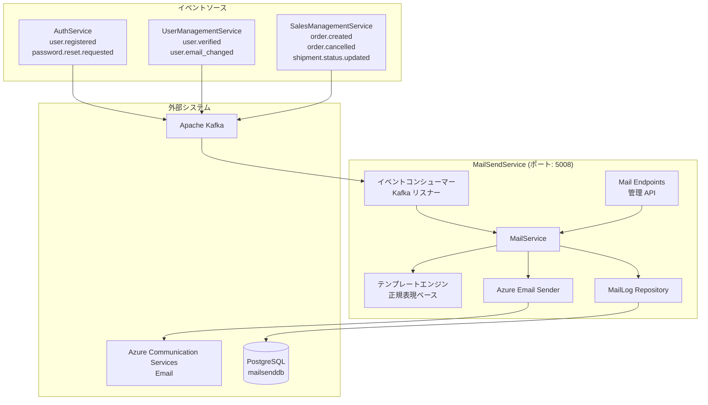
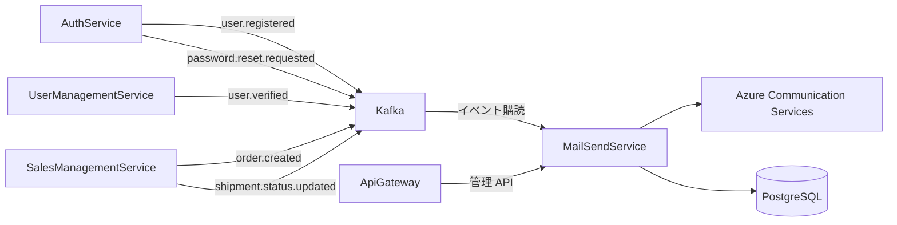
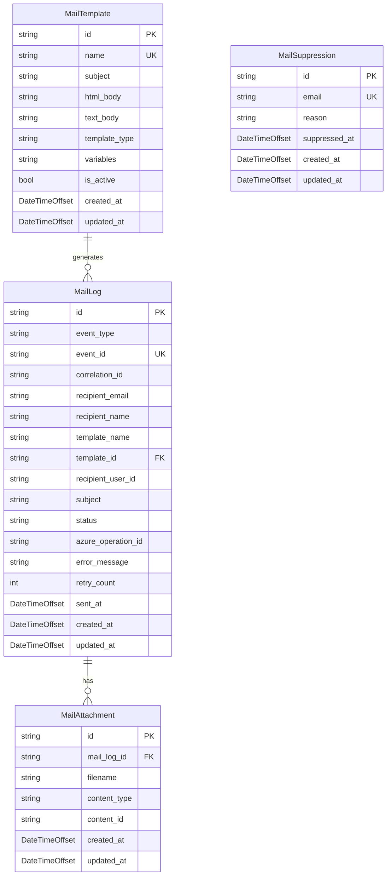
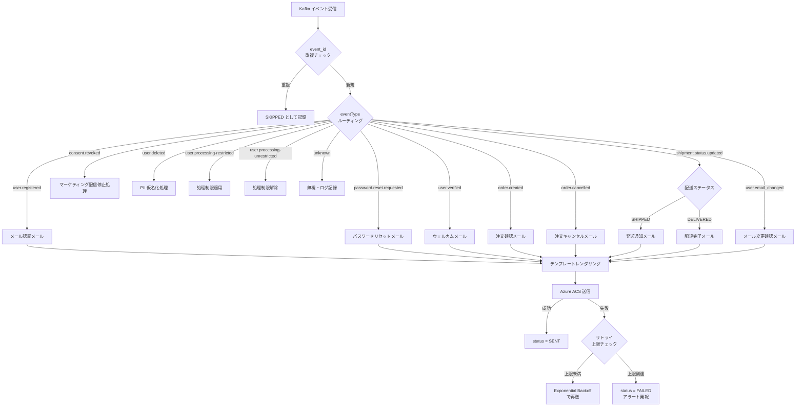

# Mail Send サービス - 詳細設計書

## 1. 概要

MailSendService は Azure SkiShop EC プラットフォームのトランザクションメール配信を担うマイクロサービスである。Azure Communication Services Email を利用してメール送信を行い、他サービスから Kafka イベントを購読して非同期にメール配信をトリガーする。

### 1.1 目的

- EC サイトにおけるトランザクションメール（注文確認、発送通知、パスワードリセット、メール認証）を一元管理する
- 各マイクロサービスはメール送信ロジックを持たず、ドメインイベントを発行するだけで自動的にメールが送信される
- テンプレートベースのメール生成により、一貫したブランド体験を提供する

### 1.2 スコープ

| 区分 | 内容 |
|------|------|
| **In Scope** | トランザクションメール配信（注文確認、発送通知、パスワードリセット、メール認証、アカウント関連通知）、テンプレート管理、送信履歴管理、リトライ処理 |
| **Out of Scope** | マーケティングメール（一括配信）、SMS 通知、プッシュ通知。これらは将来の Notification Service で対応 |

## 2. 技術スタック

### 開発環境

- **言語**: C# 14 (.NET 10 LTS)
- **フレームワーク**: ASP.NET Core 10 (Minimal API)
- **ビルドツール**: dotnet CLI / MSBuild
- **コンテナ化**: Docker 25.x
- **テスト**: xUnit, NSubstitute, Shouldly, WebApplicationFactory, Testcontainers

### 本番環境

- Azure Container Apps
- Azure Communication Services Email
- Azure Database for PostgreSQL
- Apache Kafka (Azure Event Hubs for Kafka)

### 主要ライブラリ

| ライブラリ | バージョン | 用途 |
|---------|---------|---------|
| ASP.NET Core 10 | 10.* | REST API（管理用エンドポイント） |
| Microsoft.EntityFrameworkCore | 10.* | EF Core データアクセス |
| Npgsql.EntityFrameworkCore.PostgreSQL | 10.* | PostgreSQL プロバイダ |
| Confluent.Kafka | 2.* | Kafka イベント購読 |
| Azure.Communication.Email | 1.* | Azure Communication Services Email SDK |
| Azure.Identity | 1.* | Azure 認証（Managed Identity） |
| 正規表現ベーステンプレートエンジン | 内蔵 | `{{variable}}` 形式の変数置換 |
| HtmlSanitizer | 8.* | XSS 防止のための HTML サニタイズ |
| FluentValidation | 11.* | 入力バリデーション |
| Serilog.AspNetCore | 8.* | 構造化ログ |
| OpenTelemetry.Extensions.Hosting | 1.* | メトリクス収集 |

## 3. システムアーキテクチャ

### 3.1 コンポーネントアーキテクチャ



### 3.2 マイクロサービス関係図



## 4. データモデル

### 4.1 Entity Relationship Diagram



### 4.2 テーブル定義

#### mail_logs テーブル

| カラム | データ型 | 制約 | 説明 |
|--------|-----------|-------------|-------------|
| id | VARCHAR(36) | PK | メールログ ID |
| event_type | VARCHAR(100) | NOT NULL | トリガーイベントタイプ |
| event_id | VARCHAR(100) | UNIQUE, NOT NULL | イベント ID（冪等性保証） |
| correlation_id | VARCHAR(100) | | 相関 ID（トレーサビリティ） |
| recipient_email | VARCHAR(255) | NOT NULL | 送信先メールアドレス |
| recipient_name | VARCHAR(200) | | 送信先氏名 |
| template_name | VARCHAR(100) | NOT NULL | 使用テンプレート名（可読性のため保持） |
| template_id | VARCHAR(36) | FK (mail_templates.id), ON DELETE RESTRICT | テンプレート ID（spec.md FK 制約準拠） |
| recipient_user_id | VARCHAR(36) | | 送信先ユーザー ID（GDPR DSR 処理用、NULL 可: ゲスト購入等） |
| subject | VARCHAR(500) | NOT NULL | メール件名 |
| status | VARCHAR(30) | NOT NULL, CHECK (status IN ('PENDING', 'SENDING', 'SENT', 'FAILED', 'BOUNCED', 'SKIPPED')) | 送信ステータス |
| azure_operation_id | VARCHAR(200) | | Azure ACS 送信オペレーション ID |
| error_message | TEXT | | エラーメッセージ（失敗時） |
| retry_count | INTEGER | NOT NULL, DEFAULT 0, CHECK (retry_count >= 0) | リトライ回数 |
| sent_at | TIMESTAMP WITH TIME ZONE | | 送信完了日時 |
| created_at | TIMESTAMP WITH TIME ZONE | NOT NULL, DEFAULT CURRENT_TIMESTAMP | 作成日時 |
| updated_at | TIMESTAMP WITH TIME ZONE | NOT NULL, DEFAULT CURRENT_TIMESTAMP | 更新日時 |

**インデックス**:
- `idx_mail_logs_event_id` ON event_id（冪等性チェック用、UNIQUE）
- `idx_mail_logs_status_created_at` ON (status, created_at)（送信状態別の時系列検索・リトライ対象抽出用、spec.md 準拠）
- `idx_mail_logs_recipient` ON recipient_email（履歴検索用）
- `idx_mail_logs_created_at` ON created_at（監査用）
- `idx_mail_logs_template_id` ON template_id（テンプレート別送信実績の集計用、spec.md 準拠）
- `idx_mail_logs_recipient_user_id` ON recipient_user_id（ユーザー別送信履歴取得・DSR 処理用、spec.md 準拠）

**外部キー**:
- `fk_mail_logs_template` REFERENCES mail_templates(id) ON DELETE RESTRICT ON UPDATE CASCADE

> **設計判断（mail_queue テーブル不要）**: 専用の `mail_queue` テーブルは設けず、`mail_logs.status = 'PENDING'` でキュー管理を代用する。理由: ① キューとログの二重管理を避けデータ整合性を確保 ② `idx_mail_logs_status_created_at` インデックスにより PENDING レコードの検索は十分高速 ③ 送信完了後もログとして保持されるため監査要件を満たす。大量メール送信時のスケーラビリティが課題となった場合は専用テーブルへの分離を再検討する。

> **設計判断（mail_logs.status 値の spec.md との差分）**: spec.md では `status` の CHECK 制約値が `('QUEUED','SENT','FAILED','BOUNCED')` と定義されているが、本設計書では以下の理由で拡張した状態値を採用する。spec.md 側も本設計に合わせて更新する。
> - `PENDING`（= spec.md の `QUEUED`）: 未送信キュー状態。内部キュー管理の意図を明確にするため `PENDING` を採用
> - `SENDING`: 送信中（Azure ACS の LRO ポーリング中）。spec.md にはないが、非同期送信の中間状態を表現するために必要
> - `SENT`: 送信完了（spec.md と同一）
> - `FAILED`: 送信失敗（spec.md と同一）
> - `BOUNCED`: バウンス（spec.md と同一）。`mail_suppressions` テーブルでもバウンスを管理するが、個別の送信ログにもバウンス状態を記録する
> - `SKIPPED`: 配信停止・レート制限・重複等によるスキップ。spec.md にはないが、配信制御の監査証跡として必要

#### mail_attachments テーブル

| カラム | データ型 | 制約 | 説明 |
|--------|-----------|-------------|-------------|
| id | VARCHAR(36) | PK | 添付ファイル ID |
| mail_log_id | VARCHAR(36) | FK (mail_logs.id), NOT NULL | メールログ ID |
| filename | VARCHAR(500) | NOT NULL | ファイル名 |
| content_type | VARCHAR(200) | NOT NULL | MIME タイプ |
| content_id | VARCHAR(200) | | コンテンツ ID（インライン添付用） |
| created_at | TIMESTAMP WITH TIME ZONE | NOT NULL, DEFAULT CURRENT_TIMESTAMP | 作成日時 |
| updated_at | TIMESTAMP WITH TIME ZONE | NOT NULL, DEFAULT CURRENT_TIMESTAMP | 更新日時 |

**インデックス**:
- `idx_mail_attachments_mail_log_id` ON mail_log_id（FK 検索用）

**外部キー**:
- `fk_mail_attachments_mail_log` REFERENCES mail_logs(id) ON DELETE CASCADE

#### mail_templates テーブル

> **テンプレート管理方式**: spec.md §11 では DB 管理方式（MailTemplate エンティティ + CRUD API）が定義されている。本設計書では**正規表現ベースの変数置換**（`{{variableName}}` 形式）を採用する。テンプレート本文（HTML / プレーンテキスト）は DB に保存し、レンダリング時に正規表現で変数を置換する。これにより管理 API による CRUD 操作と軽量なレンダリングを両立する。HTML 本文は HtmlSanitizer で XSS 対策を施す。

| カラム | データ型 | 制約 | 説明 |
|--------|-----------|-------------|-------------|
| id | VARCHAR(36) | PK | テンプレート ID |
| name | VARCHAR(100) | UNIQUE, NOT NULL | テンプレート名（識別子） |
| subject | VARCHAR(500) | NOT NULL | メール件名テンプレート |
| html_body | TEXT | | HTML 本文テンプレート（`{{variable}}` 構文） |
| text_body | TEXT | | プレーンテキスト本文テンプレート |
| template_type | VARCHAR(30) | NOT NULL, CHECK (template_type IN ('TRANSACTIONAL', 'MARKETING')) | テンプレート種別 |
| variables | JSONB | | テンプレート変数定義（JSON Schema 形式） |
| is_active | BOOLEAN | NOT NULL, DEFAULT TRUE | 有効フラグ |
| created_at | TIMESTAMP WITH TIME ZONE | NOT NULL, DEFAULT CURRENT_TIMESTAMP | 作成日時 |
| updated_at | TIMESTAMP WITH TIME ZONE | NOT NULL, DEFAULT CURRENT_TIMESTAMP | 更新日時 |

**インデックス**:
- `idx_mail_templates_name` ON name（テンプレート名検索用）
- `idx_mail_templates_type_active` ON template_type, is_active（種別 + 有効フラグフィルタ用）

#### mail_suppressions テーブル

配信停止リスト。バウンス、苦情報告、ユーザーのオプトアウト（`consent.revoked` イベント受信時）により登録される。メール送信前にこのテーブルを参照し、該当メールアドレスへの配信をスキップ（`status = 'SKIPPED'`）する。

| カラム | データ型 | 制約 | 説明 |
|--------|-----------|-------------|-------------|
| id | VARCHAR(36) | PK | 配信停止 ID |
| email | VARCHAR(255) | NOT NULL | 配信停止メールアドレス |
| reason | VARCHAR(30) | NOT NULL, CHECK (reason IN ('UNSUBSCRIBE', 'BOUNCE', 'COMPLAINT')) | 停止理由 |
| suppressed_at | TIMESTAMP WITH TIME ZONE | NOT NULL, DEFAULT CURRENT_TIMESTAMP | 停止日時 |
| created_at | TIMESTAMP WITH TIME ZONE | NOT NULL, DEFAULT CURRENT_TIMESTAMP | 作成日時 |
| updated_at | TIMESTAMP WITH TIME ZONE | NOT NULL, DEFAULT CURRENT_TIMESTAMP | 更新日時 |

**UNIQUE 制約**:
- `(email, reason)` — 同一メールアドレス + 停止理由の組み合わせで一意性を保証（spec.md `(email, suppression_type)` UNIQUE に準拠）

**インデックス**:
- `idx_mail_suppressions_email_type` ON (email, reason) UNIQUE（メールアドレス別・停止理由別の抜制チェック用、spec.md 準拠: `(email, suppression_type)` UNIQUE）

#### EF Core エンティティ定義

AGENTS.md §10.3 に準拚し、`[Table("snake_case")]`、`[Column("snake_case")]` 属性でマッピングする。

```csharp
[Table("mail_logs")]
public class MailLog
{
    [Key]
    [Column("id")]
    [MaxLength(36)]
    public string Id { get; set; } = Guid.NewGuid().ToString();

    [Column("event_type")]
    [Required]
    [MaxLength(100)]
    public string EventType { get; set; } = string.Empty;

    [Column("event_id")]
    [Required]
    [MaxLength(100)]
    public string EventId { get; set; } = string.Empty;

    [Column("correlation_id")]
    [MaxLength(100)]
    public string? CorrelationId { get; set; }

    [Column("recipient_email")]
    [Required]
    [MaxLength(255)]
    public string RecipientEmail { get; set; } = string.Empty;

    [Column("recipient_name")]
    [MaxLength(200)]
    public string? RecipientName { get; set; }

    [Column("template_name")]
    [Required]
    [MaxLength(100)]
    public string TemplateName { get; set; } = string.Empty;

    [Column("template_id")]
    [MaxLength(36)]
    public string? TemplateId { get; set; }

    [Column("recipient_user_id")]
    [MaxLength(36)]
    public string? RecipientUserId { get; set; }

    [Column("subject")]
    [Required]
    [MaxLength(500)]
    public string Subject { get; set; } = string.Empty;

    [Column("status")]
    [Required]
    [MaxLength(30)]
    public string Status { get; set; } = "PENDING";

    [Column("azure_operation_id")]
    [MaxLength(200)]
    public string? AzureOperationId { get; set; }

    [Column("error_message")]
    public string? ErrorMessage { get; set; }

    [Column("retry_count")]
    public int RetryCount { get; set; }

    [Column("sent_at")]
    public DateTimeOffset? SentAt { get; set; }

    [Column("created_at")]
    public DateTimeOffset CreatedAt { get; set; } = DateTimeOffset.UtcNow;

    [Column("updated_at")]
    public DateTimeOffset UpdatedAt { get; set; } = DateTimeOffset.UtcNow;

    public ICollection<MailAttachment> Attachments { get; set; } = [];

    // ナビゲーションプロパティ（FK: mail_templates）
    public MailTemplate? Template { get; set; }
}

[Table("mail_attachments")]
public class MailAttachment
{
    [Key]
    [Column("id")]
    [MaxLength(36)]
    public string Id { get; set; } = Guid.NewGuid().ToString();

    [Column("mail_log_id")]
    [Required]
    [MaxLength(36)]
    public string MailLogId { get; set; } = string.Empty;

    [Column("filename")]
    [Required]
    [MaxLength(500)]
    public string Filename { get; set; } = string.Empty;

    [Column("content_type")]
    [Required]
    [MaxLength(200)]
    public string ContentType { get; set; } = string.Empty;

    [Column("content_id")]
    [MaxLength(200)]
    public string? ContentId { get; set; }

    [Column("created_at")]
    public DateTimeOffset CreatedAt { get; set; } = DateTimeOffset.UtcNow;

    [Column("updated_at")]
    public DateTimeOffset UpdatedAt { get; set; } = DateTimeOffset.UtcNow;

    public MailLog MailLog { get; set; } = null!;
}
```

#### PII 保護方針・データ保持ポリシー

`mail_logs` テーブルには PII（個人情報）として `recipient_email` および `recipient_name` が保存される。これはメール送信履歴の監査要件（送信先・送信時刻・ステータスの追跡）を満たすために必要である。

| ポリシー | 内容 |
|---------|------|
| **保持期間** | `mail_logs` の PII 含有レコードは **1 年間** 保持（spec.md §データ保持ポリシーの「メール送信ログ: 1 年」に準拠）。1 年経過後は `recipient_email` と `recipient_name` を匿名化（ハッシュ化 or マスキング）してアーカイブする。なお 90 日経過後の PII にはアクセス制限を強化し、管理者のみ閲覧可能とする |
| **削除バッチ** | `PiiCleanupBackgroundService` を実装し、毎日 UTC 03:00 に 1 年以上前のレコードを匿名化する |
| **user.deleted イベント** | `user.deleted` イベント受信時、該当ユーザーの `recipient_email` を即座に匿名化（GDPR 「忘れられる権利」対応） |
| **データ最小化** | `recipient_email` の保存は監査要件上必要。不要な場合は `user_id` のみ保持し UserManagementService から取得する方式も検討可能 |
| **暗号化** | PostgreSQL の透過的データ暗号化（TDE）を有効化し、保存時暗号化（encryption at rest）を保証する |

## 5. サービス情報

| 項目 | 値 |
|------|-------|
| サービス名 | MailSendService |
| ポート | 5008 |
| データベース | PostgreSQL (mailsenddb)（ADR-0006: サービス別独立 DB） |
| フレームワーク | ASP.NET Core 10 (Minimal API) |
| 言語バージョン | C# 14 (.NET 10) |
| アーキテクチャ | イベント駆動マイクロサービス |
| メールプロバイダ | Azure Communication Services Email |
| イベントブローカー | Apache Kafka |

## 6. メール種別定義

### 6.1 トランザクションメール一覧

> **Kafka イベント名命名規約**: spec.md との整合性を確保するため、全イベント名を `dot.separated.lowercase` 形式に統一する。プロデューサーサービス側も同一の命名規約に従う必要がある（§19 の変更事項を参照）。

| # | メール種別 | テンプレート名 | トリガーイベント | 発行元サービス | 優先度 |
|---|-----------|-------------|---------------|-------------|-------|
| 1 | メール認証 | `email-verification` | `user.registered` | AuthService | HIGH |
| 2 | ウェルカムメール | `welcome` | `user.verified` | UserManagementService | MEDIUM |
| 3 | パスワードリセット | `password-reset` | `password.reset.requested` | AuthService | HIGH |
| 4 | 注文確認 | `order-confirmation` | `order.created` | SalesManagementService | HIGH |
| 5 | 注文キャンセル確認 | `order-cancelled` | `order.cancelled` | SalesManagementService | HIGH |
| 6 | 発送通知 | `shipment-notification` | `shipment.status.updated` (SHIPPED) | SalesManagementService | HIGH |
| 7 | 配達完了通知 | `delivery-confirmation` | `shipment.status.updated` (DELIVERED) | SalesManagementService | MEDIUM |
| 8 | メールアドレス変更確認 | `email-change-verification` | `user.email_changed` | UserManagementService | HIGH |

#### spec.md 定義イベントとの差分

以下のイベントは spec.md §11 で定義されているが、本設計書では Phase 4 以降で対応する。

| Kafka イベント | メール種別 | 対応予定 |
|--------------|-----------|----------|
| `payment.completed` | 決済完了メール | Phase 4 |
| `payment.refunded` | 返金通知メール | Phase 4 |
| `point.earned` | ポイント獲得通知 | Phase 4 |
| `coupon.expired` | クーポン期限通知 | Phase 4 |
| `inventory.low-stock` | 在庫アラート（管理者向け） | Phase 4 |

> **設計判断（イベント名 `order.shipped` vs `shipment.status.updated`）**: spec.md §11 では `order.shipped` イベントが定義されているが、本設計書では `shipment.status.updated` (status=SHIPPED/DELIVERED) を採用する。理由: ① 配送ステータスの遷移（SHIPPED, DELIVERED 等）を単一イベントで表現でき、イベント種別の爆発を防止 ② SalesManagementService の `UpdateShipmentStatusAsync()` がステータス更新の単一責務を持ち、対応するイベントも単一が自然 ③ spec.md 側も本設計に合わせて `shipment.status.updated` に統一することを推奨する。なお Phase 4 先送りイベント（`payment.completed`, `payment.refunded` 等）は Phase 1 MVP スコープ外であり、ビジネスインパクトが低い（決済完了は画面上で確認可能、ポイント・クーポンはマイページで確認可能）ため、後続フェーズで対応する。

### 6.2 テンプレート設計

テンプレートは **正規表現ベースの変数置換**を使用し、DB に保存する。`{{variableName}}` 形式の変数プレースホルダーを実行時にイベントデータで置換する。

#### テンプレート構文

```html
<!-- HTML テンプレート例 -->
<h1>{{userName}} 様</h1>
<p>ご注文 #{{orderId}} を確認いたしました。</p>
<p>合計金額: ¥{{totalAmount}}</p>
```

- 変数は `{{variableName}}` 形式で記述（大文字小文字を区別）
- 存在しない変数は空文字に置換される
- HTML 本文は HtmlSanitizer で XSS 対策を施す
- テンプレートは TemplateService の CRUD API で管理

#### テンプレート共通要素

- Azure SkiShop ロゴ・ブランドカラー
- レスポンシブ HTML メール（モバイル対応）
- プレーンテキストフォールバック自動生成
- フッター: 配信停止リンク（トランザクションメールのため非表示）、会社情報、プライバシーポリシーリンク

## 7. API 設計

### 7.1 管理用 REST API

管理者が送信履歴の確認・リトライを行うための API。

| メソッド | パス | ロール | 説明 |
|--------|------|------|-------------|
| GET | /admin/mail/logs | ADMIN | メール送信履歴一覧（ページネーション） |
| GET | /admin/mail/logs/{id} | ADMIN | メール送信履歴詳細 |
| POST | /admin/mail/logs/{id}/retry | ADMIN | 失敗メールの手動リトライ |
| GET | /admin/mail/stats | ADMIN, MANAGER | メール送信統計（日別送信数・成功率） |
| POST | /admin/mail/test | ADMIN | テストメール送信（開発・検証用、レート制限: 1時間に5通まで） |
| GET | /admin/mail/templates | ADMIN | テンプレート一覧取得 |
| GET | /admin/mail/templates/{id} | ADMIN | テンプレート詳細取得 |
| POST | /admin/mail/templates | ADMIN | テンプレート新規作成 |
| PUT | /admin/mail/templates/{id} | ADMIN | テンプレート更新 |
| DELETE | /admin/mail/templates/{id} | ADMIN | テンプレート削除（論理削除: is_active = false） |

### 7.2 レスポンス DTO

```csharp
public record MailLogResponse(
    string Id,
    string EventType,
    string RecipientEmail,
    string? RecipientName,
    string TemplateName,
    string Subject,
    string Status,
    int RetryCount,
    string? ErrorMessage,
    DateTimeOffset? SentAt,
    DateTimeOffset CreatedAt);

public record MailStatsResponse(
    long TotalSent,
    long TotalFailed,
    long TotalPending,
    double SuccessRate,
    Dictionary<string, long> SentByTemplate);

public record TestMailRequest(
    [Required] string RecipientEmail,
    [Required] string TemplateName,
    Dictionary<string, object>? Variables);
```

## 8. イベント消費設計

### 8.1 Kafka Consumer 設定

Confluent.Kafka を使用し、`BackgroundService` で Kafka コンシューマーを実装する。`IOptions<T>` パターンで設定を管理する（AGENTS.md §10.1 準拚）。

```csharp
// Configurations/KafkaSettings.cs
public record KafkaSettings(
    string BootstrapServers,
    string GroupId,
    string Topic);

// Program.cs での DI 登録
builder.Services.Configure<KafkaSettings>(
    builder.Configuration.GetSection("Kafka"));

builder.Services.AddSingleton<IConsumer<string, string>>(sp =>
{
    var kafkaSettings = sp.GetRequiredService<IOptions<KafkaSettings>>().Value;
    var config = new ConsumerConfig
    {
        BootstrapServers = kafkaSettings.BootstrapServers,
        GroupId = kafkaSettings.GroupId,
        AutoOffsetReset = AutoOffsetReset.Earliest,
        EnableAutoCommit = false
    };
    return new ConsumerBuilder<string, string>(config).Build();
});
```

### 8.2 イベントハンドリングフロー



### 8.3 冪等性保証

- 各イベントの `eventId` を `mail_logs.event_id` に UNIQUE 制約で格納
- 重複イベント受信時は INSERT が失敗 → `SKIPPED` としてログ記録
- 同一注文に対する重複メール送信を防止

### 8.4 リトライ戦略

| パラメータ | 値 |
|-----------|-----|
| 最大リトライ回数 | 3 |
| 初回リトライ間隔 | 30 秒 |
| バックオフ倍率 | 2.0（30s → 60s → 120s） |
| リトライ対象 | ネットワークエラー、Azure ACS 一時エラー（429, 5xx） |
| リトライ非対象 | バリデーションエラー（400）、認証エラー（401, 403） |

失敗が最大リトライ回数に達した場合:
1. `status = FAILED` に更新
2. `mail.send.failed` ドメインイベントを発行（将来の監視・アラートシステム連携用）
3. ログレベル ERROR で記録

## 9. Azure Communication Services 連携設計

### 9.1 認証方式

本番環境では **Managed Identity**（`DefaultAzureCredential`）を使用し、接続文字列やアクセスキーのハードコードを禁止する。

```csharp
// Program.cs での DI 登録
builder.Services.AddSingleton(sp =>
{
    var endpoint = builder.Configuration["Azure:Communication:Endpoint"];
    return new EmailClient(new Uri(endpoint), new DefaultAzureCredential());
});
```

ローカル開発環境では接続文字列を環境変数 `AZURE_COMMUNICATION_CONNECTION_STRING` から取得する。

### 9.2 送信処理

Azure Communication Services Email の `SendAsync` は Long-Running Operation（LRO）であるため、ポーリングで結果を取得する。

```csharp
var emailMessage = new EmailMessage(
    senderAddress: senderAddress,
    recipientAddress: recipientEmail,
    content: new EmailContent(subject)
    {
        Html = htmlContent,
        PlainText = plainTextContent
    });

var operation = await emailClient.SendAsync(
    WaitUntil.Completed,
    emailMessage,
    ct);
```

### 9.3 送信者アドレス

| 環境 | 送信者アドレス |
|-----|-------------|
| 本番 | `noreply@mail.skishop.example.com`（カスタムドメイン） |
| 開発 | `DoNotReply@<resource-id>.azurecomm.net`（ACS 既定ドメイン） |

### 9.4 レート制限・スロットリング対応

Azure Communication Services Email の送信レート制限に対応する:
- 429 Too Many Requests 受信時は `Retry-After` ヘッダーに従い待機
- Sandbox 環境ではメール送信数に制限あり（本番昇格申請が必要）

### 9.5 同一受信者への配信頻度制限

spec.md §11 に基づき、同一ユーザーへの配信頻度を制限する（**1 時間に 5 通まで**）。

**実装方針**:
- メール送信前に `mail_logs` テーブルを参照し、`recipient_email` + `created_at` で過去 1 時間の送信数をカウント
- 制限超過時は `status = 'SKIPPED'`、`error_message = 'Rate limit exceeded (5/hour)'` として記録
- レート制限対象外: パスワードリセット、メール認証（セキュリティメールは制限なし）

```csharp
// MailService.cs 内でのレート制限チェック例
private async Task<bool> IsRateLimitedAsync(string recipientEmail, CancellationToken ct = default)
{
    var oneHourAgo = DateTimeOffset.UtcNow.AddHours(-1);
    var recentCount = await _mailLogRepository
        .CountByRecipientSinceAsync(recipientEmail, oneHourAgo, ct);
    return recentCount >= 5;
}
```

## 10. プロジェクト構成

```
MailSendService/
├── MailSendService.csproj
├── Program.cs                         # エントリポイント・DI 登録・ミドルウェア設定
├── Endpoints/
│   └── MailEndpoints.cs               # 管理用 Minimal API エンドポイント
├── Services/
│   ├── Interfaces/
│   │   ├── IMailService.cs            # メール送信ビジネスロジック
│   │   ├── ITemplateService.cs        # テンプレート処理
│   │   ├── IAzureEmailSender.cs       # Azure ACS 送信ラッパー
│   │   └── IUserInfoResolver.cs       # UserManagementService API クライアント
│   ├── MailService.cs
│   ├── TemplateService.cs
│   ├── AzureEmailSender.cs
│   └── UserInfoResolver.cs
├── Consumers/
│   └── MailEventConsumer.cs           # Kafka イベント BackgroundService
├── Models/
│   ├── MailLog.cs                     # EF Core エンティティ
│   └── MailAttachment.cs
├── DTOs/
│   ├── Requests/
│   │   └── TestMailRequest.cs
│   └── Responses/
│       ├── MailLogResponse.cs
│       └── MailStatsResponse.cs
├── Repositories/
│   ├── Interfaces/
│   │   └── IMailLogRepository.cs
│   └── MailLogRepository.cs
├── Infrastructure/
│   └── Persistence/
│       └── AppDbContext.cs            # EF Core DbContext
├── Configurations/
│   ├── MailSettings.cs
│   └── AzureEmailSettings.cs
├── Migrations/                        # EF Core マイグレーション
├── appsettings.json
├── appsettings.Development.json
└── appsettings.Production.json
```

## 11. 設定ファイル

### appsettings.json

```json
{
  "AllowedHosts": "*",
  "Kestrel": {
    "AddServerHeader": false
  },
  "Logging": {
    "LogLevel": {
      "Default": "Warning",
      "Microsoft.AspNetCore": "Warning",
      "SkiShop": "Information"
    }
  },
  "DetailedErrors": false,
  "Kafka": {
    "BootstrapServers": "localhost:9092",
    "GroupId": "mailsend-service",
    "Topic": "domain-events"
  },
  "Azure": {
    "Communication": {
      "Endpoint": "https://skishop-acs.communication.azure.com",
      "SenderAddress": "DoNotReply@skishop-acs.azurecomm.net"
    }
  },
  "Mail": {
    "Retry": {
      "MaxAttempts": 3,
      "InitialIntervalMs": 30000,
      "Multiplier": 2.0
    },
    "BaseUrl": "http://localhost:3000"
  },
  "Services": {
    "UserManagement": {
      "Url": "http://localhost:5002"
    }
  }
}
```

## 12. イベントペイロード定義

### 12.1 消費するイベント

各サービスが発行する既存の DomainEvent ペイロードをそのまま受信し、メール送信に必要な情報を抽出する。

#### user.registered (AuthService)

**現状**: イベント発行済み。ただし `verificationToken` がペイロードに含まれていないため、セクション 19.1 の変更が必要。

現行ペイロード:
```csharp
public record UserRegisteredPayload(string UserId, string Email, string FirstName,
                                     string LastName, string Role);
```

変更後ペイロード (→ `VerificationToken` を追加):
```json
{
  "eventId": "uuid",
  "eventType": "user.registered",
  "producer": "auth-service",
  "payload": {
    "userId": "uuid",
    "email": "user@example.com",
    "firstName": "太郎",
    "lastName": "山田",
    "role": "USER",
    "verificationToken": "uuid-token-value"
  }
}
```

→ メール認証リンク生成: `{base-url}/verify-email?token={verificationToken}`

> **注意**: 現在 UserManagementService の `VerifyEmailAsync()` メソッドはスタブ実装（トークンをメールアドレスとして扱っている）。本サービス実装時に `verification_tokens` テーブルの作成とトークン検索ロジックの実装が必要（セクション 19.4 参照）。

#### password.reset.requested (AuthService)

```json
{
  "eventId": "uuid",
  "eventType": "password.reset.requested",
  "producer": "auth-service",
  "payload": {
    "userId": "uuid",
    "email": "user@example.com",
    "firstName": "太郎",
    "resetToken": "reset-token-value",
    "expiresAt": "2026-03-20T00:00:00Z"
  }
}
```

→ パスワードリセットリンク生成: `{base-url}/password/reset?token={resetToken}`

#### order.created (SalesManagementService)

**現状**: イベント発行済み。ペイロードに顧客メールアドレスが含まれないため、サービス間 API 呼び出しが必要。

```csharp
public record OrderEventPayload(string OrderId, string OrderNumber, string CustomerId, decimal TotalAmount);
```

```json
{
  "eventId": "uuid",
  "eventType": "order.created",
  "producer": "sales-service",
  "payload": {
    "orderId": "uuid",
    "orderNumber": "ORD-20260319-001",
    "customerId": "uuid",
    "totalAmount": 89800
  }
}
```

→ 注文確認メール送信。**顧客情報（メールアドレス・氏名）は UserManagementService へ API 呼び出しで取得する**（セクション 12.3 参照）。

#### order.cancelled (SalesManagementService)

**現状**: イベント発行済み。order.created と同一の `OrderEventPayload` を使用。

```json
{
  "eventId": "uuid",
  "eventType": "order.cancelled",
  "producer": "sales-service",
  "payload": {
    "orderId": "uuid",
    "orderNumber": "ORD-20260319-001",
    "customerId": "uuid",
    "totalAmount": 89800
  }
}
```

→ 注文キャンセル確認メール送信。顧客情報は order.created と同様に UserManagementService へ API 呼び出しで取得。

#### shipment.status.updated (SalesManagementService)

**現状**: イベント未発行。セクション 19.2 の変更が必要。

現行の `ShipmentEventPayload`（`ShipmentCreated` イベントで使用）:
```csharp
public record ShipmentEventPayload(string ShipmentId, string OrderId, string Carrier);
```

shipment.status.updated 用の新規ペイロード `ShipmentStatusPayload` を追加する:
```json
{
  "eventId": "uuid",
  "eventType": "shipment.status.updated",
  "producer": "sales-service",
  "payload": {
    "shipmentId": "uuid",
    "orderId": "uuid",
    "customerId": "uuid",
    "orderNumber": "ORD-20260319-001",
    "status": "SHIPPED",
    "trackingNumber": "1234567890",
    "carrier": "Yamato"
  }
}
```

> **注意**: 現行の `UpdateShipmentStatusAsync()` メソッドは `shipmentId` のみを参照しているため、`orderNumber` と `customerId` は Order エンティティからの結合取得が必要。また `trackingNumber` は Shipment エンティティから取得する。セクション 19.2 の実装詳細を参照。

→ `status` が `SHIPPED` の場合は発送通知、`DELIVERED` の場合は配達完了通知を送信。顧客情報は `customerId` を使い UserManagementService へ API 呼び出しで取得。

#### user.verified (UserManagementService)

**現状**: イベント発行済み。

```csharp
public record UserEventPayload(string Id, string Email, string FirstName, string LastName);
```

```json
{
  "eventId": "uuid",
  "eventType": "user.verified",
  "producer": "user-management-service",
  "payload": {
    "id": "uuid",
    "email": "user@example.com",
    "firstName": "太郎",
    "lastName": "山田"
  }
}
```

→ ウェルカムメール送信。ペイロードに email を含むためサービス間 API 呼び出しは不要。

#### user.email_changed (UserManagementService)

**現状**: イベント未発行・メールアドレス変更 API も未実装。Phase 3 で対応（セクション 19.3 参照）。

```json
{
  "eventId": "uuid",
  "eventType": "user.email_changed",
  "producer": "user-management-service",
  "payload": {
    "userId": "uuid",
    "newEmail": "new@example.com",
    "firstName": "太郎",
    "verificationToken": "uuid-token-value"
  }
}
```

→ メールアドレス変更確認メール送信。新メールアドレス宛に認証リンクを送信: `{base-url}/verify-email?token={verificationToken}`

### 12.3 サービス間 API 呼び出し（顧客情報取得）

`order.created`、`order.cancelled`、`shipment.status.updated` イベントのペイロードには顧客メールアドレスが含まれないため、MailSendService が UserManagementService の内部 API を呼び出して取得する。

| 対象イベント | 取得元 | API | 取得情報 |
|-------------|-------|-----|----------|
| order.created | UserManagementService | `GET /api/v1/users/{customerId}` | email, firstName, lastName |
| order.cancelled | UserManagementService | `GET /api/v1/users/{customerId}` | email, firstName, lastName |
| shipment.status.updated | UserManagementService | `GET /api/v1/users/{customerId}` | email, firstName, lastName |

**実装方針**:
- `IHttpClientFactory` を使用し、API Gateway 経由ではなく内部サービス直接呼び出し（`http://user-management-service:5002`）
- 呼び出し失敗時はメール送信を `FAILED` とし、リトライ対象とする
- キャッシュは不要（トランザクションメールは最新情報で送信すべき）
- タイムアウト: 5 秒

```csharp
public class UserInfoResolver(HttpClient httpClient, ILogger<UserInfoResolver> logger) : IUserInfoResolver
{
    public async Task<UserInfo?> ResolveAsync(string customerId, CancellationToken ct = default)
    {
        try
        {
            var response = await httpClient.GetAsync($"/api/v1/users/{customerId}", ct);

            if (response.StatusCode == System.Net.HttpStatusCode.NotFound)
            {
                logger.LogWarning("ユーザーが見つかりません: {CustomerId}", customerId);
                return null;  // 呼び出し元で FAILED 化
            }

            response.EnsureSuccessStatusCode();  // 5xx は例外スロー（リトライ対象）
            return await response.Content.ReadFromJsonAsync<UserInfo>(ct);
        }
        catch (HttpRequestException ex) when (ex.StatusCode is not null)
        {
            logger.LogError(ex, "UserManagementService API エラー: {StatusCode}, CustomerId: {CustomerId}",
                ex.StatusCode, customerId);
            throw;  // Polly リトライ対象
        }
    }

    public record UserInfo(string Id, string Email, string FirstName, string LastName);
}
```

`Program.cs` での HttpClient 登録:
```csharp
builder.Services.AddHttpClient<IUserInfoResolver, UserInfoResolver>(client =>
{
    client.BaseAddress = new Uri(builder.Configuration["Services:UserManagement:Url"]!);
    client.Timeout = TimeSpan.FromSeconds(5);
})
.AddStandardResilienceHandler();
```

### 12.4 発行するイベント

| イベントタイプ | トリガー | ペイロード |
|-------------|---------|----------|
| `mail.sent` | メール送信成功 | { mailLogId, eventType, recipientEmail } |
| `mail.send.failed` | リトライ上限到達 | { mailLogId, eventType, recipientEmail, errorMessage } |

> **Outbox パターン適用方針**（ADR-0005）: MailSendService は主にイベント消費側であるが、発行するイベント（`mail.sent`, `mail.send.failed`）にも Outbox パターンを適用する。`mail_logs` テーブルのステータス更新とイベント発行を同一トランザクションで実行し、`outbox_events` テーブルに INSERT する。`OutboxPublisher` BackgroundService が動的バックオフ（100ms〜5s）で Outbox イベントを Kafka に発行する。

## 13. セキュリティ設計

### 13.1 API アクセス制御

- 管理用 API（`/admin/mail/**`）は原則 `ADMIN` ロール必須
  - 例外: `GET /admin/mail/stats` は `ADMIN` または `MANAGER` ロールでアクセス可（セクション 7.1 参照）
- ヘルスチェック（`/health`）は認証不要

### 13.2 機密情報管理

| 情報 | 管理方法 |
|-----|---------|
| Azure ACS エンドポイント | 環境変数 `Azure__Communication__Endpoint` |
| Azure 認証情報 | Managed Identity（本番）、環境変数（開発） |
| DB 接続情報 | 環境変数 / `dotnet user-secrets`（開発） |
| JWT シークレット | 環境変数 |

- ソースコード・設定ファイルへのシークレット直書きは禁止
- 本番環境では Azure Key Vault からの取得を推奨

### 13.3 XSS 防止策（メールテンプレート）

メールテンプレートでユーザー入力（氏名、注文番号等）をレンダリングする際のセキュリティ規約:

- 正規表現ベースの変数置換を使用する（`{{variableName}}` 形式）
- HTML 本文は **HtmlSanitizer** でサニタイズし、XSS 攻撃を防止する
- テンプレート登録・更新時にサニタイズを適用（TemplateService で実装済み）
- URL パラメータ（リセットトークン等）は `Uri.EscapeDataString()` でエンコード

### 13.4 メールアドレスのバリデーション

- 受信イベントのメールアドレスを RFC 5322 準拠でバリデーション
- 不正なメールアドレスの場合は `SKIPPED` として記録し送信しない

## 14. 監視・運用

### 14.1 メトリクス

| メトリクス名 | タイプ | 説明 |
|------------|------|-------------|
| `mail.sent.total` | Counter | 送信成功メール総数（template タグ付き） |
| `mail.failed.total` | Counter | 送信失敗メール総数 |
| `mail.send.duration` | Timer | メール送信処理時間 |
| `mail.retry.total` | Counter | リトライ実行回数 |
| `mail.event.consumed.total` | Counter | 受信イベント総数（eventType タグ付き） |

### 14.2 ヘルスチェック

- PostgreSQL 接続チェック
- Kafka ブローカー接続チェック
- Azure Communication Services エンドポイント接続チェック

### 14.3 アラート条件

| 条件 | 重要度 | 対応 |
|------|--------|------|
| メール送信成功率 < 95%（直近 1 時間） | CRITICAL | 即時調査 |
| 未送信メール（PENDING）が 100 件超 | WARNING | キュー詰まり確認 |
| リトライ上限到達（FAILED）が 10 件/時超 | CRITICAL | ACS ステータス確認 |

## 15. API Gateway ルーティング

ApiGateway の YARP 設定に以下のルートを追加する:

```json
{
  "ReverseProxy": {
    "Routes": {
      "mailsend-route": {
        "ClusterId": "mailsend-cluster",
        "Match": {
          "Path": "/admin/mail/{**catch-all}"
        }
      }
    },
    "Clusters": {
      "mailsend-cluster": {
        "Destinations": {
          "destination1": {
            "Address": "http://mailsend-service:5008"
          }
        }
      }
    }
  }
}
```

## 16. Docker Compose 追加設定

```yaml
  mailsend-service:
    build: ../MailSendService
    ports:
      - "5008:5008"
    environment:
      ConnectionStrings__DefaultConnection: Host=postgres;Database=mailsenddb;Username=postgres;Password=${DB_PASSWORD}
      Kafka__BootstrapServers: kafka:29092
      Azure__Communication__Endpoint: ${AZURE_COMMUNICATION_ENDPOINT}
      Mail__SenderAddress: ${MAIL_SENDER_ADDRESS}
      Mail__BaseUrl: ${APP_BASE_URL:-http://localhost:3000}
      Services__UserManagement__Url: http://user-management-service:5002
    depends_on:
      postgres:
        condition: service_healthy
      kafka:
        condition: service_healthy
    profiles:
      - app
```

> **環境変数管理**: `${DB_PASSWORD}`, `${AZURE_COMMUNICATION_ENDPOINT}`, `${MAIL_SENDER_ADDRESS}` は `.env` ファイルから読み込まれる。`.env` ファイルはソースコード管理対象外（`.gitignore` に含める）とし、`.env.example` にダミー値を記載してリポジトリに含める。

```
# .env.example
DB_PASSWORD=your_password_here
AZURE_COMMUNICATION_ENDPOINT=https://your-acs.communication.azure.com
MAIL_SENDER_ADDRESS=DoNotReply@your-acs.azurecomm.net
APP_BASE_URL=http://localhost:3000
```

## 17. テスト戦略

### 17.1 単体テスト

| テスト対象 | テストクラス | カバレッジ目標 |
|-----------|-----------|-------------|
| MailService | MailServiceTest | 分岐 80%+ |
| TemplateService | TemplateServiceTest | 全テンプレート検証 |
| AzureEmailSender | AzureEmailSenderTest | 成功/失敗/リトライ |
| MailEventConsumer | MailEventConsumerTest | 全イベントタイプ + 冪等性 |
| MailEndpoints | MailEndpointsTest | 全エンドポイント |

### 17.2 テスト方針

- Azure Communication Services は Mock 化（`EmailClient` の Mock）
- Kafka イベント消費はインメモリテスト用プロバイダで検証
- テンプレートレンダリングは正規表現ベースの変数置換を検証
- 冪等性テスト: 同一 eventId の重複送信で 1 通のみ送信されることを確認
- DB テストは Testcontainers.PostgreSql を使用
- テストメソッド命名: `Should_期待結果_When_条件` パターン（test-standards.instructions.md 準拚）

### 17.3 異常系テストケース

| # | テストケース | 期待動作 |
|---|-------------|----------|
| 1 | Azure ACS が 429 Too Many Requests を返す | Retry-After に従いリトライ、上限到達で FAILED |
| 2 | メールアドレスが RFC 5322 非準拚 | SKIPPED として記録、送信しない |
| 3 | UserManagementService API が不達（タイムアウト） | FAILED + リトライ対象 |
| 4 | UserManagementService API が 404 を返す | FAILED（ユーザー不在） |
| 5 | Kafka メッセージのデシリアライズ失敗 | エラーログ出力、DLT への転送を検討 |
| 6 | テンプレートレンダリングエラー | FAILED + エラーメッセージ記録 |
| 7 | 同一 eventId の重複イベント受信 | SKIPPED（冪等性保証） |
| 8 | 配信停止リストに登録済みのメールアドレス | SKIPPED（mail_suppressions チェック） |
| 9 | レート制限超過（1時間に5通以上） | SKIPPED + エラーメッセージ記録 |
| 10 | Azure ACS エンドポイントが無効 | 起動時ヘルスチェック失敗 |

### 17.4 統合テスト

`WebApplicationFactory<Program>` + カスタム `AuthenticationHandler` で管理 API エンドポイントの統合テストを実施する。

| テスト対象 | 検証内容 |
|---------|----------|
| `GET /admin/mail/logs` | ADMIN ロールで 200、未認証で 401、USER ロールで 403 |
| `POST /admin/mail/logs/{id}/retry` | FAILED ステータスのレコードがリトライされること |
| `POST /admin/mail/test` | テストメール送信（ACS Mock）+ DB 記録確認 |
| `GET /admin/mail/stats` | ADMIN / MANAGER ロールでアクセス可 |
| `GET /health` | 認証不要で 200 |

## 18. 実装優先度

| Phase | 対応メール | 備考 |
|-------|----------|------|
| Phase 1（MVP） | メール認証、パスワードリセット、注文確認、GDPR イベント処理（`consent.revoked`, `user.deleted`, `user.processing-restricted`） | EC サイト Phase 1 ブロッカー + GDPR 準拠必須 |
| Phase 2 | 発送通知、配達完了通知、ウェルカムメール | 運用品質向上 |
| Phase 3 | 注文キャンセル確認、メールアドレス変更確認 | 全トランザクションメール完備 |

## 19. 既存サービスへの変更

### 19.1 AuthService

#### 変更 1: `password.reset.requested` イベントの発行追加

**現状**: `RequestPasswordResetAsync()` メソッドはリセットトークンを生成・保存するが、イベントを発行していない。

**変更内容**: `_passwordResetRepository.AddAsync()` の後にイベント発行を追加する。

```csharp
// AuthService.cs - RequestPasswordResetAsync() 内
var user = await _userRepository.FindByEmailAsync(request.Email, ct);
if (user is not null)
{
    var token = Guid.NewGuid().ToString();
    var resetEntity = new PasswordReset(user.Id, token,
        DateTime.UtcNow.AddHours(1));
    await _passwordResetRepository.AddAsync(resetEntity, ct);

    // ⬇ 追加: イベント発行
    await _eventPublisher.PublishAsync(DomainEvent.Create(
        "password.reset.requested",
        "auth-service",
        new PasswordResetRequestedPayload(
            user.Id, user.Email, user.FirstName,
            token, resetEntity.ExpiresAt)), ct);
}
```

**新規ペイロード record**:
```csharp
public record PasswordResetRequestedPayload(
    string UserId, string Email, string FirstName,
    string ResetToken, DateTime ExpiresAt);
```

#### 変更 2: `user.registered` イベントに `VerificationToken` を追加

**現状**: `UserRegisteredPayload` に `VerificationToken` フィールドがない。ユーザー登録時にメール認証トークンを生成していない。

**変更内容**: `RegisterAsync()` メソッド内で認証トークンを生成し、`UserRegisteredPayload` に含める。

```csharp
// AuthService.cs - RegisterAsync() 内
var verificationToken = Guid.NewGuid().ToString();
await _verificationTokenRepository.AddAsync(
    new VerificationToken(user.Id, verificationToken,
        DateTime.UtcNow.AddHours(24)), ct);

await _eventPublisher.PublishAsync(DomainEvent.Create(
    "user.registered",
    "auth-service",
    new UserRegisteredPayload(user.Id, user.Email,
        user.FirstName, user.LastName, user.Role.ToString(),
        verificationToken)), ct);
```

**ペイロード record 変更**:
```csharp
// 変更前
public record UserRegisteredPayload(string UserId, string Email, string FirstName,
                                     string LastName, string Role);
// 変更後
public record UserRegisteredPayload(string UserId, string Email, string FirstName,
                                     string LastName, string Role,
                                     string VerificationToken);
```

**新規テーブル**: `verification_tokens`
```sql
CREATE TABLE verification_tokens (
    id VARCHAR(36) PRIMARY KEY DEFAULT gen_random_uuid()::text,
    user_id VARCHAR(36) NOT NULL,
    token VARCHAR(100) NOT NULL UNIQUE,
    expires_at TIMESTAMP WITH TIME ZONE NOT NULL,
    used BOOLEAN NOT NULL DEFAULT FALSE,
    created_at TIMESTAMP WITH TIME ZONE NOT NULL DEFAULT CURRENT_TIMESTAMP
);
CREATE INDEX idx_verification_tokens_token ON verification_tokens(token);
```

### 19.2 SalesManagementService

**現状**: `UpdateShipmentStatusAsync()` メソッドはステータス更新のみでイベントを発行していない。また既存の `ShipmentEventPayload` はフィールドが不足（`TrackingNumber`, `OrderNumber`, `Status`, `CustomerId` がない）。

**変更内容**: `UpdateShipmentStatusAsync()` にイベント発行を追加し、新規の `ShipmentStatusPayload` を定義する。

```csharp
// OrderService.cs - UpdateShipmentStatusAsync() 内
public async Task<ShipmentResponse> UpdateShipmentStatusAsync(
    string shipmentId, string status, CancellationToken ct = default)
{
    var shipment = await _shipmentRepository.FindByIdAsync(shipmentId, ct)
        ?? throw new NotFoundException($"Shipment {shipmentId} not found");

    var newStatus = Enum.Parse<ShipmentStatus>(status, ignoreCase: true);
    shipment.Status = newStatus;
    if (newStatus == ShipmentStatus.Shipped) shipment.ShippedAt = DateTime.UtcNow;
    if (newStatus == ShipmentStatus.Delivered) shipment.DeliveredAt = DateTime.UtcNow;
    await _shipmentRepository.SaveChangesAsync(ct);

    // ⬇ 追加: 注文情報を取得してイベント発行
    var order = await FindOrderOrThrowAsync(shipment.OrderId, ct);
    await _eventPublisher.PublishAsync(DomainEvent.Create(
        "shipment.status.updated",
        "sales-service",
        new ShipmentStatusPayload(
            shipment.Id, shipment.OrderId, order.CustomerId,
            order.OrderNumber, newStatus.ToString(),
            shipment.TrackingNumber, shipment.Carrier)), ct);

    return ToShipmentResponse(shipment);
}
```

**新規ペイロード record**:
```csharp
public record ShipmentStatusPayload(
    string ShipmentId, string OrderId, string CustomerId,
    string OrderNumber, string Status,
    string? TrackingNumber, string? Carrier);
```

### 19.3 UserManagementService

**現状**: メールアドレス変更機能が存在しない。`UpdateUserRequest` に Email フィールドがなく、`user.email_changed` イベントも存在しない。

**変更スコープ**（Phase 3 で実装）:
1. `UpdateUserRequest` に `Email` フィールドを追加
2. `UpdateUserAsync()` メソッド内でメール変更検知ロジックを追加（新メールアドレスの重複チェック含む）
3. 新メールアドレス用の認証トークンを生成
4. 認証完了までは旧メールアドレスを維持し、`EmailPending` などの一時フィールドに新アドレスを保存
5. `user.email_changed` イベントを発行

```csharp
// メール変更時のイベントペイロード
await _eventPublisher.PublishAsync(DomainEvent.Create(
    "user.email_changed",
    "user-management-service",
    new EmailChangedPayload(userId, newEmail, firstName, verificationToken)), ct);

public record EmailChangedPayload(
    string UserId, string NewEmail, string FirstName,
    string VerificationToken);
```

### 19.4 UserManagementService—メール認証スタブの本実装化

**現状**: `VerifyEmailAsync(string token)` はスタブ実装であり、トークンをメールアドレスとして扱っている：
```csharp
// 現行実装（スタブ）
var user = await _userProfileRepository.FindByEmailAsync(token, ct); // token を email として検索
```

**変更内容**（Phase 1 で実装必須）:
1. `VerificationToken` エンティティとリポジトリを UserManagementService（または AuthService）に追加
2. `VerifyEmailAsync()` をトークン検索ベースに変更:

```csharp
// 本実装
public async Task VerifyEmailAsync(string token, CancellationToken ct = default)
{
    var vt = await _verificationTokenRepository.FindByTokenAndNotUsedAsync(token, ct)
        ?? throw new BusinessException("無効または期限切れのトークンです");

    if (vt.ExpiresAt < DateTime.UtcNow)
        throw new BusinessException("トークンが期限切れです");

    var user = await FindUserOrThrowAsync(vt.UserId, ct);
    user.EmailVerified = true;
    if (user.Status == UserStatus.PendingVerification)
        user.Status = UserStatus.Active;

    await _userProfileRepository.SaveChangesAsync(ct);
    vt.Used = true;
    await _verificationTokenRepository.SaveChangesAsync(ct);
    // user.verified イベント発行（既存）
}
```

## 20. 制約・前提条件

1. Azure Communication Services Email リソースが作成済みであること
2. 送信ドメインが Azure ACS で検証済みであること（カスタムドメイン使用時）
3. Kafka ブローカーが稼働中であること
4. 各サービスが対応するドメインイベントを発行済みであること（下表参照）
5. フロントエンドの Base URL が環境変数で設定されていること（メール内リンク生成用）
6. UserManagementService が内部ネットワークからアクセス可能であること（顧客情報取得用 API 呼び出し）

### 20.1 イベント発行状況サマリ

| イベント | 発行元 | 現在の状態 | 必要な変更 | 対応 Phase |
|---------|-------|----------|----------|-----------|
| user.registered | AuthService | ⚠️ 発行済み（verificationToken 不足） | ペイロードに VerificationToken を追加 + verification_tokens テーブル作成 | Phase 1 |
| password.reset.requested | AuthService | ❌ 未発行 | RequestPasswordResetAsync() にイベント発行を追加 | Phase 1 |
| user.verified | UserManagementService | ✅ 発行済み | なし（ただし VerifyEmailAsync() スタブの本実装化が必要） | Phase 1 |
| order.created | SalesManagementService | ✅ 発行済み | なし | Phase 1 |
| order.cancelled | SalesManagementService | ✅ 発行済み | なし | Phase 3 |
| shipment.status.updated | SalesManagementService | ❌ 未発行 | UpdateShipmentStatusAsync() にイベント発行 + ShipmentStatusPayload 新規追加 | Phase 2 |
| user.email_changed | UserManagementService | ❌ 未発行・API 未実装 | メールアドレス変更 API + イベント発行 + 認証トークン生成 | Phase 3 |
| consent.revoked | UserManagementService | ✅ 発行済み（同意撤回 API で発行） | MailSendService 側でイベント購読・処理を実装 | Phase 1 |
| user.deleted | UserManagementService | ✅ 発行済み（DSR フローで発行） | MailSendService 側で PII 仮名化処理を実装 | Phase 1 |
| user.processing-restricted | UserManagementService | ✅ 発行済み（処理制限 API で発行） | MailSendService 側でマーケティング配信停止を実装 | Phase 1 |
| user.processing-unrestricted | UserManagementService | ✅ 発行済み（処理制限解除 API で発行） | MailSendService 側で配信停止解除を実装 | Phase 1 |

---

## 追記セクション（実装補完）

> 本セクション以降は `doc-improve-plan.md` §3.8 の分析に基づき、自動実装に必要な不足情報を補完するものである。既存セクション（§1〜§20）の記述は変更していない。

---

## 21. AppDbContext 完全定義【Tier 1: Critical】

### 21.1 クラス定義

```csharp
using Microsoft.EntityFrameworkCore;

namespace MailSendService.Infrastructure.Persistence;

public class AppDbContext(
    DbContextOptions<AppDbContext> options,
    TimeProvider timeProvider) : DbContext(options)
{
    public DbSet<MailLog> MailLogs => Set<MailLog>();
    public DbSet<MailAttachment> MailAttachments => Set<MailAttachment>();
    public DbSet<MailTemplate> MailTemplates => Set<MailTemplate>();
    public DbSet<MailSuppression> MailSuppressions => Set<MailSuppression>();

    protected override void OnModelCreating(ModelBuilder modelBuilder)
    {
        base.OnModelCreating(modelBuilder);

        // ── MailLog ──
        modelBuilder.Entity<MailLog>(entity =>
        {
            entity.ToTable("mail_logs");
            entity.HasKey(e => e.Id);

            entity.Property(e => e.Status)
                .HasMaxLength(30)
                .HasDefaultValue("PENDING");

            entity.Property(e => e.RetryCount)
                .HasDefaultValue(0);

            entity.Property(e => e.CreatedAt)
                .HasDefaultValueSql("CURRENT_TIMESTAMP");

            entity.Property(e => e.UpdatedAt)
                .HasDefaultValueSql("CURRENT_TIMESTAMP");

            // CHECK 制約（spec.md の QUEUED/BOUNCED を PENDING/BOUNCED として包含、SENDING/SKIPPED を追加）
            entity.ToTable(t => t.HasCheckConstraint(
                "ck_mail_logs_status",
                "status IN ('PENDING', 'SENDING', 'SENT', 'FAILED', 'BOUNCED', 'SKIPPED')"));

            entity.ToTable(t => t.HasCheckConstraint(
                "ck_mail_logs_retry_count",
                "retry_count >= 0"));

            // UNIQUE 制約（冪等性保証）
            entity.HasIndex(e => e.EventId)
                .IsUnique()
                .HasDatabaseName("idx_mail_logs_event_id");

            // インデックス
            entity.HasIndex(e => new { e.Status, e.CreatedAt })
                .HasDatabaseName("idx_mail_logs_status_created_at");

            entity.HasIndex(e => e.RecipientEmail)
                .HasDatabaseName("idx_mail_logs_recipient");

            entity.HasIndex(e => e.CreatedAt)
                .HasDatabaseName("idx_mail_logs_created_at");

            // spec.md 準拠: template_id インデックス（テンプレート別送信実績集計用）
            entity.HasIndex(e => e.TemplateId)
                .HasDatabaseName("idx_mail_logs_template_id");

            // spec.md 準拠: recipient_user_id インデックス（ユーザー別送信履歴・DSR 処理用）
            entity.HasIndex(e => e.RecipientUserId)
                .HasDatabaseName("idx_mail_logs_recipient_user_id");

            // FK: mail_templates（spec.md FK 制約設計準拠）
            entity.HasOne(e => e.Template)
                .WithMany()
                .HasForeignKey(e => e.TemplateId)
                .OnDelete(DeleteBehavior.Restrict);

            // リレーション
            entity.HasMany(e => e.Attachments)
                .WithOne(a => a.MailLog)
                .HasForeignKey(a => a.MailLogId)
                .OnDelete(DeleteBehavior.Cascade);
        });

        // ── MailAttachment ──
        modelBuilder.Entity<MailAttachment>(entity =>
        {
            entity.ToTable("mail_attachments");
            entity.HasKey(e => e.Id);

            entity.Property(e => e.CreatedAt)
                .HasDefaultValueSql("CURRENT_TIMESTAMP");

            entity.Property(e => e.UpdatedAt)
                .HasDefaultValueSql("CURRENT_TIMESTAMP");

            entity.HasIndex(e => e.MailLogId)
                .HasDatabaseName("idx_mail_attachments_mail_log_id");
        });

        // ── MailTemplate ──
        modelBuilder.Entity<MailTemplate>(entity =>
        {
            entity.ToTable("mail_templates");
            entity.HasKey(e => e.Id);

            entity.Property(e => e.IsActive)
                .HasDefaultValue(true);

            entity.Property(e => e.CreatedAt)
                .HasDefaultValueSql("CURRENT_TIMESTAMP");

            entity.Property(e => e.UpdatedAt)
                .HasDefaultValueSql("CURRENT_TIMESTAMP");

            // CHECK 制約
            entity.ToTable(t => t.HasCheckConstraint(
                "ck_mail_templates_type",
                "template_type IN ('TRANSACTIONAL', 'MARKETING')"));

            // UNIQUE 制約
            entity.HasIndex(e => e.Name)
                .IsUnique()
                .HasDatabaseName("idx_mail_templates_name");

            // 複合インデックス
            entity.HasIndex(e => new { e.TemplateType, e.IsActive })
                .HasDatabaseName("idx_mail_templates_type_active");

            // JSONB カラム（variables）
            entity.Property(e => e.Variables)
                .HasColumnType("jsonb");
        });

        // ── MailSuppression ──
        modelBuilder.Entity<MailSuppression>(entity =>
        {
            entity.ToTable("mail_suppressions");
            entity.HasKey(e => e.Id);

            entity.Property(e => e.CreatedAt)
                .HasDefaultValueSql("CURRENT_TIMESTAMP");

            entity.Property(e => e.UpdatedAt)
                .HasDefaultValueSql("CURRENT_TIMESTAMP");

            // CHECK 制約
            entity.ToTable(t => t.HasCheckConstraint(
                "ck_mail_suppressions_reason",
                "reason IN ('UNSUBSCRIBE', 'BOUNCE', 'COMPLAINT')"));

            // UNIQUE 制約（メールアドレス + 停止理由の組み合わせで一意、spec.md 準拠）
            entity.HasIndex(e => new { e.Email, e.Reason })
                .IsUnique()
                .HasDatabaseName("idx_mail_suppressions_email_type");
        });
    }

    public override async Task<int> SaveChangesAsync(CancellationToken cancellationToken = default)
    {
        var now = timeProvider.GetUtcNow();

        foreach (var entry in ChangeTracker.Entries()
            .Where(e => e.State is EntityState.Added or EntityState.Modified))
        {
            if (entry.Entity is MailLog mailLog)
            {
                if (entry.State == EntityState.Added)
                    mailLog.CreatedAt = now;
                mailLog.UpdatedAt = now;
            }
            else if (entry.Entity is MailAttachment attachment)
            {
                if (entry.State == EntityState.Added)
                    attachment.CreatedAt = now;
                attachment.UpdatedAt = now;
            }
            else if (entry.Entity is MailTemplate template)
            {
                if (entry.State == EntityState.Added)
                    template.CreatedAt = now;
                template.UpdatedAt = now;
            }
            else if (entry.Entity is MailSuppression suppression)
            {
                if (entry.State == EntityState.Added)
                    suppression.CreatedAt = now;
                suppression.UpdatedAt = now;
            }
        }

        return await base.SaveChangesAsync(cancellationToken);
    }
}
```

### 21.2 追加エンティティ定義（MailTemplate / MailSuppression）

§4 のテーブル定義に対応するエンティティ。MailLog / MailAttachment は §4.2 で定義済みのため省略。

```csharp
[Table("mail_templates")]
public class MailTemplate
{
    [Key]
    [Column("id")]
    [MaxLength(36)]
    public string Id { get; set; } = Guid.NewGuid().ToString();

    [Column("name")]
    [Required]
    [MaxLength(100)]
    public string Name { get; set; } = string.Empty;

    [Column("subject")]
    [Required]
    [MaxLength(500)]
    public string Subject { get; set; } = string.Empty;

    [Column("html_body")]
    public string? HtmlBody { get; set; }

    [Column("text_body")]
    public string? TextBody { get; set; }

    [Column("template_type")]
    [Required]
    [MaxLength(30)]
    public string TemplateType { get; set; } = "TRANSACTIONAL";

    [Column("variables", TypeName = "jsonb")]
    public string? Variables { get; set; }

    [Column("is_active")]
    public bool IsActive { get; set; } = true;

    [Column("created_at")]
    public DateTimeOffset CreatedAt { get; set; } = DateTimeOffset.UtcNow;

    [Column("updated_at")]
    public DateTimeOffset UpdatedAt { get; set; } = DateTimeOffset.UtcNow;
}

[Table("mail_suppressions")]
public class MailSuppression
{
    [Key]
    [Column("id")]
    [MaxLength(36)]
    public string Id { get; set; } = Guid.NewGuid().ToString();

    [Column("email")]
    [Required]
    [MaxLength(255)]
    public string Email { get; set; } = string.Empty;

    [Column("reason")]
    [Required]
    [MaxLength(30)]
    public string Reason { get; set; } = string.Empty;

    [Column("suppressed_at")]
    public DateTimeOffset SuppressedAt { get; set; } = DateTimeOffset.UtcNow;

    [Column("created_at")]
    public DateTimeOffset CreatedAt { get; set; } = DateTimeOffset.UtcNow;

    [Column("updated_at")]
    public DateTimeOffset UpdatedAt { get; set; } = DateTimeOffset.UtcNow;
}
```

---

## 22. エラーハンドリング【Tier 1: Critical】

### 22.1 例外クラス階層

```csharp
namespace MailSendService.Exceptions;

/// <summary>MailSendService 例外基底クラス</summary>
public abstract class MailServiceException(string message, Exception? innerException = null)
    : Exception(message, innerException);

/// <summary>メール送信失敗（Azure ACS エラー、ネットワークエラー）→ リトライ対象</summary>
public class MailSendFailedException(string message, Exception? innerException = null)
    : MailServiceException(message, innerException);

/// <summary>テンプレートが見つからない → HTTP 404</summary>
public class TemplateNotFoundException(string templateName)
    : MailServiceException($"テンプレートが見つかりません: {templateName}");

/// <summary>レート制限超過（同一受信者 1 時間 5 通制限）→ SKIPPED</summary>
public class RateLimitExceededException(string recipientEmail)
    : MailServiceException($"レート制限超過: {recipientEmail}（PII はログ出力しないこと）");

/// <summary>配信停止リストに登録済み → SKIPPED</summary>
public class SuppressedRecipientException(string recipientEmail)
    : MailServiceException($"配信停止済み: {recipientEmail}（PII はログ出力しないこと）");

/// <summary>メールアドレスが RFC 5322 非準拠 → SKIPPED</summary>
public class InvalidEmailAddressException(string message)
    : MailServiceException(message);

/// <summary>イベントペイロードのデシリアライズ失敗 → DLT 転送検討</summary>
public class EventDeserializationException(string message, Exception? innerException = null)
    : MailServiceException(message, innerException);

/// <summary>UserManagementService API 呼び出し失敗 → リトライ対象</summary>
public class UserInfoResolutionException(string message, Exception? innerException = null)
    : MailServiceException(message, innerException);

/// <summary>テンプレートレンダリングエラー → FAILED</summary>
public class TemplateRenderException(string templateName, Exception? innerException = null)
    : MailServiceException($"テンプレートレンダリング失敗: {templateName}", innerException);
```

### 22.2 グローバル例外ハンドラー

```csharp
// Program.cs での例外ハンドラー設定
app.UseExceptionHandler(exceptionHandlerApp =>
{
    exceptionHandlerApp.Run(async context =>
    {
        var logger = context.RequestServices.GetRequiredService<ILogger<Program>>();
        var feature = context.Features.Get<IExceptionHandlerFeature>();
        var error = feature?.Error;

        if (error is not (TemplateNotFoundException or RateLimitExceededException
            or SuppressedRecipientException or InvalidEmailAddressException))
        {
            // 500 系: スタックトレースを含めて Error ログ
            logger.LogError(error, "Unhandled exception: {Message}", error?.Message);
        }
        else
        {
            // ビジネス例外: Warning ログ（PII を含めない）
            logger.LogWarning("Handled exception: {ExceptionType} - {Message}",
                error.GetType().Name, error.Message);
        }

        var problem = error switch
        {
            TemplateNotFoundException       => TypedResults.Problem(error.Message, statusCode: 404),
            RateLimitExceededException      => TypedResults.Problem("送信頻度制限を超過しました", statusCode: 429),
            SuppressedRecipientException    => TypedResults.Problem("配信停止済みのアドレスです", statusCode: 422),
            InvalidEmailAddressException    => TypedResults.Problem(error.Message, statusCode: 422),
            MailSendFailedException         => TypedResults.Problem("メール送信に失敗しました", statusCode: 502),
            UserInfoResolutionException     => TypedResults.Problem("ユーザー情報の取得に失敗しました", statusCode: 502),
            _                               => TypedResults.Problem("内部エラーが発生しました", statusCode: 500)
        };

        await problem.ExecuteAsync(context);
    });
});
```

---

## 23. Repository インターフェース定義【Tier 2: High】

### 23.1 IMailLogRepository

```csharp
namespace MailSendService.Repositories.Interfaces;

public interface IMailLogRepository
{
    Task<MailLog?> FindByIdAsync(string id, CancellationToken ct = default);
    Task<MailLog?> FindByEventIdAsync(string eventId, CancellationToken ct = default);
    Task<List<MailLog>> FindByStatusAsync(string status, int limit = 50, CancellationToken ct = default);
    Task<List<MailLog>> FindByRecipientEmailAsync(string recipientEmail, int page, int pageSize, CancellationToken ct = default);
    Task<int> CountByRecipientSinceAsync(string recipientEmail, DateTimeOffset since, CancellationToken ct = default);
    Task<long> CountByStatusAsync(string status, CancellationToken ct = default);
    Task<Dictionary<string, long>> CountByTemplateAsync(CancellationToken ct = default);
    Task<List<MailLog>> FindFailedForRetryAsync(int maxRetryCount, int limit = 20, CancellationToken ct = default);
    Task<List<MailLog>> FindOlderThanAsync(DateTimeOffset cutoff, int limit = 100, CancellationToken ct = default);
    Task AddAsync(MailLog mailLog, CancellationToken ct = default);
    Task SaveChangesAsync(CancellationToken ct = default);
}
```

### 23.2 IMailTemplateRepository

```csharp
namespace MailSendService.Repositories.Interfaces;

public interface IMailTemplateRepository
{
    Task<MailTemplate?> FindByIdAsync(string id, CancellationToken ct = default);
    Task<MailTemplate?> FindByNameAsync(string name, CancellationToken ct = default);
    Task<MailTemplate?> FindActiveByNameAsync(string name, CancellationToken ct = default);
    Task<List<MailTemplate>> FindAllAsync(CancellationToken ct = default);
    Task<List<MailTemplate>> FindByTypeAsync(string templateType, CancellationToken ct = default);
    Task<bool> ExistsByNameAsync(string name, CancellationToken ct = default);
    Task AddAsync(MailTemplate template, CancellationToken ct = default);
    Task SaveChangesAsync(CancellationToken ct = default);
}
```

### 23.3 IMailSuppressionRepository

```csharp
namespace MailSendService.Repositories.Interfaces;

public interface IMailSuppressionRepository
{
    Task<bool> IsSuppressedAsync(string email, CancellationToken ct = default);
    Task<MailSuppression?> FindByEmailAsync(string email, CancellationToken ct = default);
    Task<List<MailSuppression>> FindAllAsync(int page, int pageSize, CancellationToken ct = default);
    Task AddAsync(MailSuppression suppression, CancellationToken ct = default);
    Task RemoveAsync(MailSuppression suppression, CancellationToken ct = default);
    Task SaveChangesAsync(CancellationToken ct = default);
}
```

---

## 24. Service インターフェース定義【Tier 2: High】

### 24.1 IMailService

```csharp
namespace MailSendService.Services.Interfaces;

public interface IMailService
{
    /// <summary>Kafka イベントからメールを送信する（冪等性保証付き）</summary>
    Task ProcessEventAsync(string eventType, string eventId, string correlationId,
        string payload, CancellationToken ct = default);

    /// <summary>テストメールを送信する（管理者用）</summary>
    Task<MailLogResponse> SendTestMailAsync(TestMailRequest request, CancellationToken ct = default);

    /// <summary>失敗メールを手動リトライする</summary>
    Task<MailLogResponse> RetryAsync(string mailLogId, CancellationToken ct = default);

    /// <summary>メール送信履歴を取得する（ページネーション）</summary>
    Task<PaginatedResult<MailLogResponse>> GetLogsAsync(int page, int pageSize, CancellationToken ct = default);

    /// <summary>メール送信履歴詳細を取得する</summary>
    Task<MailLogResponse> GetLogByIdAsync(string id, CancellationToken ct = default);

    /// <summary>メール送信統計を取得する</summary>
    Task<MailStatsResponse> GetStatsAsync(CancellationToken ct = default);
}
```

### 24.2 ITemplateService

```csharp
namespace MailSendService.Services.Interfaces;

public interface ITemplateService
{
    /// <summary>テンプレート名と変数から HTML メール本文をレンダリングする</summary>
    Task<RenderedMail> RenderAsync(string templateName, Dictionary<string, object> variables,
        CancellationToken ct = default);

    /// <summary>テンプレート一覧を取得する</summary>
    Task<List<MailTemplateResponse>> GetAllAsync(CancellationToken ct = default);

    /// <summary>テンプレートを取得する</summary>
    Task<MailTemplateResponse> GetByIdAsync(string id, CancellationToken ct = default);

    /// <summary>テンプレートを作成する</summary>
    Task<MailTemplateResponse> CreateAsync(TemplateCreateRequest request, CancellationToken ct = default);

    /// <summary>テンプレートを更新する</summary>
    Task<MailTemplateResponse> UpdateAsync(string id, TemplateUpdateRequest request, CancellationToken ct = default);

    /// <summary>テンプレートを無効化する（論理削除）</summary>
    Task DeactivateAsync(string id, CancellationToken ct = default);
}

/// <summary>レンダリング結果</summary>
public record RenderedMail(string Subject, string HtmlBody, string? PlainTextBody);
```

### 24.3 IAzureEmailSender

```csharp
namespace MailSendService.Services.Interfaces;

public interface IAzureEmailSender
{
    /// <summary>Azure Communication Services 経由でメールを送信する</summary>
    /// <returns>Azure オペレーション ID</returns>
    Task<string> SendAsync(
        string recipientEmail,
        string recipientName,
        string subject,
        string htmlBody,
        string? plainTextBody = null,
        IReadOnlyList<EmailAttachmentInfo>? attachments = null,
        CancellationToken ct = default);
}

/// <summary>添付ファイル情報</summary>
public record EmailAttachmentInfo(string Filename, string ContentType, BinaryData Content, string? ContentId = null);
```

### 24.4 追加 DTO（テンプレート管理用）

```csharp
// DTOs/Requests/TemplateCreateRequest.cs
public record TemplateCreateRequest(
    [Required, StringLength(100, MinimumLength = 1)]
    string Name,
    [Required, StringLength(500, MinimumLength = 1)]
    string Subject,
    string? HtmlBody,
    string? TextBody,
    [Required, StringLength(30)]
    string TemplateType,
    string? Variables);

// DTOs/Requests/TemplateUpdateRequest.cs
public record TemplateUpdateRequest(
    [StringLength(500, MinimumLength = 1)]
    string? Subject,
    string? HtmlBody,
    string? TextBody,
    string? Variables,
    bool? IsActive);

// DTOs/Responses/MailTemplateResponse.cs
public record MailTemplateResponse(
    string Id,
    string Name,
    string Subject,
    string? HtmlBody,
    string? TextBody,
    string TemplateType,
    string? Variables,
    bool IsActive,
    DateTimeOffset CreatedAt,
    DateTimeOffset UpdatedAt);

// DTOs/Responses/PaginatedResult.cs
public record PaginatedResult<T>(
    List<T> Items,
    int Page,
    int PageSize,
    long TotalCount,
    int TotalPages);
```

---

## 25. FluentValidation バリデーター定義【Tier 2: High】

### 25.1 TestMailRequestValidator

```csharp
using FluentValidation;

namespace MailSendService.Validators;

public class TestMailRequestValidator : AbstractValidator<TestMailRequest>
{
    public TestMailRequestValidator()
    {
        RuleFor(x => x.RecipientEmail)
            .NotEmpty().WithMessage("送信先メールアドレスは必須です")
            .MaximumLength(255)
            .EmailAddress(FluentValidation.Validators.EmailValidationMode.Net4xRegex)
            .WithMessage("有効なメールアドレスを入力してください（RFC 5322 準拠）");

        RuleFor(x => x.TemplateName)
            .NotEmpty().WithMessage("テンプレート名は必須です")
            .MaximumLength(100)
            .Matches(@"^[a-z0-9-]+$")
            .WithMessage("テンプレート名は半角英小文字・数字・ハイフンのみ使用可能です");
    }
}
```

### 25.2 TemplateCreateRequestValidator

```csharp
namespace MailSendService.Validators;

public class TemplateCreateRequestValidator : AbstractValidator<TemplateCreateRequest>
{
    private static readonly string[] AllowedTypes = ["TRANSACTIONAL", "MARKETING"];

    public TemplateCreateRequestValidator()
    {
        RuleFor(x => x.Name)
            .NotEmpty().WithMessage("テンプレート名は必須です")
            .MaximumLength(100)
            .Matches(@"^[a-z0-9-]+$")
            .WithMessage("テンプレート名は半角英小文字・数字・ハイフンのみ使用可能です");

        RuleFor(x => x.Subject)
            .NotEmpty().WithMessage("メール件名は必須です")
            .MaximumLength(500);

        RuleFor(x => x.TemplateType)
            .NotEmpty().WithMessage("テンプレート種別は必須です")
            .Must(t => AllowedTypes.Contains(t))
            .WithMessage("テンプレート種別は 'TRANSACTIONAL' または 'MARKETING' を指定してください");

        // HtmlBody または TextBody の少なくとも一方は必須
        RuleFor(x => x)
            .Must(x => !string.IsNullOrWhiteSpace(x.HtmlBody) || !string.IsNullOrWhiteSpace(x.TextBody))
            .WithMessage("HTML 本文またはテキスト本文の少なくとも一方を指定してください");
    }
}
```

### 25.3 TemplateUpdateRequestValidator

```csharp
namespace MailSendService.Validators;

public class TemplateUpdateRequestValidator : AbstractValidator<TemplateUpdateRequest>
{
    public TemplateUpdateRequestValidator()
    {
        RuleFor(x => x.Subject)
            .MaximumLength(500)
            .When(x => x.Subject is not null);

        // 更新時は少なくとも 1 つのフィールドが指定されていること
        RuleFor(x => x)
            .Must(x => x.Subject is not null || x.HtmlBody is not null
                || x.TextBody is not null || x.Variables is not null || x.IsActive is not null)
            .WithMessage("更新するフィールドを少なくとも 1 つ指定してください");
    }
}
```

---

## 26. Endpoint 実装【Tier 2: High】

### 26.1 MailEndpoints

```csharp
using FluentValidation;

namespace MailSendService.Endpoints;

public static class MailEndpoints
{
    public static void MapMailEndpoints(this IEndpointRouteBuilder app)
    {
        var adminGroup = app.MapGroup("/admin/mail")
            .WithTags("Mail Administration")
            .RequireAuthorization("AdminOnly")
            .WithOpenApi();

        adminGroup.MapGet("/logs", GetMailLogs).WithName("GetMailLogs");
        adminGroup.MapGet("/logs/{id}", GetMailLogById).WithName("GetMailLogById");
        adminGroup.MapPost("/logs/{id}/retry", RetryMailSend).WithName("RetryMailSend");
        adminGroup.MapGet("/stats", GetMailStats)
            .RequireAuthorization("AdminOrManager")
            .WithName("GetMailStats");
        adminGroup.MapPost("/test", SendTestMail).WithName("SendTestMail");

        // テンプレート管理
        var templateGroup = app.MapGroup("/admin/mail/templates")
            .WithTags("Mail Templates")
            .RequireAuthorization("AdminOnly")
            .WithOpenApi();

        templateGroup.MapGet("/", GetAllTemplates).WithName("GetAllTemplates");
        templateGroup.MapGet("/{id}", GetTemplateById).WithName("GetTemplateById");
        templateGroup.MapPost("/", CreateTemplate).WithName("CreateTemplate");
        templateGroup.MapPut("/{id}", UpdateTemplate).WithName("UpdateTemplate");
        templateGroup.MapDelete("/{id}", DeactivateTemplate).WithName("DeactivateTemplate");
    }

    private static async Task<IResult> GetMailLogs(
        [AsParameters] MailLogQueryParams query,
        IMailService mailService,
        CancellationToken ct)
        => Results.Ok(await mailService.GetLogsAsync(query.Page, query.PageSize, ct));

    private static async Task<IResult> GetMailLogById(
        string id,
        IMailService mailService,
        CancellationToken ct)
    {
        if (string.IsNullOrWhiteSpace(id))
            return Results.BadRequest("ID は必須です");

        return Results.Ok(await mailService.GetLogByIdAsync(id, ct));
    }

    private static async Task<IResult> RetryMailSend(
        string id,
        IMailService mailService,
        CancellationToken ct)
    {
        if (string.IsNullOrWhiteSpace(id))
            return Results.BadRequest("ID は必須です");

        return Results.Ok(await mailService.RetryAsync(id, ct));
    }

    private static async Task<IResult> GetMailStats(
        IMailService mailService,
        CancellationToken ct)
        => Results.Ok(await mailService.GetStatsAsync(ct));

    private static async Task<IResult> SendTestMail(
        [FromBody] TestMailRequest request,
        IValidator<TestMailRequest> validator,
        IMailService mailService,
        CancellationToken ct)
    {
        var validationResult = await validator.ValidateAsync(request, ct);
        if (!validationResult.IsValid)
            return Results.ValidationProblem(validationResult.ToDictionary());

        return Results.Ok(await mailService.SendTestMailAsync(request, ct));
    }

    private static async Task<IResult> GetAllTemplates(
        ITemplateService templateService,
        CancellationToken ct)
        => Results.Ok(await templateService.GetAllAsync(ct));

    private static async Task<IResult> GetTemplateById(
        string id,
        ITemplateService templateService,
        CancellationToken ct)
    {
        if (string.IsNullOrWhiteSpace(id))
            return Results.BadRequest("ID は必須です");

        return Results.Ok(await templateService.GetByIdAsync(id, ct));
    }

    private static async Task<IResult> CreateTemplate(
        [FromBody] TemplateCreateRequest request,
        IValidator<TemplateCreateRequest> validator,
        ITemplateService templateService,
        CancellationToken ct)
    {
        var validationResult = await validator.ValidateAsync(request, ct);
        if (!validationResult.IsValid)
            return Results.ValidationProblem(validationResult.ToDictionary());

        var created = await templateService.CreateAsync(request, ct);
        return Results.Created($"/admin/mail/templates/{created.Id}", created);
    }

    private static async Task<IResult> UpdateTemplate(
        string id,
        [FromBody] TemplateUpdateRequest request,
        IValidator<TemplateUpdateRequest> validator,
        ITemplateService templateService,
        CancellationToken ct)
    {
        if (string.IsNullOrWhiteSpace(id))
            return Results.BadRequest("ID は必須です");

        var validationResult = await validator.ValidateAsync(request, ct);
        if (!validationResult.IsValid)
            return Results.ValidationProblem(validationResult.ToDictionary());

        return Results.Ok(await templateService.UpdateAsync(id, request, ct));
    }

    private static async Task<IResult> DeactivateTemplate(
        string id,
        ITemplateService templateService,
        CancellationToken ct)
    {
        if (string.IsNullOrWhiteSpace(id))
            return Results.BadRequest("ID は必須です");

        await templateService.DeactivateAsync(id, ct);
        return Results.NoContent();
    }
}

/// <summary>メールログ検索パラメータ</summary>
public record MailLogQueryParams(int Page = 1, int PageSize = 20);
```

---

## 27. Program.cs 完全統合ビュー【Tier 2: High】

```csharp
using Azure.Communication.Email;
using Azure.Identity;
using Confluent.Kafka;
using FluentValidation;
using MailSendService.Consumers;
using MailSendService.Endpoints;
using MailSendService.Infrastructure.Persistence;
using MailSendService.Repositories;
using MailSendService.Repositories.Interfaces;
using MailSendService.Services;
using MailSendService.Services.Interfaces;
using MailSendService.Validators;
using Microsoft.AspNetCore.Authentication.JwtBearer;
using Microsoft.AspNetCore.Authorization;
using Microsoft.AspNetCore.Diagnostics;
using Microsoft.EntityFrameworkCore;
using Serilog;
using Serilog.Formatting.Compact;

var builder = WebApplication.CreateBuilder(args);

// ── Serilog ──
builder.Host.UseSerilog((context, loggerConfig) =>
    loggerConfig
        .ReadFrom.Configuration(context.Configuration)
        .Enrich.FromLogContext()
        .Enrich.WithProperty("ServiceName", "MailSendService")
        .WriteTo.Console(new CompactJsonFormatter()));

// ── TimeProvider ──
builder.Services.AddSingleton(TimeProvider.System);

// ── EF Core + PostgreSQL ──
builder.Services.AddDbContext<AppDbContext>((sp, options) =>
    options.UseNpgsql(builder.Configuration.GetConnectionString("DefaultConnection")));

// ── Authentication / Authorization ──
builder.Services.AddAuthentication(JwtBearerDefaults.AuthenticationScheme)
    .AddJwtBearer(options =>
    {
        options.TokenValidationParameters = new()
        {
            ValidateIssuer = true,
            ValidateAudience = true,
            ValidateLifetime = true,
            ValidateIssuerSigningKey = true,
            ClockSkew = TimeSpan.FromMinutes(5)
        };
    });

builder.Services.AddAuthorization(options =>
{
    options.AddPolicy("AdminOnly", p => p.RequireRole("Admin"));
    options.AddPolicy("AdminOrManager", p => p.RequireRole("Admin", "Manager"));
    options.FallbackPolicy = new AuthorizationPolicyBuilder()
        .RequireAuthenticatedUser()
        .Build();
});

// ── Settings (IOptions<T>) ──
builder.Services.Configure<KafkaSettings>(builder.Configuration.GetSection("Kafka"));
builder.Services.Configure<MailSettings>(builder.Configuration.GetSection("Mail"));

// ── Azure Communication Services Email ──
builder.Services.AddSingleton<EmailClient>(sp =>
{
    var endpoint = builder.Configuration["Azure:Communication:Endpoint"]!;
    if (builder.Environment.IsDevelopment())
    {
        var connectionString = builder.Configuration["Azure:Communication:ConnectionString"];
        if (!string.IsNullOrEmpty(connectionString))
            return new EmailClient(connectionString);
    }
    return new EmailClient(new Uri(endpoint), new DefaultAzureCredential());
});

// ── Kafka Consumer ──
builder.Services.AddSingleton<IConsumer<string, string>>(sp =>
{
    var kafkaSettings = sp.GetRequiredService<IOptions<KafkaSettings>>().Value;
    var config = new ConsumerConfig
    {
        BootstrapServers = kafkaSettings.BootstrapServers,
        GroupId = kafkaSettings.GroupId,
        AutoOffsetReset = AutoOffsetReset.Earliest,
        EnableAutoCommit = false
    };
    return new ConsumerBuilder<string, string>(config).Build();
});

// ── Repositories ──
builder.Services.AddScoped<IMailLogRepository, MailLogRepository>();
builder.Services.AddScoped<IMailTemplateRepository, MailTemplateRepository>();
builder.Services.AddScoped<IMailSuppressionRepository, MailSuppressionRepository>();

// ── Services ──
builder.Services.AddScoped<IMailService, MailService>();
builder.Services.AddScoped<ITemplateService, TemplateService>();
builder.Services.AddScoped<IAzureEmailSender, AzureEmailSender>();

// ── HttpClient（UserManagementService 呼び出し用）──
builder.Services.AddHttpClient<IUserInfoResolver, UserInfoResolver>(client =>
{
    client.BaseAddress = new Uri(builder.Configuration["Services:UserManagement:Url"]!);
    client.Timeout = TimeSpan.FromSeconds(5);
})
.AddStandardResilienceHandler();

// ── FluentValidation ──
builder.Services.AddValidatorsFromAssemblyContaining<TestMailRequestValidator>();

// ── BackgroundService（Kafka Consumer / リトライ / PII クリーンアップ）──
builder.Services.AddHostedService<MailEventConsumer>();
builder.Services.AddHostedService<MailRetryService>();
builder.Services.AddHostedService<PiiCleanupService>();

// ── HealthChecks ──
builder.Services.AddHealthChecks()
    .AddNpgSql(builder.Configuration.GetConnectionString("DefaultConnection")!,
        name: "postgresql", tags: ["ready"])
    .AddKafka(new ProducerConfig
    {
        BootstrapServers = builder.Configuration["Kafka:BootstrapServers"]
    }, name: "kafka", tags: ["ready"]);

// ── OpenTelemetry ──
builder.Services.AddOpenTelemetry()
    .WithTracing(tracing => tracing
        .AddAspNetCoreInstrumentation()
        .AddHttpClientInstrumentation()
        .AddEntityFrameworkCoreInstrumentation()
        .AddSource("MailSendService.*"))
    .WithMetrics(metrics => metrics
        .AddAspNetCoreInstrumentation()
        .AddHttpClientInstrumentation()
        .AddRuntimeInstrumentation());

var app = builder.Build();

// ── ミドルウェアパイプライン（§27.1 参照）──
app.UseExceptionHandler(/* §22.2 のハンドラー */);
app.UseHsts();
app.UseHttpsRedirection();

// セキュリティヘッダー
app.Use(async (context, next) =>
{
    context.Response.Headers.Append("X-Content-Type-Options", "nosniff");
    context.Response.Headers.Append("X-Frame-Options", "DENY");
    context.Response.Headers.Append("Content-Security-Policy", "default-src 'self'");
    context.Response.Headers.Append("Referrer-Policy", "strict-origin-when-cross-origin");
    context.Response.Headers.Append("Permissions-Policy", "camera=(), microphone=(), geolocation=()");
    await next();
});

// Correlation ID
app.Use(async (context, next) =>
{
    var correlationId = context.Request.Headers["X-Correlation-Id"].FirstOrDefault()
        ?? Guid.NewGuid().ToString();
    context.Response.Headers.Append("X-Correlation-Id", correlationId);
    using (Serilog.Context.LogContext.PushProperty("CorrelationId", correlationId))
    {
        await next();
    }
});

app.UseSerilogRequestLogging();
app.UseAuthentication();
app.UseAuthorization();

// ── エンドポイント登録 ──
app.MapMailEndpoints();

app.MapHealthChecks("/health", new()
{
    Predicate = _ => false // Liveness: 常に 200
}).AllowAnonymous();

app.MapHealthChecks("/health/ready", new()
{
    Predicate = check => check.Tags.Contains("ready")
}).AllowAnonymous();

app.Run();
```

---

## 28. BackgroundService 実装【Tier 3: Medium】

### 28.1 MailEventConsumer（Kafka コンシューマー）

```csharp
using Confluent.Kafka;
using Microsoft.Extensions.Options;
using System.Text.Json;

namespace MailSendService.Consumers;

public class MailEventConsumer(
    IConsumer<string, string> consumer,
    IServiceScopeFactory scopeFactory,
    IOptions<KafkaSettings> kafkaOptions,
    ILogger<MailEventConsumer> logger) : BackgroundService
{
    private static readonly HashSet<string> SupportedEvents =
    [
        "user.registered",
        "password.reset.requested",
        "user.verified",
        "order.created",
        "order.cancelled",
        "shipment.status.updated",
        "user.email_changed",
        // GDPR イベント（Phase 1 必須: spec.md §同意撤回処理フロー / §DSR リクエスト処理フロー）
        "consent.revoked",
        "user.deleted",
        "user.processing-restricted",
        "user.processing-unrestricted"
    ];

    protected override async Task ExecuteAsync(CancellationToken stoppingToken)
    {
        var topic = kafkaOptions.Value.Topic;
        consumer.Subscribe(topic);
        logger.LogInformation("MailEventConsumer started. Topic: {Topic}", topic);

        while (!stoppingToken.IsCancellationRequested)
        {
            try
            {
                var result = consumer.Consume(stoppingToken);
                if (result?.Message?.Value is null)
                    continue;

                var envelope = JsonSerializer.Deserialize<EventEnvelope>(result.Message.Value);
                if (envelope is null)
                {
                    logger.LogWarning("Null envelope received. Offset: {Offset}", result.Offset);
                    consumer.Commit(result);
                    continue;
                }

                if (!SupportedEvents.Contains(envelope.EventType))
                {
                    logger.LogDebug("Unsupported event type ignored: {EventType}", envelope.EventType);
                    consumer.Commit(result);
                    continue;
                }

                logger.LogInformation(
                    "Processing event: {EventType}, EventId: {EventId}, CorrelationId: {CorrelationId}",
                    envelope.EventType, envelope.EventId, envelope.CorrelationId);

                using var scope = scopeFactory.CreateScope();
                var mailService = scope.ServiceProvider.GetRequiredService<IMailService>();

                await mailService.ProcessEventAsync(
                    envelope.EventType,
                    envelope.EventId,
                    envelope.CorrelationId ?? string.Empty,
                    envelope.PayloadJson,
                    stoppingToken);

                consumer.Commit(result);
            }
            catch (ConsumeException ex)
            {
                logger.LogError(ex, "Kafka consume error: {Topic}, {Reason}",
                    ex.ConsumerRecord?.Topic, ex.Error.Reason);
                // Dead Letter Topic への転送を検討
            }
            catch (OperationCanceledException) when (stoppingToken.IsCancellationRequested)
            {
                // 正常シャットダウン
                break;
            }
            catch (Exception ex)
            {
                logger.LogError(ex, "Event processing error: {Message}", ex.Message);
                await Task.Delay(TimeSpan.FromSeconds(5), stoppingToken);
            }
        }

        consumer.Close();
        logger.LogInformation("MailEventConsumer stopped.");
    }
}

/// <summary>Kafka イベントの共通エンベロープ</summary>
public record EventEnvelope
{
    public string EventId { get; init; } = string.Empty;
    public string EventType { get; init; } = string.Empty;
    public string Producer { get; init; } = string.Empty;
    public string? CorrelationId { get; init; }

    /// <summary>ペイロードを JSON 文字列として保持（型はイベントタイプに依存）</summary>
    [System.Text.Json.Serialization.JsonPropertyName("payload")]
    public string PayloadJson { get; init; } = "{}";
}
```

### 28.2 MailRetryService（FAILED メールリトライ）

```csharp
namespace MailSendService.Consumers;

public class MailRetryService(
    IServiceScopeFactory scopeFactory,
    IOptions<MailSettings> mailOptions,
    ILogger<MailRetryService> logger) : BackgroundService
{
    protected override async Task ExecuteAsync(CancellationToken stoppingToken)
    {
        logger.LogInformation("MailRetryService started.");
        var retrySettings = mailOptions.Value.Retry;

        while (!stoppingToken.IsCancellationRequested)
        {
            try
            {
                using var scope = scopeFactory.CreateScope();
                var mailLogRepository = scope.ServiceProvider
                    .GetRequiredService<IMailLogRepository>();
                var mailService = scope.ServiceProvider
                    .GetRequiredService<IMailService>();

                var failedMails = await mailLogRepository
                    .FindFailedForRetryAsync(retrySettings.MaxAttempts, limit: 20, stoppingToken);

                if (failedMails.Count == 0)
                {
                    // 動的バックオフ: 対象なしの場合は長めに待機（5 秒）
                    await Task.Delay(TimeSpan.FromSeconds(5), stoppingToken);
                    continue;
                }

                logger.LogInformation("Retrying {Count} failed mails.", failedMails.Count);

                foreach (var mail in failedMails)
                {
                    try
                    {
                        await mailService.RetryAsync(mail.Id, stoppingToken);
                    }
                    catch (Exception ex)
                    {
                        logger.LogError(ex, "Retry failed for MailLog: {MailLogId}", mail.Id);
                    }
                }

                // 処理後は短めに待機（100ms）
                await Task.Delay(TimeSpan.FromMilliseconds(100), stoppingToken);
            }
            catch (OperationCanceledException) when (stoppingToken.IsCancellationRequested)
            {
                break;
            }
            catch (Exception ex)
            {
                logger.LogError(ex, "MailRetryService error: {Message}", ex.Message);
                await Task.Delay(TimeSpan.FromSeconds(10), stoppingToken);
            }
        }

        logger.LogInformation("MailRetryService stopped.");
    }
}

/// <summary>リトライ設定（IOptions&lt;MailSettings&gt; にネスト）</summary>
public record RetrySettings(int MaxAttempts = 3, int InitialIntervalMs = 30000, double Multiplier = 2.0);

/// <summary>メール設定（§11 appsettings.json の Mail セクションに対応）</summary>
public record MailSettings(RetrySettings Retry, string BaseUrl);
```

### 28.3 PiiCleanupService（PII 匿名化バッチ）

§4.2 の PII 保護方針に基づき、1 年（365 日）経過した `mail_logs` レコードの PII を匿名化する。

```csharp
using System.Security.Cryptography;
using System.Text;

namespace MailSendService.Consumers;

public class PiiCleanupService(
    IServiceScopeFactory scopeFactory,
    ILogger<PiiCleanupService> logger) : BackgroundService
{
    /// <summary>日次実行（UTC 03:00）— spec.md §データ保持ポリシー「メール送信ログ: 1 年」に準拠</summary>
    protected override async Task ExecuteAsync(CancellationToken stoppingToken)
    {
        logger.LogInformation("PiiCleanupService started.");

        while (!stoppingToken.IsCancellationRequested)
        {
            var now = DateTimeOffset.UtcNow;
            var nextRun = now.Date.AddDays(1).AddHours(3); // 翌日 UTC 03:00
            if (now.Hour < 3)
                nextRun = now.Date.AddHours(3); // 当日 UTC 03:00 がまだの場合

            var delay = nextRun - now;
            if (delay > TimeSpan.Zero)
            {
                logger.LogInformation("PiiCleanupService next run at {NextRun} (in {Delay})",
                    nextRun, delay);
                await Task.Delay(delay, stoppingToken);
            }

            try
            {
                await CleanupAsync(stoppingToken);
            }
            catch (OperationCanceledException) when (stoppingToken.IsCancellationRequested)
            {
                break;
            }
            catch (Exception ex)
            {
                logger.LogError(ex, "PII cleanup error: {Message}", ex.Message);
            }
        }

        logger.LogInformation("PiiCleanupService stopped.");
    }

    private async Task CleanupAsync(CancellationToken ct)
    {
        using var scope = scopeFactory.CreateScope();
        var repository = scope.ServiceProvider.GetRequiredService<IMailLogRepository>();

        var cutoff = DateTimeOffset.UtcNow.AddDays(-365);
        var oldRecords = await repository.FindOlderThanAsync(cutoff, limit: 500, ct);

        if (oldRecords.Count == 0)
        {
            logger.LogInformation("PII cleanup: no records older than 365 days.");
            return;
        }

        logger.LogInformation("PII cleanup: anonymizing {Count} records.", oldRecords.Count);

        foreach (var record in oldRecords)
        {
            // メールアドレスを SHA-256 ハッシュに置換（復元不可）
            record.RecipientEmail = HashEmail(record.RecipientEmail);
            record.RecipientName = null; // 氏名は完全削除
        }

        await repository.SaveChangesAsync(ct);
        logger.LogInformation("PII cleanup completed: {Count} records anonymized.", oldRecords.Count);
    }

    private static string HashEmail(string email)
    {
        var hash = SHA256.HashData(Encoding.UTF8.GetBytes(email.ToLowerInvariant()));
        return $"anon_{Convert.ToHexStringLower(hash)[..16]}@anonymized.local";
    }
}
```

---

## 29. ミドルウェアパイプライン順序【Tier 3: Medium】

§27 の Program.cs 内で使用されるミドルウェアの登録順序。AGENTS.md §11.3 に準拠。

```
1. UseExceptionHandler()          ← 最外層で全例外をキャッチ
2. UseHsts()                      ← HSTS ヘッダー
3. UseHttpsRedirection()          ← HTTPS 強制
4. セキュリティヘッダーミドルウェア  ← X-Content-Type-Options, X-Frame-Options, CSP, Referrer-Policy, Permissions-Policy
5. Correlation ID ミドルウェア     ← X-Correlation-Id 付与 + LogContext
6. UseSerilogRequestLogging()     ← リクエストログ
7. UseAuthentication()            ← JWT 認証
8. UseAuthorization()             ← 認可（Authentication の後に必ず配置）
9. MapMailEndpoints()             ← エンドポイント
10. MapHealthChecks()             ← ヘルスチェック（AllowAnonymous）
```

**禁止パターン**:
- `UseAuthentication()` を `UseAuthorization()` の後に配置しない
- `UseExceptionHandler()` をパイプライン途中に配置しない
- `UseSerilogRequestLogging()` を `UseAuthentication()` の後に配置しない（認証前のリクエストもログに残すため）

---

## 30. GDPR イベントハンドリング設計【Tier 1: Critical】

spec.md §同意撤回処理フロー、§DSR リクエスト処理フロー、§処理制限権に基づき、MailSendService が購読する GDPR 関連イベントの処理設計を定義する。これらは GDPR 準拠のため **Phase 1 で必須実装** とする。

### 30.1 `consent.revoked` イベント処理（マーケティング配信停止）

spec.md §同意撤回処理フローで定義: `consent.revoked` (type: MARKETING) 受信時、該当ユーザーをマーケティング配信リストから除外し、配信予約済みメールをキャンセルする。

**ペイロード**:
```json
{
  "eventId": "uuid",
  "eventType": "consent.revoked",
  "producer": "user-management-service",
  "payload": {
    "userId": "uuid",
    "consentType": "MARKETING",
    "revokedAt": "2026-04-01T00:00:00Z"
  }
}
```

**処理フロー**:
1. `consentType` が `MARKETING` の場合のみ処理（他の同意種別は MailSendService の責務外）
2. `userId` に紐づくメールアドレスを UserManagementService API で取得
3. `mail_suppressions` テーブルに `reason = 'UNSUBSCRIBE'` で登録（冪等: 既存エントリがあればスキップ）
4. `mail_logs` テーブルで `recipient_user_id = userId` かつ `status = 'PENDING'` かつ `template_type = 'MARKETING'`（テンプレート結合）のレコードを `status = 'SKIPPED'`、`error_message = 'Consent revoked: MARKETING'` に更新
5. 処理結果をログ出力（PII を含めない）

```csharp
// IMailService に追加
Task ProcessConsentRevokedAsync(string userId, string consentType, CancellationToken ct = default);
```

### 30.2 `user.deleted` イベント処理（PII 仮名化）

spec.md §DSR リクエスト処理フローで定義: `user.deleted` イベント受信時、MailSendService は `mail_logs` の `recipientEmail` / `recipientUserId` を仮名化する。GDPR 第 17 条（削除の権利）対応のため **Phase 1 で必須実装** とする（Phase 4 への先送りは GDPR 30 日期限に抵触するリスクがあるため不可）。

**ペイロード**:
```json
{
  "eventId": "uuid",
  "eventType": "user.deleted",
  "producer": "user-management-service",
  "payload": {
    "userId": "uuid",
    "deletedAt": "2026-04-01T00:00:00Z"
  }
}
```

**処理フロー**:
1. `mail_logs` テーブルで `recipient_user_id = userId` の全レコードを検索
2. 各レコードの `recipient_email` を SHA-256 ハッシュに置換（`HashEmail()` メソッド使用）
3. `recipient_name` を `null` に設定
4. `recipient_user_id` を `null` に設定（spec.md: `recipientUserId → NULL 化`）
5. `mail_suppressions` テーブルで該当メールアドレスの `email` を SHA-256 ハッシュに置換（バウンス/配信停止判定はハッシュベースで継続: spec.md §各サービスの削除対象データ準拠）
6. `PENDING` ステータスのメールがある場合は `SKIPPED` に変更
7. 処理完了後、`user.deletion.completed`（MailSendService）イベントを Kafka に発行（DSR 進捗管理用）

```csharp
// IMailService に追加
Task ProcessUserDeletedAsync(string userId, CancellationToken ct = default);
```

> **spec.md 参照**: 「メール送信統計のため仮名化レコードを 1 年間保持」— 物理削除ではなく仮名化を行う理由は、送信統計・監査ログとしてのレコード保持が必要なためである。

### 30.3 `user.processing-restricted` / `user.processing-unrestricted` イベント処理

spec.md §処理制限権で定義: 処理制限中のユーザーへのマーケティングメール送信を停止する。

**ペイロード**:
```json
{
  "eventId": "uuid",
  "eventType": "user.processing-restricted",
  "producer": "user-management-service",
  "payload": {
    "userId": "uuid",
    "restrictedAt": "2026-04-01T00:00:00Z"
  }
}
```

**処理フロー（処理制限）**:
1. `userId` に紐づくメールアドレスを UserManagementService API で取得
2. `mail_suppressions` テーブルに `reason = 'UNSUBSCRIBE'` で登録（マーケティング配信停止）
3. `mail_logs` テーブルで `recipient_user_id = userId` かつ `status = 'PENDING'` のマーケティングメールを `SKIPPED` に更新
4. **注意**: トランザクションメール（注文確認、パスワードリセット等）は処理制限中でも送信可能（GDPR 第 18 条: 契約履行に必要な処理は制限対象外）

**処理フロー（処理制限解除）**:
1. `user.processing-unrestricted` イベント受信時、`mail_suppressions` から該当エントリを削除
2. マーケティングメールの配信を再開可能にする

```csharp
// IMailService に追加
Task ProcessUserProcessingRestrictedAsync(string userId, CancellationToken ct = default);
Task ProcessUserProcessingUnrestrictedAsync(string userId, CancellationToken ct = default);
```

### 30.4 Phase 1 実装の必要性（GDPR コンプライアンス根拠）

| イベント | GDPR 条項 | 期限 | Phase 1 必須の理由 |
|---------|----------|------|-------------------|
| `consent.revoked` | 第 7 条 3 項（同意撤回権） | 即時 | 同意撤回後のマーケティングメール送信は GDPR 違反 |
| `user.deleted` | 第 17 条（削除の権利） | 30 日以内 | DSR 受理後 30 日以内に PII 仮名化を完了する義務 |
| `user.processing-restricted` | 第 18 条（処理制限権） | 即時 | 処理制限中のマーケティングメール送信は GDPR 違反 |

---

## 31. DDD Aggregate Root 定義【Tier 2: High】

spec.md の Aggregate Root 一覧では MailSendService の Aggregate Root は `MailTemplate` と定義されているが、設計上は `MailLog` も独立した Aggregate Root として機能する。以下に DDD の整合性を明確化する。

### 31.1 Aggregate Root 一覧

| Aggregate Root | Repository | 責務 |
|---------------|-----------|------|
| **MailLog** | `IMailLogRepository` | メール送信履歴の Aggregate Root。`MailAttachment` は MailLog の子エンティティ（MailLog 経由でのみ操作）。送信ステータス管理・リトライ制御・PII 匿名化の整合性境界 |
| **MailTemplate** | `IMailTemplateRepository` | メールテンプレートの Aggregate Root。テンプレートのライフサイクル（作成・更新・無効化）を管理。spec.md §Aggregate Root 一覧で定義済み |
| **MailSuppression** | `IMailSuppressionRepository` | 配信停止リストの Aggregate Root。バウンス・苦情・同意撤回による配信停止を管理 |

### 31.2 Aggregate 間のルール

- `MailLog` は `MailTemplate` を `template_id` FK で参照するが、操作は各 Repository 経由で独立して行う
- `MailLog` から `MailAttachment` への操作は MailLog 経由のみ（Aggregate 境界）
- `MailSuppression` は独立した Aggregate であり、メール送信前のチェックで参照される
- Aggregate 間の結合は Domain Event（Kafka）で疎結合化する原則に従う
