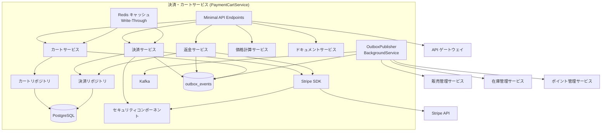
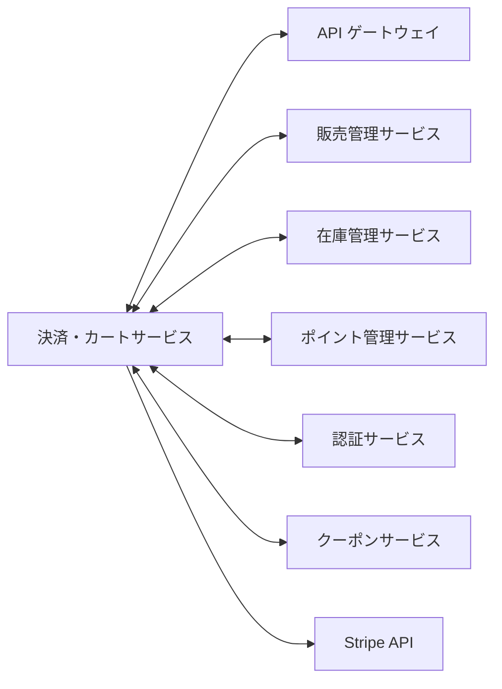
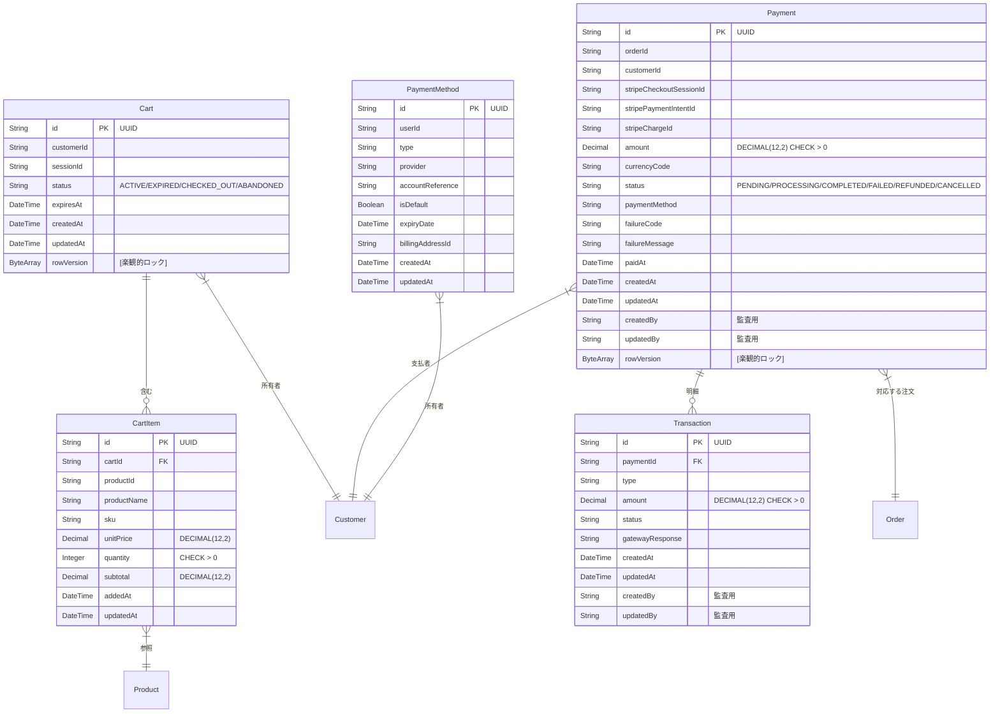
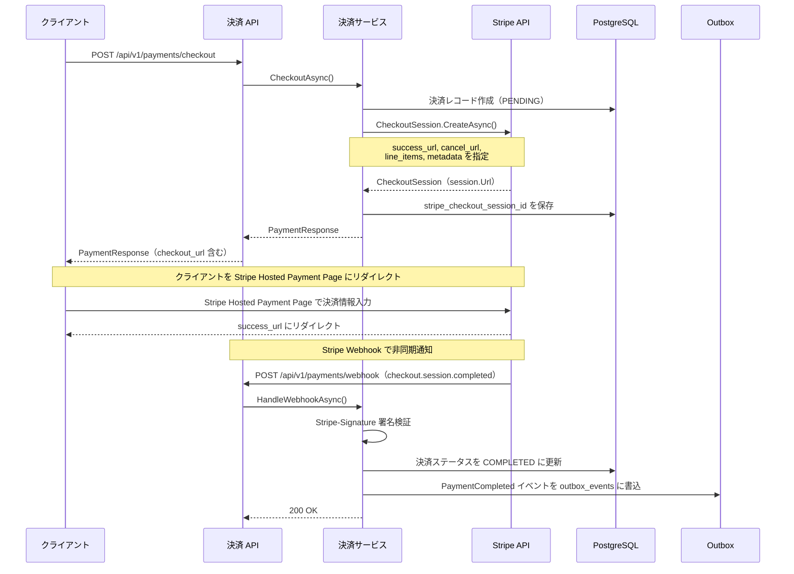

# 決済・カートサービス - 詳細設計書

## 1. 概要

決済・カートサービスは、ショッピングカート管理、決済処理（Stripe）、決済セッション管理、返金処理を担うマイクロサービスである。ユーザーの商品選択からカートへの追加、決済完了までのフローを一貫して管理し、安全かつスムーズな購入体験を提供する。

## 2. 技術スタック

### 開発環境

- **言語**: C# 14 (.NET 10 LTS)
- **フレームワーク**: ASP.NET Core 10 (Minimal API)
- **ビルドツール**: dotnet CLI / MSBuild
- **オーケストレーション**: .NET Aspire 13.1
- **コンテナ化**: Docker 25.x
- **テスト**: xUnit, NSubstitute, Shouldly, Testcontainers.PostgreSql

### 本番環境

- Azure Container Apps
- Azure Database for PostgreSQL

### 主要ライブラリとバージョン

| ライブラリ | バージョン | 用途 |
|---------|---------|---------|
| Microsoft.EntityFrameworkCore | 10.* | ORM データアクセス |
| Npgsql.EntityFrameworkCore.PostgreSQL | 10.* | PostgreSQL プロバイダー |
| Microsoft.EntityFrameworkCore.Design | 10.* | マイグレーションツール |
| Microsoft.AspNetCore.Authentication.JwtBearer | 10.* | JWT 認証 |
| FluentValidation | 11.* | 入力バリデーション |
| FluentValidation.DependencyInjectionExtensions | 11.* | DI 統合 |
| Confluent.Kafka | 2.* | イベント発行・購読 |
| StackExchange.Redis | 2.* | Redis キャッシュ |
| Polly | 8.* | 耐障害性 |
| Microsoft.Extensions.Http.Resilience | 9.* | HTTP レジリエンス |
| Serilog.AspNetCore | 8.* | 構造化ロギング |
| OpenTelemetry.Extensions.Hosting | 1.* | メトリクス収集 |
| OpenTelemetry.Instrumentation.AspNetCore | 1.* | ASP.NET Core トレーシング |
| Microsoft.Identity.Web | 3.* | OAuth2/OIDC 統合 |
| Serilog.Sinks.Console | 6.* | コンソールログ出力 |
| Serilog.Formatting.Compact | 3.* | コンパクト JSON フォーマット |
| Stripe.net | 46.* | Stripe 決済 API |
| AspNetCore.HealthChecks.NpgSql | 9.* | PostgreSQL ヘルスチェック |
| AspNetCore.HealthChecks.Redis | 9.* | Redis ヘルスチェック |

## 3. システムアーキテクチャ

### コンポーネントアーキテクチャ図



### マイクロサービス関連図



## 4. データモデル

### エンティティ関連図



## サービス情報

| 項目 | 値 |
|------|-------|
| サービス名 | PaymentCartService |
| ポート | 5005 |
| データベース | PostgreSQL (paymentdb)（ADR-0006: サービス別独立 DB） |
| フレームワーク | ASP.NET Core 10 (Minimal API) |
| 言語 | C# 14 (.NET 10) |
| アーキテクチャ | イベント駆動型マイクロサービス |

## データベーススキーマ

### carts テーブル

| カラム | データ型 | 制約 | 説明 |
|--------|-----------|-------------|-------------|
| id | VARCHAR(36) | PK | カート ID（UUID） |
| customer_id | VARCHAR(100) | NULL | 顧客 ID（ログイン済みの場合） |
| session_id | VARCHAR(100) | NOT NULL | セッション ID |
| status | VARCHAR(20) | NOT NULL, DEFAULT 'ACTIVE', CHECK (status IN ('ACTIVE','EXPIRED','CHECKED_OUT','ABANDONED')) | カートステータス |
| expires_at | TIMESTAMP WITH TIME ZONE | NOT NULL | 有効期限 |
| created_at | TIMESTAMP WITH TIME ZONE | NOT NULL, DEFAULT CURRENT_TIMESTAMP | 作成日時 |
| updated_at | TIMESTAMP WITH TIME ZONE | NOT NULL, DEFAULT CURRENT_TIMESTAMP | 更新日時 |
| row_version | BYTEA | NOT NULL | 楽観的ロック用バージョン（EF Core [Timestamp]） |

### cart_items テーブル

> **非正規化の設計根拠**: `product_name`, `sku`, `unit_price` は InventoryManagementService の products テーブルのデータを複製している。マイクロサービス間の直接 JOIN は不可能であり、カート追加時点の商品スナップショットを保持するために意図的に非正規化している（spec.md §クロスサービス参照時の API 問い合わせ設計「データ複製（Read Model）」パターンに該当）。

| カラム | データ型 | 制約 | 説明 |
|--------|-----------|-------------|-------------|
| id | VARCHAR(36) | PK | カートアイテム ID（UUID） |
| cart_id | VARCHAR(36) | FK (fk_cart_items_cart_id, ON DELETE CASCADE), NOT NULL | カート ID |
| product_id | VARCHAR(100) | NOT NULL | 商品 ID |
| product_name | VARCHAR(200) | NOT NULL | 商品名（スナップショット） |
| sku | VARCHAR(100) | NOT NULL | SKU コード（スナップショット） |
| unit_price | DECIMAL(12,2) | NOT NULL | 単価（スナップショット） |
| quantity | INTEGER | NOT NULL, CHECK (quantity > 0) | 数量 |
| subtotal | DECIMAL(12,2) | NOT NULL | 小計（quantity × unit_price で計算・更新時に再計算） |
| added_at | TIMESTAMP WITH TIME ZONE | NOT NULL, DEFAULT CURRENT_TIMESTAMP | 追加日時 |
| updated_at | TIMESTAMP WITH TIME ZONE | NOT NULL, DEFAULT CURRENT_TIMESTAMP | 更新日時 |

**UNIQUE 制約**: `UNIQUE (cart_id, product_id)` — 同一カート内の商品重複を DB レベルで防止

### payments テーブル

| カラム | データ型 | 制約 | 説明 |
|--------|-----------|-------------|-------------|
| id | VARCHAR(36) | PK | 決済 ID（UUID） |
| order_id | VARCHAR(36) | NOT NULL, UNIQUE | 注文 ID |
| customer_id | VARCHAR(100) | NOT NULL | 顧客 ID |
| stripe_checkout_session_id | VARCHAR(100) | NULL | Stripe Checkout Session ID |
| stripe_payment_intent_id | VARCHAR(100) | NULL | Stripe PaymentIntent ID |
| stripe_charge_id | VARCHAR(100) | NULL | Stripe Charge ID |
| amount | DECIMAL(12,2) | NOT NULL, CHECK (amount > 0) | 決済金額 |
| currency_code | VARCHAR(3) | NOT NULL, DEFAULT 'JPY' | 通貨コード |
| status | VARCHAR(20) | NOT NULL, CHECK (status IN ('PENDING','PROCESSING','COMPLETED','FAILED','REFUNDED','CANCELLED')) | 決済ステータス |
| payment_method | VARCHAR(50) | NOT NULL | 決済方法 |
| failure_code | VARCHAR(100) | NULL | 失敗コード |
| failure_message | VARCHAR(500) | NULL | 失敗メッセージ |
| paid_at | TIMESTAMP WITH TIME ZONE | NULL | 決済日時 |
| created_at | TIMESTAMP WITH TIME ZONE | NOT NULL, DEFAULT CURRENT_TIMESTAMP | 作成日時 |
| updated_at | TIMESTAMP WITH TIME ZONE | NOT NULL, DEFAULT CURRENT_TIMESTAMP | 更新日時 |
| created_by | VARCHAR(100) | NULL | 作成者（監査用） |
| updated_by | VARCHAR(100) | NULL | 更新者（監査用・手動返金操作の追跡） |
| row_version | BYTEA | NOT NULL | 楽観的ロック用バージョン（EF Core [Timestamp]） |

### transactions テーブル（spec.md 準拠）

| カラム | データ型 | 制約 | 説明 |
|--------|-----------|-------------|-------------|
| id | VARCHAR(36) | PK | トランザクション ID（UUID） |
| payment_id | VARCHAR(36) | FK (fk_transactions_payment_id, ON DELETE RESTRICT), NOT NULL | 決済 ID |
| type | VARCHAR(30) | NOT NULL | トランザクション種別（CHARGE / REFUND / CAPTURE 等） |
| amount | DECIMAL(12,2) | NOT NULL, CHECK (amount > 0) | 金額 |
| status | VARCHAR(20) | NOT NULL | ステータス |
| gateway_response | TEXT | NULL | 決済ゲートウェイレスポンス（JSON） |
| created_at | TIMESTAMP WITH TIME ZONE | NOT NULL, DEFAULT CURRENT_TIMESTAMP | 作成日時 |
| updated_at | TIMESTAMP WITH TIME ZONE | NOT NULL, DEFAULT CURRENT_TIMESTAMP | 更新日時 |
| created_by | VARCHAR(100) | NULL | 作成者（監査用） |
| updated_by | VARCHAR(100) | NULL | 更新者（監査用） |

### payment_methods テーブル（spec.md 準拠）

> **PCI DSS 非保持方針（ADR-0008）**: カード番号・CVV 等のセンシティブデータは一切保存しない。`account_reference` には Stripe が発行するトークン化された参照 ID のみを格納する。

| カラム | データ型 | 制約 | 説明 |
|--------|-----------|-------------|-------------|
| id | VARCHAR(36) | PK | 決済方法 ID（UUID） |
| user_id | VARCHAR(100) | NOT NULL | ユーザー ID |
| type | VARCHAR(30) | NOT NULL | 種別（CREDIT_CARD / CONVENIENCE_STORE 等） |
| provider | VARCHAR(50) | NOT NULL | プロバイダー（stripe 等） |
| account_reference | VARCHAR(255) | NOT NULL | Stripe トークン化参照 ID |
| is_default | BOOLEAN | NOT NULL, DEFAULT FALSE | デフォルト決済方法 |
| expiry_date | TIMESTAMP WITH TIME ZONE | NULL | 有効期限 |
| billing_address_id | VARCHAR(36) | NULL | 請求先住所 ID |
| created_at | TIMESTAMP WITH TIME ZONE | NOT NULL, DEFAULT CURRENT_TIMESTAMP | 作成日時 |
| updated_at | TIMESTAMP WITH TIME ZONE | NOT NULL, DEFAULT CURRENT_TIMESTAMP | 更新日時 |

### outbox_events テーブル（ADR-0005 準拠）

| カラム | データ型 | 制約 | 説明 |
|--------|-----------|-------------|-------------|
| id | VARCHAR(36) | PK | イベント ID（UUID） |
| event_type | VARCHAR(255) | NOT NULL | イベント種別 |
| aggregate_id | VARCHAR(36) | NOT NULL | 集約ルート ID |
| payload | TEXT | NOT NULL | イベントペイロード（JSON） |
| created_at | TIMESTAMP WITH TIME ZONE | NOT NULL, DEFAULT CURRENT_TIMESTAMP | 作成日時 |
| published_at | TIMESTAMP WITH TIME ZONE | NULL | 発行日時 |
| retry_count | INTEGER | NOT NULL, DEFAULT 0, CHECK (retry_count >= 0) | リトライ回数 |
| max_retries | INTEGER | NOT NULL, DEFAULT 5 | 最大リトライ回数 |
| last_error | VARCHAR(2000) | NULL | 最終エラーメッセージ |
| status | VARCHAR(20) | NOT NULL, DEFAULT 'PENDING', CHECK (status IN ('PENDING','PROCESSING','PUBLISHED','FAILED','DEAD_LETTER')) | ステータス |

## API 設計

### REST API エンドポイント

#### カート管理 API

| メソッド | パス | 説明 | パラメータ | レスポンス |
|---------|-----|------------|------------|----------|
| GET | /api/v1/cart | カート取得 | （Cookie: CartId または JWT） | CartResponse |
| POST | /api/v1/cart/items | カートにアイテム追加 | AddCartItemRequest | CartResponse |
| PUT | /api/v1/cart/items/{itemId} | カートアイテム数量更新 | itemId, UpdateCartItemRequest | CartResponse |
| DELETE | /api/v1/cart/items/{itemId} | カートアイテム削除 | itemId | CartResponse |
| DELETE | /api/v1/cart | カートクリア | （なし） | 204 No Content |
| POST | /api/v1/cart/merge | カートマージ（ログイン時） | MergeCartRequest | CartResponse |

#### 決済 API

| メソッド | パス | 説明 | パラメータ | レスポンス |
|---------|-----|------------|------------|----------|
| POST | /api/v1/payments/checkout | チェックアウト・決済処理 | CheckoutRequest | PaymentResponse |
| GET | /api/v1/payments/{paymentId} | 決済詳細取得 | paymentId | PaymentDetailResponse |
| GET | /api/v1/payments/order/{orderId} | 注文の決済情報取得 | orderId | PaymentDetailResponse |
| POST | /api/v1/payments/{paymentId}/refund | 返金処理 | paymentId, RefundRequest | RefundResponse |
| GET | /api/v1/payments/customer/{customerId} | 顧客決済履歴取得 | customerId, page, size | ページネーション付き `PaymentResponse` |
| POST | /api/v1/payments/webhook | Stripe Webhook 処理 | Stripe Event ペイロード | 200 OK |

### 実装上の注意事項

- **カート**: 未ログインユーザーは Cookie (`CartId`) でカートを識別。ログイン後に `merge` エンドポイントでユーザーアカウントにマージ
- **Stripe 連携**: Stripe.net SDK を使用。PaymentIntent ワークフローで PCI DSS 準拠
- **認証**: カート API は `AllowAnonymous()`（ゲスト利用可能）、決済 API は `RequireAuthorization()` を適用

### リクエスト / レスポンス例

#### カートアイテム追加リクエスト

```json
{
  "productId": "prod-123",
  "productName": "スキーブーツ",
  "sku": "SKI-BOOT-001",
  "unitPrice": 25000.00,
  "quantity": 1
}
```

#### カートレスポンス

```json
{
  "id": "cart-uuid-123",
  "customerId": null,
  "sessionId": "sess-abc-123",
  "status": "ACTIVE",
  "items": [
    {
      "id": "item-uuid-456",
      "productId": "prod-123",
      "productName": "スキーブーツ",
      "sku": "SKI-BOOT-001",
      "unitPrice": 25000.00,
      "quantity": 1,
      "subtotal": 25000.00,
      "addedAt": "2024-04-15T14:30:25.123Z"
    }
  ],
  "totalItems": 1,
  "totalAmount": 25000.00,
  "expiresAt": "2024-04-22T14:30:25.123Z",
  "createdAt": "2024-04-15T14:30:25.123Z",
  "updatedAt": "2024-04-15T14:30:25.123Z"
}
```

#### チェックアウトリクエスト

```json
{
  "cartId": "cart-uuid-123",
  "customerId": "550e8400-e29b-41d4-a716-446655440000",
  "paymentMethod": "CREDIT_CARD",
  "shippingAddress": {
    "recipientName": "山田太郎",
    "postalCode": "100-0001",
    "prefecture": "東京都",
    "city": "千代田区",
    "addressLine1": "千代田 1-1-1",
    "addressLine2": "101号室",
    "phoneNumber": "03-1234-5678"
  },
  "couponCode": "WINTER2024",
  "usedPoints": 500
}
```

#### 決済レスポンス

```json
{
  "id": "pay-uuid-789",
  "orderId": "order-uuid-111",
  "customerId": "550e8400-e29b-41d4-a716-446655440000",
  "amount": 27000.00,
  "currencyCode": "JPY",
  "status": "COMPLETED",
  "paymentMethod": "CREDIT_CARD",
  "stripePaymentIntentId": "pi_3abc123",
  "paidAt": "2024-04-15T14:35:10.456Z",
  "createdAt": "2024-04-15T14:30:25.123Z",
  "updatedAt": "2024-04-15T14:35:10.456Z"
}
```

## イベント設計

> **Outbox パターン（ADR-0005 準拠）**: 全ての Kafka イベント発行は `outbox_events` テーブル経由で行う。DB トランザクション内で `outbox_events` にイベントレコードを書き込み、`OutboxPublisher`（BackgroundService）がポーリングして Kafka に発行する。これにより DB 準拠とイベント発行の原子性を保証する。

### 発行イベント

| イベント名 | 説明 | ペイロード | トピック | パーティション数 | キー | 購読先サービス |
|-----------|-------------|---------|-------|------------|-----|------------|
| PaymentCompleted | 決済完了時に発行 | 決済 ID、注文 ID、金額、ステータス | `payment.completed` | 12 | paymentId | SalesManagementService, MailSendService |
| PaymentFailed | 決済失敗時に発行 | 決済 ID、注文 ID、失敗理由 | `payment.failed` | 3 | paymentId | SalesManagementService |
| PaymentRefunded | 返金完了時に発行 | 決済 ID、注文 ID、返金金額 | `payment.refunded` | 3 | paymentId | SalesManagementService, PointService, MailSendService |

### 購読イベント

| イベント名 | 説明 | 発行元サービス | トピック | アクション |
|-----------|-------------|----------------|-------|--------|
| OrderCreated | 注文作成時に購読 | 販売管理サービス | `order.created` | 注文に対する決済レコード作成 |
| OrderCancelled | 注文キャンセル時に購読 | 販売管理サービス | `order.cancelled` | 決済キャンセル、自動返金処理 |
| UserDeleted | ユーザー削除時に購読 | ユーザー管理サービス | `user.deleted` | 該当ユーザーのカートデータ削除・決済データの匿名化（GDPR/個人情報保護法対応） |

> **設計判断**: 在庫予約（InventoryManagementService）との通信は Saga オーケストレーション（ADR-0009）に基づき **gRPC 同期呼び出し**で実装する。SalesManagementService 内の `SagaCoordinator` が在庫予約・決済処理を逐次調整するため、`inventory.reserved` / `inventory.reservation.failed` 等の Kafka トピックは使用しない。spec.md の Kafka トピック一覧にもこれらのトピックは定義されていない。

## 7. エラーハンドリング

### エラーコード定義

| エラーコード | 説明 | HTTP ステータス |
|------------|-------------|-------------|
| CART-4001 | 不正なカートデータ | 400 Bad Request |
| CART-4002 | 数量が上限超過 | 400 Bad Request |
| CART-4003 | 商品が存在しない | 400 Bad Request |
| CART-4041 | カートが見つからない | 404 Not Found |
| CART-4042 | カートアイテムが見つからない | 404 Not Found |
| CART-4091 | カート有効期限切れ | 409 Conflict |
| PAY-4001 | 不正な決済データ | 400 Bad Request |
| PAY-4002 | 決済方法未対応 | 400 Bad Request |
| PAY-4041 | 決済情報が見つからない | 404 Not Found |
| PAY-4221 | 決済処理失敗 | 422 Unprocessable Entity |
| PAY-4222 | 返金処理失敗 | 422 Unprocessable Entity |
| PAY-4223 | Stripe API エラー | 422 Unprocessable Entity |
| PAY-5001 | 内部サーバーエラー | 500 Internal Server Error |
| PAY-5002 | Stripe サービス不可 | 503 Service Unavailable |

### グローバル例外ハンドラー

```csharp
// ✅ Program.cs — グローバル例外ハンドラー
app.UseExceptionHandler(exceptionHandlerApp =>
{
    exceptionHandlerApp.Run(async context =>
    {
        var logger = context.RequestServices.GetRequiredService<ILogger<Program>>();
        var feature = context.Features.Get<IExceptionHandlerFeature>();
        var error = feature?.Error;

        if (error is not (NotFoundException or BusinessException or UnauthorizedException))
            logger.LogError(error, "未処理の例外: {Message}", error?.Message);
        else
            logger.LogWarning("処理済み例外: {ExceptionType} - {Message}", error.GetType().Name, error.Message);

        var problem = error switch
        {
            NotFoundException e => TypedResults.Problem(e.Message, statusCode: 404),
            CartExpiredException e => TypedResults.Problem(e.Message, statusCode: 409),
            PaymentProcessingException e => TypedResults.Problem(e.Message, statusCode: 422),
            RefundProcessingException e => TypedResults.Problem(e.Message, statusCode: 422),
            StripeApiException e => TypedResults.Problem(e.Message, statusCode: 422),
            BusinessException e => TypedResults.Problem(e.Message, statusCode: 400),
            ExternalServiceException e => TypedResults.Problem(e.Message, statusCode: 503),
            _ => TypedResults.Problem("内部エラーが発生しました", statusCode: 500)
        };
        await problem.ExecuteAsync(context);
    });
});
```

## 8. パフォーマンスと最適化

### キャッシュ戦略

> **Write-Through パターン**（spec.md 準拠）: カートデータは PostgreSQL に永続化し、Redis を読取りキャッシュとして使用する。書込み時は PostgreSQL に書込んだ後に Redis キャッシュを更新し、読取り時は Redis から読取る（Cache Miss 時は PostgreSQL から読取り・Redis にキャッシュ）。Redis 障害時もカートデータが失われないことを保証する。

- **Redis キャッシュ**:
  - アクティブカートデータ（TTL: カート有効期限に連動）
  - 決済ステータスキャッシュ（TTL: 30 分）

- **キャッシュキー設計**:
  - カート: `cart:{cartId}`
  - セッション別カート: `cart:session:{sessionId}`
  - ユーザー別カート: `cart:user:{customerId}`
  - 決済ステータス: `payment:{paymentId}:status`

### インデックス設計

| テーブル | インデックス | カラム | 説明 |
|-------|-------|--------|-------------|
| carts | idx_carts_session_id | session_id | セッション別カート検索の高速化 |
| carts | idx_carts_customer_id | customer_id | 顧客別カート検索の高速化 |
| carts | idx_carts_status | status | アクティブカート検索の高速化 |
| cart_items | idx_cart_items_cart_id | cart_id | カート別アイテム検索の高速化 |
| cart_items | idx_cart_items_product_id | product_id | 商品別統計の高速化 |
| payments | idx_payments_order_id | order_id | 注文別決済検索の高速化 |
| payments | idx_payments_customer_id | customer_id | 顧客別決済検索の高速化 |
| payments | idx_payments_status | status | ステータス別決済検索の高速化 |
| payments | idx_payments_stripe_intent_id | stripe_payment_intent_id | Stripe Webhook 処理の高速化 |
| payments | idx_payments_stripe_session_id | stripe_checkout_session_id | Stripe Checkout Session 検索 |
| carts | idx_carts_customer_status | (customer_id, status) | 顧客別アクティブカート検索 |
| cart_items | idx_cart_items_unique | (cart_id, product_id) UNIQUE | カート内商品重複防止 |
| transactions | idx_transactions_payment_id | payment_id | 決済別トランザクション検索 |
| outbox_events | idx_outbox_events_pending | (created_at ASC) WHERE status = 'PENDING' | 未発行イベントの高速取得（部分インデックス） |
| outbox_events | idx_outbox_events_failed | (created_at DESC) WHERE status = 'FAILED' | 失敗イベントの管理者ダッシュボード |
| carts | idx_carts_expired | (updated_at ASC) WHERE status = 'ACTIVE' | 期限切れカートの検出（部分インデックス） |

### クエリ最適化

- **カート取得**: `Include(c => c.Items)` で Eager Loading（N+1 回避）
- **ページネーション**: 顧客決済履歴にはキーセットページネーションを使用
- **読み取り最適化**: 全読み取り専用クエリに `AsNoTracking()` を適用（変更追跡のオーバーヘッド排除）
- **ReadModel**: `AsNoTracking().Select(x => new DtoType(...))` でプロジェクションし、不要なカラムの取得を回避

## 9. セキュリティ対策

### PCI DSS 準拠（ADR-0008: SAQ A）

- **カード情報非保持**: Stripe Checkout（Hosted Payment Page）を使用し、クレジットカード情報が一切サーバーを経由しない（SAQ A）
- **Stripe Webhook 検証**: `Stripe-Signature` ヘッダー + `EventUtility.ConstructEvent()` でリクエストの真正性を検証（§15 参照）
- **通信暗号化**: 全 Stripe API 通信は HTTPS 経由

### API セキュリティ

- **認証・認可**: JWT トークンベースの認証。カート API はゲスト利用可能（`AllowAnonymous()`）
- **入力バリデーション**: FluentValidation による入力検証
- **レート制限**: 決済エンドポイントに対する厳格なレート制限
- **IDOR 防止**: ログインユーザーのカート・決済情報のみアクセス可能にするオーナーシップ検証

### Cookie セキュリティ

```csharp
// ✅ カート ID Cookie の設定
httpContext.Response.Cookies.Append("CartId", cartId, new CookieOptions
{
    HttpOnly = true,
    Secure = true,
    SameSite = SameSiteMode.Strict,
    MaxAge = TimeSpan.FromDays(7)
});
```

## 10. 監視とロギング

### 監視メトリクス

| メトリクス | 説明 | 閾値 |
|---------|-------------|-----------|
| cart-creation-rate | カート作成数/分 | 警告: > 500/分 |
| checkout-rate | チェックアウト数/分 | 警告: > 100/分 |
| payment-success-rate | 決済成功率 | 警告: < 95%、アラート: < 90% |
| payment-processing-time | 決済処理時間 | 警告: > 3秒、アラート: > 5秒 |
| stripe-api-latency | Stripe API 応答時間 | 警告: > 2秒、アラート: > 5秒 |
| cart-abandonment-rate | カート放棄率 | 警告: > 70% |
| refund-rate | 返金率 | 警告: > 5%、アラート: > 10% |
| api-error-rate | API エラー率 | 警告: > 1%、アラート: > 5% |

### ログ設計

- **構造化ログ**: Serilog + `ILogger<T>` で JSON 形式のログ出力
- **Correlation ID**: 全リクエストに相関 ID を付与し、マイクロサービス間で伝搬
- **PII 保護**: クレジットカード番号・CVV をログに出力しない。Stripe ID のみ記録

## 11. テスト戦略

### 単体テスト

- **テスト対象**: Service レイヤーのビジネスロジック（カート操作、決済ロジック）、バリデーションルール
- **テストフレームワーク**: xUnit, NSubstitute, Shouldly

### 統合テスト

- **テスト対象**: Repository レイヤーとデータベース統合、Stripe API 統合（テストモード）
- **テストフレームワーク**: WebApplicationFactory, Testcontainers.PostgreSql

### API テスト

- **テスト対象**: REST API エンドポイント、リクエスト/レスポンスバリデーション
- **テストフレームワーク**: WebApplicationFactory

### Stripe テスト

- **テストモード**: Stripe テスト API キー (`sk_test_*`) を使用
- **テストカード番号**: `4242424242424242`（成功）、`4000000000000002`（失敗）
- **Webhook テスト**: `stripe listen --forward-to localhost:5005/api/v1/payments/webhook`

## 12. デプロイ

### Dockerfile

```dockerfile
FROM mcr.microsoft.com/dotnet/sdk:10.0 AS build
WORKDIR /src
COPY ["PaymentCartService/PaymentCartService.csproj", "PaymentCartService/"]
RUN dotnet restore "PaymentCartService/PaymentCartService.csproj"
COPY . .
WORKDIR "/src/PaymentCartService"
RUN dotnet publish "PaymentCartService.csproj" -c Release -o /app/publish --no-restore

FROM mcr.microsoft.com/dotnet/aspnet:10.0 AS runtime
WORKDIR /app
RUN groupadd -r skishop && useradd -r -g skishop -d /app skishop
COPY --from=build --chown=skishop:skishop /app/publish .
USER skishop

ENV ASPNETCORE_ENVIRONMENT=Production
ENV DOTNET_RUNNING_IN_CONTAINER=true
EXPOSE 5005
HEALTHCHECK --interval=30s --timeout=10s --retries=3 \
    CMD curl -f http://localhost:5005/health || exit 1
ENTRYPOINT ["dotnet", "PaymentCartService.dll"]
```

### CI/CD パイプライン（GitHub Actions）

```yaml
name: PaymentCartService CI/CD

on:
  push:
    branches: [ main ]
    paths: [ 'PaymentCartService/**' ]

jobs:
  build:
    runs-on: ubuntu-latest
    steps:
    - uses: actions/checkout@v4
    - uses: actions/setup-dotnet@v4
      with:
        dotnet-version: '10.0.x'
    - run: dotnet restore
    - run: dotnet build --no-restore
    - run: dotnet test --no-build --collect:"XPlat Code Coverage"
    - name: Docker イメージビルド・デプロイ
      if: github.ref == 'refs/heads/main'
      run: |
        docker build -t skishop.azurecr.io/payment-cart-service:${{ github.sha }} .
        az acr login --name skishop
        docker push skishop.azurecr.io/payment-cart-service:${{ github.sha }}
        az containerapp update --name payment-cart-service --resource-group rg-skishop \
          --image skishop.azurecr.io/payment-cart-service:${{ github.sha }}
```

## 13. 運用・保守

### バックアップ戦略

- **データベースバックアップ**: Azure Database for PostgreSQL 自動バックアップ（毎日）
- **バックアップ保持期間**: 35 日
- **RPO**: 1 時間以内、**RTO**: 4 時間以内

### スケーリング戦略

- **水平スケーリング**: CPU 使用率 70% 超過時に自動スケールアウト
- **最小インスタンス**: 2、**最大インスタンス**: 10

### 定期メンテナンス

- 期限切れカートの定期削除（BackgroundService でバッチ処理、PostgreSQL 30 日）
- 決済データのアーカイブ（電子帳簿保存法に基づき 7 年間保持後、コールドストレージにアーカイブ）

## 14. カート・セッション管理パターン

### 未ログインユーザーのカート管理

```csharp
// ✅ 未ログイン時: Cookie にカート ID を格納（Cart エンティティは DB に保存）
app.MapPost("/api/v1/cart/items", async (
    HttpContext httpContext,
    [FromBody] AddCartItemRequest request,
    ICartService cartService,
    CancellationToken ct) =>
{
    var cartId = httpContext.Request.Cookies["CartId"]
        ?? Guid.NewGuid().ToString();
    var cart = await cartService.AddItemAsync(cartId, request, ct);
    httpContext.Response.Cookies.Append("CartId", cartId,
        new CookieOptions
        {
            HttpOnly = true,
            Secure = true,
            SameSite = SameSiteMode.Strict,
            MaxAge = TimeSpan.FromDays(7)
        });
    return Results.Ok(cart);
}).AllowAnonymous().WithOpenApi();
```

### ログイン時のカートマージ

```csharp
// ✅ ログイン成功時: ゲストカートをユーザーカートにマージ
app.MapPost("/api/v1/cart/merge", async (
    [FromBody] MergeCartRequest request,
    ClaimsPrincipal user,
    ICartService cartService,
    CancellationToken ct) =>
{
    var userId = user.FindFirstValue(ClaimTypes.NameIdentifier)
        ?? throw new UnauthorizedException();
    var cart = await cartService.MergeCartAsync(request.GuestCartId, userId, ct);
    return Results.Ok(cart);
}).RequireAuthorization().WithOpenApi();
```

### 期限切れカートの定期削除

> **ポーリング間隔**: `ExpiredCartCleanupService` は定期バッチのため固定間隔（1 時間）で許容される。一方、`OutboxPublisher` には動的バックオフ（100ms〜5s）が必須である（AGENTS.md §10.4、§19 Outbox パターン設計参照）。
> **削除基準**: PostgreSQL のカートは `updated_at < 30日前` かつ `status = 'ACTIVE'` で削除（spec.md: Redis 7日 / PostgreSQL 30日 の二段階 TTL）。

```csharp
// ✅ BackgroundService で期限切れカートを定期削除
public class ExpiredCartCleanupService(
    IServiceScopeFactory scopeFactory,
    ILogger<ExpiredCartCleanupService> logger) : BackgroundService
{
    protected override async Task ExecuteAsync(CancellationToken stoppingToken)
    {
        while (!stoppingToken.IsCancellationRequested)
        {
            using var scope = scopeFactory.CreateScope();
            var context = scope.ServiceProvider.GetRequiredService<AppDbContext>();
            var cutoff = DateTime.UtcNow.AddDays(-30);
            var expiredCarts = await context.Carts
                .Where(c => c.UpdatedAt < cutoff && c.Status == "ACTIVE")
                .Take(500)  // バッチサイズ制限
                .ToListAsync(stoppingToken);

            foreach (var cart in expiredCarts)
            {
                cart.Status = "EXPIRED";
                logger.LogInformation("期限切れカートを処理: {CartId}", cart.Id);
            }
            await context.SaveChangesAsync(stoppingToken);

            await Task.Delay(TimeSpan.FromHours(1), stoppingToken);
        }
    }
}
```

## 15. Stripe 連携

### Stripe Checkout（Hosted Payment Page）ワークフロー（ADR-0008: SAQ A 準拠）

> **PCI DSS 非保持方針（ADR-0008）**: Stripe Checkout（Hosted Payment Page）を使用し、クレジットカード情報が一切サーバーを経由しないようにする（SAQ A）。PaymentIntent + stripe.js（SAQ A-EP）方式は採用しない。



### Stripe Webhook 署名検証（必須）

Webhook エンドポイントは外部から受信する HTTP リクエストであり、`Stripe-Signature` ヘッダーによる署名検証が必須である。署名検証なしではなりすまし攻撃による不正な決済完了・返金処理が実行されるリスクがある。

### Webhook エンドポイントの多層防御

署名検証に加え、以下のネットワークレベルの IP 制限を適用し、多層防御を実現する。

| 防御レイヤー | 実装箇所 | 内容 |
|------------|---------|------|
| L1: ネットワーク制限 | API Gateway / Azure Container Apps インバウンドルール | Stripe Webhook IP レンジ（`https://stripe.com/docs/ips`）のみ許可 |
| L2: レート制限 | ASP.NET Core RateLimiter（§24 `webhook` ポリシー） | 100 回/分 の上限で DDoS 緩和 |
| L3: 署名検証 | アプリケーション層（`EventUtility.ConstructEvent`） | `Stripe-Signature` ヘッダーによるリクエスト真正性検証 |

**IP ホワイトリスト設定例（Azure Container Apps）**:

```json
{
  "ipSecurityRestrictions": [
    {
      "name": "Stripe-Webhook-IPs",
      "ipAddressRange": "3.18.12.63/32,3.130.192.231/32,13.235.14.237/32,18.211.135.69/32,35.154.171.200/32,52.15.183.38/32,54.88.130.119/32,54.88.130.237/32,54.187.174.169/32,54.187.205.235/32,54.187.216.72/32",
      "action": "Allow",
      "priority": 100,
      "description": "Stripe Webhook IP ranges — 定期的に https://stripe.com/docs/ips を参照して更新"
    },
    {
      "name": "Deny-All-Others-Webhook",
      "ipAddressRange": "0.0.0.0/0",
      "action": "Deny",
      "priority": 200,
      "description": "Webhook パスへのその他アクセスを拒否"
    }
  ]
}
```

> **運用注意**: Stripe の Webhook IP レンジは変更される可能性がある。`https://stripe.com/docs/ips` を定期的に監視し、IP リストを更新すること。

```csharp
// ✅ Stripe Webhook エンドポイント（AllowAnonymous + 署名検証）
app.MapPost("/api/v1/payments/webhook", async (
    HttpContext httpContext,
    IPaymentService paymentService,
    IOptions<StripeSettings> stripeOptions,
    ILogger<Program> logger,
    CancellationToken ct) =>
{
    var json = await new StreamReader(httpContext.Request.Body).ReadToEndAsync(ct);
    var stripeSignature = httpContext.Request.Headers["Stripe-Signature"].FirstOrDefault()
        ?? throw new BusinessException("Stripe-Signature ヘッダーがありません");

    try
    {
        // ✅ 必須: 署名検証でリクエストの真正性を確認
        var stripeEvent = EventUtility.ConstructEvent(
            json, stripeSignature, stripeOptions.Value.WebhookSecret);

        await paymentService.HandleWebhookAsync(stripeEvent, ct);
        return Results.Ok();
    }
    catch (StripeException ex)
    {
        logger.LogWarning(ex, "Stripe Webhook 署名検証失敗");
        return Results.BadRequest();
    }
}).AllowAnonymous()  // Stripe サーバーからの呼び出しのため AllowAnonymous
.WithOpenApi()
.WithDescription("署名検証 + AllowAnonymous。webhookSecret は環境変数 / Azure Key Vault で管理（ハードコード禁止）");

### Stripe API キー管理

```csharp
// ✅ Stripe API キーは環境変数 / Azure Key Vault で管理（ハードコード禁止）
builder.Services.Configure<StripeSettings>(
    builder.Configuration.GetSection("Stripe"));

// appsettings.json — テンプレートのみ（秘密情報なし）
// {
//   "Stripe": {
//     "SecretKey": "",      ← 環境変数 Stripe__SecretKey で設定
//     "WebhookSecret": ""   ← 環境変数 Stripe__WebhookSecret で設定
//   }
// }
```

## 16. 将来の拡張計画

### 短期（3〜6 ヶ月）

- Apple Pay / Google Pay 対応
- コンビニ決済対応
- カート放棄メール通知の自動化

### 中期（6〜12 ヶ月）

- 定期購入（サブスクリプション）機能
- 分割払い対応
- 購入傾向分析ダッシュボード

### 長期（12 ヶ月以上）

- 多通貨対応
- 暗号通貨決済対応
- AI 駆動の不正検知

## 17. トラブルシューティングガイド

### よくある問題と対応策

| 問題 | 原因 | 対応策 |
|-------|---------------|----------|
| 決済が完了しない | Stripe API 接続問題 | Stripe ステータスページ確認、サーキットブレーカー設定確認 |
| Webhook が届かない | URL 設定ミス / 署名検証失敗 | Stripe Dashboard で Webhook ログ確認、Secret 再設定 |
| カートが消える | 期限切れ / Cookie 削除 | カート TTL 設定確認、Cookie 設定確認 |
| 二重決済 | 冪等性キー未設定 | Stripe の IdempotencyKey を設定 |
| 返金処理失敗 | Stripe 残高不足 | Stripe Dashboard で残高確認 |
| カートとログインの不整合 | マージ処理エラー | MergeCartAsync のログ確認 |

## 18. 開発環境セットアップ

### 前提条件

- .NET 10 SDK
- Docker 24.0+
- Stripe CLI（Webhook テスト用）

### ローカル開発

.NET Aspire の AppHost で全依存サービスを自動起動:

```bash
cd AppHost && dotnet run
```

アプリケーション実行:

```bash
cd PaymentCartService && dotnet run
```

Stripe Webhook のフォワーディング:

```bash
stripe listen --forward-to localhost:5005/api/v1/payments/webhook
```

確認:

```bash
curl http://localhost:5005/health
```

### 設定

`appsettings.json` の主要設定:

```json
{
  "AllowedHosts": "*",
  "Logging": {
    "LogLevel": {
      "Default": "Warning",
      "Microsoft.AspNetCore": "Warning",
      "SkiShop": "Information"
    }
  },
  "DetailedErrors": false,
  "Kestrel": {
    "AddServerHeader": false
  },
  "App": {
    "Cart": {
      "ExpiryDays": 7,
      "MaxItemsPerCart": 50,
      "MaxQuantityPerItem": 10
    },
    "Payment": {
      "DefaultCurrency": "JPY",
      "MaxRetries": 3
    }
  }
}
```

## 19. Outbox パターン設計（ADR-0005 準拠）

全 Kafka イベント発行は `outbox_events` テーブル経由の Outbox パターンで行い、DB トランザクションとイベント発行の原子性を保証する。

### OutboxPublisher（BackgroundService）

```csharp
// ✅ OutboxPublisher — 動的バックオフ（100ms〜5s）で Outbox をポーリング
// PostgreSQL Advisory Lock によるリーダー選出で複数インスタンス環境でも安全に動作
public class OutboxPublisher(
    IServiceScopeFactory scopeFactory,
    IProducer<string, string> producer,
    TimeProvider timeProvider,
    ILogger<OutboxPublisher> logger) : BackgroundService
{
    private static readonly TimeSpan MinPollingInterval = TimeSpan.FromMilliseconds(100);
    private static readonly TimeSpan MaxPollingInterval = TimeSpan.FromSeconds(5);
    private TimeSpan _currentInterval = TimeSpan.FromMilliseconds(500);

    protected override async Task ExecuteAsync(CancellationToken stoppingToken)
    {
        while (!stoppingToken.IsCancellationRequested)
        {
            using var scope = scopeFactory.CreateScope();
            var context = scope.ServiceProvider.GetRequiredService<AppDbContext>();

            var pendingEvents = await context.OutboxEvents
                .Where(e => e.Status == "PENDING")
                .OrderBy(e => e.CreatedAt)
                .Take(100)
                .ToListAsync(stoppingToken);

            foreach (var evt in pendingEvents)
            {
                try
                {
                    await producer.ProduceAsync(evt.EventType, new Message<string, string>
                    {
                        Key = evt.AggregateId,
                        Value = evt.Payload
                    }, stoppingToken);
                    evt.Status = "PUBLISHED";
                    evt.PublishedAt = timeProvider.GetUtcNow().UtcDateTime;
                }
                catch (Exception ex)
                {
                    evt.RetryCount++;
                    evt.LastError = ex.Message[..Math.Min(ex.Message.Length, 2000)];
                    if (evt.RetryCount >= evt.MaxRetries)
                        evt.Status = "FAILED";
                    logger.LogError(ex, "Outbox publish failed: {EventId}, retry: {RetryCount}",
                        evt.Id, evt.RetryCount);
                }
            }
            await context.SaveChangesAsync(stoppingToken);

            // 動的バックオフ: イベントあり → 高速、なし → 指数増加
            _currentInterval = pendingEvents.Count > 0
                ? MinPollingInterval
                : TimeSpan.FromTicks(Math.Min(
                    _currentInterval.Ticks * 2,
                    MaxPollingInterval.Ticks));

            await Task.Delay(_currentInterval, stoppingToken);
        }
    }
}
```

### イベント発行時のトランザクション統合

```csharp
// ✅ 決済完了時のイベント発行例 — DB トランザクション内で outbox_events に書込む
await using var transaction = await _context.Database.BeginTransactionAsync(ct);
try
{
    payment.Status = "COMPLETED";
    payment.PaidAt = DateTime.UtcNow;

    await _context.OutboxEvents.AddAsync(new OutboxEvent
    {
        EventType = "payment.completed",
        AggregateId = payment.Id,
        Payload = JsonSerializer.Serialize(new PaymentCompletedEvent(
            payment.Id, payment.OrderId, payment.Amount, DateTime.UtcNow))
    }, ct);

    await _context.SaveChangesAsync(ct);
    await transaction.CommitAsync(ct);
}
catch
{
    await transaction.RollbackAsync(ct);
    throw;
}
```

## 20. Saga 統合設計（ADR-0009 準拠）

> **SSOT 注記**: ADR-0009 のステップ番号は初期定義であり、spec.md のステップ定義が SSOT（Single Source of Truth）である。spec.md では以下の順序で定義されている: ステップ 1（カート取得）、ステップ 2（在庫引当）、ステップ 3（クーポン検証）、ステップ 4（ポイント仮消費）、ステップ 5（注文作成）、ステップ 6（決済認証）、ステップ 7（ポイント確定付与）、ステップ 8（カートクリア）、ステップ 9（Outbox イベント発行）。ADR-0009 のステップ構成テーブルとの番号差異が存在するが、本設計書では spec.md のステップ番号に準拠する。

PaymentCartService は注文確定 Saga の以下のステップに参画する。

### Saga ステップと PaymentCartService の役割

| Saga ステップ | 役割 | 入力 | 出力 | 補償操作 | 冪等性保証 |
|-------------|------|------|------|---------|-----------|
| ステップ 1（カート取得） | カート情報の提供 | cartId | CartSnapshot（商品明細、合計金額） | なし（読み取りのみ） | — |
| ステップ 6（決済認証） | Stripe Checkout Session 作成・決済処理 | orderId, amount, customerId | paymentId, stripeCheckoutSessionId | Stripe Refund API で返金 | stripeCheckoutSessionId による冪等性 |
| ステップ 8（カートクリア） | チェックアウト完了後のカート削除 | cartId | なし | なし（後処理・補償対象外） | — |

### 補償トランザクション（Refund）の冪等性

ステップ 6 の補償操作（返金）は以下のルールで冪等性を保証する:

- `payment.status` が既に `REFUNDED` または `CANCELLED` の場合は処理をスキップ
- Stripe Refund API の `idempotency_key` に `payment.id` を使用
- 補償操作の `CancellationToken` タイムアウトは 30 秒

```csharp
// ✅ Saga 補償: 冪等な返金処理
public async Task CompensatePaymentAsync(string paymentId, CancellationToken ct = default)
{
    using var timeoutCts = CancellationTokenSource.CreateLinkedTokenSource(ct);
    timeoutCts.CancelAfter(TimeSpan.FromSeconds(30));

    var payment = await _paymentRepository.FindByIdAsync(paymentId, timeoutCts.Token)
        ?? throw new NotFoundException($"Payment {paymentId} not found");

    // 冪等性チェック: 既に返金済みならスキップ
    if (payment.Status is "REFUNDED" or "CANCELLED")
    {
        _logger.LogInformation("Saga 補償スキップ（既に返金済み）: {PaymentId}", paymentId);
        return;
    }

    var refund = await _stripeRefundService.CreateAsync(
        new RefundCreateOptions
        {
            PaymentIntent = payment.StripePaymentIntentId,
            Reason = "requested_by_customer"
        },
        new RequestOptions { IdempotencyKey = $"saga-refund-{paymentId}" },
        timeoutCts.Token);

    payment.Status = "REFUNDED";
    await _paymentRepository.SaveChangesAsync(timeoutCts.Token);
}
```

## 21. EF Core エンティティ定義（AGENTS.md §10.3 準拠）

```csharp
// ✅ Cart エンティティ（Aggregate Root）
[Table("carts")]
public class Cart
{
    [Key]
    [Column("id")]
    [MaxLength(36)]
    public string Id { get; set; } = Guid.NewGuid().ToString();

    [Column("customer_id")]
    [MaxLength(100)]
    public string? CustomerId { get; set; }

    [Column("session_id")]
    [Required]
    [MaxLength(100)]
    public string SessionId { get; set; } = string.Empty;

    [Column("status")]
    [Required]
    [MaxLength(20)]
    public string Status { get; set; } = "ACTIVE";

    [Column("expires_at")]
    public DateTime ExpiresAt { get; set; }

    [Column("created_at")]
    public DateTime CreatedAt { get; set; } = DateTime.UtcNow;

    [Column("updated_at")]
    public DateTime UpdatedAt { get; set; } = DateTime.UtcNow;

    [Timestamp]
    [Column("row_version")]
    public byte[] RowVersion { get; set; } = [];

    // コレクションナビゲーション — = [] で初期化（null 防止）
    public ICollection<CartItem> Items { get; set; } = [];
}

// ✅ CartItem エンティティ（Cart の子エンティティ）
[Table("cart_items")]
public class CartItem
{
    [Key]
    [Column("id")]
    [MaxLength(36)]
    public string Id { get; set; } = Guid.NewGuid().ToString();

    [Column("cart_id")]
    [Required]
    [MaxLength(36)]
    public string CartId { get; set; } = string.Empty;

    [Column("product_id")]
    [Required]
    [MaxLength(100)]
    public string ProductId { get; set; } = string.Empty;

    [Column("product_name")]
    [Required]
    [MaxLength(200)]
    public string ProductName { get; set; } = string.Empty;

    [Column("sku")]
    [Required]
    [MaxLength(100)]
    public string Sku { get; set; } = string.Empty;

    [Column("unit_price")]
    public decimal UnitPrice { get; set; }

    [Column("quantity")]
    public int Quantity { get; set; }

    [Column("subtotal")]
    public decimal Subtotal { get; set; }

    [Column("added_at")]
    public DateTime AddedAt { get; set; } = DateTime.UtcNow;

    [Column("updated_at")]
    public DateTime UpdatedAt { get; set; } = DateTime.UtcNow;

    // ナビゲーションプロパティ
    public Cart Cart { get; set; } = null!;
}

// ✅ Payment エンティティ
[Table("payments")]
public class Payment
{
    [Key]
    [Column("id")]
    [MaxLength(36)]
    public string Id { get; set; } = Guid.NewGuid().ToString();

    [Column("order_id")]
    [Required]
    [MaxLength(36)]
    public string OrderId { get; set; } = string.Empty;

    [Column("customer_id")]
    [Required]
    [MaxLength(100)]
    public string CustomerId { get; set; } = string.Empty;

    [Column("stripe_checkout_session_id")]
    [MaxLength(100)]
    public string? StripeCheckoutSessionId { get; set; }

    [Column("stripe_payment_intent_id")]
    [MaxLength(100)]
    public string? StripePaymentIntentId { get; set; }

    [Column("stripe_charge_id")]
    [MaxLength(100)]
    public string? StripeChargeId { get; set; }

    [Column("amount")]
    public decimal Amount { get; set; }

    [Column("currency_code")]
    [Required]
    [MaxLength(3)]
    public string CurrencyCode { get; set; } = "JPY";

    [Column("status")]
    [Required]
    [MaxLength(20)]
    public string Status { get; set; } = "PENDING";

    [Column("payment_method")]
    [Required]
    [MaxLength(50)]
    public string PaymentMethod { get; set; } = string.Empty;

    [Column("failure_code")]
    [MaxLength(100)]
    public string? FailureCode { get; set; }

    [Column("failure_message")]
    [MaxLength(500)]
    public string? FailureMessage { get; set; }

    [Column("paid_at")]
    public DateTime? PaidAt { get; set; }

    [Column("created_at")]
    public DateTime CreatedAt { get; set; } = DateTime.UtcNow;

    [Column("updated_at")]
    public DateTime UpdatedAt { get; set; } = DateTime.UtcNow;

    [Column("created_by")]
    [MaxLength(100)]
    public string? CreatedBy { get; set; }

    [Column("updated_by")]
    [MaxLength(100)]
    public string? UpdatedBy { get; set; }

    [Timestamp]
    [Column("row_version")]
    public byte[] RowVersion { get; set; } = [];

    // ナビゲーションプロパティ
    public ICollection<Transaction> Transactions { get; set; } = [];
}

// ✅ Transaction エンティティ（spec.md 準拠）
[Table("transactions")]
public class Transaction
{
    [Key]
    [Column("id")]
    [MaxLength(36)]
    public string Id { get; set; } = Guid.NewGuid().ToString();

    [Column("payment_id")]
    [Required]
    [MaxLength(36)]
    public string PaymentId { get; set; } = string.Empty;

    [Column("type")]
    [Required]
    [MaxLength(30)]
    public string Type { get; set; } = string.Empty;

    [Column("amount")]
    public decimal Amount { get; set; }

    [Column("status")]
    [Required]
    [MaxLength(20)]
    public string Status { get; set; } = string.Empty;

    [Column("gateway_response")]
    public string? GatewayResponse { get; set; }

    [Column("created_at")]
    public DateTime CreatedAt { get; set; } = DateTime.UtcNow;

    [Column("updated_at")]
    public DateTime UpdatedAt { get; set; } = DateTime.UtcNow;

    [Column("created_by")]
    [MaxLength(100)]
    public string? CreatedBy { get; set; }

    [Column("updated_by")]
    [MaxLength(100)]
    public string? UpdatedBy { get; set; }

    // ナビゲーションプロパティ
    public Payment Payment { get; set; } = null!;
}

// ✅ OutboxEvent エンティティ（ADR-0005 準拠）
[Table("outbox_events")]
public class OutboxEvent
{
    [Key]
    [Column("id")]
    [MaxLength(36)]
    public string Id { get; set; } = Guid.NewGuid().ToString();

    [Column("event_type")]
    [Required]
    [MaxLength(255)]
    public string EventType { get; set; } = string.Empty;

    [Column("aggregate_id")]
    [Required]
    [MaxLength(36)]
    public string AggregateId { get; set; } = string.Empty;

    [Column("payload")]
    [Required]
    public string Payload { get; set; } = string.Empty;

    [Column("created_at")]
    public DateTime CreatedAt { get; set; } = DateTime.UtcNow;

    [Column("published_at")]
    public DateTime? PublishedAt { get; set; }

    [Column("retry_count")]
    public int RetryCount { get; set; }

    [Column("max_retries")]
    public int MaxRetries { get; set; } = 5;

    [Column("last_error")]
    [MaxLength(2000)]
    public string? LastError { get; set; }

    [Column("status")]
    [Required]
    [MaxLength(20)]
    public string Status { get; set; } = "PENDING";
}

// ✅ PaymentMethod エンティティ（spec.md 準拠）
[Table("payment_methods")]
public class PaymentMethod
{
    [Key]
    [Column("id")]
    [MaxLength(36)]
    public string Id { get; set; } = Guid.NewGuid().ToString();

    [Column("user_id")]
    [Required]
    [MaxLength(100)]
    public string UserId { get; set; } = string.Empty;

    [Column("type")]
    [Required]
    [MaxLength(50)]
    public string Type { get; set; } = string.Empty;

    [Column("provider")]
    [Required]
    [MaxLength(50)]
    public string Provider { get; set; } = string.Empty;

    [Column("account_reference")]
    [MaxLength(255)]
    public string? AccountReference { get; set; }

    [Column("is_default")]
    public bool IsDefault { get; set; }

    [Column("expiry_date")]
    public DateTime? ExpiryDate { get; set; }

    [Column("billing_address_id")]
    [MaxLength(36)]
    public string? BillingAddressId { get; set; }

    [Column("created_at")]
    public DateTime CreatedAt { get; set; } = DateTime.UtcNow;

    [Column("updated_at")]
    public DateTime UpdatedAt { get; set; } = DateTime.UtcNow;
}
```

### 楽観的ロック（Cart）のハンドリング

```csharp
// ✅ DbUpdateConcurrencyException → HTTP 409 Conflict
try
{
    await _context.SaveChangesAsync(ct);
}
catch (DbUpdateConcurrencyException ex)
{
    _logger.LogWarning(ex, "楽観的ロック競合: {EntityType}", ex.Entries.FirstOrDefault()?.Entity.GetType().Name);
    throw new ConcurrencyException("カートデータが他のセッションによって更新されました。再度お試しください。");
}
```

### 楽観的ロック（Payment）のハンドリング

```csharp
// ✅ Payment の楽観的ロック — Saga 補償トランザクション（返金）と Webhook による
// 同時更新で競合が発生した場合のハンドリング
try
{
    await _context.SaveChangesAsync(ct);
}
catch (DbUpdateConcurrencyException ex)
{
    _logger.LogWarning(ex, "楽観的ロック競合（Payment）: {PaymentId}", 
        (ex.Entries.FirstOrDefault()?.Entity as Payment)?.Id);
    throw new ConcurrencyException("決済データが他の処理によって更新されました。再度お試しください。");
}
```

## 22. Service / Repository インターフェース定義

```csharp
// ✅ ICartService
public interface ICartService
{
    Task<CartResponse> GetCartAsync(string cartId, CancellationToken ct = default);
    Task<CartResponse> AddItemAsync(string cartId, AddCartItemRequest request, CancellationToken ct = default);
    Task<CartResponse> UpdateItemQuantityAsync(string cartId, string itemId, UpdateCartItemRequest request, CancellationToken ct = default);
    Task<CartResponse> RemoveItemAsync(string cartId, string itemId, CancellationToken ct = default);
    Task ClearCartAsync(string cartId, CancellationToken ct = default);
    Task<CartResponse> MergeCartAsync(string guestCartId, string userId, CancellationToken ct = default);
}

// ✅ IPaymentService
public interface IPaymentService
{
    Task<PaymentResponse> CheckoutAsync(CheckoutRequest request, string userId, CancellationToken ct = default);
    Task<PaymentDetailResponse?> GetByIdAsync(string paymentId, string userId, CancellationToken ct = default);
    Task<PaymentDetailResponse?> GetByOrderIdAsync(string orderId, string userId, CancellationToken ct = default);
    Task HandleWebhookAsync(Event stripeEvent, CancellationToken ct = default);
    Task CompensatePaymentAsync(string paymentId, CancellationToken ct = default);
}

// ✅ IRefundService
public interface IRefundService
{
    Task<RefundResponse> RefundAsync(string paymentId, RefundRequest request, string userId, CancellationToken ct = default);
}

// ✅ ICartRepository（Aggregate Root 単位）
public interface ICartRepository
{
    Task<Cart?> FindByIdAsync(string id, CancellationToken ct = default);
    Task<Cart?> FindBySessionIdAsync(string sessionId, CancellationToken ct = default);
    Task<Cart?> FindByUserIdAsync(string userId, CancellationToken ct = default);
    Task AddAsync(Cart cart, CancellationToken ct = default);
    Task SaveChangesAsync(CancellationToken ct = default);
}

// ✅ IPaymentRepository（Aggregate Root 単位）
public interface IPaymentRepository
{
    Task<Payment?> FindByIdAsync(string id, CancellationToken ct = default);
    Task<Payment?> FindByOrderIdAsync(string orderId, CancellationToken ct = default);
    Task<Payment?> FindByStripeCheckoutSessionIdAsync(string sessionId, CancellationToken ct = default);
    Task AddAsync(Payment payment, CancellationToken ct = default);
    Task SaveChangesAsync(CancellationToken ct = default);
}

// ✅ DI 登録（Program.cs）
builder.Services.AddScoped<ICartService, CartService>();
builder.Services.AddScoped<IPaymentService, PaymentService>();
builder.Services.AddScoped<IRefundService, RefundService>();
builder.Services.AddScoped<ICartRepository, CartRepository>();
builder.Services.AddScoped<IPaymentRepository, PaymentRepository>();
builder.Services.AddHostedService<OutboxPublisher>();
builder.Services.AddHostedService<ExpiredCartCleanupService>();
```

## 23. リクエスト / レスポンス DTO 定義

```csharp
// ✅ リクエスト DTO — record + Data Annotations
public record AddCartItemRequest(
    [Required, MaxLength(100)] string ProductId,
    [Required, Range(1, 10)] int Quantity);

// ✅ 設計判断: ProductName, Sku, UnitPrice はクライアントから受け取らない（価格操作リスク防止）。
// カート追加時にサーバーサイドで InventoryManagementService の
// GET /api/v1/products/{productId} を呼び出し、商品名・SKU・単価を取得して
// CartItem にスナップショット保存する。これにより悪意あるクライアントが
// 任意の低額を送信して不正価格で購入するリスクを排除する。

public record UpdateCartItemRequest(
    [Required, Range(1, 10)] int Quantity);

public record MergeCartRequest(
    [Required, MaxLength(36)] string GuestCartId);

public record CheckoutRequest(
    [Required, MaxLength(36)] string CartId,
    [Required, MaxLength(100)] string CustomerId,
    [Required, MaxLength(50)] string PaymentMethod);

public record RefundRequest(
    [Required, Range(0.01, 9999999.99)] decimal Amount,
    [Required, MaxLength(200)] string Reason);

// ✅ レスポンス DTO — record
public record CartResponse(
    string Id, string? CustomerId, string SessionId, string Status,
    IReadOnlyList<CartItemResponse> Items, int TotalItems,
    decimal TotalAmount, DateTime ExpiresAt, DateTime CreatedAt, DateTime UpdatedAt);

public record CartItemResponse(
    string Id, string ProductId, string ProductName, string Sku,
    decimal UnitPrice, int Quantity, decimal Subtotal, DateTime AddedAt);

public record PaymentResponse(
    string Id, string OrderId, string CustomerId, decimal Amount,
    string CurrencyCode, string Status, string PaymentMethod,
    string? CheckoutUrl, DateTime CreatedAt, DateTime UpdatedAt);

public record PaymentDetailResponse(
    string Id, string OrderId, string CustomerId, decimal Amount,
    string CurrencyCode, string Status, string PaymentMethod,
    string? StripeCheckoutSessionId, string? StripePaymentIntentId,
    DateTime? PaidAt, DateTime CreatedAt, DateTime UpdatedAt);

public record RefundResponse(
    string Id, string PaymentId, decimal RefundAmount,
    string Status, DateTime CreatedAt);
```

## 24. IDOR 防止・レート制限・Webhook 認可設計

### IDOR 防止（AGENTS.md §5.6 準拠）

```csharp
// ✅ 決済情報の取得 — ログインユーザーの決済情報のみアクセス可能
app.MapGet("/api/v1/payments/{paymentId}", async (
    string paymentId,
    ClaimsPrincipal user,
    IPaymentService paymentService,
    CancellationToken ct) =>
{
    var userId = user.FindFirstValue(ClaimTypes.NameIdentifier)
        ?? throw new UnauthorizedException();
    return await paymentService.GetByIdAsync(paymentId, userId, ct) is { } payment
        ? Results.Ok(payment)
        : Results.NotFound();
}).RequireAuthorization().WithOpenApi();
```

### レート制限設定

```csharp
// ✅ Program.cs — レート制限ポリシー
builder.Services.AddRateLimiter(options =>
{
    // チェックアウト: 10 回/分/ユーザー（Fixed Window）
    options.AddFixedWindowLimiter("checkout", opt =>
    {
        opt.PermitLimit = 10;
        opt.Window = TimeSpan.FromMinutes(1);
    });

    // カート操作: 60 回/分/ユーザー（Sliding Window）
    options.AddSlidingWindowLimiter("cart", opt =>
    {
        opt.PermitLimit = 60;
        opt.Window = TimeSpan.FromMinutes(1);
        opt.SegmentsPerWindow = 6;
    });

    // 返金: 5 回/時間/ユーザー（Fixed Window）
    options.AddFixedWindowLimiter("refund", opt =>
    {
        opt.PermitLimit = 5;
        opt.Window = TimeSpan.FromHours(1);
    });

    // Webhook: 100 回/分（Fixed Window）— DDoS 緩和（§15 多層防御 L2）
    options.AddFixedWindowLimiter("webhook", opt =>
    {
        opt.PermitLimit = 100;
        opt.Window = TimeSpan.FromMinutes(1);
    });

    options.RejectionStatusCode = StatusCodes.Status429TooManyRequests;
});

// エンドポイントへのポリシー適用
group.MapPost("/checkout", CheckoutAsync).RequireRateLimiting("checkout");
group.MapPost("/{paymentId}/refund", RefundAsync).RequireRateLimiting("refund");
group.MapPost("/webhook", HandleWebhook).RequireRateLimiting("webhook");
cartGroup.MapPost("/items", AddItem).RequireRateLimiting("cart");
```

### PII ログマスキングルール（決済サービス固有）

| 項目 | ログ出力 | 理由 |
|------|---------|------|
| customerId | ✅ 出力可 | 内部 UUID、PII に該当しない |
| email | ❌ マスキング必須 | `t***@example.com` 形式 |
| address | ❌ 出力不可 | 個人情報 |
| Stripe PaymentIntent ID | ✅ 出力可 | Stripe 管理コンソール照合用 |
| カード番号・CVV | ❌ 絶対禁止 | PCI DSS 要件 |
| 決済金額 | ✅ 出力可 | 監査用 |

## 25. 価格計算・税計算設計（spec.md 準拠）

### インターフェース定義

```csharp
// ✅ IPriceService — 価格計算の統合サービス
public interface IPriceService
{
    Task<PriceCalculationResult> CalculateAsync(
        IReadOnlyList<CartItemSnapshot> items,
        string? couponCode,
        int usedPoints,
        ShippingAddress shippingAddress,
        CancellationToken ct = default);
}

// ✅ ITaxCalculator — 消費税計算（外税方式、1 円未満切り捨て）
public interface ITaxCalculator
{
    decimal CalculateTax(decimal taxExcludedAmount, decimal taxRate);
    // 計算式: FLOOR(税抜金額 × 税率)
}

// ✅ IShippingFeeCalculator — 配送料計算（spec.md §配送料計算ルール準拠）
public interface IShippingFeeCalculator
{
    decimal Calculate(decimal orderTotal, string prefectureCode, bool isExpress, bool isOversized);
    // 10,000 円以上: 無料、北海道・沖縄: 1,100 円、その他: 550 円
    // お急ぎ便: +330 円、大型商品: +1,650 円
}
```

## 26. キャッシュ戦略詳細（Write-Through パターン）

> spec.md で定義された Write-Through パターンに準拠する。

### 書込みフロー
1. PostgreSQL にカートデータを書込み
2. PostgreSQL への書込み成功後、Redis キャッシュを更新

### 読取りフロー
1. Redis からカートデータを読取り
2. Cache Hit → Redis のデータを返却
3. Cache Miss → PostgreSQL から取得し、Redis にキャッシュ

### Redis 障害時の縮退運転
- Redis 接続失敗時は PostgreSQL のみで動作（Redis はキャッシュであり SSOT ではない）
- `ICartRepository` で Redis 失敗を `try-catch` でハンドリングし、PostgreSQL にフォールバック
- Redis 接続復帰後は次回の Write-Through で自動復旧

### カート TTL 設計（spec.md 準拠）

| レイヤー | TTL | 削除方法 |
|---------|-----|---------|
| Redis キャッシュ | 7 日 | Redis TTL による自動削除 |
| PostgreSQL | 30 日 | `ExpiredCartCleanupService`（BackgroundService）で `status = 'ACTIVE'` かつ `updated_at < 30日前` のカートを削除 |

## 27. ゲスト購入フロー API 設計（spec.md §ゲスト購入フロー準拠）

### ゲスト用エンドポイント

| メソッド | パス | 説明 | 認可 |
|---------|-----|------|------|
| POST | /api/v1/checkout/guest | ゲストチェックアウト | AllowAnonymous |

ゲスト購入フローは SalesManagementService と連携して処理する。PaymentCartService の責務はカート情報の提供と Stripe Checkout Session の作成に限定される（注文作成は SalesManagementService の責務）。

### ゲスト購入時の Saga ステップスキップロジック

spec.md では「ゲスト注文にはポイント付与・クーポン適用を行わない」と明記されている。ゲスト購入時（`userId = null`）の Saga 動作は以下のとおり。

| Saga ステップ | ゲスト購入時の動作 | スキップ条件 |
|-------------|----------------|------------|
| ステップ 1（カート取得） | **実行** — `sessionId` ベースでカートを取得 | スキップしない |
| ステップ 2（在庫引当） | **実行** — 在庫確保は必須 | スキップしない |
| ステップ 3（クーポン検証） | **スキップ** — ゲストはクーポン適用不可 | `isGuest == true` |
| ステップ 4（ポイント仮消費） | **スキップ** — ゲストはポイント消費不可 | `isGuest == true` |
| ステップ 5（注文作成） | **実行** — ゲスト注文レコード作成（`userId = null`） | スキップしない |
| ステップ 6（決済認証） | **実行** — Stripe Checkout Session 作成 | スキップしない |
| ステップ 7（ポイント確定付与） | **スキップ** — ゲストにはポイント付与しない | `isGuest == true` |
| ステップ 8（カートクリア） | **実行** — カート削除 | スキップしない |
| ステップ 9（Outbox イベント発行） | **実行** | スキップしない |

**SagaCoordinator のスキップ判定ロジック**:

SalesManagementService 内の `SagaCoordinator` は、チェックアウトリクエストの `isGuest` フラグ（`userId == null` で判定）に基づき、ステップ 3・4・7 を動的にスキップする。スキップされたステップは Saga ステータスに `SKIPPED` として記録され、補償トランザクションの対象からも除外される。

```csharp
// ✅ SagaCoordinator (拜似コード) — ゲストフラグによるステップスキップ判定
var isGuest = checkoutRequest.UserId is null;

// ステップ 3: クーポン検証（ゲスト時スキップ）
if (!isGuest && checkoutRequest.CouponCode is not null)
    await _couponService.ValidateCouponAsync(checkoutRequest.CouponCode, ct);
else
    sagaState.SetStepStatus(SagaStep.CouponValidation, SagaStepStatus.Skipped);

// ステップ 4: ポイント仮消費（ゲスト時スキップ）
if (!isGuest && checkoutRequest.UsedPoints > 0)
    await _pointService.ReservePointsAsync(checkoutRequest.UserId!, checkoutRequest.UsedPoints, ct);
else
    sagaState.SetStepStatus(SagaStep.PointReservation, SagaStepStatus.Skipped);
```

### チェックアウトフローと Saga の責務境界

| 責務 | 担当サービス |
|------|------------|
| カート情報の提供 | PaymentCartService |
| Stripe Checkout Session 作成 | PaymentCartService |
| 注文レコード作成 | SalesManagementService |
| クーポン検証・適用 | CouponService（Saga 経由） |
| ポイント消費 | PointService（Saga 経由） |
| 在庫引当 | InventoryManagementService（Saga 経由） |
| 配送先住所管理 | SalesManagementService |

## 28. テスト戦略詳細（test-standards.instructions.md 準拠）

### テストメソッド命名パターン

```csharp
// ✅ Should_期待結果_When_条件 パターン
[Fact]
public async Task Should_ReturnCart_When_ValidCartIdProvided()
{
    // Arrange
    var cart = new Cart { Id = "cart-1", SessionId = "sess-1" };
    _cartRepository.FindByIdAsync("cart-1", default).Returns(cart);

    // Act
    var result = await _cartService.GetCartAsync("cart-1");

    // Assert
    result.ShouldNotBeNull();
    result.Id.ShouldBe("cart-1");
}

[Fact]
public async Task Should_ThrowNotFoundException_When_CartDoesNotExist()
{
    // Arrange
    _cartRepository.FindByIdAsync("nonexistent", default).Returns((Cart?)null);

    // Act & Assert
    await Should.ThrowAsync<NotFoundException>(
        () => _cartService.GetCartAsync("nonexistent"));
}
```

### 必須テストケース一覧

| カテゴリ | テストケース | 種別 |
|---------|------------|------|
| カート追加 | 正常系: 新規アイテム追加 | Unit |
| カート追加 | 異常系: 数量上限超過（> 10）| Unit |
| カート追加 | 異常系: カート満杯（50 アイテム）| Unit |
| カート更新 | 正常系: 数量変更 | Unit |
| カート削除 | 正常系: アイテム削除 | Unit |
| カート期限切れ | 異常系: 期限切れカートへの操作 | Unit |
| 楽観的ロック | 異常系: ConcurrencyException（409）| Unit |
| 決済成功 | 正常系: Stripe Checkout Session 作成 | Integration |
| 決済失敗 | 異常系: Stripe API エラー | Unit |
| Webhook | 正常系: checkout.session.completed 処理 | Integration |
| Webhook | 異常系: 署名検証失敗 | Unit |
| 返金 | 正常系: 全額返金 | Integration |
| 返金 | 正常系: 部分返金 | Integration |
| IDOR | セキュリティ: 他ユーザーの決済情報アクセス拒否 | Integration |
| Saga 補償 | 決済成功後にポイント付与失敗 → 返金が実行されること | Integration |

### カバレッジ目標

- **分岐カバレッジ**: 80% 以上（`dotnet test --collect:"XPlat Code Coverage"` で確認）

## 29. データ保持・アーカイブ戦略

| データ種別 | 保持期間 | 根拠 | アーカイブ方法 |
|----------|---------|------|-------------|
| 決済レコード（payments） | 7 年 | 電子帳簿保存法 | コールドストレージへのアーカイブ |
| トランザクション明細（transactions） | 7 年 | 電子帳簿保存法 | 決済レコードと同期してアーカイブ |
| カートデータ（carts / cart_items） | 30 日（アクティブ）| 業務要件 | `ExpiredCartCleanupService` で自動削除 |
| outbox_events（発行済み） | 30 日 | 運用要件 | 定期パージ |

**PII 匿名化（spec.md §DSR 処理準拠）**: `user.deleted` イベント受信時に `payments.customer_id` を**ソルト付き SHA-256 ハッシュ値**に置換し、`carts` の `customer_id` を NULL に更新する。ソルトは Azure Key Vault で管理し、レインボーテーブル攻撃を防止する。ハッシュ化の実装は `HMACSHA256(customerId, salt)` で行い、ソルトキーは `KeyVault:DsrHashSalt` に格納する。

## まとめ

決済・カートサービスは、C# 14 と ASP.NET Core 10 で構築されたモダンなクラウドネイティブマイクロサービスである。Stripe を利用した安全な決済処理、Cookie ベースのゲストカート管理、ログイン時のカートマージ、返金処理、イベント駆動による他サービスとの統合を包括的に提供する。PCI DSS 準拠の設計により、クレジットカード情報をサーバーに保持せず、高いセキュリティを実現している。

---

## 30. AppDbContext 完全定義（Tier 1 — Critical）

AGENTS.md §2.1 / §10.3 準拠。`TimeProvider` DI による `CreatedAt` / `UpdatedAt` 自動管理、Fluent API によるインデックス・CHECK 制約・リレーション設定を含む。

```csharp
public class PaymentCartDbContext(
    DbContextOptions<PaymentCartDbContext> options,
    TimeProvider timeProvider) : DbContext(options)
{
    // --- DbSet プロパティ ---
    public DbSet<Cart> Carts => Set<Cart>();
    public DbSet<CartItem> CartItems => Set<CartItem>();
    public DbSet<Payment> Payments => Set<Payment>();
    public DbSet<Transaction> Transactions => Set<Transaction>();
    public DbSet<PaymentMethod> PaymentMethods => Set<PaymentMethod>();
    public DbSet<OutboxEvent> OutboxEvents => Set<OutboxEvent>();

    protected override void OnModelCreating(ModelBuilder modelBuilder)
    {
        base.OnModelCreating(modelBuilder);

        // === Cart ===
        modelBuilder.Entity<Cart>(entity =>
        {
            entity.HasIndex(c => c.SessionId)
                .HasDatabaseName("idx_carts_session_id");
            entity.HasIndex(c => c.CustomerId)
                .HasDatabaseName("idx_carts_customer_id");
            entity.HasIndex(c => c.Status)
                .HasDatabaseName("idx_carts_status");
            entity.HasIndex(c => new { c.CustomerId, c.Status })
                .HasDatabaseName("idx_carts_customer_status");
            entity.HasIndex(c => c.UpdatedAt)
                .HasFilter("status = 'ACTIVE'")
                .HasDatabaseName("idx_carts_expired");

            entity.ToTable(t =>
            {
                t.HasCheckConstraint("ck_carts_status",
                    "status IN ('ACTIVE', 'EXPIRED', 'CHECKED_OUT', 'ABANDONED')");
            });

            entity.Property(c => c.RowVersion).IsRowVersion();
        });

        // === CartItem ===
        modelBuilder.Entity<CartItem>(entity =>
        {
            entity.HasIndex(ci => ci.CartId)
                .HasDatabaseName("idx_cart_items_cart_id");
            entity.HasIndex(ci => ci.ProductId)
                .HasDatabaseName("idx_cart_items_product_id");
            entity.HasIndex(ci => new { ci.CartId, ci.ProductId })
                .IsUnique()
                .HasDatabaseName("idx_cart_items_unique");

            entity.ToTable(t =>
            {
                t.HasCheckConstraint("ck_cart_items_quantity",
                    "quantity > 0");
            });

            entity.HasOne(ci => ci.Cart)
                .WithMany(c => c.Items)
                .HasForeignKey(ci => ci.CartId)
                .OnDelete(DeleteBehavior.Cascade);

            entity.Property(ci => ci.UnitPrice)
                .HasPrecision(12, 2);
            entity.Property(ci => ci.Subtotal)
                .HasPrecision(12, 2);
        });

        // === Payment ===
        modelBuilder.Entity<Payment>(entity =>
        {
            entity.HasIndex(p => p.OrderId)
                .IsUnique()
                .HasDatabaseName("idx_payments_order_id");
            entity.HasIndex(p => p.CustomerId)
                .HasDatabaseName("idx_payments_customer_id");
            entity.HasIndex(p => p.Status)
                .HasDatabaseName("idx_payments_status");
            entity.HasIndex(p => p.StripePaymentIntentId)
                .HasDatabaseName("idx_payments_stripe_intent_id");
            entity.HasIndex(p => p.StripeCheckoutSessionId)
                .HasDatabaseName("idx_payments_stripe_session_id");

            entity.ToTable(t =>
            {
                t.HasCheckConstraint("ck_payments_amount",
                    "amount > 0");
                t.HasCheckConstraint("ck_payments_status",
                    "status IN ('PENDING', 'PROCESSING', 'COMPLETED', 'FAILED', 'REFUNDED', 'CANCELLED')");
            });

            entity.Property(p => p.Amount)
                .HasPrecision(12, 2);

            entity.Property(p => p.RowVersion).IsRowVersion();
        });

        // === Transaction ===
        modelBuilder.Entity<Transaction>(entity =>
        {
            entity.HasIndex(t => t.PaymentId)
                .HasDatabaseName("idx_transactions_payment_id");

            entity.ToTable(t =>
            {
                t.HasCheckConstraint("ck_transactions_amount",
                    "amount > 0");
            });

            entity.HasOne(t => t.Payment)
                .WithMany(p => p.Transactions)
                .HasForeignKey(t => t.PaymentId)
                .OnDelete(DeleteBehavior.Restrict);

            entity.Property(t => t.Amount)
                .HasPrecision(12, 2);
        });

        // === PaymentMethod ===
        modelBuilder.Entity<PaymentMethod>(entity =>
        {
            entity.HasIndex(pm => pm.UserId)
                .HasDatabaseName("idx_payment_methods_user_id");
        });

        // === OutboxEvent ===
        modelBuilder.Entity<OutboxEvent>(entity =>
        {
            entity.HasIndex(e => e.CreatedAt)
                .HasFilter("status = 'PENDING'")
                .HasDatabaseName("idx_outbox_events_pending");

            entity.HasIndex(e => e.CreatedAt)
                .IsDescending()
                .HasFilter("status = 'FAILED'")
                .HasDatabaseName("idx_outbox_events_failed");

            entity.ToTable(t =>
            {
                t.HasCheckConstraint("ck_outbox_status",
                    "status IN ('PENDING', 'PROCESSING', 'PUBLISHED', 'FAILED', 'DEAD_LETTER')");
                t.HasCheckConstraint("ck_outbox_retry_count",
                    "retry_count >= 0");
            });
        });
    }

    public override async Task<int> SaveChangesAsync(CancellationToken cancellationToken = default)
    {
        var now = timeProvider.GetUtcNow().UtcDateTime;

        foreach (var entry in ChangeTracker.Entries()
            .Where(e => e.State is EntityState.Added or EntityState.Modified))
        {
            if (entry.Entity is IHasTimestamps entity)
            {
                if (entry.State == EntityState.Added)
                    entity.CreatedAt = now;
                entity.UpdatedAt = now;
            }
        }

        return await base.SaveChangesAsync(cancellationToken);
    }
}

/// <summary>タイムスタンプ自動管理用マーカーインターフェース</summary>
public interface IHasTimestamps
{
    DateTime CreatedAt { get; set; }
    DateTime UpdatedAt { get; set; }
}
```

> **補足**: `Cart`, `CartItem`, `Payment`, `Transaction`, `PaymentMethod`, `OutboxEvent` は全て `IHasTimestamps` を実装する。`SaveChangesAsync` オーバーライドにより `CreatedAt` / `UpdatedAt` が `TimeProvider` 経由で自動管理される。

---

## 31. Endpoint 実装パターン（Tier 2 — High）

AGENTS.md §6.2 準拠。`MapGroup` によるグループ化、`IValidator<T>` バリデーション、Cookie ベースのゲストカート処理を含む。

### CartEndpoints

```csharp
public static class CartEndpoints
{
    public static void MapCartEndpoints(this IEndpointRouteBuilder app)
    {
        var group = app.MapGroup("/api/v1/cart")
            .WithTags("Cart")
            .WithOpenApi();

        group.MapGet("/", GetCart)
            .AllowAnonymous()
            .WithName("GetCart");

        group.MapPost("/items", AddItem)
            .AllowAnonymous()
            .RequireRateLimiting("cart")
            .WithName("AddCartItem");

        group.MapPut("/items/{itemId}", UpdateItem)
            .AllowAnonymous()
            .RequireRateLimiting("cart")
            .WithName("UpdateCartItem");

        group.MapDelete("/items/{itemId}", RemoveItem)
            .AllowAnonymous()
            .WithName("RemoveCartItem");

        group.MapDelete("/", ClearCart)
            .AllowAnonymous()
            .WithName("ClearCart");

        group.MapPost("/merge", MergeCart)
            .RequireAuthorization()
            .WithName("MergeCart");
    }

    private static async Task<IResult> GetCart(
        HttpContext httpContext,
        ClaimsPrincipal user,
        ICartService cartService,
        CancellationToken ct)
    {
        var cartId = ResolveCartId(httpContext, user);
        if (cartId is null)
            return Results.Ok(CartResponse.Empty);

        return await cartService.GetCartAsync(cartId, ct) is { } cart
            ? Results.Ok(cart)
            : Results.NotFound();
    }

    private static async Task<IResult> AddItem(
        HttpContext httpContext,
        [FromBody] AddCartItemRequest request,
        IValidator<AddCartItemRequest> validator,
        ClaimsPrincipal user,
        ICartService cartService,
        CancellationToken ct)
    {
        var validationResult = await validator.ValidateAsync(request, ct);
        if (!validationResult.IsValid)
            return Results.ValidationProblem(validationResult.ToDictionary());

        var cartId = ResolveCartId(httpContext, user)
            ?? Guid.NewGuid().ToString();

        var cart = await cartService.AddItemAsync(cartId, request, ct);

        // ゲストカート: Cookie に CartId を保存
        if (user.Identity?.IsAuthenticated != true)
        {
            httpContext.Response.Cookies.Append("CartId", cartId, new CookieOptions
            {
                HttpOnly = true,
                Secure = true,
                SameSite = SameSiteMode.Strict,
                MaxAge = TimeSpan.FromDays(7)
            });
        }

        return Results.Ok(cart);
    }

    private static async Task<IResult> UpdateItem(
        string itemId,
        HttpContext httpContext,
        [FromBody] UpdateCartItemRequest request,
        IValidator<UpdateCartItemRequest> validator,
        ClaimsPrincipal user,
        ICartService cartService,
        CancellationToken ct)
    {
        var validationResult = await validator.ValidateAsync(request, ct);
        if (!validationResult.IsValid)
            return Results.ValidationProblem(validationResult.ToDictionary());

        var cartId = ResolveCartId(httpContext, user);
        if (cartId is null)
            return Results.NotFound();

        var cart = await cartService.UpdateItemQuantityAsync(cartId, itemId, request, ct);
        return Results.Ok(cart);
    }

    private static async Task<IResult> RemoveItem(
        string itemId,
        HttpContext httpContext,
        ClaimsPrincipal user,
        ICartService cartService,
        CancellationToken ct)
    {
        var cartId = ResolveCartId(httpContext, user);
        if (cartId is null)
            return Results.NotFound();

        var cart = await cartService.RemoveItemAsync(cartId, itemId, ct);
        return Results.Ok(cart);
    }

    private static async Task<IResult> ClearCart(
        HttpContext httpContext,
        ClaimsPrincipal user,
        ICartService cartService,
        CancellationToken ct)
    {
        var cartId = ResolveCartId(httpContext, user);
        if (cartId is null)
            return Results.NoContent();

        await cartService.ClearCartAsync(cartId, ct);
        return Results.NoContent();
    }

    private static async Task<IResult> MergeCart(
        [FromBody] MergeCartRequest request,
        ClaimsPrincipal user,
        ICartService cartService,
        CancellationToken ct)
    {
        var userId = user.FindFirstValue(ClaimTypes.NameIdentifier)
            ?? throw new UnauthorizedException();

        var cart = await cartService.MergeCartAsync(request.GuestCartId, userId, ct);
        return Results.Ok(cart);
    }

    /// <summary>
    /// ログイン済み → userId でカート検索、未ログイン → Cookie の CartId を使用
    /// </summary>
    private static string? ResolveCartId(HttpContext httpContext, ClaimsPrincipal user)
    {
        var userId = user.FindFirstValue(ClaimTypes.NameIdentifier);
        if (userId is not null)
            return userId; // Service 層で userId → cartId 解決

        return httpContext.Request.Cookies["CartId"];
    }
}
```

### PaymentEndpoints

```csharp
public static class PaymentEndpoints
{
    public static void MapPaymentEndpoints(this IEndpointRouteBuilder app)
    {
        var group = app.MapGroup("/api/v1/payments")
            .WithTags("Payments")
            .WithOpenApi();

        group.MapPost("/checkout", Checkout)
            .RequireAuthorization()
            .RequireRateLimiting("checkout")
            .WithName("Checkout");

        group.MapGet("/{paymentId}", GetPayment)
            .RequireAuthorization()
            .WithName("GetPayment");

        group.MapGet("/order/{orderId}", GetPaymentByOrder)
            .RequireAuthorization()
            .WithName("GetPaymentByOrder");

        group.MapPost("/{paymentId}/refund", Refund)
            .RequireAuthorization("AdminOnly")
            .RequireRateLimiting("refund")
            .WithName("RefundPayment");

        group.MapGet("/customer/{customerId}", GetCustomerPayments)
            .RequireAuthorization()
            .WithName("GetCustomerPayments");

        // Webhook は AllowAnonymous（Stripe サーバーからの呼び出し）+ レート制限
        group.MapPost("/webhook", HandleWebhook)
            .AllowAnonymous()
            .RequireRateLimiting("webhook")
            .WithName("StripeWebhook")
            .WithDescription("Stripe Webhook — 署名検証 + AllowAnonymous + IP制限(§15) + レート制限(§24)");
    }

    private static async Task<IResult> Checkout(
        [FromBody] CheckoutRequest request,
        IValidator<CheckoutRequest> validator,
        ClaimsPrincipal user,
        IPaymentService paymentService,
        CancellationToken ct)
    {
        var validationResult = await validator.ValidateAsync(request, ct);
        if (!validationResult.IsValid)
            return Results.ValidationProblem(validationResult.ToDictionary());

        var userId = user.FindFirstValue(ClaimTypes.NameIdentifier)
            ?? throw new UnauthorizedException();

        var payment = await paymentService.CheckoutAsync(request, userId, ct);
        return Results.Created($"/api/v1/payments/{payment.Id}", payment);
    }

    private static async Task<IResult> GetPayment(
        string paymentId,
        ClaimsPrincipal user,
        IPaymentService paymentService,
        CancellationToken ct)
    {
        var userId = user.FindFirstValue(ClaimTypes.NameIdentifier)
            ?? throw new UnauthorizedException();

        return await paymentService.GetByIdAsync(paymentId, userId, ct) is { } payment
            ? Results.Ok(payment)
            : Results.NotFound();
    }

    private static async Task<IResult> GetPaymentByOrder(
        string orderId,
        ClaimsPrincipal user,
        IPaymentService paymentService,
        CancellationToken ct)
    {
        var userId = user.FindFirstValue(ClaimTypes.NameIdentifier)
            ?? throw new UnauthorizedException();

        return await paymentService.GetByOrderIdAsync(orderId, userId, ct) is { } payment
            ? Results.Ok(payment)
            : Results.NotFound();
    }

    private static async Task<IResult> Refund(
        string paymentId,
        [FromBody] RefundRequest request,
        IValidator<RefundRequest> validator,
        ClaimsPrincipal user,
        IRefundService refundService,
        CancellationToken ct)
    {
        var validationResult = await validator.ValidateAsync(request, ct);
        if (!validationResult.IsValid)
            return Results.ValidationProblem(validationResult.ToDictionary());

        var userId = user.FindFirstValue(ClaimTypes.NameIdentifier)
            ?? throw new UnauthorizedException();

        var refund = await refundService.RefundAsync(paymentId, request, userId, ct);
        return Results.Ok(refund);
    }

    private static async Task<IResult> GetCustomerPayments(
        string customerId,
        [AsParameters] PaginationParams pagination,
        ClaimsPrincipal user,
        IPaymentService paymentService,
        CancellationToken ct)
    {
        var userId = user.FindFirstValue(ClaimTypes.NameIdentifier)
            ?? throw new UnauthorizedException();

        // IDOR 防止: 自分の決済履歴のみ参照可能
        if (customerId != userId)
            return Results.Forbid();

        // ページネーション処理は Service 層で実装
        return Results.Ok();
    }

    private static async Task<IResult> HandleWebhook(
        HttpContext httpContext,
        IPaymentService paymentService,
        IOptions<StripeSettings> stripeOptions,
        ILogger<Program> logger,
        CancellationToken ct)
    {
        var json = await new StreamReader(httpContext.Request.Body).ReadToEndAsync(ct);
        var stripeSignature = httpContext.Request.Headers["Stripe-Signature"].FirstOrDefault()
            ?? throw new BusinessException("Stripe-Signature ヘッダーがありません");

        try
        {
            var stripeEvent = EventUtility.ConstructEvent(
                json, stripeSignature, stripeOptions.Value.WebhookSecret);
            await paymentService.HandleWebhookAsync(stripeEvent, ct);
            return Results.Ok();
        }
        catch (StripeException ex)
        {
            logger.LogWarning(ex, "Stripe Webhook 署名検証失敗");
            return Results.BadRequest();
        }
    }
}

// ✅ ページネーションパラメータ
public record PaginationParams(
    [FromQuery] int Page = 1,
    [FromQuery] int Size = 20);
```

---

## 32. FluentValidation バリデーター定義（Tier 2 — High）

AGENTS.md §5.1 準拠。全リクエスト DTO に対する FluentValidation ルールを定義する。

```csharp
// ✅ カートアイテム追加バリデーター
public class AddCartItemRequestValidator : AbstractValidator<AddCartItemRequest>
{
    public AddCartItemRequestValidator()
    {
        RuleFor(x => x.ProductId)
            .NotEmpty().WithMessage("商品IDは必須です")
            .MaximumLength(100).WithMessage("商品IDは100文字以内で入力してください");

        RuleFor(x => x.Quantity)
            .GreaterThan(0).WithMessage("数量は1以上を指定してください")
            .LessThanOrEqualTo(10).WithMessage("1回の追加は10個までです");
    }
}

// ✅ カートアイテム数量更新バリデーター
public class UpdateCartItemRequestValidator : AbstractValidator<UpdateCartItemRequest>
{
    public UpdateCartItemRequestValidator()
    {
        RuleFor(x => x.Quantity)
            .GreaterThan(0).WithMessage("数量は1以上を指定してください")
            .LessThanOrEqualTo(10).WithMessage("数量は10個までです");
    }
}

// ✅ チェックアウトリクエストバリデーター
public class CheckoutRequestValidator : AbstractValidator<CheckoutRequest>
{
    public CheckoutRequestValidator()
    {
        RuleFor(x => x.CartId)
            .NotEmpty().WithMessage("カートIDは必須です")
            .MaximumLength(36).WithMessage("カートIDは36文字以内で入力してください");

        RuleFor(x => x.CustomerId)
            .NotEmpty().WithMessage("顧客IDは必須です")
            .MaximumLength(100).WithMessage("顧客IDは100文字以内で入力してください");

        RuleFor(x => x.PaymentMethod)
            .NotEmpty().WithMessage("決済方法は必須です")
            .MaximumLength(50).WithMessage("決済方法は50文字以内で入力してください")
            .Must(BeValidPaymentMethod).WithMessage("無効な決済方法です");
    }

    private static bool BeValidPaymentMethod(string method)
        => method is "CREDIT_CARD" or "CONVENIENCE_STORE" or "BANK_TRANSFER";
}

// ✅ カートマージリクエストバリデーター
public class MergeCartRequestValidator : AbstractValidator<MergeCartRequest>
{
    public MergeCartRequestValidator()
    {
        RuleFor(x => x.GuestCartId)
            .NotEmpty().WithMessage("ゲストカートIDは必須です")
            .MaximumLength(36).WithMessage("ゲストカートIDは36文字以内で入力してください");
    }
}

// ✅ 返金リクエストバリデーター
public class RefundRequestValidator : AbstractValidator<RefundRequest>
{
    public RefundRequestValidator()
    {
        RuleFor(x => x.Amount)
            .GreaterThan(0).WithMessage("返金額は0より大きい値を指定してください")
            .LessThanOrEqualTo(9_999_999.99m).WithMessage("返金額が上限を超えています");

        RuleFor(x => x.Reason)
            .NotEmpty().WithMessage("返金理由は必須です")
            .MaximumLength(200).WithMessage("返金理由は200文字以内で入力してください");
    }
}

// ✅ DI 登録（Program.cs）
// builder.Services.AddValidatorsFromAssemblyContaining<AddCartItemRequestValidator>();
```

---

## 33. Program.cs 統合ビュー（Tier 2 — High）

AGENTS.md §11.3 準拠。DI 登録 + ミドルウェアパイプライン順序の完全定義。

```csharp
using FluentValidation;
using Serilog;
using Serilog.Formatting.Compact;

var builder = WebApplication.CreateBuilder(args);

// === Serilog ===
builder.Host.UseSerilog((context, loggerConfig) =>
    loggerConfig
        .ReadFrom.Configuration(context.Configuration)
        .Enrich.FromLogContext()
        .Enrich.WithProperty("ServiceName", "PaymentCartService")
        .WriteTo.Console(new CompactJsonFormatter()));

// === DbContext ===
builder.Services.AddSingleton(TimeProvider.System);
builder.Services.AddDbContext<PaymentCartDbContext>((sp, options) =>
{
    options.UseNpgsql(builder.Configuration.GetConnectionString("PaymentDb"));
});

// === Service / Repository DI 登録（Scoped が基本） ===
builder.Services.AddScoped<ICartService, CartService>();
builder.Services.AddScoped<IPaymentService, PaymentService>();
builder.Services.AddScoped<IRefundService, RefundService>();
builder.Services.AddScoped<IPriceService, PriceService>();
builder.Services.AddScoped<ICartRepository, CartRepository>();
builder.Services.AddScoped<IPaymentRepository, PaymentRepository>();

// === FluentValidation ===
builder.Services.AddValidatorsFromAssemblyContaining<AddCartItemRequestValidator>();

// === Stripe 設定 ===
builder.Services.Configure<StripeSettings>(
    builder.Configuration.GetSection("Stripe"));

// === Redis ===
builder.Services.AddStackExchangeRedisCache(options =>
{
    options.Configuration = builder.Configuration.GetConnectionString("Redis");
    options.InstanceName = "PaymentCart:";
});

// === Kafka Producer ===
builder.Services.AddSingleton<IProducer<string, string>>(sp =>
{
    var config = new ProducerConfig
    {
        BootstrapServers = builder.Configuration["Kafka:BootstrapServers"],
        Acks = Acks.All,
        EnableIdempotence = true
    };
    return new ProducerBuilder<string, string>(config).Build();
});

// === BackgroundService ===
builder.Services.AddHostedService<OutboxPublisher>();
builder.Services.AddHostedService<ExpiredCartCleanupService>();
builder.Services.AddHostedService<CartExpirationService>();

// === HttpClient + Resilience（InventoryService 連携用） ===
builder.Services.AddHttpClient("InventoryService", client =>
{
    client.BaseAddress = new Uri(
        builder.Configuration["Services:InventoryManagement:BaseUrl"]
        ?? "https://inventory-service");
})
.AddStandardResilienceHandler(options =>
{
    options.Retry.MaxRetryAttempts = 3;
    options.Retry.BackoffType = DelayBackoffType.Exponential;
    options.Retry.Delay = TimeSpan.FromMilliseconds(500);
    options.CircuitBreaker.BreakDuration = TimeSpan.FromSeconds(10);
    options.AttemptTimeout.Timeout = TimeSpan.FromSeconds(10);
    options.TotalRequestTimeout.Timeout = TimeSpan.FromSeconds(30);
});

// === 認証・認可 ===
builder.Services.AddAuthentication(JwtBearerDefaults.AuthenticationScheme)
    .AddJwtBearer(options =>
    {
        options.TokenValidationParameters = new TokenValidationParameters
        {
            ValidateIssuer = true,
            ValidateAudience = true,
            ValidateLifetime = true,
            ValidateIssuerSigningKey = true,
            ClockSkew = TimeSpan.FromMinutes(5)
        };
    });

builder.Services.AddAuthorization(options =>
{
    options.AddPolicy("AdminOnly", p => p.RequireRole("Admin"));
    options.FallbackPolicy = new AuthorizationPolicyBuilder()
        .RequireAuthenticatedUser()
        .Build();
});

// === CORS ===
builder.Services.AddCors(options =>
{
    options.AddDefaultPolicy(policy =>
        policy.WithOrigins(builder.Configuration.GetSection("Cors:AllowedOrigins").Get<string[]>() ?? [])
            .AllowAnyHeader()
            .AllowAnyMethod()
            .AllowCredentials());
});

// === レート制限 ===
builder.Services.AddRateLimiter(options =>
{
    options.AddFixedWindowLimiter("checkout", opt =>
    {
        opt.PermitLimit = 10;
        opt.Window = TimeSpan.FromMinutes(1);
    });
    options.AddSlidingWindowLimiter("cart", opt =>
    {
        opt.PermitLimit = 60;
        opt.Window = TimeSpan.FromMinutes(1);
        opt.SegmentsPerWindow = 6;
    });
    options.AddFixedWindowLimiter("refund", opt =>
    {
        opt.PermitLimit = 5;
        opt.Window = TimeSpan.FromHours(1);
    });
    // Webhook: 100 回/分（Fixed Window）— DDoS 緩和（§15 多層防御 L2）
    options.AddFixedWindowLimiter("webhook", opt =>
    {
        opt.PermitLimit = 100;
        opt.Window = TimeSpan.FromMinutes(1);
    });
    options.RejectionStatusCode = StatusCodes.Status429TooManyRequests;
});

// === ヘルスチェック ===
builder.Services.AddHealthChecks()
    .AddNpgSql(builder.Configuration.GetConnectionString("PaymentDb")!, name: "postgresql", tags: ["ready"])
    .AddRedis(builder.Configuration.GetConnectionString("Redis")!, name: "redis", tags: ["ready"]);

// === OpenTelemetry ===
builder.Services.AddOpenTelemetry()
    .WithTracing(tracing => tracing
        .AddAspNetCoreInstrumentation()
        .AddHttpClientInstrumentation()
        .AddEntityFrameworkCoreInstrumentation()
        .AddSource("SkiShop.PaymentCartService"))
    .WithMetrics(metrics => metrics
        .AddAspNetCoreInstrumentation()
        .AddHttpClientInstrumentation()
        .AddRuntimeInstrumentation());

// ================================================================
// ミドルウェアパイプライン（AGENTS.md §11.3 — この順序を変更しない）
// ================================================================
var app = builder.Build();

// 1. 例外ハンドラー（最も外側で全例外をキャッチ）
app.UseExceptionHandler(exceptionHandlerApp =>
{
    exceptionHandlerApp.Run(async context =>
    {
        var logger = context.RequestServices.GetRequiredService<ILogger<Program>>();
        var feature = context.Features.Get<IExceptionHandlerFeature>();
        var error = feature?.Error;

        if (error is not (NotFoundException or BusinessException or UnauthorizedException))
            logger.LogError(error, "未処理の例外: {Message}", error?.Message);
        else
            logger.LogWarning("処理済み例外: {ExceptionType} - {Message}",
                error.GetType().Name, error.Message);

        var problem = error switch
        {
            NotFoundException e => TypedResults.Problem(e.Message, statusCode: 404),
            CartExpiredException e => TypedResults.Problem(e.Message, statusCode: 409),
            ConcurrencyException e => TypedResults.Problem(e.Message, statusCode: 409),
            PaymentProcessingException e => TypedResults.Problem(e.Message, statusCode: 422),
            RefundProcessingException e => TypedResults.Problem(e.Message, statusCode: 422),
            StripeApiException e => TypedResults.Problem(e.Message, statusCode: 422),
            BusinessException e => TypedResults.Problem(e.Message, statusCode: 400),
            ExternalServiceException e => TypedResults.Problem(e.Message, statusCode: 503),
            _ => TypedResults.Problem("内部エラーが発生しました", statusCode: 500)
        };
        await problem.ExecuteAsync(context);
    });
});

// 2. セキュリティヘッダー
app.UseHsts();
app.UseHttpsRedirection();

// 3. Correlation ID ミドルウェア
app.Use(async (context, next) =>
{
    var correlationId = context.Request.Headers["X-Correlation-Id"].FirstOrDefault()
        ?? Guid.NewGuid().ToString();
    context.Response.Headers.Append("X-Correlation-Id", correlationId);
    context.Response.Headers.Append("X-Content-Type-Options", "nosniff");
    context.Response.Headers.Append("X-Frame-Options", "DENY");
    context.Response.Headers.Append("Content-Security-Policy", "default-src 'self'");
    using (LogContext.PushProperty("CorrelationId", correlationId))
    {
        await next();
    }
});

// 4. Serilog リクエストログ
app.UseSerilogRequestLogging();

// 5. CORS（認証より前に配置）
app.UseCors();

// 6. 認証・認可（この順序は絶対）
app.UseAuthentication();
app.UseAuthorization();

// 7. レート制限（認証後に配置）
app.UseRateLimiter();

// 8. エンドポイントマッピング
app.MapCartEndpoints();
app.MapPaymentEndpoints();
app.MapHealthChecks("/health", new HealthCheckOptions
{
    Predicate = _ => false  // Liveness: 常に 200
});
app.MapHealthChecks("/health/ready", new HealthCheckOptions
{
    Predicate = check => check.Tags.Contains("ready")
});

app.Run();
```

---

## 34. CartExpirationService — BackgroundService 不足分（Tier 3 — Medium）

§14 の `ExpiredCartCleanupService`（30 日経過カートの削除）に加え、24 時間経過した ACTIVE カートのステータスを `EXPIRED` に変更する BackgroundService。カートの有効期限（`expires_at`）を監視し、期限切れカートへの操作を防止する。

```csharp
/// <summary>
/// 24 時間経過した ACTIVE カートを EXPIRED に変更する BackgroundService。
/// ExpiredCartCleanupService（§14: 30日後のDB削除）とは別の責務。
/// </summary>
public class CartExpirationService(
    IServiceScopeFactory scopeFactory,
    TimeProvider timeProvider,
    ILogger<CartExpirationService> logger) : BackgroundService
{
    private static readonly TimeSpan PollingInterval = TimeSpan.FromMinutes(10);
    private const int BatchSize = 200;

    protected override async Task ExecuteAsync(CancellationToken stoppingToken)
    {
        logger.LogInformation("CartExpirationService 開始");

        while (!stoppingToken.IsCancellationRequested)
        {
            try
            {
                var processedCount = await ProcessExpiredCartsAsync(stoppingToken);
                if (processedCount > 0)
                {
                    logger.LogInformation(
                        "期限切れカートを {Count} 件 EXPIRED に更新しました", processedCount);
                }
            }
            catch (Exception ex) when (ex is not OperationCanceledException)
            {
                logger.LogError(ex, "CartExpirationService でエラーが発生: {Message}", ex.Message);
            }

            await Task.Delay(PollingInterval, stoppingToken);
        }
    }

    private async Task<int> ProcessExpiredCartsAsync(CancellationToken ct)
    {
        using var scope = scopeFactory.CreateScope();
        var context = scope.ServiceProvider.GetRequiredService<PaymentCartDbContext>();

        var now = timeProvider.GetUtcNow().UtcDateTime;

        var expiredCarts = await context.Carts
            .Where(c => c.Status == "ACTIVE" && c.ExpiresAt <= now)
            .Take(BatchSize)
            .ToListAsync(ct);

        foreach (var cart in expiredCarts)
        {
            cart.Status = "EXPIRED";
            logger.LogInformation("カート期限切れ処理: {CartId}, ExpiresAt: {ExpiresAt}",
                cart.Id, cart.ExpiresAt);
        }

        if (expiredCarts.Count > 0)
            await context.SaveChangesAsync(ct);

        return expiredCarts.Count;
    }
}
```

---

## 35. テストケース拡充（Tier 3 — Medium）

AGENTS.md §9 / test-standards.instructions.md 準拠。AAA パターン、NSubstitute、Shouldly を使用した CartService ユニットテスト例。

```csharp
public class CartServiceTests
{
    private readonly ICartRepository _cartRepository = Substitute.For<ICartRepository>();
    private readonly ILogger<CartService> _logger = Substitute.For<ILogger<CartService>>();
    private readonly CartService _sut;

    public CartServiceTests()
    {
        _sut = new CartService(_cartRepository, _logger);
    }

    [Fact]
    public async Task Should_AddItem_When_CartIsActive()
    {
        // Arrange
        var cart = new Cart
        {
            Id = "cart-1",
            SessionId = "sess-1",
            Status = "ACTIVE",
            ExpiresAt = DateTime.UtcNow.AddDays(7)
        };
        _cartRepository.FindByIdAsync("cart-1", default).Returns(cart);

        var request = new AddCartItemRequest("prod-1", 2);

        // Act
        var result = await _sut.AddItemAsync("cart-1", request);

        // Assert
        result.ShouldNotBeNull();
        result.Id.ShouldBe("cart-1");
        await _cartRepository.Received(1).SaveChangesAsync(Arg.Any<CancellationToken>());
    }

    [Fact]
    public async Task Should_ThrowNotFoundException_When_CartNotFound()
    {
        // Arrange
        _cartRepository.FindByIdAsync("nonexistent", default).Returns((Cart?)null);

        var request = new AddCartItemRequest("prod-1", 1);

        // Act & Assert
        await Should.ThrowAsync<NotFoundException>(
            () => _sut.AddItemAsync("nonexistent", request));
    }

    [Fact]
    public async Task Should_ThrowCartExpiredException_When_CartIsExpired()
    {
        // Arrange
        var cart = new Cart
        {
            Id = "cart-expired",
            SessionId = "sess-2",
            Status = "EXPIRED",
            ExpiresAt = DateTime.UtcNow.AddDays(-1)
        };
        _cartRepository.FindByIdAsync("cart-expired", default).Returns(cart);

        var request = new AddCartItemRequest("prod-1", 1);

        // Act & Assert
        await Should.ThrowAsync<CartExpiredException>(
            () => _sut.AddItemAsync("cart-expired", request));
    }

    [Fact]
    public async Task Should_MergeGuestCart_When_UserLogsIn()
    {
        // Arrange
        var guestCart = new Cart
        {
            Id = "guest-cart-1",
            SessionId = "sess-guest",
            Status = "ACTIVE",
            ExpiresAt = DateTime.UtcNow.AddDays(7),
            Items = [
                new CartItem
                {
                    Id = "item-1",
                    CartId = "guest-cart-1",
                    ProductId = "prod-1",
                    ProductName = "スキーブーツ",
                    Sku = "SKI-BOOT-001",
                    UnitPrice = 25000m,
                    Quantity = 1,
                    Subtotal = 25000m
                }
            ]
        };
        _cartRepository.FindByIdAsync("guest-cart-1", default).Returns(guestCart);

        var userCart = new Cart
        {
            Id = "user-cart-1",
            CustomerId = "user-123",
            SessionId = "sess-user",
            Status = "ACTIVE",
            ExpiresAt = DateTime.UtcNow.AddDays(7)
        };
        _cartRepository.FindByUserIdAsync("user-123", default).Returns(userCart);

        // Act
        var result = await _sut.MergeCartAsync("guest-cart-1", "user-123");

        // Assert
        result.ShouldNotBeNull();
        result.TotalItems.ShouldBeGreaterThan(0);
        await _cartRepository.Received(1).SaveChangesAsync(Arg.Any<CancellationToken>());
    }

    [Fact]
    public async Task Should_CreateNewCart_When_CartIdDoesNotExist()
    {
        // Arrange
        _cartRepository.FindByIdAsync("new-cart-id", default).Returns((Cart?)null);

        var request = new AddCartItemRequest("prod-1", 1);

        // Act
        var result = await _sut.AddItemAsync("new-cart-id", request);

        // Assert
        result.ShouldNotBeNull();
        await _cartRepository.Received(1).AddAsync(Arg.Any<Cart>(), Arg.Any<CancellationToken>());
        await _cartRepository.Received(1).SaveChangesAsync(Arg.Any<CancellationToken>());
    }

    [Fact]
    public async Task Should_UpdateSubtotal_When_QuantityChanged()
    {
        // Arrange
        var cart = new Cart
        {
            Id = "cart-1",
            SessionId = "sess-1",
            Status = "ACTIVE",
            ExpiresAt = DateTime.UtcNow.AddDays(7),
            Items = [
                new CartItem
                {
                    Id = "item-1",
                    CartId = "cart-1",
                    ProductId = "prod-1",
                    ProductName = "スキーブーツ",
                    Sku = "SKI-BOOT-001",
                    UnitPrice = 25000m,
                    Quantity = 1,
                    Subtotal = 25000m
                }
            ]
        };
        _cartRepository.FindByIdAsync("cart-1", default).Returns(cart);

        var request = new UpdateCartItemRequest(3);

        // Act
        var result = await _sut.UpdateItemQuantityAsync("cart-1", "item-1", request);

        // Assert
        result.ShouldNotBeNull();
        result.TotalAmount.ShouldBe(75000m);
        await _cartRepository.Received(1).SaveChangesAsync(Arg.Any<CancellationToken>());
    }
}
```

---

## 36. gRPC proto 完全定義 — Saga Step 1/6（Tier 3 — Medium）

ADR-0009 準拠。PaymentCartService が Saga オーケストレーション（SalesManagementService の `SagaCoordinator`）から呼び出される gRPC サービス定義。

### payment.proto

```protobuf
syntax = "proto3";

package skishop.payment.v1;

option csharp_namespace = "SkiShop.Contracts.Payment.V1";

// Saga Step 6: 決済認証 / 補償（返金）
service PaymentGrpcService {
  // 決済処理（Stripe Checkout Session 作成）
  rpc ProcessPayment(ProcessPaymentRequest) returns (ProcessPaymentResponse);

  // 補償: 決済の返金処理（冪等）
  rpc RefundPayment(RefundPaymentRequest) returns (RefundPaymentResponse);
}

message ProcessPaymentRequest {
  string order_id = 1;
  string customer_id = 2;
  string payment_method = 3;
  int64 amount_minor_units = 4;  // 最小通貨単位（JPY の場合は円）
  string currency_code = 5;      // "JPY"
  string idempotency_key = 6;    // 冪等性キー（order_id を推奨）
}

message ProcessPaymentResponse {
  string payment_id = 1;
  string stripe_checkout_session_id = 2;
  string checkout_url = 3;        // Stripe Hosted Payment Page URL
  PaymentStatus status = 4;
}

message RefundPaymentRequest {
  string payment_id = 1;
  string reason = 2;              // 返金理由
  string idempotency_key = 3;     // 冪等性キー（"saga-refund-{paymentId}"）
}

message RefundPaymentResponse {
  string refund_id = 1;
  PaymentStatus status = 2;
  string message = 3;
}

enum PaymentStatus {
  PAYMENT_STATUS_UNSPECIFIED = 0;
  PAYMENT_STATUS_PENDING = 1;
  PAYMENT_STATUS_PROCESSING = 2;
  PAYMENT_STATUS_COMPLETED = 3;
  PAYMENT_STATUS_FAILED = 4;
  PAYMENT_STATUS_REFUNDED = 5;
  PAYMENT_STATUS_CANCELLED = 6;
}
```

### cart.proto

```protobuf
syntax = "proto3";

package skishop.cart.v1;

option csharp_namespace = "SkiShop.Contracts.Cart.V1";

// Saga Step 1: カート情報取得（読み取り専用） / Step 8: カートクリア
service CartGrpcService {
  // カートスナップショットの取得（Saga Step 1 で使用）
  rpc GetCartSnapshot(GetCartSnapshotRequest) returns (GetCartSnapshotResponse);

  // カートクリア（Saga Step 8 で使用、補償対象外）
  rpc ClearCart(ClearCartRequest) returns (ClearCartResponse);
}

message GetCartSnapshotRequest {
  string cart_id = 1;
}

message GetCartSnapshotResponse {
  string cart_id = 1;
  string customer_id = 2;
  repeated CartItemSnapshot items = 3;
  int64 total_amount_minor_units = 4;  // 最小通貨単位
  string currency_code = 5;
}

message CartItemSnapshot {
  string product_id = 1;
  string product_name = 2;
  string sku = 3;
  int64 unit_price_minor_units = 4;
  int32 quantity = 5;
  int64 subtotal_minor_units = 6;
}

message ClearCartRequest {
  string cart_id = 1;
}

message ClearCartResponse {
  bool success = 1;
  string message = 2;
}
```
