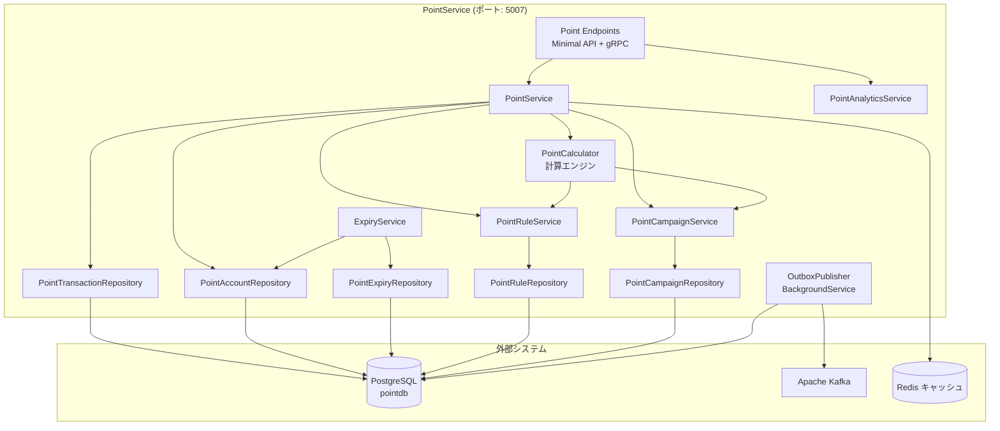
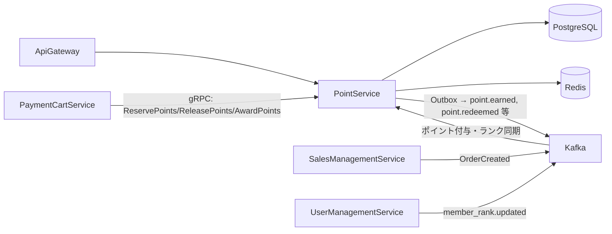
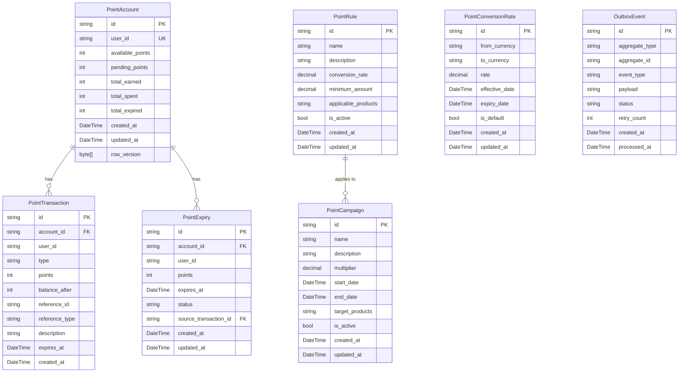
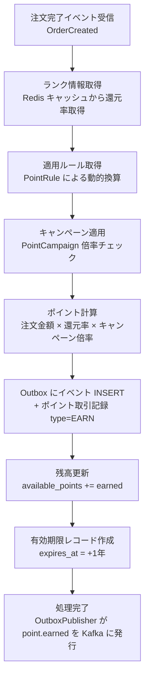
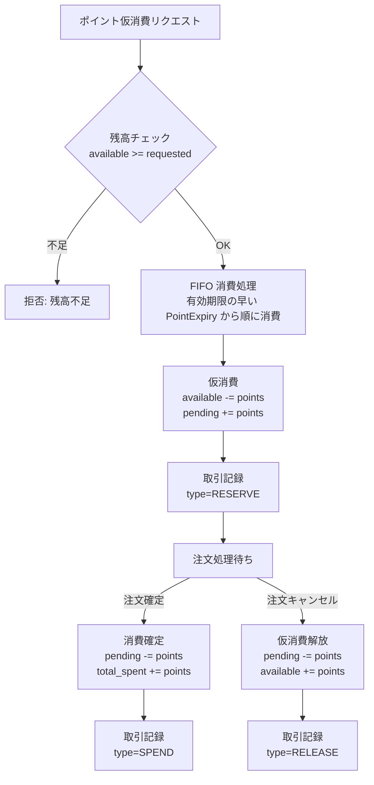

# ポイントサービス - 詳細設計書

## 1. 概要

PointService は SkiShop EC プラットフォームにおけるロイヤルティポイントシステムを管理するマイクロサービスである。ポイントの付与・消費・有効期限管理、ティアシステム（Bronze/Silver/Gold/Platinum）、ポイント取引履歴の管理を提供する。

### 1.1 目的

- 購入金額に応じたポイント付与・消費のライフサイクルを一元管理する
- ティアシステムによるロイヤルティプログラムを実現し、顧客のリピート購入を促進する
- ポイントの有効期限管理と自動失効処理を提供する
- ポイント取引の完全な監査証跡を確保する

### 1.2 スコープ

| 区分 | 内容 |
|------|------|
| **In Scope** | ポイント付与・消費・残高管理、ティアシステム（昇格/降格）、有効期限管理・失効バッチ処理、ポイント取引履歴、ポイント分析レポート |
| **Out of Scope** | 支払い処理（PaymentCartService の管轄）、クーポン管理（CouponService の管轄）、マーケティングキャンペーン（CouponService + 将来の NotificationService） |

## 2. 技術スタック

### 開発環境

- **言語**: C# 14 (.NET 10 LTS)
- **フレームワーク**: ASP.NET Core 10 (Minimal API)
- **ビルドツール**: dotnet CLI / MSBuild
- **コンテナ化**: Docker 25.x
- **テスト**: xUnit, NSubstitute, Shouldly, WebApplicationFactory, Testcontainers

### 本番環境

- Azure Container Apps
- Azure Database for PostgreSQL
- Apache Kafka (Azure Event Hubs for Kafka)
- Azure Cache for Redis

### 主要ライブラリ

| ライブラリ | バージョン | 用途 |
|---------|---------|---------|
| ASP.NET Core 10 | 10.* | REST API |
| Microsoft.EntityFrameworkCore | 10.* | EF Core データアクセス |
| Npgsql.EntityFrameworkCore.PostgreSQL | 10.* | PostgreSQL プロバイダ |
| Confluent.Kafka | 2.* | Kafka イベント発行・購読 |
| StackExchange.Redis | 2.* | キャッシュ |
| FluentValidation | 11.* | 入力バリデーション |
| Serilog.AspNetCore | 8.* | 構造化ログ |
| OpenTelemetry.Extensions.Hosting | 1.* | 分散トレーシング・メトリクス |
| Polly | 8.* | 耐障害性 |
| Microsoft.Extensions.Http.Resilience | 9.* | HTTP 耐障害性（リトライ・サーキットブレーカー） |

## 3. サービス情報

| 項目 | 値 |
|------|-------|
| サービス名 | PointService |
| ポート | 5007 |
| データベース | PostgreSQL (pointdb) — ADR-0006: Database per Service |
| フレームワーク | ASP.NET Core 10 (Minimal API) |
| 言語バージョン | C# 14 (.NET 10) |
| イベントブローカー | Apache Kafka |
| キャッシュ | Redis |

## 4. システムアーキテクチャ

### 4.1 コンポーネントアーキテクチャ



### 4.2 マイクロサービス関係図



## 5. データモデル

### 5.1 Entity Relationship Diagram



### 5.2 テーブル定義

#### tier_definitions テーブル

> **注記（C-04 / spec.md 責務分担）**: spec.md では会員ランク（MemberRank）は **UserManagementService** の管轄である。PointService はポイント還元率の計算に必要なランク情報を、UserManagementService が発行する `MemberRankUpdated` Kafka イベントで同期し、ローカルキャッシュ（Redis）に保持する。以下のテーブルはポイント還元率のローカル参照用であり、ランクの昇格/降格判定は UserManagementService が行う。

| カラム | データ型 | 制約 | 説明 |
|--------|-----------|------------|-------------|
| id | VARCHAR(36) | PK | ティア ID |
| name | VARCHAR(50) | NOT NULL, UNIQUE, CHECK (name IN ('BRONZE','SILVER','GOLD','PLATINUM')) | ティア名 |
| min_annual_purchase | DECIMAL(12,2) | NOT NULL | 昇格に必要な最低年間購入金額（税込） |
| point_rate | DECIMAL(5,4) | NOT NULL, CHECK (point_rate >= 0 AND point_rate <= 1) | ポイント還元率（小数表記） |
| benefits_json | JSONB | | ティア特典の JSON（送料無料、優先サポート等） |
| sort_order | INTEGER | NOT NULL | 表示順序 |
| created_at | TIMESTAMP WITH TIME ZONE | NOT NULL, DEFAULT CURRENT_TIMESTAMP | 作成日時 |
| updated_at | TIMESTAMP WITH TIME ZONE | NOT NULL, DEFAULT CURRENT_TIMESTAMP | 更新日時 |

**初期データ（spec.md §会員ランク制度準拠）**:

| ティア名 | 年間購入金額（税込） | ポイント還元率 | 主な特典 |
|---------|-------------------|-------------|---------|
| BRONZE | 0 円〜 | 1%（0.01） | 基本ポイント付与 |
| SILVER | 50,000 円〜 | 3%（0.03） | 送料無料ライン 8,000 円に引き下げ |
| GOLD | 100,000 円〜 | 5%（0.05） | 送料無料ライン 5,000 円に引き下げ、先行セールアクセス |
| PLATINUM | 300,000 円〜 | 7%（0.07） | 全品送料無料、誕生月 2 倍ポイント、プラチナ専用クーポン |

#### ~~user_tiers テーブル~~ → UserManagementService に移管

> **C-04 対応**: spec.md では `MemberRank` エンティティは **UserManagementService** に配置されており、PointService では管理しない。PointService は UserManagementService が発行する `member_rank.updated` Kafka イベントを購読し、ユーザーの現在のランク・還元率を Redis キャッシュに保持してポイント計算に使用する。

#### point_accounts テーブル

> **spec.md 準拠**: Aggregate Root は `PointAccount`。spec.md §DDD 戦術パターンに従い、ポイントアカウントを Aggregate Root とし、PointTransaction を子エンティティとして操作する。

| カラム | データ型 | 制約 | 説明 |
|--------|-----------|------------|-------------|
| id | VARCHAR(36) | PK | アカウント ID |
| user_id | VARCHAR(36) | UNIQUE, NOT NULL | ユーザー ID |
| available_points | INTEGER | NOT NULL, DEFAULT 0, CHECK (available_points >= 0) | 利用可能ポイント |
| pending_points | INTEGER | NOT NULL, DEFAULT 0 | 保留中ポイント（仮消費中） |
| total_earned | INTEGER | NOT NULL, DEFAULT 0 | 累計獲得ポイント |
| total_spent | INTEGER | NOT NULL, DEFAULT 0 | 累計消費ポイント |
| total_expired | INTEGER | NOT NULL, DEFAULT 0 | 累計失効ポイント |
| created_at | TIMESTAMP WITH TIME ZONE | NOT NULL, DEFAULT CURRENT_TIMESTAMP | 作成日時 |
| updated_at | TIMESTAMP WITH TIME ZONE | NOT NULL, DEFAULT CURRENT_TIMESTAMP | 更新日時 |
| row_version | BYTEA | | 楽観的ロックバージョン |

#### point_transactions テーブル

| カラム | データ型 | 制約 | 説明 |
|--------|-----------|------------|-------------|
| id | VARCHAR(36) | PK | 取引 ID |
| account_id | VARCHAR(36) | FK(point_accounts.id), NOT NULL | ポイントアカウント ID |
| user_id | VARCHAR(36) | NOT NULL | ユーザー ID |
| type | VARCHAR(20) | NOT NULL, CHECK (type IN ('EARN','REDEEM','EXPIRE','ADJUST','RESERVE','RELEASE','REFUND')) | 取引タイプ |
| points | INTEGER | NOT NULL, CHECK (points != 0) | ポイント数（付与は +、消費は -） |
| balance_after | INTEGER | NOT NULL | 取引後残高 |
| reference_id | VARCHAR(36) | | 参照 ID（注文 ID 等） |
| reference_type | VARCHAR(50) | | 参照タイプ（ORDER, REFUND, CAMPAIGN 等） |
| description | VARCHAR(500) | | 取引説明 |
| expires_at | TIMESTAMP WITH TIME ZONE | | ポイント有効期限（付与ポイントのみ） |
| created_at | TIMESTAMP WITH TIME ZONE | NOT NULL, DEFAULT CURRENT_TIMESTAMP | 取引日時 |

**インデックス**:
- `idx_point_tx_user_id` ON user_id
- `idx_point_tx_account_id` ON account_id
- `idx_point_tx_reference` ON (reference_id, reference_type)
- `idx_point_tx_created_at` ON created_at

#### point_expiries テーブル

| カラム | データ型 | 制約 | 説明 |
|--------|-----------|------------|-------------|
| id | VARCHAR(36) | PK | 失効管理 ID |
| account_id | VARCHAR(36) | NOT NULL, FK(point_accounts.id) ON DELETE CASCADE ON UPDATE CASCADE | ポイントアカウント ID（H-NEW-04 追加: ER 図・spec.md FK 制約準拠） |
| user_id | VARCHAR(36) | NOT NULL | ユーザー ID |
| points | INTEGER | NOT NULL, CHECK (points > 0) | 対象ポイント数 |
| expires_at | TIMESTAMP WITH TIME ZONE | NOT NULL | 有効期限 |
| status | VARCHAR(20) | NOT NULL, DEFAULT 'ACTIVE', CHECK (status IN ('ACTIVE','EXPIRED','CONSUMED')) | ステータス（ACTIVE: 有効 / EXPIRED: 失効済 / CONSUMED: FIFO 消費済） |
| source_transaction_id | VARCHAR(36) | FK(point_transactions.id) | 付与元取引 ID |
| created_at | TIMESTAMP WITH TIME ZONE | NOT NULL, DEFAULT CURRENT_TIMESTAMP | 作成日時 |
| updated_at | TIMESTAMP WITH TIME ZONE | NOT NULL, DEFAULT CURRENT_TIMESTAMP | 更新日時 |

**インデックス**:
- `idx_point_expiry_user_expires` ON (user_id, expires_at) WHERE status = 'ACTIVE'
- `idx_point_expiry_account_id` ON (account_id)

#### point_rules テーブル（C-05 追加: spec.md 準拠）

| カラム | データ型 | 制約 | 説明 |
|--------|-----------|------------|-------------|
| id | VARCHAR(36) | PK | ルール ID |
| name | VARCHAR(100) | NOT NULL, UNIQUE | ルール名 |
| description | VARCHAR(500) | | ルール説明 |
| conversion_rate | DECIMAL(5,4) | NOT NULL | ポイント換算レート |
| minimum_amount | DECIMAL(12,2) | NOT NULL, DEFAULT 0, CHECK (minimum_amount >= 0) | 最低適用金額 |
| applicable_products | JSONB | | 適用対象商品（カテゴリ/商品 ID リスト） |
| is_active | BOOLEAN | NOT NULL, DEFAULT TRUE | 有効フラグ |
| created_at | TIMESTAMP WITH TIME ZONE | NOT NULL, DEFAULT CURRENT_TIMESTAMP | 作成日時 |
| updated_at | TIMESTAMP WITH TIME ZONE | NOT NULL, DEFAULT CURRENT_TIMESTAMP | 更新日時 |

#### point_campaigns テーブル（C-05 追加: spec.md 準拠）

| カラム | データ型 | 制約 | 説明 |
|--------|-----------|------------|-------------|
| id | VARCHAR(36) | PK | キャンペーン ID |
| name | VARCHAR(100) | NOT NULL | キャンペーン名 |
| description | VARCHAR(500) | | キャンペーン説明 |
| multiplier | DECIMAL(5,2) | NOT NULL, CHECK (multiplier > 0) | ポイント倍率 |
| start_date | TIMESTAMP WITH TIME ZONE | NOT NULL | 開始日時 |
| end_date | TIMESTAMP WITH TIME ZONE | NOT NULL | 終了日時 |
| target_products | JSONB | | 対象商品（カテゴリ/商品 ID リスト） |
| is_active | BOOLEAN | NOT NULL, DEFAULT TRUE | 有効フラグ |
| created_at | TIMESTAMP WITH TIME ZONE | NOT NULL, DEFAULT CURRENT_TIMESTAMP | 作成日時 |
| updated_at | TIMESTAMP WITH TIME ZONE | NOT NULL, DEFAULT CURRENT_TIMESTAMP | 更新日時 |

**CHECK 制約**: `CHECK (end_date > start_date)`

**インデックス**:
- `idx_campaign_active_dates` ON (start_date, end_date) WHERE is_active = TRUE

#### point_conversion_rates テーブル（C-05 追加: spec.md 準拠）

| カラム | データ型 | 制約 | 説明 |
|--------|-----------|------------|-------------|
| id | VARCHAR(36) | PK | 換算レート ID |
| from_currency | VARCHAR(10) | NOT NULL | 変換元通貨 |
| to_currency | VARCHAR(10) | NOT NULL | 変換先通貨 |
| rate | DECIMAL(12,6) | NOT NULL, CHECK (rate > 0) | 換算レート |
| effective_date | TIMESTAMP WITH TIME ZONE | NOT NULL | 有効開始日時 |
| expiry_date | TIMESTAMP WITH TIME ZONE | | 有効終了日時 |
| is_default | BOOLEAN | NOT NULL, DEFAULT FALSE | デフォルトレート |
| created_at | TIMESTAMP WITH TIME ZONE | NOT NULL, DEFAULT CURRENT_TIMESTAMP | 作成日時 |
| updated_at | TIMESTAMP WITH TIME ZONE | NOT NULL, DEFAULT CURRENT_TIMESTAMP | 更新日時 |

#### outbox_events テーブル（C-06 追加: ADR-0005 準拠）

> **ADR-0005 Outbox パターン**: 全イベント発行は DB トランザクション内で `outbox_events` テーブルに INSERT し、`OutboxPublisher` BackgroundService が定期ポーリングで Kafka に発行する。これにより DB 書き込みとイベント発行の原子性を保証する。

| カラム | データ型 | 制約 | 説明 |
|--------|-----------|------------|-------------|
| id | VARCHAR(36) | PK | イベント ID |
| aggregate_type | VARCHAR(100) | NOT NULL | 集約タイプ（PointAccount, PointExpiry 等） |
| aggregate_id | VARCHAR(36) | NOT NULL | 集約 ID |
| event_type | VARCHAR(100) | NOT NULL | イベントタイプ（point.earned, point.redeemed 等） |
| payload | JSONB | NOT NULL | イベントペイロード（JSON） |
| status | VARCHAR(20) | NOT NULL, DEFAULT 'PENDING', CHECK (status IN ('PENDING','PUBLISHED','FAILED')) | 発行ステータス |
| retry_count | INTEGER | NOT NULL, DEFAULT 0, CHECK (retry_count >= 0) | リトライ回数 |
| created_at | TIMESTAMP WITH TIME ZONE | NOT NULL, DEFAULT CURRENT_TIMESTAMP | 作成日時 |
| processed_at | TIMESTAMP WITH TIME ZONE | | 発行完了日時 |

**インデックス**:
- `idx_outbox_pending` ON (status, created_at) WHERE status = 'PENDING'

## 6. API 設計

### 6.1 一般ユーザー向け API

| メソッド | パス | ロール | 説明 |
|--------|------|------|-------------|
| GET | /api/v1/points/balance | USER | 自分のポイント残高取得 |
| GET | /api/v1/points/history | USER | 自分のポイント取引履歴（ページネーション） |
| GET | /api/v1/points/tier | USER | 自分のティア情報と次ティアまでの進捗 |
| GET | /api/v1/points/expiring | USER | 今月失効予定のポイント一覧 |

### 6.2 管理者向け API

| メソッド | パス | ロール | 説明 |
|--------|------|------|-------------|
| GET | /api/v1/admin/points/users/{userId}/balance | ADMIN | 指定ユーザーの残高参照 |
| POST | /api/v1/admin/points/users/{userId}/adjust | ADMIN | 管理者によるポイント手動調整 |
| GET | /api/v1/admin/points/analytics | ADMIN | ポイント分析レポート |
| GET | /api/v1/admin/tiers | ADMIN | ティア定義一覧 |
| PUT | /api/v1/admin/tiers/{id} | ADMIN | ティア定義更新 |

### 6.3 内部 API（PaymentCartService 向け）

| メソッド | パス | 説明 |
|--------|------|-------------|
| GET | /api/v1/internal/points/users/{userId}/balance | ポイント残高取得 |
| POST | /api/v1/internal/points/reserve | ポイント仮消費（注文確定時） |
| POST | /api/v1/internal/points/confirm | ポイント消費確定 |
| POST | /api/v1/internal/points/release | ポイント仮消費解放（注文キャンセル時） |
| POST | /api/v1/internal/points/award | ポイント付与（注文完了時） |

> **注記**: 内部 API は外部からの参照用・ヘルスチェック用として残すが、Saga 連携は §6.5 の gRPC を使用する（C-02 対応）。

### 6.5 gRPC サービス定義（C-02 追加: Saga 連携用）

> **spec.md 準拠**: Saga ステップ 4（ポイント仮消費）・ステップ 7（ポイント確定付与）は **gRPC** で通信する（spec.md L1020-1041）。`SkiShop.Contracts/Protos/point.proto` に定義。

```protobuf
// SkiShop.Contracts/Protos/point.proto
syntax = "proto3";
package skishop.point.v1;

service PointService {
  // Saga ステップ 4: ポイント仮消費（注文確定時）
  rpc ReservePoints (ReservePointsRequest) returns (ReservePointsResponse);

  // Saga 補償: ポイント仮消費解放（注文キャンセル/失敗時）
  rpc ReleasePoints (ReleasePointsRequest) returns (ReleasePointsResponse);

  // Saga ステップ 7: ポイント確定付与（注文完了時）
  rpc AwardPoints (AwardPointsRequest) returns (AwardPointsResponse);

  // H-NEW-03 追加: ポイント消費確定（仮消費 → 確定消費に変更）
  rpc ConfirmPoints (ConfirmPointsRequest) returns (ConfirmPointsResponse);
}

message ReservePointsRequest {
  string user_id = 1;
  string order_id = 2;
  int32 points = 3;
  string idempotency_key = 4;
}

message ReservePointsResponse {
  bool success = 1;
  int32 remaining_balance = 2;
  string error_message = 3;
}

message ReleasePointsRequest {
  string user_id = 1;
  string order_id = 2;
  string idempotency_key = 3;
}

message ReleasePointsResponse {
  bool success = 1;
  int32 released_points = 2;
  string error_message = 3;
}

message AwardPointsRequest {
  string user_id = 1;
  string order_id = 2;
  int64 order_amount = 3; // 金額（円）
  string idempotency_key = 4;
}

message AwardPointsResponse {
  bool success = 1;
  int32 awarded_points = 2;
  int32 new_balance = 3;
  string error_message = 4;
}

// H-NEW-03 追加: ポイント消費確定メッセージ
message ConfirmPointsRequest {
  string user_id = 1;
  string order_id = 2;
  string idempotency_key = 3;
}

message ConfirmPointsResponse {
  bool success = 1;
  int32 confirmed_points = 2;
  int32 new_balance = 3;
  string error_message = 4;
}
```

**gRPC サーバー登録（Program.cs）**:

```csharp
// gRPC サービス登録
builder.Services.AddGrpc();

// エンドポイントマッピング（REST + gRPC 同一ポートで多重化）
// H-05 対応: gRPC エンドポイントに InternalServiceOnly 認証ポリシーを適用
app.MapGrpcService<PointGrpcService>()
    .RequireAuthorization("InternalServiceOnly");
app.MapPointEndpoints();
```

### 6.6 サービス間認証（H-08 対応）

> **gRPC / 内部 API の認証方式**: Saga 連携の gRPC 呼び出しおよび内部 REST API には **Client Credentials Grant + JWT** によるサービス間認証を適用する。

```csharp
// Program.cs — サービス間認証ポリシー
builder.Services.AddAuthorization(options =>
{
    options.AddPolicy("InternalServiceOnly", policy =>
        policy.RequireClaim("client_id")
              .RequireClaim("scope", "point:internal"));
});

// 内部 API に適用
group.RequireAuthorization("InternalServiceOnly");
```

- **gRPC**: `Grpc.AspNetCore` の `Interceptor` で JWT トークンを検証。`CallCredentials` で Client Credentials トークンを自動付与
- **mTLS**: 本番環境では追加で mTLS を適用（証明書は Azure Key Vault で管理）
- **トークンキャッシュ**: Client Credentials トークンは有効期限の 80% まで再利用し、不要な認証サーバー呼び出しを削減

### 6.4 リクエスト/レスポンス DTO

```csharp
// === リクエスト DTO ===
public record ReservePointsRequest(
    [Required] string UserId,
    [Required] string OrderId,
    [Required, Range(1, int.MaxValue)] int Points);

public record ConfirmPointsRequest(
    [Required] string UserId,
    [Required] string OrderId);

public record ReleasePointsRequest(
    [Required] string UserId,
    [Required] string OrderId);

public record AwardPointsRequest(
    [Required] string UserId,
    [Required] string OrderId,
    [Required, Range(0.01, double.MaxValue)] decimal OrderAmount);

public record AdjustPointsRequest(
    [Required, Range(1, int.MaxValue)] int Points,
    [Required] string Reason,
    string? ReferenceId = null);

// === レスポンス DTO ===
public record PointBalanceResponse(
    string UserId,
    int AvailablePoints,
    int PendingPoints,
    int TotalEarned,
    int TotalSpent,
    int TotalExpired);

public record PointTransactionResponse(
    string Id,
    string Type,
    int Points,
    int BalanceAfter,
    string? ReferenceId,
    string? ReferenceType,
    string? Description,
    DateTime? ExpiresAt,
    DateTime CreatedAt);

public record TierInfoResponse(
    string TierName,
    decimal EarnRateMultiplier,
    int TotalEarnedPoints,
    int CurrentYearPoints,
    string? NextTierName,
    int? PointsToNextTier,
    List<string> Benefits);

public record ExpiringPointsResponse(
    List<ExpiringPointItem> Items,
    int TotalExpiringPoints);

public record ExpiringPointItem(
    int Points,
    DateTime ExpiresAt,
    string SourceDescription);

public record PointAnalyticsResponse(
    long TotalPointsIssued,
    long TotalPointsRedeemed,
    long TotalPointsExpired,
    double RedemptionRate,
    Dictionary<string, long> PointsByTier,
    Dictionary<string, long> TierDistribution);
```

## 7. ポイントライフサイクル

### 7.1 ポイント付与フロー



### 7.2 ポイント消費フロー（注文確定時）



#### 7.2.1 FIFO ポイント消費ロジック（spec.md §H8-24 準拠）

> **spec.md 準拠**: spec.md §H8-24 では「期限延長なし（FIFO 消費）」と明記されている。ポイント消費（REDEEM / RESERVE）時は、有効期限の早い `PointExpiry` レコードから順に消費する **FIFO（先入先出）** 方式を適用する。

**処理フロー**:

1. `point_expiries` テーブルから `status = 'ACTIVE'` のレコードを `expires_at ASC` で取得
2. 有効期限の早いレコードから順に、要求ポイント数に達するまで消費
3. 完全に消費されたレコードは `status = 'CONSUMED'` に更新
4. 部分消費の場合は `points` を減算し `status = 'ACTIVE'` を維持

```csharp
/// <summary>
/// FIFO 方式でポイントを消費する。
/// 有効期限の早い PointExpiry レコードから順に CONSUMED に更新する。
/// </summary>
private async Task ConsumePointsFifoAsync(
    string accountId, int pointsToConsume, CancellationToken ct = default)
{
    var activeExpiries = await _context.PointExpiries
        .Where(e => e.AccountId == accountId && e.Status == "ACTIVE")
        .OrderBy(e => e.ExpiresAt)
        .ToListAsync(ct);

    var remaining = pointsToConsume;

    foreach (var expiry in activeExpiries)
    {
        if (remaining <= 0) break;

        if (expiry.Points <= remaining)
        {
            // 全量消費 → CONSUMED
            remaining -= expiry.Points;
            expiry.Status = "CONSUMED";
        }
        else
        {
            // 部分消費 → ポイント数を減算し ACTIVE 維持
            expiry.Points -= remaining;
            remaining = 0;
        }
    }

    if (remaining > 0)
    {
        logger.LogWarning(
            "FIFO 消費: PointExpiry の合計が不足。AccountId={AccountId}, 不足={Remaining}",
            accountId, remaining);
    }

    await _context.SaveChangesAsync(ct);
}
```

**FIFO 消費の適用タイミング**:

| 操作 | FIFO 適用 | 説明 |
|------|----------|------|
| ReservePoints（仮消費） | ✅ | 仮消費時に FIFO で PointExpiry を CONSUMED に更新 |
| ConfirmPoints（消費確定） | ❌ | 仮消費時に既に FIFO 処理済み |
| ReleasePoints（仮消費解放） | ✅（逆操作） | CONSUMED を ACTIVE に戻す（直近の消費を逆順で復元） |
| EXPIRE（失効バッチ） | ❌ | 有効期限切れは FIFO とは独立 |

### 7.3 ポイント有効期限管理

- ポイントの有効期限は付与日から **1 年間**
- 有効期限切れポイントは日次バッチ処理で自動失効
- 失効予定ポイントは失効 30 日前にユーザーに通知（MailSendService 連携、Phase 2 以降）

```csharp
/// <summary>
/// ポイント有効期限バッチ処理。
/// H-10: pg_try_advisory_lock による単一インスタンスロック。
/// H-14: バッチサイズ分割処理（ExpiryBatchSize 件ずつ独立トランザクション）。
/// </summary>
public class PointExpirationChecker(
    IServiceScopeFactory scopeFactory,
    TimeProvider timeProvider,
    ILogger<PointExpirationChecker> logger) : BackgroundService
{
    protected override async Task ExecuteAsync(CancellationToken stoppingToken)
    {
        while (!stoppingToken.IsCancellationRequested)
        {
            using var scope = scopeFactory.CreateScope();
            var context = scope.ServiceProvider.GetRequiredService<AppDbContext>();
            var config = scope.ServiceProvider
                .GetRequiredService<IOptions<PointSettings>>().Value;

            // H-10: pg_try_advisory_lock でインスタンス排他制御
            // H-NEW-05 修正: SqlQueryRaw<bool> でスカラー値を正しくキャプチャ
            var lockAcquired = await context.Database
                .SqlQueryRaw<bool>(
                    "SELECT pg_try_advisory_lock(hashtext('point_expiry'))")
                .FirstOrDefaultAsync(stoppingToken);
            if (!lockAcquired)
            {
                logger.LogInformation("他インスタンスが失効処理を実行中。スキップします。");
                await Task.Delay(TimeSpan.FromMinutes(5), stoppingToken);
                continue;
            }

            try
            {
                var totalProcessed = 0;
                bool hasMore;

                // H-14: バッチサイズで分割処理
                do
                {
                    await using var transaction = await context.Database
                        .BeginTransactionAsync(stoppingToken);

                    try
                    {
                        var expiredItems = await context.PointExpiries
                            .Include(e => e.Account) // H-07 対応: Eager Loading で N+1 クエリ防止
                            .Where(e => e.Status == "ACTIVE"
                                && e.ExpiresAt <= timeProvider.GetUtcNow())
                            .OrderBy(e => e.ExpiresAt)
                            .Take(config.ExpiryBatchSize)
                            .ToListAsync(stoppingToken);

                        hasMore = expiredItems.Count == config.ExpiryBatchSize;

                        foreach (var item in expiredItems)
                        {
                            // H-07 対応: Include で取得済みの Account を直接参照（個別クエリ不要）
                            var account = item.Account;
                            if (account is null) continue;

                            var actualExpired = Math.Min(
                                item.Points, account.AvailablePoints);
                            account.AvailablePoints -= actualExpired;
                            account.TotalExpired += actualExpired;
                            item.Status = "EXPIRED";

                            // Outbox にイベント INSERT
                            context.OutboxEvents.Add(new OutboxEvent
                            {
                                AggregateType = "PointExpiry",
                                AggregateId = item.Id,
                                EventType = "point.expired",
                                Payload = JsonSerializer.Serialize(
                                    new PointsExpiredEvent(
                                        item.UserId, actualExpired, 1,
                                        "", DateTime.UtcNow))
                            });
                        }

                        await context.SaveChangesAsync(stoppingToken);
                        await transaction.CommitAsync(stoppingToken);
                        totalProcessed += expiredItems.Count;
                    }
                    catch (Exception ex)
                    {
                        await transaction.RollbackAsync(stoppingToken);
                        logger.LogError(ex,
                            "失効バッチ処理エラー: {Message}", ex.Message);
                        hasMore = false;
                    }
                } while (hasMore);

                if (totalProcessed > 0)
                    logger.LogInformation(
                        "ポイント失効処理完了: {Count} 件", totalProcessed);
            }
            finally
            {
                // アドバイザリーロック解放（H-NEW-05 修正: SqlQueryRaw<bool> を使用）
                await context.Database
                    .SqlQueryRaw<bool>(
                        "SELECT pg_advisory_unlock(hashtext('point_expiry'))")
                    .FirstOrDefaultAsync(stoppingToken);
            }

            // 日次実行（TimeProvider 使用で定時実行に調整可能）
            await Task.Delay(TimeSpan.FromHours(24), stoppingToken);
        }
    }
}
```

## 8. ティアシステム（ランク連携）

> **C-04 対応: 責務分担の明確化**: spec.md に従い、会員ランク（MemberRank）の昇格/降格判定は **UserManagementService** が担当する。PointService はポイント付与時のランク還元率の参照のみを行い、UserManagementService が発行する `member_rank.updated` Kafka イベントを購読してローカルキャッシュに同期する。

### 8.1 ランク情報のローカル同期

```csharp
/// <summary>
/// UserManagementService から MemberRankUpdated イベントを購読し、
/// ポイント還元率をローカル Redis キャッシュに保持する。
/// </summary>
public class MemberRankEventConsumer(
    IConsumer<string, string> consumer,
    IServiceScopeFactory scopeFactory,
    IConnectionMultiplexer redis,
    ILogger<MemberRankEventConsumer> logger) : BackgroundService
{
    protected override async Task ExecuteAsync(CancellationToken stoppingToken)
    {
        consumer.Subscribe("member_rank.updated");
        while (!stoppingToken.IsCancellationRequested)
        {
            try
            {
                var result = consumer.Consume(stoppingToken);
                var @event = JsonSerializer.Deserialize<MemberRankUpdatedEvent>(
                    result.Message.Value);
                if (@event is not null)
                {
                    var db = redis.GetDatabase();
                    await db.StringSetAsync(
                        $"points:user_rank:{@event.UserId}",
                        JsonSerializer.Serialize(new UserRankCache(
                            @event.CurrentRank, @event.PointRate)),
                        TimeSpan.FromHours(24));

                    logger.LogInformation(
                        "ランク情報同期: UserId={UserId}, Rank={Rank}, Rate={Rate}",
                        @event.UserId, @event.CurrentRank, @event.PointRate);
                }
                consumer.Commit(result);
            }
            catch (ConsumeException ex)
            {
                logger.LogError(ex, "Kafka consume エラー: {Topic}", ex.ConsumerRecord?.Topic);
            }
            catch (Exception ex) when (ex is not OperationCanceledException)
            {
                logger.LogError(ex, "ランクイベント処理エラー: {Message}", ex.Message);
                await Task.Delay(TimeSpan.FromSeconds(5), stoppingToken);
            }
        }
    }
}

public record MemberRankUpdatedEvent(
    string UserId, string CurrentRank, decimal PointRate, DateTime OccurredAt);

public record UserRankCache(string Rank, decimal PointRate);
```

### 8.2 ティア降格ルール（spec.md §会員ランク制度準拠）

> **注記**: 以下のルールは UserManagementService の `MemberRankEvaluationService` が実行する。PointService はランク変更の通知を受けるのみ。

- **集計期間**: 毎年 **4 月 1 日**〜翌年 3 月 31 日の購入金額（返品分は減算）
- **昇格**: リアルタイム判定。購入確定時点で年間累計が閾値を超えたら即時昇格
- **降格**: 年次判定（**4 月 1 日**）。前年度の年間購入金額で再判定。降格時は **1 ランクのみ降格**
- **降格猶予**: 前年度がプラチナの場合、年間購入金額が **250,000 円以上（閾値の 83%）** であればプラチナ維持
- **最低ティア保証**: BRONZE 以下への降格は発生しない

### 8.3 ポイント計算（spec.md 還元率準拠）

```csharp
/// <summary>
/// ポイント計算エンジン。spec.md の還元率（1%/3%/5%/7%）に基づき、
/// 注文金額 × 還元率 × キャンペーン倍率でポイントを算出する。
/// DI 対応のインスタンスメソッドとして実装（PointRule・PointCampaign を参照）。
/// </summary>
public class PointCalculator(
    IPointRuleRepository ruleRepository,
    IPointCampaignRepository campaignRepository,
    ILogger<PointCalculator> logger) : IPointCalculator
{
    public async Task<int> CalculateEarnedPointsAsync(
        decimal orderAmount, decimal pointRate,
        string? productCategory = null,
        CancellationToken ct = default)
    {
        // 1. 基本ポイント = 注文金額 × 還元率（切り捨て）
        var basePoints = (int)Math.Floor(orderAmount * pointRate);

        // 2. アクティブなルールを適用
        var rules = await ruleRepository.FindActiveRulesAsync(ct);
        foreach (var rule in rules.Where(r => orderAmount >= r.MinimumAmount))
        {
            basePoints = (int)Math.Floor(basePoints * (1 + rule.ConversionRate));
        }

        // 3. アクティブなキャンペーン倍率を適用
        var campaigns = await campaignRepository
            .FindActiveCampaignsAsync(DateTime.UtcNow, ct);
        var maxMultiplier = campaigns
            .Where(c => IsApplicable(c, productCategory))
            .Select(c => c.Multiplier)
            .DefaultIfEmpty(1.0m)
            .Max();

        var finalPoints = (int)Math.Floor(basePoints * maxMultiplier);

        logger.LogInformation(
            "ポイント計算: OrderAmount={OrderAmount}, Rate={Rate}, " +
            "Base={BasePoints}, Campaign={Multiplier}, Final={FinalPoints}",
            orderAmount, pointRate, basePoints, maxMultiplier, finalPoints);

        return finalPoints;
    }

    private static bool IsApplicable(PointCampaign campaign, string? category)
        => campaign.TargetProducts is null || category is null
           || campaign.TargetProducts.Contains(category);
}
```

**計算例（spec.md §会員ランク制度準拠）**:

| 注文金額 | ランク | 還元率 | 付与ポイント |
|---------|-------|-------|-----------|
| ¥10,000 | BRONZE | 1% | 100 |
| ¥10,000 | SILVER | 3% | 300 |
| ¥10,000 | GOLD | 5% | 500 |
| ¥10,000 | PLATINUM | 7% | 700 |

## 9. イベント設計

> **ADR-0005 準拠**: 全イベント発行は Outbox パターンを使用する。ビジネスロジック内で `outbox_events` テーブルに INSERT し、`OutboxPublisher` BackgroundService が定期ポーリングで Kafka に発行することで、DB トランザクションとイベント発行の原子性を保証する。

### 9.1 発行するイベント

| Kafka トピック名 | イベント record 名 | トリガー | ペイロード |
|-----------------|------------------|---------|----------|
| `point.earned` | `PointsEarnedEvent` | ポイント付与完了 | { userId, points, orderId, newBalance, correlationId } |
| `point.redeemed` | `PointsRedeemedEvent` | ポイント消費確定 | { userId, points, orderId, newBalance, correlationId } |
| `point.reserved` | `PointsReservedEvent` | ポイント仮消費 | { userId, points, orderId, correlationId } |
| `point.released` | `PointsReleasedEvent` | ポイント仮消費解放 | { userId, points, orderId, correlationId } |
| `point.expired` | `PointsExpiredEvent` | ポイント失効 | { userId, points, expiredCount, correlationId } |

> **H-06 対応**: トピック名は spec.md の命名規則（小文字ドット区切り）に準拠。上記の対応表でイベント record との関係を明確化。`point.reserved`, `point.released` は Saga 対応で追加が必要なトピック（spec.md への追加を提案）。

### 9.2 購読するイベント

| Kafka トピック名 | 発行元 | 処理内容 |
|-----------------|-------|---------|
| `order.created` | SalesManagementService | 注文情報のログ記録・分析用データ蓄積（※ポイント付与は Saga ステップ 7 の `gRPC: AwardPoints` が唯一の正規パス。Kafka イベントではポイント付与を行わない） |
| `order.cancelled` | SalesManagementService | ポイント返却（消費ポイントの返却） |
| `user.registered` | AuthService | 初期ポイントアカウント（PointAccount）の作成 |
| `user.deleted` | UserManagementService | ポイントアカウント無効化・残高処理（H-05 追加） |
| `payment.refunded` | PaymentCartService | 返金時のポイント返却処理（H-05 追加） |
| `member_rank.updated` | UserManagementService | ユーザーランク情報の Redis キャッシュ同期（M-13 追加） |

### 9.3 イベントペイロード定義

```csharp
// H-12 対応: 全イベントに CorrelationId を含める
public record PointsEarnedEvent(
    string UserId, int Points, string OrderId,
    int NewBalance, string CorrelationId, DateTime OccurredAt);

public record PointsRedeemedEvent(
    string UserId, int Points, string OrderId,
    int NewBalance, string CorrelationId, DateTime OccurredAt);

public record PointsReservedEvent(
    string UserId, int Points, string OrderId,
    string CorrelationId, DateTime OccurredAt);

public record PointsReleasedEvent(
    string UserId, int Points, string OrderId,
    string CorrelationId, DateTime OccurredAt);

public record PointsExpiredEvent(
    string UserId, int Points, int ExpiredCount,
    string CorrelationId, DateTime OccurredAt);
```

### 9.4 Outbox パターン実装（C-06 追加）

```csharp
/// <summary>
/// Outbox テーブルをポーリングし、未発行イベントを Kafka に発行する BackgroundService。
/// 動的バックオフ（100ms〜5s）を適用（AGENTS.md §10.4 準拠）。
/// H-NEW-02 対応: pg_try_advisory_lock によるインスタンス排他制御（spec.md L988-999 準拠）。
/// </summary>
public class OutboxPublisher(
    IServiceScopeFactory scopeFactory,
    IProducer<string, string> producer,
    ILogger<OutboxPublisher> logger) : BackgroundService
{
    private static readonly TimeSpan MinDelay = TimeSpan.FromMilliseconds(100);
    private static readonly TimeSpan MaxDelay = TimeSpan.FromSeconds(5);

    protected override async Task ExecuteAsync(CancellationToken stoppingToken)
    {
        var currentDelay = MinDelay;

        while (!stoppingToken.IsCancellationRequested)
        {
            using var scope = scopeFactory.CreateScope();
            var context = scope.ServiceProvider.GetRequiredService<AppDbContext>();

            // H-NEW-02: pg_try_advisory_lock でインスタンス排他制御（spec.md BackgroundService リーダー選出パターン準拠）
            var lockAcquired = await context.Database
                .SqlQueryRaw<bool>(
                    "SELECT pg_try_advisory_lock(hashtext('outbox_publisher'))")
                .FirstOrDefaultAsync(stoppingToken);
            if (!lockAcquired)
            {
                logger.LogInformation("他インスタンスが Outbox 発行を実行中。スキップします。");
                await Task.Delay(TimeSpan.FromSeconds(10), stoppingToken);
                continue;
            }

            try
            {
                var pendingEvents = await context.OutboxEvents
                    .Where(e => e.Status == "PENDING")
                    .OrderBy(e => e.CreatedAt)
                    .Take(100)
                    .ToListAsync(stoppingToken);

                if (pendingEvents.Count == 0)
                {
                    currentDelay = TimeSpan.Min(
                        TimeSpan.FromTicks(currentDelay.Ticks * 2), MaxDelay);
                    await Task.Delay(currentDelay, stoppingToken);
                    continue;
                }

                currentDelay = MinDelay; // イベントがあればリセット

                foreach (var outboxEvent in pendingEvents)
                {
                    try
                    {
                        await producer.ProduceAsync(
                            outboxEvent.EventType,
                            new Message<string, string>
                            {
                                Key = outboxEvent.AggregateId,
                                Value = outboxEvent.Payload
                            },
                            stoppingToken);

                        outboxEvent.Status = "PUBLISHED";
                        outboxEvent.ProcessedAt = DateTime.UtcNow;
                    }
                    catch (ProduceException<string, string> ex)
                    {
                        outboxEvent.RetryCount++;
                        if (outboxEvent.RetryCount >= 5)
                            outboxEvent.Status = "FAILED";

                        logger.LogError(ex,
                            "Outbox イベント発行失敗: EventId={EventId}, RetryCount={RetryCount}",
                            outboxEvent.Id, outboxEvent.RetryCount);
                    }
                }

                await context.SaveChangesAsync(stoppingToken);
            }
            finally
            {
                // アドバイザリーロック解放
                await context.Database
                    .SqlQueryRaw<bool>(
                        "SELECT pg_advisory_unlock(hashtext('outbox_publisher'))")
                    .FirstOrDefaultAsync(stoppingToken);
            }
        }
    }
}
```

## 10. キャッシュ戦略

### 10.1 Redis キャッシュ設計

| キー | 値 | TTL | 用途 |
|-----|-----|-----|------|
| `points:balance:{userId}` | PointAccount JSON | 5 分 | 残高の高速読み取り |
| `points:user_rank:{userId}` | UserRankCache JSON (Rank, PointRate) | 24 時間 | ユーザーランク・還元率キャッシュ（MemberRankUpdated イベントで同期） |
| `tier:definitions` | 全ティア定義 JSON | 1 時間 | ティア定義マスター |

### 10.2 キャッシュ無効化

- ポイント残高変動時: `points:balance:{userId}` を削除
- ランク変更イベント受信時: `points:user_rank:{userId}` を更新（MemberRankEventConsumer）
- ティア定義更新時: `tier:definitions` を削除

## 11. エラーコード

| コード | HTTP ステータス | 説明 |
|--------|-------------|-------------|
| PNT-4001 | 404 | ユーザーが見つからない |
| PNT-4002 | 422 | ポイント残高不足 |
| PNT-4003 | 422 | 無効なポイント数（0 以下） |
| PNT-4004 | 422 | 仮消費済みの注文 ID で重複リクエスト |
| PNT-4005 | 409 | 楽観的ロック競合（残高同時更新） |
| PNT-4006 | 422 | 仮消費が存在しない（確定/解放時） |
| PNT-5001 | 500 | データベースエラー |
| PNT-5002 | 503 | Redis 接続エラー |
| PNT-5003 | 503 | Kafka 接続エラー |

## 12. セキュリティ設計

### 12.1 認証・認可

- 一般ユーザー API: `RequireAuthorization()` — 認証済みユーザー（自分のポイントのみ参照可能）
- 管理者 API: `RequireAuthorization("AdminOnly")` — Admin ロールのみ
- 内部 API: サービス間認証

### 12.2 IDOR 防止

ポイント残高・履歴の参照時に、ログインユーザーの ID とリクエストの userId を照合:

```csharp
group.MapGet("/balance", async (
    ClaimsPrincipal user,
    IPointService pointService,
    CancellationToken ct) =>
{
    var userId = user.FindFirstValue(ClaimTypes.NameIdentifier)
        ?? throw new UnauthorizedException();
    return Results.Ok(await pointService.GetBalanceAsync(userId, ct));
}).RequireAuthorization();
```

### 12.3 不正防止

- ポイント付与は内部 API 経由のみ（一般ユーザーが直接付与不可）
- 管理者のポイント手動調整は監査ログに記録
- 楽観的ロック（`RowVersion`）でポイント残高の同時更新競合を防止

## 13. プロジェクト構成

```
PointService/
├── PointService.csproj
├── Program.cs
├── Endpoints/
│   ├── PointEndpoints.cs
│   ├── TierEndpoints.cs
│   └── InternalPointEndpoints.cs
├── GrpcServices/
│   └── PointGrpcService.cs               # C-02: gRPC Saga 連携
├── Services/
│   ├── Interfaces/
│   │   ├── IPointService.cs
│   │   ├── IPointRuleService.cs           # C-05: ルールサービス
│   │   ├── IPointCampaignService.cs       # C-05: キャンペーンサービス
│   │   ├── IPointCalculator.cs            # DI 対応計算エンジン
│   │   ├── IExpiryService.cs
│   │   ├── IPointAnalyticsService.cs
│   │   └── IPointCacheService.cs
│   ├── PointService.cs
│   ├── PointRuleService.cs                # C-05
│   ├── PointCampaignService.cs            # C-05
│   ├── PointCalculator.cs
│   ├── ExpiryService.cs
│   ├── PointAnalyticsService.cs
│   └── PointCacheService.cs
├── Consumers/
│   ├── OrderEventConsumer.cs
│   ├── MemberRankEventConsumer.cs         # C-04: ランク同期
│   ├── UserDeletedEventConsumer.cs        # H-05
│   └── PaymentRefundedEventConsumer.cs    # H-05
├── BackgroundServices/
│   ├── PointExpirationChecker.cs
│   └── OutboxPublisher.cs                 # C-06: Outbox パターン
├── Models/
│   ├── TierDefinition.cs
│   ├── PointAccount.cs                    # C-01: Aggregate Root
│   ├── PointTransaction.cs
│   ├── PointExpiry.cs
│   ├── PointRule.cs                       # C-05
│   ├── PointCampaign.cs                   # C-05
│   ├── PointConversionRate.cs             # C-05
│   └── OutboxEvent.cs                     # C-06
├── DTOs/
│   ├── Requests/
│   │   ├── ReservePointsRequest.cs
│   │   ├── ConfirmPointsRequest.cs
│   │   ├── ReleasePointsRequest.cs
│   │   ├── AwardPointsRequest.cs
│   │   └── AdjustPointsRequest.cs
│   └── Responses/
│       ├── PointBalanceResponse.cs
│       ├── PointTransactionResponse.cs
│       ├── TierInfoResponse.cs
│       ├── ExpiringPointsResponse.cs
│       └── PointAnalyticsResponse.cs
├── Repositories/
│   ├── Interfaces/
│   │   ├── IPointAccountRepository.cs     # C-01: Aggregate Root 単位
│   │   ├── IPointTransactionRepository.cs
│   │   ├── ITierDefinitionRepository.cs
│   │   ├── IPointExpiryRepository.cs
│   │   ├── IPointRuleRepository.cs        # C-05
│   │   └── IPointCampaignRepository.cs    # C-05
│   ├── PointAccountRepository.cs          # C-01
│   ├── PointTransactionRepository.cs
│   ├── TierDefinitionRepository.cs
│   ├── PointExpiryRepository.cs
│   ├── PointRuleRepository.cs             # C-05
│   └── PointCampaignRepository.cs         # C-05
├── Infrastructure/
│   └── Persistence/
│       └── AppDbContext.cs
├── Configurations/
│   └── PointSettings.cs
├── Migrations/
├── appsettings.json
├── appsettings.Development.json
└── appsettings.Production.json
```

## 14. 監視・メトリクス

### 14.1 メトリクス

| メトリクス名 | タイプ | 説明 |
|------------|------|-------------|
| `points.awarded.total` | Counter | 付与ポイント総数 |
| `points.spent.total` | Counter | 消費ポイント総数 |
| `points.expired.total` | Counter | 失効ポイント総数 |
| `points.balance.average` | Gauge | 平均ポイント残高 |
| `tier.upgrade.total` | Counter | ティア昇格回数 |
| `tier.downgrade.total` | Counter | ティア降格回数 |
| `tier.distribution` | Gauge | ティア別ユーザー数 |

### 14.2 ヘルスチェック

```csharp
builder.Services.AddHealthChecks()
    .AddNpgSql(connectionString, name: "postgresql", tags: ["ready"])
    .AddRedis(redisConnectionString, name: "redis", tags: ["ready"]);

app.MapHealthChecks("/health", new HealthCheckOptions
{
    Predicate = _ => false
});
app.MapHealthChecks("/health/ready", new HealthCheckOptions
{
    Predicate = check => check.Tags.Contains("ready")
});
```

### 14.3 アラート条件

| 条件 | 重要度 | 対応 |
|------|--------|------|
| ポイント付与失敗率 > 5% | CRITICAL | イベント処理パイプライン確認 |
| 残高マイナス検出 | CRITICAL | 即時調査（整合性エラー） |
| 楽観的ロック競合 > 50 件/分 | WARNING | 同時アクセスパターン分析 |
| 失効バッチ処理時間 > 30 分 | WARNING | インデックス・クエリ最適化 |

## 15. テスト戦略

> **AGENTS.md 準拠**: 分岐カバレッジ 80% 以上を必須とする。

### 15.1 単体テスト

```csharp
public class PointServiceTest
{
    private readonly IPointAccountRepository _accountRepo = Substitute.For<IPointAccountRepository>();
    private readonly IPointTransactionRepository _txRepo = Substitute.For<IPointTransactionRepository>();
    private readonly IPointCalculator _calculator = Substitute.For<IPointCalculator>();
    private readonly ILogger<Services.PointService> _logger = Substitute.For<ILogger<Services.PointService>>();
    private readonly Services.PointService _sut;

    public PointServiceTest()
    {
        _sut = new Services.PointService(
            _accountRepo,
            _txRepo,
            _calculator,
            _logger);
    }

    [Fact]
    public async Task Should_ReservePoints_When_SufficientBalance()
    {
        // Arrange
        var account = new PointAccount
        {
            UserId = "user-1",
            AvailablePoints = 1000,
            PendingPoints = 0
        };
        _accountRepo.FindByUserIdAsync("user-1", default)
            .Returns(account);

        var request = new ReservePointsRequest("user-1", "order-1", 500);

        // Act
        await _sut.ReservePointsAsync(request);

        // Assert
        account.AvailablePoints.ShouldBe(500);
        account.PendingPoints.ShouldBe(500);
    }

    [Fact]
    public async Task Should_ThrowBusinessException_When_InsufficientBalance()
    {
        // Arrange
        var account = new PointAccount
        {
            UserId = "user-1",
            AvailablePoints = 100,
            PendingPoints = 0
        };
        _accountRepo.FindByUserIdAsync("user-1", default)
            .Returns(account);

        var request = new ReservePointsRequest("user-1", "order-1", 500);

        // Act & Assert
        var ex = await Should.ThrowAsync<BusinessException>(
            () => _sut.ReservePointsAsync(request));
        ex.Message.ShouldContain("残高不足");
    }

    [Fact]
    public async Task Should_ReturnIdempotentResult_When_DuplicateReserve()
    {
        // Arrange: 既にRESERVE済み
        // Act & Assert: 同一 orderId で再リクエスト → 前回結果を返却
    }
}

// H-13 追加: PointCalculator テスト
public class PointCalculatorTest
{
    private readonly IPointRuleRepository _ruleRepo = Substitute.For<IPointRuleRepository>();
    private readonly IPointCampaignRepository _campaignRepo = Substitute.For<IPointCampaignRepository>();
    private readonly ILogger<PointCalculator> _logger = Substitute.For<ILogger<PointCalculator>>();
    private readonly PointCalculator _sut;

    public PointCalculatorTest()
    {
        _sut = new PointCalculator(_ruleRepo, _campaignRepo, _logger);
    }

    [Theory]
    [InlineData(10000, 0.01, 100)]   // BRONZE 1%
    [InlineData(10000, 0.03, 300)]   // SILVER 3%
    [InlineData(10000, 0.05, 500)]   // GOLD 5%
    [InlineData(10000, 0.07, 700)]   // PLATINUM 7%
    public async Task Should_CalculateCorrectPoints_When_DifferentRanks(
        decimal orderAmount, decimal pointRate, int expectedPoints)
    {
        // Arrange
        _ruleRepo.FindActiveRulesAsync(default).Returns([]);
        _campaignRepo.FindActiveCampaignsAsync(Arg.Any<DateTime>(), default).Returns([]);

        // Act
        var result = await _sut.CalculateEarnedPointsAsync(orderAmount, pointRate);

        // Assert
        result.ShouldBe(expectedPoints);
    }

    [Fact]
    public async Task Should_ApplyCampaignMultiplier_When_ActiveCampaignExists()
    {
        // Arrange: 2倍キャンペーン適用
        // Act & Assert: basePoints × 2
    }

    [Fact]
    public async Task Should_FloorPoints_When_FractionalResult()
    {
        // Arrange: 端数が出る計算
        // Act & Assert: 切り捨て確認
    }
}

// H-13 追加: ExpiryService テスト
public class PointExpirationCheckerTest
{
    [Fact]
    public async Task Should_ExpirePoints_When_PastExpiryDate()
    {
        // Testcontainers.PostgreSql で実 DB テスト
    }

    [Fact]
    public async Task Should_ProcessInBatches_When_LargeExpiryCount()
    {
        // バッチサイズ分割処理の検証
    }

    [Fact]
    public async Task Should_NotExpireMoreThanAvailable_When_PartialExpiry()
    {
        // 部分失効（actualExpired = Min(item.Points, available)）
    }
}

// H-13 追加: Saga 冪等性テスト
public class SagaIdempotencyTest
{
    [Fact]
    public async Task Should_ReturnSameResult_When_DuplicateReserveRequest()
    {
        // 同一 orderId の RESERVE 重複
    }

    [Fact]
    public async Task Should_ReturnSameResult_When_DuplicateReleaseRequest()
    {
        // 同一 orderId の RELEASE 重複
    }

    [Fact]
    public async Task Should_ReturnSameResult_When_DuplicateAwardRequest()
    {
        // 同一 orderId の EARN 重複
    }
}

// H-13 追加: 楽観的ロック競合テスト
public class ConcurrencyTest
{
    [Fact]
    public async Task Should_ThrowConcurrencyException_When_SimultaneousUpdate()
    {
        // DbUpdateConcurrencyException ハンドリング
    }
}
```

### 15.2 統合テスト

> **Testcontainers.PostgreSql 使用**: DB スライステストでは実 PostgreSQL コンテナを使用する（AGENTS.md §9.1 準拠）。

```csharp
public class PointEndpointsIntegrationTest
    : IClassFixture<WebApplicationFactory<Program>>, IAsyncLifetime
{
    private readonly HttpClient _client;
    private readonly PostgreSqlContainer _postgres = new PostgreSqlBuilder()
        .WithImage("postgres:16-alpine")
        .Build();

    public PointEndpointsIntegrationTest(
        WebApplicationFactory<Program> factory)
    {
        _client = factory.WithWebHostBuilder(builder =>
        {
            builder.UseEnvironment("Testing");
            builder.ConfigureServices(services =>
            {
                // Testcontainers の接続文字列を差し替え
                services.RemoveAll<DbContextOptions<AppDbContext>>();
                services.AddDbContext<AppDbContext>(options =>
                    options.UseNpgsql(_postgres.GetConnectionString()));
            });
        }).CreateClient();
    }

    public async Task InitializeAsync()
    {
        await _postgres.StartAsync();
    }

    public async Task DisposeAsync()
    {
        await _postgres.DisposeAsync();
    }

    [Fact]
    public async Task Should_ReturnBalance_When_AuthenticatedUser()
    {
        // Arrange
        _client.DefaultRequestHeaders.Authorization =
            new AuthenticationHeaderValue("Bearer",
                TestJwtHelper.GenerateUserToken("user-1"));

        // Act
        var response = await _client.GetAsync("/api/v1/points/balance");

        // Assert
        response.StatusCode.ShouldBe(HttpStatusCode.OK);
        var balance = await response.Content
            .ReadFromJsonAsync<PointBalanceResponse>();
        balance.ShouldNotBeNull();
    }

    [Fact]
    public async Task Should_Return401_When_Unauthenticated()
    {
        var response = await _client.GetAsync("/api/v1/points/balance");
        response.StatusCode.ShouldBe(HttpStatusCode.Unauthorized);
    }
}

### 15.3 統合テスト拡充（H-06 対応）

> **AGENTS.md §9.4 カバレッジ 80% 目標対応**: gRPC Saga 連携、Outbox パターン E2E、失効バッチ処理、MemberRankEventConsumer の統合テストを追加する。

#### 15.3.1 gRPC Saga 連携テスト

```csharp
/// <summary>
/// gRPC Saga 連携の統合テスト。
/// ReservePoints → ConfirmPoints / ReleasePoints のフローを検証する。
/// </summary>
public class PointGrpcIntegrationTest : IAsyncLifetime
{
    private readonly PostgreSqlContainer _postgres = new PostgreSqlBuilder()
        .WithImage("postgres:16-alpine")
        .Build();

    public async Task InitializeAsync() => await _postgres.StartAsync();
    public async Task DisposeAsync() => await _postgres.DisposeAsync();

    [Fact]
    public async Task Should_ReserveAndConfirmPoints_When_SagaSucceeds()
    {
        // Arrange: gRPC サーバーを起動し、PointAccount を初期化
        // Act: ReservePoints → ConfirmPoints の順番で gRPC 呼び出し
        // Assert: available_points が仮消費分減少、pending_points が 0、
        //         total_spent が消費分増加、取引記録 RESERVE + SPEND が存在
    }

    [Fact]
    public async Task Should_ReserveAndReleasePoints_When_SagaFails()
    {
        // Arrange: gRPC サーバーを起動し、PointAccount を初期化
        // Act: ReservePoints → ReleasePoints の順番で gRPC 呼び出し
        // Assert: available_points が元に戻る、pending_points が 0、
        //         取引記録 RESERVE + RELEASE が存在
    }

    [Fact]
    public async Task Should_AwardPoints_When_OrderCompleted()
    {
        // Arrange: gRPC サーバーを起動、PointAccount + ランクキャッシュを初期化
        // Act: AwardPoints を gRPC 経由で呼び出し
        // Assert: available_points が付与分増加、取引記録 EARN が存在、
        //         PointExpiry レコードが作成される
    }

    [Fact]
    public async Task Should_ReturnIdempotent_When_DuplicateGrpcReserve()
    {
        // Arrange: 1 回目の ReservePoints を実行済み
        // Act: 同一 order_id で 2 回目の ReservePoints を gRPC 呼び出し
        // Assert: 残高が変わらない、取引記録が 1 件のみ
    }
}
```

#### 15.3.2 Outbox Publisher 統合テスト

```csharp
/// <summary>
/// Outbox パターンの E2E テスト。
/// DB INSERT → OutboxPublisher → Kafka 発行のフローを検証する。
/// </summary>
public class OutboxPublisherIntegrationTest : IAsyncLifetime
{
    private readonly PostgreSqlContainer _postgres = new PostgreSqlBuilder()
        .WithImage("postgres:16-alpine")
        .Build();

    public async Task InitializeAsync() => await _postgres.StartAsync();
    public async Task DisposeAsync() => await _postgres.DisposeAsync();

    [Fact]
    public async Task Should_PublishEvent_When_OutboxEventInserted()
    {
        // Arrange: outbox_events に PENDING レコードを INSERT
        // Act: OutboxPublisher を実行
        // Assert: レコードの status が PUBLISHED に更新、
        //         Kafka Producer の ProduceAsync が呼ばれる
    }

    [Fact]
    public async Task Should_MarkFailed_When_KafkaProduceException()
    {
        // Arrange: Kafka Producer が ProduceException をスロー
        // Act: OutboxPublisher を実行（retry_count が 5 に達するまで）
        // Assert: レコードの status が FAILED に更新
    }

    [Fact]
    public async Task Should_ApplyDynamicBackoff_When_NoEvents()
    {
        // Arrange: outbox_events が空
        // Act: OutboxPublisher のポーリング間隔を観測
        // Assert: 100ms → 200ms → 400ms ... → 5s（上限）で増加
    }
}
```

#### 15.3.3 PointExpirationChecker バッチ処理テスト

```csharp
/// <summary>
/// ポイント失効バッチ処理の統合テスト（Testcontainers.PostgreSql 使用）。
/// </summary>
public class PointExpirationCheckerIntegrationTest : IAsyncLifetime
{
    private readonly PostgreSqlContainer _postgres = new PostgreSqlBuilder()
        .WithImage("postgres:16-alpine")
        .Build();

    public async Task InitializeAsync() => await _postgres.StartAsync();
    public async Task DisposeAsync() => await _postgres.DisposeAsync();

    [Fact]
    public async Task Should_ExpireAndUpdateBalance_When_ExpiryDatePassed()
    {
        // Arrange: 有効期限切れの PointExpiry レコード + PointAccount を作成
        // Act: PointExpirationChecker を実行
        // Assert: PointExpiry.Status が EXPIRED、
        //         PointAccount.AvailablePoints が減少、
        //         PointAccount.TotalExpired が増加、
        //         outbox_events に point.expired イベントが INSERT
    }

    [Fact]
    public async Task Should_ProcessInBatches_When_LargeExpiryCount()
    {
        // Arrange: ExpiryBatchSize を超える失効レコードを作成
        // Act: PointExpirationChecker を実行
        // Assert: 複数バッチで処理され、全件が EXPIRED に更新
    }

    [Fact]
    public async Task Should_SkipExecution_When_AdvisoryLockHeld()
    {
        // Arrange: pg_try_advisory_lock を先行取得
        // Act: PointExpirationChecker を実行
        // Assert: 処理がスキップされ、ログに「他インスタンスが実行中」が出力
    }
}
```

#### 15.3.4 MemberRankEventConsumer 統合テスト

```csharp
/// <summary>
/// MemberRankEventConsumer の Redis 更新テスト。
/// </summary>
public class MemberRankEventConsumerTest
{
    [Fact]
    public async Task Should_UpdateRedisCache_When_RankUpdatedEventReceived()
    {
        // Arrange: Kafka Consumer から MemberRankUpdatedEvent を受信（モック）
        // Act: MemberRankEventConsumer がイベントを処理
        // Assert: Redis の points:user_rank:{userId} が更新され、
        //         Rank と PointRate が正しく保存される
    }

    [Fact]
    public async Task Should_ContinueProcessing_When_ConsumeExceptionOccurs()
    {
        // Arrange: Kafka Consumer が ConsumeException をスロー
        // Act: MemberRankEventConsumer がエラーをハンドリング
        // Assert: ログにエラーが出力され、次のメッセージ処理に継続
    }
}
```
```

## 16. 設定ファイル

### appsettings.json

```json
{
  "AllowedHosts": "*",
  "Kestrel": {
    "AddServerHeader": false
  },
  "Logging": {
    "LogLevel": {
      "Default": "Warning",
      "Microsoft.AspNetCore": "Warning",
      "SkiShop": "Information"
    }
  },
  "DetailedErrors": false,
  "Kafka": {
    "BootstrapServers": "localhost:9092",
    "GroupId": "point-service"
  },
  "Points": {
    "BaseRate": 1,
    "BaseUnit": 100,
    "ExpirationMonths": 12,
    "ExpiryBatchSize": 1000,
    "ExpiryCheckIntervalHours": 24
  }
}
```

## 17. Dockerfile

```dockerfile
FROM mcr.microsoft.com/dotnet/sdk:10.0 AS build
WORKDIR /src
COPY ["PointService/PointService.csproj", "PointService/"]
RUN dotnet restore "PointService/PointService.csproj"
COPY . .
WORKDIR "/src/PointService"
RUN dotnet publish "PointService.csproj" -c Release -o /app/publish --no-restore

FROM mcr.microsoft.com/dotnet/aspnet:10.0 AS runtime
WORKDIR /app
RUN groupadd -r skishop && useradd -r -g skishop -d /app skishop
COPY --from=build --chown=skishop:skishop /app/publish .
USER skishop

ENV ASPNETCORE_ENVIRONMENT=Production
ENV DOTNET_RUNNING_IN_CONTAINER=true
EXPOSE 5007
HEALTHCHECK --interval=30s --timeout=10s --retries=3 \
    CMD curl -f http://localhost:5007/health || exit 1
ENTRYPOINT ["dotnet", "PointService.dll"]
```

## 18. トランザクション整合性

### 18.1 Checkout フローとの連携

PaymentCartService の Checkout フローにおける PointService との連携（**gRPC** 経由 — C-02 対応）:

1. **ポイント仮消費** (`gRPC: ReservePoints`): 注文確定プロセスの Saga ステップ 4 で呼び出し、ポイントを仮消費状態にする
2. **支払い処理**: 支払い完了後に以下のいずれかを実行
   - 成功: **ポイント消費確定** (`gRPC: ConfirmPoints` → 仮消費を確定消費に変更。spec.md 拡張: Saga ステップ 4 の後処理として位置付け)
   - 失敗/キャンセル: **ポイント解放** (`gRPC: ReleasePoints` → 仮消費を available に戻す)
3. **ポイント確定付与** (`gRPC: AwardPoints`): Saga ステップ 7 として PaymentCartService（Saga オーケストレーター）が gRPC 経由で呼び出し、購入金額に応じたポイントを付与する。Kafka `order.created` イベントではポイント付与を行わない（二重付与防止）

> **用語統一（H-02 対応）**: spec.md の定義に合わせ、Saga ステップの用語を以下で統一する:
> - **ステップ 4 = ReservePoints（ポイント仮消費）**: spec.md L1020 準拠
> - **ステップ 7 = AwardPoints（ポイント確定付与）**: spec.md L1020 準拠
> - **ConfirmPoints（消費確定）**: spec.md には未定義の拡張 RPC。仮消費→確定消費への変換操作であり、Saga ステップ番号は付与せず「ステップ 4 の後処理」として位置付ける

### 18.2 Saga 冪等性設計（H-15 追加: ADR-0009 準拠）

> **冪等性要件**: ADR-0009 は各 Saga ステップの冪等性を要求する。同一 `orderId` + `type` の組み合わせで重複リクエストが到着した場合、安全に再実行可能でなければならない。

```csharp
/// <summary>
/// Saga ステップの冪等性を保証する。
/// orderId + operationType の組み合わせで重複チェックを行い、
/// 既に処理済みの場合は前回の結果を返す。
/// </summary>
public async Task<ReservePointsResponse> ReservePointsAsync(
    ReservePointsRequest request, CancellationToken ct = default)
{
    // 冪等性チェック: 同一 orderId + RESERVE の取引が存在するか
    var existingTx = await _context.PointTransactions
        .FirstOrDefaultAsync(
            t => t.ReferenceId == request.OrderId
                && t.Type == "RESERVE",
            ct);

    if (existingTx is not null)
    {
        logger.LogInformation(
            "冪等性: Reserve 既に処理済み。OrderId={OrderId}", request.OrderId);
        var currentBalance = await _context.PointAccounts
            .FirstOrDefaultAsync(a => a.UserId == request.UserId, ct);
        return new ReservePointsResponse
        {
            Success = true,
            RemainingBalance = currentBalance?.AvailablePoints ?? 0
        };
    }

    // 通常の仮消費処理...
    var account = await _context.PointAccounts
        .FirstOrDefaultAsync(a => a.UserId == request.UserId, ct)
        ?? throw new NotFoundException($"PointAccount not found: {request.UserId}");

    if (account.AvailablePoints < request.Points)
        return new ReservePointsResponse
        {
            Success = false,
            ErrorMessage = "ポイント残高不足"
        };

    account.AvailablePoints -= request.Points;
    account.PendingPoints += request.Points;

    _context.PointTransactions.Add(new PointTransaction
    {
        AccountId = account.Id,
        UserId = request.UserId,
        Type = "RESERVE",
        Points = -request.Points,
        BalanceAfter = account.AvailablePoints,
        ReferenceId = request.OrderId,
        ReferenceType = "ORDER"
    });

    await _context.SaveChangesAsync(ct);

    return new ReservePointsResponse
    {
        Success = true,
        RemainingBalance = account.AvailablePoints
    };
}
```

**冪等性パターン一覧**:

| Saga 操作 | 冪等性キー | 重複時の動作 |
|----------|-----------|------------|
| ReservePoints | `orderId + type=RESERVE` | 前回の残高を返却 |
| ReleasePoints | `orderId + type=RELEASE` | 成功レスポンスを返却 |
| AwardPoints | `orderId + type=EARN` | 前回の付与結果を返却 |

### 18.3 楽観的ロック

ポイント残高の同時更新競合は EF Core の `[Timestamp]` による楽観的ロックで制御:

```csharp
try
{
    await _context.SaveChangesAsync(ct);
}
catch (DbUpdateConcurrencyException ex)
{
    _logger.LogWarning(ex,
        "ポイント残高の楽観的ロック競合: UserId={UserId}", userId);
    throw new ConcurrencyException(
        "ポイント残高が他のリクエストにより更新されました。再度お試しください。");
}
```

## 19. 制約・前提条件

1. ポイントの有効期限は付与日から 1 年間
2. ポイントは整数値で管理（小数点以下は切り捨て）
3. 1 ポイント = 1 円として利用可能
4. Bronze 以下への降格は発生しない（最低ティア保証）
5. 管理者によるポイント手動調整は監査ログ必須
6. Redis 障害時は DB フォールバックで動作継続
7. ティア定義の変更は即座に反映されない（キャッシュ TTL の範囲で遅延あり）

### 19.1 データ保持期間・アーカイブポリシー（H-08 対応）

> **コンプライアンス要件**: ポイント取引履歴は個人データに該当し、spec.md の GDPR / 個人情報保護設計に従ったデータ保持・削除ポリシーの定義が必要である。

| テーブル | データ保持期間 | 根拠 | アーカイブ戦略 |
|---------|-------------|------|-------------|
| `point_transactions` | **7 年間** | 電子帳簿保存法（日本）・内部統制要件。ポイント付与・消費は決済に関連するため会計証跡として保管 | 3 年経過後にアーカイブテーブル（`point_transactions_archive`）へ移行。アーカイブテーブルは読み取り専用 |
| `point_expiries` | **3 年間** | ポイント有効期限（1 年）+ 問い合わせ対応期間（2 年） | 3 年経過後に物理削除 |
| `point_accounts` | **ユーザー存続期間** | アカウントが有効な限り保持。退会後は DSR 対応に従う | 退会後 30 日間の猶予期間を設け、その後匿名化 |
| `point_audit_logs` | **7 年間** | 監査証跡として会計年度 + 5 年間保管（内部監査基準） | 圧縮・アーカイブ tier に移行 |
| `outbox_events` | **90 日間** | PUBLISHED / FAILED のイベントは 90 日経過後に物理削除 | — |

**DSR（データ主体要求）対応方針**:

| 要求種別 | 対応方針 | 技術的実装 |
|---------|---------|----------|
| **アクセス権（参照）** | ユーザーに紐づく `point_transactions`、`point_accounts` のデータをエクスポート | `/api/v1/points/export` エンドポイント（JSON / CSV 形式） |
| **削除権（忘れられる権利）** | ポイント取引履歴は会計証跡のため完全削除不可。`user_id` を匿名化ハッシュに置換（論理的匿名化） | `user_id` → `SHA256(user_id + salt)` に更新。`point_accounts` の個人特定可能な関連データを削除 |
| **データポータビリティ** | 機械可読形式（JSON）でポイント残高・取引履歴をエクスポート | 上記エクスポート機能と共通 |

**匿名化処理の実装方針**:

```csharp
/// <summary>
/// DSR 削除要求への対応: ユーザーデータの匿名化。
/// point_transactions の会計証跡は保持しつつ、個人識別情報を匿名化する。
/// </summary>
public async Task AnonymizeUserDataAsync(string userId, CancellationToken ct = default)
{
    var anonymizedId = Convert.ToHexString(
        SHA256.HashData(Encoding.UTF8.GetBytes($"{userId}:{_anonymizationSalt}")));

    // point_transactions の user_id を匿名化（会計証跡は保持）
    await _context.PointTransactions
        .Where(t => t.UserId == userId)
        .ExecuteUpdateAsync(s => s
            .SetProperty(t => t.UserId, anonymizedId)
            .SetProperty(t => t.Description, (string?)null), ct);

    // point_accounts を論理削除
    var account = await _context.PointAccounts
        .FirstOrDefaultAsync(a => a.UserId == userId, ct);
    if (account is not null)
    {
        account.UserId = anonymizedId;
        account.AvailablePoints = 0;
        account.PendingPoints = 0;
    }

    await _context.SaveChangesAsync(ct);
}
```

### 19.2 管理者ポイント手動調整の監査ログ（H-09 対応）

> **監査要件**: §12.3 で「管理者のポイント手動調整は監査ログに記録」と定義されているが、具体的なテーブル構造が未定義であった。以下に監査ログテーブルを追加定義する。

#### point_audit_logs テーブル

| カラム | データ型 | 制約 | 説明 |
|--------|-----------|------------|-------------|
| id | VARCHAR(36) | PK | 監査ログ ID |
| admin_user_id | VARCHAR(36) | NOT NULL | 操作実行者（管理者）の ID |
| target_user_id | VARCHAR(36) | NOT NULL | 操作対象ユーザーの ID |
| action | VARCHAR(50) | NOT NULL, CHECK (action IN ('ADJUST_ADD','ADJUST_SUBTRACT','MANUAL_EXPIRE','MANUAL_RESTORE')) | 操作種別 |
| points_before | INTEGER | NOT NULL | 操作前のポイント残高 |
| points_after | INTEGER | NOT NULL | 操作後のポイント残高 |
| points_changed | INTEGER | NOT NULL | 変更ポイント数（+/-） |
| reason | VARCHAR(500) | NOT NULL | 操作理由（必須入力） |
| reference_id | VARCHAR(36) | | 関連する reference_id（問い合わせ番号等） |
| ip_address | VARCHAR(45) | NOT NULL | 操作者の IP アドレス（IPv4/IPv6 対応） |
| user_agent | VARCHAR(500) | | 操作者のブラウザ / API クライアント情報 |
| created_at | TIMESTAMP WITH TIME ZONE | NOT NULL, DEFAULT CURRENT_TIMESTAMP | 操作日時 |

**インデックス**:
- `idx_audit_admin_user` ON (admin_user_id, created_at)
- `idx_audit_target_user` ON (target_user_id, created_at)
- `idx_audit_created_at` ON (created_at)

**EF Core エンティティ定義**:

```csharp
/// <summary>
/// 管理者ポイント操作の監査ログ（H-09 対応）。
/// point_transactions の description だけでは不十分な監査情報を記録する。
/// </summary>
[Table("point_audit_logs")]
public class PointAuditLog
{
    [Key]
    [Column("id")]
    [MaxLength(36)]
    public string Id { get; set; } = Guid.NewGuid().ToString();

    [Column("admin_user_id")]
    [Required]
    [MaxLength(36)]
    public string AdminUserId { get; set; } = string.Empty;

    [Column("target_user_id")]
    [Required]
    [MaxLength(36)]
    public string TargetUserId { get; set; } = string.Empty;

    [Column("action")]
    [Required]
    [MaxLength(50)]
    public string Action { get; set; } = string.Empty;

    [Column("points_before")]
    [Required]
    public int PointsBefore { get; set; }

    [Column("points_after")]
    [Required]
    public int PointsAfter { get; set; }

    [Column("points_changed")]
    [Required]
    public int PointsChanged { get; set; }

    [Column("reason")]
    [Required]
    [MaxLength(500)]
    public string Reason { get; set; } = string.Empty;

    [Column("reference_id")]
    [MaxLength(36)]
    public string? ReferenceId { get; set; }

    [Column("ip_address")]
    [Required]
    [MaxLength(45)]
    public string IpAddress { get; set; } = string.Empty;

    [Column("user_agent")]
    [MaxLength(500)]
    public string? UserAgent { get; set; }

    [Column("created_at")]
    public DateTime CreatedAt { get; set; } = DateTime.UtcNow;
}
```

**AppDbContext への追加**:

```csharp
// AppDbContext に追加
public DbSet<PointAuditLog> PointAuditLogs => Set<PointAuditLog>();

// OnModelCreating に追加
modelBuilder.Entity<PointAuditLog>(entity =>
{
    entity.HasIndex(a => new { a.AdminUserId, a.CreatedAt })
        .HasDatabaseName("idx_audit_admin_user");
    entity.HasIndex(a => new { a.TargetUserId, a.CreatedAt })
        .HasDatabaseName("idx_audit_target_user");
    entity.HasIndex(a => a.CreatedAt)
        .HasDatabaseName("idx_audit_created_at");

    entity.ToTable(t => t.HasCheckConstraint(
        "ck_audit_action",
        "action IN ('ADJUST_ADD','ADJUST_SUBTRACT','MANUAL_EXPIRE','MANUAL_RESTORE')"));
});
```

**監査ログ記録の実装パターン**:

```csharp
/// <summary>
/// 管理者によるポイント手動調整（監査ログ付き）。
/// </summary>
public async Task AdjustPointsAsync(
    string userId, AdjustPointsRequest request,
    string adminUserId, HttpContext httpContext,
    CancellationToken ct = default)
{
    var account = await _accountRepo.FindByUserIdAsync(userId, ct)
        ?? throw new PointAccountNotFoundException(userId);

    var pointsBefore = account.AvailablePoints;
    account.AvailablePoints += request.Points;
    var pointsAfter = account.AvailablePoints;

    // 監査ログ記録（H-09）
    _context.PointAuditLogs.Add(new PointAuditLog
    {
        AdminUserId = adminUserId,
        TargetUserId = userId,
        Action = request.Points > 0 ? "ADJUST_ADD" : "ADJUST_SUBTRACT",
        PointsBefore = pointsBefore,
        PointsAfter = pointsAfter,
        PointsChanged = request.Points,
        Reason = request.Reason,
        ReferenceId = request.ReferenceId,
        IpAddress = httpContext.Connection.RemoteIpAddress?.ToString() ?? "unknown",
        UserAgent = httpContext.Request.Headers.UserAgent.ToString()
    });

    // 取引記録
    _context.PointTransactions.Add(new PointTransaction
    {
        AccountId = account.Id,
        UserId = userId,
        Type = "ADJUST",
        Points = request.Points,
        BalanceAfter = pointsAfter,
        Description = $"管理者調整: {request.Reason} (by {adminUserId})"
    });

    await _context.SaveChangesAsync(ct);

    logger.LogInformation(
        "管理者ポイント調整: AdminId={AdminId}, TargetUserId={UserId}, " +
        "Before={Before}, After={After}, Change={Change}, Reason={Reason}",
        adminUserId, userId, pointsBefore, pointsAfter,
        request.Points, request.Reason);
}
```

---

## 追記セクション（実装補完）

> 本セクション以降は `doc-improve-plan.md` の分析結果に基づき、実装に必要な不足定義を補完する。
> 既存セクションの内容は変更せず、末尾に追記する形式とする。

---

## A. EF Core エンティティ C# クラス定義【Tier 1: Critical】

### PointAccount（Aggregate Root）

```csharp
using System.ComponentModel.DataAnnotations;
using System.ComponentModel.DataAnnotations.Schema;

/// <summary>
/// ポイントアカウント — Aggregate Root。
/// PointTransaction, PointExpiry は本エンティティ経由でのみ操作する。
/// </summary>
[Table("point_accounts")]
public class PointAccount
{
    [Key]
    [Column("id")]
    [MaxLength(36)]
    public string Id { get; set; } = Guid.NewGuid().ToString();

    [Column("user_id")]
    [Required]
    [MaxLength(36)]
    public string UserId { get; set; } = string.Empty;

    [Column("available_points")]
    [Required]
    public int AvailablePoints { get; set; }

    [Column("pending_points")]
    [Required]
    public int PendingPoints { get; set; }

    [Column("total_earned")]
    [Required]
    public int TotalEarned { get; set; }

    [Column("total_spent")]
    [Required]
    public int TotalSpent { get; set; }

    [Column("total_expired")]
    [Required]
    public int TotalExpired { get; set; }

    [Column("created_at")]
    public DateTime CreatedAt { get; set; } = DateTime.UtcNow;

    [Column("updated_at")]
    public DateTime UpdatedAt { get; set; } = DateTime.UtcNow;

    [Timestamp]
    [Column("row_version")]
    public byte[] RowVersion { get; set; } = [];

    // ── ナビゲーションプロパティ ──
    public ICollection<PointTransaction> Transactions { get; set; } = [];
    public ICollection<PointExpiry> Expiries { get; set; } = [];
}
```

### PointTransaction

```csharp
/// <summary>
/// ポイント取引履歴。
/// Type: EARN / REDEEM / EXPIRE / ADJUST / RESERVE / RELEASE / REFUND / CANCEL
/// </summary>
[Table("point_transactions")]
public class PointTransaction
{
    [Key]
    [Column("id")]
    [MaxLength(36)]
    public string Id { get; set; } = Guid.NewGuid().ToString();

    [Column("account_id")]
    [Required]
    [MaxLength(36)]
    public string AccountId { get; set; } = string.Empty;

    [Column("user_id")]
    [Required]
    [MaxLength(36)]
    public string UserId { get; set; } = string.Empty;

    [Column("type")]
    [Required]
    [MaxLength(20)]
    public string Type { get; set; } = string.Empty;

    [Column("points")]
    [Required]
    public int Points { get; set; }

    [Column("balance_after")]
    [Required]
    public int BalanceAfter { get; set; }

    [Column("reference_id")]
    [MaxLength(36)]
    public string? ReferenceId { get; set; }

    [Column("reference_type")]
    [MaxLength(50)]
    public string? ReferenceType { get; set; }

    [Column("description")]
    [MaxLength(500)]
    public string? Description { get; set; }

    [Column("expires_at")]
    public DateTime? ExpiresAt { get; set; }

    [Column("created_at")]
    public DateTime CreatedAt { get; set; } = DateTime.UtcNow;

    // ── ナビゲーションプロパティ ──
    [ForeignKey(nameof(AccountId))]
    public PointAccount? Account { get; set; }
}
```

### PointExpiry

```csharp
/// <summary>
/// ポイント有効期限管理。
/// Status: ACTIVE（有効） / EXPIRED（失効済） / CONSUMED（消費済）
/// </summary>
[Table("point_expiries")]
public class PointExpiry
{
    [Key]
    [Column("id")]
    [MaxLength(36)]
    public string Id { get; set; } = Guid.NewGuid().ToString();

    [Column("account_id")]
    [Required]
    [MaxLength(36)]
    public string AccountId { get; set; } = string.Empty;

    [Column("user_id")]
    [Required]
    [MaxLength(36)]
    public string UserId { get; set; } = string.Empty;

    [Column("points")]
    [Required]
    public int Points { get; set; }

    [Column("expires_at")]
    [Required]
    public DateTime ExpiresAt { get; set; }

    [Column("status")]
    [Required]
    [MaxLength(20)]
    public string Status { get; set; } = "ACTIVE";

    [Column("source_transaction_id")]
    [MaxLength(36)]
    public string? SourceTransactionId { get; set; }

    [Column("created_at")]
    public DateTime CreatedAt { get; set; } = DateTime.UtcNow;

    [Column("updated_at")]
    public DateTime UpdatedAt { get; set; } = DateTime.UtcNow;

    // ── ナビゲーションプロパティ ──
    [ForeignKey(nameof(AccountId))]
    public PointAccount? Account { get; set; }

    [ForeignKey(nameof(SourceTransactionId))]
    public PointTransaction? SourceTransaction { get; set; }
}
```

### PointRule

```csharp
/// <summary>
/// ポイント付与ルール（動的換算率・最低適用金額）。
/// </summary>
[Table("point_rules")]
public class PointRule
{
    [Key]
    [Column("id")]
    [MaxLength(36)]
    public string Id { get; set; } = Guid.NewGuid().ToString();

    [Column("name")]
    [Required]
    [MaxLength(100)]
    public string Name { get; set; } = string.Empty;

    [Column("description")]
    [MaxLength(500)]
    public string? Description { get; set; }

    [Column("conversion_rate")]
    [Required]
    public decimal ConversionRate { get; set; }

    [Column("minimum_amount")]
    [Required]
    public decimal MinimumAmount { get; set; }

    [Column("applicable_products", TypeName = "jsonb")]
    public string? ApplicableProducts { get; set; }

    [Column("is_active")]
    [Required]
    public bool IsActive { get; set; } = true;

    [Column("created_at")]
    public DateTime CreatedAt { get; set; } = DateTime.UtcNow;

    [Column("updated_at")]
    public DateTime UpdatedAt { get; set; } = DateTime.UtcNow;
}
```

### PointCampaign

```csharp
/// <summary>
/// ポイントキャンペーン（期間限定ポイント倍率）。
/// </summary>
[Table("point_campaigns")]
public class PointCampaign
{
    [Key]
    [Column("id")]
    [MaxLength(36)]
    public string Id { get; set; } = Guid.NewGuid().ToString();

    [Column("name")]
    [Required]
    [MaxLength(100)]
    public string Name { get; set; } = string.Empty;

    [Column("description")]
    [MaxLength(500)]
    public string? Description { get; set; }

    [Column("multiplier")]
    [Required]
    public decimal Multiplier { get; set; } = 1.0m;

    [Column("start_date")]
    [Required]
    public DateTime StartDate { get; set; }

    [Column("end_date")]
    [Required]
    public DateTime EndDate { get; set; }

    [Column("target_products", TypeName = "jsonb")]
    public string? TargetProducts { get; set; }

    [Column("is_active")]
    [Required]
    public bool IsActive { get; set; } = true;

    [Column("created_at")]
    public DateTime CreatedAt { get; set; } = DateTime.UtcNow;

    [Column("updated_at")]
    public DateTime UpdatedAt { get; set; } = DateTime.UtcNow;
}
```

### OutboxEvent

```csharp
/// <summary>
/// Outbox パターン用イベントテーブル（ADR-0005 準拠）。
/// Status: PENDING → PUBLISHED / FAILED
/// </summary>
[Table("outbox_events")]
public class OutboxEvent
{
    [Key]
    [Column("id")]
    [MaxLength(36)]
    public string Id { get; set; } = Guid.NewGuid().ToString();

    [Column("aggregate_type")]
    [Required]
    [MaxLength(100)]
    public string AggregateType { get; set; } = string.Empty;

    [Column("aggregate_id")]
    [Required]
    [MaxLength(36)]
    public string AggregateId { get; set; } = string.Empty;

    [Column("event_type")]
    [Required]
    [MaxLength(100)]
    public string EventType { get; set; } = string.Empty;

    [Column("payload", TypeName = "jsonb")]
    [Required]
    public string Payload { get; set; } = string.Empty;

    [Column("status")]
    [Required]
    [MaxLength(20)]
    public string Status { get; set; } = "PENDING";

    [Column("retry_count")]
    [Required]
    public int RetryCount { get; set; }

    [Column("created_at")]
    public DateTime CreatedAt { get; set; } = DateTime.UtcNow;

    [Column("processed_at")]
    public DateTime? ProcessedAt { get; set; }
}
```

---

## B. AppDbContext 完全定義【Tier 1: Critical】

```csharp
public class AppDbContext(
    DbContextOptions<AppDbContext> options,
    TimeProvider timeProvider) : DbContext(options)
{
    // ── DbSet プロパティ ──
    public DbSet<PointAccount> PointAccounts => Set<PointAccount>();
    public DbSet<PointTransaction> PointTransactions => Set<PointTransaction>();
    public DbSet<PointExpiry> PointExpiries => Set<PointExpiry>();
    public DbSet<PointRule> PointRules => Set<PointRule>();
    public DbSet<PointCampaign> PointCampaigns => Set<PointCampaign>();
    public DbSet<OutboxEvent> OutboxEvents => Set<OutboxEvent>();

    protected override void OnModelCreating(ModelBuilder modelBuilder)
    {
        base.OnModelCreating(modelBuilder);

        // ── PointAccount ──
        modelBuilder.Entity<PointAccount>(entity =>
        {
            entity.HasIndex(a => a.UserId).IsUnique();
            entity.HasIndex(a => a.CreatedAt);

            entity.Property(a => a.AvailablePoints).HasDefaultValue(0);
            entity.Property(a => a.PendingPoints).HasDefaultValue(0);
            entity.Property(a => a.TotalEarned).HasDefaultValue(0);
            entity.Property(a => a.TotalSpent).HasDefaultValue(0);
            entity.Property(a => a.TotalExpired).HasDefaultValue(0);

            entity.ToTable(t => t.HasCheckConstraint(
                "ck_point_accounts_available_points",
                "available_points >= 0"));

            entity.HasMany(a => a.Transactions)
                .WithOne(t => t.Account)
                .HasForeignKey(t => t.AccountId)
                .OnDelete(DeleteBehavior.Cascade);

            entity.HasMany(a => a.Expiries)
                .WithOne(e => e.Account)
                .HasForeignKey(e => e.AccountId)
                .OnDelete(DeleteBehavior.Cascade);
        });

        // ── PointTransaction ──
        modelBuilder.Entity<PointTransaction>(entity =>
        {
            entity.HasIndex(t => t.UserId).HasDatabaseName("idx_point_tx_user_id");
            entity.HasIndex(t => t.AccountId).HasDatabaseName("idx_point_tx_account_id");
            entity.HasIndex(t => new { t.ReferenceId, t.ReferenceType })
                .HasDatabaseName("idx_point_tx_reference");
            entity.HasIndex(t => t.CreatedAt).HasDatabaseName("idx_point_tx_created_at");

            entity.ToTable(t => t.HasCheckConstraint(
                "ck_point_transactions_type",
                "type IN ('EARN','REDEEM','EXPIRE','ADJUST','RESERVE','RELEASE','REFUND','CANCEL')"));
            entity.ToTable(t => t.HasCheckConstraint(
                "ck_point_transactions_points",
                "points != 0"));
        });

        // ── PointExpiry ──
        modelBuilder.Entity<PointExpiry>(entity =>
        {
            entity.HasIndex(e => new { e.UserId, e.ExpiresAt })
                .HasDatabaseName("idx_point_expiry_user_expires")
                .HasFilter("status = 'ACTIVE'");
            entity.HasIndex(e => e.AccountId)
                .HasDatabaseName("idx_point_expiry_account_id");

            entity.Property(e => e.Status).HasDefaultValue("ACTIVE");

            entity.ToTable(t => t.HasCheckConstraint(
                "ck_point_expiries_status",
                "status IN ('ACTIVE','EXPIRED','CONSUMED')"));
            entity.ToTable(t => t.HasCheckConstraint(
                "ck_point_expiries_points",
                "points > 0"));
        });

        // ── PointRule ──
        modelBuilder.Entity<PointRule>(entity =>
        {
            entity.HasIndex(r => r.Name).IsUnique();
            entity.HasIndex(r => r.IsActive);

            entity.Property(r => r.MinimumAmount).HasDefaultValue(0m);
            entity.Property(r => r.IsActive).HasDefaultValue(true);

            entity.ToTable(t => t.HasCheckConstraint(
                "ck_point_rules_minimum_amount",
                "minimum_amount >= 0"));
        });

        // ── PointCampaign ──
        modelBuilder.Entity<PointCampaign>(entity =>
        {
            entity.HasIndex(c => new { c.StartDate, c.EndDate })
                .HasDatabaseName("idx_campaign_active_dates")
                .HasFilter("is_active = true");

            entity.Property(c => c.Multiplier).HasDefaultValue(1.0m);
            entity.Property(c => c.IsActive).HasDefaultValue(true);

            entity.ToTable(t => t.HasCheckConstraint(
                "ck_point_campaigns_multiplier",
                "multiplier > 0"));
            entity.ToTable(t => t.HasCheckConstraint(
                "ck_point_campaigns_dates",
                "end_date > start_date"));
        });

        // ── OutboxEvent ──
        modelBuilder.Entity<OutboxEvent>(entity =>
        {
            entity.HasIndex(e => new { e.Status, e.CreatedAt })
                .HasDatabaseName("idx_outbox_pending")
                .HasFilter("status = 'PENDING'");

            entity.Property(e => e.Status).HasDefaultValue("PENDING");
            entity.Property(e => e.RetryCount).HasDefaultValue(0);

            entity.ToTable(t => t.HasCheckConstraint(
                "ck_outbox_events_status",
                "status IN ('PENDING','PUBLISHED','FAILED')"));
            entity.ToTable(t => t.HasCheckConstraint(
                "ck_outbox_events_retry_count",
                "retry_count >= 0"));
        });
    }

    /// <summary>
    /// SaveChangesAsync オーバーライド — CreatedAt / UpdatedAt の自動管理。
    /// TimeProvider DI により、テスト時に時刻を制御可能。
    /// </summary>
    public override async Task<int> SaveChangesAsync(CancellationToken cancellationToken = default)
    {
        var now = timeProvider.GetUtcNow().UtcDateTime;

        foreach (var entry in ChangeTracker.Entries()
            .Where(e => e.State is EntityState.Added or EntityState.Modified))
        {
            if (entry.Entity is PointAccount account)
            {
                if (entry.State == EntityState.Added)
                    account.CreatedAt = now;
                account.UpdatedAt = now;
            }
            else if (entry.Entity is PointExpiry expiry)
            {
                if (entry.State == EntityState.Added)
                    expiry.CreatedAt = now;
                expiry.UpdatedAt = now;
            }
            else if (entry.Entity is PointRule rule)
            {
                if (entry.State == EntityState.Added)
                    rule.CreatedAt = now;
                rule.UpdatedAt = now;
            }
            else if (entry.Entity is PointCampaign campaign)
            {
                if (entry.State == EntityState.Added)
                    campaign.CreatedAt = now;
                campaign.UpdatedAt = now;
            }
            else if (entry.Entity is PointTransaction tx && entry.State == EntityState.Added)
            {
                tx.CreatedAt = now;
            }
            else if (entry.Entity is OutboxEvent outbox && entry.State == EntityState.Added)
            {
                outbox.CreatedAt = now;
            }
        }

        return await base.SaveChangesAsync(cancellationToken);
    }
}
```

---

## C. FluentValidation バリデーター【Tier 1: Critical】

### PointAdjustRequestValidator

```csharp
using FluentValidation;

/// <summary>
/// 管理者によるポイント手動調整リクエストのバリデーション。
/// </summary>
public class AdjustPointsRequestValidator : AbstractValidator<AdjustPointsRequest>
{
    /// <summary>ポイント調整の上限値（1 回あたり）。不正防止。</summary>
    private const int MaxAdjustmentPoints = 100_000;

    public AdjustPointsRequestValidator()
    {
        RuleFor(x => x.Points)
            .GreaterThan(0)
            .WithMessage("ポイント数は 1 以上である必要があります")
            .LessThanOrEqualTo(MaxAdjustmentPoints)
            .WithMessage($"1 回の調整は {MaxAdjustmentPoints:N0} ポイントが上限です");

        RuleFor(x => x.Reason)
            .NotEmpty()
            .WithMessage("調整理由は必須です")
            .MaximumLength(500)
            .WithMessage("調整理由は 500 文字以内で入力してください");

        RuleFor(x => x.ReferenceId)
            .MaximumLength(36)
            .When(x => x.ReferenceId is not null)
            .WithMessage("参照 ID は 36 文字以内で入力してください");
    }
}
```

### PointRedeemRequestValidator

```csharp
/// <summary>
/// ポイント仮消費（Reserve）リクエストのバリデーション。
/// </summary>
public class ReservePointsRequestValidator : AbstractValidator<ReservePointsRequest>
{
    /// <summary>1 回の消費上限（ビジネスルール）。</summary>
    private const int MaxRedeemPoints = 500_000;

    public ReservePointsRequestValidator()
    {
        RuleFor(x => x.UserId)
            .NotEmpty()
            .WithMessage("ユーザー ID は必須です")
            .MaximumLength(36);

        RuleFor(x => x.OrderId)
            .NotEmpty()
            .WithMessage("注文 ID は必須です")
            .MaximumLength(36);

        RuleFor(x => x.Points)
            .GreaterThan(0)
            .WithMessage("消費ポイント数は 1 以上である必要があります")
            .LessThanOrEqualTo(MaxRedeemPoints)
            .WithMessage($"1 回の消費は {MaxRedeemPoints:N0} ポイントが上限です");
    }
}
```

### AwardPointsRequestValidator

```csharp
/// <summary>
/// ポイント付与（Award）リクエストのバリデーション。
/// </summary>
public class AwardPointsRequestValidator : AbstractValidator<AwardPointsRequest>
{
    public AwardPointsRequestValidator()
    {
        RuleFor(x => x.UserId)
            .NotEmpty()
            .WithMessage("ユーザー ID は必須です")
            .MaximumLength(36);

        RuleFor(x => x.OrderId)
            .NotEmpty()
            .WithMessage("注文 ID は必須です")
            .MaximumLength(36);

        RuleFor(x => x.OrderAmount)
            .GreaterThan(0)
            .WithMessage("注文金額は 0 より大きい値である必要があります");
    }
}
```

---

## D. Repository インターフェース完全定義【Tier 2: High】

### IPointAccountRepository

```csharp
/// <summary>
/// PointAccount Aggregate Root 単位の Repository。
/// </summary>
public interface IPointAccountRepository
{
    Task<PointAccount?> FindByUserIdAsync(string userId, CancellationToken ct = default);
    Task<PointAccount?> FindByIdAsync(string id, CancellationToken ct = default);
    Task AddAsync(PointAccount account, CancellationToken ct = default);
    Task SaveChangesAsync(CancellationToken ct = default);
}
```

### IPointTransactionRepository

```csharp
/// <summary>
/// ポイント取引履歴の Repository。
/// PointAccount 経由でのみ書き込み、読み取り専用クエリに特化。
/// </summary>
public interface IPointTransactionRepository
{
    Task<PointTransaction?> FindByIdAsync(string id, CancellationToken ct = default);
    Task<List<PointTransaction>> FindByAccountIdAsync(
        string accountId, CancellationToken ct = default);
    Task<List<PointTransaction>> FindByUserIdAsync(
        string userId, CancellationToken ct = default);
    Task<(List<PointTransaction> Items, int TotalCount)> GetPagedAsync(
        string userId, int page, int pageSize, CancellationToken ct = default);
    Task<PointTransaction?> FindByReferenceAsync(
        string referenceId, string type, CancellationToken ct = default);
    Task AddAsync(PointTransaction transaction, CancellationToken ct = default);
    Task SaveChangesAsync(CancellationToken ct = default);
}
```

### IPointExpiryRepository

```csharp
/// <summary>
/// ポイント有効期限管理の Repository。
/// </summary>
public interface IPointExpiryRepository
{
    Task<List<PointExpiry>> FindExpiredAsync(
        DateTime asOf, int batchSize, CancellationToken ct = default);
    Task<List<PointExpiry>> FindActiveByAccountIdAsync(
        string accountId, CancellationToken ct = default);
    Task<List<PointExpiry>> FindExpiringWithinAsync(
        string userId, int days, CancellationToken ct = default);
    Task AddAsync(PointExpiry expiry, CancellationToken ct = default);
    Task SaveChangesAsync(CancellationToken ct = default);
}
```

### IPointRuleRepository

```csharp
/// <summary>
/// ポイント付与ルールの Repository。
/// </summary>
public interface IPointRuleRepository
{
    Task<List<PointRule>> FindActiveRulesAsync(CancellationToken ct = default);
    Task<PointRule?> FindByIdAsync(string id, CancellationToken ct = default);
    Task<PointRule?> FindByNameAsync(string name, CancellationToken ct = default);
    Task AddAsync(PointRule rule, CancellationToken ct = default);
    Task SaveChangesAsync(CancellationToken ct = default);
}
```

### IPointCampaignRepository

```csharp
/// <summary>
/// ポイントキャンペーンの Repository。
/// </summary>
public interface IPointCampaignRepository
{
    Task<List<PointCampaign>> FindActiveCampaignsAsync(
        DateTime asOf, CancellationToken ct = default);
    Task<PointCampaign?> FindByIdAsync(string id, CancellationToken ct = default);
    Task<List<PointCampaign>> FindAllAsync(CancellationToken ct = default);
    Task AddAsync(PointCampaign campaign, CancellationToken ct = default);
    Task SaveChangesAsync(CancellationToken ct = default);
}
```

### IOutboxEventRepository

```csharp
/// <summary>
/// Outbox イベントの Repository（ADR-0005 準拠）。
/// </summary>
public interface IOutboxEventRepository
{
    Task<List<OutboxEvent>> FindPendingAsync(
        int batchSize, CancellationToken ct = default);
    Task AddAsync(OutboxEvent outboxEvent, CancellationToken ct = default);
    Task SaveChangesAsync(CancellationToken ct = default);
}
```

---

## E. Service インターフェース完全定義【Tier 2: High】

### IPointService

```csharp
/// <summary>
/// ポイントコアサービス — 付与・消費・残高照会・Saga 連携。
/// </summary>
public interface IPointService
{
    /// <summary>ポイント付与（Saga ステップ 7: AwardPoints）</summary>
    Task<int> EarnPointsAsync(
        string userId, string orderId, decimal orderAmount,
        CancellationToken ct = default);

    /// <summary>ポイント仮消費（Saga ステップ 4: ReservePoints）</summary>
    Task<ReservePointsResult> ReservePointsAsync(
        ReservePointsRequest request, CancellationToken ct = default);

    /// <summary>ポイント消費確定（Saga: ConfirmPoints）</summary>
    Task<int> ConfirmPointsAsync(
        string userId, string orderId, CancellationToken ct = default);

    /// <summary>ポイント仮消費解放（Saga 補償: ReleasePoints）</summary>
    Task<int> ReleasePointsAsync(
        string userId, string orderId, CancellationToken ct = default);

    /// <summary>ポイント残高取得</summary>
    Task<PointBalanceResponse> GetBalanceAsync(
        string userId, CancellationToken ct = default);

    /// <summary>ポイント取引履歴（ページネーション付き）</summary>
    Task<PagedResult<PointTransactionResponse>> GetTransactionHistoryAsync(
        string userId, int page, int pageSize,
        CancellationToken ct = default);

    /// <summary>管理者によるポイント手動調整</summary>
    Task AdjustPointsAsync(
        string userId, AdjustPointsRequest request,
        string adminUserId, CancellationToken ct = default);

    /// <summary>失効予定ポイント取得（30 日以内）</summary>
    Task<ExpiringPointsResponse> GetExpiringPointsAsync(
        string userId, CancellationToken ct = default);

    /// <summary>ポイントアカウント初期作成（user.registered イベント）</summary>
    Task CreateAccountAsync(
        string userId, CancellationToken ct = default);
}

/// <summary>ポイント仮消費結果。</summary>
public record ReservePointsResult(
    bool Success, int RemainingBalance, string? ErrorMessage = null);

/// <summary>ページネーション結果。</summary>
public record PagedResult<T>(
    List<T> Items, int TotalCount, int Page, int PageSize);
```

### IPointRuleService

```csharp
/// <summary>
/// ポイント付与ルール管理サービス。
/// </summary>
public interface IPointRuleService
{
    Task<List<PointRule>> GetActiveRulesAsync(CancellationToken ct = default);
    Task<PointRule?> GetByIdAsync(string id, CancellationToken ct = default);
    Task<decimal> CalculateAdditionalRateAsync(
        decimal orderAmount, string? productCategory = null,
        CancellationToken ct = default);
}
```

### IPointCampaignService

```csharp
/// <summary>
/// ポイントキャンペーン管理サービス。
/// </summary>
public interface IPointCampaignService
{
    Task<List<PointCampaign>> GetActiveCampaignsAsync(
        CancellationToken ct = default);
    Task<PointCampaign?> GetByIdAsync(
        string id, CancellationToken ct = default);
    Task<decimal> GetMaxMultiplierAsync(
        string? productCategory = null,
        CancellationToken ct = default);
}
```

### IExpiryService

```csharp
/// <summary>
/// ポイント有効期限管理サービス。
/// </summary>
public interface IExpiryService
{
    /// <summary>有効期限切れポイントの一括失効処理（日次バッチ）</summary>
    Task<int> ProcessExpiredPointsAsync(CancellationToken ct = default);

    /// <summary>ユーザーの失効予定ポイント取得</summary>
    Task<List<PointExpiry>> GetExpiringPointsAsync(
        string userId, int withinDays = 30,
        CancellationToken ct = default);
}
```

### IPointAnalyticsService

```csharp
/// <summary>
/// ポイント分析レポートサービス（管理者向け）。
/// </summary>
public interface IPointAnalyticsService
{
    Task<PointAnalyticsResponse> GetPointSummaryAsync(
        CancellationToken ct = default);
    Task<Dictionary<string, int>> GetTierDistributionAsync(
        CancellationToken ct = default);
    Task<List<PointTransaction>> GetRecentTransactionsAsync(
        int count = 50, CancellationToken ct = default);
}
```

### IPointCacheService

```csharp
/// <summary>
/// ポイント関連の Redis キャッシュサービス。
/// </summary>
public interface IPointCacheService
{
    Task<PointBalanceResponse?> GetBalanceCacheAsync(
        string userId, CancellationToken ct = default);
    Task SetBalanceCacheAsync(
        string userId, PointBalanceResponse balance,
        CancellationToken ct = default);
    Task InvalidateBalanceCacheAsync(
        string userId, CancellationToken ct = default);
    Task<UserRankCache?> GetUserRankAsync(
        string userId, CancellationToken ct = default);
    Task SetUserRankAsync(
        string userId, UserRankCache rank,
        CancellationToken ct = default);
}
```

---

## F. Endpoint 実装パターン【Tier 2: High】

### PointEndpoints（Minimal API 完全実装）

```csharp
/// <summary>
/// ポイント関連の Minimal API エンドポイント定義。
/// </summary>
public static class PointEndpoints
{
    public static void MapPointEndpoints(this IEndpointRouteBuilder app)
    {
        // ── 一般ユーザー向け ──
        var userGroup = app.MapGroup("/api/v1/points")
            .WithTags("Points")
            .RequireAuthorization()
            .WithOpenApi();

        userGroup.MapGet("/balance", GetBalance).WithName("GetPointBalance");
        userGroup.MapGet("/history", GetHistory).WithName("GetPointHistory");
        userGroup.MapGet("/expiring", GetExpiringPoints).WithName("GetExpiringPoints");

        // ── 管理者向け ──
        var adminGroup = app.MapGroup("/api/v1/admin/points")
            .WithTags("PointsAdmin")
            .RequireAuthorization("AdminOnly")
            .WithOpenApi();

        adminGroup.MapGet("/users/{userId}/balance", GetUserBalance)
            .WithName("AdminGetUserBalance");
        adminGroup.MapPost("/users/{userId}/adjust", AdjustPoints)
            .WithName("AdminAdjustPoints");
        adminGroup.MapGet("/analytics", GetAnalytics)
            .WithName("GetPointAnalytics");

        // ── 内部 API（サービス間通信用） ──
        var internalGroup = app.MapGroup("/api/v1/internal/points")
            .WithTags("PointsInternal")
            .RequireAuthorization("InternalServiceOnly")
            .WithOpenApi();

        internalGroup.MapGet("/users/{userId}/balance", GetInternalBalance)
            .WithName("InternalGetBalance");
        internalGroup.MapPost("/reserve", ReservePoints)
            .WithName("InternalReservePoints");
        internalGroup.MapPost("/confirm", ConfirmPoints)
            .WithName("InternalConfirmPoints");
        internalGroup.MapPost("/release", ReleasePoints)
            .WithName("InternalReleasePoints");
        internalGroup.MapPost("/award", AwardPoints)
            .WithName("InternalAwardPoints");
    }

    // ── 一般ユーザー向けハンドラー ──

    private static async Task<IResult> GetBalance(
        ClaimsPrincipal user,
        IPointService pointService,
        CancellationToken ct)
    {
        var userId = user.FindFirstValue(ClaimTypes.NameIdentifier)
            ?? throw new UnauthorizedException();
        return Results.Ok(await pointService.GetBalanceAsync(userId, ct));
    }

    private static async Task<IResult> GetHistory(
        ClaimsPrincipal user,
        [AsParameters] PaginationQuery query,
        IPointService pointService,
        CancellationToken ct)
    {
        var userId = user.FindFirstValue(ClaimTypes.NameIdentifier)
            ?? throw new UnauthorizedException();
        return Results.Ok(await pointService.GetTransactionHistoryAsync(
            userId, query.Page, query.PageSize, ct));
    }

    private static async Task<IResult> GetExpiringPoints(
        ClaimsPrincipal user,
        IPointService pointService,
        CancellationToken ct)
    {
        var userId = user.FindFirstValue(ClaimTypes.NameIdentifier)
            ?? throw new UnauthorizedException();
        return Results.Ok(await pointService.GetExpiringPointsAsync(userId, ct));
    }

    // ── 管理者向けハンドラー ──

    private static async Task<IResult> GetUserBalance(
        string userId,
        IPointService pointService,
        CancellationToken ct)
        => Results.Ok(await pointService.GetBalanceAsync(userId, ct));

    private static async Task<IResult> AdjustPoints(
        string userId,
        [FromBody] AdjustPointsRequest request,
        IValidator<AdjustPointsRequest> validator,
        ClaimsPrincipal adminUser,
        IPointService pointService,
        CancellationToken ct)
    {
        var validationResult = await validator.ValidateAsync(request, ct);
        if (!validationResult.IsValid)
            return Results.ValidationProblem(validationResult.ToDictionary());

        var adminUserId = adminUser.FindFirstValue(ClaimTypes.NameIdentifier)
            ?? throw new UnauthorizedException();
        await pointService.AdjustPointsAsync(userId, request, adminUserId, ct);
        return Results.Ok();
    }

    private static async Task<IResult> GetAnalytics(
        IPointAnalyticsService analyticsService,
        CancellationToken ct)
        => Results.Ok(await analyticsService.GetPointSummaryAsync(ct));

    // ── 内部 API ハンドラー ──

    private static async Task<IResult> GetInternalBalance(
        string userId,
        IPointService pointService,
        CancellationToken ct)
        => Results.Ok(await pointService.GetBalanceAsync(userId, ct));

    private static async Task<IResult> ReservePoints(
        [FromBody] ReservePointsRequest request,
        IValidator<ReservePointsRequest> validator,
        IPointService pointService,
        CancellationToken ct)
    {
        var validationResult = await validator.ValidateAsync(request, ct);
        if (!validationResult.IsValid)
            return Results.ValidationProblem(validationResult.ToDictionary());

        var result = await pointService.ReservePointsAsync(request, ct);
        return result.Success ? Results.Ok(result) : Results.UnprocessableEntity(result);
    }

    private static async Task<IResult> ConfirmPoints(
        [FromBody] ConfirmPointsRequest request,
        IPointService pointService,
        CancellationToken ct)
    {
        var confirmed = await pointService.ConfirmPointsAsync(
            request.UserId, request.OrderId, ct);
        return Results.Ok(new { ConfirmedPoints = confirmed });
    }

    private static async Task<IResult> ReleasePoints(
        [FromBody] ReleasePointsRequest request,
        IPointService pointService,
        CancellationToken ct)
    {
        var released = await pointService.ReleasePointsAsync(
            request.UserId, request.OrderId, ct);
        return Results.Ok(new { ReleasedPoints = released });
    }

    private static async Task<IResult> AwardPoints(
        [FromBody] AwardPointsRequest request,
        IValidator<AwardPointsRequest> validator,
        IPointService pointService,
        CancellationToken ct)
    {
        var validationResult = await validator.ValidateAsync(request, ct);
        if (!validationResult.IsValid)
            return Results.ValidationProblem(validationResult.ToDictionary());

        var awarded = await pointService.EarnPointsAsync(
            request.UserId, request.OrderId, request.OrderAmount, ct);
        return Results.Ok(new { AwardedPoints = awarded });
    }
}

/// <summary>ページネーションクエリパラメータ。</summary>
public record PaginationQuery(
    [property: Range(1, int.MaxValue)] int Page = 1,
    [property: Range(1, 100)] int PageSize = 20);
```

---

## G. Program.cs 統合ビュー【Tier 2: High】

```csharp
using FluentValidation;
using Microsoft.EntityFrameworkCore;
using Serilog;
using Serilog.Formatting.Compact;

var builder = WebApplication.CreateBuilder(args);

// ── Serilog ──
builder.Host.UseSerilog((context, loggerConfig) =>
    loggerConfig
        .ReadFrom.Configuration(context.Configuration)
        .Enrich.FromLogContext()
        .Enrich.WithProperty("ServiceName", "PointService")
        .WriteTo.Console(new CompactJsonFormatter()));

// ── TimeProvider DI ──
builder.Services.AddSingleton(TimeProvider.System);

// ── EF Core + PostgreSQL ──
builder.Services.AddDbContext<AppDbContext>((sp, options) =>
{
    var connectionString = builder.Configuration.GetConnectionString("DefaultConnection");
    options.UseNpgsql(connectionString, npgsqlOptions =>
    {
        npgsqlOptions.EnableRetryOnFailure(
            maxRetryCount: 3,
            maxRetryDelay: TimeSpan.FromSeconds(5),
            errorCodesToAdd: null);
    });
});

// ── Redis ──
builder.Services.AddSingleton<IConnectionMultiplexer>(sp =>
    ConnectionMultiplexer.Connect(
        builder.Configuration.GetConnectionString("Redis")!));

// ── gRPC ──
builder.Services.AddGrpc();

// ── 認証・認可 ──
builder.Services.AddAuthentication(JwtBearerDefaults.AuthenticationScheme)
    .AddJwtBearer(options =>
    {
        options.TokenValidationParameters = new TokenValidationParameters
        {
            ValidateIssuer = true,
            ValidateAudience = true,
            ValidateLifetime = true,
            ValidateIssuerSigningKey = true,
            ClockSkew = TimeSpan.FromMinutes(5)
        };
    });

builder.Services.AddAuthorization(options =>
{
    options.AddPolicy("AdminOnly", p => p.RequireRole("Admin"));
    options.AddPolicy("InternalServiceOnly", policy =>
        policy.RequireClaim("client_id")
              .RequireClaim("scope", "point:internal"));
    options.FallbackPolicy = new AuthorizationPolicyBuilder()
        .RequireAuthenticatedUser()
        .Build();
});

// ── FluentValidation ──
builder.Services.AddValidatorsFromAssemblyContaining<AdjustPointsRequestValidator>();

// ── Repository DI 登録（Scoped） ──
builder.Services.AddScoped<IPointAccountRepository, PointAccountRepository>();
builder.Services.AddScoped<IPointTransactionRepository, PointTransactionRepository>();
builder.Services.AddScoped<IPointExpiryRepository, PointExpiryRepository>();
builder.Services.AddScoped<IPointRuleRepository, PointRuleRepository>();
builder.Services.AddScoped<IPointCampaignRepository, PointCampaignRepository>();
builder.Services.AddScoped<IOutboxEventRepository, OutboxEventRepository>();

// ── Service DI 登録（Scoped） ──
builder.Services.AddScoped<IPointService, PointService>();
builder.Services.AddScoped<IPointRuleService, PointRuleService>();
builder.Services.AddScoped<IPointCampaignService, PointCampaignService>();
builder.Services.AddScoped<IExpiryService, ExpiryService>();
builder.Services.AddScoped<IPointAnalyticsService, PointAnalyticsService>();
builder.Services.AddScoped<IPointCacheService, PointCacheService>();
builder.Services.AddScoped<IPointCalculator, PointCalculator>();

// ── 設定バインド ──
builder.Services.Configure<PointSettings>(
    builder.Configuration.GetSection("Points"));

// ── BackgroundService 登録 ──
builder.Services.AddHostedService<OutboxPublisher>();
builder.Services.AddHostedService<PointExpirationChecker>();
builder.Services.AddHostedService<MemberRankEventConsumer>();
builder.Services.AddHostedService<OrderEventConsumer>();

// ── ヘルスチェック ──
builder.Services.AddHealthChecks()
    .AddNpgSql(
        builder.Configuration.GetConnectionString("DefaultConnection")!,
        name: "postgresql", tags: ["ready"])
    .AddRedis(
        builder.Configuration.GetConnectionString("Redis")!,
        name: "redis", tags: ["ready"]);

// ── OpenTelemetry ──
builder.Services.AddOpenTelemetry()
    .WithTracing(tracing => tracing
        .AddAspNetCoreInstrumentation()
        .AddHttpClientInstrumentation()
        .AddEntityFrameworkCoreInstrumentation()
        .AddSource("SkiShop.PointService"))
    .WithMetrics(metrics => metrics
        .AddAspNetCoreInstrumentation()
        .AddHttpClientInstrumentation()
        .AddRuntimeInstrumentation());

// ── HttpClient + Polly（外部サービス通信用） ──
builder.Services.AddHttpClient("AuthService", client =>
{
    client.BaseAddress = new Uri(
        builder.Configuration["Services:AuthService:BaseUrl"]!);
}).AddStandardResilienceHandler();

var app = builder.Build();

// ══════════════════════════════════════
//  ミドルウェアパイプライン（AGENTS.md §11.3 順序厳守）
// ══════════════════════════════════════

// 1. 例外ハンドラー（最も外側）
app.UseExceptionHandler(exceptionHandlerApp =>
{
    exceptionHandlerApp.Run(async context =>
    {
        var logger = context.RequestServices.GetRequiredService<ILogger<Program>>();
        var feature = context.Features.Get<IExceptionHandlerFeature>();
        var error = feature?.Error;

        if (error is not (PointAccountNotFoundException
            or InsufficientPointsException
            or PointExpiredException
            or DuplicateTransactionException))
            logger.LogError(error, "Unhandled exception: {Message}", error?.Message);
        else
            logger.LogWarning("Handled exception: {ExceptionType} - {Message}",
                error.GetType().Name, error.Message);

        var problem = error switch
        {
            PointAccountNotFoundException e => TypedResults.Problem(
                e.Message, statusCode: 404),
            InsufficientPointsException e => TypedResults.Problem(
                e.Message, statusCode: 422),
            PointExpiredException e => TypedResults.Problem(
                e.Message, statusCode: 422),
            DuplicateTransactionException e => TypedResults.Problem(
                e.Message, statusCode: 409),
            ConcurrencyException e => TypedResults.Problem(
                e.Message, statusCode: 409),
            UnauthorizedException => TypedResults.Problem(statusCode: 401),
            _ => TypedResults.Problem("内部エラーが発生しました", statusCode: 500)
        };
        await problem.ExecuteAsync(context);
    });
});

// 2. セキュリティヘッダー
app.UseHsts();
app.UseHttpsRedirection();
app.Use(async (context, next) =>
{
    context.Response.Headers.Append("X-Content-Type-Options", "nosniff");
    context.Response.Headers.Append("X-Frame-Options", "DENY");
    context.Response.Headers.Append("Content-Security-Policy", "default-src 'self'");
    await next();
});

// 3. Correlation ID
app.Use(async (context, next) =>
{
    var correlationId = context.Request.Headers["X-Correlation-Id"].FirstOrDefault()
        ?? Guid.NewGuid().ToString();
    context.Response.Headers.Append("X-Correlation-Id", correlationId);
    using (Serilog.Context.LogContext.PushProperty("CorrelationId", correlationId))
    {
        await next();
    }
});

// 4. Serilog リクエストログ
app.UseSerilogRequestLogging();

// 5. 認証・認可
app.UseAuthentication();
app.UseAuthorization();

// 6. エンドポイントマッピング
// H-05 対応: gRPC エンドポイントに InternalServiceOnly 認証ポリシーを適用
app.MapGrpcService<PointGrpcService>()
    .RequireAuthorization("InternalServiceOnly");
app.MapPointEndpoints();
app.MapHealthChecks("/health", new HealthCheckOptions
{
    Predicate = _ => false
});
app.MapHealthChecks("/health/ready", new HealthCheckOptions
{
    Predicate = check => check.Tags.Contains("ready")
});

app.Run();
```

---

## H. エラーハンドリング — 例外クラス階層【Tier 3: Medium】

```csharp
/// <summary>
/// PointService 基底例外。全てのポイント関連例外の親クラス。
/// </summary>
public class PointException : Exception
{
    public string ErrorCode { get; }

    public PointException(string message, string errorCode)
        : base(message) => ErrorCode = errorCode;

    public PointException(string message, string errorCode, Exception innerException)
        : base(message, innerException) => ErrorCode = errorCode;
}

/// <summary>
/// ポイント残高不足例外 → HTTP 422。
/// ポイント仮消費時に available_points が不足している場合にスロー。
/// </summary>
public class InsufficientPointsException : PointException
{
    public int RequestedPoints { get; }
    public int AvailablePoints { get; }

    public InsufficientPointsException(int requested, int available)
        : base(
            $"ポイント残高不足です。要求: {requested}, 利用可能: {available}",
            "PNT-4002")
    {
        RequestedPoints = requested;
        AvailablePoints = available;
    }
}

/// <summary>
/// ポイントアカウント未存在例外 → HTTP 404。
/// </summary>
public class PointAccountNotFoundException : PointException
{
    public PointAccountNotFoundException(string userId)
        : base($"ポイントアカウントが見つかりません: UserId={userId}", "PNT-4001") { }
}

/// <summary>
/// ポイント有効期限切れ例外 → HTTP 422。
/// 消費しようとしたポイントが既に失効している場合にスロー。
/// </summary>
public class PointExpiredException : PointException
{
    public PointExpiredException(string message = "対象ポイントは有効期限切れです")
        : base(message, "PNT-4003") { }
}

/// <summary>
/// 重複取引例外 → HTTP 409。
/// 冪等性チェックで同一 orderId + type の取引が既に存在する場合にスロー。
/// </summary>
public class DuplicateTransactionException : PointException
{
    public DuplicateTransactionException(string orderId, string type)
        : base(
            $"重複リクエストを検出しました: OrderId={orderId}, Type={type}",
            "PNT-4004") { }
}

/// <summary>
/// 楽観的ロック競合例外 → HTTP 409。
/// </summary>
public class ConcurrencyException : PointException
{
    public ConcurrencyException(string message)
        : base(message, "PNT-4005") { }
}

/// <summary>
/// 未認証例外 → HTTP 401。
/// </summary>
public class UnauthorizedException : PointException
{
    public UnauthorizedException()
        : base("認証が必要です", "PNT-4010") { }
}
```

---

## I. gRPC proto 完全定義【Tier 3: Medium】

> Saga Step 4（ポイント仮消費）・Step 7（ポイント確定付与）の gRPC サービス定義。
> §6.5 の proto 定義をサービス実装側の C# に対応させた完全版。
>
> **H-03 対応: サービス名統一**: spec.md L1075-1079 に準拠し、gRPC サービス名は `PointService` とする。
> C# の名前空間衝突を回避するため `option csharp_namespace` で `SkiShop.PointService.Protos` を指定する。
> `ConfirmPoints` および `GetBalance` は spec.md の 3 RPC（ReservePoints, ReleasePoints, AwardPoints）に対する
> **設計書独自の拡張 RPC** として位置付ける。

```protobuf
syntax = "proto3";
package skishop.point.v1;

option csharp_namespace = "SkiShop.PointService.Protos";

// サービス名は spec.md 準拠（PointService）
service PointService {
  // Saga ステップ 4: ポイント仮消費（注文確定時）— spec.md 定義
  rpc ReservePoints (ReservePointsRequest) returns (ReservePointsResponse);

  // Saga 補償: ポイント仮消費解放（注文キャンセル/失敗時）— spec.md 定義
  rpc ReleasePoints (ReleasePointsRequest) returns (ReleasePointsResponse);

  // Saga ステップ 7: ポイント確定付与（注文完了時）— spec.md 定義
  rpc AwardPoints (AwardPointsRequest) returns (AwardPointsResponse);

  // 【spec.md 拡張】ポイント消費確定（仮消費 → 確定消費に変更）
  rpc ConfirmPoints (ConfirmPointsRequest) returns (ConfirmPointsResponse);

  // 【spec.md 拡張】ポイント残高照会（サービス間での残高確認用）
  rpc GetBalance (GetBalanceRequest) returns (GetBalanceResponse);
}

message ReservePointsRequest {
  string user_id = 1;
  string order_id = 2;
  int32 points = 3;
  string idempotency_key = 4;
}

message ReservePointsResponse {
  bool success = 1;
  int32 remaining_balance = 2;
  string error_message = 3;
}

message ReleasePointsRequest {
  string user_id = 1;
  string order_id = 2;
  string idempotency_key = 3;
}

message ReleasePointsResponse {
  bool success = 1;
  int32 released_points = 2;
  string error_message = 3;
}

message ConfirmPointsRequest {
  string user_id = 1;
  string order_id = 2;
  string idempotency_key = 3;
}

message ConfirmPointsResponse {
  bool success = 1;
  int32 confirmed_points = 2;
  int32 new_balance = 3;
  string error_message = 4;
}

message AwardPointsRequest {
  string user_id = 1;
  string order_id = 2;
  int64 order_amount = 3;
  string idempotency_key = 4;
}

message AwardPointsResponse {
  bool success = 1;
  int32 awarded_points = 2;
  int32 new_balance = 3;
  string error_message = 4;
}

message GetBalanceRequest {
  string user_id = 1;
}

message GetBalanceResponse {
  int32 available_points = 1;
  int32 pending_points = 2;
  int32 total_earned = 3;
  int32 total_spent = 4;
  int32 total_expired = 5;
}
```

### gRPC サービス実装クラス

```csharp
/// <summary>
/// gRPC サービス実装 — Saga 連携用。
/// H-03 対応: サービス名は spec.md 準拠の PointService。
/// C# 実装クラス名は PointGrpcService とし、名前空間衝突を回避。
/// </summary>
public class PointGrpcService(
    IPointService pointService,
    ILogger<PointGrpcService> logger) : Protos.PointService.PointServiceBase
{
    public override async Task<ReservePointsResponse> ReservePoints(
        ReservePointsRequest request, ServerCallContext context)
    {
        logger.LogInformation(
            "gRPC ReservePoints: UserId={UserId}, OrderId={OrderId}, Points={Points}",
            request.UserId, request.OrderId, request.Points);

        var result = await pointService.ReservePointsAsync(
            new DTOs.Requests.ReservePointsRequest(
                request.UserId, request.OrderId, request.Points),
            context.CancellationToken);

        return new ReservePointsResponse
        {
            Success = result.Success,
            RemainingBalance = result.RemainingBalance,
            ErrorMessage = result.ErrorMessage ?? string.Empty
        };
    }

    public override async Task<ReleasePointsResponse> ReleasePoints(
        ReleasePointsRequest request, ServerCallContext context)
    {
        logger.LogInformation(
            "gRPC ReleasePoints: UserId={UserId}, OrderId={OrderId}",
            request.UserId, request.OrderId);

        var released = await pointService.ReleasePointsAsync(
            request.UserId, request.OrderId, context.CancellationToken);

        return new ReleasePointsResponse
        {
            Success = true,
            ReleasedPoints = released
        };
    }

    public override async Task<ConfirmPointsResponse> ConfirmPoints(
        ConfirmPointsRequest request, ServerCallContext context)
    {
        logger.LogInformation(
            "gRPC ConfirmPoints: UserId={UserId}, OrderId={OrderId}",
            request.UserId, request.OrderId);

        var confirmed = await pointService.ConfirmPointsAsync(
            request.UserId, request.OrderId, context.CancellationToken);

        var balance = await pointService.GetBalanceAsync(
            request.UserId, context.CancellationToken);

        return new ConfirmPointsResponse
        {
            Success = true,
            ConfirmedPoints = confirmed,
            NewBalance = balance.AvailablePoints
        };
    }

    public override async Task<AwardPointsResponse> AwardPoints(
        AwardPointsRequest request, ServerCallContext context)
    {
        logger.LogInformation(
            "gRPC AwardPoints: UserId={UserId}, OrderId={OrderId}, Amount={Amount}",
            request.UserId, request.OrderId, request.OrderAmount);

        var awarded = await pointService.EarnPointsAsync(
            request.UserId, request.OrderId, request.OrderAmount,
            context.CancellationToken);

        var balance = await pointService.GetBalanceAsync(
            request.UserId, context.CancellationToken);

        return new AwardPointsResponse
        {
            Success = true,
            AwardedPoints = awarded,
            NewBalance = balance.AvailablePoints
        };
    }

    public override async Task<GetBalanceResponse> GetBalance(
        GetBalanceRequest request, ServerCallContext context)
    {
        var balance = await pointService.GetBalanceAsync(
            request.UserId, context.CancellationToken);

        return new GetBalanceResponse
        {
            AvailablePoints = balance.AvailablePoints,
            PendingPoints = balance.PendingPoints,
            TotalEarned = balance.TotalEarned,
            TotalSpent = balance.TotalSpent,
            TotalExpired = balance.TotalExpired
        };
    }
}
```

---

## J. BackgroundService【Tier 3: Medium】

### PointExpiryService（日次バッチ: 有効期限切れポイントの自動失効）

> 既存 §7.3 の `PointExpirationChecker` をリファクタリングし、ExpiryService との責務分離を明確化。

```csharp
/// <summary>
/// 日次バッチ: 有効期限切れポイントの自動失効処理。
/// - pg_try_advisory_lock で単一インスタンスロック（H-10）
/// - バッチサイズ分割処理（H-14）
/// - ExpiryService に処理を委譲
/// </summary>
public class PointExpiryBackgroundService(
    IServiceScopeFactory scopeFactory,
    IOptions<PointSettings> options,
    ILogger<PointExpiryBackgroundService> logger) : BackgroundService
{
    private readonly PointSettings _settings = options.Value;

    protected override async Task ExecuteAsync(CancellationToken stoppingToken)
    {
        // 起動直後はランダムに 0〜60 秒遅延（複数インスタンス起動時の競合緩和）
        await Task.Delay(
            TimeSpan.FromSeconds(Random.Shared.Next(0, 60)), stoppingToken);

        while (!stoppingToken.IsCancellationRequested)
        {
            try
            {
                using var scope = scopeFactory.CreateScope();
                var expiryService = scope.ServiceProvider
                    .GetRequiredService<IExpiryService>();
                var context = scope.ServiceProvider
                    .GetRequiredService<AppDbContext>();

                // pg_try_advisory_lock でインスタンス排他制御
                var lockAcquired = await context.Database
                    .SqlQueryRaw<bool>(
                        "SELECT pg_try_advisory_lock(hashtext('point_expiry_batch'))")
                    .FirstOrDefaultAsync(stoppingToken);

                if (!lockAcquired)
                {
                    logger.LogInformation(
                        "他インスタンスが失効処理を実行中。スキップします。");
                    await Task.Delay(
                        TimeSpan.FromMinutes(5), stoppingToken);
                    continue;
                }

                try
                {
                    var processed = await expiryService
                        .ProcessExpiredPointsAsync(stoppingToken);
                    if (processed > 0)
                        logger.LogInformation(
                            "ポイント失効バッチ完了: {ProcessedCount} 件処理",
                            processed);
                }
                finally
                {
                    await context.Database
                        .SqlQueryRaw<bool>(
                            "SELECT pg_advisory_unlock(hashtext('point_expiry_batch'))")
                        .FirstOrDefaultAsync(stoppingToken);
                }
            }
            catch (Exception ex) when (ex is not OperationCanceledException)
            {
                logger.LogError(ex,
                    "ポイント失効バッチ処理エラー: {Message}", ex.Message);
            }

            await Task.Delay(
                TimeSpan.FromHours(_settings.ExpiryCheckIntervalHours),
                stoppingToken);
        }
    }
}
```

### TierRecalculationNotifier（月次: ティア再評価トリガー）

> **注記**: ティア昇格/降格の判定は UserManagementService が担当する（C-04）。
> PointService は月次で累計ポイントサマリーを Kafka に発行し、
> UserManagementService のティア再評価をトリガーする。

```csharp
/// <summary>
/// 月次バッチ: ティア再評価に必要なポイントサマリーを
/// UserManagementService に Kafka イベントで通知する。
/// </summary>
public class TierRecalculationNotifier(
    IServiceScopeFactory scopeFactory,
    IProducer<string, string> producer,
    IOptions<PointSettings> options,
    ILogger<TierRecalculationNotifier> logger) : BackgroundService
{
    protected override async Task ExecuteAsync(CancellationToken stoppingToken)
    {
        while (!stoppingToken.IsCancellationRequested)
        {
            // 毎月 1 日 02:00 UTC に実行
            var now = DateTime.UtcNow;
            var nextRun = new DateTime(
                now.Year, now.Month, 1, 2, 0, 0, DateTimeKind.Utc)
                .AddMonths(1);
            var delay = nextRun - now;

            logger.LogInformation(
                "次回ティア再評価通知: {NextRun:yyyy-MM-dd HH:mm} UTC",
                nextRun);

            await Task.Delay(delay, stoppingToken);

            try
            {
                using var scope = scopeFactory.CreateScope();
                var context = scope.ServiceProvider
                    .GetRequiredService<AppDbContext>();

                var accounts = await context.PointAccounts
                    .AsNoTracking()
                    .ToListAsync(stoppingToken);

                foreach (var account in accounts)
                {
                    var summaryEvent = new PointSummaryForTierEvent(
                        account.UserId,
                        account.TotalEarned,
                        account.TotalSpent,
                        DateTime.UtcNow);

                    await producer.ProduceAsync(
                        "point.summary.for_tier",
                        new Message<string, string>
                        {
                            Key = account.UserId,
                            Value = JsonSerializer.Serialize(summaryEvent)
                        },
                        stoppingToken);
                }

                logger.LogInformation(
                    "ティア再評価通知完了: {Count} 件送信", accounts.Count);
            }
            catch (Exception ex) when (ex is not OperationCanceledException)
            {
                logger.LogError(ex,
                    "ティア再評価通知エラー: {Message}", ex.Message);
            }
        }
    }
}

/// <summary>ティア再評価トリガー用のポイントサマリーイベント。</summary>
public record PointSummaryForTierEvent(
    string UserId, int TotalEarned, int TotalSpent, DateTime OccurredAt);
```

---

## K. テストケース拡充【Tier 3: Medium】

### PointService ユニットテスト

```csharp
public class PointServiceTests
{
    private readonly IPointAccountRepository _accountRepo =
        Substitute.For<IPointAccountRepository>();
    private readonly IPointTransactionRepository _txRepo =
        Substitute.For<IPointTransactionRepository>();
    private readonly IPointExpiryRepository _expiryRepo =
        Substitute.For<IPointExpiryRepository>();
    private readonly IPointCalculator _calculator =
        Substitute.For<IPointCalculator>();
    private readonly IPointCacheService _cacheService =
        Substitute.For<IPointCacheService>();
    private readonly ILogger<Services.PointService> _logger =
        Substitute.For<ILogger<Services.PointService>>();
    private readonly Services.PointService _sut;

    public PointServiceTests()
    {
        _sut = new Services.PointService(
            _accountRepo, _txRepo, _expiryRepo,
            _calculator, _cacheService, _logger);
    }

    // ── EarnPoints テスト ──

    [Fact]
    public async Task Should_EarnPoints_When_ValidOrderAmount()
    {
        // Arrange
        var account = new PointAccount
        {
            UserId = "user-1",
            AvailablePoints = 100,
            TotalEarned = 100
        };
        _accountRepo.FindByUserIdAsync("user-1", default).Returns(account);
        _calculator.CalculateEarnedPointsAsync(10000m, Arg.Any<decimal>(),
            Arg.Any<string?>(), default).Returns(300);

        // Act
        var result = await _sut.EarnPointsAsync("user-1", "order-1", 10000m);

        // Assert
        result.ShouldBe(300);
        account.AvailablePoints.ShouldBe(400);
        account.TotalEarned.ShouldBe(400);
        await _txRepo.Received(1).AddAsync(
            Arg.Is<PointTransaction>(t =>
                t.Type == "EARN" && t.Points == 300),
            default);
    }

    [Fact]
    public async Task Should_CreateAccount_When_UserNotExists()
    {
        // Arrange
        _accountRepo.FindByUserIdAsync("new-user", default)
            .Returns((PointAccount?)null);

        // Act
        await _sut.CreateAccountAsync("new-user");

        // Assert
        await _accountRepo.Received(1).AddAsync(
            Arg.Is<PointAccount>(a =>
                a.UserId == "new-user" && a.AvailablePoints == 0),
            default);
    }

    // ── ReservePoints テスト ──

    [Fact]
    public async Task Should_ReservePoints_When_SufficientBalance()
    {
        // Arrange
        var account = new PointAccount
        {
            UserId = "user-1",
            AvailablePoints = 1000,
            PendingPoints = 0
        };
        _accountRepo.FindByUserIdAsync("user-1", default).Returns(account);
        _txRepo.FindByReferenceAsync("order-1", "RESERVE", default)
            .Returns((PointTransaction?)null);

        var request = new ReservePointsRequest("user-1", "order-1", 500);

        // Act
        var result = await _sut.ReservePointsAsync(request);

        // Assert
        result.Success.ShouldBeTrue();
        result.RemainingBalance.ShouldBe(500);
        account.AvailablePoints.ShouldBe(500);
        account.PendingPoints.ShouldBe(500);
    }

    [Fact]
    public async Task Should_ReturnFailure_When_InsufficientBalance()
    {
        // Arrange
        var account = new PointAccount
        {
            UserId = "user-1",
            AvailablePoints = 100,
            PendingPoints = 0
        };
        _accountRepo.FindByUserIdAsync("user-1", default).Returns(account);
        _txRepo.FindByReferenceAsync("order-1", "RESERVE", default)
            .Returns((PointTransaction?)null);

        var request = new ReservePointsRequest("user-1", "order-1", 500);

        // Act
        var result = await _sut.ReservePointsAsync(request);

        // Assert
        result.Success.ShouldBeFalse();
        result.ErrorMessage.ShouldContain("残高不足");
    }

    [Fact]
    public async Task Should_ReturnIdempotent_When_DuplicateReserve()
    {
        // Arrange
        var account = new PointAccount
        {
            UserId = "user-1",
            AvailablePoints = 500
        };
        _accountRepo.FindByUserIdAsync("user-1", default).Returns(account);
        _txRepo.FindByReferenceAsync("order-1", "RESERVE", default)
            .Returns(new PointTransaction
            {
                ReferenceId = "order-1",
                Type = "RESERVE",
                Points = -300,
                BalanceAfter = 500
            });

        var request = new ReservePointsRequest("user-1", "order-1", 300);

        // Act
        var result = await _sut.ReservePointsAsync(request);

        // Assert
        result.Success.ShouldBeTrue();
        result.RemainingBalance.ShouldBe(500);
        // AddAsync は呼ばれない（冪等性）
        await _txRepo.DidNotReceive().AddAsync(
            Arg.Any<PointTransaction>(), default);
    }

    [Fact]
    public async Task Should_ThrowPointAccountNotFound_When_NoAccount()
    {
        // Arrange
        _accountRepo.FindByUserIdAsync("unknown-user", default)
            .Returns((PointAccount?)null);

        var request = new ReservePointsRequest("unknown-user", "order-1", 100);

        // Act & Assert
        await Should.ThrowAsync<PointAccountNotFoundException>(
            () => _sut.ReservePointsAsync(request));
    }

    // ── ReleasePoints テスト ──

    [Fact]
    public async Task Should_ReleasePoints_When_ReserveExists()
    {
        // Arrange
        var account = new PointAccount
        {
            UserId = "user-1",
            AvailablePoints = 500,
            PendingPoints = 300
        };
        _accountRepo.FindByUserIdAsync("user-1", default).Returns(account);
        _txRepo.FindByReferenceAsync("order-1", "RESERVE", default)
            .Returns(new PointTransaction
            {
                ReferenceId = "order-1",
                Type = "RESERVE",
                Points = -300
            });
        _txRepo.FindByReferenceAsync("order-1", "RELEASE", default)
            .Returns((PointTransaction?)null);

        // Act
        var released = await _sut.ReleasePointsAsync("user-1", "order-1");

        // Assert
        released.ShouldBe(300);
        account.AvailablePoints.ShouldBe(800);
        account.PendingPoints.ShouldBe(0);
    }

    // ── GetBalance テスト ──

    [Fact]
    public async Task Should_ReturnBalance_When_AccountExists()
    {
        // Arrange
        var account = new PointAccount
        {
            UserId = "user-1",
            AvailablePoints = 1500,
            PendingPoints = 200,
            TotalEarned = 5000,
            TotalSpent = 3000,
            TotalExpired = 300
        };
        _accountRepo.FindByUserIdAsync("user-1", default).Returns(account);
        _cacheService.GetBalanceCacheAsync("user-1", default)
            .Returns((PointBalanceResponse?)null);

        // Act
        var result = await _sut.GetBalanceAsync("user-1");

        // Assert
        result.AvailablePoints.ShouldBe(1500);
        result.PendingPoints.ShouldBe(200);
        result.TotalEarned.ShouldBe(5000);
        result.TotalSpent.ShouldBe(3000);
        result.TotalExpired.ShouldBe(300);
    }
}
```

### FluentValidation バリデーターテスト

```csharp
public class AdjustPointsRequestValidatorTests
{
    private readonly AdjustPointsRequestValidator _sut = new();

    [Fact]
    public async Task Should_Pass_When_ValidRequest()
    {
        // Arrange
        var request = new AdjustPointsRequest(500, "顧客対応による補填");

        // Act
        var result = await _sut.ValidateAsync(request);

        // Assert
        result.IsValid.ShouldBeTrue();
    }

    [Fact]
    public async Task Should_Fail_When_PointsExceedsMaximum()
    {
        // Arrange
        var request = new AdjustPointsRequest(200_000, "テスト");

        // Act
        var result = await _sut.ValidateAsync(request);

        // Assert
        result.IsValid.ShouldBeFalse();
        result.Errors.ShouldContain(e => e.PropertyName == "Points");
    }

    [Fact]
    public async Task Should_Fail_When_ReasonEmpty()
    {
        // Arrange
        var request = new AdjustPointsRequest(100, "");

        // Act
        var result = await _sut.ValidateAsync(request);

        // Assert
        result.IsValid.ShouldBeFalse();
        result.Errors.ShouldContain(e => e.PropertyName == "Reason");
    }

    [Fact]
    public async Task Should_Fail_When_PointsIsZero()
    {
        // Arrange
        var request = new AdjustPointsRequest(0, "理由あり");

        // Act
        var result = await _sut.ValidateAsync(request);

        // Assert
        result.IsValid.ShouldBeFalse();
    }
}

public class ReservePointsRequestValidatorTests
{
    private readonly ReservePointsRequestValidator _sut = new();

    [Fact]
    public async Task Should_Pass_When_ValidRequest()
    {
        var request = new ReservePointsRequest("user-1", "order-1", 500);
        var result = await _sut.ValidateAsync(request);
        result.IsValid.ShouldBeTrue();
    }

    [Fact]
    public async Task Should_Fail_When_UserIdEmpty()
    {
        var request = new ReservePointsRequest("", "order-1", 500);
        var result = await _sut.ValidateAsync(request);
        result.IsValid.ShouldBeFalse();
    }

    [Fact]
    public async Task Should_Fail_When_PointsNegative()
    {
        var request = new ReservePointsRequest("user-1", "order-1", -100);
        var result = await _sut.ValidateAsync(request);
        result.IsValid.ShouldBeFalse();
    }
}
```
