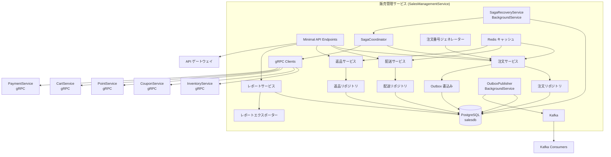
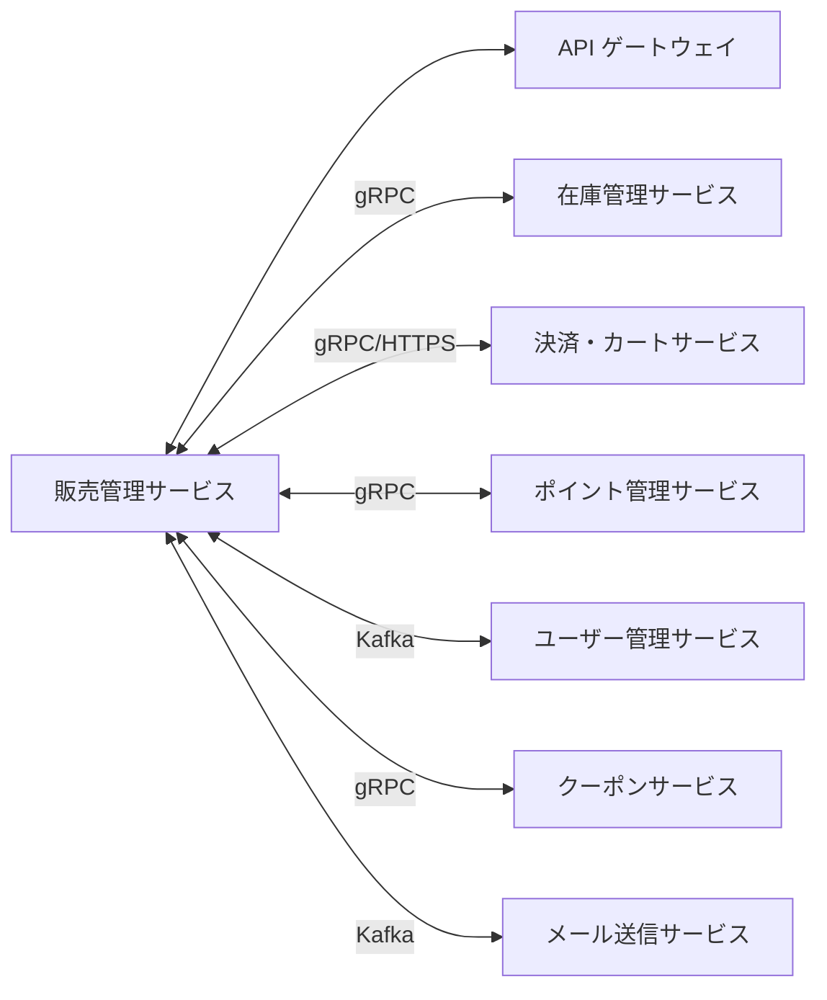
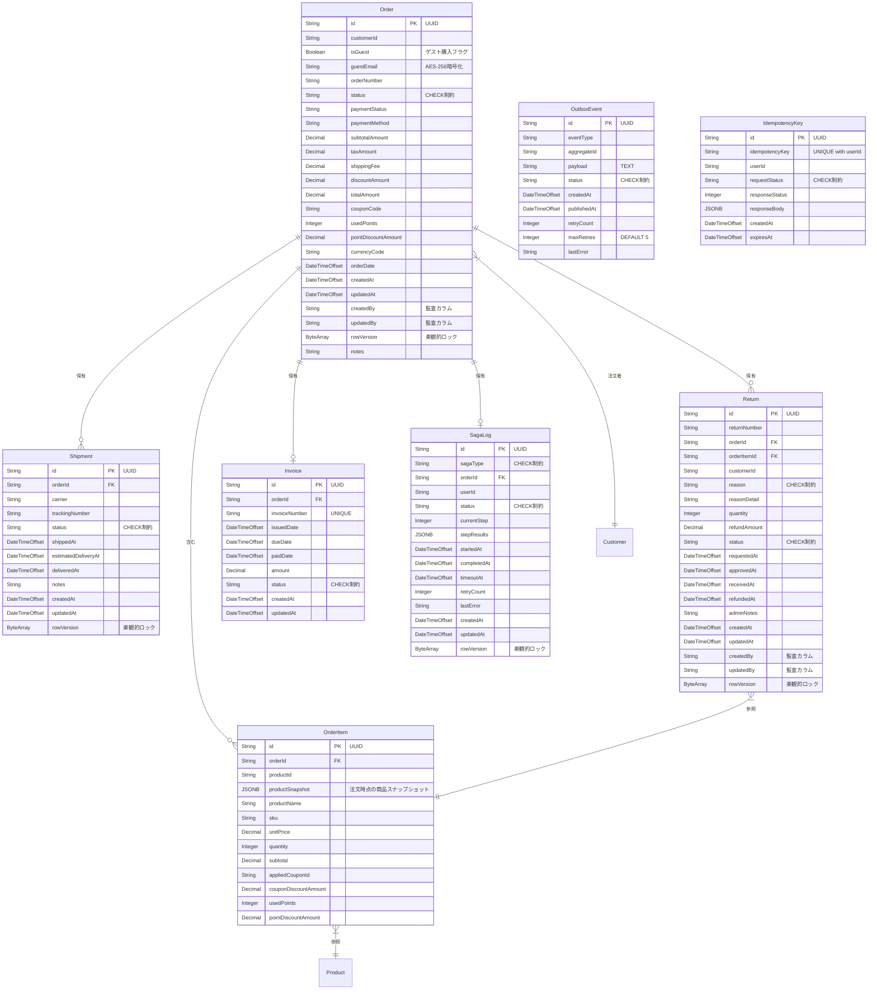
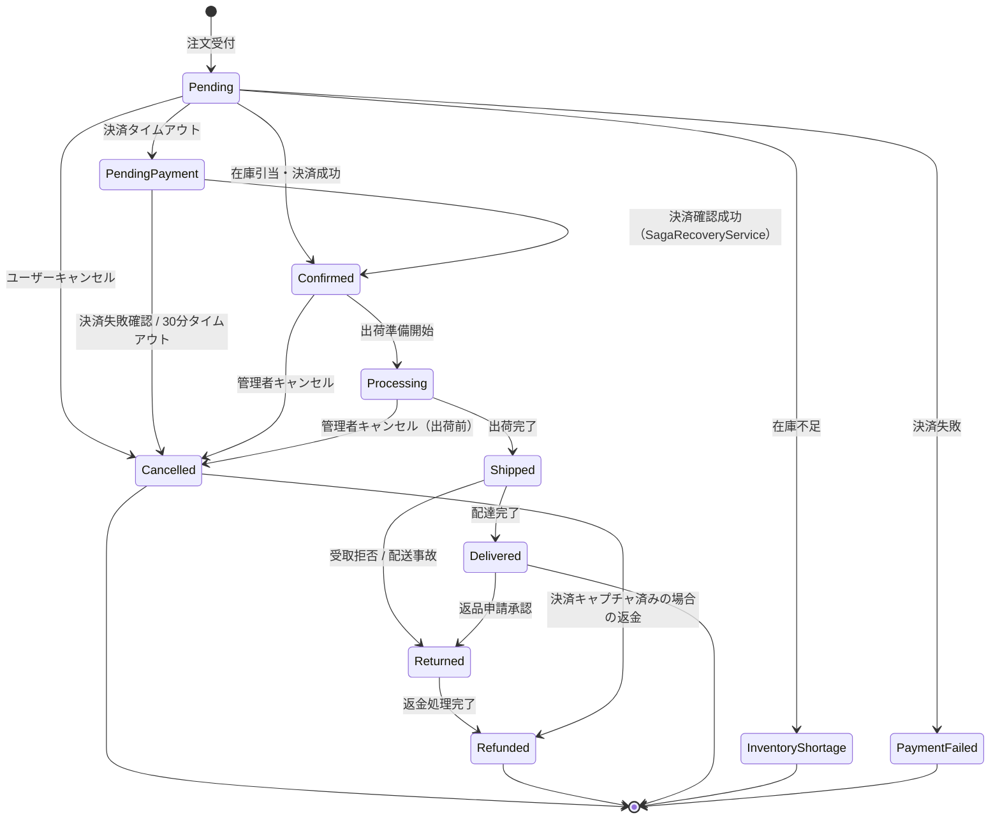
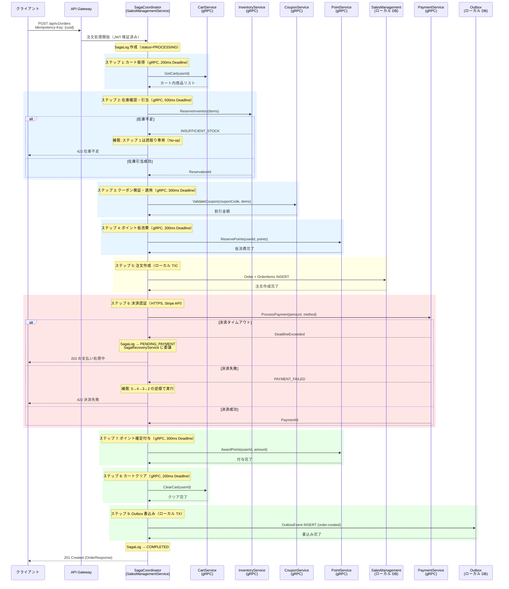
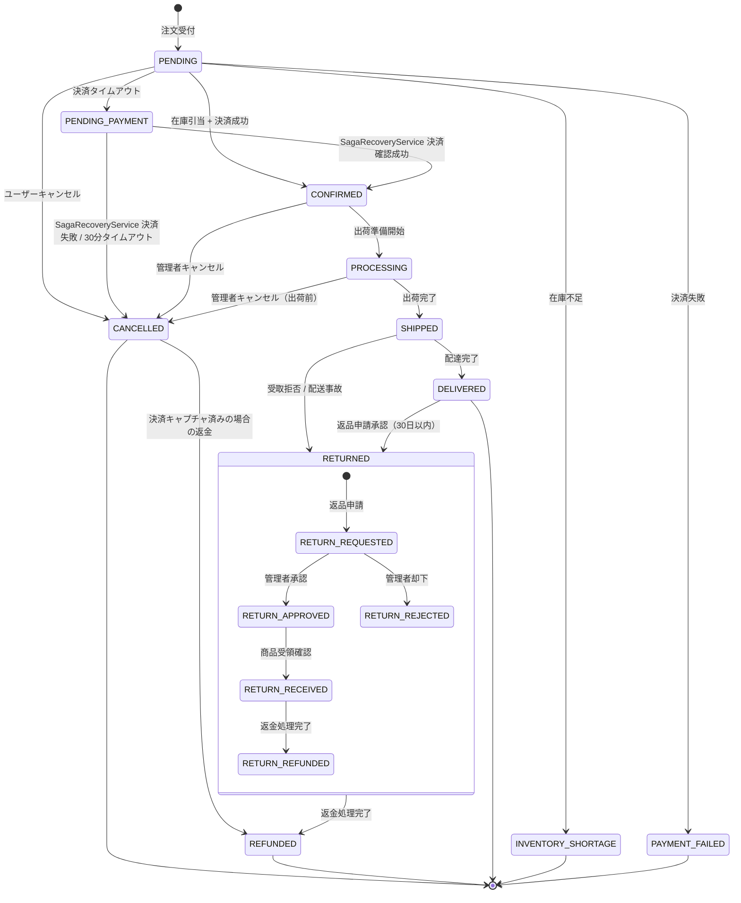

# 販売管理サービス - 詳細設計書

## 1. 概要

販売管理サービスは、注文処理・管理、売上分析・レポート、返品・交換処理、配送手配・追跡、販売履歴管理を担うマイクロサービスである。顧客からの注文受付から配送、返品までの一連のプロセスを処理し、売上データの分析・可視化を提供する。

## 2. 技術スタック

### 開発環境

- **言語**: C# 14 (.NET 10 LTS)
- **フレームワーク**: ASP.NET Core 10 (Minimal API)
- **ビルドツール**: dotnet CLI / MSBuild
- **オーケストレーション**: .NET Aspire 13.1
- **コンテナ化**: Docker 25.x
- **テスト**: xUnit, NSubstitute, Shouldly, Testcontainers.PostgreSql

### 本番環境

- Azure Container Apps
- Azure Database for PostgreSQL

### 主要ライブラリとバージョン

| ライブラリ | バージョン | 用途 |
|---------|---------|---------|
| Microsoft.EntityFrameworkCore | 10.* | ORM データアクセス |
| Npgsql.EntityFrameworkCore.PostgreSQL | 10.* | PostgreSQL プロバイダー |
| Microsoft.EntityFrameworkCore.Design | 10.* | マイグレーションツール |
| Microsoft.AspNetCore.Authentication.JwtBearer | 10.* | JWT 認証 |
| FluentValidation | 11.* | 入力バリデーション |
| FluentValidation.DependencyInjectionExtensions | 11.* | DI 統合 |
| Confluent.Kafka | 2.* | イベント発行・購読 |
| StackExchange.Redis | 2.* | Redis キャッシュ |
| Polly | 8.* | 耐障害性 |
| Microsoft.Extensions.Http.Resilience | 9.* | HTTP レジリエンス |
| Serilog.AspNetCore | 8.* | 構造化ロギング |
| OpenTelemetry.Extensions.Hosting | 1.* | メトリクス収集 |
| Azure.Identity | 1.* | Azure 認証 |
| Azure.Security.KeyVault.Secrets | 4.* | Azure Key Vault 統合 |
| ClosedXML | 0.104.* | Excel レポート生成（※**プレリリース版**: AGENTS.md 禁止事項に抵触。Phase 1 では **EPPlus 7.* (Polyform Noncommercial License)** を使用する。商用利用で有償ライセンスが必要な場合は PO 判断とする。ClosedXML は GA 版リリース後に移行を検討） |
| QuestPDF | 2024.* | PDF レポート生成 |
| AspNetCore.HealthChecks.NpgSql | 9.* | PostgreSQL ヘルスチェック |
| AspNetCore.HealthChecks.Redis | 9.* | Redis ヘルスチェック |
| AspNetCore.HealthChecks.Kafka | 9.* | Kafka ヘルスチェック |
| Grpc.AspNetCore | 2.* | gRPC サーバー |
| Grpc.Net.Client | 2.* | gRPC クライアント |
| Google.Protobuf | 3.* | Protobuf シリアライズ |

## 3. システムアーキテクチャ

### コンポーネントアーキテクチャ図



### マイクロサービス関連図



## 4. データモデル

### エンティティ関連図



## サービス情報

| 項目 | 値 |
|------|-------|
| サービス名 | SalesManagementService |
| ポート | 5004 |
| データベース | PostgreSQL (salesdb)（ADR-0006: サービス別独立 DB） |
| フレームワーク | ASP.NET Core 10 (Minimal API) |
| 言語 | C# 14 (.NET 10) |
| アーキテクチャ | イベント駆動型マイクロサービス + Saga オーケストレーション |

## データベーススキーマ

> **共通ルール**: 全テーブルの日時カラムは `TIMESTAMP WITH TIME ZONE` を使用（`DateTimeOffset` にマッピング）。`DateTime.Now` の使用は禁止、`DateTimeOffset.UtcNow` を使用する。

### orders テーブル

| カラム | データ型 | 制約 | 説明 |
|--------|-----------|-------------|-------------|
| id | VARCHAR(36) | PK | 注文 ID（UUID） |
| order_number | VARCHAR(50) | NOT NULL, UNIQUE | 注文番号 |
| customer_id | VARCHAR(100) | NOT NULL | 顧客 ID（※spec.md では `userId` と表記。ADR-0006 に基づくサービス別独立 DB のため `customer_id` に改名） |
| is_guest | BOOLEAN | NOT NULL, DEFAULT false | ゲスト購入フラグ（spec.md §ゲスト購入フロー準拠） |
| guest_email | VARCHAR(255) | NULL | ゲスト購入時メールアドレス（AES-256-GCM 暗号化保存。spec.md §Order エンティティ拡張準拠） |
| order_date | TIMESTAMP WITH TIME ZONE | NOT NULL | 注文日時 |
| status | VARCHAR(20) | NOT NULL, CHECK (status IN ('PENDING','CONFIRMED','PROCESSING','SHIPPED','DELIVERED','RETURNED','REFUNDED','CANCELLED','INVENTORY_SHORTAGE','PAYMENT_FAILED','PENDING_PAYMENT')) | 注文ステータス |
| payment_status | VARCHAR(20) | NOT NULL, CHECK (payment_status IN ('PENDING','AUTHORIZED','CAPTURED','FAILED','REFUNDED','PARTIALLY_REFUNDED')) | 決済ステータス |
| payment_method | VARCHAR(50) | NOT NULL | 決済方法 |
| subtotal_amount | DECIMAL(12,2) | NOT NULL, CHECK (subtotal_amount >= 0) | 小計金額 |
| tax_amount | DECIMAL(12,2) | NOT NULL, CHECK (tax_amount >= 0) | 税額 |
| shipping_fee | DECIMAL(12,2) | NOT NULL, CHECK (shipping_fee >= 0) | 送料 |
| discount_amount | DECIMAL(12,2) | NOT NULL, CHECK (discount_amount >= 0) | 割引金額 |
| total_amount | DECIMAL(12,2) | NOT NULL, CHECK (total_amount >= 0) | 合計金額 |
| coupon_code | VARCHAR(50) | NULL | クーポンコード |
| used_points | INTEGER | DEFAULT 0, CHECK (used_points >= 0) | 使用ポイント |
| point_discount_amount | DECIMAL(12,2) | DEFAULT 0, CHECK (point_discount_amount >= 0) | ポイント割引金額 |
| shipping_postal_code | VARCHAR(10) | NULL | 配送先郵便番号 |
| shipping_prefecture | VARCHAR(50) | NULL | 配送先都道府県 |
| shipping_city | VARCHAR(100) | NULL | 配送先市区町村 |
| shipping_address_line1 | VARCHAR(200) | NULL | 配送先住所 1 |
| shipping_address_line2 | VARCHAR(200) | NULL | 配送先住所 2 |
| shipping_recipient_name | VARCHAR(100) | NULL | 配送先宛名 |
| shipping_phone_number | VARCHAR(20) | NULL | 配送先電話番号 |
| currency_code | VARCHAR(3) | NOT NULL, DEFAULT 'JPY' | 通貨コード |
| notes | TEXT | NULL | 備考 |
| created_by | VARCHAR(100) | NULL | 作成者（監査カラム） |
| updated_by | VARCHAR(100) | NULL | 更新者（監査カラム） |
| created_at | TIMESTAMP WITH TIME ZONE | NOT NULL, DEFAULT CURRENT_TIMESTAMP | 作成日時 |
| updated_at | TIMESTAMP WITH TIME ZONE | NOT NULL, DEFAULT CURRENT_TIMESTAMP | 更新日時 |
| row_version | BYTEA | NOT NULL | 楽観的ロック用（EF Core `[Timestamp]`） |

### order_items テーブル

| カラム | データ型 | 制約 | 説明 |
|--------|-----------|-------------|-------------|
| id | VARCHAR(36) | PK | 注文明細 ID（UUID） |
| order_id | VARCHAR(36) | FK, NOT NULL | 注文 ID |
| product_id | VARCHAR(100) | NOT NULL | 商品 ID |
| product_name | VARCHAR(200) | NOT NULL | 商品名 |
| sku | VARCHAR(100) | NOT NULL | 商品 SKU |
| unit_price | DECIMAL(12,2) | NOT NULL, CHECK (unit_price >= 0) | 単価 |
| quantity | INTEGER | NOT NULL, CHECK (quantity > 0) | 数量 |
| subtotal | DECIMAL(12,2) | NOT NULL, CHECK (subtotal >= 0) | 小計 |
| product_snapshot | JSONB | NULL | 注文時点の商品スナップショット |
| applied_coupon_id | VARCHAR(100) | NULL | 適用クーポン ID |
| coupon_discount_amount | DECIMAL(12,2) | DEFAULT 0, CHECK (coupon_discount_amount >= 0) | クーポン割引金額 |
| used_points | INTEGER | DEFAULT 0, CHECK (used_points >= 0) | 使用ポイント |
| point_discount_amount | DECIMAL(12,2) | DEFAULT 0, CHECK (point_discount_amount >= 0) | ポイント割引金額 |

> **productSnapshot JSONB 設計**: 注文確定時点の商品情報を不変スナップショットとして保存する。商品マスタ変更後も注文明細の表示が崩れないことを保証する。
>
> ```json
> {
>   "productName": "スキーブーツ Pro X",
>   "description": "上級者向けスキーブーツ",
>   "imageUrl": "/images/products/ski-boot-pro-x.jpg",
>   "category": "ブーツ",
>   "brand": "SkiTech",
>   "attributes": { "size": "26.5cm", "color": "ブラック", "flex": "130" }
> }
> ```

### shipments テーブル

> **spec.md との設計差異（ShipmentItem）**: spec.md の Aggregate Root 一覧では `Shipment` の子エンティティとして `ShipmentItem` を定義しているが、本設計書では `ShipmentItem` を**設けない**。理由: Phase 1 では Order:Shipment = 1:1（`order_id` に UNIQUE 制約）であり、分割配送は不要なため。Phase 2 で複数配送（1:N）に対応する際は、UNIQUE 制約を撤去し `ShipmentItem` エンティティを追加する移行パスを採る。spec.md 側の Aggregate Root 一覧から `ShipmentItem` を削除するか、「Phase 2 で追加予定」の注記を追加する更新を提案する。

> **spec.md との設計差異（Order エンティティ属性）**: spec.md のコアエンティティ関係図では Order に `userId`, `shippingAddressId`, `billingAddressId`, `paymentId` を定義しているが、本設計書では以下の変更を適用している:
> - `userId` → `customer_id`: サービス別独立 DB（ADR-0006）に基づき、外部サービスの ID 参照として命名変更
> - `shippingAddressId` → **インライン配送先カラム**（`shipping_postal_code`, `shipping_prefecture` 等）: ADR-0006 準拠。ユーザー管理サービスの addresses テーブルへの FK 参照はサービス境界を超えるため禁止。注文確定時点の住所をスナップショットとして保持する設計
> - `billingAddressId`: Phase 1 では請求先住所は配送先住所と同一とする（分離は Phase 2 スコープ）
> - `paymentId`: 決済情報は PCI DSS 非保持化（ADR-0008）に基づき、PaymentCartService が管理。SalesManagementService は `payment_status` と `payment_method` のみ保持

| カラム | データ型 | 制約 | 説明 |
|--------|-----------|-------------|-------------|
| id | VARCHAR(36) | PK | 配送 ID（UUID） |
| order_id | VARCHAR(36) | FK, NOT NULL, UNIQUE | 注文 ID |
| carrier | VARCHAR(100) | NOT NULL | 配送業者 |
| tracking_number | VARCHAR(100) | NULL | 追跡番号 |
| status | VARCHAR(20) | NOT NULL, CHECK (status IN ('PREPARING','SHIPPED','IN_TRANSIT','DELIVERED','FAILED')) | 配送ステータス |
| shipping_postal_code | VARCHAR(10) | NULL | 配送先郵便番号 |
| shipping_prefecture | VARCHAR(50) | NULL | 配送先都道府県 |
| shipping_city | VARCHAR(100) | NULL | 配送先市区町村 |
| shipping_address_line1 | VARCHAR(200) | NULL | 配送先住所 1 |
| shipping_address_line2 | VARCHAR(200) | NULL | 配送先住所 2 |
| shipping_recipient_name | VARCHAR(100) | NULL | 配送先宛名 |
| shipping_phone_number | VARCHAR(20) | NULL | 配送先電話番号 |
| shipped_at | TIMESTAMP WITH TIME ZONE | NULL | 出荷日時 |
| estimated_delivery_at | TIMESTAMP WITH TIME ZONE | NULL | 配送予定日時 |
| delivered_at | TIMESTAMP WITH TIME ZONE | NULL | 配達完了日時 |
| notes | TEXT | NULL | 備考 |
| created_at | TIMESTAMP WITH TIME ZONE | NOT NULL, DEFAULT CURRENT_TIMESTAMP | 作成日時 |
| updated_at | TIMESTAMP WITH TIME ZONE | NOT NULL, DEFAULT CURRENT_TIMESTAMP | 更新日時 |
| row_version | BYTEA | NOT NULL | 楽観的ロック用 |

### returns テーブル

| カラム | データ型 | 制約 | 説明 |
|--------|-----------|-------------|-------------|
| id | VARCHAR(36) | PK | 返品 ID（UUID） |
| return_number | VARCHAR(50) | NOT NULL, UNIQUE | 返品番号 |
| order_id | VARCHAR(36) | FK, NOT NULL | 注文 ID |
| order_item_id | VARCHAR(36) | FK, NOT NULL | 注文明細 ID |
| customer_id | VARCHAR(100) | NOT NULL | 顧客 ID |
| reason | VARCHAR(30) | NOT NULL, CHECK (reason IN ('DEFECTIVE','WRONG_ITEM','SIZE_MISMATCH','NOT_AS_DESCRIBED','CHANGED_MIND','OTHER')) | 返品理由 |
| reason_detail | TEXT | NULL | 詳細理由 |
| quantity | INTEGER | NOT NULL, CHECK (quantity > 0) | 返品数量 |
| refund_amount | DECIMAL(12,2) | NOT NULL, CHECK (refund_amount >= 0) | 返金金額 |
| status | VARCHAR(20) | NOT NULL, CHECK (status IN ('REQUESTED','APPROVED','REJECTED','RECEIVED','REFUNDED','CLOSED')) | 返品ステータス |
| requested_at | TIMESTAMP WITH TIME ZONE | NOT NULL | 申請日時 |
| approved_at | TIMESTAMP WITH TIME ZONE | NULL | 承認日時 |
| received_at | TIMESTAMP WITH TIME ZONE | NULL | 受領日時 |
| refunded_at | TIMESTAMP WITH TIME ZONE | NULL | 返金日時 |
| admin_notes | TEXT | NULL | 管理者メモ |
| created_by | VARCHAR(100) | NULL | 作成者（監査カラム） |
| updated_by | VARCHAR(100) | NULL | 更新者（監査カラム） |
| created_at | TIMESTAMP WITH TIME ZONE | NOT NULL, DEFAULT CURRENT_TIMESTAMP | 作成日時 |
| updated_at | TIMESTAMP WITH TIME ZONE | NOT NULL, DEFAULT CURRENT_TIMESTAMP | 更新日時 |
| row_version | BYTEA | NOT NULL | 楽観的ロック用 |

### invoices テーブル

| カラム | データ型 | 制約 | 説明 |
|--------|-----------|-------------|-------------|
| id | VARCHAR(36) | PK | 請求書 ID（UUID） |
| order_id | VARCHAR(36) | FK, NOT NULL | 注文 ID |
| invoice_number | VARCHAR(50) | NOT NULL, UNIQUE | 請求書番号 |
| issued_date | TIMESTAMP WITH TIME ZONE | NOT NULL | 発行日 |
| due_date | TIMESTAMP WITH TIME ZONE | NOT NULL | 支払期限 |
| paid_date | TIMESTAMP WITH TIME ZONE | NULL | 支払日 |
| amount | DECIMAL(12,2) | NOT NULL, CHECK (amount >= 0) | 請求金額 |
| status | VARCHAR(20) | NOT NULL, CHECK (status IN ('DRAFT','ISSUED','PAID','OVERDUE','CANCELLED')) | 請求書ステータス |
| created_at | TIMESTAMP WITH TIME ZONE | NOT NULL, DEFAULT CURRENT_TIMESTAMP | 作成日時 |
| updated_at | TIMESTAMP WITH TIME ZONE | NOT NULL, DEFAULT CURRENT_TIMESTAMP | 更新日時 |

### saga_logs テーブル

> **参照**: spec.md `saga_logs` テーブル設計（ADR-0009）

| カラム | データ型 | 制約 | 説明 |
|--------|-----------|-------------|-------------|
| id | VARCHAR(36) | PK | Saga インスタンス ID（UUID） |
| saga_type | VARCHAR(30) | NOT NULL, CHECK (saga_type IN ('ORDER_CHECKOUT','ORDER_CANCEL','ORDER_RETURN')) | Saga 種別 |
| order_id | VARCHAR(36) | FK, NOT NULL | 対象注文 ID |
| user_id | VARCHAR(36) | NOT NULL | 実行ユーザー ID |
| status | VARCHAR(20) | NOT NULL, CHECK (status IN ('CREATED','PROCESSING','COMPLETED','COMPENSATING','COMPENSATED','FAILED','PENDING_PAYMENT')) | Saga ステータス |
| current_step | INTEGER | NOT NULL, CHECK (current_step >= 0) | 現在実行中のステップ番号 |
| step_results | JSONB | NULL | 各ステップの実行結果 JSON |
| started_at | TIMESTAMP WITH TIME ZONE | NOT NULL | Saga 開始日時 |
| completed_at | TIMESTAMP WITH TIME ZONE | NULL | Saga 完了日時 |
| timeout_at | TIMESTAMP WITH TIME ZONE | NOT NULL | 全体タイムアウト日時 |
| retry_count | INTEGER | DEFAULT 0, CHECK (retry_count >= 0) | リトライ回数 |
| last_error | VARCHAR(2000) | NULL | 最後のエラーメッセージ |
| created_at | TIMESTAMP WITH TIME ZONE | NOT NULL, DEFAULT CURRENT_TIMESTAMP | 作成日時 |
| updated_at | TIMESTAMP WITH TIME ZONE | NOT NULL, DEFAULT CURRENT_TIMESTAMP | 更新日時 |
| row_version | BYTEA | NOT NULL | 楽観的ロック用（EF Core `[Timestamp]`） |

### outbox_events テーブル

> **参照**: spec.md Outbox パターン設計（ADR-0005）

| カラム | データ型 | 制約 | 説明 |
|--------|-----------|-------------|-------------|
| id | VARCHAR(36) | PK | イベント ID（UUID） |
| event_type | VARCHAR(255) | NOT NULL | イベントタイプ |
| aggregate_id | VARCHAR(36) | NOT NULL | 集約 ID |
| payload | TEXT | NOT NULL | イベントペイロード（JSON） |
| status | VARCHAR(20) | NOT NULL, CHECK (status IN ('PENDING','PROCESSING','PUBLISHED','FAILED','DEAD_LETTER')) | 発行ステータス |
| created_at | TIMESTAMP WITH TIME ZONE | NOT NULL, DEFAULT CURRENT_TIMESTAMP | 作成日時 |
| published_at | TIMESTAMP WITH TIME ZONE | NULL | 発行日時 |
| retry_count | INTEGER | DEFAULT 0, CHECK (retry_count >= 0) | リトライ回数 |
| max_retries | INTEGER | DEFAULT 5 | 最大リトライ回数 |
| last_error | VARCHAR(2000) | NULL | 最後のエラーメッセージ |

### idempotency_keys テーブル

| カラム | データ型 | 制約 | 説明 |
|--------|-----------|-------------|-------------|
| id | VARCHAR(36) | PK | レコード ID（UUID） |
| idempotency_key | VARCHAR(36) | NOT NULL | クライアント提供のべき等性キー |
| user_id | VARCHAR(36) | NOT NULL | リクエストユーザー ID |
| request_status | VARCHAR(20) | NOT NULL, CHECK (request_status IN ('PENDING','PROCESSING','COMPLETED')) | 処理ステータス |
| response_status | INTEGER | NULL | レスポンスの HTTP ステータスコード |
| response_body | JSONB | NULL | キャッシュされたレスポンスボディ |
| created_at | TIMESTAMP WITH TIME ZONE | NOT NULL, DEFAULT CURRENT_TIMESTAMP | レコード作成日時 |
| expires_at | TIMESTAMP WITH TIME ZONE | NOT NULL | 有効期限（created_at + 24 時間） |

**制約**: `UNIQUE (idempotency_key, user_id)`

## 5. 注文ステータス状態遷移

### 状態遷移図



### OrderStateMachine 実装

```csharp
// ✅ 注文ステータスの状態遷移マシン
public class OrderStateMachine
{
    private static readonly Dictionary<(OrderStatus From, OrderStatus To), bool> _validTransitions = new()
    {
        { (OrderStatus.Pending, OrderStatus.Confirmed), true },
        { (OrderStatus.Pending, OrderStatus.InventoryShortage), true },
        { (OrderStatus.Pending, OrderStatus.PaymentFailed), true },
        { (OrderStatus.Pending, OrderStatus.PendingPayment), true },
        { (OrderStatus.Pending, OrderStatus.Cancelled), true },
        { (OrderStatus.PendingPayment, OrderStatus.Confirmed), true },
        { (OrderStatus.PendingPayment, OrderStatus.Cancelled), true },
        { (OrderStatus.Confirmed, OrderStatus.Processing), true },
        { (OrderStatus.Confirmed, OrderStatus.Cancelled), true },
        { (OrderStatus.Processing, OrderStatus.Shipped), true },
        { (OrderStatus.Processing, OrderStatus.Cancelled), true },
        { (OrderStatus.Shipped, OrderStatus.Delivered), true },
        { (OrderStatus.Shipped, OrderStatus.Returned), true },
        { (OrderStatus.Delivered, OrderStatus.Returned), true },
        { (OrderStatus.Returned, OrderStatus.Refunded), true },
        { (OrderStatus.Cancelled, OrderStatus.Refunded), true },
    };

    public static void TransitionTo(Order order, OrderStatus newStatus)
    {
        if (!_validTransitions.ContainsKey((order.Status, newStatus)))
            throw new BusinessException(
                $"注文ステータスを {order.Status} から {newStatus} に変更できません");

        order.Status = newStatus;
        order.UpdatedAt = DateTimeOffset.UtcNow;
    }
}
```

### 税計算ルール

```csharp
// ✅ 税計算サービス（外税方式、1 円未満切り捨て）
public class TaxCalculator
{
    private const decimal StandardTaxRate = 0.10m;  // 標準税率 10%
    private const decimal ReducedTaxRate = 0.08m;   // 軽減税率 8%

    public static decimal CalculateTax(decimal subtotal, decimal taxRate = 0.10m)
        => Math.Floor(subtotal * taxRate);  // 1 円未満切り捨て
}
```

### 配送料計算ルール

| 条件 | 送料 | 備考 |
|------|------|------|
| 注文金額 ≥ 10,000 円（一般会員） | 無料 | 基本閾値 |
| 注文金額 ≥ 8,000 円（Silver 会員） | 無料 | 会員ランク割引 |
| 注文金額 ≥ 5,000 円（Gold 会員） | 無料 | 会員ランク割引 |
| Platinum 会員 | 常時無料 | 最上位ランク特典 |
| 上記以外（本州・四国・九州） | 550 円（税込） | デフォルト送料（spec.md 準拠） |
| 上記以外（北海道・沖縄） | 1,100 円（税込） | 離島は別途見積もり |
| お急ぎ便（翌日配送） | 通常配送料 + 330 円（税込） | 在庫ありかつ 15:00 までの注文 |
| 大型商品（スキー板等） | 通常配送料 + 1,650 円（税込） | 重量 10kg 超 or 長さ 170cm 超 |

## API 設計

### REST API エンドポイント

#### 注文管理 API

| メソッド | パス | 説明 | パラメータ | レスポンス |
|---------|-----|------------|------------|----------|
| GET | /api/v1/orders/{orderId} | 注文詳細取得 | orderId | OrderResponse |
| GET | /api/v1/orders/number/{orderNumber} | 注文番号による取得 | orderNumber | OrderResponse |
| GET | /api/v1/orders/customer/{customerId} | 顧客注文履歴取得 | customerId, page, size | ページネーション付き `OrderResponse` |
| POST | /api/v1/orders | 注文作成（Idempotency-Key 必須） | OrderCreateRequest, Idempotency-Key ヘッダー | OrderResponse |
| PUT | /api/v1/orders/{orderId}/status | 注文ステータス更新 | orderId, OrderStatusUpdateRequest | OrderResponse |
| POST | /api/v1/orders/{orderId}/cancel | 注文キャンセル | orderId, reason | OrderResponse |
| GET | /api/v1/orders/search | 注文検索 | customerId, status, paymentStatus, page, size | ページネーション付き `OrderResponse` |

> **注意**: キャンセルは `POST /api/v1/orders/{orderId}/cancel`（動作を表す URI に POST）。`PUT` は使用しない（REST URI に動詞を含める場合は POST）。

#### 配送管理 API

| メソッド | パス | 説明 | パラメータ | レスポンス |
|---------|-----|------------|------------|----------|
| GET | /api/v1/shipments | 配送一覧取得 | page, size, sort, status | ShipmentListResponse |
| GET | /api/v1/shipments/{id} | 配送詳細取得 | id | ShipmentDetailResponse |
| POST | /api/v1/shipments | 配送情報作成 | ShipmentCreateRequest | ShipmentResponse |
| PUT | /api/v1/shipments/{id}/status | 配送ステータス更新 | id, ShipmentStatusUpdateRequest | ShipmentResponse |
| GET | /api/v1/shipments/order/{orderId} | 注文の配送情報取得 | orderId | ShipmentListResponse |
| PUT | /api/v1/shipments/{id}/tracking | 追跡情報更新 | id, TrackingUpdateRequest | ShipmentResponse |

#### 返品管理 API

| メソッド | パス | 説明 | パラメータ | レスポンス |
|---------|-----|------------|------------|----------|
| GET | /api/v1/returns | 返品一覧取得 | page, size, sort, status | ReturnListResponse |
| GET | /api/v1/returns/{id} | 返品詳細取得 | id | ReturnDetailResponse |
| POST | /api/v1/returns | 返品申請作成 | ReturnCreateRequest | ReturnResponse |
| PUT | /api/v1/returns/{id}/status | 返品ステータス更新 | id, ReturnStatusUpdateRequest | ReturnResponse |
| GET | /api/v1/returns/order/{orderId} | 注文の返品情報取得 | orderId | ReturnListResponse |

#### レポート API

| メソッド | パス | 説明 | パラメータ | レスポンス |
|---------|-----|------------|------------|----------|
| GET | /api/v1/reports/sales | 売上レポート取得 | fromDate, toDate, groupBy | SalesReportResponse |
| GET | /api/v1/reports/products | 商品別売上レポート取得 | fromDate, toDate, limit | ProductSalesReportResponse |
| GET | /api/v1/reports/export/sales | 売上レポートエクスポート | fromDate, toDate, format | ファイルダウンロード |
| GET | /api/v1/reports/shipping | 配送レポート取得 | fromDate, toDate, carrier | ShippingReportResponse |
| GET | /api/v1/reports/returns | 返品分析レポート取得 | fromDate, toDate, reason | ReturnReportResponse |

#### ヘルスチェック API

| メソッド | パス | 説明 |
|---------|-----|------------|
| GET | /health | Liveness チェック（常時 200） |
| GET | /health/ready | Readiness チェック（PostgreSQL + Kafka 疎通確認） |

### べき等性（Idempotency-Key）設計

`POST /api/v1/orders` への二重リクエスト防止のため、`Idempotency-Key` ヘッダーを必須とする。

| 項目 | 設計 |
|------|------|
| ヘッダー | `Idempotency-Key: {client-generated-uuid}` |
| 必須/任意 | **必須**（未指定の場合 `400 Bad Request`） |
| TTL | 24 時間（TTL 経過後は同一キーで新規注文可能） |
| 重複リクエスト処理 | キャッシュされたレスポンスを返却（同一ステータスコード・ボディ） |
| 処理中リクエスト | `409 Conflict`（別リクエストが処理中） |

**処理フロー**:
1. リクエスト受信 → `idempotency_keys` テーブルを `(idempotency_key, user_id)` で検索
2. 既存キーあり + `request_status = 'COMPLETED'` → キャッシュされたレスポンスを返却（べき等）
3. 既存キーあり + `request_status = 'PROCESSING'` → 処理中（`409 Conflict` を返却）
4. 既存キーなし → 新規挿入（`request_status = 'PENDING'`）して Saga 開始 → 即座に `request_status = 'PROCESSING'` に更新
5. Saga 完了後 → `request_status = 'COMPLETED'`、`response_status` と `response_body` を更新
6. 期限切れレコードは `BackgroundService` で日次クリーンアップ

### 実装上の注意事項

- **認証**: 全エンドポイントに適切なロールベース認証を適用（`RequireAuthorization()`）
- **IDOR 防止**: ログインユーザーの `ClaimsPrincipal` から `NameIdentifier` を取得し、注文のオーナーシップを検証する
- **C# 14 機能**: record 型、switch 式、パターンマッチング等を活用
- **レポートエクスポート**: Excel は ClosedXML、PDF は QuestPDF で生成
- **エラーレスポンス**: RFC 9457（Problem Details）準拠

### IDOR 防止パターン

```csharp
// ✅ ログインユーザーの注文のみ参照可能（IDOR 防止）
app.MapGet("/api/v1/orders/{orderId}", async (
    string orderId,
    ClaimsPrincipal user,
    IOrderService orderService,
    CancellationToken ct) =>
{
    var userId = user.FindFirstValue(ClaimTypes.NameIdentifier)
        ?? throw new UnauthorizedException();
    return await orderService.GetByIdAndUserIdAsync(orderId, userId, ct) is { } order
        ? Results.Ok(order)
        : Results.NotFound();
}).RequireAuthorization();
```

### PII ログマスキングルール

| データ種別 | ログ出力 | マスキング方法 |
|-----------|---------|-------------|
| 配送先住所（shipping_address） | **禁止** | ログに出力しない |
| 電話番号（shipping_phone_number） | **禁止** | ログに出力しない |
| 宛名（shipping_recipient_name） | **禁止** | ログに出力しない |
| 注文 ID（order_id） | 許可 | マスキング不要 |
| 注文番号（order_number） | 許可 | マスキング不要 |
| 金額情報 | 許可 | マスキング不要 |

### リクエスト / レスポンス例

#### 注文作成リクエスト

```json
{
  "customerId": "550e8400-e29b-41d4-a716-446655440000",
  "items": [
    {
      "productId": "prod-123",
      "productName": "スキーブーツ",
      "sku": "SKI-BOOT-001",
      "unitPrice": 25000.00,
      "quantity": 1
    }
  ],
  "shippingAddress": {
    "recipientName": "山田太郎",
    "postalCode": "100-0001",
    "prefecture": "東京都",
    "city": "千代田区",
    "addressLine1": "千代田 1-1-1",
    "addressLine2": "101号室",
    "phoneNumber": "03-1234-5678"
  },
  "paymentMethod": "CREDIT_CARD",
  "couponCode": "WINTER2024",
  "usedPoints": 500,
  "notes": "午後に配達希望"
}
```

#### 注文レスポンス

```json
{
  "id": "f47ac10b-58cc-4372-a567-0e02b2c3d479",
  "orderNumber": "ORD-20240415-00001",
  "customerId": "550e8400-e29b-41d4-a716-446655440000",
  "orderDate": "2024-04-15T14:30:25.123Z",
  "status": "PENDING",
  "paymentStatus": "PENDING",
  "paymentMethod": "CREDIT_CARD",
  "subtotalAmount": 25000.00,
  "taxAmount": 2500.00,
  "shippingFee": 500.00,
  "discountAmount": 1000.00,
  "totalAmount": 27000.00,
  "couponCode": "WINTER2024",
  "usedPoints": 500,
  "pointDiscountAmount": 500.00,
  "currencyCode": "JPY",
  "items": [
    {
      "id": "item-123",
      "productId": "prod-123",
      "productName": "スキーブーツ",
      "sku": "SKI-BOOT-001",
      "unitPrice": 25000.00,
      "quantity": 1,
      "subtotal": 25000.00
    }
  ],
  "shippingAddress": {
    "recipientName": "山田太郎",
    "postalCode": "100-0001",
    "prefecture": "東京都",
    "city": "千代田区",
    "addressLine1": "千代田 1-1-1",
    "addressLine2": "101号室",
    "phoneNumber": "03-1234-5678"
  },
  "notes": "午後に配達希望",
  "createdAt": "2024-04-15T14:30:25.123+00:00",
  "updatedAt": "2024-04-15T14:30:25.123+00:00"
}
```

## 6. イベント設計

### 発行イベント（Kafka トピック）

> **SSOT**: spec.md Kafka トピック設計に準拠。トピック名は `order.{action}` 形式。

| イベント名 | 説明 | ペイロード | トピック |
|-----------|-------------|---------|-------|
| OrderCreated | 注文作成完了時に発行 | 注文 ID、顧客 ID、注文詳細、金額情報 | `order.created` |
| OrderCancelled | 注文キャンセル時に発行 | 注文 ID、顧客 ID、キャンセル理由 | `order.cancelled` |
| OrderShipped | 出荷完了時に発行 | 注文 ID、配送 ID、追跡番号 | `order.shipped` |
| OrderDelivered | 配達完了時に発行 | 注文 ID、配達日時 | `order.delivered` |
| OrderStatusChanged | 注文ステータス変更時に発行 | 注文 ID、旧ステータス、新ステータス、変更理由 | `order.status-changed` |

> **注意**: 全イベントは Outbox パターンを通じて発行する（ローカル TX 内で `outbox_events` テーブルに書き込み、`OutboxPublisher` が非同期で Kafka に発行）。

### 購読イベント（Kafka トピック）

| イベント名 | 説明 | 発行元サービス | アクション |
|-----------|-------------|----------------|--------|
| payment.completed | 決済処理完了時に購読 | PaymentCartService | 決済ステータス更新、注文ステータスを `CONFIRMED` に設定 |
| payment.failed | 決済処理失敗時に購読 | PaymentCartService | 決済ステータスを `FAILED`、注文ステータスを `PAYMENT_FAILED` に更新 |
| inventory.reserved | 在庫予約完了時に購読 | InventoryManagementService | Saga ステップ 2 の成功通知（gRPC 応答で処理済みの場合は No-op） |
| inventory.released | 在庫予約解放時に購読 | InventoryManagementService | 補償トランザクション完了の確認記録 |
| user.deleted | ユーザー削除完了時に購読 | UserManagementService | 注文データの匿名化処理（PII マスキング） |

> **user.deleted 購読時のアクション**: 該当ユーザーの注文データを匿名化する。`customer_id` をハッシュ化し、配送先住所・電話番号・宛名を `[DELETED]` に置換する。注文データ自体は法的保持義務（税法 7 年）があるため削除しない。
>
> **匿名化対象フィールド一覧**（GDPR 第 17 条対応）:
> | フィールド | 匿名化方法 |
> |-----------|----------|
> | `customer_id` | SHA-256 ハッシュ化 |
> | `shipping_recipient_name` | `[DELETED]` に置換 |
> | `shipping_postal_code` | `[DELETED]` に置換 |
> | `shipping_prefecture` | `[DELETED]` に置換 |
> | `shipping_city` | `[DELETED]` に置換 |
> | `shipping_address_line1` | `[DELETED]` に置換 |
> | `shipping_address_line2` | `[DELETED]` に置換 |
> | `shipping_phone_number` | `[DELETED]` に置換 |
> | `guest_email` | NULL 化（ゲスト購入の場合。AES-256 暗号化データを完全削除） |
> | `notes` | ユーザー固有情報が含まれる可能性があるため `[DELETED]` に置換 |
>
> **`product_snapshot` の PII 確認**: `order_items.product_snapshot` は商品マスタ情報のスナップショット（商品名、カテゴリ、属性等）であり、原則としてユーザー固有の PII は含まない。ただし、名入れ商品等のカスタマイズ属性にユーザー名が含まれる場合は、`attributes` フィールド内の該当値を `[DELETED]` に置換する。

## 7. 分散トランザクション管理（Saga パターン）

> **SSOT（Single Source of Truth）**: 注文確定フローの Saga 9 ステップ設計は **spec.md（ADR-0009）** を正とする。AGENTS.md §10.4 も参照。

### 注文処理 Saga（9 ステップ）



### Saga ステップ詳細

| ステップ | 呼出先 | 通信プロトコル | ローカル TX 内容 | 補償対象 | Deadline |
|---------|--------|-------------|---------------|---------|----------|
| 1. カート取得 | PaymentCartService | gRPC | Redis キャッシュ Hit → カートアイテム返却 | No-op（読取り専用） | 200ms |
| 2. 在庫確認・引当 | InventoryManagementService | gRPC | `SELECT FOR UPDATE` + 在庫減算 | `ReleaseReservation(reservationId)` | 500ms |
| 3. クーポン検証・適用 | CouponService | gRPC | 使用可否判定 + 使用回数更新 | `ReleaseCoupon(couponId, orderId)` | 300ms |
| 4. ポイント仮消費 | PointService | gRPC | 残高確認 + 仮引き落とし | `ReleasePoints(userId, reservationId)` | 300ms |
| 5. 注文作成 | SalesManagementService（ローカル DB） | ローカル呼出し | Order + OrderItems INSERT | DB ロールバック（EF Core TX） | — |
| 6. 決済認証 | PaymentService（内部ラッパー）→ 外部 PG（Stripe/GMO） | gRPC（内部）/ HTTPS（外部 PG） | Stripe PaymentIntent 作成 | `Refund(paymentId)` | 外部 API 依存 |
| 7. ポイント確定付与 | PointService | gRPC | 購入金額に基づくポイント加算 | 補償対象外（後処理） | 300ms |
| 8. カートクリア | PaymentCartService | gRPC | CartItems DELETE | 補償対象外（後処理） | 200ms |
| 9. Outbox 書込み | SalesManagementService（ローカル DB） | ローカル呼出し | OutboxEvent INSERT (order.created) | 補償対象外（後処理） | — |

> **注記（SSOT）**: spec.md の 9 ステップ定義を SSOT とする。ADR-0009 には 6 ステップが記載されているが、spec.md の 9 ステップ（補償対象 6 + 後処理 3）が最新の設計である。
>
> **⚠️ ADR-0009 更新提案**: ADR-0009 は 2026 年初期に 6 ステップ構成で承認されたが、その後 spec.md にて後処理 3 ステップ（ポイント確定付与・カートクリア・Outbox 書込み）が追加され 9 ステップに拡張された。ADR-0009 を 9 ステップ構成に改訂し、改訂履歴に「spec.md §Saga 9 ステップ設計に基づく拡張（後処理 3 ステップ追加）」を追記することを提案する。ADR の正式な承認ステータスとの齟齬を解消するため、テックリードによる改訂承認が必要である。

### Saga ステップ Deadline（レイテンシバジェット）

チェックアウト SLO（95 パーセンタイル **1,000ms** 以内）を達成するためのバジェット:

| ステップ | 処理時間 | オーバーヘッド | 合計 | 備考 |
|---------|---------|------------|------|------|
| 0. API Gateway 通過 | 20ms | 10ms | 30ms | JWT 検証 + YARP ルーティング |
| 1. カート取得 | 40ms | 10ms | 50ms | Redis Hit 前提 |
| 2. 在庫確認・引当 | 85ms | 15ms | 100ms | `SELECT FOR UPDATE` + 在庫減算 |
| 3. クーポン検証 | 65ms | 15ms | 80ms | 使用可否判定 |
| 4. ポイント仮消費 | 65ms | 15ms | 80ms | 残高確認 + 仮引き落とし |
| 5. 注文作成 | 100ms | 0ms | 100ms | ローカル INSERT |
| 6. 決済認証 | 300ms | 50ms | **350ms** | 外部 API（最大変動幅） |
| 7. ポイント確定 | 65ms | 15ms | 80ms | ポイント加算 |
| 8. カートクリア | 20ms | 10ms | 30ms | CartItems DELETE |
| 9. Outbox 書込み | 30ms | 0ms | 30ms | OutboxEvent INSERT |
| **合計** | **790ms** | **140ms** | **930ms** | SLO 1,000ms に対して 70ms のマージン |

### 補償トランザクション設計（9 ステップ対応）

補償は**逆順**で実行する。各補償ステップはべき等であること。

| 失敗ステップ | 補償実行順序（逆順） | 補償アクション | べき等性保証 |
|------------|-------------------|-------------|-----------|
| ステップ 6（決済）失敗 | 5→4→3→2→1 | ステップ 5: DB ロールバック（EF Core TX）<br>ステップ 4: `PointService.ReleasePoints()`<br>ステップ 3: `CouponService.ReleaseCoupon()`<br>ステップ 2: `InventoryService.ReleaseReservation()`<br>ステップ 1: No-op（読取り専用） | `saga_step_id` で重複検知 |
| ステップ 5（注文作成）失敗 | 4→3→2→1 | ステップ 4: `PointService.ReleasePoints()`<br>ステップ 3: `CouponService.ReleaseCoupon()`<br>ステップ 2: `InventoryService.ReleaseReservation()`<br>ステップ 1: No-op | `saga_step_id` で重複検知 |
| ステップ 4（ポイント仮消費）失敗 | 3→2→1 | ステップ 3: `CouponService.ReleaseCoupon()`<br>ステップ 2: `InventoryService.ReleaseReservation()`<br>ステップ 1: No-op | `saga_step_id` で重複検知 |
| ステップ 3（クーポン検証）失敗 | 2→1 | ステップ 2: `InventoryService.ReleaseReservation()`<br>ステップ 1: No-op | `saga_step_id` で重複検知 |
| ステップ 2（在庫引当）失敗 | 1 | ステップ 1: No-op（読取り専用） | — |

- ステップ 7〜9 は Saga 成功後の**後処理**であり、補償対象外
- 各補償ステップには専用の `CancellationTokenSource(TimeSpan.FromSeconds(30))` を使用

### gRPC サービス定義（Saga 関連）

```protobuf
// SkiShop.Contracts/Protos/inventory.proto
service InventoryService {
    rpc ReserveInventory (ReserveInventoryRequest) returns (ReserveInventoryResponse);
    rpc ReleaseReservation (ReleaseReservationRequest) returns (ReleaseReservationResponse);
}

// SkiShop.Contracts/Protos/coupon.proto
service CouponService {
    rpc ValidateCoupon (ValidateCouponRequest) returns (ValidateCouponResponse);
    rpc ReleaseCoupon (ReleaseCouponRequest) returns (ReleaseCouponResponse);
}

// SkiShop.Contracts/Protos/point.proto
service PointService {
    rpc ReservePoints (ReservePointsRequest) returns (ReservePointsResponse);
    rpc ReleasePoints (ReleasePointsRequest) returns (ReleasePointsResponse);
    rpc AwardPoints (AwardPointsRequest) returns (AwardPointsResponse);
}

// SkiShop.Contracts/Protos/cart.proto
service CartService {
    rpc GetCart (GetCartRequest) returns (GetCartResponse);
    rpc ClearCart (ClearCartRequest) returns (ClearCartResponse);
}

// SkiShop.Contracts/Protos/payment.proto
service PaymentService {
    rpc ProcessPayment (ProcessPaymentRequest) returns (ProcessPaymentResponse);
    rpc Refund (RefundRequest) returns (RefundResponse);
}
```

> メッセージ型の詳細定義は各サービスの設計書を参照。

### gRPC Deadline 設計

| ステップ | gRPC Deadline | 根拠 |
|---------|-------------|------|
| 1. カート取得 | 200ms | バジェット 50ms の 4 倍マージン（Redis 障害時の DB フォールバック考慮） |
| 2. 在庫確認・引当 | 500ms | バジェット 100ms の 5 倍マージン（`SELECT FOR UPDATE` ロック待ち考慮） |
| 3. クーポン検証 | 300ms | バジェット 80ms の 3.75 倍マージン |
| 4. ポイント仮消費 | 300ms | バジェット 80ms の 3.75 倍マージン |
| 7. ポイント確定 | 300ms | バジェット 80ms の 3.75 倍マージン |
| 8. カートクリア | 200ms | バジェット 30ms の 6.7 倍マージン |

```csharp
// ✅ gRPC Deadline の設定例
var deadline = _timeProvider.GetUtcNow().AddMilliseconds(500).UtcDateTime;
var callOptions = new CallOptions(deadline: deadline, cancellationToken: ct);
var response = await _inventoryClient.ReserveInventoryAsync(request, callOptions);
```

### SagaCoordinator 実装例

```csharp
// ✅ SagaCoordinator（Saga ステップ定義・実行ループ・補償・TimeProvider・CancellationToken）
public class SagaCoordinator(
    ISagaLogRepository sagaLogRepository,
    InventoryService.InventoryServiceClient inventoryClient,
    CouponService.CouponServiceClient couponClient,
    PointService.PointServiceClient pointClient,
    CartService.CartServiceClient cartClient,
    IOrderService orderService,
    IPaymentClient paymentClient,
    IOutboxWriter outboxWriter,
    TimeProvider timeProvider,
    ILogger<SagaCoordinator> logger)
{
    private static readonly TimeSpan SloDeadline = TimeSpan.FromMilliseconds(1000);

    public async Task<OrderResponse> ExecuteCheckoutSagaAsync(
        CheckoutRequest request, string userId, CancellationToken ct = default)
    {
        using var sloCts = CancellationTokenSource.CreateLinkedTokenSource(ct);
        sloCts.CancelAfter(SloDeadline);

        var sagaLog = await sagaLogRepository.CreateAsync(new SagaLog
        {
            SagaType = "ORDER_CHECKOUT",
            UserId = userId,
            Status = "PROCESSING",
            CurrentStep = 1,
            StartedAt = timeProvider.GetUtcNow(),
            TimeoutAt = timeProvider.GetUtcNow().AddMinutes(5)
        }, ct);

        var context = new SagaContext();

        try
        {
            // ステップ 1: カート取得（gRPC, 200ms Deadline）
            sagaLog.CurrentStep = 1;
            var cartResponse = await cartClient.GetCartAsync(
                new GetCartRequest { UserId = userId },
                CreateCallOptions(200, sloCts.Token));
            context.CartItems = cartResponse.Items;

            // ステップ 2: 在庫確認・引当（gRPC, 500ms Deadline）
            sagaLog.CurrentStep = 2;
            var inventoryResponse = await inventoryClient.ReserveInventoryAsync(
                new ReserveInventoryRequest { Items = { context.CartItems } },
                CreateCallOptions(500, sloCts.Token));
            context.ReservationId = inventoryResponse.ReservationId;

            // ステップ 3: クーポン検証・適用（gRPC, 300ms Deadline）
            sagaLog.CurrentStep = 3;
            if (!string.IsNullOrEmpty(request.CouponCode))
            {
                var couponResponse = await couponClient.ValidateCouponAsync(
                    new ValidateCouponRequest { CouponCode = request.CouponCode },
                    CreateCallOptions(300, sloCts.Token));
                context.CouponDiscount = couponResponse.DiscountAmount;
            }

            // ステップ 4: ポイント仮消費（gRPC, 300ms Deadline）
            sagaLog.CurrentStep = 4;
            if (request.UsedPoints > 0)
            {
                var pointResponse = await pointClient.ReservePointsAsync(
                    new ReservePointsRequest { UserId = userId, Points = request.UsedPoints },
                    CreateCallOptions(300, sloCts.Token));
                context.PointReservationId = pointResponse.ReservationId;
            }

            // ステップ 5: 注文作成（ローカル TX）
            sagaLog.CurrentStep = 5;
            var order = await orderService.CreateOrderAsync(request, context, ct);
            context.OrderId = order.Id;
            sagaLog.OrderId = order.Id;

            // ステップ 6: 決済認証（HTTPS）
            sagaLog.CurrentStep = 6;
            var paymentResult = await paymentClient.ProcessPaymentAsync(
                order.TotalAmount, request.PaymentMethod, ct);
            context.PaymentId = paymentResult.PaymentId;

            // ステップ 7: ポイント確定付与（gRPC, 300ms Deadline）— 後処理
            sagaLog.CurrentStep = 7;
            await pointClient.AwardPointsAsync(
                new AwardPointsRequest { UserId = userId, Amount = order.TotalAmount },
                CreateCallOptions(300, ct));

            // ステップ 8: カートクリア（gRPC, 200ms Deadline）— 後処理
            sagaLog.CurrentStep = 8;
            await cartClient.ClearCartAsync(
                new ClearCartRequest { UserId = userId },
                CreateCallOptions(200, ct));

            // ステップ 9: Outbox 書込み（ローカル TX）— 後処理
            sagaLog.CurrentStep = 9;
            await outboxWriter.WriteAsync("order.created", order.Id,
                new OrderCreatedEvent(order.Id, userId, order.TotalAmount), ct);

            sagaLog.Status = "COMPLETED";
            sagaLog.CompletedAt = timeProvider.GetUtcNow();
            await sagaLogRepository.UpdateAsync(sagaLog, ct);

            return order.ToResponse();
        }
        catch (RpcException ex) when (ex.StatusCode == StatusCode.DeadlineExceeded
            && sagaLog.CurrentStep == 6)
        {
            // 決済タイムアウト → PENDING_PAYMENT（SagaRecoveryService に委譲）
            sagaLog.Status = "PENDING_PAYMENT";
            sagaLog.LastError = "決済タイムアウト: SagaRecoveryService で結果確認予定";
            await sagaLogRepository.UpdateAsync(sagaLog, ct);
            logger.LogWarning("決済タイムアウト: SagaId={SagaId}, OrderId={OrderId}",
                sagaLog.Id, sagaLog.OrderId);
            throw new PaymentPendingException("お支払い処理中です。確定次第メールでお知らせします。");
        }
        catch (Exception ex)
        {
            logger.LogError(ex, "Saga 失敗: SagaId={SagaId}, Step={Step}",
                sagaLog.Id, sagaLog.CurrentStep);
            await ExecuteCompensationAsync(sagaLog, context, ct);
            throw;
        }
    }

    private async Task ExecuteCompensationAsync(
        SagaLog sagaLog, SagaContext context, CancellationToken ct)
    {
        sagaLog.Status = "COMPENSATING";
        await sagaLogRepository.UpdateAsync(sagaLog, ct);

        using var compensationCts = new CancellationTokenSource(TimeSpan.FromSeconds(30));
        var cToken = compensationCts.Token;

        // 逆順で補償実行（各ステップはべき等）
        for (var step = sagaLog.CurrentStep - 1; step >= 1; step--)
        {
            try
            {
                switch (step)
                {
                    case 5 when context.OrderId is not null:
                        await orderService.CancelOrderAsync(context.OrderId, "Saga 補償", cToken);
                        break;
                    case 4 when context.PointReservationId is not null:
                        await pointClient.ReleasePointsAsync(
                            new ReleasePointsRequest { ReservationId = context.PointReservationId },
                            CreateCallOptions(300, cToken));
                        break;
                    case 3 when context.CouponDiscount > 0:
                        await couponClient.ReleaseCouponAsync(
                            new ReleaseCouponRequest { OrderId = context.OrderId },
                            CreateCallOptions(300, cToken));
                        break;
                    case 2 when context.ReservationId is not null:
                        await inventoryClient.ReleaseReservationAsync(
                            new ReleaseReservationRequest { ReservationId = context.ReservationId },
                            CreateCallOptions(500, cToken));
                        break;
                    case 1: // 読取り専用 → No-op
                        break;
                }
            }
            catch (Exception ex)
            {
                logger.LogError(ex, "補償ステップ {Step} 失敗: SagaId={SagaId}",
                    step, sagaLog.Id);
            }
        }

        sagaLog.Status = "COMPENSATED";
        sagaLog.CompletedAt = timeProvider.GetUtcNow();
        await sagaLogRepository.UpdateAsync(sagaLog, ct);
    }

    private CallOptions CreateCallOptions(int deadlineMs, CancellationToken ct)
    {
        var deadline = timeProvider.GetUtcNow().AddMilliseconds(deadlineMs).UtcDateTime;
        return new CallOptions(deadline: deadline, cancellationToken: ct);
    }
}
```

### PENDING_PAYMENT 状態の遷移設計

| 条件 | アクション |
|------|---------|
| 決済タイムアウト（Stripe DeadlineExceeded） | Saga → `PENDING_PAYMENT`、補償は**開始しない** |
| SagaRecoveryService が Stripe Polling で成功確認 | Saga → `PROCESSING` に戻し、ステップ 7 以降を再開 |
| SagaRecoveryService が失敗確認 or 30 分タイムアウト | Saga → `COMPENSATING`、ステップ 5→1 の逆順補償 |
| ユーザーへの応答 | `202 Accepted`「お支払い処理中です。確定次第メールでお知らせします」 |

### ORDER_CANCEL Saga（キャンセルフロー）

> `saga_logs.saga_type = 'ORDER_CANCEL'` に対応する Saga 設計。spec.md のキャンセルフローシーケンス図を基に詳細化。

#### ステップ構成

| ステップ | 呼出先 | 通信プロトコル | アクション | 補償対象 | Deadline |
|---------|--------|-------------|----------|---------|----------|
| 1. 注文状態検証 | SalesManagementService（ローカル） | ローカル呼出し | OrderStateMachine で遷移可否を検証。PENDING / CONFIRMED / PROCESSING のみキャンセル可 | No-op（読取り専用） | — |
| 2. 在庫予約解放 | InventoryManagementService | gRPC | `ReleaseReservation(reservationId)` — 在庫引当済みの場合のみ実行 | No-op（解放は補償不要） | 500ms |
| 3. クーポン使用取消 | CouponService | gRPC | `ReleaseCoupon(couponId, orderId)` — クーポン適用済みの場合のみ実行 | No-op（取消は補償不要） | 300ms |
| 4. ポイント仮消費取消 | PointService | gRPC | `ReleasePoints(userId, reservationId)` — ポイント使用済みの場合のみ実行 | No-op（取消は補償不要） | 300ms |
| 5. 決済返金 | PaymentService | gRPC / HTTPS | `Refund(paymentId)` — 決済キャプチャ済み（`CAPTURED`）の場合のみ実行。`AUTHORIZED` の場合はキャンセルのみ | 返金失敗時は手動対応キューに登録 | 外部 API 依存 |
| 6. 注文ステータス更新 + Outbox | SalesManagementService（ローカル TX） | ローカル呼出し | Order.Status → `CANCELLED`（決済返金ありの場合は `REFUNDED`）。OutboxEvent INSERT (`order.cancelled`) | DB ロールバック | — |

#### 補償設計

ORDER_CANCEL Saga は本質的に補償操作（ORDER_CHECKOUT の逆操作）であるため、各ステップの失敗時は以下の方針を採る:
- **ステップ 2〜4（リソース解放）失敗**: リトライ（最大 3 回、指数バックオフ）。全リトライ失敗時は SagaLog に `FAILED` を記録し、管理者通知キューに登録
- **ステップ 5（返金）失敗**: SagaLog に `FAILED` + `last_error` を記録。注文ステータスは `CANCELLED` に更新するが、`payment_status` は `REFUND_PENDING` とし、手動返金処理を管理者に委譲
- **Deadline**: 全体タイムアウト 30 秒（`CancellationTokenSource(TimeSpan.FromSeconds(30))`）

### ORDER_RETURN Saga（返品フロー）

> `saga_logs.saga_type = 'ORDER_RETURN'` に対応する Saga 設計。返品承認後の返金・在庫戻し処理を管理。

#### ステップ構成

| ステップ | 呼出先 | 通信プロトコル | アクション | 補償対象 | Deadline |
|---------|--------|-------------|----------|---------|----------|
| 1. 返品状態検証 | SalesManagementService（ローカル） | ローカル呼出し | Return.Status が `RECEIVED`（商品受領済み）であることを検証 | No-op（読取り専用） | — |
| 2. 返金処理 | PaymentService | gRPC / HTTPS | `PartialRefund(paymentId, refundAmount)` — 部分返金（返品対象明細の金額のみ） | 返金失敗時は手動対応キューに登録 | 外部 API 依存 |
| 3. 在庫戻し | InventoryManagementService | gRPC | `RestoreInventory(productId, quantity)` — 返品商品の在庫数を復元（検品合格品のみ） | `ReserveInventory` で再引当（実質的に補償不要） | 500ms |
| 4. ポイント調整 | PointService | gRPC | 返品対象の購入ポイント付与を取消。使用ポイントがあった場合は返還 | ポイント再消費（実質的に補償不要） | 300ms |
| 5. 返品・注文ステータス更新 + Outbox | SalesManagementService（ローカル TX） | ローカル呼出し | Return.Status → `REFUNDED`。Order.Status → `REFUNDED`（全明細返品時）または据え置き（部分返品時）。OutboxEvent INSERT (`order.status-changed`) | DB ロールバック | — |

#### 補償設計

- **ステップ 2（返金）失敗**: ORDER_CANCEL と同様、手動返金処理に委譲
- **ステップ 3〜4（在庫戻し・ポイント調整）失敗**: リトライ（最大 3 回）。失敗時は `FAILED` 記録 + 管理者通知
- **Deadline**: 全体タイムアウト 60 秒（外部 API 返金処理の余裕を確保）

## 7.1 Outbox パターン設計

> **参照**: ADR-0005（Outbox パターンによるイベント発行保証）

### OutboxPublisher BackgroundService

```csharp
// ✅ OutboxPublisher — Advisory Lock（hashtext('outbox_publisher')）+ 動的バックオフ（100ms〜5s）
public class OutboxPublisher(
    IServiceScopeFactory scopeFactory,
    IProducer<string, string> producer,
    TimeProvider timeProvider,
    ILogger<OutboxPublisher> logger) : BackgroundService
{
    // Advisory Lock ID: hashtext('outbox_publisher')
    private const string AdvisoryLockQuery =
        "SELECT pg_try_advisory_lock(hashtext('outbox_publisher'))";
    private const string AdvisoryUnlockQuery =
        "SELECT pg_advisory_unlock(hashtext('outbox_publisher'))";

    private static readonly TimeSpan MinPollingInterval = TimeSpan.FromMilliseconds(100);
    private static readonly TimeSpan MaxPollingInterval = TimeSpan.FromSeconds(5);
    private TimeSpan _currentInterval = TimeSpan.FromMilliseconds(500);

    protected override async Task ExecuteAsync(CancellationToken stoppingToken)
    {
        while (!stoppingToken.IsCancellationRequested)
        {
            using var scope = scopeFactory.CreateScope();
            var context = scope.ServiceProvider.GetRequiredService<SalesDbContext>();

            // Advisory Lock 取得（リーダー選出）
            var lockAcquired = await context.Database
                .ExecuteSqlRawAsync(AdvisoryLockQuery, stoppingToken) > 0;
            if (!lockAcquired)
            {
                await Task.Delay(MaxPollingInterval, stoppingToken);
                continue;
            }

            try
            {
                var pendingEvents = await context.OutboxEvents
                    .Where(e => e.Status == "PENDING")
                    .OrderBy(e => e.CreatedAt)
                    .Take(100)
                    .ToListAsync(stoppingToken);

                foreach (var evt in pendingEvents)
                {
                    try
                    {
                        await producer.ProduceAsync(evt.EventType, new Message<string, string>
                        {
                            Key = evt.AggregateId,
                            Value = evt.Payload
                        }, stoppingToken);
                        evt.Status = "PUBLISHED";
                        evt.PublishedAt = timeProvider.GetUtcNow();
                    }
                    catch (Exception ex)
                    {
                        evt.RetryCount++;
                        evt.LastError = ex.Message[..Math.Min(ex.Message.Length, 2000)];
                        if (evt.RetryCount >= evt.MaxRetries)
                            evt.Status = "FAILED";
                        logger.LogError(ex, "Outbox publish failed: {EventId}, retry: {RetryCount}",
                            evt.Id, evt.RetryCount);
                    }
                }
                await context.SaveChangesAsync(stoppingToken);

                // 動的バックオフ: イベントあり→100ms、なし→指数増加（上限5s）
                _currentInterval = pendingEvents.Count > 0
                    ? MinPollingInterval
                    : TimeSpan.FromTicks(Math.Min(
                        _currentInterval.Ticks * 2,
                        MaxPollingInterval.Ticks));
            }
            finally
            {
                await context.Database.ExecuteSqlRawAsync(AdvisoryUnlockQuery, stoppingToken);
            }

            await Task.Delay(_currentInterval, stoppingToken);
        }
    }
}
```

### Outbox 部分インデックス

```sql
-- OutboxPublisher: 未発行イベントのポーリング
CREATE INDEX idx_outbox_events_pending
    ON outbox_events (created_at ASC)
    WHERE status = 'PENDING';
```

## 7.2 SagaRecoveryService 設計

```csharp
// ✅ SagaRecoveryService — PROCESSING 状態の Saga を 30 秒間隔で検出・復旧
// SELECT FOR UPDATE SKIP LOCKED で複数インスタンスの重複処理を防止
public class SagaRecoveryService(
    IServiceScopeFactory scopeFactory,
    TimeProvider timeProvider,
    ILogger<SagaRecoveryService> logger) : BackgroundService
{
    private static readonly TimeSpan PollingInterval = TimeSpan.FromSeconds(30);
    private static readonly TimeSpan StallThreshold = TimeSpan.FromMinutes(5);
    private static readonly TimeSpan PaymentPollingTimeout = TimeSpan.FromMinutes(30);

    protected override async Task ExecuteAsync(CancellationToken stoppingToken)
    {
        while (!stoppingToken.IsCancellationRequested)
        {
            using var scope = scopeFactory.CreateScope();
            var context = scope.ServiceProvider.GetRequiredService<SalesDbContext>();

            // SELECT FOR UPDATE SKIP LOCKED — 複数インスタンスでの重複処理防止
            var stalledSagas = await context.SagaLogs
                .FromSqlInterpolated($"""
                    SELECT * FROM saga_logs
                    WHERE status = 'PROCESSING'
                      AND updated_at < {timeProvider.GetUtcNow().AddMinutes(-5)}
                    FOR UPDATE SKIP LOCKED
                    LIMIT 10
                """)
                .ToListAsync(stoppingToken);

            foreach (var saga in stalledSagas)
            {
                logger.LogWarning(
                    "Stalled saga detected: SagaId={SagaId}, OrderId={OrderId}, Step={Step}",
                    saga.Id, saga.OrderId, saga.CurrentStep);

                // タイムアウト超過 → 補償トランザクション開始
                saga.Status = "COMPENSATING";
                saga.LastError = "SagaRecoveryService: 5 分以上 PROCESSING のためタイムアウト";
            }

            // PENDING_PAYMENT の Saga — Stripe ポーリング（30 秒間隔、30 分タイムアウト）
            var pendingPaymentSagas = await context.SagaLogs
                .Where(s => s.Status == "PENDING_PAYMENT")
                .ToListAsync(stoppingToken);

            foreach (var saga in pendingPaymentSagas)
            {
                var elapsed = timeProvider.GetUtcNow() - saga.UpdatedAt;
                if (elapsed > PaymentPollingTimeout)
                {
                    // 30 分タイムアウト → 補償開始
                    saga.Status = "COMPENSATING";
                    saga.LastError = "決済結果確認タイムアウト（30 分）";
                    logger.LogWarning(
                        "Payment polling timeout: SagaId={SagaId}, OrderId={OrderId}",
                        saga.Id, saga.OrderId);
                }
                // else: Stripe PaymentIntent.Retrieve で結果確認（省略）
            }

            await context.SaveChangesAsync(stoppingToken);
            await Task.Delay(PollingInterval, stoppingToken);
        }
    }
}
```

## 8. エラーハンドリング

### エラーコード定義

| エラーコード | 説明 | HTTP ステータス |
|------------|-------------|-------------|
| ORD-4001 | 不正な注文データ | 400 Bad Request |
| ORD-4002 | 注文明細が存在しない | 400 Bad Request |
| ORD-4003 | 不正な決済情報 | 400 Bad Request |
| ORD-4004 | 配送情報が不完全 | 400 Bad Request |
| ORD-4005 | 無効なクーポン | 400 Bad Request |
| ORD-4006 | 最低注文金額未満 | 400 Bad Request |
| ORD-4007 | べき等キー重複（同一 Idempotency-Key による重複リクエスト） | 409 Conflict |
| ORD-4041 | 注文が見つからない | 404 Not Found |
| ORD-4042 | 配送情報が見つからない | 404 Not Found |
| ORD-4043 | 返品情報が見つからない | 404 Not Found |
| ORD-4091 | 注文番号の重複 | 409 Conflict |
| ORD-4092 | 注文は処理済み | 409 Conflict |
| ORD-4093 | 楽観的ロック競合（データ更新が競合） | 409 Conflict |
| ORD-4221 | 在庫不足 | 422 Unprocessable Entity |
| ORD-4222 | 決済処理失敗 | 422 Unprocessable Entity |
| ORD-4223 | 注文ステータス変更不可（OrderStateMachine 違反） | 422 Unprocessable Entity |
| ORD-4224 | 決済処理中（PENDING_PAYMENT 状態） | 202 Accepted |
| ORD-5001 | 内部サーバーエラー | 500 Internal Server Error |
| ORD-5002 | 外部サービス連携エラー（gRPC DeadlineExceeded 含む） | 503 Service Unavailable |

### グローバル例外ハンドラー

```csharp
// ✅ Program.cs — グローバル例外ハンドラー（Saga 関連例外を追加）
app.UseExceptionHandler(exceptionHandlerApp =>
{
    exceptionHandlerApp.Run(async context =>
    {
        var logger = context.RequestServices.GetRequiredService<ILogger<Program>>();
        var feature = context.Features.Get<IExceptionHandlerFeature>();
        var error = feature?.Error;

        if (error is not (NotFoundException or BusinessException or UnauthorizedException
            or ForbiddenException or ConcurrencyException or PaymentPendingException))
            logger.LogError(error, "未処理の例外: {Message}", error?.Message);
        else
            logger.LogWarning("処理済み例外: {ExceptionType} - {Message}",
                error.GetType().Name, error.Message);

        var problem = error switch
        {
            NotFoundException e       => TypedResults.Problem(e.Message, statusCode: 404),
            InsufficientStockException e => TypedResults.Problem(e.Message, statusCode: 422),
            PaymentProcessingException e => TypedResults.Problem(e.Message, statusCode: 422),
            PaymentPendingException e => TypedResults.Problem(e.Message, statusCode: 202),
            InvalidOrderStateException e => TypedResults.Problem(e.Message, statusCode: 422),
            ConcurrencyException e    => TypedResults.Problem(e.Message, statusCode: 409),
            IdempotencyConflictException e => TypedResults.Problem(e.Message, statusCode: 409),
            UnauthorizedException     => TypedResults.Problem(statusCode: 401),
            ForbiddenException        => TypedResults.Problem(statusCode: 403),
            BusinessException e       => TypedResults.Problem(e.Message, statusCode: 422),
            ExternalServiceException e => TypedResults.Problem(e.Message, statusCode: 503),
            _                         => TypedResults.Problem("内部エラーが発生しました", statusCode: 500)
        };
        await problem.ExecuteAsync(context);
    });
});
```

## 9. パフォーマンスと最適化

### キャッシュ戦略

- **Redis キャッシュ**:
  - 頻繁にアクセスされる注文データ（TTL: 1 時間）
  - 統計・レポートデータ（TTL: 1 日）
  - 配送追跡情報（TTL: 30 分）

- **キャッシュキー設計**:
  - 注文詳細: `order:{orderId}`
  - ユーザー注文一覧: `orders:user:{userId}`
  - 日次売上レポート: `report:sales:daily:{date}`

### インデックス設計

| テーブル | インデックス | カラム | 説明 |
|-------|-------|--------|-------------|
| orders | idx_orders_customer_id | customer_id | 顧客注文検索の高速化 |
| orders | idx_orders_status | status | ステータス別注文検索の高速化 |
| orders | idx_orders_order_date | order_date | 日付範囲検索の高速化 |
| order_items | idx_order_items_product_id | product_id | 商品別注文検索の高速化 |
| shipments | idx_shipments_order_id | order_id | 注文の配送検索の高速化 |
| shipments | idx_shipments_status | status | ステータス別配送検索の高速化 |
| returns | idx_returns_order_id | order_id | 注文の返品検索の高速化 |
| returns | idx_returns_status | status | ステータス別返品検索の高速化 |
| outbox_events | idx_outbox_events_pending | created_at WHERE status='PENDING' | OutboxPublisher ポーリング高速化（部分インデックス） |
| saga_logs | idx_saga_logs_processing | updated_at WHERE status='PROCESSING' | SagaRecoveryService 検出高速化（部分インデックス） |
| saga_logs | idx_saga_logs_pending_payment | status WHERE status='PENDING_PAYMENT' | 決済待ち Saga の検出（部分インデックス） |
| idempotency_keys | idx_idempotency_keys_key | idempotency_key | べき等キー検索（UNIQUE） |

### 部分インデックス SQL

```sql
-- OutboxPublisher: 未発行イベントのポーリング
CREATE INDEX idx_outbox_events_pending
    ON outbox_events (created_at ASC)
    WHERE status = 'PENDING';

-- SagaRecoveryService: 滞留 Saga 検出
CREATE INDEX idx_saga_logs_processing
    ON saga_logs (updated_at ASC)
    WHERE status = 'PROCESSING';

-- SagaRecoveryService: 決済待ち Saga 検出
CREATE INDEX idx_saga_logs_pending_payment
    ON saga_logs (updated_at ASC)
    WHERE status = 'PENDING_PAYMENT';
```

### クエリ最適化

- **ページネーション実装**: 大量データ取得にはキーセットページネーションを使用
- **N+1 問題の回避**: EF Core の `Include()` / `ThenInclude()` で明示的 Eager Loading
- **読み取りレプリカ**: レポート生成・分析クエリは読み取りレプリカにルーティング（`AsNoTracking()` の適切な使用）

## 10. セキュリティ対策

### データセキュリティ

- **機密データの暗号化**: 決済情報（部分的なクレジットカード番号等）のフィールドレベル暗号化
- **データアクセス制御**: ASP.NET Core の認可ミドルウェアによる詳細なアクセス制御
- **IDOR 防止**: 全ユーザー固有リソース（注文、返品等）に `ClaimsPrincipal` によるオーナーシップ検証を実施（§6.4 参照）

### API セキュリティ

- **認証・認可**: JWT トークンベースの認証、OAuth 2.0 / OpenID Connect 利用
- **入力バリデーション**: FluentValidation による入力データ検証、XSS 攻撃防止のサニタイゼーション、API レート制限
- **Idempotency-Key**: 注文作成（POST /orders）に `Idempotency-Key` ヘッダーを必須化し、重複注文を防止（§6.3 参照）

## 11. 監視とロギング

### 監視メトリクス

| メトリクス | 説明 | 閾値 |
|---------|-------------|-----------|
| order-creation-rate | 注文作成数/分 | 警告: > 100/分、アラート: > 200/分 |
| order-processing-time | 注文処理時間（Saga 全体） | 警告: > 1,000ms（SLO）、アラート: > 2,000ms |
| payment-success-rate | 決済成功率 | 警告: < 95%、アラート: < 90% |
| saga-completion-rate | Saga トランザクション完了率 | 警告: < 98%、アラート: < 95% |
| saga-pending-payment-count | PENDING_PAYMENT 状態の Saga 数 | 警告: > 5、アラート: > 20 |
| outbox-pending-count | 未発行 Outbox イベント数 | 警告: > 50、アラート: > 200 |
| outbox-publish-latency | Outbox → Kafka 発行レイテンシ | 警告: > 5s、アラート: > 30s |
| grpc-deadline-exceeded-rate | gRPC DeadlineExceeded 発生率 | 警告: > 1%、アラート: > 5% |
| compensation-execution-rate | 補償トランザクション実行率 | 警告: > 5%、アラート: > 10% |
| api-error-rate | API エラー率 | 警告: > 1%、アラート: > 5% |

### ヘルスチェック実装

```csharp
// ✅ Program.cs — ヘルスチェック設定（PostgreSQL + Redis + Kafka）
builder.Services.AddHealthChecks()
    .AddNpgSql(
        builder.Configuration.GetConnectionString("salesdb")!,
        name: "salesdb-postgresql",
        tags: ["ready"])
    .AddRedis(
        builder.Configuration.GetConnectionString("redis")!,
        name: "redis",
        tags: ["ready"])
    .AddKafka(
        new ProducerConfig { BootstrapServers = builder.Configuration["Kafka:BootstrapServers"] },
        name: "kafka",
        tags: ["ready"]);

app.MapHealthChecks("/health", new HealthCheckOptions
{
    Predicate = _ => false  // Liveness: 常に 200
});
app.MapHealthChecks("/health/ready", new HealthCheckOptions
{
    Predicate = check => check.Tags.Contains("ready")
});
```

### ログ設計

- **構造化ログ**: Serilog + `ILogger<T>` で JSON 形式のログ出力（メッセージテンプレート形式必須）
- **Correlation ID**: 全リクエストに相関 ID を付与し、マイクロサービス間で伝搬
- **主要ログポイント**: Saga ステップ開始/完了、補償トランザクション開始/完了、gRPC DeadlineExceeded、OutboxPublisher 発行成功/失敗、SagaRecoveryService 検出/復旧

## 12. テスト戦略

### 単体テスト

- **テスト対象**: Service レイヤーのビジネスロジック、OrderStateMachine、TaxCalculator、バリデーションルール
- **テストフレームワーク**: xUnit, NSubstitute, Shouldly

### 統合テスト

- **テスト対象**: Repository レイヤーとデータベース統合、イベント発行・消費
- **テストフレームワーク**: WebApplicationFactory, Testcontainers.PostgreSql

### Saga テスト

- **Saga 完走テスト**: 9 ステップの正常フロー完走を WebApplicationFactory で検証
- **補償テスト**: 各ステップ（2〜6）で障害を注入し、逆順補償が正しく実行されることを検証
- **PENDING_PAYMENT テスト**: 決済タイムアウト時に `PENDING_PAYMENT` 状態に遷移し、202 が返ることを検証
- **SagaRecoveryService テスト**: 5 分以上 `PROCESSING` の Saga が自動補償されることを検証

### Outbox テスト

- **OutboxPublisher テスト**: Advisory Lock 取得→未発行イベント取得→Kafka 発行→ステータス更新の全フローを検証
- **動的バックオフテスト**: イベントなし時にポーリング間隔が指数増加（100ms→200ms→400ms…→5s）することを検証
- **リトライテスト**: Kafka 発行失敗時に `retry_count` がインクリメントされ、`max_retries` 到達で `FAILED` になることを検証

### API テスト

- **テスト対象**: REST API エンドポイント、リクエスト/レスポンスバリデーション、Idempotency-Key 重複検証
- **テストフレームワーク**: WebApplicationFactory

### 負荷テスト

- **テスト対象**: 高トラフィック時の Saga チェックアウト SLO（1,000ms）達成率、同時注文処理
- **テストフレームワーク**: k6, NBomber

## 13. デプロイ

### Dockerfile

```dockerfile
FROM mcr.microsoft.com/dotnet/sdk:10.0 AS build
WORKDIR /src
COPY ["SalesManagementService/SalesManagementService.csproj", "SalesManagementService/"]
RUN dotnet restore "SalesManagementService/SalesManagementService.csproj"
COPY . .
WORKDIR "/src/SalesManagementService"
RUN dotnet publish "SalesManagementService.csproj" -c Release -o /app/publish --no-restore

FROM mcr.microsoft.com/dotnet/aspnet:10.0 AS runtime
WORKDIR /app
RUN groupadd -r skishop && useradd -r -g skishop -d /app skishop
COPY --from=build --chown=skishop:skishop /app/publish .
USER skishop

ENV ASPNETCORE_ENVIRONMENT=Production
ENV DOTNET_RUNNING_IN_CONTAINER=true
EXPOSE 5004
HEALTHCHECK --interval=30s --timeout=10s --retries=3 \
    CMD curl -f http://localhost:5004/health || exit 1
ENTRYPOINT ["dotnet", "SalesManagementService.dll"]
```

### CI/CD パイプライン（GitHub Actions）

```yaml
name: SalesManagementService CI/CD

on:
  push:
    branches: [ main ]
    paths: [ 'SalesManagementService/**' ]

jobs:
  build:
    runs-on: ubuntu-latest
    steps:
    - uses: actions/checkout@v4
    - uses: actions/setup-dotnet@v4
      with:
        dotnet-version: '10.0.x'
    - run: dotnet restore
    - run: dotnet build --no-restore
    - run: dotnet test --no-build --collect:"XPlat Code Coverage"
    - name: Docker イメージビルド・デプロイ
      if: github.ref == 'refs/heads/main'
      run: |
        docker build -t skishop.azurecr.io/sales-management-service:${{ github.sha }} .
        az acr login --name skishop
        docker push skishop.azurecr.io/sales-management-service:${{ github.sha }}
        az containerapp update --name sales-management-service --resource-group rg-skishop \
          --image skishop.azurecr.io/sales-management-service:${{ github.sha }}
```

## 14. 運用・保守

### バックアップ戦略

- **データベースバックアップ**: Azure Database for PostgreSQL 自動バックアップ（毎日）
- **バックアップ保持期間**: 35 日
- **RPO**: 1 時間以内、**RTO**: 1 時間以内（ADR-0010 準拠）

### スケーリング戦略

- **水平スケーリング**: CPU 使用率 70% 超過時に自動スケールアウト
- **最小インスタンス**: 2、**最大インスタンス**: 10
- **OutboxPublisher**: Advisory Lock により複数インスタンスでもリーダー 1 台のみが Outbox ポーリングを実行

### 定期メンテナンス

- 古い分析データのアーカイブ（6 ヶ月以上）
- 不要ログの削除（3 ヶ月以上）
- **Outbox イベントのクリーンアップ**: `PUBLISHED` ステータスのイベントを 7 日後に自動削除（定期ジョブ）
- **Idempotency-Key のクリーンアップ**: `expires_at` を過ぎたレコードを 1 日 1 回削除（定期ジョブ）
- **SagaLog アーカイブ**: `COMPLETED` / `COMPENSATED` の SagaLog を 30 日後にアーカイブテーブルへ移動

## 15. 開発環境セットアップ

### 前提条件

- .NET 10 SDK
- Docker 24.0+

### ローカル開発

.NET Aspire の AppHost で全依存サービスを自動起動:

```bash
cd AppHost && dotnet run
```

アプリケーション実行:

```bash
cd SalesManagementService && dotnet run
```

確認:

```bash
curl http://localhost:5004/health
curl http://localhost:5004/health/ready
```

### 設定

`appsettings.json` の主要設定:

```json
{
  "AllowedHosts": "*",
  "Logging": {
    "LogLevel": {
      "Default": "Warning",
      "Microsoft.AspNetCore": "Warning",
      "SkiShop": "Information"
    }
  },
  "DetailedErrors": false,
  "Kestrel": {
    "AddServerHeader": false
  },
  "App": {
    "Order": {
      "ExpiryHours": 24,
      "AutoCancelEnabled": true
    },
    "Shipping": {
      "FreeShippingThreshold": 10000,
      "DefaultShippingFee": 550,
      "MemberRankDiscounts": {
        "Silver": 8000,
        "Gold": 5000,
        "Platinum": 0
      }
    },
    "Return": {
      "AllowedDays": 30,
      "AutoApprovalThreshold": 10000
    },
    "Saga": {
      "SloDeadlineMs": 1000,
      "CompensationTimeoutSeconds": 30,
      "RecoveryPollingIntervalSeconds": 30,
      "StallThresholdMinutes": 5,
      "PaymentPollingTimeoutMinutes": 30
    },
    "Outbox": {
      "MinPollingIntervalMs": 100,
      "MaxPollingIntervalMs": 5000,
      "BatchSize": 100,
      "MaxRetries": 5
    }
  }
}
```

## 16. 将来の拡張計画

### 短期（3〜6 ヶ月）

- 高度な売上予測モデルの実装
- 複数配送業者 API との統合
- リアルタイム配送コスト計算

### 中期（6〜12 ヶ月）

- 返品プロセスの自動化（自動承認ルール、返品ラベル自動生成）
- 購入後フィードバック収集、NPS 統合

### 長期（12 ヶ月以上）

- AI 駆動の異常検知（不正注文検出、異常返品パターン検出）
- 多通貨対応、国際配送・税関計算

## 17. トラブルシューティングガイド

### よくある問題と対応策

| 問題 | 原因 | 対応策 |
|-------|---------------|----------|
| 注文作成が遅い（SLO 1,000ms 超過） | gRPC Deadline 超過、在庫サービス高レイテンシ | Deadline 設定確認、在庫サービスのスケール、レイテンシバジェット表で各ステップを計測 |
| 決済処理エラー | 決済ゲートウェイとの接続問題、Stripe API タイムアウト | PENDING_PAYMENT 状態確認、SagaRecoveryService のログ確認、Stripe Dashboard で PaymentIntent 確認 |
| Saga が PROCESSING のまま滞留 | SagaCoordinator クラッシュ、ネットワーク障害 | SagaRecoveryService が 5 分後に自動検出・補償、saga_logs テーブルの current_step と last_error を確認 |
| Outbox イベントが PENDING のまま | OutboxPublisher の Advisory Lock 取得失敗、Kafka ダウン | `idx_outbox_events_pending` でイベント数確認、Kafka ブローカー状態確認、`retry_count` と `last_error` 確認 |
| 補償トランザクション失敗 | 補償先サービスのダウン、gRPC Deadline 超過 | 各補償ステップのべき等性確認、saga_logs の last_error 確認、手動補償手順の実行 |
| レポート生成が遅い | 大量データに対する非効率なクエリ | クエリ最適化、インデックス追加、集計テーブル導入 |
| キャッシュ整合性問題 | イベント処理の遅延・失敗 | キャッシュ TTL 調整、整合性チェックバッチ実行 |

## まとめ

販売管理サービスは、C# 14 と ASP.NET Core 10 で構築されたモダンなクラウドネイティブマイクロサービスである。spec.md（ADR-0009）に基づく 9 ステップ Saga オーケストレーション、Outbox パターン（ADR-0005）によるイベント発行保証、SagaRecoveryService による障害自動復旧、gRPC Deadline 設計によるレイテンシバジェット管理を中核とし、注文ライフサイクル管理、配送追跡、返品処理、売上レポート・分析を包括的に提供する。高パフォーマンス（SLO 1,000ms）、スケーラビリティ、信頼性、RTO 1 時間以内（ADR-0010）の設計となっている。

---

## spec.md 更新提案

> 本セクションは、本設計書（販売管理サービス詳細設計書）と spec.md の間で検出された不整合を記録し、spec.md 側の更新を提案するものである。設計書側の定義は Saga フロー・状態遷移図・OrderStateMachine 実装と整合しており、設計書を正とする。

### 提案 1: orders.status CHECK 制約の 11 ステータス化（Critical）

**現状**: spec.md §販売管理サービス CHECK 制約（L2902 付近）では `orders.status` を以下の **8 ステータス** で定義:
```sql
CHECK (status IN ('PENDING', 'CONFIRMED', 'PROCESSING', 'SHIPPED', 'DELIVERED', 'CANCELLED', 'RETURNED', 'REFUNDED'))
```

**提案**: 以下の **11 ステータス** に更新:
```sql
CHECK (status IN ('PENDING', 'CONFIRMED', 'PROCESSING', 'SHIPPED', 'DELIVERED', 'CANCELLED', 'RETURNED', 'REFUNDED', 'INVENTORY_SHORTAGE', 'PAYMENT_FAILED', 'PENDING_PAYMENT'))
```

**追加 3 ステータスの必要性根拠**:

| ステータス | 必要性 | 参照箇所 |
|-----------|--------|---------|
| `INVENTORY_SHORTAGE` | Saga ステップ 2（在庫確認・引当）で在庫不足が検出された場合の終端ステータス。`CANCELLED` とは区別し、在庫復旧時の自動再注文トリガーに使用（将来拡張）。状態遷移図で `PENDING → INVENTORY_SHORTAGE` を定義済み | 本設計書 §5 状態遷移図、OrderStateMachine |
| `PAYMENT_FAILED` | Saga ステップ 6（決済認証）で決済が明示的に失敗した場合の終端ステータス。`CANCELLED` とは区別し、決済リトライ UI のトリガーに使用。状態遷移図で `PENDING → PAYMENT_FAILED` を定義済み | 本設計書 §5 状態遷移図、§7 補償トランザクション設計 |
| `PENDING_PAYMENT` | Saga ステップ 6 で決済タイムアウト（Stripe DeadlineExceeded）が発生した場合の中間ステータス。SagaRecoveryService が Stripe ポーリングで結果を確認し、成功なら `CONFIRMED`、失敗/30 分タイムアウトなら `CANCELLED` に遷移。spec.md §ペルソナ 1 受入基準でも「決済処理中のステータス表示」が要件として存在 | 本設計書 §7 PENDING_PAYMENT 状態遷移設計、SagaRecoveryService 実装、ADR-0009 |

**影響範囲**: spec.md の CHECK 制約テーブル 1 箇所のみ。EF Core マイグレーション・状態遷移図・Saga フロー・OrderStateMachine は既に 11 ステータスで整合済み。

### 提案 2: Shipment Aggregate Root の子エンティティ定義更新

**現状**: spec.md §DDD 戦術パターン（L344）では `Shipment` Aggregate Root の子エンティティとして `ShipmentItem` を定義。

**提案**: Phase 1 では Order:Shipment = 1:1（`order_id` に UNIQUE 制約）のため `ShipmentItem` は不要。以下のいずれかで対応:
- (A) spec.md の Aggregate Root 一覧で `ShipmentItem` を削除し、「Phase 2 で分割配送対応時に追加」の注記を追加
- (B) `ShipmentItem` を `—（Phase 2 で追加予定）` に変更

### 提案 3: Order エンティティ属性の命名統一

**現状**: spec.md のコアエンティティ関係図では `userId`, `shippingAddressId`, `billingAddressId`, `paymentId` を使用。

**提案**: ADR-0006（サービス別独立 DB）に基づく設計書側の命名・構造に合わせて spec.md を更新するか、「詳細はサービス別設計書を正とする」旨の注記を追加（本設計書 §shipments テーブル上の注記を参照）。

---

## 追記セクション（実装補完）

> 本セクション以降は `doc-improve-plan.md` の分析結果に基づき、実装に必要な不足定義を補完する。
> 既存セクションの内容は変更せず、末尾に追記する形式とする。

---

## A. EF Core エンティティ C# クラス定義【Tier 1: Critical】

### OrderStatus 列挙型

```csharp
public enum OrderStatus
{
    Pending,
    Confirmed,
    Processing,
    Shipped,
    Delivered,
    Returned,
    Refunded,
    Cancelled,
    InventoryShortage,
    PaymentFailed,
    PendingPayment
}
```

### PaymentStatus 列挙型

```csharp
public enum PaymentStatus
{
    Pending,
    Authorized,
    Captured,
    Failed,
    Refunded,
    PartiallyRefunded
}
```

### ShipmentStatus 列挙型

```csharp
public enum ShipmentStatus
{
    Preparing,
    Shipped,
    InTransit,
    Delivered,
    Failed
}
```

### ReturnReason 列挙型

```csharp
public enum ReturnReason
{
    Defective,
    WrongItem,
    SizeMismatch,
    NotAsDescribed,
    ChangedMind,
    Other
}
```

### ReturnStatus 列挙型

```csharp
public enum ReturnStatus
{
    Requested,
    Approved,
    Rejected,
    Received,
    Refunded,
    Closed
}
```

### InvoiceStatus 列挙型

```csharp
public enum InvoiceStatus
{
    Draft,
    Issued,
    Paid,
    Overdue,
    Cancelled
}
```

### Order エンティティ（Aggregate Root）

```csharp
[Table("orders")]
public class Order
{
    [Key]
    [Column("id")]
    [MaxLength(36)]
    public string Id { get; set; } = Guid.NewGuid().ToString();

    [Column("order_number")]
    [Required]
    [MaxLength(50)]
    public string OrderNumber { get; set; } = string.Empty;

    [Column("customer_id")]
    [Required]
    [MaxLength(100)]
    public string CustomerId { get; set; } = string.Empty;

    [Column("is_guest")]
    public bool IsGuest { get; set; }

    [Column("guest_email")]
    [MaxLength(255)]
    public string? GuestEmail { get; set; }

    [Column("order_date")]
    public DateTimeOffset OrderDate { get; set; } = DateTimeOffset.UtcNow;

    [Column("status")]
    [Required]
    [MaxLength(20)]
    public string Status { get; set; } = "PENDING";

    [Column("payment_status")]
    [Required]
    [MaxLength(20)]
    public string PaymentStatus { get; set; } = "PENDING";

    [Column("payment_method")]
    [Required]
    [MaxLength(50)]
    public string PaymentMethod { get; set; } = string.Empty;

    [Column("subtotal_amount")]
    [Precision(12, 2)]
    public decimal SubtotalAmount { get; set; }

    [Column("tax_amount")]
    [Precision(12, 2)]
    public decimal TaxAmount { get; set; }

    [Column("shipping_fee")]
    [Precision(12, 2)]
    public decimal ShippingFee { get; set; }

    [Column("discount_amount")]
    [Precision(12, 2)]
    public decimal DiscountAmount { get; set; }

    [Column("total_amount")]
    [Precision(12, 2)]
    public decimal TotalAmount { get; set; }

    [Column("coupon_code")]
    [MaxLength(50)]
    public string? CouponCode { get; set; }

    [Column("used_points")]
    public int UsedPoints { get; set; }

    [Column("point_discount_amount")]
    [Precision(12, 2)]
    public decimal PointDiscountAmount { get; set; }

    [Column("shipping_postal_code")]
    [MaxLength(10)]
    public string? ShippingPostalCode { get; set; }

    [Column("shipping_prefecture")]
    [MaxLength(50)]
    public string? ShippingPrefecture { get; set; }

    [Column("shipping_city")]
    [MaxLength(100)]
    public string? ShippingCity { get; set; }

    [Column("shipping_address_line1")]
    [MaxLength(200)]
    public string? ShippingAddressLine1 { get; set; }

    [Column("shipping_address_line2")]
    [MaxLength(200)]
    public string? ShippingAddressLine2 { get; set; }

    [Column("shipping_recipient_name")]
    [MaxLength(100)]
    public string? ShippingRecipientName { get; set; }

    [Column("shipping_phone_number")]
    [MaxLength(20)]
    public string? ShippingPhoneNumber { get; set; }

    [Column("currency_code")]
    [Required]
    [MaxLength(3)]
    public string CurrencyCode { get; set; } = "JPY";

    [Column("notes")]
    public string? Notes { get; set; }

    [Column("created_by")]
    [MaxLength(100)]
    public string? CreatedBy { get; set; }

    [Column("updated_by")]
    [MaxLength(100)]
    public string? UpdatedBy { get; set; }

    [Column("created_at")]
    public DateTimeOffset CreatedAt { get; set; } = DateTimeOffset.UtcNow;

    [Column("updated_at")]
    public DateTimeOffset UpdatedAt { get; set; } = DateTimeOffset.UtcNow;

    [Timestamp]
    [Column("row_version")]
    public byte[] RowVersion { get; set; } = [];

    // ── ナビゲーションプロパティ ──
    public ICollection<OrderItem> Items { get; set; } = [];
    public ICollection<Shipment> Shipments { get; set; } = [];
    public ICollection<Return> Returns { get; set; } = [];
    public Invoice? Invoice { get; set; }
    public SagaLog? SagaLog { get; set; }

    // ── ドメインメソッド（Aggregate Root） ──
    public void AddItem(string productId, string productName, string sku,
        decimal unitPrice, int quantity)
    {
        ArgumentOutOfRangeException.ThrowIfNegativeOrZero(quantity);
        Items.Add(new OrderItem
        {
            OrderId = Id,
            ProductId = productId,
            ProductName = productName,
            Sku = sku,
            UnitPrice = unitPrice,
            Quantity = quantity,
            Subtotal = unitPrice * quantity
        });
    }
}
```

### OrderItem エンティティ

```csharp
[Table("order_items")]
public class OrderItem
{
    [Key]
    [Column("id")]
    [MaxLength(36)]
    public string Id { get; set; } = Guid.NewGuid().ToString();

    [Column("order_id")]
    [Required]
    [MaxLength(36)]
    public string OrderId { get; set; } = string.Empty;

    [Column("product_id")]
    [Required]
    [MaxLength(100)]
    public string ProductId { get; set; } = string.Empty;

    [Column("product_name")]
    [Required]
    [MaxLength(200)]
    public string ProductName { get; set; } = string.Empty;

    [Column("sku")]
    [Required]
    [MaxLength(100)]
    public string Sku { get; set; } = string.Empty;

    [Column("unit_price")]
    [Precision(12, 2)]
    public decimal UnitPrice { get; set; }

    [Column("quantity")]
    public int Quantity { get; set; }

    [Column("subtotal")]
    [Precision(12, 2)]
    public decimal Subtotal { get; set; }

    [Column("product_snapshot", TypeName = "jsonb")]
    public string? ProductSnapshot { get; set; }

    [Column("applied_coupon_id")]
    [MaxLength(100)]
    public string? AppliedCouponId { get; set; }

    [Column("coupon_discount_amount")]
    [Precision(12, 2)]
    public decimal CouponDiscountAmount { get; set; }

    [Column("used_points")]
    public int UsedPoints { get; set; }

    [Column("point_discount_amount")]
    [Precision(12, 2)]
    public decimal PointDiscountAmount { get; set; }

    // ── ナビゲーションプロパティ ──
    public Order Order { get; set; } = null!;
}
```

### Shipment エンティティ

```csharp
[Table("shipments")]
public class Shipment
{
    [Key]
    [Column("id")]
    [MaxLength(36)]
    public string Id { get; set; } = Guid.NewGuid().ToString();

    [Column("order_id")]
    [Required]
    [MaxLength(36)]
    public string OrderId { get; set; } = string.Empty;

    [Column("carrier")]
    [Required]
    [MaxLength(100)]
    public string Carrier { get; set; } = string.Empty;

    [Column("tracking_number")]
    [MaxLength(100)]
    public string? TrackingNumber { get; set; }

    [Column("status")]
    [Required]
    [MaxLength(20)]
    public string Status { get; set; } = "PREPARING";

    [Column("shipping_postal_code")]
    [MaxLength(10)]
    public string? ShippingPostalCode { get; set; }

    [Column("shipping_prefecture")]
    [MaxLength(50)]
    public string? ShippingPrefecture { get; set; }

    [Column("shipping_city")]
    [MaxLength(100)]
    public string? ShippingCity { get; set; }

    [Column("shipping_address_line1")]
    [MaxLength(200)]
    public string? ShippingAddressLine1 { get; set; }

    [Column("shipping_address_line2")]
    [MaxLength(200)]
    public string? ShippingAddressLine2 { get; set; }

    [Column("shipping_recipient_name")]
    [MaxLength(100)]
    public string? ShippingRecipientName { get; set; }

    [Column("shipping_phone_number")]
    [MaxLength(20)]
    public string? ShippingPhoneNumber { get; set; }

    [Column("shipped_at")]
    public DateTimeOffset? ShippedAt { get; set; }

    [Column("estimated_delivery_at")]
    public DateTimeOffset? EstimatedDeliveryAt { get; set; }

    [Column("delivered_at")]
    public DateTimeOffset? DeliveredAt { get; set; }

    [Column("notes")]
    public string? Notes { get; set; }

    [Column("created_at")]
    public DateTimeOffset CreatedAt { get; set; } = DateTimeOffset.UtcNow;

    [Column("updated_at")]
    public DateTimeOffset UpdatedAt { get; set; } = DateTimeOffset.UtcNow;

    [Timestamp]
    [Column("row_version")]
    public byte[] RowVersion { get; set; } = [];

    // ── ナビゲーションプロパティ ──
    public Order Order { get; set; } = null!;
}
```

### Return エンティティ

```csharp
[Table("returns")]
public class Return
{
    [Key]
    [Column("id")]
    [MaxLength(36)]
    public string Id { get; set; } = Guid.NewGuid().ToString();

    [Column("return_number")]
    [Required]
    [MaxLength(50)]
    public string ReturnNumber { get; set; } = string.Empty;

    [Column("order_id")]
    [Required]
    [MaxLength(36)]
    public string OrderId { get; set; } = string.Empty;

    [Column("order_item_id")]
    [Required]
    [MaxLength(36)]
    public string OrderItemId { get; set; } = string.Empty;

    [Column("customer_id")]
    [Required]
    [MaxLength(100)]
    public string CustomerId { get; set; } = string.Empty;

    [Column("reason")]
    [Required]
    [MaxLength(30)]
    public string Reason { get; set; } = string.Empty;

    [Column("reason_detail")]
    public string? ReasonDetail { get; set; }

    [Column("quantity")]
    public int Quantity { get; set; }

    [Column("refund_amount")]
    [Precision(12, 2)]
    public decimal RefundAmount { get; set; }

    [Column("status")]
    [Required]
    [MaxLength(20)]
    public string Status { get; set; } = "REQUESTED";

    [Column("requested_at")]
    public DateTimeOffset RequestedAt { get; set; } = DateTimeOffset.UtcNow;

    [Column("approved_at")]
    public DateTimeOffset? ApprovedAt { get; set; }

    [Column("received_at")]
    public DateTimeOffset? ReceivedAt { get; set; }

    [Column("refunded_at")]
    public DateTimeOffset? RefundedAt { get; set; }

    [Column("admin_notes")]
    public string? AdminNotes { get; set; }

    [Column("created_by")]
    [MaxLength(100)]
    public string? CreatedBy { get; set; }

    [Column("updated_by")]
    [MaxLength(100)]
    public string? UpdatedBy { get; set; }

    [Column("created_at")]
    public DateTimeOffset CreatedAt { get; set; } = DateTimeOffset.UtcNow;

    [Column("updated_at")]
    public DateTimeOffset UpdatedAt { get; set; } = DateTimeOffset.UtcNow;

    [Timestamp]
    [Column("row_version")]
    public byte[] RowVersion { get; set; } = [];

    // ── ナビゲーションプロパティ ──
    public Order Order { get; set; } = null!;
    public OrderItem OrderItem { get; set; } = null!;
}
```

### Invoice エンティティ

```csharp
[Table("invoices")]
public class Invoice
{
    [Key]
    [Column("id")]
    [MaxLength(36)]
    public string Id { get; set; } = Guid.NewGuid().ToString();

    [Column("order_id")]
    [Required]
    [MaxLength(36)]
    public string OrderId { get; set; } = string.Empty;

    [Column("invoice_number")]
    [Required]
    [MaxLength(50)]
    public string InvoiceNumber { get; set; } = string.Empty;

    [Column("issued_date")]
    public DateTimeOffset IssuedDate { get; set; }

    [Column("due_date")]
    public DateTimeOffset DueDate { get; set; }

    [Column("paid_date")]
    public DateTimeOffset? PaidDate { get; set; }

    [Column("amount")]
    [Precision(12, 2)]
    public decimal Amount { get; set; }

    [Column("status")]
    [Required]
    [MaxLength(20)]
    public string Status { get; set; } = "DRAFT";

    [Column("created_at")]
    public DateTimeOffset CreatedAt { get; set; } = DateTimeOffset.UtcNow;

    [Column("updated_at")]
    public DateTimeOffset UpdatedAt { get; set; } = DateTimeOffset.UtcNow;

    // ── ナビゲーションプロパティ ──
    public Order Order { get; set; } = null!;
}
```

### SagaLog エンティティ

```csharp
[Table("saga_logs")]
public class SagaLog
{
    [Key]
    [Column("id")]
    [MaxLength(36)]
    public string Id { get; set; } = Guid.NewGuid().ToString();

    [Column("saga_type")]
    [Required]
    [MaxLength(30)]
    public string SagaType { get; set; } = string.Empty;

    [Column("order_id")]
    [Required]
    [MaxLength(36)]
    public string OrderId { get; set; } = string.Empty;

    [Column("user_id")]
    [Required]
    [MaxLength(36)]
    public string UserId { get; set; } = string.Empty;

    [Column("status")]
    [Required]
    [MaxLength(20)]
    public string Status { get; set; } = "CREATED";

    [Column("current_step")]
    public int CurrentStep { get; set; }

    [Column("step_results", TypeName = "jsonb")]
    public string? StepResults { get; set; }

    [Column("started_at")]
    public DateTimeOffset StartedAt { get; set; } = DateTimeOffset.UtcNow;

    [Column("completed_at")]
    public DateTimeOffset? CompletedAt { get; set; }

    [Column("timeout_at")]
    public DateTimeOffset TimeoutAt { get; set; }

    [Column("retry_count")]
    public int RetryCount { get; set; }

    [Column("last_error")]
    [MaxLength(2000)]
    public string? LastError { get; set; }

    [Column("created_at")]
    public DateTimeOffset CreatedAt { get; set; } = DateTimeOffset.UtcNow;

    [Column("updated_at")]
    public DateTimeOffset UpdatedAt { get; set; } = DateTimeOffset.UtcNow;

    [Timestamp]
    [Column("row_version")]
    public byte[] RowVersion { get; set; } = [];

    // ── ナビゲーションプロパティ ──
    public Order Order { get; set; } = null!;
}
```

### OutboxEvent エンティティ

```csharp
[Table("outbox_events")]
public class OutboxEvent
{
    [Key]
    [Column("id")]
    [MaxLength(36)]
    public string Id { get; set; } = Guid.NewGuid().ToString();

    [Column("event_type")]
    [Required]
    [MaxLength(255)]
    public string EventType { get; set; } = string.Empty;

    [Column("aggregate_id")]
    [Required]
    [MaxLength(36)]
    public string AggregateId { get; set; } = string.Empty;

    [Column("payload")]
    [Required]
    public string Payload { get; set; } = string.Empty;

    [Column("status")]
    [Required]
    [MaxLength(20)]
    public string Status { get; set; } = "PENDING";

    [Column("created_at")]
    public DateTimeOffset CreatedAt { get; set; } = DateTimeOffset.UtcNow;

    [Column("published_at")]
    public DateTimeOffset? PublishedAt { get; set; }

    [Column("retry_count")]
    public int RetryCount { get; set; }

    [Column("max_retries")]
    public int MaxRetries { get; set; } = 5;

    [Column("last_error")]
    [MaxLength(2000)]
    public string? LastError { get; set; }
}
```

### IdempotencyKey エンティティ

```csharp
[Table("idempotency_keys")]
public class IdempotencyKey
{
    [Key]
    [Column("id")]
    [MaxLength(36)]
    public string Id { get; set; } = Guid.NewGuid().ToString();

    [Column("idempotency_key")]
    [Required]
    [MaxLength(36)]
    public string Key { get; set; } = string.Empty;

    [Column("user_id")]
    [Required]
    [MaxLength(36)]
    public string UserId { get; set; } = string.Empty;

    [Column("request_status")]
    [Required]
    [MaxLength(20)]
    public string RequestStatus { get; set; } = "PENDING";

    [Column("response_status")]
    public int? ResponseStatus { get; set; }

    [Column("response_body", TypeName = "jsonb")]
    public string? ResponseBody { get; set; }

    [Column("created_at")]
    public DateTimeOffset CreatedAt { get; set; } = DateTimeOffset.UtcNow;

    [Column("expires_at")]
    public DateTimeOffset ExpiresAt { get; set; }
}
```

---

## B. AppDbContext 完全定義【Tier 1: Critical】

```csharp
public class SalesDbContext(
    DbContextOptions<SalesDbContext> options,
    TimeProvider timeProvider) : DbContext(options)
{
    // ── DbSet プロパティ ──
    public DbSet<Order> Orders => Set<Order>();
    public DbSet<OrderItem> OrderItems => Set<OrderItem>();
    public DbSet<Shipment> Shipments => Set<Shipment>();
    public DbSet<Return> Returns => Set<Return>();
    public DbSet<Invoice> Invoices => Set<Invoice>();
    public DbSet<SagaLog> SagaLogs => Set<SagaLog>();
    public DbSet<OutboxEvent> OutboxEvents => Set<OutboxEvent>();
    public DbSet<IdempotencyKey> IdempotencyKeys => Set<IdempotencyKey>();

    protected override void OnModelCreating(ModelBuilder modelBuilder)
    {
        base.OnModelCreating(modelBuilder);

        // ── Order ──
        modelBuilder.Entity<Order>(entity =>
        {
            entity.HasIndex(o => o.OrderNumber).IsUnique();
            entity.HasIndex(o => o.CustomerId);
            entity.HasIndex(o => o.Status);
            entity.HasIndex(o => o.OrderDate);

            entity.ToTable(t =>
            {
                t.HasCheckConstraint(
                    "ck_orders_status",
                    "status IN ('PENDING','CONFIRMED','PROCESSING','SHIPPED','DELIVERED','RETURNED','REFUNDED','CANCELLED','INVENTORY_SHORTAGE','PAYMENT_FAILED','PENDING_PAYMENT')");
                t.HasCheckConstraint(
                    "ck_orders_payment_status",
                    "payment_status IN ('PENDING','AUTHORIZED','CAPTURED','FAILED','REFUNDED','PARTIALLY_REFUNDED')");
                t.HasCheckConstraint("ck_orders_subtotal_amount", "subtotal_amount >= 0");
                t.HasCheckConstraint("ck_orders_tax_amount", "tax_amount >= 0");
                t.HasCheckConstraint("ck_orders_shipping_fee", "shipping_fee >= 0");
                t.HasCheckConstraint("ck_orders_discount_amount", "discount_amount >= 0");
                t.HasCheckConstraint("ck_orders_total_amount", "total_amount >= 0");
                t.HasCheckConstraint("ck_orders_used_points", "used_points >= 0");
                t.HasCheckConstraint("ck_orders_point_discount_amount", "point_discount_amount >= 0");
            });

            entity.HasMany(o => o.Items)
                .WithOne(i => i.Order)
                .HasForeignKey(i => i.OrderId)
                .OnDelete(DeleteBehavior.Cascade);

            entity.HasMany(o => o.Shipments)
                .WithOne(s => s.Order)
                .HasForeignKey(s => s.OrderId)
                .OnDelete(DeleteBehavior.Cascade);

            entity.HasMany(o => o.Returns)
                .WithOne(r => r.Order)
                .HasForeignKey(r => r.OrderId)
                .OnDelete(DeleteBehavior.Restrict);

            entity.HasOne(o => o.Invoice)
                .WithOne(i => i.Order)
                .HasForeignKey<Invoice>(i => i.OrderId)
                .OnDelete(DeleteBehavior.Cascade);

            entity.HasOne(o => o.SagaLog)
                .WithOne(s => s.Order)
                .HasForeignKey<SagaLog>(s => s.OrderId)
                .OnDelete(DeleteBehavior.Cascade);
        });

        // ── OrderItem ──
        modelBuilder.Entity<OrderItem>(entity =>
        {
            entity.HasIndex(i => i.ProductId);

            entity.Property(i => i.ProductSnapshot)
                .HasColumnType("jsonb");

            entity.ToTable(t =>
            {
                t.HasCheckConstraint("ck_order_items_unit_price", "unit_price >= 0");
                t.HasCheckConstraint("ck_order_items_quantity", "quantity > 0");
                t.HasCheckConstraint("ck_order_items_subtotal", "subtotal >= 0");
                t.HasCheckConstraint("ck_order_items_coupon_discount_amount", "coupon_discount_amount >= 0");
                t.HasCheckConstraint("ck_order_items_used_points", "used_points >= 0");
                t.HasCheckConstraint("ck_order_items_point_discount_amount", "point_discount_amount >= 0");
            });
        });

        // ── Shipment ──
        modelBuilder.Entity<Shipment>(entity =>
        {
            entity.HasIndex(s => s.OrderId);
            entity.HasIndex(s => s.TrackingNumber);
            entity.HasIndex(s => s.Status);

            entity.ToTable(t =>
            {
                t.HasCheckConstraint(
                    "ck_shipments_status",
                    "status IN ('PREPARING','SHIPPED','IN_TRANSIT','DELIVERED','FAILED')");
            });
        });

        // ── Return ──
        modelBuilder.Entity<Return>(entity =>
        {
            entity.HasIndex(r => r.ReturnNumber).IsUnique();
            entity.HasIndex(r => r.OrderId);
            entity.HasIndex(r => r.Status);

            entity.HasOne(r => r.OrderItem)
                .WithMany()
                .HasForeignKey(r => r.OrderItemId)
                .OnDelete(DeleteBehavior.Restrict);

            entity.ToTable(t =>
            {
                t.HasCheckConstraint(
                    "ck_returns_reason",
                    "reason IN ('DEFECTIVE','WRONG_ITEM','SIZE_MISMATCH','NOT_AS_DESCRIBED','CHANGED_MIND','OTHER')");
                t.HasCheckConstraint(
                    "ck_returns_status",
                    "status IN ('REQUESTED','APPROVED','REJECTED','RECEIVED','REFUNDED','CLOSED')");
                t.HasCheckConstraint("ck_returns_quantity", "quantity > 0");
                t.HasCheckConstraint("ck_returns_refund_amount", "refund_amount >= 0");
            });
        });

        // ── Invoice ──
        modelBuilder.Entity<Invoice>(entity =>
        {
            entity.HasIndex(i => i.InvoiceNumber).IsUnique();

            entity.ToTable(t =>
            {
                t.HasCheckConstraint(
                    "ck_invoices_status",
                    "status IN ('DRAFT','ISSUED','PAID','OVERDUE','CANCELLED')");
                t.HasCheckConstraint("ck_invoices_amount", "amount >= 0");
            });
        });

        // ── SagaLog ──
        modelBuilder.Entity<SagaLog>(entity =>
        {
            entity.HasIndex(s => s.OrderId);

            // Partial Index for PROCESSING sagas（SagaRecoveryService 向け）
            entity.HasIndex(s => s.UpdatedAt)
                .HasFilter("status = 'PROCESSING'");

            // Partial Index for PENDING_PAYMENT sagas
            entity.HasIndex(s => s.UpdatedAt)
                .HasDatabaseName("idx_saga_logs_pending_payment")
                .HasFilter("status = 'PENDING_PAYMENT'");

            entity.ToTable(t =>
            {
                t.HasCheckConstraint(
                    "ck_saga_logs_saga_type",
                    "saga_type IN ('ORDER_CHECKOUT','ORDER_CANCEL','ORDER_RETURN')");
                t.HasCheckConstraint(
                    "ck_saga_logs_status",
                    "status IN ('CREATED','PROCESSING','COMPLETED','COMPENSATING','COMPENSATED','FAILED','PENDING_PAYMENT')");
                t.HasCheckConstraint("ck_saga_logs_current_step", "current_step >= 0");
                t.HasCheckConstraint("ck_saga_logs_retry_count", "retry_count >= 0");
            });
        });

        // ── OutboxEvent ──
        modelBuilder.Entity<OutboxEvent>(entity =>
        {
            // Partial Index for PENDING events（OutboxPublisher 向け）
            entity.HasIndex(e => e.CreatedAt)
                .HasFilter("status = 'PENDING'");

            entity.ToTable(t =>
            {
                t.HasCheckConstraint(
                    "ck_outbox_events_status",
                    "status IN ('PENDING','PROCESSING','PUBLISHED','FAILED','DEAD_LETTER')");
                t.HasCheckConstraint("ck_outbox_events_retry_count", "retry_count >= 0");
            });
        });

        // ── IdempotencyKey ──
        modelBuilder.Entity<IdempotencyKey>(entity =>
        {
            entity.HasIndex(k => new { k.Key, k.UserId }).IsUnique();

            entity.ToTable(t =>
            {
                t.HasCheckConstraint(
                    "ck_idempotency_keys_request_status",
                    "request_status IN ('PENDING','PROCESSING','COMPLETED')");
            });
        });
    }

    public override async Task<int> SaveChangesAsync(CancellationToken cancellationToken = default)
    {
        var now = timeProvider.GetUtcNow();

        foreach (var entry in ChangeTracker.Entries()
            .Where(e => e.State is EntityState.Added or EntityState.Modified))
        {
            switch (entry.Entity)
            {
                case Order order:
                    if (entry.State == EntityState.Added) order.CreatedAt = now;
                    order.UpdatedAt = now;
                    break;
                case Shipment shipment:
                    if (entry.State == EntityState.Added) shipment.CreatedAt = now;
                    shipment.UpdatedAt = now;
                    break;
                case Return ret:
                    if (entry.State == EntityState.Added) ret.CreatedAt = now;
                    ret.UpdatedAt = now;
                    break;
                case Invoice invoice:
                    if (entry.State == EntityState.Added) invoice.CreatedAt = now;
                    invoice.UpdatedAt = now;
                    break;
                case SagaLog saga:
                    if (entry.State == EntityState.Added) saga.CreatedAt = now;
                    saga.UpdatedAt = now;
                    break;
            }
        }

        return await base.SaveChangesAsync(cancellationToken);
    }
}
```

---

## C. DTO 定義（record 型）【Tier 1: Critical】

### 共通

```csharp
// ✅ ページネーション付きレスポンス
public record PaginatedResult<T>(
    IReadOnlyList<T> Items,
    int TotalCount,
    int Page,
    int PageSize)
{
    public int TotalPages => (int)Math.Ceiling((double)TotalCount / PageSize);
    public bool HasNextPage => Page < TotalPages;
    public bool HasPreviousPage => Page > 1;
}
```

### 注文 DTO

```csharp
// ── リクエスト DTO ──

public record ShippingAddressRequest(
    [Required, StringLength(100)] string RecipientName,
    [Required, StringLength(10)] string PostalCode,
    [Required, StringLength(50)] string Prefecture,
    [Required, StringLength(100)] string City,
    [Required, StringLength(200)] string AddressLine1,
    [StringLength(200)] string? AddressLine2,
    [Required, StringLength(20)] string PhoneNumber);

public record OrderItemRequest(
    [Required, StringLength(100)] string ProductId,
    [Required, StringLength(200)] string ProductName,
    [Required, StringLength(100)] string Sku,
    [Range(0.01, double.MaxValue)] decimal UnitPrice,
    [Range(1, 99)] int Quantity);

public record OrderCreateRequest(
    [Required] string CustomerId,
    [Required, MinLength(1)] IReadOnlyList<OrderItemRequest> Items,
    [Required] ShippingAddressRequest ShippingAddress,
    [Required, StringLength(50)] string PaymentMethod,
    [StringLength(50)] string? CouponCode,
    [Range(0, int.MaxValue)] int UsedPoints = 0,
    [StringLength(500)] string? Notes = null);

public record OrderCancelRequest(
    [Required, StringLength(500)] string Reason);

public record OrderStatusUpdateRequest(
    [Required, StringLength(20)] string Status);

// ── レスポンス DTO ──

public record OrderDto(
    string Id,
    string OrderNumber,
    string CustomerId,
    DateTimeOffset OrderDate,
    string Status,
    string PaymentStatus,
    string PaymentMethod,
    decimal SubtotalAmount,
    decimal TaxAmount,
    decimal ShippingFee,
    decimal DiscountAmount,
    decimal TotalAmount,
    string? CouponCode,
    int UsedPoints,
    decimal PointDiscountAmount,
    string CurrencyCode,
    DateTimeOffset CreatedAt,
    DateTimeOffset UpdatedAt);

public record OrderDetailDto(
    string Id,
    string OrderNumber,
    string CustomerId,
    DateTimeOffset OrderDate,
    string Status,
    string PaymentStatus,
    string PaymentMethod,
    decimal SubtotalAmount,
    decimal TaxAmount,
    decimal ShippingFee,
    decimal DiscountAmount,
    decimal TotalAmount,
    string? CouponCode,
    int UsedPoints,
    decimal PointDiscountAmount,
    string CurrencyCode,
    string? Notes,
    IReadOnlyList<OrderItemDto> Items,
    ShipmentDto? Shipment,
    IReadOnlyList<ReturnDto> Returns,
    InvoiceDto? Invoice,
    DateTimeOffset CreatedAt,
    DateTimeOffset UpdatedAt);
```

### 注文明細 DTO

```csharp
public record OrderItemDto(
    string Id,
    string ProductId,
    string ProductName,
    string Sku,
    decimal UnitPrice,
    int Quantity,
    decimal Subtotal);
```

### 配送 DTO

```csharp
public record ShipmentDto(
    string Id,
    string OrderId,
    string Carrier,
    string? TrackingNumber,
    string Status,
    DateTimeOffset? ShippedAt,
    DateTimeOffset? EstimatedDeliveryAt,
    DateTimeOffset? DeliveredAt,
    DateTimeOffset CreatedAt,
    DateTimeOffset UpdatedAt);

public record ShipmentCreateRequest(
    [Required, StringLength(36)] string OrderId,
    [Required, StringLength(100)] string Carrier,
    [StringLength(100)] string? TrackingNumber,
    DateTimeOffset? EstimatedDeliveryAt);

public record ShipmentUpdateRequest(
    [Required, StringLength(20)] string Status,
    [StringLength(100)] string? TrackingNumber,
    DateTimeOffset? ShippedAt,
    DateTimeOffset? DeliveredAt);
```

### 返品 DTO

```csharp
public record ReturnDto(
    string Id,
    string ReturnNumber,
    string OrderId,
    string OrderItemId,
    string CustomerId,
    string Reason,
    string? ReasonDetail,
    int Quantity,
    decimal RefundAmount,
    string Status,
    DateTimeOffset RequestedAt,
    DateTimeOffset? ApprovedAt,
    DateTimeOffset? ReceivedAt,
    DateTimeOffset? RefundedAt,
    DateTimeOffset CreatedAt,
    DateTimeOffset UpdatedAt);

public record ReturnCreateRequest(
    [Required, StringLength(36)] string OrderId,
    [Required, StringLength(36)] string OrderItemId,
    [Required, StringLength(30)] string Reason,
    [StringLength(1000)] string? ReasonDetail,
    [Range(1, int.MaxValue)] int Quantity,
    [Range(0.01, double.MaxValue)] decimal RefundAmount);

public record ReturnProcessRequest(
    [Required, StringLength(20)] string Status,
    [StringLength(1000)] string? AdminNotes);
```

### 請求書 DTO

```csharp
public record InvoiceDto(
    string Id,
    string OrderId,
    string InvoiceNumber,
    DateTimeOffset IssuedDate,
    DateTimeOffset DueDate,
    DateTimeOffset? PaidDate,
    decimal Amount,
    string Status,
    DateTimeOffset CreatedAt,
    DateTimeOffset UpdatedAt);
```

### レポート DTO

```csharp
public record SalesReportDto(
    DateTimeOffset FromDate,
    DateTimeOffset ToDate,
    int TotalOrders,
    decimal TotalRevenue,
    decimal TotalTax,
    decimal TotalShippingFees,
    decimal TotalDiscounts,
    decimal NetRevenue,
    IReadOnlyList<DailySalesDto> DailySales);

public record DailySalesDto(
    DateOnly Date,
    int OrderCount,
    decimal Revenue,
    decimal Tax,
    decimal AverageOrderValue);
```

---

## D. FluentValidation バリデーター【Tier 2: High】

### OrderCreateRequestValidator

```csharp
public class OrderCreateRequestValidator : AbstractValidator<OrderCreateRequest>
{
    public OrderCreateRequestValidator()
    {
        RuleFor(x => x.CustomerId)
            .NotEmpty().WithMessage("顧客IDは必須です")
            .MaximumLength(100);

        RuleFor(x => x.Items)
            .NotEmpty().WithMessage("注文明細は1件以上必要です")
            .Must(items => items.Count <= 50).WithMessage("注文明細は50件以下にしてください");

        RuleForEach(x => x.Items).ChildRules(item =>
        {
            item.RuleFor(i => i.ProductId)
                .NotEmpty().WithMessage("商品IDは必須です");
            item.RuleFor(i => i.ProductName)
                .NotEmpty().WithMessage("商品名は必須です")
                .MaximumLength(200);
            item.RuleFor(i => i.Sku)
                .NotEmpty().WithMessage("SKUは必須です")
                .MaximumLength(100);
            item.RuleFor(i => i.UnitPrice)
                .GreaterThan(0).WithMessage("単価は0より大きい値を指定してください");
            item.RuleFor(i => i.Quantity)
                .InclusiveBetween(1, 99).WithMessage("数量は1〜99の範囲で指定してください");
        });

        RuleFor(x => x.ShippingAddress)
            .NotNull().WithMessage("配送先住所は必須です");

        When(x => x.ShippingAddress is not null, () =>
        {
            RuleFor(x => x.ShippingAddress.RecipientName)
                .NotEmpty().WithMessage("宛名は必須です")
                .MaximumLength(100);
            RuleFor(x => x.ShippingAddress.PostalCode)
                .NotEmpty().WithMessage("郵便番号は必須です")
                .Matches(@"^\d{3}-?\d{4}$").WithMessage("郵便番号の形式が不正です（例: 100-0001）");
            RuleFor(x => x.ShippingAddress.Prefecture)
                .NotEmpty().WithMessage("都道府県は必須です");
            RuleFor(x => x.ShippingAddress.City)
                .NotEmpty().WithMessage("市区町村は必須です");
            RuleFor(x => x.ShippingAddress.AddressLine1)
                .NotEmpty().WithMessage("住所1は必須です");
            RuleFor(x => x.ShippingAddress.PhoneNumber)
                .NotEmpty().WithMessage("電話番号は必須です")
                .Matches(@"^[\d\-]+$").WithMessage("電話番号の形式が不正です");
        });

        RuleFor(x => x.PaymentMethod)
            .NotEmpty().WithMessage("決済方法は必須です")
            .MaximumLength(50);

        RuleFor(x => x.UsedPoints)
            .GreaterThanOrEqualTo(0).WithMessage("使用ポイントは0以上を指定してください");

        RuleFor(x => x.CouponCode)
            .MaximumLength(50)
            .When(x => x.CouponCode is not null);
    }
}
```

### ReturnCreateRequestValidator

```csharp
public class ReturnCreateRequestValidator : AbstractValidator<ReturnCreateRequest>
{
    private static readonly string[] ValidReasons =
        ["DEFECTIVE", "WRONG_ITEM", "SIZE_MISMATCH", "NOT_AS_DESCRIBED", "CHANGED_MIND", "OTHER"];

    public ReturnCreateRequestValidator()
    {
        RuleFor(x => x.OrderId)
            .NotEmpty().WithMessage("注文IDは必須です")
            .MaximumLength(36);

        RuleFor(x => x.OrderItemId)
            .NotEmpty().WithMessage("注文明細IDは必須です")
            .MaximumLength(36);

        RuleFor(x => x.Reason)
            .NotEmpty().WithMessage("返品理由は必須です")
            .Must(r => ValidReasons.Contains(r))
            .WithMessage($"返品理由は次のいずれかを指定してください: {string.Join(", ", ValidReasons)}");

        RuleFor(x => x.ReasonDetail)
            .NotEmpty().WithMessage("詳細理由は必須です")
            .When(x => x.Reason == "OTHER");

        RuleFor(x => x.Quantity)
            .GreaterThan(0).WithMessage("返品数量は1以上を指定してください");

        RuleFor(x => x.RefundAmount)
            .GreaterThan(0).WithMessage("返金金額は0より大きい値を指定してください");
    }
}
```

### ShipmentCreateRequestValidator

```csharp
public class ShipmentCreateRequestValidator : AbstractValidator<ShipmentCreateRequest>
{
    public ShipmentCreateRequestValidator()
    {
        RuleFor(x => x.OrderId)
            .NotEmpty().WithMessage("注文IDは必須です")
            .MaximumLength(36);

        RuleFor(x => x.Carrier)
            .NotEmpty().WithMessage("配送業者は必須です")
            .MaximumLength(100);

        RuleFor(x => x.TrackingNumber)
            .MaximumLength(100)
            .Matches(@"^[a-zA-Z0-9\-]+$")
            .WithMessage("追跡番号は英数字とハイフンのみ使用可能です")
            .When(x => x.TrackingNumber is not null);
    }
}
```

### ShipmentUpdateRequestValidator

```csharp
public class ShipmentUpdateRequestValidator : AbstractValidator<ShipmentUpdateRequest>
{
    private static readonly string[] ValidStatuses =
        ["PREPARING", "SHIPPED", "IN_TRANSIT", "DELIVERED", "FAILED"];

    public ShipmentUpdateRequestValidator()
    {
        RuleFor(x => x.Status)
            .NotEmpty().WithMessage("配送ステータスは必須です")
            .Must(s => ValidStatuses.Contains(s))
            .WithMessage($"配送ステータスは次のいずれかを指定してください: {string.Join(", ", ValidStatuses)}");

        RuleFor(x => x.TrackingNumber)
            .MaximumLength(100)
            .Matches(@"^[a-zA-Z0-9\-]+$")
            .WithMessage("追跡番号は英数字とハイフンのみ使用可能です")
            .When(x => x.TrackingNumber is not null);
    }
}
```

---

## E. Repository インターフェース完全定義【Tier 2: High】

### IOrderRepository

```csharp
public interface IOrderRepository
{
    Task<Order?> FindByIdAsync(string id, CancellationToken ct = default);
    Task<Order?> FindByIdWithDetailsAsync(string id, CancellationToken ct = default);
    Task<Order?> FindByOrderNumberAsync(string orderNumber, CancellationToken ct = default);
    Task<PaginatedResult<Order>> FindByCustomerIdAsync(
        string customerId, int page, int pageSize, CancellationToken ct = default);
    Task<PaginatedResult<Order>> SearchAsync(
        string? customerId, string? status, string? paymentStatus,
        int page, int pageSize, CancellationToken ct = default);
    Task AddAsync(Order order, CancellationToken ct = default);
    Task SaveChangesAsync(CancellationToken ct = default);
}
```

### IShipmentRepository

```csharp
public interface IShipmentRepository
{
    Task<Shipment?> FindByIdAsync(string id, CancellationToken ct = default);
    Task<Shipment?> FindByOrderIdAsync(string orderId, CancellationToken ct = default);
    Task<PaginatedResult<Shipment>> FindAllAsync(
        int page, int pageSize, string? status, CancellationToken ct = default);
    Task AddAsync(Shipment shipment, CancellationToken ct = default);
    Task SaveChangesAsync(CancellationToken ct = default);
}
```

### IReturnRepository

```csharp
public interface IReturnRepository
{
    Task<Return?> FindByIdAsync(string id, CancellationToken ct = default);
    Task<Return?> FindByReturnNumberAsync(string returnNumber, CancellationToken ct = default);
    Task<IReadOnlyList<Return>> FindByOrderIdAsync(string orderId, CancellationToken ct = default);
    Task<PaginatedResult<Return>> FindAllAsync(
        int page, int pageSize, string? status, CancellationToken ct = default);
    Task AddAsync(Return ret, CancellationToken ct = default);
    Task SaveChangesAsync(CancellationToken ct = default);
}
```

### ISagaLogRepository

```csharp
public interface ISagaLogRepository
{
    Task<SagaLog?> FindByIdAsync(string id, CancellationToken ct = default);
    Task<SagaLog?> FindByOrderIdAsync(string orderId, CancellationToken ct = default);
    Task<SagaLog> CreateAsync(SagaLog sagaLog, CancellationToken ct = default);
    Task UpdateAsync(SagaLog sagaLog, CancellationToken ct = default);
    Task SaveChangesAsync(CancellationToken ct = default);
}
```

### IOutboxEventRepository

```csharp
public interface IOutboxEventRepository
{
    Task<IReadOnlyList<OutboxEvent>> FindPendingAsync(
        int batchSize, CancellationToken ct = default);
    Task AddAsync(OutboxEvent outboxEvent, CancellationToken ct = default);
    Task SaveChangesAsync(CancellationToken ct = default);
    Task CleanupPublishedAsync(int retentionDays, CancellationToken ct = default);
}
```

### IIdempotencyKeyRepository

```csharp
public interface IIdempotencyKeyRepository
{
    Task<IdempotencyKey?> FindByKeyAndUserIdAsync(
        string key, string userId, CancellationToken ct = default);
    Task AddAsync(IdempotencyKey idempotencyKey, CancellationToken ct = default);
    Task SaveChangesAsync(CancellationToken ct = default);
    Task CleanupExpiredAsync(CancellationToken ct = default);
}
```

---

## F. Service インターフェース完全定義【Tier 2: High】

### IOrderService

```csharp
public interface IOrderService
{
    Task<OrderDetailDto> CreateOrderAsync(
        OrderCreateRequest request, SagaContext context, CancellationToken ct = default);
    Task<OrderDetailDto?> GetByIdAsync(string id, CancellationToken ct = default);
    Task<OrderDetailDto?> GetByIdAndUserIdAsync(
        string id, string userId, CancellationToken ct = default);
    Task<OrderDetailDto?> GetByOrderNumberAsync(
        string orderNumber, CancellationToken ct = default);
    Task<PaginatedResult<OrderDto>> GetByCustomerIdAsync(
        string customerId, int page, int pageSize, CancellationToken ct = default);
    Task<PaginatedResult<OrderDto>> SearchAsync(
        string? customerId, string? status, string? paymentStatus,
        int page, int pageSize, CancellationToken ct = default);
    Task CancelOrderAsync(string orderId, string reason, CancellationToken ct = default);
    Task UpdateStatusAsync(string orderId, string newStatus, CancellationToken ct = default);
}
```

### IShipmentService

```csharp
public interface IShipmentService
{
    Task<ShipmentDto> CreateShipmentAsync(
        ShipmentCreateRequest request, CancellationToken ct = default);
    Task<ShipmentDto> UpdateStatusAsync(
        string id, ShipmentUpdateRequest request, CancellationToken ct = default);
    Task<ShipmentDto?> GetByIdAsync(string id, CancellationToken ct = default);
    Task<ShipmentDto?> GetByOrderIdAsync(string orderId, CancellationToken ct = default);
    Task<PaginatedResult<ShipmentDto>> GetAllAsync(
        int page, int pageSize, string? status, CancellationToken ct = default);
}
```

### IReturnService

```csharp
public interface IReturnService
{
    Task<ReturnDto> CreateReturnAsync(
        ReturnCreateRequest request, string customerId, CancellationToken ct = default);
    Task<ReturnDto> ProcessReturnAsync(
        string id, ReturnProcessRequest request, CancellationToken ct = default);
    Task<ReturnDto?> GetByIdAsync(string id, CancellationToken ct = default);
    Task<IReadOnlyList<ReturnDto>> GetByOrderIdAsync(
        string orderId, CancellationToken ct = default);
    Task<PaginatedResult<ReturnDto>> GetAllAsync(
        int page, int pageSize, string? status, CancellationToken ct = default);
}
```

### IReportService

```csharp
public interface IReportService
{
    Task<SalesReportDto> GetDailySalesAsync(
        DateTimeOffset fromDate, DateTimeOffset toDate, CancellationToken ct = default);
    Task<SalesReportDto> GetMonthlySalesAsync(
        int year, int month, CancellationToken ct = default);
    Task<byte[]> ExportReportAsync(
        DateTimeOffset fromDate, DateTimeOffset toDate,
        string format, CancellationToken ct = default);
}
```

### ISagaCoordinator

```csharp
public interface ISagaCoordinator
{
    Task<OrderDetailDto> ExecuteCheckoutSagaAsync(
        OrderCreateRequest request, string userId,
        string idempotencyKey, CancellationToken ct = default);
    Task CompensateAsync(SagaLog sagaLog, CancellationToken ct = default);
}
```

### IOutboxWriter

```csharp
public interface IOutboxWriter
{
    Task WriteAsync<T>(string eventType, string aggregateId,
        T payload, CancellationToken ct = default);
}
```

---

## G. Endpoint 実装パターン【Tier 2: High】

### OrderEndpoints

```csharp
public static class OrderEndpoints
{
    public static void MapOrderEndpoints(this IEndpointRouteBuilder app)
    {
        var group = app.MapGroup("/api/v1/orders")
            .WithTags("Orders")
            .RequireAuthorization()
            .WithOpenApi();

        group.MapGet("/{orderId}", GetOrderById).WithName("GetOrderById");
        group.MapGet("/number/{orderNumber}", GetOrderByNumber).WithName("GetOrderByNumber");
        group.MapGet("/customer/{customerId}", GetCustomerOrders).WithName("GetCustomerOrders");
        group.MapGet("/search", SearchOrders).WithName("SearchOrders");
        group.MapPost("/", CreateOrder).WithName("CreateOrder");
        group.MapPut("/{orderId}/status", UpdateOrderStatus)
            .RequireAuthorization("AdminOnly")
            .WithName("UpdateOrderStatus");
        group.MapPost("/{orderId}/cancel", CancelOrder).WithName("CancelOrder");
    }

    private static async Task<IResult> GetOrderById(
        string orderId,
        ClaimsPrincipal user,
        IOrderService orderService,
        CancellationToken ct)
    {
        var userId = user.FindFirstValue(ClaimTypes.NameIdentifier)
            ?? throw new UnauthorizedException();
        return await orderService.GetByIdAndUserIdAsync(orderId, userId, ct) is { } order
            ? Results.Ok(order)
            : Results.NotFound();
    }

    private static async Task<IResult> GetOrderByNumber(
        string orderNumber,
        ClaimsPrincipal user,
        IOrderService orderService,
        CancellationToken ct)
    {
        var userId = user.FindFirstValue(ClaimTypes.NameIdentifier)
            ?? throw new UnauthorizedException();
        var order = await orderService.GetByOrderNumberAsync(orderNumber, ct);
        if (order is null) return Results.NotFound();
        // IDOR 防止: 注文のオーナーシップ検証は Service 層で実施
        return Results.Ok(order);
    }

    private static async Task<IResult> GetCustomerOrders(
        string customerId,
        [AsParameters] PaginationParams pagination,
        ClaimsPrincipal user,
        IOrderService orderService,
        CancellationToken ct)
    {
        var userId = user.FindFirstValue(ClaimTypes.NameIdentifier)
            ?? throw new UnauthorizedException();
        // IDOR 防止: ログインユーザー自身の注文のみ取得可能
        if (customerId != userId)
            throw new ForbiddenException();
        var result = await orderService.GetByCustomerIdAsync(
            customerId, pagination.Page, pagination.PageSize, ct);
        return Results.Ok(result);
    }

    private static async Task<IResult> SearchOrders(
        [AsParameters] OrderSearchParams searchParams,
        IOrderService orderService,
        CancellationToken ct)
    {
        var result = await orderService.SearchAsync(
            searchParams.CustomerId, searchParams.Status, searchParams.PaymentStatus,
            searchParams.Page, searchParams.PageSize, ct);
        return Results.Ok(result);
    }

    private static async Task<IResult> CreateOrder(
        [FromHeader(Name = "Idempotency-Key")] string? idempotencyKey,
        [FromBody] OrderCreateRequest request,
        IValidator<OrderCreateRequest> validator,
        ClaimsPrincipal user,
        ISagaCoordinator sagaCoordinator,
        CancellationToken ct)
    {
        if (string.IsNullOrWhiteSpace(idempotencyKey))
            return Results.BadRequest(new { Error = "Idempotency-Key ヘッダーは必須です" });

        var validationResult = await validator.ValidateAsync(request, ct);
        if (!validationResult.IsValid)
            return Results.ValidationProblem(validationResult.ToDictionary());

        var userId = user.FindFirstValue(ClaimTypes.NameIdentifier)
            ?? throw new UnauthorizedException();
        var order = await sagaCoordinator.ExecuteCheckoutSagaAsync(
            request, userId, idempotencyKey, ct);
        return Results.Created($"/api/v1/orders/{order.Id}", order);
    }

    private static async Task<IResult> UpdateOrderStatus(
        string orderId,
        [FromBody] OrderStatusUpdateRequest request,
        IOrderService orderService,
        CancellationToken ct)
    {
        await orderService.UpdateStatusAsync(orderId, request.Status, ct);
        return Results.NoContent();
    }

    private static async Task<IResult> CancelOrder(
        string orderId,
        [FromBody] OrderCancelRequest request,
        ClaimsPrincipal user,
        IOrderService orderService,
        CancellationToken ct)
    {
        var userId = user.FindFirstValue(ClaimTypes.NameIdentifier)
            ?? throw new UnauthorizedException();
        // IDOR 防止: Service 層でオーナーシップ検証
        await orderService.CancelOrderAsync(orderId, request.Reason, ct);
        return Results.NoContent();
    }
}

// ── クエリパラメータ用 record ──

public record PaginationParams(int Page = 1, int PageSize = 20);

public record OrderSearchParams(
    string? CustomerId,
    string? Status,
    string? PaymentStatus,
    int Page = 1,
    int PageSize = 20);
```

---

## H. Program.cs 統合ビュー【Tier 2: High】

```csharp
// ✅ SalesManagementService/Program.cs — DI 登録・ミドルウェアパイプライン統合
var builder = WebApplication.CreateBuilder(args);

// ── Serilog ──
builder.Host.UseSerilog((context, loggerConfig) =>
    loggerConfig
        .ReadFrom.Configuration(context.Configuration)
        .Enrich.FromLogContext()
        .Enrich.WithProperty("ServiceName", "SalesManagementService")
        .WriteTo.Console(new CompactJsonFormatter()));

// ── EF Core (PostgreSQL) ──
builder.Services.AddDbContext<SalesDbContext>(options =>
    options.UseNpgsql(builder.Configuration.GetConnectionString("salesdb")));
builder.Services.AddSingleton(TimeProvider.System);

// ── Repository 登録 ──
builder.Services.AddScoped<IOrderRepository, OrderRepository>();
builder.Services.AddScoped<IShipmentRepository, ShipmentRepository>();
builder.Services.AddScoped<IReturnRepository, ReturnRepository>();
builder.Services.AddScoped<ISagaLogRepository, SagaLogRepository>();
builder.Services.AddScoped<IOutboxEventRepository, OutboxEventRepository>();
builder.Services.AddScoped<IIdempotencyKeyRepository, IdempotencyKeyRepository>();

// ── Service 登録 ──
builder.Services.AddScoped<IOrderService, OrderService>();
builder.Services.AddScoped<IShipmentService, ShipmentService>();
builder.Services.AddScoped<IReturnService, ReturnService>();
builder.Services.AddScoped<IReportService, ReportService>();
builder.Services.AddScoped<ISagaCoordinator, SagaCoordinator>();
builder.Services.AddScoped<IOutboxWriter, OutboxWriter>();

// ── FluentValidation ──
builder.Services.AddValidatorsFromAssemblyContaining<OrderCreateRequestValidator>();

// ── gRPC クライアント（Polly リトライ付き） ──
builder.Services.AddGrpcClient<InventoryService.InventoryServiceClient>(o =>
    o.Address = new Uri(builder.Configuration["GrpcClients:InventoryService"]!))
    .AddStandardResilienceHandler();

builder.Services.AddGrpcClient<CouponService.CouponServiceClient>(o =>
    o.Address = new Uri(builder.Configuration["GrpcClients:CouponService"]!))
    .AddStandardResilienceHandler();

builder.Services.AddGrpcClient<PointService.PointServiceClient>(o =>
    o.Address = new Uri(builder.Configuration["GrpcClients:PointService"]!))
    .AddStandardResilienceHandler();

builder.Services.AddGrpcClient<CartService.CartServiceClient>(o =>
    o.Address = new Uri(builder.Configuration["GrpcClients:CartService"]!))
    .AddStandardResilienceHandler();

builder.Services.AddGrpcClient<PaymentService.PaymentServiceClient>(o =>
    o.Address = new Uri(builder.Configuration["GrpcClients:PaymentService"]!))
    .AddStandardResilienceHandler();

// ── Kafka Producer ──
builder.Services.AddSingleton<IProducer<string, string>>(sp =>
{
    var config = new ProducerConfig
    {
        BootstrapServers = builder.Configuration["Kafka:BootstrapServers"],
        Acks = Acks.All,
        EnableIdempotence = true
    };
    return new ProducerBuilder<string, string>(config).Build();
});

// ── BackgroundService ──
builder.Services.AddHostedService<OutboxPublisher>();
builder.Services.AddHostedService<SagaRecoveryService>();

// ── 認証・認可 ──
builder.Services.AddAuthentication(JwtBearerDefaults.AuthenticationScheme)
    .AddJwtBearer(options =>
    {
        options.TokenValidationParameters = new TokenValidationParameters
        {
            ValidateIssuer = true,
            ValidateAudience = true,
            ValidateLifetime = true,
            ValidateIssuerSigningKey = true,
            ClockSkew = TimeSpan.FromMinutes(5)
        };
    });

builder.Services.AddAuthorization(options =>
{
    options.AddPolicy("AdminOnly", p => p.RequireRole("Admin"));
    options.AddPolicy("UserOrAdmin", p => p.RequireRole("User", "Admin"));
    options.FallbackPolicy = new AuthorizationPolicyBuilder()
        .RequireAuthenticatedUser()
        .Build();
});

// ── ヘルスチェック ──
builder.Services.AddHealthChecks()
    .AddNpgSql(
        builder.Configuration.GetConnectionString("salesdb")!,
        name: "salesdb-postgresql",
        tags: ["ready"])
    .AddRedis(
        builder.Configuration.GetConnectionString("redis")!,
        name: "redis",
        tags: ["ready"])
    .AddKafka(
        new ProducerConfig
        {
            BootstrapServers = builder.Configuration["Kafka:BootstrapServers"]
        },
        name: "kafka",
        tags: ["ready"]);

// ── OpenTelemetry ──
builder.Services.AddOpenTelemetry()
    .WithTracing(tracing => tracing
        .AddAspNetCoreInstrumentation()
        .AddHttpClientInstrumentation()
        .AddEntityFrameworkCoreInstrumentation()
        .AddGrpcClientInstrumentation()
        .AddSource("SkiShop.SalesManagement.*"))
    .WithMetrics(metrics => metrics
        .AddAspNetCoreInstrumentation()
        .AddHttpClientInstrumentation()
        .AddRuntimeInstrumentation());

var app = builder.Build();

// ── ミドルウェアパイプライン（順序厳守） ──

// 1. 例外ハンドラー（最も外側で全例外をキャッチ）
app.UseExceptionHandler();

// 2. セキュリティヘッダー
app.UseHsts();
app.UseHttpsRedirection();
app.Use(async (context, next) =>
{
    context.Response.Headers.Append("X-Content-Type-Options", "nosniff");
    context.Response.Headers.Append("X-Frame-Options", "DENY");
    context.Response.Headers.Append("Content-Security-Policy", "default-src 'self'");
    await next();
});

// 3. Correlation ID
app.Use(async (context, next) =>
{
    var correlationId = context.Request.Headers["X-Correlation-Id"].FirstOrDefault()
        ?? Guid.NewGuid().ToString();
    context.Response.Headers.Append("X-Correlation-Id", correlationId);
    using (LogContext.PushProperty("CorrelationId", correlationId))
    {
        await next();
    }
});

// 4. Serilog リクエストログ
app.UseSerilogRequestLogging();

// 5. CORS
app.UseCors();

// 6. 認証・認可
app.UseAuthentication();
app.UseAuthorization();

// 7. レート制限
app.UseRateLimiter();

// 8. エンドポイントマッピング
app.MapOrderEndpoints();
app.MapShipmentEndpoints();
app.MapReturnEndpoints();
app.MapReportEndpoints();
app.MapHealthChecks("/health", new HealthCheckOptions
{
    Predicate = _ => false
});
app.MapHealthChecks("/health/ready", new HealthCheckOptions
{
    Predicate = check => check.Tags.Contains("ready")
});

app.Run();

// ✅ WebApplicationFactory テスト用にクラスを公開
public partial class Program;
```

---

## I. 注文ステータス遷移図（Mermaid stateDiagram 拡張）【Tier 3: Medium】

> 既存 §5 の状態遷移図を返品フロー詳細で補完する。



---

## J. テストケース拡充【Tier 3: Medium】

### OrderService ユニットテスト例

```csharp
public class OrderServiceTests
{
    private readonly IOrderRepository _orderRepository = Substitute.For<IOrderRepository>();
    private readonly ILogger<OrderService> _logger = Substitute.For<ILogger<OrderService>>();
    private readonly OrderService _sut;

    public OrderServiceTests()
    {
        _sut = new OrderService(_orderRepository, _logger);
    }

    [Fact]
    public async Task Should_ReturnOrderDetail_When_ValidIdAndUserIdProvided()
    {
        // Arrange
        var orderId = Guid.NewGuid().ToString();
        var userId = "user-001";
        var order = new Order
        {
            Id = orderId,
            CustomerId = userId,
            OrderNumber = "ORD-20240415-00001",
            Status = "CONFIRMED",
            TotalAmount = 25000m
        };
        _orderRepository.FindByIdWithDetailsAsync(orderId, default)
            .Returns(order);

        // Act
        var result = await _sut.GetByIdAndUserIdAsync(orderId, userId);

        // Assert
        result.ShouldNotBeNull();
        result.Id.ShouldBe(orderId);
        result.OrderNumber.ShouldBe("ORD-20240415-00001");
    }

    [Fact]
    public async Task Should_ReturnNull_When_OrderBelongsToDifferentUser()
    {
        // Arrange
        var orderId = Guid.NewGuid().ToString();
        var order = new Order
        {
            Id = orderId,
            CustomerId = "user-001",
            OrderNumber = "ORD-20240415-00001"
        };
        _orderRepository.FindByIdWithDetailsAsync(orderId, default)
            .Returns(order);

        // Act
        var result = await _sut.GetByIdAndUserIdAsync(orderId, "different-user");

        // Assert
        result.ShouldBeNull();
    }

    [Fact]
    public async Task Should_ThrowNotFoundException_When_OrderDoesNotExist()
    {
        // Arrange
        _orderRepository.FindByIdAsync("nonexistent", default)
            .Returns((Order?)null);

        // Act & Assert
        await Should.ThrowAsync<NotFoundException>(
            () => _sut.CancelOrderAsync("nonexistent", "テストキャンセル"));
    }

    [Fact]
    public async Task Should_ThrowBusinessException_When_CancellingShippedOrder()
    {
        // Arrange
        var order = new Order
        {
            Id = "order-001",
            CustomerId = "user-001",
            Status = "SHIPPED"
        };
        _orderRepository.FindByIdAsync("order-001", default)
            .Returns(order);

        // Act & Assert
        var ex = await Should.ThrowAsync<BusinessException>(
            () => _sut.CancelOrderAsync("order-001", "キャンセル希望"));
        ex.Message.ShouldContain("SHIPPED");
    }

    [Fact]
    public async Task Should_UpdateStatus_When_ValidTransitionProvided()
    {
        // Arrange
        var order = new Order
        {
            Id = "order-001",
            CustomerId = "user-001",
            Status = "CONFIRMED"
        };
        _orderRepository.FindByIdAsync("order-001", default)
            .Returns(order);

        // Act
        await _sut.UpdateStatusAsync("order-001", "PROCESSING");

        // Assert
        order.Status.ShouldBe("PROCESSING");
        await _orderRepository.Received(1).SaveChangesAsync(default);
    }
}
```

### SagaCoordinator 統合テスト例

```csharp
public class SagaCoordinatorIntegrationTests : IClassFixture<WebApplicationFactory<Program>>
{
    private readonly WebApplicationFactory<Program> _factory;
    private readonly HttpClient _client;

    public SagaCoordinatorIntegrationTests(WebApplicationFactory<Program> factory)
    {
        _factory = factory.WithWebHostBuilder(builder =>
        {
            builder.ConfigureServices(services =>
            {
                // テスト用の gRPC クライアントモック登録
                services.AddScoped(_ => Substitute.For<InventoryService.InventoryServiceClient>());
                services.AddScoped(_ => Substitute.For<CouponService.CouponServiceClient>());
                services.AddScoped(_ => Substitute.For<PointService.PointServiceClient>());
                services.AddScoped(_ => Substitute.For<CartService.CartServiceClient>());
                services.AddScoped(_ => Substitute.For<PaymentService.PaymentServiceClient>());
            });
        });
        _client = _factory.CreateClient();
    }

    [Fact]
    public async Task Should_CreateOrder_When_FullSagaSucceeds()
    {
        // Arrange
        var request = new OrderCreateRequest(
            CustomerId: "user-001",
            Items: [
                new OrderItemRequest("prod-001", "スキーブーツ Pro", "SKI-BOOT-001", 25000m, 1)
            ],
            ShippingAddress: new ShippingAddressRequest(
                "山田太郎", "100-0001", "東京都", "千代田区",
                "千代田 1-1-1", null, "03-1234-5678"),
            PaymentMethod: "CREDIT_CARD");

        _client.DefaultRequestHeaders.Add("Idempotency-Key", Guid.NewGuid().ToString());
        // テスト用認証トークンを設定（省略）

        // Act
        var response = await _client.PostAsJsonAsync("/api/v1/orders", request);

        // Assert
        response.StatusCode.ShouldBe(HttpStatusCode.Created);
        var order = await response.Content.ReadFromJsonAsync<OrderDetailDto>();
        order.ShouldNotBeNull();
        order.Status.ShouldBe("CONFIRMED");
        order.Items.Count.ShouldBe(1);
    }

    [Fact]
    public async Task Should_Return409_When_DuplicateIdempotencyKey()
    {
        // Arrange
        var idempotencyKey = Guid.NewGuid().ToString();
        var request = new OrderCreateRequest(
            CustomerId: "user-001",
            Items: [
                new OrderItemRequest("prod-001", "スキーブーツ", "SKI-BOOT-001", 25000m, 1)
            ],
            ShippingAddress: new ShippingAddressRequest(
                "山田太郎", "100-0001", "東京都", "千代田区",
                "千代田 1-1-1", null, "03-1234-5678"),
            PaymentMethod: "CREDIT_CARD");

        _client.DefaultRequestHeaders.Add("Idempotency-Key", idempotencyKey);

        // Act — 1 回目: 正常作成
        var response1 = await _client.PostAsJsonAsync("/api/v1/orders", request);
        response1.StatusCode.ShouldBe(HttpStatusCode.Created);

        // Act — 2 回目: 同一キー → キャッシュ応答またはべき等レスポンス
        using var client2 = _factory.CreateClient();
        client2.DefaultRequestHeaders.Add("Idempotency-Key", idempotencyKey);
        var response2 = await client2.PostAsJsonAsync("/api/v1/orders", request);

        // Assert — べき等: 同一レスポンスが返る（201 or キャッシュ応答）
        response2.StatusCode.ShouldBeOneOf(
            HttpStatusCode.Created,
            HttpStatusCode.OK);
    }

    [Fact]
    public async Task Should_Return400_When_IdempotencyKeyMissing()
    {
        // Arrange
        var request = new OrderCreateRequest(
            CustomerId: "user-001",
            Items: [
                new OrderItemRequest("prod-001", "スキーブーツ", "SKI-BOOT-001", 25000m, 1)
            ],
            ShippingAddress: new ShippingAddressRequest(
                "山田太郎", "100-0001", "東京都", "千代田区",
                "千代田 1-1-1", null, "03-1234-5678"),
            PaymentMethod: "CREDIT_CARD");
        // Idempotency-Key ヘッダーなし

        // Act
        var response = await _client.PostAsJsonAsync("/api/v1/orders", request);

        // Assert
        response.StatusCode.ShouldBe(HttpStatusCode.BadRequest);
    }
}
```

### OrderStateMachine テスト例

```csharp
public class OrderStateMachineTests
{
    [Theory]
    [InlineData("PENDING", "CONFIRMED")]
    [InlineData("PENDING", "CANCELLED")]
    [InlineData("CONFIRMED", "PROCESSING")]
    [InlineData("PROCESSING", "SHIPPED")]
    [InlineData("SHIPPED", "DELIVERED")]
    [InlineData("DELIVERED", "RETURNED")]
    [InlineData("RETURNED", "REFUNDED")]
    public void Should_AllowValidTransition(string from, string to)
    {
        // Arrange
        var order = new Order { Status = from };

        // Act & Assert
        Should.NotThrow(() =>
            OrderStateMachine.TransitionTo(order, Enum.Parse<OrderStatus>(to)));
        order.Status.ShouldBe(to);
    }

    [Theory]
    [InlineData("SHIPPED", "PENDING")]
    [InlineData("DELIVERED", "CONFIRMED")]
    [InlineData("CANCELLED", "PROCESSING")]
    [InlineData("REFUNDED", "SHIPPED")]
    public void Should_ThrowBusinessException_When_InvalidTransition(string from, string to)
    {
        // Arrange
        var order = new Order { Status = from };

        // Act & Assert
        Should.Throw<BusinessException>(() =>
            OrderStateMachine.TransitionTo(order, Enum.Parse<OrderStatus>(to)));
    }
}
