# スキーショップ EC プラットフォーム設計仕様書
## 改訂履歴
| 版数 | 改訂日 | 改訂者 | 承認者 | 改訂内容 |
|------|--------|--------|--------|---------|
| 1.0 | 2026-04-03 | （初版作成者） | （承認者） | 初版作成 |

> **運用ルール**: 設計書に対する変更は必ず版数をインクリメントし、改訂者・承認者を記録する。承認者はテックリード以上の職位とする。
>
> **承認プロセス手順**:
> 1. 変更者が PR を作成し、設計書の差分を提示
> 2. テックリード以上が PR をレビュー・Approve
> 3. マージ時に改訂履歴の改訂者・承認者を記入
> 4. 否認の場合、コメントで理由を明記し変更者が再修正
> 5. v1.8 以前は承認記録なし（遡及記録不可のため「—」を維持）

## 目次
1. [システム概要](#システム概要)
2. [アーキテクチャ設計](#アーキテクチャ設計)
3. [マイクロサービスアーキテクチャ](#マイクロサービスアーキテクチャ)
4. [技術スタック](#技術スタック)
5. [データモデル](#データモデル)
6. [API 設計](#api-設計)
7. [認証・認可](#認証認可)
8. [インフラストラクチャ設計](#インフラストラクチャ設計)
9. [非機能要件](#非機能要件)
10. [開発・運用プロセス](#開発運用プロセス)
    - [ADR（Architecture Decision Records）](#adrarchitecture-decision-records)
11. [移行戦略](#移行戦略)
12. [リスク管理](#リスク管理)

## システム概要
### プロジェクトの目的
本プロジェクトは、マイクロサービスアーキテクチャを用いてスキー用品に特化した EC プラットフォームを構築することを目的とする。従来のモノリシックなアプローチから脱却し、高いスケーラビリティ、柔軟性、耐障害性を備えたシステムを構築する。季節性の高い需要に対応する柔軟なスケーリング機能を備え、オンライン/オフラインを統合したショッピング体験を提供する。

### ビジネス要件
- スキー用品（スキー板、ブーツ、ウェア、アクセサリー等）のオンライン販売
- 季節変動に対応した柔軟な在庫管理と価格設定
- AI を活用したパーソナライズド商品レコメンデーションとカスタマイズされたショッピング体験
- OAuth 2.0/OpenID Connect を使用した複数認証方式と決済オプションのサポート
- ポイントシステムとクーポン機能による顧客ロイヤルティ向上とリテンション戦略
- 多言語対応（日本語・英語）とグローバル展開機能
- レスポンシブデザインによるモバイル端末を含むマルチデバイス対応
- リアルタイム在庫確認と配送追跡
- プレシーズン予約と限定商品販売キャンペーンのサポート

> **スコープ判断**: プレシーズン予約機能（予約販売ライフサイクル、入荷通知、予約時決済/入荷時決済の選択）は **Phase 2 以降**のスコープとする。Phase 1 では「在庫あり商品の即時購入」に集中する。
>
> Phase 2 での検討事項:
> - Product エンティティに `preorderAvailable`, `preorderStartDate`, `estimatedShipDate` カラムの追加
> - 予約決済タイミング（即時オーソリ + 入荷時キャプチャ or 入荷時決済）
> - 予約キャンセル時の全額返金ポリシー

- AI チャットボットによるカスタマーサポート

### ターゲットユーザー層
- 初心者から上級者までのスキーヤー・スノーボーダー
- スキーインストラクター・プロスキーヤー
- スキーリゾートスタッフ・スキースクール
- スキーチームや学校等の法人顧客
- スキー用品メーカー・ディストリビューター
- 季節的な購入者および年間を通じたスキー愛好家

### ユーザーペルソナ
SkiShop のターゲットユーザーを 3 つのペルソナとして定義し、各機能の優先度と要件を明確化する。

#### ペルソナ 1: 週末スキーヤー（一般消費者）
| 項目 | 内容 |
|------|------|
| 名前 | 田中 太郎（30 代男性） |
| 職業 | IT 企業勤務 |
| スキー頻度 | 年間 5〜10 回（12 月〜3 月） |
| 購買パターン | シーズン前に一度にまとめ買い、シーズン中に小物を追加購入 |
| 重視する点 | 価格比較、レビュー評価、配送の速さ |
| 技術リテラシー | 中〜高（スマートフォン中心で購入） |
| 利用シナリオ | 通勤電車でスマートフォンから閲覧 → 自宅 PC で決済 |

**ユーザーストーリー**:
- 「スキーヤーとして、商品レビューを確認し、自分のレベルに合った商品を購入したい」
- 「リピーターとして、購入履歴からワンクリックで再注文したい」
- 「ポイント会員として、購入金額に応じたポイントを貯め、次回購入時に使用したい」
- 「セール情報を見逃さないために、クーポン配信メールを受け取りたい」

**受入基準例**:

「スキーヤーとして、商品レビューを確認し、自分のレベルに合った商品を購入したい」:
- Given ユーザーが商品詳細ページにアクセスした場合
  When レビュータブをクリックする
  Then 承認済みレビューが評価の高い順に表示される（最大 10 件/ページ）
- Given レビューが 10 件以上存在する場合
  When 「もっと見る」をクリックする
  Then 次の 10 件が読み込まれる

「リピーターとして、購入履歴からワンクリックで再注文したい」:
- Given ユーザーが注文履歴ページにアクセスした場合
  When 過去の注文の「再注文」ボタンをクリックする
  Then 当該注文の全商品がカートに追加される（在庫確認済みの商品のみ）
- Given 再注文対象商品が在庫切れの場合
  When 「再注文」ボタンをクリックする
  Then 在庫切れ商品を除外してカートに追加し、除外された商品名を通知する

> **注記**: 全ユーザーストーリーへの受入基準追加は作業量が大きいため、チェックアウト関連・認証関連・GDPR 関連のストーリーを優先して追加する。残りは実装フェーズで順次追加する。

**チェックアウトフロー受入基準**:

「スキーヤーとして、カートの商品をチェックアウトして安全に注文を確定したい」:
- Given カートに 1 件以上の商品があり、全商品が在庫ありの場合
  When ユーザーが「チェックアウト」ボタンをクリックする
  Then 注文確認画面に遷移し、商品一覧・小計・配送料・税額・合計が表示される
- Given 注文確認画面で配送先住所と決済方法が選択済みの場合
  When ユーザーが「注文を確定する」ボタンをクリックする
  Then Stripe Checkout にリダイレクトされ、決済処理が開始される
- Given Stripe での決済が成功した場合
  When 決済完了コールバックを受信する
  Then 注文ステータスが `CONFIRMED` に更新され、注文確認メールが送信される
- Given チェックアウト中に在庫が枯渇した場合（他ユーザーが先に購入）
  When 在庫引当が失敗する
  Then ユーザーに「在庫が不足しています」エラーが表示され、カート画面に戻される
- Given 決済認証が失敗した場合（カード残高不足等）
  When Stripe から失敗コールバックを受信する
  Then Saga 補償トランザクションが実行され（在庫引当解除・ポイント復元）、ユーザーにエラーが表示される
- Given ネットワーク障害により決済結果が不明な場合
  When Stripe コールバックが 5 分以内に到達しない
  Then 注文ステータスが `PENDING_PAYMENT` のまま保持され、SagaRecoveryService が調査対象に追加する

#### ペルソナ 2: プロ・インストラクター（法人/個人事業主）
| 項目 | 内容 |
|------|------|
| 名前 | 山田 花子（40 代女性） |
| 職業 | スキーインストラクター / スクール経営 |
| スキー頻度 | 年間 100 日以上 |
| 購買パターン | 法人アカウントで大量購入、生徒向け備品のまとめ買い |
| 重視する点 | 法人向け請求書発行、大量購入割引、商品の専門性 |
| 技術リテラシー | 中（PC 中心で購入） |
| 利用シナリオ | スクール事務所 PC から法人アカウントで注文 |

**ユーザーストーリー**:
- 「インストラクターとして、専門的なスペック情報で商品を比較検討したい」
- 「法人顧客として、月末締め請求書を発行してもらいたい」
- 「スクール運営者として、複数の配送先を登録し、一括注文したい」

> **スコープ判断**: 法人顧客向け機能（法人アカウント管理、月末締め請求書発行、大量購入割引、複数配送先一括注文）は **Phase 2 以降**のスコープとする。Phase 1 では個人顧客（ペルソナ 1）向けの基本 EC 機能に集中する。法人機能の詳細要件定義は Phase 2 計画時に実施する。
>
> **影響を受けるユーザーストーリー**:
> - 「法人顧客として、月末締め請求書を発行してもらいたい」→ Phase 2
> - 「スクール運営者として、複数の配送先を登録し、一括注文したい」→ Phase 2

#### ペルソナ 3: ストア管理者（バックオフィス）
| 項目 | 内容 |
|------|------|
| 名前 | 佐藤 次郎（35 代男性） |
| 職業 | SkiShop 運営スタッフ（EC 担当） |
| 主要タスク | 商品登録、在庫管理、注文処理、キャンペーン設定、顧客対応 |
| 重視する点 | 操作効率、リアルタイム在庫、売上分析 |
| 技術リテラシー | 高（管理画面を日常的に使用） |
| 利用シナリオ | 管理画面から日次の注文処理・在庫補充・プロモーション設定 |

**ユーザーストーリー**:
- 「管理者として、シーズン前のプレセール商品を予約販売として登録したい」
- 「在庫管理者として、在庫が閾値を下回った商品の自動アラートを受け取りたい」
- 「マーケティング担当として、ターゲット顧客層にクーポンを一括配布したい」
- 「管理者として、売上・注文数・離脱率のダッシュボードをリアルタイムで確認したい」

**管理者ストーリー受入基準**:

「管理者として、シーズン前のプレセール商品を予約販売として登録したい」:
- Given 管理者が商品登録画面にアクセスした場合
  When 「予約販売」チェックボックスを ON にし、販売開始日・予約受付開始日を入力して保存する
  Then 商品が `PREORDER` ステータスで登録され、予約受付開始日から顧客画面に表示される
- Given 予約販売商品の販売開始日が到来した場合
  When 日次バッチが実行される
  Then 商品ステータスが `ACTIVE` に自動変更され、通常購入が可能になる

「在庫管理者として、在庫が閾値を下回った商品の自動アラートを受け取りたい」:
- Given 在庫数が `reorder_point` 以下になった場合
  When `inventory.low-stock` イベントが発行される
  Then 管理者のメールアドレスに低在庫アラートメールが送信され、管理画面のダッシュボードに通知が表示される

### ビジネス KPI
SkiShop の事業成果を定量的に評価するための主要指標を定義する。

#### 主要 KPI 一覧
| KPI | 定義 | 目標値（初年度） | 測定頻度 | 計測元 |
|-----|------|---------------|---------|--------|
| **CVR（コンバージョン率）** | 購入完了数 ÷ セッション数 × 100 | 2.5% 以上 | 日次 | フロントエンド Analytics |
| **AOV（平均注文額）** | 総売上 ÷ 注文数 | ¥25,000 以上 | 日次 | SalesManagementService |
| **GMV（流通取引総額）** | 一定期間の総取引額（税込） | ¥500M /年 | 月次 | SalesManagementService |
| **LTV（顧客生涯価値）** | 顧客あたりの累計売上 | ¥100,000（3 年間） | 四半期 | SalesManagement + UserManagement |
| **カート離脱率** | (カート作成数 − 購入完了数) ÷ カート作成数 × 100 | 30% 以下 | 日次 | PaymentCartService |
| **リピート率** | 2 回以上購入した顧客 ÷ 全顧客数 × 100 | 40% 以上 | 月次 | SalesManagementService |
| **NPS（ネットプロモータースコア）** | 推奨者 − 批判者の割合 | +30 以上（※ Phase 2 リリース後に測定開始。初年度目標は Phase 2 リリース後 12 ヶ月以内） | 四半期 | フロントエンド（アンケート） |
| **商品レビュー投稿率** | レビュー投稿数 ÷ 購入数 × 100 | 10% 以上 | 月次 | InventoryManagementService |
| **AI チャット解決率** | AI で解決 ÷ 全チャット問い合わせ × 100 | 60% 以上 | 週次 | AiSupportService |
| **平均応答時間（API）** | API リクエストの p95 レスポンスタイム | 300ms 以下 | リアルタイム | OpenTelemetry |

#### KPI ダッシュボード表示要件
- **リアルタイム指標**: API 応答時間、エラーレート、アクティブセッション数
- **日次指標**: CVR、AOV、カート離脱率、注文数
- **月次指標**: GMV、リピート率、商品レビュー投稿率
- **四半期指標**: LTV、NPS

#### カート放棄メール設計
カート離脱率 30% 以下の KPI 達成を支援するため、カート放棄リマインドメールを実装する。

| 項目 | 設計 |
|------|------|
| **トリガー条件** | カートに商品が追加された後、24 時間以上購入が完了しない場合 |
| **送信タイミング** | 24 時間後（1 回目）、72 時間後（2 回目、クーポン付き） |
| **対象ユーザー** | ログイン済み（メールアドレス取得済み）かつ `MARKETING` 同意あり |
| **メール内容** | カート内商品一覧、合計金額、「カートに戻る」ボタン（ディープリンク） |
| **在庫反映** | メール送信時に在庫状況を再確認し、在庫切れ商品には「在庫なし」ラベルを付与 |
| **実装** | `CartCleanupService`（BackgroundService）が日次で abandoned カートを検出し、`MailSendService` に Kafka イベント `cart.abandoned` を発行 |
| **KPI 目標** | カート放棄メール経由の購入転換率 10% 以上 |
| **Phase** | Phase 1（基本機能）。2 回目メールのクーポン自動生成は Phase 2 |

> **エスカレーション**: カート放棄メールの Phase 1 スコープ（1 回目メールのみか、2 回目も含むか）は PO と協議の上で確定すること。

#### NPS 測定実装設計
NPS（ネットプロモータースコア）+30 以上の KPI 達成を測定するための実装を設計する。

| 項目 | 設計 |
|------|------|
| **測定方法** | 購入完了後 7 日後に NPS アンケートメールを送信 |
| **質問内容** | 「SkiShop を友人や同僚にどの程度おすすめしますか？（0〜10 点）」+ 自由記述 |
| **回答収集** | フロントエンドのアンケートページ（`/nps?token={one-time-token}`）で回答を収集 |
| **データ保存** | `UserManagementService` の `nps_responses` テーブルに保存（userId, score, comment, createdAt） |
| **集計** | 四半期ごとに推奨者（9-10 点）、中立者（7-8 点）、批判者（0-6 点）の割合を算出 |
| **ダッシュボード** | 管理画面の KPI ダッシュボードに NPS トレンドチャートを表示 |
| **GDPR 準拠** | NPS 回答は `ANALYTICS` 同意が必要。DSR 削除要求時は回答を匿名化 |
| **Phase** | Phase 2（測定基盤）。Phase 1 では NPS メールテンプレートの準備のみ |

> **エスカレーション**: NPS 測定の Phase 1 スコープ（メールテンプレート準備のみか、回答収集まで含むか）は PO と協議の上で確定すること。

### コア機能
- 高度な検索・フィルタリング機能を備えた包括的な商品カタログ
- パーソナライズド商品レコメンデーション
- 複数決済オプションを備えたシームレスなチェックアウトプロセス
- 会員登録とプロファイル管理
- 注文履歴と注文追跡
- ポイント獲得・使用、クーポン適用
- リアルタイム在庫確認と在庫通知
- 商品レビューと評価
- モバイルアプリとウェブサイトの統合
- AI チャットボットによるカスタマーサポート
- ゲスト購入フロー（会員登録不要での購入と、購入完了後の任意の会員登録誘導）
- お気に入り/ウィッシュリスト機能（在庫復活通知連携）

## アーキテクチャ設計
### 全体アーキテクチャ
本システムは以下の特徴を持つマイクロサービスアーキテクチャを採用する:

- サービス間の疎結合と独立したデプロイサイクル
- API ゲートウェイによる統一アクセスポイント
- 非同期通信のためのイベント駆動アーキテクチャ
- 各サービス独立したデータストア（ポリグロットパーシステンス）
- コンテナ化とオーケストレーションによる柔軟な運用
- クラウドネイティブ設計原則の適用

### アーキテクチャ図
```text
+----------------------------------------------------------------------------------------+
|                                    クライアント層                                       |
|  +----------------+  +------------------+  +-----------------+  +-------------------+  |
|  | Web ブラウザ   |  | モバイルアプリ   |  | 店舗端末        |  | パートナーシステム|  |
|  +----------------+  +------------------+  +-----------------+  +-------------------+  |
+----------------------------------------------------------------------------------------+
                                        |
                                        | REST
                                        v
+----------------------------------------------------------------------------------------+
|                             ロードバランサー層（本番環境のみ）                          |
|  +-----------------------------------------------------------------------------------+ |
|  | Azure Front Door / Application Gateway                                            | |
|  | ※ ローカル開発環境（.NET Aspire）では不要                                         | |
|  +-----------------------------------------------------------------------------------+ |
+----------------------------------------------------------------------------------------+
                                        |
                                        v
+----------------------------------------------------------------------------------------+
|                                   アクセス層                                            |
|  +------------------------------+            +--------------------------------+        |
|  | API Gateway                  |<---------->| 認証サービス                    |        |
|  | (YARP リバースプロキシ)      |            | (ASP.NET Core Identity)        |        |
|  +------------------------------+            +--------------------------------+        |
+----------------------------------------------------------------------------------------+
                                        |
                                        | REST
                                        v
+----------------------------------------------------------------------------------------+
|                                アプリケーション層                                       |
|  +------------------+  +----------------+  +-------------------+  +----------------+   |
|  | メール送信        |  | ユーザー管理   |  | 販売管理          |  | 在庫管理       |   |
|  | サービス          |  | サービス       |  | サービス          |  | サービス       |   |
|  +------------------+  +----------------+  +-------------------+  +----------------+   |
|                                                                                        |
|  +------------------+  +----------------+  +-------------------+  +----------------+   |
|  | AI サポート       |  | 支払い・カート |  | クーポン管理      |  | ポイント管理   |   |
|  | サービス          |  | サービス       |  | サービス          |  | サービス       |   |
|  +------------------+  +----------------+  +-------------------+  +----------------+   |
+----------------------------------------------------------------------------------------+
                                        |
                                        | Kafka
                                        v
+----------------------------------------------------------------------------------------+
|                                   データ層                                              |
|  +-----------------+  +---------------+  +----------------+  +------------------+      |
|  | 商品 DB         |  | ユーザー DB   |  | 注文・販売     |  | 在庫 DB          |      |
|  | (PostgreSQL)    |  | (PostgreSQL)  |  | DB (PostgreSQL)|  | (PostgreSQL)     |      |
|  +-----------------+  +---------------+  +----------------+  +------------------+      |
|                                                                                        |
|  +-----------------+  +---------------+  +----------------+  +------------------+      |
|  | AI 分析         |  | 決済データ    |  | クーポン DB    |  | ポイント DB      |      |
|  | (PostgreSQL)    |  | (PostgreSQL)  |  | (PostgreSQL)   |  | (PostgreSQL)     |      |
|  +-----------------+  +---------------+  +----------------+  +------------------+      |
+----------------------------------------------------------------------------------------+
```

### システム境界
- **内部システム**: 上記アーキテクチャ図に示された全マイクロサービスおよびデータストア

- **外部システム**:
  - 決済ゲートウェイ（Stripe、PayPal 等）
  - 配送業者 API（ヤマト運輸、佐川急便 等）
  - ソーシャルメディア認証プロバイダー（Google、Facebook、Apple 等）
  - メール配信サービス（SendGrid 等）
  - 分析プラットフォーム（Google Analytics、Azure Application Insights 等）

### アーキテクチャパターン
- **API ゲートウェイパターン**: 全クライアントリクエストが単一のエントリポイントを通過
- **サーキットブレーカーパターン**: 障害伝播の防止とリカバリメカニズムの提供
- **Saga パターン**: 分散トランザクション管理
- **Strangler Fig パターン**: マイクロサービスへの段階的移行

### DDD 戦術パターン（Aggregate Root / Value Object）
AGENTS.md §3 に基づき、各マイクロサービスで DDD の戦術パターンを適用する。以下に各サービスの Aggregate Root と Value Object を定義する。

#### Aggregate Root 一覧
| サービス | Aggregate Root | 管理する子エンティティ | トランザクション境界 |
|---------|---------------|-------------------|-------------------|
| ユーザー管理 | **User** | Address, UserPreference | ユーザー情報の一括更新 |
| 在庫管理 | **Product** | ProductImage, PriceHistory, ProductAttribute | 商品情報と付随データの整合性 |
| 在庫管理 | **Review** | ReviewResponse | レビューは独立ライフサイクルを持つ |
| 在庫管理 | **Category** | — | カテゴリ単体の管理 |
| 販売管理 | **Order** | OrderItem | 注文と明細の原子的操作 |
| 販売管理 | **Shipment** | ShipmentItem | 配送と配送明細の整合性 |
| 支払い・カート | **Cart** | CartItem | カート操作の整合性 |
| 支払い・カート | **Payment** | — | 決済処理の原子性 |
| クーポン | **Coupon** | CouponUsage | クーポン利用の整合性 |
| ポイント管理 | **PointAccount** | PointTransaction | ポイント残高と取引の整合性 |
| 認証 | **AuthUser** | UserCredential, LoginAttempt, SecurityLog | ユーザー認証データ管理 |
| 認証 | **OAuthClient** | OAuthToken, OAuthConsent | OAuth クライアント管理 |
| メール送信 | **MailTemplate** | — | テンプレート管理 |
| AI サポート | **ChatSession** | ChatMessage | 対話セッション管理（spec.md 旧名: UserInteraction → DDD 精緻化で ChatSession に再設計） |
| AI サポート | **UserProfile** | — | ユーザー嗜好・行動データ管理 |

**Aggregate Root の操作ルール**:
- 外部からは Aggregate Root 経由でのみ子エンティティを操作する（例: `Order.AddItem` で `OrderItem` を追加）
- Repository は Aggregate Root 単位で定義する（例: `IOrderRepository` は `Order` のみ）
- 異なる Aggregate 間の参照は ID のみ。直接のオブジェクト参照は禁止

#### Value Object 一覧
| Value Object | 所属サービス | 用途 | 実装形式 |
|-------------|------------|------|---------|
| `Money` | 全サービス（金額を扱う箇所） | 金額と通貨の不変ペア（`Amount` + `Currency`）。加算・減算時の通貨一致検証を内包 | `readonly record struct Money(decimal Amount, string Currency)` |
| `EmailAddress` | ユーザー管理, 認証 | メールアドレスの形式検証を内包する不変値 | `record EmailAddress(string Value)` — コンストラクタで形式検証 |
| `PhoneNumber` | ユーザー管理 | 電話番号の形式検証（国番号 + 番号）を内包する不変値 | `record PhoneNumber(string CountryCode, string Number)` |
| `Address` | ユーザー管理, 販売管理 | 住所情報の不変値（郵便番号、都道府県、市区町村、番地、建物名） | `record PostalAddress(string ZipCode, string Prefecture, string City, string Street, string? Building)` |
| `DateRange` | クーポン, 在庫管理 | 開始日〜終了日の不変範囲。`Contains(DateTime)` メソッドで有効期間判定 | `readonly record struct DateRange(DateTime Start, DateTime End)` |
| `Quantity` | 在庫管理, 販売管理 | 0 以上の整数値。負数を許容しないドメイン制約を内包 | `readonly record struct Quantity(int Value)` — コンストラクタで `ArgumentOutOfRangeException.ThrowIfNegative` |
| `Rating` | 在庫管理（レビュー） | 1〜5 の整数評価値。範囲制約を内包 | `readonly record struct Rating(int Value)` — 1〜5 のバリデーション |

### 通信パターン
- **同期通信**:
  - RESTful API（OpenAPI/Swagger 仕様）
  - gRPC（効率的なサービス間通信）

- **非同期通信**:
  - イベント駆動（Apache Kafka）
  - Webhook コールバック（外部システム連携）

- **イベントメッセージ例**:
  - OrderCreated: 注文作成時
  - PaymentProcessed: 決済処理完了時
  - InventoryUpdated: 在庫更新時
  - UserRegistered: ユーザー登録時
  - ProductViewed: 商品閲覧時（分析用）

## マイクロサービスアーキテクチャ
### 1. API Gateway
**責務**:

- 外部リクエストのルーティングとロードバランシング
- 統一的な認証・認可処理
- レート制限とスロットリング
- リクエスト/レスポンス変換
- API ドキュメント集約
- 監視とロギング

**技術スタック**:

- YARP リバースプロキシ
- ASP.NET Core Identity + Microsoft.Identity.Web
- Polly 8.x（サーキットブレーカー）
- JWT 認証（System.IdentityModel.Tokens.Jwt）

**コンポーネント構成図**:

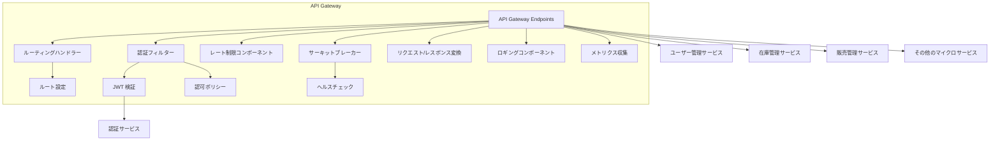

**シーケンス図（認証とルーティング）**:

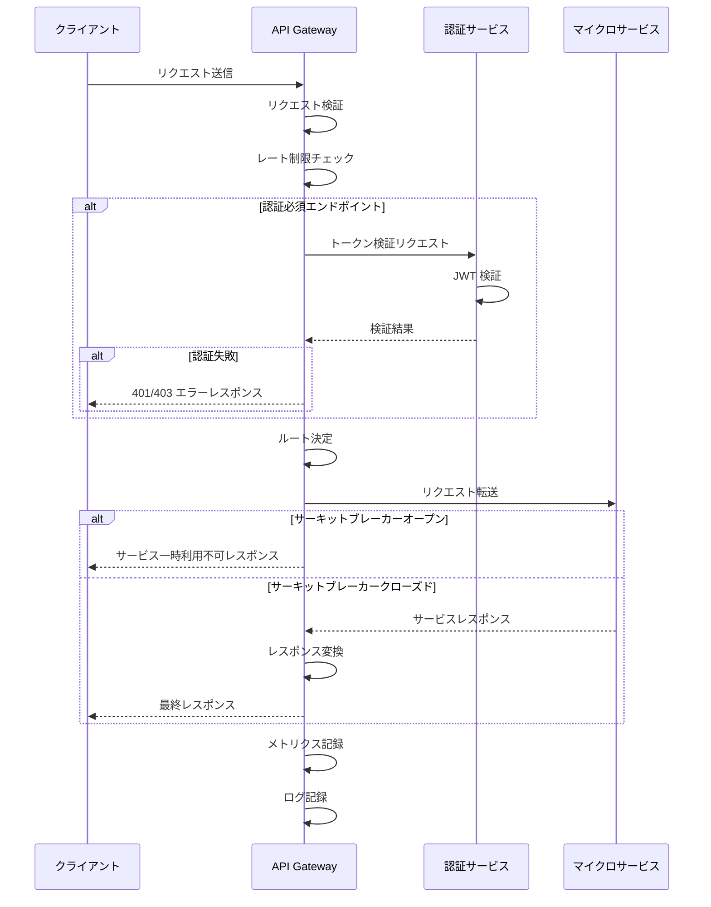

**レート制限設計**:

API Gateway で ASP.NET Core の `AddRateLimiter` を使用し、Token Bucket アルゴリズムによるレート制限を実装する。

| カテゴリ | 対象 | アルゴリズム | 閾値 | ウィンドウ | 備考 |
|---------|------|-----------|------|----------|------|
| IP ベース | 未認証リクエスト | Token Bucket | 60 req/min | — | DDoS 軽減。`X-Forwarded-For` を検証 |
| ユーザーベース | 認証済みリクエスト | Token Bucket | 120 req/min | — | ユーザー ID（JWT `sub` クレーム）で識別 |
| エンドポイント別 | `POST /auth/login` | Fixed Window | 5 req/min/IP | 1 分 | ブルートフォース防止 |
| エンドポイント別 | `POST /checkout/*` | Fixed Window | 10 req/min/user | 1 分 | 決済 API の過負荷防止 |
| エンドポイント別 | `GET /products` | Token Bucket | 300 req/min/IP | — | 商品一覧のスクレイピング防止 |

- 429 Too Many Requests レスポンスには `Retry-After` ヘッダー（秒数）を付与する
- レート制限カウンターは Redis に保存し、API Gateway の全レプリカで共有する
- Azure Front Door / WAF による DDoS 防御を多層防御の第一層として併用する
- 詳細な実装設計は `api-gateway-design.md` を参照

### 2. ユーザー管理サービス
**責務**:

- ユーザープロファイル管理（氏名、住所、電話番号、お気に入り等の拡張プロファイル情報）
- アカウント設定と環境設定管理
- パーソナライゼーション情報管理
- ユーザーアクティビティ追跡

> **注記**: ユーザー管理サービスは**拡張プロファイル情報**の管理に特化する。認証・認可・JWT 発行・セッション管理・ロール管理は AuthService の責務である。
>
> **Role/Permission テーブル所属先**: `Role`, `Permission`, `RolePermission` テーブルは **AuthService** の DB に所属する（ロール管理は AuthService の責務）。UserManagementService のエンティティ一覧から除外し、AuthService 設計書にて管理する。以下の `主要エンティティ` リストに含まれる `Role`, `Permission` は AuthService からの Kafka イベントで同期される読み取り専用ビューである。

両サービス間の通信は **Kafka イベントのみ**とし、同期 HTTP 呼出しは禁止する。
>
> - `AuthService → Kafka「UserRegistered」→ UserManagementService`（プロファイル初期化）
> - `UserManagementService → Kafka「ProfileUpdated」→ AuthService`（表示名等のキャッシュ更新）
> - `AuthService → Kafka「PasswordChanged」→ UserManagementService`（パスワード変更時のプロファイル更新通知・全セッション無効化の連携）

**主要エンティティ**:

- User
- UserPreference
- UserActivity

> **注記**: `Role`, `Permission` は AuthService が管理する。UserManagementService は AuthService からの Kafka イベントで同期された読み取り専用ビューとして参照のみ行う。

**データストア**:

- PostgreSQL（ユーザーデータ）
- Redis（セッション情報、一時データ）

**コンポーネント構成図**:

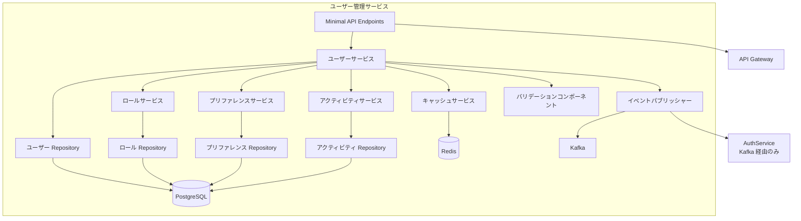

**シーケンス図（ユーザー登録プロセス）**:

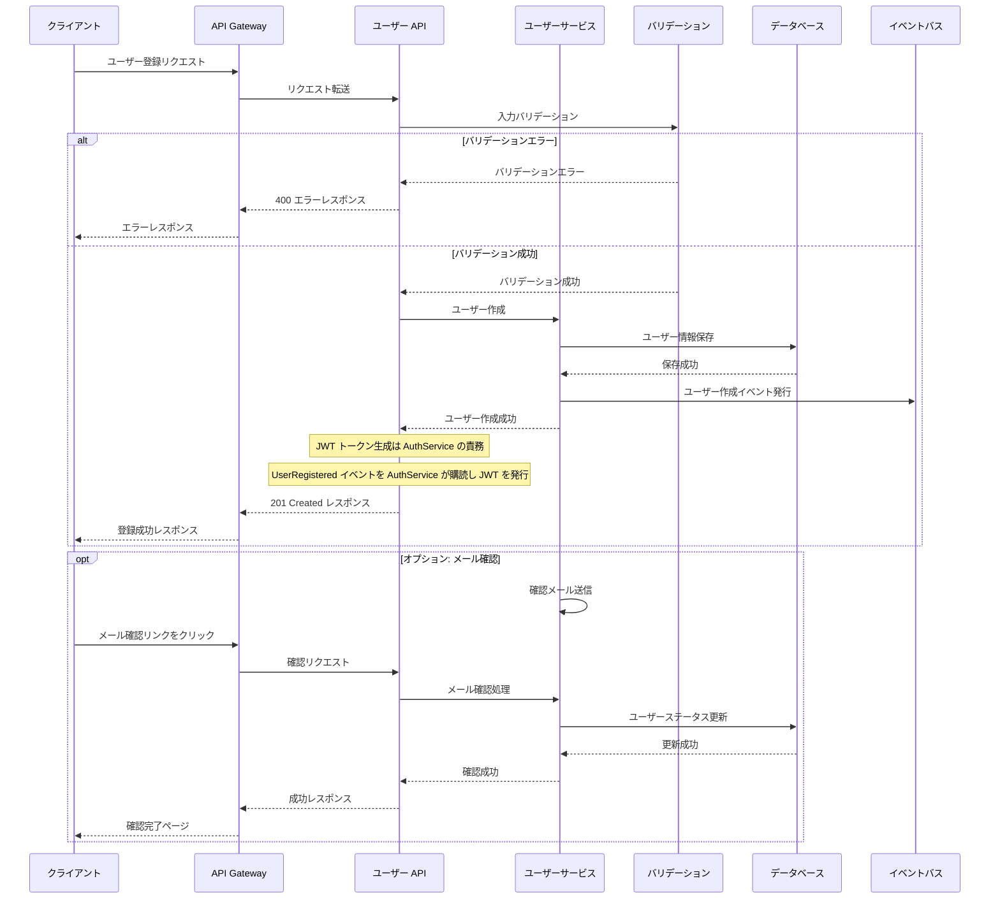

### 3. 在庫管理サービス
**責務**:

- 商品カタログ管理
- 在庫状態の追跡と更新
- 商品属性とカテゴリ管理
- 価格設定と割引管理
- 入荷・出荷オペレーション
- 商品画像とメディア管理

**主要エンティティ**:

- Product
- Category
- Inventory
- Supplier
- PriceHistory
- ProductImage

**データストア**:

- PostgreSQL（商品カタログ、属性、在庫情報、トランザクション）
- Azure Blob Storage（商品画像）

**コンポーネント構成図**:

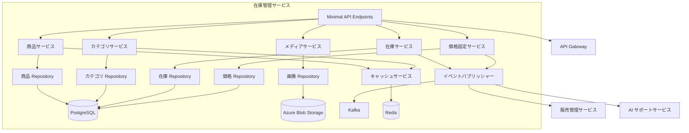

**シーケンス図（在庫更新プロセス）**:

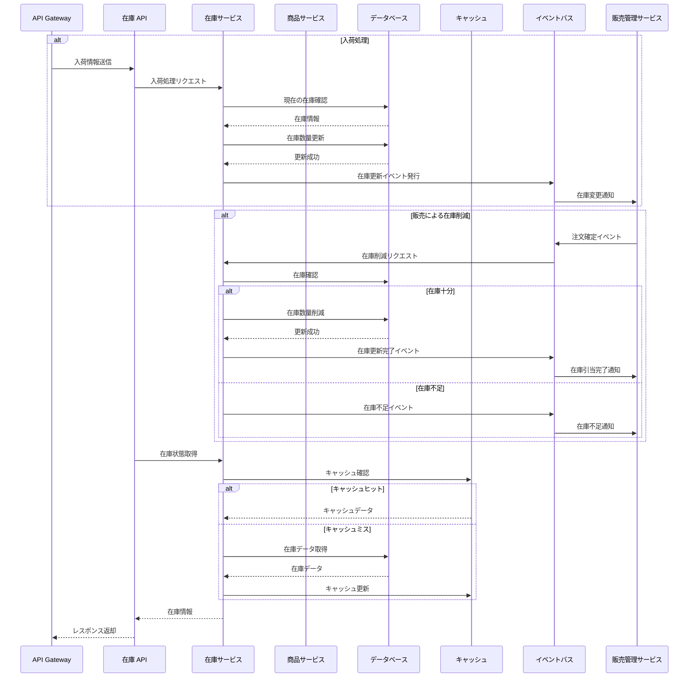

### 4. 販売管理サービス
**責務**:

- 注文処理と管理
- 売上分析とレポーティング
- 返品・交換処理
- 配送手配と追跡
- 販売履歴

**主要エンティティ**:

- Order
- OrderItem
- Shipment
- Return
- Invoice

**データストア**:

- PostgreSQL（注文、配送情報、分析データ）

**注文確定フローのアーキテクチャ方針（ADR-0009）**:

本サービスの注文確定フローは **Saga オーケストレーションパターン** を採用する。DB per Service 構成において、在庫管理・決済・ポイント等の複数サービスにまたがるトランザクションは単一の EF Core トランザクションでは実現できないため、Saga コーディネーターが各サービスへのローカルトランザクションを逐次調整する。

> **AGENTS.md §10.4 との関係**: AGENTS.md §10.4「CheckoutService の注文確定フロー」に記載された 14 ステップは、Saga の**各ステップ内で実行されるローカルトランザクション**の単位として解釈する。すなわち、各マイクロサービス内の DB 操作（例: 在庫引当、決済レコード作成）は EF Core トランザクションで原子化するが、サービス間の調整は Saga コーディネーターが担う。
>
> - **Saga ステップ 1（カート取得）**: PaymentCartService 内のローカル TX（Redis キャッシュ Hit 前提）
> - **Saga ステップ 2（在庫確認・引当）**: InventoryManagementService 内のローカル TX
> - **Saga ステップ 3（クーポン検証・適用）**: CouponService 内のローカル TX
> - **Saga ステップ 4（ポイント仮消費）**: PointService 内のローカル TX
> - **Saga ステップ 5（注文作成）**: SalesManagementService 内のローカル TX
> - **Saga ステップ 6（決済認証）**: 外部 PG（Stripe/GMO）への HTTPS 呼出し
> - **Saga ステップ 7（ポイント確定付与）**: PointService 内のローカル TX（後処理・補償対象外）
> - **Saga ステップ 8（カートクリア）**: PaymentCartService 内のローカル TX（後処理・補償対象外）
> - **Saga ステップ 9（Outbox 書込み）**: SalesManagementService 内のローカル TX（後処理・補償対象外）

**コンポーネント構成図**:

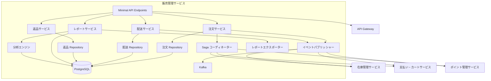

**シーケンス図（注文処理フロー）**:

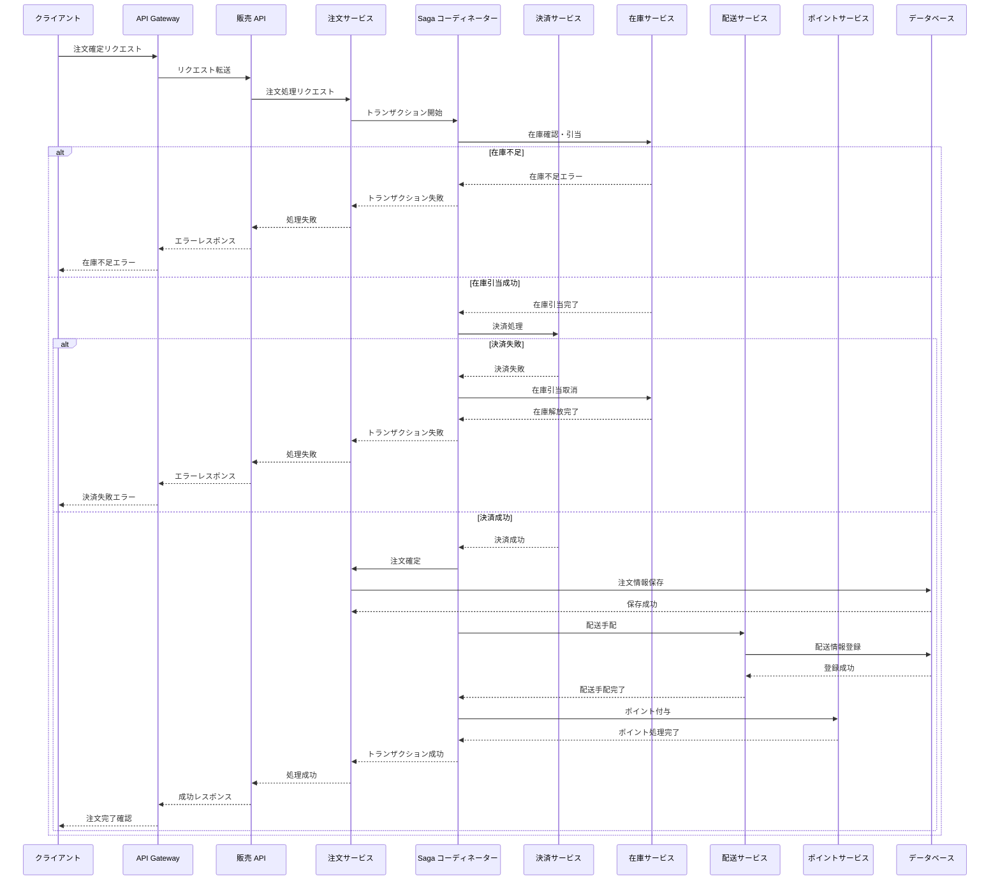

**シーケンス図（注文キャンセル・返品フロー — Saga 補償トランザクション）**:

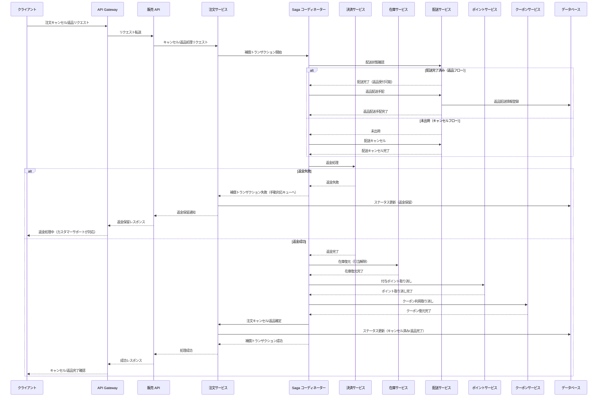

**Saga 補償トランザクションの設計原則**:
- 各ステップの補償操作は**冪等**であること（同一リクエストの再実行で副作用なし）
- 補償失敗時は Dead Letter Queue に転送し、手動対応キューで管理者がリカバリ
- 全ステップの状態遷移を `SagaLog` テーブルに記録し、監査証跡を確保
- 配送完了後の返品は「返品配送 → 返品受領確認 → 返金」のフローとなり、返品受領確認は `ShipmentService` の返品ステータス更新をトリガーとする

**Saga コーディネーター配置・耐障害性設計**:

| 項目 | 設計 |
|------|------|
| 配置サービス | **SalesManagementService 内**（`SagaCoordinator` クラスとして実装） |
| 永続化 | `saga_logs` テーブル（PostgreSQL）に各 Saga インスタンスの状態を記録 |
| SPOF 対策 | SalesManagementService は `minReplicas: 2` で冗長化。Saga 状態は DB に永続化されるため、インスタンス障害時は別インスタンスが引き継ぎ可能 |
| 障害リカバリ | `SagaRecoveryService`（`BackgroundService`）が起動時および定期的に `PROCESSING` 状態の Saga を検出し、自動再開 |
| タイムアウト | 各 Saga ステップに個別タイムアウト（デフォルト 30 秒）。全体タイムアウト 5 分（リカバリ用）。**SLO 準拠用の累積 Deadline 1,000ms**（`CancellationTokenSource(TimeSpan.FromMilliseconds(1000))`）をコーディネーターに設定し、ユーザー向け SLO 1,000ms を強制する |
| 冪等性保証 | 各ステップに `saga_step_id`（UUID）を付与し、重複実行を防止 |

**`saga_logs` テーブル設計**:

| カラム名 | 型 | 説明 |
|---------|---|------|
| `id` | `string` (UUID) | Saga インスタンス ID |
| `saga_type` | `string` | Saga 種別（`ORDER_CHECKOUT`, `ORDER_CANCEL`, `ORDER_RETURN`） |
| `order_id` | `string` (UUID) | 対象注文 ID |
| `user_id` | `string` (UUID) | 実行ユーザー ID |
| `status` | `string` | `CREATED` → `PROCESSING` → `COMPLETED` / `COMPENSATING` → `COMPENSATED` / `FAILED` |
| `current_step` | `int` | 現在実行中のステップ番号 |
| `step_results` | `jsonb` | 各ステップの実行結果 JSON |
| `started_at` | `DateTime` (UTC) | Saga 開始日時 |
| `completed_at` | `DateTime?` (UTC) | Saga 完了日時 |
| `timeout_at` | `DateTime` (UTC) | 全体タイムアウト日時 |
| `retry_count` | `int` | リトライ回数 |
| `last_error` | `string?` | 最後のエラーメッセージ |
| `created_at` | `DateTime` (UTC) | レコード作成日時 |
| `updated_at` | `DateTime` (UTC) | レコード更新日時 |
| `row_version` | `bytea` | 楽観的ロック用バージョン。`[Timestamp]` 属性で EF Core が自動管理 |

**`SagaRecoveryService` の動作**:
1. 起動時に `status = 'PROCESSING'` かつ `updated_at < NOW - INTERVAL '5 minutes'` の Saga を検索
2. 該当 Saga の `current_step` から処理を再開（各ステップは冪等なので再実行可能）
3. `timeout_at` を超過した Saga は補償トランザクションを開始して `COMPENSATING` に遷移
4. 定期ポーリング間隔: 30 秒

#### BackgroundService リーダー選出パターン
`minReplicas: 2` 以上で重複実行が問題となる BackgroundService には、以下のリーダー選出パターンを適用する:

| BackgroundService | 所属サービス | 重複実行時のリスク | 排他制御方式 |
|------------------|------------|-----------------|------------|
| `OutboxPublisher` | 各サービス | 同一イベントの二重発行 | **PostgreSQL Advisory Lock** |
| `SagaRecoveryService` | SalesManagementService | 同一 Saga の二重補償 | **`SELECT FOR UPDATE SKIP LOCKED`** |
| `MemberRankEvaluationService` | UserManagementService | 二重降格判定 | **PostgreSQL Advisory Lock** |
| `CartCleanupService` | PaymentCartService | 二重削除（安全だが無駄） | **PostgreSQL Advisory Lock** |

**方式 1: PostgreSQL Advisory Lock（推奨）**: `pg_try_advisory_lock(lock_id)` で非ブロッキングロック取得を試行し、取得できたインスタンスのみが処理を実行する。処理完了後に `pg_advisory_unlock(lock_id)` でロックを解放する。

**Advisory Lock ID 命名規約**: 複数の BackgroundService が同一 DB 内で Advisory Lock を使用する際のロック ID 衝突を防止するため、以下の命名規約を適用する:

| BackgroundService | ロック ID | 算出方法 |
|------------------|----------|---------|
| `OutboxPublisher` | `hashtext('outbox_publisher')` | サービス名のハッシュ |
| `MemberRankEvaluationService` | `hashtext('member_rank_eval')` | サービス名のハッシュ |
| `CartCleanupService` | `hashtext('cart_cleanup')` | サービス名のハッシュ |
| `PointExpiryService` | `hashtext('point_expiry')` | サービス名のハッシュ |

> **ルール**: 新規 BackgroundService を追加する場合、上記テーブルに追記し、ロック ID の一意性を確認すること。`hashtext()` は PostgreSQL 組み込み関数で、文字列から `int4` のハッシュ値を生成する。

**方式 2: SELECT FOR UPDATE SKIP LOCKED（Saga 用）**: `SagaRecoveryService` では `SELECT * FROM saga_logs WHERE status = 'PROCESSING' AND updated_at < NOW - INTERVAL '5 minutes' FOR UPDATE SKIP LOCKED LIMIT 10;` で排他的にレコードを取得する。複数インスタンスが同時にポーリングしても同一レコードを取得しないことが保証される。

**Saga ステップ別レイテンシバジェット**:

チェックアウト SLO（95 パーセンタイル 1,000ms 以内）を達成するための各ステップのレイテンシバジェットを以下に定義する:

> **注記**: 下記テーブルの 9 ステップは Saga コーディネーターが実行する**全処理ステップ**（6 つの Saga 補償対象ステップ + 後処理 3 ステップ）を網羅する。Saga 補償トランザクション対象はステップ 1〜6、ステップ 7〜9 は Saga 成功後の後処理であり補償対象外。ステップ 0（API Gateway 通過）は Saga コーディネーターのスコープ外であり、AGENTS.md §10.4 の Saga ステップ番号（1〜9）には含まれない。**Saga ステップの正規定義は AGENTS.md §10.4 を Single Source of Truth とする**。

| ステップ | 呼出先 | 通信プロトコル | バジェット<br>(処理) | HTTP/gRPC<br>オーバーヘッド | 合計 | 備考 |
|---------|--------|-------------|---------|---------|------|------|
| 0. API Gateway 通過 | ApiGateway | **HTTPS** | 20ms | 10ms | 30ms | JWT 検証 + YARP ルーティング |
| 1. カート取得 | PaymentCartService | **gRPC** | 40ms | 10ms | 50ms | Redis キャッシュ Hit 前提。gRPC でシリアライズ効率向上 |
| 2. 在庫確認・引当 | InventoryManagementService | **gRPC** | 85ms | 15ms | 100ms | `SELECT FOR UPDATE` + 在庫減算 |
| 3. クーポン検証・適用 | CouponService | **gRPC** | 65ms | 15ms | 80ms | 使用可否判定 + 使用回数更新 |
| 4. ポイント仮消費 | PointService | **gRPC** | 65ms | 15ms | 80ms | 残高確認 + 仮引き落とし |
| 5. 注文作成 | SalesManagementService（内部 DB） | **ローカル呼出し** | 100ms | 0ms | 100ms | Order + OrderItems INSERT |
| 6. 決済認証 | 外部 PG（Stripe/GMO） | **HTTPS** | 300ms | 50ms | **350ms** | 外部 API。最大変動幅あり |
| 7. ポイント確定付与 | PointService | **gRPC** | 65ms | 15ms | 80ms | 付与ポイント計算 + 加算 |
| 8. カートクリア | PaymentCartService | **gRPC** | 20ms | 10ms | 30ms | CartItems DELETE |
| 9. Outbox 書込み | SalesManagementService（内部 DB） | **ローカル呼出し** | 30ms | 0ms | 30ms | OutboxEvent INSERT |
| **合計** | — | — | **790ms** | **140ms** | **930ms** | SLO 1,000ms に対して 70ms のマージン |

**通信プロトコル選定理由**:

| プロトコル | 採用理由 | 適用ステップ |
|-----------|---------|------------|
| **gRPC** | ① バイナリシリアライズ（Protobuf）で HTTP/JSON より 3〜5 倍高速 ② HTTP/2 の多重化で接続効率向上 ③ 型安全な IDL（`.proto`）で契約を厳密化 ④ ストリーミング対応（将来の拡張性） | ステップ 1,2,3,4,7,8 |
| **ローカル呼出し** | Saga コーディネーターと同一プロセス内のため、ネットワーク不要 | ステップ 5,9 |
| **HTTPS (REST)** | 外部 PG が REST API のみ提供 | ステップ 6 |

> **Kafka Command パターンとの比較**: Saga の各ステップを Kafka Command で非同期化する案は、レイテンシ増大（Kafka のプロデュース + コンシューム ≒ 50-100ms/ホップ）により SLO 1,000ms の達成が困難であるため不採用。Saga の補償トランザクション通知は Kafka イベントで非同期通知する。

> **gRPC 導入の前提条件**:
> JWT 署名鍵ローテーション設計および Client Credentials スコープ定義は「§認証・認可」セクションを参照。

> **サービスの gRPC + REST 二重公開方針**: 各マイクロサービスは内部 Saga 用に gRPC（`SkiShop.Contracts/Protos/`）、外部 API 用に REST（`/api/v1/`）を同一サービス内で提供する。HTTP/2 を必須とし、同一ポートで gRPC と REST を多重化する（`MapGrpcService<T>` + `MapEndpoints`）。
>
> 1. 各サービスに `.proto` ファイルを定義し、Shared プロジェクト（`SkiShop.Contracts`）で管理
> 2. ASP.NET Core 10 の `Grpc.AspNetCore` パッケージを使用
> 3. .NET Aspire の `WithReference` でサービスディスカバリを活用（ハードコード URL 禁止）
> 4. Polly のリトライ・サーキットブレーカーを gRPC クライアントに適用
>
> **gRPC チャネル管理設計**:
>
> | 項目 | 設計 |
> |------|------|
> | チャネルプール | `GrpcChannelOptions.MaxRetryAttempts = 3` + `SocketsHttpHandler` による接続プール |
> | Keep-Alive | `KeepAlivePingDelay = TimeSpan.FromSeconds(60)`, `KeepAlivePingTimeout = TimeSpan.FromSeconds(10)` |
> | DI 登録 | `AddGrpcClient<TClient>` で `IHttpClientFactory` 経由のチャネル管理。`new GrpcChannel` 直接生成は禁止 |
> | ロードバランシング | `Grpc.Net.Client` の DNS ラウンドロビン（`DnsResolverFactory`）によるクライアントサイド LB。Azure Container Apps の内部 DNS サービスディスカバリと組み合わせて使用。将来的に Dapr サイドカーでの transparent LB も検討 |
> | 接続数上限 | `MaxConnectionsPerServer = 100`（デフォルト）。ピーク時に不足する場合はスケールアウトで対応 |


>
> **gRPC サービス定義（Saga 関連）**:
>
> ```protobuf
> // SkiShop.Contracts/Protos/inventory.proto
> service InventoryService {
> rpc ReserveInventory (ReserveInventoryRequest) returns (ReserveInventoryResponse);
> rpc ReleaseReservation (ReleaseReservationRequest) returns (ReleaseReservationResponse);
> }
>
> // SkiShop.Contracts/Protos/coupon.proto
> service CouponService {
> rpc ValidateCoupon (ValidateCouponRequest) returns (ValidateCouponResponse);
> rpc ReleaseCoupon (ReleaseCouponRequest) returns (ReleaseCouponResponse);
> }
>
> // SkiShop.Contracts/Protos/point.proto
> service PointService {
> rpc ReservePoints (ReservePointsRequest) returns (ReservePointsResponse);
> rpc ReleasePoints (ReleasePointsRequest) returns (ReleasePointsResponse);
> rpc AwardPoints (AwardPointsRequest) returns (AwardPointsResponse);
> }
>
> // SkiShop.Contracts/Protos/cart.proto
> service CartService {
> rpc GetCart (GetCartRequest) returns (GetCartResponse);
> rpc ClearCart (ClearCartRequest) returns (ClearCartResponse);
> }
>
> // SkiShop.Contracts/Protos/payment.proto
> service PaymentService {
> rpc ProcessPayment (ProcessPaymentRequest) returns (ProcessPaymentResponse);
> rpc Refund (RefundRequest) returns (RefundResponse);
> }
> ```
> メッセージ型の詳細定義は各サービスの設計書を参照。
>
> **gRPC バージョニング戦略**: `.proto` ファイルの `package` は `skishop.{service}.v1` 形式を採用する（例: `package skishop.inventory.v1;`）。破壊的変更時は `v2` パッケージを新設し、旧バージョンは最低 2 リリースサイクル維持する。gRPC サービスパスで暗黙的にバージョンが分離されるため、REST の URI ベースバージョニングと整合する。


> **gRPC Deadline 設計**:
> 各 Saga ステップの gRPC 呼出しに Deadline（タイムアウト）を設定し、SLO 超過時に速やかに補償トランザクションを開始する:
>
> | ステップ | gRPC Deadline | 根拠 |
> |---------|-------------|------|
> | 1. カート取得 | 200ms | バジェット 50ms の 4 倍マージン（Redis 障害時の DB フォールバック考慮） |
> | 2. 在庫確認・引当 | 500ms | バジェット 100ms の 5 倍マージン（`SELECT FOR UPDATE` ロック待ち考慮） |
> | 3. クーポン検証 | 300ms | バジェット 80ms の 3.75 倍マージン |
> | 4. ポイント仮消費 | 300ms | バジェット 80ms の 3.75 倍マージン |
> | 7. ポイント確定 | 300ms | バジェット 80ms の 3.75 倍マージン |
> | 8. カートクリア | 200ms | バジェット 30ms の 6.7 倍マージン |
>
> ```csharp
> // gRPC Deadline の設定例
> var deadline = timeProvider.GetUtcNow.AddMilliseconds(500).UtcDateTime;  // TimeProvider 経由
> var callOptions = new CallOptions(deadline: deadline, cancellationToken: ct);
> var response = await inventoryClient.ReserveInventoryAsync(request, callOptions);
> ```
>
> Deadline 超過時は `Grpc.Core.RpcException` (StatusCode = DeadlineExceeded) がスローされ、Saga の補償トランザクションが即座に開始される。

> **ステップ 5（ローカル DB）失敗時の補償設計**:
> ステップ 5（注文作成）はローカル DB トランザクションであり、失敗時は `transaction.RollbackAsync` で即座にロールバックされる（DB レベルの原子性が保証）。ローカル TX ロールバック後、Saga コーディネーターはステップ 4（ポイント仮消費）→ ステップ 3（クーポン検証）→ ステップ 2（在庫引当）の逆順で補償を実行する。ステップ 1（カート取得）は読取り専用のため補償は No-op（何もしない）。ステップ 6（決済認証）以降に到達した場合は、ステップ 6→5→4→3→2 の逆順で補償する（コード例の OrderCreationSaga 参照）。
>
> **SLO Deadline（1,000ms）と Recovery タイムアウト（5 分）の関係**:
> - **SLO Deadline（1,000ms）**: ユーザー向け SLO 強制用。累積 Deadline 超過時は残ステップをスキップし、クライアントに即座に 503 を返却。Saga を `COMPENSATING` に遷移させ補償を開始する。個別 gRPC Deadline は累積 Deadline の残り時間と `Math.Min` で適用される。
> - **Recovery タイムアウト（5 分）**: `SagaRecoveryService` が `PROCESSING` 状態のまま滞留した Saga を検出するための安全弁。プロセス障害・OOM Kill 等でコーディネーターが異常終了した場合の救済用。

> **注記**: 決済認証（ステップ 6）が最大のレイテンシ消費源。外部 PG のレスポンスタイムが SLO 1,000ms の 35% を占める。PG 側の P99 レイテンシが 500ms を超過する場合は SLO の見直しが必要。
>
> **決済タイムアウト時の Saga 状態遷移**:
> ステップ 6 で Stripe API がタイムアウト（`DeadlineExceeded`）した場合、決済結果が不明（Pending）の状態となる。この場合:
> 1. Saga を `PENDING_PAYMENT` 状態に遷移（補償は**開始しない**）
> 2. `SagaRecoveryService` が 30 秒間隔で Stripe API（`PaymentIntent.Retrieve`）をポーリングし決済結果を確認
> 3. **成功確認**: Saga を `PROCESSING` に戻し、ステップ 7 以降を再開
> 4. **失敗確認 or 30 分タイムアウト**: Saga を `COMPENSATING` に遷移し、ステップ 5→1 の逆順補償を開始
> 5. ユーザーには「お支払い処理中です。確定次第メールでお知らせします」を即時返却

**注文作成のべき等性設計**:

ネットワーク障害時のクライアントリトライによる二重注文を防止するため、`POST /api/v1/orders` に Idempotency-Key ヘッダーを導入する。

| 項目 | 設計 |
|------|------|
| ヘッダー | `Idempotency-Key: {client-generated-uuid}` |
| 必須/任意 | 必須（未指定の場合 `400 Bad Request`） |
| TTL | 24 時間（TTL 経過後は同一キーで新規注文可能） |
| 重複リクエスト処理 | キャッシュされたレスポンスを返却（同一ステータスコード・ボディ） |
| 処理中リクエスト | `409 Conflict`（別リクエストが処理中） |

`idempotency_keys` テーブル設計:

| カラム名 | 型 | 説明 |
|---------|---|------|
| `id` | `string` (UUID) | レコード ID |
| `idempotency_key` | `string` | クライアント提供のべき等性キー |
| `user_id` | `string` (UUID) | リクエストユーザー ID |
| `request_status` | `string` | 処理ステータス（PENDING / PROCESSING / COMPLETED） |
| `response_status` | `int?` | レスポンスの HTTP ステータスコード |
| `response_body` | `jsonb?` | キャッシュされたレスポンスボディ |
| `created_at` | `DateTime` (UTC) | レコード作成日時 |
| `expires_at` | `DateTime` (UTC) | 有効期限（`created_at` + 24 時間） |

インデックス:
- `UNIQUE (idempotency_key, user_id)` — 同一ユーザー・同一キーの一意制約
- `(expires_at)` — 期限切れレコードの定期クリーンアップ用

処理フロー:
1. リクエスト受信 → `idempotency_keys` テーブルを `(idempotency_key, user_id)` で検索
2. 既存キーあり + `request_status = 'COMPLETED'` → キャッシュされたレスポンスを返却（べき等）
3. 既存キーあり + `request_status = 'PROCESSING'` → 処理中（`409 Conflict` を返却）
4. 既存キーなし → 新規挿入（`request_status = 'PENDING'`）して Saga 開始 → 即座に `request_status = 'PROCESSING'` に更新
5. Saga 完了後 → `request_status = 'COMPLETED'`、`response_status` と `response_body` を更新
6. 期限切れレコードは `BackgroundService` で日次クリーンアップ

### 5. AI 対応サポートサービス
**責務**:

- パーソナライズド商品レコメンデーション
- 検索最適化とオートコンプリート
- チャットボットによるカスタマーサポート
- 需要予測
- ユーザー行動分析

**技術スタック**:

- Azure AI Services
- Azure OpenAI Service
- Semantic Kernel 1.x
- ベクトルデータベース（Qdrant 等）

**データフロー**:

- ユーザー行動データの収集
- 商品レコメンデーションモデルのトレーニングとデプロイ
- リアルタイムレコメンデーションと検索強化

**コンポーネント構成図**:

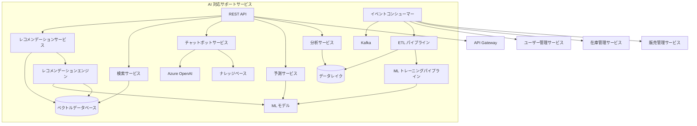

**シーケンス図（商品レコメンデーション）**:

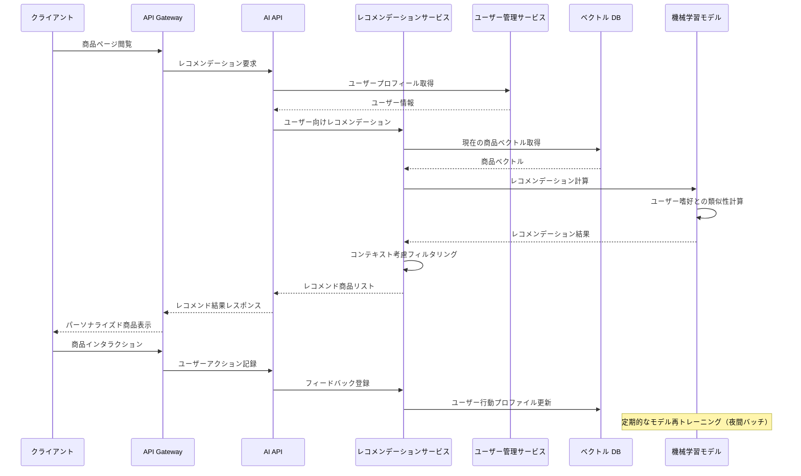

#### SSRF 防止設計
AI サポートサービスは外部 AI プロバイダー（Azure OpenAI 等）への HTTP リクエストを発行するため、SSRF（Server-Side Request Forgery）攻撃のリスクが存在する。以下の多層防御を実装する。

**URL ホワイトリスト**:

許可するリクエスト送信先を明示的に制限する。ホワイトリスト外のドメインへのリクエストは全て拒否する。

| 許可ドメイン | 用途 |
|------------|------|
| `*.openai.azure.com` | Azure OpenAI Service API |
| `*.cognitiveservices.azure.com` | Azure Cognitive Services |
| `*.search.windows.net` | Azure AI Search |
| `localhost`（開発環境のみ） | ローカル開発時のモックサービス |
| 自社 API エンドポイント（`api.skieshop.com`） | 内部 API 連携 |

**プライベート IP アドレスの拒否**:

DNS 解決後の IP アドレスが以下のプライベート/予約済み範囲に該当する場合、リクエストを拒否する:

| CIDR 範囲 | 説明 |
|----------|------|
| `10.0.0.0/8` | クラス A プライベートネットワーク |
| `172.16.0.0/12` | クラス B プライベートネットワーク |
| `192.168.0.0/16` | クラス C プライベートネットワーク |
| `169.254.0.0/16` | リンクローカルアドレス（APIPA） |
| `127.0.0.0/8` | ループバックアドレス |
| `::1/128` | IPv6 ループバック |
| `fc00::/7` | IPv6 ユニークローカルアドレス |
| `0.0.0.0/8` | 現在のネットワーク |

**DNS リバインディング対策**:

DNS 解決後に得られた IP アドレスを再検証し、DNS リバインディング攻撃を防止する。DNS 解決はリクエスト直前に 1 回のみ実行し、キャッシュされた結果を使い回さない。

**リクエストサイズ制限**:

| 方向 | 制限 | 目的 |
|------|------|------|
| ユーザー入力（プロンプト） | 最大 10KB | 過大なプロンプトによるリソース消費防止 |
| AI レスポンス | 最大 1MB | 異常応答によるメモリ枯渇防止 |
| 接続タイムアウト | 30秒 | 遅延応答による接続枯渇防止 |

**C# 実装ヒント（HttpClient メッセージハンドラー）**:

```csharp
// ✅ SSRF 防止用カスタム DelegatingHandler
public class SsrfPreventionHandler(
    IOptions<AllowedHostsOptions> allowedHosts,
    ILogger<SsrfPreventionHandler> logger) : DelegatingHandler
{
    private static readonly IPNetwork[] BlockedNetworks =
    [
        IPNetwork.Parse("10.0.0.0/8"),
        IPNetwork.Parse("172.16.0.0/12"),
        IPNetwork.Parse("192.168.0.0/16"),
        IPNetwork.Parse("169.254.0.0/16"),
        IPNetwork.Parse("127.0.0.0/8"),
    ];

    protected override async Task<HttpResponseMessage> SendAsync(
        HttpRequestMessage request, CancellationToken ct)
    {
        var host = request.RequestUri?.Host
            ?? throw new InvalidOperationException("リクエスト URI が未設定です");

        // 1. ホワイトリスト検証
        if (!allowedHosts.Value.IsAllowed(host))
        {
            logger.LogWarning("SSRF 防止: 許可されていないホスト: {Host}", host);
            throw new SecurityException($"許可されていないホストへのリクエスト: {host}");
        }

        // 2. DNS 解決後の IP アドレス検証
        var addresses = await Dns.GetHostAddressesAsync(host, ct);
        foreach (var address in addresses)
        {
            if (BlockedNetworks.Any(network => network.Contains(address)))
            {
                logger.LogWarning("SSRF 防止: プライベート IP 検出: {Host} -> {IP}", host, address);
                throw new SecurityException($"プライベート IP アドレスへのリクエストは禁止されています");
            }
        }

        return await base.SendAsync(request, ct);
    }
}

// ✅ Program.cs での登録
builder.Services.AddHttpClient<IAzureOpenAiClient, AzureOpenAiClient>
    .AddHttpMessageHandler<SsrfPreventionHandler>
    .AddStandardResilienceHandler;
```

### 6. 支払い・カート処理サービス
**責務**:

- ショッピングカート管理
- 支払い処理とゲートウェイ連携
- 価格計算と税金計算
- 注文確認と領収書生成
- 決済セキュリティ（PCI DSS 対応）

**主要エンティティ**:

- Cart
- CartItem
- Payment
- PaymentMethod
- Transaction

**データストア**:

- PostgreSQL（カート永続化、支払い記録、トランザクション）
- Redis（カート読取りキャッシュ — Write-Through パターン）

> **注記**: カートデータは **PostgreSQL に永続化**し、**Redis を読取りキャッシュ**として使用する（Write-Through パターン）。書込み時は PostgreSQL に書込んだ後に Redis キャッシュを更新し、読取り時は Redis から読取る（Cache Miss 時は PostgreSQL から読取り・Redis にキャッシュ）。これにより、Redis 障害時もカートデータが失われないことを保証する。
>
> - **カート TTL**: 未ログインカートは Redis TTL 7 日、PostgreSQL は 30 日で自動削除（`CartCleanupService: BackgroundService`）
> - **ログイン時マージ**: ユーザーログイン成功時に未ログインカートをユーザーカートにマージ

**コンポーネント構成図**:

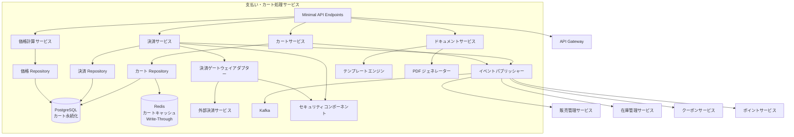

**シーケンス図（カート追加と支払いプロセス）**:

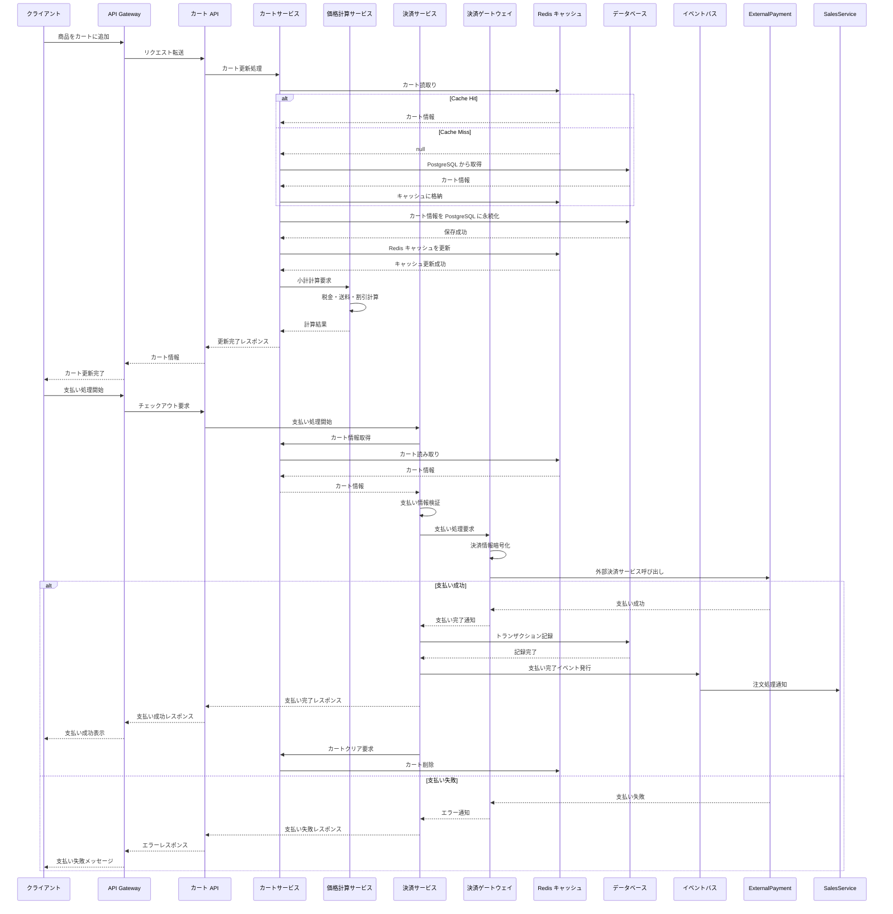

#### ウィッシュリスト（お気に入り）機能
高単価スキー用品（AOV ¥25,000）の購買特性として、ユーザーが比較検討期間を要するケースが多い。ウィッシュリスト機能により、検討中の商品を保存し、在庫復活時に通知を受け取ることができる。

**データモデル（UserManagementService）**:

| エンティティ | 説明 | 主要属性 |
|------------|------|---------|
| Wishlist | ウィッシュリスト | id, userId (FK→User), name, isDefault, createdAt, updatedAt |
| WishlistItem | ウィッシュリスト明細 | id, wishlistId (FK→Wishlist), productId, addedAt, notifyOnRestock, notifiedAt |

**API エンドポイント**:

| メソッド | エンドポイント | 説明 | 認可 |
|---------|-------------|------|------|
| GET | `/wishlists` | ユーザーのウィッシュリスト一覧取得 | `RequireAuthorization` |
| POST | `/wishlists` | ウィッシュリスト作成 | `RequireAuthorization` |
| GET | `/wishlists/{id}/items` | ウィッシュリスト内商品一覧取得 | `RequireAuthorization` |
| POST | `/wishlists/{id}/items` | ウィッシュリストに商品追加 | `RequireAuthorization` |
| DELETE | `/wishlists/{id}/items/{itemId}` | ウィッシュリストから商品削除 | `RequireAuthorization` |
| POST | `/wishlists/{id}/items/{itemId}/cart` | ウィッシュリストからカートに移動 | `RequireAuthorization` |

**在庫復活通知連携**:
- `WishlistItem.notifyOnRestock = true` の場合、`InventoryManagementService` が `inventory.stock_updated` イベントを発行し、`UserManagementService` が購読
- 在庫が 0 → 1 以上に変化した商品について、該当する `WishlistItem` のユーザーに `MailSendService` 経由で在庫復活通知メールを送信
- 通知済みの `WishlistItem` には `notifiedAt` を記録し、同一商品への重複通知を防止

#### ゲスト購入フロー
会員登録を行わずに購入を完了できるフローを提供し、カート離脱率の低減と CVR 向上を実現する。

**フロー概要**:

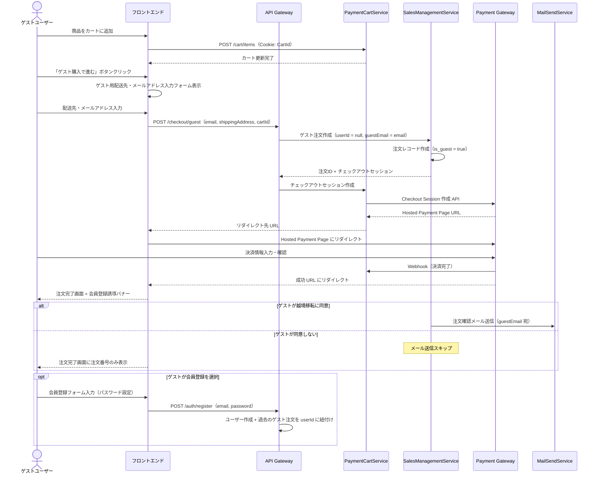

**ゲスト購入の設計ルール**:
- ゲスト注文の `orders.user_id` は `NULL`。代わりに `orders.guest_email` カラム（暗号化保存）で識別
- カート管理は既存の Cookie ベース（`CartId`）をそのまま流用（認証不要）
- ゲスト注文にはポイント付与・クーポン適用を**行わない**（会員特典は会員登録後に有効化）
- 注文確認メールは `guest_email` 宛に送信。注文追跡は注文番号 + メールアドレスで認証
- 購入完了画面で会員登録を促すバナーを表示（「会員登録で次回 500 ポイント付与」等のインセンティブ）
- 会員登録時に過去のゲスト注文（同一メールアドレス）を自動的にユーザーアカウントに紐付け
- **ゲスト購入時メールアドレス確認**: ゲストチェックアウトではメールアドレスの 2 回入力一致検証を必須とする。1 回目と 2 回目の入力値が一致しない場合はインラインエラーを表示し、注文確定に進めない。これにより注文確認メールの誤送信を防止する
- **越境データ移転同意**: ゲスト用配送先・メールアドレス入力フォームに以下を追加:
  1. プライバシーポリシーリンク（利用目的の通知 — 個人情報保護法 第21条準拠）
  2. 越境データ移転の同意チェックボックス:
     - 表示文言: 「注文確認メールの送信のため、入力されたメールアドレスおよび注文情報を米国に所在するメール配信サービス（SendGrid）に提供します。[詳細はプライバシーポリシーをご確認ください]（リンク）」
     - 同意は**オプトイン**（デフォルト未選択）方式とする
  3. 同意しない場合: メール送信をスキップし、注文完了画面で注文番号のみを表示（メール以外の手段で注文確認情報を提供）
  4. 同意ログ: ゲストの同意取得日時・IP アドレス・同意バージョンを `orders.guest_consent_metadata`（JSONB）に記録
- **個人情報利用目的の通知**: ゲスト用配送先・メールアドレス入力フォームに以下を含める:
  1. 入力フォーム上部に利用目的の要約テキスト: 「ご入力いただいた個人情報は、ご注文の処理・配送・注文確認メールの送信に使用します。[プライバシーポリシー]（リンク）」
  2. プライバシーポリシーページへのリンク（別タブで開く）
  3. 「プライバシーポリシーに同意する」チェックボックス（必須）

**Order エンティティ拡張（ゲスト購入対応）**:

| カラム名 | 型 | 説明 |
|---------|---|------|
| `is_guest` | `bool` | ゲスト購入フラグ（デフォルト: `false`） |
| `guest_email` | `string?` | ゲスト購入時のメールアドレス（AES-256 暗号化保存） |

### 7. 認証サービス (OAuth)
**責務**:

- OAuth 2.0/OpenID Connect フロー処理
- JWT トークンの生成と検証
- ソーシャルログイン連携
- 多要素認証（MFA）
- セッション管理

**技術スタック**:

- ASP.NET Core Identity
- Microsoft.Identity.Web
- JWT（System.IdentityModel.Tokens.Jwt）

**セキュリティ機能**:

- トークンベース認証
- アクセストークンとリフレッシュトークン管理
- スコープベースの認可制御
- トークン失効管理

**コンポーネント構成図**:

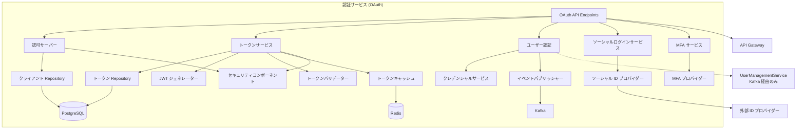

**シーケンス図（OAuth 認証フロー）**:

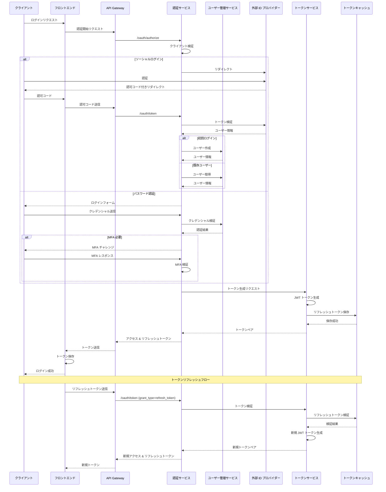

### 8. 商品販売ウェブサイト（フロントエンド）
**責務**:

- レスポンシブ Web インターフェースの提供
- ユーザーエクスペリエンスの最適化
- クライアントサイドパフォーマンスの最適化
- 多言語サポート
- SEO 最適化

**技術スタック**:

- Next.js（React）
- TypeScript
- TailwindCSS
- Redux/Zustand


#### レスポンシブデザイン方針
**モバイルファースト設計**: 全画面をモバイル（xs: < 640px）を基準に設計し、デスクトップ向けにプログレッシブに拡張する。

**ブレークポイント定義**: レスポンシブデザインのブレークポイントは `front-end-need.md` §4.5 に定義。以下に概要を記載:

| ブレークポイント | 幅 | 対象デバイス |
|---------------|------|------------|
| xs | < 640px | スマートフォン（縦） |
| sm | ≥ 640px | スマートフォン（横） |
| md | ≥ 768px | タブレット |
| lg | ≥ 1024px | デスクトップ |
| xl | ≥ 1280px | ワイドデスクトップ |

> 詳細は [front-end-need.md §4.5](front-end-need.md) を参照。

**タッチターゲットサイズ**:
- 最小タッチターゲット: **44 × 44 px**（WCAG 2.5.5 Level AAA 推奨値を AA 基準として採用）
- ボタン間のスペース: **8px 以上**（誤タップ防止）
- モバイルでの CTA ボタン: 幅 100%（フルワイド）

**アクセシビリティ（WCAG 2.1 AA 準拠）**:

本システムのフロントエンドは **WCAG 2.1 Level AA** に準拠し、障がいを持つユーザーを含む全ユーザーが利用可能な UI を提供する。

| WCAG 原則 | 実装方針 | 対象コンポーネント |
|----------|---------|-----------------|
| **知覚可能（Perceivable）** | | |
| 1.1.1 テキスト代替 | 全ての `` に意味のある `alt` 属性を設定。装飾画像は `alt=""` + `aria-hidden="true"` | 商品画像、バナー、アイコン |
| 1.3.1 情報と関係性 | セマンティック HTML（`<nav>`, `<main>`, `<article>`, `<section>`）を使用。見出しレベル（h1-h6）を論理的に構造化 | 全ページ |
| 1.4.3 コントラスト比（最低限） | 通常テキスト: **4.5:1 以上**、大きなテキスト（18px 以上 / 14px 太字以上）: **3:1 以上** | 全テキスト要素 |
| 1.4.4 テキストのサイズ変更 | テキストを 200% まで拡大してもコンテンツや機能が失われない。`rem`/`em` 単位で指定し、`px` 固定を避ける | 全テキスト要素 |
| 1.4.10 リフロー | 幅 320px（ズーム 400%）でも水平スクロールなしにコンテンツが閲覧可能 | 全ページ |
| 1.4.11 非テキストのコントラスト | UI コンポーネント（ボタン、入力フィールド枠線）と背景のコントラスト比 **3:1 以上** | フォーム要素、ボタン |
| 1.4.12 テキストの間隔 | 行間 1.5 倍、段落間 2 倍、字間 0.12em、語間 0.16em に変更してもコンテンツが切れない | 全テキスト要素 |
| **操作可能（Operable）** | | |
| 2.1.1 キーボード操作 | 全機能を Tab / Enter / Space / 矢印キーで操作可能にする。`:focus-visible` スタイルを全インタラクティブ要素に適用 | ナビゲーション、フォーム、モーダル |
| 2.4.3 フォーカス順序 | DOM 順序とビジュアル順序を一致させる。モーダル表示時はフォーカストラップを実装 | モーダル、ドロワー |
| 2.4.5 複数の手段 | 各ページへの到達手段を 2 つ以上提供（ナビゲーション + サイトマップ + 検索） | 全ページ |
| 2.4.6 見出しとラベル | 見出し・ラベルがコンテンツの主題や目的を説明する。曖昧な見出し（「その他」等）を避ける | 全ページ |
| 2.4.7 フォーカスの可視化 | フォーカスリングを視覚的に表示（`outline` を削除しない。カスタマイズする場合は `2px solid` 以上） | 全インタラクティブ要素 |
| **理解可能（Understandable）** | | |
| 3.1.1 ページの言語 | `<html lang="ja">` を設定。多言語ページでは `lang` 属性で言語切替を明示 | 全ページ |
| 3.2.3 一貫したナビゲーション | 複数ページで繰り返し登場するナビゲーションは、相対的な順序を一貫させる | ヘッダー、フッター、サイドバー |
| 3.2.4 一貫した識別 | 同じ機能のコンポーネントは一貫した名前・アイコン・ラベルを使用 | 全 UI コンポーネント |
| 3.3.1 エラーの特定 | フォームエラーをテキストで明示（色だけに依存しない）。`aria-describedby` でエラーメッセージを関連付け | 全フォーム |
| 3.3.2 ラベルまたは説明 | 全ての `<input>` に `<label>` を紐付け。プレースホルダーをラベル代わりにしない | 全フォーム |
| 3.3.3 エラー修正候補（C7/） | エラー検出時、修正候補を自動提案（郵便番号→住所補完、メールアドレスドメインサジェスト等）。`aria-describedby` でエラーメッセージと修正候補を関連付け | 全フォーム |
| 3.3.4 エラー回避（法的、金融、データ） | 注文確定は「確認→修正→確定」の 3 ステップフローを必須とする。詳細は下記「注文確認画面 UI 要件」を参照 | チェックアウトフロー |
| 1.4.13 ホバーまたはフォーカスで表示されるコンテンツ | ツールチップ・ポップオーバー等のホバー/フォーカスで表示されるコンテンツは (1) 非表示にできる (2) ポインタで移動可能 (3) 永続的に表示される の 3 条件を満たす | ツールチップ、ドロップダウン、ポップオーバー |
| **堅牢（Robust）** | | |
| 4.1.2 名前、役割、値 | カスタムコンポーネントに適切な `role`, `aria-label`, `aria-expanded`, `aria-selected` を付与 | カスタム UI コンポーネント |
| 4.1.3 ステータスメッセージ | ステータスメッセージ（カート追加成功、フォーム送信完了、検索結果件数等）を `role="status"` + `aria-live="polite"` で支援技術に通知する。エラーメッセージは `role="alert"` + `aria-live="assertive"` を使用 | トースト通知、カート更新、検索結果、フォーム送信 |

**ステータスメッセージの実装パターン（WCAG SC 4.1.3）**:

| メッセージ種別 | ARIA 属性 | 通知タイミング | 例 |
|-------------|----------|-------------|-----|
| 成功通知 | `role="status"` + `aria-live="polite"` | ユーザーアクション後 | 「カートに追加しました」「プロフィールを更新しました」 |
| エラー通知 | `role="alert"` + `aria-live="assertive"` | バリデーション失敗時 | 「メールアドレスの形式が正しくありません」 |
| 進行状況 | `role="progressbar"` + `aria-valuenow` | 非同期処理中 | 「注文処理中...（3/5 ステップ完了）」 |
| 検索結果件数 | `role="status"` + `aria-live="polite"` | 検索実行後 | 「150 件の商品が見つかりました」 |
| 在庫状態変化 | `role="status"` + `aria-live="polite"` | リアルタイム更新時 | 「残り 3 点」 |


#### エラーメッセージ UX ガイドライン
**表示方式の使い分け**:

| 表示方式 | 用途 | 表示位置 | 消去タイミング | アクセシビリティ |
|---------|------|---------|-------------|---------------|
| **インラインエラー** | フォームバリデーションエラー | 対象フィールドの直下 | ユーザーが修正するまで表示し続ける | `aria-describedby` でフィールドと関連付け |
| **トースト通知** | 成功通知・軽微な警告 | 画面右上（固定位置） | 5 秒後に自動消去 + 手動閉じボタン | `role="status"` + `aria-live="polite"` |
| **バナー通知** | セッション切れ・メンテナンス通知 | ページ上部（固定帯） | ユーザーが閉じるまで表示 | `role="alert"` + 閉じるボタン |
| **モーダルダイアログ** | 破壊的操作の確認・重大エラー | 画面中央（オーバーレイ） | ユーザーが明示的に閉じるまで | `role="alertdialog"` + フォーカストラップ |

**エラーメッセージの優先度ルール**:

| 優先度 | エラー種別 | 表示方式 | 例 |
|-------|----------|---------|-----|
| P1（即時対応必須） | 決済失敗・在庫切れ・セッション切れ | モーダル or バナー | 「決済に失敗しました。別の支払方法をお試しください」 |
| P2（要修正） | フォーム入力エラー | インライン | 「メールアドレスの形式が正しくありません」 |
| P3（情報提供） | 操作成功・軽微な警告 | トースト | 「カートに追加しました」 |

**エラーメッセージの文言ルール**:
1. 何が起こったかを簡潔に説明する（技術的詳細は含めない）
2. 修正方法を具体的に提示する（WCAG 3.3.3）
3. 色だけに依存しない（アイコン + テキストを併用）
4. i18n 対応: `.resx`（バックエンド）/ `.json`（フロントエンド）で多言語管理
5. スタックトレース・内部エラーコードはユーザーに表示しない（`DetailedErrors: false`）

**色非依存の情報伝達**: エラー表示、ステータス表示、在庫状態等は、色だけでなくテキストラベル・アイコン・パターンを併用して情報を伝達する（色覚多様性への対応）。

#### 注文確認画面 UI 要件
注文確定（決済を伴うトランザクション）は WCAG 2.1 SC 3.3.4（Level AA）の要件を満たすため、以下の「確認→修正→確定」フローを**必須**とする:

**ステップ 1: 注文確認画面（Review Order）**

| UI 要素 | 要件 | アクセシビリティ属性 |
|---------|------|-------------------|
| 注文内容一覧 | 全商品名・数量・単価・小計を表形式で表示 | `<table>` + `<caption>注文内容一覧</caption>` + 適切な `<th scope>` |
| 配送先住所 | 配送先の全住所を表示。「変更」リンク付き | `<a href="..." aria-label="配送先住所を変更する">変更</a>` |
| 支払い方法 | 選択済みの支払い方法を表示。「変更」リンク付き | 同上 |
| クーポン/ポイント | 適用済みのクーポンコード・使用ポイント数を表示。「変更」リンク付き | 同上 |
| 金額サマリー | 小計・送料・割引額・税額・**合計金額**を明示 | `aria-live="polite"` で動的更新を通知 |
| 確定ボタン | 「**¥XX,XXX で注文を確定する**」（金額を含む明示的ラベル） | `<button type="submit" aria-describedby="order-total-summary">` |
| キャンセルリンク | 「カートに戻る」リンクを常に表示 | `<a href="/cart">カートに戻る</a>` |

**ステップ 2: 確定後の通知**

| UI 要素 | 要件 | アクセシビリティ属性 |
|---------|------|-------------------|
| 成功通知 | 「ご注文を承りました。注文番号: XXXX」を画面上部に表示 | `<div role="alert" aria-live="assertive">` |
| 注文詳細リンク | 注文詳細ページへのリンクを提供 | — |
| メール通知 | 注文確認メールの送信先を表示 | — |

**禁止パターン**:
- ✗ 金額表示なしの「注文する」ボタン
- ✗ 確認画面をスキップする「ワンクリック購入」（初回注文時）
- ✗ 修正手段のない確認画面（全セクションに「変更」リンク必須）
- ✗ 確定後に取消手段がない設計（注文直後のキャンセルボタンまたは猶予期間の明示）

**コンポーネント構成図**:

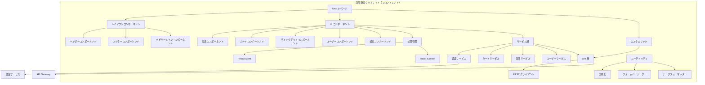

**シーケンス図（商品閲覧と購入フロー）**:

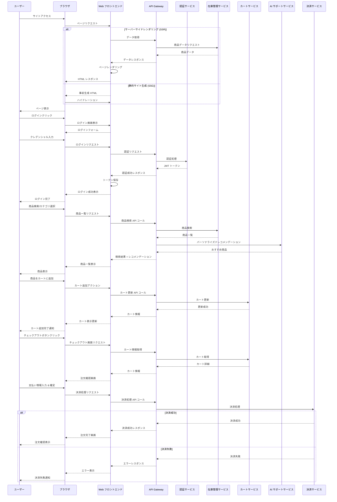

### 9. クーポンサービス
**責務**:

- クーポンの作成と管理
- クーポン配布ルールの設定
- クーポンの適用とバリデーション
- キャンペーン管理
- クーポン使用追跡

**主要エンティティ**:

- Coupon
- CouponType
- CouponUsage
- Campaign
- Promotion

**データストア**:

- PostgreSQL（クーポンデータ）
- Redis（アクティブクーポン、キャッシュ）

**コンポーネント構成図**:

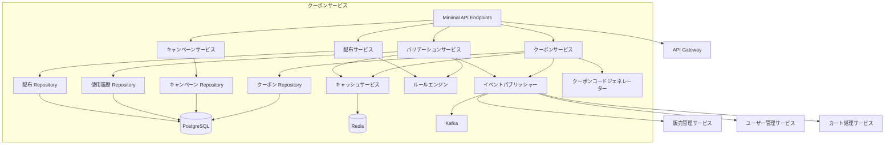

**シーケンス図（クーポン適用プロセス）**:

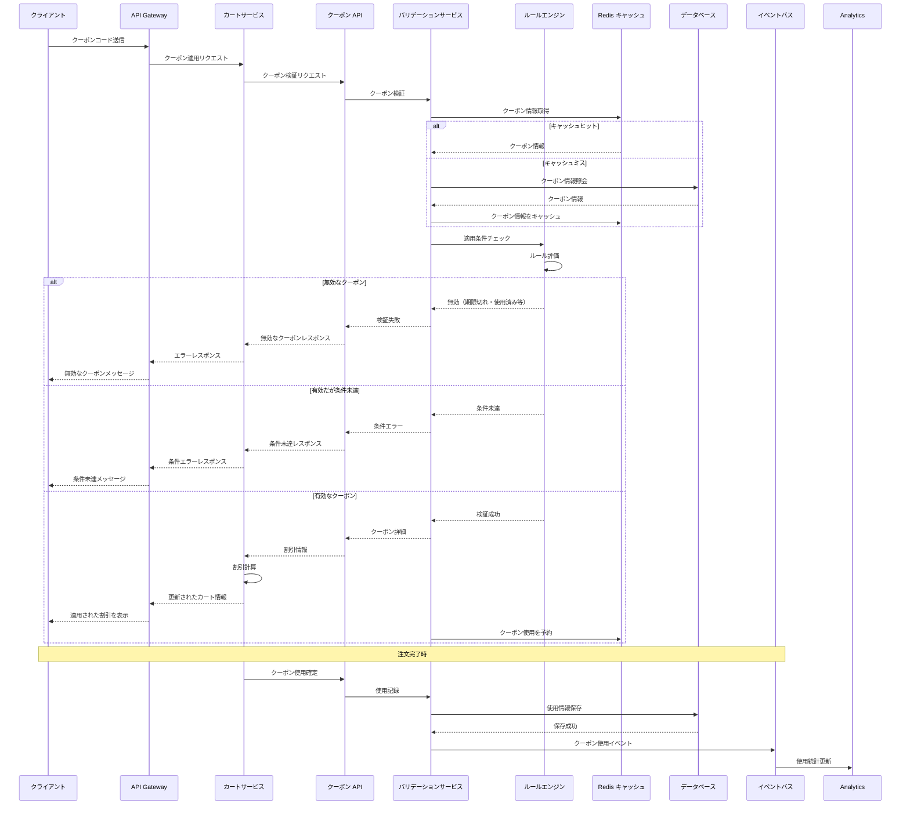

### 10. ポイント管理サービス
**責務**:

- ポイントの付与、消費、計算
- ポイントルール管理
- ポイント履歴追跡
- ポイント有効期限管理
- ポイントキャンペーン

**主要エンティティ**:

- PointAccount
- PointTransaction
- PointRule
- PointExpiry
- PointCampaign

**データストア**:

- PostgreSQL（ポイントデータ、トランザクション）
- Redis（リアルタイムポイント情報）

**コンポーネント構成図**:

```mermaid
graph TB
    subgraph "ポイント管理サービス"
        direction TB
        API[Minimal API Endpoints] --> POINT_SERV[ポイントサービス]
        API --> RULE_SERV[ルールサービス]
        API --> CAMPAIGN_SERV[キャンペーンサービス]
        API --> HISTORY_SERV[履歴サービス]
        
        POINT_SERV --> ACCOUNT_REPO[アカウント Repository]
        POINT_SERV --> TRANS_REPO[トランザクション Repository]
        RULE_SERV --> RULE_REPO[ルール Repository]
        CAMPAIGN_SERV --> CAMPAIGN_REPO[キャンペーン Repository]
        HISTORY_SERV --> HISTORY_REPO[履歴 Repository]
        
        ACCOUNT_REPO --> DB[(PostgreSQL)]
        TRANS_REPO --> DB
        RULE_REPO --> DB
        CAMPAIGN_REPO --> DB
        HISTORY_REPO --> DB
        
        CACHE[キャッシュサービス] --> REDIS[(Redis)]
        POINT_SERV --> CACHE
        
        CALC_ENGINE[計算エンジン]
        POINT_SERV --> CALC_ENGINE
        RULE_SERV --> CALC_ENGINE
        
        EXPIRY[有効期限マネージャー]
        POINT_SERV --> EXPIRY
        EXPIRY --> BATCH[バッチプロセッサー]
        
        EVENT[イベントパブリッシャー] --> KAFKA[Kafka]
        POINT_SERV --> EVENT
        CAMPAIGN_SERV --> EVENT
    end
    
    %% 外部システムとの接続
    API --> GATEWAY[API Gateway]
    EVENT --> SALES[販売管理サービス]
    EVENT --> USER[ユーザー管理サービス]
    EVENT --> NOTIFICATION[通知サービス]
```

**シーケンス図（ポイント付与プロセス）**:

```mermaid
sequenceDiagram
    participant Sales as 販売管理サービス
    participant EventBus as イベントバス
    participant PointAPI as ポイント API
    participant PointService as ポイントサービス
    participant RuleService as ルールサービス
    participant CalcEngine as 計算エンジン
    participant DB as データベース
    participant Cache as Redis キャッシュ
    participant User as ユーザー管理サービス
    participant Notification as 通知サービス
    
    %% 注文完了イベントからのポイント付与フロー
    Sales->>EventBus: 注文完了イベント
    EventBus->>PointAPI: ポイント付与リクエスト
    
    %% ユーザー情報取得
    PointAPI->>PointService: ポイント計算リクエスト
        Note over PointService: ローカルキャッシュからユーザー会員ランクを取得
        Note over PointService: UserManagementService の MemberRankUpdated イベントで事前同期済み
    
    %% ポイント計算
    PointService->>RuleService: 適用ルール取得
    RuleService->>DB: ルール情報取得
    DB-->>RuleService: ポイントルール
    
    alt ユーザー特典やキャンペーン
        RuleService->>DB: キャンペーン情報取得
        DB-->>RuleService: アクティブキャンペーン
    end
    
    RuleService-->>PointService: ルール情報
    PointService->>CalcEngine: ポイント計算
    CalcEngine->>CalcEngine: 基本ポイント計算
    CalcEngine->>CalcEngine: ボーナスポイント計算
    CalcEngine-->>PointService: 付与ポイント数
    
    %% ポイント記録
    PointService->>DB: ポイントトランザクション記録
    DB-->>PointService: 記録成功
    PointService->>DB: ポイント残高更新
    DB-->>PointService: 更新成功
    
    %% キャッシュ更新
    PointService->>Cache: 最新ポイント残高更新
    Cache-->>PointService: 更新成功
    
    %% ポイント付与通知
    PointService->>EventBus: ポイント付与イベント
    EventBus->>Notification: ポイント付与通知
    Notification->>Notification: 通知生成
    Notification->>User: ユーザーへ通知
    
    %% API レスポンス
    PointService-->>PointAPI: ポイント付与完了
    PointAPI-->>EventBus: 処理完了レスポンス
    
    %% 定期処理（別シーケンス）
    Note over PointService, DB: 定期ポイント有効期限チェック（バッチ処理）
    PointService->>DB: 期限切れポイント検索
    DB-->>PointService: 期限切れポイント
    PointService->>DB: ポイント失効処理
    DB-->>PointService: 処理完了
    PointService->>EventBus: ポイント失効イベント
    EventBus->>Notification: 失効通知
```

### 11. メール送信サービス
**責務**: 他サービスからの Kafka イベントを受信し、ユーザーへのメール通知を一元的に処理する。メールテンプレート管理、配信制御、配信履歴管理を担当する。

**ポート**: 5008

**技術スタック**: ASP.NET Core 10 Minimal API, Confluent.Kafka, MailKit (SMTP), Azure Communication Services (本番)

#### 主要機能
| 機能 | 説明 |
|------|------|
| テンプレート管理 | メールテンプレートの CRUD 管理（HTML / プレーンテキスト） |
| イベント駆動配信 | Kafka イベント受信 → 対応するテンプレートでメール生成・送信 |
| 配信履歴管理 | 送信ステータス（成功/失敗/バウンス）の記録と照会 |
| リトライ制御 | 送信失敗時の指数バックオフリトライ（最大 3 回） |
| 配信制限 | 同一ユーザーへの配信頻度制限（1 時間に 5 通まで） |
| マーケティング配信 | 同意（`MARKETING`）を取得済みのユーザーへのプロモーション配信 |
| 配信停止対応 | `consent.revoked` イベント受信時に該当ユーザーの配信を停止 |

#### データモデル
| エンティティ | 説明 | 主要属性 |
|------------|------|---------|
| MailTemplate | メールテンプレート | id, name, subject, htmlBody, textBody, templateType(TRANSACTIONAL/MARKETING), variables, isActive, createdAt, updatedAt |
| MailLog | メール送信履歴 | id, templateId, recipientEmail, recipientUserId, subject, status(QUEUED/SENT/FAILED/BOUNCED), sentAt, failureReason, retryCount, correlationId, createdAt |
| MailSuppression | 配信停止リスト | id, email, reason(UNSUBSCRIBE/BOUNCE/COMPLAINT), suppressedAt |

#### 購読 Kafka イベントと対応メール
| Kafka イベント | メール種別 | テンプレート例 |
|--------------|-----------|-------------|
| `user.registered` | ウェルカムメール | 会員登録完了のお知らせ |
| `order.created` | 注文確認メール | ご注文ありがとうございます |
| `order.shipped` | 出荷通知メール | 商品を発送しました |
| `payment.completed` | 決済完了メール | お支払いが完了しました |
| `payment.refunded` | 返金通知メール | 返金処理が完了しました |
| `point.earned` | ポイント獲得通知 | ポイントが付与されました |
| `coupon.expired` | クーポン期限通知 | クーポンの有効期限が近づいています |
| `inventory.low-stock` | 在庫アラート（管理者向け） | 在庫が閾値を下回りました |
| `user.deleted` | アカウント削除完了 | アカウントの削除が完了しました |

#### アーキテクチャ
```mermaid
graph TB
    subgraph "メール送信サービス"
        API[Minimal API<br/>テンプレート管理]
        CONSUMER[Kafka Consumer<br/>BackgroundService]
        BUILDER[メールビルダー<br/>テンプレートエンジン]
        SENDER[メール送信サービス<br/>MailKit / Azure CS]
        RETRY[リトライハンドラー]
    end

    KAFKA[Kafka] -->|イベント受信| CONSUMER
    CONSUMER --> BUILDER
    BUILDER --> SENDER
    SENDER -->|送信失敗| RETRY
    RETRY -->|リトライ| SENDER
    SENDER --> DB[(PostgreSQL<br/>maildb)]
    API --> DB
    SENDER -->|本番| AZURE[Azure Communication Services]
    SENDER -->|開発| SMTP[MailHog / SMTP4Dev]
```

#### 管理 API エンドポイント
| HTTP メソッド | エンドポイント | 説明 | 認可 |
|-------------|------------|------|------|
| `GET` | `/admin/mail/templates` | テンプレート一覧取得 | AdminOnly |
| `GET` | `/admin/mail/templates/{id}` | テンプレート詳細取得 | AdminOnly |
| `POST` | `/admin/mail/templates` | テンプレート新規作成 | AdminOnly |
| `PUT` | `/admin/mail/templates/{id}` | テンプレート更新 | AdminOnly |
| `DELETE` | `/admin/mail/templates/{id}` | テンプレート削除 | AdminOnly |
| `GET` | `/admin/mail/logs` | 配信履歴一覧（フィルタ・ページネーション） | AdminOnly |
| `POST` | `/admin/mail/send-test` | テストメール送信 | AdminOnly |

## 技術スタック
### バックエンド
- **言語**: C# 14（.NET 10 LTS）
- **フレームワーク**: ASP.NET Core 10（Minimal API）
- **テンプレートエンジン**: Razor（管理画面、メール通知等）
- **ビルドツール**: dotnet CLI / MSBuild
- **API ドキュメント**: AddOpenApi() + MapOpenApi()（.NET 10 標準）
  - **注意**: .NET 10 では `AddOpenApi()` + `MapOpenApi()` によりサービスレベルで OpenAPI ドキュメントを自動生成するため、個別エンドポイントへの `.WithOpenApi()` は**不要**
- **テスト**: xUnit, NSubstitute, Shouldly (BSD 3-Clause), Testcontainers.PostgreSql, k6
- **データアクセス**:
  - Entity Framework Core 10（PostgreSQL）
  - StackExchange.Redis
- **メッセージング**: Apache Kafka（Confluent.Kafka）
- **マイクロサービス統合**:
  - .NET Aspire 13.1
  - YARP リバースプロキシ
  - Polly 8.x（サーキットブレーカー）
- **監視**:
  - OpenTelemetry
  - ASP.NET Core HealthChecks

### フロントエンド
- **Web アプリケーション**:
  - フレームワーク: Next.js 14（React）
  - 言語: TypeScript 5
  - 状態管理: Redux Toolkit / Zustand
  - UI ライブラリ: TailwindCSS, Headless UI
  - API 連携: Axios, React Query
  - テスト: Jest, React Testing Library, Cypress
  - i18n: next-intl（多言語対応）

- **バックエンド多言語化（.resx + IStringLocalizer）**:
  - バックエンドの API レスポンスメッセージ（エラーメッセージ、バリデーションメッセージ、通知テキスト等）は `.resx` リソースファイルで管理する
  - リソースファイル命名規則: `Resources/<ClassName>.<culture>.resx`（例: `Resources/OrderService.ja.resx`, `Resources/OrderService.en.resx`）
  - `IStringLocalizer<T>` を DI で注入し、メッセージの取得に使用する
  - `RequestLocalizationMiddleware` で `Accept-Language` ヘッダーからカルチャーを自動判定
  - デフォルトカルチャー: `ja-JP`、サポートカルチャー: `ja-JP`, `en-US`
  - **フロントエンド（next-intl）とバックエンド（.resx）の責務分担**: UI 表示テキストはフロントエンドの `next-intl` で管理、API エラーメッセージ・メール本文テンプレートはバックエンドの `.resx` で管理

- **管理画面**:
  - ASP.NET Core + Razor Pages
  - Bootstrap 5
  - htmx（部分ページ更新）
  - Alpine.js（軽量インタラクション）

### データストア
- **リレーショナル DB**: PostgreSQL 16
- **キャッシュ**: Redis 7.2

> **ライセンス注記**: 本プロジェクトは **Redis 7.2**（BSD 3-Clause License）を使用する。Redis 7.4 以降は Redis Ltd. による **SSPL** (Server Side Public License) に変更されており、サービスとしての提供に制約がある。
>
> - **バージョン固定**: `redis:7.2-alpine` を使用し、7.4 以降へのアップグレードは法務確認後に判断する
> - **移行パス（将来検討）**: SSPL を回避する場合、CNCF 傘下の **Valkey**（Redis 7.2 フォーク、BSD License）への移行を検討する
> - **Azure Cache for Redis**: Azure のマネージドサービスは Microsoft のライセンス契約でカバーされるため、SSPL の影響を受けない
- **ストレージ**: Azure Blob Storage
- **メッセージブローカー**: Apache Kafka 3.6

### インフラストラクチャ
- **開発環境**:
  - .NET Aspire 13.1
  - Docker
  - Testcontainers（統合テスト）

- **本番環境**:
  - Azure Container Apps
  - Azure Container Registry
  - Azure Database for PostgreSQL
  - Azure Cache for Redis
  - Azure Key Vault（秘密情報管理）
  - Azure Monitor & Application Insights

- **CI/CD**:
  - GitHub Actions
  - Terraform（IaC）

> **ライセンス注記**: Terraform v1.6 以降は HashiCorp により **BUSL-1.1** (Business Source License) に変更されている。本プロジェクトでの利用が「競合サービスの提供」に該当しないことを法務チームに確認すること。
>
> - **法務確認事項**: BUSL-1.1 の "Additional Use Grant" の範囲で本プロジェクトの利用が許容されるかを確認
> - **代替案**: 法務リスクが認められる場合、**OpenTofu**（MPL 2.0 License、Terraform 1.5 フォーク）への移行を検討する。OpenTofu は Linux Foundation 傘下で開発され、Terraform と構文互換性がある
> - **暫定対応**: 法務確認完了まで Terraform 1.5.x（MPL 2.0）を使用する
  - SonarQube（コード品質）
  - Trivy（コンテナセキュリティスキャン）
- **監視**: OpenTelemetry, Azure Monitor
- **ロギング**: Serilog + Azure Log Analytics

### クラウドサービス
- **クラウドプロバイダー**: Microsoft Azure
- **API 管理**: Azure API Management
- **AI/ML**: Azure AI Services, Azure OpenAI Service
- **CDN**: Azure CDN
- **ファイアウォール**: Azure Firewall
- **ID 管理**: Azure AD B2C

## データモデル
### コアエンティティ関係図
```text
┌────────────────┐      ┌────────────────┐      ┌────────────────┐
│     User       │      │     Order      │      │    Product     │
├────────────────┤      ├────────────────┤      ├────────────────┤
│ id             │      │ id             │      │ id             │
│ email          │      │ userId         │◄─────┤ name           │
│ firstName      │      │ status         │      │ description    │
│ lastName       │      │ totalAmount    │      │ categoryId     │
│ phoneNumber    │      │ createdAt      │      │ sku            │
│ addresses      │      │ updatedAt      │      │ weight         │
│ createdAt      │      │ paymentId      │      │ attributes     │
│ updatedAt      │      │ couponId       │      │ images         │
│ updatedAt      │      └────────┬───────┘      │ createdAt      │
│ lastLoginAt    │               │              │ updatedAt      │
└────────────────┘               │              └───────┬────────┘
       ▲                         │                      │
       │                         ▼                      │
┌──────┴───────┐      ┌────────────────┐               │
│  UserAddress  │      │   OrderItem    │◄──────────────┘
├───────────────┤      ├────────────────┤
│ id            │      │ id             │
│ userId        │      │ orderId        │
│ addressType   │      │ productId      │
│ recipient     │      │ quantity       │
│ zipCode       │      │ price          │
│ prefecture    │      │ discount       │
│ city          │      │ subtotal       │
│ streetAddress │      └────────────────┘
│ building      │               ▲
│ isDefault     │               │
└───────────────┘      ┌────────┴───────┐      ┌────────────────┐
                       │    Payment     │      │    Coupon      │
                       ├────────────────┤      ├────────────────┤
                       │ id             │      │ id             │
                       │ orderId        │      │ code           │
                       │ amount         │      │ description    │
                       │ method         │      │ discountType   │
                       │ status         │      │ discountValue  │
                       │ transactionId  │      │ minOrderAmount │
                       │ createdAt      │      │ startDate      │
                       └────────────────┘      │ endDate        │
                                               │ usageLimit     │
                                               │ isActive       │
                                               └────────────────┘
```

### ビジネスルール詳細定義
以下のビジネスルールは、仕様書の各サービス設計に散在する要件を統合し、実装時の基準として明確化するものである。

#### 注文ステータス状態遷移
注文のライフサイクルにおけるステータス遷移を以下の状態遷移図で定義する。不正な遷移を防ぐため、`OrderStateMachine` で遷移の妥当性を検証する。

```mermaid
stateDiagram-v2
    [*] --> Pending : 注文作成
    Pending --> Confirmed : 在庫確保 + 決済認証成功
    Pending --> InventoryShortage : 在庫不足
    Pending --> PaymentFailed : 決済失敗
    Pending --> PendingPayment : 決済タイムアウト
    Pending --> Cancelled : ユーザーキャンセル / タイムアウト(30分)

    PendingPayment --> Confirmed : 決済確認成功（SagaRecoveryService）
    PendingPayment --> Cancelled : 決済失敗確認 / 30分タイムアウト

    InventoryShortage --> Cancelled : 在庫補充不可
    InventoryShortage --> Pending : 在庫補充後リトライ

    PaymentFailed --> Cancelled : 再決済不可
    PaymentFailed --> Pending : 決済手段変更後リトライ

    Confirmed --> Processing : 決済キャプチャ成功
    Confirmed --> Cancelled : 管理者キャンセル / 決済キャプチャ失敗
    Processing --> Shipped : 出荷完了（追跡番号登録）
    Processing --> Cancelled : 管理者キャンセル（出荷前のみ）
    Shipped --> Delivered : 配達完了（配送業者ステータス連携）
    Shipped --> Returned : 受取拒否 / 配送事故
    Delivered --> Returned : 返品リクエスト承認（配達後14日以内）
    Returned --> Refunded : 返品検品完了 + 返金処理
    Cancelled --> Refunded : 決済キャプチャ済みの場合のみ
    Refunded --> [*]
    Delivered --> [*]
    Cancelled --> [*]
```

**遷移ルール**:

| 遷移元 | 遷移先 | トリガー | 前提条件 | 発行イベント |
|--------|--------|---------|---------|------------|
| Pending | Confirmed | 在庫確保 + 決済認証成功 | Saga の在庫予約ステップ完了 | `OrderConfirmed` |
| Pending | InventoryShortage | 在庫不足 | Saga の在庫予約ステップで在庫不足検出 | `OrderInventoryShortage` |
| Pending | PaymentFailed | 決済失敗 | 決済ゲートウェイから認証失敗レスポンス | `OrderPaymentFailed` |
| Pending | PendingPayment | 決済タイムアウト | 決済ゲートウェイからタイムアウト | `OrderPaymentPending` |
| Pending | Cancelled | タイムアウト / ユーザーキャンセル | 作成から 30 分経過、または明示的キャンセル | `OrderCancelled` |
| PendingPayment | Confirmed | 決済確認成功 | SagaRecoveryService による決済再確認成功 | `OrderConfirmed` |
| PendingPayment | Cancelled | 決済失敗確認 / タイムアウト | 再確認で決済失敗、または 30 分タイムアウト | `OrderCancelled` |
| InventoryShortage | Cancelled | 在庫補充不可 | 一定時間内に在庫補充されず | `OrderCancelled` |
| InventoryShortage | Pending | 在庫補充後リトライ | 在庫補充通知後の Saga 再実行 | — |
| PaymentFailed | Cancelled | 再決済不可 | ユーザーが再決済を断念 | `OrderCancelled` |
| PaymentFailed | Pending | 決済手段変更後リトライ | ユーザーが別の決済手段を選択 | — |
| Confirmed | Processing | 決済キャプチャ成功 | 決済ゲートウェイからキャプチャ成功レスポンス | `PaymentCaptured` |
| Processing | Shipped | 出荷完了 | 追跡番号が登録済み | `OrderShipped` |
| Shipped | Delivered | 配達完了 | 配送業者 API のステータスが「配達済み」 | `OrderDelivered` |
| Delivered | Returned | 返品承認 | 配達後 14 日以内、返品理由が正当 | `ReturnApproved` |
| Returned | Refunded | 返金処理 | 返品検品完了、返金額確定 | `RefundCompleted` |

**EF Core 実装**: `OrderStateMachine` クラスで遷移テーブルを定義し、`Order.TransitionTo(OrderStatus newStatus)` メソッドで不正遷移時に `BusinessException` をスローする。

#### 配送料・消費税計算ルール
##### 配送料計算
| 条件 | 配送料 | 備考 |
|------|--------|------|
| 合計金額 ≥ 10,000 円（国内） | 無料 | 送料無料ライン（日本国内） |
| 合計金額 ≥ $100（海外） | 無料 | 送料無料ライン（米国向け） |
| 合計金額 < 10,000 円（通常配送） | 一律 550 円（税込） | 本州・四国・九州 |
| 合計金額 < 10,000 円（北海道・沖縄） | 一律 1,100 円（税込） | 離島は別途見積もり |
| お急ぎ便（翌日配送） | 通常配送料 + 330 円（税込） | 在庫ありかつ 15:00 までの注文 |
| 大型商品（スキー板等） | 通常配送料 + 1,650 円（税込） | 重量 10kg 超 or 長さ 170cm 超 |

**計算ロジック**: `ShippingFeeCalculator` サービスに実装。配送先（国コード + 都道府県コード/州コード）、商品重量/寸法、お急ぎ便フラグを入力とし、合計配送料を算出する。海外配送（US 向け）は合計金額 $100 以上で送料無料、それ未満は国際配送料を適用する。

##### 消費税計算
| 商品カテゴリ | 税率 | 備考 |
|------------|------|------|
| スキー用品（板、ブーツ、ビンディング等） | 10% | 標準税率 |
| ウェア・アクセサリー | 10% | 標準税率 |
| スキーワックス・メンテナンス用品 | 10% | 標準税率 |
| 書籍・DVD（スキー教本等） | 10% | 標準税率 |

**計算ロジック**: `TaxCalculator` サービスに実装。税率はプロダクトマスターの `taxRate` カラム（DECIMAL(5,4)）で管理し、将来の税率変更に対応する。税額は**外税方式**で計算し、1 円未満は**切り捨て**とする。

```
税額 = FLOOR(税抜金額 × 税率)
税込金額 = 税抜金額 + 税額
```

#### 会員ランク制度
##### ランク定義
| ランク | 年間購入金額（税込） | ポイント還元率 | 特典 |
|-------|-------------------|-------------|------|
| ブロンズ（初期） | 0 円〜 | 1% | — |
| シルバー | 50,000 円〜 | 3% | 送料無料ライン 8,000 円に引き下げ |
| ゴールド | 100,000 円〜 | 5% | 送料無料ライン 5,000 円に引き下げ、先行セールアクセス |
| プラチナ | 300,000 円〜 | 7% | 全品送料無料、誕生月 2 倍ポイント、プラチナ専用クーポン |

##### 昇格・降格ルール
- **集計期間**: 毎年 4 月 1 日〜翌年 3 月 31 日の購入金額（返品分は減算）
- **昇格**: リアルタイム判定。購入確定時点で年間累計が閾値を超えたら即時昇格
- **降格**: 年次判定。4 月 1 日に前年度の年間購入金額で再判定。降格時は 1 ランクのみ降格（例: プラチナ → ゴールドは可、プラチナ → シルバーは不可）
- **降格猶予**: 前年度がプラチナの場合、年間購入金額が 250,000 円以上（閾値の 83%）であればゴールドに降格せずプラチナ維持
- **新規会員**: 登録時はブロンズから開始

##### EF Core 実装
`MemberRank` エンティティをユーザー管理サービスに追加:

| カラム | 型 | 説明 |
|--------|-----|------|
| id | string | PK |
| user_id | string | FK→User |
| current_rank | string | 現在のランク（Bronze/Silver/Gold/Platinum） |
| annual_purchase_amount | decimal(12,2) | 当年度累計購入金額 |
| previous_year_amount | decimal(12,2) | 前年度累計購入金額 |
| rank_updated_at | datetime | ランク最終更新日時 |
| next_evaluation_date | datetime | 次回年次評価日 |
| point_rate | decimal(5,4) | 現在のポイント還元率 |

`MemberRankEvaluationService`（BackgroundService）: 毎年 4 月 1 日 0:00（JST）に年次評価バッチを実行し、降格判定と累計リセットを行う。

### マイクロサービスデータモデル詳細
本セクションでは、各マイクロサービスが管理する主要エンティティの詳細属性およびリレーションシップを定義する。

#### 監査カラム必須化ルール
全エンティティに以下の監査カラムを**必須**で含める。データモデルの主要属性一覧に明示されていないエンティティにも適用される:

| カラム | 型 | 用途 | デフォルト値 |
|--------|-----|------|-----------|
| `created_at` | `TIMESTAMP WITH TIME ZONE` | レコード作成日時 | `CURRENT_TIMESTAMP` |
| `updated_at` | `TIMESTAMP WITH TIME ZONE` | レコード最終更新日時 | `CURRENT_TIMESTAMP`（更新時に自動更新） |

**EF Core での実装**: `SaveChangesAsync` のオーバーライドで `updated_at` を自動更新する。各 `DbContext` に共通の `AuditableEntity` 基底クラスまたは `IHasTimestamps` インターフェースを適用する。

以下は主要属性一覧で `createdAt`/`updatedAt` が明示されていなかったエンティティへの追加を示す:
- `Role`, `Permission`, `RolePermission`: `createdAt`, `updatedAt` を追加
- `Category`, `Supplier`: `createdAt`, `updatedAt` を追加
- `Order`, `OrderItem`, `Shipment`, `Return`, `Invoice`: `createdAt`, `updatedAt` を追加
- `CartItem`, `PaymentMethod`: `createdAt`, `updatedAt` を追加
- `OAuthClient`, `OAuthScope`: `createdAt`, `updatedAt` を追加
- `CouponType`, `CouponRestriction`: `createdAt`, `updatedAt` を追加
- `PointRule`, `PointCampaign`, `PointConversionRate`: `createdAt`, `updatedAt` を追加
- `Page`, `ContentBlock`, `Navigation`, `SEOSetting`, `MediaAsset`, `Translation`: `createdAt`, `updatedAt` を追加

#### ユーザー管理サービス
| エンティティ | 説明 | 主要属性 |
|------------|------|---------|
| User | ユーザー基本情報 | id, email, firstName, lastName, phoneNumber, birthDate, createdAt, updatedAt, lastLoginAt, status |

> **注記**: `passwordHash` は UserManagementService の User エンティティには含まない。パスワード管理は AuthService（`AuthUser` エンティティ）の責務である（ADR-0006: サービス別独立 DB）。
| Role | ユーザーロール | id, name, description |
| Permission | 細粒度権限 | id, name, description, resource, action |
| RolePermission | ロール–権限中間テーブル | id, roleId (FK→Role), permissionId (FK→Permission), grantedAt |
| UserPreference | ユーザー設定 | id, userId, language, currency, notificationPreferences, displayPreferences |
| Address | 配送先/請求先住所 | id, userId, addressType(SHIPPING/BILLING), recipient, zipCode, prefecture, city, streetAddress, building, phoneNumber, isDefault |
| UserActivity | ユーザーアクティビティ履歴 | id, userId, activityType, timestamp, details, ipAddress, deviceInfo |
| Wishlist | ウィッシュリスト | id, userId (FK→User), name, isDefault, createdAt, updatedAt |
| WishlistItem | ウィッシュリスト明細 | id, wishlistId (FK→Wishlist), productId, addedAt, notifyOnRestock, notifiedAt |

#### 在庫管理サービス
| エンティティ | 説明 | 主要属性 |
|------------|------|---------|
| Product | 商品基本情報 | id, sku, name, description, brand, categoryId, weight, dimensions, isActive, createdAt, updatedAt |

> **価格管理**: 価格は `prices` テーブルで時系列管理する（Product エンティティには含まない）。詳細は inventory-management-design.md §6 参照。
>
> **SKU/バリエーション方針（Phase 1/2 分割）**: Phase 1 では商品単位 SKU（例: `SKI-ATOMIC-001`）で管理。Phase 2 で `ProductVariant` テーブルを導入し、サイズ・カラー別 SKU（例: `SKI-ATOMIC-001-180-RED`）およびバリエーション別在庫引当に対応予定。詳細は inventory-management-design.md §6 SKU/バリエーション管理方針を参照。
| Category | 商品カテゴリ | id, name, description, parentId, level, path, imageUrl, isActive |
| Inventory | 在庫情報 | id, productId, stockQuantity, reservedQuantity, availableQuantity, warehouseId, reorderLevel, updatedAt |
| Supplier | 仕入先情報 | id, name, contactPerson, email, phone, address, rating, activeContractId |
| PriceHistory | 価格履歴 | id, productId, price DECIMAL(12,2), effectiveFrom, effectiveTo, promotionId |
| ProductAttribute | 商品属性 | id, productId, attributeName, attributeValue, isFilterable, isSortable |
| ProductImage | 商品画像 | id, productId, imageUrl, altText, sortOrder, isPrimary |
| Review | 商品レビュー | id, productId, userId, rating(1-5), title, content, isVerifiedPurchase, helpfulCount, status(PENDING/APPROVED/REJECTED), createdAt, updatedAt |
| ReviewResponse | レビュー返信（管理者） | id, reviewId (FK→Review), responderId, content, createdAt |

#### 販売管理サービス
| エンティティ | 説明 | 主要属性 |
|------------|------|---------|
| Order | 注文情報 | id, userId, orderDate, status, subtotal DECIMAL(12,2), tax DECIMAL(12,2), shippingCost DECIMAL(12,2), discount DECIMAL(12,2), totalAmount DECIMAL(12,2), couponId, shippingAddressId, billingAddressId, paymentId, notes |
| OrderItem | 注文明細 | id, orderId, productId, productSnapshot (JSONB, 下記スキーマ参照), quantity, unitPrice DECIMAL(12,2), discount DECIMAL(12,2), tax DECIMAL(12,2), subtotal DECIMAL(12,2) |
| Shipment | 配送情報 | id, orderId, trackingNumber, carrier, status, shippingDate, estimatedDeliveryDate, actualDeliveryDate |
| Return | 返品情報 | id, orderId, requestDate, status, reason, approvalDate, refundAmount DECIMAL(12,2), returnItemsData |
| Invoice | 請求書情報 | id, orderId, invoiceNumber, issuedDate, dueDate, paidDate, amount DECIMAL(12,2), status |
| OrderStatus | 注文ステータス | id, name, description, sequenceOrder |
| ShipmentStatus | 配送ステータス | id, name, description, sequenceOrder |

**`productSnapshot` JSONB スキーマ定義**:

`OrderItem.productSnapshot` は PostgreSQL `JSONB` カラムとして格納し、注文確定時点の商品情報のイミュータブルなスナップショットを保持する。商品が後から変更・削除されても注文明細の情報は不変であることを保証する。

```json
{
  "productId": "string (36)",
  "sku": "string",
  "name": "string",
  "brand": "string",
  "categoryName": "string",
  "description": "string (最大500文字に切り詰め)",
  "imageUrl": "string (主要画像URL)",
  "weight": "decimal",
  "taxRate": "decimal",
  "attributes": {
    "size": "string",
    "color": "string"
  },
  "snapshotAt": "datetime (ISO 8601)"
}
```

EF Core での実装: `HasColumnType("jsonb")` + `HasConversion` で `ProductSnapshot` record 型にマッピングする。

#### 支払い・カートサービス
| エンティティ | 説明 | 主要属性 |
|------------|------|---------|
| Cart | カート情報 | id, userId, sessionId, createdAt, updatedAt, expiredAt, status |
| CartItem | カートアイテム | id, cartId, productId, quantity, addedAt, unitPrice DECIMAL(12,2), selectedAttributes |
| Payment | 決済情報 | id, orderId, amount DECIMAL(12,2), currency, method, status, gatewayReference, transactionDate |
| PaymentMethod | 決済方法 | id, userId, type, provider, accountReference, isDefault, expiryDate, billingAddressId |
| Transaction | 決済トランザクション | id, paymentId, type, amount DECIMAL(12,2), status, gatewayResponse, createdAt, updatedAt |
| PaymentStatus | 決済ステータス | id, name, description, isSuccess, isProcessing, isFailed |

#### AI サポートサービス

> **エンティティ再設計（DDD 精緻化）**: spec.md 旧定義の `UserInteraction` は `ChatSession` + `ChatMessage` に正規化分離。`ProductRecommendation` → `Recommendation`、`SearchQuery` → `SearchAnalytics`、`BehaviorAnalysis` → `UserProfile`（JSONB）に再設計。詳細は ai-support-service-design.md §5.0 対応表を参照。

| エンティティ | 説明 | 主要属性 |
|------------|------|---------|
| ChatSession (Aggregate Root) | チャットセッション | id, userId, title, status, modelId, tokenCount, startTime, endTime, sessionSummary, feedbackRating, createdAt, updatedAt |
| ChatMessage | チャットメッセージ | id, sessionId (FK→ChatSession), role(USER/ASSISTANT/SYSTEM), content, tokenCount, timestamp, createdAt |
| UserProfile (Aggregate Root) | ユーザー嗜好・行動プロファイル | id, userId, preferences (JSONB), browsingHistory (JSONB), purchaseHistory (JSONB), createdAt, updatedAt |
| Recommendation | 商品レコメンデーション履歴 | id, userId, productId, recommendationType, score, reason, wasClicked, createdAt |
| SearchAnalytics | 検索分析データ | id, userId, query, responseTimeMs, resultCount, clickedProductId, createdAt |

#### 認証サービス (OAuth)
> **AuthUser Aggregate Root 追加**

| エンティティ | 説明 | 主要属性 |
|------------|------|---------|
| AuthUser (Aggregate Root) | ユーザー認証情報 | id (=User.id と同値), email, passwordHash, roles, mfaEnabled, mfaSecret, lastLoginAt, failedLoginCount, lockedUntil, createdAt, updatedAt |
| UserCredential | パスワード/MFA 認証情報 | id, authUserId (FK), credentialType (PASSWORD/TOTP/FIDO2), secretHash, createdAt, revokedAt |

> **AuthUser と User の関係**: `AuthUser.id` は `UserManagementService.User.id` と同一の UUID を使用する。UserRegistered Kafka イベントで同期し、AuthService 側に AuthUser レコードを作成する。

| エンティティ | 説明 | 主要属性 |
|------------|------|---------|
| OAuthClient | OAuth 認証クライアント | id, clientId, clientSecret, name, description, redirectUris, allowedGrantTypes, scopes |
| OAuthToken | 認証トークン | id, accessToken (暗号化: ), refreshToken (暗号化: ), clientId, userId, scopes, issuedAt, expiresAt |
| OAuthScope | 権限スコープ | id, name, description, isDefault, required |
| OAuthConsent | ユーザー同意履歴 | id, userId, clientId, scopes, consentedAt, expiresAt |
| MfaMethod | 多要素認証方法 | id, userId, type(SMS/EMAIL/TOTP), status, createdAt, lastUsedAt |
| LoginAttempt | ログイン試行履歴 | id, userId, timestamp, ipAddress, userAgent, isSuccess, failureReason |

#### クーポンサービス
| エンティティ | 説明 | 主要属性 |
|------------|------|---------|
| Coupon | クーポン情報 | id, code, description, discountType(PERCENTAGE/FIXED), discountValue DECIMAL(12,2), minOrderAmount DECIMAL(12,2), startDate, endDate, usageLimit, usageCount, isActive |
| CouponType | クーポン種別 | id, name, description, usageLimitationType |
| CouponUsage | クーポン使用履歴 | id, couponId, userId, orderId, usedAt, discountAmount DECIMAL(12,2) |
| Campaign | キャンペーン情報 | id, name, description, startDate, endDate, status, budget DECIMAL(12,2), targetAudience, associatedCoupons |
| Promotion | プロモーション情報 | id, name, description, startDate, endDate, type, conditions, applicationRules |
| CouponRestriction | クーポン制限 | id, couponId, restrictionType(PRODUCT/CATEGORY/USER), restrictionValue, isExclusion |

#### ポイント管理サービス
| エンティティ | 説明 | 主要属性 |
|------------|------|---------|
| PointAccount | ポイントアカウント | id, userId, balance DECIMAL(12,2), lifetimePoints DECIMAL(12,2), lastUpdatedAt |
| PointTransaction | ポイントトランザクション履歴 | id, accountId, amount DECIMAL(12,2), type(EARN/REDEEM/EXPIRE/ADJUST), sourceType, sourceId, description, transactionDate, expiryDate |
| PointRule | ポイント付与ルール | id, name, description, conversionRate, minimumAmount DECIMAL(12,2), applicableProducts, isActive |
| PointExpiry | ポイント有効期限 | id, accountId, amount DECIMAL(12,2), earnedDate, expiryDate, status |
| PointCampaign | ポイントキャンペーン | id, name, description, multiplier, startDate, endDate, targetProducts, isActive |
| PointConversionRate | ポイント換算レート | id, fromCurrency, toCurrency, rate DECIMAL(12,6), effectiveDate, expiryDate, isDefault |

#### 商品販売ウェブサイト（フロントエンド）
| エンティティ | 説明 | 主要属性 |
|------------|------|---------|
| Page | ページ設定 | id, title, slug, metaDescription, metaKeywords, contentType, layout, status |
| ContentBlock | コンテンツブロック | id, pageId, type, content, position, visibility, startDate, endDate |
| Navigation | ナビゲーション構造 | id, name, parentId, url, displayText, sortOrder, isActive, icon |
| SEOSetting | SEO 設定 | id, pageId, canonicalUrl, robots, structuredData, altLangLinks |
| MediaAsset | メディアアセット | id, type, url, fileSize, dimensions, format, altText, title, uploadedAt |
| Translation | 多言語翻訳 | id, entityType, entityId, language, field, translatedValue |

#### メール送信サービス
| エンティティ | 説明 | 主要属性 |
|------------|------|---------|
| MailTemplate | メールテンプレート | id, name, subject, htmlBody, textBody, templateType(TRANSACTIONAL/MARKETING), variables, isActive, createdAt, updatedAt |
| MailLog | メール送信履歴 | id, templateId, recipientEmail, recipientUserId, subject, status(QUEUED/SENT/FAILED/BOUNCED), sentAt, failureReason, retryCount, correlationId, createdAt |
| MailSuppression | 配信停止リスト | id, email, reason(UNSUBSCRIBE/BOUNCE/COMPLAINT), suppressedAt |

### データモデル制約設計
各マイクロサービス内のエンティティ間 FK 制約と参照整合性アクションを以下に定義する。マイクロサービス境界を跨ぐ参照（userId 等）は FK 制約を設けず、アプリケーションレベルで整合性を担保する（イベント駆動による結果整合性）。

#### ユーザー管理サービス FK 制約
| 子テーブル | FK カラム | 親テーブル | ON DELETE | ON UPDATE | 備考 |
|-----------|----------|-----------|-----------|-----------|------|
| RolePermission | roleId | Role | CASCADE | CASCADE | ロール削除時に中間レコードも削除 |
| RolePermission | permissionId | Permission | CASCADE | CASCADE | 権限削除時に中間レコードも削除 |
| UserPreference | userId | User | CASCADE | CASCADE | ユーザー削除時に設定も削除 |
| Address | userId | User | CASCADE | CASCADE | ユーザー削除時に住所も削除 |
| UserActivity | userId | User | CASCADE | CASCADE | ユーザー削除時にアクティビティも削除 |

#### 在庫管理サービス FK 制約
| 子テーブル | FK カラム | 親テーブル | ON DELETE | ON UPDATE | 備考 |
|-----------|----------|-----------|-----------|-----------|------|
| Product | categoryId | Category | RESTRICT | CASCADE | カテゴリ削除前に商品移動が必要 |
| Inventory | productId | Product | CASCADE | CASCADE | 商品削除時に在庫レコードも削除 |
| PriceHistory | productId | Product | CASCADE | CASCADE | 商品削除時に価格履歴も削除 |
| ProductAttribute | productId | Product | CASCADE | CASCADE | 商品削除時に属性も削除 |
| ProductImage | productId | Product | CASCADE | CASCADE | 商品削除時に画像レコードも削除 |
| Category | parentId | Category | RESTRICT | CASCADE | 子カテゴリ存在時は親削除禁止 |
| Review | productId | Product | CASCADE | CASCADE | 商品削除時にレビューも削除 |
| ReviewResponse | reviewId | Review | CASCADE | CASCADE | レビュー削除時に返信も削除 |

#### 販売管理サービス FK 制約
| 子テーブル | FK カラム | 親テーブル | ON DELETE | ON UPDATE | 備考 |
|-----------|----------|-----------|-----------|-----------|------|
| OrderItem | orderId | Order | CASCADE | CASCADE | 注文削除時に明細も削除 |
| Shipment | orderId | Order | RESTRICT | CASCADE | 配送レコード存在時は注文削除禁止 |
| Return | orderId | Order | RESTRICT | CASCADE | 返品レコード存在時は注文削除禁止 |
| Invoice | orderId | Order | RESTRICT | CASCADE | 請求書存在時は注文削除禁止 |

#### 支払い・カートサービス FK 制約
| 子テーブル | FK カラム | 親テーブル | ON DELETE | ON UPDATE | 備考 |
|-----------|----------|-----------|-----------|-----------|------|
| CartItem | cartId | Cart | CASCADE | CASCADE | カート削除時にアイテムも削除 |
| Transaction | paymentId | Payment | RESTRICT | CASCADE | トランザクション存在時は決済削除禁止 |

#### 認証サービス FK 制約
| 子テーブル | FK カラム | 親テーブル | ON DELETE | ON UPDATE | 備考 |
|-----------|----------|-----------|-----------|-----------|------|
| OAuthToken | clientId | OAuthClient | CASCADE | CASCADE | クライアント削除時にトークンも削除 |
| OAuthConsent | clientId | OAuthClient | CASCADE | CASCADE | クライアント削除時に同意履歴も削除 |

#### クーポンサービス FK 制約
| 子テーブル | FK カラム | 親テーブル | ON DELETE | ON UPDATE | 備考 |
|-----------|----------|-----------|-----------|-----------|------|
| CouponUsage | couponId | Coupon | RESTRICT | CASCADE | 使用履歴存在時はクーポン削除禁止 |
| CouponRestriction | couponId | Coupon | CASCADE | CASCADE | クーポン削除時に制限も削除 |

#### ポイント管理サービス FK 制約
| 子テーブル | FK カラム | 親テーブル | ON DELETE | ON UPDATE | 備考 |
|-----------|----------|-----------|-----------|-----------|------|
| PointTransaction | accountId | PointAccount | RESTRICT | CASCADE | トランザクション存在時はアカウント削除禁止 |
| PointExpiry | accountId | PointAccount | CASCADE | CASCADE | アカウント削除時に有効期限レコードも削除 |

#### フロントエンドサービス FK 制約
| 子テーブル | FK カラム | 親テーブル | ON DELETE | ON UPDATE | 備考 |
|-----------|----------|-----------|-----------|-----------|------|
| ContentBlock | pageId | Page | CASCADE | CASCADE | ページ削除時にコンテンツも削除 |
| SEOSetting | pageId | Page | CASCADE | CASCADE | ページ削除時にSEO設定も削除 |
| Navigation | parentId | Navigation | SET NULL | CASCADE | 親ナビ削除時に子はルートに昇格 |

#### メール送信サービス FK 制約
| 子テーブル | FK カラム | 親テーブル | ON DELETE | ON UPDATE | 備考 |
|-----------|----------|-----------|-----------|-----------|------|
| MailLog | templateId | MailTemplate | RESTRICT | CASCADE | テンプレート削除前にログ確認が必要 |

#### マイクロサービス間参照（FK 制約なし・アプリケーション整合性）
以下のカラムは他サービスのエンティティを参照するが、マイクロサービス境界を跨ぐため DB レベルの FK 制約は設けない。整合性は Domain Event（Kafka）による結果整合性で担保する。

| サービス | テーブル | カラム | 参照先サービス | 参照先エンティティ |
|---------|--------|-------|--------------|------------------|
| 販売管理 | Order | userId | ユーザー管理 | User |
| 販売管理 | Order | couponId | クーポン | Coupon |
| 支払い・カート | Cart | userId | ユーザー管理 | User |
| 支払い・カート | Payment | orderId | 販売管理 | Order |
| クーポン | CouponUsage | userId | ユーザー管理 | User |
| クーポン | CouponUsage | orderId | 販売管理 | Order |
| ポイント管理 | PointAccount | userId | ユーザー管理 | User |
| AI サポート | UserInteraction | userId | ユーザー管理 | User |
| 認証 | OAuthToken | userId | ユーザー管理 | User |
| 在庫管理 | Review | userId | ユーザー管理 | User |
| メール送信 | MailLog | recipientUserId | ユーザー管理 | User |

> FK 制約の正式定義は「FK 制約設計」セクションを Single Source of Truth とする。上記のマイクロサービス間参照テーブルは設計上の参照関係を示すものであり、FK 制約は設定しない（ADR-0006 準拠）。

#### CHECK 制約設計
アプリケーションのバグやデータ移行時にもデータ整合性を保つため、DB 層で CHECK 制約を定義する。

##### 在庫管理サービス CHECK 制約
| テーブル | カラム | CHECK 制約 | 備考 |
|---------|-------|-----------|------|
| products | price | `CHECK (price >= 0)` | 価格は 0 以上（無料商品あり） |
| products | tax_rate | `CHECK (tax_rate >= 0 AND tax_rate <= 1)` | 税率は 0〜100%（小数表記） |
| products | weight | `CHECK (weight > 0)` | 重量は正の値 |
| inventory | quantity | `CHECK (quantity >= 0)` | 在庫数は 0 以上（マイナス在庫禁止） |
| inventory | reserved_quantity | `CHECK (reserved_quantity >= 0)` | 予約数は 0 以上 |
| inventory | (quantity, reserved_quantity) | `CHECK (quantity >= reserved_quantity)` | 予約数は在庫数を超えない |
| inventory | reorder_point | `CHECK (reorder_point >= 0)` | 発注点は 0 以上 |
| reviews | rating | `CHECK (rating >= 1 AND rating <= 5)` | 評価は 1〜5 の整数 |
| reviews | status | `CHECK (status IN ('PENDING','APPROVED','REJECTED'))` | レビューステータスに限定 |
| price_histories | price | `CHECK (price >= 0)` | 価格履歴も 0 以上 |

##### 販売管理サービス CHECK 制約
| テーブル | カラム | CHECK 制約 | 備考 |
|---------|-------|-----------|------|
| orders | total_amount | `CHECK (total_amount >= 0)` | 注文合計は 0 以上 |
| orders | discount_amount | `CHECK (discount_amount >= 0)` | 割引額は 0 以上 |
| orders | shipping_fee | `CHECK (shipping_fee >= 0)` | 配送料は 0 以上 |
| orders | tax_amount | `CHECK (tax_amount >= 0)` | 税額は 0 以上 |
| orders | status | `CHECK (status IN ('PENDING', 'CONFIRMED', 'PROCESSING', 'SHIPPED', 'DELIVERED', 'CANCELLED', 'RETURNED', 'REFUNDED', 'INVENTORY_SHORTAGE', 'PAYMENT_FAILED', 'PENDING_PAYMENT'))` | 有効なステータスに限定（ADR-0009 Saga 補償フロー対応: `INVENTORY_SHORTAGE`=在庫不足、`PAYMENT_FAILED`=決済失敗、`PENDING_PAYMENT`=決済タイムアウト） |
| order_items | quantity | `CHECK (quantity > 0)` | 数量は 1 以上 |
| order_items | unit_price | `CHECK (unit_price >= 0)` | 単価は 0 以上 |
| order_items | subtotal | `CHECK (subtotal >= 0)` | 小計は 0 以上 |
| shipments | tracking_number | なし（NULL 許容） | 配送前は未発番 |
| returns | refund_amount | `CHECK (refund_amount >= 0)` | 返金額は 0 以上 |

##### 支払い・カートサービス CHECK 制約
| テーブル | カラム | CHECK 制約 | 備考 |
|---------|-------|-----------|------|
| cart_items | quantity | `CHECK (quantity > 0)` | カート内数量は 1 以上 |
| carts | status | `CHECK (status IN ('ACTIVE','EXPIRED','CHECKED_OUT','ABANDONED'))` | カートステータスに限定 |
| payments | amount | `CHECK (amount > 0)` | 決済額は正の値 |
| payments | status | `CHECK (status IN ('PENDING', 'PROCESSING', 'COMPLETED', 'FAILED', 'REFUNDED', 'CANCELLED'))` | 有効なステータスに限定 |
| transactions | amount | `CHECK (amount > 0)` | トランザクション金額は正の値 |

##### クーポンサービス CHECK 制約
| テーブル | カラム | CHECK 制約 | 備考 |
|---------|-------|-----------|------|
| coupons | discount_value | `CHECK (discount_value > 0)` | 割引値は正の値 |
| coupons | min_order_amount | `CHECK (min_order_amount >= 0)` | 最低注文金額は 0 以上 |
| coupons | max_usage_count | `CHECK (max_usage_count > 0)` | 最大利用回数は 1 以上 |
| coupons | discount_type | `CHECK (discount_type IN ('PERCENTAGE', 'FIXED_AMOUNT', 'FREE_SHIPPING'))` | 有効な割引タイプに限定 |
| coupon_restrictions | percentage_max | `CHECK (percentage_max IS NULL OR percentage_max > 0)` | パーセンテージ上限は正の値 |

##### ポイント管理サービス CHECK 制約
| テーブル | カラム | CHECK 制約 | 備考 |
|---------|-------|-----------|------|
| point_accounts | balance | `CHECK (balance >= 0)` | ポイント残高は 0 以上 |
| point_transactions | amount | `CHECK (amount != 0)` | ポイント変動量は 0 以外（加算=正、減算=負） |
| point_transactions | type | `CHECK (type IN ('EARN','REDEEM','EXPIRE','ADJUST'))` | ポイント取引種別に限定 |
| point_expiries | status | `CHECK (status IN ('ACTIVE','EXPIRED'))` | H9-17 で改名した status の CHECK 追加 |
| point_expiries | amount | `CHECK (amount > 0)` | ポイント有効期限レコードの金額は正の値 |

##### 新規テーブル CHECK 制約
| テーブル | カラム | CHECK 制約 | 備考 |
|---------|-------|-----------|------|
| user_credentials | credential_type | `CHECK (credential_type IN ('PASSWORD','TOTP','FIDO2'))` | 認証情報種別に限定 |
| mfa_methods | type | `CHECK (type IN ('SMS','EMAIL','TOTP'))` | MFA 方式に限定 |
| mfa_methods | status | `CHECK (status IN ('ACTIVE','DISABLED','PENDING_VERIFICATION'))` | MFA ステータスに限定 |
| saga_logs | status | `CHECK (status IN ('CREATED','PROCESSING','COMPLETED','COMPENSATING','COMPENSATED','FAILED','PENDING_PAYMENT'))` | PENDING_PAYMENT 追加（決済タイムアウト対応） |
| saga_logs | current_step | `CHECK (current_step >= 0)` | ステップ番号は 0 以上 |
| saga_logs | retry_count | `CHECK (retry_count >= 0)` | リトライ回数は 0 以上 |
| saga_logs | saga_type | `CHECK (saga_type IN ('ORDER_CHECKOUT','ORDER_CANCEL','ORDER_RETURN'))` | H8-10+UPPER_CASE に統一 |
| member_ranks | current_rank | `CHECK (current_rank IN ('BRONZE','SILVER','GOLD','PLATINUM'))` | 有効なランクに限定 |
| member_ranks | annual_purchase_amount | `CHECK (annual_purchase_amount >= 0)` | 累計購入金額は 0 以上 |
| member_ranks | point_rate | `CHECK (point_rate >= 0 AND point_rate <= 1)` | 還元率は 0〜100%（小数表記） |
| consents | consent_type | `CHECK (consent_type IN ('MARKETING','PERSONALIZATION','ANALYTICS','THIRD_PARTY_SHARING'))` | 有効な同意種別に限定 |
| consents | status | `CHECK (status IN ('GRANTED','REVOKED'))` | 同意ステータスに限定 |
| audit_logs | action | `CHECK (action IN ('CREATE','UPDATE','DELETE','LOGIN','LOGOUT','ACCESS','UPDATE_ORDER','CANCEL_ORDER','MODIFY_INVOICE'))` | 電子帳簿保存法対応アクション追加 |
| deletion_requests | status | `CHECK (status IN ('PENDING','PROCESSING','COMPLETED','FAILED','CANCELLED','AWAITING_MANUAL_INTERVENTION'))` | DSR リトライ超過時のステータス追加 |
| deletion_requests | request_channel | `CHECK (request_channel IN ('WEB_SELF_SERVICE','ADMIN_CONSOLE','EMAIL_DSR','API'))` | 有効なチャネルに限定 |
| idempotency_keys | request_status | `CHECK (request_status IN ('PENDING','PROCESSING','COMPLETED'))` | 冪等キーステータスに限定 |

##### 全サービス共通 CHECK 制約
| テーブル | カラム | CHECK 制約 | 備考 |
|---------|-------|-----------|------|
| （全テーブル） | created_at | `CHECK (created_at <= CURRENT_TIMESTAMP)` | 未来日時の作成レコード防止 |
| outbox_events | retry_count | `CHECK (retry_count >= 0)` | リトライ回数は 0 以上 |
| outbox_events | status | `CHECK (status IN ('PENDING', 'PROCESSING', 'PUBLISHED', 'FAILED', 'DEAD_LETTER'))` | Outbox ステータスに限定 |
| mail_logs | status | `CHECK (status IN ('QUEUED','SENT','FAILED','BOUNCED'))` | メール送信ステータスに限定 |
| mail_templates | template_type | `CHECK (template_type IN ('TRANSACTIONAL','MARKETING'))` | テンプレート種別に限定 |
| mail_suppressions | reason | `CHECK (reason IN ('UNSUBSCRIBE','BOUNCE','COMPLAINT'))` | 抑制理由に限定 |

#### ポーリングクエリ用部分インデックス
BackgroundService のポーリングクエリで使用する部分インデックスを定義する:

```sql
-- OutboxPublisher: 未発行イベントのポーリング
CREATE INDEX idx_outbox_events_pending
    ON outbox_events (created_at ASC)
    WHERE status = 'PENDING';  -- status='PENDING' に統一（PENDING なら published_at は必ず NULL）

-- SagaRecoveryService: 処理中 Saga のリカバリ
CREATE INDEX idx_saga_logs_processing
    ON saga_logs (updated_at ASC)
    WHERE status = 'PROCESSING';

-- SagaRecoveryService: タイムアウト Saga の検出
CREATE INDEX idx_saga_logs_timeout
    ON saga_logs (timeout_at ASC)
    WHERE status IN ('CREATED', 'PROCESSING');

-- CartCleanupService: 期限切れカートの検出
CREATE INDEX idx_carts_expired
    ON carts (updated_at ASC)
    WHERE status = 'ACTIVE';

-- SagaRecoveryService の order_id 照会用インデックス
CREATE INDEX idx_saga_logs_order_id
    ON saga_logs (order_id);
```

```sql
-- H8-09 追加 FK 列のインデックス
CREATE INDEX idx_wishlists_user_id ON wishlists (user_id);
CREATE INDEX idx_wishlist_items_wishlist_id ON wishlist_items (wishlist_id);
CREATE INDEX idx_user_credentials_user_id ON user_credentials (user_id);
CREATE INDEX idx_mfa_methods_user_id ON mfa_methods (user_id);
CREATE INDEX idx_consents_user_id ON consents (user_id);
CREATE INDEX idx_deletion_requests_user_id ON deletion_requests (user_id);
-- 追加 FK 列のインデックス
CREATE INDEX idx_member_ranks_user_id ON member_ranks (user_id);
CREATE INDEX idx_order_items_order_id ON order_items (order_id);
CREATE INDEX idx_payments_order_id ON payments (order_id);
CREATE INDEX idx_shipments_order_id ON shipments (order_id);
CREATE INDEX idx_cart_items_cart_id ON cart_items (cart_id);
CREATE INDEX idx_coupon_usages_coupon_id ON coupon_usages (coupon_id);
CREATE INDEX idx_point_transactions_account_id ON point_transactions (account_id);

-- H10 追加: 高頻度クエリパターン向けインデックス
-- マイページ注文履歴: ユーザー別・ステータス別フィルタリング
CREATE INDEX idx_orders_user_id_status ON orders (user_id, status);
-- セキュリティログ分析: イベント種別ごとの時系列クエリ
CREATE INDEX idx_security_logs_event_type_created
    ON security_logs (event_type, created_at DESC);
-- saga_logs の started_at による開始時刻ベースのクエリ
CREATE INDEX idx_saga_logs_status_started
    ON saga_logs (status, started_at ASC)
    WHERE status IN ('CREATED', 'PROCESSING', 'COMPENSATING');
```

> **部分インデックスの利点**: 対象行が全体の数 % のみのため、インデックスサイズが小さく、B-Tree の深さが浅くなり高速にスキャンできる。

**クロスサービス参照時の API 問い合わせ設計**:

マイクロサービス間で他サービスのデータを参照する場合、DB の直接参照は禁止する。代わりに以下のパターンで API 経由でデータを取得する:

| パターン | 適用場面 | 実装例 |
|---------|---------|--------|
| **同期 API 呼び出し** | リクエスト処理中に参照先の最新データが必要な場合 | 注文確定時に `InventoryService` の `GET /api/v1/products/{id}/stock` で在庫確認 |
| **イベント駆動キャッシュ** | 参照頻度が高く、変更頻度が低いデータ | `UserCreated` イベントで各サービスのローカルキャッシュ（Redis）にユーザー名を保持 |
| **データ複製（Read Model）** | 表示用に他サービスのデータが常時必要な場合 | 注文一覧表示用に `product_name` を `OrderItem` に非正規化して保存（作成時にスナップショット） |

**同期 API 呼び出し時のルール**:
- `IHttpClientFactory` + Polly リトライ / サーキットブレーカーを必須適用
- 参照先サービスの障害時のフォールバック戦略を定義（キャッシュ応答 / デフォルト値）
- `CancellationToken` を全呼び出しに伝搬
- レスポンスのローカルキャッシュ（Redis: TTL 5分）で呼び出し頻度を削減

### インデックス設計
各マイクロサービスのデータベースにおいて、クエリパフォーマンスと一意性制約を担保するためのインデックスを以下に定義する。インデックスはワークロード分析に基づき、頻出クエリパターンと書き込み負荷のバランスを考慮して設計する。

#### ユーザー管理サービス インデックス
| テーブル | カラム | インデックス種別 | 用途 |
|---------|-------|----------------|------|
| users | email | UNIQUE (B-Tree) | ログイン時のメールアドレス検索、重複登録防止 |
| users | status | B-Tree | アクティブユーザー一覧取得、ステータス別フィルタリング |
| users | (created_at) | B-Tree | 新規登録ユーザーの時系列表示、管理画面でのソート |
| addresses | user_id | B-Tree | ユーザーに紐づく住所一覧取得 |
| addresses | (user_id, is_default) | B-Tree | デフォルト配送先の高速取得 |
| role_permissions | (role_id, permission_id) | UNIQUE (B-Tree) | ロール・権限の組み合わせ一意制約、認可チェック |
| user_preferences | user_id | UNIQUE (B-Tree) | ユーザー設定の一意性保証、高速取得 |
| user_activities | (user_id, activity_type) | B-Tree | ユーザー行動ログの検索 |

#### 在庫管理サービス インデックス
| テーブル | カラム | インデックス種別 | 用途 |
|---------|-------|----------------|------|
| products | sku | UNIQUE (B-Tree) | SKU による商品一意識別、バーコードスキャン検索 |
| products | category_id | B-Tree | カテゴリ別商品一覧取得 |
| products | (is_active, price) | B-Tree（複合） | アクティブ商品の価格帯フィルタリング |
| products | name | GIN (pg_trgm) | 商品名の部分一致・あいまい検索 |
| products | (is_active, created_at) | B-Tree（複合） | 新着商品一覧の取得 |
| inventory | (product_id, warehouse_id) | UNIQUE (B-Tree, 複合) | 商品×倉庫ごとの在庫レコード一意性。単一倉庫運用でも将来の複数倉庫拡張に対応 |
| inventory | (product_id, quantity) | B-Tree（複合） | 在庫切れ商品の検出（quantity <= 0） |
| price_histories | (product_id, effective_from) | B-Tree（複合） | 特定時点の有効価格取得（範囲検索） |
| categories | (parent_id) | B-Tree | カテゴリツリーの階層取得 |
| product_attributes | (product_id, attribute_name) | UNIQUE (B-Tree) | 商品属性の一意性保証 |

#### 販売管理サービス インデックス
| テーブル | カラム | インデックス種別 | 用途 |
|---------|-------|----------------|------|
| orders | (user_id, order_date) | B-Tree（複合） | ユーザーごとの注文履歴取得（日付降順） |
| orders | status | B-Tree | ステータス別注文一覧（処理中・配送中等） |
| orders | (status, created_at) | B-Tree（複合） | 管理画面でのステータス別時系列表示 |
| order_items | order_id | B-Tree | 注文に紐づく明細行の取得 |
| order_items | (order_id, product_id) | B-Tree（複合） | 注文内の特定商品検索 |
| shipments | order_id | B-Tree | 注文に紐づく配送情報取得 |
| shipments | tracking_number | UNIQUE (B-Tree) | 追跡番号による配送状況照会 |
| invoices | (order_id) | B-Tree | 注文に紐づく請求書取得 |
| invoices | invoice_number | UNIQUE (B-Tree) | 請求書番号の一意性保証 |
| returns | order_id | B-Tree | 注文に紐づく返品情報取得 |

#### 支払い・カートサービス インデックス
| テーブル | カラム | インデックス種別 | 用途 |
|---------|-------|----------------|------|
| carts | user_id | B-Tree | ユーザーのアクティブカート取得 |
| carts | (user_id, status) | B-Tree（複合） | ユーザーのカート状態検索（active/abandoned） |
| cart_items | cart_id | B-Tree | カート内アイテム一覧取得 |
| cart_items | (cart_id, product_id) | UNIQUE (B-Tree) | カート内の商品重複防止 |
| payments | order_id | B-Tree | 注文に紐づく決済情報取得 |
| payments | (status, created_at) | B-Tree（複合） | 決済状態の時系列監視 |
| transactions | payment_id | B-Tree | 決済に紐づくトランザクション履歴取得 |
| transactions | external_transaction_id | UNIQUE (B-Tree) | 外部決済ゲートウェイのトランザクション ID 一意性 |

#### クーポンサービス インデックス
| テーブル | カラム | インデックス種別 | 用途 |
|---------|-------|----------------|------|
| coupons | code | UNIQUE (B-Tree) | クーポンコードによる一意検索・適用時の照合 |
| coupons | (is_active, valid_from, valid_until) | B-Tree（複合） | 有効期間内クーポンの検索 |
| coupon_usages | (coupon_id, user_id) | UNIQUE (B-Tree) | ユーザーごとのクーポン使用回数制限 |
| coupon_usages | (user_id, used_at) | B-Tree（複合） | ユーザーのクーポン使用履歴取得 |
| coupon_restrictions | coupon_id | B-Tree | クーポンに紐づく制限条件取得 |

#### ポイント管理サービス インデックス
| テーブル | カラム | インデックス種別 | 用途 |
|---------|-------|----------------|------|
| point_accounts | user_id | UNIQUE (B-Tree) | ユーザーごとのポイントアカウント一意性 |
| point_transactions | (account_id, transaction_date) | B-Tree（複合） | ポイント取引履歴の時系列取得 |
| point_transactions | (account_id, transaction_type) | B-Tree（複合） | 獲得・消費別のトランザクション検索 |
| point_expiries | (account_id, expiry_date) | B-Tree（複合） | 期限切れポイントのバッチ処理検索 |
| point_expiries | (expiry_date, status) | B-Tree（複合） | 期限切れ処理対象レコードの検出 |

#### 認証サービス インデックス
| テーブル | カラム | インデックス種別 | 用途 |
|---------|-------|----------------|------|
| oauth_tokens | access_token_hash | UNIQUE (B-Tree) | アクセストークン検証 |
| oauth_tokens | refresh_token_hash | UNIQUE (B-Tree) | リフレッシュトークンによるトークン再発行 |
| oauth_tokens | user_id | B-Tree | ユーザーに紐づくトークン一覧取得・一括無効化 |
| oauth_tokens | (user_id, expires_at) | B-Tree（複合） | 有効期限切れトークンのクリーンアップ |
| login_attempts | (user_id, attempted_at) | B-Tree（複合） | 連続ログイン失敗検出（アカウントロック判定） |
| login_attempts | (ip_address, attempted_at) | B-Tree（複合） | IP アドレスベースのブルートフォース検出 |
| oauth_consents | (user_id, client_id) | UNIQUE (B-Tree) | ユーザーの OAuth 同意状態の一意管理 |

#### AI サポートサービス インデックス
| テーブル | カラム | インデックス種別 | 用途 |
|---------|-------|----------------|------|
| chat_sessions | user_id | B-Tree | ユーザーのチャットセッション一覧取得 |
| chat_sessions | (user_id, status) | B-Tree（複合） | アクティブセッションの検索 |
| chat_sessions | (user_id, created_at) | B-Tree（複合） | ユーザーの対話履歴取得（時系列） |
| chat_messages | session_id | B-Tree | セッション内メッセージの取得 |
| chat_messages | (session_id, created_at) | B-Tree（複合） | セッション内メッセージの時系列取得 |
| user_profiles | user_id | UNIQUE (B-Tree) | ユーザープロファイルの一意検索 |
| recommendations | (user_id, created_at) | B-Tree（複合） | レコメンデーション精度分析 |
| search_analytics | (user_id, created_at) | B-Tree（複合） | 検索分析クエリ |

#### 在庫管理サービス（レビュー）インデックス
| テーブル | カラム | インデックス種別 | 用途 |
|---------|-------|----------------|------|
| reviews | product_id | B-Tree | 商品別レビュー一覧取得 |
| reviews | (product_id, status) | B-Tree（複合） | 承認済みレビューのみ商品別取得 |
| reviews | (user_id, created_at) | B-Tree（複合） | ユーザーのレビュー履歴取得（時系列） |
| reviews | status | B-Tree | 管理者によるステータス別フィルタリング |
| review_responses | review_id | B-Tree | レビューに紐づく返信取得 |

#### メール送信サービス インデックス
| テーブル | カラム | インデックス種別 | 用途 |
|---------|-------|----------------|------|
| mail_templates | (template_key, is_active) | UNIQUE (B-Tree) | テンプレートキーの一意性制約（アクティブ版のみ） |
| mail_logs | recipient_user_id | B-Tree | ユーザー別送信履歴取得 |
| mail_logs | (status, created_at) | B-Tree（複合） | 送信状態別の時系列検索（リトライ対象抽出） |
| mail_logs | template_id | B-Tree | テンプレート別送信実績の集計 |
| mail_suppressions | (email, suppression_type) | UNIQUE (B-Tree) | メールアドレス別抑制チェック |

#### インデックス設計方針
1. **複合インデックスのカラム順序**: 選択性の高いカラム（カーディナリティが高い）を先頭に配置し、範囲検索カラムを末尾に配置する
2. **部分インデックスの活用**: `WHERE is_active = true` 等の条件付きインデックスを使用し、インデックスサイズを最小化する
3. **GIN インデックス**: 全文検索やあいまい検索には PostgreSQL の `pg_trgm` 拡張と GIN インデックスを組み合わせて使用する
4. **インデックス肥大化対策**: 定期的な `REINDEX` と `VACUUM` の実施、`fillfactor` の調整（更新頻度の高いテーブルは 70-80%）
5. **監視**: `pg_stat_user_indexes` による未使用インデックスの検出と定期的な棚卸し

#### FK 制約設計
各マイクロサービスの DB 内で、Aggregate 内の子エンティティから Aggregate Root への FK 制約を定義する。サービス間 FK は設定しない（マイクロサービス独立 DB 原則）。

| テーブル（子） | 参照先テーブル（親） | FK カラム | 制約名 | ON DELETE | 所属サービス |
|-------------|-----------------|---------|--------|-----------|------------|
| `wishlists` | `users` | `user_id` | `fk_wishlists_user_id` | CASCADE | UserManagementService |
| `wishlist_items` | `wishlists` | `wishlist_id` | `fk_wishlist_items_wishlist_id` | CASCADE | UserManagementService |
| `user_credentials` | `users`（AuthService 内） | `user_id` | `fk_user_credentials_user_id` | CASCADE | AuthService |
| `login_attempts` | `users`（AuthService 内） | `user_id` | `fk_login_attempts_user_id` | SET NULL | AuthService |
| `mfa_methods` | `users`（AuthService 内） | `user_id` | `fk_mfa_methods_user_id` | CASCADE | AuthService |
| `consents` | `users` | `user_id` | `fk_consents_user_id` | CASCADE | UserManagementService |
| `deletion_requests` | `users` | `user_id` | `fk_deletion_requests_user_id` | RESTRICT | UserManagementService |
| `saga_logs` | `orders` | `order_id` | `fk_saga_logs_order_id` | RESTRICT | SalesManagementService |
| `member_ranks` | `users` | `user_id` | `fk_member_ranks_user_id` | CASCADE | UserManagementService |
| `order_items` | `orders` | `order_id` | `fk_order_items_order_id` | CASCADE | SalesManagementService |
| `shipments` | `orders` | `order_id` | `fk_shipments_order_id` | RESTRICT | SalesManagementService |
| `cart_items` | `carts` | `cart_id` | `fk_cart_items_cart_id` | CASCADE | PaymentCartService |
| `coupon_usages` | `coupons` | `coupon_id` | `fk_coupon_usages_coupon_id` | RESTRICT | CouponService |
| `point_transactions` | `point_accounts` | `account_id` | `fk_point_transactions_account_id` | RESTRICT | PointService |

> 全サービスの Aggregate 内 FK を追加。サービス間 FK は設定しない原則は維持。

> **ON DELETE 設計方針**:
> - `CASCADE`: 親削除時に子も削除（wishlist 等のユーザー付随データ）
> - `SET NULL`: 参照を切るが子レコードは保持（ログイン試行ログ等の監査データ）
> - `RESTRICT`: 親削除を禁止（削除リクエストが存在するユーザーの物理削除を防止）

### 楽観的ロック（Optimistic Concurrency Control）
同時更新が発生しうるエンティティには、EF Core の `[Timestamp]` 属性による楽観的ロックを適用する。

#### 対象エンティティと適用方針
| エンティティ | サービス | 競合リスク | 適用理由 |
|------------|---------|----------|---------|
| **Product** | 在庫管理 | 高 | 管理者による商品情報更新と在庫数変更の競合 |
| **Order** | 販売管理 | 高 | ステータス遷移の競合（キャンセル vs 出荷確定） |
| **Cart** | 支払い・カート | 中 | 複数ブラウザタブからの同時カート操作 |
| **Coupon** | クーポン | 中 | 利用回数上限の競合（同時利用） |
| **PointAccount** | ポイント管理 | 高 | ポイント付与と消費の同時発生 |
| **Shipment** | 販売管理 | 中 | 配送ステータスの並行更新 |
| **SagaLog** | 販売管理 | 高 | SagaRecoveryService の複数インスタンス並行処理での二重補償防止 |

#### 実装パターン
```csharp
// ✅ エンティティに RowVersion カラムを追加
[Table("products")]
public class Product
{
    [Key]
    [Column("id")]
    public string Id { get; set; } = Guid.NewGuid.ToString;

    // ... 他のプロパティ ...

    [Timestamp]
    [Column("row_version")]
    public byte[] RowVersion { get; set; } = [];
}

// ✅ EF Core DbContext での設定
modelBuilder.Entity<Product>
    .Property(p => p.RowVersion)
    .IsRowVersion;

// ✅ 競合ハンドリング（Service 層）
try
{
    await _context.SaveChangesAsync(ct);
}
catch (DbUpdateConcurrencyException ex)
{
    _logger.LogWarning(ex, "楽観的ロック競合: {EntityType}",
        ex.Entries.FirstOrDefault?.Entity.GetType.Name);
    throw new ConcurrencyException(
        "データが他のユーザーによって更新されました。再度お試しください。");
}
```

- `ConcurrencyException` は HTTP 409 Conflict にマッピング（グローバル例外ハンドラーで処理）
- フロントエンドは 409 受信時にデータを再取得し、ユーザーにマージ操作を促す

## API 設計
### API 設計原則
- RESTful 設計原則の遵守
- 一貫した URI 構造
- HTTP メソッドの適切な使用
- 明確なステータスコードの効果的な使用
- RFC 9457（Problem Details for HTTP APIs）準拠のエラーレスポンス形式

#### API バージョニング戦略
本システムでは **URI ベースバージョニング**（`/api/v{version}/...`）を標準とする。

**バージョニングルール**:

| 項目 | 方針 |
|------|------|
| バージョン形式 | URI パスプレフィックス `v1`, `v2` （メジャーバージョンのみ） |
| 初期バージョン | `v1`（全サービス共通） |
| マイナー変更 | 後方互換性のある変更は同一バージョン内で実施（フィールド追加等） |
| 破壊的変更 | 新メジャーバージョン（`v2`）をリリースし、旧バージョンと並行運用 |
| 非推奨期間 | 旧バージョンは新バージョンリリースから **6ヶ月間** 並行稼働後に廃止 |
| API Gateway | YARP のルーティングでバージョン別にバックエンドサービスへ振り分け |

**URI 設計例**:

```
# v1 エンドポイント（現行）
GET    /api/v1/products
GET    /api/v1/products/{id}
POST   /api/v1/orders
GET    /api/v1/orders/{id}

# v2 エンドポイント（破壊的変更時）
GET    /api/v2/products          ← レスポンス構造変更
POST   /api/v2/orders            ← リクエストスキーマ変更
```

**非推奨通知ヘッダー**: 旧バージョンのレスポンスに `Deprecation` ヘッダーを付与し、クライアントに移行を促す:

```
Deprecation: true
Sunset: Sat, 01 Mar 2026 00:00:00 GMT
Link: </api/v2/products>; rel="successor-version"
```

### 共通レスポンス形式
本システムでは、エラーレスポンスに **RFC 9457（Problem Details for HTTP APIs）** を採用する。成功レスポンスはリソースデータを直接返し、コレクションにはページネーション情報を付与する。

#### 成功レスポンス（単一リソース）
```json
{
  "id": "usr-123456",
  "email": "taro@example.com",
  "firstName": "太郎",
  "lastName": "山田",
  "createdAt": "2025-01-01T12:00:00Z"
}
```

#### 成功レスポンス（コレクション・ページネーション付き）
```json
{
  "items": [
    { "id": "prod-001", "name": "スキー板 A", "price": 39800.00 }
  ],
  "page": 1,
  "size": 20,
  "totalElements": 100,
  "totalPages": 5
}
```

> **注記**: ページネーションは **1-based**（`page: 1` が先頭ページ）を採用する。フロントエンドとバックエンドの両方で 1-based に統一する。API クエリパラメータ例: `GET /products?page=1&size=20`。`page=0` が指定された場合は `400 Bad Request` を返却する。

#### エラーレスポンス（RFC 9457 Problem Details）
```json
{
  "type": "https://api.skieshop.com/errors/validation-error",
  "title": "入力バリデーションエラー",
  "status": 400,
  "detail": "リクエストに無効なフィールドがあります",
  "instance": "/users",
  "errors": [
    {
      "field": "email",
      "message": "有効なメールアドレスを入力してください"
    },
    {
      "field": "password",
      "message": "パスワードは8文字以上である必要があります"
    }
  ]
}
```

#### エラーレスポンス（リソース未検出）
```json
{
  "type": "https://api.skieshop.com/errors/not-found",
  "title": "リソースが見つかりません",
  "status": 404,
  "detail": "指定された商品 ID prod-99999 は存在しません",
  "instance": "/products/prod-99999"
}
```

> **実装**: ASP.NET Core の `TypedResults.Problem` を使用し、全サービスで統一する。

### OpenAPI 仕様例（ユーザー管理サービス）
```yaml
openapi: 3.0.3
info:
  title: スキーショップ ユーザー管理 API
  description: スキー用品販売サイトのユーザー管理マイクロサービス API
  version: 1.0.0
servers:
  - url: https://api.skieshop.com/api/v1
    description: ユーザー管理サービス ベース URL (v1)
paths:
  /users:
    get:
      summary: ユーザー一覧取得
      description: システム内のユーザー一覧を取得します
      parameters:
        - name: page
          in: query
          description: ページ番号（1-based）
          schema:
            type: integer
            default: 1
        - name: size
          in: query
          description: ページサイズ
          schema:
            type: integer
            default: 20
      responses:
        '200':
          description: 成功
          content:
            application/json:
              schema:
                type: object
                properties:
                  items:
                    type: array
                    items:
                      $ref: '#/components/schemas/UserSummary'
                  page:
                    type: integer
                    description: 現在のページ番号（1-based）
                  size:
                    type: integer
                    description: ページサイズ
                  totalElements:
                    type: integer
                    description: 全要素数
                  totalPages:
                    type: integer
                    description: 全ページ数
    post:
      summary: 新規ユーザー作成
      description: 新しいユーザーを作成します
      requestBody:
        required: true
        content:
          application/json:
            schema:
              $ref: '#/components/schemas/UserCreationRequest'
      responses:
        '201':
          description: ユーザー作成成功
          content:
            application/json:
              schema:
                $ref: '#/components/schemas/User'
        '400':
          description: 無効なリクエスト
          content:
            application/json:
              schema:
                $ref: '#/components/schemas/ErrorResponse'

  /users/{id}:
    get:
      summary: ユーザー詳細取得
      description: 指定された ID のユーザー詳細を取得します
      parameters:
        - name: id
          in: path
          required: true
          schema:
            type: string
            format: uuid
      responses:
        '200':
          description: 成功
          content:
            application/json:
              schema:
                $ref: '#/components/schemas/User'
        '404':
          description: ユーザーが見つかりません
          content:
            application/json:
              schema:
                $ref: '#/components/schemas/ErrorResponse'
    put:
      summary: ユーザー情報更新
      description: 指定された ID のユーザー情報を更新します
      parameters:
        - name: id
          in: path
          required: true
          schema:
            type: string
            format: uuid
      requestBody:
        required: true
        content:
          application/json:
            schema:
              $ref: '#/components/schemas/UserUpdateRequest'
      responses:
        '200':
          description: 更新成功
          content:
            application/json:
              schema:
                $ref: '#/components/schemas/User'
        '400':
          description: 無効なリクエスト
          content:
            application/json:
              schema:
                $ref: '#/components/schemas/ErrorResponse'
        '404':
          description: ユーザーが見つかりません
          content:
            application/json:
              schema:
                $ref: '#/components/schemas/ErrorResponse'
    delete:
      summary: ユーザー削除
      description: 指定された ID のユーザーを削除します
      parameters:
        - name: id
          in: path
          required: true
          schema:
            type: string
            format: uuid
      responses:
        '204':
          description: 削除成功
        '404':
          description: ユーザーが見つかりません
          content:
            application/json:
              schema:
                $ref: '#/components/schemas/ErrorResponse'

components:
  schemas:
    User:
      type: object
      properties:
        id:
          type: string
          format: uuid
        email:
          type: string
          format: email
        firstName:
          type: string
        lastName:
          type: string
        phoneNumber:
          type: string
        addresses:
          type: array
          items:
            $ref: '#/components/schemas/Address'
        roles:
          type: array
          items:
            type: string
        createdAt:
          type: string
          format: date-time
        updatedAt:
          type: string
          format: date-time
      required:
        - id
        - email
        - firstName
        - lastName
        - roles
        - createdAt
        - updatedAt
```

### 商品レビュー API
コア機能「商品レビューと評価」を実現するための API エンドポイントを定義する。レビューは在庫管理サービス（InventoryManagementService）に帰属する。

#### レビュー API エンドポイント
| HTTP メソッド | エンドポイント | 説明 | 認可 |
|-------------|------------|------|------|
| `GET` | `/products/{productId}/reviews` | 商品のレビュー一覧取得（ページネーション対応） | 不要（AllowAnonymous） |
| `GET` | `/products/{productId}/reviews/summary` | 商品の評価サマリー（平均評価、評価分布） | 不要（AllowAnonymous） |
| `POST` | `/products/{productId}/reviews` | レビュー投稿（購入済みユーザーのみ） | 要認証 |
| `PUT` | `/products/{productId}/reviews/{reviewId}` | 自身のレビュー更新 | 要認証（本人のみ） |
| `DELETE` | `/products/{productId}/reviews/{reviewId}` | 自身のレビュー削除 | 要認証（本人のみ） |
| `POST` | `/products/{productId}/reviews/{reviewId}/helpful` | 「参考になった」投票 | 要認証 |
| `GET` | `/admin/reviews` | レビュー管理一覧（モデレーション用） | 要認証（AdminOnly） |
| `PUT` | `/admin/reviews/{reviewId}/approve` | レビュー承認 | 要認証（AdminOnly） |
| `PUT` | `/admin/reviews/{reviewId}/reject` | レビュー却下 | 要認証（AdminOnly） |
| `POST` | `/admin/reviews/{reviewId}/response` | 管理者からのレビュー返信 | 要認証（AdminOnly） |

#### レビュー投稿の検証ルール
| ルール | 詳細 |
|-------|------|
| 購入検証 | レビュー投稿時に SalesManagementService への HTTP 問い合わせで購入履歴を確認。`isVerifiedPurchase` フラグを自動設定 |
| 重複防止 | 同一ユーザーが同一商品に投稿できるレビューは 1 件のみ |
| 評価範囲 | `rating` は 1〜5 の整数のみ |
| コンテンツ制限 | `title`: 最大 100 文字、`content`: 最大 2000 文字 |
| モデレーション | 投稿後のステータスは `PENDING`。管理者承認後に `APPROVED` となり公開 |
| 不適切コンテンツフィルタ | 投稿内容に対して禁止ワードフィルタを適用（Azure AI Content Safety 連携を検討） |

#### レビューサマリーレスポンス例
```json
{
  "productId": "prod-123",
  "averageRating": 4.2,
  "totalReviews": 156,
  "verifiedPurchaseCount": 132,
  "ratingDistribution": {
    "5": 78,
    "4": 42,
    "3": 21,
    "2": 10,
    "1": 5
  }
}
```

### OpenAPI 仕様例（在庫管理サービス）
```yaml
openapi: 3.0.3
info:
  title: スキーショップ在庫管理 API
  description: スキー用品販売サイトの在庫管理マイクロサービス API
  version: 1.0.0
servers:
  - url: https://api.skieshop.com/api/v1
    description: 在庫管理サービス ベース URL (v1)
paths:
  /products:
    get:
      summary: 商品一覧取得
      description: 商品一覧を取得します（フィルタリング・ソート・ページング対応）
      parameters:
        - name: category
          in: query
          description: カテゴリ ID
          schema:
            type: string
        - name: query
          in: query
          description: 検索キーワード
          schema:
            type: string
        - name: minPrice
          in: query
          description: 最低価格
          schema:
            type: number
        - name: maxPrice
          in: query
          description: 最高価格
          schema:
            type: number
        - name: inStock
          in: query
          description: 在庫あり商品のみ
          schema:
            type: boolean
        - name: sort
          in: query
          description: ソート項目（price, name, popularity）
          schema:
            type: string
            enum: [price_asc, price_desc, name_asc, name_desc, popularity_desc]
        - name: page
          in: query
          description: ページ番号（1-based）
          schema:
            type: integer
            default: 1
        - name: size
          in: query
          description: ページサイズ
          schema:
            type: integer
            default: 20
      responses:
        '200':
          description: 成功
          content:
            application/json:
              schema:
                type: object
                properties:
                  items:
                    type: array
                    items:
                      $ref: '#/components/schemas/ProductSummary'
                  page:
                    type: integer
                    description: 現在のページ番号（1-based）
                  size:
                    type: integer
                    description: ページサイズ
                  totalElements:
                    type: integer
                    description: 全要素数
                  totalPages:
                    type: integer
                    description: 全ページ数
    post:
      summary: 新規商品登録
      description: 新しい商品を登録します
      requestBody:
        required: true
        content:
          application/json:
            schema:
              $ref: '#/components/schemas/ProductCreationRequest'
      responses:
        '201':
          description: 商品登録成功
          content:
            application/json:
              schema:
                $ref: '#/components/schemas/Product'
        '400':
          description: 無効なリクエスト
          content:
            application/json:
              schema:
                $ref: '#/components/schemas/ErrorResponse'

  /products/{id}/inventory:
    get:
      summary: 商品在庫情報取得
      description: 指定商品の在庫情報を取得します
      parameters:
        - name: id
          in: path
          required: true
          schema:
            type: string
      responses:
        '200':
          description: 成功
          content:
            application/json:
              schema:
                $ref: '#/components/schemas/InventoryInfo'
        '404':
          description: 商品が見つかりません
          content:
            application/json:
              schema:
                $ref: '#/components/schemas/ErrorResponse'
    put:
      summary: 在庫数更新
      description: 指定商品の在庫数を更新します
      parameters:
        - name: id
          in: path
          required: true
          schema:
            type: string
      requestBody:
        required: true
        content:
          application/json:
            schema:
              $ref: '#/components/schemas/InventoryUpdateRequest'
      responses:
        '200':
          description: 更新成功
          content:
            application/json:
              schema:
                $ref: '#/components/schemas/InventoryInfo'
        '400':
          description: 無効なリクエスト
          content:
            application/json:
              schema:
                $ref: '#/components/schemas/ErrorResponse'
```

### API 間連携パターン
- **同期通信**:
  - REST API (JSON/HTTP)
  - gRPC (内部サービス間高速通信)

- **非同期通信**:
  - イベントストリーミング (Apache Kafka)
  - Outbox パターン (EF Core + Kafka)
  - Webhook (外部システム連携)

### イベントペイロード例（JSON）
全 Kafka イベントは以下の共通エンベロープ構造に従う。`correlationId` は HTTP リクエストの `X-Correlation-Id` ヘッダーから伝搬し、マイクロサービス間の分散トレーシングに使用する。

```json
{
  "eventId": "e37d0b80-c74a-4da5-b4e5-1b0db6c3f62a",
  "eventType": "OrderCreated",
  "timestamp": "2025-06-19T13:45:30.123Z",
  "version": "1.0",
  "correlationId": "req-abcdef12-3456-7890-abcd-ef1234567890",
  "source": "SalesManagementService",
  "payload": {
    "orderId": "ord-12345",
    "userId": "usr-67890",
    "items": [
      {
        "productId": "prod-12345",
        "quantity": 1,
        "price": 39800
      }
    ],
    "totalAmount": 39800,
    "status": "CREATED"
  }
}
```

**イベントエンベロープ共通フィールド**:

| フィールド | 型 | 必須 | 説明 |
|-----------|---|------|------|
| `eventId` | `string` (UUID) | ✅ | イベント一意識別子（冪等消費に使用） |
| `eventType` | `string` | ✅ | イベント種別（`OrderCreated`, `PaymentCompleted` 等） |
| `timestamp` | `string` (ISO 8601) | ✅ | イベント発行日時（UTC） |
| `version` | `string` | ✅ | ペイロードスキーマバージョン |
| `correlationId` | `string` (UUID) | ✅ | リクエスト相関 ID（X-Correlation-Id ヘッダーから伝搬） |
| `source` | `string` | ✅ | 発行元サービス名 |
| `payload` | `object` | ✅ | イベント固有のペイロード |

### gRPC サービス定義例（在庫確認サービス）
```protobuf
syntax = "proto3";

package SkiShop.InventoryManagement;

service InventoryService {
  // 単一商品の在庫状況確認
  rpc CheckStock (CheckStockRequest) returns (StockResponse);

  // 複数商品の在庫状況一括確認
  rpc CheckStockBatch (CheckStockBatchRequest) returns (StockBatchResponse);

  // 在庫状況のリアルタイム更新をサブスクライブ
  rpc SubscribeStockUpdates (StockSubscriptionRequest) returns (stream StockUpdate);
}

message CheckStockRequest {
  string product_id = 1;
  int32 required_quantity = 2;
}

message StockResponse {
  string product_id = 1;
  int32 available_quantity = 2;
  bool is_in_stock = 3;
  bool can_fulfill_request = 4;
  string estimated_restock_date = 5; // ISO8601 形式、在庫切れの場合のみ
}

message CheckStockBatchRequest {
  repeated CheckStockRequest items = 1;
}

message StockBatchResponse {
  repeated StockResponse items = 1;
  bool all_items_available = 2;
}

message StockSubscriptionRequest {
  repeated string product_ids = 1;
  bool include_price_updates = 2;
}

message StockUpdate {
  string product_id = 1;
  int32 available_quantity = 2;
  // float は丸め誤差が発生するため、金額は int64（最小通貨単位）で表現
  // DECIMAL(12,2) 禁止規約準拠: 金額を最小単位（銭 = 1/100 円）の整数で管理
  // フィールド名を cents → sen に変更し、日本円の最小通貨単位「銭」を反映
  int64 current_price_sen = 3;  // 単位: 銭（100 = 1円）。例: ¥39,800 → 3980000
  string update_timestamp = 4;
  StockUpdateType update_type = 5;
}

enum StockUpdateType {
  QUANTITY_CHANGED = 0;
  PRICE_CHANGED = 1;
  PRODUCT_UNAVAILABLE = 2;
  PRODUCT_AVAILABLE = 3;
}
```

### MailSendService API エンドポイント概要
MailSendService は Kafka イベント駆動で動作するため、外部公開 REST API は最小限とする。管理者向けテンプレート管理・送信ログ参照エンドポイントを以下に定義する。詳細な API 設計は個別設計書 [`design-docs/mailsend-service-design.md`](mailsend-service-design.md) を参照。

| HTTP メソッド | エンドポイント | 説明 | 認可 |
|-------------|------------|------|------|
| `GET` | `/admin/mail/templates` | メールテンプレート一覧取得 | 要認証（AdminOnly） |
| `GET` | `/admin/mail/templates/{id}` | メールテンプレート詳細取得 | 要認証（AdminOnly） |
| `PUT` | `/admin/mail/templates/{id}` | メールテンプレート更新 | 要認証（AdminOnly） |
| `GET` | `/admin/mail/logs` | メール送信ログ一覧取得（ページネーション対応） | 要認証（AdminOnly） |
| `GET` | `/admin/mail/logs/{id}` | メール送信ログ詳細取得 | 要認証（AdminOnly） |
| `POST` | `/admin/mail/test` | テストメール送信（開発・検証用） | 要認証（AdminOnly） |

> **注記**: MailSendService の主要な機能（注文確認メール、配送通知メール、在庫復活通知メール等）は Kafka イベント消費によるトリガーで実行される。REST API はバックオフィス管理用途に限定する。

---

## 認証・認可
### 認証アーキテクチャ
本システムは OAuth 2.0 および OpenID Connect プロトコルに基づく包括的な認証・認可フレームワークを実装します。ASP.NET Core Identity と Microsoft.Identity.Web を組み合わせることで、柔軟かつ安全な ID プラットフォームを構築します。

#### 認証コンポーネントアーキテクチャ
```mermaid
graph TB
    User[ユーザー] --> WebApp[Web アプリケーション]
    User --> MobileApp[モバイルアプリ]

    WebApp --> APIGW[API Gateway]
    MobileApp --> APIGW

    subgraph "認証基盤"
        APIGW --> |認証リクエスト| AuthService[認証サービス]
        AuthService <--> |OIDC/OAuth2.0| IdP[ID プロバイダー - Microsoft.Identity.Web]
        AuthService --> TokenService[トークン管理サービス]
        IdP <--> UserDB[(ユーザー DB)]
    end

    APIGW --> |有効なトークン| MicroService1[マイクロサービス 1]
    APIGW --> |有効なトークン| MicroService2[マイクロサービス 2]

    subgraph "外部認証"
        IdP <--> |OIDC/OAuth| Google[Google]
        IdP <--> |OIDC/OAuth| Facebook[Facebook]
        IdP <--> |OIDC/OAuth| Apple[Apple]
        IdP <--> |OIDC/OAuth| LINE[LINE]
    end
```

### 認証フロー
#### 1. OAuth 2.0/OpenID Connect 認証フロー
- **認可コードフロー（Web アプリケーション）**:
  1. ユーザーがログインをリクエスト
  2. アプリケーションがユーザーを認可エンドポイントにリダイレクト
  3. ユーザーが認証を行い同意を提供
  4. 認可サーバーが認可コードを発行
  5. アプリケーションがバックチャネル経由で認可コードをトークンに交換
  6. アプリケーションが ID トークンとアクセストークンを取得

- **PKCE 付き認可コードフロー（モバイルアプリ）**:
  - 認可コードフローに Code Verifier と code_challenge による保護を追加
  - モバイルアプリにクライアントシークレットを保存する必要がない

- **クライアント資格情報フロー（サービス間通信）**:
  - クライアント ID とシークレットを使用した直接トークン取得
  - ユーザーコンテキストなしのシステム間 API 呼び出しに使用

- **リソースオーナーパスワード資格情報フロー（ROPC）**:
  - **OAuth 2.1 により非推奨・本システムでは使用禁止**
  - ユーザー名とパスワードを直接クライアントに委ねるため、フィッシング耐性が皆無
  - レガシーシステム連携が必要な場合は、認可コードフロー + バックチャネル連携（Token Exchange: RFC 8693）で代替する
  - 本システムでは全フローで PKCE 必須（認可コードフロー統一）を原則とする

#### 2. ソーシャルログイン連携
- Google
- Facebook
- Apple
- LINE

> **注記**: X（旧 Twitter）は標準的な OpenID Connect をサポートしておらず、OAuth 2.0 with PKCE のみ対応のため、Phase 1 のソーシャルログイン対象からは除外する。認証コンポーネントアーキテクチャ図（Google, Facebook, Apple, LINE）と一致させる。Phase 2 以降、X の OAuth 2.0 PKCE 対応を評価の上で追加を検討する。

ソーシャルログインは標準的な OpenID Connect/OAuth フローを使用して実装し、ID プロバイダー（Microsoft.Identity.Web）を通じて統合します。各ソーシャル ID は内部ユーザープロファイルにマッピングされます。

#### 3. 多要素認証（MFA）
- **SMS ワンタイムパスワード**:
  - ユーザーの電話番号にワンタイムコードを送信
  - Twilio 等のサービスとの連携

- **メール認証コード**:
  - ユーザーのメールアドレスに一時コードを送信
  - SendGrid との連携

- **TOTP（時間ベースワンタイムパスワード）**:
  - Google Authenticator、Microsoft Authenticator 等の認証アプリ対応
  - RFC 6238 準拠

- **プッシュ通知**:
  - モバイルアプリへのプッシュ通知による承認
  - Firebase Cloud Messaging (FCM) を使用

### 認証フロー図
```mermaid
sequenceDiagram
    participant User as ユーザー
    participant WebApp as Web アプリケーション
    participant APIGW as API Gateway
    participant Auth as 認証サービス
    participant IdP as ID プロバイダー
    participant MS as マイクロサービス

    User->>WebApp: 1. ログインリクエスト
    WebApp->>IdP: 2. 認証リクエスト
    IdP->>User: 3. ログイン画面表示
    User->>IdP: 4. 資格情報入力

    alt MFA 有効
        IdP->>User: 5a. 第2要素認証リクエスト
        User->>IdP: 5b. 第2要素認証レスポンス
    end

    IdP->>WebApp: 6. 認可コード返却
    WebApp->>Auth: 7. 認可コードをトークンに交換
    Auth->>WebApp: 8. ID トークンとアクセストークン発行

    User->>WebApp: 9. 保護されたリソースにアクセス
    WebApp->>APIGW: 10. API リクエスト + アクセストークン
    APIGW->>APIGW: 11. トークン検証
    APIGW->>MS: 12. 検証済みリクエスト転送
    MS->>APIGW: 13. レスポンス
    APIGW->>WebApp: 14. API レスポンス
    WebApp->>User: 15. 結果表示
```

### 認可モデル
#### ロールベースアクセス制御（RBAC）
| ロール名 | 説明 | 主な権限 |
|---------|------|---------|
| Customer | 一般顧客 | 商品閲覧、注文作成、自身のプロファイル管理 |
| PremiumCustomer | プレミアム会員 | Customer の権限 + 特別オファーの閲覧、先行アクセス |
| StoreAdmin | 店舗管理者 | 注文管理、カスタマーサポート、基本的な商品管理 |
| InventoryManager | 在庫管理者 | 商品・在庫管理、価格設定、調達管理 |
| SalesManager | 販売管理者 | 販売レポート閲覧、キャンペーン管理、割引設定 |
| SystemAdmin | システム管理者 | 全機能へのアクセス、ユーザー管理、システム設定 |

#### 属性ベースアクセス制御（ABAC）
RBAC（ロールベース）に加え、以下の属性に基づくきめ細かなアクセス制御を実装します：

1. **ユーザー属性**:
   - 会員ステータス（一般/シルバー/ゴールド/プラチナ）
   - 購入履歴（累計購入金額、購入頻度）
   - 地域（都道府県、国）
   - 年齢層

2. **リソース属性**:
   - 商品カテゴリ（一般商品/限定品/プレミアム商品）
   - コンテンツ種別（一般/会員限定/プロモーション）
   - データ機密レベル

3. **環境属性**:
   - アクセス時刻
   - ソース IP アドレス
   - デバイス種別

**ABAC 段階的実装計画**:

| フェーズ | 実装範囲 | 対象サービス | 時期 |
|---------|---------|------------|------|
| Phase 1 | RBAC のみ（Admin / User / Guest） | 全サービス | 初期リリース |
| Phase 2 | RBAC + 会員ランクベースの商品アクセス制御 | InventoryManagementService | リリース後 3 ヶ月 |
| Phase 3 | ABAC（ユーザー属性 + リソース属性）による限定商品・プレミアムコンテンツの出し分け | InventoryManagementService, CouponService | リリース後 6 ヶ月 |
| Phase 4 | 環境属性（アクセス時刻、地域）の追加。不正アクセス検知連携 | AuthService, ApiGateway | リリース後 9 ヶ月 |

Phase 1 の RBAC は `[Authorize(Roles = "Admin")]` / `RequireAuthorization("AdminOnly")` で実装。Phase 2 以降は `IAuthorizationHandler` カスタム実装で ABAC ポリシーを評価する。

### OAuthToken カラムレベル暗号化設計
`oauth_tokens` テーブルの `access_token` および `refresh_token` カラムは、DB カラムレベルで暗号化する。DB 管理者やバックアップデータからのトークン漏洩を防止する。

| 項目 | 設計 |
|------|------|
| 暗号化方式 | AES-256-GCM（認証付き暗号） |
| キー管理 | Azure Key Vault のカスタマーマネージドキー（CMK）。キーローテーションは年次 |
| EF Core 実装 | `HasConversion` で暗号化/復号化のコンバーターを設定。`IDataProtector`（ASP.NET Core Data Protection）を使用 |
| パフォーマンス影響 | トークン検証時の復号化オーバーヘッド（< 1ms）。インデックス検索は `token_hash`（SHA-256）で実施 |

### JWT 構造
#### アクセストークン
```json
{
  "alg": "RS256",
  "typ": "JWT",
  "kid": "key-id-1"
}
{
  "iss": "https://auth.skieshop.com",
  "sub": "user-123456",
  "aud": "ski-shop-api",
  "exp": 1609459200,
  "iat": 1609455600,
  "auth_time": 1609455600,
  "azp": "web-client-123",
  "scope": "openid profile email api:read api:write",
  "roles": ["Customer", "PremiumCustomer"],
  "permissions": ["products:read", "orders:create", "profile:write"],  // Phase 1 では permissions を JWT に含めず、roles のみで RBAC を実施。permissions はサーバーサイドで ClaimsPrincipal から動的解決する。ABAC 導入時（Phase 3-4）に再設計
  "amr": ["pwd", "mfa"],
  "jti": "abc-123-xyz-789"
}
```

#### ID トークン
```json
{
  "alg": "RS256",
  "typ": "JWT",
  "kid": "key-id-1"
}
{
  "iss": "https://auth.skieshop.com",
  "sub": "user-123456",
  "aud": "web-client-123",
  "exp": 1609459200,
  "iat": 1609455600,
  "auth_time": 1609455600,
  "nonce": "n-0S6_WzA2M",
  "name": "山田 太郎",
  "given_name": "太郎",
  "family_name": "山田",
  "email": "taro.yamada@example.com",
  "email_verified": true,
  "picture": "https://profile.skieshop.com/photos/user-123456.jpg",
  "locale": "ja-JP",
  "preferred_username": "taro.yamada",
  "amr": ["pwd", "mfa"]
}
```

### セキュリティ実装
#### トランスポート層セキュリティ
- **TLS 1.3 の強制**:
  - 全通信での最新 TLS プロトコル使用
  - 古い TLS バージョン（1.0/1.1）の無効化
  - **TLS 1.2 は維持**: 外部決済ゲートウェイ（Stripe 等）の互換性要件により TLS 1.2 を許容する。TLS 1.2 では `TLS_ECDHE_RSA_WITH_AES_256_GCM_SHA384` 等の安全な暗号スイートのみを許可し、CBC モード・RC4・3DES は無効化する

- **適切な暗号スイートの設定**:

  ```text
  TLS_AES_256_GCM_SHA384
  TLS_AES_128_GCM_SHA256
  TLS_CHACHA20_POLY1305_SHA256
  ```

- **HSTS（HTTP Strict Transport Security）の実装**:
  - `Strict-Transport-Security: max-age=31536000; includeSubDomains; preload`
  - HTTPS 強制とダウングレード攻撃防止

#### サービス間認証（mTLS / Client Credentials）
マイクロサービス間の内部通信は、外部ユーザーリクエストとは異なる認証メカニズムで保護する。

**mTLS（Mutual TLS）**:
- サービス間の全 HTTP/gRPC 通信に mTLS を適用し、クライアント証明書による双方向認証を実施
- 証明書管理: Azure Key Vault に格納し、ローテーションを自動化（90日サイクル）
- Service Mesh（Dapr / Envoy）による透過的な mTLS 終端も併用可能

**Client Credentials フロー**:
- サービス間 API 呼び出しでは OAuth 2.0 Client Credentials フロー（RFC 6749 §4.4）で Machine-to-Machine トークンを取得
- 各マイクロサービスにクライアント ID / クライアントシークレットを割り当て（Azure Key Vault 管理）
- トークンのスコープにサービス名を含め、最小権限を適用（例: `scope=inventory.read order.write`）

**適用マトリクス**:

| 通信パス | 認証方式 | 備考 |
|---------|---------|------|
| API Gateway → 各サービス | mTLS + JWT 伝搬 | ユーザーの JWT をヘッダーで転送 |
| サービス → サービス（同期 HTTP） | Client Credentials + mTLS | Machine-to-Machine トークン |
| サービス → Kafka | SASL_SSL + mTLS | Kafka ブローカーとの相互認証 |
| サービス → PostgreSQL | TLS + パスワード認証 | 接続文字列は Azure Key Vault |
| サービス → Redis | TLS + `requirepass` | VNet 内ネットワーク分離 |

#### mTLS 導入ロードマップ
| Phase | 適用範囲 | 認証方式 | 証明書管理 |
|-------|---------|---------|-----------|
| **Phase 1** | 全サービス間 HTTP/gRPC | OAuth 2.0 Client Credentials のみ | — |
| **Phase 2** | 全サービス間 HTTP/gRPC | Client Credentials + mTLS（必須化） | Azure Key Vault + 自動ローテーション |

**Phase 1 Client Credentials 実装方針**:
- **JWT 伝搬パターン**: 外部ユーザーリクエストの JWT をそのまま内部サービスに伝搬（On-Behalf-Of）。サービス間専用の M2M トークンは AuthService の `/auth/token` エンドポイント（Client Credentials Grant）で取得し、`Authorization: Bearer <m2m_token>` ヘッダーで伝搬する
- **認証ミドルウェア**: 各サービスの `Program.cs` で `AddAuthentication(JwtBearerDefaults.AuthenticationScheme)` を設定し、`TokenValidationParameters` で `ValidAudience` にサービス固有の audience（例: `inventory-service`）を指定する
- **スコープ検証**: 各エンドポイントで `RequireAuthorization(policy => policy.RequireClaim("scope", "inventory.stock:reserve"))` のようにスコープベースの認可ポリシーを適用する。スコープ定義の詳細は「§認証・認可」セクションの Client Credentials スコープ定義テーブルを参照
- **トークンキャッシュ**: M2M トークンは有効期限の 80% まで `IMemoryCache` でキャッシュし、AuthService への不要なトークン要求を抑制する

**Phase 1 で mTLS を未適用とする理由**:
- .NET Aspire のローカル開発環境では、証明書管理のオーバーヘッドが開発速度を阻害する
- Azure Container Apps の内部通信は VNet 内で暗号化されており、Phase 1 では Client Credentials で十分なセキュリティレベルを確保
- Phase 2 で Envoy サイドカー or Dapr による透過的 mTLS を導入し、アプリケーションコードの変更なしで適用

**Phase 2 mTLS 実装設計**:

| 要素 | 設計 |
|------|------|
| CA（認証局） | Azure Key Vault Managed HSM で Private CA を構築 |
| 証明書の発行 | 各サービスの Init Container で Key Vault から証明書を取得 |
| 証明書の有効期間 | 90 日（自動ローテーション） |
| ローテーション方式 | Azure Key Vault 自動ローテーションポリシー + Reloader による Pod 再起動 |
| Kestrel 設定 | `KestrelServerOptions.ConfigureHttpsDefaults` でクライアント証明書を検証 |
| ローカル開発 | `dotnet dev-certs` で自己署名証明書を生成。`appsettings.Development.json` で mTLS 検証をスキップ（`ClientCertificateValidation = ClientCertificateMode.NoCertificate`） |
| 監視 | 証明書有効期限 14 日前にアラート（Azure Monitor） |

> **エスカレーション**: Phase 1 で Client Credentials のみとする判断が許容可能か、セキュリティチームが確認すること。Phase 2 の mTLS 導入時期（Phase 2 初期 vs 後期）はリスク評価に基づき決定する。


#### IDOR（安全でない直接オブジェクト参照）防止
STRIDE 脅威分析で特定された IDOR リスクに対し、以下のオブジェクトレベル認可ポリシーを全サービスに適用する。

**設計原則**:
1. **全リソースアクセスにユーザー ID 照合を必須化**: リクエスト URL のリソース ID だけでなく、ログインユーザーの `userId` とリソースの所有者を必ず照合する
2. **UUID による推測困難な ID 体系**: 連番 ID ではなく `Guid.NewGuid.ToString` によるランダム ID を使用し、列挙攻撃を防止
3. **ロールベースの横断アクセス制御**: 管理者（Admin）のみ他ユーザーのリソースを参照可能。一般ユーザーは自身のリソースのみ

**対象リソースと認可ルール**:

| リソース | エンドポイント例 | 認可ルール |
|---------|----------------|----------|
| 注文 | `GET /orders/{id}` | `order.UserId == currentUserId` または Admin ロール |
| カート | `GET /cart`, `POST /cart/items` | `cart.UserId == currentUserId` |
| 住所 | `GET /users/{id}/addresses` | `{id} == currentUserId` または Admin ロール |
| ポイント | `GET /points/balance` | `pointAccount.UserId == currentUserId` |
| 配送 | `GET /shipments/{id}` | 関連注文の `order.UserId == currentUserId` |

**実装パターン**:

```csharp
// ✅ Minimal API でのオブジェクトレベル認可
app.MapGet("/orders/{id}", async (
    string id,
    ClaimsPrincipal user,
    IOrderService orderService,
    CancellationToken ct) =>
{
    var userId = user.FindFirstValue(ClaimTypes.NameIdentifier)
        ?? throw new UnauthorizedException;
    return await orderService.GetByIdAndUserIdAsync(id, userId, ct) is { } order
        ? Results.Ok(order)
        : Results.NotFound;
}).RequireAuthorization;
```

#### API セキュリティ
- **JWT 検証**:
  - 署名検証（RS256 アルゴリズム）
  - 有効期限チェック
  - 発行者・対象者検証
  - スコープと権限の検証

- **トークンの有効期限と更新メカニズム**:
  - アクセストークン: 短期（1時間）
  - リフレッシュトークン: 長期（14日）
  - トークンローテーション

- **リフレッシュトークンローテーション詳細設計**:
  - **ローテーション**: リフレッシュトークン使用時に新しいリフレッシュトークンを発行し、旧トークンを即時無効化
  - **ファミリー検出**: 各リフレッシュトークンに `family_id`（UUID）を付与。同一ファミリー内の無効化済みトークンが再使用された場合、当該ファミリーの全トークンを無効化（Replay Detection）
  - **トークンチェーン**: `refresh_tokens` テーブルで `previous_token_id` を保持し、トークンの継承チェーンを追跡
  - **絶対有効期限**: ファミリー作成時から最大 90 日。90 日経過後は再ログインを要求
  - **同時セッション制限**: 1 ユーザーあたり最大 5 アクティブファミリー。超過時は最も古いファミリーを無効化

- **JWT 署名鍵ローテーション設計**:

| 項目 | 設計 |
|------|------|
| アルゴリズム | RS256（RSA 2048-bit 以上） |
| キー保管 | Azure Key Vault（HSM-backed キー推奨） |
| 定期ローテーション | **年次**（12 ヶ月周期）。新鍵生成→ `kid` 付きで発行開始→旧鍵は 30 日間検証のみ→旧鍵無効化 |
| `kid`（Key ID）| JWT ヘッダーに `kid` を含め、複数世代の鍵を並行運用可能にする |
| 緊急ローテーション | 鍵漏洩時: ① 新鍵を即時生成 ② 旧鍵を無効化 ③ 全リフレッシュトークンを無効化（`token_family` 一括削除）④ ユーザーに再ログインを要求 |
| トークンブラックリスト | 緊急時は Redis に旧 `kid` を登録し、旧鍵署名トークンを一括拒否 |

> JWT 署名鍵ローテーションの正規定義は本セクション（§認証・認可）を Single Source of Truth とする。§7（運用）等でトークンライフサイクルを参照する場合は本セクションへのクロスリファレンスを記載すること。

- **Phase 1 Client Credentials スコープ定義**:

| クライアントサービス | 対象サービス | スコープ | 説明 |
|-------------------|------------|---------|------|
| SalesManagementService | InventoryManagementService | `inventory.stock:read`, `inventory.stock:reserve` | 在庫確認・引当 |
| SalesManagementService | CouponService | `coupon:validate`, `coupon:apply` | クーポン検証・適用 |
| SalesManagementService | PointService | `point:read`, `point:reserve`, `point:award` | ポイント照会・仮消費・付与 |
| SalesManagementService | PaymentCartService | `cart:read`, `cart:clear` | カート取得・クリア |
| ApiGateway | 全サービス | `gateway:route` | リクエストルーティング |
| MailSendService | UserManagementService | `user:email:read` | メール送信先取得 |

- **CSRF トークン保護**:
  - ステートフルなセッションでの CSRF トークン要求
  - Double Submit Cookie 検証

- **レート制限とスロットリング**:
  - IP アドレスベース: 1分あたり60リクエスト
  - API キーベース: 1分あたり300リクエスト
  - ユーザーベース: 1分あたり120リクエスト

#### データ保護
- **個人識別情報（PII）の暗号化**:
  - 保存時: AES-256-GCM
  - 転送時: TLS 1.3
  - データベース列レベルの暗号化

- **トークン保護**:
  - ブラウザ: HttpOnly & Secure Cookies
  - モバイル: セキュアストレージ
  - CSRF トークンの実装

- **機密データのマスキング**:
  - クレジットカード: 最初の6桁と最後の4桁のみ表示
  - 電話番号: 一部をアスタリスクに置換
  - ログからの機密情報除外

### STRIDE 脅威分析
本システムに対する脅威を STRIDE モデルに基づいて体系的に分析し、各脅威に対する緩和策を定義する。

#### 脅威マトリクス
| 脅威カテゴリ | 脅威 | 対象サービス | リスクレベル | 緩和策 |
|------------|------|------------|------------|--------|
| **Spoofing**（なりすまし） | JWT トークン偽造による不正アクセス | 全サービス | 高 | RS256 署名検証の徹底、アクセストークン有効期限 1 時間、リフレッシュトークンローテーション（使用済みトークンの即時無効化）、`jti` クレームによるトークン一意性検証 |
| **Spoofing** | セッションハイジャック | AuthService | 高 | Cookie 属性の厳格設定（`HttpOnly`, `Secure`, `SameSite=Strict`）、セッション固定攻撃対策（認証成功時にセッション ID 再生成）、異常な IP/UA 変更検出時のセッション無効化 |
| **Spoofing** | OAuth クライアント偽装 | AuthService | 中 | クライアントシークレットの安全な管理（Azure Key Vault）、`redirect_uri` の厳密一致検証、PKCE（Proof Key for Code Exchange）の必須化 |
| **Tampering**（改ざん） | 注文金額・数量の改ざん | SalesManagementService | 高 | サーバーサイドでの価格再計算（クライアント送信値を信頼しない）、在庫管理サービスから最新価格を取得、楽観的ロック（`RowVersion`）による同時更新検出、注文確定前の金額整合性検証 |
| **Tampering** | カート内商品価格の改ざん | PaymentCartService | 高 | カート計算はサーバーサイドで実行、チェックアウト時に在庫サービスから最新価格を再取得、フロントエンドの価格表示は参考値として扱う |
| **Tampering** | Kafka メッセージの改ざん | 全サービス | 中 | メッセージの HMAC 署名付与と検証、Kafka クラスタ間通信の TLS 暗号化（`security.protocol=SSL`）、Producer/Consumer 間の相互認証（mTLS） |
| **Tampering** | API リクエストパラメータ改ざん | ApiGateway | 中 | 入力バリデーション（FluentValidation）の全エンドポイント適用、パラメータの型・範囲・フォーマット検証、Content-Type 検証 |
| **Repudiation**（否認） | 管理者による操作の否認 | 全サービス | 高 | 全管理者操作の AuditLog 記録（操作者 ID、タイムスタンプ、IP アドレス、操作内容、変更前後の値）、AuditLog の改ざん防止（別 DB/ストレージに書き込み専用で保存）、ログの暗号化ハッシュチェーン |
| **Repudiation** | 注文・決済操作の否認 | SalesManagementService, PaymentCartService | 高 | 注文ステータス変更の全履歴記録、決済ゲートウェイのトランザクション ID との紐付け、メール通知による操作確認の送達 |
| **Information Disclosure**（情報漏洩） | PII（個人識別情報）の漏洩 | UserManagementService | 高 | DB カラムレベル暗号化（AES-256-GCM）、ログへの PII 出力禁止（メール・住所・電話番号のマスキング）、アクセス制御（管理者のみ PII 参照可能）、GDPR/個人情報保護法に準拠したデータ取り扱い |
| **Information Disclosure** | SQL インジェクションによるデータ漏洩 | 全サービス | 高 | EF Core LINQ / `FromSqlInterpolated` の必須使用（`FromSqlRaw` 文字列結合禁止）、入力バリデーションの徹底、WAF（Web Application Firewall）による SQL パターン検出 |
| **Information Disclosure** | エラーメッセージからの内部情報漏洩 | 全サービス | 中 | 本番環境での `DetailedErrors: false` 設定、スタックトレースのクライアント非公開、RFC 9457 ProblemDetails による標準化エラーレスポンス |
| **Information Disclosure** | Redis キャッシュからの機密情報漏洩 | 全サービス | 中 | Redis 接続の TLS 暗号化、`requirepass` によるアクセス認証、VNet 内配置によるネットワーク分離、キャッシュキーに PII を含めない設計 |
| **Denial of Service**（サービス拒否） | API への大量リクエストによる過負荷 | ApiGateway | 高 | 多層レート制限（IP ベース: 60req/min、ユーザーベース: 120req/min、API キーベース: 300req/min）、Azure Front Door / WAF による DDoS 防御、オートスケーリング（Azure Container Apps） |
| **Denial of Service** | Kafka Consumer Lag の蓄積 | 全サービス | 中 | Consumer Lag メトリクスの監視とアラート、パーティション数の最適化（高頻度トピックは 6 パーティション）、Consumer のバックプレッシャー制御、Dead Letter Topic による障害メッセージの退避 |
| **Denial of Service** | 大量カート作成攻撃 | PaymentCartService | 中 | 未認証ユーザーのカート作成レート制限、放棄カートの自動クリーンアップ（72時間）、カート内アイテム数上限（50件） |
| **Denial of Service** | Slowloris / Slow POST 攻撃 | ApiGateway | 中 | Kestrel のリクエストタイムアウト設定、リクエストボディサイズ制限、接続タイムアウトの適切な設定 |
| **Elevation of Privilege**（権限昇格） | IDOR（安全でない直接オブジェクト参照） | 全サービス | 高 | オブジェクトレベル認可の徹底（全リソースアクセス時に `userId` との照合）、UUID による推測困難な ID 体系の採用、水平権限昇格テストの実施 |
| **Elevation of Privilege** | ロール不正昇格 | AuthService | 高 | ロール変更操作の多段承認（管理者 2 名以上の承認）、ロール変更の監査ログ記録と即時アラート、最小権限原則の適用、スーパー管理者ロールの操作制限 |
| **Elevation of Privilege** | массовое назначение（Mass Assignment） | 全サービス | 中 | リクエスト DTO に許可プロパティのみ定義（`record` 型でホワイトリスト方式）、EF Core エンティティへの直接バインド禁止、DTO → Entity のマッピングで更新可能フィールドを明示的に制御 |

#### 脅威緩和の検証方法
| 検証項目 | 実施頻度 | 手法 |
|---------|---------|------|
| JWT トークン検証 | CI/CD パイプラインごと | 自動セキュリティテスト（無効トークン・期限切れトークンでの認証試行） |
| SQL インジェクション | CI/CD パイプラインごと | 静的解析（`FromSqlRaw` 文字列結合の検出）、DAST ツールによるスキャン |
| IDOR | リリースごと | 統合テスト（他ユーザーのリソースアクセス試行の 403 検証） |
| レート制限 | リリースごと | 負荷テスト（制限超過時の 429 レスポンス検証） |
| ペネトレーションテスト | 四半期ごと | 外部セキュリティベンダーによる実施 |
| 監査ログ整合性 | 月次 | ログの完全性検証（ハッシュチェーン検証） |

### 監査ログ（AuditLog）設計
全マイクロサービスで一貫した監査証跡を記録するため、共通の AuditLog エンティティを定義する。税法・電子帳簿保存法への準拠、不正アクセスの検知、およびインシデント発生時のフォレンジック調査を目的とする。

#### AuditLog エンティティ設計
| カラム名 | 型 | 説明 |
|---------|------|------|
| `id` | `string` (UUID) | 監査ログ ID（主キー） |
| `service_name` | `string` | 発生元サービス名（例: `AuthService`, `InventoryManagementService`） |
| `entity_type` | `string` | 対象エンティティ種別（`User`, `Order`, `Product` 等） |
| `entity_id` | `string` | 対象エンティティ ID |
| `action` | `enum` | `CREATE` / `UPDATE` / `DELETE` / `LOGIN` / `LOGOUT` / `ACCESS` |
| `actor_id` | `string` | 操作者ユーザー ID |
| `actor_role` | `string` | 操作者ロール（`Admin`, `User` 等） |
| `ip_address` | `string` | クライアント IP アドレス |
| `user_agent` | `string` | User-Agent ヘッダー値 |
| `old_value` | `jsonb` | 変更前の値（`UPDATE` / `DELETE` 時に記録） |
| `new_value` | `jsonb` | 変更後の値（`CREATE` / `UPDATE` 時に記録） |
| `correlation_id` | `string` | リクエスト相関 ID（分散トレーシング用） |
| `previous_hash` | `string` | 前レコードのハッシュ値（改ざん防止チェーン） |
| `record_hash` | `string` | 当レコードのハッシュ値（SHA-256） |
| `created_at` | `DateTime` (UTC) | ログ記録日時 |

#### 監査対象操作
| サービス | 対象操作 | action タイプ |
|---------|---------|-------------|
| AuthService | ログイン成功 / 失敗 | `LOGIN` |
| AuthService | ロール変更 | `UPDATE` |
| ApiGateway | ルーティング設定変更 | `UPDATE` |
| ApiGateway | レート制限設定変更 | `UPDATE` |
| UserManagementService | プロファイル更新 | `UPDATE` |
| UserManagementService | アカウント削除（論理削除 / 匿名化） | `DELETE` |
| UserManagementService | DSR ステータス変更（受付/処理中/完了） | `UPDATE` |
| UserManagementService | 同意（Consent）付与/撤回 | `CREATE` / `UPDATE` |
| InventoryManagementService | 商品作成 / 更新 / 削除 | `CREATE` / `UPDATE` / `DELETE` |
| InventoryManagementService | 価格変更 | `UPDATE` |
| SalesManagementService | 注文キャンセル | `UPDATE` |
| SalesManagementService | 返品承認 | `UPDATE` |
| PaymentCartService | 返金処理 | `CREATE` |
| CouponService | クーポン発行 / 無効化 | `CREATE` / `UPDATE` |
| PointService | ポイント手動調整 | `CREATE` |

#### PII マスキング設計
`old_value` / `new_value` に PII が含まれる場合、記録前にマスキングを適用する:

| 対象フィールド | マスキング方式 | マスキング後の例 | 備考 |
|-------------|-------------|--------------|------|
| `email` | 部分マスク | `t***@example.com` | ドメイン部分は保持（調査時の識別用） |
| `passwordHash` | 記録除外 | `"[REDACTED]"` | ハッシュ値も記録不要 |
| `phoneNumber` | 部分マスク | `090-****-5678` | 末尾 4 桁のみ保持 |
| `address` / `shippingAddress` | 記録除外 | `"[REDACTED]"` | 住所全体を除外 |
| `firstName` / `lastName` | 部分マスク | `田***` / `太***` | 先頭 1 文字のみ保持 |
| `birthDate` | 記録除外 | `"[REDACTED]"` | 生年月日は除外 |
| `creditCardToken` | 記録除外 | `"[REDACTED]"` | トークンも記録しない |
| `guestEmail` | 部分マスク | `g***@example.com` | メールと同様 |

**実装パターン**: EF Core `SaveChanges` インターセプターで AuditLog 記録前にマスキングを適用する。`RedactedFields` に含まれるフィールドは `"[REDACTED]"` に置換、`MaskFunctions` に定義されたフィールドは部分マスク処理を適用する。

#### 改ざん防止策
1. **Append-Only テーブル**: `audit_logs` テーブルに対する `UPDATE` / `DELETE` 文を PostgreSQL のトリガーまたは Row Level Security（RLS）で禁止する。アプリケーション層でも `SaveChanges` インターセプターで `EntityState.Modified` / `EntityState.Deleted` を `AuditLog` エンティティに対して拒否する
2. **ハッシュチェーン**: 各レコードに前レコードのハッシュ値（`previous_hash`）を格納し、改ざんを事後検知可能にする
   - **ハッシュアルゴリズム**: SHA-256
   - **`record_hash` 計算対象カラム**: `id` + `service_name` + `entity_type` + `entity_id` + `action` + `actor_id` + `old_value` + `new_value` + `created_at` + `previous_hash`（全主要カラムを結合した文字列の SHA-256）
   - **チェーンスコープ**: **サービス単位**（各マイクロサービスが独立したハッシュチェーンを持つ。`service_name` ごとに `previous_hash` を管理）
   - **初期レコード**: 各サービスのハッシュチェーンの最初のレコードは `previous_hash = "GENESIS"` とする
3. **定期検証**: 月次バッチでハッシュチェーンの整合性を検証し、不整合が検出された場合はアラートを発報する

```sql
-- PostgreSQL: audit_logs テーブルへの UPDATE/DELETE を禁止するトリガー
CREATE OR REPLACE FUNCTION prevent_audit_log_modification
RETURNS TRIGGER AS $$
BEGIN
    RAISE EXCEPTION 'audit_logs テーブルの変更は禁止されています';
    RETURN NULL;
END;
$$ LANGUAGE plpgsql;

CREATE TRIGGER trg_prevent_audit_log_update
    BEFORE UPDATE OR DELETE ON audit_logs
    FOR EACH ROW EXECUTE FUNCTION prevent_audit_log_modification;
```

#### 保持期間
- **保持期間: 7 年**（税法・電子帳簿保存法準拠）
- 7 年経過後はアーカイブストレージ（Azure Blob Storage Cool / Archive Tier）に移動
- アーカイブデータは法的要請がない限り自動削除しない

#### 電子帳簿保存法対応（電子取引データ保存）
令和 4 年（2022 年）改正電子帳簿保存法に基づき、EC 取引における電子取引データ（注文データ、請求書、領収書）を適切に保存する。

##### 真実性の確保要件
以下のいずれかの方法で真実性を確保する（本システムでは方法 2 を採用）:

| 方法 | 概要 | 採否 |
|------|------|------|
| 方法 1: 認定タイムスタンプ付与 | 一般財団法人日本データ通信協会認定のタイムスタンプを取引データに付与 | Phase 2 で検討 |
| **方法 2: 訂正削除履歴の確保** | 取引データの訂正・削除が行われた場合にその事実と内容を確認できるシステムを使用 | **Phase 1 で採用** |

**方法 2 の実装設計**:
- `audit_logs` テーブルに全訂正・削除操作を記録（既存設計の拡張）
- `audit_logs.action` enum に `UPDATE_ORDER`, `CANCEL_ORDER`, `MODIFY_INVOICE` を追加
- `audit_logs.old_value` / `new_value`（JSONB）で変更前後の値を完全記録
- 「事務処理規程」を社内文書として整備し、訂正削除の承認フローを定義

##### 可視性の確保要件（検索機能）
電子取引データに対し、以下の検索条件で速やかに検索できる機能を提供する:

| 検索条件 | 対象フィールド | API エンドポイント |
|---------|-------------|------------------|
| 取引年月日（範囲指定） | `orders.created_at` | `GET /admin/orders?fromDate={}&toDate={}` |
| 取引金額（範囲指定） | `orders.total_amount` | `GET /admin/orders?minAmount={}&maxAmount={}` |
| 取引先名称 | `orders.guest_email` or `users.email` | `GET /admin/orders?customerName={}` |
| 2 以上の条件の組み合わせ | 上記の AND 検索 | クエリパラメータの組み合わせ |

> **注意**: Phase 2 で法人取引（インボイス制度対応）を追加する場合、認定タイムスタンプの導入を再評価する。Phase 1 では個人向け EC 取引のため、方法 2（訂正削除履歴）で法的要件を充足する。


#### EF Core SaveChanges インターセプターによる自動記録
`SaveChanges` / `SaveChangesAsync` のインターセプターで、対象エンティティの変更を自動的に `AuditLog` として記録する:

```csharp
// ✅ AuditLog 自動記録インターセプター（概要）
public class AuditLogInterceptor(
    IHttpContextAccessor httpContextAccessor,
    ILogger<AuditLogInterceptor> logger) : SaveChangesInterceptor
{
    public override async ValueTask<InterceptionResult<int>> SavingChangesAsync(
        DbContextEventData eventData,
        InterceptionResult<int> result,
        CancellationToken ct = default)
    {
        var context = eventData.Context;
        if (context is null) return await base.SavingChangesAsync(eventData, result, ct);

        var auditEntries = new List<AuditLog>;
        foreach (var entry in context.ChangeTracker.Entries
            .Where(e => e.State is EntityState.Added or EntityState.Modified or EntityState.Deleted))
        {
            // AuditLog 自身は対象外
            if (entry.Entity is AuditLog) continue;

            var auditLog = new AuditLog
            {
                ServiceName = Assembly.GetEntryAssembly?.GetName.Name ?? "Unknown",
                EntityType = entry.Entity.GetType.Name,
                EntityId = entry.Property("Id").CurrentValue?.ToString ?? "",
                Action = entry.State switch
                {
                    EntityState.Added => AuditAction.CREATE,
                    EntityState.Modified => AuditAction.UPDATE,
                    EntityState.Deleted => AuditAction.DELETE,
                    _ => AuditAction.ACCESS
                },
                ActorId = httpContextAccessor.HttpContext?
                    .User.FindFirstValue(ClaimTypes.NameIdentifier) ?? "system",
                ActorRole = httpContextAccessor.HttpContext?
                    .User.FindFirstValue(ClaimTypes.Role) ?? "system",
                IpAddress = httpContextAccessor.HttpContext?
                    .Connection.RemoteIpAddress?.ToString ?? "",
                CorrelationId = httpContextAccessor.HttpContext?
                    .Request.Headers["X-Correlation-Id"].FirstOrDefault ?? ""
            };

            if (entry.State is EntityState.Modified or EntityState.Deleted)
                auditLog.OldValue = JsonSerializer.Serialize(
                    entry.Properties.ToDictionary(p => p.Metadata.Name, p => p.OriginalValue));
            if (entry.State is EntityState.Added or EntityState.Modified)
                auditLog.NewValue = JsonSerializer.Serialize(
                    entry.Properties.ToDictionary(p => p.Metadata.Name, p => p.CurrentValue));

            auditEntries.Add(auditLog);
        }

        // AuditLog エントリを DbContext に追加
        foreach (var audit in auditEntries)
            context.Set<AuditLog>.Add(audit);

        return await base.SavingChangesAsync(eventData, result, ct);
    }
}
```

> **注意**: `old_value` / `new_value` に PII（個人情報）が含まれる場合は、マスキング処理を適用してから記録すること。パスワードハッシュ等のセンシティブフィールドは記録対象から除外する。

### DSR（データ主体リクエスト）ワークフロー設計
GDPR 第 17 条「忘れられる権利（Right to Erasure）」および日本の個人情報保護法に準拠し、データ主体（ユーザー）からの個人データ削除リクエストを体系的に処理するワークフローを定義する。

#### 基本方針
- DSR リクエスト受付から **30 日以内** に処理を完了する（GDPR 第 12 条 3 項準拠）
- 猶予期間は DSR 処理期間に含まれる。30 日の処理期限内で猶予期間とデータ削除処理の両方を完了する
- 処理スケジュール: 受付（Day 0）→ 本人確認（Day 1-3）→ 猶予期間（Day 4-17, 14 日間）→ 削除処理（Day 18-25）→ 検証・完了通知（Day 26-30）
- 処理期限の延長が必要な場合は GDPR 第 12 条 3 項に基づき、受付から 1 ヶ月以内にユーザーに延長理由を通知し、最大 2 ヶ月の延長が可能
- 法的保持義務のあるデータは物理削除ではなく **仮名化（pseudonymization）** で対応する（下記「匿名化と仮名化の区別」参照）
- 全サービスの削除完了を確認した上で、ユーザーに完了通知を送信する

#### DSR リクエスト処理フロー
```mermaid
sequenceDiagram
    actor User as ユーザー
    participant GW as API Gateway
    participant UMS as UserManagementService
    participant Kafka as Kafka
    participant Auth as AuthService
    participant Sales as SalesManagementService
    participant Pay as PaymentCartService
    participant Point as PointService
    participant Coupon as CouponService
    participant AI as AiSupportService
    participant Mail as MailSendService

    User->>GW: DELETE /users/{userId}/account
    GW->>UMS: DSR リクエスト受付
    UMS->>UMS: DeletionRequest 作成（status: PENDING）
    UMS-->>User: 202 Accepted（猶予期間 14 日開始。30 日以内に全処理完了）
    UMS-->>Mail: 削除リクエスト受付確認メール送信

    Note over UMS: 14 日間の猶予期間経過後（受付から 30 日以内に完了必須）

    UMS->>UMS: DeletionRequest status → PROCESSING
    UMS->>Kafka: user.deleted イベント発行

    par 各サービスで並行削除
        Kafka->>Auth: user.deleted 受信
        Auth->>Auth: oauth_tokens, oauth_consents, login_attempts 物理削除
        Auth->>Kafka: user.deletion.completed（AuthService）

        Kafka->>Sales: user.deleted 受信
        Sales->>Sales: orders, order_items の userId 仮名化
        Sales->>Kafka: user.deletion.completed（SalesManagementService）

        Kafka->>Pay: user.deleted 受信
        Pay->>Pay: payments, transactions の userId 仮名化
        Pay->>Pay: carts, cart_items 物理削除
        Pay->>Kafka: user.deletion.completed（PaymentCartService）

        Kafka->>Point: user.deleted 受信
        Point->>Point: 残高 0 確認後 point_accounts, point_transactions 物理削除
        Point->>Kafka: user.deletion.completed（PointService）

        Kafka->>Coupon: user.deleted 受信
        Coupon->>Coupon: coupon_usages の userId 仮名化
        Coupon->>Kafka: user.deletion.completed（CouponService）

        Kafka->>AI: user.deleted 受信
        AI->>AI: user_interactions, chat_sessions, chat_messages 物理削除
        AI->>Kafka: user.deletion.completed（AiSupportService）

        Kafka->>Mail: user.deleted 受信
        Mail->>Mail: mail_logs の recipientEmail/recipientUserId 仮名化
        Mail->>Kafka: user.deletion.completed（MailSendService）
    end

    UMS->>UMS: 全サービスの完了ステータス集約
    UMS->>UMS: users, addresses, user_preferences 物理削除
    UMS->>UMS: DeletionRequest status → COMPLETED
    UMS->>Mail: 削除完了通知メール送信（削除前に取得したメールアドレス宛）
    Mail-->>User: アカウント削除完了通知
```

#### DSR 完了集約のタイムアウト・リトライ設計
`UserManagementService` が `user.deletion.completed` イベントを集約する際のタイムアウト・リトライ方針を以下に定義する:

| 項目 | 設定 |
|------|------|
| 完了イベント待機タイムアウト | **24 時間**（`user.deleted` イベント発行からの経過時間） |
| リトライ方式 | タイムアウト時に `user.deleted` イベントを自動再送信（同一 `sagaStepId` で冪等性保証） |
| 最大リトライ回数 | **3 回**（24 時間 × 3 = 最大 72 時間） |
| 全リトライ超過時 | `DeletionRequest.status` を `AWAITING_MANUAL_INTERVENTION` に更新し、管理者向けアラートを Slack / メールで通知 |
| 部分的削除完了時 | 完了済みサービスの情報を `DeletionRequest.completed_services`（JSONB）に記録。未完了サービスのみに `user.deleted` を再送信 |
| 監視 | `BackgroundService`（`DsrTimeoutMonitorService`）が 1 時間ごとにポーリングし、タイムアウト検出・リトライを実行 |

> **注記**: DSR 処理全体の期限は GDPR 第 12 条 3 項に基づき 30 日以内（猶予期間含む）。72 時間のリトライ期間は 30 日の処理期限内に十分収まる設計である。

#### 各サービスの削除対象データ
| サービス名 | 削除対象テーブル | 削除方法 | 保持例外（法的義務等） |
|-----------|----------------|---------|---------------------|
| **UserManagementService** | `users`, `addresses`, `user_preferences` | 物理削除（14 日猶予期間後。） | なし |
| **AuthService** | `oauth_tokens`, `oauth_consents`, `login_attempts` | 物理削除（即時） | セキュリティログ（`security_logs`）は仮名化して 1 年保持（不正アクセス調査用） |
| **SalesManagementService** | `orders`, `order_items` | 仮名化（`userId` → ソルト付き SHA-256 ハッシュ化） | 電子帳簿保存法・税法に基づき **7 年間** 取引記録を保持（仮名化状態）。ソルトは Azure Key Vault で管理し、DSR 処理専用の暗号化キーとして保護 |
| **PaymentCartService** | `payments`, `transactions` | 仮名化（`userId` → ソルト付き SHA-256 ハッシュ化） | 資金決済法・税法に基づき **7 年間** 決済記録を保持（仮名化状態）。`carts`, `cart_items` は物理削除。ソルトは Azure Key Vault で管理 |
| **PointService** | `point_accounts`, `point_transactions` | 物理削除（残高 0 確認後） | 残高が 0 でない場合は先にポイント失効処理を実行。ポイント失効記録は **3 年間** 仮名化保持 |
| **CouponService** | `coupon_usages` | 仮名化（`userId` → ソルト付き SHA-256 ハッシュ化） | クーポン利用統計のため仮名化データを **1 年間** 保持。ソルトは Azure Key Vault で管理 |
| **AiSupportService** | `user_interactions`, `chat_sessions`, `chat_messages` | 物理削除（即時） | AI モデルの学習に使用済みのデータは復元不可であるが、元データは削除する |
| **MailSendService** | `mail_logs`, `mail_suppressions` | 仮名化（`recipientEmail` → SHA-256 ハッシュ化、`recipientUserId` → NULL 化）。`mail_suppressions` の `email` は SHA-256 ハッシュに置換し、バウンス/配信停止判定はハッシュベースで継続 | メール送信統計のため仮名化レコードを 1 年間保持 |

#### 匿名化と仮名化の区別
| 項目 | 匿名化（Anonymization） | 仮名化（Pseudonymization） |
|------|----------------------|--------------------------|
| GDPR 上の分類 | 個人データに該当しない（GDPR 適用外） | 個人データに該当（GDPR 適用あり） |
| 復元可能性 | 復元不可能 | 追加情報（ソルト・マッピング表）があれば復元可能 |
| 本プロジェクトの適用 | — | ✅ `userId` のソルト付き SHA-256 ハッシュ化 |

> **重要**: 本プロジェクトで採用する `userId`（UUID）のソルト付き SHA-256 ハッシュ化は、GDPR 上は**仮名化**に分類される。ソルトを保持する限り理論的に復元可能であるため、GDPR の各種義務（データ保持期間の制限、DSR 対応等）は引き続き適用される。
>
> **ソルト管理**:
> - ソルトは **Azure Key Vault** に保管し、DSR 処理専用のマネージド ID のみがアクセス可能
> - ソルトのローテーション: 年次（ローテーション時は過去データの再ハッシュは行わず、新規データから新ソルトを適用）
> - 法的保持期間満了後、ソルトを物理削除することで対象データは事実上の匿名化となる
>
> **法務確認事項（TODO）**: 法務チームと GDPR 専門家による「仮名化データの 7 年保持」の法的妥当性レビューを実施すること

#### 外部プロセッサーへの DSR 伝搬設計
GDPR 第 28 条に基づき、外部プロセッサー（サブプロセッサー含む）に送信した個人データについても、DSR（削除・処理制限・訂正）を伝搬する義務がある。

| 外部プロセッサー | 送信データカテゴリ | DSR 伝搬方法 | タイムライン | 担当サービス |
|----------------|----------------|------------|-----------|------------|
| **Stripe** | 決済リファレンス（`paymentIntentId`）、メールアドレス | Stripe API `DELETE /v1/customers/{id}` によるカスタマーデータ削除。決済トランザクション記録は Stripe 側の法的保持義務により保持（PCI DSS 要件） | DSR 受理後 24 時間以内に API 呼出し | PaymentCartService |
| **SendGrid** | メールアドレス、送信者名 | SendGrid API `DELETE /v3/marketing/contacts` によるコンタクト削除。サプレッションリスト（バウンス・ブロック）への追加 | DSR 受理後 24 時間以内に API 呼出し | MailSendService |
| **Azure OpenAI** | チャット会話テキスト（プロンプト / レスポンス） | Azure OpenAI のデータ保持ポリシー: Abuse monitoring 目的で最大 30 日間保持後自動削除（Opt-out 可能）。DSR 時は Azure サポートチケット経由で削除リクエスト | DSR 受理後 48 時間以内にサポートチケット起票 | AiSupportService |
| **Azure** (インフラ) | ログ、テレメトリデータ | Azure Data Subject Request (DSR) ツールを使用。Log Analytics Workspace の purge API による該当ユーザーログの削除 | DSR 受理後 48 時間以内に purge 実行 | 運用チーム |

**DSR 伝搬フロー**:
1. `DeletionOrchestrator` が内部サービスの削除処理を開始
2. 各サービスは自身のデータ削除後、外部プロセッサーへの DSR 伝搬を非同期で実行（Outbox パターン）
3. 外部 API 呼出しの結果（成功 / 失敗 / リトライ中）を `deletion_requests` テーブルの `external_processor_status` カラムに記録
4. 全外部プロセッサーの処理完了をもって DSR ステータスを `COMPLETED` に更新
5. 外部プロセッサーの API 障害時は最大 3 回リトライ（指数バックオフ）。3 回失敗した場合は `FAILED` に遷移し、手動対応キュー + DPO 通知

#### DeletionRequest エンティティ
DSR 処理の進行状況を一元管理するエンティティを `UserManagementService` に定義する:

| カラム名 | 型 | 説明 |
|---------|---|------|
| `id` | `string` (UUID) | 削除リクエスト ID |
| `user_id` | `string` (UUID) | 対象ユーザー ID |
| `requested_by` | `string` (UUID) | リクエスト操作者 ID（ユーザー本人 or 管理者） |
| `approved_by` | `string?` (UUID) | 承認者 ID（管理者による削除の場合。ユーザー本人の場合は NULL） |
| `request_channel` | `string` | リクエスト経路（`WEB_SELF_SERVICE` / `ADMIN_CONSOLE` / `EMAIL_DSR` / `API`） |
| `requested_at` | `DateTime` (UTC) | リクエスト受付日時 |
| `grace_period_ends_at` | `DateTime` (UTC) | 猶予期間終了日時（`requested_at` + 14 日。で 30→14 日に短縮） |
| `status` | `enum` | `PENDING` → `PROCESSING` → `COMPLETED` / `FAILED` |
| `completed_at` | `DateTime?` (UTC) | 処理完了日時 |
| `service_statuses` | `jsonb` | 各サービスの削除ステータス JSON |
| `failure_reason` | `string?` | 失敗理由（`FAILED` 時のみ） |
| `created_at` | `DateTime` (UTC) | レコード作成日時 |
| `updated_at` | `DateTime` (UTC) | レコード更新日時 |

`service_statuses` の JSON 構造例:

```json
{
  "AuthService": { "status": "COMPLETED", "completedAt": "2026-04-01T10:30:00Z" },
  "SalesManagementService": { "status": "COMPLETED", "completedAt": "2026-04-01T10:31:00Z" },
  "PaymentCartService": { "status": "PROCESSING", "completedAt": null },
  "PointService": { "status": "PENDING", "completedAt": null },
  "CouponService": { "status": "COMPLETED", "completedAt": "2026-04-01T10:30:15Z" },
  "AiSupportService": { "status": "COMPLETED", "completedAt": "2026-04-01T10:30:05Z" },
  "MailSendService": { "status": "PENDING", "completedAt": null }
}
```

#### 猶予期間中のキャンセル
猶予期間（14 日間。H18 で 30→14 日に短縮済み）内であれば、ユーザーは削除リクエストをキャンセルできる:

- **エンドポイント**: `POST /users/{userId}/account/restore`
- `DeletionRequest.status` が `PENDING` の場合のみキャンセル可能
- キャンセル時にアカウントは即時復元され、`DeletionRequest.status` は `CANCELLED` に変更


#### プライバシーポリシーページ法定記載事項
GDPR 第13条/第14条および個人情報保護法に基づき、プライバシーポリシーページに以下を記載する:

| # | 記載事項（GDPR 第13条） | 対応する記載内容 |
|---|----------------------|---------------|
| 1 | 管理者の身元と連絡先 | 株式会社 SkiShop、〒xxx-xxxx、privacy@skieshop.com |
| 2 | DPO の連絡先（該当する場合） | dpo@skieshop.com（H-10 の判断結果に基づき記載） |
| 3 | 処理の目的と法的根拠 | RoPA 表の各処理活動・法的根拠を平易な言葉で記載 |
| 4 | 正当利益の内容（該当する場合） | セキュリティ監視・行動分析の正当利益の具体的説明 |
| 5 | 個人データの受領者/カテゴリ | Stripe（決済処理）、SendGrid（メール送信）、Azure（クラウドインフラ） |
| 6 | 第三国への移転と保護措置 | 越境データ移転先と TIA 結果の要約（既存設計の §8.7 を参照） |
| 7 | 保持期間 | データ種別ごとの保持期間（H-16 のデータ保持ポリシー一覧表を参照） |
| 8 | データ主体の権利 | アクセス権、訂正権、削除権、制限権、ポータビリティ権、異議申立権のリスト + 行使方法 |
| 9 | 同意の撤回権 | 同意に基づく処理について、いつでも撤回可能であること + 撤回方法 |
| 10 | 監督機関への苦情申立権 | 個人情報保護委員会（日本）/ 該当 EU 加盟国の監督機関への苦情申立先 |
| 11 | 個人データ提供の要否と不提供の結果 | 契約履行に必要なデータ（氏名、メール、住所）が未提供の場合は注文不可 |
| 12 | 自動化された意思決定（プロファイリング） | AI レコメンデーションの仕組み・意義・想定される結果を説明 |

**個人情報保護法追加事項**:
- 利用目的の通知（第21条）
- 安全管理措置の概要（第23条）— 技術的措置（暗号化、アクセス制御）と組織的措置（従業員教育、監査）
- 開示等の請求手続き（第33条）— 請求先、手数料、本人確認方法

**実装要件**:
- プライバシーポリシーページは `/privacy` に静的ページとして提供
- 全ページのフッターからリンクを配置
- 日本語版と英語版を提供（i18n 対応）
- バージョン管理: `consent.version` と連動し、ポリシー更新時に再同意バナーを表示

### 同意管理（Consent Management）設計
GDPR 第 7 条および ePrivacy 指令に準拠し、ユーザーの明示的な同意を取得・管理・撤回するための仕組みを設計する。

#### Consent エンティティ設計
`UserManagementService` に同意情報を管理するエンティティを定義する:

| カラム名 | 型 | 説明 |
|---------|---|------|
| `id` | `string` (UUID) | 同意レコード ID |
| `user_id` | `string` (UUID) | ユーザー ID（FK → `users.id`） |
| `consent_type` | `enum` | 同意種別（`MARKETING` / `ANALYTICS` / `PERSONALIZATION` / `THIRD_PARTY`） |
| `is_granted` | `bool` | 同意済みかどうか |
| `granted_at` | `DateTime?` (UTC) | 同意付与日時 |
| `revoked_at` | `DateTime?` (UTC) | 同意撤回日時 |
| `version` | `int` | プライバシーポリシーバージョン |
| `policy_text_hash` | `string` | 同意時点のプライバシーポリシーテキストの SHA-256 ハッシュ |
| `policy_snapshot_url` | `string?` | 同意時点のプライバシーポリシーテキストのアーカイブ URL（Azure Blob Storage） |
| `ip_address` | `string` | 同意時のクライアント IP アドレス（証跡保持用） |
| `user_agent` | `string` | 同意時の User-Agent（証跡保持用） |
| `created_at` | `DateTime` (UTC) | レコード作成日時 |
| `updated_at` | `DateTime` (UTC) | レコード更新日時 |

#### 同意種別と用途
| 同意種別 | 用途 | 必須/任意 | 影響サービス |
|---------|------|---------|------------|
| **MARKETING** | メールマーケティング配信、プッシュ通知、キャンペーン案内 | 任意 | MailSendService |
| **ANALYTICS** | Google Analytics 連携、行動トラッキング、アクセス解析 | 任意 | フロントエンド（タグ制御） |
| **PERSONALIZATION** | AI レコメンデーション、閲覧履歴に基づくパーソナライズ表示、検索結果の最適化 | 任意 | AiSupportService, InventoryManagementService |
| **THIRD_PARTY** | ソーシャルログイン連携先（Google, Facebook, Apple, LINE）へのプロフィールデータ共有 | 任意 | AuthService |

**注意**: 商品購入に必要な基本データ処理（注文処理、決済処理、配送）は **契約履行** を法的根拠とするため、同意は不要（GDPR 第 6 条 1 項(b)）。

#### 同意バナー要件
初回訪問時にフロントエンドで表示する同意バナーの要件:

1. **表示タイミング**: 初回訪問時、または同意バージョン更新後の初回アクセス時に自動表示
2. **個別同意**: `MARKETING`, `ANALYTICS`, `PERSONALIZATION`, `THIRD_PARTY` の 4 カテゴリについて個別にオン/オフを選択可能
3. **一括操作ボタン**:
   - 「すべて同意する」: 全カテゴリを一括許可
   - 「必要最低限のみ」: 全カテゴリを拒否（基本データ処理のみ有効）
4. **詳細リンク**: 各カテゴリに「詳細を見る」リンクを設置し、具体的な利用目的と第三者提供先を表示
5. **同意前のデータ収集禁止**: 同意が得られるまで該当カテゴリの Cookie / トラッキングスクリプトを読み込まない

#### 同意 API
| HTTP メソッド | エンドポイント | 説明 |
|-------------|------------|------|
| `GET` | `/users/{userId}/consents` | ユーザーの全同意状態を取得 |
| `PUT` | `/users/{userId}/consents/{consentType}` | 同意を付与 |
| `DELETE` | `/users/{userId}/consents/{consentType}` | 同意を撤回 |
| `PUT` | `/users/{userId}/consents/bulk` | 複数カテゴリの同意を一括更新 |

#### 未認証ユーザーの Cookie 同意管理
初回訪問時の同意バナーは未認証（未登録・未ログイン）ユーザーにも表示されるため、Cookie 同意を Cookie ID ベースで管理する:

| HTTP メソッド | エンドポイント | 説明 | 認可 |
|-------------|------------|------|------|
| `POST` | `/consents/anonymous` | 未認証ユーザーの Cookie 同意を記録 | 不要（AllowAnonymous） |
| `GET` | `/consents/anonymous` | 未認証ユーザーの Cookie 同意状態を取得（Cookie ID で識別） | 不要（AllowAnonymous） |
| `PUT` | `/consents/anonymous` | 未認証ユーザーの Cookie 同意を更新 | 不要（AllowAnonymous） |

**匿名同意の識別方法**:
- 初回訪問時にフロントエンドが `ConsentId`（UUID）を生成し、`HttpOnly; Secure; SameSite=Strict` Cookie に保存
- `anonymous_consents` テーブルに `consent_id` + `consent_type` + `is_granted` を記録
- Cookie TTL: 1 年（ePrivacy 指令準拠）

**ユーザー登録時のマージ**:
- ユーザー登録成功時に、Cookie の `ConsentId` に紐づく匿名同意レコードを `consents` テーブル（`user_id` 付き）に移行
- 移行後、`anonymous_consents` の該当レコードを物理削除
- 匿名同意とユーザー同意で異なるカテゴリが存在する場合は、**より制限的な設定**を適用（同意がある場合のみ有効）

#### 同意撤回時の処理フロー
同意撤回（`DELETE /users/{userId}/consents/{consentType}`）時に Kafka イベント `consent.revoked` を発行し、関連サービスで処理を停止する:

| 撤回された同意 | Kafka イベント | 影響サービスの処理 |
|--------------|--------------|-----------------|
| `MARKETING` | `consent.revoked` (type: MARKETING) | MailSendService: 該当ユーザーをマーケティング配信リストから除外。配信予約済みメールをキャンセル |
| `ANALYTICS` | `consent.revoked` (type: ANALYTICS) | フロントエンド: 次回アクセス時にトラッキング Cookie を削除、Analytics タグを無効化 |
| `PERSONALIZATION` | `consent.revoked` (type: PERSONALIZATION) | AiSupportService: AI レコメンデーションをデフォルト（人気商品ランキング）に切り替え。行動データの新規収集を停止 |
| `THIRD_PARTY` | `consent.revoked` (type: THIRD_PARTY) | AuthService: ソーシャルログイン連携先へのデータ共有を停止（ログイン機能自体は維持） |

#### 同意バージョン管理
プライバシーポリシーの更新時に、同意の再取得を適切に管理する:

1. プライバシーポリシー更新時に `ConsentVersion` テーブルの最新バージョンをインクリメント
2. ユーザーの `consents.version` が最新バージョンより古い場合、次回アクセス時に同意バナーを再表示
3. 再取得が完了するまで、古いバージョンの同意に基づくデータ処理（`MARKETING`, `ANALYTICS`, `PERSONALIZATION`）を **一時停止**
4. バージョン履歴を `consent_versions` テーブルに保持し、いつ・どのような変更があったかを監査可能にする

### データポータビリティ権（GDPR 第 20 条）設計
ユーザーが自身の個人データを構造化された機械可読な形式で受け取り、他のサービスに移行する権利を保証する。

#### データエクスポート API
| HTTP メソッド | エンドポイント | 説明 |
|-------------|------------|------|
| `POST` | `/api/v1/users/{userId}/data-export` | データエクスポートリクエスト作成（非同期処理） |
| `GET` | `/api/v1/users/{userId}/data-export/{requestId}` | エクスポート処理状況の確認 |
| `GET` | `/api/v1/users/{userId}/data-export/{requestId}/download` | 生成されたエクスポートファイルのダウンロード |

#### 処理フロー
1. ユーザーが `POST /api/v1/users/{userId}/data-export` を呼び出し → `202 Accepted` を返却
2. `DataExportService`（BackgroundService）が各サービスからユーザーデータを収集
3. JSON 形式（機械可読、GDPR 第 20 条準拠）でエクスポートファイルを生成
4. 生成完了後、MailSendService 経由で完了通知メール送信（ダウンロードリンク付き、48 時間有効）
5. ダウンロードリンクは署名付き URL（Azure Blob Storage SAS トークン）で、1 回のみダウンロード可能

#### エクスポート対象データ
| データカテゴリ | 取得元サービス | 形式 |
|-------------|-------------|------|
| プロファイル情報（氏名、メール、住所、電話番号） | UserManagementService | JSON |
| 注文履歴（注文、注文明細、配送情報） | SalesManagementService | JSON |
| レビュー投稿 | InventoryManagementService | JSON |
| ポイント履歴 | PointService | JSON |
| ウィッシュリスト | UserManagementService | JSON |
| 同意記録 | UserManagementService | JSON |

### 処理制限権（GDPR 第 18 条）設計
GDPR 第 18 条に基づき、データ主体が個人データの処理制限を要求できる権利を実装する。処理制限は「データは保存するが、処理（利用・変更・送信）は行わない」状態を意味する。

#### 処理制限の発動条件（GDPR 第 18 条 1 項）
| 条件 | 説明 | 対応方法 |
|------|------|---------|
| (a) 正確性の争議 | データ主体がデータの正確性を争う場合 | 管理者がデータの正確性を確認するまで処理を制限 |
| (b) 違法な処理 | データ主体が削除ではなく利用制限を求める場合 | 制限フラグを設定し処理を停止 |
| (c) 管理者に不要だが主体が必要 | 法的請求に必要とデータ主体が主張する場合 | 制限フラグを設定し保持を継続 |
| (d) 異議申し立て中 | 第 21 条の異議が審査中の場合 | 審査完了まで処理を制限 |

#### 実装設計
**ユーザーテーブルへのフラグ追加**:

| カラム名 | 型 | 説明 |
|---------|---|------|
| `processing_restricted` | `bool` | 処理制限フラグ（`true` = 制限中） |
| `restriction_reason` | `string?` | 制限理由（GDPR 第 18 条 1 項 a-d のいずれか） |
| `restricted_at` | `DateTime?` (UTC) | 制限開始日時 |
| `restriction_requested_by` | `string?` | 要求元（`USER_SELF` / `ADMIN` / `DPO`） |

**制限中のデータ処理ルール**:

| 処理種別 | 制限中の動作 | 備考 |
|---------|------------|------|
| 表示（本人） | ✅ 許可 | 本人はデータを閲覧可能 |
| 更新（本人） | ❌ 拒否 | 制限解除まで更新不可（422 を返却） |
| マーケティング利用 | ❌ 拒否 | メール配信・レコメンデーション停止 |
| 統計・分析 | ❌ 拒否 | 匿名化されたデータは利用可能 |
| 法的義務 | ✅ 許可 | 税法・電子帳簿保存法に基づく処理は制限対象外（GDPR 第 18 条 2 項） |
| バックアップ | ✅ 許可 | 保存の一種であるため制限対象外 |

**API エンドポイント**:

| HTTP メソッド | エンドポイント | 説明 |
|-------------|------------|------|
| `POST` | `/api/v1/users/{userId}/processing-restriction` | 処理制限の要求 |
| `DELETE` | `/api/v1/users/{userId}/processing-restriction` | 処理制限の解除 |
| `GET` | `/api/v1/users/{userId}/processing-restriction` | 処理制限状態の確認 |

**サービス層での制限チェック**:
各サービスの処理実行前に `UserManagementService` に `processing_restricted` 状態を確認する gRPC 呼び出しを行い、制限中のユーザーデータに対する非許可処理を拒否する。Redis にキャッシュ（TTL 5 分）して呼び出し頻度を最適化する。

**通知義務（GDPR 第 19 条）**:
処理制限の設定・解除時に、当該ユーザーのデータを共有しているサービス（SalesManagementService, PointService, CouponService, AiSupportService, MailSendService）に Kafka イベント `user.processing-restricted` / `user.processing-unrestricted` を発行し、各サービスが制限状態を同期する。

全データ種別の保持期間を一元管理する。各サービスはこの表に基づき、自動パージまたはアーカイブを実施する。

| # | データ種別 | 保持期間 | 法的根拠 | パージ方法 | 担当サービス |
|---|----------|---------|---------|-----------|------------|
| 1 | 監査ログ（AuditLog） | **7 年** | 電子帳簿保存法・税法 | Archive tier へ移行後、7 年経過で物理削除 | 全サービス |
| 2 | 注文データ（Orders） | **7 年** | 電子帳簿保存法・税法 | 仮名化後 Archive。7 年経過で物理削除 | SalesManagementService |
| 3 | 請求書（Invoice） | **7 年** | 電子帳簿保存法 | Archive tier で長期保存 | SalesManagementService |
| 4 | 決済トークン（Payments） | **7 年** | PCI DSS 監査要件・税法 | トークンのみ保持（カード情報は非保持） | PaymentCartService |
| 5 | セキュリティログ | **1 年** | GDPR Art. 6(1)(f) 正当利益 | Log Analytics Archive → 1 年後に物理削除 | AuthService |
| 6 | メール送信ログ（MailLog） | **1 年** | 業務上の必要性 | BackgroundService で月次パージ | MailSendService |
| 7 | ユーザー行動ログ（UserActivity） | **6 ヶ月**（匿名化後は無期限） | GDPR Art. 6(1)(f) 正当利益 | BackgroundService で月次パージ（6 ヶ月経過分を匿名化）。匿名化後データは分析基盤に移行 | UserManagementService |
| 8 | ログイン試行ログ（LoginAttempt） | **1 年**（仮名化後に保持） | セキュリティ監視・不正アクセス調査（GDPR Art. 6(1)(f) 正当利益） | BackgroundService で日次パージ。90 日経過後にIPアドレスをハッシュ化（仮名化）、1 年経過後に物理削除 | AuthService |
| 9 | AI チャット会話ログ（`chat_sessions`, `chat_messages`） | **90 日** | GDPR Art. 6(1)(a) 同意 | BackgroundService で日次パージ | AiSupportService |
| 10 | AI ユーザーコンテキスト（`user_interactions`） | **180 日** | GDPR Art. 6(1)(a) 同意 | BackgroundService で日次パージ | AiSupportService |
| 11 | AI プロンプトキャッシュ | **30 日** | 業務効率 | TTL ベース自動失効（Redis） | AiSupportService |
| 12 | カートデータ | **30 日** | 業務上の必要性 | CartCleanupService（BackgroundService） | PaymentCartService |
| 13 | 冪等性キー（IdempotencyKeys） | **24 時間** | API 冪等性保証 | BackgroundService で日次クリーンアップ | SalesManagementService |
| 14 | Outbox イベント（Published） | **7 日** | イベント再送保証 | BackgroundService で日次パージ | 全サービス |
| 15 | Kafka トピック | **7〜30 日** | イベント再処理 | Kafka の `retention.ms` 設定 | — |
| 16 | DLT（Dead Letter Topic） | **30 日** | エラー分析 | Kafka の `retention.ms` 設定 | — |
| 17 | 削除済みユーザーの仮名化データ | **7 年** | 電子帳簿保存法（注文記録紐付け） | 物理削除不可（仮名化状態で保持） | UserManagementService |

> **TODO（エスカレーション E1 対応）**: 仮名化データの 7 年保持の法的妥当性を法務チームがレビューすること。

### 処理活動の記録（RoPA: GDPR 第 30 条）設計
GDPR 第 30 条に基づき、個人データの処理活動を体系的に記録する。

| 処理活動 | 目的 | 法的根拠 | データカテゴリ | 保持期間 | データ所在地 |
|---------|------|---------|-------------|---------|------------|
| ユーザー登録 | アカウント管理 | 契約履行 (6(1)(b)) | 氏名、メール、パスワードハッシュ | アカウント存続中 + DSR 処理完了まで | Azure Japan East |
| 注文処理 | 商品販売 | 契約履行 (6(1)(b)) | 配送先住所、電話番号、決済リファレンス | 7 年（電子帳簿保存法・税法） | Azure Japan East |
| マーケティング | プロモーション | 同意 (6(1)(a)) | メール、購買履歴 | 同意撤回まで | Azure Japan East |
| AI レコメンデーション | 商品推薦 | 同意 (6(1)(a)) — PERSONALIZATION | 閲覧履歴、購買履歴 | 1 年 | Azure Japan East |
| 行動分析 | サービス改善 | 正当利益 (6(1)(f)) | 検索クエリ、クリック履歴 | 6 ヶ月（匿名化後は無期限） | Azure Japan East |
| セキュリティログ | 不正アクセス検知 | 正当利益 (6(1)(f)) | IP アドレス、User-Agent、ログイン試行 | 1 年（仮名化後に保持） | Azure Japan East |
| ユーザー行動追跡 | サービス改善・UX 分析 | 正当利益 (6(1)(f)) | ページ閲覧履歴、クリック履歴、滞在時間 | 6 ヶ月（匿名化後は無期限） | Azure Japan East |
| ログイン試行記録 | 不正アクセス検知・アカウント保護 | 正当利益 (6(1)(f)) | IP アドレス、User-Agent、成功/失敗、試行日時 | 1 年（仮名化後に保持） | Azure Japan East |
| AI チャットセッション一時保持 | チャットボット応答品質（セッション内文脈維持） | 契約履行 (6(1)(b)) | チャットメッセージ（PII マスキング済み） | セッション終了まで | Azure Japan East |

RoPA の管理責任者: データ保護責任者（DPO）。年次レビューで処理活動の追加・変更を確認する。

> **ゲストユーザーの PII 保持ポリシー**:
> ゲスト購入ユーザーの個人情報（メールアドレス、配送先住所）は注文処理完了後も税法上の保管義務（7 年）が発生する。DSR「削除の権利」との両立として、保管義務期間中は注文レコードを匿名化不可能なデータとして保持し、7 年経過後に物理削除する。ゲストユーザーの DSR 認証については、注文確認メールに記載されたワンタイムリンク（署名付き URL、有効期限 30 日）により本人確認を行い、期限切れ後は `support@skishop.example.com` への問い合わせを案内する。
>
> **ゲスト DSR 認証フロー**:
> 1. ゲストが `/dsr/guest` にメールアドレスを送信
> 2. 当該メールアドレスに紐づく注文が存在する場合、認証コード（6 桁、有効期限 10 分）をメール送信
> 3. ゲストが認証コードを `/dsr/guest/verify` に送信し DSR を起票
> 4. 本人確認不能な場合は DSR を却下し、カスタマーサポートへの問い合わせを案内

#### RoPA 追加列
GDPR Art.30(1) の必須フィールドを満たすため、RoPA テーブルに以下の列を追加する:

| 処理活動 | 受領者カテゴリ | 第三国移転 | 技術的・組織的安全措置 |
|---------|-------------|----------|-------------------|
| ユーザー登録 | 社内（UserManagementService） | なし | TLS 1.3、AES-256 暗号化、RBAC |
| 注文処理 | 社内 + 外部 PG（Stripe/GMO） | EU → 日本（十分性認定） | TLS 1.3、PCI DSS 準拠、トークナイゼーション |
| マーケティング | 社内（MailSendService）+ SendGrid | EU → 米国（EU-US DPF） | TLS 1.3、DPA 締結済み |
| AI レコメンデーション | 社内（AiSupportService）+ Azure OpenAI | EU → 日本 → Azure Japan East | TLS 1.3、データ非保持設定、VNet 内通信 |
| 行動分析 | 社内のみ | なし | TLS 1.3、匿名化（6ヶ月後） |
| セキュリティログ | 社内（AuthService）+ Azure Monitor | EU → 日本 | TLS 1.3、仮名化（90日後） |

#### GDPR Art.15 アクセス権ワークフロー
データ主体がアクセス権（Art.15）を行使した場合の応答ワークフローを定義する:

| ステップ | 処理内容 | 担当サービス | SLA |
|---------|---------|------------|-----|
| 1 | アクセス権リクエスト受付 | UserManagementService (`POST /api/v1/users/{userId}/dsr/access`) | 即時（自動応答） |
| 2 | 本人確認（追加認証） | AuthService | 即時 |
| 3 | 全サービスへデータ収集リクエスト発行 | UserManagementService → Kafka `dsr.access-requested` | 1 時間以内 |
| 4 | 各サービスが対象ユーザーの保持データを返却 | 各サービス → Kafka `dsr.access-response` | 24 時間以内 |
| 5 | データ集約・レポート生成 | UserManagementService | 自動 |
| 6 | データ主体へ応答（JSON / PDF） | UserManagementService (`GET /api/v1/users/{userId}/dsr/access/{requestId}`) | **受付から 30 日以内** |

**レスポンスに含めるデータ**: プロファイル情報、注文履歴、ポイント残高、クーポン使用履歴、AI 行動データ、ログイン履歴、同意状態

#### GDPR Art.16 訂正権ワークフロー
データ主体が訂正権（Art.16）を行使した場合の処理フローを定義する:

| ステップ | 処理内容 | 担当サービス |
|---------|---------|------------|
| 1 | 訂正リクエスト受付 | UserManagementService (`PUT /api/v1/users/{userId}/dsr/rectify`) |
| 2 | 訂正対象データの特定・更新 | UserManagementService |
| 3 | 伝搬通知（Art.19 義務） | Kafka `user.profile-updated` イベント発行 |
| 4 | 各サービスがローカルコピーを更新 | 各サービス（非正規化データの同期更新） |
| 5 | 外部プロセッサーへの訂正通知 | MailSendService → SendGrid API |

#### GDPR Art.8 子供の個人データ保護
> **Phase 1 スコープ判断（エスカレーション E-04）**: EC サイトの対象顧客層を考慮し、16 歳未満の利用を Phase 1 では**利用規約で制限**する方針とする。Phase 2 以降で年齢確認フローの実装を検討する。

| 項目 | 設計 |
|------|------|
| 年齢制限 | 利用規約に「16 歳以上」の利用制限を明記 |
| 年齢確認 | Phase 1: 利用規約への同意時に自己申告（チェックボックス） |
| 親権者同意 | Phase 2 以降: 16 歳未満検出時に親権者メールでの同意フロー実装 |
| ADR 記録 | `ADR-0011-子供の個人データ保護方針.md` として記録 |

> 年齢確認のために `birth_date`（生年月日）を収集する場合、データ最小化原則（GDPR Art. 5(1)(c)）に基づき、年齢確認に必要な最小限の情報（`birth_year` + `birth_month`、または自己申告の年齢帯）で代替可能かを PO + Legal で検討すること。`birth_date` を完全な日付で保存する場合は、暗号化対象に含めること。

#### GDPR Art.25 Data Protection by Design and by Default
設計段階からデータ保護を組み込む Art.25 の原則を以下のように実装する:

| DPbD 原則 | 実装 |
|-----------|------|
| データ最小化 | 各サービスは処理に必要な最小限の PII のみ保持。注文サービスがメールアドレスを保持しない |
| 目的制限 | 同意種別（`MARKETING`, `PERSONALIZATION` 等）ごとにデータ利用範囲を制限 |
| 保存制限 | データ保持期間テーブルに基づく自動パージ（BackgroundService） |
| アクセス制御 | RBAC + サービス間 mTLS。管理者操作は監査ログに記録 |
| 仮名化 | ログイン試行ログの IP アドレスを 90 日後にハッシュ化 |
| 暗号化 | 保存時: AES-256（Azure 管理キー）、通信時: TLS 1.3 |
| デフォルト保護 | 新規ユーザーの同意状態はデフォルトで全て `REVOKED`（オプトイン方式） |

#### GDPR Art.28 外部プロセッサー管理
Art.28(3) に基づく Data Processing Agreement (DPA) の必須条項充足状況:

| 外部プロセッサー | 用途 | DPA 締結 | Art.28(3)(a) 指示のみ処理 | Art.28(3)(b) 守秘義務 | Art.28(3)(c) セキュリティ措置 | Art.28(3)(e) 削除/返却 | サブプロセッサー通知 |
|---------------|------|---------|----------------------|-------------------|--------------------------|-------------------|-----------------|
| Azure (Microsoft) | クラウドインフラ | ✅ OST/DPA | ✅ | ✅ | ✅ ISO 27001 | ✅ | ✅ |
| Stripe | 決済処理 | ✅ Stripe DPA | ✅ | ✅ | ✅ PCI DSS L1 | ✅ | ✅ |
| GMO Payment | 決済処理 | ✅ 業務委託契約 | ✅ | ✅ | ✅ PCI DSS L1 | ✅ | 要確認 |
| SendGrid (Twilio) | メール配信 | ✅ Twilio DPA | ✅ | ✅ | ✅ SOC 2 | ✅ | ✅ |
| Azure OpenAI | AI 機能 | ✅ OST/DPA | ✅ データ非保持 | ✅ | ✅ | ✅ | ✅ |

#### 越境データ移転影響評価 (TIA)
EDPB 勧告 01/2020 に基づく Transfer Impact Assessment を実施する:

| 評価項目 | 評価結果 |
|---------|---------|
| 移転先国 | 日本（EU 十分性認定: 2019/01/23 決定、2024 年更新）、米国（Azure US リージョン使用時） |
| 日本への移転 | ✅ 十分性認定に基づく移転（GDPR Art.45）。追加的保護措置は不要 |
| 米国への移転 | ⚠️ SendGrid (Twilio) が米国でデータ処理。EU-US Data Privacy Framework (DPF) に基づく移転。Twilio は DPF 認証取得済み |
| FISA 702 リスク評価 | SendGrid の処理データ（メールアドレス + メール本文）は FISA 702 のターゲットとなるリスクは**低**と評価（EC サイトの商業通信であり、国家安全保障上の関心事項に該当しない） |
| 追加的保護措置 | ① SendGrid との DPA に EU 標準契約条項 (SCC) を補完的に締結 ② メール本文内の PII を最小化 ③ Azure Japan East を優先リージョンとし、米国リージョンへの冗長化は行わない |
| 定期再評価 | 年次（DPF の有効性を含む法的環境の変化を監視） |

> **エスカレーション（E-03）**: TIA の法的評価は GDPR 専門弁護士による最終確認を必要とする。上記は技術チームによる初期評価。

#### DPO（データ保護責任者）の任命検討
GDPR 第37条に基づき、以下の条件に該当する場合は DPO の任命が義務付けられる:

| GDPR 第37条 該当条件 | SkiShop の状況 | 該当性 |
|---------------------|-------------|--------|
| (a) 公的機関による処理 | 民間 EC 事業 | ❌ 非該当 |
| (b) 大規模な定期的・体系的監視 | ユーザー行動分析・AI レコメンデーション | ⚠️ 要判断 |
| (c) 特別カテゴリのデータの大規模処理 | 健康・信条等のセンシティブデータは未収集 | ❌ 非該当 |

> **エスカレーション**: 条件 (b) への該当性を法務チームが最終判断すること。行動分析の規模（対象ユーザー数・処理頻度）に基づき判定する。**判断期限: Phase 1 開始前**。AI レコメンデーション機能（行動分析・プロファイリング）を提供する EC サイトは Art.37(1)(b) の「大規模な定期的・体系的監視」に該当する可能性が高いため、Phase 1 の前提条件として DPO 任命の要否を確定させること。判断が遅延した場合は、暫定的に「プライバシー責任者」を任命し、DPO と同等の権限で DSR 対応・DPIA 管理を行う。

**DPO 任命時の設計要件**（該当する場合）:

| 要件 | 設計 |
|------|------|
| 連絡手段 | `dpo@skieshop.com`（専用メールアドレス） |
| プライバシーポリシーへの記載 | 管理者情報セクションに DPO 連絡先を明記 |
| 独立性の確保 | DPO は経営陣から指示を受けない。CISO と兼務しない（利益相反回避） |
| 報告ライン | 取締役会に直接報告する権限を付与 |
| 監督機関への窓口 | 個人情報保護委員会 / EU 監督機関への連絡窓口として機能 |

**DPO 非任命の場合**: GDPR 第37条非該当と判断した場合でも、「プライバシー責任者」（任意の社内役職）を指名し、DSR 対応・DPIA・RoPA 管理の社内責任者とする。この判断は ADR として記録する。


#### GDPR 第21条 — 異議申立権（Right to Object）
正当利益（GDPR Art. 6(1)(f)）を法的根拠とする処理に対し、データ主体は異議を申し立てる権利を有する。
本システムでは以下の処理が正当利益ベースであり、異議申立の対象となる:

| 処理活動 | 法的根拠 | 異議申立時の対応 |
|---------|---------|--------------|
| 行動分析（RoPA #5） | Art. 6(1)(f) 正当利益 | 分析処理の即時停止、既存分析データの削除 |
| セキュリティ監視（RoPA #6） | Art. 6(1)(f) 正当利益 | 却下可能（やむを得ない正当な理由を提示） |
| ダイレクトマーケティング | Art. 6(1)(f) 正当利益 | **無条件で即時停止**（GDPR Art. 21(3)） |

**異議申立 API**:

```
POST /users/me/data-rights/objections
{
  "processingActivity": "behavioral_analysis",  // 対象処理活動
  "reason": "プロファイリングに同意していません"  // 任意
}
```

レスポンス: 受付確認 + 30 日以内の回答期限を返却。

**マイページ UI 要件**:
- 「データ処理への異議申立」セクションをプライバシー設定ページに追加
- 各処理活動の説明 + 「異議を申し立てる」ボタンを提供
- 申立履歴・ステータスの確認機能

**内部処理フロー**:
1. 異議申立を受付 → `objections` テーブルに記録
2. 30 日以内に「やむを得ない正当な理由」の有無を評価（セキュリティ監視の場合は却下可能）
3. 承認の場合: Kafka `objection.approved` イベント → 各サービスが処理停止
4. ダイレクトマーケティングへの異議: 自動承認（即時停止）

### DPIA（データ保護影響評価）計画
GDPR 第 35 条に基づき、個人データの自動化された体系的評価（プロファイリング）を行う処理について DPIA を実施する。

#### 対象: AiSupportService の商品レコメンデーション機能
| DPIA 項目 | 内容 |
|----------|------|
| 処理の説明 | 購買履歴・閲覧履歴・検索クエリに基づく商品レコメンデーション（Semantic Kernel 1.x 使用） |
| GDPR 第 35 条該当性 | 自動化された個人データの体系的な評価（プロファイリング）に該当 |
| 必要性と比例性 | ユーザー体験向上と売上向上に直結。処理データは購買行動に限定し最小限 |
| データ主体へのリスク | プロファイリング結果による不当な差別のリスク（低）。機微データ非使用 |
| 軽減措置 | ① オプトアウト機能（`PERSONALIZATION` 同意撤回で即時停止） ② 推薦理由の透明性表示（「この商品をおすすめする理由」） ③ 人間による介入手段の確保（カスタマーサポートへのエスカレーション） ④ 定期的なバイアスチェック（四半期ごと） |
| 実施時期 | 開発フェーズ開始前（設計段階で完了必須） |
| レビュー頻度 | 年次レビュー + AI モデル変更時に再評価 |

#### 対象 2: 会員ランク自動評価
| DPIA 項目 | 内容 |
|----------|------|
| 処理の説明 | 年間購入金額に基づく会員ランク（Bronze/Silver/Gold/Platinum）の自動昇降格判定。降格時はポイント還元率・送料特典が変更される |
| GDPR 第22条該当性 | 自動化された個人データ処理に基づく意思決定であり、データ主体に法的効果または重大な影響を及ぼす可能性がある（還元率変更による経済的影響） |
| 必要性と比例性 | ビジネス目標（ロイヤルティ向上）に直接貢献。処理データは購買金額のみであり最小限 |
| データ主体へのリスク | 降格による経済的不利益（還元率低下）。誤った降格判定のリスク |
| 軽減措置 | ① 降格は 1 ランクのみ（急激な変更を防止）② 降格猶予（83% の閾値でプラチナ維持）③ マイページでランク計算根拠の透明性表示 ④ 異議申立て手段の提供（カスタマーサポートへのエスカレーション）⑤ GDPR 第22条3項に基づく人間の介入手段の確保 |
| 実施時期 | 開発フェーズ開始前（設計段階で完了必須） |
| レビュー頻度 | 年次レビュー + ランク判定ロジック変更時に再評価 |

### 越境データ移転影響評価（TIA: Schrems II 対応）
| 項目 | 内容 |
|------|------|
| データ所在地（Primary） | Azure Japan East（東日本リージョン） |
| 十分性認定 | 日本は GDPR 第 45 条に基づく十分性認定を受領済み（2019 年 1 月 23 日、欧州委員会決定） |
| Azure DPA | Microsoft Azure との Data Processing Agreement (DPA) に Standard Contractual Clauses (SCC) を含む |
| サブプロセッサー | Azure のサブプロセッサーリストを年次レビューし、EU 域外への再移転がある場合は TIA を文書化 |
| EU ユーザーデータ | 将来の EU 市場展開時には、EU 居住者の個人データを Azure West Europe リージョンに保存することを検討 |
| 追加的保護措置 | 転送中・保存中の暗号化（TLS 1.2/1.3、Azure Managed Encryption）、Azure Key Vault によるキー管理 |

### PCI DSS 非保持化方針
SkiShop では EC サイトとしてクレジットカード決済を提供するが、カード情報の取り扱いに伴うセキュリティリスクとコンプライアンス負担を最小化するため、**PCI DSS 非保持化** 方針を採用する。

#### 基本方針
自社サーバー（PaymentCartService を含む全マイクロサービス）において、以下のカード会員データを **一切保存・処理・通過させない**:
- PAN（Primary Account Number: カード番号）
- CVV / CVC（セキュリティコード）
- 磁気ストライプデータ / PIN
- カード有効期限
- カードホルダー名

#### SAQ（Self-Assessment Questionnaire）レベル
**SAQ A** を適用する。SkiShop では決済ページを自社でホストせず、決済ゲートウェイ（Payment Gateway）が提供する **Hosted Payment Page**（Stripe Checkout / GMO リンクタイプ）にリダイレクトする構成を採る。カードデータはユーザーのブラウザと PG 間で完結し、自社サーバーおよび自社ホストページを一切経由しない。

| 項目 | 内容 |
|------|------|
| SAQ タイプ | SAQ A |
| 決済ページのホスト | PG（Stripe Checkout / GMO リンクタイプ） |
| カードデータの保存 | 不可 |
| カードデータの処理 | 不可 |
| カードデータの通過 | 不可（PG ホストページ内で完結） |
| 対象 PG | Stripe Checkout / GMO ペイメントゲートウェイ（リンクタイプ） |

> **SAQ A と SAQ A-EP の選択理由**: SAQ A-EP は自社ホストの決済ページから PG へカード情報を直接送信する構成であり、XSS 等によるカード情報窃取リスクが残る。SAQ A（Hosted Payment Page）では決済 UI 自体を PG が提供するため、カード情報が自社ドメインのページ上に一切出現せず、PCI DSS 準拠の対象範囲を最小化できる。


#### 決済手段ロードマップ
| Phase | 決済手段 | PSP / 方式 | SAQ レベル | 備考 |
|-------|---------|-----------|-----------|------|
| **Phase 1（MVP）** | クレジットカード | Stripe Checkout（Hosted Payment Page） | SAQ A | Visa / Mastercard / JCB / AMEX |
| **Phase 2** | コンビニ払い | Stripe Konbini Payment | SAQ A | ファミリーマート / ローソン / セブンイレブン |
| **Phase 2** | 銀行振込 | Stripe 銀行振込 | SAQ A | 入金確認は Webhook で自動化 |
| **Phase 2 検討** | QRコード決済 | PayPay / LINE Pay（各社 API） | — | API 契約・手数料の事前調査が必要 |
| **Phase 2 検討** | 代金引換（代引き） | 配送業者連携 | — | 手数料モデルの調査が必要 |

**Phase 1 スコープ判断の根拠**:
- Stripe Checkout のみで SAQ A の最小コンプライアンスを達成
- 日本の EC サイトにおけるクレジットカード決済比率は約 70%（経済産業省 2024 年データ）
- コンビニ払い・銀行振込は Phase 2 で Stripe の既存プラグインを活用し、PSP 追加なしで対応可能
- 代引き・QRコード決済は契約審査・手数料交渉が必要なため、Phase 2 での検討事項とする

> **エスカレーション**: Phase 1 でクレジットカードのみにした場合の CVR 2.5% 達成可否を、プロダクトオーナーが市場データに基づき判断すること。


#### 決済フロー
```mermaid
sequenceDiagram
    actor User as ユーザー（ブラウザ）
    participant FE as フロントエンド
    participant PCS as PaymentCartService
    participant PG as Payment Gateway<br/>(Stripe Checkout / GMO)
    participant Card as カード会社

    User->>FE: 「購入手続きへ」ボタンクリック
    FE->>PCS: チェックアウトセッション作成リクエスト（金額, 注文 ID）
    PCS->>PG: Checkout Session 作成 API（金額, 成功/キャンセル URL）
    PG-->>PCS: Checkout Session URL 返却
    PCS-->>FE: リダイレクト先 URL 返却

    FE->>PG: PG の Hosted Payment Page にリダイレクト
    Note over FE,PG: 決済 UI は PG が提供。カード情報は自社ドメインに一切出現しない

    User->>PG: カード情報入力・決済確認（PG ホストページ上）
    PG->>Card: カード会社へ与信・決済要求
    Card-->>PG: 承認 / 拒否レスポンス

    PG->>PCS: Webhook 通知（決済結果: transactionId, status, last4）
    Note over PG,PCS: 決済結果は Webhook で非同期通知

    PCS->>PCS: payments テーブルに記録<br/>（gatewayReference=sessionId, accountReference=下4桁）

    PG-->>FE: 成功/キャンセル URL にリダイレクト
    FE->>PCS: 決済ステータス確認
    PCS-->>FE: 決済完了確認
    FE-->>User: 決済完了画面表示
```

#### Webhook 署名検証設計
決済ゲートウェイ（Stripe/GMO）からの Webhook コールバックに対し、以下のセキュリティ対策を実装する:

| 項目 | Stripe | GMO ペイメントゲートウェイ |
|------|--------|------------------------|
| 署名アルゴリズム | HMAC-SHA256（`Stripe-Signature` ヘッダー） | HMAC-SHA256（独自ヘッダー） |
| 署名キー管理 | Azure Key Vault に `stripe-webhook-secret` として保管 | Azure Key Vault に `gmo-webhook-secret` として保管 |
| タイムスタンプ検証 | `t=` パラメータで 5 分以内のリプレイ攻撃を防止 | リクエスト受信時刻との差分で 5 分以内を検証 |
| IP ホワイトリスト | Stripe の公開 IP レンジをネットワークレベルで制限 | GMO の公開 IP レンジをネットワークレベルで制限 |
| 冪等性 | `event.id` で重複イベント処理を防止 | トランザクション ID で重複処理を防止 |
| レスポンス | 署名検証成功: `200 OK`、失敗: `400 Bad Request`（詳細エラーを返さない） | 同左 |
| エラーハンドリング | 署名検証失敗は `_logger.LogWarning` で記録。5 回連続失敗でアラート発報 | 同左 |

> **SecurityLog エンティティ定義**: `security_logs` テーブルは AuthService が管理する。カラム定義: `id`(UUID), `event_type`(VARCHAR 50: `LOGIN_SUCCESS`, `LOGIN_FAILURE`, `TOKEN_REFRESH`, `PASSWORD_CHANGE`, `MFA_ENABLED`, `ACCOUNT_LOCKED`), `user_id`(VARCHAR 36 NULL), `ip_address`(VARCHAR 45), `user_agent`(VARCHAR 500), `details`(TEXT NULL), `created_at`(TIMESTAMP)。PII（`ip_address`）は 90 日後に SHA-256 ハッシュ化（仮名化）し、1 年経過後に物理削除する（RoPA セキュリティログ保持期間に準拠）。

**禁止事項**:
- Webhook シークレットのハードコード（Azure Key Vault 必須）
- 署名検証をスキップするフラグ（開発環境含め常に検証）
- 検証失敗時のスタックトレース返却

#### カード情報の保存可否
| データ種別 | 保存可否 | 根拠 | 代替手段 |
|-----------|---------|------|---------|
| PAN（カード番号全桁） | **保存禁止** | PCI DSS 要件 3.4 | PG 発行のトークン（`gatewayReference`）で管理 |
| CVV / CVC | **保存禁止** | PCI DSS 要件 3.2（認可後の保存を明示的に禁止） | 決済時にブラウザから PG へ直接送信。サーバーサイドで一切取り扱わない |
| 有効期限 | **保存禁止** | 非保持化方針 | PG 側で管理。定期課金が必要な場合は PG のサブスクリプション API を利用 |
| カードホルダー名 | **保存禁止** | 非保持化方針 | PG 側で管理 |
| PG トークン（`gatewayReference`） | **保存可** | トークンからカード情報の復元不可 | `payments.gateway_reference` カラムに保存 |
| カード下 4 桁（表示用） | **保存可** | PCI DSS で許可（PAN の一部表示） | `payment_methods.account_reference` カラムに保存（例: `**** **** **** 1234`） |

#### 実装上の禁止事項
| 禁止事項 | 理由 | 違反時の影響 |
|---------|------|------------|
| サーバーサイドでカード番号を受信するエンドポイントの作成 | 非保持化方針に違反 | SAQ レベルの格上げ（SAQ D 適用）、PCI DSS 監査コスト増大 |
| ログへのカード番号・CVV の出力 | PCI DSS 要件 3.4, 10.5 違反 | セキュリティインシデント |
| カード情報を含むリクエストのアクセスログ記録 | PCI DSS 要件 3.4 違反 | WAF / リバースプロキシのログマスキング設定を徹底すること |
| テスト環境での実カード番号の使用 | PCI DSS 要件 6.5 | PG 提供のテストカード番号のみ使用（例: Stripe `4242 4242 4242 4242`） |
| 自社ホストの決済フォーム（Stripe Elements / GMO トークン API の直接埋め込み）の使用 | SAQ A → SAQ A-EP への格上げ | Hosted Payment Page（Stripe Checkout / GMO リンクタイプ）のみを使用する |

#### Hosted Payment Page リダイレクト UX 設計
Stripe Checkout / GMO リンクタイプへのリダイレクト時のユーザー体験を以下のように設計し、離脱率低減とアクセシビリティを確保する。

**リダイレクト前の確認モーダル**:

| 要素 | 設計 |
|------|------|
| 表示タイミング | 「購入手続きへ」ボタンクリック時 |
| モーダル内容 | 注文サマリー（商品名、数量、合計金額）+ 「安全な決済ページに移動します」テキスト |
| 確認ボタン | 「決済ページへ進む」（プライマリボタン） |
| キャンセルボタン | 「カートに戻る」（セカンダリボタン） |
| アクセシビリティ | `role="dialog"`, `aria-modal="true"`, `aria-labelledby` でモーダルタイトル参照 |
| フォーカス管理 | モーダルオープン時に確認ボタンにフォーカス。Tab キーでモーダル内をトラップ |

**リダイレクト中のローディング状態**:

| 要素 | 設計 |
|------|------|
| ローディング UI | 全画面オーバーレイ + スピナー + 「決済ページへ移動中...」テキスト |
| `aria-live` 告知 | `<div aria-live="assertive">決済ゲートウェイの安全なページに移動しています。しばらくお待ちください。</div>` |
| タイムアウト | 10 秒以内にリダイレクトが完了しない場合、「リダイレクトに時間がかかっています。こちらをクリックして手動で移動してください」リンクを表示 |
| 英語対応 | `next-intl` でローディングテキストを i18n 対応 |

**決済完了後の状態復元フロー**:

| シナリオ | 遷移先 URL | 画面表示 |
|---------|-----------|----------|
| 決済成功 | `/checkout/success?session_id={id}` | 注文完了画面（注文番号、配送先、合計金額、ポイント付与数） |
| 決済キャンセル | `/checkout/cancel?session_id={id}` | カート画面に復帰 + 「決済がキャンセルされました」トースト通知 |
| 決済失敗 | `/checkout/cancel?session_id={id}&error=payment_failed` | カート画面に復帰 + 「決済に失敗しました。別の決済方法をお試しください」エラー表示 |
| ブラウザバック | — | カート画面に復帰（セッション状態を維持） |

**エラーハンドリング**:
- Webhook 未着（ネットワーク障害等）: フロントエンドから `GET /payments/{sessionId}/status` でポーリング（最大 30 秒、5 秒間隔）。タイムアウト後は「決済状況を確認中です。完了次第メールでお知らせします」を表示
- 不正な `session_id`: 404 画面ではなく、トップページへリダイレクト + 「無効なセッションです」トースト通知

**スクリーンリーダー対応**:
- リダイレクト先が外部サイト（PG）であることを `aria-live="assertive"` で告知
- 決済完了/キャンセル後のページ遷移を `aria-live="polite"` で告知（「注文が完了しました」等）
- モーダル内の合計金額は `aria-label` で通貨単位を含めて読み上げ（例: `aria-label="合計金額 25,000円"`）

### AI データ収集のプライバシー設計
AiSupportService で提供する AI チャットボットおよびレコメンデーション機能において、ユーザーデータの収集・利用・保持に関するプライバシー設計を定義する。

#### 収集データと利用目的
AI 機能が収集するデータとその利用目的を明示し、透明性を確保する:

| 収集データ | 保存先テーブル | 利用目的 | 法的根拠（GDPR） |
|-----------|-------------|---------|----------------|
| 商品閲覧履歴 | `user_interactions` | 商品レコメンデーション（「あなたへのおすすめ」表示） | 同意（`PERSONALIZATION`） |
| 商品検索クエリ | `user_interactions` | 検索精度の向上、検索サジェスト最適化 | 同意（`PERSONALIZATION`） |
| チャット会話内容 | `chat_sessions`, `chat_messages` | AI チャットボットの応答品質改善、FAQ 自動生成 | 同意（`PERSONALIZATION`） |
| 購入履歴（カテゴリ・ブランド） | `user_interactions` | カテゴリ別レコメンデーション、クロスセル提案 | 同意（`PERSONALIZATION`） |
| カート追加/削除履歴 | `user_interactions` | 購買意欲分析、カート放棄対策レコメンデーション | 同意（`PERSONALIZATION`） |

#### PII 除去プリプロセス
AI モデル（Azure OpenAI）への送信前に、全テキストデータに対して PII（個人識別情報）除去処理を実行する。Semantic Kernel のパイプライン内にプリプロセッサとして組み込む:

| PII 種別 | 検出パターン例 | マスキング後 | 検出方法 |
|---------|------------|------------|---------|
| メールアドレス | `user@example.com` | `[EMAIL]` | 正規表現 `[\w.+-]+@[\w-]+\.[\w.-]+` |
| 電話番号 | `090-1234-5678`, `+81-90-1234-5678` | `[PHONE]` | 正規表現（日本の電話番号パターン） |
| 住所 | `東京都渋谷区...` | `[ADDRESS]` | Azure AI Language（NER）または正規表現（〒 + 都道府県パターン） |
| クレジットカード番号 | `4242-4242-4242-4242` | `[CARD]` | Luhn アルゴリズム + 正規表現 |
| 氏名 | チャット内容に含まれる人名 | `[NAME]` | Azure AI Language（NER: PersonType エンティティ） |

**注意**: `userId` は内部識別子（UUID）であり PII に該当しないため、AI モデルへの送信時にも保持する（レコメンデーション結果の紐付けに必要）。

#### オプトアウト機能
ユーザーは AI パーソナライズ機能をいつでもオプトアウトできる:

| 操作 | エンドポイント | 処理内容 |
|-----|-------------|---------|
| AI パーソナライズ拒否 |

> AI チャットセッション内の一時データ保持（オプトアウト後もセッション内のみ利用可能）の法的根拠は **契約履行 Art.6(1)(b)** とする。RoPA に「AI チャットセッション一時保持」を追加（法的根拠: 契約履行、保持期間: セッション終了まで）。
 `PUT /users/{userId}/consents/PERSONALIZATION` (`isGranted: false`) | AiSupportService でのデータ収集停止、レコメンデーションをデフォルト（人気商品ランキング）に切り替え |
| 収集済みデータの削除 | `DELETE /users/{userId}/ai-data` | `user_interactions`, `chat_sessions`, `chat_messages` から該当ユーザーのデータを物理削除 |
| チャット履歴のみ削除 | `DELETE /users/{userId}/chat-history` | `chat_sessions`, `chat_messages` から該当ユーザーのデータを物理削除 |

**オプトアウト後の動作**:
- レコメンデーション: 全ユーザー共通の人気商品ランキング（売上数ベース）を表示
- AI チャット: 利用可能だが、会話履歴の保存・学習は行わない（セッション内のみ一時保持）
- 検索サジェスト: 全ユーザー共通のトレンドキーワードを表示

#### データ保持期間と自動パージ
| データ種別 | 保持期間 | パージ方法 | 実行タイミング |
|-----------|---------|-----------|-------------|
| 行動データ（`user_interactions`） | **180 日** | 物理削除（バッチ処理） | 毎日 03:00 UTC に実行 |
| チャット履歴（`chat_sessions`, `chat_messages`） | **90 日** | 物理削除（バッチ処理） | 毎日 03:00 UTC に実行 |
| レコメンデーション結果キャッシュ | **30 日** | Redis TTL による自動失効 | Redis が自動管理 |
| AI モデルへの送信ログ | **30 日** | 物理削除（バッチ処理） | 毎日 03:00 UTC に実行 |

自動パージは `BackgroundService` として実装し、対象レコードの `created_at` が保持期間を超過したものをバッチ削除する:

```csharp
// AiDataPurgeService（BackgroundService） — IServiceScopeFactory 経由で DbContext を取得
using var scope = scopeFactory.CreateScope;  // primary constructor 形式に統一
var context = scope.ServiceProvider.GetRequiredService<AiSupportDbContext>;
var cutoffDate = timeProvider.GetUtcNow.AddDays(-retentionDays).UtcDateTime;  // TimeProvider 経由
var deletedCount = await context.UserInteractions
    .Where(ui => ui.CreatedAt < cutoffDate)
    .ExecuteDeleteAsync(stoppingToken);
logger.LogInformation("Purged {Count} user interactions older than {Days} days", deletedCount, retentionDays);  // primary constructor 形式に統一
```

#### Azure OpenAI データ送信ポリシー
Azure OpenAI Service へのデータ送信において、以下のポリシーを適用する:

| 設定項目 | 設定値 | 目的 |
|---------|-------|------|
| データ保持（Abuse Monitoring） | `disabled`（オプトアウト申請済み） | Microsoft 側でのプロンプト・応答データの保持を無効化 |
| モデルトレーニング | `disabled`（デフォルトで無効） | 送信データが Azure OpenAI モデルの再学習に使用されないことを保証 |
| コンテンツフィルタリング | `enabled` | 不適切なコンテンツの送受信を防止 |
| プライベートエンドポイント | `enabled` | VNet 内からのみアクセス可能にし、パブリックインターネット経由のデータ送信を遮断 |
| カスタマーマネージドキー（CMK） | 検討中 | 保存データの暗号化キーを自社管理（将来対応） |

**注意**: Azure OpenAI のデータ非保持設定

#### PII カラムレベル暗号化統合設計
PII を含むカラムの暗号化を統合的に管理する:

| サービス | テーブル | カラム | 暗号化方式 | Key Vault キー名 | ローテーション周期 |
|---------|--------|-------|-----------|----------------|---------------|
| AuthService | oauth_tokens | access_token | AES-256-GCM | `auth-token-encryption-key` | 90 日 |
| AuthService | oauth_tokens | refresh_token | AES-256-GCM | `auth-token-encryption-key` | 90 日 |
| SalesManagementService | orders | guest_email | AES-256-GCM | `sales-pii-encryption-key` | 90 日 |
| SalesManagementService | orders | shipping_address | AES-256-GCM | `sales-pii-encryption-key` | 90 日 |
| UserManagementService | users | email | AES-256-GCM | `usermgmt-pii-encryption-key` | 90 日 |
| UserManagementService | users | phone_number | AES-256-GCM | `usermgmt-pii-encryption-key` | 90 日 |
| UserManagementService | addresses | address_line1 | AES-256-GCM | `usermgmt-pii-encryption-key` | 90 日 |
| UserManagementService | addresses | address_line2 | AES-256-GCM | `usermgmt-pii-encryption-key` | 90 日 |
| UserManagementService | addresses | city | AES-256-GCM | `usermgmt-pii-encryption-key` | 90 日 |
| UserManagementService | addresses | phone_number | AES-256-GCM | `usermgmt-pii-encryption-key` | 90 日 |

> UserManagementService は PII の最大保有サービスであり、暗号化対象から除外することは高リスク。

**キー管理方針**:
- サービスごとに独立した暗号化キーを Azure Key Vault に作成（キー分離原則）
- 命名規則: `{service-name}-{purpose}-key`（例: `auth-token-encryption-key`）
- ローテーション: 90 日周期で自動ローテーション（Azure Key Vault の自動ローテーション機能を使用）
- 旧キーでの復号: キーバージョン管理により、暗号化時のキーバージョンをカラムに保存し、旧キーでの復号を保証

（Abuse Monitoring オプトアウト）は Microsoft への申請が必要。本番環境デプロイ前に申請を完了すること。

---

## インフラストラクチャ設計
### クラウドアーキテクチャ
Microsoft Azure をメインクラウドプロバイダーとして使用し、特に Azure Container Apps を中心に構成します：

- **コンピューティング**:
  - Azure Container Apps: 各マイクロサービスのコンテナホスティング
  - Azure Container Registry: コンテナイメージのプライベートレジストリ
  - Azure Functions: イベント駆動型処理、バッチ処理、スケジュールタスク

- **ネットワーキング**:
  - Azure Virtual Network: プライベートネットワーク構成
  - Azure Front Door + CDN: グローバル配信とキャッシング
  - Azure Application Gateway: Web アプリケーションファイアウォール、TLS 終端
  - Azure API Management: API 公開と管理

- **データストア**:
  - Azure Database for PostgreSQL: リレーショナルデータ（サービスごとに独立 DB）
  - Azure Cache for Redis: セッション管理、キャッシュ（**本番: Redis Cluster / Sentinel 構成**）
  - Azure Storage: 画像、静的コンテンツ、バックアップ

- **セキュリティ**:
  - Microsoft.Identity.Web: 顧客 ID 管理・認証基盤
  - Azure Key Vault: シークレット管理
  - Azure Security Center: セキュリティ監視と対応
  - Azure Defender for Container: コンテナセキュリティ

- **監視と運用**:
  - OpenTelemetry + Aspire Dashboard: 分散トレーシング・メトリクス
  - Serilog + Azure Log Analytics: ログ集約と分析

> **Serilog Program.cs 初期化設定**:
> ```csharp
> // 各サービスの Program.cs で以下を設定
> builder.Host.UseSerilog((context, loggerConfig) =>
> loggerConfig
> .ReadFrom.Configuration(context.Configuration)
> .Enrich.FromLogContext
> .Enrich.WithProperty("ServiceName", "<ServiceName>")
> .WriteTo.Console(new CompactJsonFormatter));
>
> // ミドルウェアパイプラインで Serilog リクエストログを有効化
> app.UseSerilogRequestLogging;
> ```
> AGENTS.md §11.2 の Serilog 設定と完全に整合する。`ServiceName` プロパティは各サービスで一意の値を設定すること。
  - ASP.NET Core HealthChecks: ヘルスチェック
  - Azure Automation: 運用タスクの自動化

**ヘルスチェック設計**:

各サービスの `/health/ready` エンドポイントで以下の依存サービスの疎通確認を実施する:

| サービス | Liveness (`/health`) | Readiness (`/health/ready`) |
|---------|---------------------|---------------------------|
| 全サービス共通 | 常時 200 OK | PostgreSQL 接続確認 |
| Kafka 使用サービス | — | Kafka Broker 接続確認 + Producer メタデータ取得 |
| Redis 使用サービス | — | Redis PING 確認 |
| 外部 API 依存サービス | — | 外部 API ヘルスエンドポイント確認（タイムアウト 3 秒） |

```csharp
// Kafka ヘルスチェック登録例
builder.Services.AddHealthChecks
    .AddNpgSql(connectionString, name: "postgresql", tags: ["ready"])
    .AddRedis(redisConnectionString, name: "redis", tags: ["ready"])
    .AddKafka(kafkaConfig, name: "kafka", tags: ["ready"]);  // H27: Kafka Readiness
```

### Azure Container Apps デプロイメント構成
```mermaid
graph TB
    subgraph "Azure"
        subgraph "フロントエンド"
            AFD[Azure Front Door/CDN]
            WAF[Application Gateway/WAF]
        end

        subgraph "API 管理"
            APIM[Azure API Management]
        end

        subgraph "Azure Container Apps 環境"
            CAENV[Container Apps 環境]

            subgraph "マイクロサービス"
                CAAPI[API Gateway App<br/>ポート: 8080]
                CAWEB[Web Frontend App]
                CAINV[在庫管理サービス App<br/>ポート: 5003]
                CAUSER[ユーザー管理 App<br/>ポート: 5002]
                CASALES[販売管理 App<br/>ポート: 5004]
                CAAI[AI サポート App<br/>ポート: 5009]
                CAPAY[決済・カート App<br/>ポート: 5005]
                CACOUPON[クーポン App<br/>ポート: 5006]
                CAPOINT[ポイント App<br/>ポート: 5007]
                CAAUTH[認証サービス App<br/>ポート: 5001]
                CAMAIL[メール送信 App<br/>ポート: 5008]
            end
        end

        subgraph "マネージドサービス"
            PSQL["サービス別 Azure DB for PostgreSQL<br/>（サービスごとに独立 DB）"]
            REDIS["Azure Cache for Redis<br/>（Cluster / Sentinel 構成）"]
            BLOB[Azure Blob Storage]
            KAFKA["Apache Kafka<br/>（3 ブローカー構成）"]
        end

        subgraph "認証・セキュリティ"
            IDENTITY[Microsoft.Identity.Web]
            KV[Key Vault]
        end

        subgraph "監視"
            OTEL[OpenTelemetry + Aspire Dashboard]
            SERILOG[Serilog + Log Analytics]
        end
    end

    %% 接続
    AFD --> WAF
    WAF --> APIM
    APIM --> CAAPI

    %% Container Apps 接続
    CAAPI --> CAWEB
    CAAPI --> CAINV
    CAAPI --> CAUSER
    CAAPI --> CASALES
    CAAPI --> CAAI
    CAAPI --> CAPAY
    CAAPI --> CACOUPON
    CAAPI --> CAPOINT
    CAAPI --> CAAUTH

    %% マネージドサービス接続（サービスごとに独立 DB）
    CAINV --> PSQL
    CAUSER --> PSQL
    CASALES --> PSQL
    CAPAY --> PSQL
    CACOUPON --> PSQL
    CAPOINT --> PSQL
    CAAI --> PSQL
    CAAUTH --> PSQL
    CAMAIL --> PSQL
    CAINV --> BLOB
    CAWEB --> BLOB

    %% キャッシュ接続
    CACOUPON --> REDIS
    CAPOINT --> REDIS
    CAAUTH --> REDIS
    CAAI --> REDIS
    CAINV --> REDIS
    CAPAY --> REDIS
    CAAPI --> REDIS

    %% イベントベース接続（Kafka）
    CAINV -.-> KAFKA
    CAUSER -.-> KAFKA
    CASALES -.-> KAFKA
    CAPAY -.-> KAFKA
    CACOUPON -.-> KAFKA
    CAPOINT -.-> KAFKA
    CAAUTH -.-> KAFKA
    CAAI -.-> KAFKA
    CAMAIL -.-> KAFKA
    CAAPI -.-> KAFKA

    %% 認証接続
    CAAPI --> IDENTITY
    CAAUTH --> IDENTITY
    CAUSER --> KV
    CAPAY --> KV

    %% 監視接続
    CAAPI -.-> OTEL
    CAWEB -.-> OTEL
    CAINV -.-> OTEL
    CAUSER -.-> OTEL
    CASALES -.-> OTEL
    CAAI -.-> OTEL
    CAPAY -.-> OTEL
    CACOUPON -.-> OTEL
    CAPOINT -.-> OTEL
    CAAUTH -.-> OTEL
    CAMAIL -.-> OTEL

    OTEL --> SERILOG
```

### ローカル開発環境（.NET Aspire）
ローカル開発では、.NET Aspire 13.1 を使用して各マイクロサービスとその依存関係を簡単にオーケストレーションします。

```mermaid
graph TB
    subgraph ".NET Aspire 環境"
        subgraph "フロントエンドサービス"
            WEBCLIENT[Next.js Web フロントエンド]
            ADMIN[管理画面アプリ]
        end

        subgraph "バックエンドサービス（ASP.NET Core 10 Minimal API）"
            APIGATEWAY[API Gateway<br/>YARP - ポート: 8080]
            USERSERVICE[ユーザー管理サービス<br/>ポート: 5002]
            INVENTORYSERVICE[在庫管理サービス<br/>ポート: 5003]
            SALESSERVICE[販売管理サービス<br/>ポート: 5004]
            AISERVICE[AI サポートサービス<br/>ポート: 5009]
            PAYMENTSERVICE[決済・カートサービス<br/>ポート: 5005]
            COUPONSERVICE[クーポンサービス<br/>ポート: 5006]
            POINTSERVICE[ポイントサービス<br/>ポート: 5007]
            AUTHSERVICE[認証サービス<br/>ポート: 5001]
            MAILSERVICE[メール送信サービス<br/>ポート: 5008]
        end

        subgraph "データベース"
            POSTGRES[PostgreSQL]
            REDISDB[Redis]
        end

        subgraph "インフラサービス"
            KAFKA[Apache Kafka]
        end

        subgraph "モニタリング"
            ASPIREDASH[Aspire Dashboard<br/>OpenTelemetry]
        end
    end

    %% 接続
    WEBCLIENT --> APIGATEWAY
    ADMIN --> APIGATEWAY

    APIGATEWAY --> USERSERVICE
    APIGATEWAY --> INVENTORYSERVICE
    APIGATEWAY --> SALESSERVICE
    APIGATEWAY --> AISERVICE
    APIGATEWAY --> PAYMENTSERVICE
    APIGATEWAY --> COUPONSERVICE
    APIGATEWAY --> POINTSERVICE
    APIGATEWAY --> AUTHSERVICE

    USERSERVICE --> POSTGRES
    INVENTORYSERVICE --> POSTGRES
    SALESSERVICE --> POSTGRES
    PAYMENTSERVICE --> POSTGRES
    COUPONSERVICE --> POSTGRES
    POINTSERVICE --> POSTGRES
    AISERVICE --> POSTGRES
    AUTHSERVICE --> POSTGRES
    MAILSERVICE --> POSTGRES

    COUPONSERVICE --> REDISDB
    POINTSERVICE --> REDISDB
    AUTHSERVICE --> REDISDB
    AISERVICE --> REDISDB
    INVENTORYSERVICE --> REDISDB
    PAYMENTSERVICE --> REDISDB
    APIGATEWAY --> REDISDB

    USERSERVICE -.-> KAFKA
    INVENTORYSERVICE -.-> KAFKA
    SALESSERVICE -.-> KAFKA
    PAYMENTSERVICE -.-> KAFKA
    COUPONSERVICE -.-> KAFKA
    POINTSERVICE -.-> KAFKA
    AUTHSERVICE -.-> KAFKA
    AISERVICE -.-> KAFKA

    MAILSERVICE -.-> KAFKA
    APIGATEWAY -.-> KAFKA

    USERSERVICE -.-> ASPIREDASH
    INVENTORYSERVICE -.-> ASPIREDASH
    SALESSERVICE -.-> ASPIREDASH
    AISERVICE -.-> ASPIREDASH
    PAYMENTSERVICE -.-> ASPIREDASH
    COUPONSERVICE -.-> ASPIREDASH
    POINTSERVICE -.-> ASPIREDASH
    AUTHSERVICE -.-> ASPIREDASH
```

### .NET Aspire AppHost 設定例
ローカル開発では、.NET Aspire の `AppHost/Program.cs` を使用して各マイクロサービスとその依存関係をオーケストレーションします：

```csharp
var builder = DistributedApplication.CreateBuilder(args);

// インフラサービス（サービスごとに独立 DB）
var postgres = builder.AddPostgres("postgres")
    .WithDataVolume
    .WithPgAdmin;

var authDb = postgres.AddDatabase("authdb");
var userDb = postgres.AddDatabase("userdb");
var inventoryDb = postgres.AddDatabase("inventorydb");
var salesDb = postgres.AddDatabase("salesdb");
var paymentDb = postgres.AddDatabase("paymentdb");
var couponDb = postgres.AddDatabase("coupondb");
var pointDb = postgres.AddDatabase("pointdb");
var aiDb = postgres.AddDatabase("aidb");
var mailDb = postgres.AddDatabase("maildb");  // MailSendService 用 DB 追加

var redis = builder.AddRedis("redis").WithRedisInsight;
var kafka = builder.AddKafka("kafka");

// マイクロサービス
var authService = builder.AddProject<Projects.AuthService>("auth-service")
    .WithReference(authDb)
    .WithReference(redis)
    .WithReference(kafka);  // user.registered 発行元・ user.deleted 購読先

var userService = builder.AddProject<Projects.UserManagementService>("user-service")
    .WithReference(userDb)
    .WithReference(kafka);

var inventoryService = builder.AddProject<Projects.InventoryManagementService>("inventory-service")
    .WithReference(inventoryDb)
    .WithReference(redis)   // 在庫キャッシュ（商品詳細・在庫数）に Redis を使用
    .WithReference(kafka);

var paymentService = builder.AddProject<Projects.PaymentCartService>("payment-service")
    .WithReference(paymentDb)
    .WithReference(redis)
    .WithReference(kafka);

var couponService = builder.AddProject<Projects.CouponService>("coupon-service")
    .WithReference(couponDb)
    .WithReference(redis)
    .WithReference(kafka);

var pointService = builder.AddProject<Projects.PointService>("point-service")
    .WithReference(pointDb)
    .WithReference(redis)
    .WithReference(kafka);

// salesService を paymentService, couponService, pointService の後に宣言（前方参照エラー解消）
var salesService = builder.AddProject<Projects.SalesManagementService>("sales-service")
    .WithReference(salesDb)
    .WithReference(kafka)
    .WithReference(inventoryService)  // gRPC 通信先（在庫確認・引当）
    .WithReference(paymentService)    // gRPC 通信先（決済処理）
    .WithReference(couponService)     // gRPC 通信先（クーポン適用・検証）
    .WithReference(pointService);     // gRPC 通信先（ポイント消費・付与）

var mailService = builder.AddProject<Projects.MailSendService>("mail-service")
    .WithReference(mailDb)  // MailSendService は MailTemplate/MailLog を PostgreSQL に保存
    .WithReference(kafka);

var aiService = builder.AddProject<Projects.AiSupportService>("ai-service")
    .WithReference(aiDb)
    .WithReference(redis)  // AI プロンプトキャッシュ（TTL 30 日）に Redis を使用
    .WithReference(kafka);  // user.deleted・user.profile-updated 購読先

// API Gateway
var apiGateway = builder.AddProject<Projects.ApiGateway>("api-gateway")
    .WithReference(redis)            // レート制限キャッシュに Redis を使用
    .WithReference(kafka)            // inventory.updated 等のイベント購読
    .WithReference(authService)
    .WithReference(userService)
    .WithReference(inventoryService)
    .WithReference(salesService)
    .WithReference(paymentService)
    .WithReference(couponService)
    .WithReference(pointService)
    .WithReference(mailService)      // 管理者向けメール API へのルーティング
    .WithReference(aiService);

// フロントエンド
builder.AddNpmApp("web-frontend", "../web-frontend")
    .WithReference(apiGateway)
    .WithHttpEndpoint(port: 3000, targetPort: 3000);

builder.Build.Run;
```

### 環境構成
- **開発環境**:
  - .NET Aspire 13.1（上記構成）
  - ローカル .NET 10 SDK
  - ローカル IDE と開発ツール
  - モックサービス
  - **Kafka**: Docker / Docker Compose で単一ブローカー（`builder.AddKafka("kafka")`）
  - **Redis**: Docker / Docker Compose で単一インスタンス（`builder.AddRedis("redis")`）
  - **PostgreSQL**: Docker で単一インスタンス（サービスごとに論理 DB 分離）
  - ロードバランサー: 不要（.NET Aspire が直接サービス参照を提供）

- **テスト環境**:
  - Azure Container Apps（小規模構成）
  - Azure Database for PostgreSQL（サービスごとに独立 DB）
  - Azure Cache for Redis
  - テスト用データセット
  - 自動テスト統合

- **ステージング環境**:
  - 本番環境と同様の構成（小規模）
  - 本番データのサブセットまたは匿名化データ
  - 本番と同一のネットワークポリシー
  - 手動およびカナリアテスト

- **本番環境**:
  - Azure Container Apps（自動スケーリング設定）
  - リージョンレプリケーション
  - マネージドサービス優先
  - 本番データと完全なセキュリティ対策
  - **ロードバランサー**: Azure Front Door + Application Gateway（WAF 付き）
  - **Kafka**: 3 ブローカー構成（`replication.factor=3`, `min.insync.replicas=2`）
  - **Redis**: Redis Cluster 構成（3 マスター + 3 レプリカ）または Redis Sentinel（1 マスター + 2 レプリカ + 3 Sentinel）
  - **PostgreSQL**: Azure Database for PostgreSQL Flexible Server（サービスごとに独立 DB、ゾーン冗長高可用性有効）
  - **サービスディスカバリ**: Azure Container Apps の内部 DNS（`<app-name>.internal.<env-id>.azurecontainerapps.dev`）を使用。各サービスは環境変数 `services__<service-name>__https__0` で解決先 URL を取得し、ハードコード URL は禁止。.NET Aspire の `WithReference` と同一のサービス参照パターンを本番でも維持する
  - **Redis Cluster 固有の制約対応**: Redis Cluster 環境では multi-key 操作のキーが同一ハッシュスロットに存在しない場合 `CROSSSLOT` エラーが発生する。これを回避するため、関連キーには Redis ハッシュタグ（`{user:123}:cart`, `{user:123}:session`）を使用し、同一スロットに配置する。`KEYS` コマンドは禁止し `SCAN` を使用する

### Azure Container Apps リソース設定
各マイクロサービスのコンテナアプリ設定例：

```yaml
name: inventory-service
resourceGroup: ski-shop-prod
location: japaneast
environmentId: /subscriptions/your-subscription-id/resourceGroups/ski-shop-prod/providers/Microsoft.App/managedEnvironments/ski-shop-env
configuration:
  activeRevisionsMode: Multiple
  ingress:
    external: false   # 内部サービスは external: false（API Gateway 経由のみアクセス可能）
    targetPort: 8080  # Dockerfile EXPOSE 8080 と整合（Kestrel デフォルトポート）
    transport: http
    corsPolicy:
      allowedOrigins: ["https://www.skieshop.com"]
      allowedMethods: ["GET", "POST", "PUT", "DELETE", "OPTIONS"]
      allowedHeaders: ["Content-Type", "Authorization", "X-Correlation-Id", "Accept-Language", "X-Request-Id"]
      maxAge: 3600
  registries:
    - server: skieshopacr.azurecr.io
      identity: system
  secrets:
    - name: postgresql-connection-string
      keyVaultUrl: https://ski-shop-kv.vault.azure.net/secrets/postgresql-connection-string

template:
  containers:
    - image: skieshopacr.azurecr.io/inventory-service:${IMAGE_TAG}  # latest 禁止。CI/CD で Git SHA またはセマンティックバージョンを注入
      name: inventory-service
      env:
        - name: ASPNETCORE_ENVIRONMENT
          value: Production
        - name: APPLICATIONINSIGHTS_CONNECTION_STRING
          value: InstrumentationKey=your-instrumentation-key
        - name: ConnectionStrings__DefaultConnection
          secretRef: postgresql-connection-string
      resources:
        cpu: 1.0
        memory: 2Gi
      probes:
        - type: liveness
          httpGet:
            path: /health
            port: 8080    # targetPort と整合
          initialDelaySeconds: 30
          periodSeconds: 10
        - type: readiness
          httpGet:
            path: /health/ready
            port: 8080    # targetPort と整合
          initialDelaySeconds: 15
          periodSeconds: 5
  scale:
    minReplicas: 2        # 本番環境は SLO 99.95% 達成のため minReplicas: 2 必須
    maxReplicas: 10
    rules:
      - name: http-scale-rule
        http:
          metadata:
            concurrentRequests: "100"
      - name: cpu-scale-rule
        custom:
          type: cpu
          metadata:
            type: Utilization
            value: "70"
```

#### サービス別スケーリング設定サマリー
| サービス | minReplicas (本番) | maxReplicas | スケーリングトリガー | 備考 |
|---------|-------------------|-------------|-------------------|------|
| ApiGateway | 2 | 10 | HTTP 同時リクエスト 200 / CPU 70% | 全トラフィックの入口。常時 2 以上 |
| AuthService | 2 | 5 | HTTP 同時リクエスト 150 / CPU 70% | ログインピーク時にスケールアウト |
| UserManagementService | 2 | 5 | HTTP 同時リクエスト 100 / CPU 70% | プロファイル参照中心 |
| InventoryManagementService | 2 | 10 | HTTP 同時リクエスト 100 / CPU 70% | 商品検索の高負荷対応 |
| SalesManagementService | 2 | 8 | HTTP 同時リクエスト 80 / CPU 70% | Saga コーディネーター稼働 |
| PaymentCartService | 2 | 8 | HTTP 同時リクエスト 80 / CPU 70% | 決済ピーク対応 |
| CouponService | 2 | 3 | HTTP 同時リクエスト 50 / CPU 70% | 低〜中頻度 |
| PointService | 2 | 3 | HTTP 同時リクエスト 50 / CPU 70% | 低〜中頻度 |
| MailSendService | 2 | 3 | Kafka メッセージ数 / CPU 70% | Kafka Consumer ベース |
| AiSupportService | 2 | 3 | HTTP 同時リクエスト 30 / CPU 70% | AI 推論はレイテンシが高いがリクエスト頻度は低い |

> **注記**: ローカル開発環境（.NET Aspire）では全サービス `minReplicas: 1` で動作可能。上記は本番環境（Azure Container Apps）の設定値。

### ディザスタリカバリ戦略
1. **データバックアップ**:
   - **ツール**: Azure Database for PostgreSQL Flexible Server のビルトインバックアップ機能を使用
   - **フルバックアップ**: 日次（Azure Managed Backup、自動保持期間 35 日間）
   - **増分バックアップ**: WAL（Write-Ahead Log）アーカイブによる継続的バックアップ（約 5 分間隔）
   - **PITR（Point-in-Time Recovery）**: Azure PostgreSQL の PITR 機能で最大 35 日前まで任意の時点に復元可能
   - **クロスリージョンバックアップ**: Geo-Redundant Backup を有効化し、西日本リージョンにバックアップを複製
   - **バックアップ検証**: 月次でバックアップからのリストアテストを実施し、復元可能性を確認

2. **マルチリージョン戦略**:
   - アクティブ-パッシブ構成
   - 地理的に分散したリージョン（東日本・西日本）
   - データレプリケーション

3. **リカバリー手順**:
   - 自動フェイルオーバー
   - 手動リージョン切り替えプロセス
   - 定期的な DR テスト（四半期ごと）

> **DR テストシナリオ**:
>
> | # | シナリオ | 実施頻度 | 合格基準 |
> |---|---------|---------|---------|
> | DR-1 | PostgreSQL PITR リストア | 月次 | RPO 5 分以内でリストア完了、データ整合性検証パス |
> | DR-2 | Redis フェイルオーバー | 四半期 | フェイルオーバー完了時間 30 秒以内、セッション復旧 |
> | DR-3 | リージョン切り替え（東日本→西日本） | 半期 | RTO 1 時間以内で全サービス復旧 |
> | DR-4 | Kafka パーティション再割当て | 四半期 | Consumer Lag が 30 分以内に正常閾値に復帰 |
> | DR-5 | 全サービス同時再起動 | 四半期 | 全ヘルスチェック 5 分以内に Ready |

4. **Redis DR 戦略**:
   - **キャッシュ喪失時の影響評価**:
     - セッション（`session:{sessionId}`）: ユーザーの再ログインが必要。ビジネス影響: 中
     - カートキャッシュ（`cart:{cartId}`）: PostgreSQL から復元可能。影響: 低
     - レート制限カウンター: リセットされるが 1 分間で自動復旧。影響: 低
     - トークンブラックリスト（`token:blacklist:{jti}`）: 失効済みトークンの再利用リスク（最大 1 時間）。影響: 高
   - **Azure Cache for Redis の冗長化（本番環境）**:
     - SKU: **Premium P1** 以上（レプリカノード 1 台を含む）
     - ゾーン冗長化: 有効化（Azure Availability Zones）
     - データ永続化: **RDB 永続化**（6 時間間隔のスナップショット）— AOF は性能影響のため不採用
   - **キャッシュウォームアップ手順**:
     - Redis 復旧後、商品カタログ等の高頻度参照データをバッチでプリロード
     - ウォームアップ完了まで PostgreSQL への一時的な負荷増を許容（コネクションプールの `MaxPoolSize` に余裕を持たせる）
   - **トークンブラックリスト復旧**:
     - Redis 復旧不能時は全アクセストークンの有効期限（1 時間以内）の自然失効を待つ
     - 緊急時は JWT 署名鍵のローテーションで全トークンを無効化

5. **RPO/RTO 目標**:
   - RPO（目標復旧時点）: **5 分**（PostgreSQL WAL アーカイブによる継続的アーカイブ。ADR-0010 準拠）
   - RTO（目標復旧時間）: 1時間（ADR-0010。非機能要件と統一。Active-Passive 構成で自動フェイルオーバーにより達成）

### PostgreSQL リードレプリカ設計
10,000 同時ユーザー時の Primary 過負荷を防止するため、読み取り負荷をリードレプリカに分散する。

| サービス | リードレプリカ数 | 用途 | ルーティング |
|---------|--------------|------|-----------|
| InventoryManagementService | 2 | 商品一覧・検索（読取り 90%超）の負荷分散 | `AsNoTracking` クエリをレプリカにルーティング |
| SalesManagementService | 1 | 注文履歴参照、管理画面の集計クエリ | レポート・分析系クエリをレプリカにルーティング |
| UserManagementService | 1 | ユーザープロファイル参照 | プロファイル表示クエリをレプリカにルーティング |

**EF Core 実装**: `DbContext` で `UseReadReplica` を設定し、`AsNoTracking` クエリを自動的にリードレプリカにルーティングする。書込み（INSERT/UPDATE/DELETE）は常に Primary に送信する。

**リードレプリカ向け PgBouncer 設計**:
リードレプリカへの接続も PgBouncer 経由とし、コネクション管理を一元化する。

| PgBouncer 配置 | 対象 | `default_pool_size` | `max_client_conn` | 備考 |
|---------------|------|--------------------|--------------------|------|
| Primary 用 Sidecar | Primary（書込み + 読取り） | 150 | 600 | 全サービスからの書込みクエリを集約 |
| Replica 用 Sidecar | リードレプリカ（各レプリカごと） | 50 | 200 | `AsNoTracking` クエリをルーティング |

- リードレプリカ向け PgBouncer のプーリングモード: `transaction`（Primary と同一設定）
- EF Core の接続文字列: Primary 用と Replica 用を環境変数で分離（`ConnectionStrings__Primary` / `ConnectionStrings__ReadReplica`）
- レプリケーション遅延（レプリケーションラグ）の許容時間: 1 秒以内。`pg_stat_replication` で監視し、遅延が 3 秒を超えた場合は Primary にフォールバック

### コネクションプール設計
各マイクロサービスの PostgreSQL コネクションプール設定（**per-replica**）と、PostgreSQL `max_connections` との整合性:

| サービス | MinPoolSize | MaxPoolSize<br>(per-replica) | maxReplicas | スケールアウト時<br>最大接続数 | ConnectionIdleLifetime | 備考 |
|---------|------------|------------|------------|------------|----------------------|------|
| AuthService | 2 | 10 | 5 | 50 | 300s | ログインピーク時の認証処理 |
| UserManagementService | 2 | 8 | 5 | 40 | 300s | プロファイル参照が主 |
| InventoryManagementService | 3 | 15 | 10 | 150 | 300s | 商品検索の高頻度アクセス |
| SalesManagementService | 3 | 12 | 8 | 96 | 300s | Saga ステップで複数コネクション使用 |
| PaymentCartService | 2 | 10 | 8 | 80 | 300s | 決済処理のピーク対応 |
| CouponService | 2 | 5 | 3 | 15 | 300s | 低頻度アクセス |
| PointService | 2 | 5 | 3 | 15 | 300s | 低頻度アクセス |
| MailSendService | 2 | 5 | 3 | 15 | 300s | 非同期処理が主 |
| AiSupportService | 2 | 5 | 3 | 15 | 300s | 低頻度アクセス |
| **合計（単一レプリカ）** | **20** | **75** | — | — | — | — |
| **合計（全レプリカ最大時）** | — | — | — | **476** | — | — |

**スケールアウト整合性チェック式**:

```
Σ(MaxPoolSize_per_replica × maxReplicas) ≤ PgBouncer server_pool_size ≤ max_connections - 管理予約
```

**PgBouncer（必須。「検討」→「必須」に格上げ）**:
- PgBouncer をコネクションプロキシとして**必須導入**する
- 配置: 各マイクロサービスと PostgreSQL Primary の間に PgBouncer を配置（Sidecar パターンまたは独立デプロイ）
- プーリングモード: `transaction`（トランザクション単位でコネクションを再利用）
- `max_client_conn`: 600（全レプリカからの最大接続を許容）
- `default_pool_size`: 150（PostgreSQL への実接続数上限）
- `reserve_pool_size`: 10（バースト対応）
- PostgreSQL `max_connections`: 200（PgBouncer `default_pool_size` 150 + 管理接続 10 + レプリカ接続 20 + 予備 20）

> **注記**: PgBouncer を導入しない場合、全レプリカ最大スケールアウト時に 476 コネクションが必要となり `max_connections=200` を大幅に超過する。PgBouncer のトランザクションプーリングにより、アプリケーション側の 476 接続を PostgreSQL 側の 150 接続に多重化する。

> **PgBouncer 障害時のフォールバック戦略**:
> PgBouncer を Sidecar として配置する場合、Sidecar 障害 = サービス障害となるリスクがある。以下の多層防御で対応する:
> 1. **ヘルスチェック**: PgBouncer の TCP ポート（6432）に対するヘルスチェックを Readiness Probe に組み込む。ヘルスチェック失敗時は Azure Container Apps がコンテナを自動再起動する
> 2. **再起動ポリシー**: Sidecar の `restartPolicy: always` により、PgBouncer プロセスのクラッシュ時は即座に自動復旧する（典型的な復旧時間: 数秒）
> 3. **直接接続フォールバック**: PgBouncer への接続が 3 回連続失敗した場合、アプリケーションの接続文字列を一時的に PostgreSQL 直接接続に切り替える設計をサービスごとの詳細設計に含める。ただし接続数上限に注意

> **Azure Container Apps での PgBouncer デプロイ方針**:
>
> Azure Container Apps のサイドカーサポート（2024 年 GA）を活用し、以下の方針でデプロイする:
>
> | デプロイ方式 | メリット | デメリット | 推奨 |
> |------------|---------|----------|------|
> | **Sidecar パターン** | ネットワークレイテンシ最小（localhost 通信）、ライフサイクル自動連動 | 各サービスレプリカごとに PgBouncer インスタンスが必要。メモリ消費増 | ✅ Phase 1 推奨 |
> | **独立 Container App** | 集中管理可能、スケーリング独立 | ネットワークホップ増、SPOF リスク、接続先管理の複雑化 | Phase 2 評価 |
>
> **Sidecar 実装時の注意事項**:
> - サイドカーコンテナとメインコンテナは同一ネットワーク名前空間を共有（`localhost:6432` で接続）
> - PgBouncer サイドカーのヘルスチェック: `pg_isready -h localhost -p 6432` をコンテナ内で実行
> - ライフサイクル管理: メインコンテナが停止する際、サイドカーも自動停止（Azure Container Apps の仕様）
>
> **ローカル開発環境（.NET Aspire）**: PgBouncer は不要。.NET Aspire の `builder.AddPostgres` が直接接続を提供し、ローカル環境ではコネクション数が問題にならない。

### キャッシュ設計
Redis をキャッシュレイヤーとして活用し、データベース負荷の軽減とレスポンスタイムの向上を実現する。キャッシュ対象データ・更新戦略・無効化ポリシーを以下に定義する。

#### キャッシュ対象データ
| サービス | キーパターン | TTL | 更新戦略 | 用途 |
|---------|------------|-----|---------|------|
| 在庫管理 | `product:{id}` | 30分 | Cache-Aside | 商品詳細ページの高速表示。DB から取得後にキャッシュ格納、TTL 経過で自動失効 |
| 在庫管理 | `products:category:{categoryId}:page:{n}` | 10分 | Cache-Aside | カテゴリ別商品一覧のページネーション結果。頻繁な一覧表示の DB 負荷軽減 |
| 在庫管理 | `product:{id}:stock` | 1分 | Cache-Aside | 在庫数のリアルタイム表示。短 TTL で鮮度を維持 |
| 認証 | `session:{sessionId}` | 24時間 | Write-Through | ユーザーセッション管理。書き込み時に即座にキャッシュ更新 |
| 支払い・カート | `cart:{cartId}` | 72時間 | Write-Through | カート内容の高速読取り。カート操作のたびに PostgreSQL 永続化 → Redis キャッシュ同時更新 |
| クーポン | `coupon:{code}:valid` | 5分 | Cache-Aside | クーポンコードの有効性チェック。チェックアウト時の頻繁な検証を高速化 |
| ポイント管理 | `points:{userId}` | 1分 | Cache-Aside | ポイント残高表示。短 TTL でトランザクション反映の遅延を最小化 |
| API Gateway | `ratelimit:{ip}:{endpoint}` | 1分 | Write-Through | レート制限カウンター。リクエストごとにインクリメント、ウィンドウ経過で自動リセット |
| API Gateway | `ratelimit:user:{userId}:{endpoint}` | 1分 | Write-Through | ユーザー単位のレート制限カウンター |
| 認証 | `token:blacklist:{jti}` | トークン残存期間 | Write-Through | ログアウト済みトークンのブラックリスト |

#### キャッシュ更新戦略の詳細
| 戦略 | 説明 | 適用基準 |
|------|------|---------|
| **Cache-Aside**（遅延ロード） | アプリケーションがキャッシュミス時に DB から取得し、結果をキャッシュに格納する。読み取り頻度が高く、更新頻度が低いデータに適用 | 商品情報、クーポン有効性、ポイント残高 |
| **Write-Through**（同期書き込み） | データ更新時にキャッシュと DB を同時に更新する。一貫性が重要なデータに適用 | セッション、カート、レート制限カウンター |
| **Write-Behind**（非同期書き込み） | キャッシュを先行更新し、DB への書き込みを非同期で実行する。本プロジェクトでは一貫性リスクのため原則使用しない | — |

#### キャッシュ無効化戦略
Kafka イベントドリブンによるキャッシュ無効化を主軸とする:

1. **イベント駆動無効化**: 商品更新イベント（`inventory.updated`）受信時に関連キャッシュキーを即座に削除
   - `product:{id}` → 商品詳細キャッシュ削除
   - `products:category:{categoryId}:*` → 該当カテゴリの一覧キャッシュをパターン削除
   - `product:{id}:stock` → 在庫キャッシュ削除
2. **TTL ベース失効**: 全キャッシュキーに TTL を設定し、イベント未到達時のフォールバックとする
3. **手動無効化 API**: 管理者用のキャッシュクリア API を提供（`DELETE /admin/cache/{pattern}`）

#### フォールバック戦略
```
キャッシュヒット → キャッシュから返却
    ↓ ミス
DB クエリ実行 → 結果をキャッシュに格納 → 返却
    ↓ Redis 障害
サーキットブレーカー発動 → DB 直接クエリに切り替え（Polly CircuitBreaker）
    ↓ DB 障害
エラーレスポンス返却（503 Service Unavailable）
```

- **Redis 障害時**: サーキットブレーカー（10秒遮断）により DB 直接アクセスにフォールバック。キャッシュレイヤーをバイパスするため応答時間は増加するが、サービス継続性を確保する
- **キャッシュスタンピード対策**: 同一キーへの同時 DB クエリを防止するため、キャッシュミス時にロック（Redis `SET NX EX`）を取得してから DB 問い合わせを実行する

#### Redis クラスタ構成
| 環境 | 構成 | ノード数 | 備考 |
|------|------|---------|------|
| ローカル開発 | 単一インスタンス | 1 | .NET Aspire `builder.AddRedis("redis")` |
| テスト・ステージング | 単一インスタンス（Azure Cache for Redis Basic） | 1 | コスト最適化優先 |
| 本番 | Redis Cluster（Azure Cache for Redis Premium） | 3 Primary + 3 Replica | 高可用性・自動フェイルオーバー対応。最大 6 シャードまで水平スケール可能 |

### Kafka トピック設計
マイクロサービス間の非同期通信基盤として Apache Kafka を使用する。トピック設計はイベント駆動アーキテクチャの中核であり、順序保証・障害耐性・運用性を考慮して設計する。

#### トピック一覧
| トピック名 | パーティション数 | レプリカ数 | キー | 発行元サービス | 購読先サービス | 保持期間 |
|-----------|---------------|----------|------|-------------|-------------|---------|
| `order.created` | 12 | 3 | orderId | SalesManagementService | PaymentCartService, InventoryManagementService, PointService, MailSendService | 7日 |
| `order.cancelled` | 6 | 3 | orderId | SalesManagementService | PaymentCartService, InventoryManagementService, PointService, CouponService | 7日 |
| `order.shipped` | 3 | 3 | orderId | SalesManagementService | MailSendService | 7日 |
| `payment.completed` | 12 | 3 | paymentId | PaymentCartService | SalesManagementService, MailSendService | 7日 |
| `payment.failed` | 3 | 3 | paymentId | PaymentCartService | SalesManagementService | 7日 |
| `payment.refunded` | 3 | 3 | paymentId | PaymentCartService | SalesManagementService, PointService, MailSendService | 7日 |
| `inventory.updated` | 3 | 3 | productId | InventoryManagementService | ApiGateway（キャッシュ無効化） | 3日 |
| `inventory.low-stock` | 3 | 3 | productId | InventoryManagementService | MailSendService（管理者通知） | 3日 |
| `user.registered` | 3 | 3 | userId | AuthService | UserManagementService, MailSendService, PointService | 7日 |
| `user.deleted` | 3 | 3 | userId | UserManagementService | AuthService, SalesManagementService, PaymentCartService, CouponService, PointService, AiSupportService, MailSendService | 30日 |
| `user.profile-updated` | 3 | 3 | userId | UserManagementService | AiSupportService（レコメンデーション更新） | 3日 |
| `coupon.applied` | 3 | 3 | couponId | CouponService | SalesManagementService | 7日 |
| `coupon.expired` | 3 | 3 | couponId | CouponService | MailSendService（ユーザー通知） | 3日 |
| `point.earned` | 3 | 3 | userId | PointService | MailSendService | 3日 |
| `point.redeemed` | 3 | 3 | userId | PointService | SalesManagementService | 3日 |
| `point.expired` | 3 | 3 | userId | PointService | MailSendService | 3日 |
| `consent.revoked` | 3 | 3 | userId | UserManagementService | MailSendService, AiSupportService, AuthService | 7日 |
| `user.deletion.completed` | 3 | 3 | userId | 各サービス（Auth, Sales, Pay, Point, Coupon, AI, Mail） | UserManagementService | 30日 |
| `objection.approved` | 3 | 3 | userId | UserManagementService | 対象処理活動に対応するサービス | 7日 |


#### イベントスキーマ進化戦略
マイクロサービス間の Kafka イベントスキーマ変更時に、既存の Consumer を破壊しないためのルールを定義する。

**互換性ルール**:

| 変更種別 | 互換性 | 許可/禁止 | 対応方法 |
|---------|--------|---------|---------|
| フィールド追加（オプショナル） | 後方互換 ✅ 前方互換 ✅ | ✅ 許可 | Consumer は未知フィールドを無視する設計（`JsonSerializerOptions.UnmappedMemberHandling = JsonUnmappedMemberHandling.Skip`） |
| フィールド追加（必須） | 後方互換 ❌ | ❌ 禁止 | 既存 Consumer がデシリアライズに失敗する |
| フィールド削除 | 前方互換 ❌ | ❌ 禁止 | 新 Consumer が古いイベントを処理できない |
| フィールド型変更 | 後方互換 ❌ 前方互換 ❌ | ❌ 禁止 | 新フィールドを追加し、古いフィールドは deprecated として維持 |
| フィールド名変更 | 後方互換 ❌ | ❌ 禁止 | 新フィールドを追加し、Expand-Contract パターンで移行 |

**イベントバージョニング**:

```csharp
// ✅ イベントにバージョン番号を含める
public record OrderCreatedEvent(
    int Version,        // イベントスキーマバージョン（1, 2, 3...）
    string OrderId,
    string UserId,
    decimal TotalAmount,
    DateTime OccurredAt,
    // v2 で追加（オプショナル）
    string? ShippingMethod = null,
    // v3 で追加（オプショナル）
    string? CouponCode = null
);
```

**Consumer のバージョン対応**:

```csharp
// ✅ Consumer は全バージョンを処理可能にする
var @event = JsonSerializer.Deserialize<OrderCreatedEvent>(message.Value);
var shippingMethod = @event?.ShippingMethod ?? "standard";  // v1 イベントへのフォールバック
```

**スキーマレジストリ**:
- Phase 1: スキーマレジストリは導入しない。イベント record 型の C# ソースコードが「スキーマ」として機能する
- Phase 2: イベント数が 30 を超えた場合、Confluent Schema Registry の導入を検討する
- 全イベント record 型は `Contracts/Events/` 共有プロジェクトに配置し、Producer/Consumer 間で型を共有する

> **エスカレーション**: Confluent Schema Registry の導入工数と運用コストをインフラチームが評価し、Phase 2 での導入可否を判断すること。

#### Consumer Group 命名規約
Consumer Group ID は以下のフォーマットに統一する:

```
{service-name}-{topic-name}-consumer
```

**例**:
- `payment-cart-service-order-created-consumer`
- `inventory-service-order-created-consumer`
- `mail-send-service-payment-completed-consumer`
- `sales-management-service-payment-completed-consumer`

同一トピックを複数サービスが購読する場合、各サービスが独立した Consumer Group を持つことで、全サービスがイベントを受信できることを保証する。

#### Dead Letter Topic（DLT）戦略
処理に失敗したメッセージを安全に退避し、手動リプレイを可能にするための DLT 戦略を定義する:

| 項目 | 設定 |
|------|------|
| DLT 命名規約 | `{topic-name}.dlq`（例: `order.created.dlq`） |
| 保持期間 | 30日 |
| パーティション数 | 元トピックと同一 |
| リトライ回数 | 最大 3 回（指数バックオフ: 1秒 → 2秒 → 4秒） |
| リトライ超過時 | DLT にメッセージ転送 + アラート通知 |
| 手動リプレイ | 管理ツールから DLT メッセージを元トピックに再送可能 |
| 監視 | DLT メッセージ数のメトリクス化、閾値超過時にアラート |

#### Key 設計原則
Kafka メッセージのキーは以下の原則に基づいて設計する:

1. **順序保証**: 同一エンティティに関するイベントの処理順序を保証するため、エンティティの一意識別子（例: `orderId`, `userId`）をキーとして使用する。同一キーを持つメッセージは同一パーティションに配置される
2. **パーティション分散**: キーのカーディナリティを十分に確保し、パーティション間の負荷が均等に分散されるようにする。UUID 形式の ID を使用することで自然な分散を実現する
3. **キー設計の禁止事項**:
   - `null` キーの使用禁止（ラウンドロビン配置となり順序保証が崩れる）
   - タイムスタンプのみをキーとした設計（パーティション偏りの原因）
   - 複合キーの過剰使用（キーはシンプルにエンティティ ID とする）

#### Kafka クラスタ構成
| 環境 | ブローカー数 | 備考 |
|------|------------|------|
| ローカル開発 | 1（Docker） | .NET Aspire `builder.AddKafka("kafka")` |
| テスト・ステージング | 3 | 最小限のレプリケーション構成 |
| 本番（Azure Event Hubs） | マネージド（ブローカー数は Azure 管理） | Standard ティア 20 TU。Kafka プロトコル互換 |
| 本番（Self-Hosted 代替案） | 6 | 3 ブローカー × 2 AZ、`min.insync.replicas=2`。非推奨（運用負荷大） |

**パーティション拡張方針**:

| 判断基準 | 閾値 | アクション |
|---------|------|-----------|
| Consumer Lag が Critical 閾値を 24 時間以上継続 | トピック別の Critical 閾値（§テスト戦略参照） | パーティション追加を検討 |
| パーティションあたりの TPS が 1,000 TPS を超過 | 1,000 TPS/partition | パーティション数を 2 倍に増加 |

パーティション追加手順（概要）:
1. Consumer Group の全 Consumer を一時停止（Graceful Shutdown）
2. `kafka-topics --alter --partitions <新数>` でパーティション追加（Kafka はパーティション追加のみ可能、削減不可）
3. Consumer を再起動し、リバランスを完了
4. Consumer Lag が正常値に戻ることを確認

> **注意**: パーティション追加によりキーベースのパーティション割り当てが変更され、一時的にメッセージの順序保証が崩れる。冪等な Consumer 設計（Outbox パターン）によりこの影響を許容する。

#### 本番 Kafka デプロイ方式
| 項目 | 設定 |
|------|------|
| デプロイ方式 | **Azure Event Hubs for Apache Kafka**（推奨）または Confluent Cloud |
| 選定理由 | Azure マネージドサービスとして運用負荷が最小。Kafka プロトコル互換で既存コードの変更が不要 |
| 代替案 | Confluent Cloud: フル Kafka 互換。追加コスト発生。Self-Hosted: 非推奨（運用負荷大） |
| SKU | Standard ティア（スループット単位: 20 TU。ピーク 1000 TPS 対応） |

**Producer 設定（本番必須）**:

| 設定 | 値 | 理由 |
|------|-----|------|
| `acks` | `all` | 全 ISR レプリカへの書込み確認。メッセージ損失防止 |
| `enable.idempotence` | `true` | プロデューサーレベルの冪等性。重複書込み防止 |
| `max.in.flight.requests.per.connection` | `5` | 冪等性有効時の推奨値 |
| `retries` | `5` | 一時的なブローカー障害への対応 |
| `retry.backoff.ms` | `500` | リトライ間隔 |

**Consumer 設定（本番必須）**:

| 設定 | 値 | 理由 |
|------|-----|------|
| `enable.auto.commit` | `false` | 手動コミットで全処理完了後にオフセットをコミット |
| `auto.offset.reset` | `earliest` | 新規 Consumer Group はトピック先頭から読取り |
| `max.poll.records` | `100` | バッチサイズ上限 |

### Dockerfile 設計
全マイクロサービスのコンテナイメージはマルチステージビルドを採用し、セキュリティ・サイズ・ビルド効率を最適化する。

#### Dockerfile 標準テンプレート
```dockerfile
# ステージ 1: ビルド（SDK イメージ）
FROM mcr.microsoft.com/dotnet/sdk:10.0 AS build
WORKDIR /src
COPY ["ServiceName/ServiceName.csproj", "ServiceName/"]
COPY ["HealthCheck/HealthCheck.csproj", "HealthCheck/"]
RUN dotnet restore "ServiceName/ServiceName.csproj" && \
    dotnet restore "HealthCheck/HealthCheck.csproj"
COPY . .
WORKDIR "/src/ServiceName"
RUN dotnet publish "ServiceName.csproj" -c Release -o /app/publish --no-restore
# HealthCheck コンソールアプリをビルドし publish に含める
WORKDIR "/src/HealthCheck"
RUN dotnet publish "HealthCheck.csproj" -c Release -o /app/publish --no-restore

# ステージ 2: ランタイム（ASP.NET Core ランタイムのみ）
FROM mcr.microsoft.com/dotnet/aspnet:10.0 AS runtime
WORKDIR /app

# 非 root ユーザーの作成（必須）
RUN groupadd -r skishop && useradd -r -g skishop -d /app skishop
COPY --from=build --chown=skishop:skishop /app/publish .
USER skishop

ENV ASPNETCORE_ENVIRONMENT=Production
ENV DOTNET_RUNNING_IN_CONTAINER=true
EXPOSE 8080
# aspnet ランタイムイメージに curl は未搭載のため、
# Azure Container Apps の Liveness/Readiness Probe（httpGet）に委任する。
# ローカル開発・Docker Compose 環境用に wget ベースのフォールバックを設定。
# HealthCheck.dll は共通ヘルスチェックコンソールアプリ
# （HealthCheck/HealthCheck.csproj）を dotnet publish で生成し、
# ビルドステージで /app/publish に含める。
# Azure Container Apps 環境では httpGet プローブに委任するため、
# HEALTHCHECK 命令はローカル Docker / Docker Compose 専用となる。
HEALTHCHECK --interval=30s --timeout=10s --start-period=30s --retries=3 \
    CMD ["dotnet", "HealthCheck.dll"]
ENTRYPOINT ["dotnet", "ServiceName.dll"]
```

#### Dockerfile 設計ルール
| ルール | 詳細 |
|-------|------|
| ベースイメージタグ | `latest` 禁止。`10.0` 等のバージョン固定を使用 |
| マルチステージビルド | `sdk` イメージはビルドステージのみ使用。ランタイムは `aspnet` イメージ |
| 非 root 実行 | `USER` 命令で非 root ユーザーに切り替え（root 実行禁止） |
| HEALTHCHECK | 全サービスに `HEALTHCHECK --interval=30s --timeout=10s --start-period=30s --retries=3` を設定（`/health` エンドポイントを利用）。`--start-period` はコンテナ起動時の初期化猶予期間。`aspnet` ランタイムイメージには `curl` が含まれないため、`dotnet HealthCheck.dll`（カスタムヘルスチェックバイナリ）を使用するか、Azure Container Apps の `httpGet` プローブに委任する。`HealthCheck.dll` は共通コンソールアプリ（`HealthCheck/HealthCheck.csproj`）として実装し、ビルドステージで `dotnet publish` して `/app/publish` に含める。Azure Container Apps 環境では `httpGet` プローブに委任するため、この `HEALTHCHECK` 命令はローカル Docker / Docker Compose 環境専用となる |

> **HealthCheck.dll 実装仕様**:
> `HealthCheck/HealthCheck.csproj` は `net10.0` コンソールアプリとして実装する。プロジェクト構成:
> ```
> HealthCheck/
> ├── HealthCheck.csproj # net10.0, OutputType=Exe
> └── Program.cs # HttpClient で http://localhost:8080/health に GET → 200 なら exit 0, それ以外は exit 1
> ```
> Docker マルチステージビルドの `runtime` ステージで `COPY --from=build /app/healthcheck /app/healthcheck` として配置する。Azure Container Apps 環境では `httpGet` ヘルスプローブが自動設定されるため、この DLL は不要（Docker Compose / ローカル開発環境専用）。
| レイヤーキャッシュ | `COPY *.csproj` → `dotnet restore` → `COPY .` の順序でレイヤーキャッシュを最大化 |
| イメージサイズ | `.dockerignore` で `bin/`, `obj/`, `.git/`, `*.md`, `tests/` を除外 |
| セキュリティスキャン | CI/CD パイプラインで `trivy image` を実行し、Critical 脆弱性がある場合はビルド失敗 |

#### .dockerignore
```text
**/.git
**/.vs
**/bin
**/obj
**/node_modules
**/*.md
**/tests
**/TestResults
**/.dockerignore
**/Dockerfile
```

### グレースフルシャットダウン設計
全マイクロサービスにおいて、SIGTERM 受信時にリクエスト処理とバックグラウンドタスクを安全に完了させるグレースフルシャットダウンを実装する。

#### シャットダウンフロー
```mermaid
sequenceDiagram
    participant K8s as Container Orchestrator
    participant App as ASP.NET Core App
    participant HC as Health Check
    participant BG as BackgroundService
    participant DB as Database

    K8s->>App: SIGTERM 送信
    App->>HC: /health/ready → 503 Unavailable に変更
    Note over K8s: ロードバランサーが新規リクエストの振り分けを停止

    App->>App: 処理中のリクエストを完了待ち（ShutdownTimeout 以内）
    App->>BG: CancellationToken をキャンセル
    BG->>BG: Kafka Consumer の Commit & Close
    BG->>BG: Outbox Publisher の残イベント処理
    BG->>DB: 未コミットトランザクションのロールバック

    App->>App: シャットダウン完了
    K8s->>App: SIGKILL（ShutdownTimeout 超過時のみ）
```

#### Program.cs 設定
```csharp
// グレースフルシャットダウンのタイムアウト設定
builder.Services.Configure<HostOptions>(options =>
{
    options.ShutdownTimeout = TimeSpan.FromSeconds(30);  // デフォルト 5 秒 → 30 秒に延長
});

// Kafka Consumer のグレースフルシャットダウン
public class OrderCreatedConsumer(
    IConsumer<string, string> consumer,
    ILogger<OrderCreatedConsumer> logger) : BackgroundService
{
    protected override async Task ExecuteAsync(CancellationToken stoppingToken)
    {
        consumer.Subscribe("order.created");
        try
        {
            while (!stoppingToken.IsCancellationRequested)
            {
                var result = consumer.Consume(stoppingToken);
                // メッセージ処理...
                consumer.Commit(result);
            }
        }
        catch (OperationCanceledException)
        {
            logger.LogInformation("Kafka Consumer のシャットダウンを開始します");
        }
        finally
        {
            consumer.Close;  // Consumer グループからの離脱とオフセットコミット
            logger.LogInformation("Kafka Consumer を安全にクローズしました");
        }
    }
}
```

#### シャットダウン設定値
| パラメータ | 値 | 説明 |
|-----------|---|------|
| `HostOptions.ShutdownTimeout` | 30 秒 | アプリケーション全体のシャットダウンタイムアウト |
| Azure Container Apps `terminationGracePeriodSeconds` | 45 秒 | コンテナランタイムの猶予期間（`ShutdownTimeout` + マージン） |
| Kafka `session.timeout.ms` | 30000 | Consumer のセッションタイムアウト |
| Kafka `max.poll.interval.ms` | 300000 | ポーリング間隔の最大値 |

---

## 非機能要件
### パフォーマンス要件
- **レスポンスタイム**:
  - API エンドポイント: 95%のリクエストが300ms以内
  - ページロード時間: 95%のページが2秒以内
  - 画像読み込み: 1秒以内
  - 検索結果表示: 500ms以内
  - **チェックアウト（注文確定）**: 95%のリクエストが **1,000ms 以内**（Saga オーケストレーション・外部 PG 呼び出し・複数サービス連携を含むため、単純 API と異なる目標を設定）

- **スループット**:
  - ピーク時: 1000 TPS（トランザクション/秒）
  - 通常時: 200 TPS
  - バッチ処理: 1時間あたり10万レコード

- **キャパシティ**:
  - 同時ユーザー: 10,000人
  - 製品データ: 10万SKU
  - 注文データ: 日間5,000件
  - メディアストレージ: 初期5TB、年間成長2TB

### スケーラビリティ要件
- **水平スケーリング**:
  - CPU 使用率70%でのオートスケーリング
  - ゼロダウンタイムスケーリング
  - インスタンス起動時間30秒以内

  > **サービス別スケーリング差異**: 各マイクロサービスのスケーリング設定（`minReplicas`, `maxReplicas`, スケーリングトリガー閾値）は、個別サービスの設計書（`design-docs/<service-name>-design.md`）に定義する。高負荷サービス（API Gateway, InventoryManagementService, PaymentCartService）は `maxReplicas: 10` 以上、低負荷サービス（MailSendService, CouponService）は `maxReplicas: 5` を基準とする。


#### 季節性トラフィック対応（スケジュールスケーリング）
SkiShop はスキー用品 EC であり、10〜11 月のプレシーズンおよび 12〜1 月のハイシーズンにトラフィックが集中する。
リアクティブなオートスケーリング（CPU 70%）に加え、プロアクティブ（事前）なスケジュールスケーリングを併用する。

| 期間 | トラフィック予測 | スケーリング戦略 |
|------|-------------|--------------|
| 4〜8 月（オフシーズン） | 通常の 50% | `minReplicas: 2`（各サービス） |
| 9 月（プレシーズン準備） | 通常の 80% | `minReplicas: 2`（維持） |
| 10〜11 月（プレシーズン） | 通常の 200–300% | `minReplicas: 4`（InventoryService, PaymentCartService, SalesService は `minReplicas: 6`） |
| 12〜1 月（ハイシーズン） | ピーク（1,000 TPS 到達） | `minReplicas: 6`（全サービス）、Redis Premium P4 にスケールアップ |
| 2〜3 月（ポストシーズン） | 通常の 120% | `minReplicas: 3`（段階的縮小） |

**Azure Container Apps スケーリング設定例**:

```yaml
# KEDA ScaledObject（CPU + HTTP 同時トラフィック）
scale:
  minReplicas: 2    # オフシーズン
  maxReplicas: 20
  rules:
    - name: cpu-scaling
      custom:
        type: cpu
        metadata:
          type: Utilization
          value: "70"
    - name: http-scaling
      http:
        metadata:
          concurrentRequests: "100"
```

**スケジュールスケーリングの実装**:
- Azure Container Apps の KEDA cron スケーラー（GA 状況を確認の上、利用可能な場合）を使用
- KEDA cron スケーラーが利用不可の場合: Azure Automation Runbook で月次 `az containerapp update --min-replicas` を実行
- スケーリングスケジュールは Azure DevOps / GitHub Actions の Scheduled Workflow で管理

> **エスカレーション**: Azure Container Apps における KEDA cron スケーラーの GA サポート状況をインフラチームが確認すること。

- **コネクションプーリング**:
  - PostgreSQL: PgBouncer 経由の接続を必須とする。各サービスの EF Core プール設定は §コネクションプール設計のテーブルに per-replica 単位で定義。スケールアウト時は `Σ(MaxPoolSize × maxReplicas)` が PgBouncer の `default_pool_size` を超えないことを保証する
  - Redis: `StackExchange.Redis` の `ConnectionMultiplexer`（シングルトン登録）で接続を多重化
  - 各サービスのプーリング設定値は `appsettings.Production.json` で環境変数参照により定義

- **データスケーリング**:
  - シャーディング対応データモデル
  - 効率的なインデックス設計
  - コールドデータのアーカイブ戦略

### 可用性要件
- **サービスレベル目標（SLO）**:
  - Web サイト: 99.95%（月間21.6分のダウンタイム許容）
  - API: 99.95%（月間21.6分のダウンタイム許容）
  - バックオフィス機能: 99.9%（月間43.2分のダウンタイム許容）

  > **環境別 SLO の差異に関する注記**:
  > 上記 SLO は本番環境（Azure Container Apps）に適用される。ローカル開発環境（.NET Aspire）では SLO 目標は適用外とし、単一インスタンスでの開発・デバッグを優先する。
  > 本番環境では `minReplicas: 2` を設定し、ゼロダウンタイムデプロイとフェイルオーバーに対応する。ローカル環境では `minReplicas: 1` で十分である。

#### SLO モニタリング・エラーバジェット設計
**エラーバジェット計算**:

| SLO | 期間 | 許容ダウンタイム | エラーバジェット |
|-----|------|---------------|--------------|
| 99.95% | 月間（30 日） | 21.6 分 | 0.05% のリクエストが失敗可能 |
| 99.95% | 四半期（90 日） | 64.8 分 | — |

**バーンレートアラート（Multi-window）**:

Google SRE のバーンレートアラート手法を採用し、短期・長期の 2 ウィンドウで検知する:

| アラートレベル | 短期ウィンドウ | 長期ウィンドウ | バーンレート | 意味 | アクション |
|-------------|------------|------------|-----------|------|-----------|
| **P1（Critical）** | 5 分 | 1 時間 | 14.4x | 1 時間でエラーバジェットの 100% 消費 | 即時オンコール呼出、インシデント対応 |
| **P2（High）** | 30 分 | 6 時間 | 6x | 6 時間でエラーバジェットの 100% 消費 | オンコールチーム通知、30 分以内に調査開始 |
| **P3（Medium）** | 2 時間 | 24 時間 | 1x | 30 日のバジェットを通常速度で消費 | Slack 通知、業務時間内に対応 |

**通知先**:

| レベル | 通知先 | 手段 |
|-------|--------|------|
| P1 | SRE オンコール担当者 | Azure Monitor → PagerDuty → 電話 |
| P2 | SRE チーム | Azure Monitor → Slack `#sre-alerts` |
| P3 | 開発チーム | Azure Monitor → Slack `#dev-alerts` |

**Application Insights アラートルール例**:

```kusto
// 5 分ウィンドウのエラーレート
requests
| where timestamp > ago(5m)
| summarize totalRequests = count, failedRequests = countif(success == false)
| extend errorRate = todouble(failedRequests) / todouble(totalRequests)
| where errorRate > 0.05 * 14.4  // バーンレート 14.4x
```

**エラーバジェット枯渇時の対応ポリシー（Google SRE プラクティス準拠）**:

| バジェット残量 | 状態 | 対応アクション |
|-------------|------|-------------|
| > 50% | 通常運用 | 新機能リリースを通常ペースで継続 |
| 20%〜50% | 注意 | 新機能リリースを継続しつつ、信頼性改善タスクを Sprint バックログの 30% 以上に引き上げ |
| 0%〜20% | 警告 | 新機能リリースを凍結。信頼性改善・技術的負債解消のみに開発リソースを集中 |
| 枯渇（0%） | 凍結 | 即時リリース凍結。SRE Lead + Tech Lead の合議でバジェット回復計画を策定し、バジェットが 20% 以上に回復するまで新機能デプロイを禁止 |

**回復計画テンプレート**: バジェット枯渇時に SRE チームが作成する文書。内容: ① 根本原因分析（RCA）、② 信頼性改善施策（優先順位付き）、③ 回復見込み期間、④ 再発防止策。プロダクトオーナーと合意のうえ実施する。

- **障害対策**:
  - マルチ AZ 配置
  - サーキットブレーカー実装（Polly 8.x + Microsoft.Extensions.Http.Resilience 10.x）
  - 自動フェイルオーバー
  - グレースフルデグラデーション

- **バックアップ/リカバリ**:
  - フルバックアップ: 日次
  - 増分バックアップ: 時間単位
  - RPO（目標復旧時点）: **5 分**（PostgreSQL WAL アーカイブによる継続的アーカイブ。ADR-0010 準拠）
  - RTO（目標復旧時間）: 本番環境 1時間 / ローカル環境 N/A

  **DR フェイルオーバー発動条件**:

  | トリガー条件 | 判定方法 | 発動者 | フェイルオーバー先 |
  |------------|---------|--------|----------------|
  | Azure リージョン障害 | Azure Status Dashboard + 自動検知 | SRE Lead（手動判断） | Azure Japan West |
  | PostgreSQL マスター障害 | `pg_isready` 3 回連続失敗 | Azure DB 自動フェイルオーバー | リードレプリカ昇格 |
  | Redis 全ノード障害 | ヘルスチェック 3 回連続失敗 | 自動（Sentinel / Cluster） | レプリカ昇格 |
  | Kafka 全ブローカー障害 | Consumer Lag 無限増大 + 全ブローカー応答なし | SRE Lead（手動判断） | バックアップクラスター |

  **フェイルバック手順**: フェイルオーバー先で安定稼働を確認後（最低 24 時間）、計画メンテナンスウィンドウで元リージョンにフェイルバック。データ同期完了を検証後にトラフィックを切り替える。

  **DR フェイルオーバー Runbook（チェックリスト形式）**:

  深夜帯インシデント発生時にオンコール担当者が RTO 1 時間以内にフェイルオーバーを完了するための手順:

  | ステップ | 担当 | 作業内容 | 完了条件 | 目標時間 |
  |---------|------|---------|---------|---------|
  | 1. 障害検知・初動 | オンコール担当 | Azure Monitor アラート受信 → Azure Status Dashboard 確認 → リージョン障害かサービス単独障害かを判定 | 障害種別の特定完了 | 0〜5 分 |
  | 2. エスカレーション | オンコール担当 | SRE Lead に PagerDuty で連絡。リージョン障害の場合は即時フェイルオーバー判断を要請 | SRE Lead の応答確認 | 5〜10 分 |
  | 3. フェイルオーバー判断 | SRE Lead | 障害影響範囲・復旧見込みを評価し、フェイルオーバー実施を Go/No-Go 判定 | Go/No-Go 判定完了 | 10〜15 分 |
  | 4. DB フェイルオーバー | SRE | Azure Database for PostgreSQL のフェイルオーバーグループ切替を実行（`az postgres flexible-server replica promote`） | レプリカが Read-Write に昇格、アプリケーション接続文字列が自動切替 | 15〜25 分 |
  | 5. アプリケーション切替 | SRE | Azure Front Door のバックエンドプールを DR リージョン（Japan West）に切替 | ヘルスプローブが DR リージョンの全サービスで Green | 25〜35 分 |
  | 6. 動作検証 | SRE + QA | `/health/ready` 全サービス確認 → E2E スモークテスト（E1: 新規登録→購入フロー）実行 | スモークテスト全件 Pass | 35〜50 分 |
  | 7. 通知・記録 | SRE Lead | ステークホルダーへ Slack `#incidents` で状況報告。インシデントチケット更新 | 通知完了 | 50〜60 分 |

  > 上記 Runbook の詳細版は `runbooks/dr-failover.md` に別途管理する。年 2 回の DR 訓練で Runbook の有効性を検証し、訓練結果に基づいて更新する。


### パフォーマンス SLO 詳細定義
#### p99 レスポンスタイム SLO（H8-29）
テールレイテンシの保証として p99 目標を定義する:

| API カテゴリ | p95 目標 | p99 目標 | 根拠 |
|------------|---------|---------|------|
| 商品一覧・検索 | 300ms | **800ms** | Redis キャッシュミス + DB クエリのワーストケース |
| 商品詳細 | 200ms | **500ms** | Redis キャッシュミス + 画像 URL 取得 |
| カート操作 | 300ms | **800ms** | Redis + DB 書き込み |
| チェックアウト | 1,000ms | **2,000ms** | 外部 PG 応答のロングテール |
| 認証（ログイン） | 500ms | **1,200ms** | Argon2 ハッシュ計算 + DB |

#### 外部 PG 遅延緩和策（H8-30）
| 緩和策 | 実装 |
|--------|------|
| タイムアウト設定 | PG API 呼び出しに **5 秒** のハードタイムアウトを設定 |
| タイムアウト後の動作 | Saga 補償トランザクションを即座に開始（ポイント戻し → クーポン戻し → 在庫解放 → 注文キャンセル） |
| PG SLA 確認 | Stripe: p99 < 2 秒（公開 SLA）、GMO: 個別契約で確認（エスカレーション E-05） |
| レイテンシ計測 | `Meter.CreateHistogram<double>("payment.pg_latency_ms")` でヒストグラム記録。p95/p99 をダッシュボード化 |
| フォールバック | PG サーキットブレーカー Open 時は「決済処理中」ステータスで注文を仮確定し、PG 復旧後に Saga を再開 |

#### キャッシュスタンピード対策拡張（H8-31）
既存の `SET NX EX` ロック方式に加え、以下のパターンを導入する:

| パターン | 適用場面 | 実装 |
|---------|---------|------|
| **SET NX EX ロック**（既存） | 一般的なキャッシュミス | ロック取得者のみ DB クエリ、他は 100ms 間隔で最大 3 回リトライ |
| **Stale-While-Revalidate** | 商品一覧・検索結果 | TTL 切れ後も `stale_ttl`（元 TTL の 2 倍）まで古い値を返却しつつ、バックグラウンドで更新 |
| **Probabilistic Early Recomputation (PER)** | 高トラフィック商品詳細 | TTL 残り時間が `beta * log(random)` 未満になった時点で確率的に再計算を開始 |
| ロック未取得時 | 全パターン共通 | 最大待機時間 **500ms**。超過時は DB に直接クエリ（フォールバック） |

#### EF Core DbContextPool 設計（H8-32）
全サービスの `Program.cs` で `AddDbContextPool` を使用し、DbContext のインスタンス生成コストを削減する:

```csharp
// ✅ 推奨: DbContextPool を使用
builder.Services.AddDbContextPool<AppDbContext>(options =>
    options.UseNpgsql(connectionString), poolSize: 128);

// ❌ 非推奨: AddDbContext（毎回インスタンス生成）
// builder.Services.AddDbContext<AppDbContext>(options => ...);
```

> **制約**: `DbContextPool` 使用時は DbContext のコンストラクタに追加パラメータを注入できない。`IDbContextFactory<T>` と組み合わせる場合は `AddPooledDbContextFactory` を使用。

#### 在庫引当ロック競合の定量見積もり（H8-33）
人気商品への注文集中時のロック競合（lock contention）を以下のように見積もる:

| シナリオ | 同時注文数 | `SELECT FOR UPDATE` ロック待ち | 想定レイテンシ影響 |
|---------|----------|---------------------------|----------------|
| 通常時 | 〜10 TPS/商品 | 〜5ms | 無視可能 |
| セール開始時 | 〜100 TPS/商品 | 〜50ms | SLO マージン内 |
| フラッシュセール | 〜500 TPS/商品 | 〜200ms+ | **SLO 超過リスク** |

**対策（フラッシュセール時）**:
- **Phase 1**: `SELECT FOR UPDATE` + リトライ（現行設計）で対応。セール商品のレプリカ数を一時的に増加
- **Phase 2 検討**: 楽観的ロック + Redis での在庫事前引当（`DECR` コマンド）によるロックフリー設計に移行（エスカレーション E-07）

**ベンチマーク計画**: 負荷テストシナリオ S4（チェックアウト 500 VU）で lock contention を計測し、p99 でのロック待ち時間が 100ms 以内であることを検証する。

**在庫引当タイムアウト解放設計**:

Saga ステップ 2（在庫確認・引当）で引き当てられた在庫は、決済処理中のブラウザ離脱やネットワーク障害により解放されないリスクがある。以下の多層防御で対応する:

| 層 | メカニズム | タイムアウト | 備考 |
|---|----------|-----------|------|
| Saga Deadline | `CancellationTokenSource(1,000ms)` で SLO 準拠の全体タイムアウト | 1,000ms | Saga 補償トランザクションで自動解放 |
| Saga Recovery | `SagaRecoveryService` が `PROCESSING` 状態で 5 分経過した Saga を検出 | 5 分 | 補償トランザクションを自動開始 |
| 引当有効期限 | `inventory` テーブルの `reserved_at` カラムに引当日時を記録し、`InventoryReservationCleanupService`（BackgroundService）が 15 分以上経過した引当を自動解放 | 15 分 | 最終防御。詳細は `inventory-management-design.md` に記載 |

> **設計原則**: 通常フローでは Saga 完了時に引当が消費または解放される。タイムアウト解放は Saga 障害時のフォールバックとして機能する。

### 負荷テスト計画
#### テストツール
| ツール | 用途 | 選定理由 |
|-------|------|---------|
| **k6**（Grafana） | HTTP API 負荷テスト | JavaScript シナリオ、CI/CD 統合、Grafana ダッシュボード連携 |
| **NBomber** | .NET 統合負荷テスト | C# でシナリオ記述、NuGet パッケージとして統合可能 |

#### テストシナリオ
| # | シナリオ | VU（仮想ユーザー） | 持続時間 | 合否基準 |
|---|---------|-----------------|---------|---------|
| S1 | 商品一覧閲覧（GET /products） | 5,000 VU | 10 分 | p95 < 300ms, エラー率 < 0.1% |
| S2 | 商品検索（GET /products?keyword=） | 2,000 VU | 10 分 | p95 < 500ms, エラー率 < 0.1% |
| S3 | カート操作（POST/PUT/DELETE /cart/items） | 1,000 VU | 10 分 | p95 < 300ms, エラー率 < 0.1% |
| S4 | チェックアウト（POST /orders → 決済完了） | 500 VU | 15 分 | p95 < 1,000ms, エラー率 < 0.5% |
| S5 | 混合ワークロード（S1:60% + S2:20% + S3:15% + S4:5%） | 10,000 VU | 30 分 | 全サービス p95 < SLO, スループット ≥ 1,000 TPS |
| S6 | スパイクテスト（0→10,000 VU を 30 秒で） | 10,000 VU | 5 分 | オートスケール発動 < 30 秒, エラー率 < 1% |
| S7 | 季節性ピーク（プレシーズン想定） | 15,000 VU | 60 分 | 全 SLO 維持, メモリリーク検出なし |

#### テスト環境
| 項目 | 設計 |
|------|------|
| 環境 | ステージング環境（本番同等スペック）に専用ロードテスト用 Azure Container Apps 環境を構築 |
| データ | 本番相当のシード（商品 10,000 件、ユーザー 100,000 件、注文 500,000 件）を投入 |
| DB | Azure Database for PostgreSQL — 本番と同一 SKU |
| 外部サービス | Stripe はテストモード（Webhook はモック）を使用 |
| 監視 | Application Insights + k6 Cloud でリアルタイムダッシュボード |

#### 実行頻度
| タイミング | シナリオ | 目的 |
|-----------|---------|------|
| PR マージ時（main ブランチ） | S1, S3（軽量版: 100 VU, 2 分） | リグレッション検知 |
| リリース候補ビルド | S1–S5（フルセット） | リリース Go/No-Go 判定 |
| 月次定期 | S5–S7（フルセット + スパイク + 長時間） | 容量計画・性能劣化検知 |
| プレシーズン前（9 月） | S7（季節性ピーク） | ピーク耐性検証 |

#### 負荷テスト Go/No-Go 判定プロセス
| ステップ | 担当 | 判定基準 |
|---------|------|---------|
| 1. テスト実行 | QA エンジニア | k6 / NBomber シナリオを実行 |
| 2. 結果分析 | QA エンジニア + SRE | 全シナリオの p95/p99 が SLO 内、エラー率が閾値内 |
| 3. Go/No-Go 判定 | **Tech Lead + SRE Lead**（最低 2 名） | 全合否基準を満たしていること |
| 4. 自動ゲート（CI） | GitHub Actions | `k6 threshold` の全項目が PASS であること（自動判定） |

**No-Go 時のアクション**: パフォーマンス改善チケットを作成し、次回リリース候補で再テスト。

#### Redis メモリ容量見積もり
| データ種別 | 件数見積もり | 平均サイズ | 必要メモリ |
|-----------|------------|----------|----------|
| 商品キャッシュ | 100,000 SKU | 2 KB | 200 MB |
| カートデータ | 10,000 同時 | 5 KB | 50 MB |
| セッションデータ | 50,000 同時 | 2 KB | 100 MB |
| レート制限カウンター | 100,000 | 0.2 KB | 20 MB |
| トークンブラックリスト | 50,000 | 1 KB | 50 MB |
| **合計** | — | — | **≒ 500 MB〜1 GB** |

本番 SKU: Azure Cache for Redis Premium P1（6 GB）で十分な容量マージン。ピーク時は P4 スケールアップで対応。


| 項目 | 設計 |
|------|------|
| 発動条件 | P1 インシデント、セキュリティ脆弱性（CVSS ≥ 7.0） |
| 短縮パイプライン | ユニットテスト + セキュリティスキャン（Trivy）→ ステージングスモークテスト → 承認 → カナリア 10% → 5 分監視 → 100% |
| 承認ルール | **通常サービス**: Tech Lead or SRE Lead 1 名で承認可。**決済関連サービス**（PaymentCartService、SalesManagementService の決済処理部分）: 通常デプロイと同等の最低 2 名承認を維持（金銭的影響リスクのため緩和不可）。承認が 1 名の場合は、ホットフィックス適用後 24 時間以内に事後承認（Tech Lead + SRE Lead の 2 名）を必須とする |
| 通常パイプラインとの差分 | 統合テスト・負荷テストをスキップ。カナリア 4 段階を 2 段階に短縮 |
| 事後対応 | ホットフィックス後 48 時間以内にポストモーテムを実施し、再発防止策を定義 |


#### Core Web Vitals 目標値
Google Core Web Vitals の目標値を定義する:

| 指標 | 定義 | 目標値 | 計測手段 |
|------|------|--------|---------|
| **LCP** (Largest Contentful Paint) | 最大コンテンツの描画完了時間 | ≤ **2.5 秒** | Lighthouse CI / Web Vitals ライブラリ |
| **INP** (Interaction to Next Paint) | ユーザー操作→次の描画までの遅延 | ≤ **200ms** | Web Vitals ライブラリ |
| **CLS** (Cumulative Layout Shift) | レイアウトのずれの累積スコア | ≤ **0.1** | Lighthouse CI / Web Vitals ライブラリ |

**計測方法**: フロントエンドの `web-vitals` ライブラリで RUM（Real User Monitoring）データを収集し、Application Insights にカスタムメトリクスとして送信する。


| 方針 | 実装 |
|------|------|
| 環境ライフサイクル | **オンデマンド起動・自動破棄** |
| 起動トリガー | GitHub Actions workflow dispatch または cron（月次定期テスト） |
| 自動破棄 | テスト完了後 **1 時間** で自動削除（Azure CLI `az containerapp delete`） |
| コスト見積もり | 負荷テスト 1 回あたり約 ¥15,000（Azure Container Apps + PostgreSQL ×2 時間） |
| 月次上限 | ¥100,000（Azure Budget Alert で超過時に Slack 通知） |

### セキュリティ要件
- **コンプライアンス**:
  - PCI DSS（決済カード業界データセキュリティ基準）
  - GDPR（EU 一般データ保護規則）
  - 日本の個人情報保護法
  - 特定商取引法（以下参照）

#### ビジネスルール詳細定義
#### データ侵害通知システム設計
#### ゲスト購入者 DSR ワークフロー
ゲスト購入者も GDPR 上のデータ主体であり、Art.15（アクセス権）および Art.17（削除権）を行使する権利がある:

| 操作 | エンドポイント | 本人確認方法 | 処理内容 |
|-----|-------------|------------|---------|
| アクセス要求 | `POST /dsr/guest/access` | 注文番号 + メールアドレスの一致検証 | 当該注文の PII を JSON で返却 |
| 削除要求 | `POST /dsr/guest/erasure` | 注文番号 + メールアドレスの一致検証 + ワンタイムトークン（メール送信） | `guest_email` → NULL 化、配送先住所の仮名化 |

**処理フロー**:
1. ゲストが DSR フォーム（`/dsr/guest`）から注文番号 + メールアドレスを入力
2. SalesManagementService が `orders.guest_email` と照合し本人確認
3. 削除要求の場合、MailSendService 経由でワンタイムトークンをメール送信
4. トークン確認後、SalesManagementService が PII を削除（`guest_email` → NULL、配送先 → ハッシュ化）
5. 処理完了を 30 日以内に通知（GDPR Art.12(3)）


GDPR Art.33（監督機関通知: 72 時間以内）および Art.34（本人通知: 高リスク時）を技術的に担保するため、以下のコンポーネントを設計する:

| コンポーネント | 責務 | 所属サービス |
|-------------|------|------------|
| `BreachDetectionService` | セキュリティアラート（Azure Defender, AuditLog 異常検知）からの侵害シグナル受信 | AuthService |
| `BreachClassificationEngine` | 影響範囲の自動集計（PII 件数、データカテゴリ）→ Art.34「高リスク」判定 | AuthService |
| `BreachNotificationService` | 72 時間タイマー管理、監督機関通知テンプレート送信、本人通知トリガー | MailSendService |

**個人情報保護法 第26条 漏洩報告義務対応**:
日本法人がコントローラーの場合、GDPR Art.33/34 とは別に日本の個人情報保護委員会への報告義務が発生する:

| 報告種別 | 期限 | 条件 | 対応コンポーネント |
|---------|------|------|----------------|
| 速報 | 事態認知後 **3〜5 日以内** | 漏洩等が発生し、又は発生したおそれがある場合 | `BreachNotificationService` |
| 確報 | 事態認知後 **30 日以内** | 上記速報の詳細調査完了後 | `BreachNotificationService` |
| 本人通知 | 速やかに | 1,000 件以上の個人情報 or 要配慮個人情報の漏洩 | `MailSendService` |

`BreachNotificationService` は GDPR 72 時間タイマーと日本法タイマーを並行管理し、先に期限が到来する方のアラートを優先通知する。

**漏洩発生時の組織エスカレーションフロー**:
1. **検知** (T+0): セキュリティ監視チームが異常検知 → Slack `#security-incidents` チャンネル + PagerDuty アラート
2. **初期評価** (T+1h): DPO / プライバシー責任者が影響範囲・リスクを判定（Art.34 高リスク基準に基づく）
3. **法務確認** (T+4h): 法務部門が GDPR 通知義務 / 日本法報告義務の要否を判定
4. **DPA 通知** (T+72h 以内): GDPR Art.33 に基づく監督機関への通知
5. **日本法速報** (T+5 日以内): 個人情報保護委員会への速報
6. **本人通知**: 高リスク判定の場合、Art.34 に基づく本人通知 + MailSendService で一斉メール送信

**Art.34「高リスク」判定基準（数値化）**:
- PII 影響件数 ≥ 1,000 件 → 高リスク
- データカテゴリに決済情報・健康情報を含む → 高リスク
- 暗号化されていない PII の漏洩 → 高リスク

**通知テンプレート**: 日本語・英語の監督機関通知テンプレートを MailSendService に事前登録（`template_key: BREACH_NOTIFICATION_AUTHORITY`, `BREACH_NOTIFICATION_USER`）。


##### クーポン・ポイント適用順序（H8-23）
注文確定時のクーポンとポイントの適用順序を以下に定義する:

| 順序 | 処理 | 説明 |
|------|------|------|
| 1 | 商品合計金額の算出 | カート内商品の小計（税抜） |
| 2 | クーポン割引の適用 | 商品合計からクーポン割引を減算 |
| 3 | ポイント充当の適用 | クーポン適用後の金額からポイントを減算 |
| 4 | 配送料の加算 | ポイント充当後の金額に配送料を加算 |
| 5 | 消費税の算出 | 各商品の `tax_rate` に基づき商品単位で税額を計算（端数切り捨て）。商品別税率に統一 |
| 6 | 最終決済金額の確定 | 消費税込みの最終金額 |

**制約ルール**:
- **送料無料判定はステップ 1 の商品合計金額（クーポン・ポイント適用前）に対して行う**
- 1 注文につきクーポンは **1 枚のみ** 適用可能（複数クーポンの同時適用は不可）
- ポイント充当後の決済金額が **0 円以下** になる場合、決済ステップをスキップ（ポイント全額充当）
- クーポン割引額が商品合計を超過する場合、割引額を商品合計に制限し残額は失効する
- ゲスト購入（`is_guest = true`）の場合、ステップ 2（クーポン）およびステップ 3（ポイント）はスキップする
- ポイントは**商品代金（クーポン適用後）** にのみ充当され、配送料・消費税には充当できない

##### ポイント有効期限（H8-24）
| 項目 | 設計 |
|------|------|
| 有効期限 | ポイント付与日から **12 ヶ月** |
| 失効通知 | 失効 **30 日前** および **7 日前** にメール通知（MailSendService 経由） |
| 失効処理 | `PointExpiryService`（BackgroundService）が日次で `expiry_date < CURRENT_DATE` のポイントを失効処理 |
| 期限延長 | 新規購入によるポイント付与時に、既存ポイントの有効期限は**延長しない**（FIFO 消費） |

##### 商品比較機能（H8-25）
> **注記**: ウィッシュリスト機能のデータモデル（`wishlists`, `wishlist_items` テーブル）は **UserManagementService** に所属する。API エンドポイント（`/wishlists/...`）も UserManagementService がホストし、DI 登録・ルーティングは同サービスの `Program.cs` で行う。§6（支払い・カートサービス）における記載はユーザー体験の文脈であり、サービス境界としては UserManagementService が正である。


> **Phase 判定**: Phase 2 で実装予定。Phase 1 では商品詳細ページでのスペック表示に注力する。

| 項目 | 設計 |
|------|------|
| 比較対象数 | 最大 **4 商品** まで同時比較可能 |
| 比較軸 | 価格、サイズ、重量、スキーレベル、素材、ブランド |
| 永続化 | ログインユーザー: DB（`comparison_lists` テーブル）、ゲスト: `localStorage` |
| API | `POST /api/v1/comparisons`, `GET /api/v1/comparisons/{id}` |

##### サイズガイド・互換性情報（H8-26）
| 項目 | 設計 |
|------|------|
| サイズガイド | 商品カテゴリ別のサイズチャート（スキー板: 身長対応表、ブーツ: 足長対応表） |
| 互換性マスター | ビンディング ↔ スキー板 ↔ ブーツの互換性マトリクス |
| データモデル | `size_guides` テーブル（`category_id`, `size_chart` (JSONB)）、`compatibility_matrix` テーブル |
| 表示箇所 | 商品詳細ページのタブ内 + カート追加時の互換性警告 |

##### 返品率 KPI（H8-27）
| KPI | 目標値 | 計測方法 |
|-----|-------|---------|
| 全体返品率 | **5% 以下** | 月次返品件数 / 月次注文件数 |
| サイズ不適合返品率 | **3% 以下** | サイズ理由返品 / 月次注文件数 |
| 返品理由分類コード | — | `SIZE_MISMATCH`, `DEFECTIVE`, `NOT_AS_DESCRIBED`, `CHANGED_MIND`, `OTHER` |

##### サイズ交換フロー（H8-28）
##### チェックアウト・ステップインジケーター設計
##### アクセシビリティ追加設計
**スキップリンク（WCAG SC 2.4.1 Level A）**: 全ページの `<body>` 直下にスキップリンクを配置する:
```html
<a href="#main-content" class="skip-link">メインコンテンツへスキップ</a>
```
CSS: フォーカス時のみ表示（通常時は `position: absolute; left: -9999px;`、`:focus` 時に画面内に表示）。

**アニメーション制御（WCAG SC 2.3.1, H9-44）**: `prefers-reduced-motion: reduce` メディアクエリ対応。カルーセルは自動再生停止、トーストはフェード効果なしで即時表示。

**言語切替 UI（H9-45）**: ヘッダーコンポーネントに言語切替セレクター（`<select>` ドロップダウン）を配置。URL パス方式（`/ja/products`, `/en/products`）で `<html lang>` 属性を動的切替。

**日時ロケールフォーマット（H9-46）**: `Intl.DateTimeFormat(locale)` を使用し、ロケールに応じた日時フォーマットを自動適用（ja: `2025年4月1日`、en: `April 1, 2025`）。

**翻訳キー命名規則（H9-47）**: `{domain}.{context}.{key}` 形式（例: `cart.error.outOfStock`, `auth.error.invalidCredentials`, `checkout.label.shippingAddress`）。フロントエンド（next-intl）/ バックエンド（.resx）で統一。

**エラーメッセージ i18n 戦略（バックエンド RFC 9457 ↔ フロントエンド翻訳）**:

バックエンドの Problem Details レスポンスとフロントエンドの i18n を以下のルールで連携する:

| Problem Details フィールド | 用途 | 表示対象 |
|--------------------------|------|---------|
| `type` | エラー種別 URI。フロントエンドの翻訳キーへのマッピングソースとして使用 | 開発者・フロントエンド |
| `title` | HTTP ステータスの簡潔な説明（英語固定） | 開発者のみ |
| `detail` | デバッグ用の詳細メッセージ（日本語）。ユーザーには**直接表示しない** | 開発者のみ |

**マッピングルール**: フロントエンドは `type` フィールドの URI パスから翻訳キーを導出する:
- バックエンド `type`: `https://skishop.example.com/errors/cart/out-of-stock`
- 翻訳キー変換: URI パスの `/errors/` 以降をドット区切りに変換 → `cart.error.outOfStock`
- `next-intl` でロケール別メッセージを表示（`ja`: `在庫が不足しています`, `en`: `Out of stock`）
- `type` に対応する翻訳キーが存在しない場合は、HTTP ステータスコードに基づくデフォルトメッセージを表示

**検索サジェスト UX（H9-48）**: 検索バーにオートコンプリート機能を実装（デバウンス 300ms、最大 8 件表示、上下キーで選択、Enter で確定、`role="combobox"` + `aria-autocomplete="list"` 指定）。


チェックアウトフロー全画面にプログレスバー（ステップインジケーター）を表示し、ユーザーが現在のステップを常に把握できるようにする:

| ステップ番号 | ラベル（日本語） | ラベル（英語） | URL パス | 備考 |
|------------|---------------|-------------|---------|------|
| 1 | カート確認 | Cart Review | `/checkout/cart` | カート内商品の最終確認 |
| 2 | 配送先入力 | Shipping | `/checkout/shipping` | 配送先住所の入力・選択 |
| 3 | お支払い | Payment | `/checkout/payment` | 決済方法の選択 |
| 4 | 注文確認 | Confirmation | `/checkout/confirm` | 注文内容の最終確認（SC 3.3.4 準拠） |
| 5 | 注文完了 | Complete | `/checkout/complete` | 注文完了メッセージ・注文番号表示 |

**アクセシビリティ要件**:
- 現在のステップに `aria-current="step"` を付与
- 完了済みステップには `aria-label="完了"` を付与
- スクリーンリーダーで「ステップ 2/5: 配送先入力」と読み上げられるよう `aria-label` を設定
- 各ステップ間のコネクタ線は CSS `::after` 擬似要素で実装し、完了済みは色変更


> **Phase 判定**: Phase 1 では「返品→返金→再注文」フローで対応。Phase 2 でサイズ交換専用フローを実装。

| ステップ | Phase 1（返品再注文） | Phase 2（サイズ交換） |
|---------|---------------------|---------------------|
| 1 | ユーザーが返品申請 | ユーザーがサイズ交換申請（希望サイズ指定） |
| 2 | 返品受領・検品 | 返品受領 + 新サイズ在庫確認 |
| 3 | 全額返金 | 差額精算（サイズにより価格差がある場合） |
| 4 | ユーザーが再注文 | 新サイズ商品を自動出荷 |

#### 特定商取引法対応
EC サイトとして **特定商取引法**（通信販売に関する規定）に準拠するため、以下の法定表示事項をシステムに実装する。

**法定表示項目（フロントエンド表示必須）**:

| 表示項目 | 内容 | 表示箇所 |
|---------|------|---------|
| 事業者名（法人名・代表者名） | SkiShop 株式会社 / 代表取締役 ○○ | 特定商取引法に基づく表記ページ |
| 所在地 | 本社住所 | 同上 |
| 電話番号 | 問い合わせ窓口番号 | 同上 |
| メールアドレス | カスタマーサポートメールアドレス | 同上 |
| 商品代金以外の必要料金 | 配送料、手数料、消費税 | 商品ページ + カート画面 |
| 支払方法 | クレジットカード（Hosted Payment Page 経由） | カート画面 |
| 支払時期 | 注文確定時 | 特定商取引法に基づく表記ページ |
| 商品の引渡時期 | 注文後 3〜7 営業日 | 商品ページ + 注文完了画面 |
| 返品・交換条件 | 商品到着後 14 日以内（未使用品に限る） | 特定商取引法に基づく表記ページ |
| 返品送料の負担 | 不良品: 事業者負担 / お客様都合: お客様負担 | 同上 |

**システム実装要件**:
- フロントエンドに `/legal/tokushoho`（特定商取引法に基づく表記）ページを実装
- フッターから常時アクセス可能なリンクを配置
- 注文確定前の確認画面で「特定商取引法に基づく表記を確認しました」のチェックボックスを設置

#### 越境データ移転の評価
本システムが利用する外部サービスにおける越境データ移転リスクを評価する。

| 外部サービス | データ移転先 | 移転されるデータ | 法的根拠 | リスク評価 |
|------------|------------|----------------|---------|----------|
| **Azure OpenAI Service** | 米国（East US リージョン） | チャット会話内容（匿名化済み）、商品説明テキスト | GDPR 第46条: 標準契約条項（SCC） + Microsoft DPA | 中（PII は匿名化処理後に送信） |
| **Stripe** | 米国 | 決済トークン、注文金額、メールアドレス | GDPR 第46条: SCC + Stripe DPA | 低（カード情報は Hosted Payment Page で完結） |
| **SendGrid** | 米国 | メールアドレス、メール本文 | GDPR 第46条: SCC + Twilio DPA | 中（メール本文に PII を含む場合あり） |

**データ移転リスク軽減策**:
1. **Azure OpenAI**: データの匿名化（`userId` をハッシュ化、PII を除去）後に API を呼び出す。`data_residency` オプションで East Japan リージョンでの処理を優先
2. **Stripe**: Hosted Payment Page 使用により、カード情報は自社システムを通過しない。決済トークンのみが越境
3. **SendGrid**: メール本文テンプレートに PII を最小限に留める。配送先住所等は「マイページで確認」リンクに置換
4. **GDPR 準拠**: 各サービスとの Data Processing Agreement（DPA）を締結し、標準契約条項（SCC）を適用
5. **個人情報保護法（日本）**: 外国にある第三者への提供（法第28条）に基づき、プライバシーポリシーで越境移転先と保護措置を明示

- **データ保護**:
  - 保存データの暗号化（AES-256）
  - 転送データの暗号化（TLS 1.3）
  - 個人情報の仮名化または匿名化
  - データアクセス監査

- **脆弱性管理**:
  - 定期的な脆弱性スキャン（週次）
  - ペネトレーションテスト（四半期ごと）
  - 依存関係の脆弱性監視（`dotnet list package --vulnerable` / OWASP 依存関係チェック）
  - セキュリティパッチ適用 SLA: 重大な脆弱性は24時間以内

### 運用性要件
- **監視**:
  - リアルタイムパフォーマンスダッシュボード（Aspire Dashboard）
  - カスタムアラートと通知
  - SLO/SLA モニタリング
  - ユーザー体験監視

- **ロギング**:
  - 構造化ログ（JSON 形式、Serilog + `ILogger<T>`）
  - 集中ログ管理（Azure Log Analytics）
  - ログ保持: 運用ログ30日、セキュリティログ1年
  - ログデータ匿名化

#### Log Analytics Workspace 構成設計
**ワークスペース分割**:

| ワークスペース | 用途 | 保持期間 | SKU |
|-------------|------|---------|-----|
| `law-skishop-operational` | アプリケーションログ・パフォーマンスログ | 30 日 | Pay-as-you-go |
| `law-skishop-security` | セキュリティログ・監査ログ・認証ログ | 1 年（365 日） | Pay-as-you-go |
| `law-skishop-audit` | 監査証跡・AuditLog・変更履歴 | 7 年（2,555 日）※ Archive tier | Pay-as-you-go + Archive |

**日次インジェスト量概算**:

| データソース | サービス数 | 1 サービスあたり | 日次合計 |
|-----------|----------|---------------|---------|
| アプリケーションログ（Info 以上） | 10 | 500 MB | 5 GB |
| HTTP リクエストログ | 10 | 200 MB | 2 GB |
| セキュリティ/認証ログ | 2（Auth, UserMgmt） | 300 MB | 0.6 GB |
| 監査ログ（AuditLog） | 10 | 50 MB | 0.5 GB |
| インフラメトリクス（Container Apps） | 10 | 100 MB | 1 GB |
| **合計** | | | **~9.1 GB/日** |

**コスト最適化**:
- 運用ログ（30 日保持）: インタラクティブ保持 → ~9 GB × 30 日 × ¥460/GB ≈ ¥124,200/月
- セキュリティログ（1 年保持）: 30 日インタラクティブ + 335 日 Archive → Archive tier は ¥30/GB
- 監査ログ（7 年保持）: 30 日インタラクティブ + 残りを Archive tier → 長期保存コスト最小化
- `Basic Logs` テーブル: 高ボリューム・低クエリ頻度のログ（HTTP リクエスト詳細等）は Basic Logs plan を適用（インジェストコスト 60% 削減）

**ログレベル設定**（環境別）:

| 環境 | Default | Microsoft.AspNetCore | SkiShop.* | EF Core |
|------|---------|---------------------|-----------|---------|
| Development | Debug | Information | Debug | Information |
| Staging | Information | Warning | Information | Warning |
| **Production** | **Warning** | **Warning** | **Information** | **Warning** |


- **障害管理**:
  - インシデント対応プロセス
  - 自動アラート
  - エスカレーションパス
  - 障害分析と再発防止

---

## 開発・運用プロセス
### 開発ライフサイクル
- **計画・設計**:
  - 要件分析とユーザーストーリー作成
  - アーキテクチャ設計レビュー
  - 技術的な検証（PoC）
  - タスク分解とバックログ作成

- **開発**:
  - トランクベース開発
  - 継続的インテグレーション
  - ペアプログラミング/モブプログラミング
  - コードレビュー

- **テスト**:
  - 自動単体テスト（xUnit, Jest）
  - 統合テスト（`WebApplicationFactory<Program>`, Testcontainers.PostgreSql）
  - E2E テスト（Microsoft.Playwright）
  - パフォーマンステスト（k6, NBomber）

- **デプロイ**:
  - 継続的デリバリー
  - 自動化されたカナリアリリース
  - ブルー/グリーンデプロイメント
  - フィーチャーフラグによる機能リリース

### フィーチャーフラグ戦略
マイクロサービスの段階的機能リリースとリスク軽減のため、フィーチャーフラグ（Feature Flags）を体系的に管理する。

#### 技術基盤
| 項目 | 選定 | 理由 |
|------|------|------|
| ライブラリ | `Microsoft.FeatureManagement.AspNetCore` | ASP.NET Core ネイティブ統合、DI 対応、フィルタ拡張可能 |
| 構成ストア | Azure App Configuration | 一元管理、リアルタイム更新（Sentinel キー監視）、環境別分離 |
| ローカル開発 | `appsettings.Development.json` | Azure App Configuration への依存なしで開発可能 |

#### フラグ粒度と命名規則
| 粒度 | 命名パターン | 例 | 用途 |
|------|------------|---|------|
| サービス単位 | `{ServiceName}.{FeatureName}` | `AiSupport.ChatBot` | サービス全体の有効/無効 |
| エンドポイント単位 | `{ServiceName}.{Endpoint}.{Action}` | `Inventory.Products.BulkImport` | 特定 API の段階的公開 |
| ユーザーセグメント | `{FeatureName}.{Segment}` | `MemberRank.PlatinumEarlyAccess` | 特定ユーザーグループへの先行リリース |

#### ライフサイクル管理
| フェーズ | 状態 | 期間 | アクション |
|---------|------|------|----------|
| 作成 | `CREATED` | — | PR でフラグコードと `appsettings` 定義を追加 |
| テスト | `TESTING` | Sprint 内 | 開発・テスト環境で有効化 |
| カナリア | `CANARY` | 1-3 日 | 本番の 5-10% のユーザーに公開 |
| ロールアウト | `ROLLING_OUT` | 1-7 日 | 段階的に 25% → 50% → 100% に拡大 |
| 完全有効 | `FULLY_ENABLED` | — | 全ユーザーに公開 |
| クリーンアップ | `CLEANUP` | 次 Sprint | フラグ条件分岐コードを除去、永続的な有効化 |

#### 残存防止策（フラグ負債の回避）
1. **有効期限の設定**: 各フラグに `expiresAt` を設定。期限超過のフラグは CI/CD で警告
2. **フラグ棚卸**: Sprint レトロスペクティブでフラグ一覧をレビュー
3. **最大フラグ数制限**: アクティブフラグは全サービス合計で **20 個以下** を目標
4. **クリーンアップ Issue 自動生成**: フラグが `FULLY_ENABLED` になった時点で GitHub Issue を自動生成

#### ASP.NET Core 実装パターン
```csharp
// Program.cs
builder.Services.AddFeatureManagement
    .AddFeatureFilter<PercentageFilter>
    .AddFeatureFilter<TimeWindowFilter>;

// Endpoint でのフラグチェック
app.MapGet("/api/v1/products/recommendations", async (
    IFeatureManager featureManager,
    IProductService service,
    CancellationToken ct) =>
{
    if (!await featureManager.IsEnabledAsync("AiSupport.ProductRecommendation", ct)  // )
        return Results.NotFound;
    return Results.Ok(await service.GetRecommendationsAsync(ct));
});
```

### テスト戦略
本プロジェクトでは **テストピラミッド** の原則に従い、テストの種別・粒度・実行頻度を体系的に管理する。高速で安定したフィードバックループを確保しつつ、マイクロサービス間の契約整合性やセキュリティ品質を継続的に検証する。

#### テストピラミッドと比率
```text
          ┌───────┐
          │  E2E  │  10%
         ┌┴───────┴┐
         │Integration│  20%
        ┌┴──────────┴┐
        │   Unit Test  │  70%
        └──────────────┘
```

- **Unit Test（70%）**: Service・Utility クラスのビジネスロジックを高速に検証。外部依存は NSubstitute でモック化
- **Integration Test（20%）**: `WebApplicationFactory<Program>` による API エンドポイント検証、Testcontainers による実 DB 検証
- **E2E Test（10%）**: ブラウザ操作による画面遷移・ユーザーフローの検証

#### テスト種別と対応
| テスト種別 | フレームワーク | 対象 | 実行環境 |
|-----------|-------------|------|--------|
| Unit Test | xUnit + NSubstitute + Shouldly | Service, Utility クラス | CI |
| Integration Test（API） | `WebApplicationFactory<Program>` | Minimal API Endpoints | CI |
| DB スライステスト | Testcontainers.PostgreSql | Repository（実 PostgreSQL） | CI（Docker required） |
| セキュリティテスト | `WebApplicationFactory` + カスタム `AuthenticationHandler` | 認証/認可 | CI |
| E2E テスト | Microsoft.Playwright | ブラウザ操作 | 専用環境 |
| パフォーマンステスト | k6, NBomber | API 負荷 | 専用環境 |
| コントラクトテスト | Pact.NET | マイクロサービス間 API 契約 | CI |
| Chaos Engineering | Azure Chaos Studio | インフラ障害耐性 | ステージング環境 |

#### Chaos Engineering テスト計画（Azure Chaos Studio）

**目的**: 本番障害を事前にシミュレーションし、システムのレジリエンスを定量的に検証する。

| # | 障害シナリオ | 注入方法 | 影響範囲 | 合否基準 |
|---|-----------|---------|---------|---------|
| C1 | 単一サービスクラッシュ | Azure Chaos Studio — Pod Kill | 対象マイクロサービス 1 台 | Kubernetes が 30 秒以内に Pod 再起動、クライアントへのエラー率 < 1% |
| C2 | ネットワークパーティション | Azure Chaos Studio — Network Disconnect | サービス間通信 | Polly サーキットブレーカーが Open に遷移、フォールバック応答が返却される |
| C3 | PostgreSQL フェイルオーバー | Azure Chaos Studio — DB Fault | プライマリ DB | PgBouncer 経由でレプリカに 15 秒以内に切替、書き込みは一時 503 → 自動回復 |
| C4 | Kafka ブローカーダウン | Azure Chaos Studio — VM Shutdown | Kafka クラスターの 1 ブローカー | Outbox にイベント蓄積 → ブローカー復旧後 60 秒以内に全件 Published |
| C5 | Redis ノード障害 | Azure Chaos Studio — Cache Fault | Redis Cluster の 1 ノード | Cluster がレプリカを昇格、セッション/カートデータの損失なし |
| C6 | 高レイテンシ注入 | Azure Chaos Studio — Network Latency (500ms) | ApiGateway → バックエンド | タイムアウト設定が発動、ユーザーにはローディング UI → 10 秒でタイムアウトエラー表示 |

**実行頻度**: 月次（リリース前週のステージング環境）。重大変更時は臨時実施。

**ガードレール**:
- Chaos 実験はステージング環境のみで実施（本番への誤適用を Azure Policy で禁止）
- 実験実行前に全サービスのヘルスチェック Green を確認
- 自動停止条件: エラー率 > 10% または P99 レイテンシ > 30 秒

#### E2E テストシナリオ（Microsoft.Playwright）
| # | ユーザーフロー | ステップ概要 | 合否基準 |
|---|-------------|------------|---------|
| E1 | 新規登録→初回購入 | 会員登録 → ログイン → 商品検索 → カート追加 → チェックアウト → Stripe テスト決済 → 注文確認メール受信確認 | 全ステップ完了、注文ステータス=CONFIRMED |
| E2 | ゲスト購入 | 商品一覧 → 商品詳細 → カート追加 → ゲストチェックアウト（メール入力）→ Stripe テスト決済 → 注文確認画面表示 | カート→注文のフロー完了、WCAG 3.3.4 確認画面表示 |
| E3 | 注文キャンセル・返品 | ログイン → 注文履歴 → 注文詳細 → キャンセル申請 → ステータス変更確認 → ポイント・クーポン返還確認 | Saga 補償完了、ステータス=CANCELLED |
| E4 | 管理者商品管理 | 管理者ログイン → 商品一覧 → 商品登録 → 商品編集 → 在庫更新 → 商品無効化 | CRUD 全操作成功、一般ユーザーから非表示 |
| E5 | AI チャット相談 | ログイン → AI チャット起動 → 商品相談メッセージ送信 → レコメンド応答受信 → 推奨商品リンククリック → 商品詳細遷移 | 応答 5 秒以内、商品リンク有効 |
| E6 | クーポン・ポイント併用購入 | ログイン → カート追加 → クーポンコード入力 → ポイント使用入力 → 金額再計算確認 → 決済完了 | 割引額・ポイント消費が正確 |
| E7 | アカウント削除（DSR） | ログイン → マイページ → アカウント削除申請 → 猶予期間表示確認 → （猶予期間後）ログイン不可確認 | DSR ワークフロー完了 |

**データ前提**: テスト用シードデータを `tests/e2e/fixtures/` に管理。テスト実行前に Testcontainers で DB をリセット。

**実行環境**: CI/CD パイプラインの `test-staging` ジョブ内で、ステージング環境に対して実行。ヘッドレスブラウザ（Chromium）を使用。

**実行頻度**: main ブランチへのマージ時 + リリース候補ビルド時。


#### BackgroundService テスト戦略
| BackgroundService | テスト種別 | テスト方法 | 合否基準 |
|-------------------|----------|-----------|---------|
| **OutboxPublisher** | 単体テスト | NSubstitute で `IProducer<string,string>` と `AppDbContext` をモック。Pending イベント取得→Kafka 発行→ステータス更新の一連フローを検証 | Published ステータスへの遷移、RetryCount 上限到達時の Failed 遷移 |
| **OutboxPublisher** | 統合テスト | Testcontainers（PostgreSQL + Kafka）で実 DB・実 Kafka に対して動作検証 | 100 件のイベントが 10 秒以内に全件 Published |
| **SagaRecoveryService** | 単体テスト | PROCESSING 状態で 5 分以上経過した saga_logs レコードをモックし、補償トランザクション起動を検証 | 補償ステップが正しい順序で実行、冪等性の確認 |
| **SagaRecoveryService** | 統合テスト | Testcontainers で PROCESSING 状態の Saga を作成し、リカバリ完了を検証 | ステータスが COMPENSATED または COMPLETED に遷移 |
| **MemberRankEvaluationService** | 単体テスト | 各ランク境界値（¥0 / ¥49,999 / ¥50,000 / ¥99,999 / ¥100,000 / ¥299,999 / ¥300,000）のユーザーで昇格・降格を検証 | ランク変更が正確、ポイントレートが連動更新 |
| **CartCleanupService** | 単体テスト | 期限切れカート（30 日以上未更新）の削除を検証 | 期限切れのみ削除、有効カートは保持 |
| **DataExportService** | 統合テスト | DSR データエクスポートリクエストを作成し、全サービスからのデータ収集を検証 | JSON エクスポートに全必須データカテゴリが含まれる |

**共通テスト要件**:
- `CancellationToken` による停止要求のハンドリングテスト（グレースフルシャットダウン）
- リーダー選出（Advisory Lock）取得失敗時のスキップ動作テスト
- 例外発生時のリトライ・バックオフ動作テスト

#### カバレッジ目標
| レイヤー | 分岐カバレッジ目標 | 備考 |
|---------|----------------|------|
| Service | 80% 以上 | ビジネスロジック中心。正常系・異常系の網羅が必須 |
| Endpoints | 80% 以上 | `WebApplicationFactory` による統合テストで検証 |
| Repository | 70% 以上 | Testcontainers で実 PostgreSQL に対してテスト推奨 |
| 全体 | 80% 以上 | `dotnet test --collect:"XPlat Code Coverage"` で計測 |

#### テスト命名規約
全テストメソッドは `Should_{期待結果}_When_{条件}` パターンに従う:

```csharp
// ✅ 正しい命名
[Fact]
public async Task Should_ReturnUser_When_ValidEmailProvided

[Fact]
public async Task Should_ThrowNotFoundException_When_UserDoesNotExist

[Theory]
[InlineData("")]
[InlineData(null)]
public async Task Should_ThrowValidationException_When_EmailIsNullOrEmpty(string? email)
```

テストメソッド内は **AAA パターン（Arrange-Act-Assert）** を厳守し、各セクションをコメントで明示する。

#### テストデータ管理
- テスト環境のデータは **ダミー値のみ** を使用する。本番データのコピーは **禁止**
- テスト用 Fixture / Builder パターンで再利用可能なテストデータを生成する
- Testcontainers 使用時はテストごとにクリーンな DB 状態を保証する（テスト間の依存を排除）
- 個人情報に該当するテストデータ（メールアドレス、住所等）は明らかに架空とわかる値を使用する（例: `test-user@example.com`）

#### セキュリティテスト計画
| カテゴリ | ツール / 手法 | 実施タイミング | 対象 |
|---------|-------------|-------------|------|
| SAST（静的解析） | `dotnet format`, Roslyn Analyzer, Semgrep | CI パイプラインごと | 全 C# ソースコード |
| DAST（動的解析） | OWASP ZAP | リリース前 | デプロイ済み API エンドポイント |
| 依存関係スキャン | `dotnet list package --vulnerable` + Dependabot | CI パイプラインごと + 日次 | NuGet パッケージ |
| コンテナスキャン | **Trivy** | CI パイプラインごと | Docker イメージ |
| ペネトレーションテスト | 外部セキュリティベンダー | 四半期ごと | 本番相当環境 |
| シークレットスキャン | GitHub Secret Scanning + gitleaks | CI パイプラインごと | リポジトリ全体 |

#### 異常系テスト比率要件
各 Service クラスのテストにおいて、**異常系テストケース数は正常系テストケース数と同等以上**を必須とする。

| テスト観点 | 必須テストパターン |
|-----------|----------------|
| 入力バリデーション | null / 空文字 / 境界値（最大長、最大値 ± 1）/ 不正形式 |
| 外部サービス障害 | DB 接続エラー / HTTP タイムアウト / Kafka 送信失敗 / Redis 接続エラー |
| ビジネスルール違反 | 在庫不足 / クーポン期限切れ / ポイント残高不足 / 注文ステータス不正遷移 |
| 並行処理 | 楽観的ロック競合（`DbUpdateConcurrencyException`）/ 重複リクエスト |
| セキュリティ | 未認証アクセス / 権限不足 / IDOR（他ユーザーリソースアクセス）|

#### Saga 補償トランザクションテスト戦略
チェックアウト Saga の各ステップで障害が発生した場合の補償トランザクションが正しく動作することを検証する。

| 障害注入ポイント | 期待する補償動作 | テスト手法 |
|---------------|---------------|----------|
| ステップ 2（在庫引当）失敗 | 補償不要（引当未実行） | NSubstitute で例外をスロー |
| ステップ 3（クーポン適用）失敗 | 在庫引当の取り消し | NSubstitute で例外をスロー → 在庫復元 verify |
| ステップ 4（ポイント仮消費）失敗 | クーポン適用取り消し + 在庫引当取り消し | NSubstitute で例外をスロー → 逆順 verify |
| ステップ 6（決済認証）失敗 | ポイント仮消費取り消し + クーポン取り消し + 在庫取り消し | PG モックで失敗レスポンス → 全補償 verify |
| Saga コーディネーター障害 | `SagaRecoveryService` による自動再開 | Testcontainers + saga_logs テーブル検証 |
| 部分補償失敗 | リトライ + Dead Letter Queue 送信 | NSubstitute で補償ステップにも例外を注入 |

#### コントラクトテスト詳細設計
マイクロサービス間の API 契約をコンシューマ駆動で検証する。

| Consumer | Provider | 検証対象 | Pact ファイル |
|---------|---------|---------|-------------|
| SalesManagementService | InventoryManagementService | `GET /api/v1/products/{id}/stock` | `sales-inventory.pact.json` |
| SalesManagementService | PaymentCartService | `POST /api/v1/payments` | `sales-payment.pact.json` |
| SalesManagementService | CouponService | `POST /api/v1/coupons/{code}/validate` | `sales-coupon.pact.json` |
| SalesManagementService | PointService | `POST /api/v1/points/reserve` | `sales-point.pact.json` |
| ApiGateway | AuthService | `POST /api/v1/auth/validate-token` | `gateway-auth.pact.json` |

**gRPC スキーマ互換性テスト**:
REST API の Pact テストに加え、gRPC `.proto` ファイルの後方互換性を CI で検証する:
- **ツール**: `buf breaking`（Buf CLI）を使用
- **CI 統合**: `buf breaking --against '.git#branch=main'` を PR チェックに組込み
- **破壊的変更検出**: フィールド削除、型変更、必須フィールド追加等を自動検出して CI を Fail
- **`.proto` 管理**: `SkiShop.Contracts/Protos/` にバージョン管理し、`buf.yaml` でモジュール定義

**`SkiShop.Contracts` 共有プロジェクト構成**:

```
SkiShop.Contracts/
├── SkiShop.Contracts.csproj        # 共有ライブラリ（NuGet パッケージ化は行わない。ProjectReference で参照）
├── Protos/                         # gRPC Proto ファイル
│   ├── inventory.proto
│   ├── coupon.proto
│   ├── point.proto
│   ├── cart.proto
│   └── payment.proto
├── Events/                         # Kafka イベント record 定義
│   ├── OrderCreatedEvent.cs
│   ├── UserRegisteredEvent.cs
│   └── ...
└── buf.yaml                        # Buf CLI モジュール定義
```

| 項目 | 設計方針 |
|------|---------|
| 参照方式 | `ProjectReference`（ソリューション内参照）。NuGet パッケージ化は行わない（モノレポ内のため） |
| バージョニング | Proto ファイルは `package` ディレクティブでバージョンを管理（例: `package skishop.inventory.v1;`）。メジャーバージョン変更時は新パッケージ名で並行運用 |
| 後方互換性 | `buf breaking` で CI 検証。フィールド番号の再利用禁止、`reserved` ディレクティブで削除済みフィールドを宣言 |
| 責務分担 | `SkiShop.Contracts` は Proto ファイルと Kafka イベント record のみ。共通例外クラス・Value Object 基底型・ユーティリティは `SkiShop.SharedKernel` に配置する |

**Pact テストフロー**:
1. Consumer 側: `PactBuilder` で期待するリクエスト/レスポンスを定義 → Pact ファイル生成
2. CI: Pact ファイルを Pact Broker に公開
3. Provider 側: `PactVerifier` で Pact ファイルに基づく Provider 検証を実行
4. 契約違反検出時: CI パイプラインを Fail させ、マージをブロック

**Pact Broker 運用方針**:

| 項目 | 設計 |
|------|------|
| デプロイ先 | **PactFlow SaaS**（セルフホスト Broker の運用コスト回避） |
| プラン | Developer プラン（5 integrations まで無料） |
| CI 統合 | GitHub Actions で `pact-broker publish` / `pact-broker can-i-deploy` を実行 |
| Webhook | 契約更新時に Provider CI をトリガー（自動検証） |

**フレイキーテスト管理ポリシー**:

#### Kafka イベントスキーマ契約テスト
Pact.NET の **Message Pact** を使用し、Kafka イベントスキーマの Consumer-Provider 互換性を検証する:

| イベント | Provider | Consumer | 検証内容 |
|---------|----------|----------|---------|
| `order.created` | SalesManagementService | MailSendService, PointService, InventoryManagementService | OrderCreatedEvent スキーマ互換性 |
| `payment.processed` | PaymentCartService | SalesManagementService | PaymentProcessedEvent スキーマ互換性 |
| `inventory.low-stock` | InventoryManagementService | MailSendService | LowStockEvent スキーマ互換性 |
| `user.created` | AuthService | UserManagementService | UserCreatedEvent スキーマ互換性 |

**実装方針**: PactFlow SaaS の Developer プランで HTTP API + Kafka Message Pact の両方をカバーする。

#### Kafka Consumer Lag アラート閾値
Kafka Consumer Lag の段階別アラート閾値を定義し、処理遅延を早期検知する:

| トピック | パーティション数 | Warning 閾値 | Critical 閾値 | アクション |
|---------|---------------|------------|-------------|----------|
| `order.created` | 12 | 5,000 messages | 10,000 messages | Consumer スケールアウト + Slack 通知 |
| `payment.processed` | 12 | 5,000 messages | 10,000 messages | Consumer スケールアウト + PagerDuty |
| `order.cancelled` | 6 | 2,000 messages | 5,000 messages | Consumer スケールアウト |
| `inventory.low-stock` | 6 | 1,000 messages | 5,000 messages | Slack 通知 |
| `user.registered` | 6 | 1,000 messages | 5,000 messages | Slack 通知 |
| `cart.abandoned` | 6 | 2,000 messages | 10,000 messages | Slack 通知（メール送信遅延） |
| `coupon.applied` | 6 | 1,000 messages | 5,000 messages | Slack 通知 |

**メトリクス**: `kafka_consumergroup_lag`（Prometheus Kafka Exporter）を Azure Monitor に送信し、バーンレートアラートを設定する。
**スケーリングアクション**: Critical 閾値超過時は Consumer インスタンスを `maxReplicas` まで自動スケールアウト。パーティション数以上にはスケールしないため、パーティション追加が必要な場合は SRE が手動対応する。

#### CI カバレッジ品質ゲート
カバレッジ 80% を CI で強制するため、以下のゲートを設定する:

```yaml
# GitHub Actions テストステップ
- name: Run tests with coverage
  run: |
    dotnet test --collect:"XPlat Code Coverage" \
      -- DataCollectionRunSettings.DataCollectors.DataCollector.Configuration.Format=cobertura
- name: Check coverage threshold
  run: |
    # カバレッジ閾値未達時にビルド失敗
    dotnet tool install -g dotnet-reportgenerator-globaltool
    reportgenerator -reports:**/coverage.cobertura.xml -targetdir:coverage -reporttypes:TextSummary
    COVERAGE=$(grep "Branch coverage" coverage/Summary.txt | grep -oP '\d+\.\d+')
    if (( $(echo "$COVERAGE < 80.0" | bc -l) )); then
      echo "❌ Branch coverage ${COVERAGE}% is below 80% threshold"
      exit 1
    fi
```

**段階的閾値**: Phase 1 初期は 60% → Phase 2 で 70% → Phase 3 で 80% に段階的に引き上げ可能（Tech Lead 判断）。

#### テストプロジェクト構成規約
| ディレクトリ | 用途 | カテゴリ Trait |
|-----------|------|-------------|
| `tests/<ServiceName>.UnitTests/` | Service, Utility の単体テスト | `[Trait("Category", "Unit")]` |
| `tests/<ServiceName>.IntegrationTests/` | エンドポイント統合テスト | `[Trait("Category", "Integration")]` |
| `tests/E2E/` | Playwright E2E テスト | `[Trait("Category", "E2E")]` |
| `tests/ContractTests/` | Pact 契約テスト | `[Trait("Category", "Contract")]` |

#### PR カバレッジ差分ゲート
PR マージ時に変更対象ファイルのカバレッジが低下しないことを保証する:

| チェック項目 | 閾値 | アクション |
|-----------|------|----------|
| PR 変更行のカバレッジ | ≥ 80% | 未達時は PR をブロック |
| 全体カバレッジの変動 | -2% 以下の低下を禁止 | 未達時は PR をブロック |

**ツール**: `coverlet` + GitHub Actions の `coverage-diff` ステップで差分カバレッジを算出し、PR コメントに自動投稿する。

#### E2E テスト安定性設計
Playwright E2E テストの安定性を確保するための設計方針:

| 項目 | 設計 |
|------|------|
| テストデータ | 各テストスイートで独立した Seed データを使用。テスト間でデータを共有しない |
| 待機戦略 | 固定 `wait` は禁止。`WaitForSelectorAsync`、`RunAndWaitForResponseAsync`、`await Expect(locator).ToBeVisibleAsync` を使用 |
| リトライ | Playwright 組み込みリトライ（`retries: 2`）を CI で有効化 |
| 環境分離 | E2E 専用の Docker Compose 環境を起動し、他のテストと分離 |
| 実行頻度 | `main` マージ時 + 夜間定期実行（Daily Cron）。PR では変更影響のあるスイートのみ実行 |


| トピック | パーティション数 | Warning 閾値 | Critical 閾値 | アクション |
|---------|---------------|------------|-------------|----------|
| `order.created` | 12 | 1,000 messages | 10,000 messages | Consumer スケールアウト |
| `payment.processed` | 12 | 1,000 messages | 10,000 messages | Consumer スケールアウト |
| `order.cancelled` | 6 | 500 messages | 5,000 messages | Consumer スケールアウト |
| `inventory.low-stock` | 6 | 200 messages | 2,000 messages | Slack 通知 |


| ステージ | アクション | 期限 |
|---------|-----------|------|
| 1. 検出 | CI で同一テストが 3 回中 2 回以上失敗 → フレイキー判定 | 自動検出 |
| 2. Quarantine | `[Trait("Flaky", "true")]` を付与し、メイン CI パイプラインから除外 | 検出後 24 時間以内 |
| 3. 修正 | フレイキーテスト修正チケットを作成（優先度: High） | **Sprint 内**（最大 2 週間） |
| 4. 復帰 | 修正後、`[Trait("Flaky", "true")]` を除去し、メイン CI に復帰 | 修正確認後 |
| 5. エスカレーション | Sprint 内に修正されない場合、Tech Lead にエスカレーション | Sprint 末 |

##### テスト実行コマンド
```bash
# 全テスト実行 + カバレッジ収集
dotnet test --collect:"XPlat Code Coverage" --results-directory ./TestResults

# カテゴリ別テスト実行
dotnet test --filter Category=Unit  # 
dotnet test --filter Category=Integration
dotnet test --filter Category=Security

# カバレッジレポート生成（ReportGenerator）
reportgenerator -reports:"./TestResults/**/coverage.cobertura.xml" \
  -targetdir:"./TestResults/CoverageReport" \
  -reporttypes:"Html;Cobertura"
```

### CI/CD パイプライン
```text
┌─────────┐    ┌─────────┐    ┌─────────┐    ┌─────────┐    ┌─────────┐
│         │    │         │    │         │    │         │    │         │
│  コード  │───►│  ビルド  │───►│  テスト  │───►│ 品質検査 │───►│イメージ作成│
│ コミット │    │         │    │         │    │         │    │         │
└─────────┘    └─────────┘    └─────────┘    └─────────┘    └────┬────┘
                                                                  │
┌─────────┐    ┌─────────┐    ┌─────────┐    ┌─────────┐         │
│         │    │         │    │         │    │         │         │
│  本番    │◄───│ステージング│◄───│  テスト  │◄───│  開発   │◄────────┘
│ デプロイ │    │ デプロイ │    │ デプロイ │    │ デプロイ │
└─────────┘    └─────────┘    └─────────┘    └─────────┘
```

### CI/CD パイプライン実装例（GitHub Actions）
```yaml
name: CI/CD Pipeline

on:
  push:
    branches: [ main ]
  pull_request:
    branches: [ main ]

jobs:
  build:
    runs-on: ubuntu-latest
    steps:
    - uses: actions/checkout@v4
    - name: .NET SDK セットアップ
      uses: actions/setup-dotnet@v4
      with:
        dotnet-version: '10.0.x'
    - name: 変更検知
      id: changes
      uses: dorny/paths-filter@v3
      with:
        filters: |
          auth-service:
            - 'AuthService/**'
          user-service:
            - 'UserManagementService/**'
          inventory-service:
            - 'InventoryManagementService/**'
          sales-service:
            - 'SalesManagementService/**'
          payment-service:
            - 'PaymentCartService/**'
          shared:
            - 'SkiShop.Contracts/**'
            - 'SkiShop.SharedKernel/**'
    - name: ビルド（変更サービスのみ）
      if: steps.changes.outputs.auth-service == 'true' || steps.changes.outputs.shared == 'true'
      # 上記は auth-service の例。各サービスごとにジョブを分割
    - name: ビルド
      run: dotnet build --configuration Release
    - name: テスト実行
      run: dotnet test --configuration Release --collect:"XPlat Code Coverage"
    - name: Trivy セキュリティスキャン
      uses: aquasecurity/trivy-action@master
      with:
        scan-type: 'fs'
        scan-ref: '.'
        severity: 'CRITICAL,HIGH'
        exit-code: '1'
    - name: Docker イメージビルド & プッシュ
      uses: docker/build-push-action@v5
      with:
        context: ./InventoryManagementService
        push: true
        tags: ${{ secrets.ACR_LOGIN_SERVER }}/inventory-service:${{ github.sha }}
    - name: Trivy コンテナイメージスキャン
      uses: aquasecurity/trivy-action@master
      with:
        image-ref: ${{ secrets.ACR_LOGIN_SERVER }}/inventory-service:${{ github.sha }}
        severity: 'CRITICAL,HIGH'
        exit-code: '1'

  deploy-staging:
    needs: build
    runs-on: ubuntu-latest
    environment: staging
    steps:
    - name: Azure ログイン
      uses: azure/login@v2
      with:
        creds: ${{ secrets.AZURE_CREDENTIALS }}
    - name: ステージング環境にデプロイ
      uses: azure/container-apps-deploy-action@v2
      with:
        containerAppName: inventory-service
        resourceGroup: ski-shop-staging
        imageToDeploy: ${{ secrets.ACR_LOGIN_SERVER }}/inventory-service:${{ github.sha }}

  test-staging:
    needs: deploy-staging
    runs-on: ubuntu-latest
    environment: staging
    steps:
    - uses: actions/checkout@v4
    - name: ステージング環境スモークテスト
      run: |
        # ヘルスチェック（全サービス）
        for service in auth user inventory sales payment coupon point mail ai; do
          curl -f https://${service}-service.staging.skieshop.com/health || exit 1
          curl -f https://${service}-service.staging.skieshop.com/health/ready || exit 1
        done
    - name: ステージング環境統合テスト
      run: |
        dotnet test tests/IntegrationTests \
          --configuration Release \
          --filter "Category=SmokeTest" \
          --logger "trx;LogFileName=staging-smoke.trx"
    - name: テスト結果アップロード
      if: always
      uses: actions/upload-artifact@v4
      with:
        name: staging-test-results
        path: tests/IntegrationTests/TestResults/

  deploy-production:
    needs: test-staging
    runs-on: ubuntu-latest
    environment:
      name: production
      url: https://skieshop.com
    # GitHub Environments Protection Rules:
    #   - Required reviewers: SRE Lead + Tech Lead（最低 2 名）
    #   - Wait timer: 0 分（承認後即時デプロイ）
    #   - Deployment branches: main のみ
    steps:
    - name: Azure ログイン
      uses: azure/login@v2
      with:
        creds: ${{ secrets.AZURE_CREDENTIALS }}
    - name: 本番デプロイ前ヘルスチェック
      run: |
        # 本番環境の現在のヘルス状態を確認
        curl -f https://api.skieshop.com/health || echo "WARNING: 既存環境に問題あり"
    - name: Azure Container Apps にデプロイ（カナリア 10%）
      uses: azure/container-apps-deploy-action@v2
      with:
        containerAppName: inventory-service
        resourceGroup: ski-shop-prod
        imageToDeploy: ${{ secrets.ACR_LOGIN_SERVER }}/inventory-service:${{ github.sha }}
        # カナリアデプロイ: 初期トラフィック 10%
    - name: カナリア検証（10 分間監視）
      run: |
        sleep 600
        # エラーレート・レスポンスタイムの確認
        # 異常検出時は自動ロールバック
```

### 運用プロセス
- **リリース管理**:
  - リリースカレンダー
  - 変更管理プロセス
  - リリースノート自動生成
  - ロールバック手順

- **インシデント管理**:
  - インシデント検出と分類
  - エスカレーションプロセス
  - 解決と根本原因分析
  - ポストモーテムとナレッジベース更新

- **パフォーマンス管理**:
  - 定期的なパフォーマンステスト
  - ボトルネック分析
  - 最適化サイクル
  - 容量計画

- **変更管理**:
  - リリース計画
  - リスク評価
  - 変更承認プロセス
  - 変更適用とモニタリング

#### 本番デプロイ承認プロセス
| ステップ | 担当 | 確認事項 |
|---------|------|---------|
| 1. ステージングテスト通過 | CI/CD パイプライン（自動） | 全テスト GREEN、セキュリティスキャン PASS |
| 2. デプロイ承認 | SRE Lead + Tech Lead（最低 2 名） | 変更内容の影響範囲、ロールバック計画、監視体制の確認 |
| 3. カナリアデプロイ（10%） | CI/CD パイプライン（自動） | トラフィックの 10% を新リビジョンに振り分け |
| 4. カナリア検証（10 分） | SRE（監視） | エラーレート、p95 レスポンスタイム、ヘルスチェック |
| 5. 段階的ロールアウト | SRE（手動承認） | 10% → 25% → 50% → 100% |

**GitHub Environments 設定**:
- Repository Settings → Environments → `production` を作成
- Protection Rules: Required reviewers（SRE Lead, Tech Lead）を設定
- Deployment branches: `main` ブランチのみ許可


#### コンテナイメージバージョニング（SemVer）
**バージョニングポリシー**: Semantic Versioning 2.0.0 に準拠する。

| タグ形式 | 用途 | 例 |
|---------|------|-----|
| `v{MAJOR}.{MINOR}.{PATCH}` | 正式リリースタグ | `v1.2.3` |
| `v{MAJOR}.{MINOR}.{PATCH}-{SHA7}` | ビルド識別（内部用） | `v1.2.3-a1b2c3d` |
| `latest` | 最新リリース（本番） | — |
| `{SHA}` | CI ビルド（ステージング以前） | `a1b2c3d4e5f6` |

**バージョン番号の更新基準**:

| 変更種別 | バージョン | 例 |
|---------|----------|-----|
| 後方互換性のない API 変更 | MAJOR | REST API エンドポイントの削除・変更 |
| 後方互換性のある機能追加 | MINOR | 新規エンドポイント追加、Kafka イベント追加 |
| バグ修正・パフォーマンス改善 | PATCH | — |

**CI/CD 統合**:
- `main` ブランチへのマージ時: git tag `v{MAJOR}.{MINOR}.{PATCH}` を作成
- タグ作成時: GitHub Actions が自動で ACR にイメージをプッシュ（SemVer タグ + SHA タグ）
- Conventional Commits の `feat:` → MINOR、`fix:` → PATCH を自動判定。ツールは `release-please`（Google 製）を採用する。CI/CD パイプラインに統合し、GitHub Release + ACR タグの自動作成を実装する

### ロールバック計画
サービスデプロイに失敗した場合に、迅速かつ安全にロールバックするための 3 層ロールバック戦略を定義する。

#### ロールバック判定基準
| 指標 | しきい値 | 判定 |
|------|---------|------|
| エラーレート | デプロイ前の 2 倍以上 | 即時ロールバック |
| レスポンスタイム（p95） | SLO の 150% 超過 | 10 分間改善しなければロールバック |
| ヘルスチェック | `/health/ready` が 3 回連続失敗 | 即時ロールバック |
| Kafka Consumer Lag | 10,000 メッセージ以上の遅延蓄積 | 調査後判断 |

#### 3 層ロールバック戦略
| レイヤー | ロールバック方法 | 実行時間目標 | 手順 |
|---------|---------------|------------|------|
| **アプリケーション** | Azure Container Apps のリビジョン切り替え | 5 分以内 | 前リビジョンへのトラフィック 100% 切り替え |
| **データベース** | Expand-Contract パターンによる後方互換マイグレーション | 15 分以内 | 後方互換マイグレーションの適用（下記 §Expand-Contract 参照） |
| **イベント（Kafka）** | Consumer Group オフセットリセット | 10 分以内 | `kafka-consumer-groups --reset-offsets --to-datetime` |

> **⚠️ Kafka オフセットリセットの前提条件**:
> **DB マイグレーション ロールバック順序**:
> Expand-Contract パターンによるロールバック時、マイグレーション適用の逆順で実行する。
> 依存サービス間のマイグレーション順序:
> 1. ロールバック: `SalesManagementService` → `AiSupportService` → `MailSendService` → `PaymentCartService` → `CouponService` → `PointService` → `InventoryManagementService` → `AuthService` → `UserManagementService`
> 2. 適用: 上記の逆順（`UserManagementService` → ... → `SalesManagementService`）
> 3. 各サービスの `Down` マイグレーションが後方互換であることをステージングで事前検証する


> オフセットリセットによるイベント再処理は、**全対象 Consumer の冪等性が検証済みであること**を前提とする。未検証 Consumer へのオフセットリセットは**禁止**する。
>
> | 検証項目 | 確認方法 | 合格基準 |
> |---------|---------|---------|
> | Consumer の冪等性実装 | コードレビュー + 統合テスト | `Idempotency-Key` または DB ユニーク制約で二重処理を防止 |
> | 冪等性テスト結果 | 同一イベントの 2 回再生テスト | 副作用なし（DB レコード重複なし、金額変動なし） |
> | DLT（Dead Letter Topic）監視 | DLT メッセージ数確認 | リセット前の DLT メッセージを処理済みであること |
>
> **リセット禁止の Consumer**（冪等性未実装時）:
> - 決済処理 Consumer（二重決済リスク）
> - ポイント付与 Consumer（二重付与リスク）
> - メール送信 Consumer（重複送信リスク）


#### デプロイ戦略の使い分け
| デプロイ戦略 | 適用条件 | トラフィック移行 | ロールバック時間 |
|------------|---------|---------------|--------------|
| **カナリアデプロイ（標準）** | 通常の機能リリース・バグ修正 | 10% → 25% → 50% → 100%（段階的） | < 5 分 |
| **Blue-Green デプロイ** | メジャーバージョンアップ・破壊的変更・インフラ変更 | 0% → 100%（一括切替） | < 2 分 |
| **ローリングアップデート** | 設定変更のみ・環境変数更新 | 1 Pod ずつ順次 | < 10 分 |

**カナリアデプロイの 4 段階プロセス**:

| フェーズ | トラフィック比率 | 監視期間 | 判定基準 | 次フェーズへの条件 |
|---------|-------------|---------|---------|----------------|
| Phase 1 | 新: 10% / 旧: 90% | 10 分 | エラーレート < 0.1%, p95 < SLO | 自動（条件充足時） |
| Phase 2 | 新: 25% / 旧: 75% | 15 分 | エラーレート < 0.1%, p95 < SLO | 自動（条件充足時） |
| Phase 3 | 新: 50% / 旧: 50% | 15 分 | エラーレート < 0.05%, p95 < SLO | SRE 手動承認 |
| Phase 4 | 新: 100% / 旧: 0% | — | — | 旧リビジョンを 24 時間保持（即時ロールバック可能） |

**Blue-Green デプロイの適用ケース**:
- DB スキーマの大規模変更（Contract フェーズ）を伴うリリース
- .NET ランタイムバージョンのアップグレード（10.0 → 10.x）
- インフラ構成の変更（Redis SKU 変更、Kafka クラスター移行等）
- カナリアでは検証困難な、全トラフィックでの動作確認が必要なケース

#### ロールバック手順
1. **検知**: 監視アラートまたは手動検知（上記判定基準に基づく）
2. **影響範囲特定**: Correlation ID による影響リクエストのトレース
3. **ロールバック実行**: アプリケーションリビジョンの切り替え → DB マイグレーションの逆適用（必要な場合のみ）→ Kafka オフセットのリセット（必要な場合のみ）
4. **検証**: ヘルスチェック、エラーレート、レスポンスタイムの正常化を確認
5. **ポストモーテム**: 根本原因分析と再発防止策の策定

#### マイクロサービスデプロイ順序
マイクロサービスのデプロイは依存関係に基づき、以下の順序で実施する。**API Gateway とフロントエンドは最後にデプロイする**。

```text
Phase 1（インフラ・データストア）:
  PostgreSQL → Redis → Kafka
  ↓
Phase 2（基盤サービス — 他サービスから依存される）:
  AuthService → UserManagementService
  ↓
Phase 3（ドメインサービス — 並行デプロイ可能）:
  InventoryManagementService, CouponService, PointService, MailSendService
  ↓
Phase 4（依存サービス — Phase 3 のサービスに依存）:
  PaymentCartService → SalesManagementService → AiSupportService
  ↓
Phase 5（エッジ — 最後にデプロイ）:
  ApiGateway → フロントエンド（Next.js）
```

**デプロイ順序の理由**:
- 下位サービス（AuthService, UserManagementService）が先に稼働していないと、上位サービスが起動時のヘルスチェックで失敗する
- API Gateway は全バックエンドサービスが正常稼働してからデプロイすることで、ルーティングエラーを防止
- フロントエンドは API Gateway の正常稼働を前提とするため最後

### DB マイグレーション戦略（Expand-Contract パターン）
データベースマイグレーションとアプリケーションデプロイの実行順序を安全に管理するため、**Expand-Contract パターン** を採用する。このパターンにより、マイグレーション中もゼロダウンタイムを維持する。

#### Expand-Contract パターンの概要
```text
Phase 1: Expand（拡張）
  - 新カラム/テーブルを追加（既存構造は変更しない）
  - アプリケーションは旧スキーマで動作し続ける
  ↓
Phase 2: Migrate（移行）
  - 新アプリケーションをデプロイ（新旧両方のスキーマに対応）
  - データの二重書き込み or バックフィル
  ↓
Phase 3: Contract（縮約）
  - 旧カラム/テーブルの削除（新アプリケーションの安定稼働を確認後）
  - 全トラフィックが新スキーマで処理されていることを確認
```

#### DB マイグレーション CI/CD ステップ
CI/CD パイプラインに DB マイグレーションジョブを統合する。Expand-Contract パターンに従い、アプリケーションデプロイ前にマイグレーションを適用する。

**パイプライン実行順序**:

```text
build → migrate-staging-db → deploy-staging → test-staging → migrate-production-db → deploy-production
```

> **重要**: Expand-Contract パターンでは、Expand フェーズ（新カラム/テーブル追加）を**アプリケーションデプロイ前に**実行する必要がある。これにより、新アプリケーションがデプロイされた時点で新スキーマが既に存在し、ゼロダウンタイムを保証する。Contract フェーズ（旧カラム削除）は次回以降のリリースで実施する。

**ステージング DB マイグレーションジョブ例**:

```yaml
  migrate-staging-db:
    needs: build   # deploy-staging ではなく build に依存（DB マイグレーションが先）
    runs-on: ubuntu-latest
    environment: staging
    steps:
    - uses: actions/checkout@v4
    - name: .NET SDK セットアップ
      uses: actions/setup-dotnet@v4
      with:
        dotnet-version: '10.0.x'
    - name: EF Core ツールインストール
      run: dotnet tool install --global dotnet-ef
    - name: マイグレーション適用（ステージング）
      env:
        ConnectionStrings__DefaultConnection: ${{ secrets.STAGING_DB_CONNECTION }}
      run: |
        for service in AuthService UserManagementService InventoryManagementService \
                       SalesManagementService PaymentCartService CouponService \
                       PointService MailSendService AiSupportService; do
          echo "Migrating $service..."
          dotnet ef database update --project "src/$service/$service.csproj" \
            --startup-project "src/$service/$service.csproj" \
            --verbose
        done
    - name: マイグレーション検証
      run: |
        dotnet ef migrations has-pending-model-changes --project "src/AuthService/AuthService.csproj" || true
```

**本番 DB マイグレーションジョブ**: `migrate-staging-db` と同様の構成。`environment: production` で手動承認を要求し、Expand-Contract パターンの Expand フェーズのみを適用する。


#### マイグレーション実行ルール
| ルール | 詳細 |
|-------|------|
| マイグレーション先行 | DB マイグレーションは必ずアプリケーションデプロイ **前に** 実行する |
| 後方互換性必須 | Expand フェーズのマイグレーションは旧アプリケーションと互換であること |
| 破壊的変更の禁止 | カラム名変更・カラム削除・型変更を 1 ステップで行わない |
| ロールバック対応 | 各マイグレーションに対応する `Down` メソッドを必ず実装する |
| 本番適用前テスト | ステージング環境で同一マイグレーションを適用し、パフォーマンス影響を測定する |

#### カラム名変更の例（3 フェーズ）
```text
Phase 1 (Expand):
  Migration: ALTER TABLE products ADD COLUMN product_name VARCHAR(255);
  Migration: UPDATE products SET product_name = name;  -- バックフィル
  App v1.1: 両方のカラムに書き込み、product_name から読み取り

Phase 2 (Verify):
  全リクエストが product_name を使用していることを監視で確認

Phase 3 (Contract):
  Migration: ALTER TABLE products DROP COLUMN name;
  App v2.0: product_name のみ使用
```

#### EF Core マイグレーション運用コマンド
```bash
# マイグレーション生成
dotnet ef migrations add AddProductName --project InventoryManagementService

# ステージングで適用テスト
dotnet ef database update --project InventoryManagementService --connection "Host=staging-db;..."

# 本番適用
dotnet ef database update --project InventoryManagementService --connection "Host=prod-db;..."

# ロールバック（1 つ前のマイグレーションに戻す）
dotnet ef database update PreviousMigrationName --project InventoryManagementService
```

### ADR（Architecture Decision Records）
本プロジェクトでは、アーキテクチャ上の重要な意思決定を **ADR（Architecture Decision Records）** として記録・管理する。ADR はチーム内の合意形成、オンボーディング時の文脈共有、および将来の意思決定における参照資料として活用する。

#### ADR ファイルの保存場所
```text
design-docs/
└── adrs/
    ├── ADR-0001-マイクロサービスアーキテクチャの採用.md
    ├── ADR-0002-minimal-apiの採用.md
    ├── ADR-0003-postgresqlの全サービス統一採用.md
    ├── ADR-0004-kafkaによるイベント駆動通信.md
    ├── ADR-0005-outboxパターンによるイベント発行保証.md
    ├── ADR-0006-サービス別独立db.md
    ├── ADR-0007-rfc9457-problem-detailsのエラーレスポンス標準化.md
    ├── ADR-0008-pci-dss非保持化方針の採用.md
    ├── ADR-0009-sagaオーケストレーションパターンの採用.md
    └── ADR-0010-rto1時間の統一.md
```

#### ADR テンプレート（MADR v3 形式）
新しい ADR を作成する際は、以下のテンプレートに従うこと:

```markdown
# ADR-NNNN: タイトル
## ステータス
承認済み / 却下 / 置換（ADR-XXXX で置換）

## コンテキスト
背景・課題の説明。なぜこの決定が必要になったのかを記述する。

## 決定
選択した方針を明確に記述する。

## 理由
代替案と比較した上での選択理由。検討した代替案とそれぞれの
メリット・デメリットを列挙する。

## 結果
決定に伴う影響（ポジティブ・ネガティブ双方）を記述する。
```

#### 主要 ADR 一覧
| ADR 番号 | タイトル | ステータス | 概要 |
|---------|---------|----------|------|
| ADR-0001 | マイクロサービスアーキテクチャの採用 | 承認済み | モノリスではなくマイクロサービスを採用。独立デプロイ・スケーリング・障害分離を重視 |
| ADR-0002 | Minimal API の採用（Controller ベース不使用） | 承認済み | ASP.NET Core Minimal API を全サービスで統一採用。軽量・高パフォーマンス・ボイラープレート削減 |
| ADR-0003 | PostgreSQL の全サービス統一採用 | 承認済み | RDBMS を PostgreSQL に統一。JSONB・全文検索・パーティショニング等の機能を活用 |
| ADR-0004 | Kafka によるイベント駆動通信 | 承認済み | マイクロサービス間の非同期通信に Apache Kafka を採用。高スループット・永続化・リプレイ可能 |
| ADR-0005 | Outbox パターンによるイベント発行保証 | 承認済み | DB トランザクションとイベント発行の原子性を Outbox パターンで保証。二重発行防止 |
| ADR-0006 | サービス別独立 DB（Database per Service） | 承認済み | 各マイクロサービスが専用の論理 DB を持つ。サービス間の DB 直接参照を禁止 |
| ADR-0007 | RFC 9457 Problem Details のエラーレスポンス標準化 | 承認済み | 全 API のエラーレスポンスを RFC 9457 に準拠した Problem Details 形式に統一 |
| ADR-0008 | PCI DSS 非保持化方針の採用 | 承認済み | クレジットカード情報を自社サーバーに保存しない（非保持化 = SAQ A 水準）。決済は外部 PSP（Stripe 等）に委託」に明確化） |
| ADR-0009 | Saga オーケストレーションパターンの採用 | 承認済み | 注文確定フローに Saga パターンを採用。AGENTS.md §10.4 との関係を整理し、各ステップ内のローカル TX として解釈 |
| ADR-0010 | RTO 1 時間の統一 | 承認済み | DR セクションと非機能要件で矛盾していた RTO を 1 時間に統一。Active-Passive 構成で達成 |

> **注記**: ADR-0001〜ADR-0010 の ADR ファイルは `design-docs/adrs/` ディレクトリに MADR v3 形式で作成する。**Phase 1 基盤構築の完了条件として、全 ADR ファイルが `design-docs/adrs/` に存在し、内容が充足していること**を必須とする（`dotnet build` 成功と同時に検証）。ADR ファイルが存在しない状態での設計判断の追跡は不可能であり、監査要件にも抵触する。各 ADR ファイルには最低限以下を記載する: ① コンテキスト（なぜこの判断が必要か） ② 検討した代替案（最低 2 案） ③ 決定内容と根拠 ④ 影響（ポジティブ・ネガティブ）。現在 `design-docs/adrs/` には ADR-0001〜ADR-0010 のファイルが存在するが、各ファイルの内容充足度を Phase 1 完了時にレビューすること。

#### ADR 運用ルール
1. **新規 ADR の起票**: アーキテクチャに影響する技術選定・パターン変更時に必ず ADR を作成する
2. **レビュー**: ADR は PR レビューを経て `承認済み` ステータスに変更する。最低 2 名のレビュアーの承認を必須とする
3. **置換**: 既存の ADR を覆す決定を行う場合、新しい ADR を作成し、旧 ADR のステータスを `置換（ADR-XXXX で置換）` に更新する。旧 ADR は削除しない

> **ADR 候補**: 以下の技術選定は ADR として記録すべきアーキテクチャ判断であるが、現在 ADR が未作成である:
>
> | ADR 番号（提案） | タイトル | 現在の記載箇所 |
> |----------------|---------|-------------|
> | ADR-0011 | OpenTelemetry Exporter として Azure Monitor を選定 | spec.md §11 可観測性 |
> | ADR-0012 | gRPC を Saga ステップ間通信に採用 | spec.md §4.3.2 |
> | ADR-0013 | Redis をセッション・キャッシュ・レート制限に統一使用 | spec.md §8 キャッシュ設計 |
>
> 上記は Phase 1 リリース前に ADR を起票し、レビュープロセスを経て承認すること。
>
> 上記 ADR の起票は Phase 1 基盤構築（dotnet build 成功）後に実施する。ADR ファイルは `design-docs/adrs/` ディレクトリに配置し、テンプレートは既存の `ADR-0001` ～ `ADR-0010` に準拠する。起票→PR レビュー（最低 2 名）→承認のワークフローは §12 の ADR 運用ルールに従う。


4. **番号付与**: `ADR-NNNN` の連番で管理する（0001 から開始）
5. **ファイル名**: `ADR-NNNN-タイトル（kebab-case）.md` の形式

---

## 移行戦略
### フェーズド実装アプローチ
マイクロサービスアーキテクチャへの移行は、以下の4つのフェーズで実施します。この段階的アプローチにより、リスクを最小化しながら継続的に価値を提供することが可能になります。

#### フェーズ1: 基盤構築（3ヶ月）
- クラウドインフラストラクチャセットアップ（Azure 環境構築）
- CI/CD パイプライン確立（GitHub Actions）
- コアマイクロサービスの骨格実装（API 定義、DB 設計）
- 認証基盤の構築（ASP.NET Core Identity + Microsoft.Identity.Web）
- 開発環境（.NET Aspire）と基本テスト環境の整備
- 技術検証（PoC）の実施

#### フェーズ2: コア機能開発（4ヶ月）
- 製品カタログと在庫管理サービスの実装
- ユーザー管理とプロファイルサービスの実装
- 検索機能と Web UI の基本実装
- 注文処理の基本フローの実装
- API Gateway（YARP）の実装と統合
- 基本的な監視とロギング機能の実装（OpenTelemetry + Serilog）

#### フェーズ3: 拡張機能（3ヶ月）
- 支払い処理の完全統合
- ポイントシステム実装
- クーポン機能実装
- AI レコメンデーション機能実装（Semantic Kernel）
- 多言語対応の完成
- 高度な検索とフィルタリング機能

#### フェーズ4: 最適化とスケーリング（2ヶ月）
- パフォーマンス最適化
- セキュリティ強化とペネトレーションテスト
- 高可用性構成の完成
- 本番環境の完全スケーリング
- 運用ツールとダッシュボードの整備
- マルチリージョン対応

### ストラングラーフィグパターンの適用
既存システムが存在する場合、「ストラングラーフィグパターン」を使用して段階的に機能をマイクロサービスに移行します。

```mermaid
graph TB
    subgraph "フェーズ 1"
        M1[既存モノリス] --- A1[API Gateway<br/>YARP]
        A1 --> E1[既存機能]
    end

    subgraph "フェーズ 2"
        M2[既存モノリス] --- A2[API Gateway<br/>YARP]
        A2 --> E2[既存機能]
        A2 --> N1[新マイクロサービス: ユーザー管理]
    end

    subgraph "フェーズ 3"
        M3[既存モノリス] --- A3[API Gateway<br/>YARP]
        A3 --> E3[既存機能の一部]
        A3 --> N2[マイクロサービス: ユーザー管理]
        A3 --> N3[マイクロサービス: 在庫管理]
        A3 --> N4[マイクロサービス: 注文管理]
    end

    subgraph "フェーズ 4"
        A4[API Gateway<br/>YARP]
        A4 --> N5[マイクロサービス: ユーザー管理]
        A4 --> N6[マイクロサービス: 在庫管理]
        A4 --> N7[マイクロサービス: 注文管理]
        A4 --> N8[マイクロサービス: 決済]
        A4 --> N9[マイクロサービス: クーポン]
        A4 --> N10[マイクロサービス: ポイント]
    end

    フェーズ1 --> フェーズ2
    フェーズ2 --> フェーズ3
    フェーズ3 --> フェーズ4
```

### データ移行戦略
1. **データ分析と設計**:
   - 既存データのスキーマと品質の分析
   - 新システムのデータモデル設計（EF Core エンティティ）
   - マッピングルールの定義

2. **段階的データ移行**:
   - 初期ロード: 基本的なマスターデータの移行
   - 増分ロード: トランザクションデータの段階的移行
   - 双方向同期: 移行期間中の一時的なデータ同期メカニズム

3. **データ整合性確保**:
   - チェックサム検証
   - サンプリング監査
   - データ検証レポート

4. **フォールバック計画**:
   - ポイントインタイムリカバリー
   - ロールバックシナリオのテスト
   - 緊急時の手続きの確立

### 移行検証戦略
1. **機能同等性検証**:
   - 既存システムと新システムの並行実行
   - 同一インプットに対する出力比較
   - 自動化された比較テスト

2. **パフォーマンステスト**:
   - 負荷テスト（想定ピークの2倍の負荷）— k6 / NBomber 使用
   - 持続可能性テスト（24時間連続運用）
   - スケーラビリティテスト

3. **カナリアデプロイメント**:
   - トラフィックの段階的シフト:

   | 段階 | トラフィック比率 | 滞留時間（観測期間） | 自動昇格条件 |
   |------|--------------|-------------------|------------|
   | Stage 1 | 5% | 15 分 | エラーレート < 閾値 AND p95 レイテンシ < 閾値 AND ヘルスチェック全 Pass |
   | Stage 2 | 20% | 30 分 | 同上 |
   | Stage 3 | 50% | 60 分 | 同上 |
   | Stage 4 | 100% | — | 完全昇格 |

   - **自動判定ロジック**: 各段階の滞留時間終了時に Azure Monitor メトリクスを自動判定。条件未達の場合は自動ロールバック
   - **MTTR 目標**: ロールバック開始から完了まで **5 分以内**（Azure Container Apps のリビジョン切り替えで即時実現）
   - ユーザーフィードバックの収集

   > **サービス別カナリアロールバック基準**: 各マイクロサービスのカナリアデプロイにおける自動ロールバック閾値（エラーレート上限、レイテンシ p95 上限、ヘルスチェック失敗回数）は、サービス特性に応じて個別に定義する。決済系サービス（PaymentCartService）はエラーレート 0.1% でロールバック、一般 API サービスはエラーレート 1% でロールバックとする等、リスク許容度に応じた差異を設ける。詳細は各サービスの設計書（`design-docs/<service-name>-design.md`）に記載する。

---

## リスク管理
### 主要リスク一覧
| リスク | 影響度 | 発生確率 | 緩和策 |
|-------|-------|---------|-------|
| マイクロサービス間の連携複雑化 | 高 | 中 | .NET Aspire によるサービスディスカバリ、API 設計の標準化、統合テスト |
| パフォーマンスボトルネック | 高 | 中 | 早期からのパフォーマンステスト、スケーラビリティを考慮した設計、キャッシング戦略 |
| データ一貫性の課題 | 高 | 高 | Outbox パターン、最終的一貫性モデル、冪等性の確保 |
| セキュリティ脆弱性 | 高 | 低 | セキュリティファーストの設計、継続的な脆弱性スキャン、定期的なペネトレーションテスト |
| 運用複雑性の増大 | 中 | 高 | 自動化の徹底、包括的な監視・ロギング（OpenTelemetry + Serilog）、自己修復メカニズム |
| スキルセットのギャップ | 中 | 中 | チームトレーニング、知識共有セッション、外部専門家の活用 |
| 依存サービスの障害 | 中 | 低 | サーキットブレーカー（Polly）、フォールバックメカニズム、冗長性 |
| コスト超過 | 中 | 中 | 継続的なコスト監視、リソース最適化、段階的なスケーリング |

### 技術的リスクと緩和策
#### 1. 分散トランザクション管理の複雑さ
- **リスク**: マイクロサービス間でのトランザクション整合性確保の難しさ
- **緩和策**:
  - Saga パターンの採用: 分散トランザクションを一連の補償可能なローカルトランザクションに分解
  - Outbox パターン: DB トランザクションとイベント発行の整合性を保証
  - 冪等操作: 同じリクエストが複数回実行されても安全な API 設計

- **実装例（Saga パターン）**:

  ```csharp
  // 注文作成 Saga
  public class OrderCreationSaga(
      IInventoryService inventoryService,
      IPaymentService paymentService,
      IOrderService orderService,
      IPointService pointService,      // Saga 補償用 DI 追加
      ICouponService couponService,    // Saga 補償用 DI 追加
      ILogger<OrderCreationSaga> logger)
  {
      // 補償トランザクション専用タイムアウト（元の CancellationToken を使用しない）
      private static readonly TimeSpan CompensationTimeout = TimeSpan.FromSeconds(30);

      public async Task<OrderResult> CreateOrderAsync(
          CreateOrderCommand command,
          CancellationToken ct = default)
      {
          try
          {
              await inventoryService.ReserveInventoryAsync(command.Items, ct);
              await paymentService.ProcessPaymentAsync(command.PaymentDetails, ct);
              return await orderService.FinalizeOrderAsync(command.OrderId, ct);
          }
          // OperationCanceledException を除外（キャンセル時は補償不要）
          catch (Exception ex) when (ex is not OperationCanceledException)
          {
              logger.LogError(ex, "注文作成失敗: {OrderId}", command.OrderId);
              // 補償トランザクションには専用の CancellationToken を使用
              // 元リクエストがキャンセルされても補償は確実に完了させる
              using var compensationCts = new CancellationTokenSource(CompensationTimeout);
              try
              {
                  // 9 ステップ Saga の逆順 5 ステップ補償
                  // 各ステップはべき等であり、部分的に成功済みの場合でも安全に再実行可能
                  await paymentService.RefundAsync(command.PaymentDetails, compensationCts.Token);        // ステップ 6 逆
                  await orderService.CancelOrderAsync(command.OrderId, compensationCts.Token);            // ステップ 5 逆
                  await pointService.ReleasePointsAsync(command.UserId, compensationCts.Token);           // ステップ 4 逆
                  await couponService.ReleaseCouponAsync(command.CouponCode, compensationCts.Token);      // ステップ 3 逆
                  await inventoryService.ReleaseReservationAsync(command.Items, compensationCts.Token);   // ステップ 2 逆
              }
              catch (Exception compensationEx)
              {
                  logger.LogCritical(compensationEx,
                      "補償トランザクション失敗: {OrderId}。手動対応キューへ転送", command.OrderId);
                  // 手動対応キューに転送（Dead Letter）
              }
              return new OrderResult(OrderStatus.Failed, ex.Message);
          }
      }
  }
  ```

#### 2. サービス間通信の信頼性
- **リスク**: ネットワーク障害によるサービス連携の失敗
- **緩和策**:
  - 非同期通信: Kafka を使用したイベント駆動アーキテクチャ
  - リトライメカニズム: 指数バックオフと最大リトライ回数の設定
  - サーキットブレーカー: 障害の連鎖的波及防止（Polly 8.x + Microsoft.Extensions.Http.Resilience）

- **実装例（サーキットブレーカー）**:

  ```csharp
  // Program.cs での HttpClient + Polly 設定
  builder.Services.AddHttpClient<IInventoryClient, InventoryClient>(client =>
  {
      client.BaseAddress = new Uri("https://inventory-service");
  })
  .AddStandardResilienceHandler(options =>
  {
      // リトライ: 指数バックオフ（最大3回）
      options.Retry.MaxRetryAttempts = 3;
      options.Retry.BackoffType = DelayBackoffType.Exponential;
      options.Retry.Delay = TimeSpan.FromMilliseconds(500);

      // サーキットブレーカー: 10秒の遮断期間
      options.CircuitBreaker.BreakDuration = TimeSpan.FromSeconds(10);
      options.CircuitBreaker.SamplingDuration = TimeSpan.FromSeconds(30);
      options.CircuitBreaker.FailureRatio = 0.5;
      options.CircuitBreaker.MinimumThroughput = 10;

      // タイムアウト: 10秒
      options.AttemptTimeout.Timeout = TimeSpan.FromSeconds(10);
      options.TotalRequestTimeout.Timeout = TimeSpan.FromSeconds(30);
  });

  // フォールバック処理の例（Service 層）
  public class InventoryServiceClient(
      HttpClient httpClient,
      IDistributedCache cache,
      ILogger<InventoryServiceClient> logger) : IInventoryClient
  {
      public async Task<InventoryResponse> GetInventoryAsync(
          string productId,
          CancellationToken ct = default)
      {
          try
          {
              return await httpClient.GetFromJsonAsync<InventoryResponse>(
                  $"/inventory/{productId}", ct)
                  ?? throw new NotFoundException($"商品 {productId} が見つかりません");
          }
          catch (HttpRequestException ex)
          {
              logger.LogWarning(ex, "在庫サービス呼び出し失敗、キャッシュにフォールバック: {ProductId}", productId);
              // フォールバック: キャッシュから取得
              var cached = await cache.GetStringAsync($"inventory:{productId}", ct);
              if (cached is not null)
              {
                  var deserialized = JsonSerializer.Deserialize<InventoryResponse>(cached);
                  return deserialized ?? new InventoryResponse(productId, 0, false);
              }
              return new InventoryResponse(productId, 0, false);
          }
      }
  }
  ```

#### 3. データ一貫性と同期
- **リスク**: 複数データストア間のデータ不整合
- **緩和策**:
  - イベント駆動アーキテクチャ: 統一されたイベントストリームを通じてデータ変更を処理
  - 最終的一貫性モデル: 非同期のデータ同期を許容
  - Outbox パターン (EF Core + Kafka): DB トランザクションとイベント発行の原子化

- **実装例（Outbox パターン）**:

  ```csharp
  // OutboxEvent エンティティ
  [Table("outbox_events")]
  public class OutboxEvent
  {
      [Key]
      [Column("id")]
      public string Id { get; set; } = Guid.NewGuid.ToString;

      [Column("event_type")]
      [Required]
      [MaxLength(255)]
      public string EventType { get; set; } = string.Empty;

      [Column("aggregate_id")]
      [Required]
      [MaxLength(36)]
      public string AggregateId { get; set; } = string.Empty;

      [Column("payload")]
      [Required]
      public string Payload { get; set; } = string.Empty;

      [Column("created_at")]
      public DateTime CreatedAt { get; set; } = DateTime.UtcNow;

      [Column("published_at")]
      public DateTime? PublishedAt { get; set; }

      [Column("retry_count")]
      public int RetryCount { get; set; }

      [Column("max_retries")]
      public int MaxRetries { get; set; } = 5;

      [Column("last_error")]
      [MaxLength(2000)]
      public string? LastError { get; set; }

      [Column("status")]
      [Required]
      [MaxLength(20)]
      public string Status { get; set; } = "PENDING";  // UPPER_CASE に統一
      // PENDING → PUBLISHED → FAILED（max_retries 到達時）
  }

  // トランザクション内で OutboxEvent を書き込み
  await _context.OutboxEvents.AddAsync(new OutboxEvent
  {
      EventType = "OrderCreated",
      AggregateId = orderCreatedEvent.OrderId,
      Payload = JsonSerializer.Serialize(orderCreatedEvent)
  }, ct);
  await _context.SaveChangesAsync(ct);
  await transaction.CommitAsync(ct);

  // BackgroundService で Outbox を Polling し Kafka に発行（動的ポーリング間隔）

  // ■ 動的バックオフ設計
  // アルゴリズム: 指数バックオフ（Exponential Backoff）
  //   - 初期間隔: 500ms
  //   - イベント検出時: 即座に MinPollingInterval（100ms）にリセット → 高頻度ポーリング
  //   - イベント未検出時: 現在の間隔を 2 倍に増加（上限 MaxPollingInterval = 5s）
  //   - 計算式: nextInterval = Min(currentInterval × 2, MaxPollingInterval)
  // 目的: イベント発生が集中する時間帯はスループットを最大化し、
  //        アイドル時は DB ポーリング負荷を最小化する（固定間隔 1 秒は禁止 — AGENTS.md §10.4）
  // 適用範囲: OutboxPublisher のみ。SagaRecoveryService 等は固定 5 分間隔。
  public class OutboxPublisher(
      IServiceScopeFactory scopeFactory,
      IProducer<string, string> producer,
      TimeProvider timeProvider,  // TimeProvider DI 追加
      ILogger<OutboxPublisher> logger) : BackgroundService
  {
      // 動的ポーリング間隔: イベントがある場合は短縮、ない場合は延長
      private static readonly TimeSpan MinPollingInterval = TimeSpan.FromMilliseconds(100);
      private static readonly TimeSpan MaxPollingInterval = TimeSpan.FromSeconds(5);
      private TimeSpan _currentInterval = TimeSpan.FromMilliseconds(500);

      protected override async Task ExecuteAsync(CancellationToken stoppingToken)
      {
          while (!stoppingToken.IsCancellationRequested)
          {
              using var scope = scopeFactory.CreateScope;
              var context = scope.ServiceProvider.GetRequiredService<AppDbContext>;
              var pendingEvents = await context.OutboxEvents
                  .Where(e => e.Status == "PENDING")  // UPPER_CASE に統一（CHECK 制約と整合）
                  .OrderBy(e => e.CreatedAt)
                  .Take(100)
                  .ToListAsync(stoppingToken);

              foreach (var evt in pendingEvents)
              {
                  try
                  {
                      await producer.ProduceAsync(evt.EventType, new Message<string, string>
                      {
                          Key = evt.AggregateId,
                          Value = evt.Payload
                      }, stoppingToken);
                      evt.Status = "PUBLISHED";  // UPPER_CASE に統一
                      evt.PublishedAt = timeProvider.GetUtcNow.UtcDateTime;  // TimeProvider 経由
                  }
                  catch (Exception ex)
                  {
                      evt.RetryCount++;
                      evt.LastError = ex.Message[..Math.Min(ex.Message.Length, 2000)];
                      if (evt.RetryCount >= evt.MaxRetries)
                          evt.Status = "FAILED";  // UPPER_CASE に統一
                      logger.LogError(ex, "Outbox publish failed: {EventId}, retry: {RetryCount}",
                          evt.Id, evt.RetryCount);
                  }
              }
              await context.SaveChangesAsync(stoppingToken);

              // 動的ポーリング間隔の調整
              _currentInterval = pendingEvents.Count > 0
                  ? MinPollingInterval   // イベントあり → 高速ポーリング
                  : TimeSpan.FromTicks(Math.Min(
                      _currentInterval.Ticks * 2,
                      MaxPollingInterval.Ticks)); // イベントなし → 指数バックオフ

              await Task.Delay(_currentInterval, stoppingToken);
          }
      }
  }
  ```

> `outbox_events` エンティティの完全定義は上記コード例（`OutboxEvent` クラス）を正とする。カラム一覧: `id`(UUID), `event_type`(VARCHAR 255), `aggregate_id`(VARCHAR 36), `payload`(TEXT), `created_at`(TIMESTAMP), `published_at`(TIMESTAMP NULL), `retry_count`(INT), `max_retries`(INT DEFAULT 5), `last_error`(VARCHAR 2000 NULL), `status`(VARCHAR 20)。`security_logs` および `nps_responses` のエンティティ定義は各サービスの設計書（`authentication-service-design.md`, `sales-management-design.md`）を参照。

**Outbox テーブルの部分インデックス設計**:

未発行イベントのみを効率的に取得するため、部分インデックスを追加する:

```sql
-- 未発行イベントの高速取得（フルスキャン防止）
CREATE INDEX idx_outbox_events_pending
    ON outbox_events (created_at ASC)
    WHERE status = 'PENDING';  -- 定義を統一

-- 失敗イベントの管理者ダッシュボード表示用
CREATE INDEX idx_outbox_events_failed
    ON outbox_events (created_at DESC)
    WHERE status = 'FAILED';  -- UPPER_CASE に統一
```

> **中長期ロードマップ（TODO）**: ピーク TPS が 1,000 を超過し Outbox ポーリングが DB ボトルネックとなる場合、CDC（Change Data Capture）方式（Debezium + Kafka Connect）への移行を検討する。CDC により DB のトランザクションログ（WAL）から直接イベントを Kafka に配信でき、ポーリングによるロック競合・WAL 肥大化を根本的に解消できる。

### 運用リスクと緩和策
#### 1. 複雑な監視と障害診断
- **リスク**: 分散システムにおける問題特定の困難さ
- **緩和策**:
  - 分散トレーシング: リクエストフローの可視化（OpenTelemetry + Aspire Dashboard）
  - 集中ログ管理: 統一ログ分析（Serilog + Azure Log Analytics）
  - Correlation ID: サービス横断的な一貫したリクエスト追跡

- **実装例（分散トレーシング + Correlation ID）**:

  ```csharp
  // OpenTelemetry は ASP.NET Core のミドルウェアとして自動計装
  // Program.cs での設定
  builder.Services.AddOpenTelemetry
      .WithTracing(tracing => tracing
          .AddAspNetCoreInstrumentation
          .AddHttpClientInstrumentation
          .AddEntityFrameworkCoreInstrumentation
          .AddSource("SkiShop.*"))
      .WithMetrics(metrics => metrics
          .AddAspNetCoreInstrumentation
          .AddHttpClientInstrumentation
          .AddRuntimeInstrumentation);
  ```

  **OpenTelemetry Exporter 設定**:

  ```csharp
  // appsettings.Production.json — Exporter 設定
  // Azure Monitor（Application Insights）を本番用 Exporter として使用
  builder.Services.AddOpenTelemetry
      .UseAzureMonitor(options =>
      {
          options.ConnectionString = builder.Configuration["APPLICATIONINSIGHTS_CONNECTION_STRING"];
      });

  // 開発環境（appsettings.Development.json）: .NET Aspire Dashboard に送信
  // .NET Aspire が自動的に OTLP Exporter を構成するため、追加設定不要
  ```

  **環境別 Exporter 構成一覧**:

  | 環境 | Traces Exporter | Metrics Exporter | Logs Exporter | 設定方法 |
  |------|----------------|-----------------|---------------|---------|
  | **Production** | Azure Monitor (Application Insights) | Azure Monitor | Azure Monitor (Serilog Sink) | `APPLICATIONINSIGHTS_CONNECTION_STRING` 環境変数 |
  | **Staging** | Azure Monitor (別ワークスペース) | Azure Monitor | Azure Monitor | Azure Key Vault 経由 |
  | **Development** | .NET Aspire Dashboard (OTLP) | .NET Aspire Dashboard | Console (CompactJsonFormatter) | Aspire 自動構成 |
  | **Test** | InMemory (テスト検証用) | InMemory | InMemory | `WebApplicationFactory` 内で `AddInMemoryExporter` |

  > **注記**: OTLP Collector（セルフホスト）は Phase 2 以降の検討事項。Phase 1 では Azure Monitor の直接連携により運用負荷を最小化する。

  ```

  **Correlation ID ミドルウェア**:

  ```csharp
  // Correlation ID ミドルウェア — 全リクエストに相関 ID を付与
  app.Use(async (context, next) =>
  {
      var correlationId = context.Request.Headers["X-Correlation-Id"].FirstOrDefault
          ?? Guid.NewGuid.ToString;
      context.Response.Headers.Append("X-Correlation-Id", correlationId);
      using (LogContext.PushProperty("CorrelationId", correlationId))
      {
          await next;
      }
  });
  ```

  **構造化ログ出力例**:

  ```csharp
  // 構造化ログ出力（Serilog + ILogger<T>）
  _logger.LogInformation("商品取得成功: {ProductId}, CorrelationId: {CorrelationId}",
      productId, correlationId);
  ```

#### ASP.NET Core ミドルウェアパイプライン順序設計
全マイクロサービス共通のミドルウェア登録順序を以下に定義する。**この順序を変更しない**:

```csharp
var app = builder.Build;

// 1. 例外ハンドラー（最も外側で全例外をキャッチ）
app.UseExceptionHandler;

// 2. セキュリティヘッダー
app.UseHsts;
app.UseHttpsRedirection;

// 3. Correlation ID ミドルウェア（ログに相関 ID を付与）
app.UseCorrelationId;  // カスタムミドルウェア

// 4. Serilog リクエストログ
app.UseSerilogRequestLogging;

// 5. CORS（認証より前に配置）
app.UseCors;

// 6. 認証・認可（この順序は絶対）
app.UseAuthentication;
app.UseAuthorization;

// 7. レート制限（認証後に配置し、ユーザー単位の制限を可能に）
app.UseRateLimiter;

// 8. エンドポイントマッピング
app.MapProductEndpoints;
app.MapHealthChecks("/health");
app.MapHealthChecks("/health/ready");

app.Run;
```

**禁止パターン**: `UseAuthentication` を `UseAuthorization` の後に配置する / `UseExceptionHandler` をパイプライン途中に配置する / `UseCors` を `UseAuthentication` の後に配置する

#### セキュリティレスポンスヘッダー設計
全サービスのレスポンスに以下のセキュリティヘッダーを付与する:

| ヘッダー | 値 | 目的 |
|---------|---|------|
| `X-Content-Type-Options` | `nosniff` | MIME タイプスニッフィング防止 |
| `X-Frame-Options` | `DENY` | クリックジャッキング防止 |
| `Content-Security-Policy` | `default-src 'self'` | XSS 防止（API サービス用。フロントエンドは別途設定） |
| `Strict-Transport-Security` | `max-age=31536000; includeSubDomains` | HTTPS 強制 |
| `X-XSS-Protection` | `0` | ブラウザ組み込み XSS フィルタを無効化（CSP で代替） |
| `Referrer-Policy` | `strict-origin-when-cross-origin` | リファラー情報の制限 |
| `Permissions-Policy` | `camera=, microphone=, geolocation=` | ブラウザ機能の制限 |

#### 2. デプロイの複雑性
- **リスク**: 複数サービスの協調的デプロイの困難さ
- **緩和策**:
  - CI/CD 自動化: パイプライン全体の自動化（GitHub Actions）
  - カナリアリリース: 段階的なトラフィック移行
  - ブルー/グリーンデプロイメント: ゼロダウンタイムデプロイ

- **実装例（GitHub Actions CI/CD）**:

  > 完全な CI/CD パイプライン定義は上記「§CI/CD パイプライン実装例（GitHub Actions）」セクションを参照。当該セクションにはステージングデプロイ、セキュリティスキャン（Trivy）、本番デプロイ承認、カナリアデプロイが含まれる包括的な定義が記載されている。以下はリスク緩和策として CI/CD が対応する概要を示す。

  - **ビルド・テスト**: `dotnet build` → `dotnet test`（コードカバレッジ収集）
  - **Docker イメージ**: マルチステージビルド → ACR へプッシュ
  - **セキュリティスキャン**: `trivy image` による脆弱性検査
  - **ステージングデプロイ**: 統合テスト・E2E テスト実施
  - **本番デプロイ**: Required reviewers による承認 → カナリアリリース（10% → 50% → 100%）

### ビジネスリスクと緩和策
#### 1. 開発コストと時間の増大
- **リスク**: マイクロサービスの初期開発コスト増大
- **緩和策**:
  - 段階的移行: ビジネス価値に基づく優先実装
  - 共通ライブラリ: 横断的関心事の共通コード化
  - 開発者体験の改善: .NET Aspire による開発環境の簡素化

#### 2. スキルセットとチーム構成
- **リスク**: 新技術導入に伴う学習曲線
- **緩和策**:
  - トレーニングプログラム: 定期的な技術勉強会
  - ペアプログラミング: 知識共有の促進
  - 明確なアーキテクチャガイドライン: 設計原則とパターンのドキュメント化

#### 3. 長期的な保守性
- **リスク**: 多様な技術スタックによる保守の複雑化
- **緩和策**:
  - 技術スタックの標準化: 言語（C# 14）とフレームワーク（ASP.NET Core 10）の統一
  - 内部開発者ポータル: サービスカタログとドキュメント
  - 包括的なドキュメント: Architecture Decision Records (ADR) の維持

### カスタムビジネスメトリクス設計
OpenTelemetry の `Meter` API を使用して、以下のカスタムビジネスメトリクスを計装する:

| メトリクス名 | 種別 | 単位 | 説明 | 計装サービス |
|------------|------|------|------|------------|
| `orders.created_total` | Counter | 件 | 注文作成数 | SalesManagementService |
| `orders.checkout_duration_ms` | Histogram | ms | チェックアウト所要時間 | SalesManagementService |
| `payments.success_rate` | Gauge | % | 決済成功率（5 分移動平均） | PaymentCartService |
| `payments.pg_latency_ms` | Histogram | ms | 外部 PG レスポンスタイム | PaymentCartService |
| `inventory.stock_level` | Gauge | 個 | 商品在庫数（低在庫アラート用） | InventoryManagementService |
| `cart.abandoned_total` | Counter | 件 | カート放棄数 | PaymentCartService |
| `auth.login_failures_total` | Counter | 件 | ログイン失敗数 | AuthService |
| `kafka.consumer_lag` | Gauge | msg | Kafka Consumer Lag | 全サービス |

```csharp
// カスタムメトリクス実装例（OpenTelemetry Meter API）
private static readonly Meter _meter = new("SkiShop.Sales", "1.0");
private static readonly Counter<long> _ordersCreated = _meter.CreateCounter<long>("orders.created_total");
private static readonly Histogram<double> _checkoutDuration = _meter.CreateHistogram<double>("orders.checkout_duration_ms");
```

### インシデント対応計画
1. **インシデント検出**:
   - 自動アラート（可用性、レイテンシ、エラー率）
   - 異常検知（機械学習ベース）
   - ユーザー報告チャネル

2. **初期対応**:
   - 対応チームの編成（インシデントマネージャー、技術リード、コミュニケーション担当）
   - 影響範囲の特定と分類（P1-P4）

   **インシデント分類定義**:

   | 分類 | 定義 | 応答時間 SLA | 解決目標 | エスカレーション |
   |------|------|------------|---------|--------------|
   | **P1 (Critical)** | 全サービス停止、決済不能、データ漏洩 | **15 分以内** | **1 時間以内** | 即座に VP of Engineering + CTO |
   | **P2 (High)** | 主要機能の部分障害（チェックアウト遅延等） | **30 分以内** | **4 時間以内** | 1 時間未解決で SRE Lead |
   | **P3 (Medium)** | 非主要機能の障害（レコメンデーション停止等） | **2 時間以内** | **24 時間以内** | 4 時間未解決で Tech Lead |
   | **P4 (Low)** | 外観・表示の軽微な問題 | **1 営業日** | **1 週間以内** | 通常のバグチケット管理 |
   - 初期緩和策の実施

3. **エスカレーションプロセス**:
   - 明確なエスカレーションパス
   - 事前定義された対応タイムライン
   - 上級管理者への通知基準

4. **回復プロセス**:
   - 事前定義された回復手順
   - 変更管理と承認プロセス
   - ロールバック判断基準

5. **事後分析**:
   - 根本原因分析（RCA）
   - 予防策の特定と実施
   - ナレッジベースの更新

6. **法的通知義務（個人データ漏洩時）**:

   個人データの漏洩が発生した場合、以下の法令に基づく通知義務を履行する:

   | 法令 | 通知先 | 通知期限 | 通知内容 |
   |------|-------|---------|---------|
   | **GDPR 第33条** | 監督機関（Data Protection Authority） | 漏洩認知後 **72時間以内** | 漏洩の性質、影響を受けるデータ主体の人数、想定される影響、対策 |
   | **GDPR 第34条** | データ主体（本人通知） | 遅滞なく（高リスク時） | 漏洩の内容、本人が取るべき措置、問い合わせ窓口 |
   | **個人情報保護法（日本）第26条** | 個人情報保護委員会 | 速報: **3〜5日以内** / 確報: **30日以内**（不正アクセスは60日） | 漏洩した個人情報の項目、件数、原因、二次被害防止策 |
   | **個人情報保護法（日本）第26条** | 本人通知 | 速やかに | 漏洩の事実、対応状況、問い合わせ窓口 |

   **通知義務の発動条件**（個人情報保護法）:
   - 要配慮個人情報の漏洩
   - 財産的被害のおそれがある漏洩（クレジットカード情報等）
   - 不正アクセスによる漏洩
   - 1,000人を超える漏洩

   **システム実装要件**:
   - インシデント管理システムに法的通知期限のタイマー機能を実装
   - インシデントマネージャーは検出後直ちに法務チームと連携し、通知義務の該当性を判断
   - 通知テンプレート（日本語・英語）を事前に準備し、迅速な通知を可能にする

#### デプロイ失敗時エスカレーションフロー
デプロイ失敗（ロールバック判定基準に合致）時の緊急連絡体制・エスカレーションパスを以下に定義する:

| 経過時間 | アクション | 担当者 | 連絡手段 | 判断権限 |
|---------|-----------|--------|---------|---------|
| 0 分 | 自動ロールバック発動 | CI/CD パイプライン（自動） | — | 自動判定（エラーレート/ヘルスチェック基準） |
| 0〜5 分 | ロールバック完了確認 | SRE オンコール担当 | PagerDuty 自動通知 | ロールバック成否の確認 |
| 5 分 | 自動ロールバック失敗時：手動介入開始 | SRE Lead | PagerDuty → 電話 | 手動ロールバック実行権限 |
| 15 分 | 影響範囲報告 | インシデントマネージャー | Slack `#incident-war-room` | — |
| 30 分 | エスカレーション（未解決時） | VP of Engineering | 電話 + メール | サービス停止判断・外部通知判断 |
| 60 分 | 経営層報告（ユーザー影響あり） | CTO | 電話 | 全社対応体制の発動 |

**自動ロールバック発動条件**:
- ヘルスチェック（`/health/ready`）が **3 回連続失敗**
- エラーレートがデプロイ前の **2 倍以上**（5 分間の移動平均）
- カナリアデプロイ Phase 1（10%）で p95 レスポンスタイムが SLO の **150% 超過**

**RACI マトリクス**:

| アクション | Responsible | Accountable | Consulted | Informed |
|-----------|------------|-------------|-----------|----------|
| ロールバック実行 | SRE オンコール | SRE Lead | Tech Lead | 開発チーム |
| 影響範囲特定 | インシデントマネージャー | SRE Lead | サービスオーナー | VP of Engineering |
| ユーザー通知判断 | コミュニケーション担当 | VP of Engineering | 法務 | CTO |
| ポストモーテム主催 | インシデントマネージャー | SRE Lead | 全関係者 | 経営層 |
