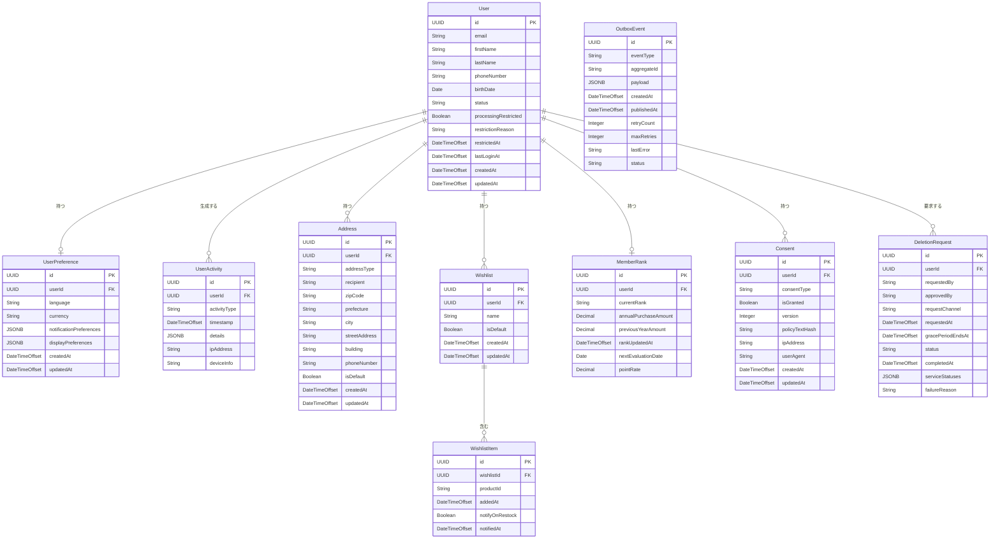
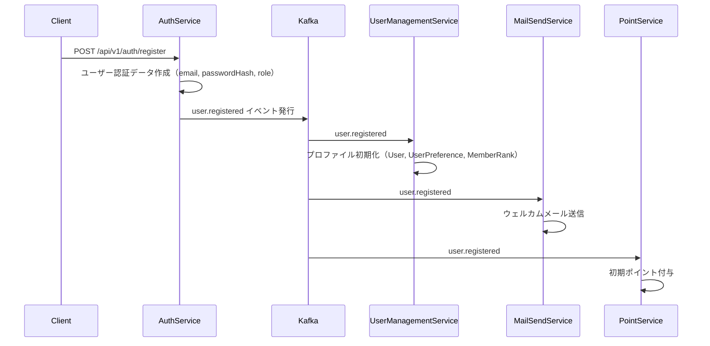
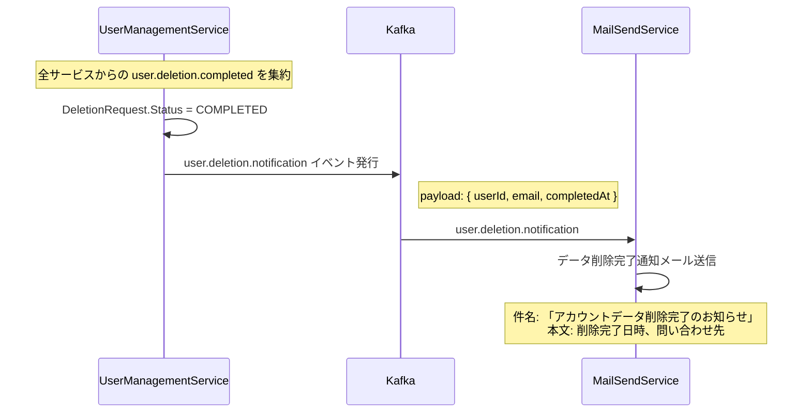
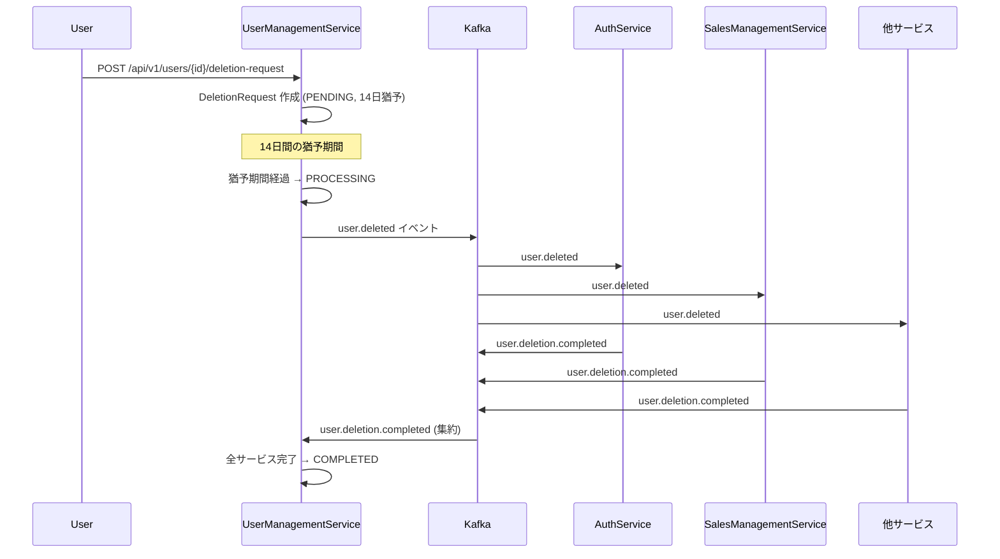

# ユーザー管理サービス (UserManagementService) — 詳細設計書

## 1. 概要

ユーザー管理サービスは、ユーザープロファイル管理、住所管理、ウィッシュリスト管理、会員ランク管理、GDPR/DSR（データ主体権利）対応、同意管理の機能を提供するマイクロサービスである。ユーザー登録・認証・パスワード管理・ロール管理は **AuthService** の責務であり、本サービスは AuthService から Kafka `user.registered` イベントを受信してプロファイルを初期化する。

## 2. 技術スタック

### 開発環境

- **言語**: C# 14 (.NET 10 LTS)
- **フレームワーク**: ASP.NET Core 10 (Minimal API)
- **ビルドツール**: dotnet CLI / MSBuild
- **コンテナ化**: Docker 25.x
- **オーケストレーション**: .NET Aspire 13.1
- **テスト**: xUnit, NSubstitute, Shouldly, Testcontainers.PostgreSql, WebApplicationFactory\<Program\>

### 本番環境

- Azure Container Apps
- Azure Database for PostgreSQL

### 主要 NuGet パッケージ

| パッケージ | バージョン | 用途 |
|-----------|----------|------|
| Microsoft.EntityFrameworkCore | 10.* | ORM データアクセス |
| Npgsql.EntityFrameworkCore.PostgreSQL | 10.* | PostgreSQL プロバイダー |
| ASP.NET Core 10 | 組み込み | REST API エンドポイント |
| FluentValidation | 11.* | 入力バリデーション |
| FluentValidation.DependencyInjectionExtensions | 11.* | FluentValidation DI 統合 |
| Microsoft.AspNetCore.Authentication.JwtBearer | 10.* | セキュリティ設定 |
| AspNetCore.HealthChecks.NpgSql | 9.* | ヘルスチェック・メトリクス |
| Confluent.Kafka | 2.* | イベント発行・購読 |
| Microsoft.EntityFrameworkCore.Design | 10.* | EF Core Migrations |
| Serilog.AspNetCore | 8.* | 構造化ロギング |
| Serilog.Formatting.Compact | 3.* | JSON 形式ログ出力 |
| OpenTelemetry.Extensions.Hosting | 1.* | メトリクス収集 |
| Azure.Identity | 最新 | Azure 認証 |
| StackExchange.Redis | 2.* | Redis キャッシュ（ユーザープロファイルキャッシュ、会員ランクキャッシュ） |
| AspNetCore.HealthChecks.Redis | 9.* | Redis ヘルスチェック |
| Polly | 8.* | 耐障害性（リトライ・サーキットブレーカー） |
| Microsoft.Extensions.Http.Resilience | 9.* | IHttpClientFactory + Polly 統合 |

## 3. システムアーキテクチャ

### コンポーネントアーキテクチャ図

```mermaid
graph TB
    subgraph "ユーザー管理サービス (UserManagementService)"
        direction TB
        API[Minimal API Endpoints] --> SERV[UserService]
        API --> ADDR_EP[AddressEndpoints]
        API --> WISH_EP[WishlistEndpoints]
        API --> CONSENT_EP[ConsentEndpoints]
        API --> DSR_EP[DsrEndpoints]
        
        ADDR_EP --> ADDR_SERV[AddressService]
        WISH_EP --> WISH_SERV[WishlistService]
        CONSENT_EP --> CONSENT_SERV[ConsentService]
        DSR_EP --> DSR_SERV[DsrService]
        
        SERV --> REPO[UserRepository]
        SERV --> PREF_SERV[PreferenceService]
        SERV --> ACT_SERV[ActivityService]
        
        ADDR_SERV --> ADDR_REPO[AddressRepository]
        WISH_SERV --> WISH_REPO[WishlistRepository]
        CONSENT_SERV --> CONSENT_REPO[ConsentRepository]
        DSR_SERV --> DSR_REPO[DeletionRequestRepository]
        PREF_SERV --> PREF_REPO[PreferenceRepository]
        ACT_SERV --> ACT_REPO[ActivityRepository]
        
        REPO --> DB[(PostgreSQL userdb)]
        ADDR_REPO --> DB
        WISH_REPO --> DB
        CONSENT_REPO --> DB
        DSR_REPO --> DB
        PREF_REPO --> DB
        ACT_REPO --> DB
        
        OUTBOX[OutboxPublisher BackgroundService] --> DB
        OUTBOX --> KAFKA[Kafka]
        RANK_BG[MemberRankEvaluationService BackgroundService] --> DB
        DSR_TIMEOUT[DsrTimeoutMonitorService BackgroundService] --> DB
        EXPORT_BG[DataExportService BackgroundService] --> DB
        
        CACHE[Redis Cache] 
        SERV --> CACHE
        
        EVENT[IEventPublisher] --> OUTBOX_TABLE[(outbox_events)]
        SERV --> EVENT
        
        VALID[FluentValidation]
        SERV --> VALID
    end
    
    KAFKA_IN[Kafka user.registered] --> SERV
    KAFKA_IN2[Kafka user.deletion.completed] --> DSR_SERV
```



### クラス構成

#### 主要クラス

#### Endpoints 層

- `UserEndpoints`: ユーザープロファイル関連の Minimal API エンドポイント
- `AddressEndpoints`: 住所管理 API エンドポイント
- `WishlistEndpoints`: ウィッシュリスト管理 API エンドポイント
- `PreferenceEndpoints`: ユーザー設定 API エンドポイント
- `ActivityEndpoints`: ユーザーアクティビティ API エンドポイント
- `ConsentEndpoints`: 同意管理 API エンドポイント
- `DsrEndpoints`: GDPR/DSR API エンドポイント（データ削除・エクスポート要求）
- `MemberRankEndpoints`: 会員ランク API エンドポイント
- `AdminUserEndpoints`: 管理者向けユーザー管理 API

#### サービス層

- `UserService`: ユーザープロファイル関連のビジネスロジック
- `AddressService`: 住所管理ロジック
- `WishlistService`: ウィッシュリスト管理ロジック
- `PreferenceService`: ユーザー設定管理ロジック
- `ActivityService`: ユーザーアクティビティ記録ロジック
- `ConsentService`: 同意管理ロジック
- `DsrService`: GDPR/DSR 処理ロジック
- `MemberRankService`: 会員ランク管理ロジック
- `EventPublisherService`: Outbox テーブルへのイベント書き込み

#### BackgroundService 層

- `OutboxPublisher`: Outbox テーブルからの Kafka イベント発行（Advisory Lock: `hashtext('outbox_publisher')`、動的バックオフ 100ms〜5s）
- `MemberRankEvaluationService`: 年次会員ランク評価（毎年 4 月 1 日バッチ、Advisory Lock: `hashtext('member_rank_eval')`）
- `DsrTimeoutMonitorService`: DSR タイムアウト監視（1 時間ポーリング、24 時間タイムアウト、最大 3 リトライ）
- `DataExportService`: GDPR データエクスポート処理

#### リポジトリ層

- `UserRepository`: ユーザーデータアクセス（EF Core）
- `AddressRepository`: 住所データアクセス（EF Core）
- `WishlistRepository`: ウィッシュリストデータアクセス（EF Core）
- `PreferenceRepository`: 設定データアクセス（EF Core）
- `ActivityRepository`: アクティビティデータアクセス（EF Core）
- `ConsentRepository`: 同意データアクセス（EF Core）
- `DeletionRequestRepository`: 削除リクエストデータアクセス（EF Core）
- `MemberRankRepository`: 会員ランクデータアクセス（EF Core）
- `OutboxEventRepository`: Outbox イベントデータアクセス（EF Core）

#### モデル

- `User`: ユーザーエンティティ（EF Core エンティティ）
- `Address`: 住所エンティティ
- `Wishlist`: ウィッシュリストエンティティ
- `WishlistItem`: ウィッシュリストアイテムエンティティ
- `UserPreference`: ユーザー設定エンティティ
- `UserActivity`: ユーザーアクティビティエンティティ
- `MemberRank`: 会員ランクエンティティ
- `Consent`: 同意エンティティ
- `DeletionRequest`: 削除リクエストエンティティ
- `OutboxEvent`: Outbox イベントエンティティ

#### DTO

- `UserDto`: ユーザーデータ転送オブジェクト (record)
- `AddressDto`: 住所データ転送オブジェクト (record)
- `WishlistDto`: ウィッシュリストデータ転送オブジェクト (record)
- `PreferenceDto`: 設定データ転送オブジェクト (record)
- `ActivityDto`: アクティビティデータ転送オブジェクト (record)
- `MemberRankDto`: 会員ランクデータ転送オブジェクト (record)
- `ConsentDto`: 同意データ転送オブジェクト (record)

#### 設定

- セキュリティ設定（Program.cs 内）
- Kafka 設定
- Web 関連設定

### データベース設計

> **DB 名**: `userdb`（ADR-0006: サービス別独立 DB に準拠）

#### ER 図



#### FK 制約

| 子テーブル | 親テーブル | ON DELETE | ON UPDATE |
|-----------|-----------|-----------|-----------|
| user_preferences | users | CASCADE | CASCADE |
| addresses | users | CASCADE | CASCADE |
| user_activities | users | CASCADE | CASCADE |
| wishlists | users | CASCADE | CASCADE |
| wishlist_items | wishlists | CASCADE | CASCADE |
| member_ranks | users | CASCADE | CASCADE |
| consents | users | CASCADE | CASCADE |
| deletion_requests | users | SET NULL | CASCADE |

#### CHECK 制約

| テーブル | カラム | 制約 |
|---------|--------|------|
| users | status | `CHECK (status IN ('PENDING_VERIFICATION','ACTIVE','SUSPENDED','DEACTIVATED'))` |
| addresses | address_type | `CHECK (address_type IN ('SHIPPING','BILLING'))` |
| member_ranks | current_rank | `CHECK (current_rank IN ('BRONZE','SILVER','GOLD','PLATINUM'))` |
| member_ranks | annual_purchase_amount | `CHECK (annual_purchase_amount >= 0)` |
| member_ranks | point_rate | `CHECK (point_rate >= 0 AND point_rate <= 1)` |
| consents | consent_type | `CHECK (consent_type IN ('MARKETING','PERSONALIZATION','ANALYTICS','THIRD_PARTY_SHARING'))` |
| consents | status | `CHECK (status IN ('GRANTED','REVOKED'))` |
| deletion_requests | status | `CHECK (status IN ('PENDING','PROCESSING','COMPLETED','FAILED','CANCELLED','AWAITING_MANUAL_INTERVENTION'))` |
| deletion_requests | request_channel | `CHECK (request_channel IN ('WEB_SELF_SERVICE','ADMIN_CONSOLE','EMAIL_DSR','API'))` |

#### インデックス設計

| テーブル | カラム | 種別 |
|---------|--------|------|
| users | email | UNIQUE B-Tree |
| users | status | B-Tree |
| users | created_at | B-Tree |
| addresses | (user_id, is_default) | Composite |
| user_preferences | user_id | UNIQUE |
| user_activities | (user_id, activity_type) | Composite |
| wishlists | user_id | B-Tree |
| wishlist_items | wishlist_id | B-Tree |
| consents | user_id | B-Tree |
| deletion_requests | user_id | B-Tree |
| member_ranks | user_id | UNIQUE |
| outbox_events | status (PENDING) | Partial Index |
| outbox_events | status (FAILED) | Partial Index |

## 4. API 設計

### RESTful API エンドポイント

> **注意**: ユーザー登録・ログイン・パスワード管理・ロール管理は AuthService の責務。本サービスはプロファイル管理以降を担当する。

#### ユーザープロファイル API

| メソッド | パス | 説明 | 認証要件 |
|--------|-----|------|----------|
| GET | /api/v1/users/{id} | ユーザープロファイル取得 | 要認証（本人または管理者） |
| PUT | /api/v1/users/{id} | ユーザープロファイル更新 | 要認証（本人または管理者） |
| GET | /api/v1/users/me | 自分のプロファイル取得 | 要認証 |

#### 住所管理 API

| メソッド | パス | 説明 | 認証要件 |
|--------|-----|------|----------|
| GET | /api/v1/users/{userId}/addresses | 住所一覧取得 | 要認証（本人または管理者） |
| POST | /api/v1/users/{userId}/addresses | 住所追加 | 要認証（本人） |
| PUT | /api/v1/users/{userId}/addresses/{id} | 住所更新 | 要認証（本人） |
| DELETE | /api/v1/users/{userId}/addresses/{id} | 住所削除 | 要認証（本人） |

#### ウィッシュリスト API

| メソッド | パス | 説明 | 認証要件 |
|--------|-----|------|----------|
| GET | /api/v1/users/{userId}/wishlists | ウィッシュリスト一覧取得 | 要認証（本人） |
| POST | /api/v1/users/{userId}/wishlists | ウィッシュリスト作成 | 要認証（本人） |
| PUT | /api/v1/users/{userId}/wishlists/{id} | ウィッシュリスト更新 | 要認証（本人） |
| DELETE | /api/v1/users/{userId}/wishlists/{id} | ウィッシュリスト削除 | 要認証（本人） |
| POST | /api/v1/users/{userId}/wishlists/{id}/items | アイテム追加 | 要認証（本人） |
| POST | /api/v1/users/{userId}/wishlists/{id}/items/{itemId}/cart | ウィッシュリストからカートに移動（spec.md L1542 準拠） | 要認証（本人） |
| DELETE | /api/v1/users/{userId}/wishlists/{id}/items/{itemId} | アイテム削除 | 要認証（本人） |

#### ユーザー設定 API

| メソッド | パス | 説明 | 認証要件 |
|--------|-----|------|----------|
| GET | /api/v1/users/{id}/preferences | ユーザー設定取得 | 要認証（本人または管理者） |
| PUT | /api/v1/users/{id}/preferences | 設定更新 | 要認証（本人） |

#### ユーザーアクティビティ API

| メソッド | パス | 説明 | 認証要件 |
|--------|-----|------|----------|
| GET | /api/v1/users/{id}/activities | ユーザーアクティビティ一覧取得 | 要認証（本人または管理者） |
| GET | /api/v1/users/me/activities | 自分のアクティビティ一覧取得 | 要認証 |

#### 会員ランク API

| メソッド | パス | 説明 | 認証要件 |
|--------|-----|------|----------|
| GET | /api/v1/users/{userId}/member-rank | 会員ランク取得 | 要認証（本人または管理者） |

#### 同意管理 API

| メソッド | パス | 説明 | 認証要件 |
|--------|-----|------|----------|
| GET | /api/v1/users/{userId}/consents | 同意一覧取得 | 要認証（本人） |
| PUT | /api/v1/users/{userId}/consents | 同意更新 | 要認証（本人） |
| POST | /api/v1/anonymous-consents | 匿名ユーザー同意記録 | 不要 |

#### GDPR/DSR API

| メソッド | パス | 説明 | 認証要件 |
|--------|-----|------|----------|
| POST | /api/v1/users/{userId}/deletion-request | データ削除リクエスト | 要認証（本人または管理者） |
| GET | /api/v1/users/{userId}/deletion-request | 削除リクエスト状態確認 | 要認証（本人または管理者） |
| POST | /api/v1/users/{userId}/deletion-request/cancel | 削除リクエストキャンセル（猶予期間内） | 要認証（本人） |
| POST | /api/v1/users/{userId}/data-export | データエクスポート要求 | 要認証（本人） |

#### 管理者向け API

| メソッド | パス | 説明 | 認証要件 |
|--------|-----|------|----------|
| GET | /api/v1/admin/users | ユーザー一覧取得 | 要認証（管理者） |
| PUT | /api/v1/admin/users/{id}/status | ユーザーステータス更新 | 要認証（管理者） |
| PUT | /api/v1/admin/users/{id}/processing-restriction | 処理制限の設定/解除（GDPR Art.18） | 要認証（管理者） |

### API リクエスト・レスポンス例

#### リクエスト（プロファイル更新）

```http
PUT /api/v1/users/f47ac10b-58cc-4372-a567-0e02b2c3d479 HTTP/1.1
Content-Type: application/json
Authorization: Bearer <token>

{
  "firstName": "太郎",
  "lastName": "山田",
  "phoneNumber": "090-1234-5678",
  "birthDate": "1990-01-01"
}
```

#### レスポンス（プロファイル更新）

```http
HTTP/1.1 200 OK
Content-Type: application/json

{
  "id": "f47ac10b-58cc-4372-a567-0e02b2c3d479",
  "email": "yamada.taro@example.com",
  "firstName": "太郎",
  "lastName": "山田",
  "phoneNumber": "090-1234-5678",
  "birthDate": "1990-01-01",
  "status": "ACTIVE",
  "createdAt": "2025-06-19T10:30:00+00:00"
}
```

## 5. イベント設計

> **Outbox パターン（ADR-0005）**: 全てのイベント発行は Outbox テーブル経由で行い、DB トランザクションとイベント発行の整合性を保証する。

### 発行イベント

| イベント名 | 説明 | ペイロード | 購読サービス |
|-----------|------|-----------|-------------|
| user.deleted | ユーザー削除処理開始時 | userId, deletedAt | AuthService, SalesManagementService, PaymentCartService, CouponService, PointService, AiSupportService, MailSendService |
| user.profile-updated | ユーザープロファイル更新時 | userId, updatedFields, updatedAt | AiSupportService |
| user.deletion.notification | DSR 削除完了時の通知トリガー（GDPR Art.12(3) 準拠） | userId, email, completedAt | MailSendService |
| member-rank.updated | 会員ランク変更時（リアルタイム昇格または年次バッチ評価） | userId, previousRank, newRank, pointRate, updatedAt | PointService |
| consent.revoked | 同意撤回時 | userId, consentType, revokedAt | MailSendService, AiSupportService, AuthService |

### 購読イベント

| イベント名 | 発行元 | アクション |
|-----------|--------|----------|
| user.registered | AuthService | ユーザープロファイル初期化（User, UserPreference, MemberRank 作成） |
| password.changed | AuthService | パスワード変更時のプロファイル更新通知・全セッション無効化の連携処理（spec.md L503 準拠: AuthService → Kafka「PasswordChanged」→ UserManagementService）。受信時に `UserActivity` へ `PASSWORD_CHANGED` アクティビティを記録し、`lastLoginAt` をリセットする。セッション無効化は AuthService が主管するが、UserManagementService 側でもユーザーの `updatedAt` を更新してキャッシュ無効化のトリガーとする |
| user.deletion.completed | 各サービス | DSR 完了状況の集約・更新 |
| order.confirmed | SalesManagementService | 年間購入累計額（annualPurchaseAmount）の更新 + 会員ランクリアルタイム昇格判定（spec.md L2609 準拠: 購入確定時点で閾値超過なら即時昇格） |
| inventory.stock_updated | InventoryManagementService | WishlistItem の notifyOnRestock フラグに基づく在庫復活通知トリガー（spec.md L1545 準拠） |

### イベントスキーマ例

#### user.deleted イベント

```json
{
  "eventId": "2b5fed9a-3ef0-4c82-bffd-f6cf591d7520",
  "eventType": "user.deleted",
  "timestamp": "2025-06-19T10:30:00+00:00",
  "producer": "UserManagementService",
  "payload": {
    "userId": "f47ac10b-58cc-4372-a567-0e02b2c3d479",
    "deletedAt": "2025-06-19T10:30:00+00:00"
  }
}
```

#### user.profile-updated イベント

```json
{
  "eventId": "a1b2c3d4-e5f6-7890-abcd-ef1234567890",
  "eventType": "user.profile-updated",
  "timestamp": "2025-06-19T11:00:00+00:00",
  "producer": "UserManagementService",
  "payload": {
    "userId": "f47ac10b-58cc-4372-a567-0e02b2c3d479",
    "updatedFields": ["firstName", "phoneNumber"],
    "updatedAt": "2025-06-19T11:00:00+00:00"
  }
}
```

### シーケンス図（ユーザー登録フロー）



## 6. セキュリティ設計

### 認証・認可

- JWT トークンベース認証（Microsoft.AspNetCore.Authentication.JwtBearer）
- ASP.NET Core Authorization ミドルウェアによる認可フィルター
- IDOR 防止: 全エンドポイントで `ClaimsPrincipal` からユーザー ID を取得し、リソースオーナーシップを検証

> **注意**: パスワード管理・ロール管理は AuthService の責務。本サービスは JWT トークンの検証のみ行う。

### IDOR 防止（オブジェクトレベル認可）

```csharp
// ✅ 全ユーザー固有リソースでオーナーシップ検証
private static async Task<IResult> GetUserById(
    string id,
    ClaimsPrincipal user,
    IUserService userService,
    CancellationToken ct)
{
    var authenticatedUserId = user.FindFirstValue(ClaimTypes.NameIdentifier)
        ?? throw new UnauthorizedException();
    var isAdmin = user.IsInRole("Admin");
    
    if (!isAdmin && authenticatedUserId != id)
        return TypedResults.Problem(statusCode: 403, title: "Forbidden");
    
    return await userService.GetByIdAsync(id, ct) is { } profile
        ? Results.Ok(profile)
        : Results.NotFound();
}
```

### データ保護

- 転送中のデータは TLS 1.3 で暗号化
- 個人情報は Azure Key Vault で管理された鍵で暗号化
- データベースへのアクセスは最小権限の原則に基づく

### GDPR/DSR 対応

#### 個人データ削除フロー（DSR: Data Subject Request）

1. ユーザーまたは管理者が `POST /api/v1/users/{userId}/deletion-request` を実行
2. `DeletionRequest` エンティティが `PENDING` ステータスで作成される
3. **14 日間の猶予期間**が設定される（`grace_period_ends_at`）
4. 猶予期間内はユーザーが `POST /api/v1/users/{userId}/deletion-request/cancel` でキャンセル可能
5. 猶予期間経過後、`DsrService` が削除処理を開始:
   - ステータスを `PROCESSING` に変更
   - Kafka `user.deleted` イベントを全サービスに発行
   - 各サービスが削除完了後 `user.deletion.completed` イベントを返送
   - 全サービスの完了を `service_statuses` (JSONB) で集約
   - 全完了で `COMPLETED`、失敗時は `FAILED` に遷移
6. **削除完了通知（GDPR Art.12(3) 準拠）**: DSR ステータスが `COMPLETED` に遷移した時点で、`MailSendService` 経由でユーザーにデータ削除完了通知メールを送信する

##### DSR 削除完了通知フロー



> **注意**: 削除完了通知メールの送信は、ユーザーデータの物理削除**前**に実行する。メールアドレスは `DeletionRequest` の処理開始時にメール送信用の一時領域（Outbox イベントペイロード）に保存し、User レコード削除後もメール送信が可能な設計とする。

> **GDPR Art.12(3) 準拠**: データ主体の要求に対して「不当な遅延なく、いかなる場合も受領後 1 ヶ月以内に」対応＋通知する義務があるため、`DeletionRequest.requestedAt` から 30 日以内に通知が完了することを保証する。



#### DsrTimeoutMonitorService

- 1 時間ごとにポーリング
- `PROCESSING` ステータスで 24 時間以上経過した DeletionRequest を検出
- 最大 3 回リトライ後、`AWAITING_MANUAL_INTERVENTION` に遷移

#### 処理制限（GDPR Art.18）

ユーザーデータの処理を一時的に制限する機能:

```csharp
// User エンティティに処理制限カラムを追加
[Column("processing_restricted")]
public bool ProcessingRestricted { get; set; } = false;

[Column("restriction_reason")]
[MaxLength(500)]
public string? RestrictionReason { get; set; }

[Column("restricted_at")]
public DateTimeOffset? RestrictedAt { get; set; }
```

#### データポータビリティ（GDPR Art.20）

`POST /api/v1/users/{userId}/data-export` で JSON 形式のデータエクスポートを要求。`DataExportService` (BackgroundService) がバックグラウンドで処理。

##### エクスポート JSON スキーマ定義

GDPR Art.20 が要求する「構造化された、一般的に使用され、機械可読な形式」に準拠するエクスポートデータの具体的スキーマを以下に定義する。

```json
{
  "$schema": "https://json-schema.org/draft/2020-12/schema",
  "type": "object",
  "properties": {
    "exportMetadata": {
      "type": "object",
      "properties": {
        "exportId": { "type": "string", "format": "uuid" },
        "exportedAt": { "type": "string", "format": "date-time" },
        "requestedBy": { "type": "string" },
        "serviceName": { "type": "string", "const": "UserManagementService" },
        "schemaVersion": { "type": "string", "const": "1.0" }
      }
    },
    "user": {
      "type": "object",
      "properties": {
        "id": { "type": "string", "format": "uuid" },
        "email": { "type": "string", "format": "email" },
        "firstName": { "type": "string" },
        "lastName": { "type": "string" },
        "phoneNumber": { "type": ["string", "null"] },
        "birthDate": { "type": ["string", "null"], "format": "date" },
        "status": { "type": "string" },
        "lastLoginAt": { "type": ["string", "null"], "format": "date-time" },
        "createdAt": { "type": "string", "format": "date-time" }
      }
    },
    "addresses": {
      "type": "array",
      "items": {
        "type": "object",
        "properties": {
          "addressType": { "type": "string" },
          "recipient": { "type": "string" },
          "zipCode": { "type": "string" },
          "prefecture": { "type": "string" },
          "city": { "type": "string" },
          "streetAddress": { "type": "string" },
          "building": { "type": ["string", "null"] },
          "phoneNumber": { "type": ["string", "null"] },
          "isDefault": { "type": "boolean" }
        }
      }
    },
    "wishlists": {
      "type": "array",
      "items": {
        "type": "object",
        "properties": {
          "name": { "type": "string" },
          "isDefault": { "type": "boolean" },
          "items": {
            "type": "array",
            "items": {
              "type": "object",
              "properties": {
                "productId": { "type": "string" },
                "addedAt": { "type": "string", "format": "date-time" },
                "notifyOnRestock": { "type": "boolean" }
              }
            }
          }
        }
      }
    },
    "preferences": {
      "type": "object",
      "properties": {
        "language": { "type": "string" },
        "currency": { "type": "string" },
        "notificationPreferences": { "type": ["object", "null"] },
        "displayPreferences": { "type": ["object", "null"] }
      }
    },
    "consents": {
      "type": "array",
      "items": {
        "type": "object",
        "properties": {
          "consentType": { "type": "string" },
          "isGranted": { "type": "boolean" },
          "version": { "type": "integer" },
          "updatedAt": { "type": "string", "format": "date-time" }
        }
      }
    },
    "activities": {
      "type": "array",
      "items": {
        "type": "object",
        "properties": {
          "activityType": { "type": "string" },
          "timestamp": { "type": "string", "format": "date-time" },
          "details": { "type": ["object", "null"] }
        }
      }
    },
    "memberRank": {
      "type": "object",
      "properties": {
        "currentRank": { "type": "string" },
        "annualPurchaseAmount": { "type": "number" },
        "pointRate": { "type": "number" },
        "rankUpdatedAt": { "type": "string", "format": "date-time" }
      }
    }
  }
}
```

> **PCI DSS 除外事項**: エクスポートデータに決済情報（クレジットカード番号、CVV、決済トランザクション詳細）は一切含まない。決済情報は PaymentCartService の責務であり、ADR-0008（PCI DSS 非保持化方針）に基づきユーザー管理サービスでは保持しない。

> **エクスポートファイルの保護**: 生成されたエクスポート JSON は AES-256 で暗号化し、ダウンロード URL の有効期限を 24 時間に設定する。ダウンロード URL は `UserActivity` に `DATA_EXPORT_DOWNLOADED` として記録する。

### 同意管理

- `Consent` エンティティで同意種別ごとの状態を管理
- 同意種別: `MARKETING`, `PERSONALIZATION`, `ANALYTICS`, `THIRD_PARTY_SHARING`
- 同意撤回時に `consent.revoked` Kafka イベントを発行
- 匿名ユーザーの同意は `anonymous_consents` テーブルで管理

### PII ログ禁止

```csharp
// ❌ 禁止: PII をログに出力
logger.LogInformation("ユーザーが更新されました: {Email}", user.Email);

// ✅ 正しい: ユーザー ID のみ出力
logger.LogInformation("ユーザーが更新されました: {UserId}", user.Id);
```

### 管理者操作監査ログ（GDPR Art.5(2) アカウンタビリティ原則）

管理者向け API（§4）によるユーザーステータス変更・処理制限設定/解除の操作は、「誰が・いつ・どのユーザーに対して・何をしたか」のトレーサビリティを確保するため、`UserActivity` テーブルに以下の管理者操作種別を記録する。

| 操作種別（activityType） | 対応 API | 記録内容（details JSONB） |
|-------------------------|---------|------------------------|
| `ADMIN_STATUS_CHANGED` | `PUT /api/v1/admin/users/{id}/status` | `{ "adminId": "...", "previousStatus": "...", "newStatus": "...", "reason": "..." }` |
| `ADMIN_PROCESSING_RESTRICTION_SET` | `PUT /api/v1/admin/users/{id}/processing-restriction` | `{ "adminId": "...", "restricted": true, "reason": "..." }` |
| `ADMIN_PROCESSING_RESTRICTION_REMOVED` | `PUT /api/v1/admin/users/{id}/processing-restriction` | `{ "adminId": "...", "restricted": false }` |
| `ADMIN_DELETION_REQUESTED` | `POST /api/v1/users/{userId}/deletion-request`（管理者実行時） | `{ "adminId": "...", "requestChannel": "ADMIN_CONSOLE" }` |

```csharp
// ✅ 管理者操作の監査ログ記録例
public async Task UpdateStatusAsync(string id, string status, string adminId, CancellationToken ct = default)
{
    var user = await _userRepository.FindByIdAsync(id, ct)
        ?? throw new NotFoundException($"ユーザーが見つかりません (ID: {id})");

    var previousStatus = user.Status;
    user.Status = status;
    user.UpdatedAt = DateTimeOffset.UtcNow;

    // 監査ログを UserActivity に記録
    await _activityService.RecordAsync(
        userId: id,
        activityType: "ADMIN_STATUS_CHANGED",
        details: JsonSerializer.Serialize(new
        {
            adminId,
            previousStatus,
            newStatus = status
        }),
        ipAddress: null,
        deviceInfo: null,
        ct);

    await _userRepository.SaveChangesAsync(ct);
    _logger.LogInformation("管理者がユーザーステータスを変更しました: {UserId}, {PreviousStatus} → {NewStatus}, Admin: {AdminId}",
        id, previousStatus, status, adminId);
}
```

> **保持期間**: 管理者操作の監査ログは法的義務（GDPR Art.5(2)）に基づき、最低 3 年間保持する。`UserActivity` の `activityType` が `ADMIN_*` で始まるレコードは通常の自動削除ポリシーの対象外とする。

## 7. エラー処理

### エラーレスポンス形式（RFC 9457 Problem Details）

全エラーレスポンスは RFC 9457 Problem Details 形式で返す。`TypedResults.Problem()` を使用する。

```json
{
  "type": "https://tools.ietf.org/html/rfc9457",
  "title": "Not Found",
  "status": 404,
  "detail": "指定されたユーザーが見つかりません",
  "instance": "/api/v1/users/xxx"
}
```

### 例外マッピング

| 例外クラス | HTTP ステータス | RFC 9457 title |
|-----------|----------------|----------------|
| `NotFoundException` | 404 | Not Found |
| `BusinessException` | 422 | Unprocessable Entity |
| `UnauthorizedException` | 401 | Unauthorized |
| `ForbiddenException` | 403 | Forbidden |
| `ConcurrencyException` | 409 | Conflict |
| バリデーションエラー | 400 | Bad Request |
| その他の例外 | 500 | Internal Server Error |

### 例外ハンドリング

- グローバル例外ハンドラー（`UseExceptionHandler`）による集中的な例外ハンドリング
- カスタム例外クラス階層（`NotFoundException`、`BusinessException`、`UnauthorizedException` 等）
- 詳細なログ記録（機密情報を除く）
- スタックトレースをクライアントに返さない（`"DetailedErrors": false`）

## 8. パフォーマンス最適化

### Redis キャッシュ戦略

spec.md L513-514 に基づき、Redis をユーザー情報のキャッシュに使用する。

| キャッシュ対象 | キーパターン | TTL | 無効化トリガー |
|-------------|------------|-----|-------------|
| ユーザープロファイル | `user:profile:{userId}` | 30 分 | `PUT /api/v1/users/{id}` 実行時、`password.changed` イベント受信時 |
| 会員ランク | `user:rank:{userId}` | 1 時間 | `order.confirmed` イベントによるランク変更時、年次バッチ実行時 |
| ユーザー設定 | `user:pref:{userId}` | 1 時間 | `PUT /api/v1/users/{id}/preferences` 実行時 |

**キャッシュ無効化方針**: Write-Through パターンを採用する。データ更新時に DB 書き込みとキャッシュ削除を同一操作内で実行し、次回読み取り時にキャッシュを再構築する（Cache-Aside パターン）。

```csharp
// ✅ キャッシュ利用パターン（UserService）
public async Task<UserDto?> GetByIdAsync(string id, CancellationToken ct = default)
{
    var cacheKey = $"user:profile:{id}";
    var cached = await _cache.GetStringAsync(cacheKey, ct);
    if (cached is not null)
        return JsonSerializer.Deserialize<UserDto>(cached);

    var user = await _userRepository.FindByIdAsync(id, ct);
    if (user is null) return null;

    var dto = MapToDto(user);
    await _cache.SetStringAsync(cacheKey, JsonSerializer.Serialize(dto),
        new DistributedCacheEntryOptions { AbsoluteExpirationRelativeToNow = TimeSpan.FromMinutes(30) }, ct);
    return dto;
}
```

**Aspire AppHost 設定の更新**:

```csharp
var userService = builder.AddProject<Projects.UserManagementService>("user-service")
    .WithReference(userDb)
    .WithReference(redis)   // Redis 参照を追加（spec.md L513-514 準拠）
    .WithReference(kafka);
```

**ヘルスチェック**: Redis 接続状態を `/health/ready` エンドポイントで監視する。

```csharp
builder.Services.AddHealthChecks()
    .AddNpgSql(connectionString, name: "postgresql", tags: ["ready"])
    .AddRedis(redisConnectionString, name: "redis", tags: ["ready"]);
```

### データベース最適化

- インデックス設計（§3 インデックス設計 参照）
- 適切なページネーション実装
- クエリの最適化（EF Core LINQ + `AsNoTracking()`）
- 読み取り専用クエリには `AsNoTracking()` を適用

### 負荷テスト基準

- 通常時 500 リクエスト/秒の処理
- ピーク時 2,000 リクエスト/秒の処理
- レスポンスタイム 95% が 200ms 以下
- CPU 使用率 80% 以下

### 耐障害性（Resilience）設計

AGENTS.md §11.1 に基づき、外部サービス障害時のフォールバック戦略と Outbox パブリッシャーのリトライ戦略を定義する。

#### 外部 HTTP 通信のレジリエンス（Polly v8 統合）

UserManagementService は直接の HTTP 呼出しは少ないが、将来の外部サービス連携に備えた標準設計を適用する。

```csharp
// ✅ Program.cs — IHttpClientFactory + Polly v8 標準設定
builder.Services.AddHttpClient("ExternalService", client =>
{
    client.BaseAddress = new Uri("https://external-service");
})
.AddStandardResilienceHandler(options =>
{
    // リトライ: 指数バックオフ（最大 3 回）
    options.Retry.MaxRetryAttempts = 3;
    options.Retry.BackoffType = DelayBackoffType.Exponential;
    options.Retry.Delay = TimeSpan.FromMilliseconds(500);

    // サーキットブレーカー: 10 秒の遮断期間
    options.CircuitBreaker.BreakDuration = TimeSpan.FromSeconds(10);
    options.CircuitBreaker.SamplingDuration = TimeSpan.FromSeconds(30);
    options.CircuitBreaker.FailureRatio = 0.5;
    options.CircuitBreaker.MinimumThroughput = 10;

    // タイムアウト
    options.AttemptTimeout.Timeout = TimeSpan.FromSeconds(10);
    options.TotalRequestTimeout.Timeout = TimeSpan.FromSeconds(30);
});
```

#### Outbox パブリッシャー障害時のリトライ戦略

| 障害種別 | リトライ戦略 | 最大リトライ | フォールバック |
|---------|-----------|------------|-------------|
| Kafka ブローカー接続失敗 | 指数バックオフ（100ms → 5s） | 5 回 | `FAILED` ステータスに遷移、アラート発火 |
| イベントシリアライゼーションエラー | リトライなし（永続的障害） | 0 回 | `FAILED` + `lastError` に詳細記録 |
| Advisory Lock 取得失敗 | `MaxDelay`（5s）後に再試行 | 制限なし | 他インスタンスが処理中のため待機 |

#### Kafka Consumer 障害時のフォールバック

| 障害種別 | フォールバック |
|---------|-------------|
| `user.registered` 処理失敗 | Dead Letter Topic (`user.registered.DLT`) へ転送、手動リカバリー |
| `order.confirmed` 処理失敗 | リトライ後、`MemberRank` の次回バッチ評価で自動補正 |
| `password.changed` 処理失敗 | Dead Letter Topic へ転送、アクティビティ記録は次回ログイン時に補完 |

## 9. 監視・ロギング

### メトリクス

- アクティブユーザー数
- リクエスト処理時間
- エラーレート
- API エンドポイント使用率
- Outbox キューサイズ
- DSR 処理状況

### ログ

- 構造化ログ（JSON 形式、Serilog + `ILogger<T>`）
- ログレベル: Information（本番）、Debug（開発/テスト）
- 重要な操作の監査ログ
- PII（個人識別情報）のマスキング — メールアドレス・住所等をログに出力しない（ユーザー ID のみ出力可）

### アラート

- エラーレート閾値超過
- レスポンスタイム閾値超過
- リソース使用率閾値超過
- DSR 処理タイムアウト（24 時間超過）

## 10. テスト戦略

### 単体テスト

- サービス層のビジネスロジックテスト（xUnit + NSubstitute + Shouldly）
- リポジトリ層のデータアクセステスト
- Endpoints 層の入力検証テスト
- モックとスタブを使用した依存コンポーネント分離

### 統合テスト

- Testcontainers.PostgreSql を使用した実際のデータベースとの統合テスト
- Kafka との統合テスト
- `WebApplicationFactory<Program>` による API 統合テスト

### 会員ランク (MemberRank) テスト戦略

| テスト種別 | テスト内容 |
|-----------|----------|
| Unit Test | ランク判定ロジック（BRONZE→SILVER→GOLD→PLATINUM の閾値判定） |
| Unit Test | ポイントレート計算ロジック |
| Unit Test | 年次購入額集計ロジック |
| Integration Test | MemberRankEvaluationService のバッチ処理（Testcontainers） |
| Integration Test | Advisory Lock の競合テスト |

### GDPR/DSR テスト戦略

| テスト種別 | テスト内容 |
|-----------|----------|
| Unit Test | 14 日間猶予期間の計算 |
| Unit Test | 削除リクエストのキャンセル（猶予期間内/外） |
| Integration Test | DsrTimeoutMonitorService のタイムアウト検出 |
| Integration Test | user.deletion.completed イベントの集約処理 |

### DataExportService テスト戦略（GDPR Art.20 データポータビリティ）

| テスト種別 | テスト内容 |
|-----------|----------|
| Unit Test | エクスポート JSON が §6 定義のスキーマに完全準拠していること |
| Unit Test | 全 PII データ項目（User, Address, Wishlist, Consent, Activity, MemberRank, Preference）がエクスポートに含まれること |
| Unit Test | PCI DSS 対象データ（決済情報）がエクスポートに**含まれない**こと |
| Unit Test | エクスポートファイルの AES-256 暗号化が正しく適用されること |
| Integration Test | 大量データ時（住所 10 件、ウィッシュリスト 5 件×アイテム 100 件、アクティビティ 10,000 件）のエクスポート処理が 60 秒以内に完了すること |
| Integration Test | エクスポート完了後にダウンロード URL が `UserActivity` に `DATA_EXPORT_COMPLETED` として記録されること |
| Security Test | ダウンロード URL の有効期限（24 時間）が正しく機能し、期限後にアクセス不可となること |

### テストカバレッジ目標

- 単体テスト: 分岐カバレッジ 80% 以上
- 統合テスト: 主要フロー 100% カバー

## 11. デプロイメント

### Docker コンテナ化

#### Dockerfile

```dockerfile
FROM mcr.microsoft.com/dotnet/sdk:10.0 AS build
WORKDIR /src
COPY ["UserManagementService/UserManagementService.csproj", "UserManagementService/"]
RUN dotnet restore "UserManagementService/UserManagementService.csproj"
COPY . .
WORKDIR "/src/UserManagementService"
RUN dotnet publish "UserManagementService.csproj" -c Release -o /app/publish --no-restore

FROM mcr.microsoft.com/dotnet/aspnet:10.0 AS runtime
WORKDIR /app
RUN groupadd -r skishop && useradd -r -g skishop -d /app skishop
COPY --from=build --chown=skishop:skishop /app/publish .
USER skishop

ENV ASPNETCORE_ENVIRONMENT=Production
ENV DOTNET_RUNNING_IN_CONTAINER=true
EXPOSE 5002
HEALTHCHECK --interval=30s --timeout=10s --retries=3 \
    CMD curl -f http://localhost:5002/health || exit 1

ENTRYPOINT ["dotnet", "UserManagementService.dll"]
```

### 環境変数設定

| 環境変数 | 説明 | デフォルト値 |
|---------|------|------------|
| ASPNETCORE_URLS | サービスポート | http://+:5002 |
| ASPNETCORE_ENVIRONMENT | 環境プロファイル | Development |
| ConnectionStrings__DefaultConnection | PostgreSQL 接続文字列 | Host=localhost;Port=5432;Database=userdb |
| Kafka__BootstrapServers | Kafka サーバー | localhost:9092 |
| Logging__LogLevel__Default | ルートログレベル | Information |

### Aspire AppHost 設定

```csharp
var userService = builder.AddProject<Projects.UserManagementService>("user-service")
    .WithReference(userDb)
    .WithReference(redis)   // Redis キャッシュ参照（spec.md L513-514 準拠）
    .WithReference(kafka);
```

> **注意**: spec.md L513-514 のデータストア定義に Redis が含まれるため、`.WithReference(redis)` を追加する。キャッシュ戦略の詳細は §8「Redis キャッシュ戦略」を参照。

## 12. 運用・保守

### バックアップ戦略

- PostgreSQL データベースの日次フルバックアップ
- WAL アーカイブによる Point-in-Time リカバリ対応
- バックアップデータの暗号化と安全な保管

### データマイグレーション

- EF Core Migrations によるバージョン管理されたデータベースマイグレーション
- ゼロダウンタイムマイグレーション手順
- ロールバック計画

### スケーリング戦略

- 水平スケーリング: レプリカ数増加
- 垂直スケーリング: コンテナリソース割り当て増加
- 自動スケーリング設定（CPU 使用率 70% 超過時）

### 障害対応

- 障害検知: ヘルスチェック、メトリクス監視
- 復旧手順: Polly リトライメカニズム、サーキットブレーカー
- Outbox パブリッシャーの障害時: Advisory Lock 解放後に自動リトライ

## 13. 開発ガイドライン

### コーディング規約

- .NET コーディング規約準拠（PascalCase、camelCase、`_camelCase`）
- `TreatWarningsAsErrors` による静的解析

### API 開発ガイドライン

- 全 API パスに `/api/v1/` プレフィックスを付与
- リソース命名規則: 複数形の名詞（例: /users, /addresses, /wishlists）
- HTTP メソッド使用規則
- エラーレスポンス形式: RFC 9457 Problem Details（`TypedResults.Problem()` を使用）

## 14. 実装参考コード

### エンティティ定義例

> **spec.md との不整合に関する注記（H-10）**: spec.md L653-672 のユーザー管理サービス主要エンティティでは `passwordHash` が `User` の属性として記載されているが、本サービスの User エンティティは `passwordHash` を**保持しない**。パスワード管理は AuthService の責務（AGENTS.md §1 参照）であり、UserManagementService はプロファイル情報のみ管理する。spec.md 側の `passwordHash` 記載は AuthService のエンティティ定義との混在であり、テックリードによる spec.md の修正を推奨する。

#### User エンティティ

```csharp
[Table("users")]
public class User
{
    [Key]
    [Column("id")]
    [MaxLength(36)]
    public string Id { get; set; } = Guid.NewGuid().ToString();

    [Column("email")]
    [Required]
    [MaxLength(255)]
    public string Email { get; set; } = string.Empty;

    [Column("first_name")]
    [Required]
    [MaxLength(100)]
    public string FirstName { get; set; } = string.Empty;

    [Column("last_name")]
    [Required]
    [MaxLength(100)]
    public string LastName { get; set; } = string.Empty;

    [Column("phone_number")]
    [MaxLength(20)]
    public string? PhoneNumber { get; set; }

    [Column("birth_date")]
    public DateOnly? BirthDate { get; set; }

    [Column("status")]
    [Required]
    [MaxLength(50)]
    public string Status { get; set; } = UserStatus.PendingVerification;

    [Column("processing_restricted")]
    public bool ProcessingRestricted { get; set; } = false;

    [Column("restriction_reason")]
    [MaxLength(500)]
    public string? RestrictionReason { get; set; }

    [Column("restricted_at")]
    public DateTimeOffset? RestrictedAt { get; set; }

    [Column("last_login_at")]
    public DateTimeOffset? LastLoginAt { get; set; }

    [Column("created_at")]
    public DateTimeOffset CreatedAt { get; set; } = DateTimeOffset.UtcNow;

    [Column("updated_at")]
    public DateTimeOffset UpdatedAt { get; set; } = DateTimeOffset.UtcNow;

    public UserPreference? Preference { get; set; }
    public MemberRank? MemberRank { get; set; }
    public ICollection<Address> Addresses { get; set; } = [];
    public ICollection<Wishlist> Wishlists { get; set; } = [];
    public ICollection<UserActivity> Activities { get; set; } = [];
    public ICollection<Consent> Consents { get; set; } = [];
    public ICollection<DeletionRequest> DeletionRequests { get; set; } = [];
}

public static class UserStatus
{
    public const string PendingVerification = "PENDING_VERIFICATION";
    public const string Active = "ACTIVE";
    public const string Suspended = "SUSPENDED";
    public const string Deactivated = "DEACTIVATED";
}
```

#### Address エンティティ

```csharp
[Table("addresses")]
public class Address
{
    [Key]
    [Column("id")]
    [MaxLength(36)]
    public string Id { get; set; } = Guid.NewGuid().ToString();

    [Column("user_id")]
    [Required]
    [MaxLength(36)]
    public string UserId { get; set; } = string.Empty;

    [Column("address_type")]
    [Required]
    [MaxLength(20)]
    public string AddressType { get; set; } = string.Empty; // SHIPPING or BILLING

    [Column("recipient")]
    [Required]
    [MaxLength(100)]
    public string Recipient { get; set; } = string.Empty;

    [Column("zip_code")]
    [Required]
    [MaxLength(10)]
    public string ZipCode { get; set; } = string.Empty;

    [Column("prefecture")]
    [Required]
    [MaxLength(50)]
    public string Prefecture { get; set; } = string.Empty;

    [Column("city")]
    [Required]
    [MaxLength(100)]
    public string City { get; set; } = string.Empty;

    [Column("street_address")]
    [Required]
    [MaxLength(255)]
    public string StreetAddress { get; set; } = string.Empty;

    [Column("building")]
    [MaxLength(255)]
    public string? Building { get; set; }

    [Column("phone_number")]
    [MaxLength(20)]
    public string? PhoneNumber { get; set; }

    [Column("is_default")]
    public bool IsDefault { get; set; } = false;

    [Column("created_at")]
    public DateTimeOffset CreatedAt { get; set; } = DateTimeOffset.UtcNow;

    [Column("updated_at")]
    public DateTimeOffset UpdatedAt { get; set; } = DateTimeOffset.UtcNow;

    public User User { get; set; } = null!;
}
```

#### MemberRank エンティティ

```csharp
[Table("member_ranks")]
public class MemberRank
{
    [Key]
    [Column("id")]
    [MaxLength(36)]
    public string Id { get; set; } = Guid.NewGuid().ToString();

    [Column("user_id")]
    [Required]
    [MaxLength(36)]
    public string UserId { get; set; } = string.Empty;

    [Column("current_rank")]
    [Required]
    [MaxLength(20)]
    public string CurrentRank { get; set; } = "BRONZE";

    [Column("annual_purchase_amount")]
    [Precision(12, 2)]
    public decimal AnnualPurchaseAmount { get; set; } = 0;

    [Column("previous_year_amount")]
    [Precision(12, 2)]
    public decimal PreviousYearAmount { get; set; } = 0;

    [Column("rank_updated_at")]
    public DateTimeOffset RankUpdatedAt { get; set; } = DateTimeOffset.UtcNow;

    [Column("next_evaluation_date")]
    public DateOnly NextEvaluationDate { get; set; }

    [Column("point_rate")]
    [Precision(5, 4)]
    public decimal PointRate { get; set; } = 0.01m;

    public User User { get; set; } = null!;
}
```

#### Consent エンティティ

```csharp
[Table("consents")]
public class Consent
{
    [Key]
    [Column("id")]
    [MaxLength(36)]
    public string Id { get; set; } = Guid.NewGuid().ToString();

    [Column("user_id")]
    [Required]
    [MaxLength(36)]
    public string UserId { get; set; } = string.Empty;

    [Column("consent_type")]
    [Required]
    [MaxLength(50)]
    public string ConsentType { get; set; } = string.Empty; // MARKETING, PERSONALIZATION, ANALYTICS, THIRD_PARTY_SHARING

    [Column("is_granted")]
    public bool IsGranted { get; set; } = false;

    [Column("version")]
    public int Version { get; set; } = 1;

    [Column("policy_text_hash")]
    [MaxLength(64)]
    public string? PolicyTextHash { get; set; }

    [Column("ip_address")]
    [MaxLength(45)]
    public string? IpAddress { get; set; }

    [Column("user_agent")]
    [MaxLength(500)]
    public string? UserAgent { get; set; }

    [Column("created_at")]
    public DateTimeOffset CreatedAt { get; set; } = DateTimeOffset.UtcNow;

    [Column("updated_at")]
    public DateTimeOffset UpdatedAt { get; set; } = DateTimeOffset.UtcNow;

    public User User { get; set; } = null!;
}
```

#### DeletionRequest エンティティ

```csharp
[Table("deletion_requests")]
public class DeletionRequest
{
    [Key]
    [Column("id")]
    [MaxLength(36)]
    public string Id { get; set; } = Guid.NewGuid().ToString();

    [Column("user_id")]
    [MaxLength(36)]
    public string? UserId { get; set; } // SET NULL on user deletion

    [Column("requested_by")]
    [Required]
    [MaxLength(36)]
    public string RequestedBy { get; set; } = string.Empty;

    [Column("approved_by")]
    [MaxLength(36)]
    public string? ApprovedBy { get; set; }

    [Column("request_channel")]
    [Required]
    [MaxLength(30)]
    public string RequestChannel { get; set; } = string.Empty; // WEB_SELF_SERVICE, ADMIN_CONSOLE, EMAIL_DSR, API

    [Column("requested_at")]
    public DateTimeOffset RequestedAt { get; set; } = DateTimeOffset.UtcNow;

    [Column("grace_period_ends_at")]
    public DateTimeOffset GracePeriodEndsAt { get; set; }

    [Column("status")]
    [Required]
    [MaxLength(40)]
    public string Status { get; set; } = "PENDING";

    [Column("completed_at")]
    public DateTimeOffset? CompletedAt { get; set; }

    [Column("service_statuses", TypeName = "jsonb")]
    public string? ServiceStatuses { get; set; } // JSONB

    [Column("failure_reason")]
    [MaxLength(1000)]
    public string? FailureReason { get; set; }

    public User? User { get; set; }
}
```

#### OutboxEvent エンティティ

```csharp
[Table("outbox_events")]
public class OutboxEvent
{
    [Key]
    [Column("id")]
    [MaxLength(36)]
    public string Id { get; set; } = Guid.NewGuid().ToString();

    [Column("event_type")]
    [Required]
    [MaxLength(100)]
    public string EventType { get; set; } = string.Empty;

    [Column("aggregate_id")]
    [Required]
    [MaxLength(36)]
    public string AggregateId { get; set; } = string.Empty;

    [Column("payload", TypeName = "jsonb")]
    [Required]
    public string Payload { get; set; } = string.Empty;

    [Column("created_at")]
    public DateTimeOffset CreatedAt { get; set; } = DateTimeOffset.UtcNow;

    [Column("published_at")]
    public DateTimeOffset? PublishedAt { get; set; }

    [Column("retry_count")]
    public int RetryCount { get; set; } = 0;

    [Column("max_retries")]
    public int MaxRetries { get; set; } = 5;

    [Column("last_error")]
    [MaxLength(1000)]
    public string? LastError { get; set; }

    [Column("status")]
    [Required]
    [MaxLength(20)]
    public string Status { get; set; } = "PENDING"; // PENDING, PUBLISHED, FAILED
}
```

#### UserPreference エンティティ

```csharp
[Table("user_preferences")]
public class UserPreference
{
    [Key]
    [Column("id")]
    [MaxLength(36)]
    public string Id { get; set; } = Guid.NewGuid().ToString();

    [Column("user_id")]
    [Required]
    [MaxLength(36)]
    public string UserId { get; set; } = string.Empty;

    [Column("language")]
    [MaxLength(10)]
    public string Language { get; set; } = "ja";

    [Column("currency")]
    [MaxLength(3)]
    public string Currency { get; set; } = "JPY";

    [Column("notification_preferences", TypeName = "jsonb")]
    public string? NotificationPreferences { get; set; }

    [Column("display_preferences", TypeName = "jsonb")]
    public string? DisplayPreferences { get; set; }

    [Column("created_at")]
    public DateTimeOffset CreatedAt { get; set; } = DateTimeOffset.UtcNow;

    [Column("updated_at")]
    public DateTimeOffset UpdatedAt { get; set; } = DateTimeOffset.UtcNow;

    public User User { get; set; } = null!;
}
```

### Endpoints 実装例（Minimal API）

```csharp
public static class UserEndpoints
{
    public static void MapUserEndpoints(this IEndpointRouteBuilder app)
    {
        var group = app.MapGroup("/api/v1/users")
            .WithTags("ユーザープロファイル")
            .WithOpenApi();

        group.MapGet("/{id}", GetUserById).RequireAuthorization().WithName("GetUserById");
        group.MapPut("/{id}", UpdateUser).RequireAuthorization().WithName("UpdateUser");
        group.MapGet("/me", GetCurrentUser).RequireAuthorization().WithName("GetCurrentUser");
    }

    private static async Task<IResult> GetUserById(
        string id,
        ClaimsPrincipal user,
        IUserService userService,
        CancellationToken ct)
    {
        var authenticatedUserId = user.FindFirstValue(ClaimTypes.NameIdentifier)
            ?? throw new UnauthorizedException();
        var isAdmin = user.IsInRole("Admin");

        if (!isAdmin && authenticatedUserId != id)
            return TypedResults.Problem(statusCode: 403, title: "Forbidden");

        return await userService.GetByIdAsync(id, ct) is { } profile
            ? Results.Ok(profile)
            : Results.NotFound();
    }

    private static async Task<IResult> GetCurrentUser(
        ClaimsPrincipal user,
        IUserService userService,
        CancellationToken ct)
    {
        var userId = user.FindFirstValue(ClaimTypes.NameIdentifier)
            ?? throw new UnauthorizedException();
        return await userService.GetByIdAsync(userId, ct) is { } profile
            ? Results.Ok(profile)
            : Results.NotFound();
    }

    private static async Task<IResult> UpdateUser(
        string id,
        [FromBody] UpdateUserRequest request,
        ClaimsPrincipal user,
        IValidator<UpdateUserRequest> validator,
        IUserService userService,
        CancellationToken ct)
    {
        var authenticatedUserId = user.FindFirstValue(ClaimTypes.NameIdentifier)
            ?? throw new UnauthorizedException();
        var isAdmin = user.IsInRole("Admin");

        if (!isAdmin && authenticatedUserId != id)
            return TypedResults.Problem(statusCode: 403, title: "Forbidden");

        var validationResult = await validator.ValidateAsync(request, ct);
        if (!validationResult.IsValid)
            return Results.ValidationProblem(validationResult.ToDictionary());

        var updated = await userService.UpdateProfileAsync(id, request, ct);
        return Results.Ok(updated);
    }
}
```

### サービス実装例

```csharp
public class UserService(
    IUserRepository userRepository,
    IEventPublisher eventPublisher,
    ILogger<UserService> logger) : IUserService
{
    public async Task<UserDto?> GetByIdAsync(
        string id, CancellationToken ct = default)
    {
        var user = await userRepository.FindByIdAsync(id, ct);
        return user is null ? null : MapToDto(user);
    }

    public async Task<UserDto> UpdateProfileAsync(
        string id, UpdateUserRequest request, CancellationToken ct = default)
    {
        var user = await userRepository.FindByIdAsync(id, ct)
            ?? throw new NotFoundException($"ユーザーが見つかりません (ID: {id})");

        user.FirstName = request.FirstName ?? user.FirstName;
        user.LastName = request.LastName ?? user.LastName;
        user.PhoneNumber = request.PhoneNumber ?? user.PhoneNumber;
        user.BirthDate = request.BirthDate ?? user.BirthDate;
        user.UpdatedAt = DateTimeOffset.UtcNow;

        // Outbox イベントを同一 DbContext に書き込み（原子性保証: ADR-0005）
        await eventPublisher.PublishProfileUpdatedAsync(user.Id, ct);
        // SaveChangesAsync で User 更新と OutboxEvent INSERT を同一トランザクションでコミット
        await userRepository.SaveChangesAsync(ct);

        logger.LogInformation("ユーザープロファイルが更新されました: {UserId}", user.Id);

        return MapToDto(user);
    }

    /// <summary>
    /// user.registered Kafka イベントを受信してプロファイルを初期化する
    /// </summary>
    public async Task InitializeProfileAsync(
        UserRegisteredEvent @event, CancellationToken ct = default)
    {
        var user = new User
        {
            Id = @event.UserId,
            Email = @event.Email,
            FirstName = @event.FirstName,
            LastName = @event.LastName,
            Status = UserStatus.PendingVerification
        };

        await userRepository.AddAsync(user, ct);
        await userRepository.SaveChangesAsync(ct);

        logger.LogInformation("ユーザープロファイルが初期化されました: {UserId}", user.Id);
    }

    private static UserDto MapToDto(User user) =>
        new(user.Id, user.Email, user.FirstName, user.LastName,
            user.Status, user.CreatedAt);
}
```

### OutboxPublisher 実装例

```csharp
public class OutboxPublisher(
    IServiceScopeFactory scopeFactory,
    IProducer<string, string> producer,
    ILogger<OutboxPublisher> logger) : BackgroundService
{
    private static readonly TimeSpan MinDelay = TimeSpan.FromMilliseconds(100);
    private static readonly TimeSpan MaxDelay = TimeSpan.FromSeconds(5);

    protected override async Task ExecuteAsync(CancellationToken stoppingToken)
    {
        var currentDelay = MinDelay;

        while (!stoppingToken.IsCancellationRequested)
        {
            try
            {
                using var scope = scopeFactory.CreateScope();
                var context = scope.ServiceProvider.GetRequiredService<AppDbContext>();

                // Advisory Lock で排他制御（SqlQueryRaw<bool> で boolean 戻り値を正しく取得）
                var lockAcquired = await context.Database
                    .SqlQueryRaw<bool>("SELECT pg_try_advisory_lock(hashtext('outbox_publisher'))")
                    .SingleAsync(stoppingToken);

                if (!lockAcquired)
                {
                    await Task.Delay(MaxDelay, stoppingToken);
                    continue;
                }

                try
                {
                    var events = await context.OutboxEvents
                        .Where(e => e.Status == "PENDING")
                        .OrderBy(e => e.CreatedAt)
                        .Take(100)
                        .ToListAsync(stoppingToken);

                    if (events.Count == 0)
                    {
                        currentDelay = TimeSpan.Min(currentDelay * 2, MaxDelay);
                        await Task.Delay(currentDelay, stoppingToken);
                        continue;
                    }

                    currentDelay = MinDelay; // リセット

                    foreach (var @event in events)
                    {
                        var message = new Message<string, string>
                        {
                            Key = @event.AggregateId,
                            Value = @event.Payload
                        };
                        await producer.ProduceAsync(@event.EventType, message, stoppingToken);
                        @event.Status = "PUBLISHED";
                        @event.PublishedAt = DateTimeOffset.UtcNow;
                    }

                    await context.SaveChangesAsync(stoppingToken);
                }
                finally
                {
                    await context.Database
                        .ExecuteSqlRawAsync(
                            "SELECT pg_advisory_unlock(hashtext('outbox_publisher'))",
                            stoppingToken);
                }
            }
            catch (Exception ex) when (ex is not OperationCanceledException)
            {
                logger.LogError(ex, "Outbox パブリッシャーでエラーが発生しました: {Message}", ex.Message);
                await Task.Delay(MaxDelay, stoppingToken);
            }
        }
    }
}
```

### MemberRankEvaluationService 実装例

```csharp
public class MemberRankEvaluationService(
    IServiceScopeFactory scopeFactory,
    ILogger<MemberRankEvaluationService> logger) : BackgroundService
{
    protected override async Task ExecuteAsync(CancellationToken stoppingToken)
    {
        while (!stoppingToken.IsCancellationRequested)
        {
            var now = DateTimeOffset.UtcNow;
            // 毎年 4 月 1 日にバッチ実行
            if (now.Month == 4 && now.Day == 1)
            {
                await ExecuteEvaluationAsync(stoppingToken);
            }
            await Task.Delay(TimeSpan.FromHours(1), stoppingToken);
        }
    }

    private async Task ExecuteEvaluationAsync(CancellationToken ct)
    {
        using var scope = scopeFactory.CreateScope();
        var context = scope.ServiceProvider.GetRequiredService<AppDbContext>();

        // Advisory Lock で排他制御（SqlQueryRaw<bool> で boolean 戻り値を正しく取得）
        var lockAcquired = await context.Database
            .SqlQueryRaw<bool>("SELECT pg_try_advisory_lock(hashtext('member_rank_eval'))")
            .SingleAsync(ct);

        if (!lockAcquired)
        {
            logger.LogWarning("MemberRankEvaluation: Advisory Lock の取得に失敗しました");
            return;
        }

        try
        {
            // ランク評価ロジック
            logger.LogInformation("会員ランク年次評価を開始しました");
            // ... バッチ処理 ...
        }
        finally
        {
            await context.Database
                .ExecuteSqlRawAsync(
                    "SELECT pg_advisory_unlock(hashtext('member_rank_eval'))", ct);
        }
    }
}
```

## 15. 環境構築・実行手順

### ローカル開発環境構築

1. 前提条件: .NET 10 SDK、Docker、Git

2. ローカルでの実行（.NET Aspire 経由）

   ```bash
   dotnet run --project AppHost/AppHost.csproj
   ```

### テスト実行

```bash
dotnet test --filter Category=Unit
dotnet test --filter Category=Integration
dotnet test --collect:"XPlat Code Coverage"
```

### 動作確認手順

```bash
curl http://localhost:5002/health

curl -X GET http://localhost:5002/api/v1/users/me \
  -H "Authorization: Bearer <token>"
```

## 16. 障害対応ガイド

### 一般的な問題のトラブルシューティング

| 問題 | 考えられる原因 | 解決策 |
|-----|--------------|--------|
| サービス起動失敗 | データベース接続エラー | 接続文字列の確認、PostgreSQL の状態確認 |
| API タイムアウト | 高負荷または依存サービスの遅延 | リソースのスケーリング |
| 認証エラー | トークン無効または期限切れ | トークン設定の確認 |
| Outbox イベント滞留 | Kafka 接続エラー | Kafka ブローカーの状態確認、Advisory Lock の解放確認 |
| DSR 処理停滞 | サービスからの deletion.completed 未受信 | DsrTimeoutMonitorService のログ確認、手動介入 |

### ログ解析ガイド

- `[ERR] SkiShop.UserManagementService`: サービスでの重大エラー
- `[WRN] Microsoft.AspNetCore.Authentication.JwtBearer`: トークン検証の問題
- `[INF] SkiShop.UserManagementService.Services.UserService`: ユーザー操作の成功ログ
- `[ERR] SkiShop.UserManagementService.OutboxPublisher`: Outbox パブリッシャーのエラー
- `[WRN] SkiShop.UserManagementService.DsrTimeoutMonitorService`: DSR タイムアウト検出

## 17. 将来拡張計画

### 短期的な拡張計画

- プロフィール画像管理機能
- ウィッシュリスト共有機能
- 会員ランク特典の拡充

### 中長期的な拡張計画

- 顧客セグメンテーション機能
- ユーザー行動分析機能の強化
- グローバル展開に向けた多言語対応
- 同意管理の国別対応（各国データ保護法への準拠）

---

## 追記セクション（実装補完）

> 本セクション以降は `doc-improve-plan.md` §3.2 の分析結果に基づき、実装に必要な不足定義を補完する。
> 既存セクションの内容は変更せず、末尾に追記する形式とする。

---

## A. AppDbContext 完全定義【Tier 1: Critical】

```csharp
public class AppDbContext(
    DbContextOptions<AppDbContext> options,
    TimeProvider timeProvider) : DbContext(options)
{
    // ── DbSet プロパティ ──
    public DbSet<User> Users => Set<User>();
    public DbSet<Address> Addresses => Set<Address>();
    public DbSet<Wishlist> Wishlists => Set<Wishlist>();
    public DbSet<WishlistItem> WishlistItems => Set<WishlistItem>();
    public DbSet<UserPreference> UserPreferences => Set<UserPreference>();
    public DbSet<UserActivity> UserActivities => Set<UserActivity>();
    public DbSet<MemberRank> MemberRanks => Set<MemberRank>();
    public DbSet<Consent> Consents => Set<Consent>();
    public DbSet<DeletionRequest> DeletionRequests => Set<DeletionRequest>();
    public DbSet<OutboxEvent> OutboxEvents => Set<OutboxEvent>();

    protected override void OnModelCreating(ModelBuilder modelBuilder)
    {
        base.OnModelCreating(modelBuilder);

        // ── User ──
        modelBuilder.Entity<User>(entity =>
        {
            entity.HasIndex(u => u.Email).IsUnique();
            entity.HasIndex(u => u.Status);
            entity.HasIndex(u => u.CreatedAt);

            entity.HasOne(u => u.Preference)
                .WithOne(p => p.User)
                .HasForeignKey<UserPreference>(p => p.UserId)
                .OnDelete(DeleteBehavior.Cascade);

            entity.HasOne(u => u.MemberRank)
                .WithOne(m => m.User)
                .HasForeignKey<MemberRank>(m => m.UserId)
                .OnDelete(DeleteBehavior.Cascade);

            entity.HasMany(u => u.Addresses)
                .WithOne(a => a.User)
                .HasForeignKey(a => a.UserId)
                .OnDelete(DeleteBehavior.Cascade);

            entity.HasMany(u => u.Wishlists)
                .WithOne(w => w.User)
                .HasForeignKey(w => w.UserId)
                .OnDelete(DeleteBehavior.Cascade);

            entity.HasMany(u => u.Activities)
                .WithOne(a => a.User)
                .HasForeignKey(a => a.UserId)
                .OnDelete(DeleteBehavior.Cascade);

            entity.HasMany(u => u.Consents)
                .WithOne(c => c.User)
                .HasForeignKey(c => c.UserId)
                .OnDelete(DeleteBehavior.Cascade);

            entity.HasMany(u => u.DeletionRequests)
                .WithOne(d => d.User)
                .HasForeignKey(d => d.UserId)
                .OnDelete(DeleteBehavior.SetNull);

            // CHECK 制約
            entity.ToTable(t => t.HasCheckConstraint(
                "ck_users_status",
                "status IN ('PENDING_VERIFICATION','ACTIVE','SUSPENDED','DEACTIVATED')"));
        });

        // ── Address ──
        modelBuilder.Entity<Address>(entity =>
        {
            entity.HasIndex(a => new { a.UserId, a.IsDefault });

            entity.ToTable(t => t.HasCheckConstraint(
                "ck_addresses_address_type",
                "address_type IN ('SHIPPING','BILLING')"));
        });

        // ── Wishlist / WishlistItem ──
        modelBuilder.Entity<Wishlist>(entity =>
        {
            entity.HasIndex(w => w.UserId);

            entity.HasMany(w => w.Items)
                .WithOne(i => i.Wishlist)
                .HasForeignKey(i => i.WishlistId)
                .OnDelete(DeleteBehavior.Cascade);
        });

        modelBuilder.Entity<WishlistItem>(entity =>
        {
            entity.HasIndex(i => i.WishlistId);
        });

        // ── UserPreference ──
        modelBuilder.Entity<UserPreference>(entity =>
        {
            entity.HasIndex(p => p.UserId).IsUnique();
        });

        // ── UserActivity ──
        modelBuilder.Entity<UserActivity>(entity =>
        {
            entity.HasIndex(a => new { a.UserId, a.ActivityType });
        });

        // ── MemberRank ──
        modelBuilder.Entity<MemberRank>(entity =>
        {
            entity.HasIndex(m => m.UserId).IsUnique();

            entity.ToTable(t =>
            {
                t.HasCheckConstraint(
                    "ck_member_ranks_current_rank",
                    "current_rank IN ('BRONZE','SILVER','GOLD','PLATINUM')");
                t.HasCheckConstraint(
                    "ck_member_ranks_annual_purchase_amount",
                    "annual_purchase_amount >= 0");
                t.HasCheckConstraint(
                    "ck_member_ranks_point_rate",
                    "point_rate >= 0 AND point_rate <= 1");
            });
        });

        // ── Consent ──
        modelBuilder.Entity<Consent>(entity =>
        {
            entity.HasIndex(c => c.UserId);

            entity.ToTable(t =>
            {
                t.HasCheckConstraint(
                    "ck_consents_consent_type",
                    "consent_type IN ('MARKETING','PERSONALIZATION','ANALYTICS','THIRD_PARTY_SHARING')");
            });
        });

        // ── DeletionRequest ──
        modelBuilder.Entity<DeletionRequest>(entity =>
        {
            entity.HasIndex(d => d.UserId);

            entity.ToTable(t =>
            {
                t.HasCheckConstraint(
                    "ck_deletion_requests_status",
                    "status IN ('PENDING','PROCESSING','COMPLETED','FAILED','CANCELLED','AWAITING_MANUAL_INTERVENTION')");
                t.HasCheckConstraint(
                    "ck_deletion_requests_request_channel",
                    "request_channel IN ('WEB_SELF_SERVICE','ADMIN_CONSOLE','EMAIL_DSR','API')");
            });
        });

        // ── OutboxEvent ──
        modelBuilder.Entity<OutboxEvent>(entity =>
        {
            // Partial Index for PENDING events
            entity.HasIndex(e => e.Status)
                .HasFilter("status = 'PENDING'");
        });
    }

    public override async Task<int> SaveChangesAsync(CancellationToken cancellationToken = default)
    {
        var now = timeProvider.GetUtcNow();

        foreach (var entry in ChangeTracker.Entries()
            .Where(e => e.State is EntityState.Added or EntityState.Modified))
        {
            if (entry.Entity is User user)
            {
                if (entry.State == EntityState.Added)
                    user.CreatedAt = now;
                user.UpdatedAt = now;
            }
            else if (entry.Entity is Address address)
            {
                if (entry.State == EntityState.Added)
                    address.CreatedAt = now;
                address.UpdatedAt = now;
            }
            else if (entry.Entity is UserPreference preference)
            {
                if (entry.State == EntityState.Added)
                    preference.CreatedAt = now;
                preference.UpdatedAt = now;
            }
            else if (entry.Entity is Consent consent)
            {
                if (entry.State == EntityState.Added)
                    consent.CreatedAt = now;
                consent.UpdatedAt = now;
            }
            else if (entry.Entity is Wishlist wishlist)
            {
                if (entry.State == EntityState.Added)
                    wishlist.CreatedAt = now;
                wishlist.UpdatedAt = now;
            }
        }

        return await base.SaveChangesAsync(cancellationToken);
    }
}
```

---

## B. 未定義エンティティの C# クラス定義【Tier 1: Critical】

### Wishlist エンティティ

```csharp
[Table("wishlists")]
public class Wishlist
{
    [Key]
    [Column("id")]
    [MaxLength(36)]
    public string Id { get; set; } = Guid.NewGuid().ToString();

    [Column("user_id")]
    [Required]
    [MaxLength(36)]
    public string UserId { get; set; } = string.Empty;

    [Column("name")]
    [Required]
    [MaxLength(100)]
    public string Name { get; set; } = string.Empty;

    [Column("is_default")]
    public bool IsDefault { get; set; } = false;

    [Column("created_at")]
    public DateTimeOffset CreatedAt { get; set; } = DateTimeOffset.UtcNow;

    [Column("updated_at")]
    public DateTimeOffset UpdatedAt { get; set; } = DateTimeOffset.UtcNow;

    public User User { get; set; } = null!;
    public ICollection<WishlistItem> Items { get; set; } = [];
}
```

### WishlistItem エンティティ

```csharp
[Table("wishlist_items")]
public class WishlistItem
{
    [Key]
    [Column("id")]
    [MaxLength(36)]
    public string Id { get; set; } = Guid.NewGuid().ToString();

    [Column("wishlist_id")]
    [Required]
    [MaxLength(36)]
    public string WishlistId { get; set; } = string.Empty;

    [Column("product_id")]
    [Required]
    [MaxLength(36)]
    public string ProductId { get; set; } = string.Empty;

    [Column("added_at")]
    public DateTimeOffset AddedAt { get; set; } = DateTimeOffset.UtcNow;

    [Column("notify_on_restock")]
    public bool NotifyOnRestock { get; set; } = false;

    [Column("notified_at")]
    public DateTimeOffset? NotifiedAt { get; set; }

    public Wishlist Wishlist { get; set; } = null!;
}
```

### UserActivity エンティティ

```csharp
[Table("user_activities")]
public class UserActivity
{
    [Key]
    [Column("id")]
    [MaxLength(36)]
    public string Id { get; set; } = Guid.NewGuid().ToString();

    [Column("user_id")]
    [Required]
    [MaxLength(36)]
    public string UserId { get; set; } = string.Empty;

    [Column("activity_type")]
    [Required]
    [MaxLength(50)]
    public string ActivityType { get; set; } = string.Empty;

    [Column("timestamp")]
    public DateTimeOffset Timestamp { get; set; } = DateTimeOffset.UtcNow;

    [Column("details", TypeName = "jsonb")]
    public string? Details { get; set; }

    [Column("ip_address")]
    [MaxLength(45)]
    public string? IpAddress { get; set; }

    [Column("device_info")]
    [MaxLength(500)]
    public string? DeviceInfo { get; set; }

    public User User { get; set; } = null!;
}
```

---

## C. FluentValidation バリデーター定義【Tier 1: Critical】

### UpdateUserRequestValidator

```csharp
public class UpdateUserRequestValidator : AbstractValidator<UpdateUserRequest>
{
    public UpdateUserRequestValidator()
    {
        RuleFor(x => x.FirstName)
            .MaximumLength(100)
            .When(x => x.FirstName is not null);

        RuleFor(x => x.LastName)
            .MaximumLength(100)
            .When(x => x.LastName is not null);

        RuleFor(x => x.PhoneNumber)
            .Matches(@"^0\d{1,4}-?\d{1,4}-?\d{3,4}$")
            .WithMessage("電話番号の形式が正しくありません（例: 090-1234-5678）")
            .When(x => x.PhoneNumber is not null);

        RuleFor(x => x.BirthDate)
            .LessThan(DateOnly.FromDateTime(DateTime.UtcNow))
            .WithMessage("誕生日は過去の日付である必要があります")
            .When(x => x.BirthDate is not null);
    }
}
```

### CreateAddressRequestValidator

```csharp
public class CreateAddressRequestValidator : AbstractValidator<CreateAddressRequest>
{
    private static readonly string[] ValidPrefectures =
    [
        "北海道", "青森県", "岩手県", "宮城県", "秋田県", "山形県", "福島県",
        "茨城県", "栃木県", "群馬県", "埼玉県", "千葉県", "東京都", "神奈川県",
        "新潟県", "富山県", "石川県", "福井県", "山梨県", "長野県",
        "岐阜県", "静岡県", "愛知県", "三重県",
        "滋賀県", "京都府", "大阪府", "兵庫県", "奈良県", "和歌山県",
        "鳥取県", "島根県", "岡山県", "広島県", "山口県",
        "徳島県", "香川県", "愛媛県", "高知県",
        "福岡県", "佐賀県", "長崎県", "熊本県", "大分県", "宮崎県", "鹿児島県", "沖縄県"
    ];

    public CreateAddressRequestValidator()
    {
        RuleFor(x => x.AddressType)
            .NotEmpty()
            .Must(t => t is "SHIPPING" or "BILLING")
            .WithMessage("住所種別は SHIPPING または BILLING を指定してください");

        RuleFor(x => x.Recipient)
            .NotEmpty()
            .MaximumLength(100);

        RuleFor(x => x.ZipCode)
            .NotEmpty()
            .Matches(@"^\d{3}-?\d{4}$")
            .WithMessage("郵便番号の形式が正しくありません（例: 123-4567）");

        RuleFor(x => x.Prefecture)
            .NotEmpty()
            .Must(p => ValidPrefectures.Contains(p))
            .WithMessage("有効な都道府県名を指定してください");

        RuleFor(x => x.City)
            .NotEmpty()
            .MaximumLength(100);

        RuleFor(x => x.StreetAddress)
            .NotEmpty()
            .MaximumLength(255);

        RuleFor(x => x.Building)
            .MaximumLength(255);

        RuleFor(x => x.PhoneNumber)
            .Matches(@"^0\d{1,4}-?\d{1,4}-?\d{3,4}$")
            .WithMessage("電話番号の形式が正しくありません")
            .When(x => x.PhoneNumber is not null);
    }
}
```

### UpdatePreferenceRequestValidator

```csharp
public class UpdatePreferenceRequestValidator : AbstractValidator<UpdatePreferenceRequest>
{
    private static readonly string[] SupportedLanguages = ["ja", "en"];
    private static readonly string[] SupportedCurrencies = ["JPY", "USD"];

    public UpdatePreferenceRequestValidator()
    {
        RuleFor(x => x.Language)
            .Must(l => SupportedLanguages.Contains(l))
            .WithMessage("対応言語は ja, en のいずれかです")
            .When(x => x.Language is not null);

        RuleFor(x => x.Currency)
            .Must(c => SupportedCurrencies.Contains(c))
            .WithMessage("対応通貨は JPY, USD のいずれかです")
            .When(x => x.Currency is not null);
    }
}
```

### CreateWishlistRequestValidator

```csharp
public class CreateWishlistRequestValidator : AbstractValidator<CreateWishlistRequest>
{
    public CreateWishlistRequestValidator()
    {
        RuleFor(x => x.Name)
            .NotEmpty()
            .MaximumLength(100)
            .WithMessage("ウィッシュリスト名は 1〜100 文字で指定してください");
    }
}
```

### ConsentUpdateRequestValidator

```csharp
public class ConsentUpdateRequestValidator : AbstractValidator<ConsentUpdateRequest>
{
    private static readonly string[] ValidConsentTypes =
        ["MARKETING", "PERSONALIZATION", "ANALYTICS", "THIRD_PARTY_SHARING"];

    public ConsentUpdateRequestValidator()
    {
        RuleFor(x => x.ConsentType)
            .NotEmpty()
            .Must(t => ValidConsentTypes.Contains(t))
            .WithMessage("同意種別は MARKETING, PERSONALIZATION, ANALYTICS, THIRD_PARTY_SHARING のいずれかです");

        RuleFor(x => x.IsGranted)
            .NotNull();

        RuleFor(x => x.PolicyVersion)
            .GreaterThan(0)
            .WithMessage("ポリシーバージョンは 1 以上である必要があります");
    }
}
```

---

## D. DTO 定義（record 型）【Tier 1: Critical】

### リクエスト DTO

```csharp
// ── ユーザープロファイル ──
public record UpdateUserRequest(
    string? FirstName,
    string? LastName,
    string? PhoneNumber,
    DateOnly? BirthDate);

// ── 住所 ──
public record CreateAddressRequest(
    [Required] string AddressType,
    [Required, MaxLength(100)] string Recipient,
    [Required, MaxLength(10)] string ZipCode,
    [Required, MaxLength(50)] string Prefecture,
    [Required, MaxLength(100)] string City,
    [Required, MaxLength(255)] string StreetAddress,
    [MaxLength(255)] string? Building,
    [MaxLength(20)] string? PhoneNumber);

public record UpdateAddressRequest(
    string? Recipient,
    string? ZipCode,
    string? Prefecture,
    string? City,
    string? StreetAddress,
    string? Building,
    string? PhoneNumber,
    bool? IsDefault);

// ── ウィッシュリスト ──
public record CreateWishlistRequest(
    [Required, MaxLength(100)] string Name,
    bool IsDefault = false);

public record UpdateWishlistRequest(
    string? Name,
    bool? IsDefault);

public record AddWishlistItemRequest(
    [Required, MaxLength(36)] string ProductId,
    bool NotifyOnRestock = false);

// ── ユーザー設定 ──
public record UpdatePreferenceRequest(
    string? Language,
    string? Currency,
    string? NotificationPreferences,
    string? DisplayPreferences);

// ── 同意管理 ──
public record ConsentUpdateRequest(
    [Required] string ConsentType,
    bool IsGranted,
    int PolicyVersion);

// ── GDPR/DSR ──
public record CreateDeletionRequest(
    [Required, MaxLength(30)] string RequestChannel);

// ── 管理者 ──
public record UpdateUserStatusRequest(
    [Required, MaxLength(50)] string Status);

public record UpdateProcessingRestrictionRequest(
    bool ProcessingRestricted,
    [MaxLength(500)] string? RestrictionReason);
```

### レスポンス DTO

```csharp
public record UserDto(
    string Id,
    string Email,
    string FirstName,
    string LastName,
    string? PhoneNumber,
    DateOnly? BirthDate,
    string Status,
    bool ProcessingRestricted,
    DateTimeOffset? LastLoginAt,
    DateTimeOffset CreatedAt);

public record AddressDto(
    string Id,
    string UserId,
    string AddressType,
    string Recipient,
    string ZipCode,
    string Prefecture,
    string City,
    string StreetAddress,
    string? Building,
    string? PhoneNumber,
    bool IsDefault,
    DateTimeOffset CreatedAt);

public record WishlistDto(
    string Id,
    string UserId,
    string Name,
    bool IsDefault,
    int ItemCount,
    DateTimeOffset CreatedAt);

public record WishlistItemDto(
    string Id,
    string ProductId,
    bool NotifyOnRestock,
    DateTimeOffset? NotifiedAt,
    DateTimeOffset AddedAt);

public record PreferenceDto(
    string Id,
    string UserId,
    string Language,
    string Currency,
    string? NotificationPreferences,
    string? DisplayPreferences,
    DateTimeOffset UpdatedAt);

public record ActivityDto(
    string Id,
    string ActivityType,
    DateTimeOffset Timestamp,
    string? Details,
    string? IpAddress,
    string? DeviceInfo);

public record ConsentDto(
    string Id,
    string ConsentType,
    bool IsGranted,
    int Version,
    DateTimeOffset UpdatedAt);

public record MemberRankDto(
    string Id,
    string UserId,
    string CurrentRank,
    decimal AnnualPurchaseAmount,
    decimal PreviousYearAmount,
    decimal PointRate,
    DateTimeOffset RankUpdatedAt,
    DateOnly NextEvaluationDate);

public record DeletionRequestDto(
    string Id,
    string Status,
    DateTimeOffset RequestedAt,
    DateTimeOffset GracePeriodEndsAt,
    DateTimeOffset? CompletedAt,
    string? FailureReason);
```

---

## E. Repository インターフェース定義【Tier 2: High】

### IUserRepository

```csharp
public interface IUserRepository
{
    Task<User?> FindByIdAsync(string id, CancellationToken ct = default);
    Task<User?> FindByIdWithDetailsAsync(string id, CancellationToken ct = default);
    Task<User?> FindByEmailAsync(string email, CancellationToken ct = default);
    Task<(List<User> Items, int TotalCount)> FindAllAsync(int page, int pageSize, string? statusFilter, CancellationToken ct = default);
    Task AddAsync(User user, CancellationToken ct = default);
    Task SaveChangesAsync(CancellationToken ct = default);
}
```

### IAddressRepository

```csharp
public interface IAddressRepository
{
    Task<Address?> FindByIdAsync(string id, CancellationToken ct = default);
    Task<List<Address>> FindByUserIdAsync(string userId, CancellationToken ct = default);
    Task<Address?> FindDefaultByUserIdAsync(string userId, string addressType, CancellationToken ct = default);
    Task<int> CountByUserIdAsync(string userId, CancellationToken ct = default);
    Task AddAsync(Address address, CancellationToken ct = default);
    void Remove(Address address);
    Task SaveChangesAsync(CancellationToken ct = default);
}
```

### IWishlistRepository

```csharp
public interface IWishlistRepository
{
    Task<Wishlist?> FindByIdAsync(string id, CancellationToken ct = default);
    Task<Wishlist?> FindByIdWithItemsAsync(string id, CancellationToken ct = default);
    Task<List<Wishlist>> FindByUserIdAsync(string userId, CancellationToken ct = default);
    Task<int> CountByUserIdAsync(string userId, CancellationToken ct = default);
    Task AddAsync(Wishlist wishlist, CancellationToken ct = default);
    void Remove(Wishlist wishlist);
    Task AddItemAsync(WishlistItem item, CancellationToken ct = default);
    Task<WishlistItem?> FindItemByIdAsync(string itemId, CancellationToken ct = default);
    void RemoveItem(WishlistItem item);
    Task<List<WishlistItem>> FindItemsByProductIdWithRestockNotifyAsync(string productId, CancellationToken ct = default);
    Task SaveChangesAsync(CancellationToken ct = default);
}
```

### IPreferenceRepository

```csharp
public interface IPreferenceRepository
{
    Task<UserPreference?> FindByUserIdAsync(string userId, CancellationToken ct = default);
    Task AddAsync(UserPreference preference, CancellationToken ct = default);
    Task SaveChangesAsync(CancellationToken ct = default);
}
```

### IActivityRepository

```csharp
public interface IActivityRepository
{
    Task<(List<UserActivity> Items, int TotalCount)> FindByUserIdAsync(string userId, int page, int pageSize, CancellationToken ct = default);
    Task AddAsync(UserActivity activity, CancellationToken ct = default);
    Task SaveChangesAsync(CancellationToken ct = default);
}
```

### IConsentRepository

```csharp
public interface IConsentRepository
{
    Task<List<Consent>> FindByUserIdAsync(string userId, CancellationToken ct = default);
    Task<Consent?> FindByUserIdAndTypeAsync(string userId, string consentType, CancellationToken ct = default);
    Task AddAsync(Consent consent, CancellationToken ct = default);
    Task SaveChangesAsync(CancellationToken ct = default);
}
```

### IDeletionRequestRepository

```csharp
public interface IDeletionRequestRepository
{
    Task<DeletionRequest?> FindByIdAsync(string id, CancellationToken ct = default);
    Task<DeletionRequest?> FindPendingByUserIdAsync(string userId, CancellationToken ct = default);
    Task<List<DeletionRequest>> FindExpiredGracePeriodAsync(CancellationToken ct = default);
    Task<List<DeletionRequest>> FindTimedOutProcessingAsync(TimeSpan timeout, CancellationToken ct = default);
    Task AddAsync(DeletionRequest request, CancellationToken ct = default);
    Task SaveChangesAsync(CancellationToken ct = default);
}
```

### IMemberRankRepository

```csharp
public interface IMemberRankRepository
{
    Task<MemberRank?> FindByUserIdAsync(string userId, CancellationToken ct = default);
    Task<List<MemberRank>> FindAllForEvaluationAsync(DateOnly evaluationDate, CancellationToken ct = default);
    Task AddAsync(MemberRank memberRank, CancellationToken ct = default);
    Task SaveChangesAsync(CancellationToken ct = default);
}
```

### IOutboxEventRepository

```csharp
public interface IOutboxEventRepository
{
    Task<List<OutboxEvent>> FindPendingAsync(int batchSize, CancellationToken ct = default);
    Task AddAsync(OutboxEvent outboxEvent, CancellationToken ct = default);
    Task SaveChangesAsync(CancellationToken ct = default);
}
```

---

## F. Service インターフェース定義【Tier 2: High】

### IUserService

```csharp
public interface IUserService
{
    Task<UserDto?> GetByIdAsync(string id, CancellationToken ct = default);
    Task<UserDto> UpdateProfileAsync(string id, UpdateUserRequest request, CancellationToken ct = default);
    Task InitializeProfileAsync(UserRegisteredEvent @event, CancellationToken ct = default);
    Task UpdateStatusAsync(string id, string status, CancellationToken ct = default);
    Task SetProcessingRestrictionAsync(string id, bool restricted, string? reason, CancellationToken ct = default);
    Task<(List<UserDto> Items, int TotalCount)> GetAllAsync(int page, int pageSize, string? statusFilter, CancellationToken ct = default);
}
```

### IAddressService

```csharp
public interface IAddressService
{
    Task<List<AddressDto>> GetByUserIdAsync(string userId, CancellationToken ct = default);
    Task<AddressDto> CreateAsync(string userId, CreateAddressRequest request, CancellationToken ct = default);
    Task<AddressDto> UpdateAsync(string userId, string addressId, UpdateAddressRequest request, CancellationToken ct = default);
    Task DeleteAsync(string userId, string addressId, CancellationToken ct = default);
}
```

### IWishlistService

```csharp
public interface IWishlistService
{
    Task<List<WishlistDto>> GetByUserIdAsync(string userId, CancellationToken ct = default);
    Task<WishlistDto> CreateAsync(string userId, CreateWishlistRequest request, CancellationToken ct = default);
    Task<WishlistDto> UpdateAsync(string userId, string wishlistId, UpdateWishlistRequest request, CancellationToken ct = default);
    Task DeleteAsync(string userId, string wishlistId, CancellationToken ct = default);
    Task<WishlistItemDto> AddItemAsync(string userId, string wishlistId, AddWishlistItemRequest request, CancellationToken ct = default);
    Task RemoveItemAsync(string userId, string wishlistId, string itemId, CancellationToken ct = default);
    Task MoveItemToCartAsync(string userId, string wishlistId, string itemId, CancellationToken ct = default);
    Task ProcessRestockNotificationAsync(string productId, CancellationToken ct = default);
}
```

### IPreferenceService

```csharp
public interface IPreferenceService
{
    Task<PreferenceDto?> GetByUserIdAsync(string userId, CancellationToken ct = default);
    Task<PreferenceDto> UpdateAsync(string userId, UpdatePreferenceRequest request, CancellationToken ct = default);
    Task InitializeAsync(string userId, CancellationToken ct = default);
}
```

### IActivityService

```csharp
public interface IActivityService
{
    Task<(List<ActivityDto> Items, int TotalCount)> GetByUserIdAsync(string userId, int page, int pageSize, CancellationToken ct = default);
    Task RecordAsync(string userId, string activityType, string? details, string? ipAddress, string? deviceInfo, CancellationToken ct = default);
}
```

### IConsentService

```csharp
public interface IConsentService
{
    Task<List<ConsentDto>> GetByUserIdAsync(string userId, CancellationToken ct = default);
    Task<ConsentDto> UpdateAsync(string userId, ConsentUpdateRequest request, string? ipAddress, string? userAgent, CancellationToken ct = default);
}
```

### IDsrService

```csharp
public interface IDsrService
{
    Task<DeletionRequestDto> CreateDeletionRequestAsync(string userId, string requestedBy, CreateDeletionRequest request, CancellationToken ct = default);
    Task<DeletionRequestDto?> GetDeletionRequestAsync(string userId, CancellationToken ct = default);
    Task CancelDeletionRequestAsync(string userId, CancellationToken ct = default);
    Task ProcessExpiredGracePeriodRequestsAsync(CancellationToken ct = default);
    Task HandleDeletionCompletedAsync(string userId, string serviceName, bool success, string? error, CancellationToken ct = default);
}
```

### IMemberRankService

```csharp
public interface IMemberRankService
{
    Task<MemberRankDto?> GetByUserIdAsync(string userId, CancellationToken ct = default);
    Task InitializeAsync(string userId, CancellationToken ct = default);
    Task AddPurchaseAmountAsync(string userId, decimal amount, CancellationToken ct = default);
    Task EvaluateAllRanksAsync(CancellationToken ct = default);
}
```

### IEventPublisherService

```csharp
public interface IEventPublisherService
{
    Task PublishProfileUpdatedAsync(string userId, CancellationToken ct = default);
    Task PublishUserDeletedAsync(string userId, CancellationToken ct = default);
    Task PublishConsentRevokedAsync(string userId, string consentType, CancellationToken ct = default);
}
```

---

## G. Endpoint 実装【Tier 2: High】

### AddressEndpoints

```csharp
public static class AddressEndpoints
{
    public static void MapAddressEndpoints(this IEndpointRouteBuilder app)
    {
        var group = app.MapGroup("/api/v1/users/{userId}/addresses")
            .WithTags("住所管理")
            .RequireAuthorization()
            .WithOpenApi();

        group.MapGet("/", GetAddresses).WithName("GetAddresses");
        group.MapPost("/", CreateAddress).WithName("CreateAddress");
        group.MapPut("/{id}", UpdateAddress).WithName("UpdateAddress");
        group.MapDelete("/{id}", DeleteAddress).WithName("DeleteAddress");
    }

    private static async Task<IResult> GetAddresses(
        string userId,
        ClaimsPrincipal user,
        IAddressService addressService,
        CancellationToken ct)
    {
        var authenticatedUserId = user.FindFirstValue(ClaimTypes.NameIdentifier)
            ?? throw new UnauthorizedException();
        var isAdmin = user.IsInRole("Admin");

        if (!isAdmin && authenticatedUserId != userId)
            return TypedResults.Problem(statusCode: 403, title: "Forbidden");

        var addresses = await addressService.GetByUserIdAsync(userId, ct);
        return Results.Ok(addresses);
    }

    private static async Task<IResult> CreateAddress(
        string userId,
        [FromBody] CreateAddressRequest request,
        ClaimsPrincipal user,
        IValidator<CreateAddressRequest> validator,
        IAddressService addressService,
        CancellationToken ct)
    {
        var authenticatedUserId = user.FindFirstValue(ClaimTypes.NameIdentifier)
            ?? throw new UnauthorizedException();

        if (authenticatedUserId != userId)
            return TypedResults.Problem(statusCode: 403, title: "Forbidden");

        var validationResult = await validator.ValidateAsync(request, ct);
        if (!validationResult.IsValid)
            return Results.ValidationProblem(validationResult.ToDictionary());

        var created = await addressService.CreateAsync(userId, request, ct);
        return Results.Created($"/api/v1/users/{userId}/addresses/{created.Id}", created);
    }

    private static async Task<IResult> UpdateAddress(
        string userId,
        string id,
        [FromBody] UpdateAddressRequest request,
        ClaimsPrincipal user,
        IAddressService addressService,
        CancellationToken ct)
    {
        var authenticatedUserId = user.FindFirstValue(ClaimTypes.NameIdentifier)
            ?? throw new UnauthorizedException();

        if (authenticatedUserId != userId)
            return TypedResults.Problem(statusCode: 403, title: "Forbidden");

        var updated = await addressService.UpdateAsync(userId, id, request, ct);
        return Results.Ok(updated);
    }

    private static async Task<IResult> DeleteAddress(
        string userId,
        string id,
        ClaimsPrincipal user,
        IAddressService addressService,
        CancellationToken ct)
    {
        var authenticatedUserId = user.FindFirstValue(ClaimTypes.NameIdentifier)
            ?? throw new UnauthorizedException();

        if (authenticatedUserId != userId)
            return TypedResults.Problem(statusCode: 403, title: "Forbidden");

        await addressService.DeleteAsync(userId, id, ct);
        return Results.NoContent();
    }
}
```

### WishlistEndpoints

```csharp
public static class WishlistEndpoints
{
    public static void MapWishlistEndpoints(this IEndpointRouteBuilder app)
    {
        var group = app.MapGroup("/api/v1/users/{userId}/wishlists")
            .WithTags("ウィッシュリスト")
            .RequireAuthorization()
            .WithOpenApi();

        group.MapGet("/", GetWishlists).WithName("GetWishlists");
        group.MapPost("/", CreateWishlist).WithName("CreateWishlist");
        group.MapPut("/{id}", UpdateWishlist).WithName("UpdateWishlist");
        group.MapDelete("/{id}", DeleteWishlist).WithName("DeleteWishlist");
        group.MapPost("/{id}/items", AddItem).WithName("AddWishlistItem");
        group.MapPost("/{id}/items/{itemId}/cart", MoveItemToCart).WithName("MoveWishlistItemToCart");
        group.MapDelete("/{id}/items/{itemId}", RemoveItem).WithName("RemoveWishlistItem");
    }

    private static async Task<IResult> GetWishlists(
        string userId,
        ClaimsPrincipal user,
        IWishlistService wishlistService,
        CancellationToken ct)
    {
        var authenticatedUserId = user.FindFirstValue(ClaimTypes.NameIdentifier)
            ?? throw new UnauthorizedException();

        if (authenticatedUserId != userId)
            return TypedResults.Problem(statusCode: 403, title: "Forbidden");

        var wishlists = await wishlistService.GetByUserIdAsync(userId, ct);
        return Results.Ok(wishlists);
    }

    private static async Task<IResult> CreateWishlist(
        string userId,
        [FromBody] CreateWishlistRequest request,
        ClaimsPrincipal user,
        IValidator<CreateWishlistRequest> validator,
        IWishlistService wishlistService,
        CancellationToken ct)
    {
        var authenticatedUserId = user.FindFirstValue(ClaimTypes.NameIdentifier)
            ?? throw new UnauthorizedException();

        if (authenticatedUserId != userId)
            return TypedResults.Problem(statusCode: 403, title: "Forbidden");

        var validationResult = await validator.ValidateAsync(request, ct);
        if (!validationResult.IsValid)
            return Results.ValidationProblem(validationResult.ToDictionary());

        var created = await wishlistService.CreateAsync(userId, request, ct);
        return Results.Created($"/api/v1/users/{userId}/wishlists/{created.Id}", created);
    }

    private static async Task<IResult> UpdateWishlist(
        string userId,
        string id,
        [FromBody] UpdateWishlistRequest request,
        ClaimsPrincipal user,
        IWishlistService wishlistService,
        CancellationToken ct)
    {
        var authenticatedUserId = user.FindFirstValue(ClaimTypes.NameIdentifier)
            ?? throw new UnauthorizedException();

        if (authenticatedUserId != userId)
            return TypedResults.Problem(statusCode: 403, title: "Forbidden");

        var updated = await wishlistService.UpdateAsync(userId, id, request, ct);
        return Results.Ok(updated);
    }

    private static async Task<IResult> DeleteWishlist(
        string userId,
        string id,
        ClaimsPrincipal user,
        IWishlistService wishlistService,
        CancellationToken ct)
    {
        var authenticatedUserId = user.FindFirstValue(ClaimTypes.NameIdentifier)
            ?? throw new UnauthorizedException();

        if (authenticatedUserId != userId)
            return TypedResults.Problem(statusCode: 403, title: "Forbidden");

        await wishlistService.DeleteAsync(userId, id, ct);
        return Results.NoContent();
    }

    private static async Task<IResult> AddItem(
        string userId,
        string id,
        [FromBody] AddWishlistItemRequest request,
        ClaimsPrincipal user,
        IWishlistService wishlistService,
        CancellationToken ct)
    {
        var authenticatedUserId = user.FindFirstValue(ClaimTypes.NameIdentifier)
            ?? throw new UnauthorizedException();

        if (authenticatedUserId != userId)
            return TypedResults.Problem(statusCode: 403, title: "Forbidden");

        var item = await wishlistService.AddItemAsync(userId, id, request, ct);
        return Results.Created($"/api/v1/users/{userId}/wishlists/{id}/items/{item.Id}", item);
    }

    /// <summary>
    /// ウィッシュリストアイテムをカートに移動（spec.md L1542 準拠）
    /// PaymentCartService の POST /api/v1/cart/items を呼び出し、成功後にウィッシュリストからアイテムを削除する
    /// </summary>
    private static async Task<IResult> MoveItemToCart(
        string userId,
        string id,
        string itemId,
        ClaimsPrincipal user,
        IWishlistService wishlistService,
        CancellationToken ct)
    {
        var authenticatedUserId = user.FindFirstValue(ClaimTypes.NameIdentifier)
            ?? throw new UnauthorizedException();

        if (authenticatedUserId != userId)
            return TypedResults.Problem(statusCode: 403, title: "Forbidden");

        await wishlistService.MoveItemToCartAsync(userId, id, itemId, ct);
        return Results.Ok(new { message = "アイテムをカートに移動しました" });
    }

    private static async Task<IResult> RemoveItem(
        string userId,
        string id,
        string itemId,
        ClaimsPrincipal user,
        IWishlistService wishlistService,
        CancellationToken ct)
    {
        var authenticatedUserId = user.FindFirstValue(ClaimTypes.NameIdentifier)
            ?? throw new UnauthorizedException();

        if (authenticatedUserId != userId)
            return TypedResults.Problem(statusCode: 403, title: "Forbidden");

        await wishlistService.RemoveItemAsync(userId, id, itemId, ct);
        return Results.NoContent();
    }
}
```

---

## H. Program.cs 統合ビュー【Tier 2: High】

```csharp
var builder = WebApplication.CreateBuilder(args);

// ── Serilog ──
builder.Host.UseSerilog((context, loggerConfig) =>
    loggerConfig
        .ReadFrom.Configuration(context.Configuration)
        .Enrich.FromLogContext()
        .Enrich.WithProperty("ServiceName", "UserManagementService")
        .WriteTo.Console(new CompactJsonFormatter()));

// ── TimeProvider ──
builder.Services.AddSingleton(TimeProvider.System);

// ── EF Core + PostgreSQL ──
builder.Services.AddDbContext<AppDbContext>((sp, options) =>
    options.UseNpgsql(builder.Configuration.GetConnectionString("DefaultConnection")));

// ── Repository DI 登録（Scoped） ──
builder.Services.AddScoped<IUserRepository, UserRepository>();
builder.Services.AddScoped<IAddressRepository, AddressRepository>();
builder.Services.AddScoped<IWishlistRepository, WishlistRepository>();
builder.Services.AddScoped<IPreferenceRepository, PreferenceRepository>();
builder.Services.AddScoped<IActivityRepository, ActivityRepository>();
builder.Services.AddScoped<IConsentRepository, ConsentRepository>();
builder.Services.AddScoped<IDeletionRequestRepository, DeletionRequestRepository>();
builder.Services.AddScoped<IMemberRankRepository, MemberRankRepository>();
builder.Services.AddScoped<IOutboxEventRepository, OutboxEventRepository>();

// ── Service DI 登録（Scoped） ──
builder.Services.AddScoped<IUserService, UserService>();
builder.Services.AddScoped<IAddressService, AddressService>();
builder.Services.AddScoped<IWishlistService, WishlistService>();
builder.Services.AddScoped<IPreferenceService, PreferenceService>();
builder.Services.AddScoped<IActivityService, ActivityService>();
builder.Services.AddScoped<IConsentService, ConsentService>();
builder.Services.AddScoped<IDsrService, DsrService>();
builder.Services.AddScoped<IMemberRankService, MemberRankService>();
builder.Services.AddScoped<IEventPublisherService, EventPublisherService>();

// ── FluentValidation ──
builder.Services.AddValidatorsFromAssemblyContaining<UpdateUserRequestValidator>();

// ── 認証・認可 ──
builder.Services.AddAuthentication(JwtBearerDefaults.AuthenticationScheme)
    .AddJwtBearer(options =>
    {
        options.TokenValidationParameters = new TokenValidationParameters
        {
            ValidateIssuer = true,
            ValidateAudience = true,
            ValidateLifetime = true,
            ValidateIssuerSigningKey = true,
            ClockSkew = TimeSpan.FromMinutes(5)
        };
    });

builder.Services.AddAuthorization(options =>
{
    options.AddPolicy("AdminOnly", p => p.RequireRole("Admin"));
    options.FallbackPolicy = new AuthorizationPolicyBuilder()
        .RequireAuthenticatedUser()
        .Build();
});

// ── Kafka Producer ──
builder.Services.AddSingleton<IProducer<string, string>>(sp =>
{
    var config = new ProducerConfig
    {
        BootstrapServers = builder.Configuration["Kafka:BootstrapServers"]
    };
    return new ProducerBuilder<string, string>(config).Build();
});

// ── BackgroundService 登録 ──
builder.Services.AddHostedService<OutboxPublisher>();
builder.Services.AddHostedService<MemberRankEvaluationService>();
builder.Services.AddHostedService<DsrTimeoutMonitorService>();
builder.Services.AddHostedService<DeletionRequestProcessor>();
builder.Services.AddHostedService<InventoryStockUpdatedConsumer>();

// ── ヘルスチェック ──
builder.Services.AddHealthChecks()
    .AddNpgSql(
        builder.Configuration.GetConnectionString("DefaultConnection")!,
        name: "postgresql",
        tags: ["ready"]);

// ── OpenTelemetry ──
builder.Services.AddOpenTelemetry()
    .WithTracing(tracing => tracing
        .AddAspNetCoreInstrumentation()
        .AddHttpClientInstrumentation()
        .AddEntityFrameworkCoreInstrumentation()
        .AddSource("SkiShop.UserManagementService"))
    .WithMetrics(metrics => metrics
        .AddAspNetCoreInstrumentation()
        .AddHttpClientInstrumentation()
        .AddRuntimeInstrumentation());

var app = builder.Build();

// ── ミドルウェアパイプライン（順序厳守） ──

// 1. 例外ハンドラー
app.UseExceptionHandler(exceptionHandlerApp =>
{
    exceptionHandlerApp.Run(async context =>
    {
        var logger = context.RequestServices.GetRequiredService<ILogger<Program>>();
        var feature = context.Features.Get<IExceptionHandlerFeature>();
        var error = feature?.Error;

        if (error is not (NotFoundException or BusinessException or UnauthorizedException or ForbiddenException))
            logger.LogError(error, "Unhandled exception: {Message}", error?.Message);
        else
            logger.LogWarning("Handled exception: {ExceptionType} - {Message}", error.GetType().Name, error.Message);

        var problem = error switch
        {
            NotFoundException e    => TypedResults.Problem(e.Message, statusCode: 404),
            BusinessException e    => TypedResults.Problem(e.Message, statusCode: 422),
            UnauthorizedException  => TypedResults.Problem(statusCode: 401),
            ForbiddenException     => TypedResults.Problem(statusCode: 403),
            ConcurrencyException e => TypedResults.Problem(e.Message, statusCode: 409),
            _                      => TypedResults.Problem("内部エラーが発生しました", statusCode: 500)
        };
        await problem.ExecuteAsync(context);
    });
});

// 2. セキュリティヘッダー
app.UseHsts();
app.UseHttpsRedirection();

// 3. Correlation ID
app.Use(async (context, next) =>
{
    var correlationId = context.Request.Headers["X-Correlation-Id"].FirstOrDefault()
        ?? Guid.NewGuid().ToString();
    context.Response.Headers.Append("X-Correlation-Id", correlationId);
    using (LogContext.PushProperty("CorrelationId", correlationId))
    {
        await next();
    }
});

// 4. Serilog リクエストログ
app.UseSerilogRequestLogging();

// 5. セキュリティヘッダー（追加）
app.Use(async (context, next) =>
{
    context.Response.Headers.Append("X-Content-Type-Options", "nosniff");
    context.Response.Headers.Append("X-Frame-Options", "DENY");
    context.Response.Headers.Append("Content-Security-Policy", "default-src 'self'");
    await next();
});

// 6. 認証・認可
app.UseAuthentication();
app.UseAuthorization();

// 7. Endpoint マッピング
app.MapUserEndpoints();
app.MapAddressEndpoints();
app.MapWishlistEndpoints();
// app.MapPreferenceEndpoints();
// app.MapActivityEndpoints();
// app.MapConsentEndpoints();
// app.MapDsrEndpoints();
// app.MapMemberRankEndpoints();
// app.MapAdminUserEndpoints();

app.MapHealthChecks("/health", new HealthCheckOptions
{
    Predicate = _ => false
});
app.MapHealthChecks("/health/ready", new HealthCheckOptions
{
    Predicate = check => check.Tags.Contains("ready")
});

app.Run();
```

---

## I. BackgroundService 実装【Tier 3: Medium】

### DeletionRequestProcessor（GDPR 削除処理）

```csharp
/// <summary>
/// 猶予期間が経過した DeletionRequest を検出し、user.deleted イベントを発行する
/// </summary>
public class DeletionRequestProcessor(
    IServiceScopeFactory scopeFactory,
    ILogger<DeletionRequestProcessor> logger) : BackgroundService
{
    protected override async Task ExecuteAsync(CancellationToken stoppingToken)
    {
        while (!stoppingToken.IsCancellationRequested)
        {
            try
            {
                using var scope = scopeFactory.CreateScope();
                var dsrService = scope.ServiceProvider.GetRequiredService<IDsrService>();

                await dsrService.ProcessExpiredGracePeriodRequestsAsync(stoppingToken);
            }
            catch (Exception ex) when (ex is not OperationCanceledException)
            {
                logger.LogError(ex, "DeletionRequestProcessor でエラーが発生しました: {Message}", ex.Message);
            }

            await Task.Delay(TimeSpan.FromMinutes(10), stoppingToken);
        }
    }
}
```

### InventoryStockUpdatedConsumer（ウィッシュリスト在庫復活通知）

```csharp
/// <summary>
/// inventory.stock_updated イベントを購読し、notifyOnRestock=true のウィッシュリストアイテムに対して
/// MailSendService 経由で在庫復活通知をトリガーする（spec.md L1545 準拠）
/// </summary>
public class InventoryStockUpdatedConsumer(
    IConsumer<string, string> consumer,
    IServiceScopeFactory scopeFactory,
    ILogger<InventoryStockUpdatedConsumer> logger) : BackgroundService
{
    protected override async Task ExecuteAsync(CancellationToken stoppingToken)
    {
        consumer.Subscribe("inventory.stock_updated");

        while (!stoppingToken.IsCancellationRequested)
        {
            try
            {
                var result = consumer.Consume(stoppingToken);
                var @event = JsonSerializer.Deserialize<InventoryStockUpdatedEvent>(result.Message.Value);

                if (@event is not null && @event.PreviousQuantity == 0 && @event.NewQuantity > 0)
                {
                    using var scope = scopeFactory.CreateScope();
                    var wishlistService = scope.ServiceProvider.GetRequiredService<IWishlistService>();
                    await wishlistService.ProcessRestockNotificationAsync(@event.ProductId, stoppingToken);
                }

                consumer.Commit(result);
            }
            catch (ConsumeException ex)
            {
                logger.LogError(ex, "Kafka consume エラー: {Topic}", ex.ConsumerRecord?.Topic);
            }
            catch (Exception ex) when (ex is not OperationCanceledException)
            {
                logger.LogError(ex, "在庫復活通知処理エラー: {Message}", ex.Message);
                await Task.Delay(TimeSpan.FromSeconds(5), stoppingToken);
            }
        }
    }
}

/// <summary>
/// inventory.stock_updated イベントペイロード
/// </summary>
public record InventoryStockUpdatedEvent(
    string ProductId,
    int PreviousQuantity,
    int NewQuantity,
    DateTimeOffset UpdatedAt);
```

---

## J. 会員ランク ビジネスルール詳細【Tier 3: Medium】

### ランク閾値定義

| ランク | 年間購入金額（税込） | ポイント還元率 | 閾値（decimal） |
|-------|-------------------|-------------|---------------|
| BRONZE | 0 円〜 | 1% (0.01) | 0 |
| SILVER | 50,000 円〜 | 3% (0.03) | 50_000 |
| GOLD | 100,000 円〜 | 5% (0.05) | 100_000 |
| PLATINUM | 300,000 円〜 | 7% (0.07) | 300_000 |

### 集計期間

- **対象期間**: 毎年 4 月 1 日〜翌年 3 月 31 日（日本の会計年度に準拠）
- **返品減算**: 返品確定分は `annualPurchaseAmount` から減算

### 昇格ルール（リアルタイム）

- `order.confirmed` イベント受信時に `annualPurchaseAmount` を加算
- 加算後の累計額が上位ランクの閾値を超過した場合、即時昇格
- 昇格時は `pointRate` を新ランクの還元率に更新し、`rankUpdatedAt` を記録

### 降格ルール（年次バッチ — 4 月 1 日実行）

1. `previousYearAmount` に前年度の `annualPurchaseAmount` をコピー
2. `annualPurchaseAmount` を 0 にリセット
3. `previousYearAmount` に基づき新ランクを判定
4. **降格制限**: 最大 1 ランクのみ降格（PLATINUM → GOLD は可、PLATINUM → SILVER は不可）
5. **降格猶予**: 前年度が PLATINUM で `previousYearAmount >= 250,000`（閾値の 83%）の場合、PLATINUM を維持
6. `nextEvaluationDate` を翌年 4 月 1 日に更新

### 会員ランク判定ロジック実装例

```csharp
public static class MemberRankCalculator
{
    public static readonly (string Rank, decimal Threshold, decimal PointRate)[] RankDefinitions =
    [
        ("PLATINUM", 300_000m, 0.07m),
        ("GOLD",     100_000m, 0.05m),
        ("SILVER",    50_000m, 0.03m),
        ("BRONZE",         0m, 0.01m)
    ];

    /// <summary>
    /// 購入時のリアルタイム昇格判定
    /// </summary>
    public static (string Rank, decimal PointRate) EvaluateUpgrade(decimal annualPurchaseAmount)
    {
        foreach (var (rank, threshold, pointRate) in RankDefinitions)
        {
            if (annualPurchaseAmount >= threshold)
                return (rank, pointRate);
        }
        return ("BRONZE", 0.01m);
    }

    /// <summary>
    /// 年次バッチでの降格判定（1 ランクのみ降格、PLATINUM 猶予あり）
    /// </summary>
    public static (string NewRank, decimal PointRate) EvaluateAnnual(
        string currentRank, decimal previousYearAmount)
    {
        // PLATINUM 降格猶予: 前年度 250,000 円以上なら維持
        if (currentRank == "PLATINUM" && previousYearAmount >= 250_000m)
            return ("PLATINUM", 0.07m);

        var newRank = EvaluateUpgrade(previousYearAmount);

        // 1 ランクのみ降格制限
        var currentIndex = Array.FindIndex(RankDefinitions, r => r.Rank == currentRank);
        var newIndex = Array.FindIndex(RankDefinitions, r => r.Rank == newRank.Rank);

        if (newIndex > currentIndex + 1)
        {
            // 最大 1 ランク降格
            var demotedRank = RankDefinitions[currentIndex + 1];
            return (demotedRank.Rank, demotedRank.PointRate);
        }

        return newRank;
    }
}
```

---

## K. MemberRank シードデータ【Tier 3: Medium】

`OnModelCreating()` 内での `HasData` によるシードデータ投入は行わない。
MemberRank は `user.registered` イベント受信時にユーザーごとに BRONZE で初期化する（§F `IMemberRankService.InitializeAsync` 参照）。

ランク閾値・還元率は `MemberRankCalculator` の定数配列で管理し、DB にランクマスタテーブルは持たない（ランク数が 4 種固定のため）。

---

## L. 楽観的ロック対象エンティティ【Tier 3: Medium】

以下のエンティティに `[Timestamp] RowVersion` を追加し、同時更新による競合を防止する:

| エンティティ | 理由 |
|-----------|------|
| `User` | 管理者と本人が同時にプロファイルを更新する可能性 |
| `Address` | 複数デバイスからの同時更新 |
| `MemberRank` | `order.confirmed` イベントと年次バッチの競合 |
| `DeletionRequest` | タイムアウト監視と手動介入の競合 |

以下のエンティティは楽観的ロック **不要**:

| エンティティ | 理由 |
|-----------|------|
| `UserPreference` | 本人のみ更新。競合リスク低 |
| `UserActivity` | INSERT のみ。更新なし |
| `Wishlist` / `WishlistItem` | 本人のみ操作。競合リスク低 |
| `Consent` | バージョン管理は `Version` カラムでビジネスレベルで実施 |
| `OutboxEvent` | OutboxPublisher が Advisory Lock で排他制御済み |

### RowVersion プロパティ追加例

```csharp
// User エンティティに追加
[Timestamp]
[Column("row_version")]
public byte[] RowVersion { get; set; } = [];
```

```csharp
// AppDbContext の SaveChangesAsync で ConcurrencyException をハンドリング
try
{
    return await base.SaveChangesAsync(cancellationToken);
}
catch (DbUpdateConcurrencyException ex)
{
    throw new ConcurrencyException(
        "データが他のユーザーによって更新されました。再度お試しください。");
}
```

---

## M. Kafka イベント record 定義【Tier 3: Medium】

### 発行イベント

```csharp
public record UserDeletedEvent(
    string UserId,
    DateTimeOffset DeletedAt);

public record UserProfileUpdatedEvent(
    string UserId,
    List<string> UpdatedFields,
    DateTimeOffset UpdatedAt);

public record ConsentRevokedEvent(
    string UserId,
    string ConsentType,
    DateTimeOffset RevokedAt);

public record UserDeletionNotificationEvent(
    string UserId,
    string Email,
    DateTimeOffset CompletedAt);

public record MemberRankUpdatedEvent(
    string UserId,
    string PreviousRank,
    string NewRank,
    decimal PointRate,
    DateTimeOffset UpdatedAt);
```

### 購読イベント

```csharp
/// <summary>
/// password.changed イベント（AuthService → UserManagementService）
/// パスワード変更時のプロファイル更新通知・全セッション無効化の連携
/// </summary>
public record PasswordChangedEvent(
    string UserId,
    DateTimeOffset ChangedAt);

public record UserRegisteredEvent(
    string UserId,
    string Email,
    string FirstName,
    string LastName,
    DateTimeOffset RegisteredAt);

public record UserDeletionCompletedEvent(
    string UserId,
    string ServiceName,
    bool Success,
    string? Error,
    DateTimeOffset CompletedAt);

public record OrderConfirmedEvent(
    string OrderId,
    string UserId,
    decimal TotalAmount,
    DateTimeOffset ConfirmedAt);
```
